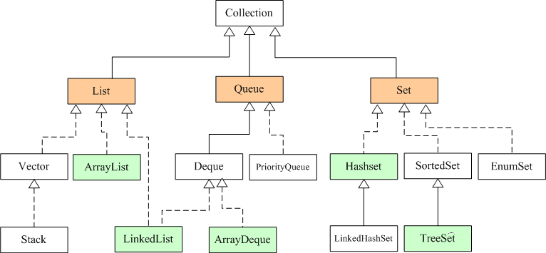
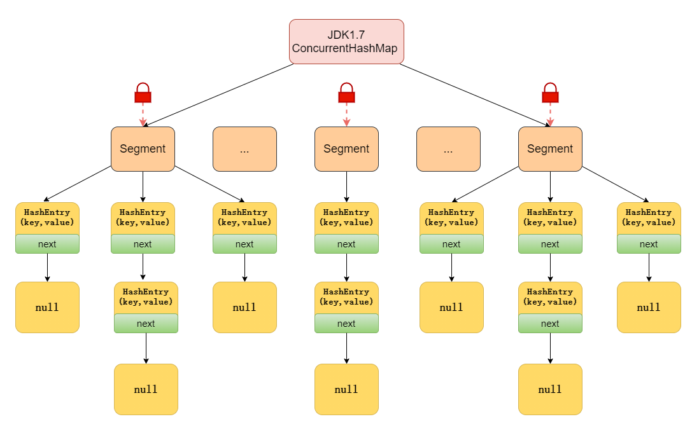

# Java集合面试题

## 常见的集合有哪些？

Java集合类主要由两个根接口**Collection**和**Map**派生出来的，Collection派生出了三个子接口：List、Set、Queue（Java5新增的队列），因此Java集合大致也可分成List、Set、Queue、Map四种接口体系。

**注意：Collection是一个接口，Collections是一个工具类，Map不是Collection的子接口**。

Java集合框架图如下：




## 线程安全的集合有哪些？线程不安全的呢？

线程安全的：

- Hashtable：比HashMap多了个线程安全。
- ConcurrentHashMap:是一种高效但是线程安全的集合。
- Vector：比Arraylist多了个同步化机制。
- Stack：栈，也是线程安全的，继承于Vector。

线性不安全的：

- HashMap
- Arraylist
- LinkedList
- HashSet
- TreeSet
- TreeMap

## Arraylist与 LinkedList 的区别

- **是否保证线程安全：** ArrayList 和 LinkedList 都是不同步的，也就是不保证线程安全；
- **底层数据结构：** Arraylist 底层使用的是Object数组；LinkedList 底层使用的是双向循环链表数据结构；
- **插入和删除是否受元素位置的影响：** **ArrayList 采用数组存储，所以插入和删除元素的时间复杂度受元素位置的影响。** 比如：执行`add(E e)`方法的时候， ArrayList 会默认在将指定的元素追加到此列表的末尾，这种情况时间复杂度就是O(1)。但是如果要在指定位置 i 插入和删除元素的话（`add(int index, E element)`）时间复杂度就为 O(n-i)。因为在进行上述操作的时候集合中第 i 和第 i 个元素之后的(n-i)个元素都要执行向后位/向前移一位的操作。  **LinkedList 采用链表存储，所以插入，删除元素时间复杂度不受元素位置的影响，都是近似 O（1）而数组为近似 O（n）。**
- **是否支持快速随机访问：** LinkedList 不支持高效的随机元素访问，而ArrayList 实现了RandmoAccess 接口，所以有随机访问功能。快速随机访问就是通过元素的序号快速获取元素对象(对应于`get(int index)`方法)。
- **内存空间占用：** ArrayList的空 间浪费主要体现在在list列表的结尾会预留一定的容量空间，而LinkedList的空间花费则体现在它的每一个元素都需要消耗比ArrayList更多的空间（因为要存放直接后继和直接前驱以及数据）。

**1，底层数据结构的差异**

ArrayList，数组，连续一块内存空间
LinkedList，双向链表，不是连续的内存空间

**2，一个常规的结论**

ArrayList，查找快，因为是连续的内存空间，定位方便，但删除，插入慢，因为需要发生数据迁移
LinkedList，查找慢，因为需要通过指针一个个寻找，但删除，插入快，因为只要改变前后节点的指针指向即可。

## ArrayList的增加操作

- 添加到末尾，正常不需要做特别的处理，除非现有的数组空间不够了，需要扩容

  - **数组初始化容量多大？10**，当你知道需要存储多少数据时，建议在创建的时候，直接设置初始化大小

  - 怎么扩容？

    - 当发现容量不够之后，就进行扩容
    - **按原先数组容量的1.5倍进行扩容**，位运算，下面是关键的源码

    ```
    int oldCapacity = elementData.length;
    int newCapacity = oldCapacity + (oldCapacity >> 1);
    ```

    - 再将原先数组的元素复制到新数组，Arrays

    ```
    elementData = Arrays.copyOf(elementData, newCapacity)
    ```

- 添加到其他位置，这个时候需要做整体的搬迁

## ArrayList的删除操作

- 删除末尾，并不需要迁移
- 删除其他的位置，这个时候也需要搬迁

## ArrayList的修改操作

- 修改之前，必须先定位
- 根据定位-查找-ArrayList（数组是一段连续的内存空间，定位会特别快）
- 但是，**根据内容查找，则依然需要遍历**

## 如何设计一个双向链表？

```java
//Node节点的定义：内部类
private static class Node<E> {
    E item;
    Node<E> next;
    Node<E> prev;
    Node(Node<E> prev, E element, Node<E> next) {
        this.item = element;
        this.next = next;
        this.prev = prev;
    }
}
```

其实LinkedList内部定位到最前面和最后面，速度很快，提供了的两个引用（first，last）

添加到末尾，创建一个新的节点，将之前的last节点设置为新节点的pre，新节点设置为last

我们看下源码：

```java
void linkLast(E e) {
    //获取到最后一个节点
    final Node<E> l = last;
    //构建一个新节点，将当前的last作为这个新节点的pre
    final Node<E> newNode = new Node<>(l, e, null);
    //把last指向新节点
    last = newNode;
    //如果原先没有最后一个节点
    if (l == null)
        //将first指向新节点
        first = newNode;
    else
        //否则，将原先的last的next指向新节点
        l.next = newNode;
    size++;
    modCount++;
}

```

添加到其他位置，这个时候，就需要调整前后节点的引用指向

修改最后一个节点或者第一个节点，那么就很快（first，last）

修改其他位置，如果是按坐标来定位节点，则会按照二分查找法，源码如下：

```java
if (index < (size >> 1)) {
    Node<E> x = first;
    for (int i = 0; i < index; i++)
        x = x.next;
    return x;
} else {
    Node<E> x = last;
    for (int i = size - 1; i > index; i--)
        x = x.prev;
    return x;
}
```

如果是按节点的内容进行定位，则需要遍历！

## ArrayList 与 Vector 区别？

ArrayList

1、实现原理：采**用动态对象数组实现，默认构造方法创建了一个空数组**

2、**第一次添加元素，扩展容量为10，之后的扩充算法：原来数组大小+原来数组的一半**

3、当插入、删除位置比较靠前时，与链表比较，不适合进行删除或插入操作

4、**为了防止数组动态扩充次数过多，建议创建ArrayList时，给定初始容量**

5、**多线程中使用不安全，适合在单线程访问时使用，效率较高**

Vector

1、实现原理：采用动态数组对象实现，默认构造方法创建了一个大小为10的对象数组

2、扩充的算法：当增量为0时，扩充为原来的2倍，当增量大于0时，扩充为原来大小+增量

3、当插入、删除位置比较靠前时，与链表比较，不适合删除或插入操作

4、为了防止数组动态扩充次数过多，建议创建Vector时，给定初始容量

5、线程安全，适合在多线程访问时使用，效率较低

**集合的使用注意：**
**若使用集合来存储多个不同类型的元素（对象），那么在处理时会比较麻烦，在实际开发中不建议这样使用，我们应该在一个集合中存储相同的类型对象**

## 说一说ArrayList 的扩容机制？

ArrayList扩容的本质就是计算出新的扩容数组的size后实例化，并将原有数组内容复制到新数组中去。**默认情况下，新的容量会是原容量的1.5倍**。

以JDK1.8为例说明:

```java
public boolean add(E e) {
    //判断是否可以容纳e，若能，则直接添加在末尾；若不能，则进行扩容，然后再把e添加在末尾
    ensureCapacityInternal(size + 1);  // Increments modCount!!
    //将e添加到数组末尾
    elementData[size++] = e;
    return true;
}

// 每次在add()一个元素时，arraylist都需要对这个list的容量进行一个判断。通过ensureCapacityInternal()方法确保当前ArrayList维护的数组具有存储新元素的能力，经过处理之后将元素存储在数组elementData的尾部

private void ensureCapacityInternal(int minCapacity) {
      ensureExplicitCapacity(calculateCapacity(elementData, minCapacity));
}

private static int calculateCapacity(Object[] elementData, int minCapacity) {
    //如果传入的是个空数组则最小容量取默认容量与minCapacity之间的最大值
    if (elementData == DEFAULTCAPACITY_EMPTY_ELEMENTDATA) {
        return Math.max(DEFAULT_CAPACITY, minCapacity);
    }
    return minCapacity;
}
    
private void ensureExplicitCapacity(int minCapacity) {
    modCount++;
    // 若ArrayList已有的存储能力满足最低存储要求，则返回add直接添加元素；如果最低要求的存储能力>ArrayList已有的存储能力，这就表示ArrayList的存储能力不足，因此需要调用 grow();方法进行扩容
    if (minCapacity - elementData.length > 0)
        grow(minCapacity);
}


private void grow(int minCapacity) {
        // 获取elementData数组的内存空间长度
        int oldCapacity = elementData.length;
        // 扩容至原来的1.5倍
        int newCapacity = oldCapacity + (oldCapacity >> 1);
        //校验容量是否够
        if (newCapacity - minCapacity < 0)
            newCapacity = minCapacity;
        //若预设值大于默认的最大值，检查是否溢出
        if (newCapacity - MAX_ARRAY_SIZE > 0)
            newCapacity = hugeCapacity(minCapacity);
        // 调用Arrays.copyOf方法将elementData数组指向新的内存空间
         //并将elementData的数据复制到新的内存空间
        elementData = Arrays.copyOf(elementData, newCapacity);
    }
```

## Array 和 ArrayList 有什么区别？什么时候该应 Array 而不是 ArrayList 呢？

* Array 可以包含基本类型和对象类型，ArrayList 只能包含对象类型。

* Array 大小是固定的，ArrayList 的大小是动态变化的。

* ArrayList 提供了更多的方法和特性，比如：addAll()，removeAll()，iterator() 等等。


## HashMap的底层数据结构是什么？

在JDK1.7 和JDK1.8 中有所差别：

在JDK1.7 中，由“数组+链表”组成，数组是 HashMap 的主体，链表则是主要为了解决哈希冲突而存在的。

在JDK1.8 中，由“数组+链表+红黑树”组成。当链表过长，则会严重影响 HashMap 的性能，红黑树搜索时间复杂度是 O(logn)，而链表是糟糕的 O(n)。因此，JDK1.8 对数据结构做了进一步的优化，引入了红黑树，链表和红黑树在达到一定条件会进行转换：

* **当链表超过 8 且数据总量超过 64 才会转红黑树。**

* **将链表转换成红黑树前会判断，如果当前数组的长度小于 64，那么会选择先进行数组扩容，而不是转换为红黑树，以减少搜索时间。**


## 为什么在解决 hash 冲突的时候，不直接用红黑树？而选择先用链表，再转红黑树?

因为红黑树需要进行左旋，右旋，变色这些操作来保持平衡，而单链表不需要。当元素小于 8 个的时候，此时做查询操作，链表结构已经能保证查询性能。当元素大于 8 个的时候， 红黑树搜索时间复杂度是 O(logn)，而链表是 O(n)，此时需要红黑树来加快查询速度，但是新增节点的效率变慢了。

因此，如果一开始就用红黑树结构，元素太少，新增效率又比较慢，无疑这是浪费性能的。

## HashMap中不用红黑树，用二叉查找树可以么?

可以。但是二叉查找树在特殊情况下会变成一条线性结构（这就跟原来使用链表结构一样了，造成很深的问题），遍历查找会非常慢。

## HashMap中为什么链表改为红黑树的阈值是 8?

是因为泊松分布，我们来看作者在源码中的注释：

```java
 Because TreeNodes are about twice the size of regular nodes, we
 use them only when bins contain enough nodes to warrant use
 (see TREEIFY_THRESHOLD). And when they become too small (due to
 removal or resizing) they are converted back to plain bins.  In
 usages with well-distributed user hashCodes, tree bins are
 rarely used.  Ideally, under random hashCodes, the frequency of
 nodes in bins follows a Poisson distribution
 (http://en.wikipedia.org/wiki/Poisson_distribution) with a
 parameter of about 0.5 on average for the default resizing
 threshold of 0.75, although with a large variance because of
 resizing granularity. Ignoring variance, the expected
 occurrences of list size k are (exp(-0.5) pow(0.5, k) /
 factorial(k)). The first values are:
 0:    0.60653066
 1:    0.30326533
 2:    0.07581633
 3:    0.01263606
 4:    0.00157952
 5:    0.00015795
 6:    0.00001316
 7:    0.00000094
 8:    0.00000006
 more: less than 1 in ten million
```

翻译过来大概的意思是：理想情况下使用随机的哈希码，容器中节点分布在 hash 桶中的频率遵循[泊松分布](http://en.wikipedia.org/wiki/Poisson_distribution)，按照泊松分布的计算公式计算出了桶中元素个数和概率的对照表，可以看到链表中元素个数为 8 时的概率已经非常小，再多的就更少了，所以原作者在选择链表元素个数时选择了 8，是根据概率统计而选择的。

## 解决hash冲突的办法有哪些？HashMap用的哪种？

解决Hash冲突方法有:开放定址法、再哈希法、链地址法（拉链法）、建立公共溢出区。**HashMap中采用的是 链地址法 。**

* 开放定址法也称为`再散列法`，基本思想就是，如果`p=H(key)`出现冲突时，则以`p`为基础，再次hash，`p1=H(p)`,如果p1再次出现冲突，则以p1为基础，以此类推，直到找到一个不冲突的哈希地址`pi`。 因此开放定址法所需要的hash表的长度要大于等于所需要存放的元素，而且因为存在再次hash，所以`只能在删除的节点上做标记，而不能真正删除节点。`
* 再哈希法(双重散列，多重散列)，提供多个不同的hash函数，当`R1=H1(key1)`发生冲突时，再计算`R2=H2(key1)`，直到没有冲突为止。 这样做虽然不易产生堆集，但增加了计算的时间。
* 链地址法(拉链法)，将哈希值相同的元素构成一个同义词的单链表,并将单链表的头指针存放在哈希表的第i个单元中，查找、插入和删除主要在同义词链表中进行。链表法适用于经常进行插入和删除的情况。
* 建立公共溢出区，将哈希表分为公共表和溢出表，当溢出发生时，将所有溢出数据统一放到溢出区。

## HashMap默认加载因子是多少？为什么是 0.75，不是 0.6 或者 0.8 ？

回答这个问题前，我们来先看下HashMap的默认属性：

```java
int threshold;             // 容纳键值对的最大值
final float loadFactor;    // 负载因子
int modCount;  
int size;  
```

**Node[] table的初始化长度length(默认值是16)，Load factor为负载因子(默认值是0.75)**，threshold是HashMap所能容纳键值对的最大值。threshold = length * Load factor。也就是说，在数组定义好长度之后，负载因子越大，所能容纳的键值对个数越多。

默认的loadFactor是0.75，0.75是对空间和时间效率的一个平衡选择，一般不要修改，除非在时间和空间比较特殊的情况下 ：

* 如果内存空间很多而又对时间效率要求很高，可以降低负载因子Load factor的值 。

* 相反，如果内存空间紧张而对时间效率要求不高，可以增加负载因子loadFactor的值，这个值可以大于1。

我们来追溯下作者在源码中的注释（JDK1.7）：

```java
As a general rule, the default load factor (.75) offers a good tradeoff between time and space costs. Higher values decrease the space overhead but increase the lookup cost (reflected in most of the operations of the HashMap class, including get and put). The expected number of entries in the map and its load factor should be taken into account when setting its initial capacity, so as to minimize the number of rehash operations. If the initial capacity is greater than the maximum number of entries divided by the load factor, no rehash operations will ever occur.
```

翻译过来大概的意思是：作为一般规则，默认负载因子（0.75）在时间和空间成本上提供了很好的折衷。较高的值会降低空间开销，但提高查找成本（体现在大多数的HashMap类的操作，包括get和put）。设置初始大小时，应该考虑预计的entry数在map及其负载系数，并且尽量减少rehash操作的次数。如果初始容量大于最大条目数除以负载因子，rehash操作将不会发生。

## HashMap 中  key 的存储索引是怎么计算的？

首先根据key的值计算出hashcode的值，然后根据hashcode计算出hash值，最后通过hash&（length-1）计算得到存储的位置。看看源码的实现：

```java
// jdk1.7
方法一：
static int hash(int h) {
    int h = hashSeed;
        if (0 != h && k instanceof String) {
            return sun.misc.Hashing.stringHash32((String) k);
        }

    h ^= k.hashCode(); // 为第一步：取hashCode值
    h ^= (h >>> 20) ^ (h >>> 12); 
    return h ^ (h >>> 7) ^ (h >>> 4);
}
方法二：
static int indexFor(int h, int length) {  //jdk1.7的源码，jdk1.8没有这个方法，但实现原理一样
     return h & (length-1);  //第三步：取模运算
}
```

```java
// jdk1.8
static final int hash(Object key) {   
     int h;
     return (key == null) ? 0 : (h = key.hashCode()) ^ (h >>> 16);
    /* 
     h = key.hashCode() 为第一步：取hashCode值
     h ^ (h >>> 16)  为第二步：和高位进行异或运算
    */
}

```

这里的 Hash 算法本质上就是三步：**取key的 hashCode 值、根据 hashcode 计算出hash值、通过与计算下标**。其中，JDK1.7和1.8的不同之处，就在于第二步。我们来看下详细过程，以JDK1.8为例，n为table的长度。


## JDK1.8 中HashMap的Key的计算为什么要 hashcode 异或其右移十六位的值？

因为在JDK 1.7 中扰动了 4 次，计算 hash 值的性能会稍差一点点。 从速度、功效、质量来考虑，JDK1.8 优化了高位运算的算法，通过hashCode()的高16位异或低16位实现：(h = k.hashCode()) ^ (h >>> 16)。这么做可以在数组 table 的 length 比较小的时候，也能保证考虑到高低Bit都参与到Hash的计算中，同时不会有太大的开销。

计算 key.hashCode() 并将哈希的较高位传播（XOR）到较低位。 由于该表使用二次幂掩码，因此仅在当前掩码之上位变化的散列集将始终发生冲突。 （已知的例子是在小表中保存连续整数的 Float 键集。）因此，我们应用了一种变换，将高位的影响向下传播。 **在位扩展的速度、实用性和质量之间存在折衷。** 因为许多常见的散列集已经合理分布（所以不要从传播中受益），并且因为**我们使用树来处理 bin 中的大量冲突，我们只是以最便宜的方式对一些移位的位进行异或，以减少系统损失， 以及合并最高位的影响，否则由于表边界，这些最高位将永远不会用于索引计算。**

## JDK1.7 中HashMap的Key的计算为什么 hash 值要与length-1相与？

- 把 hash 值对数组长度取模运算，模运算的消耗很大，没有位运算快。
- **当 length 总是 2 的n次方时，h& (length-1) 运算等价于对length取模，也就是 h%length，但是 & 比 % 具有更高的效率。**

## HashMap数组的长度为什么是 2 的幂次方？

这样做效果上与运算等同于取模，在速度、效率上与运算比直接取模要快得多。除此之外，2 的 N 次幂有助于减少碰撞的几率。如果 length 为2的幂次方，则 length-1 转化为二进制必定是11111……的形式，在与h的二进制与操作效率会非常的快，而且空间不浪费。我们来举个例子，看下图：


当 length =15时，6 和 7 的结果一样，这样表示他们在 table 存储的位置是相同的，也就是产生了碰撞，6、7就会在一个位置形成链表，4和5的结果也是一样，这样就会导致查询速度降低。

如果我们进一步分析，还会发现空间浪费非常大，以 length=15 为例，在 1、3、5、7、9、11、13、15 这八处没有存放数据。因为hash值在与14（即 1110）进行&运算时，得到的结果最后一位永远都是0，即 0001、0011、0101、0111、1001、1011、1101、1111位置处是不可能存储数据的。

**补充数组容量计算的小奥秘**

**HashMap 构造函数允许用户传入的容量不是  2  的  n  次方，因为它可以自动地将传入的容量转换为  2  的  n 次方。****会取大于或等于这个数的 且最近的2次幂作为 table 数组的初始容量**，使用` tableSizeFor(int) `方法，如 tableSizeFor(10) = 16（2 的 4 次幂），tableSizeFor(20) = 32（2 的 5 次幂），也就是说 table 数组的长度总是 2 的次幂。JDK1.8 源码如下：

```java
static final int tableSizeFor(int cap) {
        int n = cap - 1;
        n |= n >>> 1;
        n |= n >>> 2;
        n |= n >>> 4;
        n |= n >>> 8;
        n |= n >>> 16;
        return (n < 0) ? 1 : (n >= MAXIMUM_CAPACITY) ? MAXIMUM_CAPACITY : n + 1;
    }
/*
解释：位或( | )
int n = cap - 1;　让cap-1再赋值给n的目的是另找到的目标值大于或等于原值。例如二进制1000，十进制数值为8。如果不对它减1而直接操作，将得到答案10000，即16。显然不是结果。减1后二进制为111，再进行操作则会得到原来的数值1000，即8。
*/
```

## HashMap 的put方法流程？

简要流程如下：

1. 首先根据 key 的值计算 hash 值，找到该元素在数组中存储的下标；

2. 如果数组是空的，则调用 resize 进行初始化；

3. 如果没有哈希冲突直接放在对应的数组下标里；

4. 如果冲突了，且 key 已经存在，就覆盖掉 value；

5. 如果冲突后，发现该节点是红黑树，就将这个节点挂在树上；

6. 如果冲突后是链表，判断该链表是否大于 8 ，如果大于 8 并且数组容量小于 64，就进行扩容；如果链表节点大于 8 并且数组的容量大于 64，则将这个结构转换为红黑树；否则，链表插入键值对，若 key 存在，就覆盖掉 value。

   

## JDK1.7 和1.8 的put方法区别是什么？

区别在两处：

- 解决哈希冲突时，JDK1.7 只使用链表，JDK1.8 使用链表+红黑树，当满足一定条件，链表会转换为红黑树。

- 链表插入元素时，JDK1.7 使用头插法插入元素，在多线程的环境下有可能导致环形链表的出现，扩容的时候会导致死循环。因此，JDK1.8使用尾插法插入元素，在扩容时会保持链表元素原本的顺序，就不会出现链表成环的问题了，但JDK1.8 的 HashMap 仍然是线程不安全的，具体原因会在另一篇文章分析。

## HashMap 的扩容方式？

HashMap 在容量超过负载因子所定义的容量之后，就会扩容。Java 里的数组是无法自动扩容的，方法是将 HashMap 的大小扩大为原来数组的两倍，并将原来的对象放入新的数组中。

那扩容的具体步骤是什么？让我们看看源码。

- 先来看下JDK1.7 的代码：

```java
void resize(int newCapacity) {   //传入新的容量
    Entry[] oldTable = table;    //引用扩容前的Entry数组
    int oldCapacity = oldTable.length;
    if (oldCapacity == MAXIMUM_CAPACITY) {  //扩容前的数组大小如果已经达到最大(2^30)了
        threshold = Integer.MAX_VALUE; //修改阈值为int的最大值(2^31-1)，这样以后就不会扩容了
        return;
    }

    Entry[] newTable = new Entry[newCapacity];  //初始化一个新的Entry数组
    transfer(newTable);                         //！！将数据转移到新的Entry数组里
    table = newTable;                           //HashMap的table属性引用新的Entry数组
    threshold = (int)(newCapacity * loadFactor);//修改阈值
}
```

这里就是使用一个容量更大的数组来代替已有的容量小的数组，transfer()方法将原有Entry数组的元素拷贝到新的Entry数组里。

```java
void transfer(Entry[] newTable) {
    Entry[] src = table;                   //src引用了旧的Entry数组
    int newCapacity = newTable.length;
    for (int j = 0; j < src.length; j++) { //遍历旧的Entry数组
        Entry<K,V> e = src[j];             //取得旧Entry数组的每个元素
        if (e != null) {
            src[j] = null;//释放旧Entry数组的对象引用（for循环后，旧的Entry数组不再引用任何对象）
            do {
                Entry<K,V> next = e.next;
                int i = indexFor(e.hash, newCapacity); //！！重新计算每个元素在数组中的位置
                e.next = newTable[i]; //标记[1]
                newTable[i] = e;      //将元素放在数组上
                e = next;             //访问下一个Entry链上的元素
            } while (e != null);
        }
    }
}
```

newTable[i] 的引用赋给了 e.next ，也就是使用了单链表的头插入方式，同一位置上新元素总会被放在链表的头部位置；这样先放在一个索引上的元素终会被放到 Entry 链的尾部(如果发生了 hash 冲突的话）。

- JDK1.8的优化

  > 扩容在JDK1.8中有什么不一样？

  JDK1.8做了两处优化：

  1. resize 之后，元素的位置在原来的位置，或者原来的位置 +oldCap (原来哈希表的长度）。不需要像 JDK1.7 的实现那样重新计算hash ，只需要看看原来的 hash 值新增的那个bit是1还是0就好了，是0的话索引没变，是1的话索引变成“原索引 + oldCap ”。这个设计非常的巧妙，省去了重新计算 hash 值的时间。

     如下图所示，n 为 table 的长度，图（a）表示扩容前的 key1 和 key2 两种 key 确定索引位置的示例，图（b）表示扩容后 key1 和key2 两种 key 确定索引位置的示例，其中 hash1 是 key1 对应的哈希与高位运算结果。

  元素在重新计算 hash 之后，因为 n 变为 2倍，那么 n-1 的 mask 范围在高位多 1 bit(红色)，因此新的index就会发生这样的变化：

  

  2. JDK1.7 中 rehash 的时候，旧链表迁移新链表的时候，如果在新表的数组索引位置相同，则链表元素会倒置（头插法）。**JDK1.8 不会倒置，使用尾插法。**

  下图为 16扩充为 32 的 resize 示意图：

  

  感兴趣的小伙伴可以看下 JDK1.8 的 resize 源码：

  ```java
  final Node<K,V>[] resize() {
          Node<K,V>[] oldTab = table;
          int oldCap = (oldTab == null) ? 0 : oldTab.length;
          int oldThr = threshold;
          int newCap, newThr = 0;
          if (oldCap > 0) {
  			// 超过最大值就不再扩充了，就只好随你碰撞去吧
              if (oldCap >= MAXIMUM_CAPACITY) {
                  threshold = Integer.MAX_VALUE;
                  return oldTab;
              }
  			// 没超过最大值，就扩充为原来的2倍
              else if ((newCap = oldCap << 1) < MAXIMUM_CAPACITY &&
                      oldCap >= DEFAULT_INITIAL_CAPACITY)
                  newThr = oldThr << 1; // double threshold
          }
          else if (oldThr > 0) // initial capacity was placed in threshold
              newCap = oldThr;
          else {               // zero initial threshold signifies using defaults
              newCap = DEFAULT_INITIAL_CAPACITY;
              newThr = (int)(DEFAULT_LOAD_FACTOR * DEFAULT_INITIAL_CAPACITY);
          }
  		// 计算新的resize上限
          if (newThr == 0) {
  
              float ft = (float)newCap * loadFactor;
              newThr = (newCap < MAXIMUM_CAPACITY && ft < (float)MAXIMUM_CAPACITY ?
                      (int)ft : Integer.MAX_VALUE);
          }
          threshold = newThr;
          @SuppressWarnings({"rawtypes"，"unchecked"})
          Node<K,V>[] newTab = (Node<K,V>[])new Node[newCap];
          table = newTab;
          if (oldTab != null) {
  			// 把每个bucket都移动到新的buckets中
              for (int j = 0; j < oldCap; ++j) {
                  Node<K,V> e;
                  if ((e = oldTab[j]) != null) {
                      oldTab[j] = null;
                      if (e.next == null)
                          newTab[e.hash & (newCap - 1)] = e;
                      else if (e instanceof TreeNode)
                          ((TreeNode<K,V>)e).split(this, newTab, j, oldCap);
                      else { // 链表优化重hash的代码块
                          Node<K,V> loHead = null, loTail = null;
                          Node<K,V> hiHead = null, hiTail = null;
                          Node<K,V> next;
                          do {
                              next = e.next;
  							// 原索引
                              if ((e.hash & oldCap) == 0) {
                                  if (loTail == null)
                                      loHead = e;
                                  else
                                      loTail.next = e;
                                  loTail = e;
                              }
  							// 原索引+oldCap
                              else {
                                  if (hiTail == null)
                                      hiHead = e;
                                  else
                                      hiTail.next = e;
                                  hiTail = e;
                              }
                          } while ((e = next) != null);
  						// 原索引放到bucket里
                          if (loTail != null) {
                              loTail.next = null;
                              newTab[j] = loHead;
                          }
  						// 原索引+oldCap放到bucket里
                          if (hiTail != null) {
                              hiTail.next = null;
                              newTab[j + oldCap] = hiHead;
                          }
                      }
                  }
              }
          }
          return newTab;
      }
  ```


## 一般用什么作为HashMap的key?

一般用Integer、String 这种不可变类当 HashMap 当 key，而且 String 最为常用。

- 因为字符串是不可变的，所以在它创建的时候 hashcode 就被缓存了，不需要重新计算。这就是 HashMap 中的键往往都使用字符串的原因。
- 因为获取对象的时候要用到 equals() 和 hashCode() 方法，那么键对象正确的重写这两个方法是非常重要的,这些类已经很规范的重写了 hashCode() 以及 equals() 方法。

## HashMap为什么线程不安全？

* 多线程下扩容死循环。JDK1.7中的 HashMap 使用头插法插入元素，在多线程的环境下，扩容的时候有可能导致环形链表的出现，形成死循环。因此，**JDK1.8使用尾插法插入元素，在扩容时会保持链表元素原本的顺序，不会出现环形链表的问题。**
* **多线程的put可能导致元素的丢失。多线程同时执行 put 操作，如果计算出来的索引位置是相同的，那会造成前一个 key 被后一个 key 覆盖，从而导致元素的丢失。此问题在JDK 1.7和 JDK 1.8 中都存在。**
* **put和get并发时，可能导致get为null。线程1执行put时，因为元素个数超出threshold而导致rehash，线程2此时执行get，有可能导致这个问题。此问题在JDK 1.7和 JDK 1.8 中都存在。**

如果多个线程同时访问一个哈希映射，并且至少有一个线程在结构上修改了映射，则必须在外部进行同步。 （**结构修改是添加或删除一个或多个映射的任何操作；仅更改与实例已包含的键关联的值不是结构修改。**）

具体分析可见我的这篇文章：[面试官：HashMap 为什么线程不安全？](https://mp.weixin.qq.com/s?__biz=Mzg4MjUxMTI4NA==&mid=2247484436&idx=1&sn=eb677611e2ba1d10e3eb3ceb825bef02&chksm=cf54d8cff82351d9cb1c6ad49b6df8b7f0eaa7b965e3be5546b449e71ce1ffccf47ae68f7bf7&token=1920060057&lang=zh_CN#rd)

## 还知道哪些hash算法？

Hash函数是指把一个大范围映射到一个小范围，目的往往是为了节省空间，使得数据容易保存。 比较出名的有MurmurHash、MD4、MD5等等。

## HashMap中的key 可以为 Null 吗?

**可以，key 为 Null 的时候，hash算法最后的值以0来计算，也就是放在数组的第一个位置。**

## 用可变类当 HashMap 的 key 有什么问题?

**hashcode 可能发生改变，导致 put 进去的值，无法 get 出。**如下所示

```java
HashMap<List<String>, Object> changeMap = new HashMap<>();
List<String> list = new ArrayList<>();
list.add("hello");
Object objectValue = new Object();
changeMap.put(list, objectValue);
System.out.println(changeMap.get(list));
list.add("hello world");//hashcode发生了改变
System.out.println(changeMap.get(list));
```

输出值如下

```java
java.lang.Object@74a14482
null
```

##  JDK1.7中HashMap多线程下扩容死循环

JDK1.7中的 HashMap 使用头插法插入元素，在多线程的环境下，扩容的时候有可能导致环形链表的出现，形成死循环。**因此，JDK1.8使用尾插法插入元素，在扩容时会保持链表元素原本的顺序，不会出现环形链表的问题。**

下面看看多线程情况下， JDK1.7 扩容死循环问题的分析。


新建一个更大尺寸的hash表，然后把数据从老的hash表中迁移到新的hash表中。重点看下transfer方法：


假设HashMap初始化大小为2，hash算法就是用key mod 表的长度，在mod 2以后都冲突在table[1]这里了。负载因子是 1.5 (默认为 0.75 )，由公式` threshold=负载因子 *  hash表长度`可得，`threshold=1.5 * 2 =3`，size=3，而 size>=threshold 就要扩容，所以 hash表要 resize 成 4。

未resize前的table如下图：


正常的ReHash，得到的结果如下图所示：


我们来看看多线程下的ReHash，假设现在有两个线程同时进行，线程1和线程2，两个线程都会新建新的数组，下面是resize 的过程。

**Step1:**


假设 **线程1** 在执行到`Entry<K,V> next = e.next;`之后，cpu 时间片用完了，被调度挂起，这时**线程1的 e** 指向 节点A，**线程1的 next** 指向节点B。

**线程2**继续执行，


**Step2:**

线程 1 被调度回来执行。

- 先是执行 newTalbe[i] = e;
- 然后是e = next，导致了e指向了节点B，
- 而下一次循环的next = e.next导致了next指向了节点A。


**Step3:**

线程1 接着工作。**把节点B摘下来，放到newTable[i]的第一个，然后把e和next往下移**。


**Step4:** 出现环形链表

e.next = newTable[i] 导致A.next 指向了 节点B，此时的B.next 已经指向了节点A，出现**环形链表**。


如果get一个在此链表中不存在的key时，就会出现死循环了。如 get(11)时，就发生了死循环。

分析见get方法的源码：


for循环中的`e = e.next`永远不会为空，那么，如果get一个在这个链表中不存在的key时，就会出现死循环了。

## HashMap中多线程的put可能导致元素的丢失

**多线程同时执行 put 操作，如果计算出来的索引位置是相同的，那会造成前一个 key 被后一个 key 覆盖，从而导致元素的丢失。此问题在JDK 1.7和 JDK 1.8 中都存在。**

我们来看下JDK 1.8 中 put 方法的部分源码，重点看黄色部分：


我们来演示个例子。

假设线程1和线程2同时执行put，线程1执行put(“1”, “A”)，线程2执行put(“5”, “B”)，hash算法就是用key mod 表的长度，表长度为4，在mod 4 以后都冲突在table[1]这里了。注：下面的例子，只演示了 `#1` 和`#2`代码的情况，其他代码也会出现类似情况。

正常情况下，put完成后，table的状态应该是下图中的任意一个。


下面来看看异常情况，两个线程都执行了`#1`处的`if ((p = tab[i = (n - 1) & hash]) == null)`这句代码。

此时假设线程1 先执行`#2`处的`tab[i] = newNode(hash, key, value, null);`

那么table会变成如下状态：


紧接着线程2 执行`tab[i] = newNode(hash, key, value, null);`

此时table会变成如下状态:


这样一来，元素A就丢失了。

## HashMap中put和get并发时，可能导致get为null

**线程1执行put时，因为元素个数超出threshold而导致rehash，线程2此时执行get，有可能导致这个问题。此问题在JDK 1.7和 JDK 1.8 中都存在。**

我们来看下JDK 1.8 中 resize 方法的部分源码，重点看黄色部分：


在代码`#1`位置，用新计算的容量new了一个新的hash表，`#2`将新创建的空hash表赋值给实例变量table。

注意此时实例变量table是空的，如果此时另一个线程执行get，就会get出null。

## HashMap 和 Hashtable 的区别

- `线程是否安全`： **HashMap 是非线程安全的，HashTable 是线程安全的；**HashTable 内部的方法基本都经过synchronized 修饰。（如果你要保证线程安全的话就使用 ConcurrentHashMap 吧！）；

- `效率`： 因为线程安全的问题，**HashMap 要比 HashTable 效率高一点。**另外，HashTable 基本被淘汰，不要在代码中使用它；

- `对Null key 和Null value的支持`： **HashMap 中，null 可以作为键，这样的键只有一个，可以有一个或多个键所对应的值为 null。但是在 HashTable 中 put 进的键值只要有一个 null，直接抛出 NullPointerException。**

- `初始容量大小和每次扩充容量大小的不同` ： ①创建时如果不指定容量初始值，Hashtable 默认的初始大小为11，之后每次扩充，容量变为原来的2n+1。**HashMap 默认的初始化大小为16。之后每次扩充，容量变为原来的2倍。**②创建时如果给定了容量初始值，那么 Hashtable 会直接使用你给定的大小，而 HashMap 会将其扩充为2的幂次方大小（HashMap 中的tableSizeFor()方法保证，下面给出了源代码）。也就是说 **HashMap 总是使用2的幂作为哈希表的大小**,后面会介绍到为什么是2的幂次方。

- `底层数据结构`： JDK1.8 以后的 HashMap 在解决哈希冲突时有了较大的变化，当链表长度大于阈值（默认为8）时，将链表转化为红黑树，以减少搜索时间。Hashtable 没有这样的机制。

HashMap 中带有初始容量的构造函数：

```java
public HashMap(int initialCapacity, float loadFactor) {
    if (initialCapacity < 0)
        throw new IllegalArgumentException("Illegal initial capacity: " +
                                           initialCapacity);
    if (initialCapacity > MAXIMUM_CAPACITY)
        initialCapacity = MAXIMUM_CAPACITY;
    if (loadFactor <= 0 || Float.isNaN(loadFactor))
        throw new IllegalArgumentException("Illegal load factor: " +
                                           loadFactor);
    this.loadFactor = loadFactor;
    this.threshold = tableSizeFor(initialCapacity);
}
 public HashMap(int initialCapacity) {
    this(initialCapacity, DEFAULT_LOAD_FACTOR);
}
```

下面这个方法保证了 HashMap 总是使用2的幂作为哈希表的大小。

```java
/**
 * Returns a power of two size for the given target capacity.
 */
static final int tableSizeFor(int cap) {
    int n = cap - 1;
    n |= n >>> 1;
    n |= n >>> 2;
    n |= n >>> 4;
    n |= n >>> 8;
    n |= n >>> 16;
    return (n < 0) ? 1 : (n >= MAXIMUM_CAPACITY) ? MAXIMUM_CAPACITY : n + 1;
}
```

## HashMap 和 HashSet区别？

**HashSet 底层就是基于 HashMap 实现的。**（HashSet 的源码非常非常少，因为除了 `clone() `、`writeObject()`、`readObject()`是 HashSet 自己不得不实现之外，其他方法都是直接调用 HashMap 中的方法。

| 实现了Map接口                                          | 实现Set接口                                                  |
| ------------------------------------------------------ | ------------------------------------------------------------ |
| 存储键值对                                             | 仅存储对象                                                   |
| 调用 put() 向map中添加元素                             | 调用 add（）方法向Set中添加元素                              |
| HashMap                                                | HashSet                                                      |
| HashMap使用键（Key）计算Hashcode                       | HashSet使用成员对象来计算hashcode值，对于两个对象来说hashcode可能相同，所以equals()方法用来判断对象的相等性，如果两个对象不同的话，那么返回false |
| HashMap相对于HashSet较快，因为它是使用唯一的键获取对象 | HashSet较HashMap来说比较慢                                   |

补充HashSet的实现：HashSet的底层其实就是HashMap，只不过我们**HashSet是实现了Set接口并且把数据作为K值，而V值一直使用一个相同的虚值来保存**。如源码所示：

```java
// Dummy value to associate with an Object in the backing Map
private static final Object PRESENT = new Object();
public boolean add(E e) {
    return map.put(e, PRESENT)==null;// 调用HashMap的put方法,PRESENT是一个至始至终都相同的虚值
}
```

由于HashMap的K值本身就不允许重复，并且在HashMap中如果K/V相同时，会用新的V覆盖掉旧的V，然后返回旧的V，那么在HashSet中执行这一句话始终会返回一个false，导致插入失败，这样就保证了数据的不可重复性。

## 当有哈希冲突时，HashMap是如何查找并确认元素的？

通过昨天分析get方法应该已经比较清楚了，**如果哈希冲突，还是找到table[index]的第一个Node，如果是红黑树结点，那就按红黑树去查找结点，否则遍历链表，一个一个去比对链表中的key，key一致则找到**。

get源码：

```java
public V get(Object key) {
    Node<K,V> e;
    return (e = getNode(hash(key), key)) == null ? null : e.value;
}

final Node<K,V> getNode(int hash, Object key) {
    Node<K,V>[] tab; Node<K,V> first, e; int n; K k;
    if ((tab = table) != null && (n = tab.length) > 0 &&
        (first = tab[(n - 1) & hash]) != null) {
        if (first.hash == hash && // always check first node
            ((k = first.key) == key || (key != null && key.equals(k))))
            return first;
        if ((e = first.next) != null) {
            if (first instanceof TreeNode)
                return ((TreeNode<K,V>)first).getTreeNode(hash, key);
            do {
                if (e.hash == hash &&
                    ((k = e.key) == key || (key != null && key.equals(k))))
                    return e;
            } while ((e = e.next) != null);
        }
    }
    return null;
}
```

## HashMap的扩容操作是怎么实现的？


**1、** 在jdk1.8中，resize方法是在hashmap中的键值对大于阀值时或者初始化时，就调用resize方法进行扩容；

**2、** 每次扩展的时候，都是扩展2倍；

**3、** 扩展后Node对象的位置要么在原位置，要么移动到原偏移量两倍的位置。

在putVal()中，我们看到在这个函数里面使用到了2次resize()方法，resize()方法表示的在进行第一次初始化时会对其进行扩容，或者当该数组的实际大小大于其临界值值(第一次为12),这个时候在扩容的同时也会伴随的桶上面的元素进行重新分发，这也是JDK1.8版本的一个优化的地方，在1.7中，扩容之后需要重新去计算其Hash值，根据Hash值对其进行分发，但**在1.8版本中，则是根据在同一个桶的位置中进行判断(e.hash & oldCap)是否为0，重新进行hash分配后，该元素的位置要么停留在原始位置，要么移动到原始位置+增加的数组大小这个位置上**

```
final Node < K, V > [] resize() {
    Node < K, V > [] oldTab = table; //oldTab指向hash桶数组
    int oldCap = (oldTab == null) ? 0 : oldTab.length;
    int oldThr = threshold;
    int newCap, newThr = 0;
    if (oldCap > 0) { //如果oldCap不为空的话，就是hash桶数组不为空
        if (oldCap >= MAXIMUM_CAPACITY) { //如果大于最大容量了，就赋值为整数最大的阀值
            threshold = Integer.MAX_VALUE;
            return oldTab; //返回
        } //如果当前hash桶数组的长度在扩容后仍然小于最大容量 并且oldCap大于默认值16
        else if ((newCap = oldCap << 1) < MAXIMUM_CAPACITY && oldCap >= DEFAULT_INITIAL_CAPACITY) newThr = oldThr << 1; // double threshold 双倍扩容阀值threshold
    }
    // 旧的容量为0，但threshold大于零，代表有参构造有cap传入，threshold已经被初始化成最小2的n次幂
    // 直接将该值赋给新的容量
    else if (oldThr > 0) // initial capacity was placed in threshold
        newCap = oldThr;
    // 无参构造创建的map，给出默认容量和threshold 16, 16*0.75
    else { // zero initial threshold signifies using defaults
        newCap = DEFAULT_INITIAL_CAPACITY;
        newThr = (int)(DEFAULT_LOAD_FACTOR * DEFAULT_INITIAL_CAPACITY);
    }
    // 新的threshold = 新的cap * 0.75
    if (newThr == 0) {
        float ft = (float) newCap * loadFactor;
        newThr = (newCap < MAXIMUM_CAPACITY && ft < (float) MAXIMUM_CAPACITY ? (int) ft : Integer.MAX_VALUE);
    }
    threshold = newThr;
    // 计算出新的数组长度后赋给当前成员变量table
    @
    SuppressWarnings({
        "rawtypes", "unchecked"
    })
    Node < K, V > [] newTab = (Node < K, V > []) new Node[newCap]; //新建hash桶数组
    table = newTab; //将新数组的值复制给旧的hash桶数组
    // 如果原先的数组没有初始化，那么resize的初始化工作到此结束，否则进入扩容元素重排逻辑，使其均匀的分散
    if (oldTab != null) {
        // 遍历新数组的所有桶下标
        for (int j = 0; j < oldCap; ++j) {
            Node < K, V > e;
            if ((e = oldTab[j]) != null) {
                // 旧数组的桶下标赋给临时变量e，并且解除旧数组中的引用，否则就数组无法被GC回收
                oldTab[j] = null;
                // 如果e.next==null，代表桶中就一个元素，不存在链表或者红黑树
                if (e.next == null)
                // 用同样的hash映射算法把该元素加入新的数组
                    newTab[e.hash & (newCap - 1)] = e;
                // 如果e是TreeNode并且e.next!=null，那么处理树中元素的重排
                else if (e instanceof TreeNode)
                ((TreeNode < K, V > ) e).split(this, newTab, j, oldCap);
                // e是链表的头并且e.next!=null，那么处理链表中元素重排
                else { // preserve order
                    // loHead,loTail 代表扩容后不用变换下标，见注1
                    Node < K, V > loHead = null, loTail = null;
                    // hiHead,hiTail 代表扩容后变换下标，见注1
                    Node < K, V > hiHead = null, hiTail = null;
                    Node < K, V > next;
                    // 遍历链表
                    do {
                        next = e.next;
                        if ((e.hash & oldCap) == 0) {
                            if (loTail == null)
                            // 初始化head指向链表当前元素e，e不一定是链表的第一个元素，初始化后loHead
                            // 代表下标保持不变的链表的头元素
                                loHead = e;
                            else
                            // loTail.next指向当前e
                                loTail.next = e;
                            // loTail指向当前的元素e
                            // 初始化后，loTail和loHead指向相同的内存，所以当loTail.next指向下一个元素时，
                            // 底层数组中的元素的next引用也相应发生变化，造成lowHead.next.next.....
                            // 跟随loTail同步，使得lowHead可以链接到所有属于该链表的元素。
                            loTail = e;
                        } else {
                            if (hiTail == null)
                            // 初始化head指向链表当前元素e, 初始化后hiHead代表下标更改的链表头元素
                                hiHead = e;
                            else hiTail.next = e;
                            hiTail = e;
                        }
                    } while ((e = next) != null);
                    // 遍历结束, 将tail指向null，并把链表头放入新数组的相应下标，形成新的映射。
                    if (loTail != null) {
                        loTail.next = null;
                        newTab[j] = loHead;
                    }
                    if (hiTail != null) {
                        hiTail.next = null;
                        newTab[j + oldCap] = hiHead;
                    }
                }
            }
        }
    }
    return newTab;
}
```


## JDK 1.8 HashMap 扩容时做了哪些优化？

在 JDK 1.7 中 HashMap 是以数组加链表的形式组成的，JDK 1.8 之后新增了红黑树的组成结构，当链表大于 8 并且容量大于 64 时，链表结构会转换成红黑树结构，即使在hashcode 完全相同极端情况下，由于红黑树的特点，查找某个特定元素，也只需要O(log n)的开销，而如果查找链表，时间复杂度会退化到 O(n)。

## HashMap 是线程安全的吗，为什么不是线程安全的？

通过例子来讲解这个不安全的过程，引用上一篇文章的例子，首先一个长度为8的map<Integer,V>，map已经存了key为1、9的两个值，他们都会在map的table[1]上。

1、首先线程1put一个key=17的值，当程序运行到判断key=9的下一个节点为null准备把key=17的值设置为它的下一个节点时，线程让出资源。

2、此时执行线程2，对mapput一个key=25的数据，这个数据正常作为key=9的next正常插入。

3、线程1再次拿到资源继续执行，设置key=9的next为key=17，这样线程2设置的key=25就被覆盖。

以上的流程示意图如下图：


关键代码在于HashMap的put代码，详解如下图：


## HashMap底层为什么用红黑树实现？

1、红黑树：

**红黑树是一种二叉查找树，但在每个节点增加一个存储位表示节点的颜色，可以是红或黑（非红即黑）。通过对任何一条从根到叶子的路径上各个节点着色的方式的限制，红黑树确保没有一条路径会比其它路径长出两倍，因此，红黑树是一种弱平衡二叉树，相对于要求严格的AVL树来说，它的旋转次数少，所以对于搜索，插入，删除操作较多的情况下，通常使用红黑树。**

性质：

1. **每个节点非红即黑**

2. **根节点是黑的;**

3. **每个叶节点（叶节点即树尾端NULL指针或NULL节点）都是黑的;**

4. **如果一个节点是红色的，则它的子节点必须是黑色的。**

5. **对于任意节点而言，其到叶子点树NULL指针的每条路径都包含相同数目的黑节点;**

2、平衡二叉树（AVL树）：

**红黑树是在AVL树的基础上提出来的。**

**平衡二叉树又称为AVL树，是一种特殊的二叉排序树。其左右子树都是平衡二叉树，且左右子树高度之差的绝对值不超过1。**

**AVL树中所有结点为根的树的左右子树高度之差的绝对值不超过1。**

将二叉树上结点的左子树深度减去右子树深度的值称为平衡因子BF，那么平衡二叉树上的所有结点的平衡因子只可能是-1、0和1。只要二叉树上有一个结点的平衡因子的绝对值大于1，则该二叉树就是不平衡的。

3、红黑树较AVL树的优点：

AVL 树是高度平衡的，频繁的插入和删除，会引起频繁的rebalance，导致效率下降；**红黑树不是高度平衡的，算是一种折中，插入最多两次旋转，删除最多三次旋转。**

**所以红黑树在查找，插入删除的性能都是O(logn)，且性能稳定**。

## 说说List,Set,Map三者的区别？

List(对付顺序的好帮手)： List接口存储一组**不唯一**（可以有多个元素引用相同的对象），**有序**的对象

Set(注重独一无二的性质): **不允许重复**的集合。不会有多个元素引用相同的对象。

Map(用Key来搜索的专家): 使用**键值对存储**。Map会维护与Key有关联的值。**两个Key可以引用相同的对象，但Key不能重复**，典型的Key是String类型，但也可以是任何对象。

## 数组和集合的区别： 

**数组：数组长度固定，只能存储同一元素类型。元素类型可以是基本数据类型或引用类型。**

**集合：集合长度不固定，可以存储多种类型元素。元素类型必须是Object子类，不可以是基本数据类型，但可以是基本数据类型的包装类。**

## List和Set的区别？

- List：有序（**使用LinkedIterator接口**），**按对象进入的顺序保存对象，可重复，允许多个Null元素对象**，可以使用Iterator取出所有元素，在逐一遍历，还**可以使用get(int index)获取指定下标的元素。**

- Set：无序（**使用Iterator接口**），不可重复（**可以通过hashCode()和equals()两个方法来区分**），**最多允许有一个Null元素对象**，取元素时只能用Iterator接口取得所有元素，在逐一遍历各个元素。

## java本身就有数组了，为什么要用ArrayList呢？

原因：原生的数组会有一个特点：你在使用的时候必须要为它创建大小，而ArrayList不用。而在日常开发中，往往我们是不知道要给数组分配多大。如果数组的大小指定多了，内存浪费；如果数组的大小指定少了，装不下。因此我们要使用ArrayList，因为它实现了动态扩容。当我们往ArrayList添加数据时，空间默认值大小是10。如果要添加第11个的话，由于空间不足，此时就会实现扩容。ArrayList扩容源码里这样说道：有个grow()，每一次扩原来的1.5倍。比如说，初始化值是10，那么第11个就会产生扩容，所以就会扩到15（即10*1.5=15）。空间扩完容 之后，会调用arraycopy来对数组进行拷贝（复制数组）。

Vector：Vector的底层数据结构是数组，现在很少用，这里只做了解即可。但是相比于ArrayList，它是线程安全，并且支持扩容，且是直接扩容两倍的。10*2=20

由于现在Vector少用，那么如果是要针对线程安全的List的，有以下两种：

1.使用Collections来将ArrayList来包装一下，变成线程安全【说白了就是直接在外层套synchronized】。

2.在java.util.concurrent包下还有一个类，叫CopyOnWriteArrayList。CopyOnWriteArrayList是一个线程安全的List，底层是通过复制数组的方式来实现的。

## **CopyOnWriteArrayList**的底层原理：

1. ⾸先CopyOnWriteArrayList内部也是通过数组来实现的，在向CopyOnWriteArrayList添加元素时，会复制⼀个新的数组，写操作在新数组上进⾏，读操作在原数组上进⾏。
2. 并且，写操作会加锁，防⽌出现并发写⼊丢失数据的问题。
3. 写操作结束之后会把原数组指向新数组。
4. CopyOnWriteArrayList允许在写操作时来读取数据，⼤⼤提⾼了读的性能，因此适合读多写少的应⽤场景，但是CopyOnWriteArrayList会⽐较占内存，同时可能读到的数据不是实时最新的数据，所以不适合实时性要求很⾼的场景。只能保证最终一致性。

## HashMap中put和get方法的实现？

在put的时候，首先对key做hash运算，计算出该key所在的index，如果没碰撞，直接放到数组中；如果碰撞了，需要判断目前数据结构是链表还是红黑树，根据不同的情况来进行插入。假设key是相同的，则替换到原来的值。最后判断哈希表是否满了（当前哈希表大小*负载因子），如果满了，则扩容。

在get的时候，还是对key做hash运算，计算出该key所在的index，然后判断是否有index冲突。假设没有冲突直接返回，假设有冲突则判断当前数据结构是链表还是红黑树，分别从不同的数据结构中取出。

## 在HashMap中是怎么判断一个元素是否相同的呢？

首先会比较hash值，随后会用运算符和equals()来判断该元素是否相同。说白了就是，**如果只有hash值相同，那说明该元素哈希冲突了，如果hash值和equals()或者都相同，那说明该元素是同一个。**

## HashMap的数据结构是数组+链表/红黑树，那什么情况下才会用到红黑树呢？

**当数组的大小大于64且链表的大小大于8的时候，才会将链表改为红黑树，当红黑树大小为6时，会退化为链表。**这里转红黑树、退化为链表的操作主要出于查询和插入时对性能的考量。

## 介绍一下ConcurrentHashMap

由于**HashMap不是线程安全**，在多线程环境下，HashMap有可能会有数据丢失和获取不了最新数据的问题，比如说：线程Aput进去了，线程Bget不出来。因此如果想要线程安全，那么一般使用ConcurrentHashMap。**ConcurrentHashMap**是线程安全的Map实现类，它在juc包下的。而线程安全的Map实现类除了ConcurrentHashMap，还有一个叫做Hashtable，当然还可以使用Collections来包装出一个线程安全的Map。但是无论是Hashtable还是Collections包装出来的Map都比较低效，因为是直接在外层套synchronize，所以我们一般有线程安全问题考量的，都使用ConcurrentHashMap。**ConcurrentHashMap底层的数据结构是数组+链表/红黑树，它能支持高并发的访问和更新，是线程安全的。**ConcurrentHashMap通过在部分加锁（Lock）和利用CAS算法来实现同步，在get的时候没有加锁，Node都用了volatile给修饰。在扩容时，会给每个线程分配对应的区间，默认是16个。并且为了防止putVal导致数据不一致，会给线程的所负责的区间加锁。

## ConcurrentHashMap的jdk7和jdk8的区别？

1.7：数据结构是 ReentrantLock+Segment+HashEntry。

Segment分段锁 Segment继承了ReentrantLock，锁定操作的Segment，其他的Segment不受影响，并发度为segment个数，可以通过构造函数指定，数组扩容不会影响其他的segment。get方法无需加锁保证，volatile保证。

**1.8：数据结构是 synchronized+CAS+Node+红黑树。**

**查找，替换，赋值操作都使用CAS。锁链表的head节点，不影响其他元素的读写，锁粒度更细，效率更高，扩容时，阻塞所有的读写操作、并发扩容。**

**HashTable和HashMap的区别？**

1）HashMap是线程不安全的，HashMap是Map的一个实现类，是将键映射到值的对象，不允许键值重复，允许空键和空值；由于是非线程安全，HashMap的效率要较HashTable的效率高一些。

2）HashTable是线程安全的一个集合【直接在外套synchronize】，不允许null值作为一个key值或者Value值；

3）HashTable是 sychronized修饰,多个线程访问时不需要自己为它的方法实现同步，而 HashMap在被多个线程访问的时候需要自己为它的方法实现同步;

4）**HashMap更适合于单线程环境，而HashTable适合于多线程环境。但是需要多线程安全的环境，一般不建议使用Hashtable，而是使用ConcurrentHashMap。原因是HashTable是遗留类，内部实现很多没优化和冗余；**

## 可以把List< String >传递给一个接受List< Object >参数的方法吗？

不可以。真这样做的话会导致编译错误。因为List< Object >可以存储任何类型的对象包括String, Integer等等，而List< String >却只能用来存储String。　

```java
List<Object> objectList;
List<String> stringList;
objectList = stringList;  //compilation error incompatible types
```

## Array中可以用泛型吗?

不可以。这也是为什么 Joshua Bloch 在 《Effective Java》一书中建议使用 List 来代替 Array，因为 List 可以提供编译期的类型安全保证，而 Array 却不能。

## 判断ArrayList< String >与ArrayList< Integer >是否相等？

```java
ArrayList<String> a = new ArrayList<String>();
ArrayList<Integer> b = new ArrayList<Integer>();
Class c1 = a.getClass();
Class c2 = b.getClass();
System.out.println(c1 == c2); 
```

**输出的结果是 true。**因为无论对于 ArrayList 还是 ArrayList，它们的 Class 类型都是一直的，都是 ArrayList.class。

那它们声明时指定的 String 和 Integer 到底体现在哪里呢？

**答案是体现在类编译的时候。**当 JVM 进行类编译时，会进行泛型检查，如果一个集合被声明为 String 类型，那么它往该集合存取数据的时候就会对数据进行判断，从而避免存入或取出错误的数据。

## 谈谈HashSet的存储原理

HashSet的存储原理或者工作原理，主要是从如何保证唯一性来说起。

这里面主要有3个问题，需要回答？

第一，为什么要采用Hash算法？有什么优势，解决了什么问题？

第二，所谓哈希表是一张什么表？

第三，HashSet如何保证保存对象的唯一性？会经历一个什么样的运算过程？

大家可以先思考，下面来看解读！

第一，为什么要采用Hash算法？有什么优势，解决了什么问题？

解决的问题是唯一性判断的效率问题，保证为O(1)的复杂度

其存储数据的底层结构采用的是数组

当我们往数组放数据的时候，你如何判断是否唯一？

可以采用遍历的方式，逐个比较，但是这种效率低，尤其是数据很多的情况下，时间复杂度为O(n)

所以，为了解决这个效率低的问题，我们采用新的方式

采用hash算法的关键，是通过调用存储对象的hashcode方法得到一个数值，然后再根据这个数值，经过一通复杂的固定运算规则，得到我们要存储在数组的下标，如果此时计算的下标位置没有其他元素，则直接存储，不用比较，所以最佳的效果可以达到O(1)。

此处，我们只会用到hashCode

但是随着元素的不断添加，就可能出现“哈希冲突”，不同的对象计算出来的hash值是相同的，这个时候，我们就需要比较，才需要用到equals方法

如果equals相同，则不插入，不相等，则形成链表

第二，所谓哈希表是一张什么表？

**本质是一个数组，而且数组的元素是链表**

JDK1.7的版本实现

JDK1.8做了优化

随着元素不断添加，链表可能会越来越长，会优化为红黑树

## 谈谈LinkedHashMap和HashMap的区别

此处，我们好好谈谈HashMap

主要关注几个点：

1，**初始化大小是16**，如果事先知道数据量的大小，建议修改默认初始化大小。 减少扩容次数，提高性能 ，这是我一直会强调的点
2，**最大的装载因子默认是0.75**，**当HashMap中元素个数达到容量的0.75时，就会扩容。 容量是原先的两倍**
3，**HashMap底层采用链表法来解决冲突。** 但是存在一个问题，就是链表也可能会过长，影响性能
于是JDK1.8,对HashMap做了进一步的优化，引入了红黑树。
**当链表长度超过8，且数组容量大于64时，链表就会转换为红黑树**
**当红黑树的节点数量小于6时，会将红黑树转换为链表。**
因为在数据量较小的情况下，红黑树要维护自身平衡，比链表性能没有优势。
这3点非常重要！

其次，**LinkedHashMap就是链表+散列表的结构，其底层采用了Linked双向链表来保存节点的访问顺序，所以保证了有序性。**

## Java 中 LinkedHashMap 和 PriorityQueue 的区别是什么？

**PriorityQueue 保证最高或者最低优先级的的元素总是在队列头部，但是 LinkedHashMap 维持的顺序是元素插入的顺序。当遍历一个 PriorityQueue 时，没有任何顺序保证，但是 LinkedHashMap 可保证遍历顺序是元素插入的顺序。**

## 谈谈ConcurrentHashMap，HashMap，Hashtable的区别

Hashtable是线程安全的，但效率低。
HashMap是线程不安全的，但效率高。
Collections.synchronizedMap()，工具类提供了同步包装器的方法，来返回具有线程安全的集合对象
性能依然有问题。

为解决这样的矛盾问题，所以JDK提供了并发包，来平衡这样的问题（java.util.concurrent）

**ConcurrentHashMap**：

- 兼顾了线程安全和效率的问题

> 分析：HashTable锁了整段数据（用户操作是不同的数据段，依然需要等待）
> 解决方案：把数据分段，执行分段锁（分离锁），核心把锁的范围变小，这样出现并发冲突的概率就变小
> 在保存的时候，计算所存储的数据是属于哪一段，只锁当前这一段

- **注意：分段锁（分离锁）是JDK1.8之前的一种的方案，JDK1.8之后做了优化。**

## JDK1.7跟JDK1.8在ConcurrentHashMap的实现上存在以下区别：

**1，数据结构**

JDK1.7采用链表的方式，而JDK1.8则采用链表+红黑树的方式

**2，发生hash碰撞之后**

JDK1.7发生碰撞之后，会采用链表的方式来解决

JDK1.8发生碰撞之后，默认采用链表，但当链表的长度超过8，且数组容量超过64时，会转换为红黑树存储

**3，保证并发安全**

JDK1.7采用分段锁的方式，而JDK1.8采用CAS和synchronized的组合模式

**4，查询复杂度**

JDK1.7采用链表的方式，时间复杂度为O(n)，而JDK1.8在采用红黑树的方式时，时间复杂度为O(log(n))

**题外话：**

**不过红黑树其实是一种兜底方案，因为当链表数量达到8个的时候，其发生的概率是千万分之几，所以作者考虑到这种极端情况下，需要用红黑树的方式来优化**

## 如何决定使用 HashMap 还是 TreeMap？

对于在 Map 中插入、删除、定位一个元素这类操作，HashMap 是最好的选择，因为相对而言 HashMap 的插入会更快，但如果你要**对一个 key 集合进行有序的遍历，那 TreeMap 是更好的选择。**

## 请你说明一下TreeMap的底层实现？

**TreeMap 的实现就是红黑树数据结构，也就说是一棵自平衡的排序二叉树，这样就可以保证当需要快速检索指定节点。**

**红黑树的插入、删除、遍历时间复杂度都为O(lgN)，所以性能上低于哈希表。**但是**哈希表无法提供键值对的有序输出，红黑树因为是排序插入的，可以按照键的值的大小有序输出。红黑树性质：**

**性质1：每个节点要么是红色，要么是黑色。**

**性质2：根节点永远是黑色的。**

**性质3：所有的叶节点都是空节点（即 null），并且是黑色的。**

**性质4：每个红色节点的两个子节点都是黑色。（从每个叶子到根的路径上不会有两个连续的红色节点）**

**性质5：从任一节点到其子树中每个叶子节点的路径都包含相同数量的黑色节点。**

## 说一下Hashtable的锁机制 ?

**Hashtable是使用Synchronized来实现线程安全的，给整个哈希表加了一把大锁，多线程访问时候，只要有一个线程访问或操作该对象，那其他线程只能阻塞等待需要的锁被释放，在竞争激烈的多线程场景中性能就会非常差！**


## 多线程下安全的操作 HashMap还有其他方法吗？

还可以使用`Collections.synchronizedMap`方法，对方法进行加同步锁

```java
private static class SynchronizedMap<K,V>
        implements Map<K,V>, Serializable {
        private static final long serialVersionUID = 1978198479659022715L;

        private final Map<K,V> m;     // Backing Map
        final Object      mutex;        // Object on which to synchronize

        SynchronizedMap(Map<K,V> m) {
            this.m = Objects.requireNon null (m);
            mutex = this;
        }

        SynchronizedMap(Map<K,V> m, Object mutex) {
            this.m = m;
            this.mutex = mutex;
        }
    // 省略部分代码
    }
```

如果传入的是 HashMap 对象，其实也是对 HashMap 做的方法做了一层包装，里面使用对象锁来保证多线程场景下，线程安全，本质也是对 HashMap 进行全表锁。**在竞争激烈的多线程环境下性能依然也非常差，不推荐使用！**

## Collection框架中实现比较要怎么做？

**第一种，实体类实现Comparable接口，并实现 compareTo(T t) 方法，称为内部比较器。**

**第二种，创建一个外部比较器，这个外部比较器要实现Comparator接口的 compare(T t1, T t2)方法。**

## Iterator 和 ListIterator 有什么区别？

* **遍历。使用Iterator，可以遍历所有集合，如Map，List，Set；但只能在向前方向上遍历集合中的元素。使用ListIterator，只能遍历List实现的对象，但可以向前和向后遍历集合中的元素。**

* **添加元素。Iterator无法向集合中添加元素；而，ListIteror可以向集合添加元素。**

* **修改元素。Iterator无法修改集合中的元素；而，ListIterator可以使用set()修改集合中的元素。**

* **索引。Iterator无法获取集合中元素的索引；而，使用ListIterator，可以获取集合中元素的索引。**

* **Iterator 可以遍历 Set 和 List 集合，而 ListIterator 只能遍历 List。**

  **Iterator 只能单向遍历，而 ListIterator 可以双向遍历（向前/后遍历）。**

  **ListIterator 从 Iterator 接口继承，然后添加了一些额外的功能，比如添加一个元素、替换一个元素、获取前面或后面元素的索引位置。**

## 讲一讲快速失败(fail-fast)和安全失败(fail-safe)

**快速失败（fail—fast）** 

* **在用迭代器遍历一个集合对象时，如果遍历过程中对集合对象的内容进行了修改（增加、删除、修改），则会抛出Concurrent Modification Exception。**
* **原理：迭代器在遍历时直接访问集合中的内容，并且在遍历过程中使用一个 modCount 变量。集合在被遍历期间如果内容发生变化，就会改变modCount的值。每当迭代器使用hashNext()/next()遍历下一个元素之前，都会检测modCount变量是否为expectedmodCount值，是的话就返回遍历；否则抛出异常，终止遍历。**      

* **注意：这里异常的抛出条件是检测到 modCount！=expectedmodCount 这个条件。如果集合发生变化时修改modCount值刚好又设置为了expectedmodCount值，则异常不会抛出。因此，不能依赖于这个异常是否抛出而进行并发操作的编程，这个异常只建议用于检测并发修改的bug。**      

* **场景：java.util包下的集合类都是快速失败的，不能在多线程下发生并发修改（迭代过程中被修改），比如HashMap、ArrayList 这些集合类。**      

**安全失败（fail—safe）**  

* **采用安全失败机制的集合容器，在遍历时不是直接在集合内容上访问的，而是先复制原有集合内容，在拷贝的集合上进行遍历。**      
* **原理：由于迭代时是对原集合的拷贝进行遍历，所以在遍历过程中对原集合所作的修改并不能被迭代器检测到，所以不会触发Concurrent Modification Exception。**      
* **缺点：基于拷贝内容的优点是避免了Concurrent Modification Exception，但同样地，迭代器并不能访问到修改后的内容，即：迭代器遍历的是开始遍历那一刻拿到的集合拷贝，在遍历期间原集合发生的修改迭代器是不知道的。**      
* **场景：java.util.concurrent包下的容器都是安全失败，可以在多线程下并发使用，并发修改，比如：ConcurrentHashMap。**

## ArrayList 与 Vector 区别呢?为什么要用Arraylist取代Vector呢？

线程安全：**Vector 使用了 Synchronized 来实现线程同步，是线程安全的，而 ArrayList 是非线程安全的。**

性能：**ArrayList 在性能方面要优于 Vector。**

扩容：**ArrayList 和 Vector 都会根据实际的需要动态的调整容量，只不过在 Vector 扩容每次会增加 1 倍，而 ArrayList 只会增加 50%。**

## 阐述ArrayList、Vector、LinkedList的存储性能和特性

1、**ArrayList采用的是数组形式来保存对象的，这种方式将对象放在连续的位置中，所以最大的缺点就是插入删除时非常麻烦**。

2、**LinkedList采用的将对象存放在独立的空间中，而且在每个空间中保存下一个链接的索引，但是缺点就是查找非常麻烦，要从第一个索引开始**。

3、ArrayList和Vector都是用数组方式存储数据，此数组元素数要大于实际的存储空间以便进行元素增加和插入操作，他们都允许直接用序号索引元素，但是插入数据元素涉及到元素移动等内存操作，所以索引数据快而插入数据慢。

4、**Vector使用了synchronized方法（线程安全），所以在性能上比ArrayList要差些**。

5、**LinkedList使用双向链方式存储数据，按序号索引数据需要向前或向后遍历数据，索引索引数据慢，插入数据时只需要记录前后项即可，所以插入的速度快**。

## LinkedList的实现原理总结如下：

- **数据存储是基于双向链表实现的。**
- **插入数据很快。**先是在双向链表中找到要插入节点的位置index，找到之后，再插入一个新节点。 双向链表查找index位置的节点时，**有一个加速动作：若index < 双向链表长度的1/2，则从前向后查找; 否则，从后向前查找。**
- **删除数据很快。**先是在双向链表中找到要插入节点的位置index，找到之后，进行如下操作：`node.previous.next = node.next;node.next.previous = node.previous;node = null `。查找节点过程和插入一样。
- **获取数据很慢**，需要从Head节点进行查找。
- **遍历数据很慢**，每次获取数据都需要从头开始。

## LinkedHashMap 的实现原理?

LinkedHashMap 也是基于 HashMap 实现的,不同的是它定义了一个 Entry header,这个 header 不是放在 Table 里,它是额外独立出来的。LinkedHashMap 通过继承 hashMap 中的 Entry, 并添加两个属性 Entry before,after, 和 header 结合起来组成一个双向链表,来实现按插入顺序或访问顺序排序。LinkedHashMap 定义了排序模式 accessOrder,该属性为 boolean 型变量,对于访问顺序,为 true;对于插入顺序,则为 false。一般情况下,不必指定排序模式,其迭代顺序即为默认为插入顺序。

## 为什么集合类没有实现 Cloneable 和 Serializable 接口?

克隆 (cloning) 或者是序列化 (serialization) 的语义和含义是跟具体的实现相关的。

因此,应该 由集合类的具体实现来决定如何被克隆或者是序列化。

## 什么是迭代器 Iterator?

Iterator 接口提供了很多对集合元素进行迭代的方法。每一个集合类都包含了可以返回迭代 器实例的迭代方法。迭代器可以在迭代的过程中删除底层集合的元素, 但是不可以直接调用集合的 remove(Object Obj) 删除,可以通过迭代器的 remove() 方法删除。

## ConcurrentHashMap 的实现原理是什么？ 

ConcurrentHashMap  在 JDK1.7 和 JDK1.8  的实现方式是不同的。

**先来看下JDK1.7**

JDK1.7中的ConcurrentHashMap  是由 `Segment` 数组结构和 `HashEntry` 数组结构组成，即ConcurrentHashMap 把哈希桶切分成小数组（Segment ），每个小数组有 n 个 HashEntry 组成。

其中，Segment 继承了 ReentrantLock，所以 Segment 是一种可重入锁，扮演锁的角色；HashEntry 用于存储键值对数据。



首先将数据分为一段一段的存储，然后给每一段数据配一把锁，当一个线程占用锁访问其中一个段数据时，其他段的数据也能被其他线程访问，能够实现真正的并发访问。

**再来看下JDK1.8**

在数据结构上， JDK1.8  中的ConcurrentHashMap  选择了与 HashMap 相同的**数组+链表+红黑树**结构；**在锁的实现上，抛弃了原有的 Segment 分段锁，采用` CAS + synchronized `实现更加低粒度的锁。**

**将锁的级别控制在了更细粒度的哈希桶元素级别**，也就是说**只需要锁住这个链表头结点（红黑树的根节点），就不会影响其他的哈希桶元素的读写，大大提高了并发度。**


## ConcurrentHashMap  的 put 方法执行逻辑是什么？

**先来看JDK1.7**

首先，会尝试获取锁，如果获取失败，利用自旋获取锁；如果自旋重试的次数超过 64 次，则改为阻塞获取锁。

获取到锁后：

1. 将当前 Segment 中的 table 通过 key 的 hashcode 定位到 HashEntry。
2. 遍历该 HashEntry，如果不为空则判断传入的 key 和当前遍历的 key 是否相等，相等则覆盖旧的 value。
3. 不为空则需要新建一个 HashEntry 并加入到 Segment 中，同时会先判断是否需要扩容。
4. 释放 Segment 的锁。

**再来看JDK1.8**

大致可以分为以下步骤：

1. 根据 key 计算出 hash值。
2. 判断是否需要进行初始化。
3. 定位到 Node，拿到首节点 f，判断首节点 f：
   * 如果为  null  ，则通过cas的方式尝试添加。
   * 如果为 `f.hash = MOVED = -1` ，说明其他线程在扩容，参与一起扩容。
   * 如果都不满足 ，synchronized 锁住 f 节点，判断是链表还是红黑树，遍历插入。
4. 当在链表长度达到8的时候，数组扩容或者将链表转换为红黑树。

源码分析可看这篇文章：[面试 ConcurrentHashMap ，看这一篇就够了！](https://mp.weixin.qq.com/s?__biz=Mzg4MjUxMTI4NA==&mid=2247484715&idx=1&sn=f5c3ad8e66122531a1c77efcb9cb50b7&chksm=cf54d9f0f82350e637a51fa8bc679f6197d15e4c9703aac971150bfcc5437e867c3bcf3f409c&token=1920060057&lang=zh_CN#rd)

## ConcurrentHashMap 的 get 方法是否要加锁，为什么？

get 方法不需要加锁。因为 Node 的元素 val 和指针 next 是用 volatile 修饰的，在多线程环境下线程A修改结点的val或者新增节点的时候是对线程B可见的。

这也是它比其他并发集合比如 Hashtable、用 Collections.synchronizedMap()包装的 HashMap 安全效率高的原因之一。

```java
static class Node<K,V> implements Map.Entry<K,V> {
    final int hash;
    final K key;
    //可以看到这些都用了volatile修饰
    volatile V val;
    volatile Node<K,V> next;
}
```

## ConcurrentHashMap 的get方法不需要加锁与volatile修饰的哈希桶有关吗？

没有关系。哈希桶`table`用volatile修饰主要是保证在数组扩容的时候保证可见性。

```java
static final class Segment<K,V> extends ReentrantLock implements Serializable {

    // 存放数据的桶
    transient volatile HashEntry<K,V>[] table;
```

## ConcurrentHashMap  不支持 key 或者 value 为  null  的原因？

我们先来说value 为什么不能为 null ，因为`ConcurrentHashMap `是用于多线程的 ，如果`map.get(key)`得到了 null ，无法判断，是映射的value是 null ，还是没有找到对应的key而为 null ，这就有了二义性。

而用于单线程状态的`HashMap`却可以用`containsKey(key)` 去判断到底是否包含了这个 null 。

我们用**反证法**来推理：

假设ConcurrentHashMap 允许存放值为 null 的value，这时有A、B两个线程，线程A调用ConcurrentHashMap .get(key)方法，返回为 null ，我们不知道这个 null 是没有映射的 null ，还是存的值就是 null 。

假设此时，返回为 null 的真实情况是没有找到对应的key。那么，我们可以用ConcurrentHashMap .containsKey(key)来验证我们的假设是否成立，我们期望的结果是返回false。

但是在我们调用ConcurrentHashMap .get(key)方法之后，containsKey方法之前，线程B执行了ConcurrentHashMap .put(key, null )的操作。那么我们调用containsKey方法返回的就是true了，这就与我们的假设的真实情况不符合了，这就有了二义性。

至于ConcurrentHashMap 中的key为什么也不能为 null 的问题，源码就是这样写的，哈哈。如果面试官不满意，就回答因为作者Doug不喜欢 null ，所以在设计之初就不允许了 null 的key存在。想要深入了解的小伙伴，可以看这篇文章[这道面试题我真不知道面试官想要的回答是什么](https://mp.weixin.qq.com/s?__biz=MzIxNTQ4MzE1NA==&mid=2247484354&idx=1&sn=80c92881b47a586eba9c633eb78d36f6&chksm=9796d5bfa0e15ca9713ff9dc6e100593e0ef06ed7ea2f60cb984e492c4ed438d2405fbb2c4ff&scene=21#wechat_redirect)

## ConcurrentHashMap 的并发度是多少？

在JDK1.7中，并发度默认是16，这个值可以在构造函数中设置。如果自己设置了并发度，ConcurrentHashMap 会使用大于等于该值的最小的2的幂指数作为实际并发度，也就是比如你设置的值是17，那么实际并发度是32。

## ConcurrentHashMap 迭代器是强一致性还是弱一致性？

与HashMap迭代器是强一致性不同，ConcurrentHashMap 迭代器是弱一致性。

ConcurrentHashMap 的迭代器创建后，就会按照哈希表结构遍历每个元素，但在遍历过程中，内部元素可能会发生变化，如果变化发生在已遍历过的部分，迭代器就不会反映出来，而如果变化发生在未遍历过的部分，迭代器就会发现并反映出来，这就是弱一致性。

这样迭代器线程可以使用原来老的数据，而写线程也可以并发的完成改变，更重要的，这保证了多个线程并发执行的连续性和扩展性，是性能提升的关键。想要深入了解的小伙伴，可以看这篇文章[为什么ConcurrentHashMap 是弱一致的](http://ifeve.com/ConcurrentHashMap -weakly-consistent/)

## ConcurrentHashMap 和Hashtable的效率哪个更高？为什么？

ConcurrentHashMap 的效率要高于Hashtable，因为Hashtable给整个哈希表加了一把大锁从而实现线程安全。而ConcurrentHashMap 的锁粒度更低，在JDK1.7中采用分段锁实现线程安全，在JDK1.8 中采用`CAS+Synchronized`实现线程安全。

## HashMap和TreeMap的区别?

1、HashMap是通过hash值进行快速查找的;HashMap中的元素是没有顺序的;TreeMap中所有的元素都是有某一固定顺序的,如果需要得到一个有序的结果,就应该使用TreeMap;

2、HashMap和TreeMap都是线程不安全的;

3、HashMap继承AbstractMap类;覆盖了hashcode() 和equals() 方法,以确保两个相等的映射返回相同的哈希值;
TreeMap继承SortedMap类;他保持键的有序顺序;

4、HashMap:基于hash表实现的;使用HashMap要求添加的键类明确定义了hashcode()和equals() (可以重写该方法);为了优化HashMap的空间使用,可以调优初始容量和负载因子;

TreeMap:基于红黑树实现的;TreeMap就没有调优选项,因为红黑树总是处于平衡的状态;

5、HashMap:适用于Map插入,删除,定位元素;

TreeMap:适用于按自然顺序或自定义顺序遍历键(key)

## Set 里的元素是不能重复的,那么用什么方法来区分重复与否呢? 是用 == 还是equals()? 它们有何区别?

Set 里的元素是不能重复的,元素重复与否是**使用 equals()** 方法进行判断的。

equals() 和 == 方法决定引用值是否指向同一对象 equals() 在类中被覆盖,为的是当两个分离的对象的内容和类型相配的话,返回真值。

## Java集合的快速失败机制 fail-fast


是java集合的一种错误检测机制，当多个线程对集合进行结构上的改变的操作时，有可能会产生 fail-fast 机制。

**例如：**假设存在两个线程（线程**1、** 线程2），线程1通过Iterator在遍历集合A中的元素，在某个时候线程2修改了集合A的结构（是结构上面的修改，而不是简单的修改集合元素的内容），那么这个时候程序就会抛出 ConcurrentModificationException 异常，从而产生fail-fast机制。

**原因：**迭代器在遍历时直接访问集合中的内容，并且在遍历过程中使用一个 modCount 变量。集合在被遍历期间如果内容发生变化，就会改变modCount的值。每当迭代器使用hashNext()/next()遍历下一个元素之前，都会检测modCount变量是否为expectedmodCount值，是的话就返回遍历；否则抛出异常，终止遍历。

**解决办法：**

**1、** 在遍历过程中，所有涉及到改变modCount值得地方全部加上synchronized。

**2、** 使用CopyOnWriteArrayList来替换ArrayList

## 用过ConcurrentHashMap，讲一下他和HashTable的不同之处？

**1、** HashTable就是实现了HashMap加上了synchronized，而ConcurrentHashMap底层采用分段的数组+链表实现，线程安全

**2、** ConcurrentHashMap通过把整个Map分为N个Segment，可以提供相同的线程安全，但是效率提升N倍，默认提升16倍。

**3、** 并且读操作不加锁，由于HashEntry的value变量是 volatile的，也能保证读取到最新的值。

**4、** Hashtable的synchronized是针对整张Hash表的，即每次锁住整张表让线程独占，ConcurrentHashMap允许多个修改操作并发进行，其关键在于使用了锁分离技术

**5、** 扩容：段内扩容（段内元素超过该段对应Entry数组长度的75%触发扩容，不会对整个Map进行扩容），插入前检测需不需要扩容，有效避免无效扩容

