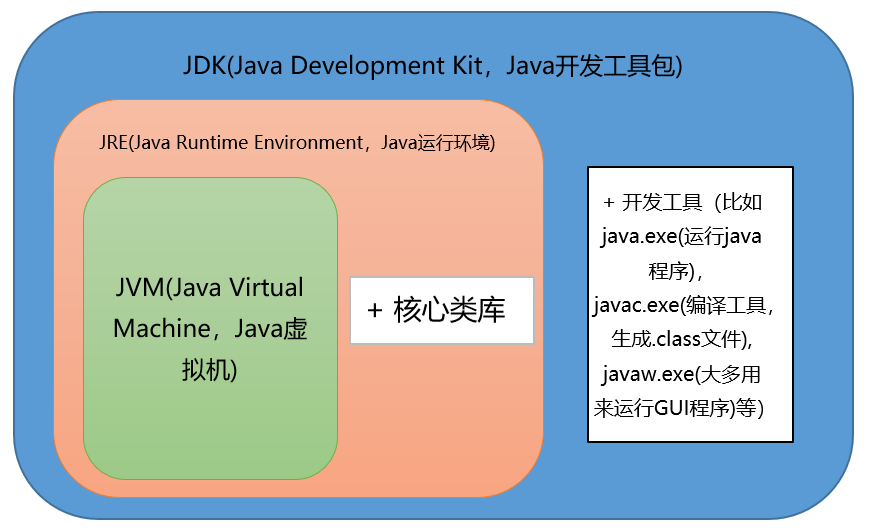
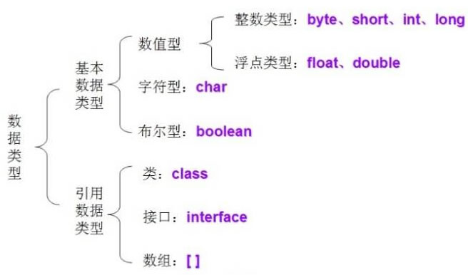

# Java 基础面试题

## Java语言有哪些特点？
* **面向对象（封装，继承，多态）；**
* 平台无关性，平台无关性的具体表现在于，Java 是“一次编写，到处运行（Write Once，Run any Where）”的语言，因此采用 Java 语言编写的程序具有很好的可移植性，而保证这一点的正是 Java 的虚拟机机制。在引入虚拟机之后，Java 语言在不同的平台上运行不需要重新编译。
* 可靠性、安全性；
* 支持多线程。C++ 语言没有内置的多线程机制，因此必须调用操作系统的多线程功能来进行多线程程序设计，而 Java 语言却提供了多线程支持；
* 支持网络编程并且很方便。Java 语言诞生本身就是为简化网络编程设计的，因此 Java 语言不仅支持网络编程而且很方便；
* **编译与解释并存；**

## Java和C++有什么关系，它们有什么区别？
* **都是面向对象的语言，都支持封装、继承和多态；**
* **C++ 支持指针，而 Java 没有指针的概念；**
* **C++ 支持多继承，而 Java 不支持多重继承，但允许一个类实现多个接口；**
* **Java 是完全面向对象的语言**，并且还取消了 C/C++ 中的结构和联合，使编译程序更加简洁；
* **Java 自动进行无用内存回收操作**，不再需要程序员进行手动删除，而 C++ 中必须由程序释放内存资源，这就增加了程序员的负担。
* **Java 不支持操作符重载，操作符重载则被认为是 C++ 的突出特征；**
* **Java 允许预处理，但不支持预处理器功能**，所以为了实现预处理，它提供了引入语句（import），但它与 C++ 预处理器的功能类似；
* **Java 不支持缺省参数函数（给函数参数指定默认值），而 C++ 支持；**
* C 和 C++ 不支持字符串变量，在 C 和 C++ 程序中使用“Null”终止符代表字符串的结束。在 Java 中字符串是用类对象（String 和 StringBuffer）来实现的；
* goto 语句是 C 和 C++ 的“遗物”，Java 不提供 goto 语句，虽然 Java 指定 goto 作为关键字，但不支持它的使用，这使程序更简洁易读；
* **Java 不支持 C++ 中的自动强制类型转换，如果需要，必须由程序显式进行强制类型转换。**

## JVM、JRE和JDK的关系是什么？
- **JDK是Java Development Kit（Java开发工具包）的缩写，它是功能齐全的 Java SDK。它拥有 JRE 所拥有的一切，还有编译器（javac）和工具（如 javadoc 和 jdb）。它能够创建和编译程序。**
- **JRE是Java Runtime Environment（Java运行环境）缩写，它是运行已编译 Java 程序所需的所有内容的集合，包括 Java 虚拟机（JVM），Java 类库，java 命令和其他的一些基础构件。但是，它不能用于创建新程序。**
- **JDK包含JRE，JRE包含JVM。**
  

## **什么是字节码?**

Java之所以可以“一次编译，到处运行”，一是因为JVM针对各种操作系统、平台都进行了定制，二是因为无论在什么平台，都可以编译生成固定格式的字节码（.class文件）供JVM使用。因此，也可以看出字节码对于Java生态的重要性。
之所以被称之为字节码，是因为**字节码文件由十六进制值组成，而JVM以两个十六进制值为一组，即以字节为单位进行读取。**在Java中一般是**用javac命令编译源代码为字节码文件**，一个.java文件从编译到运行的示例如图所示。


## Java采用字节码的好处是什么?
Java语言通过字节码的方式，在一定程度上解决了传统解释型语言执行效率低的问题，同时又保留了解释型语言可移植的特点。所以Java程序运行时比较高效，而且，由于字节码并不专对一种特定的机器，因此，**Java程序无须重新编译便可在多种不同的计算机上运行**。

## Oracle JDK 和 OpenJDK 的区别是什么？
可能在看这个问题之前很多人和我一样并没有接触和使用过 OpenJDK 。下面通过我通过我收集到一些资料对你解答这个被很多人忽视的问题。
* Oracle JDK 版本将每三年发布一次，而 OpenJDK 版本每三个月发布一次；
* OpenJDK 是一个参考模型并且是完全开源的，而 Oracle JDK 是OpenJDK 的一个实现，并不是完全开源的；
* Oracle JDK 比 OpenJDK 更稳定。OpenJDK 和 Oracle JDK 的代码几乎相同，但 Oracle JDK 有更多的类和一些错误修复。因此，**如果您想开发企业/商业软件，建议选择 Oracle JDK，因为它经过了彻底的测试和稳定。**某些情况下，有些人提到在使用 OpenJDK 可能会遇到了许多应用程序崩溃的问题，但是，只需切换到 Oracle JDK 就可以解决问题；
* 在响应性和 JVM 性能方面，Oracle JDK 与 OpenJDK 相比提供了更好的性能；
* Oracle JDK 不会为即将发布的版本提供长期支持，用户每次都必须通过更新到最新版本获得支持来获取最新版本；
* Oracle JDK 根据二进制代码许可协议获得许可，而 OpenJDK 根据 GPLv2 许可获得许可。

## Java有哪些数据类型？
Java 语言的数据类型分为两种：基本数据类型和引用数据类型。

1.基本数据类型包括 boolean（布尔型）、float（单精度浮点型）、char（字符型）、byte（字节型）、short（短整型）、int（整型）、long（长整型）和 double （双精度浮点型）共 8 种，如下表所示。

| 基本类型 | 位数 | 字节 | 默认值  |
| -------- | ---- | ---- | ------- |
| int      | 32   | 4    | 0       |
| short    | 16   | 2    | 0       |
| long     | 64   | 8    | 0L      |
| byte     | 8    | 1    | 0       |
| char     | 16   | 2    | 'u0000' |
| float    | 32   | 4    | 0f      |
| double   | 64   | 8    | 0d      |
| boolean  | 1    |      | false   |

对于 boolean，官方文档未明确定义，它依赖于 JVM 厂商的具体实现。逻辑上理解是占用 1 位，但是实际中会考虑计算机高效存储因素。

**Java虚拟机规范讲到：在JVM中并没有提供boolean专用的字节码指令，而boolean类型数据在经过编译后在JVM中会通过int类型来表示，此时boolean数据4字节32位，而boolean数组将会被编码成Java虚拟机的byte数组，此时每个boolean数据1字节占8bit。**

注意：

1. Java 里使用 long 类型的数据一定要在数值后面加上 **L**，否则将作为整型解析：
2. `char a = 'h'`char :单引号，`String a = "hello"` :双引号

2.引用数据类型建立在基本数据类型的基础上，包括数组、类和接口。引用数据类型是由用户自定义，用来限制其他数据的类型。另外，Java 语言中不支持 C++中的指针类型、结构类型、联合类型和枚举类型。

## Java 基本类型与引用类型的区别？

**基本类型保存原始值，引用类型保存的是引用值（引用值就是指对象在堆中所处的位置/地址）**

## 自动装箱和拆箱是什么

自动装箱是Java 编译器在基本数据类型和对应的对象包装类型之间做的一个转化。

比如：把int转化成 Integer，double转化成 Double，等等。反之就是自动拆箱。

原始类型: boolean，char，byte，short，int，long，float，double 

封装类型：Boolean，Character，Byte，Short，Integer，Long，Float，Double

**装箱：将基本类型用它们对应的引用类型包装起来；**

**拆箱：将包装类型转换为基本数据类型；**

## 字节与字符的区别？

**字节是存储容量的基本单位。**

字符是数字，字母，汉字以及其他语言的各种符号。

**1 字节=8 个二进制单位：一个一个字符由一个字节或多个字节的二进制单位组成。**

## 面向对象和面向过程的区别

**面向过程**：

* 优点：**性能比面向对象高**，因为类调用时需要实例化，开销比较大，比较消耗资源;比如单片机、嵌入式开发、Linux/Unix等一般采用面向过程开发，性能是最重要的因素。

* 缺点：没有面向对象易维护、易复用、易扩展。

**面向对象**：

* 优点：**易维护、易复用、易扩展**，由于面向对象有封装、继承、多态性的特性，可以设计出低耦合的系统，使系统更加灵活、更加易于维护。

* 缺点：性能比面向过程低。

## switch 是否能作用在 byte 上，是否能作用在 long 上，是否能作用在 String 上？

Java5 以前 switch(expr)中，expr 只能是 byte、short、char、int。

从 Java 5 开始，Java 中引入了枚举类型， expr 也可以是 enum 类型。

从 Java 7 开始，expr还可以是字符串(String)，**但是长整型(long)在目前所有的版本中都是不可以的。**

## if_else和switch_case的区别

​      1.if_else:只是单纯地一个接一个比较；if...else每个条件都计算一遍

​     2.switch_case:使用跳转表（底层使用了Binary Tree算法）；绝大部分情况下switch会快一点，除非是if-else的第一个条件就为true编译器编译switch与编译if...else...不同。不管有多少case，都直接跳转到对应位置，不需逐个比较查询；

​    switch case的优缺点

​      （1）switch case的优点：当分支较多时，用switch的效率是很高的。因为switch是确定了选择值之后直接跳转到那个特定的分支.

​      （2）switch case的缺点：switch...case占用较多的代码空间，因为它要生成跳表，特别是当case常量分布范围很大但实际有效值又比较少的情况，switch...case的空间利用率将变得很低。**switch...case只能处理字符或者数字类型的变量的情况。**

​    if else的优缺点

​      （1）if else的优点：if else能应用于更多的场所以if else比较灵活。

​      （2）if else的缺点：if else必须遍历所以的可能值

##   if else过多怎么处理

​     表驱动

​     职责链模式

​     注解驱动

​     事件驱动

​     有限状态机

​     Optional

​     Assert

​     多态[具体实现](https://www.cnblogs.com/eric-shao/p/10115577.html)

## Object类中有哪些方法

​        （1）clone方法：保护方法，实现对象的浅复制，只有实现了Cloneable接口才可以调用该方法，否则抛CloneNotSupportedException异常。

​      （2）getClass方法：final方法，获得运行时类型。

​      （3）toString方法：该方法用得比较多，一般子类都有覆盖。

​      （4）finalize方法：该方法用于释放资源。因为无法确定该方法什么时候被调用，很少使用。

​      （5）equals方法：**Object中一般equals和==是一样的，比较的都是对象的内存地址。子类一般都要重写这个方法，比如String中重写了equals()方法用于比较字符序列而不是字符串地址。**

​      （6）hashCode方法：**该方法用于哈希查找，重写了equals方法一般都要重写hashCode方法。这个方法在一些具有哈希功能的Collection中用到。**

​      （7）wait方法：wait方法就是使当前线程等待该对象的锁，当前线程必须是该对象的拥有者，也就是具有该对象的锁。wait()方法一直等待，直到获得锁或者被中断。wait(long timeout)设定一个超时间隔，如果在规定时间内没有获得锁就返回。调用该方法后当前线程进入睡眠状态

​      （8）notify方法：该方法唤醒在该对象上等待的某个线程。

​      （9）notifyAll方法：该方法唤醒在该对象上等待的所有线程

## **访问修饰符public、private、protected、以及不写（默认）时的区别**？

Java中，可以使用访问控制符来保护对类、变量、方法和构造方法的访问。Java 支持 4 种不同的访问权限。

- **default** (即默认，什么也不写）: 在同一包内可见，不使用任何修饰符。使用对象：类、接口、变量、方法。
- **private** : 在同一类内可见。使用对象：变量、方法。 **注意：不能修饰类（外部类）**
- **public** : 对所有类可见。使用对象：类、接口、变量、方法
- **protected** : 对同一包内的类和所有子类可见。使用对象：变量、方法。 **注意：不能修饰类（外部类）**。


## break ,continue ,return 的区别及作用？

* break 跳出总上一层循环，不再执行循环(**结束当前的循环体**)

* continue 跳出本次循环，继续执行下次循环(**结束正在执行的循环 进入下一个循环条件**)

* return 程序返回，不再执行下面的代码(**结束当前的方法 直接返回**)

## final、finally、finalize的区别？

final 用于修饰变量、方法和类。

- final 变量：被修饰的变量不可变，不可变分为`引用不可变`和`对象不可变`，**final 指的是`引用不可变`**，**final 修饰的变量必须初始化**，通常称被修饰的变量为`常量`。
- final 方法：**被修饰的方法不允许任何子类重写**，子类可以使用该方法。
- final 类：**被修饰的类不能被继承，所有方法不能被重写**。

**finally 作为异常处理的一部分，它只能在 `try/catch` 语句中，并且附带一个语句块表示这段语句最终一定被执行（无论是否抛出异常），经常被用在需要释放资源的情况下，`System.exit (0)` 可以阻断 finally 执行。**

finalize 是在 `java.lang.Object` 里定义的方法，也就是说每一个对象都有这么个方法，**这个方法在 `gc` 启动，该对象被回收的时候被调用。**

**一个对象的 finalize 方法只会被调用一次，finalize 被调用不一定会立即回收该对象**，所以有可能调用 finalize 后，该对象又不需要被回收了，然后到了真正要被回收的时候，因为前面调用过一次，所以不会再次调用 finalize 了，进而产生问题，因此不推荐使用 finalize 方法。

## 一道关于try catch finally返回值的问题

以下这道题纯属面试，在实际开发中，并不会这么写！

我想这个是面试官为了考察大家对finally的认识，而苦思冥想出来

```java
public class Main {
    public static void main(String[] args){
        System.out.println(testFinally());
    }

    public static int testFinally(){
        try {
            int i = 1/0;
        }catch (Exception e){
            return 1;
        } finally {
            return 2;
        }
    }
}
```

结果是多少?你可以先想下。。。。。。。。

答案是：2，因为finally是无论如何都会执行，除非JVM关闭了

## 谈谈final的作用

1，final修饰类，表示类不可变，不可扩展（不可继承），即不能有子类

2，final修饰方法，表示该方法不可重写

比如模板设计模式，可以固定我们的算法

3，final修饰变量，这个变量就是常量

注意：

（1）如果修饰的是基本数据类型，这个值本身不能修改

**（2）如果修饰的是引用类型，引用的指向不能修改**

**比如下面的代码是可以的**

```java
final Student student = new Student(1,"fengqingyang");
student.setAge(18);//注意，这个是可以的！
student = new Student(2,"zhangsan"); // 这个就不行了
```

## 为什么要用static关键字？ 

 通常来说，**用new创建类的对象时，数据存储空间才被分配**，方法才供外界调用。但有时我们只想为特定域分配单一存储空间，**不考虑要创建多少对象或者说根本就不创建任何对象，再就是我们想在没有创建对象的情况下也想调用方法。在这两种情况下，static关键字，满足了我们的需求。**

##  static关键字是什么意思？Java中是否可以覆盖(override)一个private或者是static的方法？

“static”关键字表明一个成员变量或者是成员方法可以在没有所属的类的实例变量的情况下被访问。

**Java中static方法不能被覆盖**，因为方法覆盖是基于运行时动态绑定的，而static方法是编译时静态绑定的。static方法跟类的任何实例都不相关，所以概念上不适用。

##  是否可以在static环境中访问非static变量？

static变量在Java中是属于类的，它在所有的实例中的值是一样的。当类被Java虚拟机载入的时候，会对static变量进行初始化。如果你的代码尝试**不用实例来访问非static的变量，编译器会报错**，因为这些变量还没有被创建出来，还没有跟任何实例关联上。

##  static静态方法能不能引用非静态资源？

**不能**，new的时候才会产生的东西，对于初始化后就存在的静态资源来说，根本不认识它。

##  static静态方法里面能不能引用静态资源？

**可以**，因为都是类初始化的时候加载的，大家相互都认识。

##  非static静态方法里面能不能引用静态资源？

**可以**，非静态方法就是实例方法，那是new之后才产生的，那么属于类的内容它都认识。

## java静态变量、代码块、和静态方法的执行顺序是什么？

基本上代码块分为三种：Static静态代码块、构造代码块、普通代码块

代码块执行顺序**静态代码块——> 构造代码块 ——> 构造函数——> 普通代码块** 

继承中代码块执行顺序：**父类静态块——>子类静态块——>父类构造代码块——>父类构造器——>子类构造代码块——>子类构造器**

想要深入了解，可以参考这篇文章 ：https://juejin.cn/post/6844903986475040781

## 阐述静态变量和实例变量的区别

**静态变量是被static修饰符修饰的变量，也称为类变量，它属于类，不属于类的任何一个对象，一个类不管创建多少个对象，静态变量在内存中有且仅有一个拷贝；实例变量必须依存于某一实例，需要先创建对象然后通过对象才能访问到它。静态变量可以实现让多个对象共享内存。**

> 补充：在Java开发中，上下文类和工具类中通常会有大量的静态成员。

## Java中的可变参数

- JDK1.5开始，Java支持传递同类型的可变参数给一个方法。
- 在方法声明中，在指定参数类型后加一个省略号(...)。
- 一个方法中只能指定一个可变参数，它必须是方法的最后一个参数。任何普通的参数必须在它之前声明。

## 讲讲面向对象三大特性

- 封装。封装最好理解了。封装是面向对象的特征之一，是对象和类概念的主要特性。封装，也就是把客观事物封装成抽象的类，并且类可以把自己的数据和方法只让可信的类或者对象操作，对不可信的进行信息隐藏。
- 继承。继承是指这样一种能力：它可以使用现有类的所有功能，并在无需重新编写原来的类的情况下对这些功能进行扩展。**通过继承创建的新类称为“子类”或“派生类”，被继承的类称为“基类”、“父类”或“超类”。**
- 多态性。它是指在父类中定义的属性和方法被子类继承之后，可以具有不同的数据类型或表现出不同的行为，这使得**同一个属性或方法在父类及其各个子类中具有不同的含义。**

**封装**：通常我们会通过web端传来的数据传递给服务端，将服务端接收的参数封装起来存到数据库；又或者我们需要通过获取数据库的数据由服务端实现功能，传递给web端界面。这些都需要通过我们将数据封装起来。比如我们经常如果通过对象接收来自表单的数据，那么我们的代码就减少了很多，但是需要注意通过对象接收参数，使用的是反射，对于Javabean中属性名字的反射。必须要一样。

封装绑定其实就是我们上学期讲的java bean。一般我们统称它的类为持久类或实体类。当然，我们需要在这个类中定义属性变量，而如果我们有使用数据库的话，那么这些属性变量一定必须要和我们对应的数据库表的属性一模一样。同时我们也要给这个类的变量要生成getter()和setter()。

所以如果我们在做web项目程序开发的话，封装技术是必不可少的。

**继承**：这个老师在上课说的很明白了。继承无外乎就是由子类继承父类，子类可以继承父类的方法和属性，当然子类也可以有自己追加的方法。子类的创建可以增加新数据、新功能，可以继承父类全部的功能，但是**不能选择性的继承父类的部分功能**。**继承是类与类之间的关系，不是对象与对象之间的关系。**常用的是extends这个来表示继承哪个父类。

当然我们通常说的是一个子类在一个类中只能是继承一个父类。

**多态**：可以说是实现了多个继承的优化。方法的重载(Overload)和重写(Override)是多态的体现。

这时候调用被覆盖的父类字段和方法时，需使用super关键字。但需要注意，父类中声明为static、final的方法不能被覆盖。而且声明为final的类的所有方法不允许被覆盖。

## 谈一谈面向对象

一种思想，结合具体的例子来理解面向对象的特性和应用。

先，谈谈“面向过程”vs“面向对象”

我觉得这两者是思考角度的差异，面向过程更多是以“执行者”的角度来思考问题，而面向对象更多是以“组织者”的角度来思考问题，举个例子，比如我要产生一个0-10之间的随机数，如果以“面向过程”的思维，那我更多是关注如何去设计一个算法，然后保证比较均衡产生0-10的随机数，而面向对象的思维会更多关注，我找谁来帮我们做这件事，比如Random类，调用其中提供的方法即可。

所以，面向对象的思维更多的是考虑如何去选择合适的工具，然后组织到一起干一件事。

好比一个导演，要拍一场电影，那么首先要有男猪脚和女猪脚，然后还有其他等等，最后把这些资源组织起来，拍成一场电影。

再说回我们的程序世界，这个组织者的思维无处不在，比如，我们要开发项目，以三层架构的模式来开发，那么这个时候，我们不需要重复造轮子，只需要选择市面上主流的框架即可，比如SpringMVC，Spring，MyBatis，这些都是各层的主流框架。

## Java语言是如何实现多态的？

本质上多态分两种：

> **1、编译时多态（又称静态多态）**
>
> **2、运行时多态（又称动态多态）**

**重载（overload）就是编译时多态的一个例子**，编译时多态在编译时就已经确定，运行的时候调用的是确定的方法。

**我们通常所说的多态指的都是运行时多态，也就是编译时不确定究竟调用哪个具体方法，一直延迟到运行时才能确定。**这也是为什么有时候多态方法又被称为延迟方法的原因。

**Java实现多态有 3 个必要条件：继承、重写和向上转型。**只有满足这 3 个条件，开发人员才能够**在同一个继承结构中使用统一的逻辑实现代码处理不同的对象，从而执行不同的行为。**

- 继承：在多态中必须存在有继承关系的子类和父类。
- 重写：子类对父类中某些方法进行重新定义，在调用这些方法时就会调用子类的方法。
- 向上转型：在多态中需要将子类的引用赋给父类对象。

Java多态的实现原理可看这篇文章：https://my.oschina.net/u/4432600/blog/4535042

## 多态存在的三个必要条件

- **继承**
- **重写**
- **父类引用指向子类对象**：**Parent p = new Child();**

**对于多态，可以总结以下几点：**

一、使用父类类型的引用指向子类的对象；

二、该引用只能调用父类中定义的方法和变量；

三、如果子类中重写了父类中的一个方法，那么在调用这个方法的时候，将会调用子类中的这个方法；（动态连接、动态调用）;

##  **多态的好处**：

1. 可替换性（substitutability）。多态对已存在代码具有可替换性。例如，多态对圆Circle类工作，对其他任何圆形几何体，如圆环，也同样工作。
2. 可扩充性（extensibility）。多态对代码具有可扩充性。增加新的子类不影响已存在类的多态性、继承性，以及其他特性的运行和操作。实际上新加子类更容易获得多态功能。例如，在实现了圆锥、半圆锥以及半球体的多态基础上，很容易增添球体类的多态性。
3. 接口性（interface-ability）。多态是超类通过方法签名，向子类提供了一个共同接口，由子类来完善或者覆盖它而实现的。如图8.3 所示。图中超类Shape规定了两个实现多态的接口方法，computeArea()以及computeVolume()。子类，如Circle和Sphere为了实现多态，完善或者覆盖这两个接口方法。
4. 灵活性（flexibility）。它在应用中体现了灵活多样的操作，提高了使用效率。
5. 简化性（simplicity）。多态简化对应用软件的代码编写和修改过程，尤其在处理大量对象的运算和操作时，这个特点尤为突出和重要。

## 重载（Overload）和重写（Override）的区别是什么？

方法的重载和重写都是实现多态的方式，区别在于前者实现的是编译时的多态性，而后者实现的是运行时的多态性。

* **重写发生在子类与父类之间**, **重写方法返回值和形参都不能改变**，与方法返回值和访问修饰符无关，即重写的方法不能根据返回类型进行区分。**即外壳不变，核心重写！**
* **重载(overloading) 是在一个类里面，方法名字相同，而参数不同**。返回类型可以相同也可以不同。每个重载的方法（或者构造函数）都必须有一个独一无二的参数类型列表。**最常用的地方就是构造器的重载。**


## 重载的方法能否根据返回值类型进行区分？

**不能根据返回值类型来区分重载的方法。**因为调用时不指定类型信息，编译器不知道你要调用哪个函数。

```java
float max(int a, int b);
int max(int a, int b);
```

当调用`max（1,2）;`时无法确定调用的是哪个，单从这一点上来说，**仅返回值类型不同的重载是不允许的。**

## java 当中的四种引用

**强引用，软引用，弱引用，虚引用。**不同的引用类型主要体现在 GC 上:

`强引用`：如果一个对象具有强引用，它就不会被垃圾回收器回收。即使当前内存空间不足，JVM 也不会回收它，而是抛出 OutOfMemoryError  错误，使程序异常终止。如果想中断强引用和某个对象之间的关联，可以显式地将引用赋值为 null，这样一来的话，JVM 在合适的时间就会回收该对象。

`软引用`：在使用软引用时，如果内存的空间足够，软引用就能继续被使用，而不会被垃圾回收器回收，只有在内存不足时，软引用才会被垃圾回收器回收。

`弱引用`：具有弱引用的对象拥有的生命周期更短暂。因为当 JVM  进行垃圾回收，一旦发现弱引用对象，无论当前内存空间是否充足，都会将弱引用回收。不过由于垃圾回收器是一个优先级较低的线程，所以并不一定能迅速发现弱引用对象。

`虚引用`：顾名思义，就是形同虚设，如果一个对象仅持有虚引用，那么它相当于没有引用，在任何时候都可能被垃圾回收器回收。

## WeakReference 与 SoftReference 的区别?

这点在四种引用类型中已经做了解释,这里简单说明一下即可:

虽然 WeakReference  与 SoftReference   都有利于提高 GC  和内存的效率 ，但是WeakReference  ，一旦失去最后一个强引用，就会被 GC  回收，而软引用虽然不能阻止被回收，但是可以延迟到 JVM  内存不足的时候。

## 重载和重写的区别?

**方法的重载和重写都是实现多态的方式**，区别在于**前者实现的是编译时的多态性，而后者实现的是运行时的多态性。**

**重载发生在一个类中，同名的方法如果有不同的参数列表（类型不同、个数不同、类型不同时参数顺序不同）则视为重载**。

**重写发生在子类与父类之间**，重写要求子类重写之后的方法与父类被重写方法有相同的返回类型，比父类被重写方法更好访问，不能比父类被重写方法声明更多的异常（里氏代换原则）。重载对返回类型没有特殊的要求。

**方法重载的规则：**

- 方法名一致，参数列表中参数的类型，个数不同。
- 重载与方法的返回值无关，存在于同类中。
- 可以抛出不同的异常，可以有不同修饰符。

**方法重写的规则：**

- **参数列表、方法名、返回值类型必须完全一致；**
- **构造方法不能被重写；**
- **声明为 final 的方法不能被重写；**
- **声明为 static 的方法不存在重写（重写和多态联合才有意义）；**
- **访问权限不能比父类更低；**
- **重写之后的方法不能抛出更宽泛的异常；**

## 构造器（constructor）是否可被重写（override）？

**构造器不能被继承，因此不能被重写，但可以被重载。**每一个类必须有自己的构造函数，负责构造自己这部分的构造。**子类不会覆盖父类的构造函数，相反必须一开始调用父类的构造函数。父类的无参和有参构造函数都不能被子类重写（override）。**

## 抽象类和接口的区别是什么？

语法层面上的区别：

* **抽象类可以提供成员方法的实现细节，而接口中只能存在public abstract 方法；**
* **抽象类中的成员变量可以是各种类型的，而接口中的成员变量只能是public static final类型的；**
* **抽象类可以有静态代码块和静态方法，而接口中不能含有静态代码块以及静态方法；**
* **一个类只能继承一个抽象类，而一个类却可以实现多个接口。**

设计层面上的区别：

* 抽象类是对一种事物的抽象，即对类抽象，而接口是对行为的抽象。抽象类是对整个类整体进行抽象，包括属性、行为，但是接口却是对类局部（行为）进行抽象。
* 设计层面不同，抽象类作为很多子类的父类，它是一种模板式设计。而接口是一种行为规范，它是一种辐射式设计。

`实现`：抽象类的子类使用 extends 来继承；接口必须使用 implements 来实现接口。

`构造函数`：抽象类可以有构造函数；接口不能有。

`实现数量`：类可以实现很多个接口；但只能继承一个抽象类【java只支持单继承】。

`访问修饰符`：接口中的方法默认使用 public 修饰；抽象类中的抽象方法可以使用Public和Protected修饰，如果抽象方法修饰符为Private，则报错：The abstract method 方法名 in type Test can only set a visibility modifier, one of public or protected。
**接口中除了static、final变量，不能有其他变量**，而抽象类中则不一定

`设计层面`：**抽象是对类的抽象，是一种模板设计，而接口是对行为的抽象，是一种行为的规范。**

1）抽象类和接口都不能够实例化，但可以定义抽象类和 接口类型的引用。

2）一个类如果继承了某个抽象类或者实现某个接口，必须对所有的抽象方法全部进行实现，否则该类仍然需要被声明为抽象类；

3）接口比抽象类更加抽象，因为抽象类可以定义构造器，可以有抽象方法和具体方法；而接口中不能定义构造器而且其中的方法全部都是抽象方法；

4）抽象类中的成员可以是private,default,protected,public的，而接口中的成员都是public的。

5）抽象类中可以定义成员变量，而接口中定义的成员变量实际上是常量。public static final 

6）有抽象方法的类必须被声明为抽象类，而一个抽象类未必要有抽象方法。

想要深入了解，可以参考这篇文章 ：https://www.cnblogs.com/dolphin0520/p/3811437.html

## 接口和抽象类在开发设计中如何选择？

这个问题，要分jdk版本来区分回答：

**1，语法层面**

1.1，JDK1.8之前

抽象类：**方法可以有抽象的，也可以有非抽象, 有构造器**

接口：**方法都是抽象，属性都是常量，默认有public static final修饰**

1.2，JDK1.8之后

**接口里面可以有实现的方法，注意要在方法的声明上加上default或者static**

```java
interface IEatable{
    public default void eat(){}
}
```

为什么要这么设计？

比如某个接口有很多个方法，但是某个接口实现类只用到其中一个方法，在以前，实现类就不得不写大量的空方法来实现其它的方法，这造成了很多无意义的代码。

```java
interface IUserService{
    a();
    b();
    c();
    //...
}
public class IUserServiceImpl implements IUserService {
    a(){}
    b(){
        // ...
    }
    c(){}
    // ...
}
```

**2，开发设计层面**

抽象类：**同一类事物的抽取，通常是抽取一些公共的方法，关注的是公共的实现**，比如针对Dao层操作的封装，如，BaseDaoImpl，BaseServiceImpl

接口：通**常更像是一种标准的制定，定制系统之间对接的标准规范，关注的是标准、规范**

例子：

- 1，单体项目，分层开发，**接口作为各层之间交互的纽带**，在controller中注入IUserService，在Service注入IUserDao（**注入的接口，不是具体的实现类**）。
- 2，分布式项目，面向服务的开发，抽取服务service，这个时候，就会产生服务的提供者和服务的消费者两个角色，这两个角色之间的纽带，依然是接口。

**最后区分几个概念：**

- 多继承，多重继承，多实现

- - 多继承：**接口可以多继承，类只支持单继承**
  - 多重继承：A->B->C（爷孙三代的关系）
  - 多实现：Person implements IRunable,IEatable（记忆联想-符合多项国际化标准）

## 抽象类能使用 final 修饰吗？

不能，定义抽象类就是让其他类继承的，如果定义为 final 该类就不能被继承，这样彼此就会产生矛盾，所以 **final 不能修饰抽象类**

## java 创建对象有哪几种方式？

java中提供了以下四种创建对象的方式:

- **new创建新对象**
- **通过反射机制**
- **采用clone机制**
- **通过序列化机制**

前两者都需要显式地调用构造方法。**对于clone机制,需要注意浅拷贝和深拷贝的区别**，对于序列化机制需要明确其实现原理，**在java中序列化可以通过实现Externalizable或者Serializable来实现。**

## 什么是不可变对象?好处是什么?

**不可变对象指对象一旦被创建,状态就不能再改变,任何修改都会创建一个新的对象,如 String、Integer及其它包装类.不可变对象最大的好处是线程安全.**

## 能否创建一个包含可变对象的不可变对象?

当然可以,比如`final Person[] persons = new Persion[]{}`. `persons`是不可变对象的引用,但其数组中的Person实例却是可变的.这种情况下需要特别谨慎,不要共享可变对象的引用.这种情况下,如果数据需要变化时,就返回原对象的一个拷贝.

## 值传递和引用传递的区别的什么？为什么说Java中只有值传递？

**值传递：指的是在方法调用时，传递的参数是按值的拷贝传递，传递的是值的拷贝，也就是说传递后就互不相关了。**

**引用传递：指的是在方法调用时，传递的参数是按引用进行传递，其实传递的是引用的地址，也就是变量所对应的内存空间的地址。传递的是值的引用，也就是说传递前和传递后都指向同一个引用（也就是同一个内存空间）。**

**基本类型作为参数被传递时肯定是值传递；引用类型作为参数被传递时也是值传递，只不过“值”为对应的引用。**

想要深入了解，可以参考这篇文章 ：http://www.itwanger.com/java/2019/11/26/java-yinyong-value.html

## == 和 equals 区别是什么？

`==`常用于相同的基本数据类型之间的比较，也可用于相同类型的对象之间的比较；

- **如果`==`比较的是基本数据类型，那么比较的是两个基本数据类型的值是否相等；**
- **如果`==`是比较的两个对象，那么比较的是两个对象的引用，也就是判断两个对象是否指向了同一块内存区域；**

equals方法主要用于两个对象之间，检测一个对象是否等于另一个对象。**默认比较的也是地址，如果要比较内容，要重写equals方法**。

看一看Object类中equals方法的源码：

```java
public boolean equals(Object obj) {
    return (this == obj);
}
```

它的作用也是**判断两个对象是否相等**，般有两种使用情况：

* **情况1，类没有覆盖equals()方法。则通过equals()比较该类的两个对象时，等价于通过“==”比较这两个对象。**
* **情况2，类覆盖了equals()方法。一般，我们都覆盖equals()方法来判断两个对象的内容是否相等；若它们的内容相等，则返回true(即，认为这两个对象相等)。**

java语言规范要求equals方法具有以下特性：

- **自反性。对于任意不为null的引用值x，x.equals(x)一定是true。**
- **对称性。对于任意不为null的引用值x和y，当且仅当x.equals(y)是true时，y.equals(x)也是true。**
- **传递性。对于任意不为null的引用值x、y和z，如果x.equals(y)是true，同时y.equals(z)是true，那么x.equals(z)一定是true。**
- **一致性。对于任意不为null的引用值x和y，如果用于equals比较的对象信息没有被修改的话，多次调用时x.equals(y)要么一致地返回true要么一致地返回false。**
- **对于任意不为null的引用值x，x.equals(null)返回false。**

**== 解读:**

对于基本类型和引用类型 == 的作用效果是不同的，如下所示：

基本类型：比较的是值是否相同； 引用类型：比较的是引用是否相同； 代码示例：

```java
String x = "string";
String y = "string";
String z = new String("string");
System.out.println(x==y); // true
System.out.println(x==z); // false
System.out.println(x.equals(y)); // true
System.out.println(x.equals(z)); // true
```

代码解读：因为 x 和 y 指向的是同一个引用，所以 == 也是 true，而 new String()方法则重写开辟了内存空间，所以 == 结果为 false，而 equals 比较的一直是值，所以结果都为 true。

**equals 解读:**

equals 本质上就是 ==，只不过 String 和 Integer 等重写了 equals 方法，把它变成了值比较。看下面的代码就明白了。

首先来看默认情况下 equals 比较一个有相同值的对象，代码如下：

```java
class Cat {
    public Cat(String name) {
        this.name = name;
    }
    private String name; 
    public String getName() {
    	return name;
    } 
    public void setName(String name) {
    	this.name = name;
    }
}
Cat c1 = new Cat("精彩猿笔记");
Cat c2 = new Cat("精彩猿笔记");
System.out.println(c1.equals(c2)); // false
```

输出结果出乎我们的意料，竟然是 false？这是怎么回事，看了 equals 源码就知道了，源码如下：

```java
public boolean equals(Object obj) {
 	return (this == obj);
}
```

原来 equals 本质上就是 ==。 那问题来了，两个相同值的 String 对象，为什么返回的是 true？代码如下：

```java
String s1 = new String("精彩猿笔记");
String s2 = new String("精彩猿笔记");
System.out.println(s1.equals(s2)); // true
```

同样的，当我们进入 String 的 equals 方法，找到了答案，代码如下：

```java
public boolean equals(Object anObject) {
    if (this == anObject) {
        return true;
    }
	if (anObject instanceof String) {
        String anotherString = (String)anObject;
        int n = value.length;
        if (n == anotherString.value.length) {
            char v1[] = value;
            char v2[] = anotherString.value;
            int i = 0;
            while (n-- != 0) {
                if (v1[i] != v2[i])
                    return false;
                i++;
            }
            return true;
        }
	}
	return false;
}
```

原来是 String 重写了 Object 的 equals 方法，把引用比较改成了值比较。 

总结 ：**== 对于基本类型来说是值比较，对于引用类型来说是比较的是引用；而 equals 默认情况下是引用比较，只是很多类重新了 equals 方法，比如 String、Integer 等把它变成了值比较，所以一般情况下 equals 比较的是值是否相等。**

## **介绍下hashCode()？**

hashCode() 的作用是获取哈希码，也称为散列码；它实际上是**返回一个int整数**。这个**哈希码的作用是确定该对象在哈希表中的索引位置**。hashCode() 定义在JDK的Object.java中，这就意味着**Java中的任何类都包含有hashCode()函数。**

散列表存储的是键值对(key-value)，它的特点是：能根据“键”快速的检索出对应的“值”。这其中就利用到了散列码！（可以快速找到所需要的对象）

## 为什么要有 hashCode?

**为了提高Hash容器（HashSet，HashMap）的查询和存储的效率。**

**以“HashSet 如何检查重复”为例子来说明为什么要有 hashCode**：

当你把对象加入 HashSet 时，HashSet 会先计算对象的 hashcode 值来判断对象加入的位置，同时也会与其他已经加入的对象的 hashcode 值作比较，如果没有相符的hashcode，HashSet会假设对象没有重复出现。

但是如果发现有相同 hashcode 值的对象，这时会调用 equals()方法来检查 hashcode 相等的对象是否真的相同。如果两者相同，HashSet 就不会让其加入操作成功。如果不同的话，就会重新散列到其他位置。这样我们就大大减少了 equals 的次数，相应就大大提高了执行速度。

## hashCode(),equals()两种方法是什么关系?

要弄清楚这两种方法的关系，就需要对哈希表有一个基本的认识。其基本的结构如下：

对于hashcode方法，会返回一个哈希值，哈希值对数组的长度取余后会确定一个存储的下标位置，如图中用数组括起来的第一列。

不同的哈希值取余之后的结果可能是相同的，用equals方法判断是否为相同的对象，不同则在链表中插入。

则有**hashCode()与equals()的相关规定**：

* **如果两个对象相等，则hashcode一定也是相同的；**
* **两个对象相等，对两个对象分别调用equals方法都返回true；**
* **两个对象有相同的hashcode值，它们也不一定是相等的；**

**hashCode()和equals()的区别：**

- 如果两个对象相等，则hashCode()一定相同；
- 两个对象相等,对两个对象分别调用equals方法都返回true；
- 两个对象有相同的hashCode()，那它们也不一定相等；
- 因此，equals方法被覆盖过，则hashCode方法也必须被覆盖

## 为什么重写 equals 方法必须重写 hashcode 方法 ？

**判断的时候先根据hashcode进行的判断，相同的情况下再根据equals()方法进行判断。如果只重写了equals方法，而不重写hashcode的方法，会造成hashcode的值不同，而equals()方法判断出来的结果为true。**

 在Java中的一些容器中，不允许有两个完全相同的对象，插入的时候，如果判断相同则会进行覆盖。这时候如果只重写了equals（）的方法，而不重写hashcode的方法，Object中hashcode是根据对象的存储地址转换而形成的一个哈希值。这时候就有可能因为没有重写hashcode方法，造成相同的对象散列到不同的位置而造成相同对象的不能被覆盖的问题。

## String,StringBuffer, StringBuilder 的区别是什么？

1. 可变与不可变。**String类中使用字符数组保存字符串，因为有“final”修饰符，所以String对象是不可变的**。**对于已经存在的String对象的修改都是重新创建一个新的对象,然后把新的值保存进去.**

String类利用了final修饰的char类型数组存储字符，源码如下:

`private final char value[];`

**StringBuilder与StringBuffer都继承自AbstractStringBuilder类，在AbstractStringBuilder中也是使用字符数组保存字符串，这两种对象都是可变的。**

源码如下:

`char[] value;`

2.是否多线程安全。

**String中的对象是不可变的，也就可以理解为常量，显然线程安全。**

**StringBuilder是非线程安全的。**

**StringBuffer对方法加了同步锁或者对调用的方法加了同步锁，所以是线程安全的。**

源码如下:

```java
@Override
public synchronized StringBuffer append(String str) {
    toStringCache = null;
    super.append(str);
    return this;
}
```

3.性能

每次对String 类型进行改变的时候，都会生成一个新的String对象，然后将指针指向新的String 对象。StringBuffer每次都会对StringBuffer对象本身进行操作，而不是生成新的对象并改变对象引用。相同情况下使用StirngBuilder 相比使用StringBuffer 仅能获得10%~15% 左右的性能提升，但却要冒多线程不安全的风险。

**可变性**

简单的来说：String 类中使用 final 关键字修饰字符数组来保存字符串，`private　final　char　value[]`，所以 String 对象是不可变的。而StringBuilder 与 StringBuffer 都继承自 AbstractStringBuilder 类，在 AbstractStringBuilder 中也是使用字符数组保存字符串`char[] value` 但是没有用 final 关键字修饰，所以这两种对象都是可变的。

StringBuilder 与 StringBuffer 的构造方法都是调用父类构造方法也就是 AbstractStringBuilder 实现的，大家可以自行查阅源码。

AbstractStringBuilder.java

```java
abstract class AbstractStringBuilder implements Appendable, CharSequence {
    char[] value;
    int count;
    AbstractStringBuilder() {
    }
    AbstractStringBuilder(int capacity) {
        value = new char[capacity];
    }
}
```

**线程安全性**

**String 中的对象是不可变的，也就可以理解为常量，线程安全。**AbstractStringBuilder 是 StringBuilder 与 StringBuffer 的公共父类，定义了一些字符串的基本操作，如 expandCapacity、append、insert、indexOf 等公共方法。StringBuffer 对方法加了同步锁或者对调用的方法加了同步锁，所以是线程安全的。StringBuilder 并没有对方法进行加同步锁，所以是非线程安全的。　

**性能**

**每次对 String 类型进行改变的时候，都会生成一个新的 String 对象，然后将指针指向新的 String 对象。**StringBuffer 每次都会对 StringBuffer 对象本身进行操作，而不是生成新的对象并改变对象引用。相同情况下使用 StringBuilder 相比使用 StringBuffer 仅能获得 10%~15% 左右的性能提升，但却要冒多线程不安全的风险。

**对于三者使用的总结：**

- 操作少量的数据: 适用String
- 单线程操作字符串缓冲区下操作大量数据: 适用StringBuilder
- 多线程操作字符串缓冲区下操作大量数据: 适用StringBuffer

## StringBuffer，StringBuilder开发中如何做选择？

String 跟StringBUffer和StringBuilder的区别是

> **String是final类型，每次声明的都是不可变的对象，**
> **所以每次操作都会产生新的String对象，然后将指针指向新的String对象。**

StringBuffer，StringBuilder都是在原有对象上进行操作

> 所以，如果需要经常改变字符串内容，则建议采用这两者。

StringBuffer vs StringBuilder

> 前者是线程安全的，后者是线程不安全的。
> 线程不安全的StringBuilder性能更高，所以在开发中，优先采用StringBuilder.
> StringBuilder > StringBuffer > String

注意：

我们在开发中为什么会选择StringBuilder？

这个要看场景，不是说为了性能放弃安全，这是不对的。

大家想想，什么情况下需要考虑线程安全的问题？

有一个前提条件就是：多线程访问同一个资源

所以，只要不是这样的场景，我们就可以放心使用StringBuilder

而我们在开发中，通常使用StringBuilder在方法内来创建对象和拼接信息，而这种情况是一个线程对应一个StringBuilder对象。

**通常情况下，在方法中可以大胆的使用StringBuilder，因为每调一次方法会new一个新的StringBuilder对象，不会出现多线程访问同一个对象，也即不会出现线程安全问题。在类中则通常使用StringBuffer,因为在类中可能有多个方法调用这个StringBuffer对象，会有线程安全问题。**

## String为什么要设计成不可变的？

**1.便于实现字符串池（String pool）**

在Java中，由于会大量的使用String常量，如果每一次声明一个String都创建一个String对象，那将会造成极大的空间资源的浪费。Java提出了String pool的概念，在堆中开辟一块存储空间String pool，当初始化一个String变量时，如果该字符串已经存在了，就不会去创建一个新的字符串变量，而是会返回已经存在了的字符串的引用。

```
String a = "Hello world!";
String b = "Hello world!";
```

如果字符串是可变的，某一个字符串变量改变了其值，那么其指向的变量的值也会改变，String pool将不能够实现！

**2.使多线程安全**

在并发场景下，多个线程同时读一个资源，是安全的，不会引发竞争，但对资源进行写操作时是不安全的，**不可变对象不能被写，所以保证了多线程的安全。**

**3.避免安全问题**

在网络连接和数据库连接中字符串常常作为参数，例如，网络连接地址URL，文件路径path，反射机制所需要的String参数。其不可变性可以保证连接的安全性。如果字符串是可变的，黑客就有可能改变字符串指向对象的值，那么会引起很严重的安全问题。

**4.加快字符串处理速度**

**由于String是不可变的，保证了hashcode的唯一性，于是在创建对象时其hashcode就可以放心的缓存了，不需要重新计算。这也就是Map喜欢将String作为Key的原因，处理速度要快过其它的键对象。所以HashMap中的键往往都使用String。**

总体来说，String不可变的原因要包括 设计考虑，效率优化，以及安全性这三大方面。

## 关于String和String中的intern()方法

```java
String a = "Hello world!";
String b = "Hello world!";
System.out.println(a==b); // true。对于两个对象来说，== 比较的是对象的引用，这里a和b指向的是相同的引用，所以这里是true
System.out.println(a.equals(b)); // true。String类重写了equals方法，是按字符串的内容逐个字符比较，内容相同，所以这里是true
```

```java
String str1 = "abc";
String str2 = new String("def");
String str3 = "abc";
String str4 = str2.intern();
String str5 = "def";
String str6 = str5.intern();
System.out.println(str1 == str3); // true。对于两个对象来说，== 比较的是对象的引用，这里str1和str2指向的是相同的引用，所以这里是true
System.out.println(str2 == str4); // false。这里的str4是intern函数的返回值,即是指向常量"def"的引用，str2是指向实例对象的引用，两者指向的引用是不同的，所以这里是false
System.out.println(str4 == str5); // true。str4和str5都是指向常量"def"的引用，所以这里是true
System.out.println(str2 == str5); // false。这里的str5是指向常量"def"的引用，str2是指向实例对象的引用，两者指向的引用是不同的，所以这里是false
System.out.println(str5 == str6); // true。str5和str6都是指向常量"def"的引用，所以这里是true
```

```java
String str1 = "a";
String str2 = "b";
String str3 = "ab";
String str4 = str1 + str2;
String str5 = new String("ab");
System.out.println(str5.equals(str3)); // true。String类重写了equals方法，是按字符串的内容逐个字符比较，内容相同，所以这里是true
System.out.println(str5 == str3); // false。这里的str3是指向常量"ab"的引用，str5是指向实例对象的引用，两者指向的引用是不同的，所以这里是false
System.out.println(str5.intern() == str3); // true。str5的intern函数的返回值是指向常量"ab"的引用，和str3指向的引用相同，所以这里是true
System.out.println(str5.intern() == str4); // false。str4是指向String类型相加后的引用，和指向常量"ab"的引用不同，所以这里是false
System.out.println(str3 == str4); // false。str4是指向String类型相加后的引用，str3指向常量"ab"的引用,两个引用不同，所以这里是false
System.out.println(str3 == str4.intern()); // true。str3和str4的intern()的返回值指向的都是常量"ab"的引用，相同，所以这里是true
```

```java
String a = new String("ab");
String b = new String("ab");
String c = "ab";
String d = "a" + "b";
String e = "b";
String f = "a" + e;
System.out.println(b.intern() == a); // false。a是指向实例对象的引用，b.intern()指向常量"ab"的引用，不同。
System.out.println(b.intern() == c); // true。b.intern()和c都是指向常量"ab"的引用，相同
System.out.println(b.intern() == d); // true。b.intern()和d都是指向常量"ab"的引用，相同。注意，d是常量的相加，指向的是常量"ab"的引用。
System.out.println(b.intern() == f); // false。b.intern()指向常量"ab"的引用，f是常量和变量的相加，f会指向一个新的引用，不是常量"ab"的引用，不同。
System.out.println(b.intern() == a.intern()); // true。a.intern()和b.intern()都指向常量"ab"的引用，相同。
```

```java
String a = "abc";
String b = "abc";
String c = "a" + "b" + "c";
String d = "a" + "bc";
String e = "ab" + "c";
// 常量相加，指向的都是常量"abc"的引用，都相同。
System.out.println(a == b); // true
System.out.println(a == c); // true
System.out.println(a == d); // true
System.out.println(a == e); // true
System.out.println(c == d); // true
System.out.println(c == e); // true
```

```java
String s1 = new String("abc");
String s2 = new String("abc");
System.out.println(s1 == s2); // false。s1和s2指向不同的实例的引用，所以是false
System.out.println(s1.equals(s2)); // true，String类重写了equals方法，是按字符串的内容逐个字符比较，内容相同，所以这里是true
String s3 = "abc";
String s4 = "abc";
System.out.println(s3 == s4); // true，s3和s4都是指向常量"abc"的引用，所以是true
System.out.println(s3.equals(s4)); // true,String类重写了equals方法，是按字符串的内容逐个字符比较，内容相同，所以这里是true
System.out.println(s3 == s1); // false，s3指向常量"abc"的引用，s1指向实例的引用，不同，所以是false
System.out.println(s3.equals(s1)); // true,String类重写了equals方法，是按字符串的内容逐个字符比较，内容相同，所以这里是true
String s5 = "abcabc";
String s6 = s3 + s4;
System.out.println(s5 == s6); // false，s6是变量相加，指向新的引用，s5指向常量"abcabc"的引用，两者不同，所以是false
System.out.println(s5.equals(s6)); // true,String类重写了equals方法，是按字符串的内容逐个字符比较，内容相同，所以这里是true
final String s7 = "abc";
final String s8 = "abc";
String s9 = s7 + s8;
System.out.println(s5 == s9); // true，由于s7和s8被final修饰，所以s9是常量相加，和s5都是指向常量"abcabc"的引用，所以是true。
System.out.println(s5.equals(s9)); // true,String类重写了equals方法，是按字符串的内容逐个字符比较，内容相同，所以这里是true
final String s10 = s3 + s4;
System.out.println(s5 == s10); // false，s10自己是常量，但s10是由变量相加得到的，s10指向的是新的引用，s5指向常量"abcabc"的引用，两者不同，所以是false
System.out.println(s5.equals(s10)); // true,String类重写了equals方法，是按字符串的内容逐个字符比较，内容相同，所以这里是true
```

## 字符型常量和字符串常量的区别？

1. 形式上: 字符常量是单引号引起的一个字符，字符串常量是双引号引起的若干个字符；

2. 含义上: 字符常量相当于一个整型值( ASCII 值),可以参加表达式运算；字符串常量代表一个地址值(该字符串在内存中存放位置，相当于对象；

3. 占内存大小：字符常量只占2个字节；字符串常量占若干个字节(至少一个字符结束标志) (注意: **char 在Java中占两个字节**)。

## 什么是字符串常量池？

java中常量池的概念主要有三个：`全局字符串常量池`，`class文件常量池`，`运行时常量池`。我们现在所说的就是`全局字符串常量池`，对这个想弄明白的同学可以看这篇[Java中几种常量池的区分](http://tangxman.github.io/2015/07/27/the-difference-of-java-string-pool/)。

jvm为了提升性能和减少内存开销，避免字符的重复创建，其维护了一块特殊的内存空间，即字符串池，当需要使用字符串时，先去字符串池中查看该字符串是否已经存在，如果存在，则可以直接使用，如果不存在，初始化，并将该字符串放入字符串常量池中。

字符串常量池的位置也是随着jdk版本的不同而位置不同。在jdk6中，常量池的位置在永久代（方法区）中，此时常量池中存储的是**对象**。在jdk7中，常量池的位置在堆中，此时，常量池存储的就是**引用**了。在jdk8中，永久代（方法区）被元空间取代了。

- 1.全局常量池在每个VM中只有一份，存放的是字符串常量的引用值。
- 2.class常量池是在编译的时候每个class都有的，在编译阶段，存放的是常量的符号引用。
- 3.运行时常量池是在类加载完成之后，将每个class常量池中的符号引用值转存到运行时常量池中，也就是说，每个class都有一个运行时常量池，类在解析之后，将符号引用替换成直接引用，与全局常量池中的引用值保持一致。

## String str="aaa"与 String str=new String("aaa")一样吗？new String(“aaa”);创建了几个字符串对象?

- 使用`String a = “aaa” ;`，程序运行时会在常量池中查找”aaa”字符串，若没有，会将”aaa”字符串放进常量池，再将其地址赋给a；若有，将找到的”aaa”字符串的地址赋给a。
- 使用String b = new String("aaa");`，**程序会在堆内存中开辟一片新空间存放新对象**，**同时会将”aaa”字符串放入常量池**，**相当于创建了两个对象**，无论常量池中有没有”aaa”字符串，程序都会在堆内存中开辟一片新空间存放新对象。

## String s = "java"与String s = new String("java")

String s = "java";

String s = new String("java");

这两者的内存分配方式是不一样的。

第一种方式，JVM会将其分配到常量池，而第二种方式是分配到堆内存

## String 是最基本的数据类型吗?

不是。Java 中的基本数据类型只有 8 个 ：byte、short、int、long、float、double、char、boolean；除了基本类型（primitive type），剩下的都是引用类型（referencetype），**Java 5 以后引入的枚举类型也算是一种比较特殊的引用类型。**

## String有哪些特性?

* 不变性：String 是只读字符串，是一个典型的 不可变（immutable ）对象，**对它进行任何操作，其实都是创建一个新的对象**，再把引用指向该对象。不变模式的主要作用在于当一个对象需要被多线程共享并频繁访问时，可以保证数据的一致性；

* 常量池优化：String 对象创建之后，会在字符串常量池中进行缓存，如果下次**创建同样的对象时，会直接返回缓存的引用**；

* final：使用 final 来定义 String 类，表示 **String 类不能被继承**，提高了系统的安全性。

## 在使用 HashMap 的时候，用 String 做 key 有什么好处？

HashMap 内部实现是通过 key 的 hashcode 来确定 value 的存储位置，因为字符串是不可变的，所以当创建字符串时，它的 hashcode 被缓存下来，不需要再次计算，所以相比于其他对象更快。

## 普通类和抽象类有哪些区别？

**普通类不能包含抽象方法，抽象类可以包含抽象方法**。

**抽象类是不能被实例化的，就是不能用new调出构造方法创建对象，普通类可以直接实例化。**

**如果一个类继承于抽象类，则该子类必须实现父类的抽象方法。如果子类没有实现父类的抽象方法，则必须将子类也定义为abstract类。**

## String 类的常用方法都有那些？

indexOf()：返回指定字符的索引。

charAt()：返回指定索引处的字符。

replace()：字符串替换。

trim()：去除字符串两端空白。

split()：分割字符串，返回一个分割后的字符串数组。

getBytes()：返回字符串的 byte 类型数组。

length()：返回字符串长度。

toLowerCase()：将字符串转成小写字母。

toUpperCase()：将字符串转成大写字符。

substring()：截取字符串。

equals()：字符串比较。

## 抽象类必须要有抽象方法吗？

**不需要，抽象类不一定非要有抽象方法；但是包含一个抽象方法的类一定是抽象类。**

## 两个对象的 hashCode() 相同，则 equals() 也一定为 true，对吗？

**不对，两个对象的 hashCode() 相同，equals() 不一定 true。**

## Java 中的 Math. round(-1. 5) 等于多少？

等于 -1。**round()是四舍五入，注意负数5是舍的，例如：Math.round(1.5)值是2，Math.round(-1.5)值是-1。**

## 构造方法有哪些特性？

- 名字与类名相同。
- 没有返回值，但不能用void声明构造函数。
- 生成类的对象时自动执行，无需调用。

## 静态方法和实例方法有何不同

在外部调用静态方法时，可以使用"类名.方法名"的方式，也可以使用"对象名.方法名"的方式。而实例方法只有后面这种方式。也就是说，调用静态方法可以无需创建对象。

静态方法在访问本类的成员时，只允许访问静态成员（即静态成员变量和静态方法），而不允许访问实例成员变量和实例方法；实例方法则无此限制。

## 包装类型是什么？基本类型和包装类型有什么区别？

Java 为每一个基本数据类型都引入了对应的包装类型（wrapper class），int 的包装类就是 Integer，**从 Java 5 开始引入了自动装箱/拆箱机制，把基本类型转换成包装类型的过程叫做装箱（boxing）；反之，把包装类型转换成基本类型的过程叫做拆箱（unboxing），使得二者可以相互转换。**

Java 为每个原始类型提供了包装类型：

原始类型: boolean，char，byte，short，int，long，float，double

包装类型：Boolean，Character，Byte，Short，Integer，Long，Float，Double

**基本类型和包装类型的区别主要有以下 几点**：

* **包装类型可以为 null，而基本类型不可以**。它使得包装类型可以应用于 POJO 中，而基本类型则不行。那为什么 POJO 的属性必须要用包装类型呢？《阿里巴巴 Java 开发手册》上有详细的说明， 数据库的查询结果可能是 null，如果使用基本类型的话，因为要自动拆箱（将包装类型转为基本类型，比如说把 Integer 对象转换成 int 值），就会抛出 `NullPointerException` 的异常。

* **包装类型可用于泛型，而基本类型不可以**。**泛型不能使用基本类型**，因为使用基本类型时会编译出错。

  ```java
  List<int> list = new ArrayList<>(); // 提示 Syntax error, insert "Dimensions" to complete ReferenceType
  List<Integer> list = new ArrayList<>();
  ```

  因为泛型在编译时会进行类型擦除，最后只保留原始类型，而原始类型只能是 Object 类及其子类——基本类型是个特例。

* **基本类型比包装类型更高效**。基本类型在栈中直接存储的具体数值，而包装类型则存储的是堆中的引用。 很显然，相比较于基本类型而言，包装类型需要占用更多的内存空间。

## 解释一下自动装箱和自动拆箱？

**自动装箱：将基本数据类型重新转化为对象**

```java
public class Test {  
    public static void main(String[] args) {  
        // 声明一个Integer对象，用到了自动的装箱：解析为:Integer num = Integer.valueOf(9);
        Integer num = 9;
    }  
}  
```

9是属于基本数据类型的，原则上它是不能直接赋值给一个对象Integer的。但jdk1.5 开始引入了自动装箱/拆箱机制，就可以进行这样的声明，自动将基本数据类型转化为对应的封装类型，成为一个对象以后就可以调用对象所声明的所有的方法。

**自动拆箱：将对象重新转化为基本数据类型**

```java
 public class Test {  
        public static void main(String[] args) {  
            // 声明一个Integer对象
	        Integer num = 9;
            // 进行计算时隐含的有自动拆箱
		    System.out.print(num--);
        }  
    }  
```

因为**对象时不能直接进行运算的，而是要转化为基本数据类型后才能进行加减乘除**。

## int 和 Integer 有什么区别?

- **Integer是int的包装类；int是基本数据类型；**
- **Integer变量必须实例化后才能使用；int变量不需要；**
- **Integer实际是对象的引用，指向此new的Integer对象；int是直接存储数据值 ；**
- **Integer的默认值是null；int的默认值是0。**

## int和Integer之间的比较

包装类Integer和基本数据类型int比较时，java会自动拆包装为int，然后进行比较，实际上就变为两个int变量的比较。

对于两个非new生成的Integer对象，进行比较时，如果两个变量的值在区间-128到127之间，则比较结果为true，如果两个变量的值不在此区间，则比较结果为false。

```java
// 自动装箱
Integer a = 8;
Integer b = new Integer(8);
// 自动拆箱
a--;
b--;
System.out.println(a); // 7
System.out.println(b); // 7
```

```java
int a = 10000;
Integer b = new Integer(10000);
Integer c = 10000;
System.out.println(a == b); // true。包装类Integer和基本数据类型int比较时，java会自动拆包装为int，然后进行比较，实际上就变为两个int变量的比较
System.out.println(a == c); // true。包装类Integer和基本数据类型int比较时，java会自动拆包装为int，然后进行比较，实际上就变为两个int变量的比较
System.out.println(b == c); // false。非new生成的Integer变量指向的是java常量池中的对象，而new Integer()生成的变量指向堆中新建的对象，两者在内存中的地址不同
```

```java
Integer a = 100;
Integer b = 100;
System.out.println(a == b); //true。对于两个非new生成的Integer对象，进行比较时，如果两个变量的值在区间-128到127之间，则比较结果为true，如果两个变量的值不在此区间，则比较结果为false
Integer a1 = 128;
Integer b1 = 128;
System.out.println(a1 == b1); //false。对于两个非new生成的Integer对象，进行比较时，如果两个变量的值在区间-128到127之间，则比较结果为true，如果两个变量的值不在此区间，则比较结果为false
```

```java
Integer i1 = new Integer(66);
Integer i2 = new Integer(66);
System.out.println(i1 == i2); // false。== 这里比较的是引用，i1和i2是不同的引用，所以是false

Integer i3 = 66;
Integer i4 = 66;
int i5 = 66;
System.out.println(i3 == i4); // true。== 这里比较的是引用，i3和i4在-128到127之间，是相同的引用，所以是true
System.out.println(i3 == i5); // true。== 这里比较的是值，i3会自动拆箱为基本数据类型的66，和i5值相同，所以是true

Integer i6 = 128;
Integer i7 = 128;
int i8 = 128;
System.out.println(i6 == i7);// false。== 这里比较的是引用，i6和i7不在-128到127之间，是不同的引用，所以是false
System.out.println(i6 == i8); // true。== 这里比较的是值，i6会自动拆箱为基本数据类型的128，和i8值相同，所以是true
```

- 都定义为Integer的比较：

> new：一旦new，就是开辟一块新内存，结果肯定是false
> 不new：
> 看范围
> Integer做了缓存，-128至127，当你取值在这个范围的时候，会采用缓存的对象，所以会相等
> 当不在这个范围，内部创建新的对象，此时不相等

- Integer和int的比较：

> 实际比较的是数值，Integer会做拆箱的动作，来跟基本数据类型做比较
> 此时跟是否在缓存范围内或是否new都没关系

源码分析：

> 当我们写Integer i = 126,实际上做了自动装箱：Integer i = Integer.valueOf(126);
> 分析这段源码

```java
public static Integer valueOf(int i) {
    if (i >= IntegerCache.low && i <= IntegerCache.high)
        return IntegerCache.cache[i + (-IntegerCache.low)];
    return new Integer(i);
}
//IntegerCache是Integer的内部类
private static class IntegerCache {
    static final int low = -128;
    static final int high;
    static final Integer cache[];
    static {
        // high value may be configured by property
        int h = 127;
    //...
}
```

## 两个非new生成的Integer对象的对比

**对于两个非new生成的Integer对象，进行比较时，如果两个变量的值在区间-128到127之间，则比较结果为true，如果两个变量的值不在此区间，则比较结果为false**

```java
Integer i = 100;
Integer j = 100;
System.out.print(i == j); //true

Integer i = 128;
Integer j = 128;
System.out.print(i == j); //false
```

**当值在 -128 ~ 127之间时，java会进行自动装箱，然后会对值进行缓存，如果下次再有相同的值，会直接在缓存中取出使用。缓存是通过Integer的内部类IntegerCache来完成的。当值超出此范围，会在堆中new出一个对象来存储。**

给一个Integer对象赋一个int值的时候，会调用Integer类的静态方法valueOf，源码如下：

```java
public static Integer valueOf(String s, int radix) throws NumberFormatException {
    return Integer.valueOf(parseInt(s,radix));
}
```

```java
/**
 * （1）在-128~127之内：静态常量池中cache数组是static final类型，cache数组对象会被存储于静态常量池中。
 * cache数组里面的元素却不是static final类型，而是cache[k] = new Integer(j++)，
 * 那么这些元素是存储于堆中，只是cache数组对象存储的是指向了堆中的Integer对象（引用地址）
 * 
 * （2）在-128~127 之外：新建一个 Integer对象，并返回。
 */
public static Integer valueOf(int i) {
    assert IntegerCache.high >= 127;
    if (i >= IntegerCache.low && i <= IntegerCache.high) {
        return IntegerCache.cache[i + (-IntegerCache.low)];
    }
    return new Integer(i);
}
```

IntegerCache是Integer的内部类，源码如下：

```java
/**
      * 缓存支持自动装箱的对象标识语义 -128和127（含）。
      * 缓存在第一次使用时初始化。 缓存的大小可以由-XX：AutoBoxCacheMax = <size>选项控制。
      * 在VM初始化期间，java.lang.Integer.IntegerCache.high属性可以设置并保存在私有系统属性中
     */
private static class IntegerCache {
    static final int low = -128;
    static final int high;
    static final Integer cache[];

    static {
        // high value may be configured by property
        int h = 127;
        String integerCacheHighPropValue =
            sun.misc.VM.getSavedProperty("java.lang.Integer.IntegerCache.high");
        if (integerCacheHighPropValue != null) {
            int i = parseInt(integerCacheHighPropValue);
            i = Math.max(i, 127);
            // Maximum array size is Integer.MAX_VALUE
            h = Math.min(i, Integer.MAX_VALUE - (-low) -1);
        }
        high = h;

        cache = new Integer[(high - low) + 1];
        int j = low;
        for(int k = 0; k < cache.length; k++) {
            cache[k] = new Integer(j++); // 创建一个对象
        }
    }

    private IntegerCache() {}
}
```

## 向上转型和向下转型的区别

向上转型：Person person = new Student(); 安全的
向下转型：Teacher teacher = (Teacher)person; 不安全的

父子对象之间的转换分为了**向上转型**和**向下转型**,它们区别如下:

- **向上转型** : 通过子类对象(小范围)实例化父类对象(大范围)，这种属于自动转换   【**注：向上转型：父类只能调用父类方法或者子类覆写后的方法，而子类中的单独方法则是无法调用的**】
- **向下转型** : 通过父类对象(大范围)实例化子类对象(小范围)，这种属于强制转换   【**注：向下转型：是为了通过父类来强制转换为子类，从而子类可以使用自己独有的方法**】
- 为了保证向下转型的顺利完成,在java中提供了一个关键字:**instanceof**,通过**instanceof**可以判断某对象是否是某类的实例,如果是则返回**true**,否则为**false**。

## static 关键字的理解？

- `修饰成员变量和成员方法`: 被 static 修饰的成员属于类，不属于单个这个类的某个对象，被类中所有对象共享，可以并且建议通过类名调用。**被static 声明的成员变量属于静态成员变量，静态变量 存放在 Java 内存区域的方法区**。调用格式：类名.静态变量名 类名.静态方法名()

- `静态代码块`: 静态代码块定义在类中方法外, 静态代码块在非静态代码块之前执行(静态代码块—>非静态代码块—>构造方法)。 **该类不管创建多少对象，静态代码块只执行一次.**

- `静态内部类（static修饰类的话只能修饰内部类）`： 静**态内部类与非静态内部类之间存在一个最大的区别: 非静态内部类在编译完成之后会隐含地保存着一个引用，该引用是指向创建它的外围类，但是静态内部类却没有。没有这个引用就意味着：1. 它的创建是不需要依赖外围类的创建。2. 它不能使用任何外围类的非static成员变量和方法。**

- `静态导包(用来导入类中的静态资源，1.5之后的新特性)`: 格式为：**import static 这两个关键字连用可以指定导入某个类中的指定静态资源，并且不需要使用类名调用类中静态成员，可以直接使用类中静态成员变量和成员方法。**

## super 关键字的理解

**super关键字用于从子类访问父类的变量和方法。** 例如：

```java
public class Super {
    protected int number;
    protected showNumber() {
        System.out.println("number = " + number);
    }
}
public class Sub extends Super {
    void bar() {
        super.number = 10;
        super.showNumber();
    }
}
```

在上面的例子中，Sub 类访问父类成员变量 number 并调用其其父类 Super 的 showNumber（） 方法。

**使用 this 和 super 要注意的问题：**

- **在构造器中使用 super（） 调用父类中的其他构造方法时，该语句必须处于构造器的首行，否则编译器会报错。另外，this 调用本类中的其他构造方法时，也要放在首行。**

- **this、super不能用在static方法中。**

简单解释一下：

**被 static 修饰的成员属于类，不属于单个这个类的某个对象，被类中所有对象共享。**而 **this 代表对本类对象的引用，指向本类对象**；而 **super 代表对父类对象的引用，指向父类对象**；所以， **this和super是属于对象范畴的东西，而静态方法是属于类范畴的东西。**

- super调用父类的构造方法，必须在构造方法的第一个
- super只能出现在子类的方法或构造方法中
- super和this不能同时调用构造方法
- super代表父类对象的引用，this代表本身调用者这个对象。
- super只能在继承条件下才可以使用
- super();表示父类的构造。

## Java SE和Java EE的区别

**Java EE**：
Java Enterprise Edition，Java企业版，多用于企业级开发，包括web开发等等。企业版本帮助开发和部署可移植、健壮、可伸缩切安全的服务端Java应用。Java EE是在JavaSE的基础上构建的他提供Web 服务、组建模型、管理和通信API.可以用来实现企业级的面向服务体系结构(service-oriented architecture,SOA)和web2.0应用程序。

**Java SE：**
通常是指Java Standard Edition，Java标准版，就是一般Java程序的开发就可以(如桌面程序)，可以看作**是JavaEE的子集**。它允许开发和部署在桌面、服务器、嵌入式环境和实施环境中使用的Java应用程序。JavaSE 包括支持Java　Ｗeb服务开发的类，并为Java Platform,Enterprise Edition(Java EE)提供基础。

**Java ME:**

Java ME 又称为J2ME（Java Platform，Micro Edition），是为机顶盒、移动电话和PDA之类嵌入式消费电子设备提供的Java语言平台，包括虚拟机和一系列标准化的Java API。

## 3*0.1==0.3返回值是什么

**false，因为有些浮点数不能完全精确的表示出来。**

## short s1=1;s1=s1+1;该段代码是否有错,有的话怎么改？

**有错误，short类型在进行运算时会自动提升为int类型，也就是说s1+1的运算结果是int类型。**

## short s1=1;s1+=1;该段代码是否有错，有的话怎么改？

**+=操作符会自动对右边的表达式结果强转匹配左边的数据类型，所以没错。**

## &和&&的区别

首先记住**&是位操作，而&&是逻辑运算符**。另外需要记住逻辑运算符具有短路特性，而&不具备短路特性。

## 深拷贝和浅拷贝的区别是什么?

`浅拷贝`：被复制对象的所有变量都含有与原来的对象相同的值，而所有的对其他对象的引用仍然指向原来的对象。换言之，浅拷贝仅仅复制所考虑的对象，而不复制它所引用的对象。

`深拷贝`：被复制对象的所有变量都含有与原来的对象相同的值，而那些引用其他对象的变量将指向被复制过的新对象，而不再是原有的那些被引用的对象。

浅拷贝是指拷贝对象时仅仅拷贝对象本身（包括对象中的基本变量），而不拷贝对象包含的引用指向的对象。深拷贝不仅拷贝对象本身，而且拷贝对象包含的引用指向的所有对象。举例来说更加清楚：对象A1中包含对B1的引用，B1中包含对C1的引用。浅拷贝A1得到A2，A2 中依然包含对B1的引用，B1中依然包含对C1的引用。深拷贝则是对浅拷贝的递归，深拷贝A1得到A2，A2中包含对B2（B1的copy）的引用，B2 中包含对C2（C1的copy）的引用。

## final有哪些用法

final也是很多面试喜欢问的地方，能回答下以下三点就不错了：

1.**被final修饰的类不可以被继承**

2.**被final修饰的方法不可以被重写**

3.**被final修饰的变量不可以被改变。如果修饰引用，那么表示引用不可变，引用指向的内容可变。**

4.**被final修饰的方法，JVM会尝试将其内联，以提高运行效率**

5.**被final修饰的常量，在编译阶段会存入常量池中。**

## final机制

（1）修饰类：被final修饰的类不可以被继承；

（2）修饰方法：**修饰方法表示不允许被子类重写，但是可以被子类继承，不能修饰构造方法。但可以被重载；**

（3）修饰变量：**被final修饰的变量不可以被改变，如果修饰引用（引用类型的变量），那么该变量存储就是一个内存地址，引用地址不可变，引用指向内容可变；如果是基本数据类型的变量，常量必须初始化，初始化之后值就不能被修改；**

（4）被final修饰的方法，JVM会尝试将其内联，以提高运行效率；

（5）被final修饰的常量，在编译阶段会存入常量池中。

**需要注意的是：final、finalize()、finally这三者的区别：**

final为关键字；用于标识常量的关键字，存储在常量池中。

finalize()为方法；在Object中进行了定义，用于在对象“消失”时，由JVM进行调用用于对对象进行垃圾回收，属于Object类。

finally为区块标志，用于try语句中。经常用于try---catch---finally（无论是否执行成功，finally代码块一定会在最后执行）。

## Overload（重载） 和 Override（重写） 的区别。Overloaded 的方法是否可以改变返回值的类型?

**重写(Override)**  实现的是运行时的多态性（在编译时是不能判断调用哪个方法的。重写是根据调用的方法的方法签名看是否重写了这个方法，有重写的话就运行。）
从字面上看，重写就是 重新写一遍的意思。其实就是在子类中把父类本身有的方法重新写一遍。子类继承了父类原有的方法，但有时子类并不想原封不动的继承父类中的某个方法，所以在方法名，参数列表，返回类型(除过子类中方法的返回值是父类中方法返回值的子类时)都相同的情况下， 对方法体进行修改或重写，这就是重写。

但要**注意子类函数的访问修饰权限不能少于父类的**。

**重写的总结：**

（1）**发生在父类与子类的之间；**

（2）**方法名，参数列表，返回类型（除过子类中方法的返回类型是父类中返回类型的子类）必须相同；**

（3）**访问修饰符的限制一定要大于被重写方法的访问修饰符（public>protected>default>private）如果父类方法访问修饰符为private，则子类不能重写该方法。**

（4）**重写方法一定不能抛出新的检查异常或者比被重写方法申明更加宽泛的检查型异常。**

**重载（Overload）**   <u>**实现的是编译时的多态性**</u>（当程序由代码经过编译成字节码文件时，重载可以根据方法签名在编译时就判断出调用的是什么方法，方法签名：方法名，方法参数（参数个数，参数类型，参数次序））
在一个类中，同名的方法如果有不同的参数列表（参数类型不同、参数个数不同甚至是参数顺序不同）则视为重载。同时，**重载对返回类型没有要求，可以相同也可以不同**，但**不能通过返回类型来判断是否相同**。

**重载的总结：**

（1）**重载（Overload）是一个类中多态性的一种表现；**

（2）**重载要求同名方法的参数列表不同（参数类型，参数个数甚至是参数顺序，访问修饰符）；**

（3）**重载的时候，返回值类型可以相同也可以不相同，无法以返回类型作为重载函数的区别标准；**

（4）**发生在父类和子类、同类中。**

## 有关抽象类的概念知识点

（1）**有抽象方法的类必须被声明为抽象类，而抽象类未必要有抽象方法；**

（2）**抽象类不能被实例化；**

（3）**抽象的方法不可以同时是静态的。原因是抽象方法需要子类去重写，而静态的方法是无法被重写的；**

（4）**一个类如果继承了某个抽象类或者实现了某个接口都需要对其中的抽象方法全部进行实现，否则该类仍然需要被声明为抽象类。**

（5）**抽象类中可以定义成员变量，而接口中定义的成员变量实际上都是常量。**

## 什么是不可变对象

**不可变对象指对象一旦被创建，状态就不能再改变。任何修改都会创建一个新的对象，如String、Integer及其它包装类。**

## 静态变量和实例变量的区别?

**静态变量存储在方法区，属于类所有。实例变量存储在堆当中，其引用存在当前线程栈。**

## 抽象的（abstract）方法是否可同时是静态的（static）,是否可同时是本地方法（native），是否可同时被synchronized修饰？


都不能。**抽象方法需要子类重写，而静态的方法是无法被重写的，因此二者是矛盾的。**本地方法是由本地代码（如C代码）实现的方法，而抽象方法是没有实现的，也是矛盾的。**synchronized和方法的实现细节有关，抽象方法不涉及实现细节，因此也是相互矛盾的。**

## Java中各种数据默认值 

**1、** byte,short,int,long默认是都是0 

**2、** boolean默认值是false

**3、** bhar类型的默认值是’’

**4、** float与double类型的默认是0.0

**5、** 对象类型的默认值是null

## 一个类的构造方法的作用是什么？若一个类没有声明构造方法，该程序能正确执行吗？为什么？

**主要作用是完成对类对象的初始化工作。可以执行。因为一个类即使没有声明构造方法也会有默认的不带参数的构造方法。**

## 正则表达式有那些符号？


**1、** $：匹配字符串结束的位置

**2、** ^：匹配字符串开始的位置

**3、** *：匹配零次或者多次

**4、** +：匹配至少一次

**5、** ?：匹配零次或者一次

**6、** .：匹配除换行符 \n之外的任何单字符

**7、** {n}：n 是一个非负整数，匹配确定的 n 次

**8、** {n,m}：m 和 n 均为非负整数，表示最多和最少匹配次数，其中n <= m

**9、** \w：匹配单个字符(a-z,0-9,_)

**10、** \W：与\w相反

**11、** \d：匹配数字

**12、** \D：与\d相反

## 什么是 Class 文件？ Class 文件主要的信息结构有哪些？

**Class 文件是一组以 8 位字节为基础单位的二进制流。各个数据项严格按顺序排列。**

**Class 文件格式采用一种类似于 C 语言结构体的伪结构来存储数据。这样的伪结构仅仅有两种数据类型：无符号数和表。**

**无符号数：是基本数据类型。以 u1、u2、u4、u8 分别代表 1 个字节、2 个字节、4 个字节、8 个字节的无符号数，能够用来描写叙述数字、索引引用、数量值或者依照 UTF-8 编码构成的字符串值。**

**表：由多个无符号数或者其它表作为数据项构成的复合数据类型。全部表都习惯性地以 _info 结尾。**

## 能否使用任何类作为 Map 的 key？


**可以使用任何类作为 Map 的 key，然而在使用之前，需要考虑以下几点：**

**1、 如果类重写了 equals() 方法，也应该重写 hashCode() 方法。**

**2、 类的所有实例需要遵循与 equals() 和 hashCode() 相关的规则。**

**3、 如果一个类没有使用 equals()，不应该在 hashCode() 中使用它。**

**4、 用户自定义 Key 类最佳实践是使之为不可变的，这样 hashCode() 值可以被缓存起来，拥有更好的性能。不可变的类也可以确保 hashCode() 和 equals() 在未来不会改变，这样就会解决与可变相关的问题了。**

## 64 位 JVM 中，int 的长度是多少？

**Java 中，int 类型变量的长度是一个固定值，与平台无关，都是 32 位。意思就是说，在 32 位 和 64 位 的 Java 虚拟机中，int 类型的长度是相同的。**

## char可以存储中文字符吗？为什么？

char型变量是用来存储Unicode编码的字符的，unicode编码字符集中包含了汉字，所以，c**har型变量中当然可以存储汉字啦**。不过，如果某个特殊的汉字没有被包含在unicode编码字符集中，那么，这个char型变量中就不能存储这个特殊汉字。补充说明：unicode编码占用两个字节，所以，char类型的变量也是占用两个字节。一个char占两个字节，一个汉字也是占两个字节，因此可以！

## 数组和集合的区别 

**数组：数组长度固定，只能存储同一元素类型。元素类型可以是基本数据类型或引用类型。**

**集合：集合长度不固定，可以存储多种类型元素。元素类型必须是Object子类，不可以是基本数据类型，但可以是基本数据类型的包装类。**

## 谈谈IO流的体系结构及选择

**1，IO流的体系结构**

**按方向分：输入流，输出流**

> （注意，是站在程序的角度来看方向），**输入流用于读文件，输出流用于写文件**

**按读取的单位分：字节流，字符流**

所以，顶层的4大基础类为：InputStream，OutputStream，Reader，Writer

除此之外还有**转换流，处理流**等等；

**2，如何选择合适的流？**

> 首先，**字节流可以读取任何文件**
> 其次，当需要**解析文本文件的内容时，选择字符流**（假如有解析文件的内容的需求，比如逐行处理，则采用字符流，比如txt文件）
> 读**取二进制文件的时候，选择字节流**（视频，音频，doc，ppt）

**要提高效率，可以选择带缓冲区的流**，比如BufferedInputStream，BufferedReader

## Java的IO 流分为几种？

* 按照流的方向：输入流（inputStream）和输出流（outputStream）；
* 按照实现功能分：节点流（可以从或向一个特定的地方读写数据，如 FileReader）和处理流（是对一个已存在的流的连接和封装，通过所封装的流的功能调用实现数据读写， BufferedReader）；
* 按照处理数据的单位： 字节流和字符流。分别由四个抽象类来表示（每种流包括输入和输出两种所以一共四个）:InputStream，OutputStream，Reader，Writer。Java中其他多种多样变化的流均是由它们派生出来的。

`按功能来分`：输入流（input）、输出流（output）。 

`按类型来分`：字节流和字符流。 

`字节流和字符流的区别是`：字节流按 8 位传输以字节为单位输入输出数据，字符流按 16 位传输以字符为单位输入输出数据。


## 既然有了字节流,为什么还要有字符流?

字符流是由 Java 虚拟机将字节转换得到的，问题就出在这个过程还算是非常耗时，并且，如果我们不知道编码类型就很容易出现乱码问题。所以， I/O 流就干脆提供了一个直接操作字符的接口，方便我们平时对字符进行流操作。如果音频文件、图片等媒体文件用字节流比较好，如果涉及到字符的话使用字符流比较好。

## 字节流如何转为字符流？

**字节输入流转字符输入流通过 InputStreamReader 实现**，该类的构造函数可以传入 InputStream 对象。

**字节输出流转字符输出流通过 OutputStreamWriter 实现**，该类的构造函数可以传入 OutputStream 对象。

## 字符流与字节流的区别？

- **读写的时候字节流是按字节读写，字符流按字符读写。**
- **字节流适合所有类型文件的数据传输**，因为计算机字节（Byte）是电脑中表示信息含义的最小单位。**字符流只能够处理纯文本数据**，其他类型数据不行，但是字符流处理文本要比字节流处理文本要方便。
- **在读写文件需要对内容按行处理，比如比较特定字符，处理某一行数据的时候一般会选择字符流。**
- **只是读写文件，和文件内容无关时，一般选择字节流。**

## Java IO都有哪些设计模式？

使用了**适配器模式**和**装饰器模式**

**适配器模式**：

```java
Reader reader = new InputStreamReader(inputStream);
```

**把一个类的接口变换成客户端所期待的另一种接口，从而使原本因接口不匹配而无法在一起工作的两个类能够在一起工作**

- **类适配器**：Adapter类（适配器）继承Adaptee类（源角色）实现Target接口（目标角色）
- **对象适配器**：Adapter类（适配器）持有Adaptee类（源角色）对象实例，实现Target接口（目标角色）
  

**装饰器模式**：

```java
new BufferedInputStream(new FileInputStream(inputStream));
```

**一种动态地往一个类中添加新的行为的设计模式。就功能而言，装饰器模式相比生成子类更为灵活，这样可以给某个对象而不是整个类添加一些功能。**

- ConcreteComponent（具体对象）和Decorator（抽象装饰器）实现相同的Conponent（接口）并且Decorator（抽象装饰器）里面持有Conponent（接口）对象，可以传递请求。
- ConcreteComponent（具体装饰器）覆盖Decorator（抽象装饰器）的方法并用super进行调用，传递请求。


## java 中有几种类型的流？JDK 为每种类型的流提供了一些抽象类以供继承，请说出他们分别是哪些类？

字节流，字符流。**字节流继承于 InputStream、OutputStream**，**字符流继承于 Reader、Writer**。在 java.io 包中还有许多其他的流，主要是为了提高性能和使用方便。

## 什么是serialVersionUID？

serialVersionUID 用来表明类的不同版本间的兼容性

Java的序列化机制是通过在运行时判断类的serialVersionUID来验证版本一致性的。在进行反序列化时，JVM会把传来的字节流中的serialVersionUID与本地相应实体（类）的serialVersionUID进行比较，如果相同就认为是一致的，可以进行反序列化，否则就会出现序列化版本不一致的异常。

## 为什么还要显示指定serialVersionUID的值?

如果不显示指定serialVersionUID, JVM在序列化时会根据属性自动生成一个serialVersionUID, 然后与属性一起序列化, 再进行持久化或网络传输. 在反序列化时, JVM会再根据属性自动生成一个新版serialVersionUID, 然后将这个新版serialVersionUID与序列化时生成的旧版serialVersionUID进行比较, 如果相同则反序列化成功, 否则报错.

如果显示指定了, JVM在序列化和反序列化时仍然都会生成一个serialVersionUID, 但值为我们显示指定的值, 这样在反序列化时新旧版本的serialVersionUID就一致了.

在实际开发中, 不显示指定serialVersionUID的情况会导致什么问题? 如果我们的类写完后不再修改, 那当然不会有问题, 但这在实际开发中是不可能的, 我们的类会不断迭代, 一旦类被修改了, 那旧对象反序列化就会报错. 所以在实际开发中, 我们都会显示指定一个serialVersionUID, 值是多少无所谓, 只要不变就行。

## serialVersionUID什么时候修改？

《阿里巴巴Java开发手册》中有以下规定：


想要深入了解的小伙伴，可以看这篇文章：https://juejin.cn/post/6844903746682486791

## Java 序列化中如果有些字段不想进行序列化，怎么办？

对于不想进行序列化的变量，使用 transient 关键字修饰。

`transient` 关键字的作用是控制变量的序列化，在变量声明前加上该关键字，可以阻止该变量被序列化到文件中，在被反序列化后，`transient` 变量的值被设为初始值，如 int 型的是 0，对象型的是 null。transient 只能修饰变量，不能修饰类和方法。

## 静态变量会被序列化吗?

不会。因为**序列化是针对对象而言的, 而静态变量优先于对象存在, 随着类的加载而加载, 所以不会被序列化.**

看到这个结论, 是不是有人会问, serialVersionUID也被static修饰, 为什么serialVersionUID会被序列化? **其实serialVersionUID属性并没有被序列化, JVM在序列化对象时会自动生成一个serialVersionUID, 然后将我们显示指定的serialVersionUID属性值赋给自动生成的serialVersionUID。**

## serialVersionUID的作用是什么

当执行序列化时，我们写对象到磁盘中，会根据当前这个类的结构生成一个版本号ID

当反序列化时，程序会比较磁盘中的序列化版本号ID跟当前的类结构生成的版本号ID是否一致，如果一致则反序列化成功，否则，反序列化失败。

加上版本号，有助于当我们的类结构发生了变化，依然可以之前已经序列化的对象反序列化成功。

**升级，兼容老版本。**

## Java序列化与反序列化是什么？

**Java序列化是指把Java对象转换为字节序列的过程，而Java反序列化是指把字节序列恢复为Java对象的过程：**

- **序列化：**序列化是把对象转换成有序字节流，以便在网络上传输或者保存在本地文件中。**核心作用是对象状态的保存与重建。**我们都知道，**Java对象是保存在JVM的堆内存中的**，也就是说，如果JVM堆不存在了，那么对象也就跟着消失了。

  而序列化提供了一种方案，可以让你在即使JVM停机的情况下也能把对象保存下来的方案。就像我们平时用的U盘一样。把Java对象序列化成可存储或传输的形式（如二进制流），比如保存在文件中。这样，当再次需要这个对象的时候，从文件中读取出二进制流，再从二进制流中反序列化出对象。

- **反序列化：**客户端从文件中或网络上获得序列化后的对象字节流，根据字节流中所保存的对象状态及描述信息，通过反序列化重建对象。

注意：

- 序列化和反序列化时，读写顺序要一致。
- 要求序列化和反序列化的对象，需要实现Serializable接口。
- 序列化对象时，默认将里面所有属性都进行序列化，**但除了static和transient修饰的成员。**
- 序列化对象时，要求里面属性的类型也要实现序列化接口。
- **序列化具备可继承性**，也就是如果某个类已经实现了序列化，则它的所有子类也已经默认实现了序列化。

## 为什么需要序列化与反序列化？

简要描述：**对内存中的对象进行持久化或网络传输, 这个时候都需要序列化和反序列化**。

**序列化的主要目的是通过网络传输对象或者说是将对象存储到文件系统、数据库、内存中。**

深入描述：

1. **对象序列化可以实现分布式对象。**

主要应用例如：RMI(即远程调用Remote Method Invocation)要利用对象序列化运行远程主机上的服务，就像在本地机上运行对象时一样。

2. **java对象序列化不仅保留一个对象的数据，而且递归保存对象引用的每个对象的数据。**

可以将整个对象层次写入字节流中，可以保存在文件中或在网络连接上传递。利用对象序列化可以进行对象的"深复制"，即复制对象本身及引用的对象本身。序列化一个对象可能得到整个对象序列。

3. **序列化可以将内存中的类写入文件或数据库中。**

比如：将某个类序列化后存为文件，下次读取时只需将文件中的数据反序列化就可以将原先的类还原到内存中。也可以将类序列化为流数据进行传输。

总的来说就是将一个已经实例化的类转成文件存储，下次需要实例化的时候只要反序列化即可将类实例化到内存中并保留序列化时类中的所有变量和状态。

4. **对象、文件、数据，有许多不同的格式，很难统一传输和保存。**

序列化以后就都是字节流了，无论原来是什么东西，都能变成一样的东西，就可以进行通用的格式传输或保存，传输结束以后，要再次使用，就进行反序列化还原，这样对象还是对象，文件还是文件。

## 什么是 Java 序列化？什么情况下需要序列化？

Java 序列化是为了保存各种对象在内存中的状态，并且可以把保存的对象状态再读出来。

以下情况需要使用 Java 序列化：

**想把的内存中的对象状态保存到一个文件中或者数据库中时候；**

**想用套接字在网络上传送对象的时候；**

**想通过RMI（远程方法调用）传输对象的时候。**

## 序列化机制

（1）序列化就是一种用来处理对象流的机制，所谓对象流也就是将对象的内容进行流化。可以对流化后的对象进行读写操作，也可将流化后的对象传输于网络之间。序列化是为了解决在对对象流进行读写操作时所引发的问题。

（2）序列化的实现：将需要被序列化的类实现Serializable接口，该接口没有需要实现的方法。implement Serializable只是为了标注该对象是可被序列化的，通常放在需要实现的java bean中。

（3）java对象序列化能够实现持久化，它是保存在磁盘。

（4）使用 Java 对象序列化， 在保存对象时，会把其状态保存为一组字节，在未来， 再将这些字节组装成对象。必须注意地是， 对象序列化保存的是对象的”状态”，即它的成员变量。由此可知，**对象序列化不会关注类中的静态变量。** 

（5）使用 private static final long serialVersionUID 是为了使序列化的ID一致，这样才可以让JVM允许反序列化。

（6）**序列化机制也可以创建对象：在 Java 语言里复制一个对象，常常可以先使对象实现 Serializable 接口，然后把对象（实际上只是对象的一个拷贝）写到一个流里，再从流里读出来，便可以重建对象。** 

## Java中如何实现序列化，有什么意义？

**序列化就是一种用来处理对象流的机制，所谓对象流也就是将对象的内容进行流化。可以对流化后的对象进行读写操作，也可将流化后的对象传输于网络之间。序列化是为了解决对象流读写操作时可能引发的问题（如果不进行序列化可能会存在数据乱序的问题）。**

**要实现序列化，需要让一个类实现Serializable接口，该接口是一个标识性接口，标注该类对象是可被序列化的，然后使用一个输出流来构造一个对象输出流并通过writeObject(Object)方法就可以将实现对象写出（即保存其状态）；如果需要反序列化则可以用一个输入流建立对象输入流，然后通过readObject方法从流中读取对象。序列化除了能够实现对象的持久化之外，还能够用于对象的深度克隆。**

##  Java序列化中如果有些字段不想进行序列化，怎么办？

对于不想进行序列化的变量，使用transient关键字修饰。

transient关键字的作用是：阻止实例中那些用此关键字修饰的的变量序列化；当对象被反序列化时，被transient修饰的变量值不会被持久化和恢复。transient只能修饰变量，不能修饰类和方法。

## 序列化实现的方式有哪些？

实现**Serializable**接口或者**Externalizable**接口。

## Serializable接口

**类通过实现 `java.io.Serializable` 接口以启用其序列化功能**。可序列化类的所有子类型本身都是可序列化的。**序列化接口没有方法或字段，仅用于标识可序列化的语义。**

如以下例子：

```java
import java.io.Serializable;

public class User implements Serializable {
   private String name;
   private int age;
   public String getName() {
       return name;
   }
   public void setName(String name) {
       this.name = name;
   }

   @Override
   public String toString() {
       return "User{" +
               "name='" + name +
               '}';
   }
}
```

通过下面的代码进行序列化及反序列化：

```java
public class SerializableDemo {

   public static void main(String[] args) {
       //Initializes The Object
       User user = new User();
       user.setName("cosen");
       System.out.println(user);

       //Write Obj to File
       try (FileOutputStream fos = new FileOutputStream("tempFile"); ObjectOutputStream oos = new ObjectOutputStream(
           fos)) {
           oos.writeObject(user);
       } catch (IOException e) {
           e.printStackTrace();
       }

       //Read Obj from File
       File file = new File("tempFile");
       try (ObjectInputStream ois = new ObjectInputStream(new FileInputStream(file))) {
           User newUser = (User)ois.readObject();
           System.out.println(newUser);
       } catch (IOException | ClassNotFoundException e) {
           e.printStackTrace();
       }
   }
}

//OutPut:
//User{name='cosen'}
//User{name='cosen'}
```

## Externalizable接口

`Externalizable`继承自`Serializable`，该接口中定义了两个抽象方法：`writeExternal()`与`readExternal()`。

当使用`Externalizable`接口来进行序列化与反序列化的时候需要开发人员重写`writeExternal()`与`readExternal()`方法。否则所有变量的值都会变成默认值。

```java
public class User implements Externalizable {

   private String name;
   private int age;

   public String getName() {
       return name;
   }
   public void setName(String name) {
       this.name = name;
   }
   public void writeExternal(ObjectOutput out) throws IOException {
       out.writeObject(name);
   }
   public void readExternal(ObjectInput in) throws IOException, ClassNotFoundException {
       name = (String) in.readObject();
   }

   @Override
   public String toString() {
       return "User{" +
               "name='" + name +
               '}';
   }
}
```

通过下面的代码进行序列化及反序列化：

```java
public class ExternalizableDemo1 {

  public static void main(String[] args) {
      //Write Obj to file
      User user = new User();
      user.setName("cosen");
      try(ObjectOutputStream oos = new ObjectOutputStream(new FileOutputStream("tempFile"))){
          oos.writeObject(user);
      } catch (IOException e) {
          e.printStackTrace();
      }

      //Read Obj from file
      File file = new File("tempFile");
      try(ObjectInputStream ois =  new ObjectInputStream(new FileInputStream(file))){
          User newInstance = (User) ois.readObject();
          //output
          System.out.println(newInstance);
      } catch (IOException | ClassNotFoundException e ) {
          e.printStackTrace();
      }
  }
}

//OutPut:
//User{name='cosen'}
```

## 两种序列化方式Serializable接口和实现Externalizable接口的对比

| 实现Serializable接口                                         | 实现Externalizable接口   |
| ------------------------------------------------------------ | ------------------------ |
| 系统自动存储必要的信息                                       | 程序员决定存储哪些信息   |
| Java内建支持，易于实现，只需要实现该接口即可，无需任何代码支持 | 必须实现接口内的两个方法 |
| 性能略差                                                     | 性能略好                 |

## 实际开发中有哪些用到序列化和反序列化的场景？

1. 对象在进行网络传输（比如远程方法调用 RPC 的时候）之前需要先被序列化，接收到序列化的对象之后需要再进行反序列化；
2. 将对象存储到文件中的时候需要进行序列化，将对象从文件中读取出来需要进行反序列化。
3. 将对象存储到缓存数据库（如 Redis）时需要用到序列化，将对象从缓存数据库中读取出来需要反序列化。

## 序列化协议对应于 TCP/IP 4 层模型的哪一层？

我们知道网络通信的双方必须要采用和遵守相同的协议。

**OSI 七层协议模型中，表示层做的事情主要就是对应用层的用户数据进行处理转换为二进制流。**反过来的话，就是将二进制流转换成应用层的用户数据。这不就对应的是序列化和反序列化么？

因为，**OSI 七层协议模型中的应用层、表示层和会话层对应的都是 TCP/IP 四层模型中的应用层**，所以**序列化协议属于 TCP/IP 协议应用层的一部分。**

## 常见序列化协议对比

JDK 自带的序列化方式一般不会用 ，因为序列化效率低并且部分版本有安全漏洞。比较常用的序列化协议有 hessian、kyro、protostuff。

下面提到的都是基于二进制的序列化协议，像 JSON 和 XML 这种属于文本类序列化方式。虽然 JSON 和 XML 可读性比较好，但是性能较差，一般不会选择。

**JDK 自带的序列化方式**

JDK 自带的序列化，只需实现 `java.io.Serializable`接口即可。

```java
@AllArgsConstructor
@NoArgsConstructor
@Getter
@Builder
@ToString
public class RpcRequest implements Serializable {
    private static final long serialVersionUID = 1905122041950251207L;
    private String requestId;
    private String interfaceName;
    private String methodName;
    private Object[] parameters;
    private Class<?>[] paramTypes;
    private RpcMessageTypeEnum rpcMessageTypeEnum;
}
```

> 序列化号 serialVersionUID 属于版本控制的作用。序列化的时候 serialVersionUID 也会被写入二级制序列，当反序列化时会检查 serialVersionUID 是否和当前类的 serialVersionUID 一致。如果 serialVersionUID 不一致则会抛出 `InvalidClassException` 异常。强烈推荐每个序列化类都手动指定其 `serialVersionUID`，如果不手动指定，那么编译器会动态生成默认的序列化号

我们很少或者说几乎不会直接使用这个序列化方式，主要原因有两个：

1. **不支持跨语言调用** : 如果调用的是其他语言开发的服务的时候就不支持了。
2. **性能差** ：相比于其他序列化框架性能更低，主要原因是序列化之后的字节数组体积较大，导致传输成本加大。

## 请描述下Java的异常体系

异常体系结构图如下：


Error是虚拟机内部错误

> 栈内存溢出错误：StackOverflowError(递归，递归层次太多或递归没有结束)
> 堆内存溢出错误：OutOfMemoryError(堆创建了很多对象)

Exception是我们编写的程序错误

> RuntimeException：也称为LogicException
> 为什么编译器不会要求你去try catch处理？
> 本质是逻辑错误，比如空指针异常，这种问题是编程逻辑不严谨造成的
> 应该通过完善我们的代码编程逻辑，来解决问题

非RuntimeException：

> 编译器会要求我们try catch或者throws处理
> 本质是客观因素造成的问题，比如FileNotFoundException
> 写了一个程序，自动阅卷，需要读取答案的路径（用户录入），用户可能录入是一个错误的路径，所以我们要提前预案，写好发生异常之后的处理方式，这也是java程序健壮性的一种体现

## Java自定义异常，应该继承Exception还是Runtime Exception，为什么？

继承Exception还是继承RuntimeException是由异常本身的特点决定的，而不是由是否是自定义的异常决定的。

如果这个异常发生，用户自己能够有法解决，那就用checked exception。RuntimeException直白讲就是系统异常，或者系统出错了。或程序有Bug，或环境有问题。比如空指针，SQL语法错误，数据库连不上，用户对这些异常是无能为力的，碰到这类异常系统统一处理-就告诉用户:系统出现异常了。

总结一下：
　　抛出 RuntimeException（运行期才可以发现的异常），调用方法的程序员不需要知道会出这个异常。
　　抛出Exception的方法，调用者需要明确知道这个方法里会出现什么异常，并提示调用者要去处理这个可能得异常。
　　简单的说，非RuntimeException必要自己写catch块处理掉。RuntimeException不用try catch捕捉将会导致程序运行中断，若用则不会中断。

## 罗列常见的5个运行时异常

此类异常，编译时没有提示做异常处理，因此通常此类异常的正确理解应该是“逻辑错误”

- 算数异常，
- 空指针，
- 类型转换异常，
- 数组越界，
- NumberFormateException（数字格式异常，转换失败，比如“a12”就会转换失败） 

## 罗列常见的5个非运行时异常

- IOException，
- SQLException，
- FileNotFoundException,
- NoSuchFileException，
- NoSuchMethodException 

## throw跟throws的区别

**throw，作用于方法内，用于主动抛出异常**
**throws, 作用于方法声明上，声明该方法有可能会抛些某些异常**

针对项目中，异常的处理方式，我们一般采用层层往上抛，最终通过异常处理机制统一处理（展示异常页面，或返回统一的json信息），**自定义 异常一般继承RunntimeException**，我们去看看Hibernate等框架，他们的异常体系都是最终继承自RunntimeException

Java 中的异常处理除了包括捕获异常和处理异常之外，还包括声明异常和拋出异常，可以通过 throws 关键字在方法上声明该方法要拋出的异常，或者在方法内部通过 throw 拋出异常对象。

throws 关键字和 throw 关键字在使用上的几点区别如下：

* throw 关键字用在方法内部，只能用于抛出一种异常，用来抛出方法或代码块中的异常，受查异常和非受查异常都可以被抛出。
* throws 关键字用在方法声明上，可以抛出多个异常，用来标识该方法可能抛出的异常列表**。一个方法用 throws 标识了可能抛出的异常列表，调用该方法的方法中必须包含可处理异常的代码，否则也要在方法签名中用 throws 关键字声明相应的异常。**

举例如下：

**throw 关键字**：

```java
public static void main(String[] args) {
		String s = "abc";
		if(s.equals("abc")) {
			throw new NumberFormatException();
		} else {
			System.out.println(s);
		}
		//function();
}
```

**throws 关键字**：

```java
public static void function() throws NumberFormatException{
		String s = "abc";
		System.out.println(Double.parseDouble(s));
	}
	
	public static void main(String[] args) {
		try {
			function();
		} catch (NumberFormatException e) {
			System.err.println("非数据类型不能转换。");
			//e.printStackTrace();
		}
}
```

## Error 和 Exception 区别是什么？

 Java 中，所有的异常都有一个共同的祖先 `java.lang` 包中的 `Throwable` 类。`Throwable` 类有两个重要的子类 `Exception`（异常）和 `Error`（错误）。

`Exception` 和 `Error` 二者都是 Java 异常处理的重要子类，各自都包含大量子类。

- **`Exception`** :程序本身可以处理的异常，可以通过 `catch` 来进行捕获，通常遇到这种错误，应对其进行处理，使应用程序可以继续正常运行。`Exception` 又可以分为**运行时异常(RuntimeException, 又叫非受检查异常)和非运行时异常(又叫受检查异常) 。**
- **`Error`** ：`Error` 属于程序无法处理的错误 ，我们没办法通过 `catch` 来进行捕获 。例如，系统崩溃，内存不足，堆栈溢出等，编译器不会对这类错误进行检测，一旦这类错误发生，通常应用程序会被终止，仅靠应用程序本身无法恢复。


## 非受检查异常(运行时异常)和受检查异常(一般异常)区别是什么？

**非受检查异常：包括 `RuntimeException` 类及其子类，表示 JVM 在运行期间可能出现的异常。** Java 编译器不会检查运行时异常。例如：`NullPointException(空指针)`、`NumberFormatException（字符串转换为数字）`、`IndexOutOfBoundsException(数组越界)`、`ClassCastException(类转换异常)`、`ArrayStoreException(数据存储异常，操作数组时类型不一致)`等。

**受检查异常：是Exception 中除 `RuntimeException` 及其子类之外的异常。** Java 编译器会检查受检查异常。常见的受检查异常有： IO 相关的异常、`ClassNotFoundException` 、`SQLException`等。

**非受检查异常和受检查异常之间的区别：是否强制要求调用者必须处理此异常，如果强制要求调用者必须进行处理，那么就使用受检查异常，否则就选择非受检查异常。**

## NoClassDefFoundError 和 ClassNotFoundException 区别？

NoClassDefFoundError 是一个 Error 类型的异常，是由 JVM 引起的，不应该尝试捕获这个异常。引起该异常的原因是 JVM 或 ClassLoader 尝试加载某类时在内存中找不到该类的定义，该动作发生在运行期间，即编译时该类存在，但是在运行时却找不到了，可能是编译后被删除了等原因导致。

ClassNotFoundException 是一个受检查异常，需要显式地使用 try-catch 对其进行捕获和处理，或在方法签名中用 throws 关键字进行声明。当使用 Class.forName, ClassLoader.loadClass 或 ClassLoader.findSystemClass 动态加载类到内存的时候，通过传入的类路径参数没有找到该类，就会抛出该异常；另一种抛出该异常的可能原因是某个类已经由一个类加载器加载至内存中，另一个加载器又尝试去加载它。

## Java常见异常有哪些？

* java.lang.IllegalAccessError：违法访问错误。当一个应用试图访问、修改某个类的域（Field）或者调用其方法，但是又违反域或方法的可见性声明，则抛出该异常。
* java.lang.InstantiationError：实例化错误。当一个应用试图通过Java的new操作符构造一个抽象类或者接口时抛出该异常.
* java.lang.OutOfMemoryError：内存不足错误。当可用内存不足以让Java虚拟机分配给一个对象时抛出该错误。
* java.lang.StackOverflowError：堆栈溢出错误。当一个应用递归调用的层次太深而导致堆栈溢出或者陷入死循环时抛出该错误。
* java.lang.ClassCastException：类造型异常。假设有类A和B（A不是B的父类或子类），O是A的实例，那么当强制将O构造为类B的实例时抛出该异常。该异常经常被称为强制类型转换异常。
* java.lang.ClassNotFoundException：找不到类异常。当应用试图根据字符串形式的类名构造类，而在遍历CLASSPAH之后找不到对应名称的class文件时，抛出该异常。
* java.lang.ArithmeticException：算术条件异常。譬如：整数除零等。
* java.lang.ArrayIndexOutOfBoundsException：数组索引越界异常。当对数组的索引值为负数或大于等于数组大小时抛出。
* java.lang.IndexOutOfBoundsException：索引越界异常。当访问某个序列的索引值小于0或大于等于序列大小时，抛出该异常。
* java.lang.InstantiationException：实例化异常。当试图通过newInstance()方法创建某个类的实例，而该类是一个抽象类或接口时，抛出该异常。
* java.lang.NoSuchFieldException：属性不存在异常。当访问某个类的不存在的属性时抛出该异常。
* java.lang.NoSuchMethodException：方法不存在异常。当访问某个类的不存在的方法时抛出该异常。
* java.lang.NullPointerException：空指针异常。当应用试图在要求使用对象的地方使用了null时，抛出该异常。譬如：调用null对象的实例方法、访问null对象的属性、计算null对象的长度、使用throw语句抛出null等等。
* java.lang.NumberFormatException：数字格式异常。当试图将一个String转换为指定的数字类型，而该字符串确不满足数字类型要求的格式时，抛出该异常。
* java.lang.StringIndexOutOfBoundsException：字符串索引越界异常。当使用索引值访问某个字符串中的字符，而该索引值小于0或大于等于序列大小时，抛出该异常。

## 常见的异常类有哪些？

NullPointerException 空指针异常

ClassNotFoundException 指定类不存在

NumberFormatException 字符串转换为数字异常

IndexOutOfBoundsException 数组下标越界异常

ClassCastException 数据类型转换异常

FileNotFoundException 文件未找到异常

NoSuchMethodException 方法不存在异常

IOException IO 异常

SocketException Socket 异常

## try-catch-finally 中哪个部分可以省略？

**catch 可以省略。**更为严格的说法其实是**：try只适合处理运行时异常，try+catch适合处理运行时异常+普通异常。**也就是说，如果你只用try去处理普通异常却不加以catch处理，编译是通不过的，因为编译器硬性规定，普通异常如果选择捕获，则必须用catch显示声明以便进一步处理。而运行时异常在编译时没有如此规定，所以catch可以省略，你加上catch编译器也觉得无可厚非。

理论上，编译器看任何代码都不顺眼，都觉得可能有潜在的问题，所以你即使对所有代码加上try，代码在运行期时也只不过是在正常运行的基础上加一层皮。但是你一旦对一段代码加上try，就等于显示地承诺编译器，对这段代码可能抛出的异常进行捕获而非向上抛出处理。如果是普通异常，编译器要求必须用catch捕获以便进一步处理；如果运行时异常，捕获然后丢弃并且+finally扫尾处理，或者加上catch捕获以便进一步处理。

至于加上finally，则是在不管有没捕获异常，都要进行的“扫尾”处理。

## try-catch-finally 中，如果 catch 中 return 了，finally 还会执行吗？

**会执行，在 return 前执行。**

在 finally 中改变返回值的做法是不好的，**因为如果存在 finally 代码块，try中的 return 语句不会立马返回调用者，而是记录下返回值待 finally 代码块执行完毕之后再向调用者返回其值，然后如果在 finally 中修改了返回值，就会返回修改后的值。**显然，在 finally 中返回或者修改返回值会对程序造成很大的困扰，Java 中也可以通过提升编译器的语法检查级别来产生警告或错误。

**【注意】**在使用try–catch—finally中，**finally块中不能抛出异常**。JAVA异常处理机制保证无论在任何情况下必须先执行finally块然后再离开try块，因此在try块中发生异常的时候，jvm先转到finally块执行finally块中的代码，finally块中执行完毕后，再向外抛出异常。倘若在finally块中抛出异常，try块捕捉的异常就不能抛出，外部捕捉到的异常就是finally块中的异常信息，而try块中发生的真正的异常堆栈信息则丢失了。

**一旦在finally块中使用了return或throw语句，将会导致try块，catch块中的return，throw语句失效。**

**代码示例1：**

```java
public static int getInt() {
    int a = 10;
    try {
        System.out.println(a / 0);
        a = 20;
    } catch (ArithmeticException e) {
        a = 30;
        return a;
        /*
         * return a 在程序执行到这一步的时候，这里不是return a 而是 return 30；这个返回路径就形成了
         * 但是呢，它发现后面还有finally，所以继续执行finally的内容，a=40
         * 再次回到以前的路径,继续走return 30，形成返回路径之后，这里的a就不是a变量了，而是常量30
         */
    } finally {
        a = 40;
    }
	return a;
}

//执行结果：30
```

**代码示例2：**

```java
public static int getInt() {
    int a = 10;
    try {
        System.out.println(a / 0);
        a = 20;
    } catch (ArithmeticException e) {
        a = 30;
        return a;
    } finally {
        a = 40;
        //如果这样，就又重新形成了一条返回路径，由于只能通过1个return返回，所以这里直接返回40
        return a; 
    }

}

// 执行结果：40
```

## 谈谈Sleep和wait的区别

1，所属的类不同：

（1）sleep方法是定义在Thread上
（2）wait方法是定义在Object上

2，使用语法不同：

（1）sleep可以使用在任何代码块

（2）wait必须在同步方法或同步代码块执行

3，唤醒的方式不同

sleep睡眠的时间到了之后，会自动唤醒

wait需要通过notify或notifyAll方法来唤醒

- void notify()

> Wakes up a single thread that is waiting on this object’s monitor.
> 译：唤醒在此对象监视器上等待的单个线程

- void notifyAll()

> Wakes up all threads that are waiting on this object’s monitor.
> 译：唤醒在此对象监视器上等待的所有线程

4，对于锁资源的处理方式不同

（1）sleep不会释放锁

（2）wait会释放锁

5，线程的状态不同（可回看之前讲的线程生命周期）

1，当线程调用wait()，线程都会进入到waiting状态

2，当线程调用sleep(time)，或者wait(time)时，进入timed waiting状态

## 成员变量与局部变量的区别有那些？


**1、** 从语法形式上，看成员变量是属于类的，而局部变量是在方法中定义的变量或是方法的参数；成员变量可以被public,private,static等修饰符所修饰，而局部变量不能被访问控制修饰符及static所修饰；成员变量和局部变量都能被final所修饰；

**2、** 从变量在内存中的存储方式来看，成员变量是对象的一部分，而对象存在于堆内存，局部变量存在于栈内存

**3、** 从变量在内存中的生存时间上看，成员变量是对象的一部分，它随着对象的创建而存在，而局部变量随着方法的调用而自动消失。

**4、** 成员变量如果没有被赋初值，则会自动以类型的默认值而赋值（一种情况例外被final修饰但没有被static修饰的成员变量必须显示地赋值）；而局部变量则不会自动赋值。

## float f=3.4;是否正确？


答:**不正确**。**3.4是双精度数**，将双精度型（double）赋值给浮点型（float）属于下转型（down-casting，也称为窄化）会造成精度损失，因此需要强制类型转换float f =(float)3.4; 或者写成float f =3.4F;。

## 形参与实参

**形参**：全称为“形式参数”，是在定义方法名和方法体的时候使用的参数，**用于接收**调用该方法时传入的实际值；

**实参**：全称为“实际参数”，是在调用方法时**传递**给该方法**的实际值**。

## 在一个静态方法内调用一个非静态成员为什么是非法的？


由于静态方法可以不通过对象进行调用，因此在静态方法里，不能调用其他非静态变量，也不可以访问非静态变量成员。

## 我能在不进行强制转换的情况下将一个 double 值赋值给 long 类型的变量吗？


不行，你不能在没有强制类型转换的前提下将一个 double 值赋值给 long 类型的变量，因为 double 类型的范围比 long 类型更广，所以必须要进行强制转换。


## 说出几条 Java 中方法重载的最佳实践？


下面有几条可以遵循的方法重载的最佳实践来避免造成自动装箱的混乱。

a）不要重载这样的方法：一个方法接收 int 参数，而另个方法接收 Integer 参数。

b）不要重载参数数量一致，而只是参数顺序不同的方法。

c）如果重载的方法参数个数多于 5 个，采用可变参数。

## Java 程序是怎样运行的？ 

1.首先通过 Javac 编译器将 `.java` 转为 JVM 可加载的 `.class` 字节码文件。

2.Javac 是编译由 Java 编写的程序，编译过程可以分为：① 词法解析，通过空格分割出单词、操作符、控制符等信息，形成 token 信息流，传递给语法解析器。② 语法解析，把 token 信息流按照 Java 语法规则组装成语法树。③ 语义分析，检查关键字使用是否合理、类型是否匹配、作用域是否正确等。④ 字节码生成，将前面各个步骤的信息转换为字节码。

3.字节码必须通过类加载过程加载到 JVM 后才可以执行，执行有三种模式，解释执行、JIT 编译执行、**JIT 编译与解释器混合执行（主流 JVM 默认执行的方式）**。混合模式的优势在于解释器在启动时先解释执行，省去编译时间。

4.之后通过即时编译器 JIT 把字节码文件编译成本地机器码。

5.Java 程序最初都是通过解释器进行解释执行的，当虚拟机发现某个方法或代码块的运行特别频繁，就会认定其为"热点代码"，热点代码的检测主要有基于采样和基于计数器两种方式，为了提高热点代码的执行效率，虚拟机会把它们编译成本地机器码，尽可能对代码优化，在运行时完成这个任务的后端编译器被称为即时编译器。

6.还可以通过静态的提前编译器 AOT 直接把程序编译成与目标机器指令集相关的二进制代码。

## 什么是方法的返回值？返回值在类的方法里的作用是什么？

方法的返回值是指我们获取到的某个方法体中的代码执行后产生的结果！（前提是该方法可能产生结果）。返回值的作用:接收出结果，使得它可以用于其他的操作！

## 字节流与字符流的区别


**1、** 以字节为单位输入输出数据，字节流按照8位传输

**2、** 以字符为单位输入输出数据，字符流按照16位传输

## 怎样通过 Java 程序来判断 JVM 是 32 位 还是 64位？


你可以检查某些系统属性如 sun.arch.data.model 或 os.arch 来获取该信息。

## Java中获取日期和时间有哪些方式


**1、** 如何取得年月日、小时分钟秒？

**2、** 如何取得从1970年1月1日0时0分0秒到现在的毫秒数？

**3、** 如何取得某月的最后一天？

**4、** 如何格式化日期？

问题1：创建java.util.Calendar 实例，调用其get()方法传入不同的参数即可获得参数所对应的值。**Java 8中可以使用java.time.LocalDateTimel来获取**，代码如下所示。

```
public class DateTimeTest {
    public static void main(String[] args) {
        Calendar cal = Calendar.getInstance();
        System.out.println(cal.get(Calendar.YEAR));
        System.out.println(cal.get(Calendar.MONTH));    // 0 - 11
        System.out.println(cal.get(Calendar.DATE));
        System.out.println(cal.get(Calendar.HOUR_OF_DAY));
        System.out.println(cal.get(Calendar.MINUTE));
        System.out.println(cal.get(Calendar.SECOND));

        // Java 8
        LocalDateTime dt = LocalDateTime.now();
        System.out.println(dt.getYear());
        System.out.println(dt.getMonthValue());     // 1 - 12
        System.out.println(dt.getDayOfMonth());
        System.out.println(dt.getHour());
        System.out.println(dt.getMinute());
        System.out.println(dt.getSecond());
    }
}
```

问题2：以下方法均可获得该毫秒数。

```
Calendar.getInstance().getTimeInMillis();
System.currentTimeMillis();
Clock.systemDefaultZone().millis(); // Java 8
```

问题3：代码如下所示。

```
Calendar time = Calendar.getInstance();
time.getActualMaximum(Calendar.DAY_OF_MONTH);
```

问题4：利用java.text.DataFormat 的子类（如SimpleDateFormat类）中的format(Date)方法可将日期格式化。**Java 8中可以用java.time.format.DateTimeFormatter来格式化时间日期**，代码如下所示。

```
import java.text.SimpleDateFormat;
import java.time.LocalDate;
import java.time.format.DateTimeFormatter;
import java.util.Date;

class DateFormatTest {

    public static void main(String[] args) {
        SimpleDateFormat oldFormatter = new SimpleDateFormat("yyyy/MM/dd");
        Date date1 = new Date();
        System.out.println(oldFormatter.format(date1));

        // Java 8
        DateTimeFormatter newFormatter = DateTimeFormatter.ofPattern("yyyy/MM/dd");
        LocalDate date2 = LocalDate.now();
        System.out.println(date2.format(newFormatter));
    }
}
```

> 补充：Java的时间日期API一直以来都是被诟病的东西，为了解决这一问题，Java 8中引入了新的时间日期API，其中包括LocalDate、LocalTime、LocalDateTime、Clock、Instant等类，这些的类的设计都使用了不变模式，因此是线程安全的设计。

## Java有没有goto？ 

**goto 是Java中的保留字，在目前版本的Java中没有使用。**（根据James Gosling（Java之父）编写的《The Java Programming Language》一书的附录中给出了一个Java关键字列表，其中有goto和const，但是这两个是目前无法使用的关键字，因此有些地方将其称之为保留字，其实保留字这个词应该有更广泛的意义，因为熟悉C语言的程序员都知道，在系统类库中使用过的有特殊意义的单词或单词的组合都被视为保留字）

## Java 中如何将字符串转换为整数？


String s="123";

int i;

第一种方法：i=Integer.parseInt(s);

第二种方法：i=Integer.valueOf(s).intValue();

## 静态嵌套类(Static Nested Class)和内部类（Inner Class）的不同？


Static Nested Class是被声明为**静态（static）的内部类，它可以不依赖于外部类实例被实例化**。而**通常的内部类需要在外部类实例化后才能实例化**，其语法看起来挺诡异的，如下所示。

```
/
 * 扑克类（一副扑克）
 * @author 骆昊
 *
 */
public class Poker {
    private static String[] suites = {"黑桃", "红桃", "草花", "方块"};
    private static int[] faces = {1, 2, 3, 4, 5, 6, 7, 8, 9, 10, 11, 12, 13};

    private Card[] cards;

    /
     * 构造器
     * 
     */
    public Poker() {
        cards = new Card[52];
        for(int i = 0; i < suites.length; i++) {
            for(int j = 0; j < faces.length; j++) {
                cards[i * 13 + j] = new Card(suites[i], faces[j]);
            }
        }
    }

    /
     * 洗牌 （随机乱序）
     * 
     */
    public void shuffle() {
        for(int i = 0, len = cards.length; i < len; i++) {
            int index = (int) (Math.random() * len);
            Card temp = cards[index];
            cards[index] = cards[i];
            cards[i] = temp;
        }
    }

    /
     * 发牌
     * @param index 发牌的位置
     * 
     */
    public Card deal(int index) {
        return cards[index];
    }

    /
     * 卡片类（一张扑克）
     * [内部类]
     * @author 骆昊
     *
     */
    public class Card {
        private String suite;   // 花色
        private int face;       // 点数

        public Card(String suite, int face) {
            this.suite = suite;
            this.face = face;
        }

        @Override
        public String toString() {
            String faceStr = "";
            switch(face) {
            case 1: faceStr = "A"; break;
            case 11: faceStr = "J"; break;
            case 12: faceStr = "Q"; break;
            case 13: faceStr = "K"; break;
            default: faceStr = String.valueOf(face);
            }
            return suite + faceStr;
        }
    }
}
```

测试代码：

```
class PokerTest {

    public static void main(String[] args) {
        Poker poker = new Poker();
        poker.shuffle();                // 洗牌
        Poker.Card c1 = poker.deal(0);  // 发第一张牌
        // 对于非静态内部类Card
        // 只有通过其外部类Poker对象才能创建Card对象
        Poker.Card c2 = poker.new Card("红心", 1);    // 自己创建一张牌

        System.out.println(c1);     // 洗牌后的第一张
        System.out.println(c2);     // 打印: 红心A
    }
}
```

> 面试题 - 下面的代码哪些地方会产生编译错误？


```
class Outer {

    class Inner {}

    public static void foo() { new Inner(); }

    public void bar() { new Inner(); }

    public static void main(String[] args) {
        new Inner();
    }
}
```

> 注意：Java中非静态内部类对象的创建要依赖其外部类对象，上面的面试题中foo和main方法都是静态方法，静态方法中没有this，也就是说没有所谓的外部类对象，因此无法创建内部类对象，如果要在静态方法中创建内部类对象，可以这样做：


```
new Outer().new Inner();
```


## 普通类和抽象类有哪些区别？

普通类不能包含抽象方法，抽象类可以包含抽象方法。 抽象类不能直接实例化，普通类可以直接实例化。

## 内部类与静态内部类的区别？

**静态内部类相对与外部类是独立存在的，在静态内部类中无法直接访问外部类中变量、方法。如果要访问的话，必须要new一个外部类的对象，使用new出来的对象来访问。但是可以直接访问静态的变量、调用静态的方法；**

**普通内部类作为外部类一个成员而存在，在普通内部类中可以直接访问外部类属性，调用外部类的方法。**

如果外部类要访问内部类的属性或者调用内部类的方法，必须要创建一个内部类的对象，使用该对象访问属性或者调用方法。

如果其他的类要访问普通内部类的属性或者调用普通内部类的方法，必须要在外部类中创建一个普通内部类的对象作为一个属性，外部类可以通过该属性调用普通内部类的方法或者访问普通内部类的属性

如果其他的类要访问静态内部类的属性或者调用静态内部类的方法，直接创建一个静态内部类对象即可。

## Java中的内部类说一下

内部类有四种,分别是静态内部类、局部内部类、匿名内部和成员内部类

静态内部类:常见的main函数就是静态内部类,调用静态内部类通过“外部类.静态内部类”

局部内部类:定义在方法中的类叫做局部内部类。

匿名内部类:是指继承一个父类或者实现一个接口的方式直接定义并使用的类,匿名内部类

没有class关键字,因为匿名内部类直接使用new生成一个对象

## 怎么获取private修饰的变量

private通过反射获取,可以设置setAccessable为true实现

## 异常的处理方式?

异常处理方式有抛出异常和使用try catch语句块捕获异常两种方式。

(1)抛出异常:遇到异常时不进行具体的处理,直接将异常抛给调用者,让调用者自己根据情况处理。抛出异常的三种形式:throws、throw和系统自动抛出异常。其中throws作用在方法上,用于定义方法可能抛出的异常;throw作用在方法内,表示明确抛出一个异常。

(2)使用try catch捕获并处理异常:使用try catch 捕获异常能够有针对性的处理每种可能出现的异常,并在捕获到异常后根据不同的情况做不同的处理。其使用过程比较简单:用try catch语句块将可能出现异常的代码包起来即可。

## Java中的深拷贝和浅拷贝说一下?

**深拷贝和浅拷贝都是对象拷贝**

**浅拷贝:按位拷贝对象,它会创建一个新对象,这个对象有着原始对象属性值的一份精确拷贝。如果属性是基本类型,拷贝的就是基本类型的值;如果属性是内存地址(引用类型),拷贝的就是内存地址 ,因此如果其中一个对象改变了这个地址,就会影响到另一个对象。(浅拷贝仅仅复制所考虑的对象,而不复制它所引用的对象。)**


上图: 两个引用 student1 和 student2 指向不同的两个对象,但是两个引用 student1 和student2 中的两个 teacher 引用指向的是同一个对象,所以说明是 浅拷贝 。

**深拷贝:在拷贝引用类型成员变量时,为引用类型的数据成员另辟了一个独立的内存空间,实现真正内容上的拷贝。(深拷贝把要复制的对象所引用的对象都复制了一遍。)**


上图:两个引用 student1 和 student2 指向不同的两个对象,两个引用 student1 和student2 中的两个 teacher 引用指向的是两个对象,但对 teacher 对象的修改只能影响student1 对象,所以说是 深拷贝 。

## 浅拷贝与深拷贝的特点是什么?

**浅拷贝特点**

(1) 对于基本数据类型的成员对象,因为基础数据类型是值传递的,所以是直接将属性值赋值给新的对象。**基础类型的拷贝,其中一个对象修改该值,不会影响另外一个。**

(2) 对于引用类型,比如数组或者类对象,因为引用类型是引用传递,所以浅拷贝只是把内存地址赋值给了成员变量,它们指向了同一内存空间。**改变其中一个,会对另外一个也产生影响。**
**深拷贝特点**

(1) 对于基本数据类型的成员对象,因为基础数据类型是值传递的,所以是直接将属性值赋值给新的对象。**基础类型的拷贝,其中一个对象修改该值,不会影响另外一个(和浅拷贝一样)。**

(2) 对于引用类型,比如数组或者类对象,深拷贝会新建一个对象空间,然后拷贝里面的内容,所以它们指向了不同的内存空间。**改变其中一个,不会对另外一个也产生影响。**

(3) 对于有多层对象的,每个对象都需要实现 Cloneable 并重写 clone() 方法,进而实现了对象的串行层层拷贝。

(4) 深拷贝相比于浅拷贝速度较慢并且花销较大。

## 两个对象值相同 (x.equals(y) == true),但却可有不同的 hash code,这句话对不对?

对。**如果对象要保存在 HashSet 或 HashMap 中,它们的 equals 相等,那么,它们的 hashcode 值就必须相等。**如果不是要保存在 HashSet 或 HashMap,则与 hashcode 没有什么关系了,这时候 hashcode 不等是可以的,例如 arrayList 存储的对象就不用实现 hashcode,当然,我们没有理由不实现,通常都会去实现的。

## heap 堆和栈 stack 有什么区别。

**Java 的内存分为两类,一类是栈内存,一类是堆内存。栈内存是指程序进入一个方法时,会为这个方法单独分配一块私属存储空间,用于存储这个方法内部的局部变量,当这个方法结束时,分配给这个方法的栈会释放,这个栈中的变量也将随之释放。堆是与栈作用不同的内存,一般用于存放不放在当前方法栈中的那些数据,例如,使用 new 创建的对象都放在堆里,所以,它不会随方法的结束而消失。方法中的局部变量使用 final 修饰后,放在堆中,而不是栈中。**

## 构造方法、成员变量初始化以及静态成员变量三者的初始化顺序?

先后顺序:静态成员变量、成员变量、构造方法。

详细的先后顺序:父类静态变量、父类静态代码块、子类静态变量、子类静态代码块、父类非静态变量、父类非静态代码块、父类构造函数、子类非静态变量、子类非静态代码块、子类构造函数。

## 为什么 Java 语言不支持多重继承?

为了程序的结构能够更加清晰从而便于维护。假设 Java 语言支持多重继承,类 C 继承自类 A 和类 B,如果类 A 和 B 都有自定义的成员方法 f() ,那么当代码中调用类 C 的 f() 会产生二义性。

Java 语言通过实现多个接口间接支持多重继承,接口由于只包含方法定义,不能有方法的实现,类 C 继承接口 A 与接口 B 时即使它们都有方法 f() ,也不能直接调用方法,需实现具体的 f() 方法才能调用,不会产生二义性。

多重继承会使类型转换、构造方法的调用顺序变得复杂,会影响到性能。

## 简述内部类及其作用

成员内部类:作为成员对象的内部类。可以访问 private 及以上外部类的属性和方法。外部类想要访问内部类属性或方法时,必须要创建一个内部类对象,然后通过该对象访问内部类的属性或方法。外部类也可访问 private 修饰的内部类属性。

局部内部类:存在于方法中的内部类。访问权限类似局部变量,只能访问外部类的 final 变量。

匿名内部类:只能使用一次,没有类名,只能访问外部类的 final 变量。

静态内部类:类似类的静态成员变量。

## 简述 Object 类常用方法

hashCode:通过对象计算出的散列码。用于 map 型或 equals 方法。需要保证同一个对象多次调用该方法,总返回相同的整型值。

equals:判断两个对象是否一致。需保证 equals 方法相同对应的对象 hashCode 也相同。

toString: 用字符串表示该对象

clone:深拷⻉一个对象

## Java 中一维数组和二维数组的声明方式?

一维数组的声明方式:

```java
type arrayName[]
type[] arrayName
```

二维数组的声明方式:

```java
type arrayName[][]
type[][] arrayName
type[] arrayName[]
```

其中 type 为基本数据类型或类,arrayName 为数组名字

## 简述泛型

泛型,即“参数化类型”,解决不确定对象具体类型的问题。在编译阶段有效。在泛型使用过程中,操作的数据类型被指定为一个参数,这种参数类型在类中称为泛型类、接口中称为泛型接口和方法中称为泛型方法。

- 泛型的声明：

```java
interface 接口名<T> {
    // 泛型接口
}
```

```java
class 类名<K,V> {
    // 泛型类
}
```

其中，T,K,V不代表值，而是表示类型，任意字母都可以，常用单个大写字母。

- 泛型的实例化：

要在类名后面指定类型参数的值（类型），即要指定具体的类型。如：

```java
List<String> list = new ArrayList<>();
Iterator<Customer> iter = customers.iterator();
```

- 自定义泛型类

```java
class 类名<K,V> {
    // 泛型类
}
```

注意：

1）普通成员（属性，方法）可以使用泛型。

2）使用泛型的数组，不能初始化。

3）静态方法中不能使用类的泛型。

4）泛型类的类型，是在创建对象时确定的。

5）如果在创建对象时没有指定类型，默认为Object。

- 自定义泛型接口：

```java
interface 接口名<T> {
    // 泛型接口
}
```

注意：

1）接口中，静态成员不能使用泛型。

2）泛型接口的类型，在继承接口或者时间接口时确定。

3）没有指定类型，默认为Object。

- 自定义泛型方法：

```java
修饰符 <T,R> 返回类型 方法名(参数列表) {
    // 泛型方法
}
```

注意：

1）泛型方法可以定义在普通类中，也可以定义在泛型类中。

2）当泛型方法被调用时，类型会确定。

3）`public void eat(E e) {}`，修饰符后没有`<T, R>`则不是泛型方法，而只是普通方法使用了泛型。

- 泛型不具备继承性

```java
ArrayList<String> list1 = new ArrayList<Object>(); //编译错误  
ArrayList<Object> list2 = new ArrayList<String>(); //编译错误
```

- `<?> `无限制通配符
- `<? extends E>` extends 关键字声明了类型的上界，表示参数化的类型可能是所指定的类型，或者是此类型的子类 
- `<? super E> `super 关键字声明了类型的下界，表示参数化的类型可能是指定的类型，或者是此类型的父类 
- `<? extends Dog>`支持Dog类以及Dog类的子类，不限于直接子类，规定了泛型的上限。
- `<? super Dog> `支持Dog类以及Dog类的父类，不限于直接父类，规定了泛型的下限。

```java
// 使用原则《Effictive Java》
// 为了获得最大限度的灵活性，要在表示 生产者或者消费者 的输入参数上使用通配符，使用的规则就是：生产者有上限、消费者有下限
1. 如果参数化类型表示一个 T 的生产者，使用 < ? extends T>;
2. 如果它表示一个 T 的消费者，就使用 < ? super T>；
3. 如果既是生产又是消费，那使用通配符就没什么意义了，因为你需要的是精确的参数类型。
```

- 关于泛型数组

```java
List<String>[] list11 = new ArrayList<String>[10]; //编译错误，非法创建 
List<String>[] list12 = new ArrayList<?>[10]; //编译错误，需要强转类型 
List<String>[] list13 = (List<String>[]) new ArrayList<?>[10]; //OK，但是会有警告 
List<?>[] list14 = new ArrayList<String>[10]; //编译错误，非法创建 
List<?>[] list15 = new ArrayList<?>[10]; //OK 
List<String>[] list6 = new ArrayList[10]; //OK，但是会有警告
```

## 简述泛型擦除

Java 编译器生成的字节码是不包涵泛型信息的,泛型类型信息将在编译处理时被擦除,这个过程被称为泛型擦除。

## Java中的泛型是什么 ? 

泛型是 JDK1.5 的一个新特性，**泛型就是将类型参数化，其在编译时才确定具体的参数。**这种参数类型可以用在类、接口和方法的创建中，分别称为泛型类、泛型接口、泛型方法。

## 使用泛型的好处是什么?

远在 JDK 1.4 版本的时候，那时候是没有泛型的概念的，如果使用 Object 来实现通用、不同类型的处理，有这么两个缺点：

1. 每次使用时都需要强制转换成想要的类型
2. 在编译时编译器并不知道类型转换是否正常，运行时才知道，不安全。

如这个例子：

```java
List list = new ArrayList();
list.add("www.cnblogs.com");
list.add(23);
String name = (String)list.get(0);
String number = (String)list.get(1);	//ClassCastException
```

上面的代码在运行时会发生强制类型转换异常。这是因为我们在存入的时候，第二个是一个 Integer 类型，但是取出来的时候却将其强制转换为 String 类型了。Sun 公司为了使 Java 语言更加安全，减少运行时异常的发生。于是在 JDK 1.5 之后推出了泛型的概念。

根据《Java 编程思想》中的描述，泛型出现的动机在于：有许多原因促成了泛型的出现，而最引人注意的一个原因，就是**为了创建容器类**。

**使用泛型的好处有以下几点**：

1. **类型安全** 
   * 泛型的主要目标是提高 Java 程序的类型安全
   * 编译时期就可以检查出因 Java 类型不正确导致的 ClassCastException 异常
   * 符合越早出错代价越小原则

2. **消除强制类型转换** 
   * 泛型的一个附带好处是，使用时直接得到目标类型，消除许多强制类型转换
   * 所得即所需，这使得代码更加可读，并且减少了出错机会

3. **潜在的性能收益** 
   * 由于泛型的实现方式，支持泛型（几乎）不需要 JVM 或类文件更改
   * 所有工作都在编译器中完成
   * 编译器生成的代码跟不使用泛型（和强制类型转换）时所写的代码几乎一致，只是更能确保类型安全而已

## Java泛型的原理是什么 ? 什么是类型擦除 ?

泛型是一种语法糖，泛型这种语法糖的基本原理是类型擦除。Java中的泛型基本上都是在编译器这个层次来实现的，也就是说：**泛型只存在于编译阶段，而不存在于运行阶段。**在编译后的 class 文件中，是没有泛型这个概念的。

类型擦除：使用泛型的时候加上的类型参数，编译器在编译的时候去掉类型参数。

例如：

```
public class Caculate<T> {
    private T num;
}
```

　　我们定义了一个泛型类，定义了一个属性成员，该成员的类型是一个泛型类型，这个 T 具体是什么类型，我们也不知道，它只是用于限定类型的。反编译一下这个 Caculate 类：

```
public class Caculate{
    public Caculate(){}
    private Object num;
}
```

　　发现编译器擦除 Caculate 类后面的两个尖括号，并且将 num 的类型定义为 Object 类型。

　　那么是不是所有的泛型类型都以 Object 进行擦除呢？大部分情况下，泛型类型都会以 Object 进行替换，而有一种情况则不是。那就是使用到了extends和super语法的有界类型，如：

```
public class Caculate<T extends String> {
    private T num;
}
```

　　这种情况的泛型类型，num 会被替换为 String 而不再是 Object。这是一个类型限定的语法，它限定 T 是 String 或者 String 的子类，也就是你构建 Caculate 实例的时候只能限定 T 为 String 或者 String 的子类，所以无论你限定 T 为什么类型，String 都是父类，不会出现类型不匹配的问题，于是可以使用 String 进行类型擦除。

　　实际上编译器会正常的将使用泛型的地方编译并进行类型擦除，然后返回实例。但是除此之外的是，如果构建泛型实例时使用了泛型语法，那么编译器将标记该实例并关注该实例后续所有方法的调用，每次调用前都进行安全检查，非指定类型的方法都不能调用成功。

　　实际上编译器不仅关注一个泛型方法的调用，它还会为某些返回值为限定的泛型类型的方法进行强制类型转换，由于类型擦除，返回值为泛型类型的方法都会擦除成 Object 类型，当这些方法被调用后，编译器会额外插入一行 checkcast 指令用于强制类型转换。这一个过程就叫做『泛型翻译』。

## 什么是泛型中的限定通配符和非限定通配符 ?

限定通配符对类型进行了限制。有两种限定通配符，一种是<? extends T>它通过确保类型必须是T的子类来设定类型的上界，另一种是<? super T>它通过确保类型必须是T的父类来设定类型的下界。泛型类型必须用限定内的类型来进行初始化，否则会导致编译错误。

非限定通配符 **？**,可以用任意类型来替代。如`List<?>` 的意思是这个集合是一个可以持有任意类型的集合，它可以是`List<A>`，也可以是`List<B>`,或者`List<C>`等等。

## List<? extends T>和List <? super T>之间有什么区别 ?

这两个List的声明都是限定通配符的例子，List<? extends T>可以接受任何继承自T的类型的List，而List<? super T>可以接受任何T的父类构成的List。例如List<? extends Number>可以接受List< Integer >或List< Float >。

## 如何理解Java中的泛型是伪泛型？泛型中类型擦除

> Java泛型这个特性是从JDK 1.5才开始加入的，因此为了兼容之前的版本，Java泛型的实现采取了“**伪泛型**”的策略，即Java在语法上支持泛型，但是在编译阶段会进行所谓的“**类型擦除**”（Type Erasure），将所有的泛型表示（尖括号中的内容）都替换为具体的类型（其对应的原生态类型），就像完全没有泛型一样。理解类型擦除对于用好泛型是很有帮助的，尤其是一些看起来“疑难杂症”的问题，弄明白了类型擦除也就迎刃而解了。

**泛型的类型擦除原则**是：

- 消除类型参数声明，即删除`<>`及其包围的部分。
- 根据类型参数的上下界推断并替换所有的类型参数为原生态类型：如果类型参数是无限制通配符或没有上下界限定则替换为Object，如果存在上下界限定则根据子类替换原则取类型参数的最左边限定类型（即父类）。
- 为了保证类型安全，必要时插入强制类型转换代码。
- 自动产生“桥接方法”以保证擦除类型后的代码仍然具有泛型的“多态性”。

**那么如何进行擦除的呢**？

参考自：http://softlab.sdut.edu.cn/blog/subaochen/2017/01/generics-type-erasure/

- 擦除类定义中的类型参数 - 无限制类型擦除

当类定义中的类型参数没有任何限制时，在类型擦除中直接被替换为Object，即形如`<T>`和`<?>`的类型参数都被替换为Object。


- 擦除类定义中的类型参数 - 有限制类型擦除

当类定义中的类型参数存在限制（上下界）时，在类型擦除中替换为类型参数的上界或者下界，比如形如`<T extends Number>`和`<? extends Number>`的类型参数被替换为`Number`，`<? super Number>`被替换为Object。

- 擦除方法定义中的类型参数

擦除方法定义中的类型参数原则和擦除类定义中的类型参数是一样的，这里仅以擦除方法定义中的有限制类型参数为例。

## 如何理解泛型的多态？泛型的桥接方法

> 类型擦除会造成多态的冲突，而JVM解决方法就是桥接方法。

现在有这样一个泛型类：

```java
class Pair<T> {  

    private T value;  

    public T getValue() {  
        return value;  
    }  

    public void setValue(T value) {  
        this.value = value;  
    }  
}  
```

然后我们想要一个子类继承它。

```java
class DateInter extends Pair<Date> {  

    @Override  
    public void setValue(Date value) {  
        super.setValue(value);  
    }  

    @Override  
    public Date getValue() {  
        return super.getValue();  
    }  
}
```

在这个子类中，我们设定父类的泛型类型为`Pair<Date>`，在子类中，我们覆盖了父类的两个方法，我们的原意是这样的：将父类的泛型类型限定为Date，那么父类里面的两个方法的参数都为Date类型。

```java
public Date getValue() {  
    return value;  
}  

public void setValue(Date value) {  
    this.value = value;  
}
```

所以，我们在子类中重写这两个方法一点问题也没有，实际上，从他们的`@Override`标签中也可以看到，一点问题也没有，实际上是这样的吗？

分析：实际上，类型擦除后，父类的的泛型类型全部变为了原始类型Object，所以父类编译之后会变成下面的样子：

```java
class Pair {  
    private Object value;  

    public Object getValue() {  
        return value;  
    }  

    public void setValue(Object  value) {  
        this.value = value;  
    }  
} 
```

再看子类的两个重写的方法的类型：

```java
@Override  
public void setValue(Date value) {  
    super.setValue(value);  
}  
@Override  
public Date getValue() {  
    return super.getValue();  
}
```

先来分析setValue方法，父类的类型是Object，而子类的类型是Date，参数类型不一样，这如果实在普通的继承关系中，根本就不会是重写，而是重载。 我们在一个main方法测试一下：

```java
public static void main(String[] args) throws ClassNotFoundException {  
        DateInter dateInter = new DateInter();  
        dateInter.setValue(new Date());                  
        dateInter.setValue(new Object()); //编译错误  
}
```

如果是重载，那么子类中两个setValue方法，一个是参数Object类型，一个是Date类型，可是我们发现，根本就没有这样的一个子类继承自父类的Object类型参数的方法。所以说，却是是重写了，而不是重载了。

**为什么会这样呢**？

原因是这样的，我们传入父类的泛型类型是Date，`Pair<Date>`，我们的本意是将泛型类变为如下：

```java
class Pair {  
    private Date value;  
    public Date getValue() {  
        return value;  
    }  
    public void setValue(Date value) {  
        this.value = value;  
    }  
}
```

然后再子类中重写参数类型为Date的那两个方法，实现继承中的多态。

可是由于种种原因，虚拟机并不能将泛型类型变为Date，只能将类型擦除掉，变为原始类型Object。这样，我们的本意是进行重写，实现多态。可是类型擦除后，只能变为了重载。这样，类型擦除就和多态有了冲突。JVM知道你的本意吗？知道！！！可是它能直接实现吗，不能！！！如果真的不能的话，那我们怎么去重写我们想要的Date类型参数的方法啊。

> 于是JVM采用了一个特殊的方法，来完成这项功能，那就是桥方法。

首先，我们用javap -c className的方式反编译下DateInter子类的字节码，结果如下：

```java
class com.tao.test.DateInter extends com.tao.test.Pair<java.util.Date> {  
  com.tao.test.DateInter();  
    Code:  
       0: aload_0  
       1: invokespecial #8                  // Method com/tao/test/Pair."<init>":()V  
       4: return  

  public void setValue(java.util.Date);  //我们重写的setValue方法  
    Code:  
       0: aload_0  
       1: aload_1  
       2: invokespecial #16                 // Method com/tao/test/Pair.setValue:(Ljava/lang/Object;)V  
       5: return  

  public java.util.Date getValue();    //我们重写的getValue方法  
    Code:  
       0: aload_0  
       1: invokespecial #23                 // Method com/tao/test/Pair.getValue:()Ljava/lang/Object;  
       4: checkcast     #26                 // class java/util/Date  
       7: areturn  

  public java.lang.Object getValue();     //编译时由编译器生成的巧方法  
    Code:  
       0: aload_0  
       1: invokevirtual #28                 // Method getValue:()Ljava/util/Date 去调用我们重写的getValue方法;  
       4: areturn  

  public void setValue(java.lang.Object);   //编译时由编译器生成的巧方法  
    Code:  
       0: aload_0  
       1: aload_1  
       2: checkcast     #26                 // class java/util/Date  
       5: invokevirtual #30                 // Method setValue:(Ljava/util/Date; 去调用我们重写的setValue方法)V  
       8: return  
}
```

从编译的结果来看，我们本意重写setValue和getValue方法的子类，竟然有4个方法，其实不用惊奇，最后的两个方法，就是编译器自己生成的桥方法。可以看到桥方法的参数类型都是Object，也就是说，子类中真正覆盖父类两个方法的就是这两个我们看不到的桥方法。而打在我们自己定义的setvalue和getValue方法上面的@Oveerride只不过是假象。而桥方法的内部实现，就只是去调用我们自己重写的那两个方法。

所以，虚拟机巧妙的使用了桥方法，来解决了类型擦除和多态的冲突。

不过，要提到一点，这里面的setValue和getValue这两个桥方法的意义又有不同。

setValue方法是为了解决类型擦除与多态之间的冲突。

而getValue却有普遍的意义，怎么说呢，如果这是一个普通的继承关系：

那么父类的setValue方法如下：

```java
public Object getValue() {  
    return super.getValue();  
}
```

而子类重写的方法是：

```java
public Date getValue() {  
    return super.getValue();  
}
```

其实这在普通的类继承中也是普遍存在的重写，这就是协变。

并且，还有一点也许会有疑问，子类中的巧方法`Object getValue()`和`Date getValue()`是同时存在的，可是如果是常规的两个方法，他们的方法签名是一样的，也就是说虚拟机根本不能分别这两个方法。如果是我们自己编写Java代码，这样的代码是无法通过编译器的检查的，但是虚拟机却是允许这样做的，因为虚拟机通过参数类型和返回类型来确定一个方法，所以编译器为了实现泛型的多态允许自己做这个看起来“不合法”的事情，然后交给虚拟器去区别。

## 如何理解基本类型不能作为泛型类型？

> 比如，我们没有`ArrayList<int>`，只有`ArrayList<Integer>`, 为何？

因为当类型擦除后，ArrayList的原始类型变为Object，但是Object类型不能存储int值，只能引用Integer的值。

另外需要注意，我们能够使用`list.add(1)`是因为Java基础类型的自动装箱拆箱操作。

## 如何理解泛型类型不能实例化？

> **不能实例化泛型类型, 这本质上是由于类型擦除决定的：**

我们可以看到如下代码会在编译器中报错：

```java
T test = new T(); // ERROR
```

因为在 Java 编译期没法确定泛型参数化类型，也就找不到对应的类字节码文件，所以自然就不行了，此外由于`T` 被擦除为 `Object`，如果可以 `new T()` 则就变成了 `new Object()`，失去了本意。   如果我们确实需要实例化一个泛型，应该如何做呢？可以通过反射实现：

```java
static <T> T newTclass (Class < T > clazz) throws InstantiationException, IllegalAccessException {
    T obj = clazz.newInstance();
    return obj;
}
```

## 泛型数组：能不能采用具体的泛型类型进行初始化？

我们先来看下Oracle官网提供的一个例子：

```java
List<String>[] lsa = new List<String>[10]; // Not really allowed.
Object o = lsa;
Object[] oa = (Object[]) o;
List<Integer> li = new ArrayList<Integer>();
li.add(new Integer(3));
oa[1] = li; // Unsound, but passes run time store check
String s = lsa[1].get(0); // Run-time error ClassCastException.
```

由于 JVM 泛型的擦除机制，所以上面代码可以给 `oa[1]` 赋值为 ArrayList 也不会出现异常，但是在取出数据的时候却要做一次类型转换，所以就会出现 `ClassCastException`，如果可以进行泛型数组的声明则上面说的这种情况在编译期不会出现任何警告和错误，只有在运行时才会出错，但是泛型的出现就是为了消灭 `ClassCastException`，所以如果 Java 支持泛型数组初始化操作就是搬起石头砸自己的脚。

而对于下面的代码来说是成立的：

```java
List<?>[] lsa = new List<?>[10]; // OK, array of unbounded wildcard type.
Object o = lsa;
Object[] oa = (Object[]) o;
List<Integer> li = new ArrayList<Integer>();
li.add(new Integer(3));
oa[1] = li; // Correct.
Integer i = (Integer) lsa[1].get(0); // OK
```

所以说采用通配符的方式初始化泛型数组是允许的，因为对于通配符的方式最后取出数据是要做显式类型转换的，符合预期逻辑。综述就是说Java 的泛型数组初始化时数组类型不能是具体的泛型类型，只能是通配符的形式，因为具体类型会导致可存入任意类型对象，在取出时会发生类型转换异常，会与泛型的设计思想冲突，而通配符形式本来就需要自己强转，符合预期。

Oracle 官方文档：[https://docs.oracle.com/javase/tutorial/extra/generics/fineprint.html  (opens new window)](https://docs.oracle.com/javase/tutorial/extra/generics/fineprint.html)

更进一步的，我们看看如下的代码：

```java
List<String>[] list11 = new ArrayList<String>[10]; //编译错误，非法创建 
List<String>[] list12 = new ArrayList<?>[10]; //编译错误，需要强转类型 
List<String>[] list13 = (List<String>[]) new ArrayList<?>[10]; //OK，但是会有警告 
List<?>[] list14 = new ArrayList<String>[10]; //编译错误，非法创建 
List<?>[] list15 = new ArrayList<?>[10]; //OK 
List<String>[] list6 = new ArrayList[10]; //OK，但是会有警告
```

因为在 Java 中是不能创建一个确切的泛型类型的数组的，除非是采用通配符的方式且要做显式类型转换才可以。

## 泛型数组：如何正确的初始化泛型数组实例？

> 这个无论我们通过`new ArrayList[10]` 的形式还是通过泛型通配符的形式初始化泛型数组实例都是存在警告的，也就是说仅仅语法合格，运行时潜在的风险需要我们自己来承担，因此那些方式初始化泛型数组都不是最优雅的方式。

我们**在使用到泛型数组的场景下应该尽量使用列表集合替换**，此外也可以通过使用 `java.lang.reflect.Array.newInstance(Class<T> componentType, int length)` 方法来创建一个具有指定类型和维度的数组，如下：

```java
public class ArrayWithTypeToken<T> {
    private T[] array;

    public ArrayWithTypeToken(Class<T> type, int size) {
        array = (T[]) Array.newInstance(type, size);
    }

    public void put(int index, T item) {
        array[index] = item;
    }

    public T get(int index) {
        return array[index];
    }

    public T[] create() {
        return array;
    }
}
//...

ArrayWithTypeToken<Integer> arrayToken = new ArrayWithTypeToken<Integer>(Integer.class, 100);
Integer[] array = arrayToken.create();
```

所以使用反射来初始化泛型数组算是优雅实现，因为泛型类型 `T`在运行时才能被确定下来，我们能创建泛型数组也必然是在 Java 运行时想办法，而运行时能起作用的技术最好的就是反射了。

## 如何理解泛型类中的静态方法和静态变量？

**泛型类中的静态方法和静态变量不可以使用泛型类所声明的泛型类型参数**

举例说明：

```java
public class Test2<T> {    
    public static T one;   //编译错误    
    public static  T show(T one){ //编译错误    
        return null;    
    }    
}
```

因为泛型类中的泛型参数的实例化是在定义对象的时候指定的，而静态变量和静态方法不需要使用对象来调用。对象都没有创建，如何确定这个泛型参数是何种类型，所以当然是错误的。

但是要注意区分下面的一种情况：

```java
public class Test2<T> {    

    public static <T >T show(T one){ //这是正确的    
        return null;    
    }    
}
```

因为这是一个泛型方法，在泛型方法中使用的T是自己在方法中定义的 T，而不是泛型类中的T。

## 如何理解异常中使用泛型？

- **不能抛出也不能捕获泛型类的对象**。事实上，泛型类扩展Throwable都不合法。例如：下面的定义将不会通过编译：

```java
public class Problem<T> extends Exception {

}
```

为什么不能扩展Throwable，因为异常都是在运行时捕获和抛出的，而在编译的时候，泛型信息全都会被擦除掉，那么，假设上面的编译可行，那么，在看下面的定义：

```java
try{

} catch(Problem<Integer> e1) {

} catch(Problem<Number> e2) {

} 
```

类型信息被擦除后，那么两个地方的catch都变为原始类型Object，那么也就是说，这两个地方的catch变的一模一样,就相当于下面的这样

```java
try{

} catch(Problem<Object> e1) {

} catch(Problem<Object> e2) {

}
```

这个当然就是不行的。

- **不能再catch子句中使用泛型变量**

```java
public static <T extends Throwable> void doWork(Class<T> t) {
    try {
        ...
    } catch(T e) { //编译错误
        ...
    }
}
```

因为泛型信息在编译的时候已经变为原始类型，也就是说上面的T会变为原始类型Throwable，那么如果可以再catch子句中使用泛型变量，那么，下面的定义呢：

```java
public static <T extends Throwable> void doWork(Class<T> t){
    try {

    } catch(T e) { //编译错误

    } catch(IndexOutOfBounds e) {

    }                         
}
```

**根据异常捕获的原则，一定是子类在前面，父类在后面**，那么上面就违背了这个原则。即使你在使用该静态方法的使用T是`ArrayIndexOutofBounds`，在编译之后还是会变成Throwable，`ArrayIndexOutofBounds`是IndexOutofBounds的子类，违背了异常捕获的原则。所以java为了避免这样的情况，**禁止在catch子句中使用泛型变量。**

- 但是在异常声明中可以使用类型变量。下面方法是合法的。

```java
public static<T extends Throwable> void doWork(T t) throws T {
    try{
        ...
    } catch(Throwable realCause) {
        t.initCause(realCause);
        throw t; 
    }
}
```

上面的这样使用是没问题的。

著作权归https://pdai.tech所有。 链接：https://pdai.tech/md/java/basic/java-basic-x-generic.html

## 如何获取泛型的参数类型？

> 既然类型被擦除了，那么如何获取泛型的参数类型呢？可以通过反射（`java.lang.reflect.Type`）获取泛型

`java.lang.reflect.Type`是Java中所有类型的公共高级接口, 代表了Java中的所有类型. Type体系中类型的包括：数组类型(GenericArrayType)、参数化类型(ParameterizedType)、类型变量(TypeVariable)、通配符类型(WildcardType)、原始类型(Class)、基本类型(Class), 以上这些类型都实现Type接口。

```java
public class GenericType<T> {
    private T data;

    public T getData() {
        return data;
    }

    public void setData(T data) {
        this.data = data;
    }

    public static void main(String[] args) {
        GenericType<String> genericType = new GenericType<String>() {};
        Type superclass = genericType.getClass().getGenericSuperclass();
        //getActualTypeArguments 返回确切的泛型参数, 如Map<String, Integer>返回[String, Integer]
        Type type = ((ParameterizedType) superclass).getActualTypeArguments()[0]; 
        System.out.println(type);//class java.lang.String
    }
}
```

其中 `ParameterizedType`:

```java
public interface ParameterizedType extends Type {
    // 返回确切的泛型参数, 如Map<String, Integer>返回[String, Integer]
    Type[] getActualTypeArguments();
    
    //返回当前class或interface声明的类型, 如List<?>返回List
    Type getRawType();
    
    //返回所属类型. 如,当前类型为O<T>.I<S>, 则返回O<T>. 顶级类型将返回null 
    Type getOwnerType();
}
```

## Java中的泛型是什么 ? 

**java泛型简单来说就是：参数化类型。**

**泛型的本质是为了参数化类型（在不创建新的类型的情况下，通过泛型指定的不同类型来控制形参具体限制的类型）。也就是说在泛型使用过程中，操作的数据类型被指定为一个参数，这种参数类型可以用在类、接口和方法中，分别被称为泛型类、泛型接口、泛型方法。**

在创建对象或调用方法的时候才明确下具体的类型。使**用泛型的好处就是代码更加简洁（不再需要强制转换），程序更加强壮（在编译期间没有警告，在运行期间就不会出现异常**）。在操作集合的时候，`List lists = new ArrayList<>(); lists.add("");`

而且泛型的话，在创建对象或调用方法的时候，才明确下具体的类型。因为这个时候就需要使用泛型了，可以做到足够的通用性，可以解决用户传入什么类型参数进来的。

泛型在编译之后程序会采取去泛型化的措施。也就是说**Java中的泛型，只在编译阶段有效。**在编译过程中，正确检验泛型结果后，会将泛型的相关信息擦出，并且在对象进入和离开方法的边界处添加类型检查和类型转换的方法。也就是说，**泛型信息不会进入到运行时阶段。**

对此总结成一句话：**泛型类型在逻辑上看以看成是多个不同的类型，实际上都是相同的基本类型。**

**通常有 通配符？，泛型T（Type 表示java的对象），K ，E（Element）**

## 简述注解

Java 注解用于为 Java 代码提供元数据。作为元数据,注解不直接影响你的代码执行,但也有一些类型的注解实际上可以用于这一目的。其可以用于提供信息给编译器,在编译阶段时给软件提供信息进行相关的处理,在运行时处理写相应代码,做对应操作。

**注解是JDK1.5版本开始引入的一个特性**，用于对代码进行说明，可以对包、类、接口、字段、方法参数、局部变量等进行注解。它主要的作用有以下四方面：

- 生成文档，通过代码里标识的元数据生成javadoc文档。
- 编译检查，通过代码里标识的元数据让编译器在编译期间进行检查验证。
- 编译时动态处理，编译时通过代码里标识的元数据动态处理，例如动态生成代码。
- 运行时动态处理，运行时通过代码里标识的元数据动态处理，例如使用反射注入实例。

**注解和注释的区别主要在注解是可以被其他程序（比如：编译器等）读取。**

这么来说是比较抽象的，我们具体看下注解的常见分类：

- **Java自带的标准注解**，包括`@Override`、`@Deprecated`和`@SuppressWarnings`，分别用于标明重写某个方法、标明某个类或方法过时、标明要忽略的警告，用这些注解标明后编译器就会进行检查。
- **元注解**，元注解是用于定义注解的注解，包括`@Retention`、`@Target`、`@Inherited`、`@Documented`，`@Retention`用于标明注解被保留的阶段，`@Target`用于标明注解使用的范围，`@Inherited`用于标明注解可继承，`@Documented`用于标明是否生成javadoc文档。
- **自定义注解**，可以根据自己的需求定义注解，并可用元注解对自定义注解进行注解。

## 内置注解

- @Override：从它的定义我们可以看到，**这个注解可以被用来修饰方法，并且它只在编译时有效**，在编译后的class文件中便不再存在。这个注解的作用我们大家都不陌生，那就是告诉编译器被修饰的方法是重写的父类的中的相同签名的方法，编译器会对此做出检查，若发现父类中不存在这个方法或是存在的方法签名不同，则会报错。

```java
@Target(ElementType.METHOD)
@Retention(RetentionPolicy.SOURCE)
public @interface Override {
}
```

- @Deprecated:从它的定义我们可以知道，它会被文档化，能够保留到运行时，**能够修饰构造方法、属性、局部变量、方法、包、参数、类型**。这个注解的作用是告诉编译器被修饰的程序元素已被“废弃”，不再建议用户使用。

```java
@Documented
@Retention(RetentionPolicy.RUNTIME)
@Target(value={CONSTRUCTOR, FIELD, LOCAL_VARIABLE, METHOD, PACKAGE, PARAMETER, TYPE})
public @interface Deprecated {
}
```

- @SuppressWarnings:它能够修饰的程序元素包括类型、属性、方法、参数、构造器、局部变量，只能存活在源码时，取值为String[]。它的作用是告诉编译器忽略指定的警告信息，它可以取的值如下所示：

```java
@Target({TYPE, FIELD, METHOD, PARAMETER, CONSTRUCTOR, LOCAL_VARIABLE})
@Retention(RetentionPolicy.SOURCE)
public @interface SuppressWarnings {
    String[] value();
}
```

| 参数                     | 作用                                               | 原描述                                                       |
| ------------------------ | -------------------------------------------------- | ------------------------------------------------------------ |
| all                      | 抑制所有警告                                       | to suppress all warnings                                     |
| boxing                   | 抑制装箱、拆箱操作时候的警告                       | to suppress warnings relative to boxing/unboxing operations  |
| cast                     | 抑制映射相关的警告                                 | to suppress warnings relative to cast operations             |
| dep-ann                  | 抑制启用注释的警告                                 | to suppress warnings relative to deprecated annotation       |
| deprecation              | 抑制过期方法警告                                   | to suppress warnings relative to deprecation                 |
| fallthrough              | 抑制确在switch中缺失breaks的警告                   | to suppress warnings relative to missing breaks in switch statements |
| finally                  | 抑制finally模块没有返回的警告                      | to suppress warnings relative to finally block that don’t return |
| hiding                   | 抑制与隐藏变数的区域变数相关的警告                 | to suppress warnings relative to locals that hide variable（） |
| incomplete-switch        | 忽略没有完整的switch语句                           | to suppress warnings relative to missing entries in a switch statement (enum case) |
| nls                      | 忽略非nls格式的字符                                | to suppress warnings relative to non-nls string literals     |
| null                     | 忽略对null的操作                                   | to suppress warnings relative to null analysis               |
| rawtype                  | 使用generics时忽略没有指定相应的类型               | to suppress warnings relative to un-specific types when using |
| restriction              | 抑制与使用不建议或禁止参照相关的警告               | to suppress warnings relative to usage of discouraged or     |
| serial                   | 忽略在serializable类中没有声明serialVersionUID变量 | to suppress warnings relative to missing serialVersionUID field for a serializable class |
| static-access            | 抑制不正确的静态访问方式警告                       | to suppress warnings relative to incorrect static access     |
| synthetic-access         | 抑制子类没有按最优方法访问内部类的警告             | to suppress warnings relative to unoptimized access from inner classes |
| unchecked                | 抑制没有进行类型检查操作的警告                     | to suppress warnings relative to unchecked operations        |
| unqualified-field-access | 抑制没有权限访问的域的警告                         | to suppress warnings relative to field access unqualified    |
| unused                   | 抑制没被使用过的代码的警告                         | to suppress warnings relative to unused code                 |

## 简述元注解

**元注解可以理解为注解的注解**,即在注解中使用,实现想要的功能。其具体分为:

- @Retention: 表示注解存在阶段是保留在源码,还是在字节码(类加载)或者运行期(JVM 中运行)。描述注解保留的时间范围（即：被描述的注解在它所修饰的类中可以被保留到何时） 。（有三个取值：SOURCE < CLASS < **RUNTIME**，一般都是用RUNTIME）
- @Target:表示注解作用的范围。描述注解的使用范围（即：被修饰的注解可以用在什么地方） 。
- @Documented:将注解中的元素包含到 Javadoc 中去。描述在使用 javadoc 工具为类生成帮助文档时是否要保留其注解信息。
- @Inherited:一个被@Inherited 注解了的注解修饰了一个父类,如果他的子类没有被其他注解修饰,则它的子类也继承了父类的注解。被它修饰的Annotation将具有继承性。如果某个类使用了被@Inherited修饰的Annotation，则其子类将自动具有该注解。
- @Repeatable:被这个元注解修饰的注解可以同时作用一个对象多次,但是每次作用注解又可以代表不
  同的含义。

上述内置注解的定义中使用了一些元注解（注解类型进行注解的注解类），在JDK 1.5中提供了4个标准的元注解：`@Target`，`@Retention`，`@Documented`，`@Inherited`, **在JDK 1.8中提供了两个元注解 `@Repeatable`和`@Native`。**

## 自定义注解

使用@interface自定义注解，自动继承了java.lang.annotation.Annotation接口。

- @interface用来声明一个注解，格式：`public @interface 注解名 {定义内容}`
- {}中的每一个方法实际上是声明了一个配置参数，写法和接口中的方法一样，但是不是表示一个方法，而是表示一个配置参数，方法的名称就是参数的名称，返回值类型就是参数的类型（返回值只能是基本类型、Class、String、enum）。
- 可以通过default来声明参数的默认值。
- 如果只有一个参数成员，一般参数名为value。

## Java8提供了哪些新的注解？

- `@Repeatable`

- `ElementType.TYPE_USE`

- `ElementType.TYPE_PARAMETER`

`ElementType.TYPE_USE`(此类型包括类型声明和类型参数声明，是为了方便设计者进行类型检查)包含了`ElementType.TYPE`(类、接口（包括注解类型）和枚举的声明)和`ElementType.TYPE_PARAMETER`(类型参数声明), 不妨再看个例子

```java
// 自定义ElementType.TYPE_PARAMETER注解
@Retention(RetentionPolicy.RUNTIME)
@Target(ElementType.TYPE_PARAMETER)
public @interface MyNotEmpty {
}

// 自定义ElementType.TYPE_USE注解
@Retention(RetentionPolicy.RUNTIME)
@Target(ElementType.TYPE_USE)
public @interface MyNotNull {
}

// 测试类
public class TypeParameterAndTypeUseAnnotation<@MyNotEmpty T>{

  //使用TYPE_PARAMETER类型，会编译不通过
//		public @MyNotEmpty T test(@MyNotEmpty T a){
//			new ArrayList<@MyNotEmpty String>();
//				return a;
//		}

  //使用TYPE_USE类型，编译通过
  public @MyNotNull T test2(@MyNotNull T a){
    new ArrayList<@MyNotNull String>();
    return a;
  }
}
```

## 注解支持继承吗？

> **注解是不支持继承的**

**不能使用关键字extends来继承某个@interface**，但注解在编译后，编译器会自动继承java.lang.annotation.Annotation接口.

虽然反编译后发现注解继承了Annotation接口，请记住，即使Java的接口可以实现多继承，但定义注解时依然无法使用extends关键字继承@interface。

**区别于注解的继承，被注解的子类继承父类注解可以用@Inherited： 如果某个类使用了被@Inherited修饰的Annotation，则其子类将自动具有该注解。**

## 注解的应用场景

- 配置化到注解化 - 框架的演进。如Spring 框架 配置化到注解化的转变。

- 继承实现到注解实现 - Junit3到Junit4。例如Junit4中常用的`@Test`注解。
- 自定义注解和AOP - 通过切面实现解耦。最为常见的就是使用Spring AOP切面实现**统一的操作日志管理**。

## 简述 Java 中 Class 对象

java 中对象可以分为实例对象和 Class 对象,每一个类都有一个 Class 对象,其包含了与该类有关的信
息。
获取 Class 对象的方法:
Class.forName(“类的全限定名”)
实例对象.getClass()
类名.class

## 什么是反射？

**反射是在运行状态中，对于任意一个类，都能够知道这个类的所有属性和方法；对于任意一个对象，都能够调用它的任意一个方法和属性；这种动态获取的信息以及动态调用对象的方法的功能称为 Java 语言的反射机制。**

## 反射机制的优缺点有哪些？

优点：**能够运行时动态获取类的实例，提高灵活性；可与动态编译结合**`Class.forName('com.mysql.jdbc.Driver.class');`，加载MySQL的驱动类。

缺点：**使用反射性能较低，需要解析字节码，将内存中的对象进行解析。**其解决方案是：通过**setAccessible(true)关闭JDK的安全检查来提升反射速度**；多次创建一个类的实例时，有缓存会快很多；ReflflectASM工具类，通过字节码生成的方式加快反射速度。

## 如何获取反射中的Class对象？

1. **Class.forName(“类的路径”)**；当你知道该类的全路径名时，你可以使用该方法获取 Class 类对象。

   ```java
   Class clz = Class.forName("java.lang.String");
   ```

2. **类名.class**。这种方法只适合在编译前就知道操作的 Class。

   ```java
   Class clz = String.class;
   ```

3. **对象名.getClass()。**

   ```java
   String str = new String("Hello");
   Class clz = str.getClass();
   ```

4. **如果是基本类型的包装类，可以调用包装类的Type属性来获得该包装类的Class对象。**

## Java反射API有几类？

**反射 API 用来生成 JVM 中的类、接口或者对象的信息。**

* **Class 类：反射的核心类，可以获取类的属性，方法等信息。**

* **Field 类：Java.lang.reflec 包中的类，表示类的成员变量，可以用来获取和设置类之中的属性值。**

* **Method 类：Java.lang.reflec 包中的类，表示类的方法，它可以用来获取类中的方法信息或者执行方法。**

* **Constructor 类：Java.lang.reflec 包中的类，表示类的构造方法。**

## 反射使用的步骤？

1. 获取想要操作的类的Class对象，这是反射的核心，通过Class对象我们可以任意调用类的方法。

2. 调用 Class 类中的方法，既就是反射的使用阶段。

3. 使用反射 API 来操作这些信息。

具体可以看下面的例子：

```java
public class Apple {

    private int price;

    public int getPrice() {
        return price;
    }

    public void setPrice(int price) {
        this.price = price;
    }

    public static void main(String[] args) throws Exception{
        //正常的调用
        Apple apple = new Apple();
        apple.setPrice(5);
        System.out.println("Apple Price:" + apple.getPrice());
        //使用反射调用
        Class clz = Class.forName("com.chenshuyi.api.Apple");
        Method setPriceMethod = clz.getMethod("setPrice", int.class);
        Constructor appleConstructor = clz.getConstructor();
        Object appleObj = appleConstructor.newInstance();
        setPriceMethod.invoke(appleObj, 14);
        Method getPriceMethod = clz.getMethod("getPrice");
        System.out.println("Apple Price:" + getPriceMethod.invoke(appleObj));
    }
}
```

从代码中可以看到我们使用反射调用了 setPrice 方法，并传递了 14 的值。之后使用反射调用了 getPrice 方法，输出其价格。上面的代码整个的输出结果是：

```
Apple Price:5
Apple Price:14
```

从这个简单的例子可以看出，一般情况下我们使用反射获取一个对象的步骤：

- **获取类的 Class 对象实例**

```
Class clz = Class.forName("com.zhenai.api.Apple");
```

- **根据 Class 对象实例获取 Constructor 对象**

```
Constructor appleConstructor = clz.getConstructor();
```

- **使用 Constructor 对象的 newInstance 方法获取反射类对象**

```
Object appleObj = appleConstructor.newInstance();
```

而如果要调用某一个方法，则需要经过下面的步骤：

- **获取方法的 Method 对象**

```
Method setPriceMethod = clz.getMethod("setPrice", int.class);
```

- **利用 invoke 方法调用方法**

```
setPriceMethod.invoke(appleObj, 14);
```

## 为什么引入反射概念？反射机制的应用有哪些？

我们来看一下 Oracle 官方文档中对反射的描述：

从 Oracle 官方文档中可以看出，反射主要应用在以下几方面：

- **反射让开发人员可以通过外部类的全路径名创建对象，并使用这些类，实现一些扩展的功能。**
- **反射让开发人员可以枚举出类的全部成员，包括构造函数、属性、方法。以帮助开发者写出正确的代码。**
- **测试时可以利用反射 API 访问类的私有成员，以保证测试代码覆盖率。**

也就是说，Oracle 希望开发者**将反射作为一个工具，用来帮助程序员实现本不可能实现的功能**。

举两个最常见使用反射的例子，来说明反射机制的强大之处：

第一种：**JDBC 的数据库的连接**

在JDBC 的操作中，如果要想进行数据库的连接，则必须按照以上的几步完成

1. 通过Class.forName()加载数据库的驱动程序 （通过反射加载，前提是引入相关了Jar包）；
2. 通过 DriverManager 类进行数据库的连接，连接的时候要输入数据库的连接地址、用户名、密码；
3. 通过Connection 接口接收连接。

```java
public class ConnectionJDBC {  
  
    /** 
     * @param args 
     */  
    //驱动程序就是之前在classpath中配置的JDBC的驱动程序的JAR 包中  
    public static final String DBDRIVER = "com.mysql.jdbc.Driver";  
    //连接地址是由各个数据库生产商单独提供的，所以需要单独记住  
    public static final String DBURL = "jdbc:mysql://localhost:3306/test";  
    //连接数据库的用户名  
    public static final String DBUSER = "root";  
    //连接数据库的密码  
    public static final String DBPASS = "";  
      
      
    public static void main(String[] args) throws Exception {  
        Connection con = null; //表示数据库的连接对象  
        Class.forName(DBDRIVER); //1、使用CLASS 类加载驱动程序 ,反射机制的体现 
        con = DriverManager.getConnection(DBURL,DBUSER,DBPASS); //2、连接数据库  
        System.out.println(con);  
        con.close(); // 3、关闭数据库  
    }  

```

第二种：**Spring 框架的使用，最经典的就是xml的配置模式**。

Spring 通过 XML 配置模式装载 Bean 的过程：

1. **将程序内所有 XML 或 Properties 配置文件加载入内存中；**
2. **Java类里面解析xml或properties里面的内容，得到对应实体类的字节码字符串以及相关的属性信息；**
3. **使用反射机制，根据这个字符串获得某个类的Class实例；**
4. **动态配置实例的属性。**

Spring这样做的好处是：

- **不用每一次都要在代码里面去new或者做其他的事情；**
- **以后要改的话直接改配置文件，代码维护起来就很方便了；**
- **有时为了适应某些需求，Java类里面不一定能直接调用另外的方法，可以通过反射机制来实现。**

## 反射机制的原理是什么？

```java
Class actionClass=Class.forName(“MyClass”);
Object action=actionClass.newInstance();
Method method = actionClass.getMethod(“myMethod”,null);
method.invoke(action,null);
```

上面就是最常见的反射使用的例子，前两行实现了**类的装载、链接和初始化**（newInstance方法实际上也是使用反射调用了<init>方法），后两行实现了从class对象中获取到method对象然后执行反射调用。

因反射原理较复杂，下面简要描述下流程，想要详细了解的小伙伴，可以看这篇文章：https://www.cnblogs.com/yougewe/p/10125073.html

1. 反射获取类实例 Class.forName()，并没有将实现留给了java,而是交给了jvm去加载！主要是先获取 ClassLoader, 然后调用 native 方法，获取信息，加载类则是回调 java.lang.ClassLoader。最后，jvm又会回调 ClassLoader 进类加载！

2. newInstance() 主要做了三件事：

   * 权限检测，如果不通过直接抛出异常；
   * 查找无参构造器，并将其缓存起来；
   * 调用具体方法的无参构造方法，生成实例并返回。

3. 获取Method对象，

   

上面的Class对象是在加载类时由JVM构造的，JVM为每个类管理一个独一无二的Class对象，这份Class对象里维护着该类的所有Method，Field，Constructor的cache，这份cache也可以被称作根对象。

每次getMethod获取到的Method对象都持有对根对象的引用，因为一些重量级的Method的成员变量（主要是MethodAccessor），我们不希望每次创建Method对象都要重新初始化，于是所有代表同一个方法的Method对象都共享着根对象的MethodAccessor，每一次创建都会调用根对象的copy方法复制一份：

```java
 Method copy() { 
        Method res = new Method(clazz, name, parameterTypes, returnType,
                                exceptionTypes, modifiers, slot, signature,
                                annotations, parameterAnnotations, annotationDefault);
        res.root = this;
        res.methodAccessor = methodAccessor;
        return res;
    }
```

4. 调用invoke()方法。调用invoke方法的流程如下：


调用Method.invoke之后，会直接去调MethodAccessor.invoke。MethodAccessor就是上面提到的所有同名method共享的一个实例，由ReflectionFactory创建。

创建机制采用了一种名为inflation的方式（JDK1.4之后）：如果该方法的累计调用次数<=15，会创建出NativeMethodAccessorImpl，它的实现就是直接调用native方法实现反射；如果该方法的累计调用次数>15，会由java代码创建出字节码组装而成的MethodAccessorImpl。（是否采用inflation和15这个数字都可以在jvm参数中调整）
以调用MyClass.myMethod(String s)为例，生成出的MethodAccessorImpl字节码翻译成Java代码大致如下：

```java
public class GeneratedMethodAccessor1 extends MethodAccessorImpl {    
    public Object invoke(Object obj, Object[] args)  throws Exception {
        try {
            MyClass target = (MyClass) obj;
            String arg0 = (String) args[0];
            target.myMethod(arg0);
        } catch (Throwable t) {
            throw new InvocationTargetException(t);
        }
    }
}
```

## 反射 Class.forName 和 classLoader有什么区别

**第一：Class.forName(“className”);**

其实这种方法调运的是：Class.forName(className,true,ClassLoader.getCallerClassLoader())方法

- 参数一：className，需要加载的类的名称。

- 参数二：true，是否对class进行初始化（需要initialize）

- 参数三：classLoader，对应的类加载器

**第二：ClassLoader.loadClass(“className”);**

其实这种方法调运的是：ClassLoader.loadClass(name,false)方法

- 参数一：name,需要加载的类的名称

- 参数二：false，这个类加载以后是否需要去连接（不需要linking）

**第三：区别**

**可见Class.forName除了将类的.class文件加载到jvm中之外，还会对类进行解释，执行类中的static块。**

**而classloader只干一件事情，就是将.class文件加载到jvm中，不会执行static中的内容，只有在newInstance才会去执行static块。**

## 反射的使用场景

**代理模式，JDBC链接数据库，Spring**

## 反射的缺点是什么？如何优化？

**缺点：** **java反射是要解析字节码，将内存中的对象进行解析，包括了一些动态类型，所以JVM无法对这些代码进行优化。**因此，反射操作的**效率要比那些非反射操作低得多！** 

**提高反射性能的方式有哪些？**

1. **setAccessible(true)**,可以防止安全性检查（做这个很费时）
2. **做缓存，把要经常访问的元数据信息放入内存中**，class.forName 太耗时
3. **getMethods() 等方法尽量少用，尽量调用getMethod(name)指定方法的名称，减少遍历次数**

## 反射机制

首先利用反射机制可以创建对象。通过反射时，先查找类资源，使用类加载器创建。

反射机制是在运行时：对于任意一个类，都能够知道和操作这个类的所有属性和方法；对于任意个对象，都能够调用它的任意一个方法。在java中，只要给定类的名字，就可以通过反射机制来获得类的所有信息。如果该属性是private的话，需要使用setAccessible=true，表示关闭java安全检测。

这种动态获取的信息以及动态调用对象的方法的功能称为java语言的反射机制。

```java
//如果不使用反射机制
UserService userService=new UserService();//创建对象
boolean loginResult=userService.login("admin", "123456");//调用方法
System.out.println(loginResult?"登录成功":"登录失败");


//使用反射机制调用对象的方法
        Class userServiceClass=Class.forName("com.yfx.service.UserService");//获取类
        Object obj=userServiceClass.newInstance(); //创建对象
        Method loginMethod=userServiceClass.getDeclaredMethod("login", String.class,String.class);//获取方法
        Object retValue=loginMethod.invoke(obj, "admin","123456");//调用方法
        System.out.println(retValue);
        /*
         * 调用对象的方法的4要素：
         * 1.对象：obj
         * 2.方法名:loginMethod
         * 3.参数:"admin","123456"
         * 4.返回值:retValue
         */
```

**反射的实现方式：**

第一步首先要获取Class对象：有四种方法：

1）Class.forName("类的全限定路径")；  这种方法是最安全的，性能是最好的。

```java
 Class clazz = Class.forName("类的全路径");
```

2）类名.class;

```java
 Class clazz = Person.Class;
```

3）对象名.getClass();

```java
Person p = new Person();

Class clazz = p.getClass();
```

4）基本类型的包装类，可以调用包装类的Type属性来获得该包装类的Class对象。

**实现Java反射的类：**（Java反射API）反射API用来生成JVM中的类、接口或对象的信息。

1）Class：反射的核心类。表示正在运行的java应用程序中的类和接口；（注：所有获取对象的信息都需要Class类来实现）

```java
//获取Person类的Class对象
Class clazz = Class.forName("reflection.Person");
```

2）Field：提供有关类和接口的属性信息，以及对它的动态访问权限；

```java
Field[] field = clazz.getDeclaredFields();
```

3）Constructor：提供关于类的单个构造方法的信息以及它的访问权限；

```java
Constructor[] constructor = clazz.getDeclaredConstructors();
```

4）Method：表示类的方法，提供类或接口中某个方法的信息；

```java
//获取Person类的所有方法信息
Method[] method = clazz.getDeclaredMethod();
for(Method m :method){
    System.out.println(m.toString());
}
```

## 利用反射动态创建对象实例

**Class对象的newInstance()两种方式**

方式（1）、**使用Class对象的newInstance()方法来创建该Class对象对应的类的实例**，但是这种方法要求该Class对象对应的类有默认的空构造器。

**调用Constructor对象的newInstance()**

方式（2）、**先使用Class对象获取指定的Constructor对象，再调用Constructor对象的newInstance()方法来创建Class对象对应的实例，通过这种方法可以选定构造方法创建实例。**

```java
//获取Person类的Class对象
Class clazz = Class.forName("com.yfx.pojo.Person");

//使用.newInstance方法创建对象
Person p = (Person)clazz.newInstance();

//或者获取构造方法并创建对象
constructor c = clazz.getDeclaredConstructor(String.class,String.class,Integer.class);

//创建对象并设置属性
Person p1 = (Person) c.newInstance("张三","男,22);
```

## 反射的总结：

1. **反射类及反射方法的获取，都是通过从列表中搜寻查找匹配的方法**，所以查找性能会随类的大小方法多少而变化；
2. **每个类都会有一个与之对应的Class实例，从而每个类都可以获取method反射方法，并作用到其他实例身上**；
3. **反射也是考虑了线程安全的**，放心使用；
4. **反射使用软引用relectionData缓存class信息，避免每次重新从jvm获取带来的开销**；
5. **反射调用多次生成新代理Accessor**, 而通过字节码生存的则考虑了卸载功能，所以会使用独立的类加载器；
6. **当找到需要的方法，都会copy一份出来，而不是使用原来的实例，从而保证数据隔离；**
7. **调度反射方法，最终是由jvm执行invoke0()执行**；

## BIO、NIO、AIO的区别？

- BIO：同步并阻塞，在服务器中实现的模式为**一个连接一个线程**。也就是说，客户端有连接请求的时候，服务器就需要启动一个线程进行处理，如果这个连接不做任何事情会造成不必要的线程开销，当然这也可以通过线程池机制改善。BIO**一般适用于连接数目小且固定的架构**，这种方式对于服务器资源要求比较高，而且并发局限于应用中，是JDK1.4之前的唯一选择，但好在程序直观简单，易理解。
- NIO：同步并非阻塞，在服务器中实现的模式为**一个请求一个线程**，也就是说，客户端发送的连接请求都会注册到多路复用器上，多路复用器轮询到有连接IO请求时才会启动一个线程进行处理。**NIO一般适用于连接数目多且连接比较短（轻操作）的架构**，并发局限于应用中，编程比较复杂，从JDK1.4开始支持。
- AIO：异步并非阻塞，在服务器中实现的模式为**一个有效请求一个线程**，也就是说，客户端的IO请求都是通过操作系统先完成之后，再通知服务器应用去启动线程进行处理。AIO一般适用于连接数目多且连接比较长（重操作）的架构，充分调用操作系统参与并发操作，编程比较复杂，从JDK1.7开始支持。
- BIO (Blocking I/O): **同步阻塞I/O模式，数据的读取写入必须阻塞在一个线程内等待其完成。**在活动连接数不是特别高（小于单机1000）的情况下，这种模型是比较不错的，可以让每一个连接专注于自己的 I/O 并且编程模型简单，也不用过多考虑系统的过载、限流等问题。线程池本身就是一个天然的漏斗，可以缓冲一些系统处理不了的连接或请求。但是，当面对十万甚至百万级连接的时候，传统的 BIO 模型是无能为力的。因此，我们需要一种更高效的 I/O 处理模型来应对更高的并发量。
- NIO (New I/O): NIO是一种同步非阻塞的I/O模型，在Java 1.4 中引入了NIO框架，对应 java.nio 包，提供了 Channel , Selector，Buffer等抽象。NIO中的N可以理解为Non-blocking，不单纯是New。它支持面向缓冲的，基于通道的I/O操作方法。 NIO提供了与传统BIO模型中的 Socket 和 ServerSocket 相对应的 SocketChannel 和 ServerSocketChannel 两种不同的套接字通道实现,两种通道都支持阻塞和非阻塞两种模式。阻塞模式使用就像传统中的支持一样，比较简单，但是性能和可靠性都不好；非阻塞模式正好与之相反。对于低负载、低并发的应用程序，可以使用同步阻塞I/O来提升开发速率和更好的维护性；对于高负载、高并发的（网络）应用，应使用 NIO 的非阻塞模式来开发

- AIO (Asynchronous I/O): AIO 也就是 NIO 2。在 Java 7 中引入了 NIO 的改进版 NIO 2,它是异步非阻塞的IO模型。异步 IO 是基于事件和回调机制实现的，也就是应用操作之后会直接返回，不会堵塞在那里，当后台处理完成，操作系统会通知相应的线程进行后续的操作。AIO 是异步IO的缩写，虽然 NIO 在网络操作中，提供了非阻塞的方法，但是 NIO 的 IO 行为还是同步的。对于 NIO 来说，我们的业务线程是在 IO 操作准备好时，得到通知，接着就由这个线程自行进行 IO 操作，IO操作本身是同步的。查阅网上相关资料，我发现就目前来说 AIO 的应用还不是很广泛，Netty 之前也尝试使用过 AIO，不过又放弃了。

## Comparable和Comparator区别是什么？

1.Comparable位于包java.lang下，而Comparator位于包java.util下；

2.Comparable接口将比较代码嵌入自身类中，而Comparator在一个独立的类中实现比较；

**Comparable是排序接口。**若一个类实现了Comparable接口，就意味着该类支持排序。实现了Comparable接口的类的对象的列表或数组可以通过Collections.sort或Arrays.sort进行自动排序。

此外，实现此接口的对象可以用作有序映射中的键或有序集合中的集合，无需指定比较器。

**Comparator是比较接口，**我们如果需要控制某个类的次序，而该类本身不支持排序(即没有实现Comparable接口)，那么我们就可以建立一个“该类的比较器”来进行排序，这个“比较器”只需要实现Comparator接口即可。也就是说，我们可以通过实现Comparator来新建一个比较器，然后通过这个比较器对类进行排序。

3.Comparable的比较方法compareTo(A)只有一个参数，而Comparator接口的比较方法compare(A,B)有两个参数。

- comparable接口实际上是出自java.lang包 它有一个 compareTo(Object obj)方法用来排序

- comparator接口实际上是出自 java.util 包它有一个compare(Object obj1, Object obj2)方法用来排序

一般我们需要对一个集合使用自定义排序时，我们就要重写compareTo()方法或compare()方法，当我们需要对某一个集合实现两种排序方式，比如一个song对象中的歌名和歌手名分别采用一种排序方法的话，我们可以重写compareTo()方法和使用自制的Comparator方法或者以两个Comparator来实现歌名排序和歌星名排序，第二种代表我们只能使用两个参数版的 Collections.sort().

## nio介绍

NIO即New IO，这个库是在JDK1.4中才引入的。NIO和IO有相同的作用和目的，但实现方式不同，NIO主要用到的是块，所以NIO的效率要比IO高很多。在Java API中提供了两套NIO，一套是针对标准输入输出NIO，另一套就是网络编程NIO。

## Servlet是什么？

Servlet的生命周期

1.加载：容器通过类加载器使用Servlet类对应的文件来加载Servlet

2.创建：通过**调用Servlet的构造函数来创建一个Servlet实例**

3.初始化：通过调用Servlet的init()方法来完成初始化工作，**这个方法是在Servlet已经被创建，但在向客户端提供服务之前调用。**生命的起点！！！

4.处理客户请求：Servlet创建后就可以处理请求，当有新的客户端请求时，Web容器都会**创建一个新的线程**来处理该请求。接着调用Servlet的

Service()方法来响应客户端请求（Service方法根据请求的method属性来调用doGet（）和doPost（））

5.卸载：**容器在卸载Servlet之前**需要调用destroy()方法，让Servlet释放其占用的资源。

**web的三大组件：**Servlet，Filter，Listener

## Servlet的三大作用域

目的：共享数据

**request：作用域：一次请求**

每一次请求都是一个新的request对象（只要发送一个请求就会创建一个request对象），如果在Web组件之间需要**共享同一个请求中**的数据，只能使用**请求转发**，比如表单的传值，a链接的传值跳转等。（对象的类型：HttpServletRequest）

**session：作用域：当前会话（指从用户打开浏览器开始，到用户关闭浏览器这中间的过程）**

每一次会话都是一个新的session对象，如果需要在**一次会话中的多个请求**之间需要共享数据，只能使用session。（对象的类型：HttpSession）

session是存储在服务器端，而每一个session有一个sessionID是存储在客户端的。

**application：作用域：整个应用**

应用对象，**Tomcat启动到Tomcat关闭**（或者说从该应用启动，到该应用结束。因为一个服务器可能会部署多个应用），表示一个应用，在一个应用中有且只有一个application对象，作用于整个Web应用，可以实现**多次会话**之间的数据共享。作用域里的变量，它们的存活时间最长，如果不进行手动删除，它们一直可以使用。（对象的类型：ServletContext）

## Servlet作用域对象如何共享数据

（1）设置作用域中的共享数据：作用域对象.setAttribute(String name,Object value);

（2）获取作用域中的共享数据：Object value = 作用域对象.getAttribute(String name);

（3）删除作用域中的指定的共享数据：作用域对象.removeAttribute(String name);

注意：在哪一个作用域中设置共享数据，就只能从该作用域中取出数据。

## JSP的九大内置对象

- 输入输出对象

（1）response(HttpServletResponse)：处理JSP生成的响应，然后将响应结果发送给客户端。

（2）out(JspWriter)：表示输出流，将作为请求的响应发送给客户端，是PrintWriter的一个实例。

- 作用域对象（也称JSP的四大作用域）

（3）request(HttpServletRequest)：表示客户端的请求。

（4）session(HttpSession)：表示用户的会话状况。

（5）application(ServletContext)：作用于整个应用程序。

（6）pageContext(PageContext)：作用于此页面，可以访问页面作用域中定义的所有隐式对象是PageContext的一个实例。

```javascript
注：pageContext：一个jsp页面，这个域是当前jsp页面和当前jsp中使用的标签之间共享数据。

- 域对象。
- 代理其他域:pageContext.setAttribute("xxx","XXX",0PageContext.SESSION_SCOPE);
- 全域查找：pageContext.findAttribute（“xxx”）;从小到大，依赖查找。为了避免重名现象，命名时可采用如request_xxx；
- 获取其他8个内置对象：
  - JspWriter getOut(): 获取out内置对象；
  - ServletConfig getServletConfig()：获取config内置对象
  - Object getPage()：获取page内置对象
  - ServletRequest getRequest（）:获取request内置对象
  - ServletResponse getResponse():获取response内置对象
  - HttpSession getSession()：获取session内置对象
  - ServletContext getServletContext()：获取application内置对象
  - Exception getException（）：获取exception内置对象
```

- Servlet对象

（7）page：提供对网页上定义的所有对象的访问，是一个Object对象，是此Servlet的一个引用。

（8）config(ServletConfig)：存储Servlet的一些初始信息是ServletConfig的一个实例。

- 异常对象

（9）exception(Throwable)：此对象负责处理程序执行过程中引发的异常。

## Session 和Cookie的区别

**区别1：**Session在服务器端，Cookie在客户端（浏览器）。

**区别2：**Session默认被存储在服务器的一个文件里（不是内存）。

**区别3：**Session的运行依赖于session id，而session id是存在cookie中的，也就是说，如果浏览器禁用了cookie，同时session也会失效（但是可以通过其他方式实现，比如在url中传递session_id）。

**区别4：**session可以放在文件、数据库、或内存中都可以。

**区别5：**用户验证这种场合一般会用session。
