# Java进阶面试题-JVM、垃圾回收

## 类的生命周期

其中类加载的过程包括了`加载`、`验证`、`准备`、`解析`、`初始化`五个阶段。在这五个阶段中，`加载`、`验证`、`准备`和`初始化`这四个阶段发生的顺序是确定的，*而`解析`阶段则不一定，它在某些情况下可以在初始化阶段之后开始，这是为了支持Java语言的运行时绑定(也成为动态绑定或晚期绑定)*。另外**注意这里的几个阶段是按顺序开始，而不是按顺序进行或完成**，因为这些阶段通常都是互相交叉地混合进行的，通常在一个阶段执行的过程中调用或激活另一个阶段。

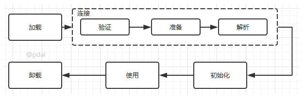

**类的加载: 查找并加载类的二进制数据**

加载时类加载过程的第一个阶段，在加载阶段，虚拟机需要完成以下三件事情:

- 通过一个类的全限定名来获取其定义的二进制字节流。
- 将这个字节流所代表的静态存储结构转化为方法区的运行时数据结构。
- 在Java堆中生成一个代表这个类的java.lang.Class对象，作为对方法区中这些数据的访问入口。

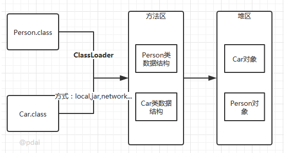

相对于类加载的其他阶段而言，*加载阶段(准确地说，是加载阶段获取类的二进制字节流的动作)是可控性最强的阶段*，因为开发人员既可以使用系统提供的类加载器来完成加载，也可以自定义自己的类加载器来完成加载。

加载阶段完成后，虚拟机外部的 二进制字节流就按照虚拟机所需的格式存储在方法区之中，而且在Java堆中也创建一个`java.lang.Class`类的对象，这样便可以通过该对象访问方法区中的这些数据。

**类加载器并不需要等到某个类被“首次主动使用”时再加载它**，JVM规范允许类加载器在预料某个类将要被使用时就预先加载它，如果在预先加载的过程中遇到了.class文件缺失或存在错误，类加载器必须在程序首次主动使用该类时才报告错误(LinkageError错误)如果这个类一直没有被程序主动使用，那么类加载器就不会报告错误。

**验证: 确保被加载的类的正确性**

验证是连接阶段的第一步，这一阶段的目的是为了确保Class文件的字节流中包含的信息符合当前虚拟机的要求，并且不会危害虚拟机自身的安全。验证阶段大致会完成4个阶段的检验动作:

- `文件格式验证`: 验证字节流是否符合Class文件格式的规范；例如: 是否以`0xCAFEBABE`开头、主次版本号是否在当前虚拟机的处理范围之内、常量池中的常量是否有不被支持的类型。
- `元数据验证`: 对字节码描述的信息进行语义分析(注意: 对比`javac`编译阶段的语义分析)，以保证其描述的信息符合Java语言规范的要求；例如: 这个类是否有父类，除了`java.lang.Object`之外。
- `字节码验证`: 通过数据流和控制流分析，确定程序语义是合法的、符合逻辑的。
- `符号引用验证`: 确保解析动作能正确执行。

> 验证阶段是非常重要的，但**不是必须的**，它对程序运行期没有影响，*如果所引用的类经过反复验证，那么可以考虑采用`-Xverifynone`参数来关闭大部分的类验证措施，以缩短虚拟机类加载的时间。*

**准备: 为类的静态变量分配内存，并将其初始化为默认值**

准备阶段是正式为类变量分配内存并设置类变量初始值的阶段，**这些内存都将在方法区中分配**。对于该阶段有以下几点需要注意:

- 这时候进行内存分配的**仅包括类变量**(`static`)，而不包括实例变量，实例变量会在对象实例化时随着对象一块分配在Java堆中。

- 这里所设置的初始值通常情况下是数据类型默认的零值(如`0`、`0L`、`null`、`false`等)，而不是被在Java代码中被显式地赋予的值。

  假设一个类变量的定义为: `public static int value = 3`；那么变量value在准备阶段过后的初始值为`0`，而不是`3`，因为这时候尚未开始执行任何Java方法，而把value赋值为3的`put static`指令是在程序编译后，存放于类构造器`<clinit>()`方法之中的，所以把value赋值为3的动作将在初始化阶段才会执行。

> 这里还需要注意如下几点

- 对基本数据类型来说，对于类变量(static)和全局变量，如果不显式地对其赋值而直接使用，则系统会为其赋予默认的零值，而对于**局部变量来说，在使用前必须显式地为其赋值，否则编译时不通过。**
- 对于**同时被`static`和`final`修饰的常量，必须在声明的时候就为其显式地赋值，否则编译时不通过**；而**只被final修饰的常量则既可以在声明时显式地为其赋值，也可以在类初始化时显式地为其赋值**，总之，在使用前必须为其显式地赋值，**系统不会为其赋予默认零值**。
- 对于引用数据类型`reference`来说，如数组引用、对象引用等，如果没有对其进行显式地赋值而直接使用，系统都会为其赋予默认的零值，即`null`。
- 如果在数组初始化时没有对数组中的各元素赋值，那么其中的元素将根据对应的数据类型而被赋予默认的零值。
- 如果类字段的字段属性表中存在ConstantValue属性，即同时被final和static修饰，那么在准备阶段变量value就会被初始化为ConstValue属性所指定的值。假设上面的类变量value被定义为: `public static final int value = 3；`编译时Javac将会为value生成ConstantValue属性，在准备阶段虚拟机就会根据ConstantValue的设置将value赋值为3。我们可以理解为**`static final`常量在编译期就将其结果放入了调用它的类的常量池中**

**解析: 把类中的符号引用转换为直接引用**

解析阶段是虚拟机将常量池内的符号引用替换为直接引用的过程，解析动作主要针对`类`或`接口`、`字段`、`类方法`、`接口方法`、`方法类型`、`方法句柄`和`调用点`限定符7类符号引用进行。符号引用就是一组符号来描述目标，可以是任何字面量。直接引用就是直接指向目标的指针、相对偏移量或一个间接定位到目标的句柄。

**初始化**

初始化，为类的静态变量赋予正确的初始值，JVM负责对类进行初始化，主要对类变量进行初始化。在Java中对类变量进行初始值设定有两种方式:

- 声明类变量是指定初始值
- 使用静态代码块为类变量指定初始值

**使用**

类访问方法区内的数据结构的接口， 对象是Heap区的数据。

**卸载**

*Java虚拟机将结束生命周期的几种情况**

- 执行了System.exit()方法
- 程序正常执行结束
- 程序在执行过程中遇到了异常或错误而异常终止
- 由于操作系统出现错误而导致Java虚拟机进程终止

## 加载.class文件的方式

- 从本地系统中直接加载
- 通过网络下载.class文件
- 从zip，jar等归档文件中加载.class文件
- 从专有数据库中提取.class文件
- 将Java源文件动态编译为.class文件

## **JVM初始化步骤**

- 假如这个类还没有被加载和连接，则程序先加载并连接该类
- 假如该类的直接父类还没有被初始化，则先初始化其直接父类
- 假如类中有初始化语句，则系统依次执行这些初始化语句

## 类初始化时机

**只有当对类的主动使用的时候才会导致类的初始化**，类的主动使用包括以下六种:

- 创建类的实例，也就是**new的方式**
- **访问某个类或接口的静态变量，或者对该静态变量赋值**
- **调用类的静态方法**
- **反射**(如Class.forName("com.pdai.jvm.Test"))
- 初始化某个类的子类，则其父类也会被初始化
- Java虚拟机启动时被标明为启动类的类(Java Test)，直接使用java.exe命令来运行某个主类

## 我们来谈谈类的加载机制

**1，首先，什么是类的加载机制？**

JVM使用Java类的流程如下：
1，Java源文件----编译---->class文件
2，类加载器ClassLoader会读取这个.class文件，并将其转化为java.lang.Class的实例。有了该实例，JVM就可以使用他来创建对象，调用方法等操作了。
那么ClassLoader是以一种什么机制来加载Class的？
这就是我们要谈的类的加载机制！

**2，搞清楚这个问题，首先要知道，我们用到的Class文件都有哪些来源？**

1，Java内部自带的核心类，位于`JAVA_HOME/jre/lib`，其中最著名的莫过于`rt.jar`
2，Java的扩展类，位于​`JAVA_HOME/jre/lib/ext`目录下
3，我们自己开发的类或项目开发用到的第三方jar包，位于我们项目的目录下，比如`WEB-INF/lib`目录

**3，那么，针对这些Class，JDK是怎么分工的？谁来加载这些Class？**

针对不同的来源，Java分了不同的ClassLoader来加载
1，Java核心类，这些Java运行的基础类，由一个名为BootstrapClassLoader加载器负责加载。这个类加载器被称为“根加载器或引导加载器”
注意：BootstrapClassLoader不继承ClassLoader，是由JVM内部实现。法力无边，所以你通过java程序访问不到，得到的是null。
2，Java扩展类，是由ExtClassLoader负责加载，被称为“扩展类加载器”。
3，项目中编写的类，是由AppClassLoader来负责加载，被称为“系统类加载器”。

**4， 那凭什么，我就知道这个类应该由老大BootStrapClassLoader来加载？**

这里面就要基于双亲委托机制？**所谓双亲委托机制，就是加载一个类，会先获取到一个系统类加载器AppClassLoader的实例，然后往上层层请求，先由BootstarpClassLoader去加载，
如果BootStrapClassLoader发现没有，再下发给ExtClassLoader去加载，还是没有，才由AppClassLoader去加载。
如果还是没有，则报错**

5，所以，上述问题的答案你清楚了吗？

**JDK提供java.lang.String类，默认在rt.jar这个包里面，所以，默认会由BootstarpClassLoader加载，
所以，我们自己编写的java.lang.String，都没有机会被加载到**

6，给两段程序看看，类加载器的关系

案例1：创建一个自己的类，然后打印其类加载器

```java
public class ClassLoaderTest {
	public static void main(String[] args) throws ClassNotFoundException {
		Class<?> clazz = Class.forName("com.huangguizhao.thread.client.Programmer");
		ClassLoader classLoader = clazz.getClassLoader();
		System.out.println(classLoader.getClass().getSimpleName());
	}
}
```

案例2：打印其双亲类加载器信息

```java
while(classLoader.getParent() != null){
       classLoader = classLoader.getParent();
       System.out.println("-->"+classLoader.getClass().getSimpleName());
}
```

## 说一下Java对象的创建过程


**1、** 类加载检查：虚拟机遇到一条 new 指令时，首先将去检查这个指令的参数是否能在常量池中定位到这个类的符号引用，并且检查这个符号引用代表的类是否已被加载过、解析和初始化过。如果没有，那必须先执行相应的类加载过程。2）分配内存：在类加载检查通过后，接下来虚拟机将为新生对象分配内存。对象所需的内存大小在类加载完成后便可确定，为对象分配空间的任务等同于把一块确定大小的内存从 Java 堆中划分出来。分配方式有 “指针碰撞” 和 “空闲列表” 两种，选择那种分配方式由 Java 堆是否规整决定，而Java堆是否规整又由所采用的垃圾收集器是否带有压缩整理功能决定。选择以上2种方式中的哪一种，取决于 Java 堆内存是否规整。而 Java 堆内存是否规整，取决于 GC 收集器的算法是"标记-清除"，还是"标记-整理"（也称作"标记-压缩"），值得注意的是，复制算法内存也是规整的。

**2、** 在创建对象的时候有一个很重要的问题，就是线程安全，因为在实际开发过程中，创建对象是很频繁的事情，作为虚拟机来说，必须要保证线程是安全的，通常来讲，虚拟机采用两种方式来保证线程安全：CAS+失败重试：CAS 是乐观锁的一种实现方式。所谓乐观锁就是，每次不加锁而是假设没有冲突而去完成某项操作，如果因为冲突失败就重试，直到成功为止。虚拟机采用 CAS 配上失败重试的方式保证更新操作的原子性。TLAB：为每一个线程预先在Eden区分配一块儿内存，JVM在给线程中的对象分配内存时，首先在TLAB分配，当对象大于TLAB中的剩余内存或TLAB的内存已用尽时，再采用上述的CAS进行内存分配

**3、** 初始化零值：内存分配完成后，虚拟机需要将分配到的内存空间都初始化为零值（不包括对象头），这一步操作保证了对象的实例字段在 Java 代码中可以不赋初始值就直接使用，程序能访问到这些字段的数据类型所对应的零值。

**4、** 设置对象头：初始化零值完成之后，虚拟机要对对象进行必要的设置，例如这个对象是那个类的实例、如何才能找到类的元数据信息、对象的哈希吗、对象的 GC 分代年龄等信息。这些信息存放在对象头中。另外，根据虚拟机当前运行状态的不同，如是否启用偏向锁等，对象头会有不同的设置方式。

**5、** 执行 init 方法：在上面工作都完成之后，从虚拟机的视角来看，一个新的对象已经产生了，但从 Java 程序的视角来看，对象创建才刚开始，  方法还没有执行，所有的字段都还为零。所以一般来说，执行 new 指令之后会接着执行  方法，把对象按照程序员的意愿进行初始化，这样一个真正可用的对象才算完全产生出来。


## 谈谈 JVM 中的常量池

**JDK 1.8 开始**

**1、** **字符串常量池：存放在堆中**，包括 String 对象执行 intern() 方法后存的地方、双引号直接引用的字符串

**2、** **运行时常量池：存放在方法区，属于元空间**，是类加载后的一些存储区域，大多数是类中 constant_pool 的内容

**3、** **类文件常量池**：constant_pool，JVM 定义的概念


## JVM 内存区域

**JVM 内存区域主要分为线程私有区域【程序计数器、虚拟机栈、本地方法区】、线程共享区域【JAVA 堆、方法区】、直接内存。**

线程私有数据区域生命周期与线程相同, 依赖用户线程的启动/结束 而 创建/销毁(在 Hotspot VM 内, 每个线程都与操作系统的本地线程直接映射, 因此这部分内存区域的存/否跟随本地线程的生/死对应)。

线程共享区域随虚拟机的启动/关闭而创建/销毁。

直接内存并不是 JVM 运行时数据区的一部分, 但也会被频繁的使用: 在 JDK 1.4 引入的 NIO 提供了基于Channel与 Buffer的IO方式, 它可以使用Native函数库直接分配堆外内存, 然后使用DirectByteBuffer 对象作为这块内存的引用进行操作(详见: Java I/O 扩展), 这样就避免了在 Java堆和 Native 堆中来回复制数据, 因此在一些场景中可以显著提高性能。


## G1 垃圾收集器

**Garbage first 垃圾收集器是目前垃圾收集器理论发展的最前沿成果**，相比与 CMS 收集器， G1 收集器两个最突出的改进是：

**1、** **基于标记-整理算法，不产生内存碎片。**

**2、** **可以非常精确控制停顿时间，在不牺牲吞吐量前提下，实现低停顿垃圾回收。**G1 收集器避免全区域垃圾收集，它把堆内存划分为大小固定的几个独立区域，并且跟踪这些区域的垃圾收集进度，同时在后台维护一个优先级列表，每次根据所允许的收集时间， 优先回收垃圾最多的区域。区域划分和优先级区域回收机制，确保 G1 收集器可以在有限时间获得最高的垃圾收集效率


## 堆的作用是什么？  

**堆**是虚拟机所管理的**内存中最大的一块，被所有线程共享的，在虚拟机启动时创建**。堆用来存放对象实例，Java 里几乎所有对象实例都在堆分配内存。堆可以处于物理上不连续的内存空间，逻辑上应该连续，但对于例如数组这样的大对象，多数虚拟机实现出于简单、存储高效的考虑会要求连续的内存空间。

堆既可以被实现成固定大小，也可以是可扩展的，可通过 `-Xms` 和 `-Xmx` 设置堆的最小和最大容量，当前主流 JVM 都按照可扩展实现。如果堆没有内存完成实例分配也无法扩展，抛出 OutOfMemoryError。


## 如何查看 JVM 当前使用的是什么垃圾收集器？

-XX:+PrintCommandLineFlags 参数可以打印出所选垃圾收集器和堆空间大小等设置，如果开启了 GC 日志详细信息，里面也会包含各代使用的垃圾收集器的简称。


## GC的回收流程是怎样的？


**GC回收流程如下：**

**1、** 对于整个的GC流程里面，那么最需要处理的就是**新生代和老年代的内存清理操作**，而元空间（永久代）都不在GC范围内

**2、** 当现在有一个新的对象产生，那么对象一定需要内存空间，平均每个栈内存存4k，每个堆内存存8k，那么对象一定需要进行堆空间的申请

**3、** **首先会判断Eden区是否有内存空间，如果此时有内存空间，则直接将新对象保存在伊甸园区。**

**4、** **但是如果此时在伊甸园区内存不足，那么会自动执行一个Minor GC 操作，将伊甸园区的无用内存空间进行清理，Minor GC的清理范围只在Eden园区，清理之后会继续判断Eden园区的内存空间是否充足？如果内存空间充足，则将新对象直接在Eden园区进行空间分配。**

**5、** **如果执行Minor GC 之后发现伊甸园区的内存空间依然不足，那么这个时候会执行存活区的判断，如果存活区有剩余空间，则将Eden园区部分活跃对象保存在存活区，那么随后继续判断Eden园区的内存空间是否充足，如果充足怎则将新对象直接在Eden园区进行空间分配。**

**6、** **此时如果存活区没有内存空间，则继续判断老年区。则将部分存活对象保存在老年代，而后存活区将有空余空间。**

**7、** **如果这个时候老年代也满了，那么这个时候将产生Major GC（Full GC）,那么这个时候将进行老年代的清理**。

**8、** **如果老年代执行Full GC之后，无法进行对象的保存，则会产生OOM异常,OutOfMemoryError异常**。

## 类的实例化顺序 


**比如父类静态数据，构造函数，字段，子类静态数据，构造函数，字段，他们的执行顺序**

先静态、先父后子。

先静态：父静态 > 子静态

优先级：父类 > 子类 静态代码块 > 非静态代码块 > 构造函数

**一个类的实例化过程：**

**1、** 父类中的static代码块，当前类的static

**2、** 顺序执行父类的普通代码块

**3、** 父类的构造函数

**4、** 子类普通代码块

**5、** 子类（当前类）的构造函数，按顺序执行。

**6、** 子类方法的执行，

**检验一下是不是真懂了：**

```
public class Base {
    private String name = "博客：Soinice";

    public Base() {
        tellName();
        printName();
    }

    public void tellName() {
        System.out.println("Base tell name: " + name);
    }

    public void printName() {
        System.out.println("Base print name: " + name);
    }
}
```

```
public class Dervied extends Base {
    private String name = "Java3y";

    public Dervied() {
        tellName();
        printName();
    }

    @Override
    public void tellName() {
        System.out.println("Dervied tell name: " + name);
    }

    @Override
    public void printName() {
        System.out.println("Dervied print name: " + name);
    }

    public static void main(String[] args) {
        new Dervied();
    }
}
```

**输出数据：**

```
Dervied tell name: null
Dervied print name: null
Dervied tell name: Java3y
Dervied print name: Java3y
```


## 工作中常用的 JVM 配置参数有哪些？


Java 8 为例

**日志**

**1、** -XX:+PrintFlagsFinal，打印JVM所有参数的值

**2、** -XX:+PrintGC，打印GC信息

**3、** **-XX:+PrintGCDetails，打印GC详细信息**

**4、** -XX:+PrintGCTimeStamps，打印GC的时间戳

**5、** -Xloggc:filename，设置GC log文件的位置

**6、** -XX:+PrintTenuringDistribution，查看熬过收集后剩余对象的年龄分布信息

**内存设置**

**1、** -**Xms，设置堆的初始化内存大小**

**2、** **-Xmx，设置堆的最大内存**

**3、** -Xmn，设置新生代内存大小

**4、** -Xss，设置线程栈大小

**5、** -XX:NewRatio，新生代与老年代比值

**6、** -XX:SurvivorRatio，新生代中Eden区与两个Survivor区的比值，默认为8，即Eden:Survivor:Survivor=8:1:1

**7、** **-XX:MaxTenuringThreshold，从年轻代到老年代，最大晋升年龄。CMS 下默认为 6，G1 下默认为 15**

**8、** -XX:MetaspaceSize，设置元空间的大小，第一次超过将触发 GC

**9、** -XX:MaxMetaspaceSize，元空间最大值

**10、** -XX:MaxDirectMemorySize，用于设置直接内存的最大值，限制通过 DirectByteBuffer 申请的内存

**11、** -XX:ReservedCodeCacheSize，用于设置 JIT 编译后的代码存放区大小，如果观察到这个值有限制，可以适当调大，一般够用即可

**设置垃圾收集相关**

**1、** -XX:+UseSerialGC，设置串行收集器

**2、** -XX:+UseParallelGC，设置并行收集器

**3、** -XX:+UseConcMarkSweepGC，使用CMS收集器

**4、** -XX:ParallelGCThreads，设置Parallel GC的线程数

**5、** -XX:MaxGCPauseMillis，GC最大暂停时间 ms

**6、** -XX:+UseG1GC，使用G1垃圾收集器

**CMS 垃圾回收器相关**

**1、** -XX:+UseCMSInitiatingOccupancyOnly

**2、** -XX:CMSInitiatingOccupancyFraction，与前者配合使用，指定MajorGC的发生时机

**3、** -XX:+ExplicitGCInvokesConcurrent，代码调用 System.gc() 开始并行 FullGC，建议加上这个参数

**4、** -XX:+CMSScavengeBeforeRemark，表示开启或关闭在 CMS 重新标记阶段之前的清除（YGC）尝试，它可以降低 remark 时间，建议加上

**5、** -XX:+ParallelRefProcEnabled，可以用来并行处理 Reference，以加快处理速度，缩短耗时

**G1 垃圾回收器相关**

**1、** **-XX:MaxGCPauseMillis，用于设置目标停顿时间，G1 会尽力达成**

**2、** -XX:G1HeapRegionSize，用于设置小堆区大小，建议保持默认

**3、** -XX:InitiatingHeapOccupancyPercent，表示当整个堆内存使用达到一定比例（默认是 45%），并发标记阶段就会被启动

**4、** -XX:ConcGCThreads，表示并发垃圾收集器使用的线程数量，默认值随 JVM 运行的平台不同而变动，不建议修改

参数查询官网地址：

[https://docs.oracle.com/javase/8/docs/technotes/tools/unix/java.html](https://docs.oracle.com/javase/8/docs/technotes/tools/unix/java.html)

建议面试时最好能记住 CMS 和 G1的参数，特点突出使用较多，被问的概率大

## Class文件的结构属性

在理解之前先从整体看下java字节码文件包含了哪些类型的数据

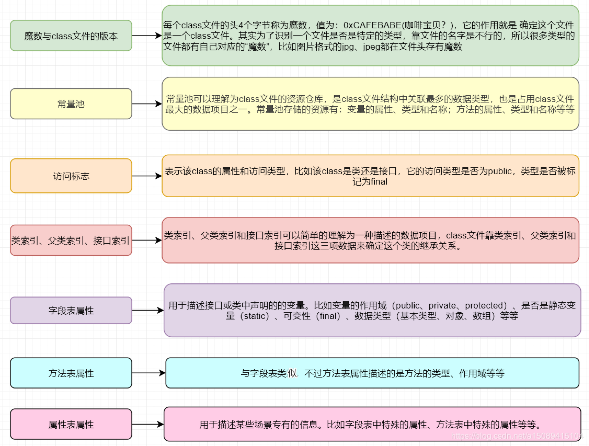


## Java里有哪些引用类型？


**1、** 强引用 这种引用属于最普通最强硬的一种存在，只有在和 GC Roots 断绝关系时，才会被消灭掉。

**2、** 软引用 软引用用于维护一些可有可无的对象。**在内存足够的时候，软引用对象不会被回收，只有在内存不足时，系统则会回收软引用对象**，如果回收了软引用对象之后仍然没有足够的内存，才会抛出内存溢出异常。可以看到，这种特性非**常适合用在缓存技术上。比如网页缓存、图片缓存等**。软引用可以和一个引用队列（ReferenceQueue）联合使用，如果软引用所引用的对象被垃圾回收，Java 虚拟机就会把这个软引用加入到与之关联的引用队列中。

**3、** 弱引用 弱引用对象相比较软引用，要更加无用一些，它拥有更短的生命周期。**当JVM进行垃圾回收时，无论内存是否充足，都会回收被弱引用关联的对象。**弱引用拥有更短的生命周期，在 Java 中，用 java.lang.ref.WeakReference 类来表示。它的应用场景和软引用类似，可以在一些对内存更加敏感的系统里采用。

**4、** 虚引用 这是一种形同虚设的引用，在现实场景中用的不是很多。**虚引用必须和引用队列（ReferenceQueue）联合使用。**如果一个对象仅持有虚引用，那么它就和没有任何引用一样，在任何时候都可能被垃圾回收。实际上，虚引用的 get，总是返回 null。

## GC Roots 有哪些？ 

**1、** **GC Roots 是一组必须活跃的引用**。用通俗的话来说，就是程序接下来通过直接引用或者间接引用，能够访问到的潜在被使用的对象。

**2、** GC Roots 包括：Java 线程中，**当前所有正在被调用的方法的引用类型参数、局部变量、临时值等。也就是与我们栈帧相关的各种引用。所有当前被加载的 Java 类。Java 类的引用类型静态变量。运行时常量池里的引用类型常量（String 或 Class 类型）。JVM 内部数据结构的一些引用**，比如 sun.jvm.hotspot.memory.Universe 类。**用于同步的监控对象，比如调用了对象的 wait() 方法**。JNI handles，包括 global handles 和 local handles。

**3、** 这些 GC Roots 大体可以分为三大类，下面这种说法更加好记一些：**活动线程相关的各种引用。类的静态变量的引用。JNI 引用**。

**4、** 有两个注意点：我们这里说的是活跃的引用，而不是对象，**对象是不能作为 GC Roots 的**。**GC 过程是找出所有活对象，并把其余空间认定为“无用”**；而不是找出所有死掉的对象，并回收它们占用的空间。所以，哪怕 JVM 的堆非常的大，基于 tracing 的 GC 方式，回收速度也会非常快。


## 说说Java 垃圾回收机制


在 Java 中，程序员是不需要显示的去释放一个对象的内存的，而是由**虚拟机自行执行**。在 JVM 中，有一个**垃圾回收线程，它是低优先级的**，在正常情况下是不会执行的，**只有在虚拟机空闲或者当前堆内存不足时，才会触发执行**，扫描那些没有被任何引用的对象，并将它们添加到要回收的集合中，进行回收。


## 堆溢出的原因？  

**堆用于存储对象实例**，只要不断创建对象并保证 GC Roots 到对象有可达路径避免垃圾回收，随着对象数量的增加，**总容量触及最大堆容量后就会 OOM**，例如在 **while 死循环中一直 new 创建实例。**

堆 OOM 是实际应用中最常见的 OOM，**处理方法是通过内存映像分析工具对 Dump 出的堆转储快照分析，确认内存中导致 OOM 的对象是否必要，分清到底是内存泄漏还是内存溢出。**

如果是内存泄漏，通过工具查看泄漏对象到 GC Roots 的引用链，找到泄露对象是通过怎样的引用路径、与哪些 GC Roots 关联才导致无法回收，一般可以准确定位到产生内存泄漏代码的具体位置。

如果不是内存泄漏，即内存中对象都必须存活，应当**检查 JVM 堆参数，与机器内存相比是否还有向上调整的空间。**再**从代码检查是否存在某些对象生命周期过长、持有状态时间过长、存储结构设计不合理等情况，尽量减少程序运行期的内存消耗。**


## Tomcat是怎么打破双亲委派机制的呢？


是通过**重写ClassLoader的loadClass和ClassLoader的findClass 实现的。**WebAppClassLoader，它**加载自己目录下的.class文件，并不会传递给父类的加载器**。但是，它却可以使用 SharedClassLoader 所加载的类，实现了共享和分离的功能。


## 你知道哪些垃圾收集器？

**序列号**（Serial）

最基础的收集器，**使用复制算法、单线程工作**，只用一个处理器或一条线程完成垃圾收集，**进行垃圾收集时必须暂停其他所有工作线程**。

**Serial 是虚拟机在客户端模式的默认新生代收集器**，简单高效，对于内存受限的环境它是所有收集器中额外内存消耗最小的，对于处理器核心较少的环境，Serial 由于没有线程交互开销，可获得最高的单线程收集效率。

**新品**（ParNew ）

**Serial 的多线程版本，除了使用多线程进行垃圾收集外其余行为完全一致。**

**ParNew 是虚拟机在服务端模式的默认新生代收集器**，一个重要原因是除了 Serial 外只有它能与 CMS 配合。自从 JDK 9 开始，ParNew 加 CMS 不再是官方推荐的解决方案，**官方希望它被 G1 取代。**

**并行清理**

新生代收集器，基于复制算法，是可并行的多线程收集器，与 ParNew 类似。

特点是它的关注点与其他收集器不同，Parallel Scavenge 的目标是达到一个可控制的吞吐量，吞吐量就是处理器用于运行用户代码的时间与处理器消耗总时间的比值。

**串行旧**

Serial 的老年代版本，单线程工作，使用标记-整理算法。

Serial Old 是虚拟机在客户端模式的默认老年代收集器，用于服务端有两种用途：① JDK5 及之前与 Parallel Scavenge 搭配。② 作为CMS 失败预案。

**平行老**

Parallel Scavenge 的老年代版本，支持多线程，基于标记-整理算法。JDK6 提供，注重吞吐量可考虑 Parallel Scavenge 加 Parallel Old。

**不育系**

以获取最短回收停顿时间为目标，基于标记-清除算法，过程相对复杂，分为四个步骤：初始标记、并发标记、重新标记、并发清除。

初始标记和重新标记需要 STW（Stop The World，系统停顿），初始标记仅是标记 GC Roots 能直接关联的对象，速度很快。并发标记从 GC Roots 的直接关联对象开始遍历整个对象图，耗时较长但不需要停顿用户线程。重新标记则是为了修正并发标记期间因用户程序运作而导致标记产生变动的那部分记录。并发清除清理标记阶段判断的已死亡对象，不需要移动存活对象，该阶段也可与用户线程并发。

缺点：① 对处理器资源敏感，并发阶段虽然不会导致用户线程暂停，但会降低吞吐量。② 无法处理浮动垃圾，有可能出现并发失败而导致 Full GC。③ 基于标记-清除算法，产生空间碎片。

**G1**

开创了收集器面向局部收集的设计思路和基于 Region 的内存布局，主要面向服务端，最初设计目标是替换 CMS。

G1 之前的收集器，垃圾收集目标要么是整个新生代，要么是整个老年代或整个堆。而 **G1 可面向堆任何部分来组成回收集进行回收，衡量标准不再是分代，而是哪块内存中存放的垃圾数量最多，回收受益最大。**

跟踪各 Region 里垃圾的价值，价值即回收所获空间大小以及回收所需时间的经验值，在后台维护一个优先级列表，每次根据用户设定允许的收集停顿时间优先处理回收价值最大的 Region。这种方式保证了 G1 在有限时间内获取尽可能高的收集效率。

## G1 垃圾回收运作过程

1.**初始标记：标记 GC Roots 能直接关联到的对象，**让下一阶段用户线程并发运行时能正确地在可用 Region 中分配新对象。需要 STW 但耗时很短，在 Minor GC 时同步完成。

2.**并发标记：从 GC Roots 开始对堆中对象进行可达性分析**，递归扫描整个堆的对象图。耗时长但可与用户线程并发，扫描完成后要重新处理 SATB 记录的在并发时有变动的对象。

3.**最终标记：对用户线程做短暂暂停，处理并发阶段结束后仍遗留下来的少量 SATB 记录。**

4.**筛选回收：对各 Region 的回收价值排序，根据用户期望停顿时间制定回收计划。**必须暂停用户线程，由多条收集线程并行完成。


可**由用户指定期望停顿时间是 G1 的一个强大功能，但该值不能设得太低，一般设置为100~300 ms。**


## JVM 选项 -XX:+UseCompressedOops 有什么作用？为什么要使用


当你将你的应用从 32 位的 JVM 迁移到 64 位的 JVM 时，由于对象的指针从32 位增加到了 64 位，因此堆内存会突然增加，差不多要翻倍。这也会对 CPU缓存（容量比内存小很多）的数据产生不利的影响。因为，**迁移到 64 位的 JVM主要动机在于可以指定最大堆大小，通过压缩OOP 可以节省一定的内存。**通过-XX:+UseCompressedOops 选项，JVM 会使用 32 位的 OOP，而不是 64 位的 OOP。


## invokedynamic 指令是干什么的？


Java 7 开始，**新引入的字节码指令**，可以实现一些动态类型语言的功能。**Java 8 的 Lambda 表达式就是通过 invokedynamic 指令实现**，使用方法句柄实现。

## ZGC 了解吗？ 


JDK11 中加入的具有实验性质的**低延迟垃圾收集器**，目标是尽可能在不影响吞吐量的前提下，实现在任意堆内存大小都可以把停顿时间限制在 10ms 以内的低延迟。

**基于 Region 内存布局，不设分代，使用了读屏障、染色指针和内存多重映射等技术实现可并发的标记-整理，以低延迟为首要目标**。

ZGC 的 Region 具有动态性，是动态创建和销毁的，并且容量大小也是动态变化的。


## safepoint是什么？


STW并不会只发生在内存回收的时候。现在程序员这么卷，碰到几次safepoint的问题几率也是比较大的。

**当发生GC时，用户线程必须全部停下来，才可以进行垃圾回收，这个状态我们可以认为JVM是安全的（safe），整个堆的状态是稳定的。**

**如果在GC前，有线程迟迟进入不了safepoint，那么整个JVM都在等待这个阻塞的线程，造成了整体GC的时间变长。**


## JVM 提供的常用工具 

**jps：用来显示本地的 Java 进程，可以查看本地运行着几个 Java 程序，并显示他们的进程号。** 命令格式：jps

**jinfo：**运行环境参数：Java System 属性和 JVM 命令行参数，Java class path 等信息。 命令格式：jinfo 进程 pid

**jstat：监视虚拟机各种运行状态信息的命令行工具**。 命令格式：jstat -gc 123 250 20

**jstack：可以观察到 JVM 中当前所有线程的运行情况和线程当前状态**。 命令格式：jstack 进程 pid

**jmap：观察运行中的 JVM 物理内存的占用情况**（如：产生哪些对象，及其数量）。 命令格式：jmap [option] pid


## CMS 垃圾收集器

**Concurrent mark sweep(CMS)收集器是一种年老代垃圾收集器，其最主要目标是获取最短垃圾回收停顿时间， 和其他年老代使用标记-整理算法不同，它使用多线程的标记-清除算法。**最短的垃圾收集停顿时间可以为交互比较高的程序提高用户体验。CMS 工作机制相比其他的垃圾收集器来说更复杂。整个过程分为以下 4 个阶段：

**初始标记**：只是标记一下 GC Roots 能直接关联的对象，速度很快，仍然需要暂停所有的工作线程。

**并发标记**：进行 GC Roots 跟踪的过程，和用户线程一起工作，不需要暂停工作线程。

**重新标记**：为了修正在并发标记期间，因用户程序继续运行而导致标记产生变动的那一部分对象的标记记录，仍然需要暂停所有的工作线程。

**并发清除**：清除 GC Roots 不可达对象，和用户线程一起工作，不需要暂停工作线程。由于耗时最长的并发标记和并发清除过程中，垃圾收集线程可以和用户现在一起并发工作， 所以总体上来看CMS 收集器的内存回收和用户线程是一起并发地执行。


## 对象都是优先分配在年轻代上的吗？

**不是。当新生代内存不够时，老年代分配担保。而大对象则是直接在老年代分配。**


## 有哪些 GC 垃圾回收算法？  

**标记-清除算法**：**分为标记和清除阶段**，首先从每个 GC Roots 出发依次标记有引用关系的对象，最后清除没有标记的对象。执行效率不稳定，如果堆包含大量对象且大部分需要回收，必须进行大量标记清除，导致效率随对象数量增长而降低。**存在内存空间碎片化问题**，会产生大量不连续的内存碎片，导致以后需要分配大对象时容易触发 Full GC。

**标记-复制算法**：为了**解决内存碎片问题，将可用内存按容量划分为大小相等的两块，每次只使用其中一块**。当使用的这块空间用完了，就将存活对象复制到另一块，再把已使用过的内存空间一次清理掉。**主要用于进行新生代。**实现简单、运行高效，**解决了内存碎片问题**。**代价是可用内存缩小为原来的一半，浪费空间**。

HotSpot 把新生代划分为一块较大的 Eden 和两块较小的 Survivor，每次分配内存只使用 Eden 和其中一块 Survivor。垃圾收集时将 Eden 和 Survivor 中仍然存活的对象一次性复制到另一块 Survivor 上，然后直接清理掉 Eden 和已用过的那块 Survivor。HotSpot 默认Eden 和 Survivor 的大小比例是 8:1，**即每次新生代中可用空间为整个新生代的 90%。**

**标记-整理算法**：标记-复制算法在对象存活率高时要进行较多复制操作，效率低。如果不想浪费空间，就需要有额外空间分配担保，应对被使用内存中所有对象都存活的极端情况，所以**老年代一般不使用此算法**。**老年代使用标记-整理算法**，标记过程与标记-清除算法一样，但不直接清理可回收对象，而是**让所有存活对象都向内存空间一端移动，然后清理掉边界以外的内存。**

标记-清除与标记-整理的差异在于前者是一种非移动式算法而后者是移动式的。如果移动存活对象，尤其是在老年代这种每次回收都有大量对象存活的区域，是一种极为负重的操作，而且移动必须全程暂停用户线程。如果不移动对象就会导致空间碎片问题，只能依赖更复杂的内存分配器和访问器解决。


## 有什么堆外内存的排查思路？

**进程占用的内存，可以使用top命令，看RES段占用的值。**如果这个值大大超出我们设定的最大堆内存，则证明堆外内存占用了很大的区域。

**使用gdb可以将物理内存dump下来，通常能看到里面的内容**。更加复杂的分析可以使用perf工具，或者谷歌开源的gperftools。那些申请内存最多的native函数，很容易就可以找到。


## SWAP会影响性能么？ 


当操作系统内存不足的时候，会将部分数据写入到SWAP交换分中，但是SWAP的性能是比较低的。如果应用的访问量较大，需要频繁申请和销毁内存，就容易发生卡顿。**一般高并发场景下，会禁用SWAP。**


## 你知道哪些JVM性能调优


**设定堆内存大小**

**1、** **-Xmx：堆内存最大限制。**设定新生代大小。新生代不宜太小，否则会有大量对象涌入老年代

**2、** **-XX:NewSize：新生代大小**

**3、** **-XX:NewRatio 新生代和老生代占比**

**4、** -**XX:SurvivorRatio：伊甸园空间和幸存者空间的占比**

**5、** **设定垃圾回收器 年轻代用 -XX:+UseParNewGC 年老代用-XX:+UseConcMarkSweepGC**

## 你都有哪些手段用来排查内存溢出？

你可以来一个中规中矩的回答：

内存溢出包含很多种情况，我在平常工作中遇到最多的就是`堆溢出`。有一次线上遇到故障，重新启动后，使用jstat命令，发现Old区在一直增长。我使用jmap命令，导出了一份线上堆栈，然后使用`MAT`进行分析。通过对`GC Roots`的分析，我发现了一个非常大的HashMap对象，这个原本是有位同学`做缓存`用的，但是一个无界缓存，造成了堆内存占用一直上升。后来，将这个缓存改成 guava的Cache，并设置了弱引用，故障就消失了。

这个回答不是十分出彩，但着实是常见问题，让人挑不出毛病。

## JAVA弱引用


弱引用需要用 WeakReference 类来实现，它比软引用的生存期更短，**对于只有弱引用的对象来说，只要垃圾回收机制一运行，不管 JVM 的内存空间是否足够，总会回收该对象占用的内存。**


## 什么是堆

**存放对象实例，所有的对象和数组都要在堆上分配。 是 JVM 所管理的内存中最大的一块区域。**


## 什么是程序计数器

**当前线程所执行的行号指示器。是 JVM 内存区域最小的一块区域。执行字节码工作时就是利用程序计数器来选取下一条需要执行的字节码指令。**

**程序计数器**是一块较小的内存空间，可以看作当前线程所执行字节码的行号指示器。字节码解释器工作时通过改变计数器的值选取下一条执行指令。分支、循环、跳转、线程恢复等功能都需要依赖计数器完成。**是唯一在虚拟机规范中没有规定内存溢出情况的区域。**

**如果线程正在执行 Java 方法，计数器记录正在执行的虚拟机字节码指令地址。如果是本地方法，计数器值为 Undefined。**


## 各种垃圾回收器，各自优缺点，重点CMS、G1


图来源于《深入理解Java虚拟机：JVM高级特效与最佳实现》，图中两个收集器之间有连线，说明它们可以配合使用.

**1、** **Serial收集器**，串行收集器是最古老，最稳定以及效率高的收集器，但可能会产生较长的停顿，只使用一个线程去回收。

**2、** **ParNew收集器**，ParNew收集器其实就是Serial收集器的多线程版本。

**3、** **Parallel收集器**，Parallel Scavenge收集器类似ParNew收集器，Parallel收集器更关注系统的吞吐量。

**4、** **Parallel Old收集器**，Parallel Old是Parallel Scavenge收集器的老年代版本，使用多线程“标记－整理”算法

**5、** **CMS收集器**，CMS（Concurrent Mark Sweep）收集器是一种以获取最短回收停顿时间为目标的收集器。它需要消耗额外的CPU和内存资源，在CPU和内存资源紧张，CPU较少时，会加重系统负担。CMS无法处理浮动垃圾。CMS的“标记-清除”算法，会导致大量空间碎片的产生。

**6、** **G1收集器**，G1 (Garbage-First)是一款面向服务器的垃圾收集器,主要针对配备多颗处理器及大容量内存的机器、以极高概率满足GC停顿时间要求的同时,还具备高吞吐量性能特征。


## 怎么打出线程栈信息？


输入jps，获得进程号。top -Hp pid 获取本进程中所有线程的CPU耗时性能。 jstack pid命令查看当前java进程的堆栈状态 或者 jstack -l > /tmp/output.txt 把堆栈信息打到一个txt文件。可以使用fastthread 堆栈定位（fastthread.io）


## Serial 与 Parallel GC 之间的不同之处？

Serial 与 Parallel 在 GC 执行的时候都会引起 stop-the-world。它们之间主要**不同 serial 收集器是默认的复制收集器，执行 GC 的时候只有一个线程，而parallel 收集器使用多个 GC 线程来执行。**

## 谈谈动态年龄判断

**1、** 这里涉及到 **-XX:TargetSurvivorRatio 参数**，Survivor 区的目标使用率默认 50，即 Survivor 区对象目标使用率为 50%。

**2、** Survivor 区相同年龄所有对象大小的总和 (Survivor 区内存大小 * 这个目标使用率)时，大于或等于该年龄的对象直接进入老年代。

**3、** 当然，这里还需要考虑参数 -XX:MaxTenuringThreshold 晋升年龄最大阈值


## 类初始化的情况有哪些？

1.遇到 `new`、`getstatic`、`putstatic` 或 `invokestatic` 字节码指令时，还未初始化。典型场景包括 **new 实例化对象、读取或设置静态字段、调用静态方法。**

2.**对类反射调用时，还未初始化。**

3.**初始化类时，父类还未初始化。**

4.**虚拟机启动时，会先初始化包含 main 方法的主类。**

5.使用 JDK7 的动态语言支持时，如果 MethodHandle 实例的解析结果为指定类型的方法句柄且句柄对应的类还未初始化。

6.接口定义了默认方法，如果接口的实现类初始化，接口要在其之前初始化。

7.**其余所有引用类型的方式都不会触发初始化，称为被动引用。**被动引用实例：① **子类使用父类的静态字段时，只有父类被初始化**。② 通过数组定义使用类。③ 常量在编译期会存入调用类的常量池，不会初始化定义常量的类。

8.接口和类加载过程的区别：**初始化类时如果父类没有初始化需要初始化父类，但接口初始化时不要求父接口初始化，只有在真正使用父接口时（如引用接口中定义的常量）才会初始化。**

## GC 垃圾回收是什么？为什么要有 GC垃圾回收？

**GC是垃圾收集**的意思，内存处理是编程人员容易出现问题的地方，忘记或者错误的内存回收会导致程序或系统的不稳定甚至崩溃，**Java提供的GC功能可以自动监测对象是否超过作用域从而达到自动回收内存的目的**，Java语言没有提供释放已分配内存的显示操作方法。Java程序员不用担心内存管理，因为垃圾收集器会自动进行管理。要请求垃圾收集，可以调用下面的方法之一：System.gc()或Runtime.getRuntime().gc()，但JVM可以屏蔽掉线示的垃圾回收调用。

垃圾回收可以有效的防止内存泄露，有效的使用可以使用的内存。垃圾回收器通常是作为一个单独的低优先级的线程运行，不可预知的情况下对内存堆中已经死亡的或者长时间没有使用的对象进行清除和回收，程序员不能实时的调用垃圾回收器对某个对象或所有对象进行垃圾回收。在 Java 诞生初期，垃圾回收是 Java最大的亮点之一，因为服务器端的编程需要有效的防止内存泄露问题，然而时过境迁，如今 Java 的垃圾回收机制已经成为被诟病的东西。移动智能终端用户通常觉得 iOS 的系统比 Android 系统有更好的用户体验，其中一个深层次的原因就在于 Android 系统中垃圾回收的不可预知性。


## MinorGC，MajorGC、FullGC垃圾回收都什么时候发生？

**MinorGC在年轻代空间不足的时候发生，MajorGC指的是老年代的GC，出现MajorGC一般经常伴有MinorGC。**

FullGC有三种情况：

**1、** **当老年代无法再分配内存的时候**

**2、** **元空间不足的时候**

**3、** 显示调用System.gc的时候。另外，像CMS一类的垃圾回收器，在MinorGC出现promotion failure的时候也会发生FullGC


## Java的双亲委托机制是什么？

**它的意思是，除了顶层的启动类加载器以外，其余的类加载器，在加载之前，都会委派给它的父加载器进行加载。这样一层层向上传递，直到祖先们都无法胜任，它才会真正的加载。**Java默认是这种行为。当然Java中也有很多打破双亲行为的骚操作，比如SPI（JDBC驱动加载），OSGI等。


## 在 Java 中，对象什么时候可以被垃圾回收？


当对象对当前使用这个对象的应用程序**变得不可触及的时候**，这个对象就可以被回收了。


## 有哪些打破了双亲委托机制的案例？

**1、** **Tomcat可**以加载自己目录下的class文件，并不会传递给父类的加载器。

**2、** Java的**SPI**，发起者是 `BootstrapClassLoader`， `BootstrapClassLoader`已经是最上层的了。**它直接获取了 `AppClassLoader`进行驱动加载，和双亲委派是相反的。**


## JVM 年轻代到年老代的晋升过程的判断条件是什么呢？

**1、** **部分对象会在From和To区域中复制来复制去,如此交换15次(**由JVM参数MaxTenuringThreshold决定,这个参数默认是15),**最终如果还是存活,就存入到老年代。**

**2、** **如果对象的大小大于Eden的二分之一会直接分配在old**，如果old也分配不下，会做一次majorGC，如果小于eden的一半但是没有足够的空间，就进行minor gc也就是新生代GC。

**3、** **minor gc后，survivor仍然放不下，则放到老年代**

**4、** **动态年龄判断 ，大于等于某个年龄的对象超过了survivor空间一半 ，大于等于某个年龄的对象直接进入老年代**


## JVM 数据运行区，哪些会造成 OOM 的情况？


除了数据运行区，其他区域均有可能造成 OOM 的情况。

**堆溢出：**java.lang.OutOfMemoryError: Java heap space

**栈溢出：**java.lang.StackOverflowError

**永久代溢出：**java.lang.OutOfMemoryError: PermGen space


## 老年代与标记复制算法


**而老年代因为每次只回收少量对象，因而采用 Mark-Compact 算法。**

**1、** JAVA 虚拟机提到过的处于方法区的永生代(Permanet Generation)， 它用来存储 class 类，常量，方法描述等。对永生代的回收主要包括废弃常量和无用的类。

**2、** 对象的内存分配主要在新生代的 Eden Space 和 Survivor Space 的 From Space(Survivor 目前存放对象的那一块)，少数情况会直接分配到老生代。

**3、** **当新生代的 Eden Space 和 From Space 空间不足时就会发生一次 GC，进行 GC 后， Eden Space 和 From Space 区的存活对象会被挪到 To Space，然后将 Eden Space 和 FromSpace 进行清理。**

**4、** **如果 To Space 无法足够存储某个对象，则将这个对象存储到老生代。**

**5、** 在进行 GC 后，使用的便是 Eden Space 和 To Space 了，如此反复循环。

**6、** **当对象在 Survivor 去躲过一次 GC 后，其年龄就会+1。默认情况下年龄到达 15 的对象会被移到老生代中。**


## 分代回收


分代回收基于两个事实:大部分对象很快就不使用了,还有一部分不会立即无用,但也不会持续很长时间

**年轻代->标记-复制**

**老年代->标记-清除**


## 说一下堆和栈的区别 

**1、** **堆的物理地址分配对对象是不连续的。**因此**性能慢些**。在GC的时候也要考虑到不连续的分配，所以有各种算法。比如，标记-消除，复制，标记-压缩，分代（即新生代使用复制算法，老年代使用标记——压缩）。 **栈使用的是数据结构中的栈，先进后出的原则，物理地址分配是连续的**。所以**性能快**。

**2、** **堆因为是不连续的，所以分配的内存是在运行期确认的，因此大小不固定**。一般**堆大小远远大于栈**。**栈是连续的，所以分配的内存大小要在编译期就确认，大小是固定的。**

**3、 ** **堆存放的是对象的实例和数组。**因此该区更关注的是**数据的存储**。**栈存放：局部变量，操作数栈，返回结果。**该区更关注的是**程序方法的执行**。

**4、** **堆对于整个应用程序都是共享、可见的**。**栈只对于线程是可见的**，所以也是线程私有，他的生命周期和线程相同。


## 方法区/永久代


即我们常说的永久代(Permanent Generation), 用于存储被 JVM 加载的类信息、常量、静态变量即、时编译器编译后的代码等数据.HotSpot VM把GC分代收集扩展至方法区, 即使用Java堆的永久代来实现方法区, 这样 HotSpot 的垃圾收集器就可以像管理 Java 堆一样管理这部分内存,而不必为方法区开发专门的内存管理器(永久带的内存回收的主要目标是针对常量池的回收和类型的卸载, 因此收益一般很小) 。

**运行时常量池（Runtime Constant Pool）是方法区的一部分。Class 文件中除了有类的版本、字段、方法、接口等描述等信息外，还有一项信息是常量池 （Constant Pool Table），用于存放编译期生成的各种字面量和符号引用，这部分内容将在类加载后存放到方法区的运行时常量池中**。Java 虚拟机对 Class 文件的每一部分（自然也包括常量池）的格式都有严格的规定，每一个字节用于存储哪种数据都必须符合规范上的要求，这样才会被虚拟机认可、装载和执行。


## JVM有哪些类加载器


虚拟机设计团队把加载动作放到 JVM 外部实现，以便让应用程序决定如何获取所需的类， JVM 提供了 3 种类加载器：

**启动类加载器(Bootstrap ClassLoader)**：负责加载 JAVA_HOME\lib 目录中的， 或通过-Xbootclasspath 参数指定路径中的， 且被虚拟机认可（按文件名识别， 如 rt.jar） 的类。

**扩展类加载器(Extension ClassLoader)**：负责加载 JAVA_HOME\lib\ext 目录中的，或通过 java.ext.dirs 系统变量指定路径中的类库。

**应用程序类加载器(Application ClassLoader)：**负责加载用户路径（classpath）上的类库。JVM 通过双亲委派模型进行类的加载， 当然我们也可以通过继承 java.lang.ClassLoader实现自定义的类加载器。


## 谈谈永久代


**1、** JDK 8 之前，Hotspot 中方法区的实现是永久代（Perm）

**2、** JDK 7 开始把原本放在永久代的字符串常量池、静态变量等移出到堆，**JDK 8 开始去除永久代，使用元空间（Metaspace）**，永久代剩余内容移至元空间，**元空间直接在本地内存分配。**


## ZGC垃圾收集器中的染色指针有什么用？

**染色指针是一种直接将少量额外的信息存储在指针上的技术**，可是为什么指针本身也可以存储额外信息呢？在64位系统中，理论可以访问的内存高达16EB（2的64次幂）字节 。实际上，基于需求（用不到那么多内存）、性能（地址越宽在做地址转换时需要的页表级数越多）和成本（消耗更多晶体管）的考虑，在AMD64架构 中只支持到52位（4PB）的地址总线和48位（256TB）的虚拟地址空间，所以目前64位的硬件实际能够支持的最大内存只有256TB。此外，操作系统一侧也还会施加自己的约束，64位的Linux则分别支持47位（128TB）的进程虚拟地址空间和46位（64TB）的物理地址空间，64位的Windows系统甚至只支持44位（16TB）的物理地址空间。尽管Linux下64位指针的高18位不能用来寻址，但剩余的46位指针所能支持的64TB内存在今天仍然能够充分满足大型服务器的需要。鉴于此，**ZGC的染色指针技术继续盯上了这剩下的46位指针宽度，将其高4位提取出来存储四个标志信息。通过这些标志位，虚拟机可以直接从指针中看到其引用对象的三色标记状态、是否进入了重分配集（即被移动过）、是否只能通过finalize()方法才能被访问到。**当然，由于这些标志位进一步压缩了原本就只有46位的地址空间，也直接导致**ZGC能够管理的内存不可以超过4TB（2的42次幂）** 。


## 什么是内存屏障？

**内存屏障，也叫内存栅栏，是一种CPU指令，用于控制特定条件下的重排序和内存可见性问题。**LoadLoad屏障：对于这样的语句Load1; LoadLoad; Load2，在Load2及后续读取操作要读取的数据被访问前，保证Load1要读取的数据被读取完毕。StoreStore屏障：对于这样的语句Store1; StoreStore; Store2，在Store2及后续写入操作执行前，保证Store1的写入操作对其它处理器可见。LoadStore屏障：对于这样的语句Load1; LoadStore; Store2，在Store2及后续写入操作被刷出前，保证Load1要读取的数据被读取完毕。StoreLoad屏障：对于这样的语句Store1; StoreLoad; Load2，在Load2及后续所有读取操作执行前，保证Store1的写入对所有处理器可见。它的开销是四种屏障中最大的。在大多数处理器的实现中，这个屏障是个万能屏障，兼具其它三种内存屏障的功能。


## 简述Java的对象结构

**Java对象由三个部分组成：对象头、实例数据、对齐填充。**

对象头由两部分组成，第一部分存储对象自身的运行时数据：哈希码、GC分代年龄、锁标识状态、线程持有的锁、偏向线程ID（一般占32/64 bit）。第二部分是指针类型，指向对象的类元数据类型（即对象代表哪个类）。如果是数组对象，则对象头中还有一部分用来记录数组长度。

实例数据用来存储对象真正的有效信息（包括父类继承下来的和自己定义的）

对齐填充：JVM要求对象起始地址必须是8字节的整数倍（8字节对齐 )


## 怎么查看服务器默认的垃圾回收器是哪一个？


这通常会使用另外一个参数：**`-XX:+PrintCommandLineFlags`可以打印所有的参数，包括使用的垃圾回收器。**


## JAVA 强引用


在 Java 中最常见的就是强引用， **把一个对象赋给一个引用变量，这个引用变量就是一个强引用**。当一个对象被强引用变量引用时，它处于可达状态，它是不可能被垃圾回收机制回收的，即使该对象以后永远都不会被用到 JVM 也不会回收。因此强引用是造成 Java 内存泄漏的主要原因之一。


## 详细介绍一下JVM内存模型


根据 JVM 规范，**JVM 内存共分为虚拟机栈、堆、方法区、程序计数器、本地方法栈五个部分。**

具体可能会聊聊jdk1.7以前的PermGen（永久代），替换成Metaspace（元空间）

**1、** 原本永久代存储的数据：符号引用(Symbols)转移到了native heap；字面量(interned strings)转移到了java heap；类的静态变量(class statics)转移到了java heap

**2、** Metaspace（元空间）存储的是类的元数据信息（metadata）

**3、** 元空间的本质和永久代类似，都是对JVM规范中方法区的实现。不过元空间与永久代之间最大的区别在于：**元空间并不在虚拟机中，而是使用本地内存**。

**4、** 替换的好处：一、字符串存在永久代中，容易出现性能问题和内存溢出。二、永久代会为 GC 带来不必要的复杂度，并且回收效率偏低。


## 32 位 JVM 和 64 位 JVM 的最大堆内存分别是多数？

**理论上说上 32 位的 JVM 堆内存可以到达 2^32^，即 4GB，但实际上会比这个小很多。**不同操作系统之间不同，如 Windows 系统大约 1.5GB，Solaris 大约3GB。64 位 JVM 允许指定最大的堆内存，理论上可以达到 2^64，这是一个非常大的数字，实际上你可以指定堆内存大小到 100GB。甚至有的 JVM，如 Azul，堆内存到 1000G 都是可能的。


## 你熟悉哪些垃圾收集算法？ 

**标记清除（缺点是碎片化）** ，**复制算法（缺点是浪费空间）** ，**标记整理算法（效率比前两者差）** ，**分代收集算法（老年代一般使用“标记-清除”、“标记-整理”算法，年轻代一般用复制算法）**

## 什么情况下会发生栈内存溢出？

**-Xss可以设置线程栈的大小**，当**线程方法递归调用层次太深或者栈帧中的局部变量过多时，会出现栈溢出错误 java.lang.StackOverflowError**

1、栈是线程私有的，栈的生命周期和线程一样，每个方法在执行的时候就会创建一个栈帧，它包含局部变量表、操作数栈、动态链接、方法出口等信息，局部变量表又包括基本数据类型和对象的引用；
2、当线程请求的栈深度超过了虚拟机允许的最大深度时，会抛出StackOverFlowError异常，方法递归调用肯可能会出现该问题；
3、调整参数-xss去调整jvm栈的大小

## 如何开启和查看 GC垃圾回收日志？


**常见的 GC 日志开启参数包括：**

**1、** -Xloggc:filename，指定日志文件路径

**2、** -XX:+PrintGC，打印 GC 基本信息

**3、** -**XX:+PrintGCDetails，打印 GC 详细信息**

**4、** -XX:+PrintGCTimeStamps，打印 GC 时间戳

**5、** -XX:+PrintGCDateStamps，打印 GC 日期与时间

**6、** -XX:+PrintHeapAtGC，打印 GC 前后的堆、方法区、元空间可用容量变化

**7、** **-XX:+PrintTenuringDistribution，打印熬过收集后剩余对象的年龄分布信息，有助于 MaxTenuringThreshold 参数调优设置**

**8、** -XX:+PrintAdaptiveSizePolicy，打印收集器自动设置堆空间各分代区域大小、收集目标等自动调节的相关信息

**9、** -XX:+PrintGCApplicationConcurrentTime，打印 GC 过程中用户线程并发时间

**10、** **-XX:+PrintGCApplicationStoppedTime，打印 GC 过程中用户线程停顿时间**

**11、** **-XX:+HeapDumpOnOutOfMemoryError，堆 oom 时自动 dump**

**12、** -XX:HeapDumpPath，堆 oom 时 dump 文件路径

Java 9 JVM 日志模块进行了重构，参数格式发生变化，这个需要知道。

GC 日志输出的格式，会随着上面的参数不同而发生变化。关注各个分代的内存使用情况、垃圾回收次数、垃圾回收的原因、垃圾回收占用的时间、吞吐量、用户线程停顿时间。

借助工具可视化工具可以更方便的分析，在线工具 GCeasy；离线版可以使用 GCViewer。

如果现场环境不允许，可以使用 **JDK 自带的 jstat 工具监控观察 GC 情况。**


## Parallel Scavenge 垃圾收集器

**Parallel Scavenge 收集器也是一个新生代垃圾收集器，同样使用复制算法，也是一个多线程的垃圾收集器，采用多线程复制算法，高效。** 它重点关注的是程序达到一个可控制的吞吐量（Thoughput， CPU 用于运行用户代码的时间/CPU 总消耗时间，即**吞吐量=运行用户代码时间/(运行用户代码时间+垃圾收集时间)**），高吞吐量可以最高效率地利用 CPU 时间，尽快地完成程序的运算任务，主要适用于在后台运算而不需要太多交互的任务**。自适应调节策略也是 Parallel Scavenge 收集器与 ParNew 收集器的一个重要区别。**


## 你做过 JVM 调优，说说如何查看 JVM 参数默认值？

**1、** **jps -v 可以查看 jvm 进程显示指定的参数**

**2、** **使用 -XX:+PrintFlagsFinal 可以看到 JVM 所有参数的值**

**3、** **jinfo 可以实时查看和调整虚拟机各项参数**


## 内存溢出和内存泄漏的区别？

**内存溢出 OutOfMemory，指程序在申请内存时，没有足够的内存空间供其使用。**

**内存泄露 Memory Leak，指程序在申请内存后，无法释放已申请的内存空间，内存泄漏最终将导致内存溢出。**


## 垃圾回收的优点和原理。说说2种回收机制


Java 语言中一个显著的特点就是引入了垃圾回收机制，使 C++ 程序员最头疼的内存管理的问题迎刃而解，它使得 Java 程序员在编写程序的时候不再需要考虑内存管理。由于有个垃圾回收机制，Java 中的对象不再有“作用域”的概念，**只有对象的引用才有"作用域"**。**垃圾回收可以有效的防止内存泄露，有效的使用可以使用的内存。**垃圾回收器通常是作为一个单独的低级别的线程运行，不可预知的情况下对内存堆中已经死亡的或者长时间没有使用的对象进行清楚和回收，程序员不能实时的调用垃圾回收器对某个对象或所有对象进行垃圾回收。

**回收机制有分代复制垃圾回收和标记垃圾回收，增量垃圾回收。**

## 说一下垃圾分代收集的过程


分为新生代和老年代，新生代默认占总空间的 1/3，老年代默认占 2/3。

新生代使用复制算法，有 3 个分区：Eden、To Survivor、From Survivor，它们的默认占比是 8:1:1。

当新生代中的 Eden 区内存不足时，就会触发 Minor GC，过程如下：

**1、** 在 Eden 区执行了第一次 GC 之后，存活的对象会被移动到其中一个 Survivor 分区；

**2、** Eden 区再次 GC，这时会采用复制算法，将 Eden 和 from 区一起清理，存活的对象会被复制到 to 区；

**3、** 移动一次，对象年龄加 1，对象年龄大于一定阀值会直接移动到老年代

**4、** Survivor 区相同年龄所有对象大小的总和 (Survivor 区内存大小 * 这个目标使用率)时，大于或等于该年龄的对象直接进入老年代。其中这个使用率通过 -XX:TargetSurvivorRatio 指定，默认为 50%

**5、** Survivor 区内存不足会发生担保分配

**6、** 超过指定大小的对象可以直接进入老年代

Major GC，指的是老年代的垃圾清理，但并未找到明确说明何时在进行Major GC

FullGC，整个堆的垃圾收集，触发条件：

**1、** 每次晋升到老年代的对象平均大小>老年代剩余空间

**2、** MinorGC后存活的对象超过了老年代剩余空间

**3、** 元空间不足

**4、** System.gc() 可能会引起

**5、** CMS GC异常，promotion failed:MinorGC时，survivor空间放不下，对象只能放入老年代，而老年代也放不下造成；concurrent mode failure:GC时，同时有对象要放入老年代，而老年代空间不足造成

**6、** 堆内存分配很大的对象


## JVM 运行时内存


Java 堆从 GC 的角度还可以细分为: 新生代(Eden 区、 From Survivor 区和 To Survivor 区)和老年代。

**新生代**：是用来存放新生的对象。一般占据堆的 1/3 空间。由于频繁创建对象，所以新生代会频繁触发MinorGC 进行垃圾回收。新生代又分为 Eden区、 ServivorFrom、 ServivorTo 三个区。

**Eden 区**：Java 新对象的出生地（如果新创建的对象占用内存很大，则直接分配到老年代）。当 Eden 区内存不够的时候就会触发 MinorGC，对新生代区进行一次垃圾回收。

**ServivorFrom**：上一次 GC 的幸存者，作为这一次 GC 的被扫描者。

**ServivorTo**：保留了一次 MinorGC 过程中的幸存者。

**MinorGC 的过程（复制->清空->互换）**：MinorGC 采用复制算法。

**eden、 servicorFrom 复制到 ServicorTo，年龄+1**：首先，把 Eden 和 ServivorFrom 区域中存活的对象复制到 ServicorTo 区域（如果有对象的年龄以及达到了老年的标准，则赋值到老年代区），同时把这些对象的年龄+1（如果 ServicorTo 不够位置了就放到老年区）；

**清空 eden、 servicorFrom**：然后，清空 Eden 和 ServicorFrom 中的对象；

**ServicorTo 和 ServicorFrom 互换**：最后， ServicorTo 和 ServicorFrom 互换，原 ServicorTo 成为下一次 GC 时的 ServicorFrom区。

## 类加载为什么要使用双亲委派模式，有没有什么场景是打破了这个模式？


**双亲委托模型的重要用途是为了解决类载入过程中的安全性问题。**

**1、** 假设有一个开发者自己编写了一个名为`java.lang.Object`的类，想借此欺骗JVM。现在他要使用自定义`ClassLoader`来加载自己编写的`java.lang.Object`类。

**2、** 然而幸运的是，双亲委托模型不会让他成功。因为JVM会优先在`Bootstrap ClassLoader`的路径下找到`java.lang.Object`类，并载入它Java的类加载是否一定遵循双亲委托模型？

**1、** 在实际开发中，我们**可以通过自定义ClassLoader，并重写父类的loadClass方法，来打破这一机制。**

**2、** **SPI就是打破了双亲委托机制的(SPI：服务提供发现)。**


## 生产环境 CPU 占用过高，你如何解决？

**1、** top + H ：指令找出占用 CPU 最高的进程的 pid

**2、** top -H -p：在该进程中找到，哪些线程占用的 CPU 最高的线程，记录下 tid

**3、** jstack -l threads.txt，导出进程的线程栈信息到文本，导出出现异常的话，加上 -F 参数

**4、** 将 tid 转换为十六进制，在 threads.txt 中搜索，查到对应的线程代码执行栈，在代码中查找占 CPU 比较高的原因。其中 tid 转十六进制，可以借助 Linux 的 printf "%x" tid 指令。

我用上述方法查到过，jvm 多条线程疯狂 full gc 导致的CPU 100% 的问题和 JDK1.6 HashMap 并发 put 导致线程 CPU 100% 的问题。


## 你知道哪些GC类型？

**Minor GC：发生在年轻代的 GC。Major GC：发生在老年代的 GC。Full GC：全堆垃圾回收。比如 Metaspace 区引起年轻代和老年代的回收。**


## 如何判断一个常量是废弃常量 ？


运行时常量池主要回收的是废弃的常量。**假如在常量池中存在字符串 "abc"，如果当前没有任何 String 对象引用该字符串常量的话，就说明常量 "abc" 就是废弃常量，如果这时发生内存回收的话而且有必要的话，"abc" 就会被系统清理出常量池。**

## 对象的内存布局了解吗？

**对象在堆内存的存储布局可分为对象头、实例数据和对齐填充。**

**对象头**占 12B，包括对象标记和类型指针。对象标记存储对象自身的运行时数据，如哈希码、GC 分代年龄、锁标志、偏向线程 ID 等，这部分占 8B，称为 Mark Word。Mark Word 被设计为动态数据结构，以便在极小的空间存储更多数据，根据对象状态复用存储空间。类型指针是对象指向它的类型元数据的指针，占4B。JVM 通过该指针来确定对象是哪个类的实例。

**实例数据**是对象真正存储的有效信息，即本类对象的实例成员变量和所有可见的父类成员变量。存储顺序会受到虚拟机分配策略参数和字段在源码中定义顺序的影响。相同宽度的字段总是被分配到一起存放，在满足该前提条件的情况下父类中定义的变量会出现在子类之前。

**对齐填充**不是必然存在的，仅起占位符作用。虚拟机的自动内存管理系统要求任何对象的大小必须是 8B 的倍数，对象头已被设为 8B 的 1 或 2 倍，如果对象实例数据部分没有对齐，需要对齐填充补全。

**对象头**区域此处存储的信息包括两部分：1**、对象自身的运行时数据( MarkWord )，占8字节**， 存储 hashCode、GC 分代年龄、锁类型标记、偏向锁线程 ID 、 CAS 锁指向线程 LockRecord 的指针等， synconized 锁的机制与这个部分( markwork )密切相关，用 markword 中最低的三位代表锁的状态，其中一位是偏向锁位，另外两位是普通锁位。2、**对象类型指针( Class Pointer )，占4字节** ，对象指向它的类元数据的指针、 JVM 就是通过它来确定是哪个 Class 的实例。

实例数据区域 此处存储的是对象真正有效的信息，比如对象中所有字段的内容

对齐填充区域 JVM 的实现 HostSpot 规定对象的起始地址必须是 8 字节的整数倍，换句话来说，现在 64 位的 OS 往外读取数据的时候一次性读取 64bit 整数倍的数据，也就是 8 个字节，所以 HotSpot 为了高效读取对象，就做了"对齐"，如果一个对象实际占的内存大小不是 8byte 的整数倍时，就"补位"到 8byte 的整数倍。所以对齐填充区域的大小不是固定的。


## 解释 Java 堆空间及 GC？

当通过 Java 命令启动 Java 进程的时候，会为它分配内存。内存的一部分用于创建堆空间，当程序中创建对象的时候，就从对空间中分配内存。GC 是 JVM 内部的一个进程，回收无效对象的内存用于将来的分配。

## 什么是JVM内存结构？


**jvm将虚拟机分为5大区域，程序计数器、虚拟机栈、本地方法栈、java堆、方法区；**

* 程序计数器：线程私有的，是一块很小的内存空间，作为当前线程的行号指示器，用于记录当前虚拟机正在执行的线程指令地址；
* 虚拟机栈：线程私有的，每个方法执行的时候都会创建一个栈帧，用于存储局部变量表、操作数、动态链接和方法返回等信息，当线程请求的栈深度超过了虚拟机允许的最大深度时，就会抛出StackOverFlowError；
* 本地方法栈：线程私有的，保存的是native方法的信息，当一个jvm创建的线程调用native方法后，jvm不会在虚拟机栈中为该线程创建栈帧，而是简单的动态链接并直接调用该方法；
* 堆：java堆是所有线程共享的一块内存，几乎所有对象的实例和数组都要在堆上分配内存，因此该区域经常发生垃圾回收的操作；
* 方法区：存放已被加载的类信息、常量、静态变量、即时编译器编译后的代码数据。即永久代，在jdk1.8中不存在方法区了，被元数据区替代了，原方法区被分成两部分；1：加载的类信息，2：运行时常量池；加载的类信息被保存在元数据区中，运行时常量池保存在堆中；

## 什么是JVM内存模型？

**Java 内存模型**（下文简称 **JMM**）就是在底层处理器内存模型的基础上，定义自己的多线程语义。**它明确指定了一组排序规则，来保证线程间的可见性。**

**JVM 试图定义一种统一的内存模型，能将各种底层硬件以及操作系统的内存访问差异进行封装，使 Java 程序在不同硬件以及操作系统上都能达到相同的并发效果。**它分为工作内存和主内存，线程无法对主存储器直接进行操作，如果一个线程要和另外一个线程通信，那么只能通过主存进行交换。

这一组规则被称为 **Happens-Before**, JMM 规定，要想保证 B 操作能够看到 A 操作的结果（无论它们是否在同一个线程），那么 A 和 B 之间必须满足 **Happens-Before 关系**：

- **单线程规则**：一个线程中的每个动作都 happens-before 该线程中后续的每个动作
- **监视器锁定规则**：监听器的**解锁**动作 happens-before 后续对这个监听器的**锁定**动作
- **volatile 变量规则**：对 volatile 字段的写入动作 happens-before 后续对这个字段的每个读取动作
- **线程 start 规则**：线程 **start()** 方法的执行 happens-before 一个启动线程内的任意动作
- **线程 join 规则**：一个线程内的所有动作 happens-before 任意其他线程在该线程 **join()** 成功返回之前
- **传递性**：如果 A happens-before B, 且 B happens-before C, 那么 A happens-before C

怎么理解 happens-before 呢？如果按字面意思，比如第二个规则，线程（不管是不是同一个）的解锁动作发生在锁定之前？这明显不对。happens-before 也是为了保证可见性，比如那个解锁和加锁的动作，可以这样理解，线程1释放锁退出同步块，线程2加锁进入同步块，那么线程2就能看见线程1对共享对象修改的结果。


Java 提供了几种语言结构，包括 volatile, final 和 synchronized, 它们旨在帮助程序员向**编译器**描述程序的并发要求，其中：

- **volatile** - 保证**可见性**和**有序性**
- **synchronized** - 保证**可见性**和**有序性**; 通过**管程（Monitor）\**保证一组动作的\**原子性**
- **final** - 通过禁止**在构造函数初始化**和**给 final 字段赋值**这两个动作的重排序，保证**可见性**（如果 **this 引用逃逸**就不好说可见性了）

**编译器在遇到这些关键字时，会插入相应的内存屏障，保证语义的正确性。**

有一点需要**注意**的是，**synchronized不保证同步块内的代码禁止重排序**，因为它通过锁保证同一时刻只有一个线程访问同步块（或临界区），也就是说同步块的代码只需满足 as-if-serial 语义 - 只要单线程的执行结果不改变，可以进行重排序。

所以说**，Java 内存模型描述的是多线程对共享内存修改后彼此之间的可见性**，另外，**还确保正确同步的 Java 代码可以在不同体系结构的处理器上正确运行**。

## heap 堆和stack 栈有什么区别？

**（1**）申请方式

**stack:由系统自动分配**。例如，声明在函数中一个局部变量 int b; 系统自动在栈中为 b 开辟空间

**heap:需要程序员自己申请**，并指明大小，在 c 中 malloc 函数，对于Java 需要手动 new Object()的形式开辟

**（2**）申请后系统的响应

stack：只要栈的剩余空间大于所申请空间，系统将为程序提供内存，否则将报异常提示栈溢出。

heap：首先应该知道操作系统有一个记录空闲内存地址的链表，当系统收到程序的申请时，会遍历该链表，寻找第一个空间大于所申请空间的堆结点，然后将该结点从空闲结点链表中删除，并将该结点的空间分配给程序。另外，由于找到的堆结点的大小不一定正好等于申请的大小，系统会自动的将多余的那部分重新放入空闲链表中。

**（3**）申请大小的限制

stack：栈是向低地址扩展的数据结构，是一块连续的内存的区域。这句话的意思是栈顶的地址和栈的最大容量是系统预先规定好的，在 WINDOWS 下，栈的大小是 2M（默认值也取决于虚拟内存的大小），如果申请的空间超过栈的剩余空间时，将提示 overflow。因此，能从栈获得的空间较小。

heap：堆是向高地址扩展的数据结构，是不连续的内存区域。这是由于系统是用链表来存储的空闲内存地址的， 自然是不连续的，而链表的遍历方向是由低地址向高地址。堆的大小受限于计算机系统中有效的虚拟内存。由此可见， 堆获得的空间比较灵活，也比较大。

**（4**）申请效率的比较

stack：由系统自动分配，速度较快。但程序员是无法控制的。

heap：由 new 分配的内存，一般速度比较慢，而且容易产生内存碎片,不过用起来最方便。

**（5**）heap和stack中的存储内容

stack：在函数调用时，第一个进栈的是主函数中后的下一条指令（函数调用语句的下一条可执行语句）的地址， 然后是函数的各个参数，在大多数的 C 编译器中，参数是由右往左入栈的，然后是函数中的局部变量。**注意静态变量是不入栈的。**

当本次函数调用结束后，局部变量先出栈，然后是参数，最后栈顶指针指向最开始存的地址，也就是主函数中的下一条指令，程序由该点继续运行。

heap：一般是在堆的头部用一个字节存放堆的大小。堆中的具体内容有程序员安排。

## 谈谈对 OOM 的认识？如何排查 OOM 的问题？

除了程序计数器，其他内存区域都有 OOM 的风险。

- 栈一般经常会发生 StackOverflowError，比如 32 位的 windows 系统单进程限制 2G 内存，无限创建线程就会发生栈的 OOM
- Java 8 常量池移到堆中，溢出会出 java.lang.OutOfMemoryError: Java heap space，设置最大元空间大小参数无效；
- 堆内存溢出，报错同上，这种比较好理解，GC 之后无法在堆中申请内存创建对象就会报错；
- 方法区 OOM，经常会遇到的是动态生成大量的类、jsp 等；
- 直接内存 OOM，涉及到 -XX:MaxDirectMemorySize 参数和 Unsafe 对象对内存的申请。

排查 OOM 的方法：

- **增加两个参数 -XX:+HeapDumpOnOutOfMemoryError -XX:HeapDumpPath=/tmp/heapdump.hprof，当 OOM 发生时自动 dump 堆内存信息到指定目录；**
- **同时 jstat 查看监控 JVM 的内存和 GC 情况，先观察问题大概出在什么区域；**
- 使用 MAT 工具载入到 dump 文件，分析大对象的占用情况，比如 HashMap 做缓存未清理，时间长了就会内存溢出，可以把改为弱引用 。

## 谈谈 JVM 中的常量池？

JVM常量池主要分为**Class文件常量池、运行时常量池，全局字符串常量池，以及基本类型包装类对象常量池**。

* **Class文件常量池**。class文件是一组以字节为单位的二进制数据流，在java代码的编译期间，我们编写的java文件就被编译为.class文件格式的二进制数据存放在磁盘中，其中就包括class文件常量池。
* **运行时常量池**：运行时常量池相对于class常量池一大特征就是具有动态性，java规范并不要求常量只能在运行时才产生，也就是说运行时常量池的内容并不全部来自class常量池，在运行时可以通过代码生成常量并将其放入运行时常量池中，这种特性被用的最多的就是String.intern()。
* **全局字符串常量池**：**字符串常量池是JVM所维护的一个字符串实例的引用表，在HotSpot VM中，它是一个叫做StringTable的全局表**。在字符串常量池中维护的是字符串实例的引用，底层C++实现就是一个Hashtable。这些被维护的引用所指的字符串实例，被称作”被驻留的字符串”或”interned string”或通常所说的”进入了字符串常量池的字符串”。 
* 基本类型包装类对象常量池：**java中基本类型的包装类的大部分都实现了常量池技术**，这些类是Byte,Short,Integer,Long,Character,Boolean,**另外两种浮点数类型的包装类则没有实现**。另外上面这5种整型的包装类也只是在对应值小于等于127时才可使用对象池，也即对象不负责创建和管理大于127的这些类的对象。

## 如何判断一个对象是否存活？

判断一个对象是否存活，分为两种算法1：引用计数法；2：可达性分析算法；

**引用计数法**：
给每一个对象设置一个引用计数器，当有一个地方引用该对象的时候，引用计数器就+1，引用失效时，引用计数器就-1；**当引用计数器为0的时候，就说明这个对象没有被引用**，也就是垃圾对象，等待回收；
**缺点：无法解决循环引用的问题**，当A引用B，B也引用A的时候，此时AB对象的引用都不为0，此时也就无法垃圾回收，所以一般主流虚拟机都不采用这个方法；

**可达性分析法**
从一个被称为GC Roots的对象向下搜索，**如果一个对象到GC Roots没有任何引用链相连接时，说明此对象不可用**，在java中可以作为GC Roots的对象有以下几种：

* 虚拟机栈中引用的对象
* 方法区类静态属性引用的变量
* 方法区常量池引用的对象
* 本地方法栈JNI引用的对象

**但一个对象满足上述条件的时候，不会马上被回收，还需要进行两次标记**；第一次标记：判断当前对象是否有finalize()方法并且该方法没有被执行过，若不存在则标记为垃圾对象，等待回收；若有的话，则进行第二次标记；第二次标记将当前对象放入F-Queue队列，并生成一个finalize线程去执行该方法，虚拟机不保证方法一定会被执行，这是因为如果线程执行缓慢或进入了死锁，会导致回收系统的崩溃；如果执行了finalize方法之后仍然没有与GC Roots有直接或者间接的引用，则该对象会被回收；

## 被引用的对象就一定能存活吗？

**不一定**，看 Reference 类型，弱引用在 GC 时会被回收，软引用在内存不足的时候，即 OOM 前会被回收，但如果没有在 Reference Chain 中的对象就一定会被回收。

## Java中的垃圾回收算法有哪些？

java中有四种垃圾回收算法，**分别是标记清除法、标记整理法、复制算法、分代收集算法；**
**标记清除法**：
第一步：利用可达性去遍历内存，把存活对象和垃圾对象进行标记；
第二步：再遍历一遍，将所有标记的对象回收掉；
特点：**效率不行，标记和清除的效率都不高；标记和清除后会产生大量的不连续的空间分片**，可能会导致之后程序运行的时候需分配大对象而找不到连续分片而不得不触发一次GC；

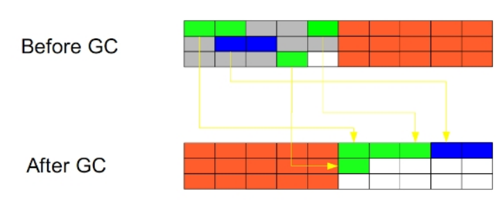

**标记整理法**：
第一步：利用可达性去遍历内存，把存活对象和垃圾对象进行标记；
第二步：将所有的存活的对象向一段移动，将端边界以外的对象都回收掉；
特点：**适用于存活对象多，垃圾少的情况；需要整理的过程，无空间碎片产生**；

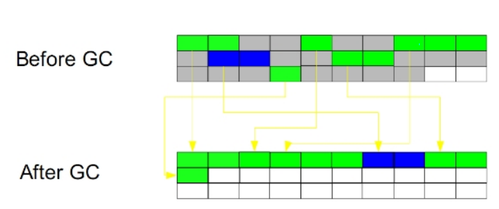

**复制算法**：
将内存按照容量大小分为大小相等的两块，每次只使用一块，当一块使用完了，就将还存活的对象移到另一块上，然后在把使用过的内存空间移除；
特点：**不会产生空间碎片；内存使用率极低；**

**分代收集算法**：
根据内存对象的存活周期不同，将内存划分成几块，java虚拟机一般将内存分成新生代和老生代，**在新生代中，有大量对象死去和少量对象存活，所以采用复制算法，只需要付出少量存活对象的复制成本就可以完成收集**；**老年代中因为对象的存活率极高，没有额外的空间对他进行分配担保，所以采用标记清理或者标记整理算法进行回收；**

**对比**

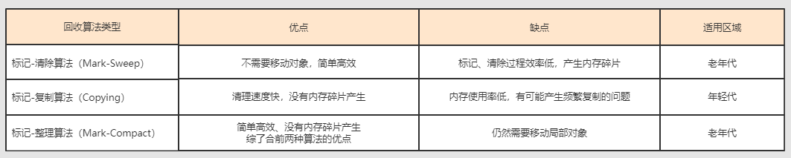

## 有哪几种垃圾回收器，各自的优缺点是什么？

**垃圾回收器主要分为以下几种：Serial、ParNew、Parallel Scavenge、Serial Old、Parallel Old、CMS、G1；**

* **Serial:单线程的收集器，收集垃圾时，必须stop the world，使用复制算法**。它的最大特点是在进行垃圾回收时，需要对所有正在执行的线程暂停（stop the world），对于有些应用是难以接受的，但是如果应用的实时性要求不是那么高，只要停顿的时间控制在N毫秒之内，大多数应用还是可以接受的，是client级别的默认GC方式。

* **ParNew:Serial收集器的多线程版本，也需要stop the world，复制算法。**

* **Parallel Scavenge:新生代收集器，复制算法的收集器，并发的多线程收集器，目标是达到一个可控的吞吐量，和ParNew的最大区别是GC自动调节策略**；虚拟机会根据系统的运行状态收集性能监控信息，动态设置这些参数，以提供最优停顿时间和最高的吞吐量；

* **Serial Old:Serial收集器的老年代版本，单线程收集器，使用标记整理算法。**

* **Parallel Old：是Parallel Scavenge收集器的老年代版本，使用多线程，标记-整理算法。**

* **CMS:是一种以获得最短回收停顿时间为目标的收集器，标记清除算法，运作过程：初始标记，并发标记，重新标记，并发清除，收集结束会产生大量空间碎片；**

* **G1:标记整理算法实现，运作流程主要包括以下：初始标记，并发标记，最终标记，筛选回收。不会产生空间碎片，可以精确地控制停顿；G1将整个堆分为大小相等的多个Region（区域），G1跟踪每个区域的垃圾大小，在后台维护一个优先级列表，每次根据允许的收集时间，优先回收价值最大的区域，已达到在有限时间内获取尽可能高的回收效率；**

**垃圾回收器间的配合使用图：**

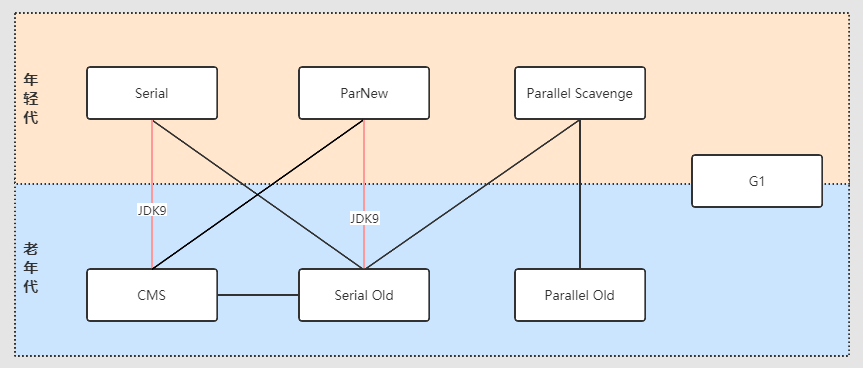

## 详细说一下CMS的回收过程？CMS的问题是什么？

CMS(Concurrent Mark Sweep，并发标记清除) 收集器是以获取最短回收停顿时间为目标的收集器（追求低停顿），它在垃圾收集时使得用户线程和 GC 线程并发执行，因此在垃圾收集过程中用户也不会感到明显的卡顿。

从名字就可以知道，CMS是基于“标记-清除”算法实现的。CMS 回收过程分为以下四步：

1. 初始标记 （CMS initial mark)：主要是标记 GC Root 开始的下级（注：仅下一级）对象，这个过程会 STW，但是跟 GC Root 直接关联的下级对象不会很多，因此这个过程其实很快。

2. 并发标记 (CMS concurrent mark)：根据上一步的结果，继续向下标识所有关联的对象，直到这条链上的最尽头。这个过程是多线程的，虽然耗时理论上会比较长，但是其它工作线程并不会阻塞，没有 STW。

3. 重新标记（CMS remark）：顾名思义，就是要再标记一次。为啥还要再标记一次？因为第 2 步并没有阻塞其它工作线程，其它线程在标识过程中，很有可能会产生新的垃圾。

4. 并发清除（CMS concurrent sweep）：清除阶段是清理删除掉标记阶段判断的已经死亡的对象，由于不需要移动存活对象，所以这个阶段也是可以与用户线程同时并发进行的。

**CMS 的问题：**

**1. 并发回收导致CPU资源紧张：**

在并发阶段，它虽然不会导致用户线程停顿，但却会因为占用了一部分线程而导致应用程序变慢，降低程序总吞吐量。CMS默认启动的回收线程数是：（CPU核数 + 3）/ 4，当CPU核数不足四个时，CMS对用户程序的影响就可能变得很大。

**2. 无法清理浮动垃圾：**

在CMS的并发标记和并发清理阶段，用户线程还在继续运行，就还会伴随有新的垃圾对象不断产生，但这一部分垃圾对象是出现在标记过程结束以后，CMS无法在当次收集中处理掉它们，只好留到下一次垃圾收集时再清理掉。这一部分垃圾称为“浮动垃圾”。

**3. 并发失败（Concurrent Mode Failure）：**

由于在垃圾回收阶段用户线程还在并发运行，那就还需要预留足够的内存空间提供给用户线程使用，因此CMS不能像其他回收器那样等到老年代几乎完全被填满了再进行回收，必须预留一部分空间供并发回收时的程序运行使用。默认情况下，当老年代使用了 92% 的空间后就会触发 CMS 垃圾回收，这个值可以通过 -XX**:** CMSInitiatingOccupancyFraction 参数来设置。

这里会有一个风险：要是CMS运行期间预留的内存无法满足程序分配新对象的需要，就会出现一次“并发失败”（Concurrent Mode Failure），这时候虚拟机将不得不启动后备预案：Stop The World，临时启用 Serial Old 来重新进行老年代的垃圾回收，这样一来停顿时间就很长了。

**4.内存碎片问题：**

CMS是一款基于“标记-清除”算法实现的回收器，这意味着回收结束时会有内存碎片产生。内存碎片过多时，将会给大对象分配带来麻烦，往往会出现老年代还有很多剩余空间，但就是无法找到足够大的连续空间来分配当前对象，而不得不提前触发一次 Full GC 的情况。

为了解决这个问题，CMS收集器提供了一个 -XX**:**+UseCMSCompactAtFullCollection 开关参数（默认开启），用于在 Full GC 时开启内存碎片的合并整理过程，由于这个内存整理必须移动存活对象，是无法并发的，这样停顿时间就会变长。还有另外一个参数 -XX**:**CMSFullGCsBeforeCompaction，这个参数的作用是要求CMS在执行过若干次不整理空间的 Full GC 之后，下一次进入 Full GC 前会先进行碎片整理（默认值为0，表示每次进入 Full GC 时都进行碎片整理）。

## 详细说一下G1的回收过程？

G1（Garbage First）回收器**采用面向局部收集的设计思路和基于Region的内存布局形式，是一款主要面向服务端应用的垃圾回收器**。G1设计初衷就是替换 CMS，成为一种全功能收集器。**G1 在JDK9 之后成为服务端模式下的默认垃圾回收器**，取代了 Parallel Scavenge 加 Parallel Old 的默认组合，而 CMS 被声明为不推荐使用的垃圾回收器。G1从整体来看是基于 标记-整理 算法实现的回收器，但从局部（两个Region之间）上看又是基于 标记-复制 算法实现的。

**G1 回收过程**，G1 回收器的运作过程大致可分为四个步骤：

1. **初始标记（会STW）：仅仅只是标记一下 GC Roots 能直接关联到的对象，并且修改TAMS指针的值，让下一阶段用户线程并发运行时，能正确地在可用的Region中分配新对象。这个阶段需要停顿线程，但耗时很短，而且是借用进行Minor GC的时候同步完成的，所以G1收集器在这个阶段实际并没有额外的停顿。**

2. **并发标记：从 GC Roots 开始对堆中对象进行可达性分析，递归扫描整个堆里的对象图，找出要回收的对象，这阶段耗时较长，但可与用户程序并发执行。当对象图扫描完成以后，还要重新处理在并发时有引用变动的对象。**

3. **最终标记（会STW）：对用户线程做短暂的暂停，处理并发阶段结束后仍有引用变动的对象。**

4. **清理阶段（会STW）：更新Region的统计数据，对各个Region的回收价值和成本进行排序，根据用户所期望的停顿时间来制定回收计划，可以自由选择任意多个Region构成回收集，然后把决定回收的那一部分Region的存活对象复制到空的Region中，再清理掉整个旧Region的全部空间。这里的操作涉及存活对象的移动，必须暂停用户线程，由多条回收器线程并行完成的。**

## JVM中一次完整的GC垃圾回收是什么样子的？

先描述一下Java堆内存划分。

在 Java 中，堆被划分成两个不同的区域：新生代 ( Young )、老年代 ( Old )，新生代默认占总空间的 1/3，老年代默认占 2/3。
新生代有 3 个分区：Eden、To Survivor、From Survivor，它们的默认占比是 8:1:1。

新生代的垃圾回收（又称Minor GC）后只有少量对象存活，所以选用复制算法，只需要少量的复制成本就可以完成回收。

老年代的垃圾回收（又称Major GC）通常使用“标记-清理”或“标记-整理”算法。

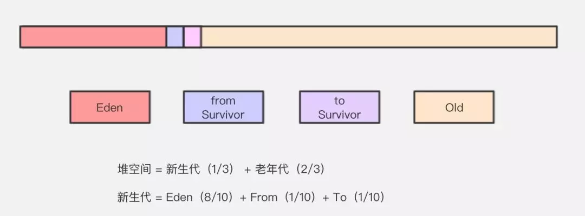

再描述它们之间转化流程：

* 对象优先在Eden分配。当 eden 区没有足够空间进行分配时，虚拟机将发起一次 Minor GC。

  * 在 Eden 区执行了第一次 GC 之后，存活的对象会被移动到其中一个 Survivor 分区；

  - Eden 区再次 GC，这时会采用复制算法，将 Eden 和 from 区一起清理，存活的对象会被复制到 to 区；
  - 移动一次，对象年龄加 1，对象年龄大于一定阀值会直接移动到老年代。GC年龄的阀值可以通过参数 -XX:MaxTenuringThreshold 设置，默认为 15；
  - 动态对象年龄判定：Survivor 区相同年龄所有对象大小的总和 > (Survivor 区内存大小 * 这个目标使用率)时，大于或等于该年龄的对象直接进入老年代。其中这个使用率通过 -XX:TargetSurvivorRatio 指定，默认为 50%；
  - Survivor 区内存不足会发生担保分配，超过指定大小的对象可以直接进入老年代。

* 大对象直接进入老年代，大对象就是需要大量连续内存空间的对象（比如：字符串、数组），为了避免为大对象分配内存时由于分配担保机制带来的复制而降低效率。

* 老年代满了而**无法容纳更多的对象**，Minor GC 之后通常就会进行Full GC，Full GC 清理整个内存堆 – **包括年轻代和老年代**。

## Minor GC 和 Full GC 垃圾回收有什么不同呢？

Minor GC：只收集新生代的GC。

Full GC: 收集整个堆，包括 新生代，老年代，永久代(在 JDK 1.8及以后，永久代被移除，换为metaspace 元空间)等所有部分的模式。

**Minor GC触发条件：**当Eden区满时，触发Minor GC。

**Full GC触发条件**：

* 通过Minor GC后进入老年代的平均大小大于老年代的可用内存。如果发现统计数据说之前Minor GC的平均晋升大小比目前old gen剩余的空间大，则不会触发Minor GC而是转为触发full GC。
* 老年代空间不够分配新的内存（或永久代空间不足，但只是JDK1.7有的，这也是用元空间来取代永久代的原因，可以减少Full GC的频率，减少GC负担，提升其效率）。
* 由Eden区、From Space区向To Space区复制时，对象大小大于To Space可用内存，则把该对象转存到老年代，且老年代的可用内存小于该对象大小。
* 调用System.gc时，系统建议执行Full GC，但是不必然执行。

## 介绍下空间分配担保原则？

如果YougGC时新生代有大量对象存活下来，而 survivor 区放不下了，这时必须转移到老年代中，但这时发现老年代也放不下这些对象了，那怎么处理呢？**其实JVM有一个老年代空间分配担保机制来保证对象能够进入老年代。**

在执行每次 YoungGC 之前，JVM会先检查老年代最大可用连续空间是否大于新生代所有对象的总大小。因为在极端情况下，可能新生代 YoungGC 后，所有对象都存活下来了，而 survivor 区又放不下，那可能所有对象都要进入老年代了。这个时候如果老年代的可用连续空间是大于新生代所有对象的总大小的，那就可以放心进行 YoungGC。但**如果老年代的内存大小是小于新生代对象总大小的，那就有可能老年代空间不够放入新生代所有存活对象，这个时候JVM就会先检查 -XX:HandlePromotionFailure 参数是否允许担保失败，如果允许，就会判断老年代最大可用连续空间是否大于历次晋升到老年代对象的平均大小，如果大于，将尝试进行一次YoungGC，尽快这次YoungGC是有风险的。如果小于，或者 -XX:HandlePromotionFailure 参数不允许担保失败，这时就会进行一次 Full GC。**

在允许担保失败并尝试进行YoungGC后，可能会出现三种情况：

- ① YoungGC后，存活对象小于survivor大小，此时存活对象进入survivor区中
- ② YoungGC后，存活对象大于survivor大小，但是小于老年代可用空间大小，此时直接进入老年代。
- ③ YoungGC后，存活对象大于survivor大小，也大于老年大可用空间大小，老年代也放不下这些对象了，此时就会发生“Handle Promotion Failure”，就触发了 Full GC。如果 Full GC后，老年代还是没有足够的空间，此时就会发生OOM内存溢出了。

## 列举一些你知道的打破双亲委派机制的例子，为什么要打破？

- JNDI 通过引入线程上下文类加载器，可以在 Thread.setContextClassLoader 方法设置，默认是应用程序类加载器，来加载 SPI 的代码。有了线程上下文类加载器，就可以完成父类加载器请求子类加载器完成类加载的行为。打破的原因，是为了 JNDI 服务的类加载器是启动器类加载，为了完成高级类加载器请求子类加载器（即上文中的线程上下文加载器）加载类。

- **Tomcat，应用的类加载器优先自行加载应用目录下的 class，并不是先委派给父加载器，加载不了才委派给父加载器。**

  tomcat之所以造了一堆自己的classloader，大致是出于下面三类目的：

  - 对于各个 `webapp`中的 `class`和 `lib`，**需要相互隔离**，不能出现一个应用中加载的类库会影响另一个应用的情况，而对于许多应用，**需要有共享**的lib以便不浪费资源。
  - 与 `jvm`一样的安全性问题。使用单独的 `classloader`去装载 `tomcat`自身的类库，**以免其他恶意或无意的破坏**；
  - **热部署**。

  tomcat类加载器如下图：

  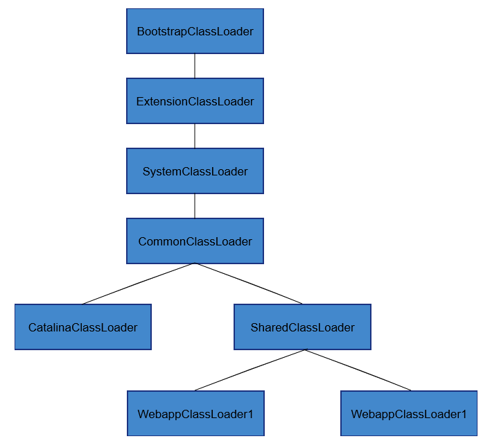

- **OSGi，实现模块化热部署，**为每个模块都自定义了类加载器，需要更换模块时，模块与类加载器一起更换。其类加载的过程中，有平级的类加载器加载行为。打破的原因是**为了实现模块热替换**。

- **JDK 9，Extension ClassLoader 被 Platform ClassLoader 取代**，当平台及应用程序类加载器收到类加载请求，在委派给父加载器加载前，要先判断该类是否能够归属到某一个系统模块中，如果可以找到这样的归属关系，就要优先委派给负责那个模块的加载器完成加载。**打破的原因，是为了添加模块化的特性**。

## 说一下 JVM 调优的命令？

* **jps：JVM Process Status Tool**,显示指定系统内所有的HotSpot虚拟机进程。
* **jstat：(JVM statistics Monitoring)**用于监视虚拟机运行时状态信息的命令，它可以显示出虚拟机进程中的类装载、内存、垃圾收集、JIT编译等运行数据。
* **jmap：(JVM Memory Map)**用于生成heap dump文件，如果不使用这个命令，还阔以使用-XX:+HeapDumpOnOutOfMemoryError参数来让虚拟机出现OOM的时候·自动生成dump文件。
  jmap不仅能生成dump文件，还阔以查询finalize执行队列、Java堆和永久代的详细信息，如当前使用率、当前使用的是哪种收集器等。
* **jhat：(JVM Heap Analysis Tool)**是与jmap搭配使用，用来分析jmap生成的dump，jhat内置了一个微型的HTTP/HTML服务器，生成dump的分析结果后，可以在浏览器中查看。在此要注意，一般不会直接在服务器上进行分析，因为jhat是一个耗时并且耗费硬件资源的过程，一般把服务器生成的dump文件复制到本地或其他机器上进行分析。
* **jstack**：用于生成java虚拟机当前时刻的线程快照。jstack来查看各个线程的调用堆栈，就可以知道没有响应的线程到底在后台做什么事情，或者等待什么资源。 如果java程序崩溃生成core文件，jstack工具可以用来获得core文件的java stack和native stack的信息，从而可以轻松地知道java程序是如何崩溃和在程序何处发生问题。

## 介绍一下Java运行时数据区域,并说一下每个部分都存哪些内容?

回答:**Java的运行时区主要包含堆、方法区、虚拟机栈、程序计数器和本地方法栈,其中堆和方法区是所有线程所共有的。而且虚拟机栈、程序计数器和本地方法栈是线程所私有的。**

**堆:存放对象实例**

**方法区:用来存储已经被虚拟机加载的类型信息、常量、静态变量、即时编译器编译后的代码缓存等数据。**

**虚拟机栈:(生命周期与线程相同)Java中每个方法执行的时候,Java虚拟机都会同步创建一个栈帧,用于存储局部变量表、操作数栈、动态链接、方法出口等信息。**

**程序计数器:保存下一条需要执行的字节码指令,是程序控制流的指示器,分支、循环、跳转、异常处理、线程恢复等基础功能都是依赖程序计数器。**

**本地方法栈:与虚拟机栈类似**

## 程序计数器可以为空吗?

**可以为空,当执行的是本地方法时。**

## 堆中又怎么细分的?

**堆中可以细分为新生代和老年代,其中新生代又分为Eden区,From Survivo和To Survivor区,比例是8:1:1。**

## 哪些区域会造成OOM

**除了程序计数器不会产生OOM,其余的均可以产生OOM。**


## Java中对象的创建过程是什么样的?

Java中对象的创建过程为5步

**(1)当遇到new关键字的时候,首先检查这个指令的参数是否可以在常量池中定位到一个类的符号引用,并检查这个符号引用代表的类是否已被加载、解析和初始化。**

**(2)在类加载检查后,接下来需要为新对象分配内存。**

**(3)需要将分配到的内存空间都初始化为零。**

**(4)需要对对象进行相关的设置,比如这个对象是哪个类的实例、如何才能找到类的元数据信息、对象的GC分代年龄等信息。**
**(5)执行()方法。**

## 内存分配的策略有哪些?

**Java中的内存分配策略主要有两种,分别是指针碰撞和空闲列表。**

**指针碰撞:假设Java堆中的内存都是规整的,所有被使用过的放在一边,未使用过的放在一边,中间有一个指针作为分界,分配内存仅仅需要把这个指针向空闲空间方向移动一段即可。**

**空闲列表:如果Java堆中的内存不是规整的,已使用过的和空闲的交错,虚拟机就需要维护一个列表,记录哪些内存是可用的,在分配的时候找到足够大的一块内存进行分配。**

## 对象头包含哪些?

虚拟机中对象头包含两类信息,第一类是用于存储对象自身**运行时数据**、如哈希码、GC分代年龄、线程持有的锁、偏向线程ID、偏向时间戳。对象的另外一部分是**类型指针**,即对象指向它的类型元数据的指针。

## 对象的访问定位方法有几种,各有什么优缺点?

Java虚拟机中对象的访问方式有**使用句柄**和**直接指针**两种。

1. 句柄: 如果使用句柄的话,那么Java堆中将会划分出一块内存来作为句柄池,reference 中存储的就是对象的句柄地址,而句柄中包含了对象实例数据与类型数
据各自的具体地址信息;
2. 直接指针: 如果使用直接指针访问,那么 Java 堆对象的布局中就必须考虑如何放置访问类型数据的相关信息,而reference 中存储的直接就是对象的地址。

总结:**使用句柄最大的好处就是reference中存储的是稳定句柄地址,在对象移动时只会改变句柄中的实例数据指针,而reference本身不需要被修改。使用直接指针访问方式最大的好处就是速度快,它节省了一次指针定位的时间开销。**

## 如何判断对象已死?

Java中判断对象死亡的方法有**引用计数法**和**可达性分析**。

**引用计数法:对象中添加一个引用计数器,每当有一个地方引用它,计数器就加1;当引用失效,计数器就减1;任何时候计数器为0的对象就是不可能再被使用的。**

**可达性分析:通过一系列的GC Roots的根对象作为 起始节点,从这些节点开始,根据引用关系向下搜索,如果某个对象到GC Roots间没有任何引用链相连。**

## 被标志为GC的对象一定会被GC掉吗?

**不一定,还有逃脱的可能**。真正宣告一个对象死亡至少经历两次标记的过程。如果对象进行可达性分析后没有与GC Roots相连,那么这是第一次标记,之后会在进行一次筛选,**筛选的条件是是否有必要执行finalize()方法**。【详细可以看课本《深入理解Java虚拟机》】

## 为什么新生代不使用标记清除算法?

在新生代中,每次垃圾收集时都发现有大批对象死去,只有少量存活,那就选用复制算法,只需要付出少量存活对象的复制成本就可以完成收集。而老年代中因为对象存活率高、没有额外空间对它进行分配担保,就必须使用“标记—清理”或者“标记—整理”算法来进行回收。

## 垃圾回收器有哪些?

垃圾回收器可以在新生代和老年代都有,在**新生代有Serial、ParNew、Parallel Scavenge**;**老年代有CMS、Serial Old、Parallel Old**;还有**不区分年代的G1算法。**

## G1垃圾回收器的改进是什么?相比于CMS突出的地方是什么?

G1垃圾回收器抛弃了分代的概念,将堆内存划分为大小固定的几个独立区域,并维护一个优先级列表,在垃圾回收过程中根据系统允许的最长垃圾回收时间,优先回收垃圾最多的区域。**(G1算法是可控STW的一种算法,GC收集器和我们GC调优的目标就是尽可能的减少STW的时间和次数。)

G1突出的地方:基**于标记整理算法,不产生垃圾碎片**。**可以精确的控制停顿时间,在不牺牲吞吐量的前提下实现短停顿垃圾回收。**

## 现在jdk默认使用的是哪种垃圾回收器?

jdk1.7 默认垃圾收集器Parallel Scavenge(新生代)+Parallel Old(老年代)

**jdk1.8 默认垃圾收集器Parallel Scavenge(新生代)+Parallel Old(老年代)**

**jdk1.9 默认垃圾收集器G1**

## jvm调优了解过吗?常用的命令和工具有哪些?

**Linux中有top、vmstat、pidstat**,**jdk中的jstat、jstack、jps、jmap**等。(建议详细去看看这些命令的区别和作用,都可能会被问到)

## 内存持续上升,如何排查?

 CPU100%那么一定有线程在占用系统资源, 找出哪个进程cpu高(top),该进程中的哪个线程cpu高(top -Hp) , 导出该线程的堆栈 (jstack) , 查找哪个方法(栈帧)消
耗时间 (jstack) 工作线程占比高 | 垃圾回收线程占比高 。【详细可以到网络搜索,最好是自己清楚这个排查思路!】

(1)通过top找到占用率高的进程

(2)通过top -Hp pid找到占用CPU高的线程ID

(3)把线程ID转化为16进制,得到线程IDxx

(4)通过命令jstack 找到有问题的代码

## jstack和jsp的区别是什么?

**jstack:(Stack Trace for Java)命令用于生成虚拟机当前时刻的线程快照。**

线程快照就是当前虚拟机内每一条线程正在执行的方法堆栈的集合,生成线程快照的主要目的是定位线程出现长时间停顿的原因,如线程间死锁、死循环、请求外部资源导致的长时间等待等都是导致线程长时间停顿的常见原因。

在代码中可以用java.lang.Thread类的getAllStackTraces()方法用于获取虚拟机中所有线程的StackTraceElement对象。使用这个方法可以通过简单的几行代码就完成jstack的大部分功能,在实际项目中不妨调用这个方法做个管理员页面,可以随时使用浏览器来查看线程堆栈。

jps : 列出当前机器上正在运行的虚拟机进程

-p :仅仅显示VM 标示,不显示jar,class, main参数等信息.

-m:输出主函数传入的参数. 下的hello 就是在执行程序时从命令行输入的参数

-l: 输出应用程序主类完整package名称或jar完整名称.

-v: 列出jvm参数, -Xms20m -Xmx50m是启动程序指定的jvm参数

## 什么叫双亲委派机制?

**双亲委派机制是指一个类在收到类加载请求后不会尝试自己加载这个类,而且把这该类加载请求委派给其父类去完成,父类在接收到该加载请求后又会将其委派给自己的父类,以此类推,这样所有的类加载请求都被向上委派到启动类加载器中。若父类加载器在接收到类加载请求后发现自己也无法加载该类,则父类会将该请求反馈给子类向下委派子类加载器加载该类,直到被加载成功,若找不到会曝出异常。**

## 如何打破双亲委派机制?

**重写一个类继承ClassLoader,并重写loadClass方法。(Tomcat是不支持双亲委派机制的)**

## jvm组成结构

我们先来研究一下jvm的组成结构都有哪些

**jvm结构图**

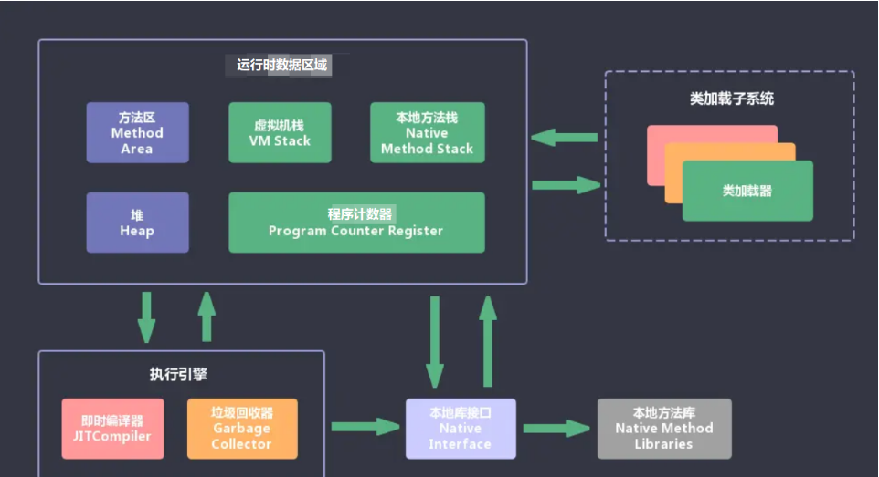

**类加载子系统**

负责从文件系统或是网络中加载class信息，加载的信息存放在一个称之为`方法区`的内存空间

**方法区**

用于存放类的信息、常量信息、常量池信息、包括字符串字面量和数字常量。**我们常用的反射就是从这个方法区里读取的类信息**

**Java堆**

**堆空间是jvm启动的时候创建的一块内存区域，几乎所有的对象实例都放在这个空间里**（可以理解成new 出来的那些对象）。

这个区域被划分为新生代和老年的，之后重点讲解，我们常说的GC垃圾回收机制，就是主要回收堆空间的垃圾数据。

堆空间里的数据，是被所有线程共享的，所以会存在线程安全的问题。所以那些锁就是为了解决堆空间数据线程安全的问题而生的。

**直接内存**

直接内存并不是虚拟机运行时数据区的一部分，也不是虚拟机规范中定义的内存区域，但这部分也是被频繁的读写使用，也可能会导致`OutOfMemoryError`异常的出现。

Java的`NIO`中的allocateDirect方法是可以直接使用直接内存的，能显著的提高读写的速度。

**Java栈**

就是我们常说的堆栈两兄弟之一的栈，所有线程共享堆空间里的数据，但是栈空间是每个线程独有的，互相直接不能访问。

**栈空间是线程创建的时候所创建的一份内存空间**，栈里主要保存一些局部变量、方法参数、Java方法调用，返回值等信息。

**本地方法栈**

本地方法栈和Java栈不同之处在于，可以直接调用Java本地方法，即JDK中用native修饰的方法。

**垃圾收集系统**

GC垃圾回收，是一个非常重要的知识点，保证我们程序能够有足够的内存空间运行，回收掉内存中已经无效的数据，大家就可以理解成我们日常中活中的垃圾回收。

回收算法一般有`标记清除`算法、`复制`算法、`标记整理`算法等等，之后的文章，我们会详解讲解每一种算法。

**PC寄存器**

它是每个线程私有的空间，JVM会为每个线程创建单独的PC寄存器，在任意时刻，一个Java线程总是在执行一个方法，这个方法被称为当前方法，如果当前方法不是本地方法，PC寄存器会执行当前正在被执行的指令，如果是本地方法，则PC寄存器值为undefined，寄存器存放如当前环境指针、程序计数器、操作栈指针、计算的变量指针等信息。

**执行引擎**

是jvm非常核心的组件，它负责执行jvm的字节码，一般先会编译成机器码后执行。

## 使用类加载特性初始化单例模式

```java
public final class Singleton{
    private Singleton(){}
    private static class Lazy{
        static final Singleton INSTANCE=new Singleton();
    }
    public static Singleton getInstance(){
        return Lazy.INSTANCE;
    }
}
```

以上的实现特点是：

* 懒惰实例化
* 初始化时的线程安全是有保障的

## 类加载器命名空间

* 每个类加载器都有自己的命名空间，命名空间由该加载器及所有的父加载器所加载的类组成
* 在同一命名空间中，不会出现类的完整名字(包括类的包名)相同的两个类
* 在不同的命名空间中，有可能会出现类的完整名字(包括类的包名)相同的两个类

## 何为类的唯一性？

对于任意一个类，都需要由加载它的类加载器和这个类本身一同确认其在Java虚拟机中的唯一性。 每一个类加载器，都拥有一个独立的类名称空间:**比较两个类是否相等，只有在这两个类是由同一个类加载器加载的前提下才有意义**。否则即使这两个类源自同一个Class文件，被同一个虚拟机加载，只要加载他们的类加载器不同，那这两个类就必定不相等。

## 类加载器的分类

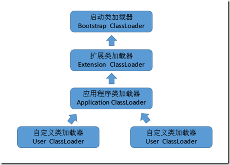

- **第一个：启动类/引导类：Bootstrap ClassLoader**

这个类加载器使用C/C++语言实现的，嵌套在JVM内部，java程序无法直接操作这个类。

它用来加载Java核心类库，如：`JAVA_HOME/jre/lib/rt.jar`、`resources.jar`、`sun.boot.class.path`路径下的包，用于提供jvm运行所需的包。

并不是继承自java.lang.ClassLoader，它没有父类加载器

它加载`扩展类加载器`和`应用程序类加载器`，并成为他们的父类加载器

出于安全考虑，启动类只加载包名为：java、javax、sun开头的类

- **第二个：扩展类加载器：Extension ClassLoader**

Java语言编写，由`sun.misc.Launcher$ExtClassLoader`实现，我们可以用Java程序操作这个加载器

派生继承自java.lang.ClassLoader，父类加载器为`启动类加载器`

从系统属性：`java.ext.dirs`目录中加载类库，或者从JDK安装目录：`jre/lib/ext`目录下加载类库。我们就可以将我们自己的包放在以上目录下，就会自动加载进来了。

- **第三个：应用程序类加载器：Application Classloader**

Java语言编写，由`sun.misc.Launcher$AppClassLoader`实现。

派生继承自java.lang.ClassLoader，父类加载器为`启动类加载器`

它负责加载`环境变量classpath`或者`系统属性java.class.path`指定路径下的类库

它是程序中默认的类加载器，我们Java程序中的类，都是由它加载完成的。

我们可以通过`ClassLoader#getSystemClassLoader()`获取并操作这个加载器

- **第四个：自定义加载器**

一般情况下，以上3种加载器能满足我们日常的开发工作，不满足时，我们还可以`自定义加载器`

比如用网络加载Java类，为了保证传输中的安全性，采用了加密操作，那么以上3种加载器就无法加载这个类，这时候就需要`自定义加载器`

## 自定义加载器实现步骤

继承`java.lang.ClassLoader`类，重写findClass()方法

如果没有太复杂的需求，可以直接继承`URLClassLoader`类，重写`loadClass`方法，具体可参考`AppClassLoader`和`ExtClassLoader`。

## 获取ClassLoader几种方式

它是一个抽象类，其后所有的类加载器继承自 ClassLoader（不包括启动类加载器）

```java
// 方式一：获取当前类的 ClassLoader
clazz.getClassLoader()

// 方式二：获取当前线程上下文的 ClassLoader
Thread.currentThread().getContextClassLoader()

// 方式三：获取系统的 ClassLoader
ClassLoader.getSystemClassLoader()

// 方式四：获取调用者的 ClassLoader
DriverManager.getCallerClassLoader()
```

## 自定义类加载器

```java
    @Override
    protected Class<?> findClass(String className) throws ClassNotFoundException {
        BufferedInputStream bis = null;
        ByteArrayOutputStream baos = null;
//获取字节码完整路径
        String filename = byteCodePath + className + ".class";
        try {
//获取一个输入流
            bis = new BufferedInputStream(new FileInputStream(filename));
//获取一个输出流
            baos = new ByteArrayOutputStream();
//具体读入数据并写出的过程
            int len;
            byte[] data = new byte[1024];
            while ((len = bis.read(data)) != -1) {
                baos.write(data, 0, len);
            }
//获取内存中的完整的字节数组
            byte[] byteCodes = baos.toByteArray();
///调用defineclass()，将字节数组的数据转换为CLass的实例。
            Class<?> aClass = defineClass(className, byteCodes, 0,
                    byteCodes.length);
            return aClass;
        } catch (IOException e) {
            e.printStackTrace();
            throw new ClassNotFoundException("类文件未找到", e);
        } finally {
            try {
                if (baos != null) {
                    baos.close();
                }
            } catch (IOException e) {
                e.printStackTrace();
            }
            try {
                if (bis != null) {
                    bis.close();
                }
            } catch (IOException e) {
                e.printStackTrace();
            }
        }
    }
}

```

## 第三方包加载方式：反向委派机制

在Java应用中存在着很多**服务提供者接口（Service Provider Interface，SPI）**，这些接口允许第三方为它们提供实现，如常见的 SPI 有 JDBC、JNDI等，这些 SPI 的接口属于 Java 核心库，一般存在rt.jar包中，由Bootstrap类加载器加载。而Bootstrap类加载器无法直接加载SPI的实现类，同时由于双亲委派模式的存在，Bootstrap类加载器也无法反向委托AppClassLoader加载器SPI的实现类。在这种情况下，我们就需要一种特殊的类加载器来加载第三方的类库，而线程上下文类加载器（双亲委派模型的破坏者）就是很好的选择。

从图可知rt.jar核心包是有Bootstrap类加载器加载的，其内包含SPI核心接口类，由于SPI中的类经常需要调用外部实现类的方法，而jdbc.jar包含外部实现类(jdbc.jar存在于classpath路径)无法通过Bootstrap类加载器加载，因此只能委派线程上下文类加载器把jdbc.jar中的实现类加载到内存以便SPI相关类使用。显然这种线程上下文类加载器的加载方式破坏了“双亲委派模型”，它在执行过程中抛弃双亲委派加载链模式，使程序可以逆向使用类加载器，当然这也使得Java类加载器变得更加灵活。

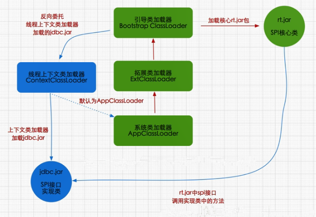

## 沙箱安全机制

自定义 String 类，但是在加载自定义 String 类的时候会率先使用引导类加载器加载，而引导类加载器在加载的过程中会先加载 JDK 自带的文件（rt.jar 包中的 java\lang\String.class），报错信息说没有 main 方法就是因为加载的 rt.jar 包中的 String 类。这样可以保证对 Java 核心源代码的保护，这就是沙箱安全机制。

## 引用计数法

**给每个对象添加一个计数器`RC`，当有地方引用该对象时计数器加1，当引用失效时计数器减1。用对象计数器是否为0来判断对象是否可被回收。`缺点`：无法解决循环引用的问题。**


先创建一个字符串，String m = new String("jack");，这时候 "jack" 有一个引用，就是m。然后将m设置为null，这时候 "jack" 的引用次数就等于 0 了，在引用计数算法中，意味着这块内容就需要被回收了。


引用计数算法是将垃圾回收分摊到整个应用程序的运行当中了，而不是在进行垃圾收集时，要挂起整个应用的运行，直到对堆中所有对象的处理都结束。因此，采用引用计数的垃圾收集不属于严格意义上的Stop-The-World的垃圾收集机制。

看似很美好，但我们知道JVM的垃圾回收就是Stop-The-World的，那是什么原因导致我们`最终放弃`了`引用计数算法`呢？看下面的例子。

```java
public class ReferenceCountingGC {

  public Object instance;

  public ReferenceCountingGC(String name) {
  }

  public static void testGC(){

    ReferenceCountingGC a = new ReferenceCountingGC("objA");
    ReferenceCountingGC b = new ReferenceCountingGC("objB");

    // a和b互相引用了
    a.instance = b;
    b.instance = a;

    a = null;
    b = null;
  }
}
```

我们可以看到，最后这2个对象已经不可能再被访问了，但由于他们`相互引用`着对方，导致它们的引用计数永远都不会为0，通过引用计数算法，也就`永远无法通知`GC收集器回收它们。

## 可达性分析算法

通过`GC ROOT`的对象作为搜索起始点，通过引用向下搜索，所走过的路径称为引用链。通过对象是否有到达引用链的路径来判断对象是否可被回收（可作为GC ROOT的对象：虚拟机栈中引用的对象，方法区中类静态属性引用的对象，方法区中常量引用的对象，本地方法栈中JNI引用的对象）


**通过可达性算法，成功解决了引用计数所无法解决的循环依赖问题**，只要你无法与`GC Root`建立直接或间接的连接，系统就会判定你为可回收对象。那这样就引申出了另一个问题，哪些属于`GC Root`。

**Java内存区域中可以作为GC ROOT的对象：**

**虚拟机栈中引用的对象**

```java
public class StackLocalParameter {

  public StackLocalParameter(String name) {}

  public static void testGC() {
    StackLocalParameter s = new StackLocalParameter("localParameter");
    s = null;
  }
}
```

此时的s，即为GC Root，当s置空时，localParameter对象也断掉了与GC Root的引用链，将被回收。

**方法区中类静态属性引用的对象**

```java
public class MethodAreaStaicProperties {

  public static MethodAreaStaicProperties m;

  public MethodAreaStaicProperties(String name) {}

  public static void testGC(){
    MethodAreaStaicProperties s = new MethodAreaStaicProperties("properties");
    s.m = new MethodAreaStaicProperties("parameter");
    s = null;
  }
}
```

此时的s，即为GC Root，s置为null，经过GC后，s所指向的properties对象由于无法与GC Root建立关系被回收。而m作为类的静态属性，也属于GC Root，parameter 对象依然与GC root建立着连接，所以此时parameter对象并不会被回收。

**方法区中常量引用的对象**

```java
public class MethodAreaStaicProperties {

  public static final MethodAreaStaicProperties m = MethodAreaStaicProperties("final");

  public MethodAreaStaicProperties(String name) {}

  public static void testGC() {
    MethodAreaStaicProperties s = new MethodAreaStaicProperties("staticProperties");
    s = null;
  }
}
```

m即为方法区中的常量引用，也为GC Root，s置为null后，final对象也不会因没有与GC Root建立联系而被回收。

**本地方法栈中引用的对象**

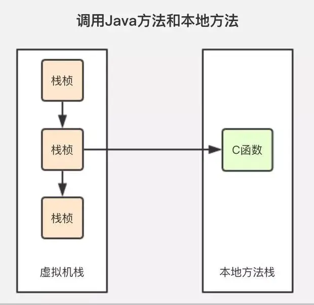

任何native接口都会使用某种本地方法栈，实现的本地方法接口是使用C连接模型的话，那么它的本地方法栈就是C栈。当线程调用Java方法时，虚拟机会创建一个新的栈帧并压入Java栈。然而当它调用的是本地方法时，虚拟机会保持Java栈不变，不再在线程的Java栈中压入新的帧，虚拟机只是简单地动态连接并直接调用指定的本地方法。

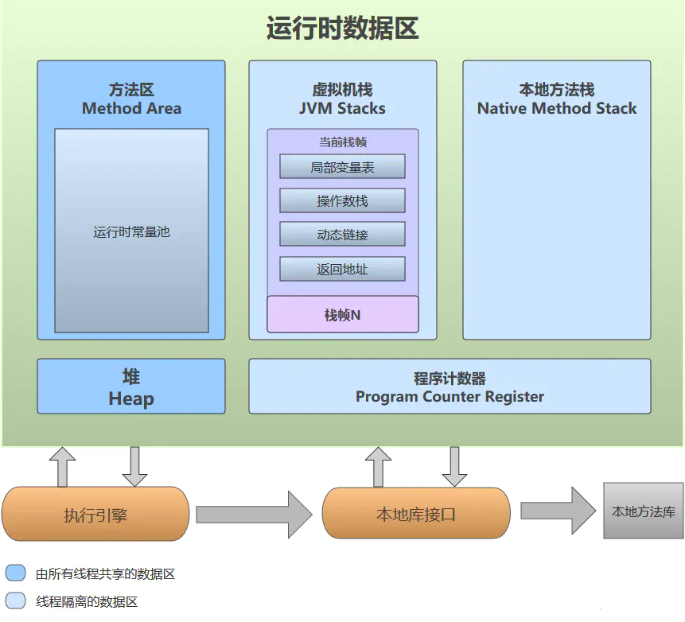


## 标记-清除算法

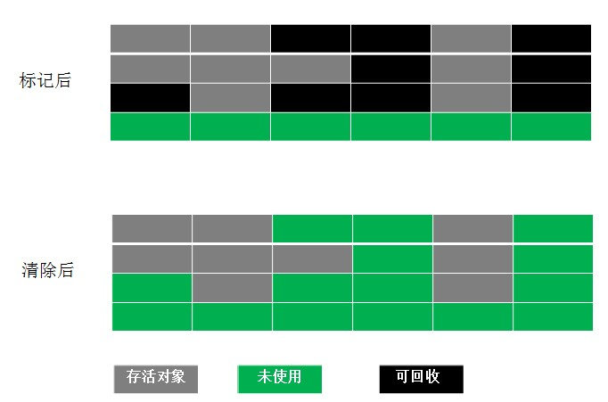

`标记清除算法`（Mark-Sweep）是最基础的一种垃圾回收算法，它分为2部分，先把内存区域中的这些对象进行标记，哪些属于可回收标记出来，然后把这些垃圾拎出来清理掉。就像上图一样，清理掉的垃圾就变成未使用的内存区域，等待被再次使用。

记录对象所占用的起始结束地址记录 放在一个空闲的计时列表里 下次分配新对象的时候 在空闲的计时列表中找 有没有一块足够的空间容纳新的对象 如果有进行内存分配 并不是将里面的字节清0

**优点:速度快 只记录清除的地址就好**
**缺点：不连续 容易照成内存碎片 会造成内存溢出的问题**

## 复制算法

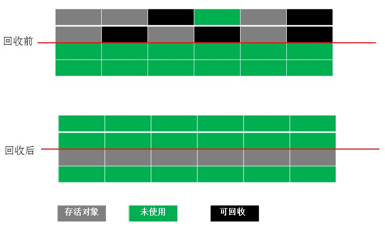

`复制算法`（Copying）是在标记清除算法基础上演化而来，解决标记清除算法的内存碎片问题。**不会有内存碎片 需要占用双倍内存空间**

## 标记-压缩算法

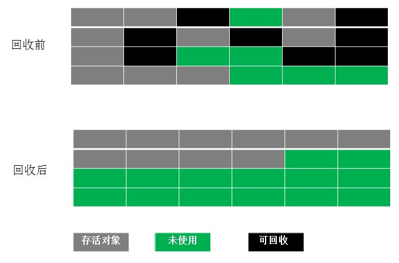

标记-压缩算法标记过程仍然与标记-清除算法一样，但后续步骤不是直接对可回收对象进行清理，而是让所有存活的对象都向一端移动，再清理掉端边界以外的内存区域。

标记压缩算法解决了内存碎片的问题，也规避了复制算法只能利用一半内存区域的弊端。标记压缩算法对内存变动更频繁，需要**整理所有存活对象的引用地址，在效率上比复制算法要差很多**。

## 分代收集算法

分代收集算法分代收集算法严格来说并不是一种思想或理论，而是融合上述3种基础的算法思想，而产生的针对不同情况所采用不同算法的一套组合拳，根据对象存活周期的不同将内存划分为几块。

**在新生代中**，每次垃圾收集时都发现有大批对象死去，只有少量存活，那就**选用复制算法**，只需要付出少量存活对象的复制成本就可以完成收集。

**在老年代中**，因为对象存活率高、没有额外空间对它进行分配担保，就必须**使用标记-清理算法或者标记-整理算法**来进行回收。

## 堆内存详解


上面这个图大家应该已经很明白了吧。大家就可以理解成一个`房子`被分成了几个`房间`，每个房间的作用不同而已，有的是婴儿住的，有的是父母住的，有的是爷爷奶奶住的

- 堆内存被划分为`两块`，一块的`年轻代`，另一块是`老年代`。

- 年轻代又分为`Eden`和`survivor`。他俩空间大小比例默认为8:2,

- 幸存区又分为`s0`和`s1`。这两个空间大小是一模一样的，就是一对双胞胎，他俩是1:1的比例

## 堆内存垃圾回收过程

第一步

`新生成`的对象首先放到`Eden`区，当Eden区`满了`会触发`Minor GC`。

第二步

第一步GC活下来的对象，会被移动到`survivor`区中的S0区，S0区满了之后会触发`Minor GC`，S0区存活下来的对象会被移动到S1区，S0区空闲。

S1满了之后在GC，存活下来的再次移动到S0区，S1区空闲，这样反反复复GC，每GC一次，对象的年龄就`涨一岁`，达到某个值后（15），就会进入`老年代`。

第三步

在发生一次`Minor GC`后（前提条件），老年代可能会出现`Major GC`，这个视垃圾回收器而定。

Full GC触发条件

- 手动调用System.gc，会不断的执行Full GC

- 老年代空间不足/满了

- 方法区空间不足/满了

注意

们需要记住一个单词：`stop-the-world`。它会在**任何一种GC算法中**发生。stop-the-world 意味着JVM因为需要执行GC而`停止`应用程序的执行。

当stop-the-world 发生时，除GC所需的线程外，所有的`线程`都进入`等待`状态，直到GC任务完成。GC优化很多时候就是减少stop-the-world 的发生。

## 回收哪些区域的对象

需要注意的是，**JVM GC只回收`堆内存`和`方法区内`的对象**。而`栈内存`的数据，在超出作用域后会被JVM自动释放掉，所以其不在JVM GC的管理范围内。

## 堆内存常见参数配置

| 参数                       | 描述                                                         |
| -------------------------- | ------------------------------------------------------------ |
| -Xms                       | 堆内存初始大小，单位m、g                                     |
| -Xmx                       | 堆内存最大允许大小，一般不要大于物理内存的80%                |
| -XX:PermSize               | 非堆内存初始大小，一般应用设置初始化200m，最大1024m就够了    |
| -XX:MaxPermSize            | 非堆内存最大允许大小                                         |
| -XX:NewSize（-Xns）        | 年轻代内存初始大小                                           |
| -XX:MaxNewSize（-Xmn）     | 年轻代内存最大允许大小                                       |
| -XX:SurvivorRatio=8        | 年轻代中Eden区与Survivor区的容量比例值，默认为8，即8:1       |
| -Xss                       | 堆栈内存大小                                                 |
| -XX:NewRatio=老年代/新生代 | 设置老年代和新生代的大小比例                                 |
| -XX:+PrintGC               | jvm启动后，只要遇到GC就会打印日志                            |
| -XX:+PrintGCDetails        | 查看GC详细信息，包括各个区的情况                             |
| -XX:MaxDirectMemorySize    | 在NIO中可以直接访问**直接内存**，这个就是设置它的大小，不设置默认就是最大堆空间的值-Xmx |
| -XX:+DisableExplicitGC     | 关闭System.gc()                                              |
| -XX:MaxTenuringThreshold   | 垃圾可以进入老年代的年龄                                     |
| -Xnoclassgc                | 禁用垃圾回收                                                 |
| -XX:TLABWasteTargetPercent | TLAB占eden区的百分比，默认是1%                               |
| -XX:+CollectGen0First      | FullGC时是否先YGC，默认false                                 |

## TLAB 内存（线程本地分配缓存）

**TLAB全称是Thread Local Allocation Buffer即`线程本地分配缓存`**，从名字上看**是一个线程专用的内存分配区域，是为了加速对象分配而生的。**

每一个线程都会产生一个TLAB，该线程独享的工作区域，java虚拟机使用这种TLAB区来避免多线程冲突问题，提高了对象分配的效率。

TLAB空间一般不会太大，当大对象无法在TLAB分配时，则会直接分配到堆上。

**TLAB分配的对象可以共享吗？**

一句话，只要是Heap上的对象，所有线程都是可以共享的，就看你有没有本事访问到了。在GC的时候只从root sets来扫描对象，而不管你到底在哪个TLAB中。

当确定对象不会发生方法逃逸时，可在线程栈上分配对象。此时对象生命周期和方法相同，随栈帧出栈时即可销毁，不需要GC了。

在运行时分析对象的生命周期，如果发现该对象只会被本线程使用（一般是一些局部对象），那么就将该对象在栈上分配，而不在堆中（heap）分配，以减少对象对堆的压力，减少GC的次数

逃逸是指在某个方法之内创建的对象，除了在方法体之内被引用之外，还在方法体之外被其它变量引用到；这样带来的后果是在该方法执行完毕之后，该方法中创建的对象将无法被GC回收，由于其被其它变量引用。正常的方法调用中，方法体中创建的对象将在执行完毕之后，将回收其中创建的对象；故由于无法回收，即成为逃逸。

| 参数                        | 描述                                                         |
| --------------------------- | ------------------------------------------------------------ |
| -Xx:+UseTLAB                | 使用TLAB                                                     |
| -XX:+TLABSize               | 设置TLAB大小                                                 |
| -XX:TLABRefillWasteFraction | 设置维护进入TLAB空间的单个对象大小，他是一个比例值，默认为64，即如果对象大于整个空间的1/64，则在堆创建 |
| -XX:+PrintTLAB              | 查看TLAB信息                                                 |
| -Xx:ResizeTLAB              | 自调整TLABRefillWasteFraction阀值。                          |

## 新生代垃圾回收器有哪些

Serial 垃圾回收器、ParNew 垃圾回收器、ParallelGC 回收器。

## Serial 垃圾回收器

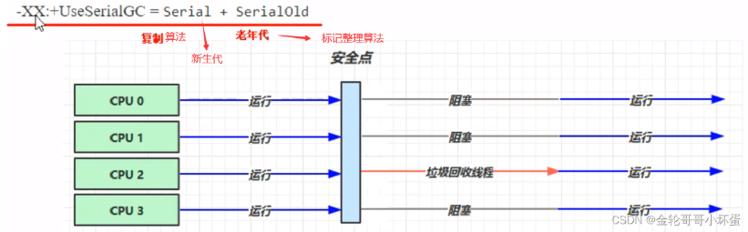

Serial收集器是最基本的、发展历史最悠久的收集器。俗称为：**`串行回收器`，采用`复制算法`进行垃圾回收**

**特点**

串行回收器是指使用单线程进行垃圾回收的回收器。每次回收时，串行回收器只有一个工作线程。

对于并行能力较弱的单CPU计算机来说，串行回收器的专注性和独占性往往有更好的性能表现。

它存在Stop The World问题，及垃圾回收时，要停止程序的运行。

使用`-XX:+UseSerialGC`参数可以设置新生代使用这个串行回收器

## ParNew 垃圾回收器

ParNew其实就是Serial的`多线程`版本，除了使用多线程之外，其余参数和Serial一模一样。俗称：`并行垃圾回收器`，采用`复制算法`进行垃圾回收

**特点**

ParNew默认开启的线程数与CPU数量相同，在CPU核数很多的机器上，可以通过参数`-XX:ParallelGCThreads`来设置线程数。

它是目前新生代首选的垃圾回收器，因为除了ParNew之外，它是唯一一个能与老年代CMS配合工作的。

它同样存在Stop The World问题

使用`-XX:+UseParNewGC`参数可以设置新生代使用这个并行回收器

## ParallelGC 回收器

ParallelGC使用复制算法回收垃圾，也是多线程的。

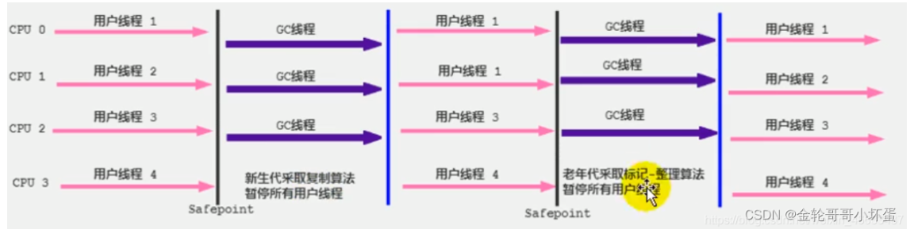

**特点**

就是非常关注系统的吞吐量，`吞吐量`=`代码运行时间`/(`代码运行时间`+`垃圾收集时间`)

`-XX:MaxGCPauseMillis`：设置最大垃圾收集停顿时间，可用把虚拟机在GC停顿的时间控制在MaxGCPauseMillis范围内，如果希望减少GC停顿时间可以将MaxGCPauseMillis设置的很小，但是会导致`GC频繁`，从而增加了GC的`总时间`，`降低`了`吞吐量`。所以需要根据实际情况设置该值。

`-Xx:GCTimeRatio`：设置吞吐量大小，它是一个0到100之间的整数，默认情况下他的取值是`99`，那么系统将花费不超过`1/(1+n)`的时间用于垃圾回收，也就是`1/(1+99)=1%`的时间。

另外还可以指定`-XX:+UseAdaptiveSizePolicy`打开自适应模式，在这种模式下，新生代的大小、eden、from/to的比例，以及晋升老年代的对象年龄参数会被自动调整，以达到在堆大小、吞吐量和停顿时间之间的平衡点。

使用-XX:+UseParallelGC参数可以设置新生代使用这个并行回收器

## 老年代垃圾回收器有哪些

SerialOld 垃圾回收器、ParallelOldGC 回收器、CMS 回收器

## **SerialOld 垃圾回收器**

SerialOld是Serial回收器的`老年代`回收器版本，它同样是一个`单线程`回收器。

**用途**

- 一个是在JDK1.5及之前的版本中与Parallel Scavenge收集器搭配使用，

- 另一个就是作为CMS收集器的后备预案，如果CMS出现Concurrent Mode Failure，则SerialOld将作为后备收集器。

`使用算法`：标记 - 整理算法

## ParallelOldGC 回收器

老年代`ParallelOldGC`回收器也是一种多线程的回收器，和新生代的ParallelGC回收器一样，也是一种关注**吞吐量**的回收器，他使用了`标记压缩算法`进行实现。

`-XX:+UseParallelOldGc`进行设置老年代使用该回收器

`-XX:+ParallelGCThreads`也可以设置垃圾收集时的线程数量。

## CMS 回收器

CMS全称为:Concurrent Mark Sweep意为并发标记清除，他使用的是`标记清除法`。

主要关注系统**响应时间。**

使用`-XX:+UseConcMarkSweepGC`进行设置老年代使用该回收器。

使用`-XX:ConcGCThreads`设置并发线程数量。

**特点**

CMS并不是独占的回收器，也就说CMS回收的过程中，应用程序仍然在不停的工作，又会有新的垃圾不断的产生，所以在使用CMS的过程中应该确保应用程序的内存足够可用。

CMS不会等到应用程序`饱和`的时候才去回收垃圾，而是在某一阀值的时候开始回收，回收阀值可用指定的参数进行配置：`-XX:CMSInitiatingoccupancyFraction`来指定，默认为`68`，也就是说当老年代的空间`使用率`达到`68%`的时候，会`执行`CMS回收。

如果内存使用率增长的很快，在CMS执行的过程中，已经出现了内存不足的情况，此时CMS回收就会失败，虚拟机将启动老年代`串行`回收器；`SerialOldGC`进行垃圾回收，这会导致应用程序中断，直到垃圾回收完成后才会正常工作。

这个过程GC的停顿时间可能较长，所以`-XX:CMSInitiatingoccupancyFraction`的设置要根据实际的情况。

之前我们在学习算法的时候说过，标记清除法有个缺点就是存在`内存碎片`的问题，那么CMS有个参数设置`-XX:+UseCMSCompactAtFullCollecion`可以使CMS回收完成之后进行一次`碎片整理`。

`-XX:CMSFullGCsBeforeCompaction`参数可以设置进行多少次CMS回收之后，对内存进行一次`压缩`。

## G1垃圾回收器

2017 JDK 9 默认
适用场景

* 同时注重吞吐量（Throughput）和低延迟（Low latency），**默认的暂停目标是 200 ms**

* 超大堆内存，会将堆划分为多个大小相等的 Region ，每个区都会作为伊甸园 幸运区 老年代

* 整体上是 标记+整理 算法，两个区域之间是 复制 算法


**相关 JVM 参数**

* -XX:+UseG1GC （JDK8启动开关 jdk9就默认使用）
* -XX:G1HeapRegionSize=size

**设置区的大小**

* -XX:MaxGCPauseMillis=time
* 设置STW 默认是200ms

**1) G1 垃圾回收阶**

 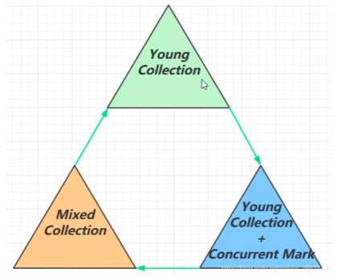 

* 新生代内存不足发生的垃圾收集 - minor gc
* 老年代内存不足:有一个阈值 当老年代内存和堆内存占比达到45%默认值，会触发并发标记阶段，以及后续的混合收集的阶段，工作过程中 回收速度高于新产生垃圾的时候 不叫 full GC 虽然也有暂停 时间相对于很短 ， 当你的垃圾回收的速度跟不上垃圾产生的速度 ，并发收集失败，和cms类似。会退化成串行的收集器（标记整理算法）（多线程的），这时候叫full GC STW 会变长。 判断依据 打印GC日志 判断有full GC 字样才算发生full GC

**JDK 8u20 字符串去重**

- 优点：节省大量内存
- 缺点：略微多占用了 cpu 时间，新生代回收时间略微增加

-XX:+UseStringDeduplication (默认打开)

* 将所有新分配的字符串放入一个队列
* 当新生代回收时，G1并发检查是否有字符串重复
* 如果它们值一样，让它们引用同一个 char[]
* 注意，与 String.intern() 不一样String.intern() 关注的是字符串对象而字符串去重关注的是 char[] 在JVM 内部，使用了不同的字符串表

 **JDK 8u40 并发标记类卸载**

**所有对象都经过并发标记后， 就能知道哪些类不再被使用**，**当一个类加载器的所有类都不再使用，则卸 载它所加载的所有类** -

XX:+ClassUnloadingWithConcurrentMark 默认启用

一般对于自定义类加载器

**JDK 8u60 回收巨型对象**

一个对象大于 region 的一半时，称之为巨型对象：

G1 不会对巨型对象进行拷贝，回收时被优先考虑，G1 会跟踪老年代所有 incoming(卡表) 引用，这样老年代 incoming 引用为0 的巨型对象就可以在新生 代垃圾回收时处理掉，当老年代中的卡表引用了巨型对象时 会被标记被脏卡。

## 常见垃圾回收器对比

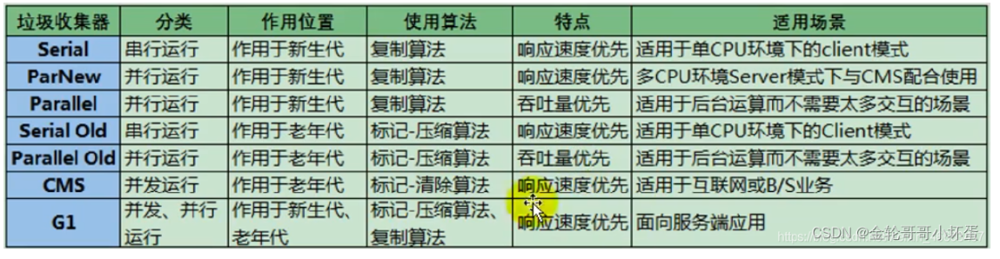

## Minor Gc和Full GC 有什么不同呢？ 

- **新生代 GC（Minor GC）:指发生新生代的的垃圾收集动作，Minor GC 非常频繁，回收速度一般也比较快**。

- **老年代 GC（Major GC/Full GC）:指发生在老年代的 GC，出现了 Major GC 经常会伴随至少一次的 Minor GC（并非绝对），Major GC 的速度一般会比 Minor GC 的慢 10 倍以上。**

## 程序计数器为什么是私有的?

程序计数器主要有下面两个作用：

- 字节码解释器通过改变程序计数器来依次读取指令，从而实现代码的流程控制，如：顺序执行、选择、循环、异常处理。

- 在多线程的情况下，程序计数器用于记录当前线程执行的位置，从而当线程被切换回来的时候能够知道该线程上次运行到哪儿了。

需要注意的是，**如果执行的是 native 方法，那么程序计数器记录的是 undefined 地址，只有执行的是 Java 代码时程序计数器记录的才是下一条指令的地址。**

所以，**程序计数器私有主要是为了线程切换后能恢复到正确的执行位置。**

## 常用 GC 调优策略有哪些？

**GC 调优目的**

将转移到老年代的对象数量降低到最小； 减少 GC 的执行时间。

**GC 调优策略**

`策略 1`：**将新对象预留在新生代**，由于 Full GC 的成本远高于 Minor GC，因此尽可能将对象分配在新生代是明智的做法，实际项目中根据 GC 日志分析新生代空间大小分配是否合理，适当通过“-Xmn”命令调节新生代大小，最大限度降低新对象直接进入老年代的情况。

`策略 2`：**大对象提前老年代**，虽然大部分情况下，将对象分配在新生代是合理的。但是对于大对象这种做法却值得商榷，大对象如果首次在新生代分配可能会出现空间不足导致很多年龄不够的小对象被分配的老年代，破坏新生代的对象结构，可能会出现频繁的 full gc。因此，对于大对象，可以设置直接进入老年代（当然短命的大对象对于垃圾回收来说简直就是噩梦）。-XX:PretenureSizeThreshold 可以设置直接进入老年代的对象大小。

`策略 3`：**合理设置进入老年代对象的年龄**，-XX:MaxTenuringThreshold 设置对象进入老年代的年龄大小，减少老年代的内存占用，降低 full gc 发生的频率。

`策略 4`：**设置稳定的堆大小**，堆大小设置有两个参数：-Xms 初始化堆大小，-Xmx 最大堆大小。

`策略5`：注意： 如果满足下面的指标，则一般不需要进行 GC 优化：

>MinorGC 执行时间不到50ms； Minor GC 执行不频繁，约10秒一次； Full GC 执行时间不到1s； Full GC 执行频率不算频繁，不低于10分钟1次。

`策略5`：使用缓存尽量不要使用Map 使用第三方的缓存 比如redis

- static Map map 
  使用软弱引用
- 软
- 弱
- 第三方缓存实现

**案例**

> 案例1 Full GC和Minor GC频繁 

问题分析:

说明空间紧张 如果是新生代空间紧张 高峰期来了 大量对象被创建 新生代被塞满了 幸存区空间紧张了 晋升阈值降低 本来生存周期很短的对象 也会被晋升代老年代去 情况就恶化了 老年代存了很多生存周期很短的对象 触发full GC 新生代内存太小了
解决方法:

增大新生代内存大小 同时增大了幸存区的空间以及新生代对象的阈值 这样让生命周期较短的对象 尽量留在新生代 不进入老年代

> 案例2请求高峰期发生Full Gc，单次暂停时间特别长(CMS) 

 CMS重新标记时会扫描整个堆内存
在进行Full Gc 重新标记之前 对新生代的对象 先做一次垃圾回收 减少新生代垃圾数量 可用减少重新标记的时间 

> 案例3老年代充裕情况下，发生FullGC (1.7) 

 jdk1.7是使用永久代的，1.8后使用元空间，是使用操作系统的空间的，所以内存充足。
所以是永久代空间不足，可以增加永久代和初始值和最大值。 

## 说一下堆栈的区别？

功能方面：堆是用来存放对象的，栈是用来执行程序的。

共享性：堆是线程共享的，栈是线程私有的。

空间大小：堆大小远远大于栈。

## 说一下 JVM 调优的工具？

JDK 自带了很多监控工具，都位于 JDK 的 bin 目录下，其中最常用的是 **jconsole 和 jvisualvm 这两款视图监控工具。**

jconsole：用于对 JVM 中的内存、线程和类等进行监控；

jvisualvm：JDK 自带的全能分析工具，可以分析：内存快照、线程快照、程序死锁、监控内存的变化、gc 变化等。

## 请问java中内存泄漏是什么意思？什么场景下会出现内存泄漏的情况？

Java中的内存泄露，广义并通俗的说，就是：**不再会被使用的对象的内存不能被回收，就是内存泄露。**

**如果长生命周期的对象持有短生命周期的引用，就很可能会出现内存泄露。**

## 如何判断可回收垃圾对象

一般而言，我们的局部变量，静态变量，本地方法栈的变量都放在栈里面，而对象和对象的成员变量都放在堆里面来。

**当栈的变量没有指向给堆里面的对象时，则说明这个堆里面的对象此时就是垃圾回收对象。**

## 如何找到垃圾对象

两种算法-->引用计数法和可达性分析算法

**引用计数法**：给对象中添加一个引用计数器，每当有一个地方（可以是栈里面的变量，也可以是堆里面对象里面的成员变量）引用它，计数器的加1。当引用失败时，计数器就减1。直到计数器为0时，该对象就是可被回收的对象。

缺点是：如果对象之间出现相互循环引用时，而且栈里面的变量没有指向堆里面的对象，那么此时计数器就永远不能为0，但是实际上此时这些对象已经是垃圾对象了。因此引用计数法无法通知GC回收器回收它们。

可达性分析算法：主要的措施是采用一个GC Root作为一个起点。由GC Root来进行向下搜索引用的对象，如果搜索得到的对象，那么这些对象就是存活的对象，不能被回收。倘若没有搜索的到，就是垃圾对象，需要被回收。就好比，数据结构中树的结构，根结点向下搜索法。

在 Java语言中，**GC Root**对象选用标准包括：

- 虚拟机栈（栈帧中的本地变量表：局部变量）中引用的对象。

- 方法区中类静态属性引用的对象。（全局共享）

- 方法区中常量引用的对象。

- 正在被synchronized锁定的对象

- 本地方法栈中 JNI（本地方法接口）引用的对象。

- 还有ExtClassLoader、BootstrapClassLoader、ApplicationClassLoader (因为是单例，所以一直存活)

## 常用垃圾收集器

为了使STW持续的时间尽可能短以及提高并发式GC所能应付的内存分配速率，在很多的垃圾收集器上都会把物理或者逻辑上，把这两类对象进行区分，死得快的对象所占区域叫做年轻代，活的久的对象所占的区域叫做老年代。但是，并不是所有的垃圾收集器都有分代的概念，在jdk1.8之前才有分代的概念。

在理解完分代和垃圾回收算法之后，我们看下jdk1.8生产环境以及常见的垃圾回收器：

【**年轻代**】的垃圾收集器有：Serial（复制算法）、Parallel Scavenge （复制算法）、ParNew （复制算法）

【**老年代**】的垃圾收集器有：Serial Old（标记-整理算法）、Parallel Old（标记-整理算法）、CMS（并发标记-清除）

1. Serial是单线程的串行垃圾收集器，
2. Parallel是多线程的并行的垃圾收集器，它更关注的是系统的吞吐量（吞吐量=用户工作时间/用户工作时间+GC时间）。
3. 在jdk1.8中我们常用的是PS和PO。而这些收集器GC线程工作时用户线程均停止（STW）。
4. ParNew是多线程并行的垃圾收集器。
5. CMS是比较新的垃圾收集器（并发垃圾收集器，Old区采用了标记-清除算法），它的特点是能够尽可能减少STW时间。在垃圾回收时让用户线程和GC线程能够并发执行。
6. G1垃圾收集器是使用于多核处理器、大内存容量的服务端系统，追求的是高的吞吐量，进一步的优化了CMS存在的缺点。采用的是复制算法。

目前市面上使用最多的是CMS和G1这两个垃圾收集器了。

## 常用的JVM调优参数都有哪些？

**一般我们将-Xms和-Xmx设的值是相同的。原因是当heap自动扩容时，会发生内存抖动，影响程序的稳定性**。

-Xss是栈的大小

-Xmn是设为新生代的大小，n表示new。

-XX:SurvivorRatio=8 表示堆内存中新生代、老年代和永久代的比为8:1:1。

-XX:MaxTenuringThreshold=15 表示当对象的存活的年龄（minor gc一次加1）到达15次之后，就晋升到老年代。

-XX:DisableExplicirGC 表示是否（+表示是，-表示否）打开GC日志。


## 垃圾回收器的基本原理是什么？垃圾回收器可以马上回收内存吗？有什么办法主动通知虚拟机进行垃圾回收？  

**对于 GC 来说，当程序员创建对象时，GC 就开始监控这个对象的地址、大小以及使用情况。通常，GC 采用有向图的方式记录和管理堆（heap）中的所有对象。通过这种方式确定哪些对象是”可达的”，哪些对象是”不可达的”。当 GC 确定一些对象为“不可达”时，GC 就有责任回收这些内存空间。可以。程序员可以手动执行 System.gc()，通知 GC 运行，但是 Java 语言规范并不保证 GC 一定会执行。**


## 什么时候会造成堆外内存溢出？

**使用了Unsafe类申请内存，或者使用了JNI对内存进行操作。这部分内存是不受JVM控制的，不加限制的使用，容易发生内存溢出。**


## 你能保证 GC 垃圾回收执行吗？

**不能，虽然你可以调用 System.gc() 或者 Runtime.gc()，但是没有办法保证 GC的执行。**


## 说说G1垃圾收集器的工作原理

**优点：指定最大停顿时间、分Region的内存布局、按收益动态确定回收集**

**1、** G1开创的基于Region的堆内存布局是它能够实现这个目标的关键。虽然G1也仍是遵循分代收集理论设计的，但其堆内存的布局与其他收集器有非常明显的差异：G1不再坚持固定大小以及固定数量的分代区域划分，而是把连续的Java堆划分为多个大小相等的独立区域（Region），每一个Region都可以根据需要，扮演新生代的Eden空间、Survivor空间，或者老年代空间。收集器能够对扮演不同角色的Region采用不同的策略去处理，这样无论是新创建的对象还是已经存活了一段时间、熬过多次收集的旧对象都能获取很好的收集效果。

**2、** 虽然G1仍然保留新生代和老年代的概念，但新生代和老年代不再是固定的了，它们都是一系列区域（不需要连续）的动态集合。G1收集器之所以能建立可预测的停顿时间模型，是因为它将Region作为单次回收的最小单元，即每次收集到的内存空间都是Region大小的整数倍，这样可以有计划地避免在整个Java堆中进行全区域的垃圾收集。更具体的处理思路是让G1收集器去跟踪各个Region里面的垃圾堆积的“价值”大小，价值即回收所获得的空间大小以及回收所需时间的经验值，然后在后台维护一个优先级列表，每次根据用户设定允许的收集停顿时间（使用参数-XX：MaxGCPauseMillis指定，默认值是200毫秒），优先处理回收价值收益最大的那些Region，这也就是“Garbage First”名字的由来。这种使用Region划分内存空间，以及具有优先级的区域回收方式，保证了G1收集器在有限的时间内获取尽可能高的收集效率。

**3、** G1收集器的运作过程大致可划分为以下四个步骤：

- 初始标记 （Initial Marking）：仅仅只是标记一下GC Roots能直接关联到的对象，并且修改TAMS指针的值，让下一阶段用户线程并发运行时，能正确地在可用的Region中分配新对象。这个阶段需要停顿线程，但耗时很短，而且是借用进行Minor GC的时候同步完成的，所以G1收集器在这个阶段实际并没有额外的停顿。
- 并发标记 （Concurrent Marking）：从GC Root开始对堆中对象进行可达性分析，递归扫描整个堆里的对象图，找出要回收的对象，这阶段耗时较长，但可与用户程序并发执行。当对象图扫描完成以后，还要重新处理SATB记录下的在并发时有引用变动的对象。
- 最终标记 （Final Marking）：对用户线程做另一个短暂的暂停，用于处理并发阶段结束后仍遗留下来的最后那少量的SATB记录。
- 筛选回收 （Live Data Counting and Evacuation）：负责更新Region的统计数据，对各个Region的回收价值和成本进行排序，根据用户所期望的停顿时间来制定回收计划，可以自由选择任意多个Region构成回收集，然后把决定回收的那一部分Region的存活对象复制到空的Region中，再清理掉整个旧Region的全部空间。这里的操作涉及存活对象的移动，是必须暂停用户线程，由多条收集器线程并行完成的。从上述阶段的描述可以看出，G1收集器除了并发标记外，其余阶段也是要完全暂停用户线程的 。


## 描述一下什么情况下，对象会从年轻代进入老年代

**1、** **对象的年龄超过一定阀值**，-XX:MaxTenuringThreshold 可以指定该阀值

**2、** **动态对象年龄判定，有的垃圾回收算法，比如 G1，并不要求 age 必须达到 15 才能晋升到老年代，它会使用一些动态的计算方法**

**3、** **大小超出某个阀值的对象将直接在老年代上分配**，值默认为 0，意思是全部首选 Eden 区进行分配，-XX:PretenureSizeThreshold 可以指定该阀值，部分收集器不支持

**4、** **分配担保，当 Survivor 空间不够的时候，则需要依赖其他内存（指老年代）进行分配担保，这个时候，对象也会直接在老年代上分配**


## 永久代

指内存的永久保存区域，主要存放 Class 和 Meta（元数据）的信息,Class 在被加载的时候被放入永久区域， 它和和存放实例的区域不同,GC不会在主程序运行期对永久区域进行清理。所以这也导致了永久代的区域会随着加载的 Class 的增多而胀满，最终抛出 OOM 异常。

## 老年代

**1、** 主要存放应用程序中生命周期长的内存对象。

**2、** 老年代的对象比较稳定，所以 MajorGC 不会频繁执行。在进行 MajorGC 前一般都先进行了一次MinorGC，使得有新生代的对象晋身入老年代，导致空间不够用时才触发。当无法找到足够大的连续空间分配给新创建的较大对象时也会提前触发一次 MajorGC 进行垃圾回收腾出空间。

**3、** MajorGC 采用标记清除算法：首先扫描一次所有老年代，标记出存活的对象，然后回收没有标记的对象。ajorGC 的耗时比较长，因为要扫描再回收。MajorGC 会产生内存碎片，为了减少内存损耗，我们一般需要进行合并或者标记出来方便下次直接分配。当老年代也满了装不下的时候，就会抛出 OOM（Out of Memory）异常。


## 你知道哪些JVM性能调优


**设定堆内存大小**

**1、** -Xmx：堆内存最大限制。设定新生代大小。新生代不宜太小，否则会有大量对象涌入老年代

**2、** -XX:NewSize：新生代大小

**3、** -XX:NewRatio 新生代和老生代占比

**4、** -XX:SurvivorRatio：伊甸园空间和幸存者空间的占比

**5、** 设定垃圾回收器 年轻代用 -XX:+UseParNewGC 年老代用-XX:+UseConcMarkSweepGC

## 说说线程栈  

**这里的线程栈应该指的是虚拟机栈吧...**

**1、** **JVM规范让每个Java线程拥有自己的独立的JVM栈，也就是Java方法的调用栈。**

**2、** **当方法调用的时候，会生成一个栈帧。栈帧是保存在虚拟机栈中的，栈帧存储了方法的局部变量表、操作数栈、动态连接和方法返回地址等信息**

**3、** **线程运行过程中，只有一个栈帧是处于活跃状态，称为“当前活跃栈帧”，当前活动栈帧始终是虚拟机栈的栈顶元素。**

**4、** **通过jstack工具查看线程状态**


## 运行时栈帧包含哪些结构？


局部变量表、操作数栈、动态连接、 返回地址、附加信息


## MinorGC，MajorGC、FullGC都什么时候发生？ 


MinorGC在年轻代空间不足的时候发生，MajorGC指的是老年代的GC，出现MajorGC一般经常伴有MinorGC。

FullGC有三种情况：

**1、** **当老年代无法再分配内存的时候**

**2、** **元空间不足的时候**

**3、** **显示调用System.gc的时候。**另外，像CMS一类的垃圾回收器，在MinorGC出现promotion failure的时候也会发生FullGC


## 在监视器(Monitor)内部，是如何做线程同步的？程序应该做哪种级别的同步？


在 java 虚拟机中，监视器和锁在Java虚拟机中是一块使用的。监视器监视一块同步代码块，确保一次只有一个线程执行同步代码块。每一个监视器都和一个对象引用相关联。线程在获取锁之前不允许执行同步代码。

一旦方法或者代码块被 synchronized 修饰，那么这个部分就放入了监视器的监视区域，确保一次只能有一个线程执行该部分的代码，线程在获取锁之前不允许执行该部分的代码

另外 java 还提供了显式监视器( Lock )和隐式监视器( synchronized )两种锁方案

## 如何在 Windows 和 Linux 上查找哪个线程cpu利用率最高？ 


windows上面用任务管理器看，linux下可以用 top 这个工具看。

**1、** 找出cpu耗用厉害的进程pid， 终端执行top命令，然后按下shift+p (shift+m是找出消耗内存最高)查找出cpu利用最厉害的pid号

**2、** 根据上面第一步拿到的pid号，top -H -p pid 。然后按下shift+p，查找出cpu利用率最厉害的线程号，比如top -H -p 1328

**3、** 将获取到的线程号转换成16进制，去百度转换一下就行

**4、** 使用jstack工具将进程信息打印输出，jstack pid号 > /tmp/t.dat，比如jstack 31365 > /tmp/t.dat

**5、** 编辑/tmp/t.dat文件，查找线程号对应的信息

或者直接使用JDK自带的工具查看“jconsole” 、“visualVm”，这都是JDK自带的，可以直接在JDK的bin目录下找到直接使用


## GC垃圾回收的回收流程是怎样的？  

**GC回收流程如下：**

**1、** 对于整个的GC流程里面，那么最需要处理的就是新生代和老年代的内存清理操作，而元空间（永久代）都不在GC范围内

**2、** 当现在有一个新的对象产生，那么对象一定需要内存空间，平均每个栈内存存4k，每个堆内存存8k，那么对象一定需要进行堆空间的申请

**3、** 首先会判断Eden区是否有内存空间，如果此时有内存空间，则直接将新对象保存在伊甸园区。

**4、** 但是如果此时在伊甸园区内存不足，那么会自动执行一个Minor GC 操作，将伊甸园区的无用内存空间进行清理，Minor GC的清理范围只在Eden园区，清理之后会继续判断Eden园区的内存空间是否充足？如果内存空间充足，则将新对象直接在Eden园区进行空间分配。

**5、** 如果执行Minor GC 之后发现伊甸园区的内存空间依然不足，那么这个时候会执行存活区的判断，如果存活区有剩余空间，则将Eden园区部分活跃对象保存在存活区，那么随后继续判断Eden园区的内存空间是否充足，如果充足怎则将新对象直接在Eden园区进行空间分配。

**6、** 此时如果存活区没有内存空间，则继续判断老年区。则将部分存活对象保存在老年代，而后存活区将有空余空间。

**7、** 如果这个时候老年代也满了，那么这个时候将产生Major GC（Full GC）,那么这个时候将进行老年代的清理

**8、** 如果老年代执行Full GC之后，无法进行对象的保存，则会产生OOM异常,OutOfMemoryError异常

## 生产环境用的什么JDK？如何配置的垃圾收集器？


**Oracle JDK 1.8**

JDK 1.8 中有 Serial、ParNew、Parallel Scavenge、Serial Old、Parallel Old、CMS、G1，默认使用 Parallel Scavenge + Parallel Old。

**1、** Serial 系列是单线程垃圾收集器，处理效率很高，适合小内存、客户端场景使用，使用参数 -XX:+UseSerialGC 显式启用。

**2、** Parallel 系列相当于并发版的 Serial，追求高吞吐量，适用于较大内存并且有多核CPU的环境，默认或显式使用参数 -XX:+UseParallelGC 启用。可以使用 -XX:MaxGCPauseMillis 参数指定最大垃圾收集暂停毫秒数，收集器会尽量达到目标；使用 -XX:GCTimeRatio 指定期望吞吐量大小，默认 99，用户代码运行时间:垃圾收集时间=99:1。

**3、** CMS，追求垃圾收集暂停时间尽可能短，适用于服务端较大内存且多 CPU 的应用，使用参数 -XX:+UseConcMarkSweepGC 显式开启，会同时作用年轻代与老年代，但有浮动垃圾和内存碎片化的问题。

**4、** G1，主要面向服务端应用的垃圾收集器，适用于具有大内存的多核 CPU 的服务器，追求较小的垃圾收集暂停时间和较高的吞吐量。首创局部内存回收设计思路，采用不同策略实现分代，不再使用固定大小、固定数量的堆内存分代区域划分，而是基于 Region 内存布局，优先回收价收益最大的 Region。使用参数 -XX:+UseG1GC 开启。

**我们生产环境使用了 G1 收集器，相关配置如下**

**1、** -Xmx12g

**2、** -Xms12g

**3、** -XX:+UseG1GC

**4、** -XX:InitiatingHeapOccupancyPercent=45

**5、** -XX:MaxGCPauseMillis=200

**6、** -XX:MetaspaceSize=256m

**7、** -XX:MaxMetaspaceSize=256m

**8、** -XX:MaxDirectMemorySize=512m

**9、** -XX:G1HeapRegionSize 未指定

**核心思路：**

**1、** 每个内存区域设置上限，避免溢出

**2、** 堆设置为操作系统的 70%左右，超过 8 G，首选 G1

**3、** 根据老年代对象提升速度，调整新生代与老年代之间的内存比例

**4、** 等过 GC 信息，针对项目敏感指标优化，比如访问延迟、吞吐量等


## 线上常用的 JVM 参数有哪些？


**数据区设置**

**1、** Xms：初始堆大小

**2、** Xmx：最大堆大小

**3、** Xss:Java 每个线程的Stack大小

**4、** XX:NewSize=n：设置年轻代大小

**5、** XX:NewRatio=n：设置年轻代和年老代的比值。如：为 3，表示年轻代与年老代比值为 1:3，年轻代占整个年轻代年老代和的 1/4。

**6、** XX：SurvivorRatio=n：年轻代中 Eden 区与两个 Survivor 区的比值。注意 Survivor 区有两个。如：3，表示 Eden：Survivor=3：2，一个 Survivor 区占整个年轻代的 1/5。

**7、** XX：MaxPermSize=n：设置持久代大小。

**收集器设置**

**1、** XX:+UseSerialGC：设置串行收集器

**2、** XX:+UseParallelGC:：设置并行收集器

**3、** XX:+UseParalledlOldGC：设置并行年老代收集器

**4、** XX:+UseConcMarkSweepGC：设置并发收集器

**GC日志打印设置**

**1、** XX:+PrintGC：打印 GC 的简要信息

**2、** XX:+PrintGCDetails：打印 GC 详细信息

**3、** XX:+PrintGCTimeStamps：输出 GC 的时间戳


## 一个线程运行时发生异常会怎样？

**如果异常没有被捕获该线程将会停止执行。**Thread.UncaughtExceptionHandler是用于处理未捕获异常造成线程突然中断情况的一个内嵌接口。当一个未捕获异常将造成线程中断的时候JVM会使用Thread.getUncaughtExceptionHandler()来查询线程的UncaughtExceptionHandler并将线程和异常作为参数传递给handler的uncaughtException()方法进行处理。


## 老年代-标记整理算法 


因为对象存活率高、没有额外空间对它进行分配担保, 就必须采用“标记—清理”或“标记—整理” 算法来进行回收, **不必进行内存复制, 且直接腾出空闲内存。**

## 方法区溢出的原因？ 


方法区主要存放类型信息，如类名、访问修饰符、常量池、字段描述、方法描述等。**只要不断在运行时产生大量类，方法区就会溢出**。**例如使用 JDK 反射或 CGLib 直接操作字节码在运行时生成大量的类。**很多框架如 Spring、Hibernate 等对类增强时都会使用 CGLib 这类字节码技术，增强的类越多就需要越大的方法区保证动态生成的新类型可以载入内存，也就更容易导致方法区溢出。

JDK8 使用元空间取代永久代，HotSpot 提供了一些参数作为元空间防御措施，例如 `-XX:MetaspaceSize` 指定元空间初始大小，达到该值会触发 GC 进行类型卸载，同时收集器会对该值进行调整，如果释放大量空间就适当降低该值，如果释放很少空间就适当提高。


## Minor GC与Full GC分别在什么时候发生？

**新生代内存不够用时候发生MGC也叫YGC，JVM内存不够的时候发生FGC**


## 什么是重排序


程序执行的顺序按照代码的先后顺序执行。

一般来说**处理器为了提高程序运行效率，可能会对输入代码进行优化，进行重新排序（重排序），它不保证程序中各个语句的执行先后顺序同代码中的顺序一致，但是它会保证程序最终执行结果和代码顺序执行的结果是一致的。**

```
int a = 5;//语句1
int r = 3;//语句2
a = a + 2;//语句3
r = a*a;  //语句4
```

则因为重排序，他还可能执行顺序为（这里标注的是语句的执行顺序） 2-1-3-4，1-3-2-4 但绝不可能 2-1-4-3，因为这打破了依赖关系。

显然**重排序对单线程运行是不会有任何问题**，但是多线程就不一定了，所以我们在多线程编程时就得考虑这个问题了。


## 生产上如何配置垃圾收集器的？

**首先是内存大小问题，基本上每一个内存区域我都会设置一个上限，来避免溢出问题，比如元空间。通常，堆空间我会设置成操作系统的`2/3`（这是想给其他进程和操作系统预留一些时间），超过8GB的堆优先选用G1。**

**接下来，我会对JVM进行初步优化。比如根据老年代的对象提升速度，来调整年轻代和老年代之间的比例。**

**再接下来，就是专项优化，主要判断的依据就是系统容量、访问延迟、吞吐量等。我们的服务是高并发的，所以对STW的时间非常敏感。**

**我会通过记录详细的GC日志，来找到这个瓶颈点，借用`gceasy`（重点）这样的日志分析工具，很容易定位到问题。之所以选择采用工具，是因为gc日志看起来实在是太麻烦了，gceasy号称是AI学习分析问题，可视化做的较好。**


## 对象的访问定位有哪几种方式?


建立对象就是为了使用对象，我们的Java程序通过栈上的 reference 数据来操作堆上的具体对象。对象的访问方式有虚拟机实现而定，目前主流的访问方式有使用句柄和直接指针2种：

**句柄：**如果使用句柄的话，那么Java堆中将会划分出一块内存来作为句柄池，reference 中存储的就是对象的句柄地址，而句柄中包含了对象实例数据与类型数据各自的具体地址信息。

**直接指针：**如果使用直接指针访问，那么 Java 堆对象的布局中就必须考虑如何放置访问类型数据的相关信息，而reference 中存储的直接就是对象的地址。

这两种对象访问方式各有优势。使用句柄来访问的最大好处是 reference 中存储的是稳定的句柄地址，在对象被移动时只会改变句柄中的实例数据指针，而 reference 本身不需要修改。使用直接指针访问方式最大的好处就是速度快，它节省了一次指针定位的时间开销。


## stackoverflow错误，permgen space错误


stackoverflow错误主要出现：

**在虚拟机栈中(线程请求的栈深度大于虚拟机栈锁允许的最大深度)**

permgen space错误(针对jdk之前1.7版本)：

**1、** 大量加载class文件

**2、** 常量池内存溢出


## Java 程序是怎样运行的？

1.首先通过 Javac 编译器将 `.java` 转为 JVM 可加载的 `.class` 字节码文件。

2.Javac 是由 Java 编写的程序，编译过程可以分为：① 词法解析，通过空格分割出单词、操作符、控制符等信息，形成 token 信息流，传递给语法解析器。② 语法解析，把 token 信息流按照 Java 语法规则组装成语法树。③ 语义分析，检查关键字使用是否合理、类型是否匹配、作用域是否正确等。④ 字节码生成，将前面各个步骤的信息转换为字节码。

3.字节码必须通过类加载过程加载到 JVM 后才可以执行，执行有三种模式，解释执行、JIT 编译执行、**JIT 编译与解释器混合执行（主流 JVM 默认执行的方式）**。混合模式的优势在于解释器在启动时先解释执行，省去编译时间。

4.之后通过即时编译器 JIT 把字节码文件编译成本地机器码。

5**.Java 程序最初都是通过解释器进行解释执行的，当虚拟机发现某个方法或代码块的运行特别频繁，就会认定其为"热点代码"，热点代码的检测主要有基于采样和基于计数器两种方式，为了提高热点代码的执行效率，虚拟机会把它们编译成本地机器码，尽可能对代码优化，在运行时完成这个任务的后端编译器被称为即时编译器。**

6.还可以通过静态的提前编译器 AOT 直接把程序编译成与目标机器指令集相关的二进制代码。

## Java 线程数过多会造成什么异常？


**1、** 线程的生命周期开销非常高

**2、** 消耗过多的 CPU

资源如果可运行的线程数量多于可用处理器的数量，那么有线程将会被闲置。大量空闲的线程会占用许多内存，给垃圾回收器带来压力，而且大量的线程在竞争 CPU资源时还将产生其他性能的开销。

**降低JVM稳定性**

在可创建线程的数量上存在一个限制，这个限制值将随着平台的不同而不同，并且承受着多个因素制约，包括 JVM 的启动参数、Thread 构造函数中请求栈的大小，以及底层操作系统对线程的限制等。如果破坏了这些限制，那么可能抛出OutOfMemoryError 异常。

## JVM的永久代中会发生垃圾回收么

**垃圾回收不会发生在永久代**，如果永久代满了或者是超过了临界值，会触发完全垃圾回收(Full GC)。如果你仔细查看垃圾收集器的输出信息，就会发现永久代也是被回收的。这就是为什么正确的永久代大小对避免Full GC是非常重要的原因。请参考下Java8：从永久代到元数据区 (注：Java8中已经移除了永久代，新加了一个叫做元数据区的native内存区)


## 简单描述一下分代垃圾回收的过程


分代回收器有两个分区：老生代和新生代，新生代默认的空间占比总空间的 `1/3`，老生代的默认占比是 `2/3`。

新生代使用的是复制算法，新生代里有 3 个分区：`Eden`、`To Survivor`、`From Survivor`，它们的默认占比是 `8:1:1`，它的执行流程如下：

**当年轻代中的Eden区分配满的时候，就会触发年轻代的GC（Minor GC）。具体过程如下：**

**1、** 在Eden区执行了 `第一次`GC之后，存活的对象会被移动到其中一个Survivor分区（以下简称from）

**2、** Eden区再次GC，这时会采用复制算法，将Eden和from区一起清理。存活的对象会被复制到to区。接下来，只需要清空from区就可以了


## 说一下Java对象的创建过程

**1、** **类加载检查：**虚拟机遇到一条 new 指令时，首先将去检查这个指令的参数是否能在常量池中定位到这个类的符号引用，并且检查这个符号引用代表的类是否已被加载过、解析和初始化过。如果没有，那必须先执行相应的类加载过程。2）分配内存：在类加载检查通过后，接下来虚拟机将为新生对象分配内存。对象所需的内存大小在类加载完成后便可确定，为对象分配空间的任务等同于把一块确定大小的内存从 Java 堆中划分出来。分配方式有 “指针碰撞” 和 “空闲列表” 两种，选择那种分配方式由 Java 堆是否规整决定，而Java堆是否规整又由所采用的垃圾收集器是否带有压缩整理功能决定。选择以上2种方式中的哪一种，取决于 Java 堆内存是否规整。而 Java 堆内存是否规整，取决于 GC 收集器的算法是"标记-清除"，还是"标记-整理"（也称作"标记-压缩"），值得注意的是，复制算法内存也是规整的。

**2、** 在创建对象的时候有一个很重要的问题，就是线程安全，因为在实际开发过程中，创建对象是很频繁的事情，作为虚拟机来说，必须要保证线程是安全的，通常来讲，虚拟机采用两种方式来保证线程安全：CAS+失败重试：CAS 是乐观锁的一种实现方式。所谓乐观锁就是，每次不加锁而是假设没有冲突而去完成某项操作，如果因为冲突失败就重试，直到成功为止。虚拟机采用 CAS 配上失败重试的方式保证更新操作的原子性。TLAB：为每一个线程预先在Eden区分配一块儿内存，JVM在给线程中的对象分配内存时，首先在TLAB分配，当对象大于TLAB中的剩余内存或TLAB的内存已用尽时，再采用上述的CAS进行内存分配

**3、** **初始化零值：**内存分配完成后，虚拟机需要将分配到的内存空间都初始化为零值（不包括对象头），这一步操作保证了对象的实例字段在 Java 代码中可以不赋初始值就直接使用，程序能访问到这些字段的数据类型所对应的零值。

**4、** **设置对象头：**初始化零值完成之后，虚拟机要对对象进行必要的设置，例如这个对象是那个类的实例、如何才能找到类的元数据信息、对象的哈希吗、对象的 GC 分代年龄等信息。这些信息存放在对象头中。另外，根据虚拟机当前运行状态的不同，如是否启用偏向锁等，对象头会有不同的设置方式。

**5、** **执行 init 方法：**在上面工作都完成之后，从虚拟机的视角来看，一个新的对象已经产生了，但从 Java 程序的视角来看，对象创建才刚开始，  方法还没有执行，所有的字段都还为零。所以一般来说，执行 new 指令之后会接着执行  方法，把对象按照程序员的意愿进行初始化，这样一个真正可用的对象才算完全产生出来。


## JVM 监控与分析工具你用过哪些？介绍一下。


**1、** jps，显示系统所有虚拟机进程信息的命令行工具

**2、** jstat，监视分析虚拟机运行状态的命令行工具

**3、** jinfo，查看和调整虚拟机参数的命令行工具

**4、** jmap，生成虚拟机堆内存转储快照的命令行工具

**5、** jhat，显示和分析虚拟机的转储快照文件的命令行工具

**6、** jstack，生成虚拟机的线程快照的命令行工具

**7、** jcmd，虚拟机诊断工具，JDK 7 提供

**8、** jhsdb，基于服务性代理实现的进程外可视化调试工具，JDK 9 提供

**9、** JConsole，基于JMX的可视化监视和管理工具

**10、** jvisualvm，图形化虚拟机使用情况的分析工具

**11、** Java Mission Control，监控和管理 Java 应用程序的工具

**1、** MAT，Memory Analyzer Tool，虚拟机内存分析工具

**2、** vjtools，唯品会的包含核心类库与问题分析工具

**3、** arthas，阿里开源的 Java 诊断工具

**4、** greys，JVM进程执行过程中的异常诊断工具

**5、** GCHisto，GC 分析工具

**6、** GCViewer，GC 日志文件分析工具

**7、** GCeasy，在线版 GC 日志文件分析工具

**8、** JProfiler，检查、监控、追踪 Java 性能的工具

**9、** BTrace，基于动态字节码修改技术(Hotswap)实现的Java程序追踪与分析工具

**下面可以重点体验下：**

JDK 自带的命令行工具方便快捷，不是特别复杂的问题可以快速定位；

阿里的 arthas 命令行也不错；

可视化工具 MAT、JProfiler 比较强大。

## 如何开启和查看 GC 日志？


**常见的 GC 日志开启参数包括：**

**1、** -Xloggc:filename，指定日志文件路径

**2、** -XX:+PrintGC，打印 GC 基本信息

**3、** -XX:+PrintGCDetails，打印 GC 详细信息

**4、** -XX:+PrintGCTimeStamps，打印 GC 时间戳

**5、** -XX:+PrintGCDateStamps，打印 GC 日期与时间

**6、** -XX:+PrintHeapAtGC，打印 GC 前后的堆、方法区、元空间可用容量变化

**7、** -XX:+PrintTenuringDistribution，打印熬过收集后剩余对象的年龄分布信息，有助于 MaxTenuringThreshold 参数调优设置

**8、** -XX:+PrintAdaptiveSizePolicy，打印收集器自动设置堆空间各分代区域大小、收集目标等自动调节的相关信息

**9、** -XX:+PrintGCApplicationConcurrentTime，打印 GC 过程中用户线程并发时间

**10、** -XX:+PrintGCApplicationStoppedTime，打印 GC 过程中用户线程停顿时间

**11、** -XX:+HeapDumpOnOutOfMemoryError，堆 oom 时自动 dump

**12、** -XX:HeapDumpPath，堆 oom 时 dump 文件路径

Java 9 JVM 日志模块进行了重构，参数格式发生变化，这个需要知道。

GC 日志输出的格式，会随着上面的参数不同而发生变化。关注各个分代的内存使用情况、垃圾回收次数、垃圾回收的原因、垃圾回收占用的时间、吞吐量、用户线程停顿时间。

借助工具可视化工具可以更方便的分析，在线工具 GCeasy；离线版可以使用 GCViewer。

如果现场环境不允许，可以使用 JDK 自带的 jstat 工具监控观察 GC 情况。


## 常用JVM基本配置参数


**1、** -Xmx：最大分配内存，默认为物理内存的1/4

**2、** -Xms：初始分配内存，默认为物理内存的1/64

**3、** -Xss：等价于-XX:ThreadStackSize，单个线程栈空间大小，默认一般为512k-1024k，通过jinfo查看为0时，表示使用默认值

**4、** -Xmn：设置年轻代大小

**5、** -XX:MetaspeaceSize：设置元空间大小（默认21M左右，可以配置大一些），元空间的本质可永久代类似，都是对JVM规范中方法区的实现，不过元空间与永久代的最大区别在于：元空间不在虚拟机中，而是使用本地内存，因此，默认情况下，元空间大小仅受本地内存大小限制

**6、** 典型设置案例：-Xms128m -Xmx4096m -Xss1024k -XX:MetaspaceSize=512m -XX:+PrintCommandLineFlags -XX:+PrintGCDetails -XX:+UseSerialGC

**7、** -XX:+PrintGCDetails：打印垃圾回收细节，打印GC： 打印Full GC：

**8、** -XX:SurvivorRatio：调整Eden中survivor区比例，默认-XX:SurvivorRatio=8（8:1:1），调整为-XX:SurvivorRatio=4（4:1:1）,一般使用默认值

**9、** -XX:NewRatio：调整新生代与老年代的比例，默认为2（新生代1，老年代2，年轻代占整个堆的1/3）,调整为-XX:NewRatio=4表示（新生代1，老年代4，年轻代占堆的1/5）,一般使用默认值

**10、** -XX:MaxTenuringThreshold：设置垃圾的最大年龄（经历多少次垃圾回收进入老年代），默认15（15次垃圾回收后依旧存活的对象进入老年代），JDK1.8设置必须0<-XX:MaxTenuringThreshold<15


## 什么是类加载器，类加载器有哪些？

**实现通过类的权限定名获取该类的二进制字节流的代码块叫做类加载器。**

**主要有一下四种类加载器：**

**1、** 启动动类加载器（Bootstrap ClassLoader）

用来加载 Java 核心类库，无法被 Java 程序直接引用。

**2、** 扩展类加载器（extensions class loader）：

它用来加载 Java 的扩展库。Java 虚拟机的实现会提供一个扩展库目录。该类加载器在此目录里面查找并加载 Java 类。

**3、** 系统统类加载器（system class loader）：

它根据 Java 应用的类路径（CLASSPATH）来加载 Java 类。一般来说，Java 应用的类都是由它来完成加载的。可以通过 ClassLoader.getSystemClassLoader() 来获取它。

**4、** 用户自定义类加载器

通过继承 java.lang.ClassLoader 类的方式实现。


## 运行时常量池的作用是什么?


运行时常量池是方法区的一部分，Class 文件中除了有类的版本、字段、方法、接口等描述信息外，还有一项信息是常量池表，用于存放编译器生成的各种字面量与符号引用，这部分内容在类加载后存放到运行时常量池。一般除了保存 Class 文件中描述的符号引用外，还会把符号引用翻译的直接引用也存储在运行时常量池。

运行时常量池相对于 Class 文件常量池的一个重要特征是动态性，Java 不要求常量只有编译期才能产生，运行期间也可以将新的常量放入池中，这种特性利用较多的是 String 的 `intern` 方法。

运行时常量池是方法区的一部分，受到方法区内存的限制，当常量池无法再申请到内存时会抛出 OutOfMemoryError。

代码示例：


```java
package com.lijie;
import java.util.concurrent.ExecutorService;
import java.util.concurrent.Executors;
public class TestNewCachedThreadPool {
    public static void main(String[] args) {
        // 创建无限大小线程池，由jvm自动回收
        ExecutorService newCachedThreadPool = Executors.newCachedThreadPool();
        for (int i = 0; i < 10; i++) {
            final int temp = i;
            newCachedThreadPool.execute(new Runnable() {
                public void run() {
                    try {
                        Thread.sleep(100);
                    } catch (Exception e) {}
                    System.out.println(Thread.currentThread().getName() + ",i==" + temp);
                }
            });
        }
    }
}
```

