# Java进阶面试题-多线程

## 可见性问题

可见性问题由CPU缓存引起

可见性：一个线程对共享变量的修改，另外一个线程能够立刻看到。

举个简单的例子，看下面这段代码：

```java
//线程1执行的代码
int i = 0;
i = 10;
 
//线程2执行的代码
j = i;
```

假若执行线程1的是CPU1，执行线程2的是CPU2。由上面的分析可知，当线程1执行 i =10这句时，会先把i的初始值加载到CPU1的高速缓存中，然后赋值为10，那么在CPU1的高速缓存当中i的值变为10了，却没有立即写入到主存当中。

此时线程2执行 j = i，它会先去主存读取i的值并加载到CPU2的缓存当中，注意此时内存当中i的值还是0，那么就会使得j的值为0，而不是10.

这就是可见性问题，线程1对变量i修改了之后，线程2没有立即看到线程1修改的值。

## 原子性问题

原子性问题由分时复用引起

原子性：即一个操作或者多个操作 要么全部执行并且执行的过程不会被任何因素打断，要么就都不执行。

举个简单的例子，看下面这段代码：

```java
int i = 1;

// 线程1执行
i += 1;

// 线程2执行
i += 1;
```

这里需要注意的是：`i += 1`需要三条 CPU 指令

1. 将变量 i 从内存读取到 CPU寄存器；
2. 在CPU寄存器中执行 i + 1 操作；
3. 将最后的结果i写入内存（缓存机制导致可能写入的是 CPU 缓存而不是内存）。

由于CPU分时复用（线程切换）的存在，线程1执行了第一条指令后，就切换到线程2执行，假如线程2执行了这三条指令后，再切换会线程1执行后续两条指令，将造成最后写到内存中的i值是2而不是3。

## 有序性问题

有序性问题重排序引起

有序性：即程序执行的顺序按照代码的先后顺序执行。举个简单的例子，看下面这段代码：

```java
int i = 0;              
boolean flag = false;
i = 1;                //语句1  
flag = true;          //语句2
```

上面代码定义了一个int型变量，定义了一个boolean类型变量，然后分别对两个变量进行赋值操作。从代码顺序上看，语句1是在语句2前面的，那么JVM在真正执行这段代码的时候会保证语句1一定会在语句2前面执行吗? 不一定，为什么呢? 这里可能会发生指令重排序（Instruction Reorder）。

在执行程序时为了提高性能，编译器和处理器常常会对指令做重排序。重排序分三种类型：

- 编译器优化的重排序。编译器在不改变单线程程序语义的前提下，可以重新安排语句的执行顺序。
- 指令级并行的重排序。现代处理器采用了指令级并行技术（Instruction-Level Parallelism， ILP）来将多条指令重叠执行。如果不存在数据依赖性，处理器可以改变语句对应机器指令的执行顺序。
- 内存系统的重排序。由于处理器使用缓存和读 / 写缓冲区，这使得加载和存储操作看上去可能是在乱序执行。

从 java 源代码到最终实际执行的指令序列，会分别经历下面三种重排序：


上述的 1 属于编译器重排序，2 和 3 属于处理器重排序。这些重排序都可能会导致多线程程序出现内存可见性问题。对于编译器，JMM 的编译器重排序规则会禁止特定类型的编译器重排序（不是所有的编译器重排序都要禁止）。对于处理器重排序，JMM 的处理器重排序规则会要求 java 编译器在生成指令序列时，插入特定类型的内存屏障（memory barriers，intel 称之为 memory fence）指令，通过内存屏障指令来禁止特定类型的处理器重排序（不是所有的处理器重排序都要禁止）。

具体可以参看：[Java 内存模型详解]()的重排序章节。

## 线程状态转换

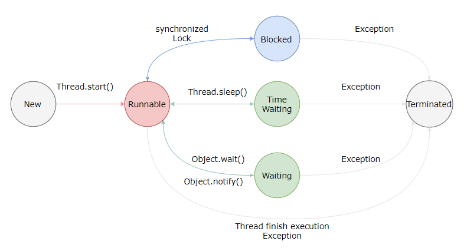

- **新建(New)**

创建后尚未启动。

- **可运行(Runnable)**

可能正在运行，也可能正在等待 CPU 时间片。

包含了操作系统线程状态中的 Running 和 Ready。

- **阻塞(Blocking)**

等待获取一个排它锁，如果其线程释放了锁就会结束此状态。

- **无限期等待(Waiting)**

等待其它线程显式地唤醒，否则不会被分配 CPU 时间片。

| 进入方法                                   | 退出方法                             |
| ------------------------------------------ | ------------------------------------ |
| 没有设置 Timeout 参数的 Object.wait() 方法 | Object.notify() / Object.notifyAll() |
| 没有设置 Timeout 参数的 Thread.join() 方法 | 被调用的线程执行完毕                 |
| LockSupport.park() 方法                    | -                                    |

- **限期等待(Timed Waiting)**

无需等待其它线程显式地唤醒，在一定时间之后会被系统自动唤醒。

调用 Thread.sleep() 方法使线程进入限期等待状态时，常常用“使一个线程睡眠”进行描述。

调用 Object.wait() 方法使线程进入限期等待或者无限期等待时，常常用“挂起一个线程”进行描述。

睡眠和挂起是用来描述行为，而阻塞和等待用来描述状态。

阻塞和等待的区别在于，阻塞是被动的，它是在等待获取一个排它锁。而等待是主动的，通过调用 Thread.sleep() 和 Object.wait() 等方法进入。

| 进入方法                                 | 退出方法                                        |
| ---------------------------------------- | ----------------------------------------------- |
| Thread.sleep() 方法                      | 时间结束                                        |
| 设置了 Timeout 参数的 Object.wait() 方法 | 时间结束 / Object.notify() / Object.notifyAll() |
| 设置了 Timeout 参数的 Thread.join() 方法 | 时间结束 / 被调用的线程执行完毕                 |
| LockSupport.parkNanos() 方法             | -                                               |
| LockSupport.parkUntil() 方法             | -                                               |

- **死亡(Terminated)**

可以是线程结束任务之后自己结束，或者产生了异常而结束。

## 线程共有6种状态：

new，runnable，blocked，waiting，timed waiting，terminated

1，当进入synchronized同步代码块或同步方法时，且没有获取到锁，线程就进入了blocked状态，直到锁被释放，重新进入runnable状态

2，当线程调用wait()或者join时，线程都会进入到waiting状态，当调用notify或notifyAll时，或者join的线程执行结束后，会进入runnable状态

3，当线程调用sleep(time)，或者wait(time)时，进入timed waiting状态，

当休眠时间结束后，或者调用notify或notifyAll时会重新runnable状态。

4，程序执行结束，线程进入terminated状态

## 乐观锁和悲观锁

> 乐观锁与悲观锁是一种广义上的概念，体现了看待线程同步的不同角度。在Java和数据库中都有此概念对应的实际应用。

先说概念。**对于同一个数据的并发操作，悲观锁认为自己在使用数据的时候一定有别的线程来修改数据，因此在获取数据的时候会先加锁，确保数据不会被别的线程修改。Java中，synchronized关键字和Lock的实现类都是悲观锁。**

而**乐观锁认为自己在使用数据时不会有别的线程修改数据，所以不会添加锁，只是在更新数据的时候去判断之前有没有别的线程更新了这个数据。如果这个数据没有被更新，当前线程将自己修改的数据成功写入。如果数据已经被其他线程更新，则根据不同的实现方式执行不同的操作（例如报错或者自动重试）。**

悲观锁和乐观锁并不是某个具体的“锁”而是一种并发编程的基本概念。乐观锁和悲观锁最早出现在数据库的设计当中,后来逐渐被 Java 的并发包所引入。
悲观锁:认为对于同一个数据的并发操作,一定是会发生修改的,哪怕没有修改,也会认为修改。因此对于同一个数据的并发操作,悲观锁采取加锁的形式。**悲观地认为,不加锁的并发操作一定会出问题。**
乐观锁:正好和悲观锁相反,它获取数据的时候,并不担心数据被修改,每次获取数据的时候也不会加锁,只是在更新数据的时候,通过判断现有的数据是否和原数据一致来判断数据是否被其他线程操作,如果没被其他线程修改则进行数据更新,如果被其他线程修改则不进行数据更新。

乐观锁:就像它的名字一样,对于并发间操作产生的线程安全问题持乐观状态,乐观锁认为竞争不总是会发生,因此它不需要持有锁,将比较-替换这两个动作作为
一个原子操作尝试去修改内存中的变量,如果失败则表示发生冲突,那么就应该有相应的重试逻辑。
悲观锁:还是像它的名字一样,对于并发间操作产生的线程安全问题持悲观状态,悲观锁认为竞争总是会发生,因此每次对某资源进行操作时,都会持有一个独占的
锁,就像synchronized,不管三七二十一,直接上了锁就操作资源了。

乐观锁在Java中是通过使用无锁编程来实现，最常采用的是CAS算法，Java原子类中的递增操作就通过CAS自旋实现的。


根据从上面的概念描述我们可以发现：

- **悲观锁适合写操作多的场景**，先加锁可以保证写操作时数据正确。
- **乐观锁适合读操作多的场景**，不加锁的特点能够使其读操作的性能大幅提升。

## 乐观锁和悲观锁的理解及如何实现，有哪些实现方式？


**悲观锁**：

总是假设最坏的情况，每次去拿数据的时候都认为别人会修改，所以每次在拿数据的时候都会上锁，这样别人想拿这个数据就会阻塞直到它拿到锁。传统的关系型数据库里边就用到了很多这种锁机制，比如行锁，表锁等，读锁，写锁等，都是在做操作之前先上锁。再比如Java里面的同步原语synchronized关键字的实现也是悲观锁。

**乐观锁**：

顾名思义，就是很乐观，每次去拿数据的时候都认为别人不会修改，所以不会上锁，但是在更新的时候会判断一下在此期间别人有没有去更新这个数据，可以使用版本号等机制。乐观锁适用于多读的应用类型，这样可以提高吞吐量，像数据库提供的类似于write_condition机制，其实都是提供的乐观锁。在Java中java.util.concurrent.atomic包下面的原子变量类就是使用了乐观锁的一种实现方式CAS实现的。

**乐观锁的实现方式**：

**1、** 使用版本标识来确定读到的数据与提交时的数据是否一致。提交后修改版本标识，不一致时可以采取丢弃和再次尝试的策略。

**2、** java中的Compare and Swap即CAS ，当多个线程尝试使用CAS同时更新同一个变量时，只有其中一个线程能更新变量的值，而其它线程都失败，失败的线程并不会被挂起，而是被告知这次竞争中失败，并可以再次尝试。　CAS 操作中包含三个操作数 —— 需要读写的内存位置（V）、进行比较的预期原值（A）和拟写入的新值(B)。如果内存位置V的值与预期原值A相匹配，那么处理器会自动将该位置值更新为新值B。否则处理器不做任何操作。

## 自旋锁和适应性自旋锁

> 在介绍自旋锁前，我们需要介绍一些前提知识来帮助大家明白自旋锁的概念。

阻塞或唤醒一个Java线程需要操作系统切换CPU状态来完成，这种状态转换需要耗费处理器时间。如果同步代码块中的内容过于简单，状态转换消耗的时间有可能比用户代码执行的时间还要长。

在许多场景中，同步资源的锁定时间很短，为了这一小段时间去切换线程，线程挂起和恢复现场的花费可能会让系统得不偿失。如果物理机器有多个处理器，能够让两个或以上的线程同时并行执行，我们就可以让后面那个请求锁的线程不放弃CPU的执行时间，看看持有锁的线程是否很快就会释放锁。

而为了让当前线程“稍等一下”，我们需让当前线程进行自旋，如果在自旋完成后前面锁定同步资源的线程已经释放了锁，那么当前线程就可以不必阻塞而是直接获取同步资源，从而避免切换线程的开销。这就是自旋锁。


自旋锁本身是有缺点的，它不能代替阻塞。自旋等待虽然避免了线程切换的开销，但它要占用处理器时间。如果锁被占用的时间很短，自旋等待的效果就会非常好。反之，如果锁被占用的时间很长，那么自旋的线程只会白浪费处理器资源。所以，自旋等待的时间必须要有一定的限度，如果自旋超过了限定次数（默认是10次，可以使用-XX:PreBlockSpin来更改）没有成功获得锁，就应当挂起线程。

自旋锁的实现原理同样也是CAS，AtomicInteger中调用unsafe进行自增操作的源码中的do-while循环就是一个自旋操作，如果修改数值失败则通过循环来执行自旋，直至修改成功。

## 公平锁和非公平锁

公平锁是指多个线程按照申请锁的顺序来获取锁，线程直接进入队列中排队，队列中的第一个线程才能获得锁。公平锁的优点是等待锁的线程不会饿死。缺点是整体吞吐效率相对非公平锁要低，等待队列中除第一个线程以外的所有线程都会阻塞，CPU唤醒阻塞线程的开销比非公平锁大。

非公平锁是多个线程加锁时直接尝试获取锁，获取不到才会到等待队列的队尾等待。但如果此时锁刚好可用，那么这个线程可以无需阻塞直接获取到锁，所以非公平锁有可能出现后申请锁的线程先获取锁的场景。非公平锁的优点是可以减少唤起线程的开销，整体的吞吐效率高，因为线程有几率不阻塞直接获得锁，CPU不必唤醒所有线程。缺点是处于等待队列中的线程可能会饿死，或者等很久才会获得锁。

直接用语言描述可能有点抽象，这里作者用从别处看到的一个例子来讲述一下公平锁和非公平锁。


如上图所示，假设有一口水井，有管理员看守，管理员有一把锁，只有拿到锁的人才能够打水，打完水要把锁还给管理员。每个过来打水的人都要管理员的允许并拿到锁之后才能去打水，如果前面有人正在打水，那么这个想要打水的人就必须排队。管理员会查看下一个要去打水的人是不是队伍里排最前面的人，如果是的话，才会给你锁让你去打水；如果你不是排第一的人，就必须去队尾排队，这就是公平锁。

但是对于非公平锁，管理员对打水的人没有要求。即使等待队伍里有排队等待的人，但如果在上一个人刚打完水把锁还给管理员而且管理员还没有允许等待队伍里下一个人去打水时，刚好来了一个插队的人，这个插队的人是可以直接从管理员那里拿到锁去打水，不需要排队，原本排队等待的人只能继续等待。如下图所示：


## 可重入锁和非可重入锁

可重入锁又名递归锁，是指在同一个线程在外层方法获取锁的时候，再进入该线程的内层方法会自动获取锁（前提锁对象得是同一个对象或者class），不会因为之前已经获取过还没释放而阻塞。Java中ReentrantLock和synchronized都是可重入锁，可重入锁的一个优点是可一定程度避免死锁。下面用示例代码来进行分析：

```java
public class Widget {
    public synchronized void doSomething() {
        System.out.println("方法1执行...");
        doOthers();
    }

    public synchronized void doOthers() {
        System.out.println("方法2执行...");
    }
}
  
        @pdai: 代码已经复制到剪贴板
    
```

在上面的代码中，类中的两个方法都是被内置锁synchronized修饰的，doSomething()方法中调用doOthers()方法。因为内置锁是可重入的，所以同一个线程在调用doOthers()时可以直接获得当前对象的锁，进入doOthers()进行操作。

如果是一个不可重入锁，那么当前线程在调用doOthers()之前需要将执行doSomething()时获取当前对象的锁释放掉，实际上该对象锁已被当前线程所持有，且无法释放。所以此时会出现死锁。

所谓重入锁,指的是以线程为单位,当一个线程获取对象锁之后,这个线程可以再次获取本对象上的锁,而其他的线程是不可以的。

## 独享锁(排他锁) 和共享锁

> 独享锁和共享锁同样是一种概念。我们先介绍一下具体的概念，然后通过ReentrantLock和ReentrantReadWriteLock的源码来介绍独享锁和共享锁。

**独享锁也叫排他锁**，是指该锁一次只能被一个线程所持有。如果线程T对数据A加上排它锁后，则其他线程不能再对A加任何类型的锁。获得排它锁的线程即能读数据又能修改数据。JDK中的synchronized和JUC中Lock的实现类就是互斥锁。

**共享锁**是指该锁可被多个线程所持有。如果线程T对数据A加上共享锁后，则其他线程只能对A再加共享锁，不能加排它锁。获得共享锁的线程只能读数据，不能修改数据。

独享锁与共享锁也是通过AQS来实现的，通过实现不同的方法，来实现独享或者共享。

## 偏向锁、轻量级锁、重量级锁的优缺点对比

| 锁       | 优点                                                         | 缺点                                                         | 使用场景                           |
| -------- | ------------------------------------------------------------ | ------------------------------------------------------------ | ---------------------------------- |
| 偏向锁   | 加锁和解锁不需要CAS操作，没有额外的性能消耗，和执行非同步方法相比仅存在纳秒级的差距 | 如果线程间存在锁竞争，会带来额外的锁撤销的消耗               | 适用于只有一个线程访问同步块的场景 |
| 轻量级锁 | 竞争的线程不会阻塞，提高了响应速度                           | 如线程成始终得不到锁竞争的线程，使用自旋会消耗CPU性能        | 追求响应时间，同步块执行速度非常快 |
| 重量级锁 | 线程竞争不适用自旋，不会消耗CPU                              | 线程阻塞，响应时间缓慢，在多线程下，频繁的获取释放锁，会带来巨大的性能消耗 | 追求吞吐量，同步块执行速度较长     |

## synchronized的用法有哪些?

- **修饰普通方法:作用于当前对象实例**，进入同步代码前要获得当前对象实例的锁
- **修饰静态方法:作用于当前类**，进入同步代码前要获得当前类对象的锁,synchronized 关键字加到 static 静态方法和 synchronized(class)代码块上都是是给 Class 类上锁
- 修饰代码块:指定加锁对象，对给定对象加锁，进入同步代码库前要获得给定对象的锁

特别注意：

- 如果一个线程A调用一个实例对象的非静态 synchronized 方法，而线程B需要调用这个实例对象所属类的静态 synchronized 方法，是允许的，不会发生互斥现象，因为访问静态 synchronized 方法占用的锁是当前类的锁

- **尽量不要使用 synchronized(String s) ,因为JVM中，字符串常量池具有缓冲功能**

## Synchronized的作用有哪些？

1. **原子性：**确保线程互斥的访问同步代码；
2. **可见性**：保证共享变量的修改能够及时可见，其实是通过Java内存模型中的 “**对一个变量unlock操作之前，必须要同步到主内存中；如果对一个变量进行lock操作，则将会清空工作内存中此变量的值，在执行引擎使用此变量前，需要重新从主内存中load操作或assign操作初始化变量值**” 来保证的；
3. **有序性：**有效解决重排序问题，即 “一个unlock操作先行发生(happen-before)于后面对同一个锁的lock操作”。

## 说一下 synchronized 底层实现原理？ 

synchronized 同步代码块的实现是通过 monitorenter 和 monitorexit 指令，其中 monitorenter 指令指向同步代码块的开始位置，monitorexit 指令则指明同步代码块的结束位置。当执行 monitorenter 指令时，线程试图获取锁也就是获取 monitor(monitor对象存在于每个Java对象的对象头中，synchronized 锁便是通过这种方式获取锁的，也是为什么Java中任意对象可以作为锁的原因) 的持有权。

其内部包含一个计数器，当计数器为0则可以成功获取，获取后将锁计数器设为1也就是加1。相应的在执行 monitorexit 指令后，将锁计数器设为0，表明锁被释放。如果获取对象锁失败，那当前线程就要阻塞等待，直到锁被另外一个线程释放为止

synchronized 修饰的方法并没有 monitorenter 指令和 monitorexit 指令，取得代之的确实是 ACC_SYNCHRONIZED 标识，该标识指明了该方法是一个同步方法，JVM 通过该 ACC_SYNCHRONIZED 访问标志来辨别一个方法是否声明为同步方法，从而执行相应的同步调用。

synchronized有如下3种使用方式

- 普通同步方法，锁是当前实例对象

- 静态同步方法，锁是当前类的class对象

- 同步方法块，锁是括号里面的对象

当一个线程访问同步代码块时，需要获得锁才能执行，当退出或者抛出异常的时候要释放锁。那么是怎么实现的呢，我们来看一段代码

```java
public class SynchronizedTest {
    public synchronized void test1(){
    }
    public void test2(){
        synchronized (this){
        }
    }
}
```

我们用javap来分析一下编译后的class文件，看看synchronized如何实现的

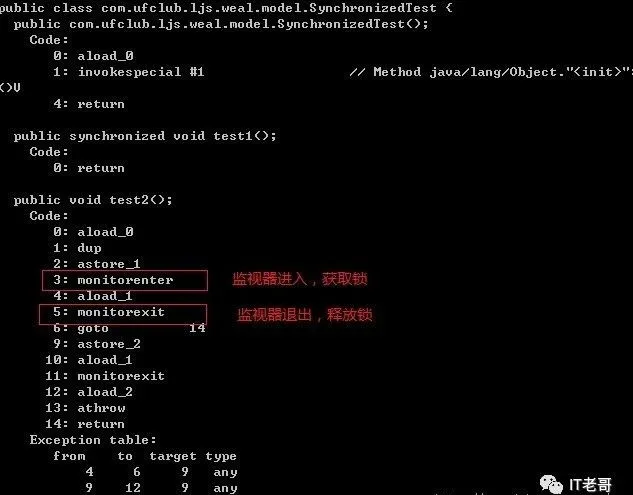

从这个截图上可以看出，同步代码块是使用monitorenter和monitorexit指令实现的， monitorenter插入到代码块开始的地方，monitorexit插入到代码块结束的地方，当monitor被持有后，就处于锁定状态，也就是上锁了。

下面我们深入分析一下synchronized实现锁的两个重要的概念：Java对象头和monitor

**Java对象头：**

synchronized的锁是存在对象头里的，对象头由两部分数据组成：Mark Word（标记字段）、Klass Pointer（类型指针）

Mark Word存储了对象自身运行时数据，如hashcode、GC分代年龄、锁状态标志、线程持有的锁、偏向锁ID等等。是实现轻量级锁和偏向锁的关键，Klass Pointer是Java对象指向类元数据的指针，jvm通过这个指针确定这个对象是哪个类的实例

**monitor：**

每个Java对象从娘胎里出来就带着一把看不见的锁， 叫做内部锁或者monitor锁，我们可以把它理解成一种同步机制，它是线程私有的数据结构，

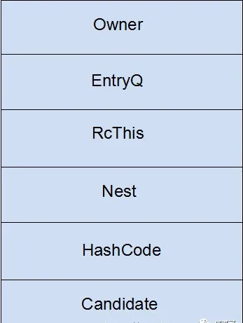

monitor的结构如下：

- Owner：初始时为NULL表示当前没有任何线程拥有该monitor record，当线程成功拥有该锁后保存线程唯一标识，当锁被释放时又设置为NULL；

- EntryQ:关联一个系统互斥锁（semaphore），阻塞所有试图锁住monitor record失败的线程。

- RcThis:表示blocked或waiting在该monitor record上的所有线程的个数。

- Nest:用来实现重入锁的计数。

- HashCode:保存从对象头拷贝过来的HashCode值（可能还包含GC age）。

- Candidate:用来避免不必要的阻塞或等待线程唤醒，因为每一次只有一个线程能够成功拥有锁，如果每次前一个释放锁的线程唤醒所有正在阻塞或等待的线程，会引起不必要的上下文切换（从阻塞到就绪然后因为竞争锁失败又被阻塞）从而导致性能严重下降。Candidate只有两种可能的值0表示没有需要唤醒的线程1表示要唤醒一个继任线程来竞争锁。 

## 多线程中 synchronized 锁升级的原理是什么？ 

 synchronized 锁升级原理：在锁对象的对象头里面有一个 threadid 字段，在第一次访问的时候 threadid 为空，jvm 让其持有偏向锁，并将 threadid 设置为其线程 id，再次进入的时候会先判断 threadid 是否与其线程 id 一致，如果一致则可以直接使用此对象，如果不一致，则升级偏向锁为轻量级锁，通过自旋循环一定次数来获取锁，执行一定次数之后，如果还没有正常获取到要使用的对象，此时就会把锁从轻量级升级为重量级锁，此过程就构成了 synchronized 锁的升级。 

 **锁的升级的目的：锁升级是为了减低了锁带来的性能消耗。**在 Java 6 之后优化 synchronized 的实现方式，**使用了偏向锁升级为轻量级锁再升级到重量级锁的方式，从而减低了锁带来的性能消耗。**

## synchronized锁升级的过程说一下?

在jdk1.6后Java对synchronize锁进行了升级过程,主要包含偏向锁、轻量级锁和重量级锁,主要是针对对象头MarkWord的变化。

## 为什么要引入偏向锁?

因为经过HotSpot的作者大量的研究发现,大多数时候是不存在锁竞争的,常常是一个线程多次获得同一个锁,因此如果每次都要竞争锁会增大很多没有必要付出的代价,为了降低获取锁的代价,才引入的偏向锁。

## 偏向锁的升级

当线程1访问代码块并获取锁对象时,会在java对象头和栈帧中记录偏向的锁的threadID,因为偏向锁不会主动释放锁,因此以后线程1再次获取锁的时候,需要比较当前线程的threadID和Java对象头中的threadID是否一致,如果一致(还是线程1获取锁对象),则无需使用CAS来加锁、解锁;如果不一致(其他线程,如线程2要竞争锁对象,而偏向锁不会主动释放因此还是存储的线程1的threadID),那么需要查看Java对象头中记录的线程1是否存活,如果没有存活,那么锁对象被重置为无锁状态,其它线程(线程2)可以竞争将其设置为偏向锁;如果存活,那么立刻查找该线程(线程1)的栈帧信息,如果还是需要继续持有这个锁对象,那么暂停当前线程1,撤销偏向锁,升级为轻量级锁,如果线程1不再使用该锁对象,那么将锁对象状态设为无锁状态,重新偏向新的线程。

## 为什么要引入轻量级锁?

轻量级锁考虑的是竞争锁对象的线程不多,而且线程持有锁的时间也不长的情景。因为阻塞线程需要CPU从用户态转到内核态,代价较大,如果刚刚阻塞不久这个锁就被释放了,那这个代价就有点得不偿失了,因此这个时候就干脆不阻塞这个线程,让它自旋这等待锁释放。

## 轻量级锁什么时候升级为重量级锁?

线程1获取轻量级锁时会先把锁对象的对象头MarkWord复制一份到线程1的栈帧中创建的用于存储锁记录的空间(称为DisplacedMarkWord),然后使用CAS把对象头中的内容替换为线程1存储的锁记录(DisplacedMarkWord)的地址;如果在线程1复制对象头的同时(在线程1CAS之前),线程2也准备获取锁,复制了对象头到线程2的锁记录空间中,但是在线程2CAS的时候,发现线程1已经把对象头换了,线程2的CAS失败,那么线程2就尝试使用自旋锁来等待线程1释放锁。但是如果自旋的时间太长也不行,因为自旋是要消耗CPU的,因此自旋的次数是有限制的,比如10次或者100次,如果自旋次数到了线程1还没有释放锁,或者线程1还在执行,线程2还在自旋等待,这时又有一个线程3过来竞争这个锁对象,那么这个时候轻量级锁就会膨胀为重量级锁。重量级锁把除了拥有锁的线程都阻塞,防止CPU空转。

## synchronized 为什么是非公平锁？非公平体现在哪些地方？

synchronized 的非公平其实在源码中应该有不少地方，因为设计者就没按公平锁来设计，核心有以下几个点：

1）当持有锁的线程释放锁时，该线程会执行以下两个重要操作：

1. 先将锁的持有者 owner 属性赋值为 null
2. 唤醒等待链表中的一个线程（假定继承者）。

在1和2之间，如果有其他线程刚好在尝试获取锁（例如自旋），则可以马上获取到锁。

2）当线程尝试获取锁失败，进入阻塞时，放入链表的顺序，和最终被唤醒的顺序是不一致的，也就是说你先进入链表，不代表你就会先被唤醒。

## JVM对synchronized的优化有哪些？

从最近几个jdk版本中可以看出，Java的开发团队一直在对synchronized优化，其中最大的一次优化就是在jdk6的时候，新增了两个锁状态，通过锁消除、锁粗化、自旋锁等方法使用各种场景，给synchronized性能带来了很大的提升。

**1. 锁膨胀**

上面讲到锁有四种状态，并且会因实际情况进行膨胀升级，其膨胀方向是：**无锁——>偏向锁——>轻量级锁——>重量级锁**，并且膨胀方向不可逆。

**偏向锁**

一句话总结它的作用：**减少统一线程获取锁的代价**。在大多数情况下，锁不存在多线程竞争，总是由同一线程多次获得，那么此时就是偏向锁。

**核心思想：**

如果一个线程获得了锁，那么锁就进入偏向模式，此时`Mark Word`的结构也就变为偏向锁结构，**当该线程再次请求锁时，无需再做任何同步操作，即获取锁的过程只需要检查**`Mark Word`的锁标记位为偏向锁以及当前线程ID等于`Mark Word`**的ThreadID即可**，这样就省去了大量有关锁申请的操作。

**轻量级锁**

轻量级锁是由偏向锁升级而来，当存在第二个线程申请同一个锁对象时，偏向锁就会立即升级为轻量级锁。注意这里的第二个线程只是申请锁，不存在两个线程同时竞争锁，可以是一前一后地交替执行同步块。

**重量级锁**

重量级锁是由轻量级锁升级而来，当**同一时间**有多个线程竞争锁时，锁就会被升级成重量级锁，此时其申请锁带来的开销也就变大。

重量级锁一般使用场景会在追求吞吐量，同步块或者同步方法执行时间较长的场景。

**2.锁消除**

消除锁是虚拟机另外一种锁的优化，这种优化更彻底，**在JIT编译时，对运行上下文进行扫描，去除不可能存在竞争的锁**。比如下面代码的method1和method2的执行效率是一样的，因为object锁是私有变量，不存在所得竞争关系。

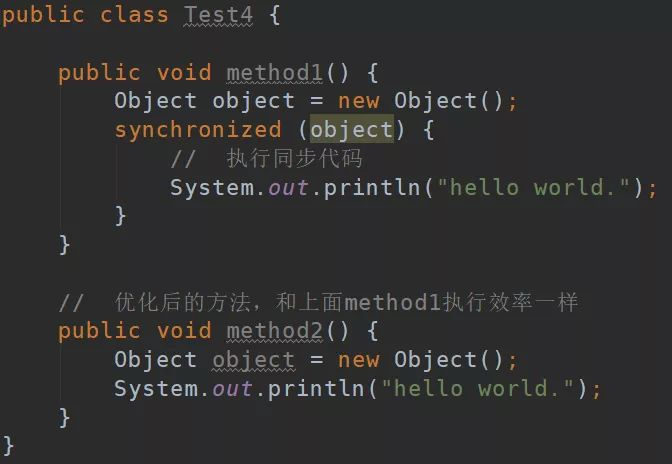

**3. 锁粗化**

锁粗化是虚拟机对另一种极端情况的优化处理，通过**扩大锁的范围，避免反复加锁和释放锁**。比如下面method3经过锁粗化优化之后就和method4执行效率一样了。


**4. 自旋锁与自适应自旋锁**

轻量级锁失败后，虚拟机为了避免线程真实地在操作系统层面挂起，还会进行一项称为自旋锁的优化手段。

**自旋锁：**许多情况下，共享数据的锁定状态持续时间较短，切换线程不值得，通过让线程执行循环等待锁的释放，不让出CPU。如果得到锁，就顺利进入临界区。如果还不能获得锁，那就会将线程在操作系统层面挂起，这就是自旋锁的优化方式。但是它也存在缺点：如果锁被其他线程长时间占用，一直不释放CPU，会带来许多的性能开销。

**自适应自旋锁**：这种相当于是对上面自旋锁优化方式的进一步优化，它的**自旋的次数不再固定**，其自旋的次数由前一次在同一个锁上的自旋时间及锁的拥有者的状态来决定，这就解决了自旋锁带来的缺点。

**为什么要引入偏向锁和轻量级锁？为什么重量级锁开销大？**

重量级锁底层依赖于系统的同步函数来实现，在 linux 中使用 pthread_mutex_t（互斥锁）来实现。

这些底层的同步函数操作会涉及到：操作系统用户态和内核态的切换、进程的上下文切换，而这些操作都是比较耗时的，因此重量级锁操作的开销比较大。

而在很多情况下，可能获取锁时只有一个线程，或者是多个线程交替获取锁，在这种情况下，使用重量级锁就不划算了，因此引入了偏向锁和轻量级锁来降低没有并发竞争时的锁开销。

## **synchronized 锁能降级吗？**

**可以的。**

具体的触发时机：在全局安全点（safepoint）中，执行清理任务的时候会触发尝试降级锁。

当锁降级时，主要进行了以下操作：

1）恢复锁对象的 markword 对象头；

2）重置 ObjectMonitor，然后将该 ObjectMonitor 放入全局空闲列表，等待后续使用。

## **synchronized的缺陷**

- 效率低：锁的释放情况少，只有代码执行完毕或者异常结束才会释放锁；试图获取锁的时候不能设定超时，不能中断一个正在使用锁的线程，相对而言，Lock可以中断和设置超时
- 不够灵活：加锁和释放的时机单一，每个锁仅有一个单一的条件(某个对象)，相对而言，读写锁更加灵活
- 无法知道是否成功获得锁，相对而言，Lock可以拿到状态，如果成功获取锁，....，如果获取失败，.....

##  Lock解决了哪些问题

Lock类这里不做过多解释，主要看里面的4个方法:

- `lock()`: 加锁
- `unlock()`: 解锁
- `tryLock()`: 尝试获取锁，返回一个boolean值
- `tryLock(long,TimeUtil)`: 尝试获取锁，可以设置超时

Synchronized只有锁只与一个条件(是否获取锁)相关联，不灵活，后来`Condition与Lock的结合`解决了这个问题。

多线程竞争一个锁时，其余未得到锁的线程只能不停的尝试获得锁，而不能中断。高并发的情况下会导致性能下降。ReentrantLock的lockInterruptibly()方法可以优先考虑响应中断。 一个线程等待时间过长，它可以中断自己，然后ReentrantLock响应这个中断，不再让这个线程继续等待。有了这个机制，使用ReentrantLock时就不会像synchronized那样产生死锁了。

synchronized是通过软件(JVM)实现的，简单易用，即使在JDK5之后有了Lock，仍然被广泛的使用。

## 使用Synchronized有哪些要注意的？

- 锁对象不能为空，因为锁的信息都保存在对象头里
- 作用域不宜过大，影响程序执行的速度，控制范围过大，编写代码也容易出错
- 避免死锁
- 在能选择的情况下，既不要用Lock也不要用synchronized关键字，用java.util.concurrent包中的各种各样的类，如果不用该包下的类，在满足业务的情况下，可以使用synchronized关键，因为代码量少，避免出错

## synchronized是公平锁吗？

**synchronized实际上是非公平的，新来的线程有可能立即获得监视器，而在等待区中等候已久的线程可能再次等待，这样有利于提高性能，但是也可能会导致饥饿现象。**

-  **synchronized 可以给类. 方法. 代码块加锁；而 lock 只能给代码块加锁。** 
-  **synchronized** 不需要手动获取锁和释放锁，使用简单，发生异常会**自动释放锁**，**不会造成死锁**；而 **lock 需要自己加锁和释放锁**，如果使用不当没有 unLock()去释放锁就**会造成死锁**。 
-  **通过 Lock 可以知道有没有成功获取锁**，而 synchronized 却无法办到。

主要相同点:**Lock 能完成 synchronized 所实现的所有功能。**
主要不同点:**Lock 有比 synchronized 更精确的线程语义和更好的性能。**
**synchronized 会自动释放锁**,而 **Lock 一定要求程序员手工释放,并且必须在 finally从句中释放**。Lock 还有更强大的功能,例如,它的 tryLock 方法可以非阻塞方式去拿锁。

## Synchronized 与 lock 的区别

- lock 是一个接口,而 sychronized 是 java 的关键字;
- synchronized 在发生异常时会自动释放锁,不会导致死锁,lock 则需要去手动 unlock,否则会造成死锁;lock 可以让等待锁的线程响应中断,synchronized 则不行
- 通过 lock 可以知道是否获得锁,synchronized 不行
- lock 可以提高多个线程进行读写操作的效率,相较于synchronized

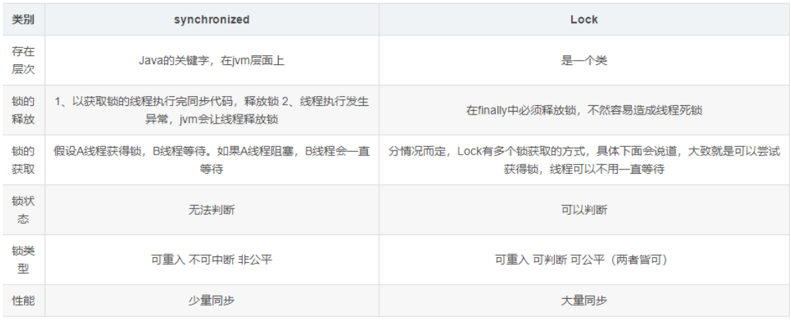

## synchronized和ReentrantLock 的区别

相同点:
(1)都是可重入锁

(2)都保证了可见性和互斥性

(3)都可以用于控制多线程对共享对象的访问

不同点:
(1)ReentrantLock等待可中断

(2)synchronized中的锁是非公平的,ReentrantLock默认也是非公平的,但是可以通过修改参数来实现公平锁。

(3)ReentrantLock绑定多个条件

(4)synchronized是Java中的关键字是JVM级别的锁,而ReentrantLock是一个Lock接口下的实现类,是API层面的锁。

(5)synchronized隐式获取锁和释放锁,ReentrantLock显示获取和释放锁,在使用时避免程序异常无法释放锁,需要在finally控制块中进行解锁操作。

**1.两者都是可重入锁**

可重入锁：重入锁，也叫做递归锁，可重入锁指的是在一个线程中可以多次获取同一把锁，比如： 一个线程在执行一个带锁的方法，该方法中又调用了另一个需要相同锁的方法，则该线程可以直接执行调用的方法，而无需重新获得锁， 两者都是同一个线程每进入一次，锁的计数器都自增1，所以要等到锁的计数器下降为0时才能释放锁。

**2.synchronized 依赖于 JVM 而 ReentrantLock 依赖于 API**

- synchronized 是依赖于 JVM 实现的，前面我们也讲到了 虚拟机团队在 JDK1.6 为 synchronized 关键字进行了很多优化，但是这些优化都是在虚拟机层面实现的
- ReentrantLock 是 JDK 层面实现的（也就是 API 层面，需要 lock() 和 unlock() 方法配合 try/finally 语句块来完成）

**3.ReentrantLock 比 synchronized 增加了一些高级功能**

相比synchronized，ReentrantLock增加了一些高级功能。主要来说主要有三点：①等待可中断；②可实现公平锁；③可实现选择性通知（锁可以绑定多个条件）

- 等待可中断.通过lock.lockInterruptibly()来实现这个机制。也就是说正在等待的线程可以选择放弃等待，改为处理其他事情。
- ReentrantLock可以指定是公平锁还是非公平锁。而synchronized只能是非公平锁。所谓的公平锁就是先等待的线程先获得锁。 ReentrantLock默认情况是非公平的，可以通过 ReentrantLock类的ReentrantLock(boolean fair)构造方法来制定是否是公平的。
- ReentrantLock类线程对象可以注册在指定的Condition中，从而可以有选择性的进行线程通知，在调度线程上更加灵活。 在使用notify()/notifyAll()方法进行通知时，被通知的线程是由 JVM 选择的，**用ReentrantLock类结合Condition实例可以实现“选择性通知”**

**4.使用选择**

- 除非需要使用 ReentrantLock 的高级功能，否则优先使用 synchronized。
- synchronized 是 JVM 实现的一种锁机制，JVM 原生地支持它，而 ReentrantLock 不是所有的 JDK 版本都支持。并且使用 synchronized 不用担心没有释放锁而导致死锁问题，因为 JVM 会确保锁的释放

synchronized 是和 if、else、for、while 一样的关键字，ReentrantLock 是类，这是二者的本质区别。

既然 ReentrantLock 是类，那么它就提供了比 synchronized 更多更灵活的特性，可以被继承、可以有方法、可以有各种各样的类变量，ReentrantLock 比 synchronized 的扩展性体现在几点上：

（1）ReentrantLock 可以对获取锁的等待时间进行设置，这样就避免了死锁

（2）ReentrantLock 可以获取各种锁的信息

（3）ReentrantLock 可以灵活地实现多路通知

另外，二者的锁机制其实也是不一样的:ReentrantLock 底层调用的是 Unsafe 的 park 方法加锁，synchronized 操作的应该是对象头中 mark word。

## synchronized 关键字和 volatile 关键字的区别

- volatile关键字是线程同步的轻量级实现，所以**volatile性能肯定比synchronized关键字要好。**
- **volatile关键字只能用于变量**,而**synchronized关键字可以修饰方法以及代码块**。实际开发中使用 synchronized 关键字的场景还是更多一些。
- **多线程访问volatile关键字不会发生阻塞，而synchronized关键字可能会发生阻塞**
- **volatile关键字能保证数据的可见性，但不能保证数据的原子性。synchronized关键字两者都能保证**
- **volatile关键字主要用于解决变量在多个线程之间的可见性，而 synchronized关键字解决的是多个线程之间访问资源的同步性。** 

`volatile` 解决的是内存可见性问题，会使得所有对 `volatile` 变量的读写都直接写入主存，即 **保证了变量的可见性**。

`synchronized` 解决的事执行控制的问题，它会阻止其他线程获取当前对象的监控锁，这样一来就让当前对象中被 `synchronized` 关键字保护的代码块无法被其他线程访问，也就是无法并发执行。而且，`synchronized` 还会创建一个 **内存屏障**，内存屏障指令保证了所有 CPU 操作结果都会直接刷到主存中，从而 **保证操作的内存可见性**，同时也使得这个锁的线程的所有操作都 `happens-before` 于随后获得这个锁的线程的操作。

两者的区别主要有如下：

1. volatile 本质是在告诉 JVM 当前变量在寄存器（工作内存）中的值是不确定的，需要从主存中读取； synchronized 则是锁定当前变量，只有当前线程可以访问该变量，其他线程被阻塞住。 
2. volatile **仅能使用在变量级别**；synchronized 则可以使用在 **变量. 方法. 和类级别的** 
3. volatile 仅能实现变量的修改可见性，**不能保证原子性**；而synchronized 则可以 **保证变量的修改可见性和原子性** 
4. volatile **不会造成线程的阻塞**；synchronized **可能会造成线程的阻塞**。 
5. volatile 标记的变量不会被编译器优化；synchronized 标记的变量可以被编译器优化。

## synchronized可重入的原理


重入锁是指一个线程获取到该锁之后，该线程可以继续获得该锁。底层原理维护一个计数器，当线程获取该锁时，计数器加一，再次获得该锁时继续加一，释放锁时，计数器减一，当计数器值为0时，表明该锁未被任何线程所持有，其它线程可以竞争获取锁。

## volatile关键字的作用是什么?

- 防止重排序（操作系统对指令的重排序）
- 实现可见性，可见性问题主要指一个线程修改了共享变量值，而另一个线程却看不到。引起可见性问题的主要原因是每个线程拥有自己的一个高速缓存区——线程工作内存。volatile关键字能有效的解决这个问题。
- 保证单次读/写的原子性，volatile不能保证完全的原子性，只能保证单次的读/写操作具有原子性。

## volatile三特性

- 保证可见性；
- 不保证复合操作的原子性；
- 禁止指令重排。

## volatile 变量是什么?volatile 变量和 atomic 变量有什么不同?

**volatile 则是保证了所修饰的变量的可见**。因为 **volatile 只是在保证了同一个变量在多线程中的可见性**,所以它更多是用于修饰作为开关状态的变量,即 Boolean 类型的变量。

volatile 多用于修饰类似开关类型的变量、Atomic 多用于类似计数器相关的变量、其它多线程并发操作用 synchronized 关键字修饰。

volatile 有两个作用:这个变量不会在多个线程中存在复本,直接从内存读取。这个关键字**会禁止指令重排序优化**。也就是说,在 volatile 变量的赋值操作后面会有一个内存屏障(生成的汇编代码上),读操作不会被重排序到内存屏障之前。

## volatile 类型变量提供什么保证?能使得一个非原子操作变成原子操作吗?

**volatile 提供 happens-before 的保证,确保一个线程的修改能对其他线程是可见的。**在 Java 中**除了 long 和 double 之外**的所有基本类型的读和赋值,都是原子性操作。而 **64 位的 long 和 double 变量**由于会被 JVM 当作两个分离的 32 位来进行操作,所以**不具有原子性**,会产生字撕裂问题。但是当你定义 long 或 double 变量时,如果**使用 volatile 关键字,就会获到(简单的赋值与返回操作的)原子性。**

## 谈谈volatile的使用及其原理

**volatile的两层语义**：

1、**volatile保证变量对所有线程的可见性：当volatile变量被修改，新值对所有线程会立即更新。**或者理解为**多线程环境下使用volatile修饰的变量的值一定是最新的。**

2、**jdk1.5以后volatile完全避免了指令重排优化，实现了有序性。**

**volatile的原理:**

获取JIT（即时Java编译器，把字节码解释为机器语言发送给处理器）的汇编代码，发现volatile多加了lock addl指令，这个操作相当于一个内存屏障，使得lock指令后的指令不能重排序到内存屏障前的位置。这也是为什么JDK1.5以后可以使用双锁检测实现单例模式。

lock前缀的另一层意义是使得本线程工作内存中的volatile变量值立即写入到主内存中，并且使得其他线程共享的该volatile变量无效化，这样其他线程必须重新从主内存中读取变量值。

具体原理见这篇文章：https://www.javazhiyin.com/61019.html

## volatile 可见性实现原理

volatile 变量的内存可见性是基于内存屏障(Memory Barrier)实现:

- 内存屏障，又称内存栅栏，是一个 CPU 指令。
- 在程序运行时，为了提高执行性能，编译器和处理器会对指令进行重排序，JMM 为了保证在不同的编译器和 CPU 上有相同的结果，通过插入特定类型的内存屏障来禁止+ 特定类型的编译器重排序和处理器重排序，插入一条内存屏障会告诉编译器和 CPU：不管什么指令都不能和这条 Memory Barrier 指令重排序。

## volatile 有序性实现原理

volatile 的 happens-before 关系：happens-before 规则中有一条是 volatile 变量规则：对一个 volatile 域的写happens-before 于任意后续对这个 volatile 域的读。

##  volatile 的应用场景

使用 volatile 必须具备的条件

- 对变量的写操作不依赖于当前值。
- 该变量没有包含在具有其他变量的不变式中。
- 只有在状态真正独立于程序内其他内容时才能使用 volatile。

## 说一个volatile的用法

单例模式的双重校验锁实现。

什么是DCL呢，其实就是double check lock的简写

DCL很多人都在单利中用过（`单例还有很多其他写法，具体看涉及模式复习题`），如下这种写法：

```java
public class Singleton {
   private static Singleton singleton;
   private Singleton(){}

   public static Singleton getInstance(){
       if(singleton == null){                              // 1
           synchronized (Singleton.class){                 // 2
               if(singleton == null){                      // 3
                   singleton = new Singleton();            // 4
               }
           }
       }
       return singleton;
   }
}
```

表面上这个代码看起来很完美，但是其实有问题

先说一下他完美的一面吧：

1、如果检查第一个singleton不为null,则不需要执行下面的加锁动作，极大提高了程序的性能；

2、如果第一个singleton为null,即使有多个线程同一时间判断，但是由于synchronized的存在，只会有一个线程能够创建对象；

3、当第一个获取锁的线程创建完成后singleton对象后，其他的在第二次判断singleton一定不会为null，则直接返回已经创建好的singleton对象；

**但是到底是哪里有错误呢**

首先创建一个对象分为三个步骤：

1、分配内存空间

2、初始化对象

3、讲内存空间的地址赋值给对象的引用

但是上面我讲了，jvm可能会对代码进行重排序，所以2和3可能会颠倒，

就会变成 1 —> 3 —> 2的过程，

那么当第一个线程A抢到锁执行初始化对象时，发生了代码重排序，3和2颠倒了，这个时候对象对象还没初始化，但是对象的引用已经不为空了，

所以当第二个线程B遇到第一个if判断时不为空，这个时候就会直接返回对象，但此时A线程还没执行完步骤2（初始化对象）。就会造成线程B其实是拿到一个空的对象。造成空指针问题。

**解决方案：**

既然上面的问题是由于jvm对代码重排序造成的，那我们禁止重排序不就好了吗？

volatile刚好可以禁止重排序，这样就不会存在2和3颠倒的问题了，所以改造后的代码如下：

```java
public class Singleton {
   //通过volatile关键字来确保安全
   private volatile static Singleton singleton;

   private Singleton(){}

   public static Singleton getInstance(){
       if(singleton == null){
           synchronized (Singleton.class){
               if(singleton == null){
                   singleton = new Singleton();
               }
           }
       }
       return singleton;
   }
}
```

## volatile 是怎么保证线程安全的?

volatile 关键字有两层语义:

1. 保证了不同线程对这个变量进行操作时的可见性
2. 禁止进行指令重排序;首先是对于可见性的保证,通过修饰变量,使其在修改后写入内存中,让其他线程获得新的值。volatile 无法保证线程的原子性,比如两个线程都做加一操作,线程 1 在读取后阻塞,仅读取但没有修改,线程 2 也读取了该数字,会造成问题。volatile 能保证有序性,因为 volatile 禁止重排序,此处有两个含义:一是当程序执行到volatile 修饰的变量的读写操作时,前面的操作肯定已经执行完成,二是在进行指令优化的时候不能将对 volatile 访问的语句放在其后面执行,也不能将后面的语句放在 volatile 前面。

## volatile 在 JDK 源码中的使用

JDK 的并发包中有一个队列集合类 LinkedTransferQueue,他是一个有链表构成的无界阻塞队列,它在使用 volatile 变量时,用一种追加字节的方式来优化队列出队和入队的性能。还有 ConcurrentHashMap 中用来封装哈希散列映射表中的键值对 HashEnty 类,它的 value域被声明为 volatile。

## 进程与线程

进程与线程之间的概念：

我们开发写的代码我们称为程序，那么将开发的代码运行起来，我们称为进程。说白了就是，当我们运行一个程序，那么我们**将运行的程序叫进程**。如QQ.exe

**进程是申请一块内存空间，将数据放到内存空间的最小资源管理单元。**进程是线程的容器，是资源分配的最小单位。每个进程都有一个独立的内存空间，进程与进程之间互相独立。应用程序可以同时运行多个进程。

**线程：是操作系统能够进行运算调度的最小单位，是系统分配处理器时间资源的基本单元，是进程中的实际运作单位**。进程内部的一个独立执行单元，一个进程可以同时并发的运行多个线程，线程一起共享一个进程。

线程是进程的一条流水线，只用来执行程序，是程序执行的最小单位。

进程要分配一大部分内存，而线程只需要分配一部分栈就可以了。

## 线程Thread类中的常用方法

wait（等待）、sleep（睡眠）、join（可以指定线程的执行顺序）、interrupt（中断）、notify（唤醒等待的线程）、notifyall（唤醒所有等待的线程）

## 线程的状态

```java
public enum State {//6种状态
// 新生  
    NEW,  
// 运行  
    RUNNABLE,  
// 阻塞   
    BLOCKED,  
// 等待，死死地等   
    WAITING,  
// 超时等待   
    TIMED_WAITING,  
// 终止    
    TERMINATED
}t
```

## wait和sleep 区别

1、来自不同的类
wait => Object
sleep =>线程类（ Thread）
2、关于锁的释放
wait 会释放锁，sleep 睡觉了，抱着锁睡觉，不会释放！
3、使用的范围是不同的
wait   必须在同步代码块中
sleep 可以在任何地方睡
4、是否需要捕获异常
wait 不需要捕获异常
sleep 必须要捕获异常

## 谈谈你对多线程的认识

​        一个采用了多线程技术的应用程序可以更好地利用系统资源。其主要优势在于充分利用了 CPU的空闲时间片，可以用尽可能少的时间来对用户的要求做出响应，使得进程的整体运行效率得到较大提高，同时增强了应用程序的灵活性。
​		更为重要的是，由于同一进程的所有线程是共享同一内存，所以不需要特殊的数据传送机制，不需要建立共享存储区或共享文件，从而使得不同任务之间的协调操作与运行、数据的交互、资源的分配等问题更加易于解决。

## 什么是线程安全？

**线程安全问题都是由全局变量及静态变量引起的。**若每个线程中对全局变量、静态变量只有读操作，而无写操作，一般来说，这个全局变量是线程安全的；
**若有多个线程同时执行写操作，一般都需要考虑线程同步， 否则的话就可能影响线程安全。**【说白了就是，当多个线程访问同一代码的时候，产生不确定的结果，就是线程不安全】若要解决上述问题，java中提供了同步机制（Synchronized）来解决该问题。

## 多线程的死锁？

多线程的死锁：**同步中嵌套同步，导致锁无法释放**

解决办法：**不要在同步中嵌套同步。**

## 多线程的并发性？                                     

原子性：即一个操作或者多个操作，要么全部执行并且执行的过程不会被任何因素打断，要么就都不执行。
可见性：当多个线程访问同一个变量时，一个线程修改了这个变量的值，能够快速的写入内存，并提醒其他线程重读。
有序性：程序执行的顺序按照代码的先后顺序执行。

## 进程之间常见的通信方式

- **管道pipe**：管道是一种半双工的通信方式，数据只能单向流动，而且**只能在具有亲缘关系的进程间使用**。进程的亲缘关系通常是指父子进程关系。
- **命名管道FIFO**：有名管道也是半双工的通信方式，但是它**允许无亲缘关系进程间的通信。**
- **消息队列MessageQueue**：消息队列是由消息的链表，存放在内核中并由消息队列标识符标识。消**息队列克服了信号传递信息少、管道只能承载无格式字节流以及缓冲区大小受限等缺点。**
- **共享存储SharedMemory：**共享内存就是映射一段能被其他进程所访问的内存，这段**共享内存由一个进程创建，但多个进程都可以访问。**共享内存是最快的 IPC 方式，它是针对其他进程间通信方式运行效率低而专门设计的。它往往与其他通信机制，如信号量，配合使用，来实现进程间的同步和通信。
- **信号量Semaphore：**信号量是一个计数器，可以用来控制多个进程对共享资源的访问。它常作为一种锁机制，防止某进程正在访问共享资源时，其他进程也访问该资源。因此，**主要作为进程间以及同一进程内不同线程之间的同步手段。**
- **套接字Socket：**套解字也是一种进程间通信机制，与其他通信机制不同的是，它可**用于不同及其间的进程通信。**
- **信号 ( sinal ) ：** 信号是一种比较复杂的通信方式，**用于通知接收进程某个事件已经发生。**  

## 线程和进程有什么区别？

线程具有许多传统进程所具有的特征，故又称为轻型进程(Light—Weight Process)或进程元；而把传统的进程称为重型进程(Heavy—Weight Process)，它相当于只有一个线程的任务。在引入了线程的操作系统中，**通常一个进程都有若干个线程，至少包含一个线程。**

**根本区别**：**进程是操作系统资源分配的基本单位**，而**线程是处理器任务调度和执行的基本单位**

**资源开销**：每个进程都有独立的代码和数据空间（程序上下文），程序之间的切换会有较大的开销；线程可以看做轻量级的进程，同一类线程共享代码和数据空间，每个线程都有自己独立的运行栈和程序计数器（PC），线程之间切换的开销小。

**包含关系**：如果一个进程内有多个线程，则执行过程不是一条线的，而是多条线（线程）共同完成的；**线程是进程的一部分**，所以线程也被称为轻权进程或者轻量级进程。

**内存分配**：**同一进程的线程共享本进程的地址空间和资源，而进程之间的地址空间和资源是相互独立的**

**影响关系**：一个进程崩溃后，在保护模式下不会对其他进程产生影响，但是**一个线程崩溃整个进程都死掉**。所以**多进程要比多线程健壮**。

**执行过程**：每个独立的进程有程序运行的入口、顺序执行序列和程序出口。但是**线程不能独立执行，必须依存在应用程序中**，由应用程序提供多个线程执行控制，两者均可并发执行。

## 创建线程的三种方式（实现Runnable、Callable接口、继承Thread类）的对比？

**1）采用实现Runnable、Callable接口的方式创建多线程。**

**优势是**：

线程类只是实现了Runnable接口或Callable接口，还可以继承其他类。

在这种方式下，多个线程可以共享同一个target对象，所以非常适合多个相同线程来处理同一份资源的情况，从而可以将CPU、代码和数据分开，形成清晰的模型，较好地体现了面向对象的思想。

**劣势是：**

编程稍微复杂，如果要访问当前线程，则必须使用Thread.currentThread()方法。

**2）使用继承Thread类的方式创建多线程**

**优势是：**

编写简单，如果需要访问当前线程，则无需使用Thread.currentThread()方法，直接使用this即可获得当前线程。

**劣势是：**

线程类已经继承了Thread类，所以不能再继承其他父类。

**3）Runnable和Callable的区别**

-  Callable规定（重写）的方法是call()，Runnable规定（重写）的方法是run()。
-  Callable的任务执行后可返回值，而Runnable的任务是不能返回值的。
-  Call方法可以抛出异常，run方法不可以。
-  运行Callable任务可以拿到一个Future对象，表示异步计算的结果。它提供了检查计算是否完成的方法，以等待计算的完成，并检索计算的结果。通过Future对象可以了解任务执行情况，可取消任务的执行，还可获取执行结果。

## Java中创建线程的方式有哪些?

回答:Java中创建线程的方式有4种,分别是
(1)写一个类继承子Thread类,重写run方法
(2)写一个类重写Runable接口,重写run方法
(3)写一个类重写Callable接口,重写call方法
(4)**使用线程池**

- 继承Thread类

- 实现Runnable接口

- 实现Callable接口通过FutureTask包装器来创建Thread线程

- 通过线程池创建线程，使用线程池接口ExecutorService结合Callable、Future实现有返回结果的多线程。

## 如何创建线程实例并运行?

`Thread` 类本质上是实现 `Runnable` 接口的一个实例，代表一个线程的实例。创建线程实例一般有两种方法：

  1. 创建 Thread 的子类并重写 `run()`

```java
public class MyThread extends Thread {
    @Override
    public void run(){
        System.out.println("MyThread running");
    }
}
```

`run()` 方在调用 `start()` 方法后被执行，而且一旦线程启动后 `start()` 方法后就会立即返回，而不是等到 `run()` 方法执行完毕后再返回。

```java
MyThread myThread = new MyThread();
myThread.start();
```

2. 实现 Runnable 接口

```java
public class MyRunnable implements Runnable{
    @Override
    public void run(){
        System.out.println("MyRunnable running");
    }
}
```

在新建类时实现 `Runnable` 接口，然后在 `Thread` 类的构造函数中传入 `MyRunnable` 的实例对象，最后执行 `start()` 方法即可；

```java
Thread thread = new Thread(new MyRunnable());
thread.start();
```

## 为什么要使用多线程呢?

从计算机底层来说： 线程可以比作是轻量级的进程，是程序执行的最小单位,**线程间的切换和调度的成本远远小于进程**。另外，多核 CPU 时代意味着多个线程可以同时运行，这减少了线程上下文切换的开销。

从当代互联网发展趋势来说： 现在的系统动不动就要求百万级甚至千万级的并发量，而**多线程并发编程正是开发高并发系统的基础**，利用好多线程机制可以大大提高系统整体的并发能力以及性能。

从计算机底层来说：

- 单核时代： **在单核时代多线程主要是为了提高 CPU 和 IO 设备的综合利用率**。举个例子：当只有一个线程的时候会导致 CPU 计算时，IO 设备空闲；进行 IO 操作时，CPU 空闲。我们可以简单地说这两者的利用率目前都是 50%左右。但是当有两个线程的时候就不一样了，当一个线程执行 CPU 计算时，另外一个线程可以进行 IO 操作，这样两个的利用率就可以在理想情况下达到 100%了。
- 多核时代:**多核时代多线程主要是为了提高 CPU 利用率**。举个例子：假如我们要计算一个复杂的任务，我们只用一个线程的话，CPU 只会一个 CPU 核心被利用到，而创建多个线程就可以让多个 CPU 核心被利用到，这样就提高了 CPU 的利用率。

众所周知，CPU、内存、I/O 设备的速度是有极大差异的，为了合理利用 CPU 的高性能，平衡这三者的速度差异，计算机体系结构、操作系统、编译程序都做出了贡献，主要体现为:

- CPU 增加了缓存，以均衡与内存的速度差异；// 导致 `可见性`问题
- 操作系统增加了进程、线程，以分时复用 CPU，进而均衡 CPU 与 I/O 设备的速度差异；// 导致 `原子性`问题
- 编译程序优化指令执行次序，使得缓存能够得到更加合理地利用。// 导致 `有序性`问题

1)**发挥多核CPU 的优势**
随着工业的进步,现在的笔记本、台式机乃至商用的应用服务器至少也都是双核的,4 核、8 核甚至 16 核的也都不少见,如果是单线程的程序,那么在双核 CPU 上就浪费了 50%, 在 4 核 CPU 上就浪费了 75%。单核 CPU 上所谓的"多线程"那是假的多线程,同一时间处理器只会处理一段逻辑,只不过线程之间切换得比较快,看着像多个线程"同时"运行罢了。**多核 CPU 上的多线程才是真正的多线程,它能让你的多段逻辑同时工作,多线程,可以真正发挥出多核CPU 的优势来,达到充分利用CPU 的目的。**
2)**防止阻塞**
从程序运行效率的角度来看,单核 CPU 不但不会发挥出多线程的优势,反而会因为在单核CPU 上运行多线程导致线程上下文的切换,而降低程序整体的效率。但是单核 CPU 我们还是要应用多线程,就是为了防止阻塞。试想,如果单核 CPU 使用单线程,那么只要这个线程阻塞了,比方说远程读取某个数据吧,对端迟迟未返回又没有设置超时时间,那么你的整个程序在数据返回回来之前就停止运行了。多线程可以防止这个问题,多条线程同时运行,哪怕一条线程的代码执行读取数据阻塞,也不会影响其它任务的执行。
3)**便于建模**
这是另外一个没有这么明显的优点了。假设有一个大的任务 A,单线程编程,那么就要考虑很多,建立整个程序模型比较麻烦。但是如果把这个大的任务 A 分解成
几个小任务,任务B、任务 C、任务 D,分别建立程序模型,并通过多线程分别运行这几个任务,那就简单很多了。

## 多线程的劣势：

- 线程也是程序，所以线程需要占用内存，线程越多占用内存也越多；
- 多线程需要协调和管理，所以需要 CPU 时间跟踪线程；
- 线程之间对共享资源的访问会相互影响，必须解决竞用共享资源的问题。

## 并发编程有什么缺点


并发编程的目的就是为了能提高程序的执行效率，提高程序运行速度，但是并发编程并不总是能提高程序运行速度的，而且并发编程可能会遇到很多问题，比如：内存泄漏、上下文切换、线程安全、死锁等问题。

## Java中线程的状态有哪些?线程间的通信方式有哪些?

回答:Java中线程生命周期分为新建(New)、运行(Runnable)、阻塞(Blocked)、无限期等待(Waiting)、限期等待(Time Waiting)和结束(Terminated)这6种状态。

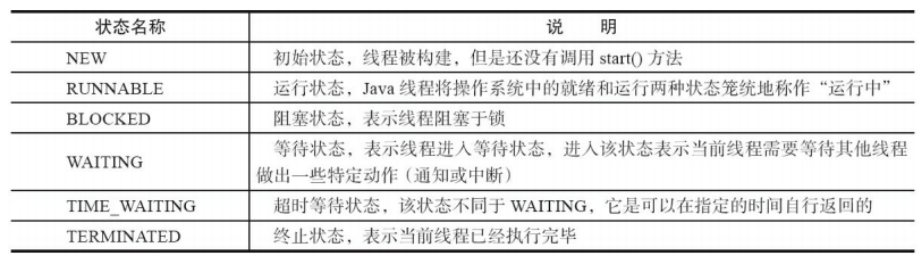

Java中线程间通信方式有:
**互斥量(Mutex)**:采用互斥对象机制,只有拥有互斥对象的线程才有访问公共资源的权限。因为互斥对象只有一个,所以可以保证公共资源不会被多个线程同时访问。比如 **Java 中的synchronized 关键词和各种 Lock 都是这种机制**。
**信号量(Semphares)** :它允许同一时刻多个线程访问同一资源,但是需要控制同一时刻访问此资源的最大线程数量。
**事件(Event)** :Wait/Notify:通过通知操作的方式来保持多线程同步,还可以方便的实现多线程优先级的比较操作。

## 什么是线程死锁?如何避免死锁?

**死锁就是两个线程相互等待对方释放对象锁。**

**死锁**

- 多个线程同时被阻塞，它们中的一个或者全部都在等待某个资源被释放。由于线程被无限期地阻塞，因此程序不可能正常终止。 
  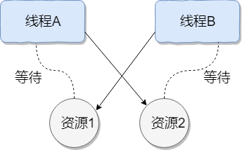

**死锁必须具备以下四个条件：**

- 互斥条件：该资源任意一个时刻只由一个线程占用。
- 请求与保持条件：一个进程因请求资源而阻塞时，对已获得的资源保持不放。
- 不剥夺条件:线程已获得的资源在末使用完之前不能被其他线程强行剥夺，只有自己使用完毕后才释放资源。
- 循环等待条件:若干进程之间形成一种头尾相接的循环等待资源关系。

**如何避免线程死锁?**

只要破坏产生死锁的四个条件中的其中一个就可以了

- 破坏互斥条件 
  这个条件我们没有办法破坏，因为我们用锁本来就是想让他们互斥的（临界资源需要互斥访问）
- 破坏请求与保持条件 
  一次性申请所有的资源。
- 破坏不剥夺条件 
  占用部分资源的线程进一步申请其他资源时，如果申请不到，可以主动释放它占有的资源。
- 破坏循环等待条件 
  靠按序申请资源来预防。按某一顺序申请资源，释放资源则反序释放。破坏循环等待条件。
- **锁排序法：（必须回答出来的点）** 
  指定获取锁的顺序，比如某个线程只有获得A锁和B锁，才能对某资源进行操作，在多线程条件下，如何避免死锁？ 
  通过指定锁的获取顺序，比如规定，只有获得A锁的线程才有资格获取B锁，按顺序获取锁就可以避免死锁。这通常被认为是解决死锁很好的一种方法。
- 使用显式锁中的ReentrantLock.try(long,TimeUnit)来申请锁

## 实现Runnable接口和Callable接口的区别？

- Callable仅在 Java 1.5 中引入,目的就是为了来处理Runnable不支持的用例。Callable 接口可以返回结果或抛出检查异常
- Runnable 接口不会返回结果或抛出检查异常，
- 如果任务不需要返回结果或抛出异常推荐使用 Runnable接口，这样代码看起来会更加简洁
- 工具类 Executors 可以实现 Runnable 对象和 Callable 对象之间的相互转换。（Executors.callable（Runnable task）或 Executors.callable（Runnable task，Object resule））

如果想让线程池执行任务的话需要实现的Runnable接口或Callable接口。 

Runnable接口或Callable接口实现类都可以被ThreadPoolExecutor或ScheduledThreadPoolExecutor执行。

两者的区别在于 Runnable 接口不会返回结果。

但是 Callable 接口可以返回结果。

## 说一下 runnable 和 callable 有什么区别


**相同点：**

**1、** 都是接口

**2、** 都可以编写多线程程序

**3、** 都采用Thread.start()启动线程

**主要区别：**

Runnable 接口 run 方法无返回值；Callable 接口 call 方法有返回值，是个泛型，和Future、FutureTask配合可以用来获取异步执行的结果

Runnable 接口 run 方法只能抛出运行时异常，且无法捕获处理；Callable 接口 call 方法允许抛出异常，可以获取异常信息 注：Callalbe接口支持返回执行结果，需要调用FutureTask.get()得到，此方法会阻塞主进程的继续往下执行，如果不调用不会阻塞。

## ExecutorService的execute()方法和submit()方法

- execute()方法用于提交不需要返回值的任务，所以无法判断任务是否被线程池执行成功与否；
- submit()方法用于提交需要返回值的任务。线程池会返回一个 Future 类型的对象，通过这个 Future 对象可以判断任务是否执行成功（可以通过 Future 的 get()方法来获取返回值，get()方法会阻塞当前线程直到任务完成，而使用 get（long timeout，TimeUnit unit）方法则会阻塞当前线程一段时间后立即返回，这时候有可能任务没有执行完。）

## ExecutorService的shutdown() VS shutdownNow()

- shutdown（） :关闭线程池，线程池的状态变为 SHUTDOWN。线程池不再接受新任务了，但是队列里的任务得执行完毕。
- shutdownNow（） :关闭线程池，线程的状态变为 STOP。线程池会终止当前正在运行的任务，并停止处理排队的任务并返回正在等待执行的 List。 
  shutdownNow的原理是遍历线程池中的工作线程，然后逐个调用线程的interrupt方法来中断线程，所以无法响应中断的任务可能永远无法终止。

## ExecutorService的isTerminated() VS isShutdown()

- isShutDown 当调用 shutdown() 方法后返回为 true。
- isTerminated 当调用 shutdown() 方法后，并且所有提交的任务完成后返回为 true

## sleep() 方法和 wait() 方法区别和共同点?

sleep 就是正在执行的线程主动让出 cpu,cpu 去执行其他线程,在 sleep 指定的时间过后,cpu 才会回到这个线程上继续往下执行,如果当前线程进入了同步锁,sleep方法并不会释放锁,即使当前线程使用 sleep 方法让出了 cpu,但其他被同步锁挡住了的线程也无法得到执行。

wait 是指在一个已经进入了同步锁的线程内,让自己暂时让出同步锁,以便其他正在等待此锁的线程可以得到同步锁并运行,只有其他线程调用了 notify 方法(notify 并不释放锁,只是告诉调用过 wait 方法的线程可以去参与获得锁的竞争了,但不是马上得到锁,因为锁还在别人手里,别人还没释放。如果 notify方法后面的代码还有很多,需要这些代码执行完后才会释放锁,可以在 notfiy 方法后增加一个等待和一些代码,看看效果),调用 wait 方法的线程就会解除 wait 状态和程序可以再次得到锁后继续向下运行。

**区别**

- sleep方法：是Thread类的静态方法，当前线程将睡眠n毫秒，线程进入阻塞状态。当睡眠时间到了，会解除阻塞，进入可运行状态，等待CPU的到来。**睡眠不释放锁（如果有的话）。**
- wait方法：是Object的方法，**必须与synchronized关键字一起使用**，线程进入阻塞状态，当notify或者notifyall被调用后，会解除阻塞。但是，只有重新占用互斥锁之后才会进入可运行状态。睡眠时，会释放互斥锁。
- sleep 方法没有释放锁，而 wait 方法释放了锁 。
- sleep 通常被用于暂停执行，Wait 通常被用于线程间交互/通信
- sleep() 方法执行完成后，线程会自动苏醒。或者可以使用 wait(long timeout)超时后线程会自动苏醒。wait() 方法被调用后，线程不会自动苏醒，需要别的线程调用同一个对象上的 notify() 或者 notifyAll() 方法
- sleep方法属于Thread类,wait方法属于Object类
- sleep方法暂停执行指定的时间,让出CPU给其他线程,但其监控状态依然保持在指定的时间过后又会自动恢复运行状态。
- 在调用sleep方法的过程中,线程不会释放对象锁,而wait会释放对象锁。
- sleep 方法和 wait 方法都可以用来放弃 CPU 一定的时间,不同点在于如果线程持有某个对象的监视器,sleep 方法不会放弃这个对象的监视器,wait
  方法会放弃这个对象的监视器

**相同**

- 两者都可以暂停线程的执行。

## sleep后进入什么状态,wait后进入什么状态?

回答:**sleep后进入Time waiting超时等待状态,wait后进入等待waiting状态。**

## wait为什么是Object类下面的方法?

所谓的释放锁资源实际是通知对象内置的monitor对象进行释放,而只有所有对象都有内置的monitor对象才能实现任何对象的锁资源都可以释放。又因为所有类都继承自Object,所以wait()就成了Object方法,也就是通过wait()来通知对象内置的monitor对象释放,而且事实上因为这涉及对硬件底层的操作,所以wait()方法是native方法,底层是用C写的。【来自网络】

## 为什么我们调用 start() 方法时会执行 run() 方法，为什么我们不能直接调用 run() 方法

- new 一个 Thread，线程进入了新建状态; 调用start() 会执行线程的相应准备工作，然后自动执行 run() 方法的内容，（调用 start() 方法，会启动一个线程并使线程进入了就绪状态，当分配到时间片后就可以开始运行了。）这是真正的多线程工作。
- **直接执行 run() 方法，会把 run 方法当成一个 main 线程下的普通方法去执行，并不会在某个线程中执行它，所以这并不是多线程工作。** 调用 start 方法方可启动线程并使线程进入就绪状态，而 run 方法只是 thread 的一个普通方法调用，还是在主线程里执行。

JVM执行start方法，会另起一条线程执行thread的run方法，这才起到多线程的效果~ 

如果直接调用Thread的run()方法，其方法还是运行在主线程中，没有起到多线程效果。

## start方法和run方法有什么区别?

- start方法用于启动线程,真正实现了多线程运行。在调用了线程的start方法后,线程会在后台执行,无须等待run方法体的代码执行完毕。
- 通过调用start方法启动一个线程时,此线程处于就绪状态,并没有运行。
- run方法也叫做线程体,包含了要执行的线程的逻辑代码,在调用run 方法后,线程就进入运行状态,开始运行run方法中的代码,在run方法运行结束后,该线程终止,CPU在调度其他的线程。
- run( ):只是调用普通 run 方法。
- start( ):启动了线程, 由 Jvm 调用 run 方法启动一个线程是调用 start() 方法,使线程所代表的虚拟处理机处于可运行状态,这意味着它可以由 JVM 调度并执行。这并不意味着线程就会立即运行。run() 方法可以产生必须退出的标志来停止一个线程。
- 只有调用了 start()方法,才会表现出多线程的特性,不同线程的 run()方法里面的代码交替执行。如果只是调用 run()方法,那么代码还是同步执行的,必须等待一个线程的 run()方法里面的代码全部执行完毕之后,另外一个线程才可以执行其 run()方法里面的代码。

## ThreadLocal是什么？有什么用？

ThreadLocal是一个本地线程副本变量工具类。主要用于将私有线程和该线程存放的副本对象做一个映射，各个线程之间的变量互不干扰，在高并发场景下，可以实现无状态的调用，特别适用于各个线程依赖不同的变量值完成操作的场景。

简单说ThreadLocal就是一种以**空间换时间**的做法，在每个Thread里面维护了一个以开地址法实现的ThreadLocal.ThreadLocalMap，把数据进行隔离，数据不共享，自然就没有线程安全方面的问题了。

**ThreadLocal，即线程本地变量。如果你创建了一个ThreadLocal变量，那么访问这个变量的每个线程都会有这个变量的一个本地拷贝，多个线程操作这个变量的时候，实际是操作自己本地内存里面的变量，从而起到线程隔离的作用，避免了线程安全问题。**

```java
//创建一个ThreadLocal变量
static ThreadLocal<String> localVariable = new ThreadLocal<>();
```

Java中每一个线程都有自己的专属本地变量, JDK 中提供的 ThreadLocal 类,ThreadLocal 类主要解决的就是让每个线程绑定自己的值,可以将 ThreadLocal 类形象的比喻成存放数据的盒子,盒子中可以存储每个线程的私有数据。
1.**ThreadLocal是Java中所提供的线程本地存储机制,**可以利用该机制将数据存在某个线程内部,该线程可以在任意时刻、任意方法中获取缓存的数据
2.ThreadLocal底层是通过ThreadLocalmap来实现的,每个Thread对象(注意不是ThreadLocal对象)中都存在一个ThreadLocalMap,Map的key为ThreadLocal对象,Map的value为需要缓存的值。
3.ThreadLocal经典的应用场景就是连接管理(一个线程持有一个链接,该连接对象可以在不同给的方法之间进行线程传递,线程之间不共享同一个连接)

ThreadLocal 用于创建线程的本地变量,我们知道一个对象的所有线程会共享它的全局变量,所以这些变量不是线程安全的,我们可以使用同步技术。但是当我们不想使用同步的时候,我们可以选择 ThreadLocal 变量。每个线程都会拥有他们自己的 Thread 变量,它们可以使用 get()\set() 方法去获取他们的默认值或者在线程内部改变他们的值。ThreadLocal 实例通常是希望它们同线程状态关联起来是 private static 属性。

**ThreadLocal的应用场景有**

- **数据库连接池**
- **会话管理中使用**

ThreadLocal 的作用是提供线程内的局部变量,这种变量在线程的生命周期内起作用,减少同一个线程内多个函数或者组件之间一些公共变量的传递的复杂度。用来解决数据库连接、Session 管理等。

很多小伙伴认为ThreadLocal是多线程同步机制的一种，其实不然，他是为多线程环境下为变量线程安全提供的一种解决思路，他是**解决多线程下成员变量的安全问题，不是解决多线程下共享变量的安全问题。**

线程同步机制是多个线程共享一个变量，而ThreadLocal是每个线程创建一个自己的单独变量副本，所以每个线程都可以独立的改变自己的变量副本。并且不会影响其他线程的变量副本。

（1）ThreadLocal是Java中所提供的线程本地存储机制，可以利用该机制将数据缓存在某个线程内存，该线程可以在任意时刻、任意方法中获取缓存的数据；

（2）ThreadLocal底层是通过ThreadLocalMap来实现的，每个Thread对象（注意不是ThreadLocal对象）中都存在一个ThreadLocalMap，Map的key为ThreadLocal对象，Map的value为需要缓存的值；

（3）如果在线程池中使用ThreadLocal会造成内存泄漏，因为当ThreadLocal对象使用完之后，应该要把设置的key，value，也就是Entry对象进行回收，但线程池中的线程不会回收，而线程对象是通过强引用指向ThreadLocalMap，ThreadLocalMap也是通过弱引用指向Entry对象，线程不被回收，Entry对象也就不会被回收，从而出现内存泄漏，解决办法是，在使用了ThreadLocal对象之后，手动调用了ThreadLocal的remove方法，手动清除Entry对象；

（4）ThreadLocal经典的应用场景就是连接管理（一个线程持有一个连接，该连接对象可以在不同的方法之间进行传递，线程之间不共享一个连接），例如Spring的事务的隔离机制。

当执行**set**方法时，ThreadLocal首先会获取当前线程对象，然后获取当前线程的ThreadLocalMap对象。再以当前ThreadLocal对象为key，将值存储进ThreadLocalMap对象中。
**get**方法执行过程类似。ThreadLocal首先会获取当前线程对象，然后获取当前线程的ThreadLocalMap对象。再以当前ThreadLocal对象为key，获取对应的value。

## ThreadLocal的实现原理

- Thread类有一个类型为ThreadLocal.ThreadLocalMap的实例变量threadLocals，即每个线程都有一个属于自己的ThreadLocalMap。
- ThreadLocalMap内部维护着Entry数组，每个Entry代表一个完整的对象，key是ThreadLocal本身，value是ThreadLocal的泛型值。
- 每个线程在往ThreadLocal里设置值的时候，都是往自己的ThreadLocalMap里存，读也是以某个ThreadLocal作为引用，在自己的map里找对应的key，从而实现了线程隔离。

ThreadLocal内存结构图：

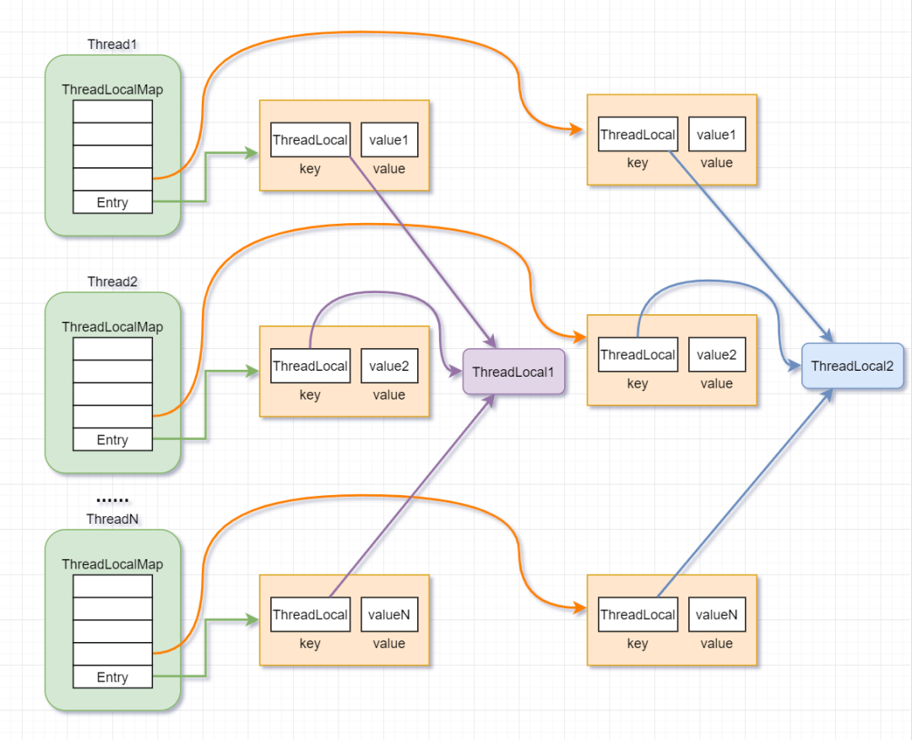

 

 由结构图是可以看出：

- Thread对象中持有一个ThreadLocal.ThreadLocalMap的成员变量。
- ThreadLocalMap内部维护了Entry数组，每个Entry代表一个完整的对象，key是ThreadLocal本身，value是ThreadLocal的泛型值。

## 知道ThreadLocal 内存泄露问题吗？

先看看一下的TreadLocal的引用示意图哈，

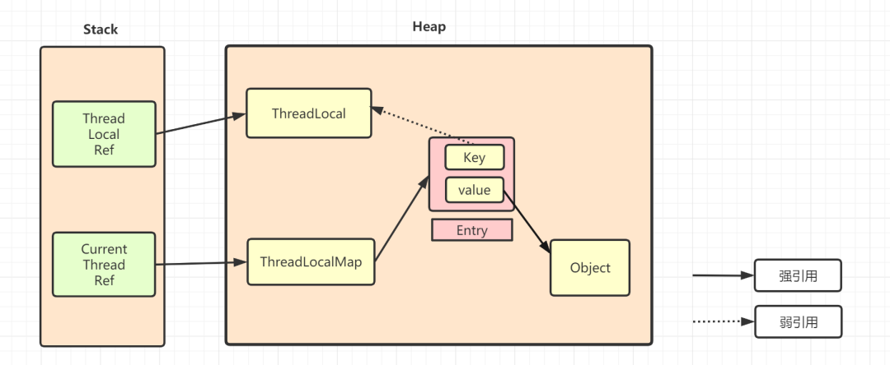

ThreadLocalMap中使用的 key 为 ThreadLocal 的弱引用，如下：

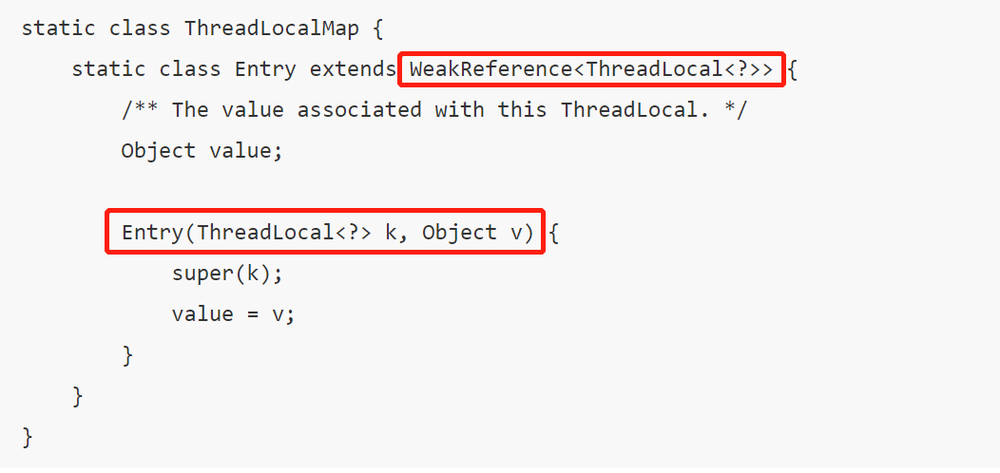

> 弱引用：只要垃圾回收机制一运行，不管JVM的内存空间是否充足，都会回收该对象占用的内存。

弱引用比较容易被回收。因此，如果ThreadLocal（ThreadLocalMap的Key）被垃圾回收器回收了，但是因为ThreadLocalMap生命周期和Thread是一样的，它这时候如果不被回收，就会出现这种情况：ThreadLocalMap的key没了，value还在，这就会**「造成了内存泄漏问题」**。

如何**「解决内存泄漏问题」**？使用完ThreadLocal后，**及时调用remove()方法释放内存空间。**

## 介绍一下 ThreadLocal?ThreadLocal 实现原理是什么?Map 中Key 和值分别什么?

ThreadLocal 是一个关于创建线程局部变量的类。从本质来讲,就是每个线程都维护了一个map,而这个 map 的 key 就是 threadLocal,而值就是我们 set 的那个值,每次线程在 get 的时候,都从自己的变量中取值,既然从自己的变量中取值,那肯定就不存在线程安全问题,总体来讲,**ThreadLocal 这个变量的状态根本没有发生变化,他仅仅是充当一个 key 的角色,另外提供给每一个线程一个初始值。**

使用场景比如:

在并发场景中,各线程都操作同一个不加修饰的变量是不安全的,而 volatile 保证不了原子性。假如我们现在需要变量是同一个,但每个线程都是用同一变量的一个新的副本,而这种副本也不需要去共享,这种情况下 ThreadLocal 就比较合适了。它可以让线程独占资源而不会造成线程阻塞。在每个 Thread 中包含一个ThreadLocalMap,ThreadLocalmap 中的 key 时ThreadLocal 对象,value 时独享的数据。

## Thread类中的yield方法有什么作用？

　　**yield方法可以暂停当前正在执行的线程对象，让其它有相同优先级的线程执行。它是一个静态方法而且只保证当前线程放弃CPU占用而不能保证使其它线程一定能占用CPU，执行yield()的线程有可能在进入到暂停状态后马上又被执行。**

**使当前线程从执行状态（运行状态）变为可执行态（就绪状态）**。当前线程到了就绪状态，那么接下来哪个线程会从就绪状态变成执行状态呢？可能是当前线程，也可能是其他线程，看系统的分配了。

## 为什么 Thread 类的 sleep()和 yield ()方法是静态的？

Thread 类的 sleep()和 yield()方法将在当前正在执行的线程上运行。所以在其他处于等待状态的线程上调用这些方法是没有意义的。这就是为什么这些方法是静态的。它们可以在当前正在执行的线程中工作，并避免程序员错误的认为可以在其他非运行线程调用这些方法

## 线程的 sleep()方法和 yield()方法有什么区别？

**1、** sleep()方法给其他线程运行机会时不考虑线程的优先级，因此会给低优先级的线程以运行的机会；**yield()方法只会给相同优先级或更高优先级的线程以运行的机会；**

**2、** **线程执行 sleep()方法后转入阻塞（blocked）状态，而执行 yield()方法后转入就绪（ready）状态；**

**3、** sleep()方法声明抛出 InterruptedException，而 yield()方法没有声明任何异常；

**4、** sleep()方法比 yield()方法（跟操作系统 CPU 调度相关）具有更好的可移植性，**通常不建议使用yield()方法来控制并发线程的执行。**

##  Java中的fork join框架是什么？

　　fork join框架是JDK7中出现的一款高效的工具，Java开发人员可以通过它充分利用现代服务器上的多处理器。它是专门为了那些可以递归划分成许多子模块设计的，目的是将所有可用的处理能力用来提升程序的性能。fork join框架一个巨大的优势是它使用了工作窃取算法，可以完成更多任务的工作线程可以从其它线程中窃取任务来执行。

## 线程阻塞的三种情况

当线程因为某种原因放弃 CPU 使用权后，即让出了 CPU 时间片，暂时就会停止运行，直到线程进入可运行状态（`Runnable`），才有机会再次获得 CPU 时间片转入 `RUNNING` 状态。一般来讲，阻塞的情况可以分为如下三种：

1. **等待阻塞（Object.wait -> 等待队列）** 

`RUNNING` 状态的线程执行 `Object.wait()` 方法后，JVM 会将线程放入等待序列（waitting queue）；

2. **同步阻塞（lock -> 锁池）** 

`RUNNING` 状态的线程在获取对象的同步锁时，若该 **同步锁被其他线程占用，则 JVM 将该线程放入锁池（lock pool）中**；

3. **其他阻塞（sleep/join）** 

`RUNNING` 状态的线程执行 `Thread.sleep(long ms)` 或 `Thread.join()` 方法，或发出 I/O 请求时，JVM 会将该线程置为阻塞状态。当 `sleep()` 状态超时，`join()` 等待线程终止或超时. 或者 I/O 处理完毕时，线程重新转入可运行状态（`RUNNABLE`）；

## 线程死亡的三种方式

1. **正常结束** 

`run()` 或者 `call()` 方法执行完成后，线程正常结束；

2. **异常结束** 

线程抛出一个未捕获的 `Exception` 或 `Error`，导致线程异常结束；

3. **调用 stop()** 

直接调用线程的 `stop()` 方法来结束该线程，但是一般不推荐使用该种方式，**因为该方法通常容易导致死锁**；

## 什么是守护线程?有什么用?

守护线程是运行在后台的一种特殊进程。它独立于控制终端并且周期性地执行某种任务或等待处理某些发生的事件。在 Java 中垃圾回收线程就是特殊的守护线程。

什么是守护线程?与守护线程相对应的就是用户线程,**守护线程就是守护用户线程,当用户线程全部执行完结束之后,守护线程才会跟着结束。**也就是**守护线程必须伴随着用户线程,如果一个应用内只存在一个守护线程,没有用户线程,守护线程自然会退出**

## 了解Fork/Join框架吗？

Fork/Join框架是Java7提供的一个用于并行执行任务的框架，是一个把大任务分割成若干个小任务，最终汇总每个小任务结果后得到大任务结果的框架。

**大任务自动分散小任务,并发执行,合并小任务结果。**

Fork/Join框架需要理解两个点，**「分而治之」**和**「工作窃取算法」**。

**「分而治之」**

以上Fork/Join框架的定义，就是分而治之思想的体现啦

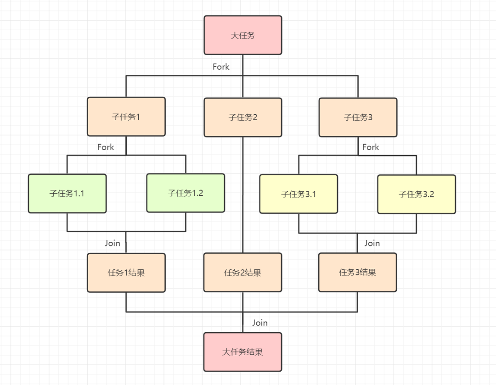

**「工作窃取算法」**

把大任务拆分成小任务，放到不同队列执行，交由不同的线程分别执行时。有的线程优先把自己负责的任务执行完了，其他线程还在慢慢悠悠处理自己的任务，这时候为了充分提高效率，就需要工作盗窃算法啦~

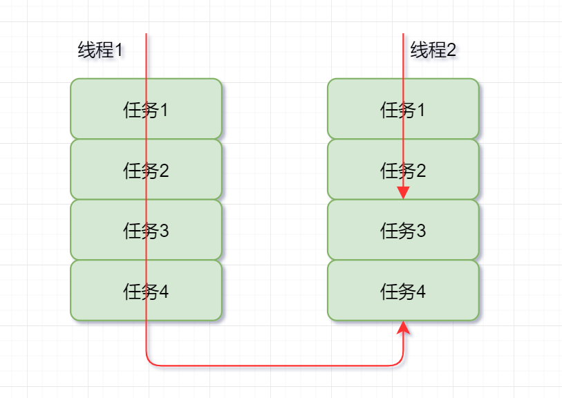


工作盗窃算法就是，**「某个线程从其他队列中窃取任务进行执行的过程」**。一般就是指做得快的线程（盗窃线程）抢慢的线程的任务来做，同时为了减少锁竞争，通常使用双端队列，即快线程和慢线程各在一端。

## Fork/Join 框架使用有哪些要注意的地方?

如果任务拆解的很深,系统内的线程数量堆积,导致系统性能性能严重下降；如果函数的调用栈很深,会导致栈内存溢出;

## CAS了解吗？

- CAS：全称 `Compare and swap`，即**比较并交换**，它是一条 **CPU 同步原语**。**是一种硬件对并发的支持**，**针对多处理器操作而设计的一种特殊指令**，**用于管理对共享数据的并发访问**。
- CAS **是一种无锁的非阻塞算法的实现**。
- CAS 包含了 3 个操作数：
  - 需要读写的内存值 V
  - 旧的预期值 A
  - 要修改的更新值 B

- 当且仅当 V 的值等于 A 时，CAS 通过原子方式用新值 B 来更新 V 的 值，否则不会执行任何操作（**他的功能是判断内存某个位置的值是否为预期值，如果是则更改为新的值，这个过程是原子的。**）

CAS 并发原语体现在 Java 语言中的 `sum.misc.Unsafe` 类中的各个方法。调用 Unsafe 类中的 CAS 方法， JVM 会帮助我们实现出 CAS 汇编指令。这是一种完全依赖于硬件的功能，通过它实现了原子操作。再次强调，由于 CAS是一种系统原语，**原语属于操作系统用于范畴，是由若干条指令组成的，用于完成某个功能的一个过程，并且原语的执行必须是连续的**，**在执行过程中不允许被中断**，CAS 是一条 CPU 的原子指令，不会造成数据不一致问题。

CAS指Compare and swap比较和替换是设计并发算法时用到的一种技术,CAS指令有三个操作数,分别是内存位置(在Java中可以简单的理解为变量的内存地址,用V表示),旧的预期值(用A表示)和准备设置的新值(用B表示)。CAS指令在执行的时候,当且仅当V符合A时,处理器才会用B更新V的值,否则它就不会执行更新。

CAS,全称为 Compare and Swap,即比较-替换。假设有三个操作数:内存值 V、旧的预期值 A、要修改的值 B,当且仅当预期值 A 和内存值 V 相同时,才会将内
存值修改为 B 并返回 true,否则什么都不做并返回 false。当然 **CAS 一定要 volatile变量配合,**这样才能保证每次拿到的变量是主内存中最新的那个值,否则旧的预期
值 A 对某条线程来说,永远是一个不会变的值 A,只要某次 CAS 操作失败,永远都不可能成功。**java.util.concurrent.atomic 包下面的 Atom类都有 CAS 算法的应用**。

## CAS有什么问题，CAS的缺点？

**1. ABA 问题**

并发环境下，假设初始条件是A，去修改数据时，发现是A就会执行修改。但是看到的虽然是A，中间可能发生了A变B，B又变回A的情况。此时A已经非彼A，数据即使成功修改，也可能有问题。

可以通过AtomicStampedReference**解决ABA问题**，它，**一个带有标记的原子引用类，通过控制变量值的版本来保证CAS的正确性。**

**2. 循环时间长开销**

自旋CAS，如果一直循环执行，一直不成功，会给CPU带来非常大的执行开销。

很多时候，CAS思想体现，是有个自旋次数的，就是为了避开这个耗时问题~

**3. 只能保证一个变量的原子操作。**

CAS 保证的是对一个变量执行操作的原子性，如果对多个变量操作时，CAS 目前无法直接保证操作的原子性的。

**可以通过这两个方式解决这个问题**：

- 使用互斥锁来保证原子性；
- 将多个变量封装成对象，通过AtomicReference来保证原子性。

## CAS原理

在翻了源码之后，大致可以总结出两个关键点：

- 自旋；
- unsafe类。

当点开compareAndSet方法后:

```java
// AtomicInteger类内部
public final boolean compareAndSet(int expect, int update) {
	return unsafe.compareAndSwapInt(this, valueOffset, expect, update);
}
```

通过这个方法，我们可以找出AtomicInteger内部维护了volatile int value和private static final Unsafe unsafe两个比较重要的参数。（注意value是用volatile修饰）

还有变量private static final long valueOffset，表示该变量在内存中的偏移地址，因为Unsafe就是根据内存偏移地址获取数据的。

变量value用volatile修饰，保证了多线程之间的内存可见性。

```java
// AtomicInteger类内部
private static final Unsafe unsafe = Unsafe.getUnsafe();
private static final long valueOffset;

static {
  try {
      valueOffset = unsafe.objectFieldOffset
          (AtomicInteger.class.getDeclaredField("value"));
  } catch (Exception ex) { throw new Error(ex); }
}

private volatile int value;
```

然后我们通过compareAndSwapInt找到了unsafe类核心方法：

```
//unsafe内部类
public final int getAndAddInt(Object var1, long var2, int var4) {
  int var5;
  do {
      var5 = this.getIntVolatile(var1, var2);
  } while(!this.compareAndSwapInt(var1, var2, var5, var5 + var4));

  return var5;
}
```

AtomicInteger.compareAndSwapInt()调用了Unsafe.compareAndSwapInt()方法。Unsafe类的大部分方法都是native的，用来像C语言一样从底层操作内存。

这个方法的var1和var2，就是根据对象和偏移量得到在主内存的快照值var5。然后compareAndSwapInt方法通过var1和var2得到当前主内存的实际值。如果这个实际值跟快照值相等，那么就更新主内存的值为var5+var4。如果不等，那么就一直循环，一直获取快照，一直对比，直到实际值和快照值相等为止。

比如有A、B两个线程

一开始都从主内存中拷贝了原值为3；

1、A线程执行到var5=this.getIntVolatile，即var5=3。此时A线程挂起；

2、B修改原值为4，B线程执行完毕，由于加了volatile，所以这个修改是立即可见的；

3、A线程被唤醒，执行this.compareAndSwapInt()方法，发现这个时候主内存的值不等于快照值3，所以继续循环，重新从主内存获取。

4、线程A重新获取value值，因为变量value被volatile修饰，所以其他线程对它的修改，线程A总是能够看到，线程A继续执行compareAndSwapInt进行比较替换，直至成功。

## ABA问题

所谓ABA问题，其实用最通俗易懂的话语来总结就是狸猫换太子

就是比较并交换的循环，存在一个时间差，而这个时间差可能带来意想不到的问题。

比如有两个线程A、B：

1、一开始都从主内存中拷贝了原值为3；

2、A线程执行到var5=this.getIntVolatile，即var5=3。此时A线程挂起；

3、B修改原值为4，B线程执行完毕;

4、然后B觉得修改错了，然后再重新把值修改为3；

5、A线程被唤醒，执行this.compareAndSwapInt()方法，发现这个时候主内存的值等于快照值3，（但是却不知道B曾经修改过），修改成功。

尽管线程A CAS操作成功，但不代表就没有问题。有的需求，比如CAS，只注重头和尾，只要首尾一致就接受。但是有的需求，还看重过程，中间不能发生任何修改。这就引出了AtomicReference原子引用。

## AtomicReference原子引用

AtomicInteger对整数进行原子操作，如果是一个POJO呢？可以用AtomicReference来包装这个POJO，使其操作原子化。

```java
User user1 = new User("Jack",25);
User user2 = new User("Lucy",21);
AtomicReference<User> atomicReference = new AtomicReference<>();
atomicReference.set(user1);
System.out.println(atomicReference.compareAndSet(user1,user2)); // true
System.out.println(atomicReference.compareAndSet(user1,user2)); //false
```

本质是比较的是两个对象的地址是否相等。

## AtomicStampedReference和ABA问题的解决

使用AtomicStampedReference类可以解决ABA问题。这个类维护了一个“版本号”Stamp，其实有点类似乐观锁的意思。

在进行CAS操作的时候，不仅要比较当前值，还要比较版本号。只有两者都相等，才执行更新操作。

```java
AtomicStampedReference.compareAndSet(expectedReference,newReference,oldStamp,newStamp);
```

##  **LongAdder原理的直观理解** 

LongAdder的计数主要分为2个对象

**一个long类型的字段**：base

**一个Cell对象数组**，Cell对象中就维护了一个long类型的字段value，用来计数

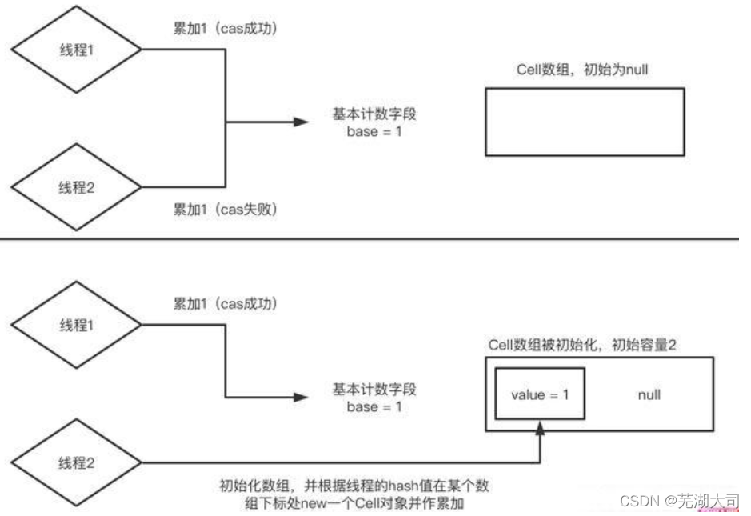 

 当没有发生线程竞争的时候，累加都会发生在base字段上，这就相当于是一个单线程累加2次，只不过base的累加是一个cas操作 

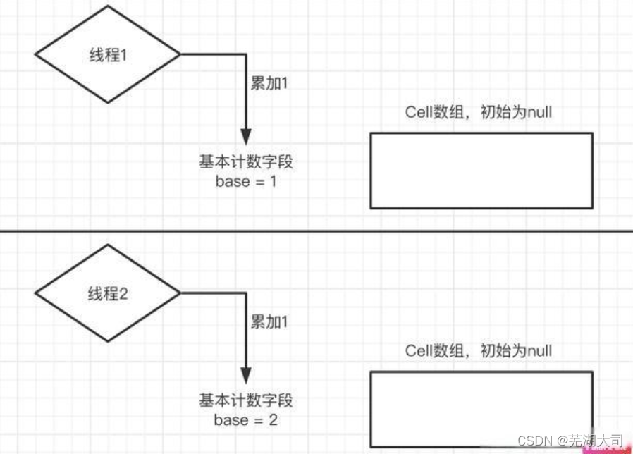 

 当发生线程竞争的时候，必然有一个线程对base的cas累加操作失败，于是**它先去判断Cell是否已经被初始化了**，如果没有则**初始化一个长度为2的数组**，并根据线程的**hash值找到对应的数组索引**，并对该索引的Cell对象中的value值进行累加（这个累加也是cas的操作） 

 

 如果一共有3个线程发生了竞争，那么其中第一个线程对base的cas累加成功，剩下2个线程都需要去对Cell数组中的元素进行累加。因为对Cell中value值的累加也是一个cas操作，**如果第二个线程和第三个线程的hash值对应的数组下标是同一个，那么同样会发生竞争，如果第二个线程成功了，第三个线程就会去rehash自己的hash值，如果得到的新的hash值对应的是另一个元素为null的数组下标，那么就new一个Cell对象并对value值进行累加 **

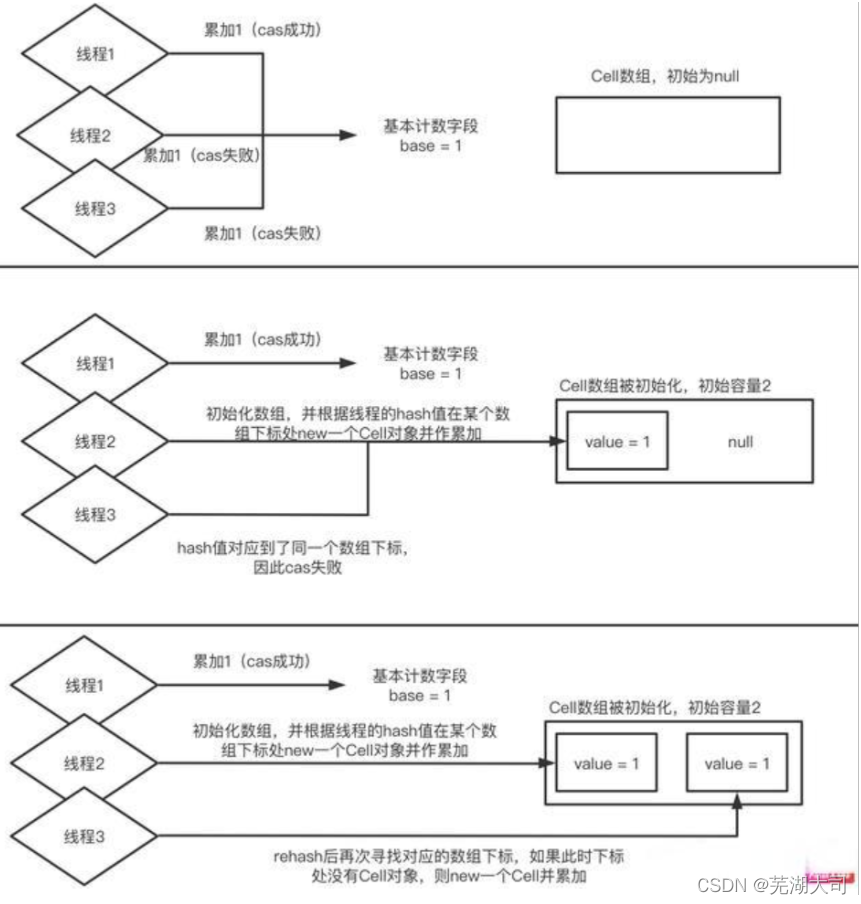

 如果此时有线程4同时参与竞争，那么对于线程4来说，即使rehash后还是可能在和线程3的竞争过程中cas失败，此时**如果当前数组的容量小于系统可用的cpu的数量，那么它就会对数组进行扩容，之后再次rehash**，重复尝试对Cell数组中某个下标对象的累加 

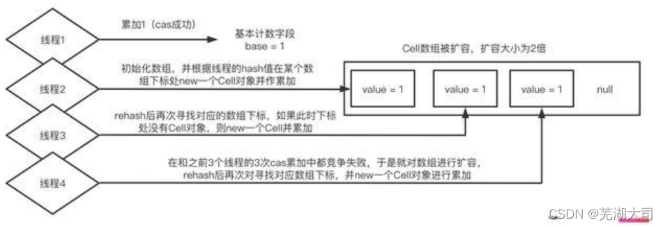 

## LongAdder和AtomicLong

 LongAdder是根据ConcurrentHashMap这类为并发设计的类的基本原理——**锁分段** 

 **在低竞争的并发环境下 `AtomicInteger` 的性能是要比 `LongAdder` 的性能好，而高竞争环境下 `LongAdder` 的性能比 `AtomicInteger` 好**，因此我们在使用时要结合自身的业务情况来选择相应的类型。 

> 性能分析

 为什么会出现上面的情况？

 `AtomicInteger` 在高并发环境下会有**多个线程去竞争一个原子变量**，而始终只有一个线程能竞争成功，**而其他线程会一直通过 CAS 自旋尝试获取此原子变量**，因此会有一定的性能消耗；

`LongAdder` 会将**这个原子变量分离成一个 Cell 数组，每个线程通过 Hash 获取到自己数组**，这样就减少了乐观锁的重试次数，从而在高竞争下获得优势；而在低竞争下表现的又不是很好，可能是因为自己本身机制的执行时间大于了锁竞争的自旋时间，因此在低竞争下表现性能不如 `AtomicInteger`。 

## AtomicInteger 不是 final 类型,如何保证线程安全?

- **用 volatile 关键字修饰 value 字段** ，AtomicInteger 用 value 字段来存储数据值,volatile 关键字保证了 value 字段对各个线程的可见性。各线程读取 value 字段时,会先从主内存把数据同步到工作内存,这样保证可见性。
- Unsafe 实现**操作原子性**,用户在使用时无需额外的同步操作。 如 AtomicInteger 提供了自增方法 getAndIncrement,其内部实现是由 Unsafe 类的 **compareAndSetInt 方法来保证的**。

## Java中的乐观锁与CAS算法

乐观锁认为数据发送时发生并发冲突的概率不大,所以读操作前不上锁。
到了写操作时才会进行判断,数据在此期间是否被其他线程修改。如果发生修改,那就返回写入失败;如果没有被修改,那就执行修改操作,返回修改成功。
乐观锁一般都采用 Compare And Swap(CAS)算法进行实现。顾名思义,该算法涉及到了两个操作,比较(Compare)和交换(Swap)。
CAS 算法的思路如下:

- 该算法认为不同线程对变量的操作时产生竞争的情况比较少。
- 该算法的核心是对当前读取变量值 E 和内存中的变量旧值 V 进行比较。
- 如果相等,就代表其他线程没有对该变量进行修改,就将变量值更新为新值 N。
- 如果不等,就认为在读取值 E 到比较阶段,有其他线程对变量进行过修改,不进行任何操作。

## 了解ReentrantLock吗？

**ReetrantLock是一个可重入的独占锁，主要有两个特性，一个是支持公平锁和非公平锁，一个是可重入。**
ReetrantLock实现依赖于AQS(AbstractQueuedSynchronizer)。

ReetrantLock主要依靠AQS维护一个阻塞队列，多个线程对加锁时，失败则会进入阻塞队列。等待唤醒，重新尝试加锁。

ReentrantLock 是一个可重入且独占式锁，具有与 synchronized 监视器(monitor enter、monitor exit)锁基本相同的行为和语意。但与 synchronized 相比，它更加灵活、强大、增加了轮训、超时、中断等高级功能以及可以创建公平和非公平锁。

ReentrantLock 是基于 Lock 实现的可重入锁，所有的 Lock 都是基于 AQS 实现的，AQS 和 Condition 各自维护不同的对象，在使用 Lock 和 Condition 时，其实就是两个队列的互相移动。它所提供的共享锁、互斥锁都是基于对 state 的操作。而它的可重入是因为实现了同步器 Sync，在 Sync 的两个实现类中，包括了公平锁和非公平锁。

使用举例

- 初始化构造函数入参，选择是否为初始化公平锁。

- 其实一般情况下并不需要公平锁，除非你的场景中需要保证顺序性。

- 使用 ReentrantLock 切记需要在 finally 中关闭， lock.unlock()。

```java
ReentrantLock lock = new ReentrantLock(true);  // true：公平锁
lock.lock();
try {
    // todo
} finally {
    lock.unlock();
}
```

公平锁、非公平锁的选择：

构造函数中选择公平锁（FairSync）、非公平锁（NonfairSync）。

```java
public ReentrantLock(boolean fair) {
    sync = fair ? new FairSync() : new NonfairSync();
}
```

**公平锁和非公平锁，主要是在方法 tryAcquire 中，是否有 !hasQueuedPredecessors() 判断。**

```java
static final class FairSync extends Sync {

    protected final boolean tryAcquire(int acquires) {
        final Thread current = Thread.currentThread();
        int c = getState();
        if (c == 0) {
            if (!hasQueuedPredecessors() &&
                compareAndSetState(0, acquires)) {
                setExclusiveOwnerThread(current);
                return true;
            }
        }
  ...
    }
}
```

队列首位判断

- 在这个判断中主要就是看当前线程是不是同步队列的首位，是：true、否：false

- 这部分就涉及到了公平锁的实现，CLH（Craig，Landin andHagersten）。 三个作者的首字母组合

```java
public final boolean hasQueuedPredecessors() {
    Node t = tail; // Read fields in reverse initialization order
    Node h = head;
    Node s;
    return h != t &&
        ((s = h.next) == null || s.thread != Thread.currentThread());
}
```

## 简述Lock与ReentrantLock

Lock接口是 Java并发包的顶层接口。
可重入锁 ReentrantLock 是 Lock 最常⻅的实现,与 synchronized 一样可重入。ReentrantLock 在默认情况下是非公平的,可以通过构造方法指定公平锁。一旦使用了公平锁,性能会下降。

## ReadWriteLock是什么？

首先ReentrantLock某些时候有局限，如果使用ReentrantLock，可能本身是为了防止线程A在写数据、线程B在读数据造成的数据不一致，但这样，如果线程C在读数据、线程D也在读数据，读数据是不会改变数据的，没有必要加锁，但是还是加锁了，降低了程序的性能。

因为这个，才诞生了读写锁ReadWriteLock。**ReadWriteLock是一个读写锁接口，ReentrantReadWriteLock是ReadWriteLock接口的一个具体实现，实现了读写的分离，读锁是共享的，写锁是独占的，读和读之间不会互斥，读和写、写和读、写和写之间才会互斥，提升了读写的性能**。

ReadWriteLock 是一个读写锁接口,ReentrantReadWriteLock 是 ReadWriteLock 接口的一个具体实现,实现了读写的分离,读锁是共享的,写锁是独占的,读和读之
间不会互斥,读和写、写和读、写和写之间才会互斥,提升了读写的性能。

## ReentrantReadWriteLock读写锁的使用？

1、读写锁：分为读锁和写锁，多个读锁不互斥，读锁与写锁互斥，这是由jvm⾃⼰控制的，你只要上好相应的锁即可。

2、如果你的代码只读数据，可以很多⼈同时读，但不能同时写，那就上读锁；

3、如果你的代码修改数据，只能有⼀个⼈在写，且不能同时读取，那就上写锁。总之，读的时候上读锁，写的时候上写
锁！

## 说说什么是线程安全?如何实现线程安全?

回答:当多个线程同时访问一个对象时,如果不用考虑这些线程在运行时环境下的调度和交替执行,也不需要进行额外的同步,或者在调用方进行任何其他的协调操作,调用这个对象的行为都可以获得正确的结果,那就称这个对象是线程安全的。【摘自深入理解Jvm虚拟机】

实现线程安全的方式有三大种方法,分别是**互斥同步、非阻塞同步和无同步**方案。

互斥同步:同步是指多个线程并发访问共享数据时,保证共享数据在同一各时刻只被一条(或一些,当使用信号量的时候)线程使用。而互斥是实现同步的一种手段,临界去、互斥量和信号量都是常见的互斥实现方式。**Java中实现互斥同步的手段主要有synchronized关键字或ReentrantLock等**。

非阻塞同步类似是一种乐观并发的策略,比如CAS。

无同步方案,比如使用ThreadLocal。

## 在 Java 程序中怎么保证多线程的运行安全？


出现线程安全问题的原因一般都是三个原因：

**1、** 线程切换带来的原子性问题 解决办法：**使用多线程之间同步synchronized或使用锁(lock)。**

**2、** 缓存导致的可见性问题 解决办法：**synchronized、volatile、LOCK，可以解决可见性问题**

**3、** 编译优化带来的有序性问题 解决办法：**Happens-Before 规则可以解决有序性问题**

## 什么是线程安全和线程不安全？

1、线程安全

线程安全:就是多线程访问时，采⽤了加锁机制，当⼀个线程访问该类的某个数据时，进⾏保护，其他线程不能进⾏访问，直到该线程读取完，其他线程才可使⽤。不会出现数据不⼀致或者数据污染。

Vector是⽤同步⽅法来实现线程安全的,⽽和它相似的ArrayList不是线程安全的。

2、线程不安全

线程不安全：就是不提供数据访问保护，有可能出现多个线程先后更改数据造成所得到的数据是脏数据

线程安全问题都是由全局变量及静态变量引起的。

若每个线程中对全局变量、静态变量只有读操作，⽽⽆写操作，⼀般来说，这个全局变量是线程安全的；

若有多个线程同时执⾏写操作，⼀般都需要考虑线程同步，否则的话就可能影响线程安全。

## 一个普通main方法的执行，是单线程模式还是多线程模式？为什么？

因为java有个重要的特性，叫垃圾自动回收机制，所以答案是**多线程**，这里面有两部分，**主线程（用户线程），垃圾回收线程GC（守护线程）同时存在。**

## 请描述线程的生命周期

一图胜千言！

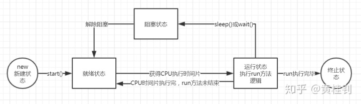

灵魂画家出品。

上述的图有些简略，下面详细说明下，线程共有6种状态：

new，runnable，blocked，waiting，timed waiting，terminated

1，当进入synchronized同步代码块或同步方法时，且没有获取到锁，线程就进入了blocked状态，直到锁被释放，重新进入runnable状态

2，当线程调用wait()或者join时，线程都会进入到waiting状态，当调用notify或notifyAll时，或者join的线程执行结束后，会进入runnable状态

3，当线程调用sleep(time)，或者wait(time)时，进入timed waiting状态，

当休眠时间结束后，或者调用notify或notifyAll时会重新runnable状态。

4，程序执行结束，线程进入terminated状态

案例篇

```java
/**
 * @author huangguizhao
 * 测试线程的状态
 */
public class ThreadStateTest {
    public static void main(String[] args) throws InterruptedException {
        Thread thread = new Thread(new Task());
        System.out.println(thread.getState());//NEW
        thread.start();
        System.out.println(thread.getState());//RUNNABLE
        //保险起见，让当前主线程休眠下
        Thread.sleep(10);
        System.out.println(thread.getState());//terminated
    }
}
class Task implements Runnable{
    @Override
    public void run() {
        for (int i = 0; i < 100; i++) {
            System.out.println(i);
        }
    }
}
```

```java
public class ThreadStateTest {
    public static void main(String[] args) throws InterruptedException {
        BlockTask task = new BlockTask();
        Thread t1 = new Thread(task);
        Thread t2 = new Thread(task);
        t1.start();
        t2.start();
        //从严谨的角度来说，t1线程不一定会先执行，此处是假设t1先执行
        System.out.println(t1.getState());//RUNNABLE
        System.out.println(t2.getState());//BLOCKED
        Thread.sleep(10);
        System.out.println(t1.getState());//TIMED_WAITING
        Thread.sleep(1000);
        System.out.println(t1.getState());//WAITING
    }
}

class BlockTask implements Runnable{

    @Override
    public void run() {
        synchronized (this){
            //另一个线程会进入block状态
            try {
                //目的是让线程进入TIMED_WAITING状态
                Thread.sleep(1000);
                //进入waiting状态
                wait();
            } catch (InterruptedException e) {
                e.printStackTrace();
            }
        }
    }
}
```

注意：

blocked，waiting，timed waiting 我们都称为阻塞状态

上述的就绪状态和运行状态，都表现为runnable状态

## 为什么阿里不建议使用JDK提供的线程池？

1，JDK通过接口ExecutorService来表示线程池，通过工具类Executors来创建多种线程池对象

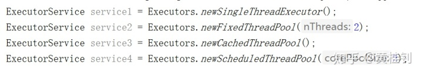

2，各种线程池的特点如下：

（1）newSingleThreadExecutor 创建一个单线程化的线程池，它只会用唯一的工作线程来执行任务，保证所有任务按照指定顺序(FIFO, LIFO, 优先级)执行。
（2）newFixedThreadPool 创建一个定长线程池，可控制线程最大并发数，超出的线程会在队列中等待。
（3）newCachedThreadPool将创建一个可缓存的线程池，当请求增加时，可以添加新的线程，线程池的规模不存在任何限制，线程数的理论值最大可以到Integer.MAX_VALUE
（4）newScheduledThreadPool 创建一个定长线程池，支持定时及周期性任务执行。

3，在实际开发中，我们是怎么使用的？（重点）

**实际开发中，线程资源必须通过线程池提供，不允许在应用中自行显式创建线程**

> 使用线程池的好处是减少在创建和销毁线程上所花的时间以及系统资源的开销，解决资源不足的问题。
> 如果不使用线程池，有可能造成系统创建大量同类线程而导致消耗完内存或者“过度切换”的问题

**实际开发中，线程池不允许使用 Executors 去创建，而是通过 ThreadPoolExecutor 的方式**

> FixedThreadPool 和 SingleThreadPool，允许的请求队列长度为 Integer.MAX_VALUE，可能会堆积大量的请求，从而导致 OOM。
> CachedThreadPool 和 ScheduledThreadPool，允许的创建线程数量为 Integer.MAX_VALUE，可能会创建大量的线程，从而导致 OOM

所以，综上所述，我们都会采用底层的方式来创建线程池，大家自己查阅各种线程池的源代码就可以看到他们都是采用了同一个类来创建。

自己查看，印象更深刻。

## 谈谈你对线程安全的理解？

**如果这个是面试官直接问你的问题，你会怎么回答？**

> 一个专业的描述是，当多个线程访问一个对象时，如果不用进行额外的同步控制或其他的协调操作，调用这个对象的行为都可以获得正确的结果，我们就说这个对象是线程安全的

**那么我们如何做到线程安全？**

> 实现线程安全的方式有多种，其中在源码中常见的方式是，采用synchronized关键字给代码块或方法加锁，比如StringBuffer
> 查看StringBuffer的源码，你会看到是这样的：

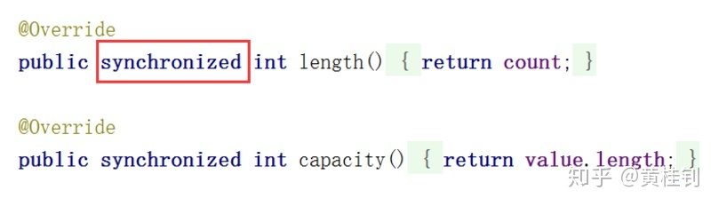

那么，我们开发中，如果需要拼接字符串，使用StringBuilder还是StringBuffer？

场景一：

如果是多个线程访问同一个资源，那么就需要上锁，才能保证数据的安全性。

这个时候如果使用的是非线程安全的对象，比如StringBuilder，那么就需要借助外力，给他加synchronized关键字。或者直接使用线程安全的对象StringBuffer

场景二：

如果每个线程访问的是各自的资源，那么就不需要考虑线程安全的问题，所以这个时候，我们可以放心使用非线程安全的对象，比如StringBuilder

比如在方法中，创建对象，来实现字符串的拼接。

**看场景，如果我们是在方法中使用，那么建议在方法中创建StringBuilder，这时候相当是每个线程独立占有一个StringBuilder对象，不存在多线程共享一个资源的情况，所以我们可以安心使用，虽然StringBuilder本身不是线程安全的。**

## 什么时候需要考虑线程安全？

**1，多个线程访问同一个资源**

**2，资源是有状态的，比如我们上述讲的字符串拼接，这个时候数据是会有变化的**

## AQS了解吗?

回答:**AQS是一个抽象队列同步器,通过维护一个状态标志位state和一个先进先出的(FIFO)的线程等待队列来实现一个多线程访问共享资源的同步框架。**
AQS的原理大概是这样的,给每个共享资源都设置一个共享锁,线程在需要访问共享资源时首先需要获取共享资源锁,如果获取到了共享资源锁,便可以在当前线程中使用该共享资源,如果没有获取到共享锁,该线程被放入到等待队列中,等待下一次资源调度。

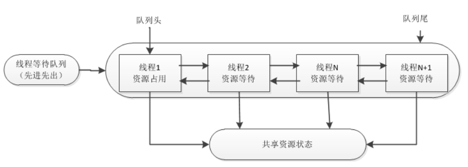

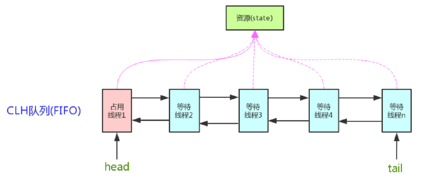

AQS定义了两种资源共享方式:独占式和共享式

独占式:只有一个线程能执行,具体的Java实现有ReentrantLock。

共享式:多个线程可同时执行,具体的Java实现有Semaphore和CountDownLatch。

AQS只是一个框架(模板模式),只定义了一个接口,具体资源的获取、释放都交由自定义同步器去实现。不同的自定义同步器争取用共享资源的方式也不同,自定义同步器在实现时只需实现共享资源state的获取与释放方式即可,至于具体线程等待队列的维护,如获取资源失败入队、唤醒出队等,AQS已经在顶层实现好,不需要具体的同步器在做处理。

AQS全称：AbstractQueuedSynchronizer，是JDK提供的一个同步框架，内部维护着FIFO双向队列，即CLH同步队列。

AQS依赖它来完成同步状态的管理（volatile修饰的state，用于标志是否持有锁）。

如果获取同步状态state失败时，会将当前线程及等待信息等构建成一个Node，将Node放到FIFO队列里，同时阻塞当前线程，当线程将同步状态state释放时，会把FIFO队列中的首节的唤醒，使其获取同步状态state。

很多JUC包下的锁都是基于AQS实现的

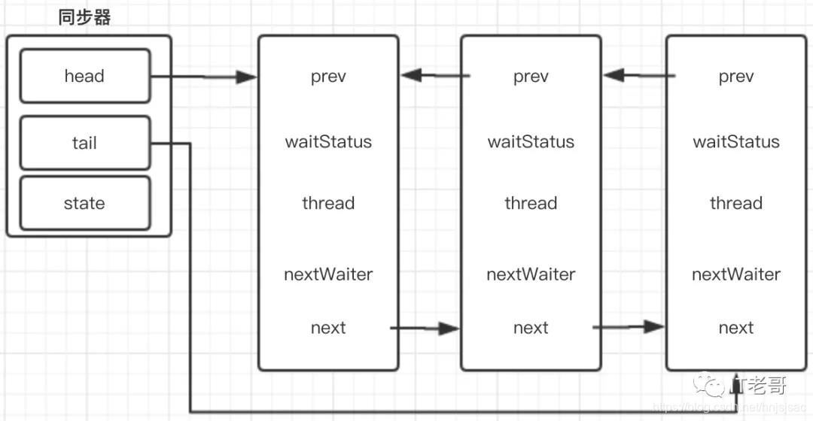

## AQS独占式同步状态过程

在AQS中维护着一个上面的FIFO的同步队列，当线程获取同步状态失败后，则会加入到这个CLH同步队列的对尾并一直保持着自旋。

在CLH同步队列中的线程在自旋时会判断其前驱节点是否为首节点，如果为首节点则不断尝试获取同步状态sate，获取成功则退出CLH同步队列。当线程执行完逻辑后，会释放同步状态sate，释放后会唤醒其后继节点。

tryAcquire方法尝试去获取锁，获取成功返回true，否则返回false。该方法由继承AQS的子类自己实现。采用了`模板方法设计模式`。

如：ReentrantLock的Sync内部类，Sync的子类：NonfairSync和

## AQS定义两种资源共享方式

1、独占 ( Exclusive )：只有一个线程能执行，其原理是看哪个线程先把state +1 ，谁就抢到了锁，如 ReentrantLock。又可分为公平锁和非公平锁：

- 公平锁：按照线程在队列中的排队顺序，先到者先拿到锁

- 非公平锁：当线程要获取锁时，无视队列顺序直接去抢锁，谁抢到就是谁的，所以非公平锁效率较高

2、共享 ( Share )：多个线程可同时执行，其原理就是多个线程去操作state字段，来一个线程就 +1，来一个线程就 +1

线程运行结束后state -1 ，一直减到0，就释放锁了。如Semaphore、CountDownLatch。

## 你使用过哪个AQS组件,有将其用于多线程编程吗?

回答:这个可以自己去网上找一些,或者自己总结一些。我一般举的例子是我在笔试中遇到的一个例子。就有四个子线程分别统计四个盘的容量,然后最终通过一个主线程将四个盘的进行求和,输出总的容量。用到了CountDownLatch,他是基于线程计数器来实现并发控制,主要用于主线程等待其他子线程都执行完毕后执行相关操作。
下面是代码:

```java
class DiskMemory {
    private int totalSize;
    public int getSize() {
        return (new Random().nextInt(3) + 1) * 100;//加一是为了防止获取磁盘大小为0,不符合常理
    }
    public void setSize(int size) {
        totalSize += size;
    }
    public int getTotalSize() {
        return totalSize;
    }
}
public class t3 {
    public static void main(String[] args) {
        ExecutorService executorService =
                Executors.newFixedThreadPool(4);
        DiskMemory diskMemory = new DiskMemory();
        //设置四个子线程 main函数为主线程
        CountDownLatch countDownLatch = new CountDownLatch(4);
        for (int i = 0; i < 4; i++) {
            executorService.execute(() -> {
                try {
                    int size = diskMemory.getSize();
                    diskMemory.setSize(size);
                    //Thread.sleep(1000);
                    System.out.println("线程执行,磁盘大小:" + size);
                } catch (Exception e) {//InterruptedException e
                    e.printStackTrace();
                }
                countDownLatch.countDown();//计数器减一
                System.out.println("--------");
            });
        }
        try {
            countDownLatch.await();//唤醒主线程
        } catch (InterruptedException e) {
            e.printStackTrace();
        }
        System.out.println("磁盘总大小:" +
                diskMemory.getTotalSize());
        //线程池使用完需要手动关闭
        executorService.shutdown();
    }
}
```

## 说一说什么是AQS？

1. AQS 是一个锁框架，它定义了锁的实现机制，并开放出扩展的地方，让子类去实现，比如我们在 lock 的时候，AQS 开放出 state 字段，让子类可以根据 state 字段来决定是否能够获得锁，对于获取不到锁的线程 AQS 会自动进行管理，无需子类锁关心，这就是 lock 时锁的内部机制，封装的很好，又暴露出子类锁需要扩展的地方；
2. AQS 底层是由同步队列 + 条件队列联手组成，同步队列管理着获取不到锁的线程的排队和释放，条件队列是在一定场景下，对同步队列的补充，比如获得锁的线程从空队列中拿数据，肯定是拿不到数据的，这时候条件队列就会管理该线程，使该线程阻塞；
3. AQS 围绕两个队列，提供了四大场景，分别是：获得锁、释放锁、条件队列的阻塞，条件队列的唤醒，分别对应着 AQS 架构图中的四种颜色的线的走向。

## AQS使用了哪些设计模式？

AQS同步器的设计是**基于模板方法模式**的，如果需要自定义同步器一般的方式是这样（模板方法模式很经典的一个应用）：

1. 使用者继承AbstractQueuedSynchronizer并重写指定的方法。（这些重写方法很简单，无非是对于共享资源state的获取和释放）
2. 将AQS组合在自定义同步组件的实现中，并调用其模板方法，而这些模板方法会调用使用者重写的方法。

这和我们以往通过实现接口的方式有很大区别，这是模板方法模式很经典的一个运用。

**AQS使用了模板方法模式，自定义同步器时需要重写下面几个AQS提供的模板方法：**

```
isHeldExclusively()//该线程是否正在独占资源。只有用到condition才需要去实现它。
tryAcquire(int)//独占方式。尝试获取资源，成功则返回true，失败则返回false。
tryRelease(int)//独占方式。尝试释放资源，成功则返回true，失败则返回false。
tryAcquireShared(int)//共享方式。尝试获取资源。负数表示失败；0表示成功，但没有剩余可用资源；正数表示成功，且有剩余资源。
tryReleaseShared(int)//共享方式。尝试释放资源，成功则返回true，失败则返回false。
```

## 了解AQS中同步队列的数据结构吗？

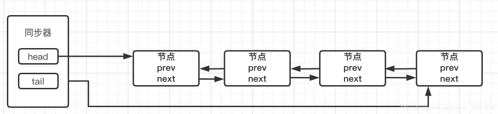

- 当前线程获取同步状态失败，同步器将当前线程机等待状态等信息构造成一个Node节点加入队列，放在队尾，同步器重新设置尾节点
- 加入队列后，会阻塞当前线程
- 同步状态被释放并且同步器重新设置首节点，同步器唤醒等待队列中第一个节点，让其再次获取同步状态

##  了解AQS 对资源的共享方式吗？

**AQS定义两种资源共享方式**

- Exclusive（独占）：只有一个线程能执行，如ReentrantLock。又可分为公平锁和非公平锁：

  - 公平锁：按照线程在队列中的排队顺序，先到者先拿到锁
  - 非公平锁：当线程要获取锁时，无视队列顺序直接去抢锁，谁抢到就是谁的

- **Share**（共享）：多个线程可同时执行，如Semaphore/CountDownLatch。Semaphore、CountDownLatCh、 CyclicBarrier、ReadWriteLock 我们都会在后面讲到。

ReentrantReadWriteLock 可以看成是组合式，因为ReentrantReadWriteLock也就是读写锁允许多个线程同时对某一资源进行读。

不同的自定义同步器争用共享资源的方式也不同。自定义同步器在实现时只需要实现共享资源 state 的获取与释放方式即可，至于具体线程等待队列的维护（如获取资源失败入队/唤醒出队等），AQS已经在顶层实现好了。

## AQS 组件了解吗?

- **Semaphore(信号量)-允许多个线程同时访问：** synchronized 和 ReentrantLock 都是一次只允许一个线程访问某个资源，Semaphore(信号量)可以指定多个线程同时访问某个资源。
- **CountDownLatch （倒计时器）：** CountDownLatch是一个同步工具类，用来协调多个线程之间的同步。这个工具通常用来控制线程等待，它可以让某一个线程等待直到倒计时结束，再开始执行。
- **CyclicBarrier(循环栅栏)：** CyclicBarrier 和 CountDownLatch 非常类似，它也可以实现线程间的技术等待，但是它的功能比 CountDownLatch 更加复杂和强大。主要应用场景和 CountDownLatch 类似。CyclicBarrier 的字面意思是可循环使用（Cyclic）的屏障（Barrier）。它要做的事情是，让一组线程到达一个屏障（也可以叫同步点）时被阻塞，直到最后一个线程到达屏障时，屏障才会开门，所有被屏障拦截的线程才会继续干活。CyclicBarrier默认的构造方法是 CyclicBarrier(int parties)，其参数表示屏障拦截的线程数量，每个线程调用await方法告诉 CyclicBarrier 我已经到达了屏障，然后当前线程被阻塞。

## AQS获取独占锁/释放独占锁原理:

获取:(acquire)调用 tryAcquire 方法安全地获取线程同步状态,获取失败的线程会被构造同步节点并通过 addWaiter方法加入到同步队列的尾部,在队列中自旋。
调用 acquireQueued 方法使得该节点以死循环的方式获取同步状态,如果获取不到则阻塞。

释放:(release)调用 tryRelease 方法释放同步状态，调用 unparkSuccessor 方法唤醒头节点的后继节点,使后继节点重新尝试获取同步状态。

## AQS获取共享锁/释放共享锁原理

获取锁(acquireShared)调用 tryAcquireShared 方法尝试获取同步状态,返回值不小于 0 表示能获取同步状态。

释放(releaseShared),并唤醒后续处于等待状态的节点。

## Java中常见的阻塞队列有哪些?

ArrayBlockingQueue:是一个我们常用的典型的有界队列,其内部的实现是基于数组来实现的。

LinkedBlockingQueue 从它的名字我们可以知道,它是一个由链表实现的队列,这个队列的长度Integer.MAX_VALUE ,这个值是非常大的,几乎无法达到,对此我们可以认为这个队列基本属于一个无界队列(也有认为是有界队列)。此队列按照先进先出的顺序进行排序。

SynchronousQueue 是一个不存储任何元素的阻塞队列,每一个put操作必须等待take操作,否则不能添加元素。同时它也支持公平锁和非公平锁。

PriorityBlockingQueue是一个支持优先级排序的无界阻塞队列,可以通过自定义实现compareTo() 方法来指定元素的排序规则,或者通过构造器参数 Comparator 来指定排序规则。但是需要注意插入队列的对象必须是可比较大小的,也就是 Comparable 的,否则会抛出 ClassCastException 异常。

DelayQueue是一个实现PriorityBlockingQueue的延迟获取的无界队列。具有“延迟”的功能。

## 什么是强引用、软引用、弱引用、虚引用?

- 强引用是使用最普遍的引用。只要某个对象有强引用与之关联,JVM必定不会回收这个对象,即使在内存不足的情况下,JVM宁愿抛出OutOfMemory错误也不会回收这种对象。
- 软引用是用来描述一些有用但并不是必需的对象,在Java中用java.lang.ref.SoftReference类来表示。只有在内存不足的时候JVM才会回收该对象。
- 只具有弱引用的对象拥有更短暂的生命周期。在垃圾回收器线程扫描它所管辖的内存区域的过程中,一旦发现了只具有弱引用的对象,不管当前内存空间足够与否,都会回收它的内存。弱引用可以和一个引用队列(ReferenceQueue)联合使用,如果弱引用所引用的对象被垃圾回收,Java虚拟机就会把这个弱引用加入到与之关联的引用队列中。
- 虚引用也称为幻影引用,一个对象是都有虚引用的存在都不会对生存时间都构成影响,也无法通过虚引用来获取对一个对象的真实引用。唯一的用处:能在对象被GC时收到系统通知,JAVA中用PhantomReference来实现虚引用虚引用必须和引用队列 (ReferenceQueue)联合使用。当垃圾回收器准备回收一个对象时,如果发现它还有虚引用,就会在回收对象的内存之前,把这个虚引用加入到与之关联的引用队列中。

## 四大引用及其应用

- 强引用:在内存不足时不会被回收。如新创建对象。
- 软引用:在内存不足时会被回收。用于实现内存敏感的高速缓存。
- 弱引用:只要 GC 回收期发现了它就会回收,用于 Map 数据结构中,引用占用内存空 间较大的对象。
- 虚引用:在回收之前,会被放入 ReferenceQueue,JVM 不会自动将该 referent 字段设 置成null,其他引用则是在回收后放入 ReferenceQueue 中。用于实现一个对象被回收之前做 一些清理工作。

## 弱引用和软引用哪个存活周期长

为了防止内存溢出,处理一些内存大且生命周期较长的对象时候,尽量使用软引用和弱引用。如果只是想避免OOM,则可以使用软引用,若对于性能更在意,则可以使用弱引用。对象经常用到,使用软引用,反之则弱引用。**只具有弱引用的对象拥有更短的生命周期。**

## Java弱引用


弱引用需要用 WeakReference 类来实现，它比软引用的生存期更短，对于只有弱引用的对象来说，只要垃圾回收机制一运行，不管 JVM 的内存空间是否足够，总会回收该对象占用的内存。

## stop() 和 suspend() 方法为何不推荐使用?

**反对使用 stop(),是因为它不安全**。它会解除由线程获取的所有锁定,而且如果对象处于一种不连贯状态,那么其他线程能在那种状态下检查和修改它们。结果很难检查出真正的问题所在。
**suspend() 方法容易发生死锁**。调用 suspend() 的时候,目标线程会停下来,但却仍然持有在这之前获得的锁定。此时,其他任何线程都不能访问锁定的资源,除非被 "挂起" 的线程恢复运行。对任何线程来说,如果它们想恢复目标线程,同时又试图使用任何一个锁定的资源,就会造成死锁。所以不应该使用 suspend(),而应在自己的 Thread类中置入一个标志,指出线程应该活动还是挂起。若标志指出线程应该挂起,便用 wait()命其进入等待状态。若标志指出线程应当恢复,则用一个 notify() 重新启动线程。

## 同步和异步有何异同,在什么情况下分别使用他们?

如果数据将在线程间共享。例如正在写的数据以后可能被另一个线程读到,或者正在读的数据可能已经被另一个线程写过了,那么这些数据就是共享数据,必须进行同步存取。当应用程序在对象上调用了一个需要花费很长时间来执行的方法,并且不希望让程序等待方法的返回时,就应该使用异步编程,在很多情况下采用异步途径往往更有效率。

## 当一个线程进入一个对象的一个synchronized方法后，其它线程是否可进入此对象的其它方法?

- 其他方法前是否加了synchronized关键字，如果没加，则能。

- 如果这个方法内部调用了wait，则可以进入其他synchronized方法。

- 如果其他个方法都加了synchronized关键字，并且内部没有调用wait，则不能。

- 如果其他方法是static，它用的同步锁是当前类的字节码，与非静态的方法不能同步，因为非静态的方法用的是this。

## 请说出你所知道的线程同步的方法。

- Synchronized 关键字,Lock 锁实现,分布式锁等。

- wait():使一个线程处于等待状态,并且释放所持有的对象的 lock。 

- sleep():使一个正在运行的线程处于睡眠状态,是一个静态方法,调用此方法要捕捉InterruptedException 异常。 
- notify():唤醒一个处于等待状态的线程,注意的是在调用此方法的时候,并不能确切的唤醒某一个等待状态的线程,而是由 JVM 确定唤醒哪个线程,而且不是按优先级。
-  notityAll():唤醒所有处入等待状态的线程,注意并不是给所有唤醒线程一个对象的锁,而是让它们竞争。

## 请说出与线程同步以及线程调度相关的方法。


**1、** wait()：使一个线程处于等待（阻塞）状态，并且释放所持有的对象的锁；

**2、** sleep()：使一个正在运行的线程处于睡眠状态，是一个静态方法，调用此方法要处理 InterruptedException 异常；

**3、** notify()：唤醒一个处于等待状态的线程，当然在调用此方法的时候，并不能确切的唤醒某一个等待状态的线程，而是由 JVM 确定唤醒哪个线程，而且与优先级无关；

**4、** notityAll()：唤醒所有处于等待状态的线程，该方法并不是将对象的锁给所有线程，而是让它们竞争，只有获得锁的线程才能进入就绪状态；

## 线程控制方法

- sleep( )：线程休眠
- join( )：线程加入
- yield( )：线程礼让
- setDaemon( )：线程守护

## 线程的调度策略


**线程调度器选择优先级最高的线程运行，但是，如果发生以下情况，就会终止线程的运行：**

**1、** 线程体中调用了yield方法让出了对cpu的占用权利

**2、** 线程体中调用了sleep方法使线程进入睡眠状态

**3、** 线程由于IO操作受到阻塞

**4、** 另外一个更高优先级线程出现

5）在支持时间片的系统中，该线程的时间片用完

## 线程 B 怎么知道线程 A 修改了变量


**1、** volatile 修饰变量

**2、** synchronized 修饰修改变量的方法

**3、** wait/notify

**4、** while 轮询

## 什么是线程活锁?

当所有线程阻塞,或者由于需要的资源无效而不能处理,不存在非阻塞线程使资源可用。JavaAPI 中线程活锁可能发生在以下情形:

- 当所有线程在序中执行 Object.wait(0),参数为 0 的 wait 方法。程序将发生活锁直到在相应的对象上有线程调用 Object.notify() 或者 Object.notifyAll()。
- 当所有线程卡在无限循环中。

## 多线程中的忙循环是什么?

忙循环就是程序员用循环让一个线程等待,不像传统方法 wait(), sleep() 或 yield() 它们都放弃了 CPU 控制,而忙循环不会放弃 CPU,它就是在运行一个空循环。这么做的目的是为了保留 CPU 缓存。在多核系统中,一个等待线程醒来的时候可能会在另一个内核运行,这样会重建缓存。为了避免重建缓存和减少等待重建的时间就可以使用它了。

## 简述线程通信的方式

- volatile 关键词修饰变量,保证所有线程对变量访问的可⻅性。
- synchronized关键词。确保多个线程在同一时刻只能有一个处于方法或同步块中。
- wait/notify方法
- IO通信

## 线程怎样拿到返回结果?

实现Callable 接口。

## 新建 T1、T2、T3 三个线程,如何保证它们按顺序执行?

用 join 方法。

## 怎么控制同一时间只有 3 个线程运行?

用 Semaphore。

## 如何关闭线程池

shutdown();不再接受新的任务,之前提交的任务等执行结束再关闭线程池。
shutdownNow();不再接受新的任务,试图停止池中的任务再关闭线程池,返回所有未处理的线程list 列表。

## CyclicBarrier 和 CountDownLatch 的区别?

两个看上去有点像的类,都在 java.util.concurrent 下,都可以用来表示代码运行到某个点上,二者的区别在于:

- CyclicBarrier 的某个线程运行到某个点上之后,该线程即停止运行,直到所有的线程都到达了这个点,所有线程才重新运行;CountDownLatch 则不是,某线程运行到某个点上之后,只是给某个数值-1 而已,该线程继续运行。
- CyclicBarrier 只能唤起一个任务,CountDownLatch 可以唤起多个任务。
- CyclicBarrier 可重用 , CountDownLatch 不可重用 , 计数值为0该CountDownLatch就不可再用了。

## CyclicBarrier和CountDownLatch的用法及区别？

| CountDownLatch                                               | CyclicBarrier                                                |
| ------------------------------------------------------------ | ------------------------------------------------------------ |
| 减计数⽅式                                                   | 加计数⽅式                                                   |
| 计算为0时释放所有等待的线程                                  | 计数达到指定值时释放所有等待线程                             |
| 计数为0时，⽆法重置                                          | 计数达到指定值时，计数置为0重新开始                          |
| 调⽤countDown()⽅法计数减⼀，调⽤await()⽅法只进⾏阻塞，对计数没任何影响 | 调⽤await()⽅法计数加1，若加1后的值不等于构造⽅法的值，则线程阻塞 |
| 不可重复利⽤                                                 | 可重复利⽤                                                   |

## 简述CyclicBarrier

CyclicBarrier 主要功能和CountDownLatch类似,也是**通过一个计数器,使一个线程等待其他线程各自执行完毕后再执行。但是其可以重复使用(reset)。**

## 简述Semaphore

**Semaphore即信号量。Semaphore 的构造方法参数接收一个 int 值,设置一个计数器,表示可用的许可数量即最大并发数。使用 acquire 方法获得一个许可证,计数器减一,使用 release 方法归还许可,计数器加一。如果此时计数器值为0,线程进入休眠。**

## 简述Exchanger

**Exchanger类可用于两个线程之间交换信息。**可简单地将Exchanger对象理解为一个包含两个格子的容器,通过exchanger方法可以向两个格子中填充信息。线程通过exchange 方法交换数据,第一个线程执行exchange 方法后会阻塞等待第二个线程执行该方法。当两个线程都到达同步点时这两个线程就可以交换数据当两个格子中的均被填充时,该对象会自动将两个格子的信息交换,然后返回给线程,从而实现两个线程的信息交换。

## 什么是活锁、饥饿、无锁、死锁?

死锁、活锁、饥饿是关于多线程是否活跃出现的运行阻塞障碍问题,如果线程出现了这三种情况,即线程不再活跃,不能再正常地执行下去了。

- 死锁：死锁是多线程中最差的一种情况,多个线程相互占用对方的资源的锁,而又相互等对方释放锁,此时若无外力干预,这些线程则一直处理阻塞的假死状态,形成死锁。举个例子,A 同学抢了 B 同学的钢笔,B 同学抢了 A 同学的书,两个人都相互占用对方的东西,都在让对方先还给自己自己再还,这样一直争执下去等待对方还而又得不到解决,老师知道此事后就让他们相互还给对方,这样在外力的干预下他们才解决,当然这只是个例子没有老师他们也能很好解决,计算机不像人如果发现这种情况没有外力干预还是会一直阻塞下去的。
- 活锁：活锁这个概念大家应该很少有人听说或理解它的概念,而在多线程中这确实存在。活锁恰恰与死锁相反,死锁是大家都拿不到资源都占用着对方的资源,而**活锁是拿到资源却又相互释放不执行**。当多线程中出现了**相互谦让,**都主动将资源释放给别的线程使用,这样这个资源在多个线程之间跳动而又得不到执行,这就是活锁。
- 饥饿：我们知道多线程执行中有线程优先级这个东西,优先级高的线程能够插队并优先执行,这样如果优先级高的线程一直抢占优先级低线程的资源,**导致低优先级线程无法得到执行,这就是饥饿。**当然**还有一种饥饿的情况,一个线程一直占着一个资源不放而导致其他线程得不到执行**,与死锁不同的是饥饿在以后一段时间内还是能够得到执行的,如那个占用资源的线程结束了并释放了资源。
- 无锁：**无锁,即没有对资源进行锁定,即所有的线程都能访问并修改同一个资源,但同时只有一个线程能修改成功。**无锁典型的特点就是一个修改操作在一个循环内进行,线程会不断的尝试修改共享资源,如果没有冲突就修改成功并退出否则就会继续下一次循环尝试。所以,如果有多个线程修改同一个值必定会有一个线程能修改成功,而其他修改失败的线程会不断重试直到修改成功。之前的文章我介绍过 **JDK 的CAS 原理及应用即是无锁的实现**。可以看出,无锁是一种非常良好的设计,它不会出现线程出现的跳跃性问题,锁使用不当肯定会出现系统性能问题,虽然**无锁无法全面代替有锁,但无锁在某些场合下是非常高效的**。

## 产生死锁的条件

1.互斥条件：**一个资源每次只能被一个进程使用。**

2.请求与保持条件：**一个进程因请求资源而阻塞时，对已获得的资源保持不放。**

3.不剥夺条件:**进程已获得的资源，在末使用完之前，不能强行剥夺。**

4.循环等待条件:**若干进程之间形成一种头尾相接的循环等待资源关系。**

## 什么是线程死锁


**1、** 死锁是指两个或两个以上的进程（线程）在执行过程中，由于竞争资源或者由于彼此通信而造成的一种阻塞的现象，若无外力作用，它们都将无法推进下去。此时称系统处于死锁状态或系统产生了死锁，这些永远在互相等待的进程（线程）称为死锁进程（线程）。

**2、** 多个线程同时被阻塞，它们中的一个或者全部都在等待某个资源被释放。由于线程被无限期地阻塞，因此程序不可能正常终止。

**3、** 如下图所示，线程 A 持有资源 2，线程 B 持有资源 1，他们同时都想申请对方的资源，所以这两个线程就会互相等待而进入死锁状态。

## 怎么防止死锁？

- 尽量使用 tryLock(long timeout, TimeUnit unit)的方法(ReentrantLock、ReentrantReadWriteLock)，**设置超时时间，超时可以退出防止死锁。**

- 尽量使**用 Java. util. concurrent 并发类**代替自己手写锁。

- 尽量**降低锁的使用粒度，**

- 尽量**不要几个功能用同一把锁。**

- 尽量**减少同步的代码块。**

## 一个线程运行时发生异常会怎样?

**如果异常没有被捕获该线程将会停止执行。**Thread.UncaughtExceptionHandler 是用于处理未捕获异常造成线程突然中断情况的一个内嵌接口。当一个未捕获异常将造成线程中断的时候 JVM 会 使 用 Thread.getUncaughtExceptionHandler() 来 查 询 线程 的UncaughtExceptionHandler 并 将 线 程 和 异 常 作 为 参 数 传 递 给 handler 的uncaughtException()方法进行处理。

如果这个异常没有被捕获的话，这个线程就停止执行了。另外重要的一点是：如果这个线程持有某个某个对象的监视器，那么这个对象监视器会被立即释放。

## 线程数过多会造成什么异常?

**线程过多会造成栈溢出,也有可能会造成堆异常。**

## 说说线程安全的和不安全的集合。

Java 中平时用的最多的 Map 集合就是 HashMap 了,它是线程不安全的。
看下面两个场景:
1、当用在方法内的局部变量时,局部变量属于当前线程级别的变量,其他线程访问不了,所以这时也不存在线程安全不安全的问题了。
2、当用在单例对象成员变量的时候呢?这时候多个线程过来访问的就是同一个HashMap 了,对同个 HashMap 操作这时候就存在线程安全的问题了。

## 怎么检测一个线程是否拥有锁?

`Thread.holdsLock(this)` 方法

## 线程同步需要注意什么?

- 尽量缩小同步的范围,增加系统吞吐量。
- 分布式同步锁无意义,要使用分布式锁。
- 防止死锁,注意加锁顺序。

## 线程 wait()方法使用有什么前提?

要在同步块中使用。

## 线程之间如何传递数据?

通过在线程之间**共享对象**就可以了 , 然后通过 wait/notify/notifyAll 、await/signal/signalAll 进行唤起和等待,比方说阻塞队列 BlockingQueue 就是为线程之间共享数据而设计的。

## 保证可见性有哪几种方式?

synchronized 和 volatile

## 说几个常用的 Lock 接口实现锁。

ReentrantLock、ReadWriteLock

## FutureTask 是什么?

FutureTask 表示一个异步运算的任务,FutureTask 里面可以传入一个 Callable 的具体实现类,可以对这个异步运算的任务的结果进行等待获取、判断是否已经完成、取消任务等操作。

## 怎么唤醒一个阻塞的线程?

如果线程是因为调用了wait()、sleep()或者join()方法而导致的阻塞，可以中断线程，并且通过抛出InterruptedException来唤醒它；如果线程遇到了IO阻塞，无能为力，因为IO是操作系统实现的，Java代码并没有办法直接接触到操作系统。


首先 ，wait()、notify() 方法是针对对象的，调用任意对象的 wait()方法都将导致线程阻塞，阻塞的同时也将释放该对象的锁，相应地，调用任意对象的 notify()方法则将随机解除该对象阻塞的线程，但它需要重新获取该对象的锁，直到获取成功才能往下执行；

其次，wait、notify 方法必须在 synchronized 块或方法中被调用，并且要保证同步块或方法的锁对象与调用 wait、notify 方法的对象是同一个，如此一来在调用 wait 之前当前线程就已经成功获取某对象的锁，执行 wait 阻塞后当前线程就将之前获取的对象锁释放。

## 如何停止一个正在运行的线程？


在java中有以下3种方法可以终止正在运行的线程：

**1、** 使用退出标志，使线程正常退出，也就是当run方法完成后线程终止。

**2、** 使用stop方法强行终止，但是不推荐这个方法，因为stop和suspend及resume一样都是过期作废的方法。

**3、** 使用interrupt方法中断线程。

## 如何让正在运行的线程暂停一段时间？


我们可以使用Thread类的**sleep()方法让线程暂停一段时间**。需要注意的是，这并不会让线程终止，一旦从休眠中唤醒线程，线程的状态将会被改变为Runnable，并且根据线程调度，它将得到执行。

## 不可变对象对多线程有什么帮助?

**不可变对象保证了对象的内存可见性**,对不可变对象的读取不需要进行额外的同步手段,提升了代码执行效率。

## 多线程上下文切换是什么意思?

多线程的上下文切换是指 CPU 控制权由一个已经正在运行的线程切换到另外一个就绪并等待获取 CPU 执行权的线程的过程。


多线程会共同使用一组计算机上的CPU，而线程数大于给程序分配的CPU数量时，为了让各个线程都有执行的机会，就需要轮转使用CPU。不同的线程切换使用CPU发生的切换数据等就是上下文切换。

## Java 中用到了什么线程调度算法?

**抢占式。**一个线程用完 CPU 之后,操作系统会根据线程优先级、线程饥饿情况等数据算出一个总的优先级并分配下一个时间片给某个线程执行。

## Thread.sleep(0)的作用是什么?

由于 Java 采用抢占式的线程调度算法,因此可能会出现某条线程常常获取到 CPU控制权的情况,**为了让某些优先级比较低的线程也能获取到 CPU 控制权,可以使**
**用 Thread.sleep(0)手动触发一次操作系统分配时间片的操作,这也是平衡 CPU 控制权的一种操作。**

## 同步方法和同步块,哪种更好?

同步块,这意味着同步块之外的代码是异步执行的,这比同步整个方法更提升代码的效率。
请知道一条原则:**同步的范围越小越好。**

## 什么是自旋锁?

自旋锁是采用让当前线程不停地的在循环体内执行实现的,当循环的条件被其他线程改变时才能进入临界区。

## Runnable 和 Thread 用哪个好?

**Java 不支持类的多重继承,但允许你实现多个接口。所以如果你要继承其他类,也为了减少类之间的耦合性,Runnable 会更好。**

## Java 中 notify 和 notifyAll 有什么区别?

notify()方法不能唤醒某个具体的线程,所以**只有一个线程在等待的时候它才有用武之地**。而 **notifyAll()唤醒所有线程并允许他们争夺锁确保了至少有一个线程能继续运行。**

notifyAll()会唤醒所有的线程，notify()之后唤醒一个线程。

notifyAll() 调用后，会将全部线程由等待池移到锁池，然后参与锁的竞争，竞争成功则继续执行，如果不成功则留在锁池等待锁被释放后再次参与竞争。

而 notify()只会唤醒一个线程，具体唤醒哪一个线程由虚拟机控制。

## 为什么 wait/notify/notifyAll 这些方法不在 thread 类里面?

这是个设计相关的问题,它考察的是面试者对现有系统和一些普遍存在但看起来不合理的事物的看法。回答这些问题的时候,你要说明为什么把这些方法放在 Object类里是有意义的,还有不把它放在 Thread 类里的原因。一个很明显的原因是**JAVA 提供的锁是对象级的而不是线程级的,每个对象都有锁,通过线程获得**。如果线程需要等待某些锁那么调用对象中的wait()方法就有意义了。如果 wait()方法定义在 Thread 类中,线程正在等待的是哪个锁就不明显了。**简单的说,由于 wait,notify 和 notifyAll 都是锁级别的操作,所以把他们定义在 Object 类中因为锁属于对象。**

## 为什么 wait 和 notify 方法要在同步块中调用?

主要是因为JavaAPI**强制要求**这样做,如果你不这么做,你的代码会抛出IllegalMonitorStateException异常。还有一个原因是**为了避免wait和notify之间产生竞态条件。**

## 为什么 wait(), notify()和 notifyAll()必须在同步方法或者同步块中被调用？


当一个线程需要调用对象的 wait()方法的时候，这个线程必须拥有该对象的锁，接着它就会释放这个对象锁并进入等待状态直到其他线程调用这个对象上的 notify()方法。同样的，当一个线程需要调用对象的 notify()方法时，它会释放这个对象的锁，以便其他在等待的线程就可以得到这个对象锁。由于所有的这些方法都需要线程持有对象的锁，这样就只能通过同步来实现，所以他们只能在同步方法或者同步块中被调用。

## 为什么你应该在循环中检查等待条件?

处于等待状态的线程可能会收到错误警报和伪唤醒,如果不在循环中检查等待条件,程序就会在没有满足结束条件的情况下退出。因此,当一个等待线程醒来时,不能认为它原来的等待状态仍然是有效的,在 notify()方法调用之后和等待线程醒来之前这段时间它可能会改变。这就是在循环中使用 wait()方法效果更好的原因,你可以在 Eclipse 中创建模板调用 wait和 notify 试一试。

## Java 中堆和栈有什么不同?

每个线程都有自己的栈内存,用于存储本地变量,方法参数和栈调用,一个线程中存储的变量对其它线程是不可见的。而堆是所有线程共享的一片公用内存区域。对象都在堆里创建,为了提升效率线程会从堆中弄一个缓存到自己的栈,如果多个线程使用该变量就可能引发问题,这时 volatile 变量就可以发挥作用了,它要求线程从主存中读取变量的值。

## 你如何在 Java 中获取线程堆栈?

对于不同的操作系统,有多种方法来获得 Java 进程的线程堆栈。当你获取线程堆栈时,JVM会把所有线程的状态存到日志文件或者输出到控制台。在 Windows 你可以使用 Ctrl + Break 组合键来获取线程堆栈,Linux 下用 kill -3 命令。你也可以用 jstack 这个工具来获取,它对线程 id 进行操作,你可以用 jps 这个工具找到 id。

## 什么是阻塞式方法?

**阻塞式方法是指程序会一直等待该方法完成期间不做其他事情**,ServerSocket 的accept()方法就是一直等待客户端连接。这里的阻塞是指调用结果返回之前,当前
线程会被挂起,直到得到结果之后才会返回。此外,还有异步和非阻塞式方法在任务完成前就返回。

## 提交任务时线程池队列已满会时发会生什么?

当线程数小于最大线程池数 maximumPoolSize 时就会创建新线程来处理,而线程数大于等于最大线程池数 maximumPoolSize 时就会执行拒绝策略。

## 简述Java偏向锁

JDK 1.6 中提出了偏向锁的概念。该锁提出的原因是,开发者发现多数情况下锁并不存在竞争,一把锁往往是由同一个线程获得的。偏向锁并不会主动释放,这样每次偏向锁进入的时候都会判断该资源是否是偏向自己的,如果是偏向自己的则不需要进行额外的操作,直接可以进入同步操作。
其申请流程为:

- 首先需要判断对象的 Mark Word 是否属于偏向模式,如果不属于,那就进入轻量级锁判断逻辑。否则继续下一步判断;
- 判断目前请求锁的线程 ID 是否和偏向锁本身记录的线程 ID 一致。如果一致,继续下一步的判断,如果不一致,跳转到步骤4;
- 判断是否需要重偏向。如果不用的话,直接获得偏向锁;
- 利用 CAS 算法将对象的 Mark Word 进行更改,使线程 ID 部分换成本线程 ID。如果更换成功,则重偏向完成,获得偏向锁。如果失败,则说明有多线程竞争,升级为轻量级锁。

## 简述轻量级锁

轻量级锁是为了在没有竞争的前提下减少重量级锁出现并导致的性能消耗。
其申请流程为:

- 如果同步对象没有被锁定,虚拟机将在当前线程的栈帧中建立一个锁记录空间,存储锁对象目前 MarkWord 的拷⻉。
- 虚拟机使用 CAS 尝试把对象的 Mark Word 更新为指向锁记录的指针，如果更新成功即代表该线程拥有了锁,锁标志位将转变为 00,表示处于轻量级锁定状态。
  如果更新失败就意味着至少存在一条线程与当前线程竞争。
- 虚拟机检查对象的 Mark Word 是否指向当前线程的栈帧，如果指向当前线程的栈帧,说明当前线程已经拥有了锁,直接进入同步块继续执行，如果不是则说明锁对象已经被其他线程抢占。
- 如果出现两条以上线程争用同一个锁,轻量级锁就不再有效,将膨胀为重量级锁,锁标志状态变为10,此时Mark Word 存储的就是指向重量级锁的指针,后面等待锁的线程也必须阻塞。

## 简述Java的自旋锁

线程获取锁失败后,可以采用这样的策略,可以不放弃 CPU ,不停的重试内重试,这种操作也称为自旋锁。

## 简述自适应自旋锁

自适应自旋锁自旋次数不再人为设定,通常由前一次在同一个锁上的自旋时间及锁的拥有者的状态决定。

## 简述锁粗化

锁粗化的思想就是扩大加锁范围,避免反复的加锁和解锁。

## 简述锁消除

锁消除是一种更为彻底的优化,在编译时,Java编译器对运行上下文进行扫描,去除不可能存在共享资源竞争的锁。

## Java中的锁优化： 

JDK1.6引入了大量的优化，如：自旋锁、适应性自旋锁、锁消除、锁粗化、偏向锁、轻量级锁。锁主要存在四中状态，依次是：无锁状态、偏向锁状态、轻量级锁状态、重量级锁状态，他们会随着竞争的激烈而逐渐升级。但是有一点，不可以进行锁降级

## 自旋锁

线程频繁的阻塞和唤醒对CPU来说是一件负担很重的工作，会给系统带来很大的压力。同时很多锁状态只会持续很短一段时间，为了这一段很短的时间频繁地阻塞和唤醒线程是非常不值得的。所以引入自旋锁。  所谓自旋锁，就是让该线程等待一段时间，不会被立即挂起，看持有锁的线程是否会很快释放锁，如果释放了，就可以抢到锁。那怎么等待呢？其实就是执行一段无意义的循环，大家是不是瞬间觉得好low，原来就是执行一段for循环，别急着下结论，我们继续来分析

执行一段无意义的循环。如果持有锁的线程很快就释放了锁，那么自旋的效率就非常好。但是如果自旋很久都没抢到锁，那自旋就是浪费资源，说的难听点就是占着茅坑不拉屎。所以说，自旋等待的时间或者次数必须要有一个限度，如果超过了定义的时间仍然没有获取到锁，则把它挂起。

自旋锁在JDK 1.4.2中引入，默认关闭，但是可以使用-XX:+UseSpinning开启，在JDK1.6中默认开启。同时自旋的默认次数为10次，可以通过参数-XX:PreBlockSpin来调整；但是无论你怎么调整这些参数，都无法满足不可预知的情况。于是JDK1.6引入自适应的自旋锁，让虚拟机会变得越来越聪明。

## 适应自旋锁

JDK 1.6引入了更加聪明的自旋锁，叫做自适应自旋锁。他的自旋次数是会变的，我用大白话来讲一下，就是线程如果上次自旋成功了，那么这次自旋的次数会更加多，因为虚拟机认为既然上次成功了，那么这次自旋也很有可能会再次成功。反之，如果某个锁很少有自旋成功，那么以后的自旋的次数会减少甚至省略掉自旋过程，以免浪费处理器资源。大家现在觉得没这么low了吧

## 锁消除

锁消除用大白话来讲，就是在一段程序里你用了锁，但是jvm检测到这段程序里不存在共享数据竞争问题，也就是变量没有逃逸出方法外，这个时候jvm就会把这个锁消除掉

我们程序员写代码的时候自然是知道哪里需要上锁，哪里不需要，但是有时候我们虽然没有显示使用锁，但是我们不小心使了一些线程安全的API时，如StringBuffer、Vector、HashTable等，这个时候会隐形的加锁。比如下段代码

```java
public void sbTest(){
    StringBuffer sb= new StringBuffer();
    for(int i = 0 ; i < 10 ; i++){
        sb.append(i);
    }
    System.out.println(sb.toString());
}
```

上面这段代码，JVM可以明显检测到变量sb没有逃逸出方法sbTest()之外，所以JVM可以大胆地将sbTest内部的加锁操作消除。

## 锁粗化

众所周知在使用锁的时候，要让锁的作用范围尽量的小，这样是为了在锁内执行代码尽可能少，缩短持有锁的时间，其他等待锁的线程能尽快拿到锁。在大多数的情况下这样做是正确的。但是连续加锁解锁操作，可能会导致不必要的性能损耗，比如下面这个for循环：

```java
锁粗化前：
for (...) {
  synchronized (obj) {
    // 一些操作
  }
}
锁粗化后：
synchronized (this) {
 for (...) {
   // 一些操作
 }
}
```

大家应该能看出锁粗化大概是什么意思了。就是将多个连续的加锁、解锁操作连接在一起，扩展成一个范围更大的锁。即加锁解锁操作会移到for循环之外。

## 偏向锁

当我们创建一个对象时，该对象的部分Markword关键数据如下。

| bit fields | 是否偏向锁 | 锁标志位 |
| ---------- | ---------- | -------- |
| hash       | 0          | 01       |

可以看出，偏向锁的标志位是“01”，状态是“0”，表示该对象还没有被加上偏向锁。（“1”是表示被加上偏向锁）。该对象被创建出来的那一刻，就有了偏向锁的标志位，这也说明了所有对象都是可偏向的，但所有对象的状态都为“0”，也同时说明所有被创建的对象的偏向锁并没有生效。

不过，当线程执行到临界区（critical section）时，此时会利用CAS(Compare and Swap)操作，将线程ID插入到Markword中，同时修改偏向锁的标志位。

所谓临界区，就是只允许一个线程进去执行操作的区域，即同步代码块。CAS是一个原子性操作

此时的Mark word的结构信息如下：

| bit fields | 是否偏向锁 | 锁标志位 |
| ---------- | ---------- | -------- |
| threadId   | 1          | 01       |

此时偏向锁的状态为“1”，说明对象的偏向锁生效了，同时也可以看到，哪个线程获得了该对象的锁。

偏向锁是jdk1.6引入的一项锁优化，其中的“偏”是偏心的偏。它的意思就是说，这个锁会偏向于第一个获得它的线程，在接下来的执行过程中，假如该锁没有被其他线程所获取，没有其他线程来竞争该锁，那么持有偏向锁的线程将永远不需要进行同步操作。也就是说:在此线程之后的执行过程中，如果再次进入或者退出同一段同步块代码，并不再需要去进行加锁或者解锁操作，而是会做以下的步骤：

- Load-and-test，也就是简单判断一下当前线程id是否与Markword当中的线程id是否一致.

- 如果一致，则说明此线程已经成功获得了锁，继续执行下面的代码.

- 如果不一致，则要检查一下对象是否还是可偏向，即“是否偏向锁”标志位的值。

- 如果还未偏向，则利用CAS操作来竞争锁，也即是第一次获取锁时的操作。

偏向锁的释放采用了一种只有竞争才会释放锁的机制，线程是不会主动去释放偏向锁，需要等待其他线程来竞争。偏向锁的撤销需要等待全局安全点（这个时间点是上没有正在执行的代码）。其步骤如下：

暂停拥有偏向锁的线程，判断锁对象石是否还处于被锁定状态；

撤销偏向锁，恢复到无锁状态或者轻量级锁的状态； 

## 轻量级锁

自旋锁的目标是降低线程切换的成本。如果锁竞争激烈，我们不得不依赖于重量级锁，让竞争失败的线程阻塞；如果完全没有实际的锁竞争，那么申请重量级锁都是浪费的。轻量级锁的目标是，减少无实际竞争情况下，使用重量级锁产生的性能消耗，包括系统调用引起的内核态与用户态切换、线程阻塞造成的线程切换等。

顾名思义，轻量级锁是相对于重量级锁而言的。使用轻量级锁时，不需要申请互斥量，仅仅将Mark Word中的部分字节CAS更新指向线程栈中的Lock Record（Lock Record：JVM检测到当前对象是无锁状态，则会在当前线程的栈帧中创建一个名为LOCKRECOD表空间用于copy Mark word 中的数据），如果更新成功，则轻量级锁获取成功，记录锁状态为轻量级锁；否则，说明已经有线程获得了轻量级锁，目前发生了锁竞争（不适合继续使用轻量级锁），接下来膨胀为重量级锁。

当然，由于轻量级锁天然瞄准不存在锁竞争的场景，如果存在锁竞争但不激烈，仍然可以用自旋锁优化，自旋失败后再膨胀为重量级锁。

缺点：同自旋锁相似：如果锁竞争激烈，那么轻量级将很快膨胀为重量级锁，那么维持轻量级锁的过程就成了浪费。

## 重量级锁

轻量级锁膨胀之后，就升级为重量级锁了。重量级锁是依赖对象内部的monitor锁来实现的，而monitor又依赖操作系统的MutexLock(互斥锁)来实现的，所以重量级锁也被成为互斥锁。

当轻量级所经过锁撤销等步骤升级为重量级锁之后，它的Markword部分数据大体如下

| bit fields      | 锁标志位 |
| --------------- | -------- |
| 指向Mutex的指针 | 10       |

为什么说重量级锁开销大呢

主要是，当系统检查到锁是重量级锁之后，会把等待想要获得锁的线程进行阻塞，被阻塞的线程不会消耗cup。但是阻塞或者唤醒一个线程时，都需要操作系统来帮忙，这就需要从用户态转换到内核态，而转换状态是需要消耗很多时间的，有可能比用户执行代码的时间还要长。

互斥锁(重量级锁)也称为阻塞同步、悲观锁

## ThreadLocalMap

ThreadLocal内部有一个非常重要的内部类：ThreadLocalMap，该类才是真正实现线程隔离机制的关键，ThreadLocalMap内部结构类似于map，由键值对key和value组成一个Entry，key为ThreadLocal本身，value是对应的线程变量副本

注意：

1、**ThreadLocal本身不存储值，他只是提供一个查找到值的key给你。**

2、**ThreadLocal包含在Thread中，不是Thread包含在ThreadLocal中。**

## ThreadLocalMap 和HashMap的区别

**ThreadLocalMap 和HashMap的功能类似，但是实现上却有很大的不同：**

- HashMap 的数据结构是数组+链表

- **ThreadLocalMap的数据结构仅仅是数组**

- HashMap 是通过链地址法解决hash 冲突的问题

- **ThreadLocalMap 是通过开放地址法来解决hash 冲突的问题**

- HashMap 里面的Entry 内部类的引用都是强引用

- **ThreadLocalMap里面的Entry 内部类中的key 是弱引用，value 是强引用**

## 链地址法和开放地址法的优缺点：

**链地址法：**这种方法的基本思想是将所有哈希地址为i的元素构成一个称为同义词链的单链表，并将单链表的头指针存在哈希表的第i个单元中，因而查找、插入和删除主要在同义词链中进行。

**开放地址法：**这种方法的基本思想是一旦发生了冲突，就去寻找下一个空的散列地址(这非常重要，源码都是根据这个特性，必须理解这里才能往下走)，只要散列表足够大，空的散列地址总能找到，并将记录存入。

**开放地址法：**

- 容易产生堆积问题，不适于大规模的数据存储。

- 散列函数的设计对冲突会有很大的影响，插入时可能会出现多次冲突的现象。

- 删除的元素是多个冲突元素中的一个，需要对后面的元素作处理，实现较复杂。

**链地址法：**

- 处理冲突简单，且无堆积现象，平均查找长度短。

- 链表中的结点是动态申请的，适合构造表不能确定长度的情况。

- 删除结点的操作易于实现。只要简单地删去链表上相应的结点即可。

- 指针需要额外的空间，故当结点规模较小时，开放定址法较为节省空间。

## ThreadLocalMap 采用开放地址法原因

- ThreadLocal 中看到一个属性 HASH_INCREMENT = 0x61c88647 ，0x61c88647 是一个神奇的数字，让哈希码能均匀的分布在2的N次方的数组里, 即 Entry[] table，关于这个神奇的数字google 有很多解析，这里就不重复说了。

- ThreadLocal 往往存放的数据量不会特别大（而且key 是弱引用又会被垃圾回收，及时让数据量更小），这个时候开放地址法简单的结构会显得更省空间，同时数组的查询效率也是非常高，加上第一点的保障，冲突概率也低。

##  Thread、ThreadLocal、ThreadLocalMap之间的关系

ThreadLocal的核心机制：

**每个Thread线程内部都有一个Map。Map里面存储线程本地对象（key）和线程的变量副本（value）Thread内部的Map是由ThreadLocal维护的，由ThreadLocal负责向map获取和设置线程的变量值。所以对于不同的线程，每次获取副本值时，别的线程并不能获取到当前线程的副本值，形成了副本的隔离，彼此之间互不干扰。**

## 如何创建线程池

JDK中提供了创建线程池的类，大家首先想到的一定是Executors类，没错，可以通过Executors类来创建线程池，`但是不推荐`（原因后面会分析）。

Executors类只是个静态工厂，提供创建线程池的几个静态方法（内部屏蔽了线程池参数配置细节），而真正的线程池类是ThreadPoolExecutor。ThreadPoolExecutor构造方法如下：

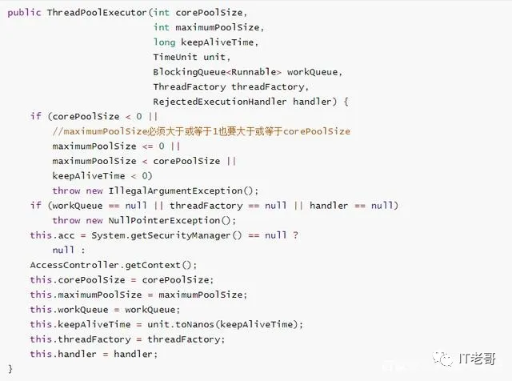

## 线程池常用参数

- `corePoolSize`：核心线程数。如果等于0，则任务执行完后，没有任务请求进入时销毁线程池中的线程。如果大于0，即使本地任务执行完毕，核心线程也不会被销毁。设置过大会浪费系统资源，设置过小导致线程频繁创建。

- `maximumPoolSize`：最大线程数。必须大于等于1，且大于等于corePoolSize。如果与corePoolSize相等，则线程池大小固定。如果大于corePoolSize，则最多创建maximumPoolSize个线程执行任务

- `keepAliveTime`：线程空闲时间。线程池中线程空闲时间达到keepAliveTime值时，线程会被销毁，只到剩下corePoolSize个线程为止。默认情况下，线程池的最大线程数大于corePoolSize时，keepAliveTime才会起作用。如果allowCoreThreadTimeOut被设置为true，即使线程池的最大线程数等于corePoolSize，keepAliveTime也会起作用（回收超时的核心线程）。

- `unit`：TimeUnit表示时间单位。

- `workQueue`：缓存队列。当请求线程数大于corePoolSize时，线程进入BlockingQueue阻塞队列。

- `threadFactory`：线程工厂。用来生产一组相同任务的线程。主要用于设置生成的线程名词前缀、是否为守护线程以及优先级等。设置有意义的名称前缀有利于在进行虚拟机分析时，知道线程是由哪个线程工厂创建的。

- `handler`：执行拒绝策略对象。当达到任务缓存上限时（即超过workQueue参数能存储的任务数），执行拒接策略，可以看作简单的限流保护。

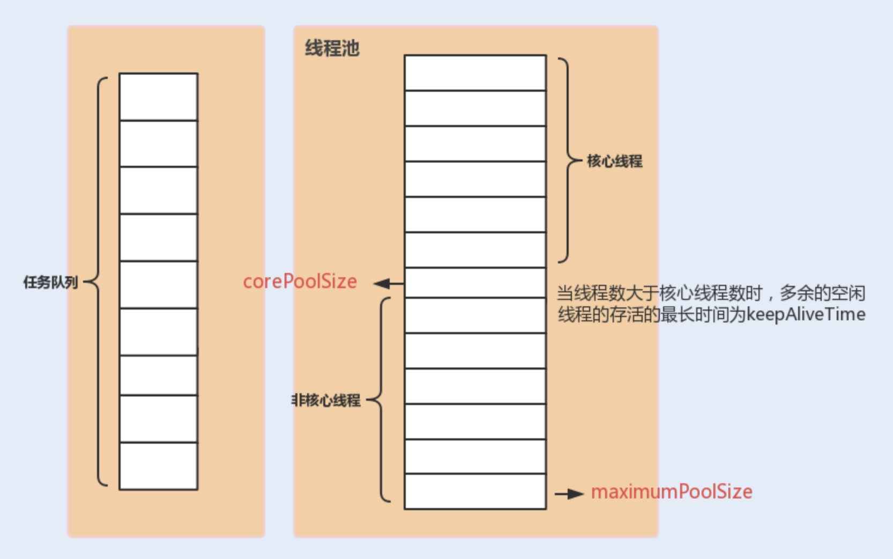

## 线程池相关类结构

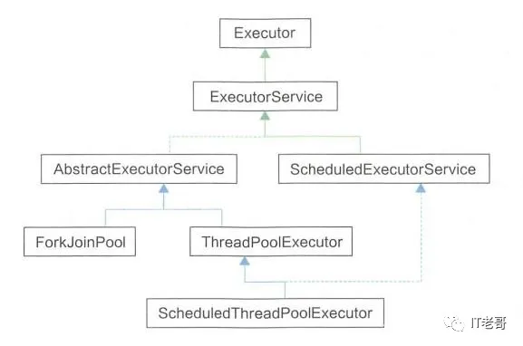

ExecutorService接口继承了Executor接口，定义了管理线程任务的方法。

ExecutorService的抽象类AbstractExecutorService提供了submit、invokeAll()等部分方法实现，但是核心方法Executor.execute()并没有实现。

因为所有任务都在这个方法里执行，不同的线程池实现策略会有不同，所以交由具体的线程池来实现。

## 线程池四种创建方式？


**Java通过Executors（jdk1.5并发包）提供四种线程池，分别为：**

**1、**  newCachedThreadPool创建一个可缓存线程池，如果线程池长度超过处理需要，可灵活回收空闲线程，若无可回收，则新建线程。

**2、**  newFixedThreadPool 创建一个定长线程池，可控制线程最大并发数，超出的线程会在队列中等待。

**3、**  newScheduledThreadPool 创建一个定长线程池，支持定时及周期性任务执行。

**4、**  newSingleThreadExecutor 创建一个单线程化的线程池，它只会用唯一的工作线程来执行任务，保证所有任务按照指定顺序(FIFO, LIFO, 优先级)执行。

## 常见的线程池

- newFixedThreadPool：创建固定线程数的线程池。核心线程数等于最大线程数，不存在空闲线程，keepAliveTime为0。

- newSingleThreadExecutor：创建单线程的线程池，核心线程数和最大线程数都为1，相当于串行执行。

- newCachedThreadPool：核心线程数为0，最大线程数为Integer.MAX_VALUE，是一个高度可伸缩的线程池。存在OOM风险。keepAliveTime为60，工作线程处于空闲状态超过keepAliveTime会回收线程。

- newWorkStealingPool：JDK8引入，创建持有足够线程的线程池支持给定的并行度，并通过使用多个队列减少竞争。


## 禁止直接使用Executors创建线程池原因：

Executors.newCachedThreadPool和Executors.newScheduledThreadPool两个方法最大线程数为Integer.MAX_VALUE，如果达到上限，没有任务服务器可以继续工作，肯定会抛出OOM异常。

Executors.newSingleThreadExecutor和Executors.newFixedThreadPool两个方法的workQueue参数为new LinkedBlockingQueue<Runnable>()，容量为Integer.MAX_VALUE，如果瞬间请求非常大，会有OOM风险。

**以上5个核心方法除Executors.newWorkStealingPool方法之外，其他方法都有OOM风险。**

## 为什么阿里不建议使用JDK提供的线程池？

1，JDK通过接口ExecutorService来表示线程池，通过工具类Executors来创建多种线程池对象


2，各种线程池的特点如下：

（1）newSingleThreadExecutor 创建一个单线程化的线程池，它只会用唯一的工作线程来执行任务，保证所有任务按照指定顺序(FIFO, LIFO, 优先级)执行。
（2）newFixedThreadPool 创建一个定长线程池，可控制线程最大并发数，超出的线程会在队列中等待。
（3）newCachedThreadPool将创建一个可缓存的线程池，当请求增加时，可以添加新的线程，线程池的规模不存在任何限制，线程数的理论值最大可以到Integer.MAX_VALUE
（4）newScheduledThreadPool 创建一个定长线程池，支持定时及周期性任务执行。

3，在实际开发中，我们是怎么使用的？（重点）

**实际开发中，线程资源必须通过线程池提供，不允许在应用中自行显式创建线程**

> 使用线程池的好处是减少在创建和销毁线程上所花的时间以及系统资源的开销，解决资源不足的问题。
> 如果不使用线程池，有可能造成系统创建大量同类线程而导致消耗完内存或者“过度切换”的问题

**实际开发中，线程池不允许使用 Executors 去创建，而是通过 ThreadPoolExecutor 的方式**

> FixedThreadPool 和 SingleThreadPool，允许的请求队列长度为 Integer.MAX_VALUE，可能会堆积大量的请求，从而导致 OOM。
> CachedThreadPool 和 ScheduledThreadPool，允许的创建线程数量为 Integer.MAX_VALUE，可能会创建大量的线程，从而导致 OOM

所以，综上所述，我们都会采用底层的方式来创建线程池，大家自己查阅各种线程池的源代码就可以看到他们都是采用了同一个类来创建。

## 如果线程池满了怎么办

**会执行线程拒绝策略**

**ThreadPoolExecutor提供了四个公开的内部静态类：**

- AbortPolicy：默认，丢弃任务并抛出RejectedExecutionException异常。

- DiscardPolicy：丢弃任务，但是不抛出异常（不推荐）。
- DiscardOldestPolicy：抛弃队列中等待最久的任务，然后把当前任务加入队列中。
- CallerRunsPolicy：调用任务的run()方法绕过线程池直接执行。

**友好的拒绝策略：**

- 保存到数据库进行削峰填谷。在空闲时再提出来执行。
- 转向某个提示页面
- 打印日志

## 为什么要用线程池？ 

池化技术相比大家已经屡见不鲜了，线程池、数据库连接池、Http 连接池等等都是对这个思想的应用。池化技术的思想主要是为了减少每次获取资源的消耗，提高对资源的利用率。

线程池提供了一种限制和管理资源（包括执行一个任务）。 每个线程池还维护一些基本统计信息，例如已完成任务的数量。

这里借用《Java 并发编程的艺术》提到的来说一下使用线程池的好处：

- **降低资源消耗。**通过重复利用已创建的线程降低线程创建和销毁造成的消耗。
- **提高响应速度**。当任务到达时，任务可以不需要的等到线程创建就能立即执行。
- **提高线程的可管理性。**线程是稀缺资源，如果无限制的创建，不仅会消耗系统资源，还会降低系统的稳定性，使用线程池可以进行统一的分配，调优和监控。

## 线程池中的执行流程:

(1)当线程数小于核心线程数的时候,使用核心线程数。
(2)如果核心线程数小于线程数,就将多余的线程放入任务队列(阻塞队列)中
(3)当任务队列(阻塞队列)满的时候,就启动最大线程数.
(4)当最大线程数也达到后,就将启动拒绝策略。

## 线程池的拒绝策略有哪些?

回答:有四种拒绝策略
1.ThreadPoolExecutor.AbortPolicy
线程池的默认拒绝策略为AbortPolicy,即丢弃任务并抛出RejectedExecutionException异常(即后面提交的请求不会放入队列也不会直接消费并抛出异常);
2.ThreadPoolExecutor.DiscardPolicy
丢弃任务,但是不抛出异常。如果线程队列已满,则后续提交的任务都会被丢弃,且是静默丢弃(也不会抛出任何异常,任务直接就丢弃了)。
3.ThreadPoolExecutor.DiscardOldestPolicy
丢弃队列最前面的任务,然后重新提交被拒绝的任务(丢弃掉了队列最前的任务,并不抛出异常,直接丢弃了)。
4.ThreadPoolExecutor.CallerRunsPolicy
由调用线程处理该任务(不会丢弃任务,最后所有的任务都执行了,并不会抛出异常)

## 线程池的参数如何确定呢?

**一般需要确定核心线程数、最大线程数、任务队列和拒绝策略**,这些需要根据实际的业务场景去设置,可以大致分为CPU密集型和IO密集型。

CPU密集型时,任务可以少配置线程数,大概和机器的cpu核数相当,这样可以使得每个线程都在执行任务。IO密集型时,大部分线程都阻塞,故需要多配置线程数,2*cpu核数。详细可以看一下《阿里调优手册》

## 线程池执行任务的流程？


1. 线程池执行execute/submit方法向线程池添加任务，当任务小于核心线程数corePoolSize，线程池中可以创建新的线程。
2. 当任务大于核心线程数corePoolSize，就向阻塞队列添加任务。
3. 如果阻塞队列已满，需要通过比较参数maximumPoolSize，在线程池创建新的线程，当线程数量大于maximumPoolSize，说明当前设置线程池中线程已经处理不了了，就会执行饱和策略。

## 常用的JAVA线程池有哪几种类型？

**1、newCachedThreadPool**

创建一个可缓存线程池，如果线程池长度超过处理需要，可灵活回收空闲线程，若无可回收，则新建线程。

这种类型的线程池特点是：

工作线程的创建数量几乎没有限制(其实也有限制的,数目为Interger. MAX_VALUE), 这样可灵活的往线程池中添加线程。

如果长时间没有往线程池中提交任务，即如果工作线程空闲了指定的时间(默认为1分钟)，则该工作线程将自动终止。终止后，如果你又提交了新的任务，则线程池重新创建一个工作线程。

在使用CachedThreadPool时，一定要注意控制任务的数量，否则，由于大量线程同时运行，很有会造成系统OOM。

**2、newFixedThreadPool**

创建一个指定工作线程数量的线程池。每当提交一个任务就创建一个工作线程，如果工作线程数量达到线程池初始的最大数，则将提交的任务存入到池队列中。

FixedThreadPool是一个典型且优秀的线程池，它具有线程池提高程序效率和节省创建线程时所耗的开销的优点。但是，在线程池空闲时，即线程池中没有可运行任务时，它不会释放工作线程，还会占用一定的系统资源。

**3、newSingleThreadExecutor**

创建一个单线程化的Executor，即只创建唯一的工作者线程来执行任务，它只会用唯一的工作线程来执行任务，保证所有任务按照指定顺序(FIFO, LIFO, 优先级)执行。如果这个线程异常结束，会有另一个取代它，保证顺序执行。单工作线程最大的特点是可保证顺序地执行各个任务，并且在任意给定的时间不会有多个线程是活动的。

**4、newScheduleThreadPool**

创建一个定长的线程池，而且支持定时的以及周期性的任务执行，支持定时及周期性任务执行。

## 线程池常用的阻塞队列有哪些?

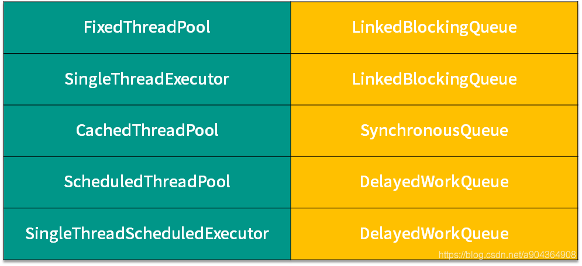

<center> 表格左侧是线程池，右侧为它们对应的阻塞队列，可以看到 5 种线程池对应了 3 种阻塞队列</center>

1. LinkedBlockingQueue
   对于 FixedThreadPool 和 SingleThreadExector 而言，它们使用的阻塞队列是容量为 Integer.MAX_VALUE 的 LinkedBlockingQueue，可以认为是无界队列。由于 FixedThreadPool 线程池的线程数是固定的，所以没有办法增加特别多的线程来处理任务，这时就需要 LinkedBlockingQueue 这样一个没有容量限制的阻塞队列来存放任务。

   这里需要注意，由于线程池的任务队列永远不会放满，所以线程池只会创建核心线程数量的线程，所以此时的最大线程数对线程池来说没有意义，因为并不会触发生成多于核心线程数的线程。

2. SynchronousQueue
   第二种阻塞队列是 SynchronousQueue，对应的线程池是 CachedThreadPool。线程池 CachedThreadPool 的最大线程数是 Integer 的最大值，可以理解为线程数是可以无限扩展的。CachedThreadPool 和上一种线程池 FixedThreadPool 的情况恰恰相反，FixedThreadPool 的情况是阻塞队列的容量是无限的，而这里 CachedThreadPool 是线程数可以无限扩展，所以 CachedThreadPool 线程池并不需要一个任务队列来存储任务，因为一旦有任务被提交就直接转发给线程或者创建新线程来执行，而不需要另外保存它们。
   我们自己创建使用 SynchronousQueue 的线程池时，如果不希望任务被拒绝，那么就需要注意设置最大线程数要尽可能大一些，以免发生任务数大于最大线程数时，没办法把任务放到队列中也没有足够线程来执行任务的情况。

3. DelayedWorkQueue
   第三种阻塞队列是DelayedWorkQueue，它对应的线程池分别是 ScheduledThreadPool 和 SingleThreadScheduledExecutor，这两种线程池的最大特点就是可以延迟执行任务，比如说一定时间后执行任务或是每隔一定的时间执行一次任务。

DelayedWorkQueue 的特点是内部元素并不是按照放入的时间排序，而是会按照延迟的时间长短对任务进行排序，内部采用的是“堆”的数据结构。之所以线程池 ScheduledThreadPool 和 SingleThreadScheduledExecutor 选择 DelayedWorkQueue，是因为它们本身正是基于时间执行任务的，而延迟队列正好可以把任务按时间进行排序，方便任务的执行。


## 源码中线程池是怎么复用线程的？

源码中ThreadPoolExecutor中有个内置对象Worker，每个worker都是一个线程，worker线程数量和参数有关，每个worker会while死循环从阻塞队列中取数据，**通过置换worker中Runnable对象，运行其run方法起到线程置换的效果**，这样做的好处是避免多线程频繁线程切换，提高程序运行性能。

## 如何合理配置线程池参数？


自定义线程池就需要我们自己配置最大线程数 maximumPoolSize ，为了高效的并发运行，这时需要看我们的业务是IO密集型还是CPU密集型。

**CPU密集型**
CPU密集的意思是该任务需要最大的运算，而没有阻塞，CPU一直全速运行。CPU密集任务只有在真正的多核CPU上才能得到加速(通过多线程)。而在单核CPU上，无论你开几个模拟的多线程该任务都不可能得到加速，因为CPU总的运算能力就那么多。

**IO密集型**
IO密集型，即该任务需要大量的IO，即大量的阻塞。在单线程上运行IO密集型的任务会导致大量的CPU运算能力浪费在等待。所以在IO密集型任务中使用多线程可以大大的加速程序运行，即使在单核CPU上这种加速主要就是利用了被浪费掉的阻塞时间。

IO 密集型时，大部分线程都阻塞，故需要多配制线程数。公式为：

```java
CPU核数*2
CPU核数/(1-阻塞系数) 阻塞系数在0.8~0.9之间
查看CPU核数：
System.out.println(Runtime.getRuntime().availableProcessors());
```

当以上都不适用时，选用动态化线程池，看美团技术团队的实践：https://tech.meituan.com/2020/04/02/java-pooling-pratice-in-meituan.html

## 线程池的实现原理：

在线程池，同一个线程可以从阻塞队列中不断获取新任务来执行。其核心原理就是：**由于每一个 Thread的类都有一个 start方法，当调用 start启动线程时，JVM会调用该类的 run方法。 那么该类的 run()方法中就是调用了Runnable对象的 run()方法来执行任务。 我们可以继承重写 Thread类，在其 start方法中添加不断循环调用传递过来的 Runnable对象。循环方法中不断获取 Runnable是用 Queue（阻塞队列）实现的，在获取下一个Runnable之前可以是阻塞的**。

## Java线程池的工作流程：

**线程池将线程和任务进行解耦，线程是线程，任务是任务，摆脱了之前通过 Thread 创建线程时的一个线程必须对应一个任务的限制。**

1.线程池刚创建时，里面没有一个线程。任务队列是作为参数传进来的。不过，就算队列里面有任务，线程池也不会马上执行它们。

2.当调用 execute()方法添加一个任务时，线程池会做如下判断：

a）如果正在运行的线程数量小于 corePoolSize（核心线程数），那么马上创建线程运行这个任务；

b）如果正在运行的线程数量大于或等于 corePoolSize（核心线程数），那么将这个任务放入队列；

c）如果这时候队列满了，而且正在运行的线程数量小于maximumPoolSize（最大线程数），那么还是要创建非核心线程立刻运行这个任务；

d）如果队列满了，而且正在运行的线程数量大于或等于maximumPoolSize（最大线程数），那么线程池会抛出异常 RejectExecutionException。

3.当一个线程完成任务时，它会从队列中取下一个任务来执行。

4.当一个线程无事可做，超过一定的时间（keepAliveTime）时，线程池会判断，如果当前运行的线程数大于 corePoolSize，那么这个线程就被停掉。所以线程池的所有任务完成后，它最终会收缩到 corePoolSize的大小。

## 线程池中的线程的执行顺序：

1. 当线程数小于核心线程数时，会一直创建线程直到线程数等于核心线程数；
2. 当线程数大于或等于核心线程数时，新加入的任务会被放到任务队列等待执行；
3. 当任务队列已满，又有新的任务时且小于最大线程数时，会创建线程直到线程数量等于最大线程数；（到非核心线程去）
4. 当线程数大于或等于最大线程数，且任务队列已满时，新加入任务会被拒绝。采用拒绝策略（常用的拒绝策略：AbortPolicy）。

## 线程池的提交顺序：

核心线程、任务队列、非核心线程；

## 线程池的执行顺序：

核心线程、非核心线程、任务队列；

## Executor和Executors的区别？

**Executors 工具类**的不同方法按照我们的需求创建了不同的线程池，来满足业务的需求。

**Executor 接口对象**能执行我们的线程任务。ExecutorService接口继承了Executor接口并进行了扩展，提供了更多的方法我们能获得任务执行的状态并且可以获取任务的返回值。

使用ThreadPoolExecutor 可以创建自定义线程池。Future 表示异步计算的结果，他提供了检查计算是否完成的方法，以等待计算的完成，并可以使用get()方法获取计算的结果。


**1、** Executors 工具类的不同方法按照我们的需求创建了不同的线程池，来满足业务的需求。

**2、** Executor 接口对象能执行我们的线程任务。

**3、** ExecutorService 接口继承了 Executor 接口并进行了扩展，提供了更多的方法我们能获得任务执行的状态并且可以获取任务的返回值。

**4、** 使用 ThreadPoolExecutor 可以创建自定义线程池。

## 介绍一下 Atomic 原子类

**Atomic 是指一个操作是不可中断的。即使是在多个线程一起执行的时候，一个操作一旦开始，就不会被其他线程干扰。**

所以，所谓原子类说简单点就是具有原子 / 原子操作特征的类。

并发包 java.util.concurrent 的原子类都存放在 java.util.concurrent.atomic 下：

## JUC 包中的原子类是哪4类？

**基本类型**
使用原子的方式更新基本类型：

* AtomicInteger ： 整型原子类
* AtomicLong： 长整型原子类
* AtomicBoolean： 布尔型原子类

**数组类型**
使用原子的方式更新数组里的某个元素：

* AtomicIntegerArray： 整型数组原子类
* AtomicLongArray： 长整型数组原子类
* AtomicReferenceArray： 引用类型数组原子类

**引用类型**
使用原子的方式更新引用类型：

* AtomicReference： 引用类型原子类
* AtomicStampedReference： 原子更新带有版本号的引用类型。该类将整型数值与引用关联起来，可用于解决原子的更新数据和数据的版本号，可以解决使用 CAS 进行原子更新时可能出现的 ABA 问题。
* AtomicMarkableReference： 原子更新带有标记位的引用类型。**对象属性修改类型**
* AtomicIntegerFieldUpdater： 原子更新整型字段的更新器
* AtomicLongFieldUpdater： 原子更新长整型字段的更新器
* AtomicMarkableReference： 原子更新带有标记位的引用类型

## 简单介绍一下 AtomicInteger 类的原理 

 AtomicInteger 类主要利用 CAS和 volatile 和 native 方法来保证原子操作，从而避免 synchronized 的高开销，执行效率大为提升。

`AtomicInteger` 类的部分源码：

```JAVA
  // 更新操作时提供“比较并替换”的作用
  private static final Unsafe unsafe = Unsafe.getUnsafe();

  private static final long valueOffset;

  static {
      try{
          valueOffset = unsafe.objectFieldOffset(AutomicInteger.class.getDeclaredField("value"));
      }catch(Exception ex){
          throw new Error(ex);
      }
  }

  private volatile int value;

```

## 简述as-if-serial

编译器会对原始的程序进行指令重排序和优化。但不管怎么重排序,其结果都必须和用户原始程序输出的预定结果保持一致。

## 简述happens-before八大规则

- 程序次序规则:一个线程内,按照代码顺序,书写在前面的操作先行发生于书写在后面的操作;
- 锁定规则:一个unLock操作先行发生于后面对同一个锁的lock操作;
- volatile变量规则:对一个变量的写操作先行发生于后面对这个变量的读操作;
- 传递规则:如果操作A先行发生于操作B,而操作B又先行发生于操作C,则可以得出操作A先行发生于操作C;
- 线程启动规则:Thread对象的start()方法先行发生于此线程的每个一个动作;
- 线程中断规则:对线程interrupt()方法的调用先行发生于被中断线程的代码检测到中断事件的发生;
- 线程终结规则:线程中所有的操作都先行发生于线程的终止检测,我们可以通过Thread.join()方法结束、Thread.isAlive()的返回值手段检测到线程已经终止执行;
- 对象终结规则:一个对象的初始化完成先行发生于他的finalize()方法的开始;

## as-if-serial规则和happens-before规则的区别

**1、** **as-if-serial语义保证单线程内程序的执行结果不被改变**，**happens-before关系保证正确同步的多线程程序的执行结果不被改变**。

**2、** as-if-serial语义给编写单线程程序的程序员创造了一个环境：**单线程程序是按程序的顺序来执行的**。happens-before关系给编写正确同步的多线程程序的程序员创造了一个环境：**正确同步的多线程程序是按happens-before指定的顺序来执行的。**

**3、** as-if-serial语义和happens-before这么做的目的，都是为了**在不改变程序执行结果的前提下，尽可能地提高程序执行的并行度。**

## 并发编程三要素？


**1、** 原子性

原子性指的是一个或者多个操作，要么全部执行并且在执行的过程中不被其他操作打断，要么就全部都不执行。

**2、** 可见性

可见性指多个线程操作一个共享变量时，其中一个线程对变量进行修改后，其他线程可以立即看到修改的结果。

**3、** 有序性

有序性，即程序的执行顺序按照代码的先后顺序来执行。


**原子性：**

原子，即一个不可再被分割的颗粒。原子性指的是一个或多个操作要么全部执行成功要么全部执行失败。

**可见性：**

一个线程对共享变量的修改,另一个线程能够立刻看到。（synchronized,volatile）

**有序性：**

程序执行的顺序按照代码的先后顺序执行。（处理器可能会对指令进行重排序）

## 简述原子性操作

一个操作或者多个操作,要么全部执行并且执行的过程不会被任何因素打断,要么就都不执行,这就是原子性操作。

## 简述线程的可见性

可⻅性指当一个线程修改了共享变量时,其他线程能够立即得知修改。volatile、synchronized、final 关键字都能保证可⻅性。

## 简述有序性

虽然多线程存在并发和指令优化等操作,但在本线程内观察该线程的所有执行操作是有序的。

## 简述Executor框架

Executor框架目的是将任务提交和任务如何运行分离开来的机制。用户不再需要从代码层考虑设计任务的提交运行,只需要调用Executor框架实现类的Execute方法就可以提交任务。

## 简述Executor的继承关系

- Executor:一个接口,其定义了一个接收Runnable对象的方法executor,该方法接收一个Runable实例执行这个任务。
- ExecutorService:Executor的子类接口,其定义了一个接收Callable对象的方法,返回 Future 对象,同时提供execute方法。
- ScheduledExecutorService:ExecutorService的子类接口,支持定期执行任务。
- AbstractExecutorService:抽象类,提供 ExecutorService 执行方法的默认实现。
- Executors:实现ExecutorService接口的静态工厂类,提供了一系列工厂方法用于创建线程池。
- ThreadPoolExecutor:继承AbstractExecutorService,用于创建线程池。
- ForkJoinPool: 继承AbstractExecutorService,Fork 将大任务分叉为多个小任务,然后让小任务执行,
- Join 是获得小任务的结果,类似于map reduce。
- ThreadPoolExecutor:继承ThreadPoolExecutor,实现ScheduledExecutorService,用于创建带定时任务的线程池。

## 简述线程池的状态

- Running:能接受新提交的任务,也可以处理阻塞队列的任务。
- Shutdown:不再接受新提交的任务,但可以处理存量任务,线程池处于running时调用shutdown方法,会进入该状态。
- Stop:不接受新任务,不处理存量任务,调用shutdownnow进入该状态。
- Tidying:所有任务已经终止了,worker_count(有效线程数)为0。
- Terminated:线程池彻底终止。在tidying模式下调用terminated方法会进入该状态。

## 简述阻塞队列

**阻塞队列是生产者消费者的实现具体组件之一。当阻塞队列为空时,从队列中获取元素的操作将会被阻塞,当阻塞队列满了,往队列添加元素的操作将会被阻塞。**具体实现有:

- ArrayBlockingQueue:底层是由数组组成的有界阻塞队列。
- LinkedBlockingQueue:底层是由链表组成的有界阻塞队列。
- PriorityBlockingQueue:阻塞优先队列。
- DelayQueue:创建元素时可以指定多久才能从队列中获取当前元素
- SynchronousQueue:不存储元素的阻塞队列,每一个存储必须等待一个取出操作
- LinkedTransferQueue:与LinkedBlockingQueue相比多一个transfer方法,即如果当前有消费者正等待接收元素,可以把生产者传入的元素立刻传输给消费者。
- LinkedBlockingDeque:双向阻塞队列。 

## 阻塞队列和非阻塞队列区别


**1、** 当队列阻塞队列为空的时，从队列中获取元素的操作将会被阻塞。

**2、** 或者当阻塞队列是满时，往队列里添加元素的操作会被阻塞。

**3、** 或者试图从空的阻塞队列中获取元素的线程将会被阻塞，直到其他的线程往空的队列插入新的元素。

**4、** 试图往已满的阻塞队列中添加新元素的线程同样也会被阻塞，直到其他的线程使队列重新变得空闲起来

## 聊聊你对Java并发包下unsafe类的理解

对于 Java 语言,没有直接的指针组件,一般也不能使用偏移量对某块内存进行操作。这些操作相对来讲是安全(safe)的。
Java 有个类叫 Unsafe 类,这个类使 Java 拥有了像 C 语言的指针一样操作内存空间的能力,同时也带来了指针的问题。这个类可以说是 Java 并发开发的基础。

## 多线程访问共享对象和数据的方式

在多线程访问共享对象和数据时候大致可以分为两大类。

- 如果每个线程执行的代码相同,可以使用同一个 runnable 对象,这个 runnable 对象中有那个共享对象。如:买票系统。
- 如果每个线程执行的代码不相同,就要用不同的 runnable 对象了。这种方式又有两种来实现这些 runnable 对象之间的数据共享。
  1. 将共享数据封装在另一个对象中,然后将这个对象逐一传递给各个 runnable 对象中。每个线程共享数据的操作方法也分配到了这个对象身上去完成,这样容易实现针对该数据进行共享数据的互斥和通信。
  2. 将这些 runnable 对象作为某个类的内部类,共享数据作为这个外部类的成员变量,每个线程对共享数据的操作也分配到外部类,以便实现对共享数据进行的各个操作进行互斥和通信,作为内部类的各个 runnable 对象调用外部类的这些方法。
  3. 上面两种方式的结合:将共享数据封装到另一个对象中,各个线程对共享数据操作的方法也分配到那个对象上去完成,对象作为外部类的成员变量或方法的局部变量,每个 runnable 对象作为外部类中的成员内部类或局部内部类。

[多线程访问共享对象和数据的方式 - ngulc - 博客园 (cnblogs.com)](https://www.cnblogs.com/lcngu/p/5150024.html)

## Semaphore有什么作用


Semaphore就是一个信号量，它的作用是限制某段代码块的并发数。Semaphore有一个构造函数，可以传入一个int型整数n，表示某段代码最多只有n个线程可以访问，如果超出了n，那么请等待，等到某个线程执行完毕这段代码块，下一个线程再进入。由此可以看出如果Semaphore构造函数中传入的int型整数n=1，相当于变成了一个synchronized了。


## 你经常使用什么并发容器，为什么？


Vector、ConcurrentHashMap、HasTable

一般软件开发中容器用的最多的就是HashMap、ArrayList，LinkedList ，等等

但是在多线程开发中就不能乱用容器，如果使用了未加锁（非同步）的的集合，你的数据就会非常的混乱。由此在多线程开发中需要使用的容器必须是加锁（同步）的容器。

## 并行和并发有什么区别？


**1、** 并发：多个任务在同一个 CPU 核上，按细分的时间片轮流(交替)执行，从逻辑上来看那些任务是同时执行。

**2、** 并行：单位时间内，多个处理器或多核处理器同时处理多个任务，是真正意义上的“同时进行”。

**3、** 串行：有n个任务，由一个线程按顺序执行。由于任务、方法都在一个线程执行所以不存在线程不安全情况，也就不存在临界区的问题。

**做一个形象的比喻：**

**1、** 并发 = 俩个人用一台电脑。

**2、** 并行 = 俩个人分配了俩台电脑。

**3、** 串行 = 俩个人排队使用一台电脑。


## 什么是并发容器的实现？


**1、** 何为同步容器：可以简单地理解为通过synchronized来实现同步的容器，如果有多个线程调用同步容器的方法，它们将会串行执行。比如Vector，Hashtable，以及Collections.synchronizedSet，synchronizedList等方法返回的容器。

**2、** 可以通过查看Vector，Hashtable等这些同步容器的实现代码，可以看到这些容器实现线程安全的方式就是将它们的状态封装起来，并在需要同步的方法上加上关键字synchronized。

并发容器使用了与同步容器完全不同的加锁策略来提供更高的并发性和伸缩性，例如在ConcurrentHashMap中采用了一种粒度更细的加锁机制，可以称为分段锁，在这种锁机制下，允许任意数量的读线程并发地访问map，并且执行读操作的线程和写操作的线程也可以并发的访问map，同时允许一定数量的写操作线程并发地修改map，所以它可以在并发环境下实现更高的吞吐量。

## 什么是不可变对象，它对写并发应用有什么帮助？


**1、** 不可变对象(Immutable Objects)即对象一旦被创建它的状态（对象的数据，也即对象属性值）就不能改变，反之即为可变对象(Mutable Objects)。

**2、** 不可变对象的类即为不可变类(Immutable Class)。Java平台类库中包含许多不可变类，如String、基本类型的包装类、BigInteger和BigDecimal等。

**3、** 不可变对象天生是线程安全的。它们的常量（域）是在构造函数中创建的。既然它们的状态无法修改，这些常量永远不会变。

**1、** 不可变对象永远是线程安全的。

**2、** 只有满足如下状态，一个对象才是不可变的；

**3、** 它的状态不能在创建后再被修改；

**4、** 所有域都是final类型；并且，

**5、** 它被正确创建（创建期间没有发生this引用的逸出）。


## 怎么获取 Java 程序使用的内存？堆使用的百分比？


可以通过 java.lang.Runtime 类中与内存相关方法来获取剩余的内存，总内存及最大堆内存。通过这些方法你也可以获取到堆使用的百分比及堆内存的剩余空间。Runtime.freeMemory() 方法返回剩余空间的字节数，Runtime.totalMemory()方法总内存的字节数，Runtime.maxMemory() 返回最大内存的字节数。

## 你如何确保main()方法所在的线程是Java 程序最后结束的线程？


我们可以使用Thread类的join()方法来确保所有程序创建的线程在main()方法退出前结束。

## CopyOnWriteArrayList 的设计思想?


**1、** 读写分离，读和写分开

**2、** 最终一致性

**3、** 使用另外开辟空间的思路，来解决并发冲突


## CopyOnWriteArrayList可以用于什么应用场景？ 


CopyOnWriteArrayList(免锁容器)的好处之一是当多个迭代器同时遍历和修改这个列表时，不会抛出ConcurrentModificationException。在CopyOnWriteArrayList中，写入将导致创建整个底层数组的副本，而源数组将保留在原地，使得复制的数组在被修改时，读取操作可以安全地执行。

**1、** 由于写操作的时候，需要拷贝数组，会消耗内存，如果原数组的内容比较多的情况下，可能导致young gc或者full gc；

**2、** 不能用于实时读的场景，像拷贝数组、新增元素都需要时间，所以调用一个set操作后，读取到数据可能还是旧的,虽然CopyOnWriteArrayList 能做到最终一致性,但是还是没法满足实时性要求；

**CopyOnWriteArrayList透露的思想**

**1、** 读写分离，读和写分开

**2、** 最终一致性

**3、** 使用另外开辟空间的思路，来解决并发冲突


## 什么是IO密集


IO密集型，即该任务需要大量的IO，即大量的阻塞。在单线程上运行IO密集型的任务会导致浪费大量的CPU运算能力浪费在等待。所以在IO密集型任务中使用多线程可以大大的加速程序运行，即时在单核CPU上，这种加速主要就是利用了被浪费掉的阻塞时间。


## 常用的并发工具类有哪些？


**CountDownLatch**

CountDownLatch 类位于java.util.concurrent包下，利用它可以实现类似计数器的功能。比如有一个任务A，它要等待其他3个任务执行完毕之后才能执行，此时就可以利用CountDownLatch来实现这种功能了。

**CyclicBarrier (回环栅栏) CyclicBarrier它的作用就是会让所有线程都等待完成后才会继续下一步行动。**

CyclicBarrier初始化时规定一个数目，然后计算调用了CyclicBarrier.await()进入等待的线程数。当线程数达到了这个数目时，所有进入等待状态的线程被唤醒并继续。

CyclicBarrier初始时还可带一个Runnable的参数， 此Runnable任务在CyclicBarrier的数目达到后，所有其它线程被唤醒前被执行。

Semaphore (信号量) Semaphore 是 synchronized 的加强版，作用是控制线程的并发数量（允许自定义多少线程同时访问）。就这一点而言，单纯的synchronized 关键字是实现不了的。

Semaphore是一种基于计数的信号量。它可以设定一个阈值，基于此，多个线程竞争获取许可信号，做自己的申请后归还，超过阈值后，线程申请许可信号将会被阻塞。Semaphore可以用来构建一些对象池，资源池之类的，比如数据库连接池，我们也可以创建计数为1的Semaphore，将其作为一种类似互斥锁的机制，这也叫二元信号量，表示两种互斥状态。它的用法如下：


## 并发队列的常用方法


不管是那种列队，是那个类，当是他们使用的方法都是差不多的

| 方法名                            | 描述                                                         |
| --------------------------------- | ------------------------------------------------------------ |
| add()                             | 在不超出队列长度的情况下插入元素，可以立即执行，成功返回true，如果队列满了就抛出异常。 |
| offer()                           | 在不超出队列长度的情况下插入元素的时候则可以立即在队列的尾部插入指定元素,成功时返回true，如果此队列已满，则返回false。 |
| put()                             | 插入元素的时候，如果队列满了就进行等待，直到队列可用。       |
| take()                            | 从队列中获取值，如果队列中没有值，线程会一直阻塞，直到队列中有值，并且该方法取得了该值。 |
| poll(long timeout, TimeUnit unit) | 在给定的时间里，从队列中获取值，如果没有取到会抛出异常。     |
| remainingCapacity()               | 获取队列中剩余的空间。                                       |
| remove(Object o)                  | 从队列中移除指定的值。                                       |
| contains(Object o)                | 判断队列中是否拥有该值。                                     |
| drainTo(Collection c)             | 将队列中值，全部移除，并发设置到给定的集合中。               |


## 说一下 Atomic的原理？


Atomic包中的类基本的特性就是在多线程环境下，当有多个线程同时对单个（包括基本类型及引用类型）变量进行操作时，具有排他性，即当多个线程同时对该变量的值进行更新时，仅有一个线程能成功，而未成功的线程可以向自旋锁一样，继续尝试，一直等到执行成功。

## Java 中能创建 volatile 数组吗？


能，Java 中可以创建 volatile 类型数组，不过只是一个指向数组的引用，而不是整个数组。意思是，如果改变引用指向的数组，将会受到 volatile 的保护，但是如果多个线程同时改变数组的元素，volatile 标示符就不能起到之前的保护作用了。

## 同步方法和同步块，哪个是更好的选择？

**同步块是更好的选择**，因为它不会锁住整个对象（当然你也可以让它锁住整个对象）。同步方法会锁住整个对象，哪怕这个类中有多个不相关联的同步块，这通常会导致他们停止执行并需要等待获得这个对象上的锁。

**同步块更要符合开放调用的原则**，只在需要锁住的代码块锁住相应的对象，这样从侧面来说也可以避免死锁。


## Java 如何实现多线程之间的通讯和协作？

**可以通过中断 和 共享变量的方式实现线程间的通讯和协作**

比如说最经典的生产者-消费者模型：当队列满时，生产者需要等待队列有空间才能继续往里面放入商品，而在等待的期间内，生产者必须释放对临界资源（即队列）的占用权。因为生产者如果不释放对临界资源的占用权，那么消费者就无法消费队列中的商品，就不会让队列有空间，那么生产者就会一直无限等待下去。因此，一般情况下，当队列满时，会让生产者交出对临界资源的占用权，并进入挂起状态。然后等待消费者消费了商品，然后消费者通知生产者队列有空间了。同样地，当队列空时，消费者也必须等待，等待生产者通知它队列中有商品了。这种互相通信的过程就是线程间的协作。

**Java中线程通信协作的最常见方式：**

**1、** syncrhoized加锁的线程的Object类的wait()/notify()/notifyAll()

**2、** ReentrantLock类加锁的线程的Condition类的await()/signal()/signalAll()

**线程间直接的数据交换：**

通过管道进行线程间通信：字节流、字符流


## 怎么判断并发队列是阻塞队列还是非阻塞队列


在并发队列上JDK提供了Queue接口，一个是以**Queue接口下的BlockingQueue接口为代表的阻塞队列，另一个是高性能（无堵塞）队列。**


## volatile 能使得一个非原子操作变成原子操作吗？

**1、** **关键字volatile的主要作用是使变量在多个线程间可见，但无法保证原子性**，对于多个线程访问同一个实例变量需要加锁进行同步。

**2、** 虽然volatile只能保证可见性不能保证原子性，**但用volatile修饰long和double可以保证其操作原子性**。

**所以从Oracle Java Spec里面可以看到：**

**1、** 对于64位的long和double，如果没有被volatile修饰，那么对其操作可以不是原子的。在操作的时候，可以分成两步，每次对32位操作。

**2、** 如果使**用volatile修饰long和double，那么其读写都是原子操作**

**3、** **对于64位的引用地址的读写，都是原子操作**

**4、** 在实现JVM时，可以自由选择是否把读写long和double作为原子操作

**5、** 推荐JVM实现为原子操作

## newCachedThreadPool

**特点**：newCachedThreadPool创建一个可缓存线程池，如果当前线程池的长度超过了处理的需要时，它可以灵活的回收空闲的线程，当需要增加时， 它可以灵活的添加新的线程，而不会对池的长度作任何限制。

**缺点**：他虽然可以无线的新建线程，但是容易造成堆外内存溢出，因为它的最大值是在初始化的时候设置为 Integer.MAX_VALUE，一般来说机器都没那么大内存给它不断使用。当然知道可能出问题的点，就可以去重写一个方法限制一下这个最大值。

**总结**：线程池为无限大，当执行第二个任务时第一个任务已经完成，会复用执行第一个任务的线程，而不用每次新建线程。

## Java Concurrency API中的Lock接口(Lock interface)是什么？对比同步它有什么优势？


Lock接口比同步方法和同步块提供了更具扩展性的锁操作。他们允许更灵活的结构，可以具有完全不同的性质，并且可以支持多个相关类的条件对象。

它的优势有：

**1、** 可以使锁更公平

**2、** 可以使线程在等待锁的时候响应中断

**3、** 可以让线程尝试获取锁，并在无法获取锁的时候立即返回或者等待一段时间

**4、** 可以在不同的范围，以不同的顺序获取和释放锁

## Java中Semaphore是什么？


Java中的Semaphore是一种新的同步类，它是一个计数信号。从概念上讲，从概念上讲，信号量维护了一个许可集合。如有必要，在许可可用前会阻塞每一个 acquire()，然后再获取该许可。每个 release()添加一个许可，从而可能释放一个正在阻塞的获取者。但是，不使用实际的许可对象，Semaphore只对可用许可的号码进行计数，并采取相应的行动。信号量常常用于多线程的代码中，比如数据库连接池。


## 什么是线程组，为什么在Java中不推荐使用？

**线程组和线程池是两个不同的概念，他们的作用完全不同，前者是为了方便线程的管理，后者是为了管理线程的生命周期，复用线程，减少创建销毁线程的开销。**


## 什么是线程调度器(Thread Scheduler)和时间分片(Time Slicing )？


**1、** 线程调度器是一个操作系统服务，它负责为 Runnable 状态的线程分配 CPU 时间。一旦我们创建一个线程并启动它，它的执行便依赖于线程调度器的实现。

**2、** 时间分片是指将可用的 CPU 时间分配给可用的 Runnable 线程的过程。分配 CPU 时间可以基于线程优先级或者线程等待的时间。

**3、** 线程调度并不受到 Java 虚拟机控制，所以由应用程序来控制它是更好的选择（也就是说不要让你的程序依赖于线程的优先级）。

## 如何找到死锁的线程？


**死锁的线程可以使用 jstack 指令 dump 出 JVM 的线程信息。**

jstack -l <pidthreads.txt

**有时候需要dump出现异常，可以加上 -F 指令，强制导出**

jstack -F -l <pidthreads.txt

如果存在死锁，一般在文件最后会提示找到 deadlock 的数量与线程信息
