# Spring Boot面试题

## 什么是 Spring Boot？

SpringBoot 是 Spring 开源组织下的子项目，是 Spring 组件一站式解决方案，主要是简化了使用 Spring 的难度，简省了繁重的配置，提供了各种启动器，开发者能快速上手。

**1、** 用来简化spring应用的初始搭建以及开发过程 使用特定的方式来进行配置（properties或yml文件）

**2、** 创建独立的spring引用程序 main方法运行

**3、** 嵌入的Tomcat 无需部署war文件

**4、** 简化maven配置

## Spring Boot是什么？为什么我们要选择Spring Boot开发？

SpringBoot被称为搭建程序的脚手架。其最主要作用就是帮我们快速的构建庞大的Spring项目，并且尽可能的减少一切xml配置，做到开箱即用，迅速上手。说白了就是，SpringBoot它集合了所有框架技术，并且当我们使用了哪种场景，SpringBoot就会帮我们去自动配置需要的组件，使我们不再需要写太多配置文件信息，而只关注业务而非配置（这个我们可以通过原生的Spring项目以及使用了SpringBoot技术的项目做对比）。

传统的java语言开发一直被人认为是臃肿和麻烦，主要原因是：复杂的配置和一个混乱的依赖管理。而SpringBoot简化了基于Spring的应用开发，只需要run就能创建一个独立的、生产级别的Spring应用。即：能快速创建出生产级别的Spring应用。

总结起来就是：

**（1）SpringBoot是整合Spring技术栈的一站式框架**

**（2）SpringBoot是简化Spring技术栈的快速开发脚手架**

## Spring Boot常用的应用场景有哪些？

（1）spring-boot-starter-web(嵌入 tomcat和 web开发需要 servlet与 jsp支持)

（2）spring-boot-starter-data-jpa(数据库支持)

（3）spring-boot-starter-data-Redis(Redis数据库支持)

（4）spring-boot-starter-data-solr(solr搜索应用框架支持)

（5）mybatis-spring-boot-starter(第三方的 mybatis集成 starter) 由此可见，第三方的整合都是这样的样式  xxx-spring-boot-starter

```xml
1、见到很多 spring-boot-starter-* ： *就某种场景
2、只要引入starter，这个场景的所有常规需要的依赖我们都自动引入
3、可以在SpringBoot的官网上查看所有的应用场景
4、见到的  *-spring-boot-starter： 第三方为我们提供的简化开发的场景启动器。
5、所有场景启动器最底层的依赖
<dependency>
  <groupId>org.springframework.boot</groupId>
  <artifactId>spring-boot-starter</artifactId>
  <version>2.3.4.RELEASE</version>
  <scope>compile</scope>
</dependency>
```

## 为什么要用Spring Boot?

在使用Spring框架进行开发的过程中，需要配置很多Spring框架包的依赖，如spring-core、spring-bean、spring-context等，而这些配置通常都是重复添加的，而且需要做很多框架使用及环境参数的重复配置，如开启注解、配置日志等。Spring Boot致力于弱化这些不必要的操作，提供默认配置，当然这些默认配置是可以按需修改的，快速搭建、开发和运行Spring应用。

以下是使用SpringBoot的一些好处：

- 自动配置，使用基于类路径和应用程序上下文的智能默认值，当然也可以根据需要重写它们以满足开发人员的需求。
- 创建Spring Boot Starter 项目时，可以选择选择需要的功能，Spring Boot将为你管理依赖关系。
- SpringBoot项目可以打包成jar文件。可以使用Java-jar命令从命令行将应用程序作为独立的Java应用程序运行。
- 在开发web应用程序时，springboot会配置一个嵌入式Tomcat服务器，以便它可以作为独立的应用程序运行。（Tomcat是默认的，当然你也可以配置Jetty或Undertow）
- SpringBoot包括许多有用的非功能特性（例如安全和健康检查）。

## Spring Boot的优点与缺点？

**SpringBoot的优点：**

- 创建独立Spring应用
- 内嵌web服务器
- 自动starter依赖，简化构建配置
- 自动配置Spring以及第三方功能（如整合mybatis）
- 提供生产级别的监控、健康检查及外部化配置(**Actuator**)
- 无代码生成、无需编写XML

**SpringBoot的优点：**

- 减少开发，测试时间和努力。
- 使用JavaConfig有助于避免使用XML。
- 避免大量的Maven导入和各种版本冲突。
- 提供意见发展方法。
- 通过提供默认值快速开始开发。
- 没有单独的Web服务器需要。这意味着你不再需要启动Tomcat，Glassfish或其他任何东西。
- 需要更少的配置 因为没有web.xml文件。只需添加用@ Configuration注释的类，然后添加用@Bean注释的方法，Spring将自动加载对象并像以前一样对其进行管理。您甚至可以将@Autowired添加到bean方法中，以使Spring自动装入需要的依赖关系中。
- 基于环境的配置 使用这些属性，您可以将您正在使用的环境传递到应用程序：-Dspring.profiles.active = {enviornment}。在加载主应用程序属性文件后，Spring将在（application{environment} .properties）中加载后续的应用程序属性文件。
- 快速构建项目，对主流开发框架的无配置集成项目可独立运行,无需外部依赖Servlet容器，提供运行时的应用监控，极大地提高了开发,部署效率，与云计算的天然集成。

**SpringBoot 主要有如下优点：**

**1、**  容易上手，提升开发效率，为 Spring 开发提供一个更快、更简单的开发框架。

**2、**  开箱即用，远离繁琐的配置。

**3、**  提供了一系列大型项目通用的非业务性功能，例如：内嵌服务器、安全管理、运行数据监控、运行状况检查和外部化配置等。

**4、**  SpringBoot总结就是使编码变简单、配置变简单、部署变简单、监控变简单等等

**SpringBoot的缺点：**

- 人称版本帝，迭代快，需要时刻关注变化
- 封装太深，内部原理复杂，不容易精通
- 书籍文档较少,且不够深入，版本迭代速度很快,一些模块改动很大。由于不用自己做配置,报错时很难定位。网上现成的解决方案比较少

## Spring Boot自动装配的核心注解

注解【自动装配的核心】：

- @SpringBootApplication：标注这个类是一个Spring Boot的应用，会导入启动类需要的所有资源
- @SpringBootConfiguration——@Configuration——@Component
- @ComponentScan：扫描当前主启动类同级的包
- @EnableAutoConfiguration：自动导入包
  - @AutoConfigurationPackage——@Import({Registrar.class})：自动注册包
  - @Import({AutoConfigurationImportSelector.class})：自动导入包的核心

自动装配：自动配置真正实现是从classpath中搜寻所有的`META-INF/spring.factories`配置文件 ，并将其中对应的 org.springframework.boot.autoconfigure. 包下的配置项，通过反射实例化为对应标注了 @Configuration的JavaConfig形式的IOC容器配置类 ， 然后将这些都汇总成为一个实例并加载到IOC容器中。

1. SpringBoot在启动的时候从类路径下的META-INF/spring.factories中获取EnableAutoConfiguration指定的值
2. 将这些值作为自动配置类导入容器 ， 自动配置类就生效 ， 帮我们进行自动配置工作；
3. 整个J2EE的整体解决方案和自动配置都在springboot-autoconfigure的jar包中；
4. 它会给容器中导入非常多的自动配置类 （xxxAutoConfiguration）, 就是给容器中导入这个场景需要的所有组件 ， 并配置好这些组件 ；
5. 有了自动配置类 ， 免去了我们手动编写配置注入功能组件等的工作；

## Spring Boot 的自动配置是如何实现的？


SpringBoot 项目的启动注解是：@SpringBootApplication，其实它就是由下面三个注解组成的：

**1、** @Configuration

**2、** @ComponentScan

**3、** @EnableAutoConfiguration

其中 @EnableAutoConfiguration 是实现自动配置的入口，该注解又通过 @Import 注解导入了AutoConfigurationImportSelector，在该类中加载 META-INF/spring.factories 的配置信息。然后筛选出以 EnableAutoConfiguration 为 key 的数据，加载到 IOC 容器中，实现自动配置功能！

## Spring Boot的自动配置原理是什么


主要是SpringBoot的启动类上的核心注解SpringBootApplication注解主配置类，有了这个主配置类启动时就会为SpringBoot开启一个@EnableAutoConfiguration注解自动配置功能。

有了这个EnableAutoConfiguration的话就会：

**1、**  从配置文件META_INF/Spring、factories加载可能用到的自动配置类

**2、**  去重，并将exclude和excludeName属性携带的类排除

**3、**  过滤，将满足条件（@Conditional）的自动配置类返回

## SpringApplication.run()

- SpringApplication：这个类主要做4件事
  - 推断应用的类型是普通的项目还是Web项目
  - 查找并加载所有可用初始化器 ， 设置到initializers属性中
  - 找出所有的应用程序监听器，设置到listeners属性中
  - 推断并设置main方法的定义类，找到运行的主类

- run方法流程分析

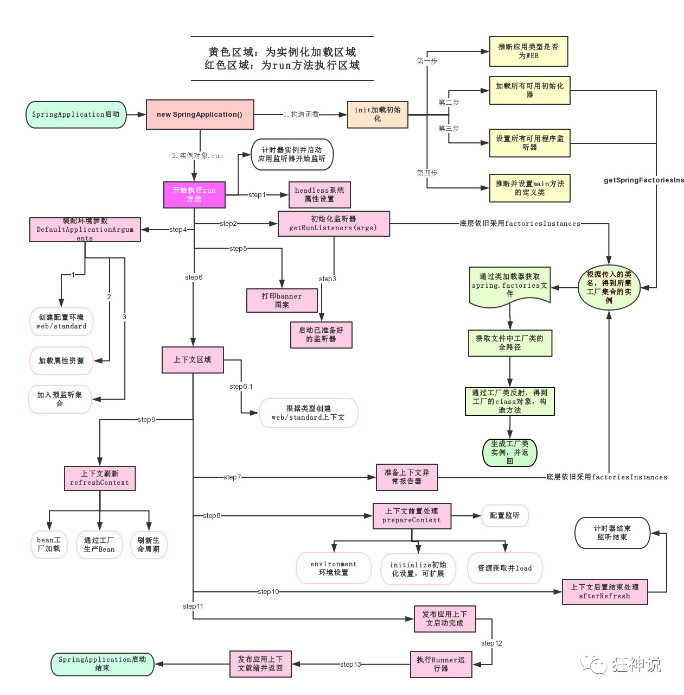

## @ConfigurationProperties和 @Value的对比

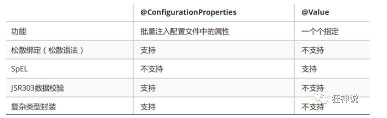

1、@ConfigurationProperties只需要写一次即可 ， @Value则需要每个字段都添加

2、松散绑定：这个什么意思呢? 比如我的yml中写的last-name，这个和lastName是一样的， - 后面跟着的字母默认是大写的。这就是松散绑定。可以测试一下

3、JSR303数据校验 ， 这个就是我们可以在字段是增加一层过滤器验证 ， 可以保证数据的合法性

4、复杂类型封装，yml中可以封装对象 ， 使用value就不支持

## JSR303数据校验

> Springboot中可以用`@Validated`来开启校验数据，如果数据异常则会统一抛出异常，方便异常中心统一处理。

- 常见的数据校验注解

```java
空检查
@Null       验证对象是否为null
@NotNull    验证对象是否不为null, 无法查检长度为0的字符串
@NotBlank   检查约束字符串是不是Null还有被Trim的长度是否大于0,只对字符串,且会去掉前后空格.
@NotEmpty   检查约束元素是否为NULL或者是EMPTY.
    
Booelan检查
@AssertTrue     验证 Boolean 对象是否为 true  
@AssertFalse    验证 Boolean 对象是否为 false  
    
长度检查
@Size(min=, max=) 验证对象（Array,Collection,Map,String）长度是否在给定的范围之内  
@Length(min=, max=) string is between min and max included.

日期检查
@Past       验证 Date 和 Calendar 对象是否在当前时间之前  
@Future     验证 Date 和 Calendar 对象是否在当前时间之后  
@Pattern    验证 String 对象是否符合正则表达式的规则【支持正则表达式】
```

## 不同位置配置文件的优先级

**注意：配置文件的文件名必须是`application.yml` 或  `application.preproties`**

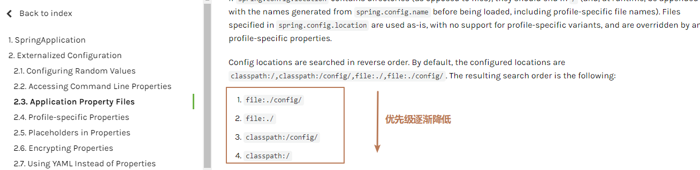

- 1、`file:./config/`。是指在工程的根目录下的config目录下。现在工程目录下新建config文件夹，再在config目录下新建`application.yml`。

```yaml
server:
  port: 8081  # 设置服务器启动端口为8081，默认是8080
```

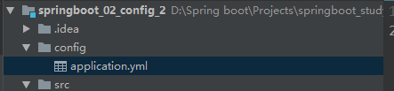

- 2、`file:./`。是指在工程的根目录下新建`application.yml`

```yaml
server:
  port: 8084
```

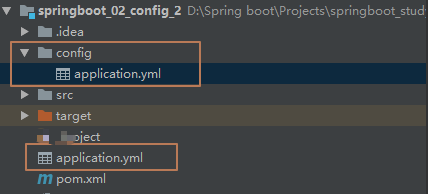

- 3、`classpath:/config/`。是指在类路径下的config目录下。在resources目录下新建config目录，再在config目录下新建`application.yml`

```yaml
server:
  port: 8085
```

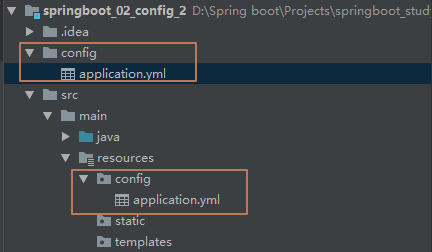

- 4、`classpath:/`。是指在类路径下新建`application.yml`。（新建项目的默认位置）

```yaml
server:
  port: 8086
```

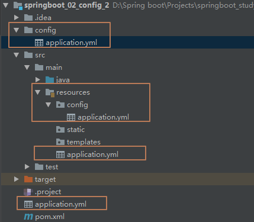

## 静态资源目录

以下四个目录存放的静态资源可以被我们识别：

```java
"classpath:/META-INF/resources/"
"classpath:/resources/"
"classpath:/static/"  // 默认
"classpath:/public/"
```

我们可以在resources根目录下新建对应的文件夹，都可以存放我们的静态文件；

## Spring Boot 中如何实现定时任务 ?


定时任务也是一个常见的需求，SpringBoot 中对于定时任务的支持主要还是来自 Spring 框架。

在 SpringBoot 中使用定时任务主要有两种不同的方式，一个就是使用 Spring 中的 @Scheduled注解，另一个则是使用第三方框架 Quartz。

使用 Spring 中的 @Scheduled的方式主要通过 @Scheduled 注解来实现。

使用 Quartz ，则按照 Quartz 的方式，定义 Job 和 Trigger 即可。

## Spring Boot 配置加载顺序?  

**1、** properties文件 2、YAML文件 3、系统环境变量 4、命令行参数

## Spring Boot多数据源拆分的思路

先在properties配置文件中配置两个数据源，创建分包mapper，使用@ConfigurationProperties读取properties中的配置，使用@MapperScan注册到对应的mapper包中

## 为什么我们需要 spring-boot-maven-plugin?


spring-boot-maven-plugin 提供了一些像 jar 一样打包或者运行应用程序的命令。

spring-boot:run 运行你的 SpringBooty 应用程序。

spring-boot：repackage 重新打包你的 jar 包或者是 war 包使其可执行

spring-boot：start 和 spring-boot：stop 管理 SpringBoot 应用程序的生命周期（也可以说是为了集成测试）。

spring-boot:build-info 生成执行器可以使用的构造信息。

## Spring Boot中的监视器是什么？


Spring boot actuator是spring启动框架中的重要功能之一。Spring boot监视器可帮助您访问生产环境中正在运行的应用程序的当前状态。有几个指标必须在生产环境中进行检查和监控。即使一些外部应用程序可能正在使用这些服务来向相关人员触发警报消息。监视器模块公开了一组可直接作为HTTP URL访问的REST端点来检查状态。

## 如何重新加载 Spring Boot 上的更改，而无需重新启动服务器？Spring Boot项目如何热部署？

**这可以使用 DEV 工具来实现。**通过这种依赖关系，您可以节省任何更改，嵌入式tomcat 将重新启动。SpringBoot 有一个开发工具（DevTools）模块，它有助于提高开发人员的生产力。Java 开发人员面临的一个主要挑战是将文件更改自动部署到服务器并自动重启服务器。开发人员可以重新加载 SpringBoot 上的更改，而无需重新启动服务器。这将消除每次手动部署更改的需要。SpringBoot 在发布它的第一个版本时没有这个功能。这是开发人员最需要的功能。DevTools 模块完全满足开发人员的需求。该模块将在生产环境中被禁用。它还提供 H2 数据库控制台以更好地测试应用程序。

```
<dependency>
  <groupId>org、springframework、boot</groupId>
  <artifactId>spring-boot-devtools</artifactId>
</dependency>
```

## 如何使用Spring Boot实现异常处理？

**Spring提供了一种使用ControllerAdvice处理异常的非常有用的方法。** 我们通过实现一个ControlerAdvice类，来处理控制器类抛出的所有异常。

## 如何在自定义端口上运行Spring Boot应用程序？ 

为了在自定义端口上运行SpringBoot应用程序，您可以在application.properties中指定端口。 **server.port = 8090**

## Spring Boot 提供了哪些核心功能？

**1、** 独立运行 Spring 项目

**2、** 内嵌 Servlet 容器

SpringBoot 可以选择内嵌 Tomcat、Jetty 或者 Undertow，这样我们无须以 war 包形式部署项目。

**3、** 提供 Starter 简化 Maven 配置

例如，当你使用了 spring-boot-starter-web ，会自动加入如下依赖：`spring-boot-starter-web` 的 pom 文件

**4、** 自动配置 Spring Bean

SpringBoot 检测到特定类的存在，就会针对这个应用做一定的配置，进行自动配置 Bean ，这样会极大地减少我们要使用的配置。

**5、** 准生产的应用监控

SpringBoot 提供基于 HTTP、JMX、SSH 对运行时的项目进行监控。

**6、** 无代码生成和 XML 配置

SpringBoot 没有引入任何形式的代码生成，它是使用的 Spring 4.0 的条件 @Condition 注解以实现根据条件进行配置。同时使用了 Maven /Gradle 的依赖传递解析机制来实现 Spring 应用里面的自动配置。

## Spring Boot常用的starter有哪些?


**1、** `spring-boot-starter-web` (嵌入tomcat和web开发需要servlet与jsp支持)

**2、** `spring-boot-starter-data-jpa` (数据库支持)

**3、** `spring-boot-starter-data-Redis` (Redis数据库支持)

**4、** `spring-boot-starter-data-solr` (solr搜索应用框架支持)

**5、** `mybatis-spring-boot-starter` (第三方的mybatis集成starter)

## 当 Spring Boot 应用程序作为 Java 应用程序运行时，后台会发生什么？ 


如果你使用 Eclipse IDE，Eclipse maven 插件确保依赖项或者类文件的改变一经添加，就会被编译并在目标文件中准备好！在这之后，就和其它的 Java 应用程序一样了。

当你启动 java 应用程序的时候，spring boot 自动配置文件就会魔法般的启用了。

**当 SpringBoot 应用程序检测到你正在开发一个 web 应用程序的时候，它就会启动 tomcat。**


## 我们如何监视所有 Spring Boot 微服务？

SpringBoot 提供监视器端点以监控各个微服务的度量。这些端点对于获取有关应用程序的信息（如它们是否已启动）以及它们的组件（如数据库等）是否正常运行很有帮助。但是，使用监视器的一个主要缺点或困难是，我们必须单独打开应用程序的知识点以了解其状态或健康状况。想象一下涉及 50 个应用程序的微服务，管理员将不得不击中所有 50 个应用程序的执行终端。为了帮助我们处理这种情况，我们将使用位于的开源项目。它建立在 SpringBoot Actuator 之上，它提供了一个 Web UI，使我们能够可视化多个应用程序的度量。

## Spring Boot微服务中如何实现 session 共享 ?


在微服务中，一个完整的项目被拆分成多个不相同的独立的服务，各个服务独立部署在不同的服务器上，各自的 session 被从物理空间上隔离开了，但是经常，我们需要在不同微服务之间共享 session ，**常见的方案就是 Spring Session + Redis 来实现 session 共享。**将所有微服务的 session 统一保存在 Redis 上，当各个微服务对 session 有相关的读写操作时，都去操作 Redis 上的 session 。这样就实现了 session 共享，Spring Session 基于 Spring 中的代理过滤器实现，使得 session 的同步操作对开发人员而言是透明的，非常简便。

## 如何在自定义端口上运行Spring Boot应用程序？


为了在自定义端口上运行SpringBoot应用程序，您可以在application.properties中指定端口。

```
 server.port = 8090
```

## Spring Boot支持哪些嵌入式容器？


无论何时创建Java应用程序，都可以通过两种方法进行部署： 使用外部的应用程序容器。 将容器嵌入jar文件中。 **SpringBoot包含Jetty，Tomcat和Undertow服务器，所有服务器都是嵌入式的。** Jetty - 用于大量项目，Eclipse Jetty可以嵌入到框架，应用程序服务器，工具和集群中。 Tomcat - Apache Tomcat是一个开源JavaServer Pages实现，可以很好地与嵌入式系统配合使用。 Undertow - 一个灵活而突出的Web服务器，它使用小型单一处理程序来开发Web服务器。

## spring boot初始化环境变量流程?

**1、** 调用`prepareEnvironment`方法去设置环境变量

**2、** 接下来有三个方法`getOrCreateEnvironment`，`configureEnvironment`，`environmentPrepared`

**3、** `getOrCreateEnvironment`去初始化系统环境变量

**4、** `configureEnvironment`去初始化命令行参数

**5、** `environmentPrepared`当广播到来的时候调用`onApplicationEnvironmentPreparedEvent`方法去使用`postProcessEnvironment`方法`load yml`和`properties变量`

## Spring Boot 支持哪些日志框架？推荐和默认的日志框架是哪个？

**SpringBoot 支持 Java Util Logging, Log4j2, Lockback 作为日志框架**，如果你使用 Starters 启动器，**SpringBoot 将使用 Logback 作为默认日志框架。**


## 如何配置Spring Boot应用程序日志记录？


SpringBoot附带了对Log4J2，Java Util Logging和Logback的支持。它通常预先配置为控制台输出。可以通过仅在application.properties文件中指定logging.level来配置它们。

```
logging.level.spring.framework=Debug
```

## 什么是 Swagger？你用 Spring Boot 实现了它吗？

Swagger 广泛用于可视化 API，使用 Swagger UI 为前端开发人员提供在线沙箱。Swagger 是用于生成 RESTful Web 服务的可视化表示的工具，规范和完整框架实现。它使文档能够以与服务器相同的速度更新。当通过 Swagger 正确定义时，消费者可以使用最少量的实现逻辑来理解远程服务并与其进行交互。因此，Swagger消除了调用服务时的猜测。


## 如何使用 Spring Boot 部署到不同的服务器？


你需要做下面两个步骤：

在一个项目中生成一个 war 文件。

将它部署到你最喜欢的服务器（websphere 或者 Weblogic 或者 Tomcat and so on）。

**第一步：**这本入门指南应该有所帮助：

[https://spring.io/guides/gs/convert-jar-to-war/](https://spring.io/guides/gs/convert-jar-to-war/)

**第二步：**取决于你的服务器。


## Spring Boot 的配置文件有哪几种格式？它们有什么区别？


.properties 和 .yml，它们的区别主要是书写格式不同。

**properties**

```
app.user.name = javastack
```

**yml**

```
app:
  user:
    name: javastack
```

## Spring Boot运行项目的几种方式？


打包用命令或者放到容器中运行

**1、** 打成jar包，使用java -jar xxx.jar运行

**2、** 打成war包，放到tomcat里面运行

直接用maven插件运行   maven spring-boot：run

直接执行main方法运行

## Spring Boot 配置文件的加载顺序


由jar包外向jar包内进行寻找;

优先加载带profile

jar包外部的application-{profile}.properties或application.yml (带spring.profile配置文件

jar包内部的application-{profile}.properties或application.yml (带spring.profile配置文件

再来加载不带profile

jar包外部的application.properties或application.yml(不带spring.profile配置文件

jar包内部的application.properties或application.yml(不带spring.profile配置文件


## Spring Boot 2.X 有什么新特性？与 1.X 有什么区别？


**1、**  配置变更

**2、**  JDK 版本升级

**3、**  第三方类库升级

**4、**  响应式 Spring 编程支持

**5、**  HTTP/2 支持

**6、**  配置属性绑定

**7、**  更多改进与加强


## 如何实现 Spring Boot 应用程序的安全性？


为了实现 SpringBoot 的安全性，我们使用 spring-boot-starter-security 依赖项，并且必须添加安全配置。它只需要很少的代码。配置类将必须扩展WebSecurityConfigurerAdapter 并覆盖其方法。

## Spring Boot支持什么前端模板

thymeleaf，freemarker，jsp，官方不推荐JSP会有限制

## Spring Boot需要独立的容器运行？

**SpringBoot不需要独立的容器就可以运行，因为在SpringBoot工程发布的jar文件里已经包含了tomcat的jar文件。SpringBoot运行的时候会创建tomcat对象，实现web服务功能。**也可以将SpringBoot发布成war文件，放到tomcat文件里面运行。

## 运行 Spring Boot 有哪几种方式？


打包用命令或者放到容器中运行

用 Maven/ Gradle 插件运行

直接执行 main 方法运行

## Spring Boot 中如何解决跨域问题 ?


跨域可以在前端通过 JSONP 来解决，但是 JSONP 只可以发送 GET 请求，无法发送其他类型的请求，在 RESTful 风格的应用中，就显得非常鸡肋，因此我们**推荐在后端通过 （CORS，Cross-origin resource sharing） 来解决跨域问题**。这种解决方案并非 SpringBoot 特有的，在传统的 SSM 框架中，就可以通过 CORS 来解决跨域问题，只不过之前我们是在 XML 文件中配置 CORS ，现在可以通过**实现WebMvcConfigurer接口然后重写addCorsMappings方法解决跨域问题。**

```
@Configuration
public class CorsConfig implements WebMvcConfigurer {
    @Override
    public void addCorsMappings(CorsRegistry registry) {
        registry.addMapping("/**")
                .allowedOrigins("*")
                .allowCredentials(true)
                .allowedMethods("GET", "POST", "PUT", "DELETE", "OPTIONS")
                .maxAge(3600);
    }
}
```

## 保护 Spring Boot 应用有哪些方法？

**1、** 在生产中使用HTTPS

**2、** 使用Snyk检查你的依赖关系

**3、** 升级到最新版本

**4、** 启用CSRF保护

**5、** 使用内容安全策略防止XSS攻击

## Spring Boot 的核心配置文件有哪几个？它们的区别是什么？

**1、** SpringBoot 的核心配置文件是 application 和 bootstrap 配置文件。

**2、** application 配置文件这个容易了解，主要用于 SpringBoot 项目的自动化配置。

**3、** bootstrap 配置文件有以下几个应用场景。

**4、** 使用 Spring Cloud Config 配置中心时，这时需要在 bootstrap 配置文件中增加连接到配置中心的配置属性来加载外部配置中心的配置信息；

**5、** 少量固定的不能被覆盖的属性；

**6、** 少量加密/解密的场景；


## spring boot 核心的两个配置文件

**1、** bootstrap (.yml 或.properties)：boostrap 由父 ApplicationContext 加载的，比 applicaton 优先加载，配置在应用程序上下文的引导阶段生效。一般来说我们在 Spring Cloud Config 或者 Nacos 中会用到它。且 boostrap 里面的属性不能被覆盖；

**2、** application (. yml 或者 . properties)：由ApplicatonContext 加载，用于 spring boot 项目的自动化配置。

## 如何在 Spring Boot中禁用 Actuator端点安全性?


默认情况下，所有敏感的HTTP端点都是安全的，只有具有 `http ACTUATOR`角色的用户才能访问它们。安全性是使用标准的 `httpservletrequest. isuserinrole..isusernrole`方法实施的。可以使用 `management. security. enabled= false`来禁用安全性。只有在执行机构端点在防火墙后访问时，才建议禁用安全性。


## 是否可以在Spring boot中更改嵌入式Tomcat服务器的端口?


是的，更改端口是可行的。可以使用application.properties文件更改端口。但需要提到“server.port”（即server.port=8081）。确保项目类路径中有application.properties；后续工作将由REST Spring框架接手。**如果提到server.port=0，那么它将自动分配任何可用的端口。**


## 如何在 Spring Boot 启动的时候运行一些特定的代码？

**可以实现接口 ApplicationRunner 或者 CommandLineRunner，这两个接口实现方式一样，它们都只提供了一个 run 方法**


## spring boot初始化环境变量流程?

**1、** 调用`prepareEnvironment`方法去设置环境变量

**2、** 接下来有三个方法`getOrCreateEnvironment`，`configureEnvironment`，`environmentPrepared`

**3、** `getOrCreateEnvironment`去初始化系统环境变量

**4、** `configureEnvironment`去初始化命令行参数

**5、** `environmentPrepared`当广播到来的时候调用`onApplicationEnvironmentPreparedEvent`方法去使用`postProcessEnvironment`方法`load yml`和`properties变量`


## Spring Boot如何配置log4j？

**在引用log4j之前，需要先排除项目创建时候带的日志，因为那个是Logback，然后再引入log4j的依赖，引入依赖之后，去src/main/resources目录下的log4j-spring.properties配置文件，就可以开始对应用的日志进行配置使用。**

## Spring Boot Starter 的工作原理是什么？


SpringBoot 在启动的时候会干这几件事情：

**1、** SpringBoot 在启动时会去依赖的 Starter 包中寻找 resources/META-INF/spring.factories 文件，然后根据文件中配置的 Jar 包去扫描项目所依赖的 Jar 包。

**2、** 根据 spring.factories 配置加载 AutoConfigure 类

**3、** 根据 @Conditional 注解的条件，进行自动配置并将 Bean 注入 Spring Context

总结一下，**其实就是 SpringBoot 在启动的时候，按照约定去读取 SpringBoot Starter 的配置信息，再根据配置信息对资源进行初始化，并注入到 Spring 容器中。这样 SpringBoot 启动完毕后，就已经准备好了一切资源，使用过程中直接注入对应 Bean 资源即可。**

这只是简单的三连环问答，不知道有多少同学能够完整的回答出来。


## Spring Boot 中的 starter 到底是什么 ?

首先，这个 Starter 并非什么新的技术点，基本上还是基于 Spring 已有功能来实现的。首先它提供了一个自动化配置类，一般命名为 `XXXAutoConfiguration` ，在这个配置类中通过条件注解来决定一个配置是否生效（条件注解就是 Spring 中原本就有的），然后它还会提供一系列的默认配置，也允许开发者根据实际情况自定义相关配置，然后通过类型安全的属性(spring、factories)注入将这些配置属性注入进来，新注入的属性会代替掉默认属性。正因为如此，很多第三方框架，我们只需要引入依赖就可以直接使用了。当然，开发者也可以自定义 Starter。


启动器是一套方便的依赖没描述符，它可以放在自己的程序中。你可以一站式的获取你所需要的 Spring 和相关技术，而不需要依赖描述符的通过示例代码搜索和复制黏贴的负载。

例如，如果你想使用 Sping 和 JPA 访问数据库，只需要你的项目包含 spring-boot-starter-data-jpa 依赖项，你就可以完美进行。


## Spring Boot 最大的优势是什么呢？

**SpringBoot 的最大的优势是“约定优于配置“。“约定优于配置“是一种软件设计范式，开发人员按照约定的方式来进行编程，可以减少软件开发人员需做决定的数量，获得简单的好处，而又不失灵活性。**

SpringBoot 中 “约定优于配置“的具体产品体现在哪里。

SpringBoot Starter、SpringBoot Jpa 都是“约定优于配置“的一种体现。都是通过“约定优于配置“的设计思路来设计的，SpringBoot Starter 在启动的过程中会根据约定的信息对资源进行初始化；SpringBoot Jpa 通过约定的方式来自动生成 Sql ，避免大量无效代码编写。


## Spring Boot集成mybatis的过程


添加mybatis的starter maven依赖

```
<dependency>
    <groupId>org.mybatis.spring.boot</groupId>
    <artifactId>mybatis-spring-boot-starter</artifactId>
    <version>1.3.2</version>
</dependency>
```

在mybatis的接口中 添加@Mapper注解

在application.yml配置数据源信息


## 如何集成Spring Boot和ActiveMQ？


对于集成SpringBoot和ActiveMQ，我们使用spring-boot-starter-activemq 依赖关系。 它只需要很少的配置，并且不需要样板代码。

## spring-boot-starter-parent 有什么用 ?


我们都知道，新创建一个 SpringBoot 项目，默认都是有 parent 的，这个 parent 就是 spring-boot-starter-parent ，spring-boot-starter-parent 主要有如下作用：

**1、** 定义了 Java 编译版本为 1.8 。

**2、** 使用 UTF-8 格式编码。

**3、** 继承自 spring-boot-dependencies，这个里边定义了依赖的版本，也正是因为继承了这个依赖，所以我们在写依赖时才不需要写版本号。

**4、** 执行打包操作的配置。

**5、** 自动化的资源过滤。

**6、** 自动化的插件配置。

**7、** 针对 application.properties 和 application.yml 的资源过滤，包括通过 profile 定义的不同环境的配置文件，例如 application-dev.properties 和 application-dev.yml。


## 开启 Spring Boot 特性有哪几种方式？

**1、** 继承spring-boot-starter-parent项目

**2、** 导入spring-boot-dependencies项目依赖

## 如何在 Spring Boot 中添加通用的 JS 代码？


在源文件夹下，创建一个名为 static 的文件夹。然后，你可以把你的静态的内容放在这里面。

例如，myapp.js 的路径是 resources\static\js\myapp.js

你可以参考它在 jsp 中的使用方法：

错误：HAL browser gives me unauthorized error - Full authenticaition is required to access this resource.

该如何来修复这个错误呢？

两种方法：

方法 1：关闭安全验证

application.properties

```
management.security.enabled:FALSE
```

方法二：在日志中搜索密码并传递至请求标头中


## Spring Boot 有哪几种读取配置的方式？


SpringBoot 可以通过 @PropertySource,@Value,@Environment, @ConfigurationProperties 来绑定变量。


## Spring Boot 是否可以使用 XML 配置 ?

**SpringBoot 推荐使用 Java 配置而非 XML 配置，但是 SpringBoot 中也可以使用 XML 配置，通过 @ImportResource 注解可以引入一个 XML 配置。**


## Spring Boot多数据源事务如何管理


第一种方式是在service层的@TransactionManager中使用transactionManager指定DataSourceConfig中配置的事务

第二种是使用jta-atomikos实现分布式事务管理


## spring boot扫描流程?

**1、** 调用run方法中的`refreshContext`方法

**2、** 用AbstractApplicationContext中的`refresh`方法

**3、** 委托给`invokeBeanFactoryPostProcessors`去处理调用链

**4、** 其中一个方法`postProcessBeanDefinitionRegistry会`去调用`processConfigBeanDefinitions`解析`beandefinitions`

**5、** 在`processConfigBeanDefinitions`中有一个`parse`方法，其中有`componentScanParser.parse`的方法，这个方法会扫描当前路径下所有`Component`组件


## Spring Boot如何实现打包


进入项目目录在控制台输入mvn clean package，clean是清空已存在的项目包，package进行打包

或者点击左边选项栏中的Mavne，先点击clean在点击package

## 你如何理解 Spring Boot 中的 Starters？

Starters可以理解为启动器，它包含了一系列可以集成到应用里面的依赖包，你可以一站式集成 Spring 及其他技术，而不需要到处找示例代码和依赖包。如你想使用 Spring JPA 访问数据库，只要加入 spring-boot-starter-data-jpa 启动器依赖就能使用了。

## 您使用了哪些 starter maven 依赖项？


**使用了下面的一些依赖项**

**1、**  spring-boot-starter-web 嵌入tomcat和web开发需要servlet与jsp支持

**2、**  spring-boot-starter-data-jpa 数据库支持

**3、**  spring-boot-starter-data-Redis Redis数据库支持

**4、**  spring-boot-starter-data-solr solr支持

**5、**  mybatis-spring-boot-starter 第三方的mybatis集成starter

自定义的starter(如果自己开发过就可以说出来)


## 如何使用Spring Boot实现分页和排序？


使用SpringBoot实现分页非常简单。使用Spring Data-JPA可以实现将可分页的传递给存储库方法。


## 能否举一个例子来解释更多 Staters 的内容？


让我们来思考一个 Stater 的例子 -SpringBoot Stater Web。

如果你想开发一个 web 应用程序或者是公开 REST 服务的应用程序。SpringBoot Start Web 是首选。让我们使用 Spring Initializr 创建一个 SpringBoot Start Web 的快速项目。

**依赖项可以被分为：**

**1、** Spring - core，beans，context，aop

**2、** Web MVC - （Spring MVC）

**3、** Jackson - for JSON Binding

**4、** Validation - Hibernate,Validation API

**5、** Enbedded Servlet Container - Tomcat

**6、** Logging - logback,slf4j

任何经典的 Web 应用程序都会使用所有这些依赖项。SpringBoot Starter Web 预先打包了这些依赖项。

作为一个开发者，我不需要再担心这些依赖项和它们的兼容版本。


## 如何使用 Spring Boot 自动重装我的应用程序？


使用 SpringBoot 开发工具。

把 SpringBoot 开发工具添加进入你的项目是简单的。

把下面的依赖项添加至你的 SpringBoot Project pom.xml 中

重启应用程序，然后就可以了。

同样的，如果你想自动装载页面，有可以看看 FiveReload

```
http://www.logicbig.com/tutorials/spring-framework/spring-boot/boot-live-reload/.
```

在我测试的时候，发现了 LiveReload 漏洞，如果你测试时也发现了，请一定要告诉我们。

## 如何实现 Spring Boot应用程序的安全性?

使用 `spring--startersecurityboot`--依赖项，并且必须添加安全配置。配置类将必须扩展 `WebSecurityConfigurerAdapter`并覆盖其方法。

## Spring Boot中如何实现对不同环境的属性配置文件的支持？

Spring Boot支持不同环境的属性配置文件切换，通过创建application-{profile}.properties文件，其中{profile}是具体的环境标识名称，例如：application-dev.properties用于开发环境，application-test.properties用于测试环境，application-uat.properties用于uat环境。如果要想使用application-dev.properties文件，则在application.properties文件中添加spring.profiles.active=dev。

如果要想使用application-test.properties文件，则在application.properties文件中添加spring.profiles.active=test。

## Spirng Boot 常用的两种配置文件

一个是properties,另一个是yaml。

## 什么是 YAML?YAML 配置的优势在哪里 ?

YAML现在可以算是非常流行的一种配置文件格式,无论是前端还是后端,都可以见到YAML配置。那么YAML配置和传统的properties配置相比到底有哪些优势呢?
配置有序。在一些特殊场景下,配置有序很关键。支持数组,数组中的元素可以是基本数据类型也可以是对象。简洁。相比properties配置文件,YAML还有一个缺点,就是不支持@PropertySource注解导入自定义的YAML配置。

## spring boot 读取配置文件信息

* **@Value("${property}")**  不被推荐了。
* **@ConfigurationProperties(prefix = "library")** 与bean绑定，加注解@Component。
* **@EnableConfigurationProperties(ProfileProperties.class)** 用于启动类上， 配置类用@ConfigurationProperties("my-profile")，这个可以加@notnull之类的校验。
* **@PropertySource("classpath:website.properties")** 读取指定文件，加@Component。

## spring boot全局异常

* @ControllerAdvice(assignableTypes = {ExceptionController.class})用于类、@ExceptionHandler(value = Exception.class)用于方法。
* @ResponseStatus(code = HttpStatus.NOT_FOUND) 返回特定的码，用于异常类。
* 方法里throw new ResponseStatusException，没效果。

##  spring boot过滤器

* @Configuration类下生成FilterRegistrationBean<MyFilter>的@Bean

```java
@Bean
    public FilterRegistrationBean<MyFilter> setUpMyFilter() {
        FilterRegistrationBean<MyFilter> filterRegistrationBean = new                FilterRegistrationBean<>();
        filterRegistrationBean.setOrder(2);
        filterRegistrationBean.setFilter(myFilter);
        filterRegistrationBean.setUrlPatterns(new ArrayList<>(Arrays.asList("/api/*")));

        return filterRegistrationBean;
    }
```

多个过滤器按指定顺序执行的话需要用上面的方法。

* @WebFilter(filterName = "MyFilterWithAnnotation", urlPatterns = "/api/*")，启动类要加@ServletComponentScan。

这里提下过滤器和拦截器：拦截器是基于Java的反射机制，AOP差不多，过滤器基于函数回调，灵活程度上是拦截器更强大，因为拦截器能除了能做过滤器的事情，还可以在控制器执行前后和视图渲染前后处理逻辑。过滤器主要针对URL地址做编码，过滤没用的参数和安全登录校验。

## spring boot参数校验

springboot引进来的基础包上已经包含所要用的校验注解，在controller上加注解@Validated，方法上无论传的参数还是对象，都在前面加@Valid，单独参数除了加@Valid，还需要直接加@NotNull之类的校验规则。值得一提的是，因为之前有同事说处理参数校验出错的时候，不用在代码里处理bindResult，其实这种说法并不对，因为不单独处理的话时候会抛出异常MethodArgumentNotValidException，如果使用全局异常处理的话，就可以集中处理这类问题。

除了contoller之外，service这些也可以使用

```java
@Service
@Validated
public class PersonService {

    public void validatePerson(@Valid Person person){
        // do something
    }
}
```

* 自定义校验，实现的一个注解@interface，再实现一个具体类实现ConstraintValidator接口。
* 校验组，例如@NotNull(groups = DeletePersonGroup.class)，DeletePersonGroup是静态内部接口，在方法参数上使用@Validated(AddPersonGroup.class)即可生效，它的作用是同一个字段可能在不同场景有不同的校验规则，这个时候就可以根据校验组灵活使用。

## Spring Boot 中如何解决跨域问题 ?

跨域可以在前端通过 JSONP 来解决，但是 JSONP 只可以发送 GET 请求，无法发送其他类型的请求，在 RESTful 风格的应用中，就显得非常鸡肋，因此我们推荐在后端通过 （CORS，Cross-origin resource sharing） 来解决跨域问题。这种解决方案并非 Spring Boot 特有的，在传统的 SSM 框架中，就可以通过 CORS 来解决跨域问题，只不过之前我们是在 XML 文件中配置 CORS ，现在可以通过实现WebMvcConfigurer接口然后重写addCorsMappings方法解决跨域问题。

```java
@Configuration
public class CorsConfig implements WebMvcConfigurer {

    @Override
    public void addCorsMappings(CorsRegistry registry) {
        registry.addMapping("/**")
                .allowedOrigins("*")
                .allowCredentials(true)
                .allowedMethods("GET", "POST", "PUT", "DELETE", "OPTIONS")
                .maxAge(3600);
    }

}
```

项目中前后端分离部署，所以需要解决跨域的问题。 
我们使用cookie存放用户登录的信息，在spring拦截器进行权限控制，当权限不符合时，直接返回给用户固定的json结果。 
当用户登录以后，正常使用；当用户退出登录状态时或者token过期时，由于拦截器和跨域的顺序有问题，出现了跨域的现象。 
我们知道一个http请求，先走filter，到达servlet后才进行拦截器的处理，如果我们把cors放在filter里，就可以优先于权限拦截器执行。

```java
@Configuration
public class CorsConfig {

    @Bean
    public CorsFilter corsFilter() {
        CorsConfiguration corsConfiguration = new CorsConfiguration();
        corsConfiguration.addAllowedOrigin("*");
        corsConfiguration.addAllowedHeader("*");
        corsConfiguration.addAllowedMethod("*");
        corsConfiguration.setAllowCredentials(true);
        UrlBasedCorsConfigurationSource urlBasedCorsConfigurationSource = new UrlBasedCorsConfigurationSource();
        urlBasedCorsConfigurationSource.registerCorsConfiguration("/**", corsConfiguration);
        return new CorsFilter(urlBasedCorsConfigurationSource);
    }

}
```

## Spring Boot 打成的 jar 和普通的 jar 有什么区别 ?

**Spring Boot 项目最终打包成的 jar 是可执行 jar ，这种 jar 可以直接通过 `java \-jar xxx.jar` 命令来运行，这种 jar 不可以作为普通的 jar 被其他项目依赖，即使依赖了也无法使用其中的类。**

Spring Boot 的 jar 无法被其他项目依赖，主要还是他和普通 jar 的结构不同。普通的 jar 包，解压后直接就是包名，包里就是我们的代码，而 Spring Boot 打包成的可执行 jar 解压后，在 `\BOOT-INF\classes` 目录下才是我们的代码，因此无法被直接引用。如果非要引用，可以在 pom.xml 文件中增加配置，将 Spring Boot 项目打包成两个 jar ，一个可执行，一个可引用。

## 开启 Spring Boot 特性有哪几种方式？

1）继承spring-boot-starter-parent项目

2）导入spring-boot-dependencies项目依赖

## Spring Boot启动流程是怎样的？

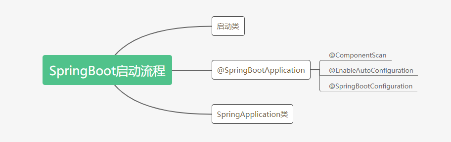

前言

SpringBoot一开始最让我印象深刻的就是通过一个启动类就能启动应用。在SpringBoot以前，启动应用虽然也不麻烦，但是还是有点繁琐，要打包成war包，又要配置tomcat，tomcat又有一个server.xml文件去配置。

然而SpringBoot则内置了tomcat，通过启动类启动，配置也集中在一个application.yml中，简直不要太舒服。好奇心驱动，于是我很想搞清楚启动类的启动过程，那么开始吧。

一、启动类

首先我们看最常见的启动类写法。

```java
@SpringBootApplication
public class SpringmvcApplication {
    public static void main(String[] args) {
        SpringApplication.run(SpringmvcApplication.class, args);
    }
}
```

把启动类分解一下，实际上就是两部分：

- @SpringBootApplication注解

- 一个main()方法，里面调用SpringApplication.run()方法。

二、@SpringBootApplication

首先看@SpringBootApplication注解的源码。

```java
@Target(ElementType.TYPE)
@Retention(RetentionPolicy.RUNTIME)
@Documented
@Inherited
@SpringBootConfiguration
@EnableAutoConfiguration
@ComponentScan(excludeFilters = { @Filter(type = FilterType.CUSTOM, classes = TypeExcludeFilter.class),@Filter(type = FilterType.CUSTOM, classes = AutoConfigurationExcludeFilter.class) })
public @interface SpringBootApplication {

}
```

很明显，@SpringBootApplication注解由三个注解组合而成，分别是：

- @ComponentScan
- @EnableAutoConfiguration
- @SpringBootConfiguration

2.1 @ComponentScan

```java
@Retention(RetentionPolicy.RUNTIME)
@Target(ElementType.TYPE)
@Documented
@Repeatable(ComponentScans.class)
public @interface ComponentScan {
    
}
```

这个注解的作用是告诉Spring扫描哪个包下面类，加载符合条件的组件(比如贴有@Component和@Repository等的类)或者bean的定义。

所以有一个basePackages的属性，如果默认不写，则从声明@ComponentScan所在类的package进行扫描。

所以启动类最好定义在Root package下，因为一般我们在使用@SpringBootApplication时，都不指定basePackages的。

2.2 @EnableAutoConfiguration

```java
@Target(ElementType.TYPE)
@Retention(RetentionPolicy.RUNTIME)
@Documented
@Inherited
@AutoConfigurationPackage
@Import(AutoConfigurationImportSelector.class)
public @interface EnableAutoConfiguration {
    
}
```

这是一个复合注解，看起来很多注解，实际上关键在@Import注解，它会加载AutoConfigurationImportSelector类，然后就会触发这个类的selectImports()方法。根据返回的String数组(配置类的Class的名称)加载配置类。

```java
public class AutoConfigurationImportSelector implements DeferredImportSelector, BeanClassLoaderAware,
ResourceLoaderAware, BeanFactoryAware, EnvironmentAware, Ordered {
    //返回的String[]数组，是配置类Class的类名
    @Override
    public String[] selectImports(AnnotationMetadata annotationMetadata) {
        if (!isEnabled(annotationMetadata)) {
            return NO_IMPORTS;
        }
        AutoConfigurationEntry autoConfigurationEntry = getAutoConfigurationEntry(annotationMetadata);
        //返回配置类的类名
        return StringUtils.toStringArray(autoConfigurationEntry.getConfigurations());
    }
}
```

我们一直点下去，就可以找到最后的幕后英雄，就是SpringFactoriesLoader类，通过loadSpringFactories()方法加载META-INF/spring.factories中的配置类。

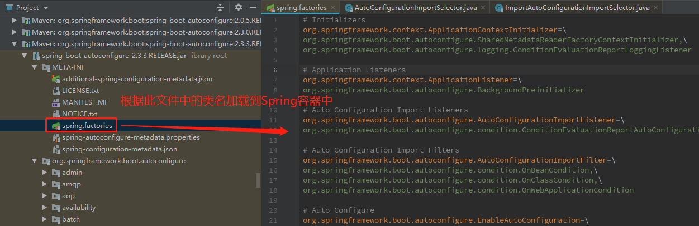

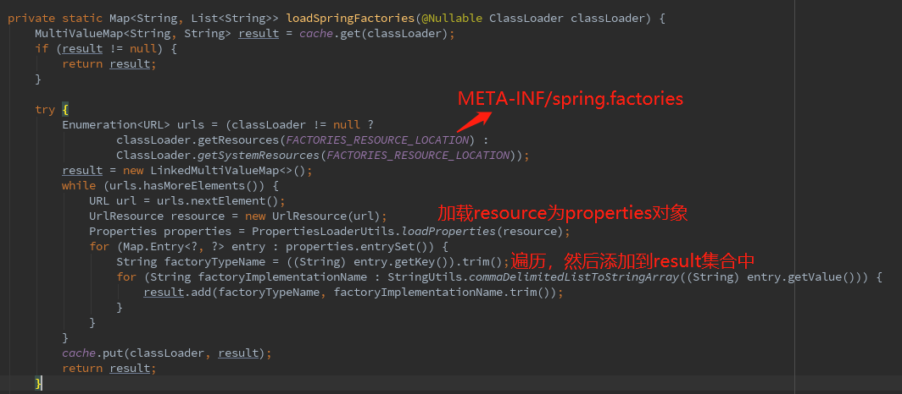

这里使用了spring.factories文件的方式加载配置类，提供了很好的扩展性。

所以@EnableAutoConfiguration注解的作用其实就是开启自动配置，自动配置主要则依靠这种加载方式来实现。

2.3 @SpringBootConfiguration

@SpringBootConfiguration继承自@Configuration，二者功能也一致，标注当前类是配置类， 并会将当前类内声明的一个或多个以@Bean注解标记的方法的实例纳入到spring容器中，并且实例名就是方法名。

2.4 小结

我们在这里画张图把@SpringBootApplication注解包含的三个注解分别解释一下。

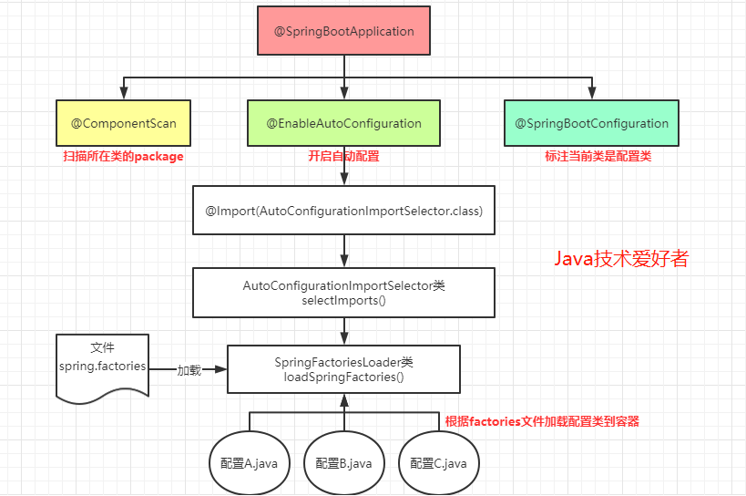

三、SpringApplication类

接下来讲main方法里执行的这句代码，这是SpringApplication类的静态方法run()。

```java
//启动类的main方法
public static void main(String[] args) {
    SpringApplication.run(SpringmvcApplication.class, args);
}

//启动类调的run方法
public static ConfigurableApplicationContext run(Class<?> primarySource, String... args) {
    //调的是下面的，参数是数组的run方法
    return run(new Class<?>[] { primarySource }, args);
}

//和上面的方法区别在于第一个参数是一个数组
public static ConfigurableApplicationContext run(Class<?>[] primarySources, String[] args) {
    //实际上new一个SpringApplication实例，调的是一个实例方法run()
    return new SpringApplication(primarySources).run(args);
}
```

通过上面的源码，发现实际上最后调的并不是静态方法，而是实例方法，需要new一个SpringApplication实例，这个构造器还带有一个primarySources的参数。所以我们直接定位到构造器。

```java
public SpringApplication(ResourceLoader resourceLoader, Class<?>... primarySources) {
    this.resourceLoader = resourceLoader;
    //断言primarySources不能为null，如果为null，抛出异常提示
    Assert.notNull(primarySources, "PrimarySources must not be null");
    //启动类传入的Class
    this.primarySources = new LinkedHashSet<>(Arrays.asList(primarySources));
    //判断当前项目类型，有三种：NONE、SERVLET、REACTIVE
    this.webApplicationType = WebApplicationType.deduceFromClasspath();
    //设置ApplicationContextInitializer
    setInitializers((Collection) getSpringFactoriesInstances(ApplicationContextInitializer.class));
    //设置监听器
    setListeners((Collection) getSpringFactoriesInstances(ApplicationListener.class));
    //判断主类，初始化入口类
    this.mainApplicationClass = deduceMainApplicationClass();
}

//判断主类
private Class<?> deduceMainApplicationClass() {
    try {
        StackTraceElement[] stackTrace = new RuntimeException().getStackTrace();
        for (StackTraceElement stackTraceElement : stackTrace) {
            if ("main".equals(stackTraceElement.getMethodName())) {
                return Class.forName(stackTraceElement.getClassName());
            }
        }
    }
    catch (ClassNotFoundException ex) {
        // Swallow and continue
    }
    return null;
}
```

以上就是创建SpringApplication实例做的事情，下面用张图来表示一下。

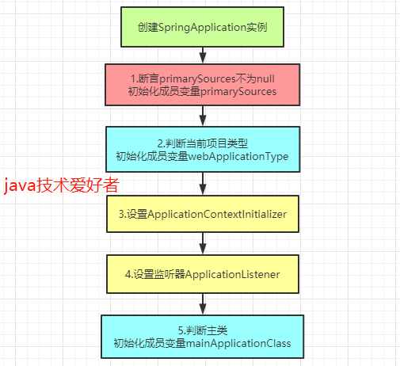

创建了SpringApplication实例之后，就完成了SpringApplication类的初始化工作，这个实例里包括监听器、初始化器，项目应用类型，启动类集合，类加载器。如图所示。

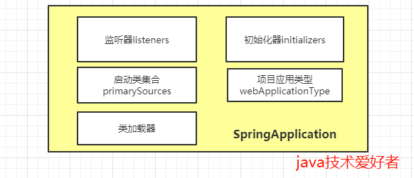

得到SpringApplication实例后，接下来就调用实例方法run()。继续看。

```java
public ConfigurableApplicationContext run(String... args) {
    //创建计时器
    StopWatch stopWatch = new StopWatch();
    //开始计时
    stopWatch.start();
    //定义上下文对象
    ConfigurableApplicationContext context = null;
    Collection<SpringBootExceptionReporter> exceptionReporters = new ArrayList<>();
    //Headless模式设置
    configureHeadlessProperty();
    //加载SpringApplicationRunListeners监听器
    SpringApplicationRunListeners listeners = getRunListeners(args);
    //发送ApplicationStartingEvent事件
    listeners.starting();
    try {
        //封装ApplicationArguments对象
        ApplicationArguments applicationArguments = new DefaultApplicationArguments(args);
        //配置环境模块
        ConfigurableEnvironment environment = prepareEnvironment(listeners, applicationArguments);
        //根据环境信息配置要忽略的bean信息
        configureIgnoreBeanInfo(environment);
        //打印Banner标志
        Banner printedBanner = printBanner(environment);
        //创建ApplicationContext应用上下文
        context = createApplicationContext();
        //加载SpringBootExceptionReporter
        exceptionReporters = getSpringFactoriesInstances(SpringBootExceptionReporter.class,
                                                         new Class[] { ConfigurableApplicationContext.class }, context);
        //ApplicationContext基本属性配置
        prepareContext(context, environment, listeners, applicationArguments, printedBanner);
        //刷新上下文
        refreshContext(context);
        //刷新后的操作，由子类去扩展
        afterRefresh(context, applicationArguments);
        //计时结束
        stopWatch.stop();
        //打印日志
        if (this.logStartupInfo) {
            new StartupInfoLogger(this.mainApplicationClass).logStarted(getApplicationLog(), stopWatch);
        }
        //发送ApplicationStartedEvent事件，标志spring容器已经刷新，此时所有的bean实例都已经加载完毕
        listeners.started(context);
        //查找容器中注册有CommandLineRunner或者ApplicationRunner的bean，遍历并执行run方法
        callRunners(context, applicationArguments);
    }
    catch (Throwable ex) {
        //发送ApplicationFailedEvent事件，标志SpringBoot启动失败
        handleRunFailure(context, ex, exceptionReporters, listeners);
        throw new IllegalStateException(ex);
    }

    try {
        //发送ApplicationReadyEvent事件，标志SpringApplication已经正在运行，即已经成功启动，可以接收服务请求。
        listeners.running(context);
    }
    catch (Throwable ex) {
        //报告异常，但是不发送任何事件
        handleRunFailure(context, ex, exceptionReporters, null);
        throw new IllegalStateException(ex);
    }
    return context;
}
```

结合注释和源码，其实很清晰了，为了加深印象，画张图看一下整个流程。

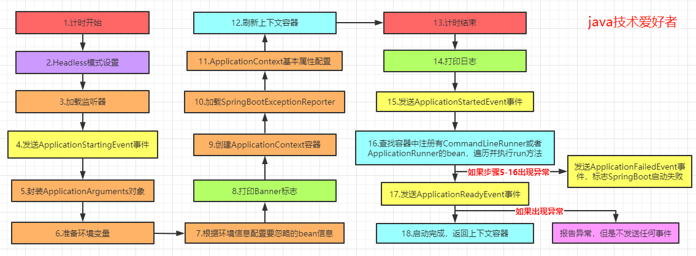

总结

表面启动类看起来就一个@SpringBootApplication注解，一个run()方法。其实是经过高度封装后的结果。我们可以从这个分析中学到很多东西。比如使用了spring.factories文件来完成自动配置，提高了扩展性。在启动时使用观察者模式，以事件发布的形式通知，降低耦合，易于扩展等等。

## Spring Boot的自动配置原理？

（1）自动配置注解（@EnableAutoConfiguration）告诉SpringBoot如何配置Spring，它是基于你已经添加jar依赖项。比如：Spring-boot-starter-web已经添加Tomcat和Spring MVC，那么这个注解就会自动将假设您正在开发一个 web应用程序并添加相应的 spring配置。会自动去 maven中读取每个 starter中的spring.factories文件，该文件里配置了所有需要被创建 spring容器中的 bean。

**@EnableAutoConfiguration** 会将MainApplication 所在包下的所有组件一起加载进来，即默认扫描我们当前系统里面所有META-INF/spring.factories位置的文件。【在 spring-boot-autoconfigure-2.3.4.RELEASE.jar包里面也有META-INF/spring.factories】

虽然我们127个场景的所有自动配置启动的时候默认全部加载。xxxxAutoConfiguration 按照条件装配规则（@Conditional），最终会按需配置。

（2）**使用@SpringBootApplication注解，可以解决根类或者配置类的问题。**

```java
@SpringBootApplication
等同于
@SpringBootConfiguration  //其实就是一个配置类Configuration，因此main其实也是属于一个配置类
@EnableAutoConfiguration
@ComponentScan("com.yfx.ssm") //默认：主程序所在包及其下面的所有子包里面的组件都会被默认扫描进来。指定扫描哪些，Spring注解;
```

如果想要改变扫描路径，@SpringBootApplication(scanBasePackages="com.yfx")或者在@ComponentScan 指定扫描路径。

**总结：**（因此整个原理就是）

- SpringBoot先加载所有的自动配置类  xxxxxAutoConfiguration
- 每个自动配置类按照条件进行生效，默认都会绑定配置文件指定的值。xxxxProperties里面拿。**xxxProperties和配置文件（app.p）进行了绑定**
- 生效的配置类就会给容器中装配很多组件
- 只要容器中有这些组件，相当于这些功能就有了

SpringBoot是通过main方法下的SpringApplication.run()方法开始执行，通过注解@SpringBootApplication下的@EnableAutoConfiguration注解下开始自动化配置，会在MainApplication所在包下的所有自动配置类（xxxxxAutoConfiguration）都加载进去，即默认扫描我们当前系统里面的META-INF/spring.factories位置的文件。但最终不会全部导入，而是会根据条件装配规则@ImportSelect，最终会按需装配，自动生效。并且都会默认绑定配置文件指定的值。（因为每个自动配置类都有一个属性xxxproperties.class，那么该类里面就会配置在配置文件绑定的前缀以及所有的功能属性，每个xxxproperties.class类下的所有属性都可以与我们的配置文件进行绑定）。生效的配置类就会给容器中装配很多组件，只要容器中有这些组件，就相当于这些功能有了。

## Spring Boot实现热部署有哪几种方式？

（1）模板热部署
		在SpringBoot中，模板引擎的页面默认是开启缓存的，如果修改了页面的内容，则刷新页面是得不到修改后的页面的，因此我们可以在application.properties中关闭模版引擎的缓存。

Thymeleaf的配置：

```properties
Spring.thymeleaf.cache=false
```

（2）使用调试模式Debug实现热部署

此种方式为最简单最快速的一种热部署方式，运行系统时使用 Debug模式，无需装任何插件即可，但是无发对配置文件，方法名称改变，增加类及方法进行热部署，使用范围有限。

（3）spring-boot-devtools

在 SpringBoot项目中添加 **spring-boot-devtools**依赖即可实现页面和代码的热部署。如下：

```xml
<dependency>
<groupId>org.springframework.boot</groupId>
<artifactId>spring-boot-devtools</artifactId>75
</dependency>
```

此种方式的特点是作用范围广，系统的任何变动包括配置文件修改、方法名称变化都能覆盖，但是后遗症也非常明显，它是采用文件变化后重启的策略
来实现了，主要是节省了我们手动点击重启的时间，提高了实效性，在体验上回稍差。
spring-boot-devtools默认关闭了模版缓存，如果使用这种方式不用单独配置关闭模版缓存。

（4）SpringLoaded

此种方式与 Debug模式类似，适用范围有限，但是不依赖于 Debug模式启动，通过 SpringLoaded库文件启动，即可在正常模式下进行实时热部署。此种需要在 runconfrgration中进行配置。

（5）JRebel

Jrebel是 Java开发最好的热部署工具，对 SpringBoot提供了极佳的支持，JRebel为收费软件，试用期 14天。可直接通过插件安装。

## Spring Boot如何定义多种环境配置？

为了方便多环境适配，springboot简化了profiles功能。一般情况下，多套不同环境(development、test、production)配置，我们基于SpringBoot的 Profiles来实现。

**application-profiles功能：**

（1）默认配置文件  application.yaml；任何时候都会加载。

编写环境配置文件  application-{env}.yaml    **如：application-test.yaml（测试环境的配置文件）application-prod.yaml（生产环境的配置文件）**

（2）激活指定环境 （三种方式） 

​				配置文件激活如：在主配置文件中，spring.profiles.active=test （在主配置文件上说明使用测试环境的配置文件）

​				命令行激活：java -jar xxx.jar --spring.profiles.active=test  （在命令行说明使用测试环境的配置文件）                                                                                   

​				虚拟机参数：在 VMoptions指定：-Dspring.profiles.active=test （在VMoptions上说明使用测试环境的配置文件）

**注意：**1）修改配置文件的任意值，命令行优先；
			2）默认配置与环境配置同时生效；
			3）同名配置项，profile配置优先。

## 如何给静态变量赋值？

**SpringBoot无法通过@Value给静态变量赋值**

**此时需要给当前类加@Component注解，通过set方法设置@Value注解加载set方法上，set方法的参数可以任意命名，不能同属性名，此后当前工具类下的静态方法可直接使用属性值。**

## 前后端分离，如何维护接口文档 ?

前后端分离开发日益流行，大部分情况下，我们都是通过 SpringBoot 做前后端分离开发，前后端分离一定会有接口文档，不然会前后端会深深陷入到扯皮中。一个比较笨的方法就是使用 word 或者 md 来维护接口文档，但是效率太低，接口一变，所有人手上的文档都得变。在 SpringBoot 中，这个问题常见的解决方案是 Swagger ，使用 Swagger 我们可以快速生成一个接口文档网站，接口一旦发生变化，文档就会自动更新，所有开发工程师访问这一个在线网站就可以获取到最新的接口文档，非常方便。

## 为什么要选择微服务架构？


这是一个非常常见的微服务面试问题，你应该准备好了！微服务架构提供了许多优点。这里有几个：

**1、** **微服务可以轻松适应其他框架或技术。**

**2、** **单个进程的失败不会影响整个系统。**

**3、** **为大企业和小型团队提供支持。**

**4、** **可以在相对较短的时间内独立部署。**

## 如何不通过任何配置来选择 Hibernate 作为 JPA 的默认实现？


因为 SpringBoot 是自动配置的。

**下面是我们添加的依赖项:**

spring-boot-stater-data-jpa 对于 Hibernate 和 JPA 有过渡依赖性。

## 什么是Spring Actuator？它有什么优势？


这是SpringBoot中最常见的面试问题之一。根据Spring文件：

执行器是一个制造术语，指的是移动或控制某物的机械装置。执行机构可以从一个小的变化中产生大量的运动。

众所周知，SpringBoot提供了许多自动配置特性，帮助开发人员快速开发生产组件。但是，当考虑调试和如何调试，如果出现问题，总是需要分析日志并挖掘应用程序的数据流，检查问题出在何处。因此，Spring Actuator提供了方便的访问这些类型的途径。它提供了许多特性，例如创建了什么样的bean、控制器中的映射、CPU使用情况等等。它还可以将自动收集和审计健康状况和指标应用到应用程序中。

它提供了一种非常简单的方法来访问少数生产就绪的REST端点，并从Web获取各种信息。但是通过使用这些端点，你可以做很多事情来查看端点文档。没有必要担心安全问题;如果存在Spring Security，则默认使用Spring Security的内容协商策略保护这些端点。或者，可以在RequestMatcher的帮助下配置自定义安全性。