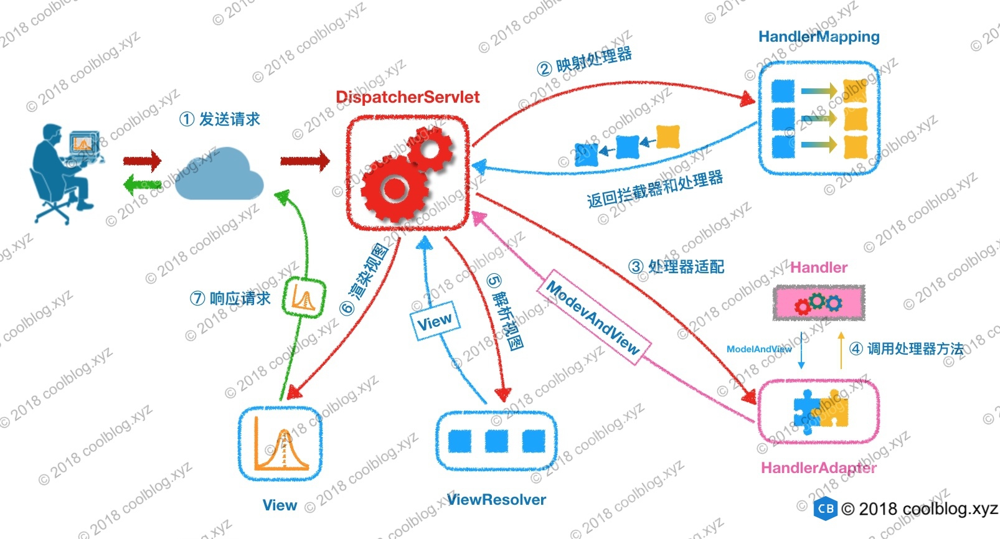
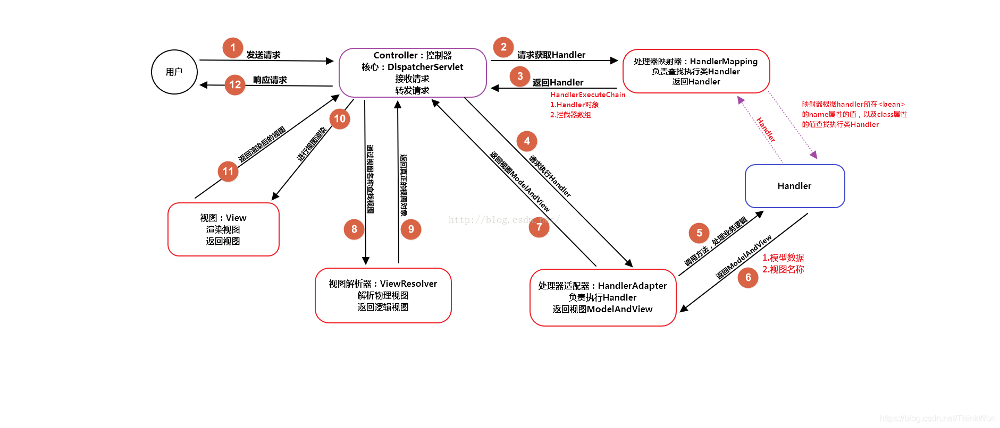

# Spring MVC面试题

## 什么是Spring MVC？简单介绍下你对Spring MVC的理解？

**Spring MVC是一个基于Java的实现了MVC设计模式的请求驱动类型的轻量级Web框架，通过把模型-视图-控制器分离，将web层进行职责解耦，把复杂的web应用分成逻辑清晰的几部分，简化开发，减少出错，方便组内开发人员之间的配合。**

## Spring MVC的优点

（1）可以支持各种视图技术,而不仅仅局限于JSP；

（2）与Spring框架集成（如IoC容器、AOP等）；

（3）清晰的角色分配：前端控制器(dispatcherServlet) , 请求到处理器映射（handlerMapping), 处理器适配器（HandlerAdapter), 视图解析器（ViewResolver）。

（4） 支持各种请求资源的映射策略。

## Spring MVC的主要组件？

**1、** 前端控制器 DispatcherServlet（不需要程序员开发）

**作用：**接收请求、响应结果，相当于转发器，有了DispatcherServlet 就减少了其它组件之间的耦合度。

**2、** 处理器映射器HandlerMapping（不需要程序员开发）

**作用：**根据请求的URL来查找Handler

**3、** 处理器适配器HandlerAdapter

**注意：**在编写Handler的时候要按照HandlerAdapter要求的规则去编写，这样适配器HandlerAdapter才可以正确的去执行Handler。

**4、** 处理器Handler（需要程序员开发）

**5、** 视图解析器 ViewResolver（不需要程序员开发）

**作用：**进行视图的解析，根据视图逻辑名解析成真正的视图（view）

**6、** 视图View（需要程序员开发jsp）

View是一个接口， 它的实现类支持不同的视图类型（jsp，freemarker，pdf等等）

## 使用spring MVC必须配置的三大件：

**处理器映射器、处理器适配器、视图解析器**

通常，我们只需要**手动配置视图解析器**，而**处理器映射器**和**处理器适配器**只需要开启**注解驱动**即可，而省去了大段的xml配置

## 什么是DispatcherServlet

Spring的MVC框架是围绕DispatcherServlet来设计的，它用来**处理所有的HTTP请求和响应。**

## Spring MVC里面拦截器是怎么写的 


有两种写法,一种是**实现HandlerInterceptor接口**，另外一种是**继承适配器类**，接着在接口方法当中，实现处理逻辑；然后在Spring MVC的配置文件中**配置拦截器**即可：

```xml
<!--配置拦截器-->
<mvc:interceptors>
    <mvc:interceptor>
        <!--/** 包括路径及其子路径,例如：-->
        <!--/admin/* 拦截的是/admin/add等等这种 , /admin/add/user不会被拦截-->
        <!--/admin/** 拦截的是/admin/下的所有-->
        <mvc:mapping path="/**"/>
        <bean class="com.springmvc.config.MyInterceptor"/>
    </mvc:interceptor>
</mvc:interceptors>
```

## Spring MVC的优点

**1、** 可以支持各种视图技术,而不仅仅局限于JSP；

**2、** 与Spring框架集成（如IoC容器、AOP等）；

**3、** 清晰的角色分配：前端控制器(dispatcherServlet) , 请求到处理器映射（handlerMapping), 处理器适配器（HandlerAdapter), 视图解析器（ViewResolver）。

**4、** 支持各种请求资源的映射策略。

## Spring MVC怎么和AJAX相互调用的？


通过Jackson框架就可以把Java里面的对象直接转化成Js可以识别的Json对象。具体步骤如下 ：

**1、** 加入Jackson.jar

**2、** 在配置文件中配置json的映射

**3、** 在接受Ajax方法里面可以直接返回Object,List等,但方法前面要加上@ResponseBody注解。

## 在Spring MVC应用程序中使用WebMvcTest注释有什么用处？


WebMvcTest注释用于单元测试Spring MVC应用程序。我们只想启动ToTestController。执行此单元测试时，不会启动所有其他控制器和映射。

```
@WebMvcTest(value = ToTestController.class, secure = false):
```

## Spring MVC的异常处理？

**可以将异常抛给Spring框架，由Spring框架来处理；我们只需要配置简单的异常处理器，在异常处理器中添视图页面即可。**

## Spring MVC 工作原理了解吗?

**原理如下图所示：**



上图的一个笔误的小问题：**Spring MVC 的入口函数也就是前端控制器 `DispatcherServlet` 的作用是接收请求，响应结果。**

**流程说明（重要）：**

1. 客户端（浏览器）发送请求，直接请求到 `DispatcherServlet`。
2. `DispatcherServlet` 根据请求信息调用 `HandlerMapping`，解析请求对应的 `Handler`。
3. 解析到对应的 `Handler`（也就是我们平常说的 `Controller` 控制器）后，开始由 `HandlerAdapter` 适配器处理。
4. `HandlerAdapter` 会根据 `Handler`来调用真正的处理器开处理请求，并处理相应的业务逻辑。
5. 处理器处理完业务后，会返回一个 `ModelAndView` 对象，`Model` 是返回的数据对象，`View` 是个逻辑上的 `View`。
6. `ViewResolver` 会根据逻辑 `View` 查找实际的 `View`。
7. `DispaterServlet` 把返回的 `Model` 传给 `View`（视图渲染）。
8. 把 `View` 返回给请求者（浏览器）

## 简单介绍 Spring MVC 的核心组件

那么接下来就简单介绍一下 `DispatcherServlet` 和九大组件（按使用顺序排序的）：

| 组件                        | 说明                                                         |
| :-------------------------- | :----------------------------------------------------------- |
| DispatcherServlet           | Spring MVC 的核心组件，是请求的入口，负责协调各个组件工作    |
| MultipartResolver           | 内容类型( `Content-Type` )为 `multipart/*` 的请求的解析器，例如解析处理文件上传的请求，便于获取参数信息以及上传的文件 |
| HandlerMapping              | 请求的处理器匹配器，负责为请求找到合适的 `HandlerExecutionChain` 处理器执行链，包含处理器（`handler`）和拦截器们（`interceptors`） |
| HandlerAdapter              | 处理器的适配器。因为处理器 `handler` 的类型是 Object 类型，需要有一个调用者来实现 `handler` 是怎么被执行。Spring 中的处理器的实现多变，比如用户处理器可以实现 Controller 接口、HttpRequestHandler 接口，也可以用 `@RequestMapping` 注解将方法作为一个处理器等，这就导致 Spring MVC 无法直接执行这个处理器。所以这里需要一个处理器适配器，由它去执行处理器 |
| HandlerExceptionResolver    | 处理器异常解析器，将处理器（ `handler` ）执行时发生的异常，解析( 转换 )成对应的 ModelAndView 结果 |
| RequestToViewNameTranslator | 视图名称转换器，用于解析出请求的默认视图名                   |
| LocaleResolver              | 本地化（国际化）解析器，提供国际化支持                       |
| ThemeResolver               | 主题解析器，提供可设置应用整体样式风格的支持                 |
| ViewResolver                | 视图解析器，根据视图名和国际化，获得最终的视图 View 对象     |
| FlashMapManager             | FlashMap 管理器，负责重定向时，保存参数至临时存储（默认 Session） |

Spring MVC 对各个组件的职责划分的比较清晰。`DispatcherServlet` 负责协调，其他组件则各自做分内之事，互不干扰。

## @Controller注解的作用

**`@Controller` 注解标记一个类为 Spring Web MVC 控制器 Controller。Spring MVC 会将扫描到该注解的类，然后扫描这个类下面带有 `@RequestMapping` 注解的方法，根据注解信息，为这个方法生成一个对应的处理器对象**，在上面的 HandlerMapping 和 HandlerAdapter组件中讲到过。

当然，除了添加 `@Controller` 注解这种方式以外，你**还可以实现 Spring MVC 提供的 `Controller` 或者 `HttpRequestHandler` 接口，对应的实现类也会被作为一个处理器对象**

在Spring MVC 中，**控制器Controller 负责处理由DispatcherServlet 分发的请求，它把用户请求的数据经过业务处理层处理之后封装成一个Model ，然后再把该Model 返回给对应的View 进行展示。**在Spring MVC 中提供了一个非常简便的定义Controller 的方法，你无需继承特定的类或实现特定的接口，只需使用@Controller 标记一个类是Controller ，然后使用@RequestMapping 和@RequestParam 等一些注解用以定义URL 请求和Controller 方法之间的映射，这样的Controller 就能被外界访问到。此外Controller 不会直接依赖于HttpServletRequest 和HttpServletResponse 等HttpServlet 对象，它们可以通过Controller 的方法参数灵活的获取到。

@Controller 用于标记在一个类上，使用它标记的类就是一个Spring MVC Controller 对象。分发处理器将会扫描使用了该注解的类的方法，并检测该方法是否使用了@RequestMapping 注解。**@Controller 只是定义了一个控制器类，而使用@RequestMapping 注解的方法才是真正处理请求的处理器。**单单使用@Controller 标记在一个类上还不能真正意义上的说它就是Spring MVC 的一个控制器类，因为这个时候Spring 还不认识它。那么要如何做Spring 才能认识它呢？这个时候就需要我们把这个控制器类交给Spring 来管理。有两种方式：

- 在Spring MVC 的配置文件中定义MyController 的bean 对象。
- 在Spring MVC 的配置文件中告诉Spring 该到哪里去找标记为@Controller 的Controller 控制器。

## @RequestMapping注解的作用

**`@RequestMapping` 注解，配置处理器的 HTTP 请求方法，URI等信息**，这样才能将请求和方法进行映射。这个注解可以作用于类上面，也可以作用于方法上面，在类上面一般是配置这个**控制器**的 URI 前缀

RequestMapping是一个用来处理请求地址映射的注解，可用于类或方法上。用于类上，表示类中的所有响应请求的方法都是以该地址作为父路径。

RequestMapping注解有六个属性，下面我们把她分成三类进行说明。

**value， method**

value： 指定请求的实际地址，指定的地址可以是URI Template 模式；

method： 指定请求的method类型， GET、POST、PUT、DELETE等；

**consumes，produces**

consumes： 指定处理请求的提交内容类型（Content-Type），例如application/json, text/html;

produces: 指定返回的内容类型，仅当request请求头中的(Accept)类型中包含该指定类型才返回；

**params，headers**

params： 指定request中必须包含某些参数值是，才让该方法处理。

headers： 指定request中必须包含某些指定的header值，才能让该方法处理请求。

## @ResponseBody注解的作用

作用： 该注解用于将Controller的方法返回的对象，通过适当的HttpMessageConverter转换为指定格式后，写入到Response对象的body数据区。

使用时机：返回的数据不是html标签的页面，而是其他某种格式的数据时（如json、xml等）使用；

## @PathVariable和@RequestParam的区别

**两个注解都用于方法参数，获取参数值的方式不同，`@RequestParam` 注解的参数从请求携带的参数中获取，而 `@PathVariable` 注解从请求的 URI 中获取**

请求路径上有个id的变量值，可以通过@PathVariable来获取 @RequestMapping(value = “/page/{id}”, method = RequestMethod.GET)

@RequestParam用来获得静态的URL请求入参 spring注解时action里用到。

## @RestController 和 @Controller 有什么区别？

**`@RestController` 注解，在 `@Controller` 基础上，增加了 `@ResponseBody` 注解，更加适合目前前后端分离的架构下，提供 Restful API ，返回例如 JSON 数据格式。**当然，返回什么样的数据格式，根据客户端的 `ACCEPT` 请求头来决定。

## @RequestMapping 和 @GetMapping 注解的不同之处在哪里？

1. **`@RequestMapping`：可注解在类和方法上；`@GetMapping` 仅可注册在方法上**
2. **`@RequestMapping`：可进行 GET、POST、PUT、DELETE 等请求方法；`@GetMapping` 是 `@RequestMapping` 的 GET 请求方法的特例，目的是为了提高清晰度。**

## 返回 JSON 格式使用什么注解？

可以使用 **`@ResponseBody`** 注解，或者使用包含 `@ResponseBody` 注解的 **`@RestController`** 注解。

当然，**还是需要配合相应的支持 JSON 格式化的 HttpMessageConverter 实现类**。例如，Spring MVC 默认使用 MappingJackson2HttpMessageConverter。

## 什么是spring mvc拦截器以及如何使用它？

Spring的处理程序映射机制包括处理程序拦截器，当你希望将特定功能应用于某些请求时，例如，检查用户主题时，这些拦截器非常有用。**拦截器必须实现**org.springframework.web.servlet包的**HandlerInterceptor**。此接口定义了三种方法：

- preHandle：在执行实际处理程序之前调用。
- postHandle：在执行完实际程序之后调用。
- afterCompletion：在完成请求后调用。

## Spring MVC与Struts2区别

相同点

**都是基于mvc的表现层框架，都用于web项目的开发。**

不同点

1.前端控制器不一样。Spring MVC的前端控制器是servlet：DispatcherServlet。struts2的前端控制器是filter：StrutsPreparedAndExcutorFilter。

2.请求参数的接收方式不一样。Spring MVC是使用方法的形参接收请求的参数，基于方法的开发，线程安全，可以设计为单例或者多例的开发，推荐使用单例模式的开发（执行效率更高），默认就是单例开发模式。struts2是通过类的成员变量接收请求的参数，是基于类的开发，线程不安全，只能设计为多例的开发。

3.Struts采用值栈存储请求和响应的数据，通过OGNL存取数据，Spring MVC通过参数解析器是将request请求内容解析，并给方法形参赋值，将数据和视图封装成ModelAndView对象，最后又将ModelAndView中的模型数据通过reques域传输到页面。Jsp视图解析器默认使用jstl。

4.与spring整合不一样。Spring MVC是spring框架的一部分，不需要整合。在企业项目中，Spring MVC使用更多一些。

**入口**不同

- Spring MVC 的入门是一个 Servlet **控制器**。
- Struts2 入门是一个 Filter **过滤器**。

**配置映射**不同，

- Spring MVC 是基于**方法**开发，传递参数是通过**方法形参**，一般设置为**单例**。
- Struts2 是基于**类**开发，传递参数是通过**类的属性**，只能设计为**多例**。

**视图**不同

- Spring MVC 通过参数解析器是将 Request 对象内容进行解析成方法形参，将响应数据和页面封装成 **ModelAndView** 对象，最后又将模型数据通过 **Request** 对象传输到页面。其中，如果视图使用 JSP 时，默认使用 **JSTL** 。
- Struts2 采用**值栈**存储请求和响应的数据，通过 **OGNL** 存取数据。

## REST 代表着什么?

REST 代表着抽象状态转移，它是根据 HTTP 协议从客户端发送数据到服务端，例如：服务端的一本书可以以 XML 或 JSON 格式传递到客户端

可以看看 [REST API design and development](http://bit.ly/2zIGzWK) ，知乎上的 [《怎样用通俗的语言解释 REST，以及 RESTful？》](https://www.zhihu.com/question/28557115)了解。

## 什么是安全的 REST 操作?

REST 接口是通过 HTTP 方法完成操作

- 一些 HTTP 操作是安全的，如 GET 和 HEAD ，它不能在服务端修改资源
- 换句话说，PUT、POST 和 DELETE 是不安全的，因为他们能修改服务端的资源

所以，是否安全的界限，在于**是否修改**服务端的资源

## REST API 是无状态的吗?

**是的**，REST API 应该是无状态的，因为它是基于 HTTP 的，它也是无状态的

REST API 中的请求应该包含处理它所需的所有细节。它**不应该**依赖于以前或下一个请求或服务器端维护的一些数据，例如会话

**REST 规范为使其无状态设置了一个约束，在设计 REST API 时，你应该记住这一点**

## REST安全吗? 你能做什么来保护它?

安全是一个宽泛的术语。它可能意味着消息的安全性，这是通过认证和授权提供的加密或访问限制提供的

**REST 通常不是安全的，需要开发人员自己实现安全机制**

## 什么是Spring MVC框架的控制器？

控制器提供一个访问应用程序的行为，此行为通常通过服务接口实现。**控制器解析用户输入并将其转换为一个由视图呈现给用户的模型**。Spring用一个非常抽象的方式实现了一个控制层，允许用户创建多种用途的控制器。

## Spring MVC的控制器是不是单例模式,如果是,有什么问题,怎么解决？

答：**是单例模式**,所以**在多线程访问的时候有线程安全问题**,不要用同步,会影响性能的,**解决方案是在控制器里面不能写字段**。

## 请描述Spring MVC的工作流程？描述一下 DispatcherServlet 的工作流程？

（1）用户发送请求至前端控制器DispatcherServlet； 
（2） DispatcherServlet收到请求后，调用HandlerMapping处理器映射器，请求获取Handle； 
（3）处理器映射器根据请求url找到具体的处理器，生成处理器对象及处理器拦截器(如果有则生成)一并返回给DispatcherServlet； 
（4）DispatcherServlet 调用 HandlerAdapter处理器适配器； 
（5）HandlerAdapter 经过适配调用 具体处理器(Handler，也叫后端控制器)； 
（6）Handler执行完成返回ModelAndView； 
（7）HandlerAdapter将Handler执行结果ModelAndView返回给DispatcherServlet； 
（8）DispatcherServlet将ModelAndView传给ViewResolver视图解析器进行解析； 
（9）ViewResolver解析后返回具体View； 
（10）DispatcherServlet对View进行渲染视图（即将模型数据填充至视图中） 
（11）DispatcherServlet响应用户。



## MVC是什么？MVC设计模式的好处有哪些

mvc是一种设计模式（设计模式就是日常开发中编写代码的一种好的方法和经验的总结）。**模型（model）-视图（view）-控制器（controller），三层架构的设计模式。用于实现前端页面的展现与后端业务数据处理的分离。**

mvc设计模式的好处

**1.分层设计，实现了业务系统各个组件之间的解耦，有利于业务系统的可扩展性，可维护性。**

**2.有利于系统的并行开发，提升开发效率。**

## Spring MVC常用的注解有哪些？

@RequestMapping：用于处理请求 url 映射的注解，可用于类或方法上。用于类上，则表示类中的所有响应请求的方法都是以该地址作为父路径。

@RequestBody：注解实现接收http请求的json数据，将json转换为java对象。

@ResponseBody：注解实现将conreoller方法返回对象转化为json对象响应给客户。

## Sping Mvc中的控制器的注解一般用哪个,有没有别的注解可以替代？

一般用@Controller注解,也可以使用@RestController,@RestController注解相当于@ResponseBody ＋ @Controller,表示是表现层,除此之外，一般不用别的注解代替。

## Spring MVC怎么样设定重定向和转发的？

（1）转发：在返回值前面加"forward:"，譬如"forward:user.do?name=method4"

（2）重定向：在返回值前面加"redirect:"，譬如"redirect:http://www.baidu.com"

## Spring MVC怎么和AJAX相互调用的？

通过Jackson框架就可以把Java里面的对象直接转化成Js可以识别的Json对象。具体步骤如下 ：

（1）加入Jackson.jar

（2）在配置文件中配置json的映射

（3）在接受Ajax方法里面可以直接返回Object,List等,但方法前面要加上@ResponseBody注解。

## 如何解决POST请求中文乱码问题，GET的又如何处理呢？

（1）解决post请求乱码问题：

在web.xml中配置一个CharacterEncodingFilter过滤器，设置成utf-8；

```xml
<filter>
    <filter-name>CharacterEncodingFilter</filter-name>
    <filter-class>org.springframework.web.filter.CharacterEncodingFilter</filter-class>

    <init-param>
        <param-name>encoding</param-name>
        <param-value>utf-8</param-value>
    </init-param>
</filter>

<filter-mapping>
    <filter-name>CharacterEncodingFilter</filter-name>
    <url-pattern>/*</url-pattern>
</filter-mapping>
```

（2）get请求中文参数出现乱码解决方法有两个：

①修改tomcat配置文件添加编码与工程编码一致，如下：

```xml
<ConnectorURIEncoding="utf-8" connectionTimeout="20000" port="8080" protocol="HTTP/1.1" redirectPort="8443"/>
```

②另外一种方法对参数进行重新编码：

String userName = new String(request.getParamter(“userName”).getBytes(“ISO8859-1”),“utf-8”)

ISO8859-1是tomcat默认编码，需要将tomcat编码后的内容按utf-8编码。

## 如果在拦截请求中，我想拦截get方式提交的方法,怎么配置

可以在@RequestMapping注解里面加上method=RequestMethod.GET。

## 怎样在方法里面得到Request,或者Session？

**直接在方法的形参中声明request,Spring MVC就自动把request对象传入。**

## 如果想在拦截的方法里面得到从前台传入的参数,怎么得到？

直接在形参里面声明这个参数就可以,但必须名字和传过来的参数一样。

## 如果前台有很多个参数传入,并且这些参数都是一个对象的,那么怎么样快速得到这个对象？

直接在方法中声明这个对象,Spring MVC就自动会把属性赋值到这个对象里面。

## Spring MVC中函数的返回值是什么？

返回值可以有很多类型,有String, ModelAndView。ModelAndView类把视图和数据都合并的一起的，但一般用String比较好。

## Spring MVC用什么对象从后台向前台传递数据的？

通过ModelMap对象,可以在这个对象里面调用put方法,把对象加到里面,前台就可以通过el表达式拿到。

## 怎么样把ModelMap里面的数据放入Session里面？

可以在类上面加上@SessionAttributes注解,里面包含的字符串就是要放入session里面的key。

## 介绍一下 WebApplicationContext

WebApplicationContext 继承了ApplicationContext 并增加了一些WEB应用必备的特有功能，它不同于一般的ApplicationContext ，因为它能处理主题，并找到被关联的servlet。
