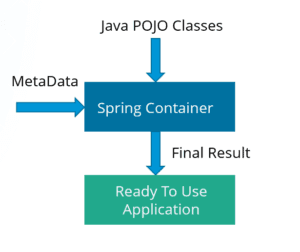
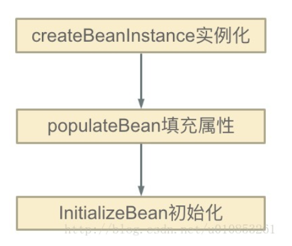
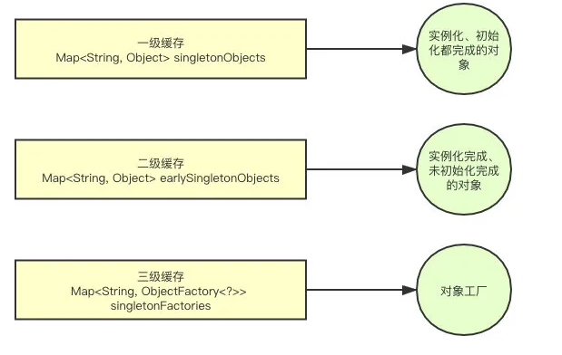
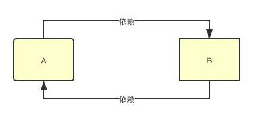
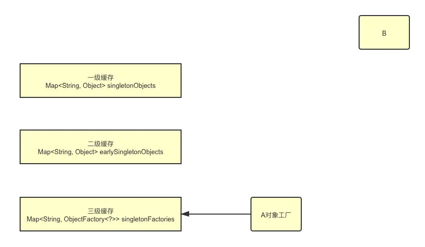
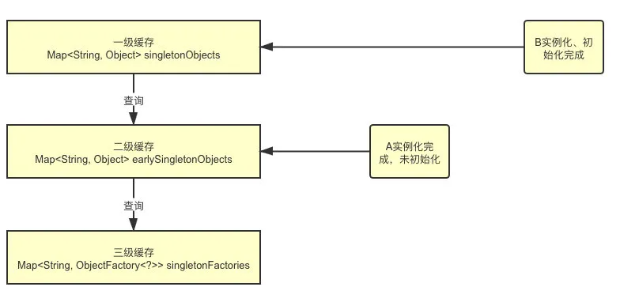
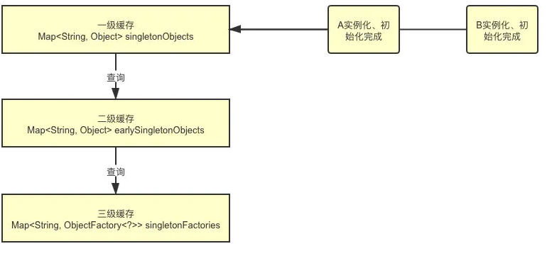
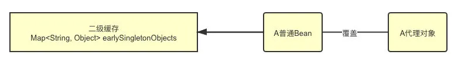

# Spring面试题

## Spring框架的介绍

- Spring框架管理这些Bean的创建工作，即由用户管理Bean转变为框架管理Bean，这个就叫**控制反转 - Inversion of Control (IoC)**
- Spring 框架托管创建的Bean放在哪里呢？ 这便是**IoC Container**;
- Spring 框架为了更好让用户配置Bean，必然会引入**不同方式来配置Bean？ 这便是xml配置，Java配置，注解配置**等支持
- Spring 框架既然接管了Bean的生成，必然需要**管理整个Bean的生命周期**等；
- 应用程序代码从Ioc Container中获取依赖的Bean，注入到应用程序中，这个过程叫 **依赖注入(Dependency Injection，DI)** ； 所以说控制反转是通过依赖注入实现的，其实它们是同一个概念的不同角度描述。通俗来说就是**IoC是设计思想，DI是实现方式**
- 在依赖注入时，有哪些方式呢？这就是构造器方式，@Autowired, @Resource, @Qualifier... 同时Bean之间存在依赖（可能存在先后顺序问题，以及**循环依赖问题**等）
- Spring 框架通过定义切面, 通过拦截切点实现了不同业务模块的解耦，这个就叫**面向切面编程 - Aspect Oriented Programming (AOP)**
- 为什么@Aspect注解使用的是aspectj的jar包呢？这就引出了**Aspect4J和Spring AOP的历史渊源**，只有理解了Aspect4J和Spring的渊源才能理解有些注解上的兼容设计
- 如何支持**更多拦截方式**来实现解耦， 以满足更多场景需求呢？ 这就是@Around, @Pointcut... 等的设计
- 那么Spring框架又是如何实现AOP的呢？ 这就引入**代理技术，分静态代理和动态代理**，动态代理又包含JDK代理和CGLIB代理等

## 使用Spring框架的好处是什么？


**轻量：**Spring 是轻量的，基本的版本大约2MB。

**控制反转**：Spring通过控制反转实现了松散耦合，对象们给出它们的依赖，而不是创建或查找依赖的对象们。

**面向切面的编程(AOP)**：Spring支持面向切面的编程，并且把应用业务逻辑和系统服务分开。

**容器：**Spring 包含并管理应用中对象的生命周期和配置。

**MVC框架：**Spring的WEB框架是个精心设计的框架，是Web框架的一个很好的替代品。

**事务管理：**Spring 提供一个持续的事务管理接口，可以扩展到上至本地事务下至全局事务（JTA）。

**异常处理：**Spring 提供方便的API把具体技术相关的异常（比如由JDBC，Hibernate or JDO抛出的）转化为一致的unchecked 异常。

## 什么是 Spring框架？

**1、** Spring 是一个开源应用框架，旨在降低应用程序开发的复杂度。

**2、** 它是轻量级、松散耦合的。

**3、** 它具有分层体系结构，允许用户选择组件，同时还为 J2EE 应用程序开发提供了一个有凝聚力的框架。

**4、** 它可以集成其他框架，如 Structs、Hibernate、EJB 等，所以又称为框架的框架。

## 使用 Spring 有哪些方式？


**使用 Spring 有以下方式：**

**1、** 作为一个成熟的 Spring Web 应用程序。

**2、** 作为第三方 Web 框架，使用 Spring Frameworks 中间层。

**3、** 用于远程使用。

**4、** 作为企业级 Java Bean，它可以包装现有的 POJO（Plain Old Java Objects）。

## Spring框架的缺点?

Spring 能够给我们带来很多方便之处,但是同样也存在很多的问题:

**使用了大量的反射机制,反射机制非常占用内存。**

(一)重量级框架

我们看到 Spring 架构图时会发现 Spring 里面包含有很多其他组件,比如数据访问、MVC、事务管理、面向切点、WebSocket 功能等,因此这么复杂的组件集中到一起就会提高初学者的学习成本。还有一方面随着你的服务越多,那么 Spring 的启动就会变得越慢。

(二)集成复杂

比如我们想要使用 MyBatis 或者 MongoDB的时候,我们要做很多工作不管使用配置方式也好还是使用注解方式。

(三)配置复杂

在使用 Spring 的时候,我们更多可能是选择 XML 进行配置,但目前这种配置方式已不在流行。

(四)构建和部署复杂

启动 Spring 的 IOC 容器,是完全要依赖于第三方的 web 服务器。自身不能启动的。

## Spring中有两个重要特性是什么?

Spring中有两个非常重要的特性IOC和AOP,其中AOP是对IOC功能的拓展,

IOC:IOC是一种设计思想,就是 将原本在程序中手动创建对象的控制权,交由Spring框架来管理。负责创建对象,使用依赖注入(dependency injection,DI)管理它们,将对象集中起来,配置对象,管理对象的整个生命周期。

AOP:AOP模块用于为支持Spring应用程序面向切面的开发。AOP联盟提供了很多支持,这样就确保了Spring和其他AOP框架的共通性。面向切面编程能够将那些与业务无关,却为业务模块所共同调用的逻辑或责任(例如事务处理、日志管理、权限控制等)封装起来,便于减少系统的重复代码,降低模块间的耦合度,并有利于未来的可拓展性和可维护性。


## 什么是spring?

Spring是**一个轻量级Java开发框架**，最早有**Rod Johnson**创建，目的是为了解决企业级应用开发的业务逻辑层和其他各层的耦合问题。它是一个分层的JavaSE/JavaEE full-stack（一站式）轻量级开源框架，为开发Java应用程序提供全面的基础架构支持。Spring负责基础架构，因此Java开发者可以专注于应用程序的开发。

Spring最根本的使命是**解决企业级应用开发的复杂性，即简化Java开发**。

Spring可以做很多事情，它为企业级开发提供给了丰富的功能，但是这些功能的底层都依赖于它的两个核心特性，也就是**依赖注入（dependency injection，DI）**和**面向切面编程（aspect-oriented programming，AOP）**。

为了降低Java开发的复杂性，Spring采取了以下4种关键策略

- 基于POJO的轻量级和最小侵入性编程；
- 通过依赖注入和面向接口实现松耦合；
- 基于切面和惯例进行声明式编程；
- 通过切面和模板减少样板式代码。

## Spring框架的设计目标，设计理念，和核心是什么

**Spring设计目标**：Spring为开发者提供一个一站式轻量级应用开发平台；

**Spring设计理念**：在JavaEE开发中，支持POJO和JavaBean开发方式，使应用面向接口开发，充分支持OO（面向对象）设计方法；Spring通过IoC容器实现对象耦合关系的管理，并实现依赖反转，将对象之间的依赖关系交给IoC容器，实现解耦；

**Spring框架的核心**：IoC容器和AOP模块。通过IoC容器管理POJO对象以及他们之间的耦合关系；通过AOP以动态非侵入的方式增强服务。

IoC让相互协作的组件保持松散的耦合，而AOP编程允许你把遍布于应用各层的功能分离出来形成可重用的功能组件。

## Spring有哪些应用场景

**应用场景**：JavaEE企业应用开发，包括SSH、SSM等

**Spring价值**：

- Spring是非侵入式的框架，目标是使应用程序代码对框架依赖最小化；
- Spring提供一个一致的编程模型，使应用直接使用POJO开发，与运行环境隔离开来；
- Spring推动应用设计风格向面向对象和面向接口开发转变，提高了代码的重用性和可测试性；

## Spring由哪些模块组成？

Spring 总共大约有 20 个模块， 由 1300 多个不同的文件构成。 而这些组件被分别整合在`核心容器（Core Container）` 、 `AOP（Aspect Oriented Programming）和设备支持（Instrmentation）` 、`数据访问与集成（Data Access/Integeration）` 、 `Web`、 `消息（Messaging）` 、 `Test`等 6 个模块中。 以下是 Spring 5 的模块结构图：


- spring core：提供了框架的基本组成部分，包括控制反转（Inversion of Control，IOC）和依赖注入（Dependency Injection，DI）功能。
- spring beans：提供了BeanFactory，是工厂模式的一个经典实现，Spring将管理对象称为Bean。
- spring context：构建于 core 封装包基础上的 context 封装包，提供了一种框架式的对象访问方法。
- spring jdbc：提供了一个JDBC的抽象层，消除了烦琐的JDBC编码和数据库厂商特有的错误代码解析， 用于简化JDBC。
- spring aop：提供了面向切面的编程实现，让你可以自定义拦截器、切点等。
- spring Web：提供了针对 Web 开发的集成特性，例如文件上传，利用 servlet listeners 进行 ioc 容器初始化和针对 Web 的 ApplicationContext。
- spring test：主要为测试提供支持的，支持使用JUnit或TestNG对Spring组件进行单元测试和集成测试。

## Spring启动过程

Spring启动过程是IOC容器的启动过程，本质是创建和初始化bean工厂(BeanFactory).BeanFactory是Spring IOC的核心，Spring使用beanFactory来实例化，配置和管理bean。

对于web程序，IOC容器启动过程即是建立上下文的过程，web容器会提供一个全局的servletContext上下文环境。

其启动过程主要包含三个类，ContextLoaderListener，ContextLoader和XmlWebApplicationContext。

在web.xml中提供ContextLoaderListener上下文监听器，在web容器启动时，会触发容器初始化事件，ContextLoaderListener会监听到这个事件，从而触发ContextInitialized方法完成上下文初始化，这个方法中调用父类ContextLoader的方法完成上下文初始化。

ContextLoader类中主要完成三件事：

1）创建WebApplicationContext；

2）加载对应的Spring配置文件中的bean；（refresh方法，完成bean的加载）

3）将WebApplicationContext放入servletContext中。

ContextLoaderListener监听器初始化完之后，开始初始化web.xml中配置的servlet，如DispatcherSevlet

ContextLoaderListener监听器监听的是servletContext，当web容器初始化后，servletContext发生变化时，会触发相应事件。

## Spring容器启动后会触发的事件

- ContextClosedEvent
- ContextRefreshedEvent
- ContextStartedEvent
- ContextStoopedEvent
- RequestHandleEvent

Spring容器启动后会触发ContextRefreshedEvent事件，想要在某个类加载完毕是干某事，但用了Spring管理对象，这个类又引用了其他类，比较复杂，可以写一个类继承Spring的ApplicationListener监听并监控ContextRefreshedEvent事件。

## Spring 应用程序有哪些不同组件？

**Spring 应用一般有以下组件：**

**1、** 接口 - 定义功能。

**2、** Bean 类 - 它包含属性，setter 和 getter 方法，函数等。

**3、** Spring 面向切面编程（AOP） - 提供面向切面编程的功能。

**4、** Bean 配置文件 - 包含类的信息以及如何配置它们。

**5、** 用户程序 - 它使用接口。

## 什么是 Spring IOC 容器？

Spring 框架的核心是 Spring 容器。容器创建对象，将它们装配在一起，配置它们并管理它们的完整生命周期。Spring 容器使用依赖注入来管理组成应用程序的组件。容器通过读取提供的配置元数据来接收对象进行实例化，配置和组装的指令。该元数据可以通过 XML，Java 注解或 Java 代码提供。



## IOC的优点是什么？

**IOC 或 依赖注入把应用的代码量降到最低。它使应用容易测试，单元测试不再需要单例和JNDI查找机制。最小的代价和最小的侵入性使松散耦合得以实现。IOC容器支持加载服务时的饿汉式初始化和懒加载。**

- 它将**最小化应用程序中的代码量**。
- 它将使您的应用程序**易于测试**，因为它不需要单元测试用例中的任何单例或 JNDI 查找机制。
- 它**以最小的影响和最少的侵入机制促进松耦合**。
- 它**支持即时的实例化和延迟加载服务**。

## 什么是Spring IOC 容器？

控制反转即IoC \(Inversion of Control\)，它把传统上由程序代码直接操控的对象的调用权交给容器，通过容器来实现对象组件的装配和管理。所谓的“控制反转”概念就是对组件对象控制权的转移，从程序代码本身转移到了外部容器。

Spring IOC 负责创建对象，管理对象（通过依赖注入（DI），装配对象，配置对象，并且管理这些对象的整个生命周期。

## 控制反转\(IoC\)有什么作用

- **管理对象的创建和依赖关系的维护。**对象的创建并不是一件简单的事，在对象关系比较复杂时，如果依赖关系需要程序猿来维护的话，那是相当头疼的

- **解耦，由容器去维护具体的对象**

- 托管了类的产生过程，比如我们需要在类的产生过程中做一些处理，最直接的例子就是代理，如果有容器程序可以把这部分处理交给容器，应用程序则无需去关心类是如何完成代理的

## IOC的优点是什么？

- IOC 或 依赖注入把应用的代码量降到最低。
- 它使应用容易测试，单元测试不再需要单例和JNDI查找机制。
- 最小的代价和最小的侵入性使松散耦合得以实现。
- IOC容器支持加载服务时的饿汉式初始化和懒加载。

## Spring IoC 的实现机制

Spring 中的 IoC 的实现原理就是工厂模式加反射机制。

示例：

```java
interface Fruit {
   public abstract void eat();
 }

class Apple implements Fruit {
    public void eat(){
        System.out.println("Apple");
    }
}

class Orange implements Fruit {
    public void eat(){
        System.out.println("Orange");
    }
}

class Factory {
    public static Fruit getInstance(String ClassName) {
        Fruit f=null;
        try {
            f=(Fruit)Class.forName(ClassName).newInstance();
        } catch (Exception e) {
            e.printStackTrace();
        }
        return f;
    }
}

class Client {
    public static void main(String[] a) {
        Fruit f=Factory.getInstance("io.github.dunwu.spring.Apple");
        if(f!=null){
            f.eat();
        }
    }
}
```

## Spring 的 IoC支持哪些功能

Spring 的 IoC 设计支持以下功能：

- 依赖注入
- 依赖检查
- 自动装配
- 支持集合
- 指定初始化方法和销毁方法
- 支持回调某些方法（但是需要实现 Spring 接口，略有侵入）

其中，最重要的就是依赖注入，从 XML 的配置上说，即 ref 标签。对应 Spring RuntimeBeanReference 对象。

对于 IoC 来说，最重要的就是容器。容器管理着 Bean 的生命周期，控制着 Bean 的依赖注入。

## 依赖注入

- 依赖：bean对象的创建依赖于容器
- 注入：bean对象的所有属性由容器来注入

## 什么是依赖注入？可以通过多少种方式完成依赖注入？

在依赖注入中，您不必创建对象，但必须描述如何创建它们。您不是直接在代码中将组件和服务连接在一起，而是描述配置文件中哪些组件需要哪些服务。由 IoC 容器将它们装配在一起。

通常，依赖注入可以通过三种方式完成，即：

- 构造函数注入
- setter 注入
- 接口注入

在 Spring Framework 中，仅使用构造函数和 setter 注入。

## 什么是Spring的依赖注入？

控制反转IoC是一个很大的概念，可以用不同的方式来实现。其主要实现方式有两种：依赖注入和依赖查找

依赖注入：相对于IoC而言，依赖注入\(DI\)更加准确地描述了IoC的设计理念。所谓依赖注入（Dependency Injection），即组件之间的依赖关系由容器在应用系统运行期来决定，也就是由容器动态地将某种依赖关系的目标对象实例注入到应用系统中的各个关联的组件之中。组件不做定位查询，只提供普通的Java方法让容器去决定依赖关系。

## 为什么推荐构造器注入方式？

先来看看Spring在文档里怎么说：

> The Spring team generally advocates constructor injection as it enables one to implement application components as immutable objects and to ensure that required dependencies are not null. Furthermore constructor-injected components are always returned to client (calling) code in a fully initialized state.

简单的翻译一下：这个构造器注入的方式**能够保证注入的组件不可变，并且确保需要的依赖不为空**。此外，构造器注入的依赖总是能够在返回客户端（组件）代码的时候保证完全初始化的状态。

下面来简单的解释一下：

- **依赖不可变**：其实说的就是final关键字。
- **依赖不为空**（省去了我们对其检查）：当要实例化UserServiceImpl的时候，由于自己实现了有参数的构造函数，所以不会调用默认构造函数，那么就需要Spring容器传入所需要的参数，所以就两种情况：1、有该类型的参数->传入，OK 。2：无该类型的参数->报错。
- **完全初始化的状态**：这个可以跟上面的依赖不为空结合起来，向构造器传参之前，要确保注入的内容不为空，那么肯定要调用依赖组件的构造方法完成实例化。而在Java类加载实例化的过程中，构造方法是最后一步（之前如果有父类先初始化父类，然后自己的成员变量，最后才是构造方法），所以返回来的都是初始化之后的状态。

## 如何理解控制反转IoC和依赖注入DI？

**IOC就是控制反转，通俗的说就是我们不用自己创建实例对象，这些都交给Spring的bean工厂帮我们创建管理。**这也是Spring的核心思想，通过面向接口编程的方式来是实现对业务组件的动态依赖。这就意味着IOC是Spring针对解决程序耦合而存在的。在实际应用中，Spring通过配置文件（xml或者properties）指定需要实例化的java类（类名的完整字符串），包括这些java类的一组初始化值，通过加载读取配置文件，用Spring提供的方法（getBean()）就可以获取到我们想要的根据指定配置进行初始化的实例对象。

- 优点：IOC或依赖注入减少了应用程序的代码量。它使得应用程序的测试很简单，因为在单元测试中不再需要单例或JNDI查找机制。简单的实现以及较少的干扰机制使得松耦合得以实现。IOC容器支持勤性单例及延迟加载服务。

**DI：DI—Dependency Injection**，即**“依赖注入”：组件之间依赖关系由容器在运行期决定**，形象的说，**即由容器动态的将某个依赖关系注入到组件之中**。依赖注入的目的并非为软件系统带来更多功能，而是为了提升组件重用的频率，并为系统搭建一个灵活、可扩展的平台。通过依赖注入机制，我们只需要通过简单的配置，而无需任何代码就可指定目标需要的资源，完成自身的业务逻辑，而不需要关心具体的资源来自何处，由谁实现。

## 依赖注入的基本原则

依赖注入的基本原则是：应用组件不应该负责查找资源或者其他依赖的协作对象。配置对象的工作应该由IoC容器负责，“查找资源”的逻辑应该从应用组件的代码中抽取出来，交给IoC容器负责。容器全权负责组件的装配，它会把符合依赖关系的对象通过属性（JavaBean中的setter）或者是构造器传递给需要的对象。

## 依赖注入有什么优势

依赖注入之所以更流行是因为它是一种更可取的方式：让容器全权负责依赖查询，受管组件只需要暴露JavaBean的setter方法或者带参数的构造器或者接口，使容器可以在初始化时组装对象的依赖关系。其与依赖查找方式相比，主要优势为：

- 查找定位操作与应用代码完全无关。
- 不依赖于容器的API，可以很容易地在任何容器以外使用应用对象。
- 不需要特殊的接口，绝大多数对象可以做到完全不必依赖容器。

## 有哪些不同类型的依赖注入实现方式？

依赖注入是时下最流行的IoC实现方式，依赖注入分为接口注入（Interface Injection），Setter方法注入（Setter Injection）和构造器注入（Constructor Injection）三种方式。其中接口注入由于在灵活性和易用性比较差，现在从Spring4开始已被废弃。

**构造器依赖注入**：构造器依赖注入通过容器触发一个类的构造器来实现的，该类有一系列参数，每个参数代表一个对其他类的依赖。

**Setter方法注入**：Setter方法注入是容器通过调用无参构造器或无参static工厂 方法实例化bean之后，调用该bean的setter方法，即实现了基于setter的依赖注入。

## 什么是 spring 装配

当 bean 在 Spring 容器中组合在一起时，它被称为装配或 bean 装配。

Spring 容器需要知道需要什么 bean 以及容器应该如何使用依赖注入来将 bean 绑定在一起，同时装配 bean。

## 什么是bean的自动装配？

在Spring框架中，在配置文件中设定bean的依赖关系是一个很好的机制，Spring 容器能够自动装配相互合作的bean，这意味着容器不需要和配置，能通过Bean工厂自动处理bean之间的协作。这意味着 Spring可以通过向Bean Factory中注入的方式自动搞定bean之间的依赖关系。自动装配可以设置在每个bean上，也可以设定在特定的bean上。

## 自动装配有哪些方式？

**1、** no - 这是默认设置，表示没有自动装配。 应使用显式 bean 引用进行装配。

**2、** byName - 它根据 bean 的名称注入对象依赖项。 它匹配并装配其属性与 XML 文件中由相同名称定义的 bean。

**3、** byType - 它根据类型注入对象依赖项。 如果属性的类型与 XML 文件中的一个 bean 名称匹配，则匹配并装配属性。

**4、** 构造函数 - 它通过调用类的构造函数来注入依赖项。 它有大量的参数。

**5、** autodetect - 首先容器尝试通过构造函数使用 autowire 装配，如果不能，则尝试通过 byType 自动装配。

## 使用@Autowired注解自动装配的过程是怎样的？

使用@Autowired注解来自动装配指定的bean。在使用@Autowired注解之前需要在Spring配置文件进行配置，\<context:annotation-config />。

在启动spring IoC时，容器自动装载了一个AutowiredAnnotationBeanPostProcessor后置处理器，当容器扫描到@Autowied、@Resource或@Inject时，就会在IoC容器自动查找需要的bean，并装配给该对象的属性。在使用@Autowired时，首先在容器中查询对应类型的bean：

- 如果查询结果刚好为一个，就将该bean装配给@Autowired指定的数据；

- 如果查询的结果不止一个，那么@Autowired会根据名称来查找；

- 如果上述查找的结果为空，那么会抛出异常。解决方法时，使用required=false。

## 自动装配有哪些局限性？

**重写**：你仍需用 和 配置来定义依赖，意味着总要重写自动装配。

**基本数据类型**：你不能自动装配简单的属性，如基本数据类型，String字符串，和类。

**模糊特性**：自动装配不如显式装配精确，如果有可能，建议使用显式装配。

- 覆盖的可能性 - 您始终可以使用 `<constructor-arg>` 和 `<property>` 设置指定依赖项，这将覆盖自动装配。
- 基本元数据类型 - **简单属性（如原数据类型，字符串和类）无法自动装配。**
- 令人困惑的性质 - **总是喜欢使用明确的装配，因为自动装配不太精确。**

## spring bean 容器的生命周期是什么样的？


spring bean 容器的生命周期流程如下：

- Spring 容器根据配置中的 bean 定义中实例化 bean。
- Spring 使用依赖注入填充所有属性，如 bean 中所定义的配置。
- 如果 bean 实现 BeanNameAware 接口，则工厂通过传递 bean 的 ID 来调用 setBeanName()。
- 如果 bean 实现 BeanFactoryAware 接口，工厂通过传递自身的实例来调用 setBeanFactory()。
- 如果存在与 bean 关联的任何 BeanPostProcessors，则调用 preProcessBeforeInitialization() 方法。
- 如果为 bean 指定了 init 方法（ 的 init-method 属性），那么将调用它。
- 最后，如果存在与 bean 关联的任何 BeanPostProcessors，则将调用 postProcessAfterInitialization() 方法。
- 如果 bean 实现 DisposableBean 接口，当 spring 容器关闭时，会调用 destory()。
- 如果为 bean 指定了 destroy 方法（ 的 destroy-method 属性），那么将调用它。

## 什么是AOP

OOP\(Object-Oriented Programming\)面向对象编程，允许开发者定义纵向的关系，但并适用于定义横向的关系，导致了大量代码的重复，而不利于各个模块的重用。

AOP\(Aspect-Oriented Programming\)，一般称为面向切面编程，作为面向对象的一种补充，用于将那些与业务无关，但却对多个对象产生影响的公共行为和逻辑，抽取并封装为一个可重用的模块，这个模块被命名为“切面”（Aspect），减少系统中的重复代码，降低了模块间的耦合度，同时提高了系统的可维护性。可用于权限认证、日志、事务处理等。

AOP(Aspect-Oriented Programming), 即 **面向切面编程**, 它与 OOP( Object-Oriented Programming, 面向对象编程) 相辅相成, 提供了与 OOP 不同的抽象软件结构的视角.
在 OOP 中, 我们以类(class)作为我们的基本单元, 而 AOP 中的基本单元是 **Aspect(切面)**

## AOP 有哪些实现方式？

实现 AOP 的技术，主要分为两大类：

- 静态代理 - 指使用 AOP 框架提供的命令进行编译，从而在编译阶段就可生成 AOP 代理类，因此也称为编译时增强；
  - 编译时编织（特殊编译器实现）
  - 类加载时编织（特殊的类加载器实现）。
- 动态代理 - 在运行时在内存中“临时”生成 AOP 动态代理类，因此也被称为运行时增强。
  - `JDK` 动态代理：通过反射来接收被代理的类，并且要求被代理的类必须实现一个接口 。JDK 动态代理的核心是 InvocationHandler 接口和 Proxy 类 。
  - `CGLIB`动态代理： 如果目标类没有实现接口，那么 `Spring AOP` 会选择使用 `CGLIB` 来动态代理目标类 。`CGLIB` （ Code Generation Library ），是一个代码生成的类库，可以在运行时动态的生成某个类的子类，注意， `CGLIB` 是通过继承的方式做的动态代理，因此如果某个类被标记为 `final` ，那么它是无法使用 `CGLIB` 做动态代理的。

## spring AOP的核心概念

使用的是代理模式，如果代理的是一个接口的话，就用java动态代理，如果是其他的类，使用CGLIB。

**核心概念**

1. 切面：对横切关注点的抽象
2. 横切关注点：对哪些方法进行拦截，拦截后怎么处理。
3. 连接点：被拦截到的点
4. 切入点
5. 通知：前置，后置，异常，最终，环绕通知
6. 目标对象：代理的目标对象。
7. 织入：将切面应用到目标对象并导致代理对象创建的过程。
8. 引入：不修改代码的前提下，引入可以在运行期为类动态地添加一些方法或字段。

## 解释一下Spring AOP里面的几个名词：切面（Aspect）、连接点（Join point）、通知（Advice）、切入点（Pointcut）、引入（Introduction）、目标对象（Target Object）、织入（Weaving）

（1）切面（Aspect）：切面是通知和切点的结合。通知和切点共同定义了切面的全部内容。 在Spring AOP中，切面可以使用通用类（基于模式的风格） 或者在普通类中以 @AspectJ 注解来实现。

（2）连接点（Join point）：指方法，在Spring AOP中，一个连接点 总是 代表一个方法的执行。 应用可能有数以千计的时机应用通知。这些时机被称为连接点。连接点是在应用执行过程中能够插入切面的一个点。这个点可以是调用方法时、抛出异常时、甚至修改一个字段时。切面代码可以利用这些点插入到应用的正常流程之中，并添加新的行为。

（3）通知（Advice）：在AOP术语中，切面的工作被称为通知。

（4）切入点（Pointcut）：切点的定义会匹配通知所要织入的一个或多个连接点。我们通常使用明确的类和方法名称，或是利用正则表达式定义所匹配的类和方法名称来指定这些切点。

（5）引入（Introduction）：引入允许我们向现有类添加新方法或属性。

（6）目标对象（Target Object）： 被一个或者多个切面（aspect）所通知（advise）的对象。它通常是一个代理对象。也有人把它叫做 被通知（adviced） 对象。 既然Spring AOP是通过运行时代理实现的，这个对象永远是一个 被代理（proxied） 对象。

（7）织入（Weaving）：织入是把切面应用到目标对象并创建新的代理对象的过程。在目标对象的生命周期里有多少个点可以进行织入：

- 编译期：切面在目标类编译时被织入。AspectJ的织入编译器是以这种方式织入切面的。
- 类加载期：切面在目标类加载到JVM时被织入。需要特殊的类加载器，它可以在目标类被引入应用之前增强该目标类的字节码。AspectJ5的加载时织入就支持以这种方式织入切面。
- 运行期：切面在应用运行的某个时刻被织入。一般情况下，在织入切面时，AOP容器会为目标对象动态地创建一个代理对象。SpringAOP就是以这种方式织入切面。

## 什么是切面 Aspect？

aspect 由 pointcount 和 advice 组成，切面是通知和切点的结合。 它既包含了横切逻辑的定义, 也包括了连接点的定义. Spring AOP 就是负责实施切面的框架, 它将切面所定义的横切逻辑编织到切面所指定的连接点中.  
AOP 的工作重心在于如何将增强编织目标对象的连接点上, 这里包含两个工作:

- 如何通过 pointcut 和 advice 定位到特定的 joinpoint 上
- 如何在 advice 中编写切面代码.

**可以简单地认为, 使用 @Aspect 注解的类就是切面.**

## 什么是 AOP 通知

**通知是个在方法执行前或执行后要做的动作，实际上是程序执行时要通过SpringAOP框架触发的代码段。**

Spring切面可以应用五种类型的通知：

**1、** before：前置通知，在一个方法执行前被调用。

**2、** after: 在方法执行之后调用的通知，无论方法执行是否成功。

**3、** after-returning: 仅当方法成功完成后执行的通知。

**4、** after-throwing: 在方法抛出异常退出时执行的通知。

**5、** around: 在方法执行之前和之后调用的通知。

## 同一个切面aspect，不同通知advice的执行顺序：

- 没有异常情况下的执行顺序：

```
around before advice
before advice 
target method 执行 
around after advice 
after advice 
afterReturning
```

- 有异常情况下的执行顺序：

```
around before advice 
before advice 
target method 执行 
around after advice 
after advice 
afterThrowing:异常发生 
java.lang.RuntimeException: 异常发生
```

## 在Spring AOP 中，关注点和横切关注的区别是什么？在 spring aop 中 concern 和 cross-cutting concern 的不同之处

关注点（concern）是应用中一个模块的行为，一个关注点可能会被定义成一个我们想实现的一个功能。

横切关注点（cross-cutting concern）是一个关注点，此关注点是整个应用都会使用的功能，并影响整个应用，比如日志，安全和数据传输，几乎应用的每个模块都需要的功能。因此这些都属于横切关注点。

## Spring AOP and AspectJ AOP 有什么区别？

AOP实现的关键在于 代理模式，AOP代理主要分为静态代理和动态代理。静态代理的代表为AspectJ；动态代理则以Spring AOP为代表。

（1）AspectJ是静态代理的增强，所谓静态代理，就是AOP框架会在编译阶段生成AOP代理类，因此也称为编译时增强，他会在编译阶段将AspectJ\(切面\)织入到Java字节码中，运行的时候就是增强之后的AOP对象。

（2）Spring AOP使用的动态代理，所谓的动态代理就是说AOP框架不会去修改字节码，而是每次运行时在内存中临时为方法生成一个AOP对象，这个AOP对象包含了目标对象的全部方法，并且在特定的切点做了增强处理，并回调原对象的方法。

## 解释AOP模块 


AOP模块用于发给我们的Spring应用做面向切面的开发， 很多支持由AOP联盟提供，这样就确保了Spring和其他AOP框架的共通性。这个模块将元数据编程引入Spring。

## 什么是 AOP 引入? 

**引入允许我们在已存在的类中增加新的方法和属性。**


## 什么是 AOP什么是目标对象?


被一个或者多个切面所通知的对象。它通常是一个代理对象。也指被通知（advised）对象。

## Spring 事务实现方式有哪些？

- 编程式事务管理：这意味着你可以通过编程的方式管理事务，这种方式带来了很大的灵活性，但很难维护。
- 声明式事务管理：这种方式意味着你可以将事务管理和业务代码分离。你只需要通过注解或者XML配置管理事务。

## Spring支持的事务管理类型?

编程式事务,在代码中硬编码。(不推荐使用)

声明式事务,在配置文件中配置(推荐使用)

声明式事务又分为两种:

1. 基于XML的声明式事务
2. 基于注解的声明式事务

## Spring框架的事务管理有哪些优点？

- 它提供了跨不同事务api（如JTA、JDBC、Hibernate、JPA和JDO）的一致编程模型。

- 它为编程事务管理提供了比JTA等许多复杂事务API更简单的API。

- 它支持声明式事务管理。

- 它很好地集成了Spring的各种数据访问抽象。

## spring事务定义的传播规则

**事务传播行为**：当事务方法被另一个事务方法调用是，必须指定事务应该如何传播。

 **支持当前事务的情况：**

- TransactionDefinition.PROPAGATION_REQUIRED： 如果当前存在事务，则加入该事务；如果当前没有事务，则创建一个新的事务。
- TransactionDefinition.PROPAGATION_SUPPORTS： 如果当前存在事务，则加入该事务；如果当前没有事务，则以非事务的方式继续运行。
- TransactionDefinition.PROPAGATION_MANDATORY： 如果当前存在事务，则加入该事务；如果当前没有事务，则抛出异常。（mandatory：强制性）

**不支持当前事务的情况：**

- TransactionDefinition.PROPAGATION_REQUIRES_NEW： 创建一个新的事务，如果当前存在事务，则把当前事务挂起。
- TransactionDefinition.PROPAGATION_NOT_SUPPORTED： 以非事务方式运行，如果当前存在事务，则把当前事务挂起。
- TransactionDefinition.PROPAGATION_NEVER： 以非事务方式运行，如果当前存在事务，则抛出异常。

**其他情况：**

- TransactionDefinition.PROPAGATION_NESTED： 如果当前存在事务，则创建一个事务作为当前事务的嵌套事务来运行；如果当前没有事务，则该取值等价于TransactionDefinition.PROPAGATION_REQUIRED。

## Spring 事务中的隔离级别有哪几种?

TransactionDefinition 接口中定义了五个表示隔离级别的常量:

- TransactionDefinition.ISOLATION_DEFAULT: 使用后端数据库默认的隔离级别,Mysql 默认采用的 REPEATABLE_READ隔离级别 Oracle 默认采用的READ_COMMITTED隔离级别.

- TransactionDefinition.ISOLATION_READ_UNCOMMITTED: 最低的隔离级别,允许读取尚未提交的数据变更,可能会导致脏读、幻读或不可重复读

- TransactionDefinition.ISOLATION_READ_COMMITTED: 允许读取并发事务已经提交的数据,可以阻止脏读,但是幻读或不可重复读仍有可能发生

- TransactionDefinition.ISOLATION_REPEATABLE_READ: 对同一字段的多次读取结果都是一致的,除非数据是被本身事务自己所修改,可以阻止脏读和不可重
  复读,但幻读仍有可能发生。

- TransactionDefinition.ISOLATION_SERIALIZABLE: 最高的隔离级别,完全服从ACID的隔离级别。所有的事务依次逐个执行,这样事务之间就完全不可能产生
  干扰,也就是说,该级别可以防止脏读、不可重复读以及幻读。但是这将严重影响程序的性能。通常情况下也不会用到该级别。

## spring事务失效的场景

**@Transaction失效场景**：

1. 注解加在了非public方法上。
2. 注解属性设置错误，就是事务传播行为设置了PROPAGATION_NOT_SUPPORTED这类的。
3. rollbackFor设置错误，抛出异常不用处理到。
4. 同一个类方法调用，导致失效，例如类有A/B两个方法，B加了注解，A调B，则会事务失效。
5. 异常被catch掉了，所以不抛出异常不处理事务。
6. 数据库引擎不支持事务。
7. 多数据源下没有设置datasource。

## Spring事务的实现方式和实现原理

Spring事务的本质其实就是数据库对事务的支持，没有数据库的事务支持，spring是无法提供事务功能的。真正的数据库层的事务提交和回滚是通过binlog或者redo log实现的。

## Spring框架的事务管理有哪些优点？

- 为不同的事务API 如 JTA，JDBC，Hibernate，JPA 和JDO，提供一个不变的编程模式。
- 为编程式事务管理提供了一套简单的API而不是一些复杂的事务API
- 支持声明式事务管理。
- 和Spring各种数据访问抽象层很好得集成。

## 你更倾向用那种事务管理类型？

大多数Spring框架的用户选择声明式事务管理，因为它对应用代码的影响最小，因此更符合一个无侵入的轻量级容器的思想。声明式事务管理要优于编程式事务管理，虽然比编程式事务管理（这种方式允许你通过代码控制事务）少了一点灵活性。唯一不足地方是，最细粒度只能作用到方法级别，无法做到像编程式事务那样可以作用到代码块级别。

## Spring 中的 bean 的作用域有哪些?

Spring框架支持以下五种bean的作用域：

- **singleton :** bean在每个Spring ioc 容器中只有一个实例，Spring 中的 bean 默认都是单例的。。
- **prototype**：一个bean的定义可以有多个实例，每次请求都会创建一个新的 bean 实例。
- **request**：每次http请求都会创建一个bean，该bean仅在当前HTTP request内有效。。
- **session**：在一个HTTP Session中，一个bean定义对应一个实例。该作用域仅在基于web的Spring ApplicationContext情形下有效。
- **global-session**：在一个全局的HTTP Session中，一个bean定义对应一个实例。该作用域仅在基于web的Spring ApplicationContext情形下有效。Spring5已经没有了。Portlet是能够生成语义代码(例如：HTML)片段的小型Java Web插件。它们基于portlet容器，可以像servlet一样处理HTTP请求。但是，与 servlet 不同，每个 portlet 都有不同的会话。

**注意：** 缺省的Spring bean 的作用域是Singleton。使用 prototype 作用域需要慎重的思考，因为频繁创建和销毁 bean 会带来很大的性能开销。

## 将一个类声明为Spring的 bean 的注解有哪些?

我们一般使用 @Autowired 注解自动装配 bean，要想把类标识成可用于 @Autowired 注解自动装配的 bean 的类,采用以下注解可实现：

- @Component ：通用的注解，可标注任意类为 Spring 组件。如果一个Bean不知道属于哪个层，可以使用@Component 注解标注。 
  8 @Repository : 对应持久层即 Dao 层，主要用于数据库相关操作。
- @Service : 对应服务层，主要涉及一些复杂的逻辑，需要用到 Dao层。
- @Controller : 对应 Spring MVC 控制层，主要用户接受用户请求并调用 Service 层返回数据给前端页面。

## Spring 中的 bean 生命周期?

Bean的生命周期是由容器来管理的。主要在创建和销毁两个时期。


创建过程：

1，实例化bean对象，以及设置bean属性； 
2，如果通过Aware接口声明了依赖关系，则会注入Bean对容器基础设施层面的依赖，Aware接口是为了感知到自身的一些属性。容器管理的Bean一般不需要知道容器的状态和直接使用容器。但是在某些情况下是需要在Bean中对IOC容器进行操作的。这时候需要在bean中设置对容器的感知。SpringIOC容器也提供了该功能，它是通过特定的Aware接口来完成的。 
比如BeanNameAware接口，可以知道自己在容器中的名字。 
如果这个Bean已经实现了BeanFactoryAware接口，可以用这个方式来获取其它Bean。 
（如果Bean实现了BeanNameAware接口，调用setBeanName()方法，传入Bean的名字。 
如果Bean实现了BeanClassLoaderAware接口，调用setBeanClassLoader()方法，传入ClassLoader对象的实例。 
如果Bean实现了BeanFactoryAware接口，调用setBeanFactory()方法，传入BeanFactory对象的实例。） 
3，紧接着会调用BeanPostProcess的前置初始化方法postProcessBeforeInitialization，主要作用是在Spring完成实例化之后，初始化之前，对Spring容器实例化的Bean添加自定义的处理逻辑。有点类似于AOP。 
4，如果实现了BeanFactoryPostProcessor接口的afterPropertiesSet方法，做一些属性被设定后的自定义的事情。 
5，调用Bean自身定义的init方法，去做一些初始化相关的工作。 
6，调用BeanPostProcess的后置初始化方法，postProcessAfterInitialization去做一些bean初始化之后的自定义工作。 
7，完成以上创建之后就可以在应用里使用这个Bean了。

销毁过程：

当Bean不再用到，便要销毁 
1，若实现了DisposableBean接口，则会调用destroy方法； 
2，若配置了destry-method属性，则会调用其配置的销毁方法；

总结

主要把握创建过程和销毁过程这两个大的方面； 
创建过程：**首先实例化Bean，并设置Bean的属性，根据其实现的Aware接口（主要是BeanFactoryAware接口，BeanFactoryAware,ApplicationContextAware）设置依赖信息， 接下来调用BeanPostProcess的postProcessBeforeInitialization方法，完成initial前的自定义逻辑；afterPropertiesSet方法做一些属性被设定后的自定义的事情;调用Bean自身定义的init方法，去做一些初始化相关的工作;然后再调用postProcessAfterInitialization去做一些bean初始化之后的自定义工作。这四个方法的调用有点类似AOP。 此时，Bean初始化完成，可以使用这个Bean了**。 
销毁过程：**如果实现了DisposableBean的destroy方法，则调用它，如果实现了自定义的销毁方法，则调用之。** 

## 什么是 spring 的内部 bean？

**只有将 bean 用作另一个 bean 的属性时，才能将 bean 声明为内部 bean。**为了定义 bean，Spring 的基于 XML 的配置元数据在 `<property>` 或 `<constructor-arg>` 中提供了 `<bean>` 元素的使用。内部 bean 总是匿名的，它们总是作为原型。

例如，假设我们有一个 Student 类，其中引用了 Person 类。这里我们将只创建一个 Person 类实例并在 Student 中使用它。

Student.java

```java
public class Student {
    private Person person;
    //Setters and Getters
}
public class Person {
    private String name;
    private String address;
    //Setters and Getters
}
```

bean.xml

```xml
<bean id=“StudentBean" class="com.edureka.Student">
    <property name="person">
        <!--This is inner bean -->
        <bean class="com.edureka.Person">
            <property name="name" value=“Scott"></property>
            <property name="address" value=“Bangalore"></property>
        </bean>
    </property>
</bean>
```

## Spring中出现同名bean怎么办？

- **同一个配置文件内同名的Bean，以最上面定义的为准**
- **不同配置文件中存在同名Bean，后解析的配置文件会覆盖先解析的配置文件**
- 同文件中ComponentScan和@Bean出现同名Bean。同文件下@Bean的会生效，@ComponentScan扫描进来不会生效。通过@ComponentScan扫描进来的优先级是最低的，原因就是它扫描进来的Bean定义是最先被注册的。

## Spring 中的单例 bean 的线程安全问题？

当多个用户同时请求一个服务时，容器会给每一个请求分配一个线程，这时多个线程会并发执行该请求对应的业务逻辑（成员方法），此时就要注意了，如果该处理逻辑中有对单例状态的修改（体现为该单例的成员属性），则必须考虑线程同步问题。 
**线程安全问题都是由全局变量及静态变量引起的。** 
若每个线程中对全局变量、静态变量只有读操作，而无写操作，一般来说，这个全局变量是线程安全的；若有多个线程同时执行写操作，一般都需要考虑线程同步，否则就可能影响线程安全.

**无状态bean和有状态bean**

- 有状态就是有数据存储功能。有状态对象(Stateful Bean)，就是有实例变量的对象，可以保存数据，是非线程安全的。在不同方法调用间不保留任何状态。
- 无状态就是一次操作，不能保存数据。无状态对象(Stateless Bean)，就是没有实例变量的对象 .不能保存数据，是不变类，是线程安全的。

在spring中无状态的Bean适合用不变模式，就是单例模式，这样可以共享实例提高性能。有状态的Bean在多线程环境下不安全，适合用Prototype原型模式。 
Spring使用ThreadLocal解决线程安全问题。如果你的Bean有多种状态的话（比如 View Model 对象），就需要自行保证线程安全 。

## 什么是Spring beans？

Spring beans 是那些形成Spring应用的主干的java对象。它们被Spring IOC容器初始化，装配，和管理。这些beans通过容器中配置的元数据创建。比如，以XML文件中 的形式定义。

## 一个 Spring Bean 定义 包含什么？

一个Spring Bean 的定义包含容器必知的所有配置元数据，包括如何创建一个bean，它的生命周期详情及它的依赖。

## Spring基于xml注入bean的几种方式

1.  Set方法注入；
2.  构造器注入：①通过index设置参数的位置；②通过type设置参数类型；
3.  静态工厂注入；
4.  实例工厂；

## Spring框架中的单例bean是线程安全的吗？

**不是，Spring框架中的单例bean不是线程安全的。**

spring 中的 bean 默认是单例模式，spring 框架并没有对单例 bean 进行多线程的封装处理。

实际上大部分时候 spring bean 无状态的（比如 dao 类），所有某种程度上来说 bean 也是安全的，但如果 bean 有状态的话（比如 view model 对象），那就要开发者自己去保证线程安全了，最简单的就是改变 bean 的作用域，把“singleton”变更为“prototype”，这样请求 bean 相当于 new Bean\(\)了，所以就可以保证线程安全了。

- 有状态就是有数据存储功能。
- 无状态就是不会保存数据。

## 哪些是重要的bean生命周期方法？ 你能重载它们吗？

有两个重要的bean 生命周期方法，第一个是setup ， 它是在容器加载bean的时候被调用。第二个方法是 teardown 它是在容器卸载类的时候被调用。

bean 标签有两个重要的属性（init-method和destroy-method）。用它们你可以自己定制初始化和注销方法。它们也有相应的注解（\@PostConstruct和\@PreDestroy）。

## 什么是Spring的内部bean？什么是Spring inner beans？

在Spring框架中，当一个bean仅被用作另一个bean的属性时，它能被声明为一个内部bean。内部bean可以用setter注入“属性”和构造方法注入“构造参数”的方式来实现，内部bean通常是匿名的，它们的Scope一般是prototype。


## 什么是 JavaConfig？


Spring JavaConfig 是 Spring 社区的产品，Spring 3.0引入了他，它提供了配置 Spring IOC 容器的纯Java 方法。因此它有助于避免使用 XML 配置。使用 JavaConfig 的优点在于：

面向对象的配置。由于配置被定义为 JavaConfig 中的类，因此用户可以充分利用 Java 中的面向对象功能。一个配置类可以继承另一个，重写它的@Bean方法等。

减少或消除 XML 配置。基于依赖注入原则的外化配置的好处已被证明。但是，许多开发人员不希望在 XML 和 Java 之间来回切换。JavaConfig 为开发人员提供了一种纯 Java 方法来配置与 XML 配置概念相似的 Spring 容器。从技术角度来讲，只使用 JavaConfig 配置类来配置容器是可行的，但实际上很多人认为将JavaConfig 与 XML 混合匹配是理想的。

类型安全和重构友好。JavaConfig 提供了一种类型安全的方法来配置 Spring容器。由于 Java 5.0 对泛型的支持，现在可以按类型而不是按名称检索 bean，不需要任何强制转换或基于字符串的查找。

**常用的Java config：**

**@Configuration：在类上写下此注解，表示这个类是配置类**

@ComponentScan：在配置类上添加 @ComponentScan注解。**该注解默认会扫描该类所在的包下所有的配置类**，相当于之前的 <context:component-scan >。

@Bean：bean的注入：相当于以前的< bean id="objectMapper" class="org、codehaus、jackson、map、ObjectMapper" />

@EnableWebMvc：相当于xml的<mvc:annotation-driven >

@ImportResource： 相当于xml的 < import resource="applicationContext-cache、xml">

## Spring中的常用注解

- @Autowired 自动装配属性，如果不能唯一装配属性，则使用@Qualifier(value = "aaa"),来唯一指定
- @Resource  自动装配属性，可以使用@Resource(name = "cat1")来指定属性
- @Nullable  字段允许为空
- @Component 组件，写在类上，等价于`  <bean id="user" class="com.spring.pojo.User"/>`,名字默认为类名的小写
- @Value("lexiaoyuan") 属性值，相当于`<property name="name" value="lexiaoyuan" />`
- @Repository 功能与@Component一样，通常在DAO层使用
- @Service 功能与@Component一样，通常在service层使用
- @Controller 功能与@Component一样，通常在controller层使用
- @Scope("prototype") 作用域（原型)

## @Qualifier注解有什么用？

**当您创建多个相同类型的 bean 并希望仅使用属性装配其中一个 bean 时，您可以使用@Qualifier注解和 @Autowired通过指定应该装配哪个确切的 bean 来消除歧义。**

例如，这里我们分别有两个类，Employee 和 EmpAccount。在 EmpAccount 中，使用@Qualifier指定了必须装配 id 为 emp1 的 bean。

Employee.java

```
public class Employee {
    private String name;
    @Autowired
    public void setName(String name) {
        this.name=name;
    }
    public string getName() {
        return name;
    }
}
```

EmpAccount.java

```
public class EmpAccount {
    private Employee emp;

    @Autowired
    @Qualifier(emp1)
    public void showName() {
        System.out.println(“Employee name : ”+emp.getName);
    }
}
```


## 使用 Spring 访问 Hibernate 的方法有哪些？


我们可以通过两种方式使用 Spring 访问 Hibernate：

**1、** 使用 Hibernate 模板和回调进行控制反转

**2、** 扩展 HibernateDAOSupport 并应用 AOP 拦截器节点

## 如何在 spring 中启动注解装配？

**默认情况下，Spring 容器中未打开注解装配。**因此，要使用基于注解装配，我们必须通过配置 `<context：annotation-config/>` 元素在 Spring 配置文件中启用它。


## 如何解决POST请求中文乱码问题，GET的又如何处理呢？

**解决post请求乱码问题：**

在web.xml中配置一个CharacterEncodingFilter过滤器，设置成utf-8；

```
<filter>
    <filter-name>CharacterEncodingFilter</filter-name>
    <filter-class>org.springframework.web.filter.CharacterEncodingFilter</filter-class>
    <init-param>
        <param-name>encoding</param-name>
        <param-value>utf-8</param-value>
    </init-param>
</filter>
<filter-mapping>
    <filter-name>CharacterEncodingFilter</filter-name>
    <url-pattern>/*</url-pattern>
</filter-mapping>
```

**get请求中文参数出现乱码解决方法有两个：**

修改tomcat配置文件添加编码与工程编码一致，如下：

```
<ConnectorURIEncoding="utf-8" connectionTimeout="20000" port="8080" protocol="HTTP/1.1" redirectPort="8443"/>
```

**另外一种方法对参数进行重新编码：**

```
String userName = new String(request.getParamter(“userName”).getBytes(“ISO8859-1”),“utf-8”)
```

ISO8859-1是tomcat默认编码，需要将tomcat编码后的内容按utf-8编码。


## @PathVariable和@RequestParam的区别


请求路径上有个id的变量值，可以通过@PathVariable来获取 `@RequestMapping(value = “/page/{id}”, method = RequestMethod.GET)`

@RequestParam用来获得静态的URL请求入参 spring注解时action里用到。


## spring DAO 有什么用？


Spring DAO 使得 JDBC，Hibernate 或 JDO 这样的**数据访问技术更容易以一种统一的方式工作**。 这**使得用户容易在持久性技术之间切换**。 它还允许您在编写代码时，**无需考虑捕获每种技术不同的异常**。


## Spring Cache 三种常用的缓存注解和意义？

**1、** @Cacheable，用来声明方法是可缓存，将结果存储到缓存中以便后续使用相同参数调用时不需执行实际的方法，直接从缓存中取值。

**2、** @CachePut，使用 @CachePut标注的方法在执行前，不会去检查缓存中是否存在之前执行过的结果，而是每次都会执行该方法，并将执行结果以键值对的形式存入指定的缓存中。

**3、** @CacheEvict，是用来标注在需要清除缓存元素的方法或类上的，当标记在一个类上时表示其中所有的方法的执行都会触发缓存的清除操作。


## 有几种不同类型的自动代理？


BeanNameAutoProxyCreator

DefaultAdvisorAutoProxyCreator

Metadata autoproxying


## 如何理解 Spring 中的代理？


将 Advice 应用于目标对象后创建的对象称为代理。在客户端对象的情况下，目标对象和代理对象是相同的。

```
Advice + Target Object = Proxy
```


## 在 Spring中如何注入一个java集合？


Spring提供以下几种集合的配置元素：

**1、** 类型用于注入一列值，允许有相同的值。

**2、** 类型用于注入一组值，不允许有相同的值。

**3、** 类型用于注入一组键值对，键和值都可以为任意类型。

**4、** 类型用于注入一组键值对，键和值都只能为String类型。


## SpringBoot、Spring MVC 和 Spring 有什么区别？


**1、** Spring

Spring最重要的特征是依赖注入。所有 SpringModules 不是依赖注入就是 IOC 控制反转。

当我们恰当的使用 DI 或者是 IOC 的时候，我们可以开发松耦合应用。松耦合应用的单元测试可以很容易的进行。

**2、** Spring MVC

Spring MVC 提供了一种分离式的方法来开发 Web 应用。通过运用像 DispatcherServelet，MoudlAndView 和 ViewResolver 等一些简单的概念，开发 Web 应用将会变的非常简单。

**3、** SpringBoot

Spring 和 SpringMVC 的问题在于需要配置大量的参数。

SpringBoot 通过一个自动配置和启动的项来目解决这个问题。为了更快的构建产品就绪应用程序，SpringBoot 提供了一些非功能性特征。

**1、** Spring框架就像一个家族，有众多衍生产品，例如boot、mvc、jpa等等。但他们的基础都是Spring的ioc、aop。ioc提供了依赖注入的容器，aop解决了面向横切面编程，然后在此两者的基础上实现了其它延伸产品的高级功能；

**2、** springMVC是基于Servlet的一个MVC框架主要解决WEB开发的问题；

**3、** 为了简化开发的使用，从而创造性地推出了SpringBoot框架，默认优于配置


## spring JDBC API 中存在哪些类？


**1、** JdbcTemplate

**2、** SimpleJdbcTemplate

**3、** NamedParameterJdbcTemplate

**4、** SimpleJdbcInsert

**5、** SimpleJdbcCall

## 什么是REST / RESTful以及它的用途是什么？


Representational State Transfer（REST）/ RESTful Web服务是**一种帮助计算机系统通过Internet进行通信的架构风格**。这使得微服务更容易理解和实现。

微服务可以使用或不使用RESTful API实现，但使用RESTful API构建松散耦合的微服务总是更容易。


## 什么是 CSRF跨站请求伪造攻击？

**CSRF 代表跨站请求伪造**。这是一种攻击，迫使最终用户在当前通过身份验证的Web 应用程序上执行不需要的操作。**CSRF 攻击专门针对状态改变请求，而不是数据窃取，因为攻击者无法查看对伪造请求的响应。**

## 为什么我们不建议在实际的应用程序中使用 Spring Data Rest? 


我们认为 Spring Data Rest 很适合快速原型制造！在大型应用程序中使用需要谨慎。

通过 Spring Data REST 你可以把你的数据实体作为 RESTful 服务直接。

当你设计 RESTful 服务器的时候，最佳实践表明，你的接口应该考虑到两件重要的事情：

你的模型范围。

你的客户。

通过 With Spring Data REST，你不需要再考虑这两个方面，只需要作为 TEST 服务实体。

这就是为什么我们建议使用 Spring Data Rest 在快速原型构造上面，或者作为项目的初始解决方法。对于完整演变项目来说，这并不是一个好的注意。


## 如何禁用特定的自动配置类？

若发现任何不愿使用的特定自动配置类，可以使用@EnableAutoConfiguration的排除属性。

```java
//By using "exclude"
@EnableAutoConfiguration(exclude={DataSourceAutoConfiguration.class})
```

另一方面，如果类别不在类路径上，则可以使用excludeName类注解，并且指定完全限定名。

```java
//By using "excludeName"
@EnableAutoConfiguration(excludeName={Foo.class})
```

此外，SpringBoot还具有控制排除自动配置类列表的功能，可以通过使用spring.autoconfigure.exclude property来实现。可以将其添加到 propertie应用程序中，并且可以添加逗号分隔的多个类。

```java
//By using property file
spring.autoconfigure.exclude=org.springframework.boot.autoconfigure.jdbc.DataSourceAutoConfiguration
```


## REST 和RPC对比

**1、** RPC主要的缺陷是服务提供方和调用方式之间的依赖太强，需要对每一个微服务进行接口的定义，并通过持续继承发布，严格版本控制才不会出现冲突。

**2、** **REST是轻量级的接口，服务的提供和调用不存在代码之间的耦合，只需要一个约定进行规范。**


## 解释基于XML Schema方式的切面实现。


在这种情况下，切面由常规类以及基于XML的配置实现。


## 什么是代理?


代理是通知目标对象后创建的对象。从客户端的角度看，代理对象和目标对象是一样的。


## 什么是客户证书？  


客户端系统用于向远程服务器发出经过身份验证的请求的一种数字证书称为客户端证书。客户端证书在许多相互认证设计中起着非常重要的作用，为请求者的身份提供了强有力的保证。

## spring DAO 有什么用？ 


Spring DAO 使得 JDBC，Hibernate 或 JDO 这样的数据访问技术更容易以一种统一的方式工作。这使得用户容易在持久性技术之间切换。它还允许您在编写代码时，无需考虑捕获每种技术不同的异常。


## Spring的WEB模块


Spring的WEB模块是构建在application context 模块基础之上，提供一个适合web应用的上下文。这个模块也包括支持多种面向web的任务，如透明地处理多个文件上传请求和程序级请求参数的绑定到你的业务对象。它也有对Jakarta Struts的支持。


## spring 提供了哪些配置方式？


bean 所需的依赖项和服务在 XML 格式的配置文件中指定。 这些配置文件通常包含许多 bean 定义和特定于应用程序的配置选项。 它们通常以 bean 标签开头。

**例如：**

```
<bean id="studentbean" class="org.edureka.firstSpring.StudentBean">
     <property name="name" value="Edureka"></property>
</bean>
```

**基于注解配置**

您可以通过在相关的类，方法或字段声明上使用注解，将 bean 配置为组件类本身，而不是使用 XML 来描述 bean 装配。 默认情况下，Spring 容器中未打开注解装配。 因此，您需要在使用它之前在 Spring 配置文件中启用它。 例如：

context:annotation-config/

Spring 的 Java 配置是通过使用@Bean和 @Configuration来实现。

@Bean 注解扮演与 元素相同的角色。 @Configuration类允许通过简单地调用同一个类中的其他@Bean 方法来定义 bean 间依赖关系。

**例如：**

```
public class StudentConfig {
    @Bean
    public StudentBean myStudent() {
        return new StudentBean();
    }
}
```


## shiro和oauth还有cas他们之间的关系是什么？问下您公司权限是如何设计，还有就是这几个概念的区别。


cas和oauth是一个解决单点登录的组件，shiro主要是负责权限安全方面的工作，所以功能点不一致。但往往需要单点登陆和权限控制一起来使用，所以就有 cas+shiro或者oauth+shiro这样的组合。

token一般是客户端登录后服务端生成的令牌，每次访问服务端会进行校验，一般保存到内存即可，也可以放到其他介质；Redis可以做Session共享，如果前端web服务器有几台负载，但是需要保持用户登录的状态，这场景使用比较常见。

我们公司使用oauth+shiro这样的方式来做后台权限的管理，oauth负责多后台统一登录认证，shiro负责给登录用户赋予不同的访问权限。


## ApplicationContext通常的实现是什么?


**1、** FileSystemXmlApplicationContext ：此容器从一个XML文件中加载beans的定义，XML Bean 配置文件的全路径名必须提供给它的构造函数。

**2、** ClassPathXmlApplicationContext：此容器也从一个XML文件中加载beans的定义，这里，你需要正确设置classpath因为这个容器将在classpath里找bean配置。

**3、** WebXmlApplicationContext：此容器加载一个XML文件，此文件定义了一个WEB应用的所有bean。


## 什么是Spring Profiles？


Spring Profiles允许用户根据配置文件（dev，test，prod等）来注册bean。因此，当应用程序在开发中运行时，只有某些bean可以加载，而在PRODUCTION中，某些其他bean可以加载。假设我们的要求是Swagger文档仅适用于QA环境，并且禁用所有其他文档。这可以使用配置文件来完成。SpringBoot使得使用配置文件非常简单。


## @Required 注解


这个注解表明bean的属性必须在配置的时候设置，通过一个bean定义的显式的属性值或通过自动装配，若@Required注解的bean属性未被设置，容器将抛出BeanInitializationException。


## 什么是自动配置？


Spring 和 SpringMVC 的问题在于需要配置大量的参数。

我们能否带来更多的智能？当一个 MVC JAR 添加到应用程序中的时候，我们能否自动配置一些 beans？

Spring 查看（CLASSPATH 上可用的框架）已存在的应用程序的配置。**在此基础上，SpringBoot 提供了配置应用程序和框架所需要的基本配置。这就是自动配置。**

## 什么是 Spring 配置文件？


Spring 配置文件是 XML 文件。 该文件主要包含类信息。 它描述了这些类是如何配置以及相互引入的。 但是，XML 配置文件冗长且更加干净。 如果没有正确规划和编写，那么在大项目中管理变得非常困难。


## 如何启用/禁用执行器？


启用/禁用致动器很容易；最简单的方法是使特性能够将依赖项(Maven/Gradle)添加到spring-boot-starter-actuator，即启动器。**如果不想启用致动器，那么就不要添加依赖项。**

Maven依赖项：

```
<dependencies>
    <dependency>
        <groupId>org.springframework.boot</groupId>
        <artifactId>spring-boot-starter-actuator</artifactId>
    </dependency>
</dependencies>
```


## @LoadBalanced注解的作用

**开启客户端负载均衡。**


## 解释对象/关系映射集成模块。 


Spring 通过提供ORM模块，支持我们在直接JDBC之上使用一个对象/关系映射映射(ORM)工具，Spring 支持集成主流的ORM框架，如Hiberate,JDO和 iBATIS SQL Maps。Spring的事务管理同样支持以上所有ORM框架及JDBC。


## bootstrap.yml和application.yml有什么区别?


**1、** Spring Cloud 构建于 SpringBoot 之上，在 SpringBoot 中有两种上下文，一种是 bootstrap，另外一种是 application。

**2、** application 配置文件这个容易理解，主要用于 SpringBoot 项目的`自动化配置`。

**3、** **bootstrap 是应用程序的父上下文，也就是说 `bootstrap 加载优先于 applicaton`。**

**4、** **bootstrap 主要用于从`额外的资源来加载配置信息`，还可以在本地外部配置文件中解密属性。**

**5、** 这两个上下文`共用一个环境`，它是任何Spring应用程序的外部属性的来源。

**6、** bootstrap 里面的属性会`优先加载`，它们默认也不能被本地相同配置覆盖。

**7、** boostrap 由父 ApplicationContext 加载，`比 applicaton 优先加载`

**8、** boostrap 里面的属性`不能被覆盖`


## 什么是Spring Initializer?


这个问题并不难，但面试官总是以此测试候选人的专业知识。

**Spring Initializer是一个网络应用程序，它可以生成一个SpringBoot项目，包含快速启动所需的一切。和往常一样，我们需要一个好的项目框架；它有助于你正确创建项目结构/框架。**


## 什么是YAML?


YAML是一种人类可读的数据序列化语言。它通常用于`配置文件`。 与属性文件相比，如果我们想要在配置文件中添加复杂的属性，YAML文件就更加结构化，而且更少混淆。可以看出YAML具有`分层配置数据`。

## 什么是WebSockets？


WebSocket是一种计算机通信协议，通过单个TCP连接提供全双工通信信道。

**1、** WebSocket是双向的 -使用WebSocket客户端或服务器可以发起消息发送。

**2、** WebSocket是全双工的 -客户端和服务器通信是相互独立的。

**3、** 单个TCP连接 -初始连接使用HTTP，然后将此连接升级到基于套接字的连接。然后这个单一连接用于所有未来的通信

**4、** Light -与http相比，WebSocket消息数据交换要轻得多。

## 区分 BeanFactory 和 ApplicationContext？

| BeanFactory                | ApplicationContext       |
| -------------------------- | ------------------------ |
| 它使用懒加载               | 它使用即时加载           |
| 它使用语法显式提供资源对象 | 它自己创建和管理资源对象 |
| 不支持国际化               | 支持国际化               |
| 不支持基于依赖的注解       | 支持基于依赖的注解       |

BeanFactory和ApplicationContext的优缺点分析：

BeanFactory的优缺点：

- 优点：应用启动的时候占用资源很少，对资源要求较高的应用，比较有优势；
- 缺点：运行速度会相对来说慢一些。而且有可能会出现空指针异常的错误，而且通过Bean工厂创建的Bean生命周期会简单一些。

ApplicationContext的优缺点：

- 优点：所有的Bean在启动的时候都进行了加载，系统运行的速度快；在系统启动的时候，可以发现系统中的配置问题。
- 缺点：把费时的操作放到系统启动中完成，所有的对象都可以预加载，缺点就是内存占用较大。

## 区分构造函数注入和 setter 注入

| 构造函数注入               | setter 注入                |
| -------------------------- | -------------------------- |
| 没有部分注入               | 有部分注入                 |
| 不会覆盖 setter 属性       | 会覆盖 setter 属性         |
| 任意修改都会创建一个新实例 | 任意修改不会创建一个新实例 |
| 适用于设置很多属性         | 适用于设置少量属性         |

两种依赖方式都可以使用，构造器注入和Setter方法注入。最好的解决方案是用构造器参数实现强制依赖，setter方法实现可选依赖。

## spring 提供了哪些配置方式？

- 基于 xml 配置

bean 所需的依赖项和服务在 XML 格式的配置文件中指定。这些配置文件通常包含许多 bean 定义和特定于应用程序的配置选项。它们通常以 bean 标签开头。例如：

```xml
<bean id="studentbean" class="org.edureka.firstSpring.StudentBean">
 <property name="name" value="Edureka"></property>
</bean>
```

- 基于注解配置

您可以通过在相关的类，方法或字段声明上使用注解，将 bean 配置为组件类本身，而不是使用 XML 来描述 bean 装配。默认情况下，Spring 容器中未打开注解装配。因此，您需要在使用它之前在 Spring 配置文件中启用它。例如：

```xml
<beans>
<context:annotation-config/>
<!-- bean definitions go here -->
</beans>
```

- 基于 Java API 配置

Spring 的 Java 配置是通过使用 @Bean 和 @Configuration 来实现。

1. @Bean 注解扮演与 `<bean />` 元素相同的角色。
2. @Configuration 类允许通过简单地调用同一个类中的其他 @Bean 方法来定义 bean 间依赖关系。

例如：

```java
@Configuration
public class StudentConfig {
    @Bean
    public StudentBean myStudent() {
        return new StudentBean();
    }
}
```

## Spring 怎么解决循环依赖问题？

spring对循环依赖的处理有三种情况： 
①构造器的循环依赖：这种依赖spring是处理不了的，直接抛出BeanCurrentlylnCreationException异常。 
②单例模式下的setter循环依赖：通过“三级缓存”处理循环依赖。 
③非单例循环依赖：无法处理。

下面分析单例模式下的setter循环依赖如何解决

Spring的单例对象的初始化主要分为三步： 


（1）createBeanInstance：实例化，其实也就是调用对象的构造方法实例化对象

（2）populateBean：填充属性，这一步主要是多bean的依赖属性进行填充

（3）initializeBean：调用spring xml中的init 方法。

从上面讲述的单例bean初始化步骤我们可以知道，循环依赖主要发生在第一、第二部。也就是构造器循环依赖和field循环依赖。


举例：A的某个field或者setter依赖了B的实例对象，同时B的某个field或者setter依赖了A的实例对象”这种循环依赖的情况。A首先完成了

初始化的第一步（createBeanINstance实例化），并且将自己提前曝光到singletonFactories中。

此时进行初始化的第二步，发现自己依赖对象B，此时就尝试去get(B)，发现B还没有被create，所以走create流程，B在初始化第一步的时候发现自己依赖了对象A，于是尝试get(A)，尝试一级缓存singletonObjects(肯定没有，因为A还没初始化完全)，尝试二级缓存earlySingletonObjects（也没有），尝试三级缓存singletonFactories，由于A通过ObjectFactory将自己提前曝光了，所以B能够通过

ObjectFactory.getObject拿到A对象(虽然A还没有初始化完全，但是总比没有好呀)，B拿到A对象后顺利完成了初始化阶段1、2、3，完全初始化之后将自己放入到一级缓存singletonObjects中。

此时返回A中，A此时能拿到B的对象顺利完成自己的初始化阶段2、3，最终A也完成了初始化，进去了一级缓存singletonObjects中，而且更加幸运的是，由于B拿到了A的对象引用，所以B现在hold住的A对象完成了初始化。

## Spring 框架中用到了哪些设计模式？

**工厂设计模式** : Spring使用工厂模式通过 `BeanFactory`、`ApplicationContext` 创建 bean 对象。

**代理设计模式** : Spring AOP 功能的实现。

**单例设计模式** : Spring 中的 Bean 默认都是单例的。

**模板方法模式** : Spring 中 `jdbcTemplate`、`hibernateTemplate` 等以 Template 结尾的对数据库操作的类，它们就使用到了模板模式。

**包装器设计模式** : 我们的项目需要连接多个数据库，而且不同的客户在每次访问中根据需要会去访问不同的数据库。这种模式让我们可以根据客户的需求能够动态切换不同的数据源。

**观察者模式:** Spring 事件驱动模型就是观察者模式很经典的一个应用。

**适配器模式** :Spring AOP 的增强或通知(Advice)使用到了适配器模式、spring MVC 中也是用到了适配器模式适配`Controller`。

## Spring 、Spring Boot 和 Spring Cloud 的关系?

Spring 最初最核心的两大核心功能 Spring Ioc 和 Spring Aop 成就了 Spring，Spring 在这两大核心的功能上不断的发展，才有了 Spring 事务、Spring Mvc 等一系列伟大的产品，最终成就了 Spring 帝国，到了后期 Spring 几乎可以解决企业开发中的所有问题。

Spring Boot 是在强大的 Spring 帝国生态基础上面发展而来，发明 Spring Boot 不是为了取代 Spring ,是为了让人们更容易的使用 Spring 。

Spring Cloud 是一系列框架的有序集合。它利用 Spring Boot 的开发便利性巧妙地简化了分布式系统基础设施的开发，如服务发现注册、配置中心、消息总线、负载均衡、断路器、数据监控等，都可以用 Spring Boot 的开发风格做到一键启动和部署。

Spring Cloud 是为了解决微服务架构中服务治理而提供的一系列功能的开发框架，并且 Spring Cloud 是完全基于 Spring Boot 而开发，Spring Cloud 利用 Spring Boot 特性整合了开源行业中优秀的组件，整体对外提供了一套在微服务架构中服务治理的解决方案。

用一组不太合理的包含关系来表达它们之间的关系。

Spring ioc/aop > Spring > Spring Boot > Spring Cloud

## Spring中有哪些常见的注解?

回答:这个问题可以选择几个常见的说一下就行,下面给大家列出比较全面的,主要说几个自己项目里用到的即可。

@Component:用于指示类是组件。这些类用于自动注入,并在使用基于注解的配置时配置为bean。

@Controller:是一种特定类型的组件,用于MVC应用程序,主要与

@RequestMapping注解一起使用。

@Repository:用于表示组件用作存储库和存储/检索/搜索数据的操作。我们可以将此注解应用于DAO实现类。

@Service:用于指示类是服务层。

@Required:此注解简单地说明作用的bean属性必须在配置时通过bean定义中的显式属性值或通过自动注入填充。如果作用的bean属性未填充,容器将抛出
BeanInitializationException。

@ResponseBody:用于将对象作为response,通常用于将XML或JSON数据作为response发送。

@PathVariable:用于将动态值从URI映射到处理方法参数。

@Autowired:对自动注入的位置和方式提供了更细粒度的控制。它可以用于在setter方法上自动注入bean。就像@Required 注解一样,修饰setter方法、构造器、属性或者具有任意名称和/或多个参数的PN方法。

@Qualifier:当有多个相同类型的bean并且只需要将一个bean自动注入时,

@Qualifier注解与@Autowired注释一起使用,通过指定将连接哪个bean来消除歧义。

@Scope:配置Spring bean的作用域。

@Configuration:表示Spring IOC容器可以将该类用作bean定义的源。

@ComponentScan:应用此注解时,将扫描包下的所有可用类。

@Bean:对于基于java的配置,用@Bean注解修饰的方法将返回一个在Spring应用程序上下文中注册为Bean的对象。用于配置切面和通知、@Aspect、@Before、

@After、@Around、@Pointcut等的AspectJ注解。

## XML配置和注解之间有什么区别?

注解的优点:所有信息都在一个文件中当类更改了,不用修改xml配置文件

xml配置的优点:POJO及其行为之间更清晰地分离当你不知道哪个POJO负责该行为时,更容易找到该POJO

## Spring中的事件

我们可以创建bean用来监听在ApplicationContext中发布的事件，ApplicationEvent类和在ApplicationContext接口中处理的事件，如果一个bean实现了ApplicationListener，当一个ApplicationEvent被发布以后，bean会自动被通知。有上下文更新、开始、停止、关闭事件、请求处理事件、自定义事件。

## 详细讲解一下核心容器（spring context应用上下文\) 模块

这是基本的Spring模块，提供spring 框架的基础功能，BeanFactory 是 任何以spring为基础的应用的核心。Spring 框架建立在此模块之上，它使Spring成为一个容器。

Bean 工厂是工厂模式的一个实现，提供了控制反转功能，用来把应用的配置和依赖从真正的应用代码中分离。最常用的就是org.springframework.beans.factory.xml.XmlBeanFactory ，它根据XML文件中的定义加载beans。该容器从XML 文件读取配置元数据并用它去创建一个完全配置的系统或应用。

## Spring框架中有哪些不同类型的事件

Spring 提供了以下5种标准的事件：

1.  上下文更新事件（ContextRefreshedEvent）：在调用ConfigurableApplicationContext 接口中的refresh\(\)方法时被触发。

2.  上下文开始事件（ContextStartedEvent）：当容器调用ConfigurableApplicationContext的Start\(\)方法开始/重新开始容器时触发该事件。

3.  上下文停止事件（ContextStoppedEvent）：当容器调用ConfigurableApplicationContext的Stop\(\)方法停止容器时触发该事件。

4.  上下文关闭事件（ContextClosedEvent）：当ApplicationContext被关闭时触发该事件。容器被关闭时，其管理的所有单例Bean都被销毁。

5.  请求处理事件（RequestHandledEvent）：在Web应用中，当一个http请求（request）结束触发该事件。如果一个bean实现了ApplicationListener接口，当一个ApplicationEvent 被发布以后，bean会自动被通知。

## Spring 应用程序有哪些不同组件？

Spring 应用一般有以下组件：

- 接口 - 定义功能。
- Bean 类 - 它包含属性，setter 和 getter 方法，函数等。
- Bean 配置文件 - 包含类的信息以及如何配置它们。
- Spring 面向切面编程（AOP） - 提供面向切面编程的功能。
- 用户程序 - 它使用接口。

## BeanFactory 和 ApplicationContext有什么区别？

BeanFactory和ApplicationContext是Spring的两大核心接口，都可以当做Spring的容器。其中ApplicationContext是BeanFactory的子接口。

依赖关系

BeanFactory：是Spring里面最底层的接口，包含了各种Bean的定义，读取bean配置文档，管理bean的加载、实例化，控制bean的生命周期，维护bean之间的依赖关系。

ApplicationContext接口作为BeanFactory的派生，除了提供BeanFactory所具有的功能外，还提供了更完整的框架功能：

- 继承MessageSource，因此支持国际化。

- 统一的资源文件访问方式。

- 提供在监听器中注册bean的事件。

- 同时加载多个配置文件。

- 载入多个（有继承关系）上下文 ，使得每一个上下文都专注于一个特定的层次，比如应用的web层。

加载方式

BeanFactroy采用的是延迟加载形式来注入Bean的，即只有在使用到某个Bean时\(调用getBean\(\)\)，才对该Bean进行加载实例化。这样，我们就不能发现一些存在的Spring的配置问题。如果Bean的某一个属性没有注入，BeanFacotry加载后，直至第一次使用调用getBean方法才会抛出异常。

ApplicationContext，它是在容器启动时，一次性创建了所有的Bean。这样，在容器启动时，我们就可以发现Spring中存在的配置错误，这样有利于检查所依赖属性是否注入。 ApplicationContext启动后预载入所有的单实例Bean，通过预载入单实例bean ,确保当你需要的时候，你就不用等待，因为它们已经创建好了。

相对于基本的BeanFactory，ApplicationContext 唯一的不足是占用内存空间。当应用程序配置Bean较多时，程序启动较慢。

创建方式

BeanFactory通常以编程的方式被创建，ApplicationContext还能以声明的方式创建，如使用ContextLoader。

注册方式

BeanFactory和ApplicationContext都支持BeanPostProcessor、BeanFactoryPostProcessor的使用，但两者之间的区别是：BeanFactory需要手动注册，而ApplicationContext则是自动注册。

## Spring 如何设计容器的，BeanFactory和ApplicationContext的关系详解

Spring 作者 Rod Johnson 设计了两个接口用以表示容器。

- BeanFactory
- ApplicationContext

BeanFactory 简单粗暴，可以理解为就是个 HashMap，Key 是 BeanName，Value 是 Bean 实例。通常只提供注册（put），获取（get）这两个功能。我们可以称之为 **“低级容器”**。

ApplicationContext 可以称之为 **“高级容器”**。因为他比 BeanFactory 多了更多的功能。他继承了多个接口。因此具备了更多的功能。例如资源的获取，支持多种消息（例如 JSP tag 的支持），对 BeanFactory 多了工具级别的支持等待。所以你看他的名字，已经不是 BeanFactory 之类的工厂了，而是 “应用上下文”， 代表着整个大容器的所有功能。该接口定义了一个 refresh 方法，此方法是所有阅读 Spring 源码的人的最熟悉的方法，用于刷新整个容器，即重新加载/刷新所有的 bean。

当然，除了这两个大接口，还有其他的辅助接口，这里就不介绍他们了。

IoC 在 Spring 里，只需要低级容器就可以实现，2 个步骤：

1.  加载配置文件，解析成 BeanDefinition 放在 Map 里。

2.  调用 getBean 的时候，从 BeanDefinition 所属的 Map 里，拿出 Class 对象进行实例化，同时，如果有依赖关系，将递归调用 getBean 方法 —— 完成依赖注入。

上面就是 Spring 低级容器（BeanFactory）的 IoC。

至于高级容器 ApplicationContext，他包含了低级容器的功能，当他执行 refresh 模板方法的时候，将刷新整个容器的 Bean。同时其作为高级容器，包含了太多的功能。一句话，他不仅仅是 IoC。他支持不同信息源头，支持 BeanFactory 工具类，支持层级容器，支持访问文件资源，支持事件发布通知，支持接口回调等等。

## ApplicationContext通常的实现是什么？

**FileSystemXmlApplicationContext** ：此容器从一个XML文件中加载beans的定义，XML Bean 配置文件的全路径名必须提供给它的构造函数。

**ClassPathXmlApplicationContext**：此容器也从一个XML文件中加载beans的定义，这里，你需要正确设置classpath因为这个容器将在classpath里找bean配置。

**WebXmlApplicationContext**：此容器加载一个XML文件，此文件定义了一个WEB应用的所有bean。

## 如何给Spring 容器提供配置元数据？Spring有几种配置方式

这里有三种重要的方法给Spring 容器提供配置元数据。

- XML配置文件。
- 基于注解的配置。
- 基于java的配置。

## Spring配置文件包含了哪些信息

Spring配置文件是个XML 文件，这个文件包含了类信息，描述了如何配置它们，以及如何相互调用。

## 你怎样定义类的作用域？

当定义一个 在Spring里，我们还能给这个bean声明一个作用域。它可以通过bean 定义中的scope属性来定义。如，当Spring要在需要的时候每次生产一个新的bean实例，bean的scope属性被指定为prototype。另一方面，一个bean每次使用的时候必须返回同一个实例，这个bean的scope 属性 必须设为 singleton。

## Spring如何处理线程并发问题？

在一般情况下，只有无状态的Bean才可以在多线程环境下共享，在Spring中，绝大部分Bean都可以声明为singleton作用域，因为Spring对一些Bean中非线程安全状态采用ThreadLocal进行处理，解决线程安全问题。

ThreadLocal和线程同步机制都是为了解决多线程中相同变量的访问冲突问题。同步机制采用了“时间换空间”的方式，仅提供一份变量，不同的线程在访问前需要获取锁，没获得锁的线程则需要排队。而ThreadLocal采用了“空间换时间”的方式。

ThreadLocal会为每一个线程提供一个独立的变量副本，从而隔离了多个线程对数据的访问冲突。因为每一个线程都拥有自己的变量副本，从而也就没有必要对该变量进行同步了。ThreadLocal提供了线程安全的共享对象，在编写多线程代码时，可以把不安全的变量封装进ThreadLocal。

## 在 Spring中如何注入一个java集合？

Spring提供以下几种集合的配置元素：

类型用于注入一列值，允许有相同的值。

类型用于注入一组值，不允许有相同的值。

类型用于注入一组键值对，键和值都可以为任意类型。

类型用于注入一组键值对，键和值都只能为String类型。

## 你可以在Spring中注入一个null 和一个空字符串吗？

**可以。**

## 什么是基于Java的Spring注解配置? 给一些注解的例子

基于Java的配置，允许你在少量的Java注解的帮助下，进行你的大部分Spring配置而非通过XML文件。

以\@Configuration 注解为例，它用来标记类可以当做一个bean的定义，被Spring IOC容器使用。

另一个例子是@Bean注解，它表示此方法将要返回一个对象，作为一个bean注册进Spring应用上下文。

```java
@Configuration
public class StudentConfig {
    @Bean
    public StudentBean myStudent() {
        return new StudentBean();
    }
}
```

## 怎样开启注解装配？

注解装配在默认情况下是不开启的，为了使用注解装配，我们必须在Spring配置文件中配置 `<context:annotation-config/>`元素。

## @Component, @Controller, @Repository, @Service 有何区别？

@Component：这将 java 类标记为 bean。它是任何 Spring 管理组件的通用构造型。spring 的组件扫描机制现在可以将其拾取并将其拉入应用程序环境中。

@Controller：这将一个类标记为 Spring Web MVC 控制器。标有它的 Bean 会自动导入到 IoC 容器中。

@Service：此注解是组件注解的特化。它不会对 @Component 注解提供任何其他行为。您可以在服务层类中使用 @Service 而不是 @Component，因为它以更好的方式指定了意图。

@Repository：这个注解是具有类似用途和功能的 @Component 注解的特化。它为 DAO 提供了额外的好处。它将 DAO 导入 IoC 容器，并使未经检查的异常有资格转换为 Spring DataAccessException。

## @Required 注解有什么作用

这个注解表明bean的属性必须在配置的时候设置，通过一个bean定义的显式的属性值或通过自动装配，若@Required注解的bean属性未被设置，容器将抛出BeanInitializationException。示例：

```java
public class Employee {
    private String name;
    @Required
    public void setName(String name){
        this.name=name;
    }
    public string getName(){
        return name;
    }
}
```

## @Autowired 注解有什么作用

@Autowired默认是按照类型装配注入的，默认情况下它要求依赖对象必须存在（可以设置它required属性为false）。@Autowired 注解提供了更细粒度的控制，包括在何处以及如何完成自动装配。它的用法和@Required一样，修饰setter方法、构造器、属性或者具有任意名称和/或多个参数的PN方法。

```java
public class Employee {
    private String name;
    @Autowired
    public void setName(String name) {
        this.name=name;
    }
    public string getName(){
        return name;
    }
}
```

## @Autowired和@Resource之间的区别

@Autowired可用于：构造函数、成员变量、Setter方法

@Autowired和@Resource之间的区别

- @Autowired默认是按照类型装配注入的，默认情况下它要求依赖对象必须存在（可以设置它required属性为false）。

- @Resource默认是按照名称来装配注入的，只有当找不到与名称匹配的bean才会按照类型来装配注入。

## @RequestMapping 注解有什么用？

@RequestMapping 注解用于将特定 HTTP 请求方法映射到将处理相应请求的控制器中的特定类/方法。此注释可应用于两个级别：

- 类级别：映射请求的 URL
- 方法级别：映射 URL 以及 HTTP 请求方法

## 解释对象/关系映射集成模块

Spring 通过提供ORM模块，支持我们在直接JDBC之上使用一个对象/关系映射映射\(ORM\)工具，Spring 支持集成主流的ORM框架，如Hiberate，JDO和 iBATIS，JPA，TopLink，JDO，OJB 。Spring的事务管理同样支持以上所有ORM框架及JDBC。

## 在Spring框架中如何更有效地使用JDBC？

使用Spring JDBC 框架，资源管理和错误处理的代价都会被减轻。所以开发者只需写statements 和 queries从数据存取数据，JDBC也可以在Spring框架提供的模板类的帮助下更有效地被使用，这个模板叫JdbcTemplate

## 解释JDBC抽象和DAO模块

通过使用JDBC抽象和DAO模块，保证数据库代码的简洁，并能避免数据库资源错误关闭导致的问题，它在各种不同的数据库的错误信息之上，提供了一个统一的异常访问层。它还利用Spring的AOP 模块给Spring应用中的对象提供事务管理服务。

## spring DAO 有什么用？

Spring DAO（数据访问对象） 使得 JDBC，Hibernate 或 JDO 这样的数据访问技术更容易以一种统一的方式工作。这使得用户容易在持久性技术之间切换。它还允许您在编写代码时，无需考虑捕获每种技术不同的异常。

## spring JDBC API 中存在哪些类？

JdbcTemplate

SimpleJdbcTemplate

NamedParameterJdbcTemplate

SimpleJdbcInsert

SimpleJdbcCall

## JdbcTemplate是什么

JdbcTemplate 类提供了很多便利的方法解决诸如把数据库数据转变成基本数据类型或对象，执行写好的或可调用的数据库操作语句，提供自定义的数据错误处理。

## 如何通过HibernateDaoSupport将Spring和Hibernate结合起来？

用Spring的 SessionFactory 调用 LocalSessionFactory。集成过程分三步：

- 配置the Hibernate SessionFactory
- 继承HibernateDaoSupport实现一个DAO
- 在AOP支持的事务中装配

## JDK动态代理和CGLIB动态代理的区别

Spring AOP中的动态代理主要有两种方式，JDK动态代理和CGLIB动态代理：

- JDK动态代理只提供接口的代理，不支持类的代理。核心InvocationHandler接口和Proxy类，InvocationHandler 通过invoke\(\)方法反射来调用目标类中的代码，动态地将横切逻辑和业务编织在一起；接着，Proxy利用 InvocationHandler动态创建一个符合某一接口的的实例, 生成目标类的代理对象。

- 如果代理类没有实现 InvocationHandler 接口，那么Spring AOP会选择使用CGLIB来动态代理目标类。CGLIB（Code Generation Library），是一个代码生成的类库，可以在运行时动态的生成指定类的一个子类对象，并覆盖其中特定方法并添加增强代码，从而实现AOP。CGLIB是通过继承的方式做的动态代理，因此如果某个类被标记为final，那么它是无法使用CGLIB做动态代理的。

静态代理与动态代理区别在于生成AOP代理对象的时机不同，相对来说AspectJ的静态代理方式具有更好的性能，但是AspectJ需要特定的编译器进行处理，而Spring AOP则无需特定的编译器处理。

> InvocationHandler 的 invoke\(Object proxy,Method method,Object\[\] args\)：proxy是最终生成的代理实例; method 是被代理目标实例的某个具体方法; args 是被代理目标实例某个方法的具体入参, 在方法反射调用时使用。

1、CGLib所创建的动态代理对象在实际运行时候的性能要比JDK动态代理高(1.6和1.7的时候,CGLib更快;1.8的时候,jdk更快)。

2、CGLib在创建对象的时候所花费的时间却比JDK动态代理多。

3、singleton的代理对象或者具有实例池的代理,因为无需频繁的创建代理对象,所以比较适合采用CGLib动态代理,反之,则适合用JDK动态代理。

4、JDK生成的代理类类型是Proxy(因为继承的是Proxy),CGLIB生成的代理类类型是Enhancer类型。

5、JDK动态代理是面向接口的,CGLib动态代理是通过字节码底层继承代理类来实现(如果被代理类被final关键字所修饰,那么会失败)。

6、如果要被代理的对象是个实现类,那么Spring会使用JDK动态代理来完成操作(Spirng默认采用JDK动态代理实现机制);如果要被代理的对象不是实现类,那么Spring会强制使用CGLib来实现动态代理。

## Spring在运行时通知对象

通过在代理类中包裹切面，Spring在运行期把切面织入到Spring管理的bean中。代理封装了目标类，并拦截被通知方法的调用，再把调用转发给真正的目标bean。当代理拦截到方法调用时，在调用目标bean方法之前，会执行切面逻辑。

直到应用需要被代理的bean时，Spring才创建代理对象。如果使用的是ApplicationContext的话，在ApplicationContext从BeanFactory中加载所有bean的时候，Spring才会创建被代理的对象。因为Spring运行时才创建代理对象，所以我们不需要特殊的编译器来织入SpringAOP的切面。

## Spring只支持方法级别的连接点

因为Spring基于动态代理，所以Spring只支持方法连接点。Spring缺少对字段连接点的支持，而且它不支持构造器连接点。方法之外的连接点拦截功能，我们可以利用Aspect来补充。

## 解释基于XML Schema方式的切面实现

在这种情况下，切面由常规类以及基于XML的配置实现。

## 解释基于注解的切面实现

在这种情况下\(基于@AspectJ的实现\)，涉及到的切面声明的风格与带有java5标注的普通java类一致。

## 有几种不同类型的自动代理？

BeanNameAutoProxyCreator

DefaultAdvisorAutoProxyCreator

Metadata autoproxying

## Spring解决循环依赖

首先， Spring解决循环依赖有两个前提条件：

1、不全是构造器方法的循环依赖

2、必须是单例

基于上面的问题，我们知道Bean的生命周期，本质上解决循环依赖的问题就是三级缓存, 通过三级缓存提前拿到为初始化的对象

第一级缓存：用来保存实例化、初始化都完成的对象。

第二级缓存：用来保存实例化完成， 但是未初始化完成的对象。

第三级缓存：用来保存一个对象工厂，提供一个匿名内部类，用于创建二级缓存中的对象



假设一个简单的循环依赖场景，A、B互相依赖。



**A对象的创建过程：**

创建对象A，实例化的时候把A对象工厂放入三级缓存



A注入属性时，发现依赖B，转而去实例化B

同样创建对象B，注入属性时发现依赖A，一次从一级到三级缓存查询A，从三级缓存通过对象工厂拿到A，把A放入二级缓存，同时删除三级缓存中的A，此时，B已经实例化并且初始化完成，把B放入一级缓存。



接着继续创建A，顺利从一级缓存拿到实例化且初始化完成的B对象，A对象创建也完成，删除二级缓存中的A，同时把A放入一级缓存

最后，一级缓存中保存着实例化、初始化都完成的A、B对象



因此，由于把实例化和初始化的流程分开了，所以如果都是用构造器的话，就没法分离这个操作，所以都是构造器的话就无法解决循环依赖的问题了。

## 为什么是三级缓存，二级缓存不行吗

不可以，主要是为了生成代理对象。

因为三级缓存中放的是生成具体对象的匿名内部类，他可以生成代理对象，也可以是普通的实例对象。

使用三级缓存主要是为了保证不管什么时候使用的都是一个对象。

假设只有二级缓存的情况，往二级缓存中放的显示一个普通的Bean对象，BeanPostProcessor去生成代理对象之后，覆盖掉二级缓存中的普通Bean对象，那么多线程环境下可能取到的对象就不一致了。



## Spring中 @Autowired注解与@Resource注解的区别

**相同点：**

@Resource的作用相当于@Autowired，均可标注在字段或属性的setter方法上。

**不同点：**

（1）`提供方`：@Autowired是由org.springframework.beans.factory.annotation.Autowired提供，换句话说就是由Spring提供；@Resource是由javax.annotation.Resource提供，即J2EE提供，需要JDK1.6及以上。

（2）`注入方式`：@Autowired只按照byType 注入；@Resource默认按byName自动注入，也提供按照byType 注入；

（3）`属性`：@Autowired按类型装配依赖对象，默认情况下它要求依赖对象必须存在，如果允许null值，可以设置它required属性为false。如果我们想使用按名称装配，可以结合@Qualifier注解一起使用。@Resource有两个中重要的属性：name和type。name属性指定byName，如果没有指定name属性，当注解标注在字段上，即默认取字段的名称作为bean名称寻找依赖对象，当注解标注在属性的setter方法上，即默认取属性名作为bean名称寻找依赖对象。需要注意的是，@Resource如果没有指定name属性，并且按照默认的名称仍然找不到依赖对象时， @Resource注解会回退到按类型装配。但一旦指定了name属性，就只能按名称装配了

## YAML 配置的优势在哪里 ?

YAML 现在可以算是非常流行的一种配置文件格式了，无论是前端还是后端，都可以见到 YAML 配置。那么 YAML 配置和传统的 properties 配置相比到底有哪些优势呢？

1.  配置有序，在一些特殊的场景下，配置有序很关键
2.  支持数组，数组中的元素可以是基本数据类型也可以是对象
3.  简洁

相比 properties 配置文件，YAML 还有一个缺点，就是不支持 @PropertySource 注解导入自定义的 YAML 配置。

## 什么是 Spring Data ?

Spring Data 是 Spring 的一个子项目。用于简化数据库访问，支持NoSQL 和 关系数据存储。其主要目标是使数据库的访问变得方便快捷。Spring Data 具有如下特点：

SpringData 项目支持 NoSQL 存储：

1.  MongoDB （文档数据库）
2.  Neo4j（图形数据库）
3.  Redis（键/值存储）
4.  Hbase（列族数据库）

SpringData 项目所支持的关系数据存储技术：

1.  JDBC
2.  JPA

Spring Data Jpa 致力于减少数据访问层 \(DAO\) 的开发量. 开发者唯一要做的，就是声明持久层的接口，其他都交给 Spring Data JPA 来帮你完成！Spring Data JPA 通过规范方法的名字，根据符合规范的名字来确定方法需要实现什么样的逻辑。
