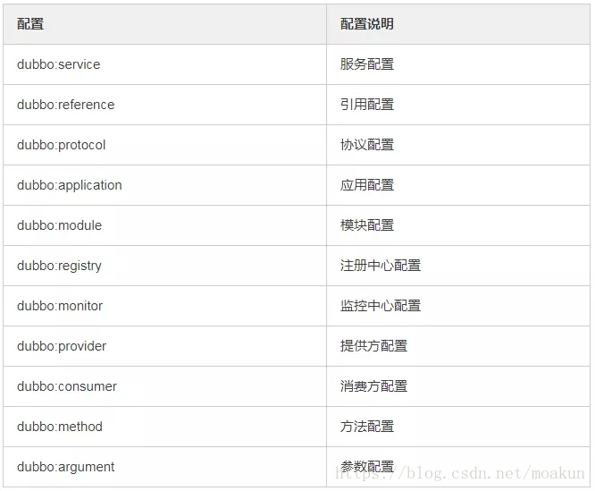

# Dubbo面试题

## Dubbo是什么？

Dubbo是阿里巴巴开源的基于 Java 的高性能 RPC 分布式服务框架，现已成为 Apache 基金会孵化项目。

其核心部分包含：

* 集群容错：提供基于接口方法的透明远程过程调用，包括多协议支持，以及软负载均衡，失败容错，地址路由，动态配置等集群支持。
* 远程通讯：提供对多种基于长连接的NIO框架抽象封装，包括多种线程模型，序列化，以及“请求-响应”模式的信息交换方式。
* 自动发现：基于注册中心目录服务，使服务消费方能动态的查找服务提供方，使地址透明，使服务提供方可以平滑增加或减少机器。

## Dubbo和 Spring Cloud 有什么区别？

最大的区别：

- Dubbo底层是使用Netty这样的NIO框架，是基于TCP协议传输的，配合以Hession序列化完成RPC通信;
- 而SpringCloud是基于Http协议+rest接口调用远程过程的通信，相对来说，Http请求会有更大的报文，占的带宽也会更多。但是REST相比RPC更为灵活，服务提供方和调用方的依赖只依靠一纸契约，不存在代码级别的强依赖，这在强调快速演化的微服务环境下，显得更为合适，至于注重通信速度还是方便灵活性，具体情况具体考虑。

模块区别：

* Dubbo主要分为服务注册中心，服务提供者，服务消费者，还有管控中心；

* 相比起Dubbo简单的四个模块，SpringCloud则是一个完整的分布式一站式框架，他有着一样的服务注册中心，服务提供者，服务消费者，管控台，断路器，分布式配置服务，消息总线，以及服务追踪等；

## Dubbo核心组件有哪些？


- Provider：暴露服务的服务提供方
- Consumer：调用远程服务消费方
- Registry：服务注册与发现注册中心
- Monitor：监控中心和访问调用统计
- Container：服务运行容器

## Dubbo都支持什么协议，推荐用哪种？

1、 Dubbo协议：Dubbo默认使用Dubbo协议。

* 适合大并发小数据量的服务调用，以及服务消费者远大于提供者的情况
* Hessian二进制序列化。
* 缺点是不适合传送大数据包的服务。

2、rmi协议：采用JDK标准的rmi协议实现，传输参数和返回参数对象需要实现Serializable接口。使用java标准序列化机制，使用阻塞式短连接，传输数据包不限，消费者和提供者个数相当。

* 多个短连接，TCP协议传输，同步传输，适用常规的远程服务调用和rmi互操作
* 缺点：在依赖低版本的Common-Collections包，java反序列化存在安全漏洞，需升级commons-collections3 到3.2.2版本或commons-collections4到4.1版本。

3、 webservice协议：基于WebService的远程调用协议(Apache CXF的frontend-simple和transports-http)实现，提供和原生WebService的互操作多个短连接，基于HTTP传输，同步传输，适用系统集成和跨语言调用。

4、http协议：基于Http表单提交的远程调用协议，使用Spring的HttpInvoke实现。对传输数据包不限，传入参数大小混合，提供者个数多于消费者

* 缺点是不支持传文件，只适用于同时给应用程序和浏览器JS调用

5、hessian：集成Hessian服务，基于底层Http通讯，采用Servlet暴露服务，Dubbo内嵌Jetty作为服务器实现,可与Hession服务互操作
通讯效率高于WebService和Java自带的序列化

* 适用于传输大数据包(可传文件)，提供者比消费者个数多，提供者压力较大

* 缺点是参数及返回值需实现Serializable接口，自定义实现List、Map、Number、Date、Calendar等接口

6、thrift协议：对thrift原生协议的扩展添加了额外的头信息。使用较少，不支持传null值

7、memcache：基于memcached实现的RPC协议

8、redis：基于redis实现的RPC协议

## Dubbo服务器注册与发现的流程？

- 服务容器Container负责启动，加载，运行服务提供者。
- 服务提供者Provider在启动时，向注册中心注册自己提供的服务。
- 服务消费者Consumer在启动时，向注册中心订阅自己所需的服务。
- 注册中心Registry返回服务提供者地址列表给消费者，如果有变更，注册中心将基于长连接推送变更数据给消费者。
- 服务消费者Consumer，从提供者地址列表中，基于软负载均衡算法，选一台提供者进行调用，如果调用失败，再选另一台调用。
- 服务消费者Consumer和提供者Provider，在内存中累计调用次数和调用时间，定时每分钟发送一次统计数据到监控中心Monitor。

## Dubbo内置了哪几种服务容器？

三种服务容器：

* Spring Container
* Jetty Container
* Log4j Container

Dubbo的服务容器只是一个简单的 Main 方法，并加载一个简单的 Spring 容器，用于暴露服务。

## Dubbo负载均衡的作用？

　将负载均衡功能实现在rpc客户端侧，以便能够随时适应外部的环境变化，更好地发挥硬件作用。而且客户端的负载均衡天然地就避免了单点问题。定制化的自有定制化的优势和劣势。

它可以从配置文件中指定，也可以在管理后台进行配置修改。

事实上，它支持 服务端服务/方法级别、客户端服务/方法级别 的负载均衡配置。

## Dubbo有哪几种负载均衡策略，默认是哪种？

Dubbo提供了4种负载均衡实现：

1. RandomLoadBalance:随机负载均衡。随机的选择一个。是Dubbo的默认负载均衡策略。
2. RoundRobinLoadBalance:轮询负载均衡。轮询选择一个。
3. LeastActiveLoadBalance:最少活跃调用数，相同活跃数的随机。活跃数指调用前后计数差。使慢的 Provider 收到更少请求，因为越慢的 Provider 的调用前后计数差会越大。
4. ConsistentHashLoadBalance:一致性哈希负载均衡。相同参数的请求总是落在同一台机器上。

## Dubbo服务之间的调用是阻塞的吗？

默认是同步等待结果阻塞的，支持异步调用。

Dubbo是基于 NIO 的非阻塞实现并行调用，客户端不需要启动多线程即可完成并行调用多个远程服务，相对多线程开销较小，异步调用会返回一个 Future 对象。

## DubboMonitor 实现原理？

Consumer 端在发起调用之前会先走 filter 链；provider 端在接收到请求时也是先走 filter 链，然后才进行真正的业务逻辑处理。默认情况下，在 consumer 和 provider 的 filter 链中都会有 Monitorfilter。

1. MonitorFilter 向 DubboMonitor 发送数据
2. DubboMonitor 将数据进行聚合后（默认聚合 1min 中的统计数据）暂存到ConcurrentMap<Statistics, AtomicReference> statisticsMap，然后使用一个含有 3 个线程（线程名字：DubboMonitorSendTimer）的线程池每隔 1min 钟，调用 SimpleMonitorService 遍历发送 statisticsMap 中的统计数据，每发送完毕一个，就重置当前的 Statistics 的 AtomicReference
3. SimpleMonitorService 将这些聚合数据塞入 BlockingQueue queue 中（队列大写为 100000）
4. SimpleMonitorService 使用一个后台线程（线程名为：DubboMonitorAsyncWriteLogThread）将 queue 中的数据写入文件（该线程以死循环的形式来写）
5. SimpleMonitorService 还会使用一个含有 1 个线程（线程名字：DubboMonitorTimer）的线程池每隔 5min 钟，将文件中的统计数据画成图表

## Dubbo有哪些注册中心？

- Multicast 注册中心：Multicast 注册中心不需要任何中心节点，只要广播地址，就能进行服务注册和发现,基于网络中组播传输实现。
- Zookeeper 注册中心：基于分布式协调系统 Zookeeper 实现，采用 Zookeeper 的 watch 机制实现数据变更。
- Redis 注册中心：基于 Redis 实现，采用 key/map 存储，key 存储服务名和类型，map 中 key 存储服务 url，value 服务过期时间。基于 Redis 的发布/订阅模式通知数据变更。
- Simple 注册中心。
- 推荐使用 Zookeeper 作为注册中心

## Dubbo的集群容错方案有哪些？

- Failover Cluster：失败自动切换，当出现失败，重试其它服务器。通常用于读操作，但重试会带来更长延迟。
- Failfast Cluster：快速失败，只发起一次调用，失败立即报错。通常用于非幂等性的写操作，比如新增记录。
- Failsafe Cluster：失败安全，出现异常时，直接忽略。通常用于写入审计日志等操作。
- Failback Cluster：失败自动恢复，后台记录失败请求，定时重发。通常用于消息通知操作。
- Forking Cluster：并行调用多个服务器，只要一个成功即返回。通常用于实时性要求较高的读操作，但需要浪费更多服务资源。可通过 forks=”2″ 来设置最大并行数。
- Broadcast Cluster：广播调用所有提供者，逐个调用，任意一台报错则报错 。通常用于通知所有提供者更新缓存或日志等本地资源信息。

## Dubbo超时设置有哪些方式？

Dubbo超时设置有两种方式：

- 服务提供者端设置超时时间，在Dubbo的用户文档中，推荐如果能在服务端多配置就尽量多配置，因为服务提供者比消费者更清楚自己提供的服务特性。
- 服务消费者端设置超时时间，如果在消费者端设置了超时时间，以消费者端为主，即优先级更高。因为服务调用方设置超时时间控制性更灵活。如果消费方超时，服务端线程不会定制，会产生警告。

## Dubbo用到哪些设计模式？

1、**工厂模式**

Provider 在 export 服务时，会调用 ServiceConfig 的 export 方法。ServiceConfig中有个字段：

```
private static final Protocol protocol =
ExtensionLoader.getExtensionLoader(Protocol.class).getAdaptiveExtensi
on();
复制代码
```

Dubbo里有很多这种代码。这也是一种工厂模式，只是实现类的获取采用了 JDKSPI 的机制。这么实现的优点是可扩展性强，想要扩展实现，只需要在 classpath下增加个文件就可以了，代码零侵入。另外，像上面的 Adaptive 实现，可以做到调用时动态决定调用哪个实现，但是由于这种实现采用了动态代理，会造成代码调试比较麻烦，需要分析出实际调用的实现类。

2、**装饰器模式**

Dubbo在启动和调用阶段都大量使用了装饰器模式。以 Provider 提供的调用链为例，具体的调用链代码是在 ProtocolFilterWrapper 的 buildInvokerChain 完成的，具体是将注解中含有 group=provider 的 Filter 实现，按照 order 排序，最后的调用顺序是：

```
EchoFilter -> ClassLoaderFilter -> GenericFilter -> ContextFilter ->
ExecuteLimitFilter -> TraceFilter -> TimeoutFilter -> MonitorFilter ->
ExceptionFilter
复制代码
```

更确切地说，这里是装饰器和责任链模式的混合使用。例如，EchoFilter 的作用是判断是否是回声测试请求，是的话直接返回内容，这是一种责任链的体现。而像ClassLoaderFilter 则只是在主功能上添加了功能，更改当前线程的 ClassLoader，这是典型的装饰器模式。

3、**观察者模式**

Dubbo的 Provider 启动时，需要与注册中心交互，先注册自己的服务，再订阅自己的服务，订阅时，采用了观察者模式，开启一个 listener。注册中心会每 5 秒定时检查是否有服务更新，如果有更新，向该服务的提供者发送一个 notify 消息，provider 接受到 notify 消息后，运行 NotifyListener 的 notify 方法，执行监听器方法。

4、**动态代理模式**

Dubbo扩展 JDK SPI 的类 ExtensionLoader 的 Adaptive 实现是典型的动态代理实现。Dubbo需要灵活地控制实现类，即在调用阶段动态地根据参数决定调用哪个实现类，所以采用先生成代理类的方法，能够做到灵活的调用。生成代理类的代码是 ExtensionLoader 的 createAdaptiveExtensionClassCode 方法。代理类主要逻辑是，获取 URL 参数中指定参数的值作为获取实现类的 key。

## Dubbo是什么？

Dubbo是阿里巴巴开源的基于 Java 的高性能 RPC 分布式服务框架，现已成为 Apache 基金会孵化项目。

Dubbo是阿里巴巴开源的基于 Java 的高性能 RPC 分布式服务框架，现已成为 Apache 基金会孵化项目。致力于提供高性能和透明化的RPC远程服务调用方案，以及SOA服务治理方案。

简单的说，dubbo就是个服务框架，如果没有分布式的需求，其实是不需要用的，只有在分布式的时候，才有dubbo这样的分布式服务框架的需求，并且本质上是个服务调用的东东，说白了就是个远程服务调用的分布式框架（告别Web Service模式中的WSdl，以服务者与消费者的方式在dubbo上注册）

- 远程通讯: 提供对多种基于长连接的NIO框架抽象封装，包括多种线程模型，序列化，以及“请求-响应”模式的信息交换方式。

- 集群容错: 提供基于接口方法的透明远程过程调用，包括多协议支持，以及软负载均衡，失败容错，地址路由，动态配置等集群支持。

- 自动发现: 基于注册中心目录服务，使服务消费方能动态的查找服务提供方，使地址透明，使服务提供方可以平滑增加或减少机器。

## Dubbo能做什么？

- 透明化的远程方法调用，就像调用本地方法一样调用远程方法，只需简单配置，没有任何API侵入。

- 软负载均衡及容错机制，可在内网替代F5等硬件负载均衡器，降低成本，减少单点。

- 服务自动注册与发现，不再需要写死服务提供方地址，注册中心基于接口名查询服务提供者的IP地址，并且能够平滑添加或删除服务提供者。

Dubbo采用全Spring配置方式，透明化接入应用，对应用没有任何API侵入，只需用Spring加载Dubbo的配置即可，Dubbo基于Spring的Schema扩展进行加载。

## Dubbo的核心功能？

- Remoting：网络通信框架，提供对多种NIO框架抽象封装，包括“同步转异步”和“请求-响应”模式的信息交换方式。

- Cluster：服务框架，提供基于接口方法的透明远程过程调用，包括多协议支持，以及软负载均衡，失败容错，地址路由，动态配置等集群支持。

- Registry：服务注册，基于注册中心目录服务，使服务消费方能动态的查找服务提供方，使地址透明，使服务提供方可以平滑增加或减少机器。

## Dubbo的架构设计？

服务接口层（Service）：该层是与实际业务逻辑相关的，根据服务提供方和服务消费方的业务设计对应的接口和实现。

配置层（Config）：对外配置接口，以ServiceConfig和ReferenceConfig为中心。

服务代理层（Proxy）：服务接口透明代理，生成服务的客户端Stub和服务器端Skeleton。

服务注册层（Registry）：封装服务地址的注册与发现，以服务URL为中心。

集群层（Cluster）：封装多个提供者的路由及负载均衡，并桥接注册中心，以Invoker为中心。

监控层（Monitor）：RPC调用次数和调用时间监控。

远程调用层（Protocol）：封将RPC调用，以Invocation和Result为中心，扩展接口为Protocol、Invoker和Exporter。

信息交换层（Exchange）：封装请求响应模式，同步转异步，以Request和Response为中心。

网络传输层（Transport）：抽象mina和netty为统一接口，以Message为中心。

## Dubbo支持哪些协议，每种协议的应用场景，优缺点？

- dubbo： 单一长连接和NIO异步通讯，适合大并发小数据量的服务调用，以及消费者远大于提供者。传输协议TCP，异步，Hessian序列化；

- rmi： 采用JDK标准的rmi协议实现，传输参数和返回参数对象需要实现Serializable接口，使用java标准序列化机制，使用阻塞式短连接，传输数据包大小混合，消费者和提供者个数差不多，可传文件，传输协议TCP。 多个短连接，TCP协议传输，同步传输，适用常规的远程服务调用和rmi互操作。在依赖低版本的Common-Collections包，java序列化存在安全漏洞；

- webservice： 基于WebService的远程调用协议，集成CXF实现，提供和原生WebService的互操作。多个短连接，基于HTTP传输，同步传输，适用系统集成和跨语言调用；

- http： 基于Http表单提交的远程调用协议，使用Spring的HttpInvoke实现。多个短连接，传输协议HTTP，传入参数大小混合，提供者个数多于消费者，需要给应用程序和浏览器JS调用；

- hessian： 集成Hessian服务，基于HTTP通讯，采用Servlet暴露服务，Dubbo内嵌Jetty作为服务器时默认实现，提供与Hession服务互操作。多个短连接，同步HTTP传输，Hessian序列化，传入参数较大，提供者大于消费者，提供者压力较大，可传文件；

- memcache： 基于memcached实现的RPC协议

- redis： 基于redis实现的RPC协议

## Dubbo与Spring的关系？

Dubbo采用全Spring配置方式，透明化接入应用，对应用没有任何API侵入，只需用Spring加载Dubbo的配置即可，Dubbo基于Spring的Schema扩展进行加载。

## Dubbo 和 Spring Cloud 有什么区别？

Dubbo 是 SOA 时代的产物，它的关注点主要在于服务的调用，流量分发、流量监控和熔断。

而 Spring Cloud 诞生于微服务架构时代，考虑的是微服务治理的方方面面，另外由于依托了 Spirng、Spirng Boot 的优势之上，两个框架在开始目标就不一致，Dubbo 定位服务治理、Spirng Cloud 是一个生态。

1）通信方式不同

Dubbo 使用的是 RPC 通信，而 Spring Cloud 使用的是 HTTP RESTFul 方式。

2）组成部分不同


最大的区别：Dubbo底层是使用Netty这样的NIO框架，是基于TCP协议传输的，配合以Hession序列化完成RPC通信。

而SpringCloud是基于Http协议+Rest接口调用远程过程的通信，相对来说，Http请求会有更大的报文，占的带宽也会更多。

但是REST相比RPC更为灵活，服务提供方和调用方的依赖只依靠一纸契约，不存在代码级别的强依赖，这在强调快速演化的微服务环境下，显得更为合适，至于注重通信速度还是方便灵活性，具体情况具体考虑。

## 你觉得用Dubbo 好还是SpringCloud好？

没有好坏，只有适合不适合。

### dubbo的优势

- 单一应用架构，当网站流量很小时，只需一个应用，将所有功能都部署在一起，以减少部署节点和成本。此时，用于简化增删改查工作量的 数据访问框架（ORM）是关键。

- 垂直应用架构，当访问量逐渐增大，单一应用增加机器带来的加速度越来越小，将应用拆成互不相干的几个应用，以提升效率。此时，用于加速前端页面开发的 Web框架（MVC）是关键。

- 分布式服务架构，当垂直应用越来越多，应用之间交互不可避免，将核心业务抽取出来，作为独立的服务，逐渐形成稳定的服务中心，使前端应用能更快速的响应多变的市场需求。此时，用于提高业务复用及整合的 分布式服务框架（RPC）是关键。

- 流动计算架构当服务越来越多，容量的评估，小服务资源的浪费等问题逐渐显现，此时需增加一个调度中心基于访问压力实时管理集群容量，提高集群利用率。此时，用于提高机器利用率的 资源调度和治理中心（SOA）是关键。

### SpringCloud优势

- 约定优于配置
- 开箱即用、快速启动
- 适用于各种环境
- 轻量级的组件
- 组件支持丰富，功能齐全

### 两者相比较

1、dubbo由于是二进制的传输，占用带宽会更少

2、springCloud是http协议传输，带宽会比较多，同时使用http协议一般会使用JSON报文，消耗会更大

3、dubbo的开发难度较大，原因是dubbo的jar包依赖问题很多大型工程无法解决

4、springcloud的接口协议约定比较自由且松散，需要有强有力的行政措施来限制接口无序升级

5、dubbo的注册中心可以选择zk,redis等多种，springcloud的注册中心只能用eureka或者自研

## Dubbo里面有哪几种节点角色？


## Dubbo服务注册与发现的流程图？


该图来自 Dubbo 官网，供你参考，如果你说你熟悉 Dubbo, 面试官经常会让你画这个图，记好了。


## 流程说明：

- Provider(提供者)绑定指定端口并启动服务

- 指供者连接注册中心，并发本机IP、端口、应用信息和提供服务信息发送至注册中心存储
- Consumer(消费者），连接注册中心 ，并发送应用信息、所求服务信息至注册中心
- 注册中心根据 消费 者所求服务信息匹配对应的提供者列表发送至Consumer 应用缓存。
- Consumer 在发起远程调用时基于缓存的消费者列表择其一发起调用。
- Provider 状态变更会实时通知注册中心、在由注册中心实时推送至Consumer

## 设计的原因：

- Consumer 与Provider 解偶，双方都可以横向增减节点数。

- 注册中心对本身可做对等集群，可动态增减节点，并且任意一台宕掉后，将自动切换到另一台
- 去中心化，双方不直接依懒注册中心，即使注册中心全部宕机短时间内也不会影响服务的调用
- 服务提供者无状态，任意一台宕掉后，不影响使用


## Dubbo 核心的配置有哪些？



## Dubbo有哪几种集群容错方案，默认是哪种？


- Failover Cluster

  失败自动切换，当出现失败，重试其它服务器。通常用于读操作，但重试会带来更长延迟。

- Failfast Cluster

  快速失败，只发起一次调用，失败立即报错。通常用于非幂等性的写操作，比如新增记录。

- Failsafe Cluster

  失败安全，出现异常时，直接忽略。通常用于写入审计日志等操作。

- Failback Cluster

  失败自动恢复，后台记录失败请求，定时重发。通常用于消息通知操作。

- Forking Cluster

  并行调用多个服务器，只要一个成功即返回。通常用于实时性要求较高的读操作，但需要浪费更多服务资源。可通过 forks=”2″ 来设置最大并行数。

- Broadcast Cluster

  广播调用所有提供者，逐个调用，任意一台报错则报错 。通常用于通知所有提供者更新缓存或日志等本地资源信息。

## Dubbo集群提供了哪几种负载均衡策略，默认是哪种？


- Random LoadBalance: 随机选取提供者策略，有利于动态调整提供者权重。截面碰撞率高，调用次数越多，分布越均匀；

- RoundRobin LoadBalance: 轮循选取提供者策略，平均分布，但是存在请求累积的问题；

- LeastActive LoadBalance: 最少活跃调用策略，解决慢提供者接收更少的请求；

- ConstantHash LoadBalance: 一致性Hash策略，使相同参数请求总是发到同一提供者，一台机器宕机，可以基于虚拟节点，分摊至其他提供者，避免引起提供者的剧烈变动；
  缺省时为Random随机调用

## Dubbo服务之间的调用是阻塞的吗？

默认是同步等待结果阻塞的，支持异步调用。

Dubbo 是基于 NIO 的非阻塞实现并行调用，客户端不需要启动多线程即可完成并行调用多个远程服务，相对多线程开销较小，异步调用会返回一个 Future 对象。

异步调用流程图如下。


## Dubbo支持分布式事务吗？

目前暂时不支持

## Dubbo需要 Web 容器吗？

不需要，如果硬要用 Web 容器，只会增加复杂性，也浪费资源。

## Dubbo内置了哪几种服务容器？

- Spring Container
- Jetty Container
- Log4j Container

Dubbo 的服务容器只是一个简单的 Main 方法，并加载一个简单的 Spring 容器，用于暴露服务。

## Dubbo默认使用什么注册中心，还有别的选择吗？

推荐使用 Zookeeper 作为注册中心，还有 Redis、Multicast、Simple 注册中心，但不推荐。

## 在 Provider 上可以配置的 Consumer 端的属性有哪些？

1）timeout：方法调用超时 

2）retries：失败重试次数，默认重试 2 次 

3）loadbalance：负载均衡算法，默认随机 

4）actives 消费者端，最大并发调用限制

## Dubbo启动时如果依赖的服务不可用会怎样？

Dubbo 缺省会在启动时检查依赖的服务是否可用，不可用时会抛出异常，阻止 Spring 初始化完成，默认 check="true"，可以通过 check="false" 关闭检查。

## Dubbo默认使用的是什么通信框架，还有别的选择吗？

Dubbo 默认使用 Netty 框架，也是推荐的选择，另外内容还集成有Mina、Grizzly。

## Dubbo支持服务多协议吗？

Dubbo 允许配置多协议，在不同服务上支持不同协议或者同一服务上同时支持多种协议。

## 当一个服务接口有多种实现时怎么做？

当一个接口有多种实现时，可以用 group 属性来分组，服务提供方和消费方都指定同一个 group 即可。

## 服务上线怎么兼容旧版本？

可以用版本号（version）过渡，多个不同版本的服务注册到注册中心，版本号不同的服务相互间不引用。这个和服务分组的概念有一点类似。

## Dubbo可以对结果进行缓存吗？

可以，Dubbo 提供了声明式缓存，用于加速热门数据的访问速度，以减少用户加缓存的工作量。

## Dubbo支持服务降级吗？

Dubbo 2.2.0 以上版本支持。

## Dubbo如何优雅停机？

Dubbo 是通过 JDK 的 ShutdownHook 来完成优雅停机的，所以如果使用 kill -9 PID 等强制关闭指令，是不会执行优雅停机的，只有通过 kill PID 时，才会执行。

## 服务提供者能实现失效踢出是什么原理？

服务失效踢出基于 Zookeeper 的临时节点原理。

## 如何解决服务调用链过长的问题？

Dubbo 可以使用 Pinpoint 和 Apache Skywalking(Incubator) 实现分布式服务追踪。

## 服务读写推荐的容错策略是怎样的？

读操作建议使用 Failover 失败自动切换，默认重试两次其他服务器。

写操作建议使用 Failfast 快速失败，发一次调用失败就立即报错。

## Dubbo的管理控制台能做什么？

管理控制台主要包含：路由规则，动态配置，服务降级，访问控制，权重调整，负载均衡，等管理功能。

## 说说 Dubbo 服务暴露的过程。

Dubbo 会在 Spring 实例化完 bean 之后，在刷新容器最后一步发布 ContextRefreshEvent 事件的时候，通知实现了 ApplicationListener 的 ServiceBean 类进行回调 onApplicationEvent 事件方法，Dubbo 会在这个方法中调用 ServiceBean 父类 ServiceConfig 的 export 方法，而该方法真正实现了服务的（异步或者非异步）发布。

## Dubbo 和 Dubbox 有什么区别？

Dubbox 是继 Dubbo 停止维护后，当当网基于 Dubbo 做的一个扩展项目，如加了服务可 Restful 调用，更新了开源组件等。

## 在使用过程中都遇到了些什么问题？

Dubbo 的设计目的是为了满足高并发小数据量的 rpc 调用，在大数据量下的性能表现并不好，建议使用http 协议。

## Dubbo有些哪些注册中心？

`Multicast注册中心`： Multicast注册中心不需要任何中心节点，只要广播地址，就能进行服务注册和发现。基于网络中组播传输实现；

`Zookeeper注册中心`： 基于分布式协调系统Zookeeper实现，采用Zookeeper的watch机制实现数据变更；

`redis注册中心`： 基于redis实现，采用key/Map存储，住key存储服务名和类型，Map中key存储服务URL，value服务过期时间。基于redis的发布/订阅模式通知数据变更；
Simple注册中心

## Dubbo的注册中心集群挂掉，发布者和订阅者之间还能通信么？

可以的，启动dubbo时，消费者会从zookeeper拉取注册的生产者的地址接口等数据，缓存在本地。

每次调用时，按照本地存储的地址进行调用。

## Dubbo超时时间怎样设置？

服务提供者端设置超时时间，在Dubbo的用户文档中，推荐如果能在服务端多配置就尽量多配置，因为服务提供者比消费者更清楚自己提供的服务特性。

服务消费者端设置超时时间，如果在消费者端设置了超时时间，以消费者端为主，即优先级更高。因为服务调用方设置超时时间控制性更灵活。如果消费方超时，服务端线程不会定制，会产生警告。

## 服务调用超时问题怎么解决？

dubbo在调用服务不成功时，默认是会重试两次的。

## Dubbo在安全机制方面是如何解决？

Dubbo通过Token令牌防止用户绕过注册中心直连，然后在注册中心上管理授权。Dubbo还提供服务黑白名单，来控制服务所允许的调用方。

## Dubbo 集群容错有几种方案？

| 集群容错方案      | 说明                                       |
| ----------------- | ------------------------------------------ |
| Failover Cluster  | 失败自动切换，自动重试其它服务器（默认）   |
| Failfast Cluster  | 快速失败，立即报错，只发起一次调用         |
| Failsafe Cluster  | 失败安全，出现异常时，直接忽略             |
| Failback Cluster  | 失败自动恢复，记录失败请求，定时重发       |
| Forking Cluster   | 并行调用多个服务器，只要一个成功即返回     |
| Broadcast Cluster | 广播逐个调用所有提供者，任意一个报错则报错 |

## Dubbo 的注册中心集群挂掉，发布者和订阅者之间还能通信么？


可以通讯。启动 Dubbo 时，消费者会从 Zookeeper 拉取注册的生产者的地址接口等数据，缓存在本地。每次调用时，按照本地存储的地址进行调用。


## Dubbo 能集成 SpringBoot 吗？


可以的


## Dubbo 支持哪些协议，每种协议的应用场景，优缺点？  


**1、** dubbo：单一长连接和 NIO 异步通讯，适合大并发小数据量的服务调用，以及消费者远大于提供者。传输协议 TCP，异步， Hessian 序列化；

**2、** rmi：采用 JDK 标准的 rmi 协议实现，传输参数和返回参数对象需要实现 Serializable 接口，使用 java 标准序列化机制，使用阻塞式短连接，传输数据包大小混合，消费者和提供者个数差不多，可传文件，传输协议 TCP。多个短连接， TCP 协议传输，同步传输，适用常规的远程服务调用和rmi 互操作。在依赖低版本的 Common-Collections包， java 序列化存在安全漏洞；

**3、** webservice：基于 WebService 的远程调用协议，集成 CXF 实现，提供和原生 WebService 的互操作。多个短连接，基于 HTTP 传输，同步传输，适用系统集成和跨语言调用；

**4、** http：基于 Http 表单提交的远程调用协议，使用 Spring 的HttpInvoke 实现。多个短连接，传输协议 HTTP，传入参数大小混合，提供者个数多于消费者，需要给应用程序和浏览器 JS 调用；

**5、** hessian：集成 Hessian 服务，基于 HTTP 通讯，采用 Servlet 暴露服务， Dubbo 内嵌 Jetty 作为服务器时默认实现，提供与 Hession 服务互操作。多个短连接，同步 HTTP 传输， Hessian 序列化，传入参数较大，提供者大于消费者，提供者压力较大，可传文件；

**6、** memcache：基于 Memcached 实现的 RPC 协议

**7、** Redis：基于 Redis 实现的 RPC 协议


## Dubbo 和 Spring Cloud 的关系？


Dubbo 是 SOA 时代的产物，它的关注点主要在于服务的调用，流量分发、流量监控和熔断。而 Spring Cloud 诞生于微服务架构时代，考虑的是微服务治理的方方面面，另外由于依托了 Spirng、Spirng Boot 的优势之上，两个框架在开始目标就不一致， Dubbo定位服务治理、 Spirng Cloud 是一个生态。


## dubbo 推荐用什么协议？


默认使用 dubbo 协议。


## Dubbo 核心组件有哪些？

**1、** Provider：暴露服务的服务提供方

**2、** Consumer：调用远程服务消费方

**3、** Registry：服务注册与发现注册中心

**4、** Monitor：监控中心和访问调用统计

**5、** Container：服务运行容器


## 如何解决服务调用链过长的问题？


Dubbo 可以使用 Pinpoint 和 Apache Skywalking(Incubator) 实现分布式服务追踪，当然还有其他很多方案。


## Dubbo 使用过程中都遇到了些什么问题？


在注册中心找不到对应的服务,检查service实现类是否添加了@service注解

无法连接到注册中心,检查配置文件中的对应的测试ip是否正确


## 同一个服务多个注册的情况下可以直连某一个服务吗？ 


可以直连，修改配置即可，也可以通过telnet直接某个服务。

## 说说核心的配置有哪些？ 

| 标签              | 用途         | 解释                                                         |
| ----------------- | ------------ | ------------------------------------------------------------ |
| dubbo:service     | 服务配置     | 用于暴露一个服务，定义服务的元信息，一个服务可以用多个协议暴露，一个服务也可以注册到多个注册中心 |
| dubbo:reference   | 引用配置     | 用于创建一个远程服务代理，一个引用可以指向多个注册中心       |
| dubbo:protocol    | 协议配置     | 用于配置提供服务的协议信息，协议由提供方指定，消费方被动接受 |
| dubbo:application | 应用配置     | 用于配置当前应用信息，不管该应用是提供者还是消费者           |
| dubbo:module      | 模块配置     | 用于配置当前模块信息，可选                                   |
| dubbo:registry    | 注册中心配置 | 用于配置连接注册中心相关信息                                 |
| dubbo:monitor     | 监控中心配置 | 用于配置连接监控中心相关信息，可选                           |
| dubbo:provider    | 提供方配置   | 当 ProtocolConfig 和 ServiceConfig 某属性没有配置时，采用此缺省值，可选 |
| dubbo:consumer    | 消费方配置   | 当 ReferenceConfig 某属性没有配置时，采用此缺省值，可选      |
| dubbo:method      | 方法配置     | 用于 ServiceConfig 和 ReferenceConfig 指定方法级的配置信息   |
| dubbo:argument    | 参数配置     | 用于指定方法参数配置                                         |


`如果是SpringBoot项目就只需要注解，或者开Application配置文件！！！`


## Dubbo 支持哪些协议，每种协议的应用场景，优缺点？


**1、** dubbo：单一长连接和 NIO 异步通讯，适合大并发小数据量的服务调用，以及消费者远大于提供者。传输协议 TCP，异步， Hessian 序列化；

**2、** rmi：采用 JDK 标准的 rmi 协议实现，传输参数和返回参数对象需要实现Serializable 接口，使用 java 标准序列化机制，使用阻塞式短连接，传输数据包大小混合，消费者和提供者个数差不多，可传文件，传输协议 TCP。多个短连接， TCP 协议传输，同步传输，适用常规的远程服务调用和 rmi 互操作。在依赖低版本的 Common-Collections 包， java 序列化存在安全漏洞；

**3、** http：基于 Http 表单提交的远程调用协议，使用 Spring 的 HttpInvoke 实现。多个短连接，传输协议 HTTP，传入参数大小混合，提供者个数多于消费者，需要给应用程序和浏览器 JS 调用；

**4、** webservice：基于 WebService 的远程调用协议，集成 CXF 实现，提供和原生 WebService 的互操作。多个短连接，基于 HTTP 传输，同步传输，适用系统集成和跨语言调用；

**5、** hessian：集成 Hessian 服务，基于 HTTP 通讯，采用 Servlet 暴露服务，Dubbo 内嵌 Jetty 作为服务器时默认实现，提供与 Hession 服务互操作。多个短连接，同步 HTTP 传输， Hessian 序列化，传入参数较大，提供者大于消费者，提供者压力较大，可传文件；

**6、** Redis：基于 Redis 实现的 RPC 协议


## 服务提供者能实现失效踢出是什么原理？


服务失效踢出基于zookeeper的临时节点原理。


## PRC架构组件  


一个基本的RPC架构里面应该至少包含以下4个组件：

**1、** 客户端（Client）:服务调用方（服务消费者）

**2、** 客户端存根（Client Stub）:存放服务端地址信息，将客户端的请求参数数据信息打包成网络消息，再通过网络传输发送给服务端

**3、** 服务端存根（Server Stub）:接收客户端发送过来的请求消息并进行解包，然后再调用本地服务进行处理4、服务端（Server）:服务的真正提供者

- 具体调用过程：

**1、** 服务消费者（client客户端）通过调用本地服务的方式调用需要消费的服务；

**2、** 客户端存根（client stub）接收到调用请求后负责将方法、入参等信息序列化（组装）成能够进行网络传输的消息体；

**3、** 客户端存根（client stub）找到远程的服务地址，并且将消息通过网络发送给服务端；

**4、** 服务端存根（server stub）收到消息后进行解码（反序列化操作）；

**5、** 服务端存根（server stub）根据解码结果调用本地的服务进行相关处理；

**6、** 本地服务执行具体业务逻辑并将处理结果返回给服务端存根（server stub）；

**7、** 服务端存根（server stub）将返回结果重新打包成消息（序列化）并通过网络发送至消费方；

**8、** 客户端存根（client stub）接收到消息，并进行解码（反序列化）；

**9、** 服务消费方得到最终结果；

`而RPC框架的实现目标则是将上面的第2-10步完好地封装起来，也就是把调用、编码/解码的过程给封装起来，让用户感觉上像调用本地服务一样的调用远程服务。`


## 服务调用是阻塞的吗？ 


默认是阻塞的，可以异步调用，没有返回值的可以这么做。


## dubbo 服务集群配置（集群容错模式）


在集群调用失败时， Dubbo 提供了多种容错方案，缺省为 failover 重试。可以自行扩展集群容错策略

l Failover Cluster(默认)

失败自动切换，当出现失败，重试其它服务器。(缺省)通常用于读操作，

但重试会带来更长延迟。可通过 retries="2"来设置重试次数(不含第一次)。

```
<dubbo:service retries="2" cluster="failover"/>或：<dubbo:reference retries="2" cluster="failover"/>cluster="failover"可以不用写,因为默认就是 failover
```

**Failfast Cluster**

快速失败，只发起一次调用，失败立即报错。通常用于非幂等性的写操作，

比如新增记录。

```
dubbo:service cluster="failfast" />
```

或：

```
<dubbo:reference cluster="failfast" />

cluster="failfast"和 把 cluster="failover"、 retries="0"是一样的效果,retries="0"就是不重
```

Failsafe Cluster失败安全，出现异常时，直接忽略。通常用于写入审计日志等操作。

```
<dubbo:service cluster="failsafe" />
```

或：

```
<dubbo:reference cluster="failsafe" />
```

**Failback Cluster**

失败自动恢复，后台记录失败请求，定时重发。通常用于消息通知操作。

```
<dubbo:service cluster="failback" />
```

或：

```
<dubbo:reference cluster="failback" />
```

Forking Cluster并行调用多个服务器，只要一个成功即返回。通常用于实时性要求较高的读

操作，但需要浪费更多服务资源。可通过 forks="2"来设置最大并行数。

```
<dubbo:service cluster=“forking" forks="2"/>
```

或：

```
<dubbo:reference cluster=“forking" forks="2"/>
```


## Dubbo 核心功能有哪些？


**1、** Remoting：网络通信框架，提供对多种NIO框架抽象封装，包括“同步转异步”和“请求-响应”模式的信息交换方式。

**2、** Cluster：服务框架，提供基于接口方法的透明远程过程调用，包括多协议支持，以及软负载均衡，失败容错，地址路由，动态配置等集群支持。

**3、** Registry：服务注册，基于注册中心目录服务，使服务消费方能动态的查找服务提供方，使地址透明，使服务提供方可以平滑增加或减少机器。


## 为什么要用Dubbo？


随着服务化的进一步发展，服务越来越多，服务之间的调用和依赖关系也越来越复杂，诞生了面向服务的架构体系(SOA)，

也因此衍生出了一系列相应的技术，如对服务提供、服务调用、连接处理、通信协议、序列化方式、服务发现、服务路由、日志输出等行为进行封装的服务框架。

就这样为分布式系统的服务治理框架就出现了，Dubbo也就这样产生了。


## 服务调用超时问题怎么解决


dubbo在调用服务不成功时，默认是会重试两次的。这样在服务端的处理时间超过了设定的超时时间时，就会有重复请求，比如在发邮件时，可能就会发出多份重复邮件，执行注册请求时，就会插入多条重复的注册数据，那么怎么解决超时问题呢？如下

对于核心的服务中心，去除dubbo超时重试机制，并重新评估设置超时时间。 业务处理代码必须放在服务端，客户端只做参数验证和服务调用，不涉及业务流程处理 全局配置实例

<dubbo:provider delay="-1" timeout="6000" retries="0"/>

当然Dubbo的重试机制其实是非常好的QOS保证，它的路由机制，是会帮你把超时的请求路由到其他机器上，而不是本机尝试，所以 dubbo的重试机器也能一定程度的保证服务的质量。但是请一定要综合线上的访问情况，给出综合的评估。


## dubbo 通信协议 dubbo 协议为什么要消费者比提供者个数多？


因 dubbo 协议采用单一长连接，假设网络为千兆网卡(1024Mbit=128MByte)，根据测试经验数据每条连接最多只能压满 7MByte(不同的环境可能不一样，供参考)，理论上 1 个服务提供者需要 20个服务消费者才能压满网卡。

## Dubbo 是什么？


Dubbo 是一个分布式、高性能、透明化的 RPC 服务框架，提供服务自动注册、自动发现等高效服务治理方案， 可以和Spring 框架无缝集成


## Dubbo 核心组件有哪些？


**1、** Provider：暴露服务的服务提供方

**2、** Consumer：调用远程服务消费方

**3、** Registry：服务注册与发现注册中心

**4、** Monitor：监控中心和访问调用统计

**5、** Container：服务运行容器


## 说说核心的配置有哪些？


核心配置有：

**1、** dubbo:service/

**2、** dubbo:reference/

**3、** dubbo:protocol/

**4、** dubbo:registry/

**5、** dubbo:application/

**6、** dubbo:provider/

**7、** dubbo:consumer/

**8、** dubbo:method/


## 什么是RPC


RPC（Remote Procedure Call Protocol）远程过程调用协议，它是一种通过网络从远程计算机程序上请求服务，而不需要了解底层网络技术的协议。简言之，RPC使得程序能够像访问本地系统资源一样，去访问远端系统资源。比较关键的一些方面包括：通讯协议、序列化、资源（接口）描述、服务框架、性能、语言支持等。

简单的说，RPC就是从一台机器(客户端)上通过参数传递的方式调用另一台机器(服务器)上的一个函数或方法(可以统称为服务)并得到返回的结果。


## RPC使用了哪些关键技术，Thrift


是一种可伸缩的跨语言服务的软件框架。它拥有功能强大的代码生成引擎，无缝地支持C + +，C#，Java，Python和PHP和Ruby。thrift允许你定义一个描述文件，描述数据类型和服务接口。依据该文件，编译器方便地生成RPC客户端和服务器通信代码。

最初由facebook开发用做系统内个语言之间的RPC通信，2007年由facebook贡献到apache基金 ，现在是apache下的opensource之一 。支持多种语言之间的RPC方式的通信：php语言client可以构造一个对象，调用相应的服务方法来调用java语言的服务，跨越语言的C/S RPC调用。底层通讯基于SOCKET。


## 服务读写推荐的容错策略是怎样的？


读操作建议使用 Failover 失败自动切换，默认重试两次其他服务器。写操作建议使用 Failfast 快速失败，发一次调用失败就立即报错。


## Dubbo 的默认集群容错方案？


Failover Cluster


## 当一个服务接口有多种实现时怎么做？


当一个接口有多种实现时，可以用 group 属性来分组，服务提供方和消费方都指定同一个 group 即可。


## 服务调用超时问题怎么解决？


dubbo 在调用服务不成功时，默认是会重试两次的。


## 同一个服务多个注册的情况下可以直连某一个服务吗？


可以点对点直连，修改配置即可，也可以通过 telnet 直接某个服务。

## Dubbo集群提供了哪些负载均衡策略？


**1、** Random LoadBalance: 随机选取提供者策略，有利于动态调整提供者权重。截面碰撞率高，调用次数越多，分布越均匀。

**2、** RoundRobin LoadBalance: 轮循选取提供者策略，平均分布，但是存在请求累积的问题。

**3、** LeastActive LoadBalance: 最少活跃调用策略，解决慢提供者接收更少的请求。

**4、** ConstantHash LoadBalance: 一致性 Hash 策略，使相同参数请求总是发到同一提供者，一台机器宕机，可以基于虚拟节点，分摊至其他提供者，避免引起提供者的剧烈变动。

默认为 Random 随机调用。


## Dubbo 服务器注册与发现的流程？


**1、** Provider（提供者）绑定指定端口并启动服务。

**2、** 提供者连接注册中心，并发本机 IP、端口、应用信息和提供服务信息发送至注册中心存储。

**3、** Consumer（消费者），连接注册中心 ，并发送应用信息、所求服务信息至注册中心。

**4、** 注册中心根据消费者所求服务信息匹配对应的提供者列表发送至 Consumer 应用缓存。

**5、** Consumer 在发起远程调用时基于缓存的消费者列表择其一发起调用。

**6、** Provider 状态变更会实时通知注册中心、在由注册中心实时推送至 Consumer。


## 同一个服务多个注册的情况下可以直连某一个服务吗？ 


可以直连，修改配置即可，也可以通过 telnet 直接某个服务。


## 默认使用什么序列化框架，你知道的还有哪些？


默认使用Hessian序列化，还有Duddo、FastJson、Java自带序列化。


## 你还了解别的分布式框架吗？


别的还有 spring 的 spring cloud，facebook 的 thrift，twitter 的 finagle 等。冲上云霄，Dubbo Go！GO语言版本都发布了～推荐阅读：Spring Cloud是什么，和Dubbo对比呢？


## Dubbo 的使用场景有哪些？


**1、** 透明化的远程方法调用：就像调用本地方法一样调用远程方法，只需简单配置，没有任何API侵入。

**2、** 软负载均衡及容错机制：可在内网替代 F5 等硬件负载均衡器，降低成本，减少单点。

**3、** 服务自动注册与发现：不再需要写死服务提供方地址，注册中心基于接口名查询服务提供者的IP地址，并且能够平滑添加或删除服务提供者。


## Dubbo 的注册中心集群挂掉，者和订阅者之间还能通信么？ 


可以的，启动 dubbo 时，消费者会从 zookeeper 拉取注册的生产者的地址接口等数据，缓存在本地。

每次调用时，按照本地存储的地址进行调用。


## 同一个服务多个注册的情况下可以直连某一个服务吗？ 


可以点对点直连，修改配置即可，也可以通过telnet直连某个服务。


## 默认使用什么序列化框架，你知道的还有哪些？


推荐使用Hessian序列化，还有Dubbo、FastJson、Java自带序列化。


## Dubbo 和 Dubbox 之间的区别？


dubbox 基于 dubbo 上做了一些扩展，如加了服务可 restful 调用，更新了开源组件等。

## Dubbo 集群提供了哪些负载均衡策略？


**1、** Random LoadBalance: 随机选取提供者策略，有利于动态调整提供者权重。截面碰撞率高，调用次数越多，分布越均匀；

**2、** RoundRobin LoadBalance: 轮循选取提供者策略，平均分布，但是存在请求累积的问题；

**3、** LeastActive LoadBalance: 最少活跃调用策略，解决慢提供者接收更少的请求；

**4、** ConstantHash LoadBalance: 一致性 Hash 策略，使相同参数请求总是发到同一提供者，一台机器宕机，可以基于虚拟节点，分摊至其他提供者，避免引起提供者的剧烈变动；

**5、** 缺省时为 Random 随机调用


## RPC的实现基础？


**1、** 需要有非常高效的网络通信，比如一般选择Netty作为网络通信框架；

**2、** 需要有比较高效的序列化框架，比如谷歌的Protobuf序列化框架；

**3、** 可靠的寻址方式（主要是提供服务的发现），比如可以使用Zookeeper来注册服务等等；

**4、** 如果是带会话（状态）的RPC调用，还需要有会话和状态保持的功能；


## dubbo 通信协议 dubbo 协议适用范围和适用场景


适用范围：传入传出参数数据包较小（建议小于 100K），消费者比提供者个数多，单一消费者无法压满提供者，尽量不要用 dubbo 协议传输大文件或超大字符串。

适用场景：常规远程服务方法调用

dubbo 协议补充：

连接个数：单连接

连接方式：长连接

传输协议：TCP

传输方式：NIO 异步传输

序列化：Hessian 二进制序列化


## Dubbo 是什么？


Dubbo 是一款高性能、轻量级的开源 RPC 框架，提供服务自动注册、自动发现等高效服务治理方案， 可以和 Spring 框架无缝集成。


## Dubbo 默认采用注册中心？


采用 Zookeeper


## Dubbo SPI 和 Java SPI 区别？


**JDK SPI：**

JDK 标准的 SPI 会一次性加载所有的扩展实现，如果有的扩展很耗时，但也没用上，很浪费资源。所以只希望加载某个的实现，就不现实了

**DUBBO SPI：**

**1、** 对 Dubbo 进行扩展，不需要改动 Dubbo 的源码

**2、** 延迟加载，可以一次只加载自己想要加载的扩展实现。

**3、** 增加了对扩展点 IOC 和 AOP 的支持，一个扩展点可以直接 setter 注入其它扩展点。

**4、** Dubbo 的扩展机制能很好的支持第三方 IoC 容器，默认支持 Spring Bean。


## Dubbo 有些哪些注册中心？


**1、** Multicast 注册中心：Multicast 注册中心不需要任何中心节点，只要广播地址，就能进行服务注册和发现。基于网络中组播传输实现；

**2、** Zookeeper 注册中心：基于分布式协调系统 Zookeeper 实现，采用Zookeeper 的 watch 机制实现数据变更；

**3、** Redis 注册中心：基于 Redis 实现，采用 key/Map 存储，住 key 存储服务名和类型， Map 中 key 存储服务 URL， value 服务过期时间。基于 Redis 的/订阅模式通知数据变更；

**4、** Simple 注册中心


## Dubbo 超时时间怎样设置？


**Dubbo 超时时间设置有两种方式：**

服务提供者端设置超时时间，在 Dubbo 的用户文档中，推荐如果能在服务端多配置就尽量多配置，因为服务提供者比消费者更清楚自己提供的服务特性。

服务消费者端设置超时时间，如果在消费者端设置了超时时间，以消费者端为主，即优先级更高。因为服务调用方设置超时时间控制性更灵活。如果消费方超时，服务端线程不会定制，会产生警告。


## Dubbo telnet 命令能做什么？


dubbo 服务发布之后，我们可以利用 telnet 命令进行调试、管理。Dubbo2.0.5 以上版本服务提供端口支持 telnet 命令


## Dubbo 和 Spring Cloud 有什么哪些区别？


Dubbo 底层是使用 Netty 这样的 NIO 框架，是基于 TCP 协议传输的，配合以 Hession 序列化完成 RPC 通信。

Spring Cloud 是基于 Http 协议 Rest 接口调用远程过程的通信，相对来说 Http 请求会有更大的报文，占的带宽也会更多。但是 REST 相比 RPC 更为灵活，服务提供方和调用方的依赖只依靠一纸契约，不存在代码级别的强依赖，这在强调快速演化的微服务环境下，显得更为合适，至于注重通信速度还是方便灵活性，具体情况具体考虑。

## 你觉得用 Dubbo 好还是 Spring Cloud 好？


扩展性的问题，没有好坏，只有适合不适合，不过我好像更倾向于使用 Dubbo, Spring Cloud 版本升级太快，组件更新替换太频繁，配置太繁琐，还有很多我觉得是没有 Dubbo 顺手的地方。


## Dubbo Monitor 实现原理？ 


Consumer端在发起调用之前会先走filter链；provider端在接收到请求时也是先走filter链，然后才进行真正的业务逻辑处理。

默认情况下，在consumer和provider的filter链中都会有Monitorfilter。

**1、** MonitorFilter向DubboMonitor发送数据

**2、** DubboMonitor将数据进行聚合后（默认聚合1min中的统计数据）暂存到ConcurrentMap<Statistics, AtomicReference> statisticsMap，然后使用一个含有3个线程（线程名字：DubboMonitorSendTimer）的线程池每隔1min钟，调用SimpleMonitorService遍历发送statisticsMap中的统计数据，每发送完毕一个，就重置当前的Statistics的AtomicReference

**3、** SimpleMonitorService将这些聚合数据塞入BlockingQueue queue中（队列大写为100000）

**4、** SimpleMonitorService使用一个后台线程（线程名为：DubboMonitorAsyncWriteLogThread）将queue中的数据写入文件（该线程以死循环的形式来写）

**5、** SimpleMonitorService还会使用一个含有1个线程（线程名字：DubboMonitorTimer）的线程池每隔5min钟，将文件中的统计数据画成图表


## RPC使用了哪些关键技术，从调用者的角度看：


服务的调用者启动的时候根据自己订阅的服务向服务注册中心查找服务提供者的地址等信息；

当服务调用者消费的服务上线或者下线的时候，注册中心会告知该服务的调用者；

服务调用者下线的时候，则取消订阅。


## Dubbo 可以对结果进行缓存吗？


为了提高数据访问的速度。Dubbo 提供了声明式缓存，以减少用户加缓存的工作量<dubbo:reference cache=“true” />

其实比普通的配置文件就多了一个标签 cache=“true”


## Dubbo 用到哪些设计模式？


Dubbo框架在初始化和通信过程中使用了多种设计模式，可灵活控制类加载、权限控制等功能。

**工厂模式**

Provider在export服务时，会调用ServiceConfig的export方法。ServiceConfig中有个字段：

```java
private static final Protocol protocol = ExtensionLoader.getExtensionLoader(Protocol.class).getAdaptiveExtension();
```

Dubbo里有很多这种代码。这也是一种工厂模式，只是实现类的获取采用了JDK SPI的机制。这么实现的优点是可扩展性强，想要扩展实现，只需要在classpath下增加个文件就可以了，代码零侵入。另外，像上面的Adaptive实现，可以做到调用时动态决定调用哪个实现，但是由于这种实现采用了动态代理，会造成代码调试比较麻烦，需要分析出实际调用的实现类。

**装饰器模式**

Dubbo在启动和调用阶段都大量使用了装饰器模式。以Provider提供的调用链为例，具体的调用链代码是在ProtocolFilterWrapper的buildInvokerChain完成的，具体是将注解中含有group=provider的Filter实现，按照order排序，最后的调用顺序是：

```java
EchoFilter -> ClassLoaderFilter -> GenericFilter -> ContextFilter -> ExecuteLimitFilter -> TraceFilter -> TimeoutFilter -> MonitorFilter -> ExceptionFilter
```

更确切地说，这里是装饰器和责任链模式的混合使用。例如，EchoFilter的作用是判断是否是回声测试请求，是的话直接返回内容，这是一种责任链的体现。而像ClassLoaderFilter则只是在主功能上添加了功能，更改当前线程的ClassLoader，这是典型的装饰器模式。

**观察者模式**

Dubbo的Provider启动时，需要与注册中心交互，先注册自己的服务，再订阅自己的服务，订阅时，采用了观察者模式，开启一个listener。注册中心会每5秒定时检查是否有服务更新，如果有更新，向该服务的提供者发送一个notify消息，provider接受到notify消息后，即运行NotifyListener的notify方法，执行监听器方法。

**动态代理模式**

Dubbo扩展JDK SPI的类ExtensionLoader的Adaptive实现是典型的动态代理实现。Dubbo需要灵活地控制实现类，即在调用阶段动态地根据参数决定调用哪个实现类，所以采用先生成代理类的方法，能够做到灵活的调用。生成代理类的代码是ExtensionLoader的createAdaptiveExtensionClassCode方法。代理类的主要逻辑是，获取URL参数中指定参数的值作为获取实现类的key。


## Dubbo 如何优雅停机？


Dubbo 是通过 JDK 的 ShutdownHook 来完成优雅停机的，所以如果使用kill -9 PID 等强制关闭指令，是不会执行优雅停机的，只有通过 kill PID 时，才会执行。


## RPC使用了哪些关键技术，NIO通信


出于并发性能的考虑，传统的阻塞式 IO 显然不太合适，因此我们需要异步的 IO，即 NIO。Java 提供了 NIO 的解决方案，Java 7 也提供了更优秀的 NIO.2 支持。可以选择Netty或者MINA来解决NIO数据传输的问题。


## 在使用过程中都遇到了些什么问题？


如序列化问题。


## 集群容错怎么做？


读操作建议使用 Failover 失败自动切换，默认重试两次其他服务器。写操作建议使用 Failfast 快速失败，发一次调用失败就立即报错。


## Dubbo 超时时间怎样设置？


Dubbo 超时时间设置有两种方式：

服务提供者端设置超时时间，在 Dubbo 的用户文档中，推荐如果能在服务端多配置就尽量多配置，因为服务提供者比消费者更清楚自己提供的服务特性。

服务消费者端设置超时时间，如果在消费者端设置了超时时间，以消费者端为主，即优先级更高。因为服务调用方设置超时时间控制性更灵活。如果消费方超时，服务端线程不会定制，会产生警告。