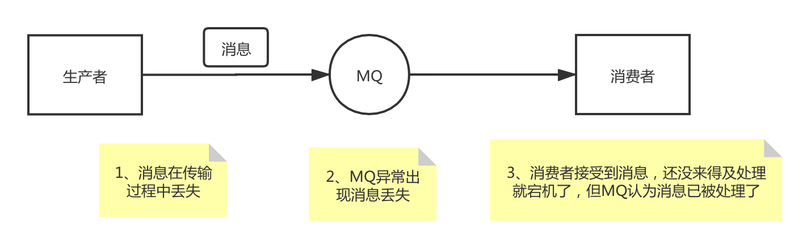

# Kafka面试题

## kafka 可以脱离 zookeeper 单独使用吗？为什么？

kafka 不能脱离 zookeeper 单独使用，因为 kafka 使用 zookeeper 管理和协调 kafka 的节点服务器。

## kafka 有几种数据保留的策略？

kafka 有两种数据保存策略：按照过期时间保留和按照存储的消息大小保留。

## kafka 同时设置了 7 天和 10G 清除数据，到第五天的时候消息达到了 10G，这个时候 kafka 将如何处理？

这个时候 kafka 会执行数据清除工作，时间和大小不论那个满足条件，都会清空数据。

## 什么情况会导致 kafka 运行变慢？

cpu

性能瓶颈

磁盘读写瓶颈

网络瓶颈

## 使用 kafka 集群需要注意什么？

集群的数量不是越多越好，最好不要超过 7 个，因为节点越多，消息复制需要的时间就越长，整个群组的吞吐量就越低。 集群数量最好是单数，因为超过一半故障集群就不能用了，设置为单数容错率更高。

## 什么是kafka？

Kafka是分布式发布-订阅消息系统，它最初是由LinkedIn公司开发的，之后成为Apache项目的一部分，Kafka是一个分布式，可划分的，冗余备份的持久性的日志服务，它主要用于处理流式数据。

## 为什么要使用 kafka，为什么要使用消息队列？

缓冲和削峰：上游数据时有突发流量，下游可能扛不住，或者下游没有足够多的机器来保证冗余，kafka在中间可以起到一个缓冲的作用，把消息暂存在kafka中，下游服务就可以按照自己的节奏进行慢慢处理。

解耦和扩展性：项目开始的时候，并不能确定具体需求。消息队列可以作为一个接口层，解耦重要的业务流程。只需要遵守约定，针对数据编程即可获取扩展能力。

冗余：可以采用一对多的方式，一个生产者发布消息，可以被多个订阅topic的服务消费到，供多个毫无关联的业务使用。

健壮性：消息队列可以堆积请求，所以消费端业务即使短时间死掉，也不会影响主要业务的正常进行。

异步通信：很多时候，用户不想也不需要立即处理消息。消息队列提供了异步处理机制，允许用户把一个消息放入队列，但并不立即处理它。想向队列中放入多少消息就放多少，然后在需要的时候再去处理它们。

## Kafka中的ISR、AR又代表什么？ISR的伸缩又指什么？

ISR：In-Sync Replicas 副本同步队列 

AR：Assigned Replicas 所有副本 

ISR是由leader维护，follower从leader同步数据有一些延迟（包括延迟时间replica.lag.time.max.ms和延迟条数replica.lag.max.messages两个维度, 当前最新的版本0.10.x中只支持replica.lag.time.max.ms这个维度），任意一个超过阈值都会把follower剔除出ISR, 存入OSR（Outof-Sync Replicas）列表，新加入的follower也会先存放在OSR中。AR=ISR+OSR。

## kafka中的broker 是干什么的？

broker 是消息的代理，Producers往Brokers里面的指定Topic中写消息，Consumers从Brokers里面拉取指定Topic的消息，然后进行业务处理，broker在中间起到一个代理保存消息的中转站。

## kafka中的 zookeeper 起到什么作用，可以不用zookeeper么？

zookeeper 是一个分布式的协调组件，早期版本的kafka用zk做meta信息存储，consumer的消费状态，group的管理以及 offset的值。考虑到zk本身的一些因素以及整个架构较大概率存在单点问题，新版本中逐渐弱化了zookeeper的作用。新的consumer使用了kafka内部的group coordination协议，也减少了对zookeeper的依赖，

但是broker依然依赖于ZK，zookeeper 在kafka中还用来选举controller 和 检测broker是否存活等等。

## kafka follower如何与leader同步数据？

Kafka的复制机制既不是完全的同步复制，也不是单纯的异步复制。

完全同步复制要求All Alive Follower都复制完，这条消息才会被认为commit，这种复制方式极大的影响了吞吐率。

而异步复制方式下，Follower异步的从Leader复制数据，数据只要被Leader写入log就被认为已经commit，这种情况下，如果leader挂掉，会丢失数据，kafka使用ISR的方式很好的均衡了确保数据不丢失以及吞吐率。Follower可以批量的从Leader复制数据，而且Leader充分利用磁盘顺序读以及send file(zero copy)机制，这样极大的提高复制性能，内部批量写磁盘，大幅减少了Follower与Leader的消息量差。

## 什么情况下一个 broker 会从 isr中踢出去？

leader会维护一个与其基本保持同步的Replica列表，该列表称为ISR(in-sync Replica)，每个Partition都会有一个ISR，而且是由leader动态维护 ，如果一个follower比一个leader落后太多，或者超过一定时间未发起数据复制请求，则leader将其重ISR中移除 。

## kafka 为什么那么快？

Cache Filesystem Cache PageCache缓存

顺序写 由于现代的操作系统提供了预读和写技术，磁盘的顺序写大多数情况下比随机写内存还要快。

Zero-copy 零拷技术减少拷贝次数

Batching of Messages 批量量处理。合并小的请求，然后以流的方式进行交互，直顶网络上限。

Pull 拉模式 使用拉模式进行消息的获取消费，与消费端处理能力相符。

## kafka producer如何优化打入速度？

增加线程

提高 batch.size

增加更多 producer 实例

增加 partition 数

设置 acks=-1 时，如果延迟增大：可以增大 num.replica.fetchers（follower 同步数据的线程数）来调解；

跨数据中心的传输：增加 socket 缓冲区设置以及 OS tcp 缓冲区设置。

## kafka producer 打数据，ack  为 0， 1， -1 的时候代表啥， 设置 -1 的时候，什么情况下，leader 会认为一条消息 commit了？

1（默认） 数据发送到Kafka后，经过leader成功接收消息的的确认，就算是发送成功了。在这种情况下，如果leader宕机了，则会丢失数据。 

0 生产者将数据发送出去就不管了，不去等待任何返回。这种情况下数据传输效率最高，但是数据可靠性确是最低的。 

-1 producer需要等待ISR中的所有follower都确认接收到数据后才算一次发送完成，可靠性最高。当ISR中所有Replica都向Leader发送ACK时，leader才commit，这时候producer才能认为一个请求中的消息都commit了。 

## kafka unclean 配置代表啥，会对 spark streaming 消费有什么影响

unclean.leader.election.enable 为true的话，意味着非ISR集合的broker 也可以参与选举，这样有可能就会丢数据，spark streaming在消费过程中拿到的 end offset 会突然变小，导致 spark streaming job挂掉。如果unclean.leader.election.enable参数设置为true，就有可能发生数据丢失和数据不一致的情况，Kafka的可靠性就会降低；而如果unclean.leader.election.enable参数设置为false，Kafka的可用性就会降低。

## 如果leader crash时，ISR为空怎么办？

kafka在Broker端提供了一个配置参数：unclean.leader.election,这个参数有两个值： 

true（默认）：允许不同步副本成为leader，由于不同步副本的消息较为滞后，此时成为leader，可能会出现消息不一致的情况。 

false：不允许不同步副本成为leader，此时如果发生ISR列表为空，会一直等待旧leader恢复，降低了可用性。

## kafka的message格式是什么样的？

一个Kafka的Message由一个固定长度的header和一个变长的消息体body组成

header部分由一个字节的magic(文件格式)和四个字节的CRC32(用于判断body消息体是否正常)构成。

当magic的值为1的时候，会在magic和crc32之间多一个字节的数据：attributes(保存一些相关属性，

比如是否压缩、压缩格式等等);如果magic的值为0，那么不存在attributes属性

body是由N个字节构成的一个消息体，包含了具体的key/value消息

## kafka中consumer group 是什么概念

同样是逻辑上的概念，是Kafka实现单播和广播两种消息模型的手段。同一个topic的数据，会广播给不同的group；同一个group中的worker，只有一个worker能拿到这个数据。换句话说，对于同一个topic，每个group都可以拿到同样的所有数据，但是数据进入group后只能被其中的一个worker消费。group内的worker可以使用多线程或多进程来实现，也可以将进程分散在多台机器上，worker的数量通常不超过partition的数量，且二者最好保持整数倍关系，因为Kafka在设计时假定了一个partition只能被一个worker消费（同一group内）。

## Kafka中的消息是否会丢失和重复消费？

要确定Kafka的消息是否丢失或重复，从两个方面分析入手：消息发送和消息消费。

1、消息发送

Kafka消息发送有两种方式：同步（sync）和异步（async），默认是同步方式，可通过producer.type属性进行配置。Kafka通过配置request.required.acks属性来确认消息的生产：

- 0---表示不进行消息接收是否成功的确认； 

- 1---表示当Leader接收成功时确认； 

- -1---表示Leader和Follower都接收成功时确认； 

综上所述，有6种消息生产的情况，下面分情况来分析消息丢失的场景：

（1）acks=0，不和Kafka集群进行消息接收确认，则当网络异常、缓冲区满了等情况时，消息可能丢失；

（2）acks=1、同步模式下，只有Leader确认接收成功后但挂掉了，副本没有同步，数据可能丢失；

2、消息消费

Kafka消息消费有两个consumer接口，Low-level API和High-level API：

Low-level API：消费者自己维护offset等值，可以实现对Kafka的完全控制；

High-level API：封装了对parition和offset的管理，使用简单；

如果使用高级接口High-level API，可能存在一个问题就是当消息消费者从集群中把消息取出来、并提交了新的消息offset值后，还没来得及消费就挂掉了，那么下次再消费时之前没消费成功的消息就“诡异”的消失了；

解决办法：

- 针对消息丢失：同步模式下，确认机制设置为-1，即让消息写入Leader和Follower之后再确认消息发送成功；异步模式下，为防止缓冲区满，可以在配置文件设置不限制阻塞超时时间，当缓冲区满时让生产者一直处于阻塞状态；

- 针对消息重复：将消息的唯一标识保存到外部介质中，每次消费时判断是否处理过即可。

## 为什么Kafka不支持读写分离？

在 Kafka 中，生产者写入消息、消费者读取消息的操作都是与 leader 副本进行交互的，从 而实现的是一种主写主读的生产消费模型。

Kafka 并不支持主写从读，因为主写从读有 2 个很明 显的缺点:

(1)数据一致性问题。数据从主节点转到从节点必然会有一个延时的时间窗口，这个时间 窗口会导致主从节点之间的数据不一致。某一时刻，在主节点和从节点中 A 数据的值都为 X， 之后将主节点中 A 的值修改为 Y，那么在这个变更通知到从节点之前，应用读取从节点中的 A 数据的值并不为最新的 Y，由此便产生了数据不一致的问题。

(2)延时问题。类似 Redis 这种组件，数据从写入主节点到同步至从节点中的过程需要经 历网络→主节点内存→网络→从节点内存这几个阶段，整个过程会耗费一定的时间。而在 Kafka 中，主从同步会比 Redis 更加耗时，它需要经历网络→主节点内存→主节点磁盘→网络→从节 点内存→从节点磁盘这几个阶段。对延时敏感的应用而言，主写从读的功能并不太适用。

## Kafka中是怎么体现消息顺序性的？

kafka每个partition中的消息在写入时都是有序的，消费时，每个partition只能被每一个group中的一个消费者消费，保证了消费时也是有序的。 

整个topic不保证有序。如果为了保证topic整个有序，那么将partition调整为1.

## 消费者提交消费位移时提交的是当前消费到的最新消息的offset还是offset+1?

offset+1

## kafka如何实现延迟队列？

Kafka并没有使用JDK自带的Timer或者DelayQueue来实现延迟的功能，而是基于时间轮自定义了一个用于实现延迟功能的定时器（SystemTimer）。

JDK的Timer和DelayQueue插入和删除操作的平均时间复杂度为O(nlog(n))，并不能满足Kafka的高性能要求，而基于时间轮可以将插入和删除操作的时间复杂度都降为O(1)。时间轮的应用并非Kafka独有，其应用场景还有很多，在Netty、Akka、Quartz、Zookeeper等组件中都存在时间轮的踪影。

底层使用数组实现，数组中的每个元素可以存放一个TimerTaskList对象。TimerTaskList是一个环形双向链表，在其中的链表项TimerTaskEntry中封装了真正的定时任务TimerTask.

## Kafka中到底是怎么推进时间的呢？

Kafka中的定时器借助了JDK中的DelayQueue来协助推进时间轮。具体做法是对于每个使用到的TimerTaskList都会加入到DelayQueue中。

Kafka中的TimingWheel专门用来执行插入和删除TimerTaskEntry的操作，而DelayQueue专门负责时间推进的任务。

再试想一下，DelayQueue中的第一个超时任务列表的expiration为200ms，第二个超时任务为840ms，这里获取DelayQueue的队头只需要O(1)的时间复杂度。

如果采用每秒定时推进，那么获取到第一个超时的任务列表时执行的200次推进中有199次属于“空推进”，而获取到第二个超时任务时有需要执行639次“空推进”，这样会无故空耗机器的性能资源，这里采用DelayQueue来辅助以少量空间换时间，从而做到了“精准推进”。

Kafka中的定时器真可谓是“知人善用”，用TimingWheel做最擅长的任务添加和删除操作，而用DelayQueue做最擅长的时间推进工作，相辅相成。

## Kafka中的事务是怎么实现的？

事务，对于大家来说可能并不陌生，比如数据库事务、分布式事务，那么Kafka中的事务是什么样子的呢？

在说Kafka的事务之前，先要说一下Kafka中幂等的实现。幂等和事务是Kafka 0.11.0.0版本引入的两个特性，以此来实现EOS（exactly once semantics，精确一次处理语义）。

幂等，简单地说就是对接口的多次调用所产生的结果和调用一次是一致的。生产者在进行重试的时候有可能会重复写入消息，而使用Kafka的幂等性功能之后就可以避免这种情况。

开启幂等性功能的方式很简单，只需要显式地将生产者客户端参数enable.idempotence设置为true即可（这个参数的默认值为false）。

Kafka是如何具体实现幂等的呢？Kafka为此引入了producer id（以下简称PID）和序列号（sequence number）这两个概念。每个新的生产者实例在初始化的时候都会被分配一个PID，这个PID对用户而言是完全透明的。

对于每个PID，消息发送到的每一个分区都有对应的序列号，这些序列号从0开始单调递增。生产者每发送一条消息就会将对应的序列号的值加1。

broker端会在内存中为每一对维护一个序列号。对于收到的每一条消息，只有当它的序列号的值（SN_new）比broker端中维护的对应的序列号的值（SN_old）大1（即SN_new = SN_old + 1）时，broker才会接收它。

如果SN_new< SN_old + 1，那么说明消息被重复写入，broker可以直接将其丢弃。如果SN_new> SN_old + 1，那么说明中间有数据尚未写入，出现了乱序，暗示可能有消息丢失，这个异常是一个严重的异常。

引入序列号来实现幂等也只是针对每一对而言的，也就是说，Kafka的幂等只能保证单个生产者会话（session）中单分区的幂等。幂等性不能跨多个分区运作，而事务可以弥补这个缺陷。

事务可以保证对多个分区写入操作的原子性。操作的原子性是指多个操作要么全部成功，要么全部失败，不存在部分成功、部分失败的可能。

为了使用事务，应用程序必须提供唯一的transactionalId，这个transactionalId通过客户端参数transactional.id来显式设置。事务要求生产者开启幂等特性，因此通过将transactional.id参数设置为非空从而开启事务特性的同时需要将enable.idempotence设置为true（如果未显式设置，则KafkaProducer默认会将它的值设置为true），如果用户显式地将enable.idempotence设置为false，则会报出ConfigException的异常。

transactionalId与PID一一对应，两者之间所不同的是transactionalId由用户显式设置，而PID是由Kafka内部分配的。

另外，为了保证新的生产者启动后具有相同transactionalId的旧生产者能够立即失效，每个生产者通过transactionalId获取PID的同时，还会获取一个单调递增的producer epoch。如果使用同一个transactionalId开启两个生产者，那么前一个开启的生产者会报错。

从生产者的角度分析，通过事务，Kafka可以保证跨生产者会话的消息幂等发送，以及跨生产者会话的事务恢复。

前者表示具有相同transactionalId的新生产者实例被创建且工作的时候，旧的且拥有相同transactionalId的生产者实例将不再工作。

后者指当某个生产者实例宕机后，新的生产者实例可以保证任何未完成的旧事务要么被提交（Commit），要么被中止（Abort），如此可以使新的生产者实例从一个正常的状态开始工作。

KafkaProducer提供了5个与事务相关的方法，详细如下：

```java
void initTransactions();
void beginTransaction() throws ProducerFencedException;
void sendOffsetsToTransaction(Map<TopicPartition, OffsetAndMetadata> offsets,String consumerGroupId)
throws ProducerFencedException;
void commitTransaction() throws ProducerFencedException;
void abortTransaction() throws ProducerFencedException;
```

initTransactions()方法用来初始化事务；beginTransaction()方法用来开启事务；sendOffsetsToTransaction()方法为消费者提供在事务内的位移提交的操作；commitTransaction()方法用来提交事务；abortTransaction()方法用来中止事务，类似于事务回滚。

initTransactions()方法用来初始化事务；beginTransaction()方法用来开启事务；sendOffsetsToTransaction()方法为消费者提供在事务内的位移提交的操作；commitTransaction()方法用来提交事务；abortTransaction()方法用来中止事务，类似于事务回滚。

在消费端有一个参数isolation.level，与事务有着莫大的关联，这个参数的默认值为“read_uncommitted”，意思是说消费端应用可以看到（消费到）未提交的事务，当然对于已提交的事务也是可见的。

这个参数还可以设置为“read_committed”，表示消费端应用不可以看到尚未提交的事务内的消息。

举个例子，如果生产者开启事务并向某个分区值发送3条消息msg1、msg2和msg3，在执行commitTransaction()或abortTransaction()方法前，设置为“read_committed”的消费端应用是消费不到这些消息的，不过在KafkaConsumer内部会缓存这些消息，直到生产者执行commitTransaction()方法之后它才能将这些消息推送给消费端应用。

反之，如果生产者执行了abortTransaction()方法，那么KafkaConsumer会将这些缓存的消息丢弃而不推送给消费端应用。

## Kafka中有那些地方需要选举？这些地方的选举策略又有哪些？

kafka在所有broker中选出一个controller，所有Partition的Leader选举都由controller决定。controller会将Leader的改变直接通过RPC的方式（比Zookeeper Queue的方式更高效）通知需为此作出响应的Broker。同时controller也负责增删Topic以及Replica的重新分配。 当有broker fari over controller的处理过程如下： 

1.Controller在Zookeeper注册Watch，一旦有Broker宕机（这是用宕机代表任何让系统认为其die的情景，包括但不限于机器断电，网络不可用，GC导致的Stop The World，进程crash等），其在Zookeeper对应的znode会自动被删除，Zookeeper会fire Controller注册的watch，Controller读取最新的幸存的Broker

2.Controller决定set_p，该集合包含了宕机的所有Broker上的所有Partition

3.对set_p中的每一个Partition

3.1 从/brokers/topics/[topic]/partitions/[partition]/state读取该Partition当前的ISR

3.2 决定该Partition的新Leader。如果当前ISR中有至少一个Replica还幸存，则选择其中一个作为新Leader，新的ISR则包含当前ISR中所有幸存的Replica（选举算法的实现类似于微软的PacificA）。否则选择该Partition中任意一个幸存的Replica作为新的Leader以及ISR（该场景下可能会有潜在的数据丢失）。如果该Partition的所有Replica都宕机了，则将新的Leader设置为-1。

3.3 将新的Leader，ISR和新的leader_epoch及controller_epoch写入/brokers/topics/[topic]/partitions/[partition]/state。注意，该操作只有其version在3.1至3.3的过程中无变化时才会执行，否则跳转到3.1

4.直接通过RPC向set_p相关的Broker发送LeaderAndISRRequest命令。Controller可以在一个RPC操作中发送多个命令从而提高效率。

## 如何处理所有Replica都不工作

上文提到，在ISR中至少有一个follower时，Kafka可以确保已经commit的数据不丢失，但如果某个Partition的所有Replica都宕机了，就无法保证数据不丢失了。这种情况下有两种可行的方案：

1.等待ISR中的任一个Replica“活”过来，并且选它作为Leader

2.选择第一个“活”过来的Replica（不一定是ISR中的）作为Leader

这就需要在可用性和一致性当中作出一个简单的折衷。如果一定要等待ISR中的Replica“活”过来，那不可用的时间就可能会相对较长。

而且如果ISR中的所有Replica都无法“活”过来了，或者数据都丢失了，这个Partition将永远不可用选择第一个“活”过来的Replica作为Leader，而这个Replica不是ISR中的Replica，那即使它并不保证已经包含了所有已commit的消息，它也会成为Leader而作为consumer的数据源（前文有说明，所有读写都由Leader完成）。

Kafka0.8.* 使用了第二种方式。根据Kafka的文档，在以后的版本中，Kafka支持用户通过配置选择这两种方式中的一种，从而根据不同的使用场景选择高可用性还是强一致性。 

unclean.leader.election.enable 参数决定使用哪种方案，默认是true，采用第二种方案　

## Kafka 的设计是什么样的呢？

Kafka 将消息以 topic 为单位进行归纳

将向 Kafka topic 发布消息的程序成为 producers.

将预订 topics 并消费消息的程序成为 consumer.

Kafka 以集群的方式运行，可以由一个或多个服务组成，每个服务叫做一个 broker.

producers 通过网络将消息发送到 Kafka 集群，集群向消费者提供消息

## 数据传输的事物定义有哪三种？

数据传输的事务定义通常有以下三种级别：

（1）最多一次: 消息不会被重复发送，最多被传输一次，但也有可能一次不传输

（2）最少一次: 消息不会被漏发送，最少被传输一次，但也有可能被重复传输.

（3）精确的一次（Exactly once）: 不会漏传输也不会重复传输,每个消息都传输被一次而且仅仅被传输一次，这是大家所期望的

## Kafka 判断一个节点是否还活着有那两个条件？

（1）节点必须可以维护和 ZooKeeper 的连接，Zookeeper 通过心跳机制检查每个节点的连接

（2）如果节点是个 follower，他必须能及时的同步 leader 的写操作，延时不能太久

## producer 是否直接将数据发送到 broker 的 leader(主节点)？

producer 直接将数据发送到 broker 的 leader(主节点)，不需要在多个节点进行分发，为了帮助 producer 做到这点，所有的 Kafka 节点都可以及时的告知:哪些节点是活动的，目标topic 目标分区的 leader 在哪。这样 producer 就可以直接将消息发送到目的地了

## Kafa consumer 是否可以消费指定分区消息？

Kafa consumer 消费消息时，向 broker 发出"fetch"请求去消费特定分区的消息，consumer指定消息在日志中的偏移量（offset），就可以消费从这个位置开始的消息，customer 拥有了 offset 的控制权，可以向后回滚去重新消费之前的消息，这是很有意义的

## Kafka 消息是采用 Pull 模式，还是 Push 模式？

Kafka 最初考虑的问题是，customer 应该从 brokes 拉取消息还是 brokers 将消息推送到consumer，也就是 pull 还 push。

在这方面，Kafka 遵循了一种大部分消息系统共同的传统的设计：producer 将消息推送到 broker，consumer 从 broker 拉取消息。

一些消息系统比如 Scribe 和 Apache Flume 采用了 push 模式，将消息推送到下游的consumer。这样做有好处也有坏处：由 broker 决定消息推送的速率，对于不同消费速率的consumer 就不太好处理了。

消息系统都致力于让 consumer 以最大的速率最快速的消费消息，但不幸的是，push 模式下，当 broker 推送的速率远大于 consumer 消费的速率时，consumer 恐怕就要崩溃了。

最终 Kafka 还是选取了传统的pull 模式。Pull 模式的另外一个好处是 consumer 可以自主决定是否批量的从 broker 拉取数据。

Push模式必须在不知道下游 consumer 消费能力和消费策略的情况下，决定是立即推送每条消息还是缓存之后批量推送。

如果为了避免 consumer 崩溃而采用较低的推送速率，将可能导致一次只推送较少的消息而造成浪费。

Pull 模式下，consumer 就可以根据自己的消费能力去决定这些策略。Pull 有个缺点是，如果 broker 没有可供消费的消息，将导致 consumer 不断在循环中轮询，直到新消息到 t 达。

为了避免这点，Kafka 有个参数可以让 consumer 阻塞知道新消息到达(当然也可以阻塞知道消息的数量达到某个特定的量这样就可以批量发送）

## Kafka 存储在硬盘上的消息格式是什么？

消息由一个固定长度的头部和可变长度的字节数组组成。头部包含了一个版本号和 CRC32

校验码。

- 消息长度: 4 bytes (value: 1+4+n)
- 版本号: 1 byte
- CRC 校验码: 4 bytes
- 具体的消息: n bytes

## Kafka 高效文件存储设计特点？

(1).Kafka 把 topic 中一个 parition 大文件分成多个小文件段，通过多个小文件段，就容易定期清除或删除已经消费完文件，减少磁盘占用。

(2).通过索引信息可以快速定位 message 和确定 response 的最大大小。

(3).通过 index 元数据全部映射到 memory，可以避免 segment file 的 IO 磁盘操作。

(4).通过索引文件稀疏存储，可以大幅降低 index 文件元数据占用空间大小。

## kafka 文件存储基本结构

在 Kafka 文件存储中，同一个 Topic 下有多个不同 partition，每个 partition 为一个目录。partition命名规则为Topic名称 + 有序序号。如果 partition 数量为 num，则第一个 partition 序号从 0 开始，序号最大值为 num - 1。

 例如，自己创建一个名为 orderMq 的 Topic：

```sh
[root@mini1 bin]# ./kafka-topics.sh --create --zookeeper mini1:2181 --replication-factor 2 --partitions 3 --topic orderMq
Created topic "orderMq".
```

orderMq 这个 topic 对应的 partitions 在三台机器上名称分别为：

```sh
drwxr-xr-x. 2 root root 4096 11月 21 22:25 orderMq-0
drwxr-xr-x. 2 root root 4096 11月 21 22:25 orderMq-2
```

```sh
drwxr-xr-x. 2 root root 4096 11月 14 18:45 orderMq-1
drwxr-xr-x. 2 root root 4096 11月 14 18:45 orderMq-2
```

```sh
drwxr-xr-x. 2 root root 4096 11月 21 22:25 orderMq-0
drwxr-xr-x. 2 root root 4096 11月 21 22:25 orderMq-1
```

注：重复的是副本，partition 名分别为 orderMq-0, orderMq-1, orderMq-2；

每个 partition（即每个目录）相当于一个巨型文件被平均分配到多个大小相等的  **segment（段）** 数据文件中，但每个 segment 消息数量不一定相等。这种特性方便旧 segment 文件快速被删除，默认保留7天的数据。例如在 orderMq-0 目录下：

```sh
[root@mini3 orderMq-0]# ll
-rw-r--r--. 1 root root 10485760 11月 21 22:31 00000000000000000000.index
-rw-r--r--. 1 root root      219 11月 22 05:22 00000000000000000000.log
```

由上可知，index 和 log 为后缀名的文件的合称，就是 segment 文件。每个 partition 只需要支持顺序读写就行了，segment 文件生命周期（什么时候创建，什么时候删除）由服务端配置参数决定。

## segment 文件组成

Segment 文件由两大部分组成，分别为索引文件 (index file) 和数据文件 (data file)，这两个文件一一对应，成对出现。如下图所示：


Segment 文件命名规则：partition 全局的第一个 segment 从 0 开始，后续每个 segment 文件名为上一个 segment 文件最后一条消息的 offset 值。数值最大为 64 位 long 大小，19 位数字字符长度，没有数字用 0 填充。

索引文件存储大量元数据，数据文件存储大量消息。**索引文件中元数据指向对应数据文件中message的物理偏移地址。** 如下图所示：


## kafka 查找消息

读取 offset=368776 的消息，需要通过下面两个步骤查找。

**第一步：查找segment file**

以起始偏移量命名并排序这些文件，只要根据offset 二分查找文件列表，就可以快速定位到具体文件。 

- 00000000000000000000.index 表示最开始的文件，起始偏移量 (offset) 为 0

- 00000000000000368769.index 的消息量起始偏移量为 368770 = 368769 + 1

- 00000000000000737337.index 的起始偏移量为 737338=737337 + 1

其他后续文件依次类推。最后 offset=368776 时定位到 00000000000000368769.index 和对应log文件。

**第二步：通过 Segment 查找消息**

- 当 offset=368776 时，依次定位到 00000000000000368769.index 的元数据物理位置和 00000000000000368769.log 的物理偏移地址，然后再通过 00000000000000368769.log 顺序查找直到 offset=368776 为止。


## Kafka 与传统消息系统之间有三个关键区别?

(1).Kafka 持久化日志，这些日志可以被重复读取和无限期保留

(2).Kafka 是一个分布式系统：它以集群的方式运行，可以灵活伸缩，在内部通过复制数据

提升容错能力和高可用性

(3).Kafka 支持实时的流式处理

## Kafka 创建 Topic 时如何将分区放置到不同的 Broker 中?

副本因子不能大于 Broker 的个数；

第一个分区（编号为 0）的第一个副本放置位置是随机从 brokerList 选择的；

其他分区的第一个副本放置位置相对于第 0 个分区依次往后移。也就是如果我们有 5 个Broker，5 个分区，假设第一个分区放在第四个 Broker 上，那么第二个分区将会放在第五

个 Broker 上；第三个分区将会放在第一个 Broker 上；第四个分区将会放在第二个Broker 上，依次类推；

剩余的副本相对于第一个副本放置位置其实是由 nextReplicaShift 决定的，而这个数也是随机产生的

## partition 的数据如何保存到硬盘?

topic 中的多个 partition 以文件夹的形式保存到 broker，每个分区序号从 0 递增，且消息有序

Partition 文件下有多个 segment（xxx.index，xxx.log）

segment 文件里的 大小和配置文件大小一致可以根据要求修改 默认为 1g

如果大小大于 1g 时，会滚动一个新的 segment 并且以上一个 segment 最后一条消息的偏移量命名

## kafka 的 ack 机制?

request.required.acks 有三个值 0 1 -1

0:生产者不会等待 broker 的 ack，这个延迟最低但是存储的保证最弱当 server 挂掉的时候就会丢数据

1：服务端会等待 ack 值 leader 副本确认接收到消息后发送 ack 但是如果 leader 挂掉后他

不确保是否复制完成新 leader 也会导致数据丢失

-1：同样在 1 的基础上 服务端会等所有的 follower 的副本受到数据后才会受到 leader 发出的 ack，这样数据不会丢失

## Kafka 消费者负载均衡策略

一个消费者组中的一个分片对应一个消费者成员，他能保证每个消费者成员都能访问，如果组中成员太多会有空闲的成员

## 有哪些情形会造成重复消费？


commitSync 和 commitAsync 都有可能造成数据重复消费

消费者消费后没有commit offset(程序崩溃/强行kill/消费耗时/自动提交偏移情况下unscrible)

## kafka高可用原理？

broker启动会尝试向zookeeper创建临时节点：/controller，第一个broker选举成功成为集群的controller，其余节点都会在/controller注册watcher监控controller状态；当controller挂掉，所有broker感知到，重新尝试选举controller

controller节点通过zookeeper监控各broker状态，如果由broker挂掉，controller负责从其负责的leader分区的isr列表中选举一个作为新的leader

kafka副本和leader选举

## kafka高性能原因是什么？

零拷贝、利用操作系统页缓存、磁盘顺序写 kafka零拷贝原理 分区、分段、建立索引、生产者、消费者批处理

## Kafka中的HW、LEO、LSO、LW等分别代表什么？

HW：High Watermark 高水位，取一个partition对应的ISR中最小的LEO作为HW，consumer最多只能消费到HW所在的位置上一条信息

LEO：LogEndOffset 当前日志文件中下一条待写信息的offset

HW/LEO：这两个都是指最后一条的下一条的位置而不是指最后一条的位置

LSO：Last Stable Offset 对未完成的事务而言，LSO 的值等于事务中第一条消息的位置(firstUnstableOffset)，对已完成的事务而言，它的值同 HW 相同

LW：Low Watermark 低水位, 代表 AR 集合中最小的 logStartOffset 值

## kafka如何保证不丢失消息？

- 复制因子：创建topic的时候指定复制因子大于1时，一个分区被分配到一个broker上，同时会在其他broker上维护一个分区副本；

- isr列表：分区及其副本分别为leader和follower，leader对外提供读写服务，follower会向leader发送同步请求，拉取最新的数据，如果follower和leader的消息差距保持在一定范围之内，那么这个follower在isr列表内；当分区leader所在broker宕机，会从isr列表中选举一个follower作为新的leader提供服务

- 通过kafka的acks参数可以控制消息的发送行为，acks可选的值有0、1、all；当设置为0时，生产者消息发送成功即为成功，不关心是否写入到磁盘及后续操作；当设置为1时，消息发送到分区leader后写入磁盘即为成功；当设置为all时，消息发送到分区leader并写入磁盘后，同步给isr列表中的所有分区副本后即为成功

## Kafka生产者客户端中使用了几个线程来处理？分别是什么？

2个，

主线程和Sender线程。主线程负责创建消息，然后通过分区器、序列化器、拦截器作用之后缓存到累加器RecordAccumulator中。

Sender线程负责将RecordAccumulator中消息发送到kafka中.

## 有哪些情形会造成重复消费？

消费者消费后没有commit offset(程序崩溃/强行kill/消费耗时/自动提交偏移情况下unscrible)

## 如果我指定了一个offset，Kafka怎么查找到对应的消息？

1.通过文件名前缀数字x找到该绝对offset 对应消息所在文件 

2.offset-x为在文件中的相对偏移 

3.通过index文件中记录的索引找到最近的消息的位置 

4.从最近位置开始逐条寻找

## Kafka 消费者是否可以消费指定分区消息？

Kafa consumer消费消息时，向broker发出fetch请求去消费特定分区的消息，consumer指定消息在日志中的偏移量（offset），就可以消费从这个位置开始的消息，customer拥有了offset的控制权，可以向后回滚去重新消费之前的消息，这是很有意义的


##  **怎么进行消息检测** ?

 在消息生产端，给每个发出的消息都指定一个全局唯一 ID，或者附加一个连续递增的版本号，然后在消费端做对应的版本校验。 

### 具体怎么落地实现呢？

**利用拦截器机制。** 在生产端发送消息之前，通过拦截器将消息版本号注入消息中（版本号可以采用连续递增的 ID 生成，也可以通过分布式全局唯一 ID生成）。然后在消费端收到消息后，再通过拦截器检测版本号的连续性或消费状态，这样实现的好处是消息检测的代码不会侵入到业务代码中，可以通过单独的任务来定位丢失的消息，做进一步的排查。 


## 如何保证消息的幂等性

**最简单的实现方案，就是在数据库中建一张消息日志表**， 这个表有两个字段：消息 ID 和消息执行状态。这样，我们消费消息的逻辑可以变为：在消息日志表中增加一条消息记录，然后再根据消息记录，异步操作更新用户京豆余额。

因为我们每次都会在插入之前检查是否消息已存在，所以就不会出现一条消息被执行多次的情况，这样就实现了一个幂等的操作。当然，基于这个思路，不仅可以使用关系型数据库，也可以通过 Redis 来代替数据库实现唯一约束的方案。

## Apache Kafka是什么？

Apach Kafka是一款分布式流处理平台，用于实时构建流处理应用。它有一个核心的功能广为人知，即作为企业级的消息引擎被广泛使用（通常也会称之为消息总线message bus）。

## Kafka 的设计是什么样的？

Kafka 将消息以 topic 为单位进行归纳

将向 Kafka topic 发布消息的程序成为 producers.

将预订 topics 并消费消息的程序成为 consumer.

Kafka 以集群的方式运行，可以由一个或多个服务组成，每个服务叫做一个 broker.

producers 通过网络将消息发送到 Kafka 集群，集群向消费者提供消息

## Kafka 如何保证高可用？

`Kafka` 的基本架构组成是：由多个 `broker` 组成一个集群，每个 `broker` 是一个节点；当创建一个 `topic` 时，这个 `topic` 会被划分为多个 `partition`，每个 `partition` 可以存在于不同的 `broker` 上，每个 `partition` 只存放一部分数据。

这就是**天然的分布式消息队列**，就是说一个 `topic` 的数据，是**分散放在多个机器上的，每个机器就放一部分数据**。

在 `Kafka 0.8` 版本之前，是没有 `HA` 机制的，当任何一个 `broker` 所在节点宕机了，这个 `broker` 上的 `partition` 就无法提供读写服务，所以这个版本之前，`Kafka` 没有什么高可用性可言。

在 `Kafka 0.8` 以后，提供了 `HA` 机制，就是 `replica` 副本机制。每个 `partition` 上的数据都会同步到其它机器，形成自己的多个 `replica` 副本。所有 `replica` 会选举一个 `leader` 出来，消息的生产者和消费者都跟这个 `leader` 打交道，其他 `replica` 作为 `follower`。写的时候，`leader` 会负责把数据同步到所有 `follower` 上去，读的时候就直接读 `leader` 上的数据即可。`Kafka` 负责均匀的将一个 `partition` 的所有 `replica` 分布在不同的机器上，这样才可以提高容错性。


拥有了 `replica` 副本机制，如果某个 `broker` 宕机了，这个 `broker` 上的 `partition` 在其他机器上还存在副本。如果这个宕机的 `broker` 上面有某个 `partition` 的 `leader`，那么此时会从其 `follower` 中重新选举一个新的 `leader` 出来，这个新的 `leader` 会继续提供读写服务，这就有达到了所谓的高可用性。

写数据的时候，生产者只将数据写入 `leader` 节点，`leader` 会将数据写入本地磁盘，接着其他 `follower` 会主动从 `leader` 来拉取数据，`follower` 同步好数据了，就会发送 `ack` 给 `leader`，`leader` 收到所有 `follower` 的 `ack` 之后，就会返回写成功的消息给生产者。

消费数据的时候，消费者只会从 `leader` 节点去读取消息，但是只有当一个消息已经被所有 `follower` 都同步成功返回 `ack` 的时候，这个消息才会被消费者读到。

## Kafka 消息是采用 Pull 模式，还是 Push 模式？

生产者使用push模式将消息发布到Broker，消费者使用pull模式从Broker订阅消息。

push模式很难适应消费速率不同的消费者，如果push的速度太快，容易造成消费者拒绝服务或网络拥塞；如果push的速度太慢，容易造成消费者性能浪费。但是采用pull的方式也有一个缺点，就是当Broker没有消息时，消费者会陷入不断地轮询中，为了避免这点，kafka有个参数可以让消费者阻塞知道是否有新消息到达。

## Kafka 与传统消息系统之间的区别

* Kafka 持久化日志，这些日志可以被重复读取和无限期保留

* Kafka 是一个分布式系统：它以集群的方式运行，可以灵活伸缩，在内部通过复制数据提升容错能力和高可用性

* Kafka 支持实时的流式处理

## 什么是消费者组？

消费者组是Kafka独有的概念，即消费者组是Kafka提供的可扩展且具有容错性的消费者机制。

但实际上，消费者组（Consumer Group）其实包含两个概念，作为队列，消费者组允许你分割数据处理到一组进程集合上（即一个消费者组中可以包含多个消费者进程，他们共同消费该topic的数据），这有助于你的消费能力的动态调整；作为发布-订阅模型（publish-subscribe），Kafka允许你将同一份消息广播到多个消费者组里，以此来丰富多种数据使用场景。

需要注意的是：在消费者组中，多个实例共同订阅若干个主题，实现共同消费。同一个组下的每个实例都配置有相同的组ID，被分配不同的订阅分区。当某个实例挂掉的时候，其他实例会自动地承担起它负责消费的分区。 因此，消费者组在一定程度上也保证了消费者程序的高可用性。

[](http://dockone.io/uploads/article/20201024/7b359b7a1381541fbacf3ecf20dfb347.jpg)

## 在Kafka中，ZooKeeper的作用是什么？

目前，Kafka使用ZooKeeper存放集群元数据、成员管理、Controller选举，以及其他一些管理类任务。之后，等KIP-500提案完成后，Kafka将完全不再依赖于ZooKeeper。

- “存放元数据”是指主题分区的所有数据都保存在 ZooKeeper 中，且以它保存的数据为权威，其他 “人” 都要与它保持对齐。
- “成员管理” 是指 Broker 节点的注册、注销以及属性变更，等等。
- “Controller 选举” 是指选举集群 Controller，而其他管理类任务包括但不限于主题删除、参数配置等。

KIP-500 思想，是使用社区自研的基于Raft的共识算法，替代ZooKeeper，实现Controller自选举。

## 解释下Kafka中位移（offset）的作用

在Kafka中，每个主题分区下的每条消息都被赋予了一个唯一的ID数值，用于标识它在分区中的位置。这个ID数值，就被称为位移，或者叫偏移量。一旦消息被写入到分区日志，它的位移值将不能被修改。

## kafka 为什么那么快？

- Cache Filesystem Cache PageCache缓存
- `顺序写`：由于现代的操作系统提供了预读和写技术，磁盘的顺序写大多数情况下比随机写内存还要快。
- `Zero-copy`：零拷技术减少拷贝次数
- `Batching of Messages`：批量量处理。合并小的请求，然后以流的方式进行交互，直顶网络上限。
- `Pull 拉模式`：使用拉模式进行消息的获取消费，与消费端处理能力相符。

## kafka producer发送数据，ack为0，1，-1分别是什么意思？

- `1`（默认） 数据发送到Kafka后，经过leader成功接收消息的的确认，就算是发送成功了。在这种情况下，如果leader宕机了，则会丢失数据。
- `0` 生产者将数据发送出去就不管了，不去等待任何返回。这种情况下数据传输效率最高，但是数据可靠性确是最低的。
- `-1`producer需要等待ISR中的所有follower都确认接收到数据后才算一次发送完成，可靠性最高。当ISR中所有Replica都向Leader发送ACK时，leader才commit，这时候producer才能认为一个请求中的消息都commit了。

## Kafka如何保证消息不丢失?

首先需要弄明白消息为什么会丢失，对于一个消息队列，会有 `生产者`、`MQ`、`消费者` 这三个角色，在这三个角色数据处理和传输过程中，都有可能会出现消息丢失。



消息丢失的原因以及解决办法：

## 消费者异常导致的消息丢失

消费者可能导致数据丢失的情况是：消费者获取到了这条消息后，还未处理，`Kafka` 就自动提交了 `offset`，这时 `Kafka` 就认为消费者已经处理完这条消息，其实消费者才刚准备处理这条消息，这时如果消费者宕机，那这条消息就丢失了。

消费者引起消息丢失的主要原因就是消息还未处理完 `Kafka` 会自动提交了 `offset`，那么只要关闭自动提交 `offset`，消费者在处理完之后手动提交 `offset`，就可以保证消息不会丢失。但是此时需要注意重复消费问题，比如消费者刚处理完，还没提交 `offset`，这时自己宕机了，此时这条消息肯定会被重复消费一次，这就需要消费者根据实际情况保证幂等性。

## 生产者数据传输导致的消息丢失

对于生产者数据传输导致的数据丢失主常见情况是生产者发送消息给 `Kafka`，由于网络等原因导致消息丢失，对于这种情况也是通过在 **producer** 端设置 **acks=all** 来处理，这个参数是要求 `leader` 接收到消息后，需要等到所有的 `follower` 都同步到了消息之后，才认为本次写成功了。如果没满足这个条件，生产者会自动不断的重试。

## Kafka 导致的消息丢失

`Kafka` 导致的数据丢失一个常见的场景就是 `Kafka` 某个 `broker` 宕机，，而这个节点正好是某个 `partition` 的 `leader` 节点，这时需要重新重新选举该 `partition` 的 `leader`。如果该 `partition` 的 `leader` 在宕机时刚好还有些数据没有同步到 `follower`，此时 `leader` 挂了，在选举某个 `follower` 成 `leader` 之后，就会丢失一部分数据。

对于这个问题，`Kafka` 可以设置如下 4 个参数，来尽量避免消息丢失：

- 给 `topic` 设置 `replication.factor` 参数：这个值必须大于 `1`，要求每个 `partition` 必须有至少 `2` 个副本；
- 在 `Kafka` 服务端设置 `min.insync.replicas` 参数：这个值必须大于 `1`，这个参数的含义是一个 `leader` 至少感知到有至少一个 `follower` 还跟自己保持联系，没掉队，这样才能确保 `leader` 挂了还有一个 `follower` 节点。
- 在 `producer` 端设置 `acks=all`，这个是要求每条数据，必须是写入所有 `replica` 之后，才能认为是写成功了；
- 在 `producer` 端设置 `retries=MAX`（很大很大很大的一个值，无限次重试的意思）：这个参数的含义是一旦写入失败，就无限重试，卡在这里了。

## Kafka 如何保证消息的顺序性

在某些业务场景下，我们需要保证对于有逻辑关联的多条MQ消息被按顺序处理，比如对于某一条数据，正常处理顺序是`新增-更新-删除`，最终结果是数据被删除；如果消息没有按序消费，处理顺序可能是`删除-新增-更新`，最终数据没有被删掉，可能会产生一些逻辑错误。对于如何保证消息的顺序性，主要需要考虑如下两点：

- 如何保证消息在 `Kafka` 中顺序性；
- 如何保证消费者处理消费的顺序性。

## 如何保证消息在 Kafka 中顺序性

对于 `Kafka`，如果我们创建了一个 `topic`，默认有三个 `partition`。生产者在写数据的时候，可以指定一个 `key`，比如在订单 `topic` 中我们可以指定订单 `id` 作为 `key`，那么相同订单 `id` 的数据，一定会被分发到同一个 `partition` 中去，而且这个 `partition` 中的数据一定是有顺序的。消费者从 `partition` 中取出来数据的时候，也一定是有顺序的。通过制定 `key` 的方式首先可以保证在 `kafka` 内部消息是有序的。

## 如何保证消费者处理消费的顺序性

对于某个 `topic` 的一个 `partition`，只能被同组内部的一个 `consumer` 消费，如果这个 `consumer` 内部还是单线程处理，那么其实只要保证消息在 `MQ` 内部是有顺序的就可以保证消费也是有顺序的。但是单线程吞吐量太低，在处理大量 `MQ` 消息时，我们一般会开启多线程消费机制，那么如何保证消息在多个线程之间是被顺序处理的呢？对于多线程消费我们可以预先设置 `N` 个内存 `Queue`，具有相同 `key` 的数据都放到同一个内存 `Queue` 中；然后开启 `N` 个线程，每个线程分别消费一个内存 `Queue` 的数据即可，这样就能保证顺序性。当然，消息放到内存 `Queue` 中，有可能还未被处理，`consumer` 发生宕机，内存 `Queue` 中的数据会全部丢失，这就转变为上面提到的**如何保证消息的可靠传输**的问题了。

## Kafka中的ISR、AR代表什么？ISR的伸缩指什么？

- `ISR`：In-Sync Replicas 副本同步队列
- `AR`:Assigned Replicas 所有副本

ISR是由leader维护，follower从leader同步数据有一些延迟（包括`延迟时间replica.lag.time.max.ms`和`延迟条数replica.lag.max.messages`两个维度，当前最新的版本0.10.x中只支持`replica.lag.time.max.ms`这个维度），任意一个超过阈值都会把follower剔除出ISR，存入OSR（Outof-Sync Replicas）列表，新加入的follower也会先存放在OSR中。

> AR=ISR+OSR。

## 描述下 Kafka 中的领导者副本（Leader Replica）和追随者副本（Follower Replica）的区别

Kafka副本当前分为领导者副本和追随者副本。只有Leader副本才能对外提供读写服务，响应Clients端的请求。Follower副本只是采用拉（PULL）的方式，被动地同步Leader副本中的数据，并且在Leader副本所在的Broker宕机后，随时准备应聘Leader副本。

加分点：

- 强调Follower副本也能对外提供读服务。自Kafka 2.4版本开始，社区通过引入新的Broker端参数，允许Follower副本有限度地提供读服务。
- 强调Leader和Follower的消息序列在实际场景中不一致。通常情况下，很多因素可能造成Leader和Follower之间的不同步，比如程序问题，网络问题，broker问题等，短暂的不同步我们可以关注（秒级别），但长时间的不同步可能就需要深入排查了，因为一旦Leader所在节点异常，可能直接影响可用性。


注意：之前确保一致性的主要手段是高水位机制（HW），但高水位值无法保证Leader连续变更场景下的数据一致性，因此，社区引入了Leader Epoch机制，来修复高水位值的弊端。

## 分区Leader选举策略有几种？

分区的Leader副本选举对用户是完全透明的，它是由Controller独立完成的。你需要回答的是，在哪些场景下，需要执行分区Leader选举。每一种场景对应于一种选举策略。

- OfflinePartition Leader选举：每当有分区上线时，就需要执行Leader选举。所谓的分区上线，可能是创建了新分区，也可能是之前的下线分区重新上线。这是最常见的分区Leader选举场景。
- ReassignPartition Leader选举：当你手动运行kafka-reassign-partitions命令，或者是调用Admin的alterPartitionReassignments方法执行分区副本重分配时，可能触发此类选举。假设原来的AR是[1，2，3]，Leader是1，当执行副本重分配后，副本集合AR被设置成[4，5，6]，显然，Leader必须要变更，此时会发生Reassign Partition Leader选举。
- PreferredReplicaPartition Leader选举：当你手动运行kafka-preferred-replica-election命令，或自动触发了Preferred Leader选举时，该类策略被激活。所谓的Preferred Leader，指的是AR中的第一个副本。比如AR是[3，2，1]，那么，Preferred Leader就是3。
- ControlledShutdownPartition Leader选举：当Broker正常关闭时，该Broker上的所有Leader副本都会下线，因此，需要为受影响的分区执行相应的Leader选举。


这4类选举策略的大致思想是类似的，即从AR中挑选首个在ISR中的副本，作为新Leader。

## Kafka的哪些场景中使用了零拷贝（Zero Copy）？

在Kafka中，体现Zero Copy使用场景的地方有两处：基于mmap的索引和日志文件读写所用的TransportLayer。

先说第一个。索引都是基于MappedByteBuffer的，也就是让用户态和内核态共享内核态的数据缓冲区，此时，数据不需要复制到用户态空间。不过，mmap虽然避免了不必要的拷贝，但不一定就能保证很高的性能。在不同的操作系统下，mmap的创建和销毁成本可能是不一样的。很高的创建和销毁开销会抵消Zero Copy带来的性能优势。由于这种不确定性，在Kafka中，只有索引应用了mmap，最核心的日志并未使用mmap机制。

再说第二个。TransportLayer是Kafka传输层的接口。它的某个实现类使用了FileChannel的transferTo方法。该方法底层使用sendfile实现了Zero Copy。对Kafka而言，如果I/O通道使用普通的PLAINTEXT，那么，Kafka就可以利用Zero Copy特性，直接将页缓存中的数据发送到网卡的Buffer中，避免中间的多次拷贝。相反，如果I/O通道启用了SSL，那么，Kafka便无法利用Zero Copy特性了。

## 为什么Kafka不支持读写分离？

在 Kafka 中，生产者写入消息、消费者读取消息的操作都是与 leader 副本进行交互的，从 而实现的是一种主写主读的生产消费模型。

Kafka 并不支持主写从读，因为主写从读有 2 个很明 显的缺点:

- **数据一致性问题**。数据从主节点转到从节点必然会有一个延时的时间窗口，这个时间 窗口会导致主从节点之间的数据不一致。某一时刻，在主节点和从节点中 A 数据的值都为 X， 之后将主节点中 A 的值修改为 Y，那么在这个变更通知到从节点之前，应用读取从节点中的 A 数据的值并不为最新的 Y，由此便产生了数据不一致的问题。
- **延时问题**。类似 Redis 这种组件，数据从写入主节点到同步至从节点中的过程需要经历`网络→主节点内存→网络→从节点内存`这几个阶段，整个过程会耗费一定的时间。而在 Kafka 中，主从同步会比 Redis 更加耗时，它需要经历`网络→主节点内存→主节点磁盘→网络→从节点内存→从节点磁盘`这几个阶段。对延时敏感的应用而言，主写从读的功能并不太适用。

## 在生产者中，何时发生QueueFullException？


每当Kafka生产者试图以代理的身份在当时无法处理的速度发送消息时，通常都会发生QueueFullException。但是，为了协作处理增加的负载，用户需要添加足够的代理，因为生产者不会阻止。


## 如何估算Kafka集群的机器数量？


**1、** 该题也算是SRE的送分题吧，对于SRE来讲，任何生产的系统第一步需要做的就是容量预估以及集群的架构规划，实际上也就是机器数量和所用资源之间的关联关系，资源通常来讲就是CPU，内存，磁盘容量，带宽。但需要注意的是，Kafka因为独有的设计，对于磁盘的要求并不是特别高，普通机械硬盘足够，而通常的瓶颈会出现在带宽上。

**2、** 在预估磁盘的占用时，你一定不要忘记计算副本同步的开销。如果一条消息占用1KB的磁盘空间，那么，在有3个副本的主题中，你就需要3KB的总空间来保存这条消息。同时，需要考虑到整个业务Topic数据保存的最大时间，以上几个因素，基本可以预估出来磁盘的容量需求。

**3、** 需要注意的是：对于磁盘来讲，一定要提前和业务沟通好场景，而不是等待真正有磁盘容量瓶颈了才去扩容磁盘或者找业务方沟通方案。

**4、** 对于带宽来说，常见的带宽有1Gbps和10Gbps，通常我们需要知道，当带宽占用接近总带宽的90%时，丢包情形就会发生。


## 分区Leader选举策略有几种？


分区的Leader副本选举对用户是完全透明的，它是由Controller独立完成的。你需要回答的是，在哪些场景下，需要执行分区Leader选举。每一种场景对应于一种选举策略。

**1、** OfflinePartition Leader选举：每当有分区上线时，就需要执行Leader选举。所谓的分区上线，可能是创建了新分区，也可能是之前的下线分区重新上线。这是最常见的分区Leader选举场景。

**2、** ReassignPartition Leader选举：当你手动运行Kafka-reassign-partitions命令，或者是调用Admin的alterPartitionReassignments方法执行分区副本重分配时，可能触发此类选举。假设原来的AR是[1，2，3]，Leader是1，当执行副本重分配后，副本集合AR被设置成[4，5，6]，显然，Leader必须要变更，此时会发生Reassign Partition Leader选举。

**3、** PreferredReplicaPartition Leader选举：当你手动运行Kafka-preferred-replica-election命令，或自动触发了Preferred Leader选举时，该类策略被激活。所谓的Preferred Leader，指的是AR中的第一个副本。比如AR是[3，2，1]，那么，Preferred Leader就是3。

**4、** ControlledShutdownPartition Leader选举：当Broker正常关闭时，该Broker上的所有Leader副本都会下线，因此，需要为受影响的分区执行相应的Leader选举。

这4类选举策略的大致思想是类似的，即从AR中挑选首个在ISR中的副本，作为新Leader。


## Kafka中有哪几个组件?


Kafka最重要的元素是：

主题：Kafka主题是一堆或一组消息。生产者：在Kafka，生产者发布通信以及向Kafka主题发布消息。消费者：Kafka消费者订阅了一个主题，并且还从主题中读取和处理消息。经纪人：在管理主题中的消息存储时，我们使用Kafka Brokers。

## 系统工具有哪些类型？ 


系统工具有三种类型：1.Kafka迁移工具：它有助于将代理从一个版本迁移到另一个版本。2.Mirror Maker：Mirror Maker工具有助于将一个Kafka集群的镜像提供给另一个。3.消费者检查:对于指定的主题集和消费者组，它显示主题，分区，所有者。


## 比较传统队列系统与Apache Kafka


让我们比较一下传统队列系统与Apache Kafka的功能：消息保留 传统的队列系统 - 它通常从队列末尾处理完成后删除消息。 Apache Kafka中，消息即使在处理后仍然存在。这意味着Kafka中的消息不会因消费者收到消息而被删除。基于逻辑的处理传统队列系统不允许基于类似消息或事件处理逻辑。Apache Kafka允许基于类似消息或事件处理逻辑。


## 连接器API的作用是什么？


一个允许运行和构建可重用的生产者或消费者的API，将Kafka主题连接到现有的应用程序或数据系统，我们称之为连接器API。Apache Kafka对于新手的面试

## 消息队列的作用 


**解耦**

快递小哥手上有很多快递需要送，他每次都需要先电话一一确认收货人是否有空、哪个时间段有空，然后再确定好送货的方案。这样完全依赖收货人了！如果快递一多，快递小哥估计的忙疯了……

如果有了便利店，快递小哥只需要将同一个小区的快递放在同一个便利店，然后通知收货人来取货就可以了，这时候快递小哥和收货人就实现了解耦！

**异步**

快递小哥打电话给我后需要一直在你楼下等着，直到我拿走你的快递他才能去送其他人的。快递小哥将快递放在小芳便利店后，又可以干其他的活儿去了，不需要等待你到来而一直处于等待状态。提高了工作的效率。

**削峰**

假设双十一我买了不同店里的各种商品，而恰巧这些店发货的快递都不一样，有中通、圆通、申通、各种通等……

更巧的是他们都同时到货了！中通的小哥打来电话叫我去北门取快递、圆通小哥叫我去南门、申通小哥叫我去东门。我一时手忙脚乱……

我们能看到在系统需要交互的场景中，使用消息队列中间件真的是好处多多，基于这种思路，就有了丰巢、菜鸟驿站等比小芳便利店更专业的“中间件”了。


## 数据传输的事物定义有哪三种？


**数据传输的事务定义通常有以下三种级别：**

**1、** 最多一次: 消息不会被重复发送，最多被传输一次，但也有可能一次不传输

**2、** 最少一次: 消息不会被漏发送，最少被传输一次，但也有可能被重复传输、（3）精确的一次（Exactly once）: 不会漏传输也不会重复传输,每个消息都传输被一次而

**3、** 且仅仅被传输一次，这是大家所期望的

## 解释生产者是什么？


生产者的主要作用是将数据发布到他们选择的主题上。基本上，它的职责是选择要分配给主题内分区的记录。


## 什么是多租户？  


我们可以轻松地将Kafka部署为多租户解决方案。但是，通过配置主题可以生成或使用数据，可以启用多租户。此外，它还为配额提供操作支持。


## Kafka为什么不支持读写分离？


**1、** 这其实是分布式场景下的通用问题，因为我们知道CAP理论下，我们只能保证C（一致性）和A（可用性）取其一，如果支持读写分离，那其实对于一致性的要求可能就会有一定折扣，因为通常的场景下，副本之间都是通过同步来实现副本数据一致的，那同步过程中肯定会有时间的消耗，如果支持了读写分离，就意味着可能的数据不一致，或数据滞后。

**2、** Leader/Follower模型并没有规定Follower副本不可以对外提供读服务。很多框架都是允许这么做的，只是 Kafka最初为了避免不一致性的问题，而采用了让Leader统一提供服务的方式。

**3、** 不过，自Kafka 2.4之后，Kafka提供了有限度的读写分离，也就是说，Follower副本能够对外提供读服务。

## Leader和Follower的概念是什么？


在Kafka的每个分区中，都有一个服务器充当leader，0到多个服务器充当follower的角色。


## Kafka和Flume之间的主要区别是什么？

**工具类型**

Apache Kafka 是面向多个生产商和消费者的通用工具。

Apache Flume 是特定应用程序的专用工具。

**复制功能**

Apache Kafka 可以复制事件；

Apache Flume 不复制事件。


## 没有ZooKeeper可以使用Kafka吗？


绕过Zookeeper并直接连接到Kafka服务器是不可能的，所以答案是否定的。如果以某种方式，使ZooKeeper关闭，则无法为任何客户端请求提供服务。


## 为什么需要消息系统，MySQL不能满足需求吗？


**1、** 解耦：

允许你独立的扩展或修改两边的处理过程，只要确保它们遵守同样的接口约束。

**2、** 冗余：

消息队列把数据进行持久化直到它们已经被完全处理，通过这一方式规避了数据丢失风险。许多消息队列所采用的”插入-获取-删除”范式中，在把一个消息从队列中删除之前，需要你的处理系统明确的指出该消息已经被处理完毕，从而确保你的数据被安全的保存直到你使用完毕。

**3、** 扩展性：

因为消息队列解耦了你的处理过程，所以增大消息入队和处理的频率是很容易的，只要另外增加处理过程即可。

**4、** 灵活性 & 峰值处理能力：

在访问量剧增的情况下，应用仍然需要继续发挥作用，但是这样的突发流量并不常见。如果为以能处理这类峰值访问为标准来投入资源随时待命无疑是巨大的浪费。使用消息队列能够使关键组件顶住突发的访问压力，而不会因为突发的超负荷的请求而完全崩溃。

**5、** 可恢复性：

系统的一部分组件失效时，不会影响到整个系统。消息队列降低了进程间的耦合度，所以即使一个处理消息的进程挂掉，加入队列中的消息仍然可以在系统恢复后被处理。

**6、** 顺序保证：

在大多使用场景下，数据处理的顺序都很重要。大部分消息队列本来就是排序的，并且能保证数据会按照特定的顺序来处理。（Kafka 保证一个 Partition 内的消息的有序性）

**7、** 缓冲：

有助于控制和优化数据流经过系统的速度，解决生产消息和消费消息的处理速度不一致的情况。

**8、** 异步通信：

很多时候，用户不想也不需要立即处理消息。消息队列提供了异步处理机制，允许用户把一个消息放入队列，但并不立即处理它。想向队列中放入多少消息就放多少，然后在需要的时候再去处理它们。


## 为什么要使用 Kafka？为什么要使用消息队列？


1. 缓冲和削峰：上游数据时有突发流量，下游可能扛不住，或者下游没有足够多的机器来保证冗余，Kafka在中间可以起到一个缓冲的作用，把消息暂存在Kafka中，下游服务就可以按照自己的节奏进行慢慢处理。
2. 解耦和扩展性：项目开始的时候，并不能确定具体需求。消息队列可以作为一个接口层，解耦重要的业务流程。只需要遵守约定，针对数据编程即可获取扩展能力。
3. 冗余：可以采用一对多的方式，一个生产者消息，可以被多个订阅topic的服务消费到，供多个毫无关联的业务使用。
4. 健壮性：消息队列可以堆积请求，所以消费端业务即使短时间死掉，也不会影响主要业务的正常进行。
5. 异步通信：很多时候，用户不想也不需要立即处理消息。消息队列提供了异步处理机制，允许用户把一个消息放入队列，但并不立即处理它。想向队列中放入多少消息就放多少，然后在需要的时候再去处理它们。

## 是什么确保了Kafka中服务器的负载平衡？


由于领导者的主要角色是执行分区的所有读写请求的任务，而追随者被动地复制领导者。因此，在领导者失败时，其中一个追随者接管了领导者的角色。基本上，整个过程可确保服务器的负载平衡。


## 消费者API的作用是什么？


允许应用程序订阅一个或多个主题并处理生成给它们的记录流的API，我们称之为消费者API。


## 解释流API的作用？


一种允许应用程序充当流处理器的API，它还使用一个或多个主题的输入流，并生成一个输出流到一个或多个输出主题，此外，有效地将输入流转换为输出流，我们称之为流API。


## Kafka为什么那么快?


1. Cache Filesystem Cache PageCache缓存
2. 顺序写 由于现代的操作系统提供了预读和写技术，磁盘的顺序写大多数情况下比随机写内存还要快。
3. Zero-copy 零拷技术减少拷贝次数
4. Batching of Messages 批量量处理。合并小的请求，然后以流的方式进行交互，直顶网络上限。
5. Pull 拉模式 使用拉模式进行消息的获取消费，与消费端处理能力相符。


## Kafka系统工具有哪些类型？


**1、** Kafka迁移工具：它有助于将代理从一个版本迁移到另一个版本。

**2、** Mirror Maker：Mirror Maker工具有助于将一个Kafka集群的镜像提供给另一个。

**3、** 消费者检查:对于指定的主题集和消费者组，它显示主题，分区，所有者。


## partition 的数据如何保存到硬盘 


topic 中的多个 partition 以文件夹的形式保存到 broker，每个分区序号从 0 递增，

且消息有序

Partition 文件下有多个 segment（xxx.index，xxx.log）

segment 文件里的 大小和配置文件大小一致可以根据要求修改 默认为 1g

如果大小大于 1g 时，会滚动一个新的 segment 并且以上一个 segment 最后一条消息的偏移

量命名


## Zookeeper对于Kafka的作用是什么？


**1、** Zookeeper是一个开放源码的、高性能的协调服务，它用于Kafka的分布式应用。

**2、** Zookeeper主要用于在集群中不同节点之间进行通信

**3、** 在Kafka中，它被用于提交偏移量，因此如果节点在任何情况下都失败了，它都可以从之前提交的偏移量中获取

**4、** 除此之外，它还执行其他活动，如: leader检测、分布式同步、配置管理、识别新节点何时离开或连接、集群、节点实时状态等等。


## 流API的作用是什么？


一种允许应用程序充当流处理器的API，它还使用一个或多个主题的输入流，并生成一个输出流到一个或多个输出主题，此外，有效地将输入流转换为输出流，我们称之为流API。


## Kafka的流处理是什么意思？


连续、实时、并发和以逐记录方式处理数据的类型，我们称之为Kafka流处理。


## Kafka集群中保留期的目的是什么？

保留期限保留了Kafka群集中的所有已记录。它不会检查它们是否已被消耗。此外，可以通过使用保留期的配置设置来丢弃记录。而且，它可以释放一些空间。

## Broker的Heap Size如何设置？


**1、** 其实对于SRE还是送分题，因为目前来讲大部分公司的业务系统都是使用Java开发，因此SRE对于基本的JVM相关的参数应该至少都是非常了解的，核心就在于JVM的配置以及GC相关的知识。

**2、** 标准答案：任何Java进程JVM堆大小的设置都需要仔细地进行考量和测试。一个常见的做法是，以默认的初始JVM堆大小运行程序，当系统达到稳定状态后，手动触发一次Full GC，然后通过JVM工具查看GC后的存活对象大小。之后，将堆大小设置成存活对象总大小的1.5~2倍。对于Kafka而言，这个方法也是适用的。不过，业界有个最佳实践，那就是将Broker的Heap Size固定为6GB。经过很多公司的验证，这个大小是足够且良好的。


## Rebalance有什么影响


Rebalance本身是Kafka集群的一个保护设定，用于剔除掉无法消费或者过慢的消费者，然后由于我们的数据量较大，同时后续消费后的数据写入需要走网络IO，很有可能存在依赖的第三方服务存在慢的情况而导致我们超时。Rebalance对我们数据的影响主要有以下几点：

数据重复消费: 消费过的数据由于提交offset任务也会失败，在partition被分配给其他消费者的时候，会造成重复消费，数据重复且增加集群压力

Rebalance扩散到整个ConsumerGroup的所有消费者，因为一个消费者的退出，导致整个Group进行了Rebalance，并在一个比较慢的时间内达到稳定状态，影响面较大

频繁的Rebalance反而降低了消息的消费速度，大部分时间都在重复消费和Rebalance

数据不能及时消费，会累积lag，在Kafka的TTL之后会丢弃数据 上面的影响对于我们系统来说，都是致命的。


## Kafka的高可用机制是什么？


这个问题比较系统，回答出Kafka的系统特点，leader和follower的关系，消息读写的顺序即可。

[https://www.cnblogs.com/qingyunzong/p/9004703.html](https://www.cnblogs.com/qingyunzong/p/9004703.html)

[https://www.tuicool.com/articles/BNRza2E](https://www.tuicool.com/articles/BNRza2E)

[https://yq.aliyun.com/articles/64703](https://yq.aliyun.com/articles/64703)


## 解释Kafka可以接收的消息最大为多少？


Kafka可以接收的最大消息大小约为1000000字节。


## Kafka流的特点 


Kafka流的一些最佳功能是Kafka Streams具有高度可扩展性和容错性。Kafka部署到容器，VM，裸机，云。我们可以说，Kafka流对于小型，中型和大型用例同样可行。此外，它完全与Kafka安全集成。编写标准Java应用程序。完全一次处理语义。而且，不需要单独的处理集群。


## Kafka Follower如何与Leader同步数据?


Kafka 的复制机制既不是完全的同步复制，也不是单纯的异步复制。完全同步复制要求 All Alive Follower 都复制完，这条消息才会被认为 commit，这种复制方式极大的影响了吞吐率。而异步复制方式下，Follower 异步的从 Leader 复制数据，数据只要被 Leader 写入 log 就被认为已经 commit，这种情况下，如果 leader 挂掉，会丢失数据，Kafka 使用 ISR 的方式很好的均衡了确保数据不丢失以及吞吐率。Follower 可以批量的从 Leader 复制数据，而且 Leader 充分利用磁盘顺序读以及 send file(zero copy) 机制，这样极大的提高复制性能，内部批量写磁盘，大幅减少了 Follower 与 Leader 的消息量差。


## Kafka的哪些场景中使用了零拷贝（Zero Copy）？


**1、** 其实这道题对于SRE来讲，有点超纲了，不过既然Zero Copy是Kafka高性能的保证，我们需要了解它。

**2、** Zero Copy是特别容易被问到的高阶题目。在Kafka中，体现Zero Copy使用场景的地方有两处：基于mmap的索引和日志文件读写所用的TransportLayer。

**3、** 先说第一个。索引都是基于MappedByteBuffer的，也就是让用户态和内核态共享内核态的数据缓冲区，此时，数据不需要复制到用户态空间。不过，mmap虽然避免了不必要的拷贝，但不一定就能保证很高的性能。在不同的操作系统下，mmap的创建和销毁成本可能是不一样的。很高的创建和销毁开销会抵消Zero Copy带来的性能优势。由于这种不确定性，在Kafka中，只有索引应用了mmap，最核心的日志并未使用mmap机制。

**4、** 再说第二个。TransportLayer是Kafka传输层的接口。它的某个实现类使用了FileChannel的transferTo方法。该方法底层使用sendfile实现了Zero Copy。对Kafka而言，如果I/O通道使用普通的PLAINTEXT，那么，Kafka就可以利用Zero Copy特性，直接将页缓存中的数据发送到网卡的Buffer中，避免中间的多次拷贝。相反，如果I/O通道启用了SSL，那么，Kafka便无法利用Zero Copy特性了。


## 副本长时间不在ISR中，这意味着什么？


意味着 follower 不能像 leader 收集数据那样快速地获取数据。

## 监控Kafka的框架都有哪些？


对于SRE来讲，依然是送分题。但基础的我们要知道，Kafka本身是提供了JMX（Java Management Extensions）的，我们可以通过它来获取到Kafka内部的一些基本数据。

**1、** Kafka Manager：更多是Kafka的管理，对于SRE非常友好，也提供了简单的瞬时指标监控。

**2、** Kafka Monitor：LinkedIn开源的免费框架，支持对集群进行系统测试，并实时监控测试结果。

**3、** CruiseControl：也是LinkedIn公司开源的监控框架，用于实时监测资源使用率，以及提供常用运维操作等。无UI界面，只提供REST API，可以进行多集群管理。

**4、** JMX监控：由于Kafka提供的监控指标都是基于JMX的，因此，市面上任何能够集成JMX的框架都可以使用，比如Zabbix和Prometheus。

**5、** 已有大数据平台自己的监控体系：像Cloudera提供的CDH这类大数据平台，天然就提供Kafka监控方案。

**6、** JMXTool：社区提供的命令行工具，能够实时监控JMX指标。可以使用Kafka-run-class.sh Kafka.tools.JmxTool来查看具体的用法。


## Kafka的主要API有哪些？


Apache Kafka有4个主要API：

生产者API 消费者API 流 API 连接器API


## 解释领导者和追随者的概念。


在Kafka的每个分区中，都有一个服务器充当领导者，0到多个服务器充当追随者的角色。


## Kafka 如何实现延迟队列?


Kafka并没有使用JDK自带的Timer或者DelayQueue来实现延迟的功能，而是**基于时间轮自定义了一个用于实现延迟功能的定时器（SystemTimer）**。JDK的Timer和DelayQueue插入和删除操作的平均时间复杂度为O(nlog(n))，并不能满足Kafka的高性能要求，而基于时间轮可以将插入和删除操作的时间复杂度都降为**O(1)**。时间轮的应用并非Kafka独有，其应用场景还有很多，在Netty、Akka、Quartz、Zookeeper等组件中都存在时间轮的踪影。

底层使用数组实现，数组中的每个元素可以存放一个TimerTaskList对象。TimerTaskList是一个环形双向链表，在其中的链表项TimerTaskEntry中封装了真正的定时任务TimerTask.

Kafka中到底是怎么推进时间的呢？Kafka中的定时器借助了JDK中的DelayQueue来协助推进时间轮。具体做法是对于每个使用到的TimerTaskList都会加入到DelayQueue中。**Kafka中的TimingWheel专门用来执行插入和删除TimerTaskEntry的操作，而DelayQueue专门负责时间推进的任务**。再试想一下，DelayQueue中的第一个超时任务列表的expiration为200ms，第二个超时任务为840ms，这里获取DelayQueue的队头只需要O(1)的时间复杂度。如果采用每秒定时推进，那么获取到第一个超时的任务列表时执行的200次推进中有199次属于“空推进”，而获取到第二个超时任务时有需要执行639次“空推进”，这样会无故空耗机器的性能资源，这里采用DelayQueue来辅助以少量空间换时间，从而做到了“精准推进”。Kafka中的定时器真可谓是“知人善用”，用TimingWheel做最擅长的任务添加和删除操作，而用DelayQueue做最擅长的时间推进工作，相辅相成。


## 为什么Kafka不支持读写分离？


在 Kafka 中，生产者写入消息、消费者读取消息的操作都是与 leader 副本进行交互的，从 而实现的是一种**主写主读**的生产消费模型。

Kafka 并不支持主写从读，因为主写从读有 2 个很明 显的缺点:

**数据一致性问题**。数据从主节点转到从节点必然会有一个延时的时间窗口，这个时间 窗口会导致主从节点之间的数据不一致。某一时刻，在主节点和从节点中 A 数据的值都为 X， 之后将主节点中 A 的值修改为 Y，那么在这个变更通知到从节点之前，应用读取从节点中的 A 数据的值并不为最新的 Y，由此便产生了数据不一致的问题。

**延时问题**。类似 Redis 这种组件，数据从写入主节点到同步至从节点中的过程需要经 历网络→主节点内存→网络→从节点内存这几个阶段，整个过程会耗费一定的时间。而在 Kafka 中，主从同步会比 Redis 更加耗时，它需要经历网络→主节点内存→主节点磁盘→网络→从节 点内存→从节点磁盘这几个阶段。对延时敏感的应用而言，主写从读的功能并不太适用。


## Kafka 消息是采用 Pull 模式，还是 Push 模式？


Kafka 最初考虑的问题是，customer 应该从 brokes 拉取消息还是 brokers 将消息推送到

consumer，也就是 pull 还 push。在这方面，Kafka 遵循了一种大部分消息系统共同的传统

的设计：

producer 将消息推送到 broker，consumer 从 broker 拉取消息

一些消息系统比如 Scribe 和 Apache Flume 采用了 push 模式，将消息推送到下游的

consumer。

这样做有好处也有坏处：由 broker 决定消息推送的速率，对于不同消费速率的

consumer 就不太好处理了。消息系统都致力于让 consumer 以最大的速率最快速的消费消

息，但不幸的是，push 模式下，当 broker 推送的速率远大于 consumer 消费的速率时，

consumer 恐怕就要崩溃了。最终 Kafka 还是选取了传统的 pull 模式

Pull 模式的另外一个好处是 consumer 可以自主决定是否批量的从 broker 拉取数据。Push

模式必须在不知道下游 consumer 消费能力和消费策略的情况下决定是立即推送每条消息还

是缓存之后批量推送。如果为了避免 consumer 崩溃而采用较低的推送速率，将可能导致一

次只推送较少的消息而造成浪费。Pull 模式下，consumer 就可以根据自己的消费能力去决

定这些策略

Pull 有个缺点是，如果 broker 没有可供消费的消息，将导致 consumer 不断在循环中轮询，

直到新消息到 t 达。为了避免这点，Kafka 有个参数可以让 consumer 阻塞知道新消息到达

(当然也可以阻塞知道消息的数量达到某个特定的量这样就可以批量发


## 为什么要使用Apache Kafka集群？


为了克服收集大量数据和分析收集数据的挑战，我们需要一个消息队列系统。因此Apache Kafka应运而生。其好处是：只需存储/发送事件以进行实时处理，就可以跟踪Web活动。通过这一点，我们可以发出警报并报告操作指标。此外，我们可以将数据转换为标准格式。此外，它允许对主题的流数据进行连续处理。由于它的广泛使用，它秒杀了竞品，如ActiveMQ，RabbitMQ等。


## Kafka中的 ISR、AR 又代表什么？ISR 的伸缩又指什么？


**ISR**：In-Sync Replicas 副本同步队列；ISR是由leader维护，follower从leader同步数据有一些延迟（包括延迟时间replica.lag.time.max.ms和延迟条数replica.lag.max.messages两个维度, 版本0.10.x中只支持replica.lag.time.max.ms这个维度），任意一个超过阈值都会把follower剔除出ISR, 存入OSR（Outof-Sync Replicas）列表，新加入的follower也会先存放在OSR中。AR=ISR+OSR。

**AR**：Assigned Replicas 所有副本；


## Kafka Producer 写数据，ACK 为 0，1，-1 时分别代表什么？


1（默认） 数据发送到Kafka后，经过leader成功接收消息的的确认，就算是发送成功了。在这种情况下，如果leader宕机了，则会丢失数据。

0 生产者将数据发送出去就不管了，不去等待任何返回。这种情况下数据传输效率最高，但是数据可靠性确是最低的。

-1 producer需要等待ISR中的所有follower都确认接收到数据后才算一次发送完成，可靠性最高。


## Leader总是-1，怎么破？


**1、** 对于有经验的SRE来讲，早期的Kafka版本应该多多少少都遇到过该种情况，通常情况下就是Controller不工作了，导致无法分配leader，那既然知道问题后，解决方案也就很简单了。重启Controller节点上的Kafka进程，让其他节点重新注册Controller角色，但是如上面ZooKeeper的作用，你要知道为什么Controller可以自动注册。

**2、** 当然了，当你知道controller的注册机制后，你也可以说：删除ZooKeeper节点/controller，触发Controller重选举。Controller重选举能够为所有主题分区重刷分区状态，可以有效解决因不一致导致的 Leader 不可用问题。但是，需要注意的是，直接操作ZooKeeper是一件风险很大的操作，就好比在Linux中执行了rm -rf /xxx一样，如果在/和xxx之间不小心多了几个空格，那”恭喜你”，今年白干了。

## Kafka Producer如何优化写入速度?


1. 增加线程
2. 提高 batch.size
3. 增加更多 producer 实例
4. 增加 partition 数
5. 设置 acks=-1 时，如果延迟增大：可以增大 num.replica.fetchers（follower 同步数据的线程数）来调解；
6. 跨数据中心的传输：增加 socket 缓冲区设置以及 OS tcp 缓冲区设置。


## 生产者中，什么情况下会发生 QueueFullException？


每当Kafka生产者试图以代理的身份在当时无法处理的速度发送消息时，通常都会发生QueueFullException。但是，为了协作处理增加的负载，用户需要添加足够的代理，因为生产者不会阻止。


## 数据传输的事务定义有哪三种？


**和MQTT的事务定义一样都是3种**

**1、** 最多一次: 消息不会被重复发送，最多被传输一次，但也有可能一次不传输

**2、** 最少一次: 消息不会被漏发送，最少被传输一次，但也有可能被重复传输.

**3、** 精确的一次（Exactly once）: 不会漏传输也不会重复传输,每个消息都传输被一次而且仅仅被传输一次，这是大家所期望的


## Kafka Unclean 配置代表什么？会对 spark streaming 消费有什么影响？


unclean.leader.election.enable 为 true 的话，意味着非 ISR 集合的 broker 也可以参与选举，这样有可能就会丢数据，spark streaming在消费过程中拿到的 end offset 会突然变小，导致 spark streaming job 挂掉。如果 unclean.leader.election.enable 参数设置为 true，就有可能发生数据丢失和数据不一致的情况，Kafka 的可靠性就会降低；而如果 unclean.leader.election.enable 参数设置为 false，Kafka 的可用性就会降低。


## Kafka 中 Consumer Group 是什么概念？


同样是逻辑上的概念，是Kafka实现单播和广播两种消息模型的手段。同一个topic的数据，会广播给不同的group；同一个group中的worker，只有一个worker能拿到这个数据。换句话说，对于同一个topic，每个group都可以拿到同样的所有数据，但是数据进入group后只能被其中的一个worker消费。group内的worker可以使用多线程或多进程来实现，也可以将进程分散在多台机器上，worker的数量通常不超过partition的数量，且二者最好保持整数倍关系，因为Kafka在设计时假定了一个partition只能被一个worker消费（同一group内）。


## 什么是生产者？


生产者的主要作用是将数据到他们选择的主题上。基本上，它的职责是选择要分配给主题内分区的记录。


## Kafka 与传统消息系统之间有三个关键区别


**1、** Kafka 持久化日志，这些日志可以被重复读取和无限期保留

**2、** Kafka 是一个分布式系统：它以集群的方式运行，可以灵活伸缩，在内部通过复制数据

**3、** 提升容错能力和高可用性

**4、** Kafka 支持实时的流式处理


## Kafka 中是怎么体现消息顺序性的？


Kafka 每个 partition 中的消息在写入时都是有序的，消费时，每个 partition 只能被每一个 group 中的一个消费者消费，保证了消费时也是有序的。整个 topic 不保证有序。如果为了保证 topic 整个有序，那么将 partition 调整为1.


## Apache Kafka的缺陷 


Kafka的局限性是：1.没有完整的监控工具集2.消息调整的

## 解释Apache Kafka用例？


Apache Kafka有很多用例，例如：

Kafka指标可以使用Kafka进行操作监测数据。此外，为了生成操作数据的集中提要，它涉及到从分布式应用程序聚合统计信息。Kafka日志聚合 从组织中的多个服务收集日志。流处理在流处理过程中，Kafka的强耐久性非常有用。Apache Kafka对于新手的面试

