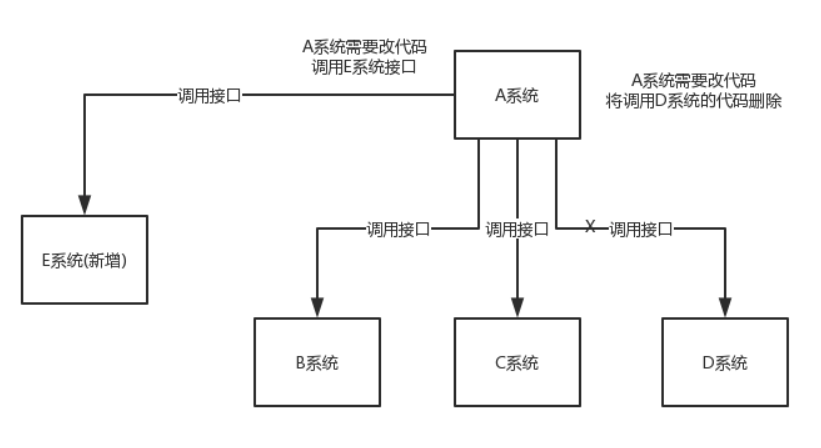
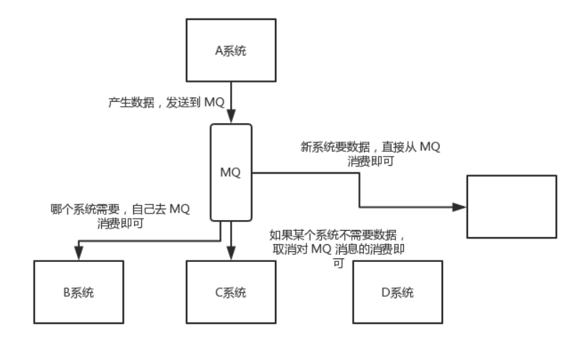
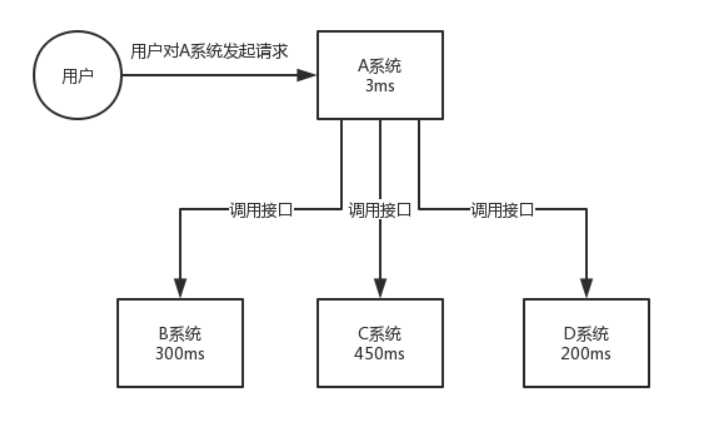
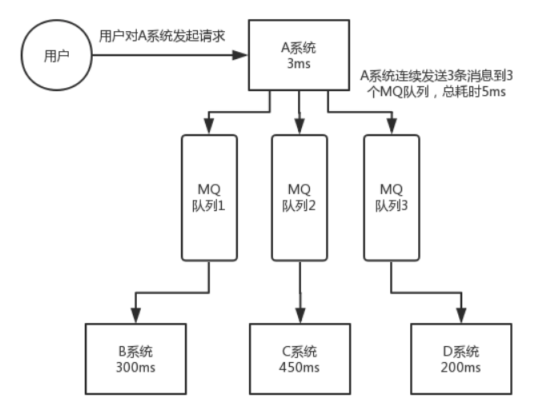
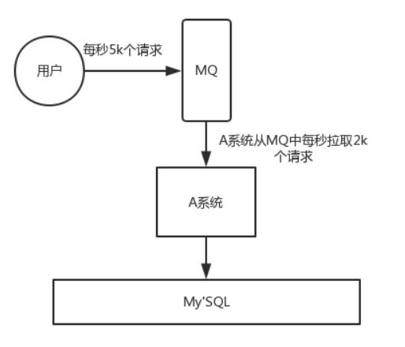
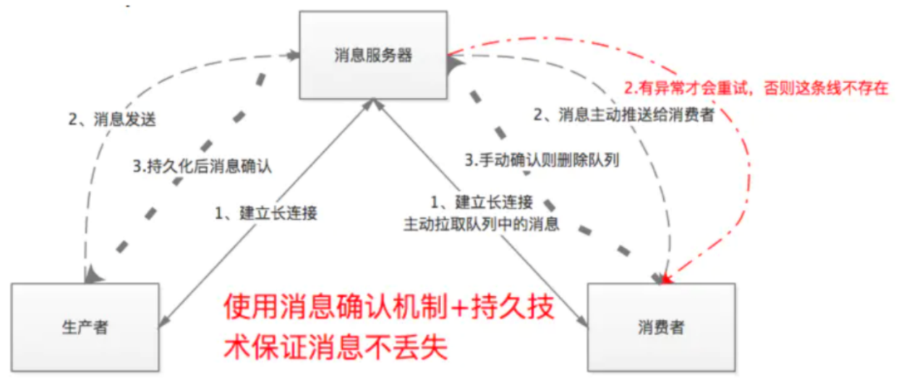

# RabbitMQ面试题

## 为什么使用MQ？

使用MQ的场景很多，主要有三个：解耦、异步、削峰。

- 解耦：假设现在，日志不光要插入到数据库里，还要在硬盘中增加文件类型的日志，同时，一些关键日志还要通过邮件的方式发送给指定的人。那么，如果按照原来的逻辑，A可能就需要在原来的代码上做扩展，除了B服务，还要加上日志文件的存储和日志邮件的发送。但是，如果你使用了MQ，那么，A服务是不需要做更改的，它还是将消息放到MQ中即可，其它的服务，无论是原来的B服务还是新增的日志文件存储服务或日志邮件发送服务，都直接从MQ中获取消息并处理即可。这就是解耦，它的好处是提高系统灵活性，扩展性。
- 异步：可以将一些非核心流程，如日志，短信，邮件等，通过MQ的方式异步去处理。这样做的好处是缩短主流程的响应时间，提升用户体验。
- 削峰：MQ的本质就是业务的排队。所以，面对突然到来的高并发，MQ也可以不用慌忙，先排好队，不要着急，一个一个来。削峰的好处就是避免高并发压垮系统的关键组件，如某个核心服务或数据库等。

下面附场景解释：

**解耦**

场景：A 系统发送数据到 BCD 三个系统，通过接口调用发送。如果 E 系统也要这个数据呢？那如果 C 系统现在不需要了呢？A 系统负责人几乎崩溃......



在这个场景中，A 系统跟其它各种乱七八糟的系统严重耦合，A 系统产生一条比较关键的数据，很多系统都需要 A 系统将这个数据发送过来。A 系统要时时刻刻考虑 BCDE 四个系统如果挂了该咋办？要不要重发，要不要把消息存起来？头发都白了啊！

如果使用 MQ，A 系统产生一条数据，发送到 MQ 里面去，哪个系统需要数据自己去 MQ 里面消费。如果新系统需要数据，直接从 MQ 里消费即可；如果某个系统不需要这条数据了，就取消对 MQ 消息的消费即可。这样下来，A 系统压根儿不需要去考虑要给谁发送数据，不需要维护这个代码，也不需要考虑人家是否调用成功、失败超时等情况。



总结：通过一个 MQ，Pub/Sub 发布订阅消息这么一个模型，A 系统就跟其它系统彻底解耦了。

**异步**

场景：A 系统接收一个请求，需要在自己本地写库，还需要在 BCD 三个系统写库，自己本地写库要 3ms，BCD 三个系统分别写库要 300ms、450ms、200ms。最终请求总延时是 3 + 300 + 450 + 200 = 953ms，接近 1s，用户感觉搞个什么东西，慢死了慢死了。用户通过浏览器发起请求，等待个 1s，这几乎是不可接受的。



一般互联网类的企业，对于用户直接的操作，一般要求是每个请求都必须在 200 ms 以内完成，对用户几乎是无感知的。

如果使用 MQ，那么 A 系统连续发送 3 条消息到 MQ 队列中，假如耗时 5ms，A 系统从接受一个请求到返回响应给用户，总时长是 3 + 5 = 8ms，对于用户而言，其实感觉上就是点个按钮，8ms 以后就直接返回了。



**削峰**

场景：每天 0:00 到 12:00，A 系统风平浪静，每秒并发请求数量就 50 个。结果每次一到 12:00 ~ 13:00 ，每秒并发请求数量突然会暴增到 5k+ 条。但是系统是直接基于 MySQL 的，大量的请求涌入 MySQL，每秒钟对 MySQL 执行约 5k 条 SQL。

使用 MQ，每秒 5k 个请求写入 MQ，A 系统每秒钟最多处理 2k 个请求，因为 MySQL 每秒钟最多处理 2k 个。A 系统从 MQ 中慢慢拉取请求，每秒钟就拉取 2k 个请求，不要超过自己每秒能处理的最大请求数量就 ok，这样下来，哪怕是高峰期的时候，A 系统也绝对不会挂掉。而 MQ 每秒钟 5k 个请求进来，就 2k 个请求出去，结果就导致在中午高峰期（1 个小时），可能有几十万甚至几百万的请求积压在 MQ 中。



这个短暂的高峰期积压是 ok 的，因为高峰期过了之后，每秒钟就 50 个请求进 MQ，但是 A 系统依然会按照每秒 2k 个请求的速度在处理。所以说，只要高峰期一过，A 系统就会快速将积压的消息给解决掉。

## 消息队列的缺点

1、 系统可用性降低

系统引入的外部依赖越多，越容易挂掉。

2、 系统复杂度提高

加入了消息队列，要多考虑很多方面的问题，比如：一致性问题、如何保证消息不被重复消费、如何保证消息可靠性传输等。因此，需要考虑的东西更多，复杂性增大。

3、 一致性问题

A 系统处理完了直接返回成功了，人都以为你这个请求就成功了；但是问题是，要是 BCD 三个系统那里，BD 两个系统写库成功了，结果 C 系统写库失败了，这就数据不一致了。

## Kafka、ActiveMQ、RabbitMQ、RocketMQ 有什么优缺点？

| 特性                     | ActiveMQ                              | RabbitMQ                                           | RocketMQ                                                     | Kafka                                                        |
| ------------------------ | ------------------------------------- | -------------------------------------------------- | ------------------------------------------------------------ | ------------------------------------------------------------ |
| 开发语言                 | java                                  | erlang                                             | java                                                         | scala                                                        |
| 单机吞吐量               | 万级，比 RocketMQ、Kafka 低一个数量级 | 同 ActiveMQ                                        | 10 万级，支撑高吞吐                                          | 10 万级，高吞吐，一般配合大数据类的系统来进行实时数据计算、日志采集等场景 |
| topic 数量对吞吐量的影响 |                                       |                                                    | topic 可以达到几百/几千的级别，吞吐量会有较小幅度的下降，这是 RocketMQ 的一大优势，在同等机器下，可以支撑大量的 topic | topic 从几十到几百个时候，吞吐量会大幅度下降，在同等机器下，Kafka 尽量保证 topic 数量不要过多，如果要支撑大规模的 topic，需要增加更多的机器资源 |
| 时效性                   | ms 级                                 | 微秒级，这是 RabbitMQ 的一大特点，延迟最低         | ms 级                                                        | 延迟在 ms 级以内                                             |
| 可用性                   | 高，基于主从架构实现高可用            | 同 ActiveMQ                                        | 非常高，分布式架构                                           | 非常高，分布式，一个数据多个副本，少数机器宕机，不会丢失数据，不会导致不可用 |
| 消息可靠性               | 有较低的概率丢失数据                  | 基本不丢                                           | 经过参数优化配置，可以做到 0 丢失                            | 同 RocketMQ                                                  |
| 功能支持                 | MQ 领域的功能极其完备                 | 基于 erlang 开发，并发能力很强，性能极好，延时很低 | MQ 功能较为完善，还是分布式的，扩展性好                      | 功能较为简单，主要支持简单的 MQ 功能，在大数据领域的实时计算以及日志采集被大规模使用 |
| 社区活跃度               | 低                                    | 很高                                               | 一般                                                         | 很高                                                         |

- 中小型公司，技术实力较为一般，技术挑战不是特别高，用 RabbitMQ 是不错的选择；
- 大型公司，基础架构研发实力较强，用 RocketMQ 是很好的选择。
- 大数据领域的实时计算、日志采集等场景，用 Kafka 是业内标准的，几乎是全世界这个领域的事实性规范。

## RabbitMQ是什么？

RabbitMQ是实现了高级消息队列协议（AMQP）的开源消息代理软件（亦称面向消息的中间件）。RabbitMQ服务器是用Erlang语言编写的，而群集和故障转移是构建在开放电信平台框架上的。所有主要的编程语言均有与代理接口通讯的客户端库。

## RabbitMQ特点?

可靠性: RabbitMQ使用一些机制来保证可靠性， 如持久化、传输确认及发布确认等。

灵活的路由 : 在消息进入队列之前，通过交换器来路由消息。对于典型的路由功能， RabbitMQ 己经提供了一些内置的交换器来实现。针对更复杂的路由功能，可以将多个 交换器绑定在一起， 也可以通过插件机制来实现自己的交换器。

扩展性: 多个RabbitMQ节点可以组成一个集群，也可以根据实际业务情况动态地扩展 集群中节点。

高可用性 : 队列可以在集群中的机器上设置镜像，使得在部分节点出现问题的情况下队 列仍然可用。

多种协议: RabbitMQ除了原生支持AMQP协议，还支持STOMP， MQTT等多种消息 中间件协议。

多语言客户端 :RabbitMQ 几乎支持所有常用语言，比如 Java、 Python、 Ruby、 PHP、 C#、 JavaScript 等。

管理界面 : RabbitMQ 提供了一个易用的用户界面，使得用户可以监控和管理消息、集 群中的节点等。

令插件机制: RabbitMQ 提供了许多插件 ， 以实现从多方面进行扩展，当然也可以编写自 己的插件。

## AMQP是什么?

RabbitMQ就是 AMQP 协议的 `Erlang` 的实现(当然 RabbitMQ 还支持 `STOMP2`、 `MQTT3` 等协议 ) AMQP 的模型架构 和 RabbitMQ 的模型架构是一样的，生产者将消息发送给交换器，交换器和队列绑定 。

RabbitMQ 中的交换器、交换器类型、队列、绑定、路由键等都是遵循的 AMQP 协议中相 应的概念。目前 RabbitMQ 最新版本默认支持的是 AMQP 0-9-1。

## AMQP的3层协议？

Module Layer:协议最高层，主要定义了一些客户端调用的命令，客户端可以用这些命令实现自己的业务逻辑。

Session Layer:中间层，主要负责客户端命令发送给服务器，再将服务端应答返回客户端，提供可靠性同步机制和错误处理。

TransportLayer:最底层，主要传输二进制数据流，提供帧的处理、信道服用、错误检测和数据表示等。

## 说说Broker服务节点、Queue队列、Exchange交换器？

- Broker可以看做RabbitMQ的服务节点。一般请下一个Broker可以看做一个RabbitMQ服务器。
- Queue:RabbitMQ的内部对象，用于存储消息。多个消费者可以订阅同一队列，这时队列中的消息会被平摊（轮询）给多个消费者进行处理。
- Exchange:生产者将消息发送到交换器，由交换器将消息路由到一个或者多个队列中。当路由不到时，或返回给生产者或直接丢弃。

## 如何保证消息的可靠性？

分三点：

* 生产者到RabbitMQ：事务机制和Confirm机制，注意：事务机制和 Confirm 机制是互斥的，两者不能共存，会导致 RabbitMQ 报错。
* RabbitMQ自身：持久化、集群、普通模式、镜像模式。
* RabbitMQ到消费者：basicAck机制、死信队列、消息补偿机制。

## 生产者消息运转的流程？

1. `Producer`先连接到Broker,建立连接Connection,开启一个信道(Channel)。

2. `Producer`声明一个交换器并设置好相关属性。

3. `Producer`声明一个队列并设置好相关属性。

4. `Producer`通过路由键将交换器和队列绑定起来。

5. `Producer`发送消息到`Broker`,其中包含路由键、交换器等信息。

6. 相应的交换器根据接收到的路由键查找匹配的队列。

7. 如果找到，将消息存入对应的队列，如果没有找到，会根据生产者的配置丢弃或者退回给生产者。

8. 关闭信道。

9. 管理连接。

## 消费者接收消息过程？

1. `Producer`先连接到`Broker`,建立连接`Connection`,开启一个信道(`Channel`)。

2. 向`Broker`请求消费响应的队列中消息，可能会设置响应的回调函数。

3. 等待`Broker`回应并投递相应队列中的消息，接收消息。

4. 消费者确认收到的消息,`ack`。

5. `RabbitMq`从队列中删除已经确定的消息。

6. 关闭信道。

7. 关闭连接。

## 生产者如何将消息可靠投递到RabbitMQ？

1. Client发送消息给MQ

2. MQ将消息持久化后，发送Ack消息给Client，此处有可能因为网络问题导致Ack消息无法发送到Client，那么Client在等待超时后，会重传消息；

3. Client收到Ack消息后，认为消息已经投递成功。

## RabbitMQ如何将消息可靠投递到消费者？

1. MQ将消息push给Client（或Client来pull消息）

2. Client得到消息并做完业务逻辑

3. Client发送Ack消息给MQ，通知MQ删除该消息，此处有可能因为网络问题导致Ack失败，那么Client会重复消息，这里就引出消费幂等的问题；

4. MQ将已消费的消息删除。

## 如何保证RabbitMQ消息队列的高可用?

RabbitMQ 有三种模式：`单机模式`，`普通集群模式`，`镜像集群模式`。

**单机模式**：就是demo级别的，一般就是你本地启动了玩玩儿的，没人生产用单机模式

**普通集群模式**：意思就是在多台机器上启动多个RabbitMQ实例，每个机器启动一个。

**镜像集群模式**：这种模式，才是所谓的RabbitMQ的高可用模式，跟普通集群模式不一样的是，你创建的queue，无论元数据(元数据指RabbitMQ的配置数据)还是queue里的消息都会存在于多个实例上，然后每次你写消息到queue的时候，都会自动把消息到多个实例的queue里进行消息同步。

## 消息队列的使用场景?

回答:消息队列主要有三大使用场景,分别是异步、流量削锋和应用解耦。另外还包含日志和消息通讯。

- 异步处理 - 相比于传统的串行、并行方式,提高了系统吞吐量。
- 应用解耦 - 系统间通过消息通信,不用关心其他系统的处理。
- 流量削锋 - 可以通过消息队列长度控制请求量;可以缓解短时间内的高并发请求。
- 日志处理 - 解决大量日志传输。
- 消息通讯 - 消息队列一般都内置了高效的通信机制,因此也可以用在纯的消息通讯。比如实现点对点消息队列,或者聊天室等。

## 消息队列有什么缺点

缺点有以下几个:

- 系统可用性降低:系统引入的外部依赖越多,越容易挂掉,本来你就是A系统调用BCD三个系统的接口就好了,人ABCD四个系统好好的,没啥问题,你偏加个MQ进来,万一MQ挂了咋整?MQ挂了,整套系统崩溃了,你不就完了么。

- 系统复杂性提高:硬生生加个MQ进来,你怎么保证消息没有重复消费?怎么处理消息丢失的情况?怎么保证消息传递的顺序性?头大头大,问题一大堆,痛苦不已
- 一致性问题:A系统处理完了直接返回成功了,人都以为你这个请求就成功了;但是问题是,要是BCD三个系统那里,BD两个系统写库成功了,结果C系统写库失败了,咋整?你这数据就不一致了。

## MQ如何保证消息的高可靠性?如何处理消息丢失的问题?

这里以RabbitMQ为例!



从三个方面来保证,分别是生产者、消息中间件和消费者

**生产者丢了数据**

```java
channel.confirmSelect();
............
if (channel.waitForConfirms()) {
	System.out.println("发送消息成功");
} else {
	System.out.println("发送消息失败");
}
```

**消息中间件丢了数据**

消息服务器对应的队列、交换机等都持久化,保证数据的不丢失。

消息写入之后会持久化到磁盘,哪怕是 RabbitMQ 自己挂了,恢复之后会自动读取之前存储的数据,一般数据不会丢。除非极其罕见的是,RabbitMQ 还没持久化,自己就挂了,可能导致少量数据丢失,但是这个概率较小。

设置持久化有两个步骤:

- 创建 queue 的时候将其设置为持久化这样就可以保证 RabbitMQ 持久化 queue 的元数据,但是它是不会持久化 queue 里的数据的。
- 第二个是发送消息的时候将消息的 deliveryMode 设置为 2就是将消息设置为持久化的,此时 RabbitMQ 就会将消息持久化到磁盘上去。

必须要同时设置这两个持久化才行,RabbitMQ 哪怕是挂了,再次重启,也会从磁盘上重启恢复 queue,恢复这个 queue 里的数据。

注意,哪怕是你给 RabbitMQ 开启了持久化机制,也有一种可能,就是这个消息写到了RabbitMQ 中,但是还没来得及持久化到磁盘上,结果不巧,此时 RabbitMQ 挂了,就会导致内存里的一点点数据丢失。

所以,持久化可以跟生产者那边的 confirm 机制配合起来,只有消息被持久化到磁盘之后,才会通知生产者 ack了,所以哪怕是在持久化到磁盘之前,RabbitMQ 挂了,数据丢了,生产者收不到 ack,你也是可以自己重发的。

**消费端弄丢了数据**

RabbitMQ 如果丢失了数据,主要是因为你消费的时候,刚消费到,还没处理,结果进程挂了,比如重启了,那么就尴尬了,RabbitMQ 认为你都消费了,这数据就丢了。
这个时候得用 RabbitMQ 提供的 ack 机制,简单来说,就是你必须关闭 RabbitMQ 的自动ack,可以通过一个 api 来调用就行,然后每次你自己代码里确保处理完的时候,再在程序里 ack 一把。这样的话,如果你还没处理完,不就没有 ack 了?那 RabbitMQ 就认为你还没处理完,这个时候 RabbitMQ 会把这个消费分配给别的 consumer 去处理,消息是不会丢的。

## MQ如何保证消息不被重复消费?如何保证消息消费的幂等性?

消息重复的原因有两个:1.生产时消息重复,2.消费时消息重复。

**生产时消息重复**

由于生产者发送消息给MQ,在MQ确认的时候出现了网络波动,生产者没有收到确认,实际上MQ已经接收到了消息。这时候生产者就会重新发送一遍这条消息。
生产者中如果消息未被确认,或确认失败,我们可以使用定时任务+(redis/db)来进行消息重试。

**消费时消息重复**

消费者消费成功后,再给MQ确认的时候出现了网络波动,MQ没有接收到确认,为了保证消息被消费,MQ就会继续给消费者投递之前的消息。这时候消费者就接收到了两条一样的消息。由于重复消息是由于网络原因造成的,因此不可避免重复消息。但是我们需要保证消息的幂等性。

**如何保证消息幂等性**

让每个消息携带一个全局的唯一ID,即可保证消息的幂等性,具体消费过程为:

1. 消费者获取到消息后先根据id去查询redis/db是否存在该消息。
2. 如果不存在,则正常消费,消费完毕后写入redis/db。
3. 如果存在,则证明消息被消费过,直接丢弃。

## MQ如何保证消息的顺序性?

**RabbitMQ**

- 拆分为多个queue,每个queue由一个consumer消费;
- 或者就一个queue但是对应一个consumer,然后这个consumer内部用内存队列做排队,然后分发给底层不同的worker来处理

**Kafka**

- 一个 topic,一个 partition,一个 consumer,内部单线程消费,单线程吞吐量太低,一般不会用这个。
- 写 N 个内存 queue,具有相同 key 的数据都到同一个内存 queue;然后对于 N 个线程,每个线程分别消费一个内存 queue 即可,这样就能保证顺序性。

## 消息队列对比

**MQ组件**：选择器、通道、缓存区。

比较核心的场景是：**解耦**，**异步**，**削峰**

> 场景：给第三方发送商品，走mq，避免直接rpc请求超时；保证业务逻辑无异常，出异常就异常池，人介入
>
> 买基金有待确认，敏感数据处理耗时复杂，大宗交易涉及审核，异步处理。
>
> 同步binlog数据，新增-修改-删除是按顺序的，不能就弄成了删除-修改-新增等等。

缺点：

1. 系统可用性降低：引入的外部依赖越多，越容易挂掉，万一MQ挂了怎么办，牵连系统都崩溃。

2. 系统复杂度提高：消息重复消费，消息丢失，消息传递顺序性。
3. 一致性问题：A系统成功了，BCD系统有失败的，数据就不一致了。

| 特性       | ActiveMQ               | RabbitMQ                                         | RocketMQ                                | Kafka                                                        |
| ---------- | ---------------------- | ------------------------------------------------ | --------------------------------------- | ------------------------------------------------------------ |
| 单机吞吐量 | 万级                   | 万级                                             | 10万级，高吞吐                          | 10万级，高吞吐，配置大数据类系统进行实时数据计算，日志采集   |
| topic数量  |                        |                                                  | 几百/几千，吞吐量有较小幅度下降（优势） | 几十/几百，吞吐量大幅下降，所以不宜过多，否则要增加机器资源  |
| 时效       | ms级                   | 微秒级，延迟最低                                 | ms级                                    | ms级以内                                                     |
| 可用性     | 基于主从架构时效高可用 | 基于主从架构实现高可用                           | 非常高，分布式架构                      | 非常高，分布式，一个数据多个副本，不会丢失数据，不会不可用   |
| 消息可靠性 | 较低概率丢失           | 基本不丢                                         | 参数优化配置，0丢失                     | 参数优化配置，0丢失                                          |
| 功能支持   | MQ领域的功能极其完备   | 基于erlang开发，并发能力很强，性能极好，延时很低 | MQ功能比较完善，分布式，拓展性好        | 只支持简单的MQ功能，在大数据领域实时计算和采集日志大规模使用 |

**RabbitMQ的exchange类型**：direct、fanout、topic、headers。

**RabbitMQ的高可用**：是基于主从（非分布式）做高可用。三种模式如下

1. 单机模式。
2. 普通集群模式（无高可用性）：在多台机器启动多个RabbitMQ实例，每个机器启动一个，创建的queue，只会放在一个RabbitMQ实例上，但是每个实例都同步queue的元数据（元数据可以认为是queue的一些配置信息，通过元数据，可以找到queue所在实例），消费的时候，实际链接到了另一个实例，那个实例会从queue所在实例上拉取数据过来。缺点一来数据传输频繁，二来queue所在节点挂掉就找不回了（可开持久化）。
3. 镜像集群模式（高可用性）：创建的queue，无论元数据还是queue里的消息都会存在于多个实例中，就是每个RabbitMQ节点都有这个queue一个完整镜像，包含queue的全部数据，写消息时，自动同步到多个实例queue上。缺点是同步开销大，消耗带宽也多，数据大到装不下就麻烦了。

**Kafka的高可用**：message包括：消息长度、版本号、CRC校验码、具体消息。

**Kafka基本架构**：由多个broker组成，每个broker是一个节点，你创建的topic，这个topic可以划分为多个partition，每个partition可以存在于不同的broker上，每个partition就放一部分数据。

这就是天然的分布式消息队列，就是说一个topic的数据，是分散放在多个机器上的，每个机器就放一部分数据。

实际上Kafka的高可用，就是在于给这些broker创建在不同机器上的副本，只有一个leader，leader负责把数据同步到所有的follower，读写数据都只在leader。写数据时需要leader和follower全部成功，消费只有leader，但是也需要所有follower同步成功返回ack，这个数据才会被消费者读到。

**重复消费问题**：例如消费完数据要ack一下的，但是进程被kill没有发，误以为还没消费，重启项目之后又收到了。涉及到消费的幂等性，避免数据有重复。解决方向有下面这些：

> 1. 数据库写库，根据主键查下，这条数据有了，就不插入了，update下就好。
> 2. 写redis的，就没事，因为每次都是set，天然幂等性。
> 3. 上面两个都不是，就让生产者发送每条数据加个全局唯一id，类似订单id之类的，到redis查下之前是否消费过，没有消费过，现在消费了，就再写到redis。
> 4. 基于数据库的唯一键来保证重复数据不会插入多条。

**消息丢失**：

> 丢失的可能：1.消息在传入过程中丢失，2.MQ挂了，消息跟着没了，3.消费者收到消息还没处理就挂了。

第一个，RabbitMQ有事务channel.txSelect，发送消息没被mq成功收到就回滚事务channel.txRollback，然后重试发送消息，收到了，那么可以提交事务channel.txCommit。这么弄基本上吞吐量会下来，因为太耗性能。

为了不丢，可以开启confirm模式，生产者设置开启confirm模式之后，每次写消息都会分配一个唯一的id，写入RabbitMQ了，MQ会回传一个ack消息，说ok了，如果RabbitMQ没能处理这个消息，会回调你的一个nack接口，说失败了，你可以重试，而且你可以结合这个机制在内存唯一每个消息id的状态，超过一定时间没有收到回调，就重发。（waitForConfirm/回调）

第二个在MQ做持久化，步骤：1. 创建queue时设置持久化元数据，2.发送消息deliveryMode设置为2才行。（创建channel时有参数设置true）

第三个也是要做ack，关闭RabbitMQ自动ack，让消费者完主动ack回MQ（basicAck方法）。

kafka避免数据丢失做法则是要求partition至少两个副本，leader至少感知一个follower没掉队，生产者写入数据必须要写入所有副本之后才是写成功，写入失败，无限重试。

**消息顺序执行**：

1. RabbitMQ：拆分到多个queue，每个queue一个consumer；或者一个queue对应一个consumer，然后这个consumer内部用内存队列做排队，然后分发给底层不同的worker来处理。
2. Kafka：一个topic一个partition一个consumer内部单线程消费但不会用。写N个内存queue，具有相同key的数据都到同一个内存queue；对于N个线程，每个线程分别消费一个内存queue即可。

**消息大量堆积**：

* 先修复consumer，确保其恢复消费速度。
* 新建一个topic，partition是原来的10倍，临时建立好原先10倍的queue数量。
* 然后写一个临时的分发数据的consumer程序，这个程序部署上去消费积压的数据，消费之后不做耗时的处理，直接均匀轮询写入临时建立好的10倍数量的queue。
* 临时征用10倍的机器来部署consumer，每一批consumer消费一个临时queue的数据，这种做法相当于临时将queue资源和consumer资源扩大10倍，以正常10倍的速度来消费数据。
* 等快速消费完积压数据之后，得恢复原先部署的架构，重新用原来的consumer机器来消费消息。

**mq中的消息过期失效了**：有些数据设置了过期时间，但是大量积压下没有被消费，则被直接丢失了。一般可以在不活跃时间，重查出数据再跑。

**mq写满了**：按消息大量积压的来不及了，只能写程序消费一个丢弃一个，然后在按不活跃数据重查数据再跑。

**mq消息确认**：Rabbitmq生产者有channel.waitForConfirms()机制/事务（但是回滚动会把全部都回滚，性能一般）。消费者有1-自动应答，2-手动应答（channel.basicAck(envelope.getDeliveryTag(), false);），失败basicReject（..））。自动应答存在缺陷，消息被消费者接收到就应答，但是如果消费者消费消息失败，这时候会造成消息丢失。手动应答我们可以手工控制，在消息被消费者消息完之后再手工给予应答，这样消息不会丢失。

## RabbitMQ 的使用场景有哪些？

抢购活动，削峰填谷，防止系统崩塌。

延迟信息处理，比如 10 分钟之后给下单未付款的用户发送邮件提醒。

解耦系统，对于新增的功能可以单独写模块扩展，比如用户确认评价之后，新增了给用户返积分的功能，这个时候不用在业务代码里添加新增积分的功能，只需要把新增积分的接口订阅确认评价的消息队列即可，后面再添加任何功能只需要订阅对应的消息队列即可。

## RabbitMQ 有哪些重要的角色？

RabbitMQ 中重要的角色有：生产者、消费者和代理：

- 生产者：消息的创建者，负责创建和推送数据到消息服务器；

- 消费者：消息的接收方，用于处理数据和确认消息；

- 代理：就是 RabbitMQ 本身，用于扮演“快递”的角色，本身不生产消息，只是扮演“快递”的角色。

## RabbitMQ 有哪些重要的组件？

- ConnectionFactory（连接管理器）：应用程序与Rabbit之间建立连接的管理器，程序代码中使用。

- Channel（信道）：消息推送使用的通道。

- Exchange（交换器）：用于接受、分配消息。

- Queue（队列）：用于存储生产者的消息。

- RoutingKey（路由键）：用于把生成者的数据分配到交换器上。

- BindingKey（绑定键）：用于把交换器的消息绑定到队列上。

## RabbitMQ 中 vhost 的作用是什么？

vhost：每个 RabbitMQ 都能创建很多 vhost，我们称之为虚拟主机，每个虚拟主机其实都是 mini 版的RabbitMQ，它拥有自己的队列，交换器和绑定，拥有自己的权限机制。

## RabbitMQ 的消息是怎么发送的？

首先客户端必须连接到 RabbitMQ 服务器才能发布和消费消息，客户端和 rabbit server 之间会创建一个 tcp 连接。

一旦 tcp 打开并通过了认证（认证就是你发送给 rabbit 服务器的用户名和密码），你的客户端和 RabbitMQ 就创建了一条 amqp 信道（channel）。

信道是创建在“真实” tcp 上的虚拟连接，amqp 命令都是通过信道发送出去的，每个信道都会有一个唯一的 id，不论是发布消息，订阅队列都是通过这个信道完成的。

## RabbitMQ 怎么保证消息的稳定性？

提供了事务的功能。 通过将 channel 设置为 confirm（确认）模式。

## RabbitMQ 怎么避免消息丢失？

消息持久化，当然前提是队列必须持久化
RabbitMQ确保持久性消息能从服务器重启中恢复的方式是，将它们写入磁盘上的一个持久化日志文件，当发布一条持久性消息到持久交换器上时，Rabbit会在消息提交到日志文件后才发送响应。

一旦消费者从持久队列中消费了一条持久化消息，RabbitMQ会在持久化日志中把这条消息标记为等待垃圾收集。如果持久化消息在被消费之前RabbitMQ重启，那么Rabbit会自动重建交换器和队列（以及绑定），并重新发布持久化日志文件中的消息到合适的队列。

## 要保证消息持久化成功的条件有哪些？

### 声明队列必须设置持久化 durable 设置为 true.

- 消息推送投递模式必须设置持久化，deliveryMode 设置为 2（持久）。

- 消息已经到达持久化交换器。

- 消息已经到达持久化队列。

- 以上四个条件都满足才能保证消息持久化成功。

## RabbitMQ 持久化有什么缺点？

持久化的缺地就是降低了服务器的吞吐量，因为使用的是磁盘而非内存存储，从而降低了吞吐量。可尽量使用 ssd 硬盘来缓解吞吐量的问题。

## RabbitMQ 有几种广播类型？

- direct（默认方式）：最基础最简单的模式，发送方把消息发送给订阅方，如果有多个订阅者，默认采取轮询的方式进行消息发送。

- headers：与 direct 类似，只是性能很差，此类型几乎用不到。

- fanout：分发模式，把消费分发给所有订阅者。

- topic：匹配订阅模式，使用正则匹配到消息队列，能匹配到的都能接收到。

## RabbitMQ 怎么实现延迟消息队列？

延迟队列的实现有两种方式：

- 通过消息过期后进入死信交换器，再由交换器转发到延迟消费队列，实现延迟功能；

- 使用 RabbitMQ-delayed-message-exchange 插件实现延迟功能。

## RabbitMQ 集群有什么用？

集群主要有以下两个用途：

- 高可用：某个服务器出现问题，整个 RabbitMQ 还可以继续使用；

- 高容量：集群可以承载更多的消息量。

## RabbitMQ 节点的类型有哪些？

- 磁盘节点：消息会存储到磁盘。

- 内存节点：消息都存储在内存中，重启服务器消息丢失，性能高于磁盘类型。

## RabbitMQ 集群搭建需要注意哪些问题？

- 各节点之间使用“–link”连接，此属性不能忽略。

- 各节点使用的 erlang cookie 值必须相同，此值相当于“秘钥”的功能，用于各节点的认证。

- 整个集群中必须包含一个磁盘节点。

## RabbitMQ 每个节点是其他节点的完整拷贝吗？为什么？

不是，原因有以下两个：

- 存储空间的考虑：如果每个节点都拥有所有队列的完全拷贝，这样新增节点不但没有新增存储空间，反而增加了更多的冗余数据；

- 性能的考虑：如果每条消息都需要完整拷贝到每一个集群节点，那新增节点并没有提升处理消息的能力，最多是保持和单节点相同的性能甚至是更糟。

## RabbitMQ 集群中唯一一个磁盘节点崩溃了会发生什么情况？

如果唯一磁盘的磁盘节点崩溃了，

不能进行以下操作：

1.不能创建队列

2.不能创建交换器

3.不能创建绑定

4.不能添加用户

5.不能更改权限

6.不能添加和删除集群节点

唯一磁盘节点崩溃了，集群是可以保持运行的，但你不能更改任何东西。

## RabbitMQ 对集群节点停止顺序有要求吗？

RabbitMQ 对集群的停止的顺序是有要求的，应该先关闭内存节点，最后再关闭磁盘节点。如果顺序恰好相反的话，可能会造成消息的丢失

## 消息怎么路由？

从概念上来说，消息路由必须有三部分：交换器、路由、绑定。生产者把消息发布到交换器上；绑定决定了消息如何从路由器路由到特定的队列；消息最终到达队列，并被消费者接收。

消息发布到交换器时，消息将拥有一个路由键（routing key），在消息创建时设定。

通过队列路由键，可以把队列绑定到交换器上。

消息到达交换器后，RabbitMQ会将消息的路由键与队列的路由键进行匹配（针对不同的交换器有不同的路由规则）。如果能够匹配到队列，则消息会投递到相应队列中；如果不能匹配到任何队列，消息将进入 “黑洞”。

常用的交换器主要分为一下三种：

- direct：如果路由键完全匹配，消息就被投递到相应的队列

- fanout：如果交换器收到消息，将会广播到所有绑定的队列上

- topic：可以使来自不同源头的消息能够到达同一个队列。使用topic交换器时，可以使用通配符。
  比如：“*” 匹配特定位置的任意文本， “.” 把路由键分为了几部分，“#” 匹配所有规则等。

特别注意：发往topic交换器的消息不能随意的设置选择键（routing_key），必须是由"."隔开的一系列的标识符组成。

## 如何确保消息正确地发送至RabbitMQ？

RabbitMQ使用发送方确认模式，确保消息正确地发送到RabbitMQ。

**发送方确认模式**：将信道设置成confirm模式（发送方确认模式），则所有在信道上发布的消息都会被指派一个唯一的ID。

一旦消息被投递到目的队列后，或者消息被写入磁盘后（可持久化的消息），信道会发送一个确认给生产者（包含消息唯一ID）。

如果RabbitMQ发生内部错误从而导致消息丢失，会发送一条nack（not acknowledged，未确认）消息。

发送方确认模式是异步的，生产者应用程序在等待确认的同时，可以继续发送消息。当确认消息到达生产者应用程序，生产者应用程序的回调方法就会被触发来处理确认消息。

## 如何确保消息接收方消费了消息？

**接收方消息确认机制**：消费者接收每一条消息后都必须进行确认（消息接收和消息确认是两个不同操作）。

只有消费者确认了消息，RabbitMQ才能安全地把消息从队列中删除。这里并没有用到超时机制，RabbitMQ仅通过Consumer的连接中断来确认是否需要重新发送消息。

也就是说，只要连接不中断，RabbitMQ给了Consumer足够长的时间来处理消息。

下面罗列几种特殊情况：

- 如果消费者接收到消息，在确认之前断开了连接或取消订阅，RabbitMQ会认为消息没有被分发，然后重新分发给下一个订阅的消费者。（可能存在消息重复消费的隐患，需要根据bizId去重）

- 如果消费者接收到消息却没有确认消息，连接也未断开，则RabbitMQ认为该消费者繁忙，将不会给该消费者分发更多的消息。

## 如何避免消息重复投递或重复消费？

在消息生产时，MQ内部针对每条生产者发送的消息生成一个inner-msg-id，作为去重和幂等的依据（消息投递失败并重传），避免重复的消息进入队列；

在消息消费时，要求消息体中必须要有一个bizId（对于同一业务全局唯一，如支付ID、订单ID、帖子ID等）作为去重和幂等的依据，避免同一条消息被重复消费。

这个问题针对业务场景来答分以下几点：

- 1.比如，你拿到这个消息做数据库的insert操作。那就容易了，给这个消息做一个唯一主键，那么就算出现重复消费的情况，就会导致主键冲突，避免数据库出现脏数据。

- 2.再比如，你拿到这个消息做redis的set的操作，那就容易了，不用解决，因为你无论set几次结果都是一样的，set操作本来就算幂等操作。

- 3.如果上面两种情况还不行，上大招。准备一个第三方介质,来做消费记录。以redis为例，给消息分配一个全局id，只要消费过该消息，将<id,message>以K-V形式写入redis。那消费者开始消费前，先去redis中查询有没消费记录即可。

## 如何解决丢数据的问题?

1.生产者丢数据

生产者的消息没有投递到MQ中怎么办？从生产者弄丢数据这个角度来看，RabbitMQ提供transaction和confirm模式来确保生产者不丢消息。

transaction机制就是说，发送消息前，开启事物(channel.txSelect())，然后发送消息，如果发送过程中出现什么异常，事物就会回滚(channel.txRollback())，如果发送成功则提交事物(channel.txCommit())。

然而缺点就是吞吐量下降了。因此，按照博主的经验，生产上用confirm模式的居多。一旦channel进入confirm模式，所有在该信道上面发布的消息都将会被指派一个唯一的ID(从1开始)，一旦消息被投递到所有匹配的队列之后，rabbitMQ就会发送一个Ack给生产者(包含消息的唯一ID)，这就使得生产者知道消息已经正确到达目的队列了，如果rabiitMQ没能处理该消息，则会发送一个Nack消息给你，你可以进行重试操作。

2.消息队列丢数据

处理消息队列丢数据的情况，一般是开启持久化磁盘的配置。这个持久化配置可以和confirm机制配合使用，你可以在消息持久化磁盘后，再给生产者发送一个Ack信号。这样，如果消息持久化磁盘之前，rabbitMQ阵亡了，那么生产者收不到Ack信号，生产者会自动重发。

那么如何持久化呢，这里顺便说一下吧，其实也很容易，就下面两步

①、将queue的持久化标识durable设置为true,则代表是一个持久的队列

②、发送消息的时候将deliveryMode=2

这样设置以后，rabbitMQ就算挂了，重启后也能恢复数据。在消息还没有持久化到硬盘时，可能服务已经死掉，这种情况可以通过引入mirrored-queue即镜像队列，但也不能保证消息百分百不丢失（整个集群都挂掉）

3.消费者丢数据

启用手动确认模式可以解决这个问题

①自动确认模式，消费者挂掉，待ack的消息回归到队列中。消费者抛出异常，消息会不断的被重发，直到处理成功。不会丢失消息，即便服务挂掉，没有处理完成的消息会重回队列，但是异常会让消息不断重试。

②手动确认模式，如果消费者来不及处理就死掉时，没有响应ack时会重复发送一条信息给其他消费者；如果监听程序处理异常了，且未对异常进行捕获，会一直重复接收消息，然后一直抛异常；如果对异常进行了捕获，但是没有在finally里ack，也会一直重复发送消息(重试机制)。

③不确认模式，acknowledge="none" 不使用确认机制，只要消息发送完成会立即在队列移除，无论客户端异常还是断开，只要发送完就移除，不会重发。

## 死信队列和延迟队列的使用?

**死信消息：**

- 消息被拒绝（Basic.Reject或Basic.Nack）并且设置 requeue 参数的值为 false

- 消息过期了

- 队列达到最大的长度

**过期消息：**

在 rabbitmq 中存在2种方可设置消息的过期时间，

第一种通过对队列进行设置，这种设置后，该队列中所有的消息都存在相同的过期时间，

第二种通过对消息本身进行设置，那么每条消息的过期时间都不一样。

如果同时使用这2种方法，那么以过期时间小的那个数值为准。当消息达到过期时间还没有被消费，那么那个消息就成为了一个 死信 消息。

- 队列设置：在队列申明的时候使用 x-message-ttl 参数，单位为 毫秒

- 单个消息设置：是设置消息属性的 expiration 参数的值，单位为 毫秒

**延时队列：**

在rabbitmq中不存在延时队列，但是我们可以通过设置消息的过期时间和死信队列来模拟出延时队列。

消费者监听死信交换器绑定的队列，而不要监听消息发送的队列。

有了以上的基础知识，我们完成以下需求：

需求：用户在系统中创建一个订单，如果超过时间用户没有进行支付，那么自动取消订单。

分析：

1、上面这个情况，我们就适合使用延时队列来实现，那么延时队列如何创建

2、延时队列可以由 过期消息+死信队列 来时间


3、过期消息通过队列中设置 x-message-ttl 参数实现

4、死信队列通过在队列申明时，给队列设置 x-dead-letter-exchange 参数，然后另外申明一个队列绑定x-dead-letter-exchange对应的交换器。

```java
ConnectionFactory factory = new ConnectionFactory(); 
factory.setHost("127.0.0.1"); 
factory.setPort(AMQP.PROTOCOL.PORT); 
factory.setUsername("guest"); 
factory.setPassword("guest"); 
Connection connection = factory.newConnection(); 
Channel channel = connection.createChannel();

// 声明一个接收被删除的消息的交换机和队列 
String EXCHANGE_DEAD_NAME = "exchange.dead"; 
String QUEUE_DEAD_NAME = "queue_dead"; 
channel.exchangeDeclare(EXCHANGE_DEAD_NAME, BuiltinExchangeType.DIRECT); 
channel.queueDeclare(QUEUE_DEAD_NAME, false, false, false, null); 
channel.queueBind(QUEUE_DEAD_NAME, EXCHANGE_DEAD_NAME, "routingkey.dead"); 

String EXCHANGE_NAME = "exchange.fanout"; 
String QUEUE_NAME = "queue_name"; 
channel.exchangeDeclare(EXCHANGE_NAME, BuiltinExchangeType.FANOUT); 
Map<String, Object> arguments = new HashMap<String, Object>(); 
// 统一设置队列中的所有消息的过期时间 
arguments.put("x-message-ttl", 30000); 
// 设置超过多少毫秒没有消费者来访问队列，就删除队列的时间 
arguments.put("x-expires", 20000); 
// 设置队列的最新的N条消息，如果超过N条，前面的消息将从队列中移除掉 
arguments.put("x-max-length", 4); 
// 设置队列的内容的最大空间，超过该阈值就删除之前的消息
arguments.put("x-max-length-bytes", 1024); 
// 将删除的消息推送到指定的交换机，一般x-dead-letter-exchange和x-dead-letter-routing-key需要同时设置
arguments.put("x-dead-letter-exchange", "exchange.dead"); 
// 将删除的消息推送到指定的交换机对应的路由键 
arguments.put("x-dead-letter-routing-key", "routingkey.dead"); 
// 设置消息的优先级，优先级大的优先被消费 
arguments.put("x-max-priority", 10); 
channel.queueDeclare(QUEUE_NAME, false, false, false, arguments); 
channel.queueBind(QUEUE_NAME, EXCHANGE_NAME, ""); 
String message = "Hello RabbitMQ: "; 

for(int i = 1; i <= 5; i++) { 
  // expiration: 设置单条消息的过期时间 
  AMQP.BasicProperties.Builder properties = new AMQP.BasicProperties().builder()
      .priority(i).expiration( i * 1000 + ""); 
  channel.basicPublish(EXCHANGE_NAME, "", properties.build(), (message + i).getBytes("UTF-8")); 
} 
channel.close(); 
connection.close();
```

## 无法被路由的消息去了哪里?

无设置的情况下，无法路由（Routing key错误）的消息会被直接丢弃

**解决方案：**

将mandatory设置为true，并配合ReturnListener，实现消息的回发

声明交换机时，指定备份的交换机

```java
Map<String,Object> arguments = new HashMap<String,Object>();
arguments.put("alternate-exchange","备份交换机名");
```

## 如何保证消息的顺序性

一个队列只有一个消费者的情况下才能保证顺序，否则只能通过全局ID实现（每条消息都一个msgId，关联的消息拥有一个parentMsgId。可以在消费端实现前一条消息未消费，不处理下一条消息；也可以在生产端实现前一条消息未处理完毕，不发布下一条消息）

## vhost 是什么？起什么作用？


vhost 可以理解为虚拟 broker ，即 mini-RabbitMQ server。其内部均含有独立的queue、exchange 和 binding 等，但最最重要的是，其拥有独立的权限系统，可以做到vhost 范围的用户控制。

当然，从 RabbitMQ 的全局角度，vhost 可以作为不同权限隔离的手段（一个典型的例子就是不同的应用可以跑在不同的 vhost 中）。


## AMQP协议3层？


**1、** Module Layer：协议最高层，主要定义了一些客户端调用的命令，客户端可以用这些命令实现自己的业务逻辑。

**2、** Session Layer：中间层，主要负责客户端命令发送给服务器，再将服务端应答返回客户端，提供可靠性同步机制和错误处理。

**3、** TransportLayer：最底层，主要传输二进制数据流，提供帧的处理、信道服用、错误检测和数据表示等。


## RabbitMQ topic 主题模式(路由模式的一种)

**1、** 星号井号代表通配符

**2、** 星号代表多个单词,井号代表一个单词

**3、** 路由功能添加模糊匹配

**4、** 消息产生者产生消息,把消息交给交换机

**5、** 交换机根据key的规则模糊匹配到对应的队列,由队列的监听消费者接收消息消费

在我的理解看来就是routing查询的一种模糊匹配，就类似sql的模糊查询方式


## RabbitMQ基本概念


**1、** Broker： 简单来说就是消息队列服务器实体

**2、** Exchange： 消息交换机，它指定消息按什么规则，路由到哪个队列

**3、** Queue： 消息队列载体，每个消息都会被投入到一个或多个队列

**4、** Binding： 绑定，它的作用就是把exchange和queue按照路由规则绑定起来

**5、** Routing Key： 路由关键字，exchange根据这个关键字进行消息投递

**6、** VHost： vhost 可以理解为虚拟 broker ，即 mini-RabbitMQ server。其内部均含有独立的 queue、exchange 和 binding 等，但最最重要的是，其拥有独立的权限系统，可以做到 vhost 范围的用户控制。当然，从 RabbitMQ 的全局角度，vhost 可以作为不同权限隔离的手段（一个典型的例子就是不同的应用可以跑在不同的 vhost 中）。

**7、** Producer： 消息生产者，就是投递消息的程序

**8、** Consumer： 消息消费者，就是接受消息的程序

**9、** Channel： 消息通道，在客户端的每个连接里，可建立多个channel，每个channel代表一个会话任务

由Exchange、Queue、RoutingKey三个才能决定一个从Exchange到Queue的唯一的线路。


## 消息如何被优先消费？


生产者

```
Map<String, Object> argss = new HashMap<String, Object>();
argss.put("x-max-priority",10);
```

消费者

```
AMQP.BasicProperties properties = new AMQP.BasicProperties.Builder()
    .priority(5) // 优先级，默认为5，配合队列的 x-max-priority 属性使用
```


## 在单 node 系统和多 node 构成的 cluster 系统中声明 queue、exchange ，以及进行 binding 会有什么不同？


当你在单 node 上声明 queue 时，只要该 node 上相关元数据进行了变更，你就会得到 Queue.Declare-ok 回应；而在 cluster 上声明 queue ，则要求 cluster 上的全部node 都要进行元数据成功更新，才会得到 Queue.Declare-ok 回应。

另外，若 node 类型为 RAM node 则变更的数据仅保存在内存中，若类型为 disk node 则还要变更保存在磁盘上的数据。


## RabbitMQ消息是如何路由的？


**消息路由必须有三部分：交换器、路由、绑定。**

生产者把消息发布到交换器上，绑定决定了消息如何从路由器路由到特定的队列；消息最终到达队列，并被消费者接收。

1. 消息发布到交换器时，消息将拥有一个 路由键（routing key） ， 在消息创建时设定。
2. 通过队列路由键，可以把队列绑定到交换器上。
3. 消息到达交换器后，RabbitMQ会将消息的路由键与队列的路由键进行匹配（针对不同的交换器有不同的路由规则）。如果能够匹配到队列，则消息会投递到相应队列中；如果不能匹配到任何队列，消息将进入"黑洞"。

**常用的交换器主要分为以下三种：**

1. direct ：如果路由键完全匹配，消息就会被投递到相应的队列；每个AMQP的实现都必须有一个direct交换器，包含一个空白字符串名称的默认交换器。声明一个队列时，会自动绑定到默认交换器，并且以队列名称作为路由键：channel -> basic_public($msg, '', 'queue-name')
2. fanout ： 如果交换器收到消息，将会广播到所有绑定的队列上；
3. topic ：可以使来自不同源头的消息能够到达同一个队列。使用topic交换器时，可以使用通配符，比如："*" 匹配特定位置的任意文本，"." 把路由键分为了几个标识符， "#" 匹配所有规则等。
4. 特别注意：发往topic交换器的消息不能随意的设置选择键（routing_key），必须是有"."隔开的一系列的标识符组成。


## 交换器4种类型？


主要有以下4种。

fanout:把所有发送到该交换器的消息路由到所有与该交换器绑定的队列中。

direct:把消息路由到BindingKey和RoutingKey完全匹配的队列中。

topic:

匹配规则：

RoutingKey 为一个 点号'.': 分隔的字符串。 比如: java.xiaoka.show

BindingKey和RoutingKey一样也是点号“.“分隔的字符串。

BindingKey可使用 _ 和 # 用于做模糊匹配，_匹配一个单词，#匹配多个或者0个

headers:不依赖路由键匹配规则路由消息。是根据发送消息内容中的headers属性进行匹配。性能差，基本用不到。


## 交换器无法根据自身类型和路由键找到符合条件队列时，有哪些处理？


mandatory ：true 返回消息给生产者。

mandatory: false 直接丢弃。


## RabbitMQ队列结构？


**通常由以下两部分组成：**

rabbit_amqqueue_process：负责协议相关的消息处理，即接收生产者的消息、向消费者交付消息、处理消息的确认(包括生产端的 confirm 和消费端的 ack) 等。

backing_queue：是消息存储的具体形式和引擎，并向 rabbit amqqueue process 提供相关的接口以供调用。

## 如何解决消息队列的延时以及过期失效问题？消息队列满了以后该怎么处理？有几百万消息持续积压几小时，怎么办？ 


**消息积压处理办法：临时紧急扩容：**

**1、** 先修复 consumer 的问题，确保其恢复消费速度，然后将现有 cnosumer 都停掉。

**2、** 新建一个 topic，partition 是原来的 10 倍，临时建立好原先 10 倍的 queue 数量。

**3、** 然后写一个临时的分发数据的 consumer 程序，这个程序部署上去消费积压的数据，消费之后不做耗时的处理，直接均匀轮询写入临时建立好的 10 倍数量的 queue。

**4、** 接着临时征用 10 倍的机器来部署 consumer，每一批 consumer 消费一个临时 queue 的数据。这种做法相当于是临时将 queue 资源和 consumer 资源扩大 10 倍，以正常的 10 倍速度来消费数据。

**5、** 等快速消费完积压数据之后，得恢复原先部署的架构，重新用原先的 consumer 机器来消费消息。

**6、** MQ中消息失效：假设你用的是 RabbitMQ，RabbtiMQ 是可以设置过期时间的，也就是 TTL。如果消息在 queue 中积压超过一定的时间就会被 RabbitMQ 给清理掉，这个数据就没了。那这就是第二个坑了。这就不是说数据会大量积压在 mq 里，而是大量的数据会直接搞丢。我们可以采取一个方案，就是批量重导，这个我们之前线上也有类似的场景干过。就是大量积压的时候，我们当时就直接丢弃数据了，然后等过了高峰期以后，比如大家一起喝咖啡熬夜到晚上12点以后，用户都睡觉了。这个时候我们就开始写程序，将丢失的那批数据，写个临时程序，一点一点的查出来，然后重新灌入 mq 里面去，把白天丢的数据给他补回来。也只能是这样了。假设 1 万个订单积压在 mq 里面，没有处理，其中 1000 个订单都丢了，你只能手动写程序把那 1000 个订单给查出来，手动发到 mq 里去再补一次。

**mq消息队列块满了：**

如果消息积压在 mq 里，你很长时间都没有处理掉，此时导致 mq 都快写满了，咋办？这个还有别的办法吗？没有，谁让你第一个方案执行的太慢了，你临时写程序，接入数据来消费，消费一个丢弃一个，都不要了，快速消费掉所有的消息。然后走第二个方案，到了晚上再补数据吧。


## 为什么说保证 message 被可靠持久化的条件是 queue 和 exchange 具有durable 属性，同时 message 具有 persistent 属性才行？


binding 关系可以表示为 exchange – binding – queue 。从文档中我们知道，若要求投递的 message 能够不丢失，要求 message 本身设置 persistent 属性，要求 exchange和 queue 都设置 durable 属性。

其实这问题可以这么想，若 exchange 或 queue 未设置durable 属性，则在其 crash 之后就会无法恢复，那么即使 message 设置了 persistent 属性，仍然存在 message 虽然能恢复但却无处容身的问题；同理，若 message 本身未设置persistent 属性，则 message 的持久化更无从谈起。


## 如何自动删除长时间没有消费的消息？


```
// 通过队列属性设置消息过期时间
Map<String, Object> argss = new HashMap<String, Object>();
argss.put("x-message-ttl",6000);

// 对每条消息设置过期时间
AMQP.BasicProperties properties = new AMQP.BasicProperties.Builder()
    .expiration("10000") // TTL
```


## RabbitMQ 概念里的 channel、exchange 和 queue 这些东东是逻辑概念，还是对应着进程实体？这些东东分别起什么作用？


queue 具有自己的 erlang 进程；exchange 内部实现为保存 binding 关系的查找表；channel 是实际进行路由工作的实体，即负责按照 routing_key 将 message 投递给queue 。由 AMQP 协议描述可知，channel 是真实 TCP 连接之上的虚拟连接，所有AMQP 命令都是通过 channel 发送的，且每一个 channel 有唯一的 ID。

一个 channel 只能被单独一个操作系统线程使用，故投递到特定 channel 上的 message 是有顺序的。但一个操作系统线程上允许使用多个 channel 。channel 号为 0 的 channel 用于处理所有对于当前 connection 全局有效的帧，而 1-65535 号 channel 用于处理和特定 channel 相关的帧。AMQP 协议给出的 channel ，其中每一个 channel 运行在一个独立的线程上，多线程共享同一个 socket。


## 消费者获取消息的方式？


推

拉


## 使用RabbitMQ有什么好处？


**1、** 解耦，系统A在代码中直接调用系统B和系统C的代码，如果将来D系统接入，系统A还需要修改代码，过于麻烦！

**2、** 异步，将消息写入消息队列，非必要的业务逻辑以异步的方式运行，加快响应速度

**3、** 削峰，并发量大的时候，所有的请求直接怼到数据库，造成数据库连接异常


## MQ的缺点


**系统可用性降低**

系统引入的外部依赖越多，越容易挂掉，本来你就是A系统调用BCD三个系统的接口就好了，人ABCD四个系统好好的，没啥问题，你偏加个MQ进来，万一MQ挂了咋整？MQ挂了，整套系统崩溃了，你不就完了么。

**系统复杂性提高**

硬生生加个MQ进来，你怎么保证消息没有重复消费？怎么处理消息丢失的情况？怎么保证消息传递的顺序性？头大头大，问题一大堆，痛苦不已

**一致性问题**

**1、** A系统处理完了直接返回成功了，人都以为你这个请求就成功了；但是问题是，要是BCD三个系统那里，BD两个系统写库成功了，结果C系统写库失败了，咋整？你这数据就不一致了。

**2、** 所以消息队列实际是一种非常复杂的架构，你引入它有很多好处，但是也得针对它带来的坏处做各种额外的技术方案和架构来规避掉，最好之后，你会发现，妈呀，系统复杂度提升了一个数量级，也许是复杂了10倍。但是关键时刻，用，还是得用的


## 死信队列？


DLX，全称为 Dead-Letter-Exchange，死信交换器，死信邮箱。当消息在一个队列中变成死信 (dead message) 之后，它能被重新被发送到另一个交换器中，这个交换器就是 DLX，绑定 DLX 的队列就称之为死信队列。


## Binding绑定？


通过绑定将交换器和队列关联起来，一般会指定一个BindingKey,这样RabbitMq就知道如何正确路由消息到队列了。


## 消息传输保证层级？


At most once:最多一次。消息可能会丢失，单不会重复传输。

At least once：最少一次。消息觉不会丢失，但可能会重复传输。

Exactly once: 恰好一次，每条消息肯定仅传输一次。

## RabbitMQ routing路由模式

**1、** 消息生产者将消息发送给交换机按照路由判断,路由是字符串(info) 当前产生的消息携带路由字符(对象的方法),交换机根据路由的key,只能匹配上路由key对应的消息队列,对应的消费者才能消费消息;

**2、** 根据业务功能定义路由字符串

**3、** 从系统的代码逻辑中获取对应的功能字符串,将消息任务扔到对应的队列中。

**4、** 业务场景:error 通知;EXCEPTION;错误通知的功能;传统意义的错误通知;客户通知;利用key路由,可以将程序中的错误封装成消息传入到消息队列中,开发者可以自定义消费者,实时接收错误;


## 消息怎么路由？ 


消息提供方->路由->一至多个队列消息发布到交换器时，消息将拥有一个路由键（routing key），在消息创建时设定。通过队列路由键，可以把队列绑定到交换器上。消息到达交换器后，RabbitMQ 会将消息的路由键与队列的路由键进行匹配（针对不同的交换器有不同的路由规则）；

常用的交换器主要分为一下三种：

**1、** fanout：如果交换器收到消息，将会广播到所有绑定的队列上

**2、** direct：如果路由键完全匹配，消息就被投递到相应的队列

**3、** topic：可以使来自不同源头的消息能够到达同一个队列。 使用 topic 交换器时，可以使用通配符


## RabbitMQ publish/subscribe发布订阅(共享资源)

**1、** 每个消费者监听自己的队列；

**2、** 生产者将消息发给broker，由交换机将消息转发到绑定此交换机的每个队列，每个绑定交换机的队列都将接收到消息。


## 能够在地理上分开的不同数据中心使用 RabbitMQ cluster 么？


不能。第一，你无法控制所创建的 queue 实际分布在 cluster 里的哪个 node 上（一般使用 HAProxy + cluster 模型时都是这样），这可能会导致各种跨地域访问时的常见问题；第二，Erlang 的 OTP 通信框架对延迟的容忍度有限，这可能会触发各种超时，导致业务疲于处理；第三，在广域网上的连接失效问题将导致经典的“脑裂”问题，而RabbitMQ 目前无法处理（该问题主要是说 Mnesia）。


## RabbitMQ有那些基本概念？


**1、** Broker：简单来说就是消息队列服务器实体

**2、** Exchange：消息交换机，它指定消息按什么规则，路由到哪个队列

**3、** Queue：消息队列载体，每个消息都会被投入到一个或多个队列

**4、** Binding：绑定，它的作用就是把exchange和queue按照路由规则绑定起来

**5、** Routing Key：路由关键字，exchange根据这个关键字进行消息投递

**6、** VHost：vhost 可以理解为虚拟 broker ，即 mini-RabbitMQ server。其内部均含有独立的 queue、exchange 和 binding 等，但最最重要的是，其拥有独立的权限系统，可以做到 vhost 范围的用户控制。当然，从 RabbitMQ 的全局角度，vhost 可以作为不同权限隔离的手段（一个典型的例子就是不同的应用可以跑在不同的 vhost 中）。

**7、** Producer：消息生产者，就是投递消息的程序

**8、** Consumer：消息消费者，就是接受消息的程序

**9、** Channel：消息通道，在客户端的每个连接里，可建立多个channel，每个channel代表一个会话任务

由`Exchange`、`Queue`、`RoutingKey`三个才能决定一个从Exchange到Queue的唯一的线路。


## 什么情况下会出现 blackholed 问题？


blackholed 问题是指，向 exchange 投递了 message ，而由于各种原因导致该message 丢失，但发送者却不知道。可导致 blackholed 的情况：1.向未绑定 queue 的exchange 发送 message；2.exchange 以 binding_key key_A 绑定了 queue queue_A，但向该 exchange 发送 message 使用的 routing_key 却是 key_B。


## 什么是消费者Consumer?


消费消息，也就是接收消息的一方。

消费者连接到RabbitMQ服务器，并订阅到队列上。消费消息时只消费消息体，丢弃标签。


## 消息如何分发？


**1、** 若该队列至少有一个消费者订阅，消息将以循环（round-robin）的方式发送给消费者。每条消息只会分发给一个订阅的消费者（前提是消费者能够正常处理消息并进行确认）。

**2、** 通过路由可实现多消费的功能


## Basic.Reject 的用法是什么？


该信令可用于 consumer 对收到的 message 进行 reject 。若在该信令中设置

requeue=true，则当 RabbitMQ server 收到该拒绝信令后，会将该 message 重新发送到下一个处于 consume 状态的 consumer 处（理论上仍可能将该消息发送给当前consumer）。若设置 requeue=false ，则 RabbitMQ server 在收到拒绝信令后，将直接将该message 从 queue 中移除。

另外一种移除 queue 中 message 的小技巧是，consumer 回复 Basic.Ack 但不对获取到的message 做任何处理。而 Basic.Nack 是对 Basic.Reject 的扩展，以支持一次拒绝多条 message 的能力。

## 什么是Binding绑定？


通过绑定将交换器和队列关联起来，一般会指定一个BindingKey,这样RabbitMq就知道如何正确路由消息到队列了。

## 集群中的节点类型？


内存节点：ram,将变更写入内存。

磁盘节点：disc,磁盘写入操作。

RabbitMQ要求最少有一个磁盘节点。


## 集群节点类型有几种？


内存节点：保存状态到内存，但持久化的队列和消息还是会保存到磁盘；

磁盘节点：保存状态到内存和磁盘，一个集群中至少需要一个磁盘节点


## Consumer Cancellation Notification 机制用于什么场景？


用于保证当镜像 queue 中 master 挂掉时，连接到 slave 上的 consumer 可以收到自身 consume 被取消的通知，进而可以重新执行 consume 动作从新选出的 master 出获得消息。若不采用该机制，连接到 slave 上的 consumer 将不会感知 master 挂掉这个事情，导致后续无法再收到新 master 广播出来的 message 。另外，因为在镜像 queue 模式下，存在将 message 进行 requeue 的可能，所以实现 consumer 的逻辑时需要能够正确处理出现重复 message 的情况。


## 消息传输保证层级？


**1、** At most once：最多一次。消息可能会丢失，单不会重复传输。

**2、** At least once：最少一次。消息觉不会丢失，但可能会重复传输。

**3、** Exactly once：恰好一次，每条消息肯定仅传输一次。


## 事务机制？ 


RabbitMQ 客户端中与事务机制相关的方法有三个:

channel.txSelect 用于将当前的信道设置成事务模式。

channel 、txCommit 用于提交事务 。

channel 、txRollback 用于事务回滚,如果在事务提交执行之前由于 RabbitMQ 异常崩溃或者其他原因抛出异常,通过txRollback来回滚。


## 如何避免消息重复投递或重复消费?


在消息生产时，MQ内部针对每条生产者发送的消息生成一个`inner-msg-id`，作为去重和幂等的依据（消息投递失败并重传），避免重复的消息进入队列；在消息消费时，要求消息体中必须要有一个`bizId`（对于同一业务全局唯一，如支付ID、订单ID、帖子ID等）作为去重和幂等的依据，避免同一条消息被重复消费。

这个问题针对业务场景来答分以下几点：

**1、** 拿到这个消息做数据库的insert操作。然后给这个消息做一个唯一主键，那么就算出现重复消费的情况，就会导致主键冲突，避免数据库出现脏数据。

**2、** 拿到这个消息做Redis的set的操作，因为你无论set几次结果都是一样的，set操作本来就算幂等操作。

**3、** 如果上面两种情况还不行。准备一个第三方介质,来做消费记录。以Redis为例，给消息分配一个全局id，只要消费过该消息，将<id,message>以K-V形式写入Redis。那消费者开始消费前，先去Redis中查询有没消费记录即可。


## routing_key 和 binding_key 的最大长度是多少？


255 字节。


## RabbitMQ消息确认过程？

1.消费者收到的每一条消息都必须进行确认（自动确认和自行确认）

2.消费者在声明队列时，可以置顶autoAck参数，当autoAck = false时，RabbitMQ会等待消费者显式发送回 ack 信号后才从内存（和磁盘，如果是持久化消息的话）中删除消息，否则RabbitMQ会在队列中消息被消费后立即删除它。

3.采用消息确认机制后，只要使 autoAck = false，消费者就有足够的时间处理消息（任务），不用担心处理消息过程中消费者进程挂掉后消息丢失的问题，因为RabbitMQ会一直持有消息直到消费者显式调用basicAck为止。

4.当autoAck = false时，对于RabbitMQ服务器端而言，队列中的消息分成了两部分：一部分是等待投递给消费者的消息；一部分是已经投递给消费者，但是还没有收到消费者ack信号的消息。如果服务器端一直没有收到消费者的ack信号，并且消费此消息的消费者已经断开连接，则服务器端会安排该消息 重新进入队列，等待投递给下一个消费者（也可能还是原来的那个消费者）。

5.RabbitMQ不会为 ack消息设置超时时间，它判断此消息是否需要重新投递给消费者的唯一依据是消费该消息的消费者连接是否已经断开。这么设计的原因是RabbitMQ允许消费者消费一条消息的时间可以很久很久。

## RabbitMQ如何实现延时队列?


利用TTL（队列的消息存活时间或者消息存活时间），加上死信交换机

```
// 设置属性，消息10秒钟过期
AMQP.BasicProperties properties = new AMQP.BasicProperties.Builder()
.expiration("10000") // TTL

// 指定队列的死信交换机
Map<String,Object> arguments = new HashMap<String,Object>();
arguments.put("x-dead-letter-exchange","DLX_EXCHANGE");
```


## 消息怎么路由？


从概念上来说，消息路由必须有三部分：交换器、路由、绑定。生产者把消息到交换器上；绑定决定了消息如何从路由器路由到特定的队列；消息最终到达队列，并被消费者接收。

消息到交换器时，消息将拥有一个路由键（routing key），在消息创建时设定。通过队列路由键，可以把队列绑定到交换器上。消息到达交换器后，RabbitMQ会将消息的路由键与队列的路由键进行匹配（针对不同的交换器有不同的路由规则）。如果能够匹配到队列，则消息会投递到相应队列中；如果不能匹配到任何队列，消息将进入 “黑洞”。

**常用的交换器主要分为一下三种：**

**1、** direct：如果路由键完全匹配，消息就被投递到相应的队列

**2、** fanout：如果交换器收到消息，将会广播到所有绑定的队列上

**3、** topic：可以使来自不同源头的消息能够到达同一个队列。使用topic交换器时，可以使用通配符。比如：“*” 匹配特定位置的任意文本， “.” 把路由键分为了几部分，“#” 匹配所有规则等。特别注意：发往topic交换器的消息不能随意的设置选择键（routing_key），必须是由"."隔开的一系列的标识符组成。

## 死信队列和延迟队列的使用?


**1、** 死信消息：消息被拒绝（Basic.Reject或Basic.Nack）并且设置 requeue 参数的值为 false 消息过期了 队列达到最大的长度

**2、** 过期消息：在 rabbitmq 中存在2种方可设置消息的过期时间，第一种通过对队列进行设置，这种设置后，该队列中所有的消息都存在相同的过期时间，第二种通过对消息本身进行设置，那么每条消息的过期时间都不一样。如果同时使用这2种方法，那么以过期时间小的那个数值为准。当消息达到过期时间还没有被消费，那么那个消息就成为了一个 死信 消息。

**3、** 队列设置：在队列申明的时候使用 x-message-ttl 参数，单位为 毫秒

**4、** 单个消息设置：是设置消息属性的 expiration 参数的值，单位为 毫秒

**5、** 延时队列：在rabbitmq中不存在延时队列，但是我们可以通过设置消息的过期时间和死信队列来模拟出延时队列。消费者监听死信交换器绑定的队列，而不要监听消息发送的队列。

场景演示：需求：用户在系统中创建一个订单，如果超过时间用户没有进行支付，那么自动取消订单。

**分析：**

**1、** 上面这个情况，我们就适合使用延时队列来实现，那么延时队列如何创建

**2、** 延时队列可以由 过期消息+死信队列 来时间

**3、** 过期消息通过队列中设置 x-message-ttl 参数实现

**4、** 死信队列通过在队列申明时，给队列设置 x-dead-letter-exchange 参数，然后另外申明一个队列绑定x-dead-letter-exchange对应的交换器。

```
ConnectionFactory factory = new ConnectionFactory(); 
factory.setHost("127.0.0.1"); 
factory.setPort(AMQP.PROTOCOL.PORT); 
factory.setUsername("guest"); 
factory.setPassword("guest"); 
Connection connection = factory.newConnection(); 
Channel channel = connection.createChannel();
// 
// 声明一个接收被删除的消息的交换机和队列 
String EXCHANGE_DEAD_NAME = "exchange.dead"; 
String QUEUE_DEAD_NAME = "queue_dead"; 
channel.exchangeDeclare(EXCHANGE_DEAD_NAME, BuiltinExchangeType.DIRECT); 
channel.queueDeclare(QUEUE_DEAD_NAME, false, false, false, null); 
channel.queueBind(QUEUE_DEAD_NAME, EXCHANGE_DEAD_NAME, "routingkey.dead"); 
// 
String EXCHANGE_NAME = "exchange.fanout"; 
String QUEUE_NAME = "queue_name"; 
channel.exchangeDeclare(EXCHANGE_NAME, BuiltinExchangeType.FANOUT); 
Map<String, Object> arguments = new HashMap<String, Object>(); 
// 统一设置队列中的所有消息的过期时间 
arguments.put("x-message-ttl", 30000); 
// 设置超过多少毫秒没有消费者来访问队列，就删除队列的时间 
arguments.put("x-expires", 20000); 
// 设置队列的最新的N条消息，如果超过N条，前面的消息将从队列中移除掉 
arguments.put("x-max-length", 4); 
// 设置队列的内容的最大空间，超过该阈值就删除之前的消息
arguments.put("x-max-length-bytes", 1024); 
// 将删除的消息推送到指定的交换机，一般x-dead-letter-exchange和x-dead-letter-routing-key需要同时设置
arguments.put("x-dead-letter-exchange", "exchange.dead"); 
// 将删除的消息推送到指定的交换机对应的路由键 
arguments.put("x-dead-letter-routing-key", "routingkey.dead"); 
// 设置消息的优先级，优先级大的优先被消费 
arguments.put("x-max-priority", 10); 
channel.queueDeclare(QUEUE_NAME, false, false, false, arguments); 
channel.queueBind(QUEUE_NAME, EXCHANGE_NAME, ""); 
String message = "Hello RabbitMQ: "; 
// 
for(int i = 1; i <= 5; i++) { 
 // expiration: 设置单条消息的过期时间 
 AMQP.BasicProperties.Builder properties = new AMQP.BasicProperties().builder().priority(i).expiration( i * 1000 + ""); 
 channel.basicPublish(EXCHANGE_NAME, "", properties.build(), (message + i).getBytes("UTF-8")); 
} 
channel.close(); 
connection.close();
```


## RabbitMQ的集群模式有几种？


RabbitMQ 是比较有代表性的，因为是基于主从（非分布式）做高可用性的，我们就以 RabbitMQ 为例子讲解第一种 MQ 的高可用性怎么实现。RabbitMQ 有三种模式：`单机模式`、`普通集群模式`、`镜像集群模式`。

**1、** 单机模式，就是 Demo 级别的，一般就是你本地启动了玩玩儿的?，没人生产用单机模式

**2、** 普通模式：以两个节点（rabbit01，rabbit02）为例来进行说明，对于Queue来说，消息实体只存在于其中一个节点rabbit01（或者rabbit02），rabbit01和rabbit02两个节点仅有相同的元数据，即队列结构。当消息进入rabbit01节点的Queue后，consumer从rabbit02节点消费时，RabbitMQ会临时在rabbit01，rabbit02间进行消息传输，把A中的消息实体取出并经过B发送给consumer，所以consumer应尽量连接每一个节点，从中取消息。即对于同一个逻辑队列，要在多个节点建立物理Queue。否则无论consumer连rabbit01或rabbit02，出口总在rabbit01，会产生瓶颈。当rabbit01节点故障后，rabbit02节点无法取到rabbit01节点中还未消费的消息实体。如果做了消息持久化，那么等到rabbit01节点恢复，然后才可被消费。如果没有消息持久化，就会产生消息丢失的现象。

**3、** 镜像模式：把需要的队列做成镜像队列，存在与多个节点属于RabibitMQ的HA方案，该模式解决了普通模式中的问题，其实质和普通模式不同之处在于，消息体会主动在镜像节点间同步，而不是在客户端取数据时临时拉取，该模式带来的副作用也很明显，除了降低系统性能外，如果镜像队列数量过多，加之大量的消息进入，集群内部的网络带宽将会被这种同步通讯大大消耗掉，所以在对可靠性要求比较高的场合中适用


## 无法被路由的消息去了哪里?


mandatory：true 返回消息给生产者。

mandatory：false 直接丢弃。


## 向不存在的 exchange 发 publish 消息会发生什么？向不存在的 queue 执行consume 动作会发生什么？


都会收到 Channel.Close 信令告之不存在（内含原因 404 NOT_FOUND）。


## 消息如何保证幂等性？


生产者方面：可以对每条消息生成一个msgID，以控制消息重复投递

```
AMQP.BasicProperties properties = new AMQP.BasicProperties.Builder()
porperties.messageId(String.valueOF(UUID.randomUUID()))
```

消费者方面：消息体中必须携带一个业务ID，如银行流水号，消费者可以根据业务ID去重，避免重复消费


## 生产者消息如何运转？


**1、** Producer先连接到Broker,建立连接Connection,开启一个信道(Channel)。

**2、** Producer声明一个交换器并设置好相关属性。

**3、** Producer声明一个队列并设置好相关属性。

**4、** Producer通过路由键将交换器和队列绑定起来。

**5、** Producer发送消息到Broker,其中包含路由键、交换器等信息。

**6、** 相应的交换器根据接收到的路由键查找匹配的队列。

**7、** 如果找到，将消息存入对应的队列，如果没有找到，会根据生产者的配置丢弃或者退回给生产者。

**8、** 关闭信道。

**9、** 管理连接。


## 优先级队列？


优先级高的队列会先被消费。

可以通过x-max-priority参数来实现。

当消费速度大于生产速度且Broker没有堆积的情况下，优先级显得没有意义。


## 消费者某些原因无法处理当前接受的消息如何来拒绝？  


channel.basicNack

channel.basicReject


## 消息基于什么传输?


由于TCP连接的创建和销毁开销较大，且并发数受系统资源限制，会造成性能瓶颈。RabbitMQ使用信道的方式来传输数据。信道是建立在真实的TCP连接内的虚拟连接，且每条TCP连接上的信道数量没有限制。


## rabbitmq的集群


**镜像集群模式**

你创建的queue，无论元数据还是queue里的消息都会存在于多个实例上，然后每次你写消息到queue的时候，都会自动把消息到多个实例的queue里进行消息同步。

好处在于，你任何一个机器宕机了，没事儿，别的机器都可以用。坏处在于，第一，这个性能开销也太大了吧，消息同步所有机器，导致网络带宽压力和消耗很重！第二，这么玩儿，就没有扩展性可言了，如果某个queue负载很重，你加机器，新增的机器也包含了这个queue的所有数据，并没有办法线性扩展你的queue