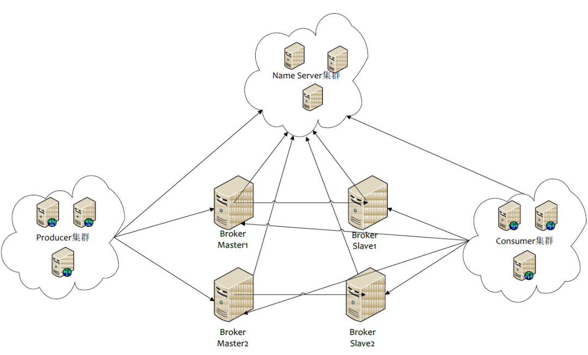
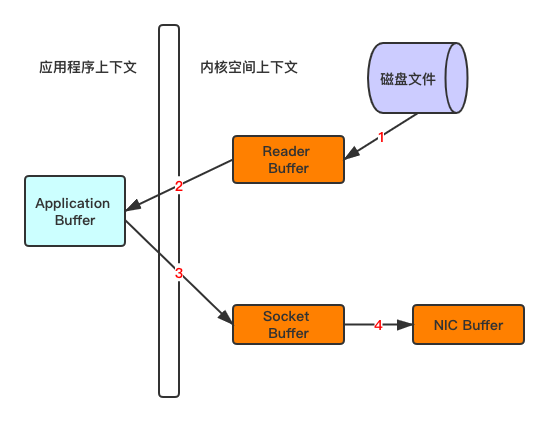
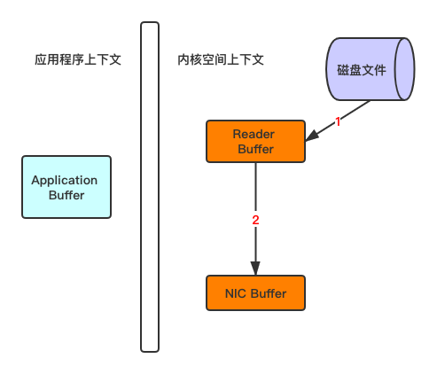
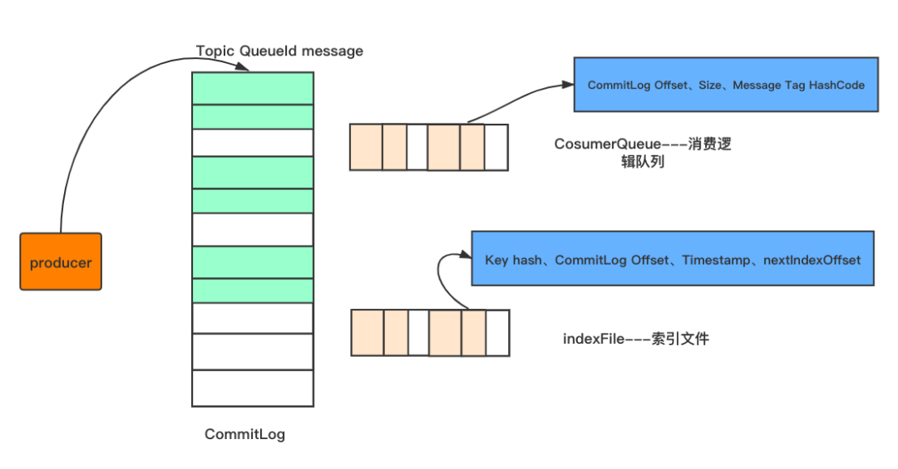

# RocketMQ面试题

## RocketMQ是什么？	

RocketMQ 是阿里巴巴开源的分布式消息中间件。支持事务消息、顺序消息、批量消息、定时消息、消息回溯等。它里面有几个区别于标准消息中件间的概念，如Group、Topic、Queue等。系统组成则由Producer、Consumer、Broker、NameServer等。

**RocketMQ 特点**

- 是一个队列模型的消息中间件，具有高性能、高可靠、高实时、分布式等特点
- Producer、Consumer、队列都可以分布式
- Producer 向一些队列轮流发送消息，队列集合称为 Topic，Consumer 如果做广播消费，则一个 Consumer 实例消费这个 Topic 对应的所有队列，如果做集群消费，则多个 Consumer 实例平均消费这个 Topic 对应的队列集合
- 能够保证严格的消息顺序
- 支持拉（pull）和推（push）两种消息模式
- 高效的订阅者水平扩展能力
- 实时的消息订阅机制
- 亿级消息堆积能力
- 支持多种消息协议，如 JMS、OpenMessaging 等
- 较少的依赖

## RocketMQ由哪些角色组成，每个角色作用和特点是什么？

| 角色       | 作用                                                         |
| ---------- | ------------------------------------------------------------ |
| Nameserver | 无状态，动态列表；这也是和zookeeper的重要区别之一。zookeeper是有状态的。 |
| Producer   | 消息生产者，负责发消息到Broker。                             |
| Broker     | 就是MQ本身，负责收发消息、持久化消息等。                     |
| Consumer   | 消息消费者，负责从Broker上拉取消息进行消费，消费完进行ack。  |

## RocketMQ消费模式有几种？

消费模型由Consumer决定，消费维度为Topic。

1、集群消费

* 一条消息只会被同Group中的一个Consumer消费

* 多个Group同时消费一个Topic时，每个Group都会有一个Consumer消费到数据

2、广播消费

消息将对一 个Consumer Group 下的各个 Consumer 实例都消费一遍。即即使这些 Consumer 属于同一个Consumer Group ，消息也会被 Consumer Group 中的每个 Consumer 都消费一次。

## RocketMQ消费消息是push还是pull？

RocketMQ没有真正意义的push，都是pull，虽然有push类，但实际底层实现采用的是**长轮询机制**，即拉取方式

> broker端属性 longPollingEnable 标记是否开启长轮询。默认开启

## 为什么要主动拉取消息而不使用事件监听方式？

事件驱动方式是建立好长连接，由事件（发送数据）的方式来实时推送。

如果broker主动推送消息的话有可能push速度快，消费速度慢的情况，那么就会造成消息在consumer端堆积过多，同时又不能被其他consumer消费的情况。而pull的方式可以根据当前自身情况来pull，不会造成过多的压力而造成瓶颈。所以采取了pull的方式。

## broker如何处理拉取请求的？

Consumer首次请求Broker

- Broker中是否有符合条件的消息

- 有 

- - 响应Consumer
  - 等待下次Consumer的请求

- 没有

- - DefaultMessageStore#ReputMessageService#run方法
  - PullRequestHoldService 来Hold连接，每个5s执行一次检查pullRequestTable有没有消息，有的话立即推送
  - 每隔1ms检查commitLog中是否有新消息，有的话写入到pullRequestTable
  - 当有新消息的时候返回请求
  - 挂起consumer的请求，即不断开连接，也不返回数据
  - 使用consumer的offset，

## 如何让RocketMQ保证消息的顺序消费？

首先多个queue只能保证单个queue里的顺序，queue是典型的FIFO，天然顺序。多个queue同时消费是无法绝对保证消息的有序性的。所以总结如下：

同一topic，同一个QUEUE，发消息的时候一个线程去发送消息，消费的时候 一个线程去消费一个queue里的消息。

## RocketMQ如何保证消息不丢失？

首先在如下三个部分都可能会出现丢失消息的情况：

- Producer端
- Broker端
- Consumer端

1 、Producer端如何保证消息不丢失

- 采取send()同步发消息，发送结果是同步感知的。
- 发送失败后可以重试，设置重试次数。默认3次。

- 集群部署，比如发送失败了的原因可能是当前Broker宕机了，重试的时候会发送到其他Broker上。

2、Broker端如何保证消息不丢失

- 修改刷盘策略为同步刷盘。默认情况下是异步刷盘的。

- 集群部署，主从模式，高可用。

3、Consumer端如何保证消息不丢失

- 完全消费正常后在进行手动ack确认。

## rocketMQ的消息堆积如何处理？

首先要找到是什么原因导致的消息堆积，是Producer太多了，Consumer太少了导致的还是说其他情况，总之先定位问题。

然后看下消息消费速度是否正常，正常的话，可以通过上线更多consumer临时解决消息堆积问题

## 如果Consumer和Queue不对等，上线了多台也在短时间内无法消费完堆积的消息怎么办？

- 准备一个临时的topic
- queue的数量是堆积的几倍
- queue分布到多Broker中
- 上线一台Consumer做消息的搬运工，把原来Topic中的消息挪到新的Topic里，不做业务逻辑处理，只是挪过去
- 上线N台Consumer同时消费临时Topic中的数据
- 改bug
- 恢复原来的Consumer，继续消费之前的Topic

## 堆积时间过长消息超时了？

RocketMQ中的消息只会在commitLog被删除的时候才会消失，不会超时。也就是说未被消费的消息不会存在超时删除这情况。

## 堆积的消息会不会进死信队列？

不会，消息在消费失败后会进入重试队列（%RETRY%+ConsumerGroup），18次（默认18次，网上所有文章都说是16次，无一例外。但是我没搞懂为啥是16次，这不是18个时间吗 ？）才会进入死信队列（%DLQ%+ConsumerGroup）。

## RocketMQ为什么自研nameserver而不用zk？

1. RocketMQ只需要一个轻量级的维护元数据信息的组件，为此引入zk增加维护成本还强依赖另一个中间件了。
2. RocketMQ追求的是AP，而不是CP，也就是需要高可用。
   * zk是CP，因为zk节点间通过zap协议有数据共享，每个节点数据会一致，但是zk集群当挂了一半以上的节点就没法使用了。
   * nameserver是AP，节点间不通信，这样会导致节点间数据信息会发生短暂的不一致，但每个broker都会定时向所有nameserver上报路由信息和心跳。当某个broker下线了，nameserver也会延时30s才知道，而且不会通知客户端（生产和消费者），只能靠客户端自己来拉，rocketMQ是靠消息重试机制解决这个问题的，所以是最终一致性。但nameserver集群只要有一个节点就可用。https://juejin.cn/post/6844904068771479559

## 为什么要使用MQ？

- **解耦**：系统耦合度降低，没有强依赖关系

- **异步**：不需要同步执行的远程调用可以有效提高响应时间

- **削峰**：请求达到峰值后，后端service还可以保持固定消费速率消费，不会被压垮

## 为什么要用RocketMq？

- 吞吐量高：单机吞吐量可达十万级

- 可用性高：分布式架构

- 消息可靠性高：经过参数优化配置，消息可以做到0丢失

- 功能支持完善：MQ功能较为完善，还是分布式的，扩展性好

- 支持10亿级别的消息堆积：不会因为堆积导致性能下降

- 源码是java：方便我们查看源码了解它的每个环节的实现逻辑，并针对不同的业务场景进行扩展

- 可靠性高：天生为金融互联网领域而生，对于要求很高的场景，尤其是电商里面的订单扣款，以及业务削峰，在大量交易涌入时，后端可能无法及时处理的情况

- 稳定性高：RoketMQ在上可能更值得信赖，这些业务场景在阿里双11已经经历了多次考验

## RocketMq的部署架构了解吗？



这个是rocketMq的集群架构图，里面包含了四个主要部分：NameServer集群、Producer集群、Cosumer集群以及Broker集群

NameServer 担任路由消息的提供者。生产者或消费者能够通过NameServer查找各Topic相应的Broker IP列表分别进行发送消息和消费消息。nameServer由多个无状态的节点构成，节点之间无任何信息同步

broker会定期向NameServer以发送心跳包的方式，轮询向所有NameServer注册以下元数据信息：

1）broker的基本信息（ip port等）

2）主题topic的地址信息

3）broker集群信息

4）存活的broker信息

5）filter 过滤器

也就是说，每个NameServer注册的信息都是一样的，而且是当前系统中的所有broker的元数据信息

Producer负责生产消息，一般由业务系统负责生产消息。一个消息生产者会把业务应用系统里产生的消息发送到broker服务器。RocketMQ提供多种发送方式，同步发送、异步发送、顺序发送、单向发送。同步和异步方式均需要Broker返回确认信息，单向发送不需要

Broker，消息中转角色，负责存储消息、转发消息。在RocketMQ系统中负责接收从生产者发送来的消息并存储、同时为消费者的拉取请求作准备

Consumer负责消费消息，一般是后台系统负责异步消费。一个消息消费者会从Broker服务器拉取消息、并将其提供给应用程序。从用户应用的角度而言提供了两种消费形式：拉取式消费、推动式消费

## 它有哪几种部署类型？分别有什么特点？

RocketMQ有4种部署类型

**1）单Master**

单机模式, 即只有一个Broker, 如果Broker宕机了, 会导致RocketMQ服务不可用, 不推荐使用

**2）多Master模式**

组成一个集群, 集群每个节点都是Master节点, 配置简单, 性能也是最高, 某节点宕机重启不会影响RocketMQ服务

**缺点：** 如果某个节点宕机了, 会导致该节点存在未被消费的消息在节点恢复之前不能被消费

**3）多Master多Slave模式，异步复制**

每个Master配置一个Slave, 多对Master-Slave, Master与Slave消息采用异步复制方式, 主从消息一致只会有毫秒级的延迟

优点是弥补了多Master模式（无slave）下节点宕机后在恢复前不可订阅的问题。在Master宕机后, 消费者还可以从Slave节点进行消费。采用异步模式复制，提升了一定的吞吐量。总结一句就是，采用

多Master多Slave模式，异步复制模式进行部署，系统将会有较低的延迟和较高的吞吐量

缺点就是如果Master宕机, 磁盘损坏的情况下, 如果没有及时将消息复制到Slave, 会导致有少量消息丢失

**4）多Master多Slave模式，同步双写**

与多Master多Slave模式，异步复制方式基本一致，唯一不同的是消息复制采用同步方式，只有master和slave都写成功以后，才会向客户端返回成功

**优点：** 数据与服务都无单点，Master宕机情况下，消息无延迟，服务可用性与数据可用性都非常高

缺点就是会降低消息写入的效率，并影响系统的吞吐量

实际部署中，一般会根据业务场景的所需要的性能和消息可靠性等方面来选择后两种

## rocketmq如何保证高可用性？

**1）集群化部署NameServer** 。Broker集群会将所有的broker基本信息、topic信息以及两者之间的映射关系，轮询存储在每个NameServer中（也就是说每个NameServer存储的信息完全一样）。因此，NameServer集群化，不会因为其中的一两台服务器挂掉，而影响整个架构的消息发送与接收；

**2）集群化部署多broker** 。producer发送消息到broker的master，若当前的master挂掉，则会自动切换到其他的master

cosumer默认会访问broker的master节点获取消息，那么master节点挂了之后，该怎么办呢？它就会自动切换到同一个broker组的slave节点进行消费

那么你肯定会想到会有这样一个问题：consumer要是直接消费slave节点，那master在宕机前没有来得及把消息同步到slave节点，那这个时候，不就会出现消费者不就取不到消息的情况了？

这样，就引出了下一个措施，来保证消息的高可用性

**3）设置同步复制**

前面已经提到，消息发送到broker的master节点上，master需要将消息复制到slave节点上，rocketmq提供两种复制方式：同步复制和异步复制

异步复制，就是消息发送到master节点，只要master写成功，就直接向客户端返回成功，后续再异步写入slave节点

同步复制，就是等master和slave都成功写入内存之后，才会向客户端返回成功

那么，要保证高可用性，就需要将复制方式配置成同步复制，这样即使master节点挂了，slave上也有当前master的所有备份数据，那么不仅保证消费者消费到的消息是完整的，并且当master节点恢复之后，也容易恢复消息数据

在master的配置文件中直接配置brokerRole：SYNC_MASTER即可

## rocketmq的工作流程是怎样的？

RocketMq的工作流程如下：

1）首先启动NameServer。NameServer启动后监听端口，等待Broker、Producer以及Consumer连上来

2）启动Broker。启动之后，会跟所有的NameServer建立并保持一个长连接，定时发送心跳包。心跳包中包含当前Broker信息(ip、port等)、Topic信息以及Borker与Topic的映射关系

3）创建Topic。创建时需要指定该Topic要存储在哪些Broker上，也可以在发送消息时自动创建Topic

4）Producer发送消息。启动时先跟NameServer集群中的其中一台建立长连接，并从NameServer中获取当前发送的Topic所在的Broker；然后从队列列表中轮询选择一个队列，与队列所在的Broker建立长连接，进行消息的发送

5）Consumer消费消息。跟其中一台NameServer建立长连接，获取当前订阅Topic存在哪些Broker上，然后直接跟Broker建立连接通道，进行消息的消费

## RocketMq使用哪种方式消费消息，pull还是push？

RocketMq提供两种方式：pull和push进行消息的消费

而RocketMq的push方式，本质上也是采用pull的方式进行实现的。也就是说这两种方式本质上都是采用consumer轮询从broker拉取消息的

push方式里，consumer把轮询过程封装了一层，并注册了MessageListener监听器。当轮询取到消息后，便唤醒MessageListener的consumeMessage()来消费，对用户而言，感觉好像消息是被推送过来的

其实想想，消息统一都发到了broker，而broker又不会主动去push消息，那么消息肯定都是需要消费者主动去拉的喽~

## 为什么要主动拉取消息而不使用事件监听方式？

事件驱动方式是建立好长连接，由事件（发送数据）的方式来实时推送。

如果broker主动推送消息的话有可能push速度快，消费速度慢的情况，那么就会造成消息在consumer端堆积过多，同时又不能被其他consumer消费的情况。而pull的方式可以根据当前自身情况来pull，不会造成过多的压力而造成瓶颈。所以采取了pull的方式。

## RocketMq如何负载均衡？

1）producer发送消息的负载均衡：默认会轮询向Topic的所有queue发送消息，以达到消息平均落到不同的queue上；而由于queue可以落在不同的broker上，就可以发到不同broker上（当然也可以指定发送到某个特定的queue上）

2）consumer订阅消息的负载均衡：假设有5个队列，两个消费者，则第一个消费者消费3个队列，第二个则消费2个队列，以达到平均消费的效果。而需要注意的是，当consumer的数量大于队列的数量的话，根据rocketMq的机制，多出来的队列不会去消费数据，因此建议consumer的数量小于或者等于queue的数量，避免不必要的浪费

## RocketMq的存储机制了解吗？

RocketMq采用文件系统进行消息的存储，相对于ActiveMq采用关系型数据库进行存储的方式就更直接，性能更高了

RocketMq与Kafka在写消息与发送消息上，继续沿用了Kafka的这两个方面：顺序写和零拷贝

**1）顺序写**

我们知道，操作系统每次从磁盘读写数据的时候，都需要找到数据在磁盘上的地址，再进行读写。而如果是机械硬盘，寻址需要的时间往往会比较长
而一般来说，如果把数据存储在内存上面，少了寻址的过程，性能会好很多；

但Kafka 的数据存储在磁盘上面，依然性能很好，这是为什么呢？
这是因为，Kafka采用的是顺序写，直接追加数据到末尾。实际上，磁盘顺序写的性能极高，在磁盘个数一定，转数一定的情况下，基本和内存速度一致

因此，磁盘的顺序写这一机制，极大地保证了Kafka本身的性能

**2）零拷贝**

比如：读取文件，再用socket发送出去这一过程

buffer = File.read
Socket.send(buffer)

**传统方式实现：** 先读取、再发送，实际会经过以下四次复制

1、将磁盘文件，读取到操作系统内核缓冲区Read Buffer

2、将内核缓冲区的数据，复制到应用程序缓冲区Application Buffer

3、将应用程序缓冲区Application Buffer中的数据，复制到socket网络发送缓冲区

4、将Socket buffer的数据，复制到网卡，由网卡进行网络传输



传统方式，读取磁盘文件并进行网络发送，经过的四次数据copy是非常繁琐的

重新思考传统IO方式，会注意到在读取磁盘文件后，不需要做其他处理，直接用网络发送出去的这种场景下，第二次和第三次数据的复制过程，不仅没有任何帮助，反而带来了巨大的开销。那么这里使用了零拷贝，也就是说，直接由内核缓冲区Read Buffer将数据复制到网卡，省去第二步和第三步的复制。



那么采用零拷贝的方式发送消息，必定会大大减少读取的开销，使得RocketMq读取消息的性能有一个质的提升

此外，还需要再提一点，零拷贝技术采用了MappedByteBuffer内存映射技术，采用这种技术有一些限制，其中有一条就是传输的文件不能超过2G，这也就是为什么RocketMq的存储消息的文件CommitLog的大小规定为1G的原因

**小结：** RocketMq采用文件系统存储消息，并采用顺序写写入消息，使用零拷贝发送消息，极大得保证了RocketMq的性能

## RocketMq的存储结构是怎样的？

如图所示，消息生产者发送消息到broker，都是会按照顺序存储在CommitLog文件中，每个commitLog文件的大小为1G



CommitLog-存储所有的消息元数据，包括Topic、QueueId以及message

CosumerQueue-消费逻辑队列：存储消息在CommitLog的offset

IndexFile-索引文件：存储消息的key和时间戳等信息，使得RocketMq可以采用key和时间区间来查询消息

也就是说，rocketMq将消息均存储在CommitLog中，并分别提供了CosumerQueue和IndexFile两个索引，来快速检索消息

## RocketMq如何进行消息的去重？

我们知道，只要通过网络交换数据，就无法避免因为网络不可靠而造成的消息重复这个问题。比如说RocketMq中，当consumer消费完消息后，因为网络问题未及时发送ack到broker,broker就不会删掉当前已经消费过的消息，那么，该消息将会被重复投递给消费者去消费

虽然rocketMq保证了同一个消费组只能消费一次，但会被不同的消费组重复消费，因此这种重复消费的情况不可避免

RocketMq本身并不保证消息不重复，这样肯定会因为每次的判断，导致性能打折扣，所以它将去重操作直接放在了消费端：

1）消费端处理消息的业务逻辑保持幂等性。那么不管来多少条重复消息，可以实现处理的结果都一样

2）还可以建立一张日志表，使用消息主键作为表的主键，在处理消息前，先insert表，再做消息处理。这样可以避免消息重复消费

## RocketMq性能比较高的原因？

就是前面在文件存储机制中所提到的：RocketMq采用文件系统存储消息，采用顺序写的方式写入消息，使用零拷贝发送消息，这三者的结合极大地保证了RocketMq的性能

## RocketMQ Broker中的消息被消费后会立即删除吗？

不会，每条消息都会持久化到CommitLog中，每个Consumer连接到Broker后会维持消费进度信息，当有消息消费后只是当前Consumer的消费进度（CommitLog的offset）更新了。

## 那么消息会堆积吗？什么时候清理过期消息？

4.6版本默认48小时后会删除不再使用的CommitLog文件

- 检查这个文件最后访问时间
- 判断是否大于过期时间
- 指定时间删除，默认凌晨4点

## RocketMQ消费模式有几种？

消费模型由Consumer决定，消费维度为Topic。

**集群消费**

1.一条消息只会被同Group中的一个Consumer消费

2.多个Group同时消费一个Topic时，每个Group都会有一个Consumer消费到数据

**广播消费**

消息将对一 个Consumer Group 下的各个 Consumer 实例都消费一遍。即即使这些 Consumer 属于同一个Consumer Group ，消息也会被 Consumer Group 中的每个 Consumer 都消费一次。

## broker如何处理拉取请求的？

Consumer首次请求Broker

Broker中是否有符合条件的消息

**有**

- 响应Consumer
- 等待下次Consumer的请求

**没有**

- DefaultMessageStore#ReputMessageService#run方法

- PullRequestHoldService 来Hold连接，每个5s执行一次检查pullRequestTable有没有消息，有的话立即推送

- 每隔1ms检查commitLog中是否有新消息，有的话写入到pullRequestTable

- 当有新消息的时候返回请求
- 挂起consumer的请求，即不断开连接，也不返回数据
- 使用consumer的offset

## 如何让RocketMQ保证消息的顺序消费

首先多个queue只能保证单个queue里的顺序，queue是典型的FIFO，天然顺序。多个queue同时消费是无法绝对保证消息的有序性的。所以总结如下：

同一topic，同一个QUEUE，发消息的时候一个线程去发送消息，消费的时候 一个线程去消费一个queue里的消息。

## 怎么保证消息发到同一个queue？

Rocket MQ给我们提供了MessageQueueSelector接口，可以自己重写里面的接口，实现自己的算法，举个最简单的例子：判断i % 2 == 0，那就都放到queue1里，否则放到queue2里。

```java
for (int i = 0; i < 5; i++) {
    Message message = new Message("orderTopic", ("hello!" + i).getBytes());
    producer.send(
        // 要发的那条消息
        message,
        // queue 选择器 ，向 topic中的哪个queue去写消息
        new MessageQueueSelector() {
            // 手动 选择一个queue
            @Override
            public MessageQueue select(
                // 当前topic 里面包含的所有queue
                List<MessageQueue> mqs,
                // 具体要发的那条消息
                Message msg,
                // 对应到 send（） 里的 args，也就是2000前面的那个0
                Object arg) {
                // 向固定的一个queue里写消息，比如这里就是向第一个queue里写消息
                if (Integer.parseInt(arg.toString()) % 2 == 0) {
                    return mqs.get(0);
                } else {
                    return mqs.get(1);
                }
            }
        },
        // 自定义参数：0
        // 2000代表2000毫秒超时时间
        i, 2000);
}
```

## RocketMQ如何保证消息不丢失

首先在如下三个部分都可能会出现丢失消息的情况：

- Producer端
- Broker端
- Consumer端

## Producer端如何保证消息不丢失

- 采取send()同步发消息，发送结果是同步感知的。

- 发送失败后可以重试，设置重试次数。默认3次。

  producer.setRetryTimesWhenSendFailed(10);

- 集群部署，比如发送失败了的原因可能是当前Broker宕机了，重试的时候会发送到其他Broker上。

## Broker端如何保证消息不丢失

- 修改刷盘策略为同步刷盘。默认情况下是异步刷盘的。

  flushDiskType = SYNC_FLUSH

- 集群部署，主从模式，高可用。

## Consumer端如何保证消息不丢失

- 完全消费正常后在进行手动ack确认。

## rocketMQ的消息堆积如何处理

> 下游消费系统如果宕机了，导致几百万条消息在消息中间件里积压，此时怎么处理?

> 你们线上是否遇到过消息积压的生产故障?如果没遇到过，你考虑一下如何应对?

首先要找到是什么原因导致的消息堆积，是Producer太多了，Consumer太少了导致的还是说其他情况，总之先定位问题。

然后看下消息消费速度是否正常，正常的话，可以通过上线更多consumer临时解决消息堆积问题

## 如果Consumer和Queue不对等，上线了多台也在短时间内无法消费完堆积的消息怎么办？

- 准备一个临时的topic

- queue的数量是堆积的几倍

- queue分布到多Broker中

- 上线一台Consumer做消息的搬运工，把原来Topic中的消息挪到新的Topic里，不做业务逻辑处理，只是挪过去

- 上线N台Consumer同时消费临时Topic中的数据

- 改bug

- 恢复原来的Consumer，继续消费之前的Topic

## 堆积时间过长消息超时了？

RocketMQ中的消息只会在commitLog被删除的时候才会消失，不会超时。也就是说未被消费的消息不会存在超时删除这情况。

## 堆积的消息会不会进死信队列？

不会，消息在消费失败后会进入重试队列（%RETRY%+ConsumerGroup），重试16次才会进入死信队列（%DLQ%+ConsumerGroup）。

```java
 //这个方法在DefaultMQPushConsumer 中
public void sendMessageBack(MessageExt msg, int delayLevel, final String brokerName)
        throws RemotingException, MQBrokerException, InterruptedException, MQClientException {
        try {
            String brokerAddr = (null != brokerName) ? this.mQClientFactory.findBrokerAddressInPublish(brokerName)
                : RemotingHelper.parseSocketAddressAddr(msg.getStoreHost());
            this.mQClientFactory.getMQClientAPIImpl().consumerSendMessageBack(brokerAddr, msg,
                this.defaultMQPushConsumer.getConsumerGroup(), delayLevel, 5000, getMaxReconsumeTimes());
        } catch (Exception e) {
            log.error("sendMessageBack Exception, " + this.defaultMQPushConsumer.getConsumerGroup(), e);

            Message newMsg = new Message(MixAll.getRetryTopic(this.defaultMQPushConsumer.getConsumerGroup()), msg.getBody());

            String originMsgId = MessageAccessor.getOriginMessageId(msg);
            MessageAccessor.setOriginMessageId(newMsg, UtilAll.isBlank(originMsgId) ? msg.getMsgId() : originMsgId);

            newMsg.setFlag(msg.getFlag());
            MessageAccessor.setProperties(newMsg, msg.getProperties());
            MessageAccessor.putProperty(newMsg, MessageConst.PROPERTY_RETRY_TOPIC, msg.getTopic());
            MessageAccessor.setReconsumeTime(newMsg, String.valueOf(msg.getReconsumeTimes() + 1));
            //给回传的消息设置最大重试次数
            MessageAccessor.setMaxReconsumeTimes(newMsg, String.valueOf(getMaxReconsumeTimes()));
            MessageAccessor.clearProperty(newMsg, MessageConst.PROPERTY_TRANSACTION_PREPARED);
            newMsg.setDelayTimeLevel(3 + msg.getReconsumeTimes());

            this.mQClientFactory.getDefaultMQProducer().send(newMsg);
        } finally {
            msg.setTopic(NamespaceUtil.withoutNamespace(msg.getTopic(), this.defaultMQPushConsumer.getNamespace()));
        }
    }
//方便阅读，这个方法放一一起
private int getMaxReconsumeTimes() {
        // default reconsume times: 16
    	// 默认没有配置时这个字段是-1，返回16，也就是默认16次
        if (this.defaultMQPushConsumer.getMaxReconsumeTimes() == -1) {
            return 16;
        } else {
            return this.defaultMQPushConsumer.getMaxReconsumeTimes();
        }
    }

```

再看borker源码

```java
//这段代码在SendMessageProcessor类的handleRetryAndDLQ方法，消息发送处理器的重发消息的处理方法        
//获取重试次数，3.4.9之前SubscriptionGroupConfig的retryMaxTimes变量，默认是16次，版本大于等于3.4.9，获取消息头的重试次数，从消费者源码可知，这里是16
int maxReconsumeTimes = subscriptionGroupConfig.getRetryMaxTimes();
            if (request.getVersion() >= MQVersion.Version.V3_4_9.ordinal()) {
                maxReconsumeTimes = requestHeader.getMaxReconsumeTimes();
            }
            int reconsumeTimes = requestHeader.getReconsumeTimes() == null ? 0 : requestHeader.getReconsumeTimes();
             //如果重试次数大于等于16，加入死信队列
            if (reconsumeTimes >= maxReconsumeTimes) {
                //配置死信队列topic名称
                newTopic = MixAll.getDLQTopic(groupName);
                int queueIdInt = Math.abs(this.random.nextInt() % 99999999) % DLQ_NUMS_PER_GROUP;
                topicConfig = this.brokerController.getTopicConfigManager().createTopicInSendMessageBackMethod(newTopic,
                    DLQ_NUMS_PER_GROUP,
                    PermName.PERM_WRITE, 0
                );
                msg.setTopic(newTopic);
                msg.setQueueId(queueIdInt);
                if (null == topicConfig) {
                    response.setCode(ResponseCode.SYSTEM_ERROR);
                    response.setRemark("topic[" + newTopic + "] not exist");
                    return false;
                }
            }

```

## 延时队列

```java
public static void main(String[] args) throws Exception {
        // Instantiate a producer to send scheduled messages
        DefaultMQProducer producer = new DefaultMQProducer("ExampleProducerGroup");
        // Launch producer
        producer.start();
        int totalMessagesToSend = 100;
        for (int i = 0; i < totalMessagesToSend; i++) {
            Message message = new Message("TopicTest", ("Hello scheduled message " + i).getBytes());
            // This message will be delivered to consumer 10 seconds later.
            //注意这里的3指的不是3s，而是等级
            message.setDelayTimeLevel(3);
            // Send the message
            producer.send(message);
        }

        // Shutdown producer after use.
        producer.shutdown();
    }
```

rocketmq的延时队列是18个等级

默认配置如下

```java
 private String messageDelayLevel = "1s 5s 10s 30s 1m 2m 3m 4m 5m 6m 7m 8m 9m 10m 20m 30m 1h 2h";
```

也可以在broker.conf配置文件中配置，修改默认的等级

messageDelayLevel=1s 5s 10s 30s 1m 2m 3m 4m 5m 6m 7m 8m 9m 10m 20m 30m 1h 2h
1d

## RocketMQ在分布式事务支持这块机制的底层原理?

> 你们用的是RocketMQ?RocketMQ很大的一个特点是对分布式事务的支持，你说说他在分布式事务支持这块机制的底层原理?

分布式系统中的事务可以使用TCC（Try、Confirm、Cancel）、2pc来解决分布式系统中的消息原子性

RocketMQ 4.3+提供分布事务功能，通过 RocketMQ 事务消息能达到分布式事务的最终一致

## RocketMQ实现方式：


**Half Message：** 预处理消息，当broker收到此类消息后，会存储到RMQ_SYS_TRANS_HALF_TOPIC的消息消费队列中

**检查事务状态：** Broker会开启一个定时任务，消费RMQ_SYS_TRANS_HALF_TOPIC队列中的消息，每次执行任务会向消息发送者确认事务执行状态（提交、回滚、未知），如果是未知，Broker会定时去回调在重新检查。

**超时：** 如果超过回查次数，默认回滚消息。

也就是他并未真正进入Topic的queue，而是用了临时queue来放所谓的half message，等提交事务后才会真正的将half message转移到topic下的queue。

## 如果让你来动手实现一个分布式消息中间件，整体架构你会如何设计实现?

我个人觉得从以下几个点回答吧：

- 需要考虑能快速扩容、天然支持集群
- 持久化的姿势
- 高可用性
- 数据0丢失的考虑
- 服务端部署简单、client端使用简单

## 任何一台Broker突然宕机了怎么办？

Broker主从架构以及多副本策略。Master收到消息后会同步给Slave，这样一条消息就不止一份了，Master宕机了还有slave中的消息可用，保证了MQ的可靠性和高可用性。而且Rocket MQ4.5.0开始就支持了Dlegder模式，基于raft的，做到了真正意义的HA。

## Broker把自己的信息注册到哪个NameServer上？

这么问明显在坑你，因为Broker会向所有的NameServer上注册自己的信息，而不是某一个，是每一个，全部！

## 再说说RocketMQ 是如何保证数据的高容错性的?

- 在不开启容错的情况下，轮询队列进行发送，如果失败了，重试的时候过滤失败的Broker

- 如果开启了容错策略，会通过RocketMQ的预测机制来预测一个Broker是否可用

- 如果上次失败的Broker可用那么还是会选择该Broker的队列

- 如果上述情况失败，则随机选择一个进行发送

- 在发送消息的时候会记录一下调用的时间与是否报错，根据该时间去预测broker的可用时间