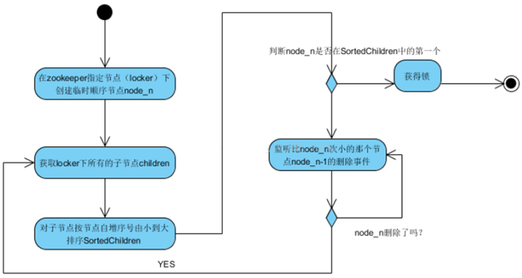
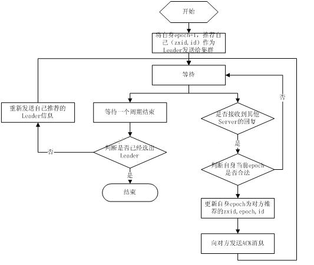
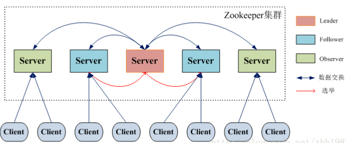

# Zookeeper面试题

## Zookeeper 下 Server工作状态


每个Server在工作过程中有三种状态：

LOOKING：当前Server不知道leader是谁，正在搜寻

LEADING：当前Server即为选举出来的leader

FOLLOWING：leader已经选举出来，当前Server与之同步


## ZooKeeper定义了几种权限？


**1、** CREATE

**2、** READ

**3、** WRITE

**4、** DELETE

**5、** ADMIN


## ZooKeeper用推/拉模式？


推拉结合


## 客户端如何获取配置信息？


启动时主动到服务端拉取信息，同时，在制定节点注册Watcher监听。一旦有配置变化，服务端就会实时通知订阅它的所有客户端。

## 会话管理


分桶策略：将类似的会话放在同一区块中进行管理，以便于 Zookeeper 对会话进行不同区块的隔离处理以及同一区块的统一处理。

分配原则：每个会话的“下次超时时间点”（ExpirationTime）

**计算公式：**

```
ExpirationTime\_ = currentTime + sessionTimeout

ExpirationTime = (ExpirationTime\_ / ExpirationInrerval + 1) \*

ExpirationInterval , ExpirationInterval 是指 Zookeeper 会话超时检查时间间隔，默认 tickTime
```


## 四种类型的数据节点 Znode  

**1、** PERSISTENT-持久节点 除非手动删除，否则节点一直存在于 Zookeeper 上

**2、** EPHEMERAL-临时节点 临时节点的生命周期与客户端会话绑定，一旦客户端会话失效（客户端与zookeeper 连接断开不一定会话失效），那么这个客户端创建的所有临时节点都会被移除。

**3、** PERSISTENT_SEQUENTIAL-持久顺序节点 基本特性同持久节点，只是增加了顺序属性，节点名后边会追加一个由父节点维护的自增整型数字。

**4、** EPHEMERAL_SEQUENTIAL-临时顺序节点 基本特性同临时节点，增加了顺序属性，节点名后边会追加一个由父节点维护的自增整型数字。


## zookeeper是如何保证事务的顺序一致性的？  


zookeeper采用了递增的事务Id来标识，所有的proposal（提议）都在被提出的时候加上了zxid，zxid实际上是一个64位的数字，高32位是epoch（时期; 纪元; 世; 新时代）用来标识leader是否发生改变，如果有新的leader产生出来，epoch会自增，低32位用来递增计数。当新产生proposal的时候，会依据数据库的两阶段过程，首先会向其他的server发出事务执行请求，如果超过半数的机器都能执行并且能够成功，那么就会开始执行。


## 发现?

Follower把自己最后的接受事务的Proposal值(CEPOCH(F.p)发送给Leader。

当收到过半Follower的消息后，Leader生成NEWEPOCH(e')给这些过半的Follower。

tips: e' = Max((CEPOCH(F.p)) + 1

Follower收到消息后，如果自己值小于e',则同步e'的值，同时向Leader发Ack消息。


## 客户端注册Watcher实现


**1、** 调用getData()/getChildren()/exist()三个API，传入Watcher对象

**2、** 标记请求request，封装Watcher到WatchRegistration

**3、** 封装成Packet对象，发服务端发送request

**4、** 收到服务端响应后，将Watcher注册到ZKWatcherManager中进行管理

**5、** 请求返回，完成注册。


## Zookeeper文件系统


Zookeeper提供一个多层级的节点命名空间（节点称为znode）。与文件系统不同的是，这些节点都可以设置关联的数据，而文件系统中只有文件节点可以存放数据而目录节点不行。Zookeeper为了保证高吞吐和低延迟，在内存中维护了这个树状的目录结构，这种特性使得Zookeeper不能用于存放大量的数据，每个节点的存放数据上限为1M。

## 几种部署方式？


单机、伪集群、集群


## 发布订阅的两种设计模式？


推(Push) :服务端主动推数据给所有定于的客户端。

拉(Pull):客户端主动发请求来获取最新数据。


## 服务端处理 Watcher 实现


**1、** 服务端接收 Watcher 并存储 接收到客户端请求，处理请求判断是否需要注册 Watcher，需要的话将数据节点的节点路径和 ServerCnxn（ServerCnxn 代表一个客户端和服务端的连接，实现了 Watcher 的 process 接口，此时可以看成一个 Watcher 对象）存储在WatcherManager 的 WatchTable 和 watch2Paths 中去。

**2、** Watcher 触发 以服务端接收到 setData() 事务请求触发 NodeDataChanged 事件为例：

2.1 封装 WatchedEvent 将通知状态（SyncConnected）、事件类型（NodeDataChanged）以及节点路径封装成一个 WatchedEvent 对象

2.2 查询 Watcher 从 WatchTable 中根据节点路径查找 Watcher

2.3 没找到；说明没有客户端在该数据节点上注册过 Watcher

2.4 找到；提取并从 WatchTable 和 Watch2Paths 中删除对应 Watcher（从这里可以看出 Watcher 在服务端是一次性的，触发一次就失效了）

**3、**  调用 process 方法来触发 Watcher 这里 process 主要就是通过 ServerCnxn 对应的 TCP 连接发送 Watcher 事件通知。


## Zookeeper节点宕机如何处理？


Zookeeper本身也是集群，推荐配置不少于3个服务器。Zookeeper自身也要保证当一个节点宕机时，其他节点会继续提供服务。

如果是一个Follower宕机，还有2台服务器提供访问，因为Zookeeper上的数据是有多个副本的，数据并不会丢失；

如果是一个Leader宕机，Zookeeper会选举出新的Leader。

ZK集群的机制是只要超过半数的节点正常，集群就能正常提供服务。只有在ZK节点挂得太多，只剩一半或不到一半节点能工作，集群才失效。

所以

3个节点的cluster可以挂掉1个节点(leader可以得到2票>1.5)

2个节点的cluster就不能挂掉任何1个节点了(leader可以得到1票<=1)


## Zookeeper 对节点的 watch 监听通知是永久的吗？为什么不是永久的?


**1、** 不是。官方声明：一个 Watch 事件是一个一次性的触发器，当被设置了 Watch的数据发生了改变的时候，则服务器将这个改变发送给设置了 Watch 的客户端，以便通知它们。

**2、** 为什么不是永久的，举个例子，如果服务端变动频繁，而监听的客户端很多情况下，每次变动都要通知到所有的客户端，给网络和服务器造成很大压力。

**3、** 一般是客户端执行 getData(“/节点 A”,true)，如果节点 A 发生了变更或删除，客户端会得到它的 watch 事件，但是在之后节点 A 又发生了变更，而客户端又没有设置 watch 事件，就不再给客户端发送。

**4、** 在实际应用中，很多情况下，我们的客户端不需要知道服务端的每一次变动，我只要最新的数据即可。


## Zookeeper 怎么保证主从节点的状态同步？


Zookeeper 的核心是原子广播机制，这个机制保证了各个 server 之间的同步。实现这个机制的协议叫做 Zab 协议。Zab 协议有两种模式，它们分别是恢复模式和广播模式。


## 数据发布/订阅 


**介绍**

数据发布/订阅系统，即所谓的配置中心，顾名思义就是发布者发布数据供订阅者进行数据订阅。

**目的**

**1、** 动态获取数据（配置信息）

**2、** 实现数据（配置信息）的集中式管理和数据的动态更新

**设计模式**

**1、** Push 模式

**2、** Pull 模式

**数据（配置信息）特性**

**1、** 数据量通常比较小

**2、** 数据内容在运行时会发生动态更新

**3、** 集群中各机器共享，配置一致

如：机器列表信息、运行时开关配置、数据库配置信息等

**基于 Zookeeper 的实现方式**

**1、** 数据存储：将数据（配置信息）存储到 Zookeeper 上的一个数据节点

**2、** 数据获取：应用在启动初始化节点从 Zookeeper 数据节点读取数据，并在该节点上注册一个数据变更 Watcher

**3、** 数据变更：当变更数据时，更新 Zookeeper 对应节点数据，Zookeeper会将数据变更通知发到各客户端，客户端接到通知后重新读取变更后的数据即可。


## 同进程组的两个进程消息网络通信有哪两个特性？


完整性： 如果进程a收到进程b的消息msg,那么b一定发送了消息msg。

前置性：如果msg1是msg2的前置消息，那么当前进程务必先接收到msg1,在接受msg2。


## zookeeper 是如何保证事务的顺序一致性的？


zookeeper 采用了全局递增的事务 Id 来标识，所有的 proposal（提议）都在被提出的时候加上了 zxid，zxid 实际上是一个 64 位的数字，高 32 位是 epoch（ 时期; 纪元; 世; 新时代）用来标识 leader 周期，如果有新的 leader 产生出来，epoch会自增，低 32 位用来递增计数。当新产生 proposal 的时候，会依据数据库的两阶段过程，首先会向其他的 server 发出事务执行请求，如果超过半数的机器都能执行并且能够成功，那么就会开始执行。


## Chroot特性


3.2.0版本后，添加了 Chroot特性，该特性允许每个客户端为自己设置一个命名空间。如果一个客户端设置了Chroot，那么该客户端对服务器的任何操作，都将会被限制在其自己的命名空间下。

通过设置Chroot，能够将一个客户端应用于Zookeeper服务端的一颗子树相对应，在那些多个应用公用一个Zookeeper进群的场景下，对实现不同应用间的相互隔离非常有帮助。

## Stat记录了哪些版本相关数据？


version:当前ZNode版本

cversion:当前ZNode子节点版本

aversion:当前ZNode的ACL版本


## BASE理论？ 


**1、** Basically Available(基本可用)、Soft state(软状态) 和 Eventuanlly consistent （最终一致性）3个短语的简写。

**2、** 基本可用：系统出现不可预知的故障时，允许损失部分可用性。

**3、** 弱（软）状态：数据的中间状态，并认为改状态存在不会一项系统整体可用性，允许不同节点数据副本数据同步过程中的延时。

**4、** 最终一致性：系统中所有数据副本，在一段时间的同步后，最终数据能够到一致性的状态。


## Zookeeper Watcher 机制 – 数据变更通知


Zookeeper 允许客户端向服务端的某个 Znode 注册一个 Watcher 监听，当服务端的一些指定事件触发了这个 Watcher，服务端会向指定客户端发送一个事件通知来实现分布式的通知功能，然后客户端根据 Watcher 通知状态和事件类型做出业务上的改变。

**工作机制：**

**1、** 客户端注册 watcher

**2、** 服务端处理 watcher

**3、** 客户端回调 watcher


## 如何识别请求的先后顺序？


ZooKeeper会给每个更新请求，分配一个全局唯一的递增编号（zxid)，编号的大小体现事务操作的先后顺序。


## ZooKeeper的命名服务（文件系统）


命名服务是指通过指定的名字来获取资源或者服务的地址，利用zk创建一个全局的路径，即是唯一的路径，这个路径就可以作为一个名字，指向集群中的集群，提供的服务的地址，或者一个远程的对象等等。


## 如何查看子节点？


ls path [watch]

path : 节点路径

[zk: localhost:2181(CONNECTED) 5] ls /app

[book]


## chubby是什么，和zookeeper比你怎么看？


chubby是google的，完全实现paxos算法，不开源。zookeeper是chubby的开源实现，使用zab协议，paxos算法的变种。


## ZooKeeper 面试题？ 


ZooKeeper是一个开放源码的分布式协调服务，它是集群的管理者，监视着集群中各个节点的状态根据节点提交的反馈进行下一步合理操作。最终，将简单易用的接口和性能高效、功能稳定的系统提供给用户。

分布式应用程序可以基于Zookeeper实现诸如数据发布/订阅、负载均衡、命名服务、分布式协调/通知、集群管理、Master选举、分布式锁和分布式队列等功能。

**Zookeeper保证了如下分布式一致性特性：**

**1、** 顺序一致性

**2、** 原子性

**3、** 单一视图

**4、** 可靠性

**5、** 实时性（最终一致性）

客户端的读请求可以被集群中的任意一台机器处理，如果读请求在节点上注册了监听器，这个监听器也是由所连接的zookeeper机器来处理。对于写请求，这些请求会同时发给其他zookeeper机器并且达成一致后，请求才会返回成功。因此，随着zookeeper的集群机器增多，读请求的吞吐会提高但是写请求的吞吐会下降。

有序性是zookeeper中非常重要的一个特性，所有的更新都是全局有序的，每个更新都有一个唯一的时间戳，这个时间戳称为zxid（Zookeeper Transaction Id）。而读请求只会相对于更新有序，也就是读请求的返回结果中会带有这个zookeeper最新的zxid。


## Zookeeper 有哪几种几种部署模式？


**Zookeeper 有三种部署模式**：

**1、** 单机部署：一台集群上运行；

**2、** 集群部署：多台集群运行；

**3、** 伪集群部署：一台集群启动多个 Zookeeper 实例运行。


## 服务端处理Watcher实现


**1、** 服务端接收Watcher并存储

接收到客户端请求，处理请求判断是否需要注册Watcher，需要的话将数据节点的节点路径和ServerCnxn（ServerCnxn代表一个客户端和服务端的连接，实现了Watcher的process接口，此时可以看成一个Watcher对象）存储在WatcherManager的WatchTable和watch2Paths中去。

**2、** Watcher触发

以服务端接收到 setData() 事务请求触发NodeDataChanged事件为例：

2.1 封装WatchedEvent

将通知状态（SyncConnected）、事件类型（NodeDataChanged）以及节点路径封装成一个WatchedEvent对象

2.2 查询Watcher

从WatchTable中根据节点路径查找Watcher

2.3 没找到；说明没有客户端在该数据节点上注册过Watcher

2.4 找到；提取并从WatchTable和Watch2Paths中删除对应Watcher（从这里可以看出Watcher在服务端是一次性的，触发一次就失效了）

**3、** 调用process方法来触发Watcher

这里process主要就是通过ServerCnxn对应的TCP连接发送Watcher事件通知。

## ZAB和Paxos算法的联系与区别？


**相同点：**

**1、** 两者都存在一个类似于Leader进程的角色，由其负责协调多个Follower进程的运行

**2、** Leader进程都会等待超过半数的Follower做出正确的反馈后，才会将一个提案进行提交

**3、** ZAB协议中，每个Proposal中都包含一个 epoch 值来代表当前的Leader周期，Paxos中名字为Ballot

**不同点：**

ZAB用来构建高可用的分布式数据主备系统（Zookeeper），Paxos是用来构建分布式一致性状态机系统。


## 什么是ZooKeeper? 


ZooKeeper是一个开源分布式协同服务系统，Zookeeper的设计目标是将那些复杂容易出错的分布式一致性服务封装起来，构成一个高效可用的原语集，并提供一系列简单接口给用户使用。


## ZooKeeper的数据模型？


共享的、树形结构，由一系列的 ZNode数据节点组成，类似文件系统(目录不能存数据）。ZNode存有数据信息，如版本号等等。ZNode之间的层级关系，像文件系统中的目录结构一样。并且它是将数据存在内存中，这样可以提高吞吐、减少延迟。


## 集群最少要几台机器，集群规则是怎样的？集群中有 3 台服务器，其中一个节点宕机，这个时候 Zookeeper 还可以使用吗？


集群规则为 2N+1 台，N>0，即 3 台。可以继续使用，单数服务器只要没超过一半的服务器宕机就可以继续使用。


## 数据发布/订阅？


发布者将数据发布到ZooKeeper上一个或多个节点上，订阅者从中订阅数据，从而动态获取数据的目的，实现配置信息的集中式管理和数据动态更新。


## ACL权限控制机制  


UGO（User/Group/Others）

目前在Linux/Unix文件系统中使用，也是使用最广泛的权限控制方式。是一种粗粒度的文件系统权限控制模式。

ACL（Access Control List）访问控制列表

**包括三个方面：**

**权限模式（Scheme）**

**1、** IP：从IP地址粒度进行权限控制

**2、** Digest：最常用，用类似于 username:password 的权限标识来进行权限配置，便于区分不同应用来进行权限控制

**3、** World：最开放的权限控制方式，是一种特殊的digest模式，只有一个权限标识“world:anyone”

**4、** Super：超级用户

**授权对象**

授权对象指的是权限赋予的用户或一个指定实体，例如IP地址或是机器灯。

**权限 Permission**

**1、** CREATE：数据节点创建权限，允许授权对象在该Znode下创建子节点

**2、** DELETE：子节点删除权限，允许授权对象删除该数据节点的子节点

**3、** READ：数据节点的读取权限，允许授权对象访问该数据节点并读取其数据内容或子节点列表等

**4、** WRITE：数据节点更新权限，允许授权对象对该数据节点进行更新操作

**5、** ADMIN：数据节点管理权限，允许授权对象对该数据节点进行ACL相关设置操作


## 说几个zookeeper常用的命令。


常用命令：ls get set create delete等。


## ZAB 和 Paxos 算法的联系与区别？


**相同点：**

**1、** 两者都存在一个类似于 Leader 进程的角色，由其负责协调多个 Follower 进程的运行

**2、** Leader 进程都会等待超过半数的 Follower 做出正确的反馈后，才会将一个提案进行提交

**3、** ZAB 协议中，每个 Proposal 中都包含一个 epoch 值来代表当前的 Leader周期，Paxos 中名字为 Ballot

**不同点：**

ZAB 用来构建高可用的分布式数据主备系统（Zookeeper），Paxos 是用来构建分布式一致性状态机系统。


## ZooKeeper 是什么？


**1、** ZooKeeper 是一个开源的分布式协调服务。它是一个为分布式应用提供一致性服务的软件，分布式应用程序可以基于 Zookeeper 实现诸如数据发布/订阅、负载均衡、命名服务、分布式协调/通知、集群管理、Master 选举、分布式锁和分布式队列等功能。

**2、** ZooKeeper 的目标就是封装好复杂易出错的关键服务，将简单易用的接口和性能高效、功能稳定的系统提供给用户。

**Zookeeper 保证了如下分布式一致性特性：**

**1、** 顺序一致性

**2、** 原子性

**3、** 单一视图

**4、** 可靠性

**5、** 实时性（最终一致性）

客户端的读请求可以被集群中的任意一台机器处理，如果读请求在节点上注册了监听器，这个监听器也是由所连接的 zookeeper 机器来处理。对于写请求，这些请求会同时发给其他 zookeeper 机器并且达成一致后，请求才会返回成功。因此，随着 zookeeper 的集群机器增多，读请求的吞吐会提高但是写请求的吞吐会下降。

有序性是 zookeeper 中非常重要的一个特性，所有的更新都是全局有序的，每个更新都有一个唯一的时间戳，这个时间戳称为 zxid（Zookeeper Transaction Id）。而读请求只会相对于更新有序，也就是读请求的返回结果中会带有这个zookeeper 最新的 zxid。


## 集群支持动态添加机器吗？


其实就是水平扩容了，Zookeeper在这方面不太好。两种方式：

全部重启：关闭所有Zookeeper服务，修改配置之后启动。不影响之前客户端的会话。

逐个重启：在过半存活即可用的原则下，一台机器重启不影响整个集群对外提供服务。这是比较常用的方式。

3.5版本开始支持动态扩容。

## Zookeeper是什么？

Zookeeper是基于Google Chubby论文的开源实现，它主要是用来解决分布式应用中经常遇到的一些数据管理问题，如：统一命名服务、状态同步服务、集群管理、配置管理 等等。
由于Hadoop生态系统中很多项目都依赖于zookeeper，如Pig，Hive等， 似乎很像一个动物园管理员，于是取名为Zookeeper。

## Zookeeper提供了什么？

1、文件系统
2、通知机制

## zookeeper文件系统

zookeeper提供一个类似unix文件系统目录的多层级节点命名空间（节点称为znode）。与文件系统不同的是，这些节点都可以设置关联的数据，而文件系统中只有文件节点可以存放数据而目录节点不行。zookeeper为了保证高吞吐和低延迟，在内存中维护了这个树状的目录结构，这种特性使得zookeeper不能用于存放大量的数据，每个节点的存放数据上限为1M。

## zookeeper的四种类型的znode

PERSISTENT                持久化节点

PERSISTENT_SEQUENTIAL     顺序自动编号持久化节点，这种节点会根据当前已存在的节点数自动加 1

EPHEMERAL                 临时节点， 客户端session超时这类节点就会被自动删除

EPHEMERAL_SEQUENTIAL      临时自动编号节点

## zookeeper通知机制

client端会对某个znode建立一个watcher事件，当该znode发生变化时，zk会主动通知watch这个znode的client，然后client根据znode的变化来做出业务上的改变等。

watcher的特点：

- 轻量级：一个callback函数。
- 异步性：不会block正常的读写请求。
- 主动推送：Watch被触发时，由Zookeeper服务端主动将更新推送给客户端。
- 一次性：数据变化时，Watch只会被触发一次。如果客户端想得到后续更新的通知，必须要在 Watch 被触发后重新注册一个 Watch。
- 仅通知：仅通知变更类型，不附带变更后的结果。
- 顺序性：如果多个更新触发了多个Watch，那 Watch 被触发的顺序与更新顺序一致。

使用watch的注意事项：

- 由于watcher是一次性的，所以需要自己去实现永久watch
- 如果被watch的节点频繁更新，会出现“丢数据”的情况
- watcher数量过多会导致性能下降

## zookeeper有哪些应用场景

1、名字服务

2、配置管理

3、集群管理

4、分布式锁

5、队列管理

6、消息订阅

## zookeeper的命名服务

命名服务是指通过指定的名字来获取资源或者服务的地址，利用zk创建一个全局的路径，即是唯一的路径，这个路径就可以作为一个名字，指向集群中的集群，提供的服务的地址，或者一个远程的对象等等。

## zookeeper的配置管理

程序分布式的部署在不同的机器上，将程序的配置信息放在zk的znode下，当有配置发生改变时，也就是znode发生变化时，可以通过改变zk中某个目录节点的内容，利用watcher通知给各个客户端，从而更改配置。

## zookeeper集群管理

所谓集群管理无在乎两点：是否有机器退出和加入、选举master。 
对于第一点，所有机器约定在父目录下创建临时目录节点，然后监听父目录节点的子节点变化消息。一旦有机器挂掉，该机器与 zookeeper的连接断开，其所创建的临时目录节点被删除，所有其他机器都收到通知：某个兄弟目录被删除，于是，所有人都知道：它上船了。
新机器加入也是类似，所有机器收到通知：新兄弟目录加入，highcount又有了，对于第二点，我们稍微改变一下，所有机器创建临时顺序编号目录节点，每次选取编号最小的机器作为master就好。

## zookeeper分布式锁

有了zookeeper的一致性文件系统，锁的问题变得容易。锁服务可以分为两类，一个是保持独占，另一个是控制时序。 
对于第一类，我们将zookeeper上的一个znode看作是一把锁，通过createznode的方式来实现。所有客户端都去创建 /distribute_lock 节点，最终成功创建的那个客户端也即拥有了这把锁。用完删除掉自己创建的distribute_lock 节点就释放出锁。 
对于第二类， /distribute_lock 已经预先存在，所有客户端在它下面创建临时顺序编号目录节点，和选master一样，编号最小的获得锁，用完删除，依次方便。

**获取分布式锁的流程**


在获取分布式锁的时候在locker节点下创建临时顺序节点，释放锁的时候删除该临时节点。客户端调用createNode方法在locker下创建临时顺序节点，
然后调用getChildren(“locker”)来获取locker下面的所有子节点，注意此时不用设置任何Watcher。客户端获取到所有的子节点path之后，如果发现自己创建的节点在所有创建的子节点序号最小，那么就认为该客户端获取到了锁。如果发现自己创建的节点并非locker所有子节点中最小的，说明自己还没有获取到锁，此时客户端需要找到比自己小的那个节点，然后对其调用exist()方法，同时对其注册事件监听器。之后，让这个被关注的节点删除，则客户端的Watcher会收到相应通知，此时再次判断自己创建的节点是否是locker子节点中序号最小的，如果是则获取到了锁，如果不是则重复以上步骤继续获取到比自己小的一个节点并注册监听。当前这个过程中还需要许多的逻辑判断。



代码的实现主要是基于互斥锁，获取分布式锁的重点逻辑在于BaseDistributedLock，实现了基于Zookeeper实现分布式锁的细节。

## Zookeeper队列管理

两种类型的队列：
1、同步队列，当一个队列的成员都聚齐时，这个队列才可用，否则一直等待所有成员到达。 
2、队列按照 FIFO 方式进行入队和出队操作。 
第一类，在约定目录下创建临时目录节点，监听节点数目是否是我们要求的数目。 
第二类，和分布式锁服务中的控制时序场景基本原理一致，入列有编号，出列按编号。在特定的目录下创建PERSISTENT_SEQUENTIAL节点，创建成功时Watcher通知等待的队列，队列删除序列号最小的节点用以消费。此场景下Zookeeper的znode用于消息存储，znode存储的数据就是消息队列中的消息内容，SEQUENTIAL序列号就是消息的编号，按序取出即可。由于创建的节点是持久化的，所以不必担心队列消息的丢失问题。

## Zookeeper数据复制

Zookeeper作为一个集群提供一致的数据服务，自然，它要在所有机器间做数据复制。
数据复制的好处： 
1、容错：一个节点出错，不致于让整个系统停止工作，别的节点可以接管它的工作； 
2、提高系统的扩展能力 ：把负载分布到多个节点上，或者增加节点来提高系统的负载能力； 
3、提高性能：让客户端本地访问就近的节点，提高用户访问速度。

从客户端读写访问的透明度来看，数据复制集群系统分下面两种： 
1、写主(WriteMaster) ：对数据的修改提交给指定的节点。读无此限制，可以读取任何一个节点。这种情况下客户端需要对读与写进行区别，俗称读写分离； 
2、写任意(Write Any)：对数据的修改可提交给任意的节点，跟读一样。这种情况下，客户端对集群节点的角色与变化透明。

对zookeeper来说，它采用的方式是写任意。通过增加机器，它的读吞吐能力和响应能力扩展性非常好，而写，随着机器的增多吞吐能力肯定下降（这也是它建立observer的原因），而响应能力则取决于具体实现方式，是延迟复制保持最终一致性，还是立即复制快速响应。

## Zookeeper中zab的工作原理

ZAB 是 ZooKeeper Atomic Broadcast （ZooKeeper 原子广播协议）的缩写，它是特别为 ZooKeeper 设计的崩溃可恢复的原子消息广播算法。ZooKeeper 使用 Leader来接收并处理所有事务请求，并采用 ZAB 协议，将服务器数据的状态变更以事务 Proposal 的形式广播到所有的 Follower 服务器上去。这种主备模型架构保证了同一时刻集群中只有一个服务器广播服务器的状态变更，因此能够很好的保证事物的完整性和顺序性。

Zab协议有两种模式，它们分别是恢复模式(recovery)和广播模式(broadcast)。当服务启动或者在leader崩溃后，Zab就进入了恢复模式，当leader被选举出来，且大多数follower完成了和leader的状态同步以后， 恢复模式就结束了，ZAB开始进入广播模式。

## zookeeper是如何保证事务的顺序一致性的？

zookeeper采用了递增的事务Id来标识，所有的proposal（提议）都在被提出的时候加上了zxid，zxid实际上是一个64位的数字，高32位是epoch（时期; 纪元; 世; 新时代）用来标识leader是否发生改变，如果有新的leader产生出来，epoch会自增，低32位用来递增计数。当新产生proposal的时候，会依据数据库的两阶段过程，首先会向其他的server发出事务执行请求，如果超过半数的机器都能执行并且能够成功，那么就会开始执行。

## zookeeper集群下server工作状态

每个Server在工作过程中有四种状态： 

LOOKING：当前Server不知道leader是谁，正在搜寻

LEADING：当前server角色为leader

FOLLOWING：当前server角色为follower

OBSERVING：当前server角色为observer

## zookeeper是如何选举Leader的?

当leader崩溃或者leader失去大多数的follower，这时zk进入恢复模式，恢复模式需要重新选举出一个新的leader，让所有的Server都恢复到一个正确的状态。Zk的选举算法有两种：一种是基于basic paxos实现的，另外一种是基于fast paxos算法实现的。系统默认的选举算法为fast paxos。

1、Zookeeper选主流程(basic paxos)
（1）选举线程由当前Server发起选举的线程担任，其主要功能是对投票结果进行统计，并选出推荐的Server； 
（2）选举线程首先向所有Server发起一次询问(包括自己)； 
（3）选举线程收到回复后，验证是否是自己发起的询问(验证zxid是否一致)，然后获取对方的id(myid)，并存储到当前询问对象列表中，最后获取对方提议的leader相关信息(id,zxid)，并将这些信息存储到当次选举的投票记录表中； 
（4）收到所有Server回复以后，就计算出zxid最大的那个Server，并将这个Server相关信息设置成下一次要投票的Server； 
（5）线程将当前zxid最大的Server设置为当前Server要推荐的Leader，如果此时获胜的Server获得n/2 + 1的Server票数，设置当前推荐的leader为获胜的Server，将根据获胜的Server相关信息设置自己的状态，否则，继续这个过程，直到leader被选举出来。 通过流程分析我们可以得出：要使Leader获得多数Server的支持，则Server总数必须是奇数2n+1，且存活的Server的数目不得少于n+1. 每个Server启动后都会重复以上流程。在恢复模式下，如果是刚从崩溃状态恢复的或者刚启动的server还会从磁盘快照中恢复数据和会话信息，zk会记录事务日志并定期进行快照，方便在恢复时进行状态恢复。


2、Zookeeper选主流程(fast paxos)
fast paxos流程是在选举过程中，某Server首先向所有Server提议自己要成为leader，当其它Server收到提议以后，解决epoch和 zxid的冲突，并接受对方的提议，然后向对方发送接受提议完成的消息，重复这个流程，最后一定能选举出Leader。



## zookeeper同步流程

选完Leader以后，zk就进入状态同步过程。 

1. Leader等待Follower和Observer连接；

2. Follower连接leader，将最大的zxid发送给leader；

3. Leader根据follower的zxid确定同步点；

4. 完成同步后通知follower 已经成为uptodate状态；

5. Follower收到uptodate消息后，又可以重新接受client的请求进行服务了。


数据同步的4种方式：

1、SNAP-全量同步

  - 条件：peerLastZxid<minCommittedLog
  - 说明：证明二者数据差异太大，follower数据过于陈旧，leader发送快照SNAP指令给follower全量同步数据，即leader将所有数据全量同步到follower

2、DIFF-增量同步

  - 条件：minCommittedLog<=peerLastZxid<=maxCommittedLog
  - 说明：证明二者数据差异不大，follower上有一些leader上已经提交的提议proposal未同步，此时需要增量提交这些提议即可

3、TRUNC-仅回滚同步

  - 条件：peerLastZxid>maxCommittedLog
  - 说明：证明follower上有些提议proposal并未在leader上提交，follower需要回滚到zxid为maxCommittedLog对应的事务操作

4、TRUNC+DIFF-回滚+增量同步

  - 条件：minCommittedLog<=peerLastZxid<=maxCommittedLog
  - 说明：leader a已经将事务truncA提交到本地事务日志中，但没有成功发起proposal协议进行投票就宕机了；然后集群中剔除原leader a重新选举出新leader b，又提交了若干新的提议proposal，然后原leader a重新服务又加入到集群中说明：此时a,b都有一些对方未提交的事务，若b是leader, a需要先回滚truncA然后增量同步新leader b上的数据。

## 分布式通知和协调

对于系统调度来说：操作人员发送通知实际是通过控制台改变某个节点的状态，然后zk将这些变化发送给注册了这个节点的watcher的所有客户端。

对于执行情况汇报：每个工作进程都在某个目录下创建一个临时节点。并携带工作的进度数据，这样汇总的进程可以监控目录子节点的变化获得工作进度的实时的全局情况。

## Zookeeper的session机制

zookeeper会为每个客户端分配一个session，类似于web服务器一样，用来标识客户端的身份。

session的作用：


- 客户端标识
- 超时检查
- 请求的顺序执行
- 维护临时节点的生命周期
- watcher通知

session的状态：

- CONNECTING
- CONNECTED
- RECONNECTING
- RECONNECTED
- CLOSED

session的属性：

- SessionID：会话ID，全局唯一
- TimeOut：会话超时时间
- TickTime：下次会话超时时间点
- isClosing：会话是否已经被关闭

sessionID的构成：

- 高8位代表创建Session时所在的zk节点的id
- 中间40位代表zk节点当前角色在创建的时候的时间戳
- 低16位是一个计数器，初始值为0

## zookeeper介绍

**主要应用：**

* 分布式协调：A系统注册监听一个节点，B系统改变该节点，A系统收到通知做出反应。
* 分布式锁。
* 元数据/配置信息管理：像微服务的注册信息。
* HA高可用性：主备两个，主的挂了通过zookeeper系统切换到备。

**Zxid**：ZK节点改变都产生唯一的Zxid，有cZxid(创建时间对于的Zxid格式时间戳)和mZxid(修改时间)。

每次新的领导者选举出来，Zxid的高32位就记录着这个领导者。低32位用于递增计数。

**角色**：Leader（投票的发起和决议，更新系统状态）、Follower（接收客户端和返回结果、选主时投票）、Observer（接受客户端连接，将写请求转发给leader。不参与投票，只同步leader状态。目的是为了拓展系统，提高读取速度）。

**作用**：1、命名服务。2、配置管理。3、集群管理。4、分布式锁。5、队列管理。

**通知机制**：client端会对某个znode建立一个watcher事件，当该znode发生变化时，这些client会收到zk的通知，然后client可以根据znode变化来做业务上的改变等。

**Zab协议**：Zookeeper的核心是原子广播，保证了各个Server之间的同步，这协议有两种模式，恢复模式（选主）和广播模式（同步）。服务启动和领导者奔溃，Zab进入恢复模式，选举出领导者，且大多数Server完成和leader的状态同步以后，恢复模式就结束了，保证leader和Server具有相同状态。

**每个Server工作过程三个状态**：looking（找领导）、leading（成为领导）、following（同步）。

**写**：client对任意一个follower发起写请求，该follwer将信息发给leader，leader发起一个Proposal(提议)要求所有follower投票，通过最新同步完成，回复原follower响应到client。

**选主**：无非是每个server发出自己的Zxid，然后最大的Server被拉出来投票。

**同步流程**：Follower连接leader发送Zxid，leader确定同步点发送同步消息，follower同步完成修改自己和回复。

**Paxos算法**：通过投票对写操作进行全局编号。同一个时刻，只有一个写操作被批准，同时并发的写操作要去争取选票，只有超过半数选票的写操作才会被批准（所以永远只有一个写操作被批准），其他来的写操作只好发起一轮投票，就这样无时无刻地投票中，所有的写操作都被严格编号排序，严格递增。例如编号100的写操作之后，又来了一个编号99的写操作，Server就知道有问题停止服务重启同步。

参考自：https://www.cnblogs.com/raphael5200/p/5285583.html

## zookeeper 是什么？

zookeeper 是一个分布式的，开放源码的分布式应用程序协调服务，是 google chubby 的开源实现，是 hadoop 和 hbase 的重要组件。它是一个为分布式应用提供一致性服务的软件，提供的功能包括：配置维护、域名服务、分布式同步、组服务等。

## zookeeper 都有哪些功能？

ZooKeeper 概览中，我们介绍到使用其通常被用于实现诸如数据发布/订阅、负载均衡、命名服务、分布式协调/通知、集群管理、Master 选举、分布式锁和分布式队列等功能。

下面选几个典型的应用场景来专门说说：

- **分布式锁** ：通过创建唯一节点获得分布式锁，当获得锁的一方执行完相关代码或者是挂掉之后就释放锁。

- **命名服务 **：可以通过 ZooKeeper 的顺序节点生成全局唯一 ID

- **数据发布/订阅** ：通过 Watcher 机制 可以很方便地实现数据发布/订阅。当你将数据发布到 ZooKeeper 被监听的节点上，其他机器可通过监听 ZooKeeper 上节点的变化来实现配置的动态更新。

- **注册中心**：比如dubbo的服务注册中心

- **Master 选举**：比如elastic-job里用它进行选主

实际上，这些功能的实现基本都得益于 ZooKeeper 可以保存数据的功能，但是 ZooKeeper 不适合保存大量数据，这一点需要注意。

## zookeeper提供了什么?

1.文件系统

2.通知机制

## Zookeeper 文件系统

Zookeeper 提供一个多层级的节点命名空间（节点称为znode）。与文件系统不同的是， 这些节点都可以设置关联的数据，而文件系统中只有文件节点可以存放数据而目录节点不行。

Zookeeper 为了保证高吞吐和低延迟， 在内存中维护了这个树状的目录结构， 这种特性使得Zookeeper 不能用于存放大量的数据， 每个节点的存放数据上限为1M。

## 集群支持动态添加机器吗？

其实就是水平扩容了，Zookeeper在这方面不太好。两种方式：

- 全部重启：关闭所有Zookeeper服务，修改配置之后启动。不影响之前客户端的会话。

- 逐个重启：在过半存活即可用的原则下，一台机器重启不影响整个集群对外提供服务。这是比较常用的方式。

3.5版本开始支持动态扩容。

## Zookeeper的java客户端都有哪些？

java客户端：

- zk自带的zkclient

- Apache开源的Curator。

## 集群最少要几台机器，集群规则是怎样的?

集群规则为2N+1台，N>0，即3台。

## 分布式集群中Master节点的作用？

在分布式环境中，有些业务逻辑只需要集群中的某一台机器进行执行，其他的机器可以共享这个结果，这样可以大大减少重复计算，提高性能，于是就需要进行leader选举。

## zookeeper是如何保证事务的顺序一致性的？

zookeeper采用了全局递增的事务Id来标识，所有的proposal（提议）都在被提出的时候加上了zxid。

zxid实际上是一个64位的数字，高32位是epoch（时期; 纪元; 世; 新时代）用来标识leader周期，如果有新的leader产生出来，epoch会自增，低32位用来递增计数。

当新产生proposal的时候，会依据数据库的两阶段过程，首先会向其他的server发出事务执行请求，如果超过半数的机器都能执行并且能够成功，那么就会开始执行。

## zookeeper 有几种部署模式？

zookeeper 有三种部署模式：

单机部署：一台集群上运行；

集群部署：多台集群运行；

伪集群部署：一台集群启动多个 zookeeper 实例运行。

## zookeeper 怎么保证主从节点的状态同步？

zookeeper 的核心是原子广播，这个机制保证了各个 server 之间的同步。实现这个机制的协议叫做 zab 协议。

zab 协议有两种模式，分别是恢复模式（选主）和广播模式（同步）。当服务启动或者在领导者崩溃后，zab 就进入了恢复模式，当领导者被选举出来，且大多数 server 完成了和 leader 的状态同步以后，恢复模式就结束了。状态同步保证了 leader 和 server 具有相同的系统状态。

## 集群中有 3 台服务器，其中一个节点宕机，这个时候 zookeeper 还可以使用吗？

可以继续使用，单数服务器只要没超过一半的服务器宕机就可以继续使用。

## 说一下 zookeeper 的通知机制？

客户端端会对某个 znode 建立一个 watcher 事件，当该 znode 发生变化时，这些客户端会收到 zookeeper 的通知，然后客户端可以根据 znode 变化来做出业务上的改变。

## eureka和zookeeper都可以提供服务注册与发现的功能，请说说两个的区别？

zookeeper 是CP原则，强一致性和分区容错性。 

eureka 是AP 原则 可用性和分区容错性。 

zookeeper当主节点故障时，zk会在剩余节点重新选择主节点，耗时过长，虽然最终能够恢复，但是选取主节点期间会导致服务不可用，这是不能容忍的。 

eureka各个节点是平等的，一个节点挂掉，其他节点仍会正常保证服务。

## ZooKeeper 特点有哪些？

`顺序一致性`： 从同一客户端发起的事务请求，最终将会严格地按照顺序被应用到 ZooKeeper 中去。

`原子性`： 所有事务请求的处理结果在整个集群中所有机器上的应用情况是一致的，也就是说，要么整个集群中所有的机器都成功应用了某一个事务，要么都没有应用。

`单一系统映像` ： 无论客户端连到哪一个 ZooKeeper 服务器上，其看到的服务端数据模型都是一致的。

`可靠性`： 一旦一次更改请求被应用，更改的结果就会被持久化，直到被下一次更改覆盖。

## Zookeeper Watcher（事件监听器）?

Watcher（事件监听器），是 ZooKeeper 中的一个很重要的特性。ZooKeeper 允许用户在指定节点上注册一些 Watcher，并且在一些特定事件触发的时候，ZooKeeper 服务端会将事件通知到感兴趣的客户端上去，该机制是 ZooKeeper 实现分布式协调服务的重要特性。


Watch机制官方声明：一个Watch事件是一个一次性的触发器，当被设置了Watch的数据发生了改变的时候，则服务器将这个改变发送给设置了Watch的客户端，以便通知它们。

Zookeeper watch机制的特点：

1、一次性触发数据发生改变时，一个watcher event会被发送到client，但是client只会收到一次这样的信息。

2、watcher event异步发送watcher的通知事件从server发送到client是异步的，这就存在一个问题，不同的客户端和服务器之间通过socket进行通信，由于网络延迟或其他因素导致客户端在不通的时刻监听到事件，由于Zookeeper本身提供了ordering guarantee，即客户端监听事件后，才会感知它所监视znode发生了变化。所以我们使用Zookeeper不能期望能够监控到节点每次的变化。Zookeeper只能保证最终的一致性，而无法保证强一致性。

3、数据监视Zookeeper有数据监视和子数据监视getdata() and exists()设置数据监视，getchildren()设置了子节点监视。

4、注册watcher getData、exists、getChildren

5、触发watcher create、delete、setData

6、setData()会触发znode上设置的data watch（如果set成功的话）。一个成功的create() 操作会触发被创建的znode上的数据watch，以及其父节点上的child watch。而一个成功的delete()操作将会同时触发一个znode的data watch和child watch（因为这样就没有子节点了），同时也会触发其父节点的child watch。

7、当一个客户端连接到一个新的服务器上时，watch将会被以任意会话事件触发。当与一个服务器失去连接的时候，是无法接收到watch的。而当client重新连接时，如果需要的话，所有先前注册过的watch，都会被重新注册。通常这是完全透明的。只有在一个特殊情况下，watch可能会丢失：对于一个未创建的znode的exist watch，如果在客户端断开连接期间被创建了，并且随后在客户端连接上之前又删除了，这种情况下，这个watch事件可能会被丢失。

8、Watch是轻量级的，其实就是本地JVM的Callback，服务器端只是存了是否有设置了Watcher的布尔类型

## Zookeeper对节点的watch监听通知是永久的吗？为什么不是永久的?

不是。官方声明：一个Watch事件是一个一次性的触发器，当被设置了Watch的数据发生了改变的时候，则服务器将这个改变发送给设置了Watch的客户端，以便通知它们。

为什么不是永久的，举个例子，如果服务端变动频繁，而监听的客户端很多情况下，每次变动都要通知到所有的客户端，给网络和服务器造成很大压力。

一般是客户端执行getData(“/节点A”,true)，如果节点A发生了变更或删除，客户端会得到它的watch事件，但是在之后节点A又发生了变更，而客户端又没有设置watch事件，就不再给客户端发送。

在实际应用中，很多情况下，我们的客户端不需要知道服务端的每一次变动，我只要最新的数据即可。

## Zookeeper  会话（Session）是什么?

Session 可以看作是 ZooKeeper 服务器与客户端的之间的一个 TCP 长连接，通过这个连接，客户端能够通过心跳检测与服务器保持有效的会话，也能够向 ZooKeeper 服务器发送请求并接受响应，同时还能够通过该连接接收来自服务器的 Watcher 事件通知。

Session 有一个属性叫做：sessionTimeout ，sessionTimeout 代表会话的超时时间。当由于服务器压力太大、网络故障或是客户端主动断开连接等各种原因导致客户端连接断开时，只要在sessionTimeout规定的时间内能够重新连接上集群中任意一台服务器，那么之前创建的会话仍然有效。

另外，在为客户端创建会话之前，服务端首先会为每个客户端都分配一个 sessionID。由于 sessionID是 ZooKeeper 会话的一个重要标识，许多与会话相关的运行机制都是基于这个 sessionID 的，因此，无论是哪台服务器为客户端分配的 sessionID，都务必保证全局唯一。

## ZooKeeper 集群 ？

为了保证高可用，最好是以集群形态来部署 ZooKeeper，这样只要集群中大部分机器是可用的（能够容忍一定的机器故障），那么 ZooKeeper 本身仍然是可用的。

通常 3 台服务器就可以构成一个 ZooKeeper 集群了。ZooKeeper 官方提供的架构图就是一个 ZooKeeper 集群整体对外提供服务。


上图中每一个 Server 代表一个安装 ZooKeeper 服务的服务器。组成 ZooKeeper 服务的服务器都会在内存中维护当前的服务器状态，并且每台服务器之间都互相保持着通信。集群间通过 ZAB 协议（ZooKeeper Atomic Broadcast）来保持数据的一致性。

最典型集群模式：Master/Slave 模式（主备模式）。在这种模式中，通常 Master 服务器作为主服务器提供写服务，其他的 Slave 服务器从服务器通过异步复制的方式获取 Master 服务器最新的数据提供读服务。

## ZooKeeper 集群角色 ？

但是，在 ZooKeeper 中没有选择传统的 Master/Slave 概念，而是引入了 Leader、Follower 和 Observer 三种角色。如下图所示



ZooKeeper 集群中的所有机器通过一个 Leader 选举过程 来选定一台称为 “Leader” 的机器，Leader 既可以为客户端提供写服务又能提供读服务。

除了 Leader 外，Follower 和 Observer 都只能提供读服务。Follower 和 Observer 唯一的区别在于 Observer 机器不参与 Leader 的选举过程，也不参与写操作的“过半写成功”策略，因此 Observer 机器可以在不影响写性能的情况下提升集群的读性能。

| 角色     | 说明                                                         |
| -------- | ------------------------------------------------------------ |
| Leader   | 为客户端提供读和写的服务，负责投票的发起和决议，更新系统状态。 |
| Follower | 为客户端提供读服务，如果是写服务则转发给 Leader。在选举过程中参与投票。 |
| Observer | 为客户端提供读服务器，如果是写服务则转发给 Leader。不参与选举过程中的投票，也不参与“过半写成功”策略。在不影响写性能的情况下提升集群的读性能。此角色于 ZooKeeper3.3 系列新增的角色。 |

当 Leader 服务器出现网络中断、崩溃退出与重启等异常情况时，就会进入 Leader 选举过程，这个过程会选举产生新的 Leader 服务器。

这个过程大致是这样的：

- `Leader election（选举阶段`）：节点在一开始都处于选举阶段，只要有一个节点得到超半数节点的票数，它就可以当选准 leader。

- `Discovery（发现阶段）` ：在这个阶段，followers 跟准 leader 进行通信，同步 followers 最近接收的事务提议。

- `Synchronization（同步阶段）` :同步阶段主要是利用 leader 前一阶段获得的最新提议历史，同步集群中所有的副本。同步完成之后 准 leader 才会成为真正的 leader。

- `Broadcast（广播阶段）` :到了这个阶段，ZooKeeper 集群才能正式对外提供事务服务，并且 leader 可以进行消息广播。同时如果有新的节点加入，还需要对新节点进行同步。

## ZooKeeper 集群中的服务器状态?

- `LOOKING` ：寻找 Leader。
- `LEADING` ：Leader 状态，对应的节点为 Leader。
- `FOLLOWING` ：Follower 状态，对应的节点为 Follower。
- `OBSERVING` ：Observer 状态，对应节点为 Observer，该节点不参与 Leader 选举。

## Zookeper znode 4种类型 是什么？

- `持久（PERSISTENT）节点` ：一旦创建就一直存在即使 ZooKeeper 集群宕机，直到将其删除。

- `临时（EPHEMERAL）节点` ：临时节点的生命周期是与 客户端会话（session） 绑定的，会话消失则节点消失 。并且，临时节点只能做叶子节点 ，不能创建子节点。

- `持久顺序（PERSISTENT_SEQUENTIAL）节点` ：除了具有持久（PERSISTENT）节点的特性之外， 子节点的名称还具有顺序性。比如 /node1/app0000000001 、/node1/app0000000002 。

- `临时顺序（EPHEMERAL_SEQUENTIAL）节点` ：除了具备临时（EPHEMERAL）节点的特性之外，子节点的名称还具有顺序性。

## Zookeper  znode 数据结构？

每个 znode 由 2 部分组成:

- stat ：状态信息
- data ：节点存放的数据的具体内容

如下所示，我通过 get 命令来获取 根目录下的 dubbo 节点的内容。（get 命令在下面会介绍到）。

```sh\
[zk: 127.0.0.1:2181(CONNECTED) 6] get /dubbo# 该数据节点关联的数据内容为空null# 下面是该数据节点的一些状态信息，其实就是 Stat 对象的格式化输出cZxid = 0x2ctime = Tue Nov 27 11:05:34 CST 2018mZxid = 0x2mtime = Tue Nov 27 11:05:34 CST 2018pZxid = 0x3cversion = 1dataVersion = 0aclVersion = 0ephemeralOwner = 0x0dataLength = 0numChildren = 1Copy to clipboardErrorCopied
```

Stat 类中包含了一个数据节点的所有状态信息的字段，包括事务 ID-cZxid、节点创建时间-ctime 和子节点个数-numChildren 等等。

下面我们来看一下每个 znode 状态信息究竟代表的是什么吧！（下面的内容来源于《从 Paxos 到 ZooKeeper 分布式一致性原理与实践》 ：

| znode 状态信息 | 解释                                                         |
| -------------- | ------------------------------------------------------------ |
| cZxid          | create ZXID，即该数据节点被创建时的事务 id                   |
| ctime          | create time，即该节点的创建时间                              |
| mZxid          | modified ZXID，即该节点最终一次更新时的事务 id               |
| mtime          | modified time，即该节点最后一次的更新时间                    |
| pZxid          | 该节点的子节点列表最后一次修改时的事务 id，只有子节点列表变更才会更新 pZxid，子节点内容变更不会更新 |
| cversion       | 子节点版本号，当前节点的子节点每次变化时值增加 1             |
| dataVersion    | 数据节点内容版本号，节点创建时为 0，每更新一次节点内容(不管内容有无变化)该版本号的值增加 1 |
| aclVersion     | 节点的 ACL 版本号，表示该节点 ACL 信息变更次数               |
| ephemeralOwner | 创建该临时节点的会话的 sessionId；如果当前节点为持久节点，则 ephemeralOwner=0 |
| dataLength     | 数据节点内容长度                                             |
| numChildren    | 当前节点的子节点个数                                         |

## ZooKeeper 集群为啥最好奇数台？

ZooKeeper 集群在宕掉几个 ZooKeeper 服务器之后，如果剩下的 ZooKeeper 服务器个数大于宕掉的个数的话，整个 ZooKeeper 才依然可用。

假如我们的集群中有 n 台 ZooKeeper 服务器，那么也就是剩下的服务数必须大于 n/2。

先说一下结论，2n 和 2n-1 的容忍度是一样的，都是 n-1，大家可以先自己仔细想一想，这应该是一个很简单的数学问题了。

比如假如我们有 3 台，那么最大允许宕掉 1 台 ZooKeeper 服务器，如果我们有 4 台的的时候也同样只允许宕掉 1 台。

假如我们有 5 台，那么最大允许宕掉 2 台 ZooKeeper 服务器，如果我们有 6 台的的时候也同样只允许宕掉 2 台。

## ZAB和Paxos算法的联系与区别？

**相同点：**

- 两者都存在一个类似于Leader进程的角色，由其负责协调多个Follower进程的运行

- Leader进程都会等待超过半数的Follower做出正确的反馈后，才会将一个提案进行提交

- ZAB协议中，每个Proposal中都包含一个 epoch 值来代表当前的Leader周期，Paxos中名字为Ballot

**不同点：**

- ZAB用来构建高可用的分布式数据主备系统（Zookeeper），Paxos是用来构建分布式一致性状态机系统。

## Zookeeper 如何选举master 主节点？

## 选择机制中的概念

**serverId（服务器ID 既 myid）**

- 比如有三台服务器，编号分别是1,2,3。

- 编号越大在选择算法中的权重越大。

**zxid（最新的事物ID 既 LastLoggedZxid）**

- 服务器中存放的最大数据ID。

- ID值越大说明数据越新，在选举算法中数据越新权重越大。

**epoch （逻辑时钟 既 PeerEpoch）**

- 每个服务器都会给自己投票，或者叫投票次数，同一轮投票过程中的逻辑时钟值是相同的。

- 每投完一次票这个数据就会增加，然后与接收到的其它服务器返回的投票信息中的数值相比。

- 如果收到低于当前轮次的投票结果，该投票无效，需更新到当前轮次和当前的投票结果。

**选举状态**

- LOOKING，竞选状态。

- FOLLOWING，随从状态，同步leader状态，参与投票。

- OBSERVING，观察状态,同步leader状态，不参与投票。

- LEADING，领导者状态。

**选举算法**

通过 zoo.cfg 配置文件中的 electionAlg 属性指定 （1-3），要理解算法,需要一些paxos算法的理论基础。

- 对应：LeaderElection 算法。

- 对应：AuthFastLeaderElection 算法。

- 对应：FastLeaderElection 默认的算法。

**投票内容**

- 选举人ID

- 选举人数据ID

- 选举人选举轮数

- 选举人选举状态

- 推举人ID

- 推举人选举轮数

## Leader选举

**Leader选举有如下两种**

- 第一种：服务器初始化启动的Leader选举。

- 第二种：服务器运行时期的Leader选举（服务器运行期间无法和Leader保持连接）。

**Leader选举的前提条件**

- 只有服务器状态在LOOKING（竞选状态）状态才会去执行选举算法。

- Zookeeper 的集群规模至少是2台机器，才可以选举Leader，这里以3台机器集群为例。

- 当一台服务器启动是不能选举的，等第二台服务器启动后，两台机器之间可以互相通信，才可以进行Leader选举

- 服务器运行期间无法和Leader保持连接的时候。

## 服务器启动时期的 Leader 选举

在集群初始化阶段，当有一台服务器Server1启动时，其单独无法进行和完成Leader选举，当第二台服务器Server2启动后，此时两台机器可以相互通信，每台机器都试图找到Leader，于是进入Leader选举过程。选举过程如下：

(1) 每个Server发出一个投票投给自己。由于是初始情况，Server1和Server2都会将自己作为Leader服务器来进行投票，每次投票会包含所推举的服务器的myid和ZXID，使用(myid, ZXID)来表示，此时Server1的投票为(1, 0)，Server2的投票为(2, 0)，然后各自将这个投票发给集群中其他机器。

(2) 接受来自各个服务器的投票。集群的每个服务器收到投票后，首先判断该投票的有效性，如检查是否是本轮投票、是否来自LOOKING状态的服务器。

(3) 处理投票。针对每一个投票，服务器都需要将别人的投票和自己的投票进行PK，PK规则如下

- 优先检查ZXID。ZXID比较大的服务器优先作为Leader。

- 如果ZXID相同，那么就比较myid。myid较大的服务器作为Leader服务器。

对于Server1而言，它的投票是(1, 0)，接收Server2的投票为(2, 0)，首先会比较两者的ZXID，均为0，再比较myid，此时Server2的myid最大，于是更新自己的投票为(2, 0)，然后重新投票，对于Server2而言，其无须更新自己的投票，只是再次向集群中所有机器发出上一次投票信息即可。

(4) 统计投票。每次投票后，服务器都会统计投票信息，判断是否已经有过半机器接受到相同的投票信息，对于Server1、Server2而言，都统计出集群中已经有两台机器接受了(2, 0)的投票信息，此时便认为已经选出了Leader。

(5) 改变服务器状态。一旦确定了Leader，每个服务器就会更新自己的状态，如果是Follower，那么就变更为FOLLOWING，如果是Leader，就变更为LEADING。

## 服务器运行时期的 Leader 选举

在Zookeeper运行期间，即便当有非Leader服务器宕机或新加入，此时也不会影响Leader，但是一旦Leader服务器挂了，那么整个集群将暂停对外服务，进入新一轮Leader选举，其过程和启动时期的Leader选举过程基本一致。假设正在运行的有Server1、Server2、Server3三台服务器，当前Leader是Server2，若某一时刻Leader挂了，此时便开始Leader选举。选举过程如下：

(1)变更状态。Leader挂后，余下的非Observer服务器都会将自己的服务器状态变更为LOOKING，然后开始进入Leader选举流程。

(2)每个Server会发出一个投票。在这个过程中，需要生成投票信息(myid,ZXID)每个服务器上的ZXID可能不同，我们假定Server1的ZXID为123，而Server3的ZXID为122；在第一轮投票中，Server1和Server3都会投自己，产生投票(1, 123)，(3, 122)，然后各自将投票发送给集群中所有机器。

(3)接收来自各个服务器的投票。与启动时过程相同。

(4)处理投票。与启动时过程相同，此时，Server1将会成为Leader。

(5)统计投票。与启动时过程相同。

(6)改变服务器的状态。与启动时过程相同。

## Leader选举算法分析

在3.4.0后的Zookeeper的版本只保留了TCP版本的FastLeaderElection选举算法。当一台机器进入Leader选举时，当前集群可能会处于以下两种状态

当ZooKeeper集群中的一台服务器出现以下两种情况之一时，就会开始进入Leader选举。

- 服务器初始化启动。

- 服务器运行期间无法和Leader保持连接。

而当一台机器进入Leader选举流程时，当前集群也可能会处于以下两种状态。

- 集群中本来就巳经存在一个Leader。

- 集群中确实不存在Leader。

我们先来看第一种巳经存在Leader的情况。此种情况一般都是某台机器启动得较晚，在其启动之前，集群已经在正常工作，对这种情况，该机器试图去选举Leader时，会被告知当前服务器的Leader信息，对于该机器而言，仅仅需要和Leader机器建立起连接，并进行状态同步即可。

下面我们重点来看在集群中Leader不存在的情况下，如何进行Leader选举。

**开始第一次投票**

通常有两种情况会导致集群中不存在Leader

- 一种情况是在整个服务器刚刚初始化启动时，此时尚未产生一台Leader服务器。

- 另一种情况就是在运行期间当前Leader所在的服务器挂了。

无论是哪种情况，此时集群中的所有机器都处于一种试图选举出一个Leader的状态，我们把这种状态称为“LOOKING”，意思是说正在寻找Leader。当一台服务器处于LOOKING状态的时候，那么它就会向集群中所有其他机器发送消息，我们称这个消息为“投票”。

**在这个投票消息中包含两个最基本的信息：**

**所推举的服务器的SID和ZXID,分别表示了被推举服务器的唯一标识和事务ID。**

下文中我们将以“（SID, ZXID)”这样的形式 来标识一次投票信息。举例来说，如果当前服务器要推举SID为1、ZXID为8的服务器成为Leader,那么它的这次投票信息可以表示为（1，8）。

我们假设ZooKeeper由5台机器组成，SID分別为1、2、3、4和5, ZXID分别为9、9、9、8和8，并且此时SID为2的机器是Leader服务器。某一时刻，1和2所在的机器出现故障，因此集群开始进行Leader选举。

**在第一次投票的时候，由于还无法检测到集群中其他机器的状态信息，因此每台机器都是将自己作为被推举的对象来进行投票**，于是SID为3、4和5的机器，投票情况分别为：（3, 9）、（4, 8）和（5, 8）。

**变更投票**

集群中的每台机器发出自己的投票后，也会接收到来自集群中其他机器的投票。每台机器都会根据一定的规则，来处理收到的其他机器的投票，并以此来决定是否需要变更自己的投票。这个规则也成为了整个Leader选举算法的核心所在。为了便于描述，我们首先定义一些术语。

- vote_sid：接收到的投票中所推举Leader服务器的SID。

- vote_zxid：接收到的投票中所推举Leader服务器的ZXID，既事物ID。

- self_sid:：当前服务器自己的SID。

- self_zxid：当前服务器自己的ZXID。

每次对于收到的投票的处理，都是一个对（votesid，votezxid)和（selfsid，selfzxid) 对比的过程，假设Epoch相同的情况下。

规则如下：

1、如果votezxid大于自己的selfzxid，就认可当前收到的投票，并再次将该投票发送出去。

2、如果votezxid小于自己的selfzxid,那么就坚持自己的投票，不做任何变更。

3、如果votezxid等于自己的selfzxid,那么就对比两者的SID。如果votesid大于selfsid，那么就认可当前接收到的投票，并再次将该投票发送出去。

4、如果votezxid等于自己的selfzxid，并且votesid小于selfsid，那么同样坚持自己的投票，不做变更。

根据上面这个规则，我们结合图来分折上面提到的5台机器组成的ZooKeeper集群的投票变更过程。


每台机器都把投票发出后，同时也会接收到来自另外两台机器的投票。

对干Server3来说，它接收到了（4, 8）和（5, 8）两个投票，对比后，由子自己的ZXID要大于接收到的两个投票，因此不需要做任何变更。

对于Server4来说，它接收到了（3, 9）和（5, 8）两个投票，对比后，由于（3, 9）这个投票的ZXID大于自己，因此需要变更投票为（3, 9）,然后继续将这个投票发送给另外两台机器。

同样，对TServer5来说，它接收到了（3, 9）和（4, 8）两个投票，对比后，由于（3, 9）这个投票的ZXID大于自己，因此需要变更投票为（3, 9），然后继续将这个投票发送给另外两台机器。

**确定Leader**

经过这第二次投票后，集群中的每台机器都会再次收到其他机器的投票，然后开始统计投票。如果一台机器收到了超过半数的相同的投票，那么这个投票对应的SID机器即为 Leader。

如上图所示的Leader选举例子中，因为ZooKeeper集群的总机器数为5台，那么 quorum = ( 5/2 + 1 ) = 3

也就是说，只要收到3个或3个以上（含当前服务器自身在内）一致的投票即可。在这里，Server3、Server4 和Server5 都投票（3, 9），因此确定了 Server3为 Leader。

**小结**

简单地说，通常哪台服务器上的数据越新（ZXID会越大），那么越有可能成为Leader,原因很简单，数据越新，那么它的ZXID也就越大，也就越能够保证数据的恢复。当然，如果集群中有几个服务器有相同的ZXID，那么SID较大的那台服务器成为Leader。

## Leader选举实现细节

**1、服务器状态**

服务器具有四种状态，分别是LOOKING、FOLLOWING、LEADING、OBSERVING。

- LOOKING：寻找Leader状态。当服务器处于该状态时，它会认为当前集群中没有Leader，因此需要进入Leader选举状态。

- FOLLOWING：跟随者状态。表明当前服务器角色是Follower。

- LEADING：领导者状态。表明当前服务器角色是Leader。

- OBSERVING：观察者状态。表明当前服务器角色是Observer。

**2、投票数据结构**

每个投票中包含了两个最基本的信息，所推举服务器的SID和ZXID，投票（Vote）在Zookeeper中包含字段如下。

- id：被推举的Leader的SID。

- zxid：被推举的Leader事务ID。

- electionEpoch：逻辑时钟，用来判断多个投票是否在同一轮选举周期中，该值在服务端是一个自增序列，每次进入新一轮的投票后，都会对该值进行加1操作。

- peerEpoch：被推举的Leader的epoch。

- state：当前服务器的状态。

**3、QuorumCnxManager：网络I/O**

每台服务器在启动的过程中，会启动一个QuorumPeerManager，负责各台服务器之间的底层Leader选举过程中的网络通信。

(1)消息队列。QuorumCnxManager内部维护了一系列的队列，用来保存接收到的、待发送的消息以及消息的发送器，除接收队列以外，其他队列都按照SID分组形成队列集合，如一个集群中除了自身还有3台机器，那么就会为这3台机器分别创建一个发送队列，互不干扰。

- recvQueue：消息接收队列，用于存放那些从其他服务器接收到的消息。

- queueSendMap：消息发送队列，用于保存那些待发送的消息，按照SID进行分组。

- senderWorkerMap：发送器集合，每个SenderWorker消息发送器，都对应一台远程Zookeeper服务器，负责消息的发送，也按照SID进行分组。

- lastMessageSent：最近发送过的消息，为每个SID保留最近发送过的一个消息。

(2)建立连接。为了能够相互投票，Zookeeper集群中的所有机器都需要两两建立起网络连接。QuorumCnxManager在启动时会创建一个ServerSocket来监听Leader选举的通信端口(默认为3888)。开启监听后，Zookeeper能够不断地接收到来自其他服务器的创建连接请求，在接收到其他服务器的TCP连接请求时，会进行处理。为了避免两台机器之间重复地创建TCP连接，Zookeeper只允许SID大的服务器主动和其他机器建立连接，否则断开连接。在接收到创建连接请求后，服务器通过对比自己和远程服务器的SID值来判断是否接收连接请求，如果当前服务器发现自己的SID更大，那么会断开当前连接，然后自己主动和远程服务器建立连接。一旦连接建立，就会根据远程服务器的SID来创建相应的消息发送器SendWorker和消息接收器RecvWorker，并启动。

(3)消息接收与消息发送。

消息接收：由消息接收器RecvWorker负责，由于Zookeeper为每个远程服务器都分配一个单独的RecvWorker，因此，每个RecvWorker只需要不断地从这个TCP连接中读取消息，并将其保存到recvQueue队列中。

消息发送：由于Zookeeper为每个远程服务器都分配一个单独的SendWorker，因此，每个SendWorker只需要不断地从对应的消息发送队列中获取出一个消息发送即可，同时将这个消息放入lastMessageSent中。在SendWorker中，一旦Zookeeper发现针对当前服务器的消息发送队列为空，那么此时需要从lastMessageSent中取出一个最近发送过的消息来进行再次发送，这是为了解决接收方在消息接收前或者接收到消息后服务器挂了，导致消息尚未被正确处理。同时，Zookeeper能够保证接收方在处理消息时，会对重复消息进行正确的处理。

**4、FastLeaderElection：选举算法核心**

- 外部投票：特指其他服务器发来的投票。

- 内部投票：服务器自身当前的投票。

- 选举轮次：Zookeeper服务器Leader选举的轮次，即logicalclock。

- PK：对内部投票和外部投票进行对比来确定是否需要变更内部投票。

(1) 选票管理

- sendqueue：选票发送队列，用于保存待发送的选票。

- recvqueue：选票接收队列，用于保存接收到的外部投票。

- WorkerReceiver：选票接收器。其会不断地从QuorumCnxManager中获取其他服务器发来的选举消息，并将其转换成一个选票，然后保存到recvqueue中，在选票接收过程中，如果发现该外部选票的选举轮次小于当前服务器的，那么忽略该外部投票，同时立即发送自己的内部投票。

- WorkerSender：选票发送器，不断地从sendqueue中获取待发送的选票，并将其传递到底层QuorumCnxManager中。

**(2) 算法核心**


上图展示了FastLeaderElection模块是如何与底层网络I/O进行交互的。Leader选举的基本流程如下

1、自增选举轮次。Zookeeper规定所有有效的投票都必须在同一轮次中，在开始新一轮投票时，会首先对logicalclock进行自增操作。

2、初始化选票。在开始进行新一轮投票之前，每个服务器都会初始化自身的选票，并且在初始化阶段，每台服务器都会将自己推举为Leader。

3、发送初始化选票。完成选票的初始化后，服务器就会发起第一次投票。Zookeeper会将刚刚初始化好的选票放入sendqueue中，由发送器WorkerSender负责发送出去。

4、接收外部投票。每台服务器会不断地从recvqueue队列中获取外部选票。如果服务器发现无法获取到任何外部投票，那么就会立即确认自己是否和集群中其他服务器保持着有效的连接，如果没有连接，则马上建立连接，如果已经建立了连接，则再次发送自己当前的内部投票。

5、判断选举轮次。在发送完初始化选票之后，接着开始处理外部投票。在处理外部投票时，会根据选举轮次来进行不同的处理。

- 外部投票的选举轮次大于内部投票。若服务器自身的选举轮次落后于该外部投票对应服务器的选举轮次，那么就会立即更新自己的选举轮次(logicalclock)，并且清空所有已经收到的投票，然后使用初始化的投票来进行PK以确定是否变更内部投票。最终再将内部投票发送出去。

- 外部投票的选举轮次小于内部投票。若服务器接收的外选票的选举轮次落后于自身的选举轮次，那么Zookeeper就会直接忽略该外部投票，不做任何处理，并返回步骤4。

- 外部投票的选举轮次等于内部投票。此时可以开始进行选票PK。

6、选票PK。在进行选票PK时，符合任意一个条件就需要变更投票。

- 若外部投票中推举的Leader服务器的选举轮次大于内部投票，那么需要变更投票。

- 若选举轮次一致，那么就对比两者的ZXID，若外部投票的ZXID大，那么需要变更投票。

- 若两者的ZXID一致，那么就对比两者的SID，若外部投票的SID大，那么就需要变更投票。

7、变更投票。经过PK后，若确定了外部投票优于内部投票，那么就变更投票，即使用外部投票的选票信息来覆盖内部投票，变更完成后，再次将这个变更后的内部投票发送出去。

8、选票归档。无论是否变更了投票，都会将刚刚收到的那份外部投票放入选票集合recvset中进行归档。recvset用于记录当前服务器在本轮次的Leader选举中收到的所有外部投票（按照服务队的SID区别，如{(1, vote1), (2, vote2)...}）。

9、统计投票。完成选票归档后，就可以开始统计投票，统计投票是为了统计集群中是否已经有过半的服务器认可了当前的内部投票，如果确定已经有过半服务器认可了该投票，则终止投票。否则返回步骤4。

10、更新服务器状态。若已经确定可以终止投票，那么就开始更新服务器状态，服务器首选判断当前被过半服务器认可的投票所对应的Leader服务器是否是自己，若是自己，则将自己的服务器状态更新为LEADING，若不是，则根据具体情况来确定自己是FOLLOWING或是OBSERVING。

以上10个步骤就是FastLeaderElection的核心，其中步骤4-9会经过几轮循环，直到有Leader选举产生。


## 什么是Zab协议？

Zab协议 的全称是 Zookeeper Atomic Broadcast （Zookeeper原子广播）。
Zookeeper 是通过 Zab 协议来保证分布式事务的最终一致性。

Zab协议是为分布式协调服务Zookeeper专门设计的一种 支持崩溃恢复 的 原子广播协议 ，是Zookeeper保证数据一致性的核心算法。Zab借鉴了Paxos算法，但又不像Paxos那样，是一种通用的分布式一致性算法。它是特别为Zookeeper设计的支持崩溃恢复的原子广播协议。

在Zookeeper中主要依赖Zab协议来实现数据一致性，基于该协议，zk实现了一种主备模型（即Leader和Follower模型）的系统架构来保证集群中各个副本之间数据的一致性。

这里的主备系统架构模型，就是指只有一台客户端（Leader）负责处理外部的写事务请求，然后Leader客户端将数据同步到其他Follower节点。

Zookeeper 客户端会随机的链接到 zookeeper 集群中的一个节点，如果是读请求，就直接从当前节点中读取数据；如果是写请求，那么节点就会向 Leader 提交事务，Leader 接收到事务提交，会广播该事务，只要超过半数节点写入成功，该事务就会被提交。

## Zab 协议的特性：

1）Zab 协议需要确保那些已经在 Leader 服务器上提交（Commit）的事务最终被所有的服务器提交。

2）Zab 协议需要确保丢弃那些只在 Leader 上被提出而没有被提交的事务。

## Zab 协议实现的作用

1）使用一个单一的主进程（Leader）来接收并处理客户端的事务请求（也就是写请求），并采用了Zab的原子广播协议，将服务器数据的状态变更以 事务proposal （事务提议）的形式广播到所有的副本（Follower）进程上去。

2）保证一个全局的变更序列被顺序引用。

Zookeeper是一个树形结构，很多操作都要先检查才能确定是否可以执行，比如P1的事务t1可能是创建节点"/a"，t2可能是创建节点"/a/bb"，只有先创建了父节点"/a"，才能创建子节点"/a/b"

为了保证这一点，Zab要保证同一个Leader发起的事务要按顺序被apply，同时还要保证只有先前Leader的事务被apply之后，新选举出来的Leader才能再次发起事务。

3）当主进程出现异常的时候，整个zk集群依旧能正常工作。

## Zab协议原理

Zab协议要求每个 Leader 都要经历三个阶段：发现，同步，广播。

- 发现：要求zookeeper集群必须选举出一个 Leader 进程，同时 Leader 会维护一个 Follower 可用客户端列表。将来客户端可以和这些 Follower节点进行通信。

- 同步：Leader 要负责将本身的数据与 Follower 完成同步，做到多副本存储。这样也是提现了CAP中的高可用和分区容错。Follower将队列中未处理完的请求消费完成后，写入本地事务日志中。

- 广播：Leader 可以接受客户端新的事务Proposal请求，将新的Proposal请求广播给所有的 Follower。

## Zab协议核心

Zab协议的核心：定义了事务请求的处理方式

1）所有的事务请求必须由一个全局唯一的服务器来协调处理，这样的服务器被叫做 Leader服务器。其他剩余的服务器则是 Follower服务器。

2）Leader服务器 负责将一个客户端事务请求，转换成一个 事务Proposal，并将该 Proposal 分发给集群中所有的 Follower 服务器，也就是向所有 Follower 节点发送数据广播请求（或数据复制）

3）分发之后Leader服务器需要等待所有Follower服务器的反馈（Ack请求），在Zab协议中，只要超过半数的Follower服务器进行了正确的反馈后（也就是收到半数以上的Follower的Ack请求），那么 Leader 就会再次向所有的 Follower服务器发送 Commit 消息，要求其将上一个 事务proposal 进行提交。


## Zab协议内容

Zab 协议包括两种基本的模式：崩溃恢复 和 消息广播

**协议过程**

当整个集群启动过程中，或者当 Leader 服务器出现网络中弄断、崩溃退出或重启等异常时，Zab协议就会 进入崩溃恢复模式，选举产生新的Leader。

当选举产生了新的 Leader，同时集群中有过半的机器与该 Leader 服务器完成了状态同步（即数据同步）之后，Zab协议就会退出崩溃恢复模式，进入消息广播模式。

这时，如果有一台遵守Zab协议的服务器加入集群，因为此时集群中已经存在一个Leader服务器在广播消息，那么该新加入的服务器自动进入恢复模式：找到Leader服务器，并且完成数据同步。同步完成后，作为新的Follower一起参与到消息广播流程中。

**协议状态切换**

当Leader出现崩溃退出或者机器重启，亦或是集群中不存在超过半数的服务器与Leader保存正常通信，Zab就会再一次进入崩溃恢复，发起新一轮Leader选举并实现数据同步。同步完成后又会进入消息广播模式，接收事务请求。

**保证消息有序**

在整个消息广播中，Leader会将每一个事务请求转换成对应的 proposal 来进行广播，并且在广播 事务Proposal 之前，Leader服务器会首先为这个事务Proposal分配一个全局单递增的唯一ID，称之为事务ID（即zxid），由于Zab协议需要保证每一个消息的严格的顺序关系，因此必须将每一个proposal按照其zxid的先后顺序进行排序和处理。

## 消息广播

1）在zookeeper集群中，数据副本的传递策略就是采用消息广播模式。zookeeper中农数据副本的同步方式与二段提交相似，但是却又不同。二段提交要求协调者必须等到所有的参与者全部反馈ACK确认消息后，再发送commit消息。要求所有的参与者要么全部成功，要么全部失败。二段提交会产生严重的阻塞问题。

2）Zab协议中 Leader 等待 Follower 的ACK反馈消息是指“只要半数以上的Follower成功反馈即可，不需要收到全部Follower反馈”


**消息广播具体步骤**

1）客户端发起一个写操作请求。

2）Leader 服务器将客户端的请求转化为事务 Proposal 提案，同时为每个 Proposal 分配一个全局的ID，即zxid。

3）Leader 服务器为每个 Follower 服务器分配一个单独的队列，然后将需要广播的 Proposal 依次放到队列中取，并且根据 FIFO 策略进行消息发送。

4）Follower 接收到 Proposal 后，会首先将其以事务日志的方式写入本地磁盘中，写入成功后向 Leader 反馈一个 Ack 响应消息。

5）Leader 接收到超过半数以上 Follower 的 Ack 响应消息后，即认为消息发送成功，可以发送 commit 消息。

6）Leader 向所有 Follower 广播 commit 消息，同时自身也会完成事务提交。Follower 接收到 commit 消息后，会将上一条事务提交。

zookeeper 采用 Zab 协议的核心，就是只要有一台服务器提交了 Proposal，就要确保所有的服务器最终都能正确提交 Proposal。这也是 CAP/BASE 实现最终一致性的一个体现。

Leader 服务器与每一个 Follower 服务器之间都维护了一个单独的 FIFO 消息队列进行收发消息，使用队列消息可以做到异步解耦。 Leader 和 Follower 之间只需要往队列中发消息即可。如果使用同步的方式会引起阻塞，性能要下降很多。

## 崩溃恢复

一旦 Leader 服务器出现崩溃或者由于网络原因导致 Leader 服务器失去了与过半 Follower 的联系，那么就会进入崩溃恢复模式。

在 Zab 协议中，为了保证程序的正确运行，整个恢复过程结束后需要选举出一个新的 Leader 服务器。因此 Zab 协议需要一个高效且可靠的 Leader 选举算法，从而确保能够快速选举出新的 Leader 。

Leader 选举算法不仅仅需要让 Leader 自己知道自己已经被选举为 Leader ，同时还需要让集群中的所有其他机器也能够快速感知到选举产生的新 Leader 服务器。

崩溃恢复主要包括两部分：Leader选举 和 数据恢复

**Zab 协议如何保证数据一致性**

假设两种异常情况：

1、一个事务在 Leader 上提交了，并且过半的 Folower 都响应 Ack 了，但是 Leader 在 Commit 消息发出之前挂了。

2、假设一个事务在 Leader 提出之后，Leader 挂了。

要确保如果发生上述两种情况，数据还能保持一致性，那么 Zab 协议选举算法必须满足以下要求：

**Zab 协议崩溃恢复要求满足以下两个要求：**

1）确保已经被 Leader 提交的 Proposal 必须最终被所有的 Follower 服务器提交。

2）确保丢弃已经被 Leader 提出的但是没有被提交的 Proposal。

根据上述要求

Zab协议需要保证选举出来的Leader需要满足以下条件：

1）新选举出来的 Leader 不能包含未提交的 Proposal 。
即新选举的 Leader 必须都是已经提交了 Proposal 的 Follower 服务器节点。

2）新选举的 Leader 节点中含有最大的 zxid 。
这样做的好处是可以避免 Leader 服务器检查 Proposal 的提交和丢弃工作。

**Zab 如何数据同步**

1）完成 Leader 选举后（新的 Leader 具有最高的zxid），在正式开始工作之前（接收事务请求，然后提出新的 Proposal），Leader 服务器会首先确认事务日志中的所有的 Proposal 是否已经被集群中过半的服务器 Commit。

2）Leader 服务器需要确保所有的 Follower 服务器能够接收到每一条事务的 Proposal ，并且能将所有已经提交的事务 Proposal 应用到内存数据中。等到 Follower 将所有尚未同步的事务 Proposal 都从 Leader 服务器上同步过啦并且应用到内存数据中以后，Leader 才会把该 Follower 加入到真正可用的 Follower 列表中。

**Zab 数据同步过程中，如何处理需要丢弃的 Proposal**

在 Zab 的事务编号 zxid 设计中，zxid是一个64位的数字。

其中低32位可以看成一个简单的单增计数器，针对客户端每一个事务请求，Leader 在产生新的 Proposal 事务时，都会对该计数器加1。而高32位则代表了 Leader 周期的 epoch 编号。

> epoch 编号可以理解为当前集群所处的年代，或者周期。每次Leader变更之后都会在 epoch 的基础上加1，这样旧的 Leader 崩溃恢复之后，其他Follower 也不会听它的了，因为 Follower 只服从epoch最高的 Leader 命令。

每当选举产生一个新的 Leader ，就会从这个 Leader 服务器上取出本地事务日志充最大编号 Proposal 的 zxid，并从 zxid 中解析得到对应的 epoch 编号，然后再对其加1，之后该编号就作为新的 epoch 值，并将低32位数字归零，由0开始重新生成zxid。

Zab 协议通过 epoch 编号来区分 Leader 变化周期，能够有效避免不同的 Leader 错误的使用了相同的 zxid 编号提出了不一样的 Proposal 的异常情况。

基于以上策略

当一个包含了上一个 Leader 周期中尚未提交过的事务 Proposal 的服务器启动时，当这台机器加入集群中，以 Follower 角色连上 Leader 服务器后，Leader 服务器会根据自己服务器上最后提交的 Proposal 来和 Follower 服务器的 Proposal 进行比对，比对的结果肯定是 Leader 要求 Follower 进行一个回退操作，回退到一个确实已经被集群中过半机器 Commit 的最新 Proposal。

## Zookeeper 概念

Zookeeper 是一个分布式协调服务,可用于服务发现,分布式锁,分布式领导选举,配置管理等。Zookeeper 提供了一个类似于 Linux 文件系统的树形结构(可认为是轻量级的内存文件系统,但只适合存少量信息,完全不适合存储大量文件或者大文件),同时提供了对于每个节点的监控与通知机制。

## Zookeeper 角色

Zookeeper 集群是一个基于主从复制的高可用集群,每个服务器承担如下三种角色中的一种

**Leader**

- 一个 Zookeeper 集群同一时间只会有一个实际工作的 Leader,它会发起并维护与各 Follwer及 Observer 间的心跳。
- 所有的写操作必须要通过 Leader 完成再由 Leader 将写操作广播给其它服务器。只要有超过半数节点(不包括 observeer 节点)写入成功,该写请求就会被提交(类 2PC 协议)。

**Follower**

- 一个 Zookeeper 集群可能同时存在多个 Follower,它会响应 Leader 的心跳,
- Follower 可直接处理并返回客户端的读请求,同时会将写请求转发给 Leader 处理,并且负责在 Leader 处理写请求时对请求进行投票。

**Observer**

角色与 Follower 类似,但是无投票权。Zookeeper 需保证高可用和强一致性,为了支持更多的客户端,需要增加更多 Server;Server 增多,投票阶段延迟增大,影响性能;引入 Observer,Observer 不参与投票; Observers 接受客户端的连接,并将写请求转发给 leader 节点; 加入更多 Observer 节点,提高伸缩性,同时不影响吞吐率。


## ZAB 协议

事务编号 Zxid(事务请求计数器+ epoch)
在 ZAB ( ZooKeeper Atomic Broadcast , ZooKeeper 原子消息广播协议) 协议的事务编号 Zxid设计中,Zxid 是一个 64 位的数字,其中低 32 位是一个简单的单调递增的计数器,针对客户端每一个事务请求,计数器加 1;而高 32 位则代表 Leader 周期 epoch 的编号,每个当选产生一个新的 Leader 服务器,就会从这个 Leader 服务器上取出其本地日志中最大事务的 ZXID,并从中读取epoch 值,然后加 1,以此作为新的 epoch,并将低 32 位从 0 开始计数。Zxid(Transaction id)类似于 RDBMS 中的事务 ID,用于标识一次更新操作的 Proposal(提议)ID。为了保证顺序性,该 zkid 必须单调递增。

epoch
epoch:可以理解为当前集群所处的年代或者周期,每个 leader 就像皇帝,都有自己的年号,所以每次改朝换代,leader 变更之后,都会在前一个年代的基础上加 1。这样就算旧的 leader 崩溃恢复之后,也没有人听他的了,因为 follower 只听从当前年代的 leader 的命令。

Zab 协议有两种模式- 恢复模式(选主)、广播模式(同步)
Zab 协议有两种模式,它们分别是恢复模式(选主)和广播模式(同步)。当服务启动或者在领导者崩溃后,Zab 就进入了恢复模式,当领导者被选举出来,且大多数 Server 完成了和 leader 的状态同步以后,恢复模式就结束了。状态同步保证了 leader 和 Server 具有相同的系统状态。

ZAB 协议 4 阶段
Leader election(选举阶段-选出准 Leader)

Leader election(选举阶段):节点在一开始都处于选举阶段,只要有一个节点得到超半数节点的票数,它就可以当选准 leader。只有到达 广播阶段(broadcast) 准 leader 才会成为真正的 leader。这一阶段的目的是就是为了选出一个准 leader,然后进入下一个阶段。

Discovery(发现阶段-接受提议、生成 epoch、接受 epoch)

Discovery(发现阶段):在这个阶段,followers 跟准 leader 进行通信,同步 followers最近接收的事务提议。这个一阶段的主要目的是发现当前大多数节点接收的最新提议,并且准 leader 生成新的 epoch,让 followers 接受,更新它们的 accepted Epoch

一个 follower 只会连接一个 leader,如果有一个节点 f 认为另一个 follower p 是 leader,f在尝试连接 p 时会被拒绝,f 被拒绝之后,就会进入重新选举阶段。

Synchronization(同步阶段-同步 follower 副本)

Synchronization(同步阶段):同步阶段主要是利用 leader 前一阶段获得的最新提议历史,同步集群中所有的副本。只有当 大多数节点都同步完成,准 leader 才会成为真正的 leader。follower 只会接收 zxid 比自己的 lastZxid 大的提议。

Broadcast(广播阶段-leader 消息广播)

Broadcast(广播阶段):到了这个阶段,Zookeeper 集群才能正式对外提供事务服务,并且 leader 可以进行消息广播。同时如果有新的节点加入,还需要对新节点进行同步。

ZAB 提交事务并不像 2PC 一样需要全部 follower 都 ACK,只需要得到超过半数的节点的 ACK 就
可以了。
ZAB 协议 JAVA 实现( FLE-发现阶段和同步合并为 Recovery Phase(恢复阶段))
协议的 Java 版本实现跟上面的定义有些不同,选举阶段使用的是 Fast Leader Election(FLE),它包含了 选举的发现职责。因为 FLE 会选举拥有最新提议历史的节点作为 leader,这样就省去了发现最新提议的步骤。实际的实现将 发现阶段 和 同步合并为 Recovery Phase(恢复阶段)。所以,ZAB 的实现只有三个阶段:Fast Leader Election;Recovery Phase;Broadcast Phase。

##  投票机制

每个 sever 首先给自己投票,然后用自己的选票和其他 sever 选票对比,权重大的胜出,使用权
重较大的更新自身选票箱。具体选举过程如下:

1. 每个 Server 启动以后都询问其它的 Server 它要投票给谁。对于其他 server 的询问,server 每次根据自己的状态都回复自己推荐的 leader 的 id 和上一次处理事务的 zxid(系统启动时每个 server 都会推荐自己)
2. 收到所有 Server 回复以后,就计算出 zxid 最大的哪个 Server,并将这个 Server 相关信息设置成下一次要投票的 Server。
3. 计算这过程中获得票数最多的的 sever 为获胜者,如果获胜者的票数超过半数,则改server 被选为 leader。否则,继续这个过程,直到 leader 被选举出来
4. leader 就会开始等待 server 连接
5. Follower 连接 leader,将最大的 zxid 发送给 leader
6. Leader 根据 follower 的 zxid 确定同步点,至此选举阶段完成。
7. 选举阶段完成 Leader 同步后通知 follower 已经成为 uptodate 状态
8. Follower 收到 uptodate 消息后,又可以重新接受 client 的请求进行服务了

目前有 5 台服务器,每台服务器均没有数据,它们的编号分别是 1,2,3,4,5,按编号依次启动,它们
的选择举过程如下:

1. 服务器 1 启动,给自己投票,然后发投票信息,由于其它机器还没有启动所以它收不到反馈信息,服务器 1 的状态一直属于 Looking。
2. 服务器 2 启动,给自己投票,同时与之前启动的服务器 1 交换结果,由于服务器 2 的编号大所以服务器 2 胜出,但此时投票数没有大于半数,所以两个服务器的状态依然是LOOKING。
3. 服务器 3 启动,给自己投票,同时与之前启动的服务器 1,2 交换信息,由于服务器 3 的编号最大所以服务器 3 胜出,此时投票数正好大于半数,所以服务器 3 成为领导者,服务器1,2 成为小弟。
4. 服务器 4 启动,给自己投票,同时与之前启动的服务器 1,2,3 交换信息,尽管服务器 4 的编号大,但之前服务器 3 已经胜出,所以服务器 4 只能成为小弟。服务器 5 启动,后面的逻辑同服务器 4 成为小弟。

##  Zookeeper 工作原理(原子广播)

1. Zookeeper 的核心是原子广播,这个机制保证了各个 server 之间的同步。实现这个机制的协议叫做 Zab 协议。Zab 协议有两种模式,它们分别是恢复模式和广播模式。
2. 当服务启动或者在领导者崩溃后,Zab 就进入了恢复模式,当领导者被选举出来,且大多数 server 的完成了和 leader 的状态同步以后,恢复模式就结束了。
3. 状态同步保证了 leader 和 server 具有相同的系统状态
4. 一旦 leader 已经和多数的 follower 进行了状态同步后,他就可以开始广播消息了,即进入广播状态。这时候当一个 server 加入 zookeeper 服务中,它会在恢复模式下启动,发现 leader,并和 leader 进行状态同步。待到同步结束,它也参与消息广播。Zookeeper服务一直维持在 Broadcast 状态,直到 leader 崩溃了或者 leader 失去了大部分的followers 支持。
5. 广播模式需要保证 proposal 被按顺序处理,因此 zk 采用了递增的事务 id 号(zxid)来保证。所有的提议(proposal)都在被提出的时候加上了 zxid。
6. 实现中 zxid 是一个 64 为的数字,它高 32 位是 epoch 用来标识 leader 关系是否改变,每次一个 leader 被选出来,它都会有一个新的 epoch。低 32 位是个递增计数。
7. 当 leader 崩溃或者 leader 失去大多数的 follower,这时候 zk 进入恢复模式,恢复模式
   需要重新选举出一个新的 leader,让所有的 server 都恢复到一个正确的状态。

##  Znode 有四种形式的目录节点

1. PERSISTENT:持久的节点。
2. EPHEMERAL:暂时的节点。
3. PERSISTENT_SEQUENTIAL:持久化顺序编号目录节点。
4. EPHEMERAL_SEQUENTIAL:暂时化顺序编号目录节点。