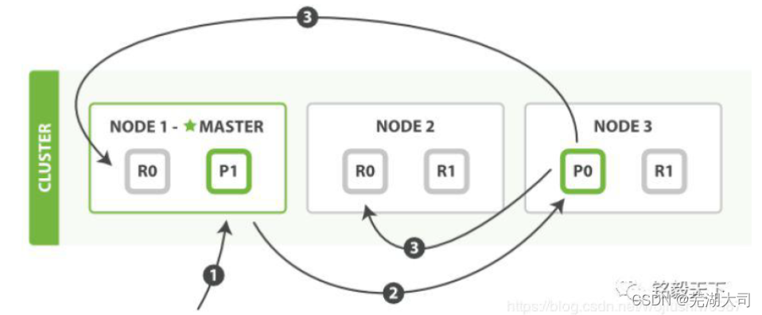
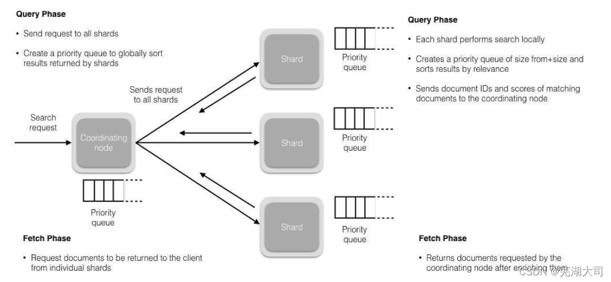
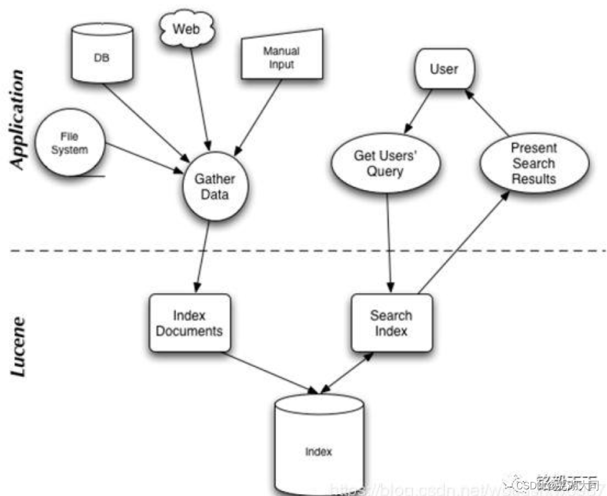
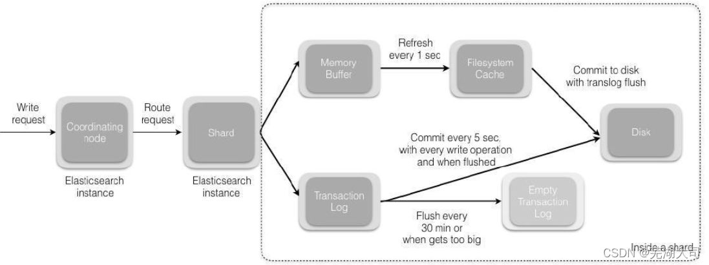

# Elasticsearch面试题

## elasticsearch的倒排索引是什么


`面试官`：想了解你对基础概念的认知。

通俗解释一下就可以。

传统的我们的检索是通过文章，逐个遍历找到对应关键词的位置。

而倒排索引，是通过分词策略，形成了词和文章的映射关系表，这种词典+映射表即为倒排索引。

有了倒排索引，就能实现`o（1）时间复杂度`的效率检索文章了，极大的提高了检索效率。

学术的解答方式：

> 倒排索引，相反于一篇文章包含了哪些词，它从词出发，记载了这个词在哪些文档中出现过，由两部分组成——词典和倒排表。


`加分项`：倒排索引的底层实现是基于：FST（Finite State Transducer）数据结构。

lucene从4+版本后开始大量使用的数据结构是FST。FST有两个优点：

**1、** 空间占用小。通过对词典中单词前缀和后缀的重复利用，压缩了存储空间；

**2、** 查询速度快。O(len(str))的查询时间复杂度。


## Elasticsearch 在部署时，对 Linux 的设置有哪些优化方法


面试官：想了解对 ES 集群的运维能力。

解

**1、** 关闭缓存 swap;

**2、** 堆内存设置为：Min（节点内存/2, 32GB）;

**3、** 设置最大文件句柄数；

**4、** 线程池+队列大小根据业务需要做调整；

**5、** 磁盘存储 raid 方式——存储有条件使用 RAID10，增加单节点性能以及避免单节点存储故障。


## 详细描述一下Elasticsearch索引文档的过程 


`面试官`：想了解ES的底层原理，不再只关注业务层面了。

这里的索引文档应该理解为文档写入ES，创建索引的过程。

文档写入包含：单文档写入和批量bulk写入，这里只解释一下：单文档写入流程。

记住官方文档中的这个图。

第一步：客户写集群某节点写入数据，发送请求。（如果没有指定路由/协调节点，请求的节点扮演`路由节点`的角色。）

第二步：节点1接受到请求后，使用文档_id来确定文档属于分片0。请求会被转到另外的节点，假定节点3。因此分片0的主分片分配到节点3上。

第三步：节点3在主分片上执行写操作，如果成功，则将请求并行转发到节点1和节点2的副本分片上，等待结果返回。所有的副本分片都报告成功，节点3将向协调节点（节点1）报告成功，节点1向请求客户端报告写入成功。

如果面试官再问：第二步中的文档获取分片的过程？

回借助路由算法获取，路由算法就是根据路由和文档id计算目标的分片id的过程。

```
1shard = hash(_routing) % (num_of_primary_shards)
```


## 在并发情况下，Elasticsearch 如果保证读写一致？ 


**1、** 可以通过版本号使用乐观并发控制，以确保新版本不会被旧版本覆盖，**由应用**

**层来处理具体的冲突；**

**2、** 另外对于写操作，一致性级别支持 quorum/one/all，默认为 quorum，即只有当大多数分片可用时才允许写操作。但即使大多数可用，也可能存在因为网络等原因导致写入副本失败，这样该副本被认为故障，分片将会在一个不同的节点

上重建。

**3、** 对于读操作，可以设置 replication 为 sync(默认)，这使得操作在主分片和副本分片都完成后才会返回；如果设置 replication 为 async 时，也可以通过设置搜索请求参数_preference 为 primary 来查询主分片，确保文档是最新版本。


## 请解释在 Elasticsearch 集群中添加或创建索引的过程？ 


要添加新索引，应使用创建索引 API 选项。创建索引所需的参数是索引的配置Settings，索引中的字段 Mapping 以及索引别名 Alias。

也可以通过模板 Template 创建索引。


## 安装 Elasticsearch 需要依赖什么组件吗？


ES 早期版本需要JDK，在7.X版本后已经集成了 JDK，已无需第三方依赖。


## 如何使用 Elastic Reporting ？


收费功能，只是了解，点到为止。

Reporting API有助于将检索结果生成 PD F格式，图像 PNG 格式以及电子表格 CSV 格式的数据，并可根据需要进行共享或保存。


## elasticsearch 是如何实现 master 选举的


面试官：想了解 ES 集群的底层原理，不再只关注业务层面了。

**前置前提：**

**1、** 只有候选主节点（master：true）的节点才能成为主节点。

**2、** 最小主节点数（min_master_nodes）的目的是防止脑裂。

这个我看了各种网上分析的版本和源码分析的书籍，云里雾里。核对了一下代码，核心入口为 findMaster，选择主节点成功返回对应 Master，否则返回 null。

**选举流程大致描述如下：**

第一步：确认候选主节点数达标，elasticsearch.yml 设置的值

```
discovery.zen.minimum_master_nodes；
```

第二步：比较：先判定是否具备 master 资格，具备候选主节点资格的优先返回；

若两节点都为候选主节点，则 id 小的值会主节点。

注意这里的 id 为 string 类型。

题外话：获取节点 id 的方法。

```
1GET /_cat/nodes?v&h=ip,port,heapPercent,heapMax,id,name
2ip
port heapPercent heapMax id
name
```


## 在并发情况下，Elasticsearch如果保证读写一致？


**1、** 可以通过版本号使用乐观并发控制，以确保新版本不会被旧版本覆盖，由应用层来处理具体的冲突；

**2、** 另外对于写操作，一致性级别支持quorum/one/all，默认为quorum，即只有当大多数分片可用时才允许写操作。但即使大多数可用，也可能存在因为网络等原因导致写入副本失败，这样该副本被认为故障，分片将会在一个不同的节点上重建。

**3、** 对于读操作，可以设置replication为sync(默认)，这使得操作在主分片和副本分片都完成后才会返回；如果设置replication为async时，也可以通过设置搜索请求参数_preference为primary来查询主分片，确保文档是最新版本。


## 详细描述一下Elasticsearch更新和删除文档的过程。


**1、** 删除和更新也都是写操作，但是Elasticsearch中的文档是不可变的，因此不能被删除或者改动以展示其变更；

**2、** 磁盘上的每个段都有一个相应的.del文件。当删除请求发送后，文档并没有真的被删除，而是在.del文件中被标记为删除。该文档依然能匹配查询，但是会在结果中被过滤掉。当段合并时，在.del文件中被标记为删除的文档将不会被写入新段。

**3、** 在新的文档被创建时，Elasticsearch会为该文档指定一个版本号，当执行更新时，旧版本的文档在.del文件中被标记为删除，新版本的文档被索引到一个新段。旧版本的文档依然能匹配查询，但是会在结果中被过滤掉。

## elasticsearch 读取数据  


使用RestFul API向对应的node发送查询请求，根据did来判断在哪个shard上，返回的是primary和replica的node节点集合

这样会负载均衡地把查询发送到对应节点，之后对应节点接收到请求，将document数据返回协调节点，协调节点把document返回给客户端


## 您能解释一下X-Pack for Elasticsearch的功能和重要性吗？


X-Pack 是与Elasticsearch一起安装的扩展程序。

X-Pack的各种功能包括安全性（基于角色的访问，特权/权限，角色和用户安全性），监视，报告，警报等。


## Elasticsearch 中的节点（比如共 20 个），其中的 10 个选了一个master，另外 10 个选了另一个 master，怎么办？


**1、** 当集群 master 候选数量不小于 3 个时，可以通过设置最少投票通过数量（discovery.zen.minimum_master_nodes）超过所有候选节点一半以上来解决脑裂问题；

**2、** 当候选数量为两个时，只能修改为唯一的一个 master 候选，其他作为 data节点，避免脑裂问题。


## 解释一下 Elasticsearch集群中的 索引的概念 ？


Elasticsearch 集群可以包含多个索引，与关系数据库相比，它们相当于数据库表


## 你可以列出 Elasticsearch 各种类型的分析器吗？  


Elasticsearch Analyzer 的类型为内置分析器和自定义分析器。

**Standard Analyzer**

标准分析器是默认分词器，如果未指定，则使用该分词器。

它基于Unicode文本分割算法，适用于大多数语言。

**Whitespace Analyzer**

基于空格字符切词。

**Stop Analyzer**

在simple Analyzer的基础上，移除停用词。

**Keyword Analyzer**

不切词，将输入的整个串一起返回。

自定义分词器的模板

自定义分词器的在Mapping的Setting部分设置：

```
PUT my_custom_index
{
 "settings":{
  "analysis":{
  "char_filter":{},
  "tokenizer":{},
  "filter":{},
  "analyzer":{}
  }
 }
}
```

脑海中还是上面的三部分组成的图示。其中：

“char_filter”:{},——对应字符过滤部分；

“tokenizer”:{},——对应文本切分为分词部分；

“filter”:{},——对应分词后再过滤部分；

“analyzer”:{}——对应分词器组成部分，其中会包含：1. 2. 3。


## 解释一下 Elasticsearch Node？


节点是 Elasticsearch 的实例。实际业务中，我们会说：ES集群包含3个节点、7个节点。

这里节点实际就是：一个独立的 Elasticsearch 进程，一般将一个节点部署到一台独立的服务器或者虚拟机、容器中。

不同节点根据角色不同，可以划分为：

**主节点**

帮助配置和管理在整个集群中添加和删除节点。

**数据节点**

存储数据并执行诸如CRUD（创建/读取/更新/删除）操作，对数据进行搜索和聚合的操作。

**1、** 客户端节点（或者说：协调节点） 将集群请求转发到主节点，将与数据相关的请求转发到数据节点

**2、** 摄取节点

用于在索引之前对文档进行预处理。


## 在安装Elasticsearch时，请说明不同的软件包及其重要性？


这个貌似没什么好说的，去官方文档下载对应操作系统安装包即可。

部分功能是收费的，如机器学习、高级别 kerberos 认证安全等选型要知悉。


## Elasticsearch在部署时，对Linux的设置有哪些优化方法


`面试官`：想了解对ES集群的运维能力。

**1、** 关闭缓存swap;

**2、** 堆内存设置为：Min（节点内存/2, 32GB）;

**3、** 设置最大文件句柄数；

**4、** 线程池+队列大小根据业务需要做调整；

**5、** 磁盘存储raid方式——存储有条件使用RAID10，增加单节点性能以及避免单节点存储故障。


## 请解释有关 Elasticsearch的 NRT？


从文档索引（写入）到可搜索到之间的延迟默认一秒钟，因此Elasticsearch是近实时（NRT）搜索平台。

也就是说：文档写入，最快一秒钟被索引到，不能再快了。

写入调优的时候，我们通常会动态调整：refresh_interval = 30s 或者更达值，以使得写入数据更晚一点时间被搜索到。


## elasticsearch 的 document设计


在使用es时 避免使用复杂的查询语句（Join 、聚合），就是在建立索引时，

就根据查询语句建立好对应的元数据。

## 详细描述一下Elasticsearch搜索的过程？


`面试官`：想了解ES搜索的底层原理，不再只关注业务层面了。

搜索拆解为“query then fetch” 两个阶段。

**query阶段的目的**：定位到位置，但不取。

步骤拆解如下：

**1、** 假设一个索引数据有5主+1副本 共10分片，一次请求会命中（主或者副本分片中）的一个。

**2、** 每个分片在本地进行查询，结果返回到本地有序的优先队列中。

**3、** 第2）步骤的结果发送到协调节点，协调节点产生一个全局的排序列表。

**fetch阶段的目的**：取数据。

路由节点获取所有文档，返回给客户端。


## Beats 如何与 Elasticsearch 结合使用？


Beats是一种开源工具，可以将数据直接传输到 Elasticsearch 或通过 logstash，在使用Kibana进行查看之前，可以对数据进行处理或过滤。

传输的数据类型包含：审核数据，日志文件，云数据，网络流量和窗口事件日志等。


## 解释一下 Elasticsearch 的 分片？


当文档数量增加，硬盘容量和处理能力不足时，对客户端请求的响应将延迟。

在这种情况下，将索引数据分成小块的过程称为分片，可改善数据搜索结果的获取。


## 精准匹配检索和全文检索匹配检索的不同？


**两者的本质区别：**

精确匹配用于：是否完全一致？

**举例：邮编、身份证号的匹配往往是精准匹配。**

全文检索用于：是否相关？

举例：类似B站搜索特定关键词如“马保国 视频”往往是模糊匹配，相关的都返回就可以。


## 您能否说明当前可下载的稳定Elasticsearch版本？


Elasticsearch 当前最新版本是7.10（2020年11月21日）。

为什么问这个问题？ES 更新太快了，应聘者如果了解并使用最新版本，基本能说明他关注 ES 更新。甚至从更广维度讲，他关注技术的迭代和更新。

但，不信你可以问问，很多求职者只知道用了 ES，什么版本一概不知。


## 您能解释一下 Elasticsearch 中的 Explore API 吗？


没有用过，这是 Graph （收费功能）相关的API。

点到为止即可，类似问题实际开发现用现查，类似问题没有什么意义。

[https://www.elastic.co/guide/en/elasticsearch/reference/current/graph-explore-api.html](https://www.elastic.co/guide/en/elasticsearch/reference/current/graph-explore-api.html)


## elasticsearch了解多少，说说你们公司es的集群架构，索引数据大小，分片有多少，以及一些调优手段 。 


`面试官`：想了解应聘者之前公司接触的ES使用场景、规模，有没有做过比较大规模的索引设计、规划、调优。

如实结合自己的实践场景回答即可。

比如：ES集群架构13个节点，索引根据通道不同共20+索引，根据日期，每日递增20+，索引：10分片，每日递增1亿+数据，

每个通道每天索引大小控制：150GB之内。

仅索引层面调优手段：

**设计阶段调优**

**1、** 根据业务增量需求，采取基于日期模板创建索引，通过roll over API滚动索引；

**2、** 使用别名进行索引管理；

**3、** 每天凌晨定时对索引做force_merge操作，以释放空间；

**4、** 采取冷热分离机制，热数据存储到SSD，提高检索效率；冷数据定期进行shrink操作，以缩减存储；

**5、** 采取curator进行索引的生命周期管理；

**6、** 仅针对需要分词的字段，合理的设置分词器；

**7、** Mapping阶段充分结合各个字段的属性，是否需要检索、是否需要存储等。……..

**写入调优**

**1、** 写入前副本数设置为0；

**2、** 写入前关闭refresh_interval设置为-1，禁用刷新机制；

**3、** 写入过程中：采取bulk批量写入；

**4、** 写入后恢复副本数和刷新间隔；

**5、** 尽量使用自动生成的id。

**查询调优**

**1、** 禁用wildcard；

**2、** 禁用批量terms（成百上千的场景）；

**3、** 充分利用倒排索引机制，能keyword类型尽量keyword；

**4、** 数据量大时候，可以先基于时间敲定索引再检索；

**5、** 设置合理的路由机制。

**1.4、其他调优**

部署调优，业务调优等。

上面的提及一部分，面试者就基本对你之前的实践或者运维经验有所评估了。


## 能列举过你使用的 X-Pack 命令吗?


7.1 安全功能免费后，使用了：setup-passwords 为账号设置密码，确保集群安全。


## elasticsearch 全文检索


(1) 客户端使用RestFul API向对应的node发送查询请求

(2)协调节点将请求转发到所有节点（primary或者replica）所有节点将对应的数据查询之后返回对应的doc id 返回给协调节点

(3)协调节点将doc进行排序聚合

(4) 协调节点再根据doc id 把查询请求发送到对应shard的node，返回document


## 你之前公司的ElasticSearch集群，一个Node一般会分配几个分片？


我们遵循官方建议，一个Node最好不要多于三个shards.

## 我们可以在 Elasticsearch 中执行搜索的各种可能方式有哪些？


核心方式如下：

方式一：基于 DSL 检索（最常用） Elasticsearch提供基于JSON的完整查询DSL来定义查询。

```
GET /shirts/_search
{
  "query": {
    "bool": {
      "filter": [
        { "term": { "color": "red"   }},
        { "term": { "brand": "gucci" }}
      ]
    }
  }
}
```

方式二：基于 URL 检索

```
GET /my_index/_search?q=user:seina
```

方式三：类SQL 检索

```
POST /_sql?format=txt
{
  "query": "SELECT * FROM uint-2020-08-17 ORDER BY itemid DESC LIMIT 5"
}
```

功能还不完备，不推荐使用。


## ElasticSearch对于大数据量（上亿量级）的聚合如何实现？ 


ElasticSearch提供的首个近似聚合是cardinality度量。它提供一个字段的基数，即该字段的distinct或者unique值的数目。它是基于HLL算法的。HLL会先对我们的输入做哈希运算，然后根据哈希运算结果中的bits做概率估算从而得到基数。其特点是：

可配置的精度，用来控制内存的使用（更精确＝更多内存），小的数据集精度是非常高的；我们可以通过配置参数来设置去重需要的固定内存使用量，无论数千还是数十亿的唯一值，内存使用量只与你配置的精确度相关 。

图片


## 详细描述一下 Elasticsearch 索引文档的过程


面试官：想了解 ES 的底层原理，不再只关注业务层面了。

这里的索引文档应该理解为文档写入 ES，创建索引的过程。文档写入包含：单文档写入和批量 bulk 写入，这里只解释一下：单文档写入流程。

**第一步：**客户写集群某节点写入数据，发送请求。（如果没有指定路由/协调节点，请求的节点扮演路由节点的角色。）

**第二步：**节点 1 接受到请求后，使用文档_id 来确定文档属于分片 0。请求会被转到另外的节点，假定节点 3。因此分片 0 的主分片分配到节点 3 上。

**第三步：**节点 3 在主分片上执行写操作，如果成功，则将请求并行转发到节点 1和节点 2 的副本分片上，等待结果返回。所有的副本分片都报告成功，节点 3 将向协调节点（节点 1）报告成功，节点 1 向请求客户端报告写入成功。

**如果面试官再问：**第二步中的文档获取分片的过程？

回借助路由算法获取，路由算法就是根据路由和文档 id 计算目标的分片 id 的

过程。

```
1shard = hash(_routing) % (num_of_primary_shards)
```


## elasticsearch 数据预热


数据预热是指，每隔一段时间，将热数据手动在后台查询一遍，将热数据刷新到fileSystem cache上


## 如何使用 Elasticsearch Tokenizer？


Tokenizer 接收字符流（如果包含了字符过滤，则接收过滤后的字符流；否则，接收原始字符流），将其分词。同时记录分词后的顺序或位置(position)，以及开始值（start_offset）和偏移值(end_offset-start_offset)。


## elasticsearch 数据的写入原理


es数据写入原理主要可以分为4个操作：

**1、** refresh

**2、** commit

**3、** flush

**4、** merge


## 你是如何做 ElasticSearch 写入调优的？


1）写入前副本数设置为0；

2）写入前关闭refresh_interval设置为-1，禁用刷新机制；

3）写入过程中：采取bulk批量写入；

4） 写入后恢复副本数和刷新间隔；

5） 尽量使用自动生成的id。


## Elasticsearch是如何实现Master选举的？


**1、** Elasticsearch的选主是ZenDiscovery模块负责的，主要包含Ping（节点之间通过这个RPC来发现彼此）和Unicast（单播模块包含一个主机列表以控制哪些节点需要ping通）这两部分；

**2、** 对所有可以成为master的节点（**node.master: true**）根据nodeId字典排序，每次选举每个节点都把自己所知道节点排一次序，然后选出第一个（第0位）节点，暂且认为它是master节点。

**3、** 如果对某个节点的投票数达到一定的值（可以成为master节点数n/2+1）并且该节点自己也选举自己，那这个节点就是master。否则重新选举一直到满足上述条件。

**4、** 补充：master节点的职责主要包括集群、节点和索引的管理，不负责文档级别的管理；data节点可以关闭http功能*。


## ElasticSearch主分片数量可以在后期更改吗？为什么？


不可以，因为根据路由算法shard = hash(document_id) % (num_of_primary_shards)，当主分片数量变化时会影响数据被路由到哪个分片上。


## 如何监控 Elasticsearch 集群状态？ 


Marvel 让你可以很简单的通过 Kibana 监控 Elasticsearch。你可以实时查看你的集群健康状态和性能，也可以分析过去的集群、索引和节点指标。

## Kibana在Elasticsearch的哪些地方以及如何使用？


Kibana是ELK Stack –日志分析解决方案的一部分。

它是一种开放源代码的可视化工具，可以以拖拽、自定义图表的方式直观分析数据，极大降低的数据分析的门槛。

未来会向类似：商业智能和分析软件 - Tableau 发展。


## elasticsearch是如何实现master选举的 


`面试官`：想了解ES集群的底层原理，不再只关注业务层面了。

**前置前提：**

**1、** 只有候选主节点（master：true）的节点才能成为主节点。

**2、** 最小主节点数（min_master_nodes）的目的是防止脑裂。

这个我看了各种网上分析的版本和源码分析的书籍，云里雾里。

核对了一下代码，核心入口为findMaster，选择主节点成功返回对应Master，否则返回null。选举流程大致描述如下：

第一步：确认候选主节点数达标，elasticsearch.yml设置的值discovery.zen.minimum_master_nodes；

第二步：比较：先判定是否具备master资格，具备候选主节点资格的优先返回；若两节点都为候选主节点，则id小的值会主节点。注意这里的id为string类型。

题外话：获取节点id的方法。

```
 1GET /_cat/nodes?v&h=ip,port,heapPercent,heapMax,id,name
2ip        port heapPercent heapMax id   name
```


## 客户端在和集群连接时，是如何选择特定的节点执行请求的？


TransportClient利用transport模块远程连接一个ElasticSearch集群。它并不加入到集群中，只是简单的获得一个或者多个初始化的transport地址，并以轮询的方式与这些地址进行通信。


## 你能告诉我 Elasticsearch 中的数据存储功能吗？


Elasticsearch是一个搜索引擎，输入写入ES的过程就是索引化的过程，数据按照既定的 Mapping 序列化为Json 文档实现存储。


## Master 节点和 候选 Master节点有什么区别？


主节点负责集群相关的操作，例如创建或删除索引，跟踪哪些节点是集群的一部分，以及决定将哪些分片分配给哪些节点。

拥有稳定的主节点是衡量集群健康的重要标志。

而候选主节点是被选具备候选资格，可以被选为主节点的那些节点。


## 客户端在和集群连接时，如何选择特定的节点执行请求的？  


TransportClient 利用 transport 模块远程连接一个 elasticsearch 集群。它并不加入到集群中，只是简单的获得一个或者多个初始化的 transport 地址，并以 轮询 的方式与这些地址进行通信。


## 对于 GC 方面，在使用 Elasticsearch 时要注意什么？


**1、** SEE

**2、** 倒排词典的索引需要常驻内存，无法 GC，需要监控 data node 上 segmentmemory 增长趋势。

**3、** 各类缓存，field cache, filter cache, indexing cache, bulk queue 等等，要设置合理的大小，并且要应该根据最坏的情况来看 heap 是否够用，也就是各类缓存全部占满的时候，还有 heap 空间可以分配给其他任务吗？避免采用 clear cache等“自欺欺人”的方式来释放内存。

**4、** 避免返回大量结果集的搜索与聚合。确实需要大量拉取数据的场景，可以采用scan & scroll api 来实现。

**5、** cluster stats 驻留内存并无法水平扩展，超大规模集群可以考虑分拆成多个集群通过 tribe node 连接。

**6、** 想知道 heap 够不够，必须结合实际应用场景，并对集群的 heap 使用情况做持续的监控。


## 拼写纠错是如何实现的？


**1、拼写纠错是基于编辑距离来实现**；编辑距离是一种标准的方法，它用来表示经过插入、删除和替换操作从一个字符串转换到另外一个字符串的最小操作步数；

**2、编辑距离的计算过程：**比如要计算 batyu 和 beauty 的编辑距离，先创建一个7×8 的表（batyu 长度为 5，coffee 长度为 6，各加 2），接着，在如下位置填入

黑色数字。

**其他格的计算过程是取以下三个值的最小值：**

如果最上方的字符等于最左方的字符，则为左上方的数字。否则为左上方的数字 +1。（对于 3,3 来说为 0）左方数字+1（对于 3,3 格来说为 2）上方数字+1（对于 3,3 格来说为 2）

最终取右下角的值即为编辑距离的值 3。

对于拼写纠错，我们考虑构造一个度量空间（Metric Space），该空间内任何关

系满足以下三条基本条件：

> d(x,y) = 0 -- 假如 x 与 y 的距离为 0，则 x=y

d(x,y) = d(y,x) -- x 到 y 的距离等同于 y 到 x 的距离

d(x,y) + d(y,z) >= d(x,z) -- 三角不等式


**1、** 根据三角不等式，则满足与 query 距离在 n 范围内的另一个字符转 B，其与 A的距离最大为 d+n，最小为 d-n。

**2、** BK 树的构造就过程如下：每个节点有任意个子节点，每条边有个值表示编辑距离。所有子节点到父节点的边上标注 n 表示编辑距离恰好为 n。比如，我们有棵树父节点是”book”和两个子

**点”cake”和”books”，”book”到”books”的边标号 ：**

**1、** ”book”到”cake”的边上标号.

**2、** 从字典里构造好树后，无论何时你想插入新单词时.计算该单词与根节点的编辑距离，并且查找数值为 d(neweord, root)的边。递归得与各子节点进行比较，直到没有子节点，你就可以创建新的子节点并将新单词保存在那。比如，插入”boo”到刚才上述例子的树中，我们先检查根节点，查找 d(“book”, “boo”) = 1 的边，然后检查标号为1 的边的子节点，得到单词”books”。我们再计算距离 d(“books”, “boo”)=2，则将新单词插在”books”之后，边标号为 2。

**3、** 查询相似词如下：计算单词与根节点的编辑距离 d，然后递归查找每个子节点标号为 d-n 到 d+n（包含）的边。假如被检查的节点与搜索单词的距离 d 小于n，则返回该节点并继续查询。比如输入 cape 且最大容忍距离为 1，则先计算和根的编辑距离 d(“book”,“cape”)=4，然后接着找和根节点之间编辑距离为 3 到5 的，这个就找到了cake 这个节点，计算 d(“cake”, “cape”)=1，满足条件所以返回 cake，然后再找和 cake 节点编辑距离是 0 到 2 的，分别找到 cape 和cart 节点，这样就得到 cape 这个满足条件的结果。

## 在Elasticsearch中 cat API的功能是什么？


cat API 命令提供了Elasticsearch 集群的分析、概述和运行状况，其中包括与别名，分配，索引，节点属性等有关的信息。

这些 cat 命令使用查询字符串作为其参数，并以J SON 文档格式返回结果信息。

## es 的集群架构，索引数据，分片，调优手段。

面试官：想了解应聘者之前公司接触的ES 使用场景、规模， 有没有做过比较大
规模的索引设计、规划、调优。
解答：
如实结合自己的实践场景回答即可。
比如：ES 集群架构13 个节点， 索引根据通道不同共20+索引，根据日期， 每日
递增20+，索引： 10 分片，每日递增1 亿+数据，
每个通道每天索引大小控制：150GB 之内。

仅索引层面调优手段：

**1.1、设计阶段调优**

1、根据业务增量需求，采取基于日期模板创建索引，通过roll over API 滚动索
引；
2、使用别名进行索引管理；
3、每天凌晨定时对索引做force_merge 操作，以释放空间；
4、采取冷热分离机制，热数据存储到SSD，提高检索效率；冷数据定期进行shrink
操作，以缩减存储；
5、采取curator 进行索引的生命周期管理；
6、仅针对需要分词的字段，合理的设置分词器；
7、Mapping 阶段充分结合各个字段的属性，是否需要检索、是否需要存储等。…

**1.2、写入调优**

1、写入前副本数设置为0；
2、写入前关闭refresh_interval 设置为-1，禁用刷新机制；
3、写入过程中：采取bulk 批量写入；
4、写入后恢复副本数和刷新间隔；
5、尽量使用自动生成的id。

**1.3、查询调优**

1、禁用wildcard；
2、禁用批量terms（成百上千的场景）；
3、充分利用倒排索引机制，能keyword 类型尽量keyword；
4、数据量大时候，可以先基于时间敲定索引再检索；
5、设置合理的路由机制。

**1.4、其他调优**

部署调优，业务调优等。
上面的提及一部分，面试者就基本对你之前的实践或者运维经验有所评估了。

## es 的倒排索引是什么

传统的我们的检索是通过文章，逐个遍历找到对应关键词的位置。
而倒排索引，是通过分词策略，形成了词和文章的映射关系表，这种词典+映射表即为倒排索引。
有了倒排索引，就能实现o（1）时间复杂度的效率检索文章了，极大的提高了检索效率。

学术的解答方式：
倒排索引，相反于一篇文章包含了哪些词，它从词出发，记载了这个词在哪些文档中出现过，由两部分组成——词典和倒排表。
加分项：倒排索引的底层实现是基于： FST（ Finite State Transducer）数据结
构。
lucene 从4+版本后开始大量使用的数据结构是FST。FST 有两个优点：
1、空间占用小。通过对词典中单词前缀和后缀的重复利用， 压缩了存储空间；
2、查询速度快。O(len(str))的查询时间复杂度。

## es索引数据多了怎么办，如何调优，部署

面试官：想了解大数据量的运维能力。
解答：索引数据的规划，应在前期做好规划， 正所谓“ 设计先行，编码在后” ，
这样才能有效的避免突如其来的数据激增导致集群处理能力不足引发的线上客户检索或者其他业务受到影响。
如何调优，正如问题1 所说，这里细化一下：

**动态索引层面**

基于模板+时间+rollover api 滚动创建索引，举例： 设计阶段定义： blog 索引的模板格式为： blog_index_时间戳的形式，每天递增数据。
这样做的好处：不至于数据量激增导致单个索引数据量非常大， 接近于上线2 的32 次幂-1，索引存储达到了TB+甚至更大。
一旦单个索引很大，存储等各种风险也随之而来， 所以要提前考虑+及早避免。

**3.2 存储层面**

冷热数据分离存储，热数据（比如最近3 天或者一周的数据），其余为冷数据。
对于冷数据不会再写入新数据，可以考虑定期force_merge 加shrink 压缩操作，节省存储空间和检索效率。

**3.3 部署层面**

一旦之前没有规划，这里就属于应急策略。
结合ES 自身的支持动态扩展的特点，动态新增机器的方式可以缓解集群压力，注意： 如果之前主节点等规划合理，不需要重启集群也能完成动态新增的。

## es 是如何实现master 选举的

前置前提：
1、只有候选主节点（ master：true）的节点才能成为主节点。
2、最小主节点数（ min_master_nodes）的目的是防止脑裂。
这个我看了各种网上分析的版本和源码分析的书籍，云里雾里。
核对了一下代码，核心入口为findMaster，选择主节点成功返回对应Master，否则返回null。选举流程大致描述如下：
第一步： **确认候选主节点数达标**，elasticsearch.yml 设置的值
discovery.zen.minimum_master_nodes；
第二步：**比较：先判定是否具备master 资格，具备候选主节点资格的优先返回**；
若两节点都为候选主节点，则id 小的值会主节点。注意这里的id 为string 类型。

题外话： 获取节点id 的方法。
GET /_cat/nodes?v&h=ip,port,heapPercent,heapMax,id,name
ip port heapPercent heapMax id name

## 详细描述一下es索引文档的过程

这里的索引文档应该理解为**文档写入ES，创建索引的过程**。
文档写入包含：单文档写入和批量bulk 写入，这里只解释一下：单文档写入流程。



第一步：客户写集群某节点写入数据，发送请求。（如果没有指定路由/协调节点，
请求的节点扮演路由节点的角色。）

第二步：节点1 接受到请求后，使用文档_id 来确定文档属于分片0。请求会被转
到另外的节点，假定节点3。因此分片0 的主分片分配到节点3 上。

第三步： 节点3 在主分片上执行写操作，如果成功， 则将请求并行转发到节点1
和节点2 的副本分片上，等待结果返回。所有的副本分片都报告成功，节点3 将
向协调节点（节点1）报告成功， 节点1 向请求客户端报告写入成功。

如果面试官再问：第二步中的文档获取分片的过程？
回答：借助路由算法获取，路由算法就是根据路由和文档id 计算目标的分片id 的
过程。

```
shard = hash(_routing) % (num_of_primary_shards)
```


## 详细描述一下es搜索的过程？

解答：
搜索拆解为“ query then fetch” 两个阶段。
query 阶段的目的：定位到位置，但不取。

步骤拆解如下：
1、假设一个索引数据有5 主+1 副本共10 分片，一次请求会命中（主或者副本分片中） 的一个。
2、每个分片在本地进行查询，结果返回到本地有序的优先队列中。
3、第2）步骤的结果发送到协调节点， 协调节点产生一个全局的排序列表。

fetch 阶段的目的：取数据。
路由节点获取所有文档，返回给客户端。

1、搜索被执行成一个两阶段过程，我们称之为Query Then Fetch；
2、在初始查询阶段时，查询会广播到索引中每一个分片拷贝（主分片或者副本分片） 。每个分片在本地执行搜索并构建一个匹配文档的大小为from + size 的优先队列。
PS：在搜索的时候是会查询Filesystem Cache 的，但是有部分数据还在MemoryBuffer，所以搜索是近实时的。
3、每个分片返回各自优先队列中所有文档的ID 和排序值给协调节点，它合并这些值到自己的优先队列中来产生一个全局排序后的结果列表。
4、接下来就是取回阶段，协调节点辨别出哪些文档需要被取回并向相关的分片提交多个GET 请求。每个分片加载并丰富文档，如果有需要的话，接着返回文档给协调节点。一旦所有的文档都被取回了，协调节点返回结果给客户端。
5、补充： Query Then Fetch 的搜索类型在文档相关性打分的时候参考的是本分片的数据，这样在文档数量较少的时候可能不够准确，DFS Query Then Fetch 增加了一个预查询的处理，询问Term 和Document frequency，这个评分更准确，但是性能会变差。*




## es在部署时，对Linux 的设置有哪些优化方法

解答：
1、关闭缓存swap;
2、堆内存设置为： Min（节点内存/2, 32GB）;
3、设置最大文件句柄数；
4、线程池+队列大小根据业务需要做调整；
5、磁盘存储raid 方式——存储有条件使用RAID10，增加单节点性能以及避免单
节点存储故障。

## lucence 内部结构是什么？



Lucene 是有索引和搜索的两个过程，包含索引创建，索引，搜索三个要点。可以基于这个脉络展开一些。

补充：关于Lucene 的Segement：
1、Lucene 索引是由多个段组成， 段本身是一个功能齐全的倒排索引。
2、段是不可变的，允许Lucene 将新的文档增量地添加到索引中，而不用从头重
建索引。
3、对于每一个搜索请求而言，索引中的所有段都会被搜索， 并且每个段会消耗
CPU 的时钟周、文件句柄和内存。这意味着段的数量越多， 搜索性能会越低。
4、为了解决这个问题，Elasticsearch 会合并小段到一个较大的段，提交新的合并
段到磁盘，并删除那些旧的小段。

## es是如何实现Master 选举的？

1、Elasticsearch 的选主是ZenDiscovery 模块负责的， 主要包含Ping（节点之间通过这个RPC 来发现彼此）和Unicast（单播模块包含一个主机列表以控制哪些节点需要ping 通）这两部分；

2、对所有可以成为master 的节点（ node.master: true）根据nodeId 字典排序，每次选举每个节点都把自己所知道节点排一次序，然后选出第一个（第0 位）节点，暂且认为它是master 节点。

3、如果对某个节点的投票数达到一定的值（可以成为master 节点数n/2+1）并且该节点自己也选举自己，那这个节点就是master。否则重新选举一直到满足上述条件。

4、补充： master 节点的职责主要包括集群、节点和索引的管理，不负责文档级别的管理；data 节点可以关闭http 功能*。

## es中的节点（比如共20 个），其中的10 个

选了一个master，另外10 个选了另一个master，怎么办？
1、当集群master 候选数量不小于3 个时，可以通过设置最少投票通过数量（discovery.zen.minimum_master_nodes）超过所有候选节点一半以上来解决脑裂问题；

2、当候选数量为两个时，只能修改为唯一的一个master 候选，其他作为data节点，避免脑裂问题。

## 客户端在和集群连接时，如何选择特定的节点执行请求的？

1、TransportClient 利用transport 模块远程连接一个elasticsearch 集群。它并不加入到集群中，只是简单的获得一个或者多个初始化的transport 地址，并以轮询的方式与这些地址进行通信。

## 详细描述一下es索引文档的过程。

协调节点默认使用文档ID 参与计算（也支持通过routing）， 以便为路由提供合适的分片。
shard = hash(document_id) % (num_of_primary_shards)

1、当分片所在的节点接收到来自协调节点的请求后，会将请求写入到MemoryBuffer，然后定时（默认是每隔1 秒）写入到Filesystem Cache，这个从MomeryBuffer 到Filesystem Cache 的过程就叫做refresh；

2、当然在某些情况下，存在Momery Buffer 和Filesystem Cache 的数据可能会丢失，ES 是通过translog 的机制来保证数据的可靠性的。其实现机制是接收到请求后，同时也会写入到translog 中，当Filesystem cache 中的数据写入到磁盘中时， 才会清除掉，这个过程叫做flush；

3、在flush 过程中，内存中的缓冲将被清除，内容被写入一个新段，段的fsync将创建一个新的提交点，并将内容刷新到磁盘，旧的translog 将被删除并开始一个新的translog。

4、flush 触发的时机是定时触发（默认30 分钟）或者translog 变得太大（默认为512M）时；




## 详细描述一下es更新和删除文档的过程。

1、删除和更新也都是写操作，但是Elasticsearch 中的文档是不可变的， 因此不能被删除或者改动以展示其变更；
2、磁盘上的每个段都有一个相应的.del 文件。当删除请求发送后，文档并没有真的被删除，而是在.del 文件中被标记为删除。该文档依然能匹配查询，但是会在结果中被过滤掉。当段合并时，在.del 文件中被标记为删除的文档将不会被写入新段。
3、在新的文档被创建时，Elasticsearch 会为该文档指定一个版本号，当执行更新时，旧版本的文档在.del 文件中被标记为删除，新版本的文档被索引到一个新段。旧版本的文档依然能匹配查询，但是会在结果中被过滤掉。

## es中，是怎么根据一个词找到对应的倒排索引的？

https://www.cnblogs.com/forfuture1978/archive/2009/12/14/1623597.html

https://www.cnblogs.com/forfuture1978/archive/2009/12/14/1623599.html

## es 在部署时，对Linux 的设置有哪些优化方法？

1、64 GB 内存的机器是非常理想的， 但是32 GB 和16 GB 机器也是很常见的。少于8 GB 会适得其反。
2、如果你要在更快的CPUs 和更多的核心之间选择，选择更多的核心更好。多个内核提供的额外并发远胜过稍微快一点点的时钟频率。
3、如果你负担得起SSD，它将远远超出任何旋转介质。基于SSD 的节点，查询和索引性能都有提升。如果你负担得起，SSD 是一个好的选择。
4、即使数据中心们近在咫尺，也要避免集群跨越多个数据中心。绝对要避免集群跨越大的地理距离。
5、请确保运行你应用程序的JVM 和服务器的JVM 是完全一样的。在Elasticsearch 的几个地方，使用Java 的本地序列化。
6、通过设置gateway.recover_after_nodes、gateway.expected_nodes、gateway.recover_after_time 可以在集群重启的时候避免过多的分片交换， 这可能会让数据恢复从数个小时缩短为几秒钟。
7、Elasticsearch 默认被配置为使用单播发现，以防止节点无意中加入集群。只有在同一台机器上运行的节点才会自动组成集群。最好使用单播代替组播。
8、不要随意修改垃圾回收器（ CMS）和各个线程池的大小。
9、把你的内存的（少于）一半给Lucene（但不要超过32 GB！） ，通过ES_HEAP_SIZE 环境变量设置。
10、内存交换到磁盘对服务器性能来说是致命的。如果内存交换到磁盘上， 一个
100 微秒的操作可能变成10 毫秒。再想想那么多10 微秒的操作时延累加起来。不难看出swapping 对于性能是多么可怕。
11、Lucene 使用了大量的文件。同时， Elasticsearch 在节点和HTTP 客户端之间进行通信也使用了大量的套接字。所有这一切都需要足够的文件描述符。你应该增加你的文件描述符，设置一个很大的值，如64,000。

> 补充：索引阶段性能提升方法

1、使用批量请求并调整其大小： 每次批量数据5– 15 MB 大是个不错的起始点。
2、存储：使用SSD
3、段和合并：Elasticsearch 默认值是20 MB/s，对机械磁盘应该是个不错的设置。如果你用的是SSD，可以考虑提高到100– 200 MB/s。如果你在做批量导入，完全不在意搜索，你可以彻底关掉合并限流。另外还可以增加index.translog.flush_threshold_size 设置，从默认的512 MB 到更大一些的值， 比如1 GB，这可以在一次清空触发的时候在事务日志里积累出更大的段。
4、如果你的搜索结果不需要近实时的准确度， 考虑把每个索引的index.refresh_interval 改到30s。
5、如果你在做大批量导入，考虑通过设置index.number_of_replicas: 0 关闭副本。

## 对于GC 方面，在使用es时要注意什么？

1、SEE： https://elasticsearch.cn/article/32
2、倒排词典的索引需要常驻内存，无法GC，需要监控data node 上segmentmemory 增长趋势。
3、各类缓存， field cache, filter cache, indexing cache, bulk queue 等等，要设置合理的大小，并且要应该根据最坏的情况来看heap 是否够用，也就是各类缓存全部占满的时候，还有heap 空间可以分配给其他任务吗？避免采用clear cache等“ 自欺欺人”的方式来释放内存。
4、避免返回大量结果集的搜索与聚合。确实需要大量拉取数据的场景，可以采用scan & scroll api 来实现。
5、cluster stats 驻留内存并无法水平扩展，超大规模集群可以考虑分拆成多个集群通过tribe node 连接。
6、想知道heap 够不够， 必须结合实际应用场景，并对集群的heap 使用情况做持续的监控。

## es 对于大数据量（上亿量级）的聚合如何实现？

Elasticsearch 提供的首个近似聚合是cardinality 度量。它提供一个字段的基数，即该字段的distinct 或者unique 值的数目。它是基于HLL 算法的。HLL 会先对我们的输入作哈希运算，然后根据哈希运算的结果中的bits 做概率估算从而得到基数。其特点是：可配置的精度，用来控制内存的使用（更精确＝ 更多内存）；小的数据集精度是非常高的；我们可以通过配置参数， 来设置去重需要的固定内存使用量。无论数千还是数十亿的唯一值，内存使用量只与你配置的精确度相关。

## 在并发情况下，Elasticsearch 如果保证读写一致？

1、可以通过版本号使用乐观并发控制，以确保新版本不会被旧版本覆盖，由应用层来处理具体的冲突；
2、另外对于写操作，一致性级别支持quorum/one/all，默认为quorum，即只有当大多数分片可用时才允许写操作。但即使大多数可用， 也可能存在因为网络等原因导致写入副本失败，这样该副本被认为故障，分片将会在一个不同的节点上重建。
3、对于读操作，可以设置replication 为sync(默认)，这使得操作在主分片和副本分片都完成后才会返回；如果设置replication 为async 时，也可以通过设置搜索请求参数_preference 为primary 来查询主分片，确保文档是最新版本。

## 如何监控es集群状态？

Marvel 让你可以很简单的通过Kibana 监控Elasticsearch。你可以实时查看你
的集群健康状态和性能，也可以分析过去的集群、索引和节点指标。