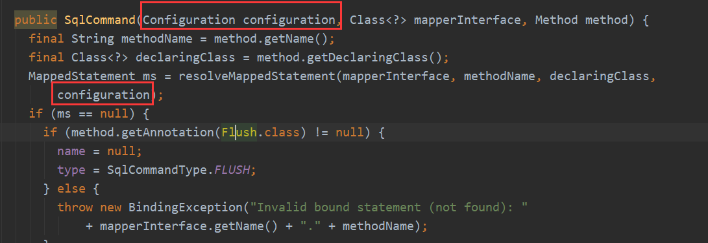

# MyBatis面试题

## MyBatis是什么？

**Mybatis 是一个半 ORM（对象关系映射）框架，它内部封装了 JDBC，开发时只需要关注 SQL 语句本身，不需要花费精力去处理加载驱动、创建连接、创建statement 等繁杂的过程。程序员直接编写原生态 sql，可以严格控制 sql 执行性能，灵活度高。**

MyBatis 可以使用 XML 或注解来配置和映射原生信息，将 POJO 映射成数据库中的记录，避免了几乎所有的 JDBC 代码和手动设置参数以及获取结果集。

* Mybatis是一个半ORM（对象关系映射）框架，它内部封装了JDBC，加载驱动、创建连接、创建statement等繁杂的过程，开发者开发时只需要关注如何编写SQL语句，可以严格控制sql执行性能，灵活度高。
* 作为一个半ORM框架，MyBatis 可以使用 XML 或注解来配置和映射原生信息，将 POJO映射成数据库中的记录，避免了几乎所有的 JDBC 代码和手动设置参数以及获取结果集。
* 通过xml 文件或注解的方式将要执行的各种 statement 配置起来，并通过java对象和 statement中sql的动态参数进行映射生成最终执行的sql语句，最后由mybatis框架执行sql并将结果映射为java对象并返回。（从执行sql到返回result的过程）。
* 由于MyBatis专注于SQL本身，灵活度高，所以比较适合对性能的要求很高，或者需求变化较多的项目，如互联网项目。

## Mybatis的一级、二级缓存

**1、** 一级缓存: 基于 PerpetualCache 的 HashMap 本地缓存，其存储作用域为 Session，当 Session flush 或 close 之后，该 Session 中的所有 Cache 就将清空，默认打开一级缓存。

**2、** 二级缓存与一级缓存其机制相同，默认也是采用 PerpetualCache，HashMap 存储，不同在于其存储作用域为 Mapper(Namespace)，并且可自定义存储源，如 Ehcache。默认不打开二级缓存，要开启二级缓存，使用二级缓存属性类需要实现Serializable序列化接口(可用来保存对象的状态),可在它的映射文件中配置`<cache/>`

**3、** 对于缓存数据更新机制，当某一个作用域(一级缓存 Session/二级缓存Namespaces)的进行了C/U/D 操作后，默认该作用域下所有 select 中的缓存将被 clear。

一级缓存：

- 在一个会话中，连续查询同一个用户，第二次查询没有重新执行select语句，而是通过缓存读取。
- 在一个会话中，查询不同的用户，查询不同的用户，会重新执行select语句。
- 更新另一个用户，查询同一个用户，更新另一个用户，查询同一个用户，仍然会重新执行select语句。**所有的增删改都会刷新缓存**。

二级缓存：

- 也称全局缓存。
- 基于namespace级别的缓存，一个命名空间对应一个二级缓存。
- 一级缓存中的数据会保存到为二级缓存中，当一个会话关闭时，一级缓存中的数据没了，可以从二级缓存中获取。
- 不同mapper查出的数据会放在自己对应的缓存（相当于一个map）中。
- 开启两个会话，查询同一个用户，第二次查询会重新连接数据库和重新执行select语句。
- 第一个会话关闭后，在第二个会话中查询同一个用户，第二次查询从缓存中获取，没有重新连接数据库和执行select语句。
- 在同一个Mapper下才有效。
- 所有的数据会先放到一级缓存下。
- 只有当会话提交或关闭时，才会提交到二级缓存中。


## 简述Mybatis的Xml映射文件和Mybatis内部数据结构之间的映射关系？


Mybatis将所有Xml配置信息都封装到All-In-One重量级对象Configuration内部。在Xml映射文件中，`<parameterMap>`标签会被解析为ParameterMap对象，其每个子元素会被解析为ParameterMapping对象。`<resultMap>`标签会被解析为ResultMap对象，其每个子元素会被解析为ResultMapping对象。每一个`<select>`、`<insert>`、`<update>`、`<delete>`标签均会被解析为MappedStatement对象，标签内的sql会被解析为BoundSql对象。


## Mybatis延迟加载的实现原理是什么？ 

使用CGLIB创建目标对象的代理对象，当调用目标方法时，进入拦截器方法，比如调用a.getB().getName()，拦截器invoke()方法发现a.getB()是null值，那么就会单独发送事先保存好的查询关联B对象的sql，把B查询上来，然后调用a.setB(b)，于是a的对象b属性就有值了，接着完成a.getB().getName()方法的调用。这就是延迟加载的基本原理。

当然了，不光是Mybatis，几乎所有的包括Hibernate，支持延迟加载的原理都是一样的。

## Mybatis是否支持延迟加载？

延迟加载在 mybatis 中有两种实现方式： 局部延迟加载、全局延迟加载。

延迟加载必须要建立在使用 嵌套查询（因此仅支持一对一和一对多，多对多）的情况下才可以使用

Mybatis仅支持 association关联对象和 collection关联集合对象的延迟加载，association指的就是一对一，collection指的就是一对多查询。在 Mybatis配置文件中，可以配置是否启用延迟加载 lazyLoadingEnabled=true|false。

实现局部延迟加载策略非常简单，只需要在collection、association标签中 加上属性  <fetchType = “lazy”>。 默认是eager（立即加载的意思）

实现全局加载，在mybatis.xml中配置开启全局延迟加载。

```xml
<!--这是全局加载的，默认是false-->
<settings>
    <setting name="lazyLoadingEnabled" value="true"/>
</settings>
```

需要注意的是，如果全局延迟加载开启，局部加载策略也开启，会优先选择局部的策略方式。


## 什么是MyBatis的接口绑定？有哪些实现方式？


接口绑定，就是在MyBatis中任意定义接口,然后把接口里面的方法和SQL语句绑定, 我们直接调用接口方法就可以,这样比起原来了SqlSession提供的方法我们可以有更加灵活的选择和设置。

**接口绑定有两种实现方式,一种是通过注解绑定，就是在接口的方法上面加上 @Select、@Update等注解，里面包含Sql语句来绑定；另外一种就是通过xml里面写SQL来绑定, 在这种情况下,要指定xml映射文件里面的namespace必须为接口的全路径名。当Sql语句比较简单时候,用注解绑定, 当SQL语句比较复杂时候,用xml绑定,一般用xml绑定的比较多。**


## Mybatis动态sql有什么用？执行原理？有哪些动态sql？ 


Mybatis动态sql可以在Xml映射文件内，以标签的形式编写动态sql，执行原理是**根据表达式的值 完成逻辑判断并动态拼接sql的功能。**

Mybatis提供了9种动态sql标签：`trim | where | set | foreach | if | choose | when | otherwise | bind`。


## MyBatis实现一对一有几种方式?具体怎么操作的？ 


**有联合查询和嵌套查询,联合查询是几个表联合查询,只查询一次, 通过在resultMap里面配置association节点配置一对一的类就可以完成；**

**嵌套查询是先查一个表，根据这个表里面的结果的 外键id，去再另外一个表里面查询数据,也是通过association配置，但另外一个表的查询通过select属性配置。**


## 模糊查询like语句该怎么写


- 1 ’%${question}%’ 可能引起SQL注入，不推荐
- 2 "%"#{question}"%" 注意：因为#{…}解析成sql语句时候，会在变量外侧自动加单引号’ '，所以这里 % 需要使用双引号" "，不能使用单引号 ’ '，不然会查不到任何结果。
- 3 **CONCAT(’%’,#{question},’%’) 使用CONCAT()函数，（推荐）**
- 4 使用bind标签（不推荐）

```
<select id="listUserLikeUsername" resultType="com.jourwon.pojo.User">
  <bind name="pattern" value="'%' + username + '%'" />
  select id,sex,age,username,password from person where username LIKE{pattern}
</select>
```


## MyBatis实现一对多有几种方式,怎么操作的？

**有联合查询和嵌套查询。联合查询是几个表联合查询,只查询一次,通过在resultMap里面的collection节点配置一对多的类就可以完成；嵌套查询是先查一个表,根据这个表里面的 结果的外键id,去再另外一个表里面查询数据,也是通过配置collection,但另外一个表的查询通过select节点配置。**

## Mapper编写有哪几种方式？

**1、** 接口实现类集成`SQLSessionDaoSupport`此方法需要编写`mapper`接口，`mapper`接口的实现类,`mapper.xml`文件。

**2、** 使用`org.mybatis.spring.mapper.MapperFactoryBean`此方法需要在`SqlMapConfig.xml`中配置`mapper.xml`的位置，还需定义`mapper`接口。

**3、** 使用`mapper`扫描器 需要编写`mapper.xml`文件，需要`mapper`接口，配置`mapper`扫描器，使用扫描器从`spring`容器中获取`mapper`的实现对象。


第一种：接口实现类继承SqlSessionDaoSupport：使用此种方法需要编写mapper接口，mapper接口实现类、mapper.xml文件。

**1、** 在sqlMapConfig.xml中配置mapper.xml的位置

```xml
<mappers>
    <mapper resource="mapper.xml文件的地址" />
    <mapper resource="mapper.xml文件的地址" />
</mappers>
```

**1、** 定义mapper接口

**3、** 实现类集成SqlSessionDaoSupport

mapper方法中可以this.getSqlSession()进行数据增删改查。

**4、** spring 配置

```xml
<bean id=" " class="mapper接口的实现">
    <property name="sqlSessionFactory" ref="sqlSessionFactory"></property>
</bean>
```

第二种：使用`org.mybatis.spring.mapper.MapperFactoryBean`：

**1、** 在sqlMapConfig.xml中配置mapper.xml的位置，如果mapper.xml和mappre接口的名称相同且在同一个目录，这里可以不用配置

```xml
<mappers>
    <mapper resource="mapper.xml文件的地址" />
    <mapper resource="mapper.xml文件的地址" />
</mappers>
```

**2、** 定义mapper接口：

**1、** mapper.xml中的namespace为mapper接口的地址

**2、** mapper接口中的方法名和mapper.xml中的定义的statement的id保持一致

**3、** Spring中定义

```xml
<bean id="" class="org.mybatis.spring.mapper.MapperFactoryBean">
    <property name="mapperInterface"   value="mapper接口地址" />
    <property name="sqlSessionFactory" ref="sqlSessionFactory" />
</bean>
```

第三种：使用mapper扫描器：

**1、** mapper.xml文件编写：

mapper.xml中的namespace为mapper接口的地址；

mapper接口中的方法名和mapper.xml中的定义的statement的id保持一致；

如果将mapper.xml和mapper接口的名称保持一致则不用在sqlMapConfig.xml中进行配置。

**2、** 定义mapper接口：

注意mapper.xml的文件名和mapper的接口名称保持一致，且放在同一个目录

**3、** 配置mapper扫描器：

```xml
<bean class="org.mybatis.spring.mapper.MapperScannerConfigurer">
    <property name="basePackage" value="mapper接口包地址"></property>
    <property name="sqlSessionFactoryBeanName" value="sqlSessionFactory"/>
</bean>
```

**4、** 使用扫描器后从spring容器中获取mapper的实现对象。

## Hibernate 和 MyBatis 的区别


**相同点**

都是对jdbc的封装，都是持久层的框架，都用于dao层的开发。

**不同点**

- **映射关系**

**MyBatis 是一个半自动映射的框架，配置Java对象与sql语句执行结果的对应关系，多表关联关系配置简单**

**Hibernate 是一个全表映射的框架，配置Java对象与数据库表的对应关系，多表关联关系配置复杂**

- **SQL优化和移植性** 

Hibernate 对SQL语句封装，提供了日志、缓存、级联（级联比 MyBatis 强大）等特性，此外还提供 HQL（Hibernate Query Language）操作数据库，数据库无关性支持好，但会多消耗性能。如果项目需要支持多种数据库，代码开发量少，**但SQL语句优化困难。**

MyBatis 需要手动编写 SQL，支持动态 SQL、处理列表、动态生成表名、支持存储过程。开发工作量相对大些。直接使用SQL语句操作数据库，不支持数据库无关性，**但sql语句优化容易。**

MyBatis 是一个小巧、方便、高效、简单、直接、半自动化的持久层框架，

Hibernate 是一个强大、方便、高效、复杂、间接、全自动化的持久层框架。

**1、** Mybatis MyBatis 是支持定制化 SQL、存储过程以及高级映射的一种持久层框架。MyBatis 避免了几乎所有的 JDBC 代码和手动设置参数以及获取结果集。Mybatis它不完全是一个ORM(对象关系映射)框架；它需要程序员自己编写部分SQL语句。 mybatis可以通过xml或者注解的方式灵活的配置要运行的SQL语句，并将java对象和SQL语句映射生成最终的执行的SQL，最后将SQL执行的结果在映射生成java对象。 Mybatis程序员可以直接的编写原生态的SQL语句，可以控制SQL执行性能，灵活度高，适合软件需求变换频繁的企业。 缺点：Mybatis无法做到数据库无关性，如果需要实现支持多种数据库的软件，则需要自定义多套SQL映射文件，工作量大。

**2、** Hibernate Hibernate是支持定制化 SQL、存储过程以及高级映射的一种持久层框架。 Hibernate对象-关系映射能力强，数据库的无关性好，Hirberate可以自动生成SQL语句，对于关系模型要求高的软件，如果用HIrbernate开发可以节省很多时间。


## Mybatis 是如何将 sql 执行结果封装为目标对象并返回的？都有哪些映射形式？


第一种是使用标签，逐一定义列名和对象属性名之间的映射关系。

第二种是使用 sql 列的别名功能，将列别名书写为对象属性名，比如 T_NAME AS NAME，对象属性名一般是 name，小写，但是列名不区分大小写，Mybatis 会忽略列名大小写，智能找到与之对应对象属性名，你甚至可以写成 T_NAME AS NaMe，Mybatis 一样可以正常工作。有了列名与属性名的映射关系后，Mybatis 通过反射创建对象，同时使用反射给对象的属性逐一赋值并返回，那些找不到映射关系的属性，是无法完成赋值的。


## Mybatis编程步骤 ？

**1、** 创建SQLSessionFactory

**2、** 通过SQLSessionFactory创建SQLSession

**3、** 通过SQLSession执行数据库操作

**4、** 调用session.commit()提交事物

**5、**调用session.close()关闭会话


## Mybatis 是否可以映射 Enum 枚举类？


Mybatis 可以映射枚举类，不单可以映射枚举类，Mybatis 可以映射任何对象到表的一列上。映射方式为自定义一个 TypeHandler，实现 TypeHandler 的 setParameter()和getResult()接口方法。TypeHandler 有两个作用，一是完成从 javaType 至 jdbcType 的转换，二是完成 jdbcType 至 javaType 的转换，体现为 setParameter()和 getResult()两个方法，分别代表设置 sql 问号占位符参数和获取列查询结果。


## Mybatis是如何进行分页的？分页插件的原理是什么？

**Mybatis使用RowBounds对象进行分页，它是针对ResultSet结果集执行的内存分页，而非物理分页，可以在sql内直接书写带有物理分页的参数来完成物理分页功能，也可以使用分页插件来完成物理分页。**

分页插件的基本原理是使用Mybatis提供的插件接口，实现自定义插件，在插件的拦截方法内拦截待执行的sql，然后重写sql，根据dialect方言，添加对应的物理分页语句和物理分页参数。

**举例：**

select * from student，拦截sql后重写为：select t.* from (select * from student) t limit 0, 10


## 在mapper中如何传递多个参数?


**1、** 第一种：

**DAO层的函数**

```java
public UserselectUser(String name,String area);
        对应的xml,#{0}代表接收的是dao层中的第一个参数，#{1}代表dao层中第二参数，更多参数一致往后加即可。
```

```xml
<select id="selectUser"resultMap="BaseResultMap">
    select *  fromuser_user_t   where user_name = #{0} and user_area=#{1}
</select>
```

**2、** 第二种： 使用 @param 注解:

```java
public interface usermapper {
    user selectuser(@param(“username”) string username,@param(“hashedpassword”) string hashedpassword);
}
```

然后,就可以在xml像下面这样使用(推荐封装为一个map,作为单个参数传递给mapper:

```xml
<select id=”selectuser” resulttype=”user”>
    select id, username, hashedpassword
    from some_table
    where username = #{username}
    and hashedpassword = #{hashedpassword}
</select>
```

**3、** 第三种：多个参数封装成map

```java
try {
    //映射文件的命名空间.SQL片段的ID，就可以调用对应的映射文件中的SQL
    //由于我们的参数超过了两个，而方法中只有一个Object参数收集，因此我们使用Map集合来装载我们的参数
    Map < String, Object > map = new HashMap();
    map.put("start", start);
    map.put("end", end);
    return sqlSession.selectList("StudentID.pagination", map);
} catch (Exception e) {
    e.printStackTrace();
    sqlSession.rollback();
    throw e;
} finally {
    MybatisUtil.closeSqlSession();
}
```

## Mybatis 分页查询？


Mybatis本身有分页查询，但是并不是正真的分页查询，它是把数据查出来放在内存里面，你想要什么就给你什么。 我们使用Mybatis实现分页查询的时候，是要实现真分页查询，就是要用sql语句来实现分页查询。MySQL和Oracle两种数据库的实现方法是不一样的。 MySQL：select * from table limit N , M; 其中：N表示从第几页开始，M表示每页显示的条数。比如：数据库中有30条数据，要求每页显示10条，显示第2页的所有数据。 SQL语句就可以写成：Limit 10 , 20; Oracle实现分页查询：采用伪列ROWNUM


## Mybatis能执行一对多，一对一的联系查询吗，有哪些实现方法


能，不止可以一对多，一对一还可以多对多，一对多

**实现方式：**

**1、** 单独发送一个SQL去查询关联对象，赋给主对象，然后返回主对象

**2、** 使用嵌套查询，似JOIN查询，一部分是A对象的属性值，另一部分是关联对 象 B的属性值，好处是只要发送一个属性值，就可以把主对象和关联对象查出来

**3、** 子查询

## Mybatis的一对一、一对多关联查询和嵌套查询？

只要发生连表查询，resultType 就不能处理得了结果映射的问题。需要使用resultMap 处理多张表之间字段和属性之间自定义映射。

处理一对一的关联映射：使用<association>

property 表示关联映射哪个属性   javaType 表示关联属性对应的类型（所在的实体类） autoMapping 其余自动映射。

处理一对多的关联映射：使用<collection>

property 表示关联映射哪个属性  ofType 指的是集合中泛型的类型（所在的实体类） autoMapping 其余自动映射。

嵌套查询是延迟加载的前提。之前的关联查询，是在一次查询中查询多个表。

嵌套查询就是把多个表拆成一个一个表，每次执行单表，执行多次查询。

因此嵌套查询就只是在关联查询的基础上，在<association>和<collection>中，加入select 属性：表示需要嵌套的另一个查询语句，通过namespace.id 确定下来  和  column 属性  表示 另一个嵌套查询语句的条件。


## 使用 MyBatis 的 mapper 接口调用时有哪些要求？


**1、** Mapper 接口方法名和 mapper.xml 中定义的每个 sql 的 id 相同

**2、** Mapper 接口方法的输入参数类型和 mapper.xml 中定义的每个 sql 的 parameterType 的类型相同

**3、** Mapper 接口方法的输出参数类型和 mapper.xml 中定义的每个 sql 的 resultType 的类型相同

**4、** Mapper.xml 文件中的 namespace 即是 mapper 接口的类路径。


## #{}和${}的区别是什么？

Mybatis在处理#{}时，会将sql中的#{}替换为?号，调用Prepared Statement的set方法来赋值；Mybatis在处理`${}`时，就是把`${}`替换成变量的值；使用**#{}可以有效的防止SQL注入，提高系统安全性。**

* #{}是占位符，预编译处理；${}是拼接符，字符串替换，没有预编译处理。
* Mybatis在处理#{}时，#{}传入参数是以字符串传入，会将SQL中的#{}替换为?号，调用PreparedStatement的set方法来赋值。
* 变量替换后，#{} 对应的变量自动加上单引号 ‘’；变量替换后，${} 对应的变量不会加上单引号 ‘’
* #{} 可以有效的防止SQL注入，提高系统安全性；${} 不能防止SQL 注入
* #{} 的变量替换是在DBMS 中；${} 的变量替换是在 DBMS 外

（1）${}是properties文件中的变量占位符，它可以用于标签属性值和sql内部，属于静态文本替换。

（2）#{}是sql的参数占位符，Mybatis会将sql中的#{}替换为?号，在sql执行前会使用PreparedStatement的参数设置方法，按序给sql的?号占位符设置参数值。使用#{}可以有效的防止 SQL 注入，提高系统安全性。

```
${param}传递的参数会被当成sql语句中的一部分，举例：
order by ${param}，则解析成的sql为：
order by    id
 
#{parm}传入的数据都当成一个字符串，会对自动传入的数据加一个双引号，举例：
select * from table where name = #{param}，则解析成的sql为：
select * from table where name =   "id"
```


## 为什么说 Mybatis 是半自动 ORM 映射工具？它与全自动的区别在哪里？


Hibernate 属于全自动 ORM 映射工具，使用 Hibernate 查询关联对象或者关联集合对象时，可以根据对象关系模型直接获取，所以它是全自动的。而 M**ybatis 在查询关联对象或关联集合对象时，需要手动编写 sql 来完成，所以，称之为半自动 ORM 映射工具。**


## 什么情况下用注解绑定,什么情况下用 xml 绑定？

**当 Sql 语句比较简单时候,用注解绑定；当 SQL 语句比较复杂时候,用 xml 绑定,一般用xml 绑定的比较多**


## Mybais 常用注解 ？


@Insert ： 插入sql , 和xml insert sql语法完全一样

@Select： 查询sql, 和xml select sql语法完全一样

@Update： 更新sql, 和xml update sql语法完全一样

@Delete： 删除sql, 和xml delete sql语法完全一样

@Param： 入参

@Results：结果集合

@Result： 结果


## MyBatis的框架架构设计是怎么样的  

MyBatis的初始化，会从mybatis-config.xml配置文件，解析构造成Configuration这个类，就是图中的红框。

**1、** 加载配置：配置来源于两个地方，一处是配置文件，一处是Java代码的注解，将SQL的配置信息加载成为一个个MappedStatement对象（包括了传入参数映射配置、执行的SQL语句、结果映射配置），存储在内存中。

**2、** SQL解析：当API接口层接收到调用请求时，会接收到传入SQL的ID和传入对象（可以是Map、JavaBean或者基本数据类型），Mybatis会根据SQL的ID找到对应的MappedStatement，然后根据传入参数对象对MappedStatement进行解析，解析后可以得到最终要执行的SQL语句和参数。

**3、** SQL执行：将最终得到的SQL和参数拿到数据库进行执行，得到操作数据库的结果。

**4、** 结果映射：将操作数据库的结果按照映射的配置进行转换，可以转换成HashMap、JavaBean或者基本数据类型，并将最终结果返回。

## SQLMapConfig.xml中配置有哪些内容？


properties（属性） settings（配置） typeAliases（类型别名） typeHandlers（类型处理器） objectFactory（对象工厂） plugins（插件） environments（环境集合属性对象） environment（环境子属性对象） transactionManager（事务管理） dataSource（数据源） mappers（映射器）


## 通常一个Xml映射文件，都会写一个Dao接口与之对应


**请问，这个Dao接口的工作原理是什么？Dao接口里的方法，参数不同时，方法能重载吗？**

Dao接口即Mapper接口。接口的全限名，就是映射文件中的namespace的值；接口的方法名，就是映射文件中Mapper的Statement的id值；接口方法内的参数，就是传递给sql的参数。

Mapper接口是没有实现类的，当调用接口方法时，接口全限名+方法名拼接字符串作为key值，可唯一定位一个MapperStatement。在Mybatis中，每一个`<select>、<insert>、<update>、<delete>`标签，都会被解析为一个MapperStatement对象。

**举例：**

`com.mybatis3.mappers.StudentDao.findStudentById`，可以唯一找到namespace为`com.mybatis3.mappers.StudentDao`下面 id 为 findStudentById 的 MapperStatement。

**Mapper接口里的方法，是不能重载的，因为是使用 全限名+方法名 的保存和寻找策略。**Mapper 接口的工作原理是JDK动态代理，Mybatis运行时会使用JDK动态代理为Mapper接口生成代理对象proxy，代理对象会拦截接口方法，转而执行MapperStatement所代表的sql，然后将sql执行结果返回。


## Mybatis 映射文件中，如果 A 标签通过 include 引用了 B 标签的内容，请问，B 标签能否定义在 A 标签的后面，还是说必须定义在 A 标签的前面？

虽然 Mybatis 解析 Xml 映射文件是按照顺序解析的，但是，被引用的 B 标签依然可以定义在任何地方，Mybatis 都可以正确识别。原理是，Mybatis 解析 A 标签，发现 A 标签引用了 B 标签，但是 B 标签尚未解析到，尚不存在，此时，Mybatis 会将 A 标签标记为未解析状态，然后继续解析余下的标签，包含 B 标签，待所有标签解析完毕，Mybatis 会重新解析那些被标记为未解析的标签，此时再解析 A 标签时，B 标签已经存在，A 标签也就可以正常解析完成了。


## Mybatis的Xml映射文件中，不同的Xml映射文件，id是否可以重复？ 

**不同的Xml映射文件，如果配置了namespace，那么id可以重复；如果没有配置namespace，那么id不能重复**；毕竟namespace不是必须的，只是最佳实践而已。

原因就是namespace+id是作为Map<String, MappedStatement>的key使用的，如果没有namespace，就剩下id，那么，id重复会导致数据互相覆盖。有了namespace，自然id就可以重复，namespace不同，namespace+id自然也就不同。

## 当实体类中的属性名和表中的字段名不一样 ，怎么办 ？


第1种： 通过在查询的sql语句中定义字段名的别名，让字段名的别名和实体类的属性名一致。

```
<select id=”selectorder” parametertype=”int” resultetype=”me.gacl.domain.order”>
       select order_id id, order_no orderno ,order_price price form orders where order_id=#{id};
</select>
```

第2种： 通过`<resultMap>`来映射字段名和实体类属性名的一一对应的关系。

```
<select id="getOrder" parameterType="int" resultMap="orderresultmap">
select * from orders where order_id=#{id}
</select>

<resultMap type=”me.gacl.domain.order” id=”orderresultmap”>
    <!–用id属性来映射主键字段–>
    <id property=”id” column=”order_id”>

    <!–用result属性来映射非主键字段，property为实体类属性名，column为数据表中的属性–>
    <result property = “orderno” column =”order_no”/>
    <result property=”price” column=”order_price” />
</reslutMap>
```


## 使用Mybatis的mapper接口调用时候有哪些要求？


**1、** Mapper接口方法名和Mapper.xml中定义的每个SQL的id相同；

**2、** Mapper接口方法的输入参数类型和mapper.xml中定义的每个sqlparameterType类型相同

**3、** Mapper接口方法的输入输出参数类型和mapper.xml中定义的每个sql的resultType的类型相同

**4、** Mapper.xml文件中的namespace，就是接口的类路径。


## MyBatis框架适用场合：

**1、** MyBatis专注于SQL本身，是一个足够灵活的DAO层解决方案。

**2、** 对性能的要求很高，或者需求变化较多的项目，如互联网项目，MyBatis将是不错的选择。


## 为什么需要预编译


**定义：**

SQL 预编译指的是数据库驱动在发送 SQL 语句和参数给 DBMS 之前对 SQL 语句进行编译，这样 DBMS 执行 SQL 时，就不需要重新编译。

**为什么需要预编译**

JDBC 中使用对象 PreparedStatement 来抽象预编译语句，使用预编译。预编译阶段可以优化 SQL 的执行。预编译之后的 SQL 多数情况下可以直接执行，DBMS 不需要再次编译，越复杂的SQL，编译的复杂度将越大，预编译阶段可以合并多次操作为一个操作。同时预编译语句对象可以重复利用。把一个 SQL 预编译后产生的 PreparedStatement 对象缓存下来，下次对于同一个SQL，可以直接使用这个缓存的 PreparedState 对象。Mybatis默认情况下，将对所有的 SQL 进行预编译。

还有一个重要的原因，防止SQL注入。

## Mybaits的优缺点

优点：

* 基于SQL语句编程，相当灵活，不会对应用程序或者数据库的现有设计造成任何影响，SQL写在XML里，解除sql与程序代码的耦合，便于统一管理；提供XML标签，支持编写动态SQL语句，并可重用。
* 与JDBC相比，减少了50%以上的代码量，消除了JDBC大量冗余的代码，不需要手动开关连接；
* 很好的与各种数据库兼容（因为MyBatis使用JDBC来连接数据库，所以只要JDBC支持的数据库MyBatis都支持）。
* 能够与Spring很好的集成；
* 提供映射标签，支持对象与数据库的ORM字段关系映射；提供对象关系映射标签，支持对象关系组件维护。

缺点：

*  SQL语句的编写工作量较大，尤其当字段多、关联表多时，对开发人员编写SQL语句的功底有一定要求。
*  SQL语句依赖于数据库，导致数据库移植性差，不能随意更换数据库。

## JDBC编程有哪些不足之处，MyBatis是如何解决这些问题的？

1、数据库链接创建、释放频繁造成系统资源浪费从而影响系统性能，如果使用数据库链接池可解决此问题。

解决：在SqlMapConfig.xml中配置数据链接池，使用连接池管理数据库链接。

2、Sql语句写在代码中造成代码不易维护，实际应用sql变化的可能较大，sql变动需要改变java代码。 

解决：将Sql语句配置在XXXXmapper.xml文件中与java代码分离。

3、 向sql语句传参数麻烦，因为sql语句的where条件不一定，可能多也可能少，占位符需要和参数一一对应。 

解决： Mybatis自动将java对象映射至sql语句。

4、 对结果集解析麻烦，sql变化导致解析代码变化，且解析前需要遍历，如果能将数据库记录封装成pojo对象解析比较方便。 

解决：Mybatis自动将sql执行结果映射至java对象。

## 为什么说**Mybatis是半ORM框架?与Hibernate有哪些不同?**

ORM是对象和关系之间的映射，包括对象->关系和关系->对象两方面。Hibernate是个完整的ORM框架，而MyBatis只完成了关系->对象，准确地说MyBatis是SQL映射框架而不是ORM框架，因为其仅有字段映射，对象数据以及对象实际关系仍然需要通过手写SQL来实现和管理。

（1）Hibernate为完整的ORM框架，Mybatis为半ORM框架。

（2）Mybatis程序员直接编写原生sql，可严格控制sql执行性能，灵活度高，适用于对关系数据模型要求不高的软件开发，例如互联网软件、企业运营类软件等；Hibernate只能通过编写hql实现数据库查询（hql好难用哦）。

（3）Hibernate对象/关系映射能力强，数据库无关性好，适用于对关系模型要求高的软件； Mybatis的数据库无关性较差，如果需要实现支持多种数据库的软件则需要自定义多套sql映射文件。

## 怎么解决**实体类中的属性名和表中的字段名不一样的问题?**

（1）通过在查询的sql语句中定义字段名的别名，使字段名的别名和实体类的属性名一致

```
<select id="selectUserById" parameterType="java.lang.Integer" resultetype="com.en.entity.user">
       select user_id as id, user_no as no from test where user_id = #{id};
</select>
```

（2）Mybatis和hibernate不同，它不完全是一个ORM框架，因为MyBatis需要程序员自己编写Sql语句。

```
   <resultMap type=”me.gacl.domain.order” id=”orderresultmap”>
        <!–用id标签来映射主键字段–>
        <id property="id" column="user_id">
        <!–用result属性来映射非主键字段，property为实体类属性名，column为数据表中的属性–>
        <result property="no" column="user_no"/>
   </reslutMap>
```

## 如何在mapper中传递多个参数?

（1）使用 @param 注解：

```
user selectUser(@param("username") string username,@param("password") string password);
```

（2）Mapper接口方法的输入参数类型和mapper.xml中定义的每个sql 的parameterType的类型相同；

```
Map<String, Object> map = new HashMap();
map.put("start", start);
map.put("end", end);
sqlSession.selectList("student.selectUser", map);
```

## MyBatis的接口绑定有哪些实现方式？

接口绑定有两种实现方式：

（1）一种是通过注解绑定,就是在接口的方法上面加上@Select@Update等注解里面包含Sql语句来绑定

```java
@Select("select ID,CODE,NAME from T_SYS_DICT_TYPE ")
@Results(id = "distTypeMap",value ={@Result(id =true,property="id",column="ID")
            ,@Result(property="code",column="CODE")
            ,@Result(property="name",column="NAME")
            ,@Result(property = "dictDtos" ,column = "ID",many = @Many(select="com.santbbd.ams.sysconfig.mapper.SysInitMapper.findByDistTypeId",fetchType = FetchType.EAGER))
    })
List<SysDictTypeDto> getAllDist();
```

（2）另外一种就是通过xml里面写SQL来绑定,在这种情况下,要指定xml映射文件里面的namespace必须为接口的全路径名.

```xml
<mapper namespace="com.xxx.xxx.modular.batch.mapper.IllegalCollectionMapper">
<select id="queryFileDisposeInfo" parameterType="FileDisposeVo" resultMap="illegalcollection-map">
   SELECT 
        BATCH_NUMBER,
        FINISH_DATE,
        FILE_NAME,
        FILE_SIZE,
        DATA_SIZE,
        FILE_TYPE,
        ORG_CODE
   FROM 
        T_FILE_DISPOSE
</select>
```

## 解释下**MyBatis面向Mapper编程工作原理？**

Mapper接口是没有实现类的，当调用接口方法时，采用了JDK的动态代理，先从Configuration配置类MapperRegistry对象中获取mapper接口和对应的代理对象工厂信息（MapperProxyFactory），然后利用代理对象工厂MapperProxyFactory创建实际代理类（MapperProxy），最后在MapperProxy类中通过MapperMethod类对象内保存的中对应方法的信息，以及对应的sql语句的信息进行分析，最终确定对应的增强方法进行调用。

## 为什么**MyBatis Mapper接口中的方法不支持重载？**

在MyBatis源码中有这么几行代码，我们可以看到在解析XML文件创建mapper接口对应方法的时候，采用了接口全限名+方法名的方式作为StrictMap(MappedStatement数据存放的Map集合)的key值，而源码对于StrictMap的put方法进行了判断，如果存入的数据key已重复则抛出异常，所以**Mapper接口中的方法不支持重载。**

```
id = applyCurrentNamespace(id, false);

public String applyCurrentNamespace(String base, boolean isReference) {
   ...
   //返回值为mapper的全限名(xml中namespace的值)+方法名(xml中Statement id的值)
   return currentNamespace + "." + base;
}
```


## Mybatis动态sql执行原理?

（1）初始化阶段：通过XMLConfigBuilder、XMLMapperBuilder、XMLStatementBuilder解析XML文件中的信息存储到Configuration类中； 
（2）代理阶段：先从Configuration配置类MapperRegistry对象中获取mapper接口和对应的代理对象工厂信息，再利用代理对象工厂MapperProxyFactory创建实际代理类，最后在MapperProxy类中通过MapperMethod类对象内保存的中对应方法的信息，以及对应的sql语句的信息进行分析，最终确定对应的增强方法进行调用。 
（3）数据读写阶段：通过四种Executor调用四种Handler进行查询和封装数据；

## Mybatis的一级、二级缓存实现原理?

（1）一级缓存: 基于 PerpetualCache 的 HashMap 本地缓存，其存储作用域为 Session，当 Session flush 或 close 之后，该 Session 中的所有 Cache 就将清空，Mybatis默认打开一级缓存，一级缓存存放在BaseExecutor的localCache变量中：


（2）二级缓存与一级缓存其机制相同，默认也是采用 PerpetualCache，HashMap 存储，不同在于其存储作用域为 Mapper(Namespace)级别。Mybatis默认不打开二级缓存，可以在config文件中xml`<settings><setting name="cacheEnabled" value="true"/></settings>`开启全局的二级缓存，但并不会为所有的Mapper设置二级缓存，每个mapper.xml文件中使用标签来开启当前mapper的二级缓存，二级缓存存放在MappedStatement类cache变量中：


（3）对于缓存数据更新机制，当某一个作用域(一级缓存 Session/二级缓存Namespaces)的进行了C/U/D 操作后，默认该作用域下所有 select 中的缓存将被清除并重新更新，如果开启了二级缓存，则只根据配置判断是否刷新。

## Mybatis是如何进行分页的？

（1）SQL分页(物理分页)：

```xml
<select id="queryStudentsBySql" parameterType="map" resultMap="studentmapper"> 
           select * from student limit #{start} , #{end}
</select>
```

（2）使用RowBounds实现分页(逻辑分页)：

```java
Service:
publicList queryRolesByPage(String roleName,intstart,int limit) {
     returnroleDao.queryRolesByPage(roleName,new RowBounds(start, limit));
}

```

```java
Dao:
     public List queryUsersByPage(String userName, RowBounds rowBounds);
```

（3）使用分页插件PageHelper：

```java
public Json queryByPage(User userParam,Integer pageNum,Integer pageSize) {
        PageHelper.startPage(pageNum, pageSize);
        List<User> userList = userMapper.queryByPage(userParam);
        Json json = new Json();
        return json;
}
```

## Mybatis都有哪些Executor执行器？它们之间的区别是什么？


Mybatis有三种基本的Executor执行器，SimpleExecutor、ReuseExecutor、BatchExecutor。

**SimpleExecutor**：BaseExecutor具体子类实现且为默认配置，在doQuery方法中使用PrepareStatement对象访问数据库， 每次访问都要创建新的 PrepareStatement对象；每执行一次update或select，就开启一个Statement对象，用完立刻关闭Statement对象。

**ReuseExecutor**：BaseExecutor具体子类实现，与SimpleExecutor不同的是，在doQuery方法中，使用预编译PrepareStatement对象访问数据库，访问时，会重用缓存中的statement对象，而不是每次都创建新的PrepareStatement。执行update或select，以sql作为key查找Statement对象，存在就使用，不存在就创建，用完后，不关闭Statement对象，而是放置于Map<String, Statement>内，供下一次使用。简言之，就是重复使用Statement对象。

**BatchExecutor**：BaseExecutor具体子类实现，在doUpdate方法中，提供批量执行多条SQL语句的能力；

执行update（没有select，JDBC批处理不支持select），将所有sql都添加到批处理中（addBatch()），等待统一执行（executeBatch()），它缓存了多个Statement对象，每个Statement对象都是addBatch()完毕后，等待逐一执行executeBatch()批处理。与JDBC批处理相同。

**BaseExecutor：**基础抽象类，实现了executor接口的大部分方法，主要提供了缓存管理和事务管理的能力，使用了模板模式，doUpdate, doQuery, doQueryCursor  等方法的具体实现交给不同的子类进行实现。

**CachingExecutor：**直接实现Executor接口，使用装饰器模式提供二级缓存能力。先从二级缓存查，缓存没有命中再从数据库查，最后将结果添加到缓存中。如果在xml文件中配置了cache节点，则会创建CachingExecutor。

作用范围：Executor的这些特点，都严格限制在SqlSession生命周期范围内。

## Mybatis中如何指定使用哪一种Executor执行器？


在Mybatis配置文件中，在设置（settings）可以指定默认的ExecutorType执行器类型，也可以手动给DefaultSqlSessionFactory的创建SqlSession的方法传递ExecutorType类型参数，如SqlSession openSession(ExecutorType execType)。

配置默认的执行器。SIMPLE 就是普通的执行器；REUSE 执行器会重用预处理语句（prepared statements）； BATCH 执行器将重用语句并执行批量更新。

## Mybatis中用到了哪些设计模式？

日志模块：代理模式、适配器模式

数据源模块：代理模式、工厂模式

缓存模块：装饰器模式

初始化阶段：建造者模式

代理阶段：策略模式

数据读写阶段：模板模式

插件化开发：责任链模式

## Mybatis源码包功能模块图


## Mybatis各包详细功能解析

**org.apache.ibatis.logging：**包含所有mapper 接口中用到的注解

**org.apache.ibatis.binding：**生成mapper 接口的动态代理并进行管理

**org.apache.ibatis.builder：**

1.  包含Configuration对象所有构建器，主要包括XML、注解2种方式配置解析
2.  BaseBuilder 构建器基类
3.  XMLConfigBuilder 解析configuration.xml配置文件
4.  XMLMapperBuilder 解析Mapper.xml配置文件
5.  XMLStatementBuilder 解析selectupdatedelete 标签
6.  MapperAnnotationBuilder 注解式Mapper

**org.apache.ibatis.cache：**

1.  缓存功能实现、包含各种缓存装饰器
2.  TransactionalCache 二级缓存功能实现

**org.apache.ibatis.cursor：**实现游标的方式查询数据、游标非常适合处理百万级别的数据查询

**org.apache.ibatis.datasource：**数据源 包括jndi数据源、连接池功能

**org.apache.ibatis.executor：**

1.  包含SQL语句执行器，核心功能包
2.  功能包括：主键生成功能、执行参数解析功能、执行结果集解析功能、SQL执行器、缓存执行器

**org.apache.ibatis.exceptions：**框架异常，常见异常：TooManyResultsException

**org.apache.ibatis.io：**资源文件读取

**org.apache.ibatis.jdbc：**

1.  JDBC一些操作
2.  SqlRunner SQL执行
3.  ScriptRunner 脚本执行，可以执行建库语句

**org.apache.ibatis.logging：**

1.  日志功能，实现多种日志框架的对接
2.  org.apache.ibatis.logging.jdbc 代理所有功能JDBC 操作，实现了在debug模式下能够输出SQL

**org.apache.ibatis.mapping：**配置文件与实体对象的映射功能，Mapper映射、参数映射、结果映射等

**org.apache.ibatis.parsing：**

1.  解析工具包
2.  GenericTokenParser：解析#{} ${} 这种占位符
3.  XPathParser：XPath形式解析XML
4.  PropertyParser: properties解析器

**org.apache.ibatis.scripting：**动态SQL语言实现，配置文件中<if> <where> <set> <foreach> <choose> 功能就是在这个包实现，借助OGNL表达式,你也可以扩展自己的语言实现功能

**org.apache.ibatis.session：**

1.  主要实现SqlSession功能，非常核心包
2.  官方注释：SqlSession包含了MyBatis工作的所有的Java接口，通过这些接口你可以 执行SQL命令（insertdeleteupdateselect），获取Mapper，管理实务

**org.apache.ibatis.transaction：**事务功能实现，包装了数据库连接，处理数据库连接生命周期包括：连接创建，预编译，提交回滚和关闭

**org.apache.ibatis.type：**类型处理器，包括所有数据库类型对应Java类型的处理器，如果要实现自己类型处理器就需要实现包下的基础接口

## MyBatis核心流程三大阶段之初始化阶段

**1.加载配置文件**

**2.解析配置文件、将配置文件中的信息装载到Configuration中**

**3.根据Configuration创建SqlSessionFactory并返回**

前面几篇分析了MyBatis的日志、数据源和缓存模块的源码，本篇将分析MyBatis核心流程三大阶段的第一阶段：初始化阶段。Mybatis启动初始化的核心就是将所有xml配置文件信息加载到Configuration对象中，Configuration为单例，生命周期为应用级。

**1.加载配置文件**

下面我们来看一段经典查询操作：

```java
String resouce = "config/mybatis/mybatis-config.xml";
InputStream is = Resources.getResourceAsStream(resouce);
SqlSessionFactory sqlSessionFactory = new SqlSessionFactoryBuilder().build(is);
SqlSession session = sqlSessionFactory.openSession();
user = session.selectOne("com.luoxn28.dao.UserDao.getById", 1);
```

以上代码经过了MyBatis初始化、创建sqlSession、执行sql语句3个过程。首先由mybatis-config.xml配置文件创建SqlSessionFactory，然后由session工厂创建SqlSession对象，执行SQL语句。**当然初始化的第一阶段：扫描配置文件所在包路径并加载**。

**2.解析配置文件、将配置文件中的信息装载到Configuration中**

让我们来看一下梦开始的地方：

```java
SqlSessionFactory sqlSessionFactory = new SqlSessionFactoryBuilder().build(is);
```

跟进build()方法，我们可以看到new了一个XMLConfigBuilder对象并调用了parse()方法：

```java
public SqlSessionFactory build(InputStream inputStream, String environment, Properties properties) {
    try {
      //创建XMLConfigBuilder对象解析XML配置
      XMLConfigBuilder parser = new XMLConfigBuilder(inputStream, environment, properties);
      //将XML配置解析成Configuration对象，通过Configuration对象创建SqlSessionFactory
      return build(parser.parse());
    } 
    ....
}
```

跟进parse()方法，我们可以看到parser.evalNode("/configuration")，evalNode为xml结点解析器，可以解析指定参数结点的信息，再看这个"/configuration"有点眼熟丫，这不就是mybatis.xml的根节点嘛：

```java
public Configuration parse() {
    ...
    parseConfiguration(parser.evalNode("/configuration"));
    return configuration;
}
```

看到这，我们就不得不提初始化的三大金刚了，分别是XMLConfigBuilder、XMLMapperBuilder、XMLStatementBuilder。

**XMLConfigBuilder：**主要负责解析mybatis-config.xml

**XMLMapperBuilder：**主要负责解析映射配置文件

**XMLStatementBuilder：**主要负责解析映射配置文件中的sql节点

**三大金刚图解：**


MyBatis中的xml文件是由三大金刚读取到Configuration类中，那么我们来看下Configuration类的数据结构：


Configuration类的源码实在太多，童鞋们先对这个类有个大致印象，了解下该类中有哪些成员变量对应存储着些什么数据。下面主要列举几个比较重要的成员变量：

**MapperRegistry：**mapper接口动态代理工厂类的注册中心。通过mapperProxy实现InvocationHandler接口，其中的MapperProxyFactory用于生成动态代理的实例对象； 
**ResultMap：**用于解析mapper.xml文件中的resultMap节点，使用ResultMapping来封装id，result等子元素； 
**MappedStatement：**用于存储mapper.xml文件中select、insert、update和delete节点，同时还包含了这些节点的重要属性； 
**SqlSource：**mapper.xml文件中的sql语句会被解析成SqlSource对象，经过解析SqlSource包含的语句最终仅仅包含?占位符，可以直接提交给数据库执行；

接上面XMLConfigBuilder开始解析"/configuration"节点：

```java
parseConfiguration(parser.evalNode("/configuration"));
```

```java
private void parseConfiguration(XNode root) {
    try {
      propertiesElement(root.evalNode("properties"));
      Properties settings = settingsAsProperties(root.evalNode("settings"));
      loadCustomVfs(settings);
      loadCustomLogImpl(settings);
      typeAliasesElement(root.evalNode("typeAliases"));
      pluginElement(root.evalNode("plugins"));
      objectFactoryElement(root.evalNode("objectFactory"));
      objectWrapperFactoryElement(root.evalNode("objectWrapperFactory"));
      reflectorFactoryElement(root.evalNode("reflectorFactory"));
      settingsElement(settings);
      // read it after objectFactory and objectWrapperFactory issue #631
      environmentsElement(root.evalNode("environments"));
      databaseIdProviderElement(root.evalNode("databaseIdProvider"));
      typeHandlerElement(root.evalNode("typeHandlers"));
      mapperElement(root.evalNode("mappers"));
    } catch (Exception e) {
      throw new BuilderException("Error parsing SQL Mapper Configuration. Cause: " + e, e);
    }
  }
```

点进去一看，就是对照着MyBatis官网主配置文件中的元素一个一个的进行解析


在解析"mappers"节点的时候，就引入了XMLMapperBuilder开始对映射配置文件进行解析

```java
XMLMapperBuilder mapperParser = new XMLMapperBuilder(inputStream, configuration, resource, configuration.getSqlFragments());
mapperParser.parse();
```

```java
private void configurationElement(XNode context) {
    try {
      String namespace = context.getStringAttribute("namespace");
      ...
      builderAssistant.setCurrentNamespace(namespace);
      cacheRefElement(context.evalNode("cache-ref"));
      cacheElement(context.evalNode("cache"));
      parameterMapElement(context.evalNodes("/mapper/parameterMap"));
      resultMapElements(context.evalNodes("/mapper/resultMap"));
      sqlElement(context.evalNodes("/mapper/sql"));
      buildStatementFromContext(context.evalNodes("select|insert|update|delete"));
    } catch (Exception e) {
      throw new BuilderException("Error parsing Mapper XML. The XML location is '" + resource + "'. Cause: " + e, e);
    }
  }
```

一一对应官网提供的节点信息进行解析


下面大家猜也猜到了，在解析具体select、insert、update、delete的时候，引入了XMLStatementBuilder对节点数据进行解析：

```java
private void buildStatementFromContext(List<XNode> list, String requiredDatabaseId) {
    for (XNode context : list) {
      final XMLStatementBuilder statementParser = new XMLStatementBuilder(configuration, builderAssistant, context, requiredDatabaseId);
      try {
        statementParser.parseStatementNode();
      } catch (IncompleteElementException e) {
        configuration.addIncompleteStatement(statementParser);
      }
    }
  }
```

继三大金刚分别解析自己负责的xml文件之后，Configuration对象的数据被填充完毕，**初始化的第二阶段：解析配置文件，将数据装载进Configuration对象完成。**

**3.根据Configuration创建SqlSessionFactory并返回**

第三阶段就是根据SqlSessionFactoryBuilder的内部方法直接返回一个DefaultSqlSessionFactory：

```java
public class SqlSessionFactoryBuilder {
   ...
   public SqlSessionFactory build(Configuration config) {
      return new DefaultSqlSessionFactory(config);
   }
}
```

此工厂内封装了Configuration对象：

```java
public class DefaultSqlSessionFactory implements SqlSessionFactory {
  private final Configuration configuration;
  public DefaultSqlSessionFactory(Configuration configuration) {
    this.configuration = configuration;
  }
  ...
}
```

初始化阶段图解：


至此，MyBatis初始化阶段完成。

## MyBatis是如何做到面向Mapper接口编程？

只有接口，没有实现类，那么我们很容易会想到是通过解析xml配置文件+动态代理来实现的。我们先来说下MyBatis动态代理实际做了一些什么事情，我们正常编写的代码：

```java
SqlSession sqlSession = sqlSessionFactory.openSession();
UserMapper userMapper = sqlSession.getMapper(UserMapper.class);
User uer = userMapper.selectByPrimarKey(1);
```

MyBatis动态代理后执行的为下面这段代码：

```java
SqlSession sqlSession = sqlSessionFactory.openSession();
User uer = sqlSession.selectOne("com.en.iot.mapper."+"UserMapper.selectByPrimarKey",1);
```

我们可以看到MyBatis动态代理主要做的是翻译的工作，主要翻译的内容有三点：

**1、找到Session中对应的方法执行**

**2、找到命名空间和方法名**

**3、传递参数**

这三项工作主要是由MapperMethod这个类来实现的，解读这个类之前，我们有必要对binding模块进行一个整体的分析：


**MapperRegistry：**为MyBatis配置类Configuration类中一个重要的属性，它是mapper接口和对应的代理对象工厂的注册中心；

```java
public class MapperRegistry {
   private final Configuration config;
   //mapper接口和对应的代理对象工厂之间的关系
   private final Map<Class<?>, MapperProxyFactory<?>> knownMappers = new HashMap<>();
   ...
}
```

**MapperProxyFactory：**用于生成mapper接口动态代理的实例对象；

```java
public class MapperProxyFactory<T> {
  ...
  //key为mapper接口中的某个方法的method对象，value为对应的MapperMethod
  private final Map<Method, MapperMethodInvoker> methodCache = new ConcurrentHashMap<>();
  ...
  protected T newInstance(MapperProxy<T> mapperProxy) {
    return (T) Proxy.newProxyInstance(mapperInterface.getClassLoader(), new Class[] { mapperInterface }, mapperProxy);
  }
}
```

**MapperProxy：**实现InvocationHandler接口，它是增强mapper接口的实现；

接着跟进cachedInvoker(method).invoke(proxy, method, args, sqlSession)方法


我们可以看到在cachedInvoker中判断了一下是选用DefaultMethodInvoker还是PlainMethodInvoker


我们可以看到在PlainMethodInvoker类中封装了一个MapperMethod对象，然后在invoke方法中的execute方法中最终通过增删改查的类型来调用增强的方法，当然调用前先用参数解析器过滤一下参数。


那么我们大胆猜测一下，调用execute的这个MapperMethod类中一定保持着Mapper接口中对应方法以及对应的sql语句的信息。


  
通过观察这三个对象的构造方法我们可以看到，这三个对象全部是从Configuration类中获取信息，由此证实了我们的猜想，MapperMethod类中通过这三个对象建立mapper接口和配置文件sql语句的联系。




## MyBatis代理阶段流程梳理

1、先从Configuration配置类MapperRegistry对象中获取mapper接口和对应的代理对象工厂信息（MapperProxyFactory）

2、利用代理对象工厂MapperProxyFactory创建实际代理类（MapperProxy）

3、在MapperProxy类中通过MapperMethod类对象内保存的中对应方法的信息，以及对应的sql语句的信息进行分析，最终确定对应的增强方法进行调用。

## MyBatis是怎样的封装jdbc操作的

我们先来回忆一下jdbc代码：

```java
//1.加载驱动
Class.forName("com.mysql.jdbc.Driver");     
//2.获取连接conn
Connection con=DriverManager.getConnection("jdbc:mysql://localhost:3306/test", "root", "123");
//3.创建查询接口
Statement sta= con.createStatement();
//4.执行SQL，返回结果集
ResultSet rs= sta.executeQuery("SELECT * FROM `user`");
//5.对结果集数据进行操作
User user = new User();
user.setUserName(String.valueOf(rs.getObject(1)));
```

其中第一步加载驱动在MyBatis的初始化阶段就已经完成了，数据读写阶段就是处理sqlSession.executeQuery的阶段，对应JDBC第二步获取连接开始，到返回结果集封装对象结束。那MyBatis究竟是怎样封装JDBC操作的呢？我们先从sqlSession的默认实现DefaultSqlSession开始入手：


可以看到该类包含一个核心组件Executor（执行器），查询相关操作最终都借助该组件实现，那么我们来看一下Executor的关系类图：


**BaseExecutor：**基础抽象类，实现了executor接口的大部分方法，主要提供了缓存管理和事务管理的能力，使用了模板模式，doUpdate,doQuery,doQueryCursor 等方法的具体实现交给不同的子类进行实现

**CachingExecutor：**直接实现Executor接口，使用装饰器模式提供二级缓存能力。先从二级缓存查，缓存没有命中再从数据库查，最后将结果添加到缓存中。如果在xml文件中配置了cache节点，则会创建CachingExecutor。

**BatchExecutor：**BaseExecutor具体子类实现，在doUpdate方法中，提供批量执行多条SQL语句的能力；

**SimpleExecutor：**BaseExecutor具体子类实现且为默认配置，在doQuery方法中使用PrepareStatement对象访问数据库， 每次访问都要创建新的 PrepareStatement对象；

**ReuseExecutor：**BaseExecutor具体子类实现，与SimpleExecutor不同的是，在doQuery方法中，使用预编译PrepareStatement对象访问数据库，访问时，会重用缓存中的statement对象，而不是每次都创建新的PrepareStatement。

一下子丢出来这么多执行器有点蒙，没关系我们跟进一个查询流程走下来就清楚了。首先从DefaultSqlSession开始，我们调用的sqlSession.selectList方法：


可以看到只有BaseExecutor和CachingExecutor两个类重写了query方法，而CachingExecutor类前面也说过，在Configuration类初始化的时候如果在XML中配置了<cache>节点的话，则会用装饰器模式对基础执行器进行增强，使其拥有二级缓存能力，并且我们也可以看到在初始化Executor时是通过设定的类型来决定初始化哪一个执行器子类。


好的我们继续跟进BaseExecutor的query()方法:


可以看到首先通过MappedStatement拿到对应的SQL信息BoundSql，再封装一级缓存值CacheKey，具体的查询为先从一级缓存拿，如果一级缓存为空，就从数据库加载数据，具体从数据库查询的方法源码：


我们跟进默认实现SimpleExecutor的doQuery方法：


这段代码有两点值得我们注意，一个是prepareStatement(handler, ms.getStatementLog());这个方法，我们跟进去会发现：


**终于找到了我们熟悉的JDBC代码，获取Connection，创建Statement查询接口**；再一个是我们看到了四个新面孔，四种不同的处理器，一起来看下StatementHandler体系结构类图：


**BaseStatementHandler：** 所有子类的抽象父类，定义了初始化statement的操作顺序，由具体子类实例化不同的statement

**CallableStatementHandler：**调用存储过程

**PreparedStatementHandler：**使用预编译PrepareStatement对象访问数据库

**RoutingStatementHandler：**Excutor组件真正实例化的子类，使用静态代理模式，根据上下文决定创建哪个具体实体类

**SimpleStatementHandler：**直接使用statement对象访问数据库，无须参数化

RoutingStatementHandler类源码，很清晰的静态代理


接上文调用SimpleStatementHandler的query方法:


**jdbc的execute()方法也找到了**，最后借助DefaultResultSetHandler对数据库返回的结果集进行封装，返回用户指定的实体类型。handleResultSets()方法部分源码：


处理结果集的过程略复杂，这里只简单的梳理下MyBaits对于结果集封装的步骤：

1.  创建multipleResults集合，保存最终返回的结果。

2.  取出第一个结果集

3.  获取对应的resultMap

4.  根据resultMap转化结果集，转换成目标对象后添加到multipleResults集合；

5.  resultset.close()关闭结果集，将multipleResults集合返回

## sqlSession查询流程图和Executor内部调用流程图

**sqlSession查询流程图：**


**Executor内部调用流程图：**


至此MyBatis核心流程最后一个阶段：数据读写阶段完成。https://mybatis.org/mybatis-3/zh/index.html)

## 请说说MyBatis的工作原理

**1、** 读取 MyBatis 配置文件：mybatis-config.xml 为 MyBatis 的全局配置文件，配置了 MyBatis 的运行环境等信息，例如数据库连接信息。

**2、** 加载映射文件。映射文件即 SQL 映射文件，该文件中配置了操作数据库的 SQL 语句，需要在 MyBatis 配置文件 mybatis-config.xml 中加载。mybatis-config.xml 文件可以加载多个映射文件，每个文件对应数据库中的一张表。

**3、** 构造会话工厂：通过 MyBatis 的环境等配置信息构建会话工厂 SqlSessionFactory。

**4、** 创建会话对象：由会话工厂创建 SqlSession 对象，该对象中包含了执行 SQL 语句的所有方法。

**5、** Executor 执行器：MyBatis 底层定义了一个 Executor 接口来操作数据库，它将根据 SqlSession 传递的参数动态地生成需要执行的 SQL 语句，同时负责查询缓存的维护。

**6、** MappedStatement 对象：在 Executor 接口的执行方法中有一个 MappedStatement 类型的参数，该参数是对映射信息的封装，用于存储要映射的 SQL 语句的 id、参数等信息。

**7、** 输入参数映射：输入参数类型可以是 Map、List 等集合类型，也可以是基本数据类型和 POJO 类型。输入参数映射过程类似于 JDBC 对 preparedStatement 对象设置参数的过程。

**8、** 输出结果映射：输出结果类型可以是 Map、 List 等集合类型，也可以是基本数据类型和 POJO 类型。输出结果映射过程类似于 JDBC 对结果集的解析过程。

## Mybatis的工作原理以及实现代码？

1、加载mybatis全局配置文件（数据源、mapper映射文件等），解析配置文件，MyBatis基于XML配置文件生成Configuration，和一个MappedStatement（包括了参数映射配置、动态SQL语句、结果映射配置），其对应着<select | update | delete | insert>标签项。

2、SqlSessionFactoryBuilder通过Configuration对象生成SqlSessionFactory，用来开启SqlSession。

3、SqlSession对象完成和数据库的交互：

（1）用户程序调用mybatis接口层api（即Mapper接口中的方法）

（2）SqlSession通过调用api的Statement ID找到对应的MappedStatement对象

（3）通过Executor（负责动态SQL的生成和查询缓存的维护）将MappedStatement对象进行解析，sql参数转化、动态sql拼接，生成jdbc Statement对象

（4）JDBC执行sql。

（5）借助MappedStatement中的结果映射关系，将返回结果转化成HashMap、JavaBean等存储结构并返回。

实现代码：

```java
public void test03() throws IOException {
    String resource = "mybatis.xml";
    //以输入流的方式加载配置文件
    InputStream inputStream = Resources.getResourceAsStream(resource);
    //通过配置文件中参数构建mybatis环境 --》 SqlSessionFactory
    SqlSessionFactory sqlSessionFactory = new SqlSessionFactoryBuilder().build(inputStream);
    //SqlSession 操作数据库
    SqlSession sqlSession = sqlSessionFactory.openSession();
    
    sqlSession.update("PersonMapper.updatePerson",new Person(4,"yao",new Date(),"guangzhou"));
    //如果是使用上面的语句的话，那么则需要去记住Mapper里面需要的语句的id，这样子需要记忆性。那么则有另一种方案可以不需要进行记忆
    
     	 PersonMapper personMapper = sqlSession.getMapper(PersonMapper.class);
         Person person=personMapper.findPersonByIdOrName(6,"刘");
    //结论：使用接口代理开发好处是，最终打包时可以把配置文件和接口放在一起，并且开发时不需要记忆方法名，直接通过接口对象调用即可。大大降低程序员开发的难度。在使用的时候，需要在mybatis的配置文件中，配置扫描mapper接口类的包
     <mappers>
        <package name="com.yfx.day01.mapper"></package>
   	 </mappers>
    
    sqlSession.commit();
    sqlSession.close();
}
```

上面在进行mybatis的准备操作时，每一个测试方法都需要进行写相同的代码，那么这样会增加代码的冗余性。可以把每次进行准备操作的代码抽取出来，作为一个工具类，在测试类中使用继承方式，就可以使每一个测试的方法不用写很多的相同的代码了。

```java
public class BaseUtils {
    private static SqlSessionFactory sqlSessionFactory;
    public SqlSession sqlSession =null;
    static{

        try {
            String resource = "mybatis.xml";
            //以输入流的方式加载配置文件
            InputStream inputStream = null;
            inputStream = Resources.getResourceAsStream(resource);
            //通过配置文件中参数构建mybatis环境 --》 SqlSessionFactory
            sqlSessionFactory = new SqlSessionFactoryBuilder().build(inputStream);
        } catch (IOException e) {
            e.printStackTrace();
        }

    }
    public  static SqlSession sqlSession(){
        return sqlSessionFactory.openSession();
    }
    //这是sqlSession执行之前
    @Before
    public void  before(){
        sqlSession = BaseUtils.sqlSession();
    }

    //这是sqlSession执行之后
    @After
    public void after(){
        sqlSession.commit();
        sqlSession.close();
    }
}

/*
*	这样子在测试类，就大大减少了准备操作的代码了
*  比如下面
**/
public class Persontest extends BaseUtils {

    @Test
    public void Test01(){
        PersonMapper personMapper = sqlSession.getMapper(PersonMapper.class);  //需要加载mapper
        Person person = personMapper.selectByPrimaryKey(4);
        System.out.println(person);
    }


```

## Mybatis的动态sql有哪些？

Mybatis动态 SQL可以在 Xml映射文件内，以标签的形式编写动态 sql，执行原理是根据表达式的值 完成逻辑判断并动态拼接 sql的功能。

`<if><where><choose><when><otherwise><set><trim><foreach>`

```xml
<!--  where  if  的用法-->
<select id="findPersonByCondition" resultType="person">
    select * from person 
 <!--在sql中写查询判断  使用where 标签，可以省略多余的and，并且当一个条件都不存在时， 去除where关键字 if做条件判断语句 -->
    <where>
       <if test="id>0">
           and id=#{id}
       </if>
       <if test="name!=null and name != ''">
           and name=#{name}
       </if>
   </where>
</select>


<!-- where choose when otherwise -->
 <select id="findPersonByCondition" resultType="person">
        select * from person
        <where>
            <choose>
                <when test="id>0">
                    and id= #{id}
                </when>
                <when test="name!=null and name != ''">
                    and name = #{name}
                </when>
                <otherwise>
                    and 1=1
                </otherwise>
            </choose
        </where>
    </select>
<!--
总结：
1)使用if的标签的，可以同时满足多个条件；
2)使用when ,只能满足一种条件，如果满足的话，会去除and，如果都不满足的话，会使用otherwise;
3)choose 类似 switch选择结构，otherwise 类似 switch中的 default，类似 if中的else

-->
            
<!--set 
标签<set> 相当于 关键字set.
set 除了作为关键字，还可以去除多余的，  -->
 <update id="UpdatePersonByCondition">
        update person
        <set>
            <if test="name!=null and name != ''">
                 name=#{name},
            </if>
            <if test="birthday!=null">
                 birthday=#{birthday},
            </if>
        </set>
        where id = #{id}
    </update>

<!--trim-->
<!--
if   判断,可以同时满足多个条件
choose 选择结构
when  判断，只能满足其中一个。可以写otherwise ，相当于else，switch 里面的 default
set    替换set关键字，去掉最后一个 ,
where  替换where关键字，去掉第一个and 或者 or

trim标签的用法相对比 set、where更加全能，既可以实现动态查询，也可以实现动态修改、添加。
-->    
            
<!-- trim   prefix  前缀  suffix  后缀  prefixOverrides  过滤第一个指定的关键字  suffixOverride  过滤最后一个指定的关键字 -->            
   <update id="UpdatePersonByCondition">
        update person
        <trim prefix="set" suffix="where id=#{id}" suffixOverrides=",">
            <if test="name!=null and name != ''">
                name=#{name},
            </if>
            <if test="birthday!=null">
                birthday=#{birthday},
            </if>
            <if test="addr!=null and addr != ''">
                addr=#{addr},
            </if>
        </trim>
    </update>  
            
<!--foreach  可以用来批量查询或者批量删除-->
<!--
foreach 遍历集合的标签
collection  指定传入参数的类型  collection list array
open 循环开始前的字符
close  循环结束后的字符
item   集合，数组中循环的元素，必须要和下面的#{}里面的一样
separator  循环中元素之间的连接符
index  下标（不常用）
-->            
           
    <select id="findPersonByIds" resultType="person">
        select * from person
        <foreach collection="list" open="where id in(" close=")" item="i" separator=",">
            #{i}
        </foreach>
    </select>

    <delete id="DeletPersonByIds">
        delete from person
        <foreach collection="list" open="where id in(" close=")" item="i" separator=",">
            #{i}
        </foreach>
    </delete>            
```

## Mybatis的XML映射文件的标签有哪些，分别用于哪些操作？

```xml
<select><update><insert><delete><resultType><resultMap><ossociation><collection><selectKey><sql><include>
```

前面四个就是crud语句了。resultType 采用的是自动映射，也就是映射和列名相同的结果到属性中；

当列名和属性名不一致，自动映射失败，需要使用手动映射（自定义映射），这时候就需要使用了resultMap

resultMap id 表示给当前resultMap 取一个名字，唯一标志   type  表示需要给哪个javabean 自定义映射规则 autoMapping 表示其他一样的名字的话，采用自动映射

那它里面的字标签有 <id column = " " property = " ">  column ：表中的字段名  列名 ； property  ：对象的属性名； <result>  在里面写具体哪一个是列名和属性名不一致的。

使用resultMap的标签有两种：第一种是上面这种情况；第二种是使用多表查询：一对一（<ossociation>）、一对多(<collection>)。下面的第七点会说到。

主键生成策略：<selectKey>

适用场景：在实际工作中，经常会有以下情况，需要马上显示、获取刚刚插入的数据的主键。比如添加订单、订单项

```xml
<insert id="InsertPersonJavaBean" >
    <!--
           order  设置 selectKey 中语句什么时候执行  before after
           ketcolumn   把记录中哪个字段值拿过来
           keyproperty   拿回来的字段值映射给哪个属性
           resultType 字段值的类型 
    -->
    <selectKey order="AFTER" keyColumn="id" keyProperty="id" resultType="int">
        select LAST_INSERT_ID()
    </selectKey>
    insert into  person(name,birthday,addr) <include refid="insertsql"></include> ;
</insert>
```

sql片段：<sql>  使用<include>来包含导入。

适用场景：使用sql片段可以把某几段sql中 重复的代码抽取出来，当需要使用时，使用标签 引用即可，可以提高代码的可重用性,更加方便维护

<sql>可以将xml映射文件中，出现多条语句中，共同的sql部分。为了不让整个配置文件中本来出现相同的sql片段出现多次，可以使用sql标签，把共同部分抽取出来，放在<sql>标签里面，同时给sql标签赋予一个id。使用<include>标签 中的属性refid=“ id ”可以将对应id的sql片段导进去。

补充一个重要的注解：在mybatis调用方法时，有可能传入的参数不只一个，可能有多个。这时候我们可以采用注解的方式  @Param(“ ”)

使用**@Param** 可以给指定参数赋值一个参数名，这个参数名是可以在xml中通过#{}获取。

```java
@Param: 1.多个参数会使用
		2.模糊查询如果使用 ${},默认是以value作为参数名，也就是必须使用 ${value} ，也需要使用@Param
		3.使用动态sql，并且传入的参数是基本类型，也会使用@Param
```

## 传统的JDBC

步骤：

1、加载驱动   所以直接使用反射的机制  class.forName 会自动去加载里面的静态代码块  注册驱动

2、连接数据库  DriverManager

3、获得执行sql的对象  Statement  PreparedStatement

4、如果是查询的话，需要获得返回的结果集   ResultSet

5、释放连接

使用不安全的执行sql对象： **Statement**

```java
public class JdbcTest {
    public static void main(String[] args) {
        try {
            //1.加载驱动
            Class.forName("com.mysql.jdbc.Driver");
            
            String url = "jdbc:mysql://localhost:3306/day01?useSSL=true&useUnicode=true&characterEncoding=utf8";
            String username = "root";
            String password = "";
            //2.连接成功  数据库对象  Connection 代表数据库  URl和用户信息
            Connection connection = DriverManager.getConnection(url, username, password);
            
            //3.执行数据库对象 Statement  
            Statement st = connection.createStatement();  // 缺点：会出现sql注入的危险   比如  select * from person where name = '' or '1=1';这样子数据库中的所有数据都泄露出来了
       		
            //执行sql的对象 去执行SQL,可能存在结果，查询返回的结果
            String sql = "select * from person where id =4";
			//4.返回的结果集 ，结果集中封装了我们全部的查询结果
            ResultSet rs = st.executeQuery(sql);  
            
            while (rs.next()) {
                System.out.println(rs.getInt("id"));
                System.out.println(rs.getString("name"));
                System.out.println(rs.getDate("birthday"));
                System.out.println("================================");
            }
            
            //5.释放连接
            rs.close();
            st.close();
            connection.close();
        } catch (Exception e) {
            e.printStackTrace();
        }
    }
}
```

> SQL注入的问题：

sql存在漏洞，会被攻击，导致数据泄露。**SQL会被拼接 or**

那么在JDBC中，可以使用PreparedStatement 对象  可以防止SQL注入，效率更好！

在Mybatis中，可以使用#{}  防止SQL注入！

使用安全的**PreparedStatement**  预编译sql ：

```java
public class JdbcTest {
    public static void main(String[] args) {
        try {
             //加载数据库驱动
            Class.forName("com.mysql.jdbc.Driver");  
            String url = "jdbc:mysql://localhost:3306/day01?useSSL=true&useUnicode=true&characterEncoding=utf8";
            String username = "root";
            String password = "";
            //获取数据库连接
            Connection connection = DriverManager.getConnection(url, username, password);  
            
            String sql = "select * from person where id =?";    
       
            //PreparedStatement 可以防止SQL注入问题  本质是：把传递进来的参数当做字符。假设其中存在转义字符，比如说  ' 会被直接转义   忽略掉
            PreparedStatement st = connection.prepareStatement(sql);   // PreparedStatement 预编译sql 
            //指定入参  第一个参数指的是sql语句的参数位置  第二个参数表示value  属性的值
            st.setInt(1, 4);                        
            
            //执行sql，返回一个结果集。注意，这里的结果集其实就是一个指针
            ResultSet rs = st.executeQuery();  
            while (rs.next()) {
                System.out.println(rs.getInt("id"));
                System.out.println(rs.getString("name"));
                System.out.println(rs.getDate("birthday"));
                System.out.println("================================");
            }
            //释放连接
            rs.close();
            st.close();
            connection.close();
        } catch (Exception e) {
            e.printStackTrace();
        }
    }
}

```
