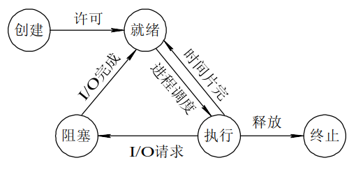
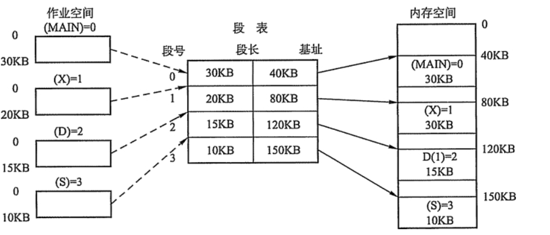
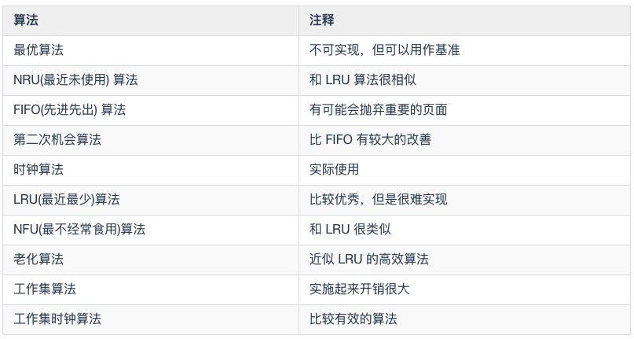

# 操作系统面试题

## 什么是线程，什么是进程?

线程是进程当中的一条执行流程。同一个进程内多个线程之间可以共享代码段、数据段、打开的文件等资源,但每个线程各自都有一套独自的寄存器和栈,这样可以确保线程的控制流是相对独立的。

进程:编写的代码只是一个存储在硬盘的静态文件,通过编译后就会生成二进制可执文件件,当我们运行这个可执文件后,它会被装载到内存中,接着 CPU 会执行程序中的每一条指令,那么这个运行中的程序,就被称为「进程(Process)。

## 什么是线程?

1. 是进程划分的任务,是一个进程内可调度的实体,是CPU调度的基本单位,用于保证程序的实时性,实现进程内部的并发。
2. 线程是操作系统可识别的最小执行和调度单位。每个线程都独自占用一个虚拟处理器:独自的寄存器组,指令计数器和处理器状态。
3. 每个线程完成不同的任务,但是属于同一个进程的不同线程之间共享同一地址空间(也就是同样的动态内存,映射文件,目标代码等等),打开的文件队列和其他内核资源。

## 为什么需要线程?

线程产生的原因:进程可以使多个程序能并发执行,以提高资源的利用率和系统的吞吐量;但是其具有
一些缺点:

1. 进程在同一时刻只能做一个任务,很多时候不能充分利用CPU资源。
2. 进程在执行的过程中如果发生阻塞,整个进程就会挂起,即使进程中其它任务不依赖于等待的资源,进程仍会被阻塞。

引入线程就是为了解决以上进程的不足,线程具有以下的优点:

1. 从资源上来讲,开辟一个线程所需要的资源要远小于一个进程。
2. 从切换效率上来讲,运行于一个进程中的多个线程,它们之间使用相同的地址空间,而且线程间彼此切换所需时间也远远小于进程间切换所需要的时间(这种时间的差异主要由于缓存的大量未命中导致)。
3. 从通信机制上来讲,线程间方便的通信机制。对不同进程来说,它们具有独立的地址空间,要进行数据的传递只能通过进程间通信的方式进行。线程则不然,属于同一个进程的不同线程之间共享同一地址空间,所以一个线程的数据可以被其它线程感知,线程间可以直接读写进程数据段(如全局变量)来进行通信(需要一些同步措施)。

## 进程和线程的区别？

- 调度：进程是资源管理的基本单位，线程是程序执行的基本单位。
- 切换：线程上下文切换比进程上下文切换要快得多。
- 拥有资源： 进程是拥有资源的一个独立单位，线程不拥有系统资源，但是可以访问隶属于进程的资源。
- 系统开销： 创建或撤销进程时，系统都要为之分配或回收系统资源，如内存空间，I/O设备等，OS所付出的开销显著大于在创建或撤销线程时的开销，进程切换的开销也远大于线程切换的开销。

1. 一个线程只能属于一个进程,而一个进程可以有多个线程,但至少有一个线程。线程依赖于进程而存在。
2. 进程在执行过程中拥有独立的地址空间,而多个线程共享进程的地址空间。(资源分配给进程,同一进程的所有线程共享该进程的所有资源。同一进程中的多个线程共享代码段(代码和常量),数据段(全局变量和静态变量),扩展段(堆存储)。但是每个线程拥有自己的栈段,栈段又叫运行时段,用来存放所有局部变量和临时变量。)
3. 进程是资源分配的最小单位,线程是CPU调度的最小单位。
4. 通信:由于同一进程中的多个线程具有相同的地址空间,使它们之间的同步和通信的实现,也变得比较容易。进程间通信 IPC ,线程间可以直接读写进程数据段(如全局变量)来进行通信(需要一些同步方法,以保证数据的一致性)。
5. 进程编程调试简单可靠性高,但是创建销毁开销大;线程正相反,开销小,切换速度快,但是编程调试相对复杂。
6. 进程间不会相互影响;一个进程内某个线程挂掉将导致整个进程挂掉。
7. 进程适应于多核、多机分布;线程适用于多核。

## 线程与进程的比较

线程与进程的比较如下:

- 进程是资源(包括内存、打开的文件等)分配的单位,线程是 CPU 调度的单位;
- 进程拥有一个完整的资源平台,而线程只独享必不可少的资源,如寄存器和栈;
- 线程同样具有就绪、阻塞、执行三种基本状态,同样具有状态之间的转换关系;
- 线程能减少并发执行的时间和空间开销;

对于,线程相比进程能减少开销,体现在:

- 线程的创建时间比进程快,因为进程在创建的过程中,还需要资源管理信息,如内存管理信息、文件管理信息,在线程在创建的过程中,不会涉及这些资源管理信
  息,而是共享它们;
- 线程的终止时间比进程快,因为线程释放的资源相比进程少很多;
- 同一个进程内的线程切换比进程切换快,因为线程具有相同的地址空间(虚拟内存共享),这意味着同一个进程的线程都具有同一个页表,那么在切换的时候不需要
  切换页表。而对于进程之间的切换,切换的时候要把⻚表给切换掉,而页表的切换过程开销是比较大的;
- 由于同一进程的各线程间共享内存和文件资源,那么在线程之间数据传递的时候,就不需要经过内核了,这就使得线程之间的数据交互效率更高了;

## 协程与线程的区别？

- 线程和进程都是同步机制，而协程是异步机制。
- 线程是抢占式，而协程是非抢占式的。需要用户释放使用权切换到其他协程，因此同一时间其实只有一个协程拥有运行权，相当于单线程的能力。
- 一个线程可以有多个协程，一个进程也可以有多个协程。
- 协程不被操作系统内核管理，而完全是由程序控制。线程是被分割的CPU资源，协程是组织好的代码流程，线程是协程的资源。但协程不会直接使用线程，协程直接利用的是执行器关联任意线程或线程池。
- 协程能保留上一次调用时的状态。

## 并发和并行有什么区别？

并发就是在一段时间内，多个任务都会被处理；但在某一时刻，只有一个任务在执行。单核处理器可以做到并发。比如有两个进程`A`和`B`，`A`运行一个时间片之后，切换到`B`，`B`运行一个时间片之后又切换到`A`。因为切换速度足够快，所以宏观上表现为在一段时间内能同时运行多个程序。

并行就是在同一时刻，有多个任务在执行。这个需要多核处理器才能完成，在微观上就能同时执行多条指令，不同的程序被放到不同的处理器上运行，这个是物理上的多个进程同时进行。

并发: 同一时间段,多个任务都在执行 (单位时间内不一定同时执行);
并行: 单位时间内,多个任务同时执行。

## 进程与线程的切换流程？

进程切换分两步：

1、切换**页表**以使用新的地址空间，一旦去切换上下文，处理器中所有已经缓存的内存地址一瞬间都作废了。

2、切换内核栈和硬件上下文。

对于linux来说，线程和进程的最大区别就在于地址空间，对于线程切换，第1步是不需要做的，第2步是进程和线程切换都要做的。

因为每个进程都有自己的虚拟地址空间，而线程是共享所在进程的虚拟地址空间的，因此同一个进程中的线程进行线程切换时不涉及虚拟地址空间的转换。

## 为什么虚拟地址空间切换会比较耗时？

进程都有自己的虚拟地址空间，把虚拟地址转换为物理地址需要查找页表，页表查找是一个很慢的过程，因此通常使用Cache来缓存常用的地址映射，这样可以加速页表查找，这个Cache就是TLB（translation Lookaside Buffer，TLB本质上就是一个Cache，是用来加速页表查找的）。

由于每个进程都有自己的虚拟地址空间，那么显然每个进程都有自己的页表，那么**当进程切换后页表也要进行切换，页表切换后TLB就失效了**，Cache失效导致命中率降低，那么虚拟地址转换为物理地址就会变慢，表现出来的就是程序运行会变慢，而线程切换则不会导致TLB失效，因为线程无需切换地址空间，因此我们通常说线程切换要比较进程切换块，原因就在这里。

## 进程间通信方式有哪些？

- 管道：管道这种通讯方式有两种限制，一是半双工的通信，数据只能单向流动，二是只能在具有亲缘关系的进程间使用。进程的亲缘关系通常是指父子进程关系。

  管道可以分为两类：匿名管道和命名管道。匿名管道是单向的，只能在有亲缘关系的进程间通信；命名管道以磁盘文件的方式存在，可以实现本机任意两个进程通信。

- 信号 ： 信号是一种比较复杂的通信方式，信号可以在任何时候发给某一进程，而无需知道该进程的状态。

  >  **Linux系统中常用信号**：
  >  （1）**SIGHUP**：用户从终端注销，所有已启动进程都将收到该进程。系统缺省状态下对该信号的处理是终止进程。
  >
  >  （2）**SIGINT**：程序终止信号。程序运行过程中，按`Ctrl+C`键将产生该信号。
  >
  >  （3）**SIGQUIT**：程序退出信号。程序运行过程中，按`Ctrl+\\`键将产生该信号。
  >
  >  （4）**SIGBUS和SIGSEGV**：进程访问非法地址。
  >
  >  （5）**SIGFPE**：运算中出现致命错误，如除零操作、数据溢出等。
  >
  >  （6）**SIGKILL**：用户终止进程执行信号。shell下执行`kill -9`发送该信号。
  >
  >  （7）**SIGTERM**：结束进程信号。shell下执行`kill 进程pid`发送该信号。
  >
  >  （8）**SIGALRM**：定时器信号。
  >
  >  （9）**SIGCLD**：子进程退出信号。如果其父进程没有忽略该信号也没有处理该信号，则子进程退出后将形成僵尸进程。

- 信号量：信号量是一个**计数器**，可以用来控制多个进程对共享资源的访问。它常作为一种**锁机制**，防止某进程正在访问共享资源时，其他进程也访问该资源。因此，主要作为进程间以及同一进程内不同线程之间的同步手段。

- 消息队列：消息队列是消息的链接表，包括Posix消息队列和System V消息队列。有足够权限的进程可以向队列中添加消息，被赋予读权限的进程则可以读走队列中的消息。消息队列克服了信号承载信息量少，管道只能承载无格式字节流以及缓冲区大小受限等缺点。

- 共享内存：共享内存就是映射一段能被其他进程所访问的内存，这段共享内存由一个进程创建，但多个进程都可以访问。共享内存是最快的 IPC 方式，它是针对其他进程间通信方式运行效率低而专门设计的。它往往与其他通信机制，如信号量，配合使用，来实现进程间的同步和通信。

- Socket：与其他通信机制不同的是，它可用于不同机器间的进程通信。

**优缺点**：

* 管道：速度慢，容量有限；

* Socket：任何进程间都能通讯，但速度慢；

* 消息队列：容量受到系统限制，且要注意第一次读的时候，要考虑上一次没有读完数据的问题；

* 信号量：不能传递复杂消息，只能用来同步；

* 共享内存区：能够很容易控制容量，速度快，但要保持同步，比如一个进程在写的时候，另一个进程要注意读写的问题，相当于线程中的线程安全，当然，共享内存区同样可以用作线程间通讯，不过没这个必要，线程间本来就已经共享了同一进程内的一块内存。

## 进程间同步的方式有哪些？

1、临界区：通过对多线程的串行化来访问公共资源或一段代码，速度快，适合控制数据访问。

优点：保证在某一时刻只有一个线程能访问数据的简便办法。

缺点：虽然临界区同步速度很快，但却只能用来同步本进程内的线程，而不可用来同步多个进程中的线程。

2、互斥量：为协调共同对一个共享资源的单独访问而设计的。互斥量跟临界区很相似，比临界区复杂，互斥对象只有一个，只有拥有互斥对象的线程才具有访问资源的权限。

优点：使用互斥不仅仅能够在同一应用程序不同线程中实现资源的安全共享，而且可以在不同应用程序的线程之间实现对资源的安全共享。

缺点：

* 互斥量是可以命名的，也就是说它可以跨越进程使用，所以创建互斥量需要的资源更多，所以如果只为了在进程内部是用的话使用临界区会带来速度上的优势并能够减少资源占用量。

* 通过互斥量可以指定资源被独占的方式使用，但如果有下面一种情况通过互斥量就无法处理，比如现在一位用户购买了一份三个并发访问许可的数据库系统，可以根据用户购买的访问许可数量来决定有多少个线程/进程能同时进行数据库操作，这时候如果利用互斥量就没有办法完成这个要求，信号量对象可以说是一种资源计数器。

3、信号量：为控制一个具有有限数量用户资源而设计。它允许多个线程在同一时刻访问同一资源，但是需要限制在同一时刻访问此资源的最大线程数目。互斥量是信号量的一种特殊情况，当信号量的最大资源数=1就是互斥量了。

优点：适用于对Socket（套接字）程序中线程的同步。

缺点:

* 信号量机制必须有公共内存，不能用于分布式操作系统，这是它最大的弱点；

* 信号量机制功能强大，但使用时对信号量的操作分散， 而且难以控制，读写和维护都很困难，加重了程序员的编码负担；

* 核心操作P-V分散在各用户程序的代码中，不易控制和管理，一旦错误，后果严重，且不易发现和纠正。

4、事件： 用来通知线程有一些事件已发生，从而启动后继任务的开始。

优点：事件对象通过通知操作的方式来保持线程的同步，并且可以实现不同进程中的线程同步操作。

## 线程同步的方式有哪些？

1、临界区：当多个线程访问一个独占性共享资源时，可以使用临界区对象。拥有临界区的线程可以访问被保护起来的资源或代码段，其他线程若想访问，则被挂起，直到拥有临界区的线程放弃临界区为止，以此达到用原子方式操 作共享资源的目的。

2、事件：事件机制，则允许一个线程在处理完一个任务后，主动唤醒另外一个线程执行任务。

3、互斥量：互斥对象和临界区对象非常相似，只是其允许在进程间使用，而临界区只限制与同一进程的各个线程之间使用，但是更节省资源，更有效率。

4、信号量：当需要一个计数器来限制可以使用某共享资源的线程数目时，可以使用“信号量”对象。

区别：

* 互斥量与临界区的作用非常相似，但互斥量是可以命名的，也就是说互斥量可以跨越进程使用，但创建互斥量需要的资源更多，所以如果只为了在进程内部是用的话使用临界区会带来速度上的优势并能够减少资源占用量 。因为互斥量是跨进程的互斥量一旦被创建，就可以通过名字打开它。

* 互斥量，信号量，事件都可以被跨越进程使用来进行同步数据操作。

## 线程的分类？

从线程的运行空间来说，分为用户级线程（user-level thread, ULT）和内核级线程（kernel-level, KLT）

**内核级线程**：这类线程依赖于内核，又称为内核支持的线程或轻量级进程。无论是在用户程序中的线程还是系统进程中的线程，它们的创建、撤销和切换都由内核实现。比如英特尔i5-8250U是4核8线程，这里的线程就是内核级线程

**用户级线程**：它仅存在于用户级中，这种线程是**不依赖于操作系统核心**的。应用进程利用**线程库来完成其创建和管理**，速度比较快，**操作系统内核无法感知用户级线程的存在**。

##  什么是临界区，如何解决冲突？

每个进程中访问临界资源的那段程序称为临界区，**一次仅允许一个进程使用的资源称为临界资源。**

解决冲突的办法：

- 如果有若干进程要求进入空闲的临界区，**一次仅允许一个进程进入**，如已有进程进入自己的临界区，则其它所有试图进入临界区的进程必须等待；
- 进入临界区的进程要在**有限时间内退出**。
- 如果进程不能进入自己的临界区，则应**让出CPU**，避免进程出现“忙等”现象。

## 什么是死锁？死锁产生的条件？

**什么是死锁**：

在两个或者多个并发进程中，如果每个进程持有某种资源而又等待其它进程释放它或它们现在保持着的资源，在未改变这种状态之前都不能向前推进，称这一组进程产生了死锁。通俗的讲就是两个或多个进程无限期的阻塞、相互等待的一种状态。

**死锁产生的四个必要条件**：（有一个条件不成立，则不会产生死锁）

- 互斥条件：一个资源一次只能被一个进程使用
- 请求与保持条件：一个进程因请求资源而阻塞时，对已获得资源保持不放
- 不剥夺条件：进程获得的资源，在未完全使用完之前，不能强行剥夺
- 循环等待条件：若干进程之间形成一种头尾相接的环形等待资源关系

## 如何处理死锁问题

常用的处理死锁的方法有：死锁预防、死锁避免、死锁检测、死锁解除、鸵鸟策略。

**（1）死锁的预防：**基本思想就是确保死锁发生的四个必要条件中至少有一个不成立：

> - ① 破除资源互斥条件
> - ② 破除“请求与保持”条件：实行资源预分配策略，进程在运行之前，必须一次性获取所有的资源。缺点：在很多情况下，无法预知进程执行前所需的全部资源，因为进程是动态执行的，同时也会降低资源利用率，导致降低了进程的并发性。
> - ③ 破除“不可剥夺”条件：允许进程强行从占有者那里夺取某些资源。当一个已经保持了某些不可被抢占资源的进程，提出新的资源请求而不能得到满足时，它必须释放已经保持的所有资源，待以后需要时再重新申请。这意味着进程已经占有的资源会被暂时被释放，或者说被抢占了。
> - ④ 破除“循环等待”条件：实行资源有序分配策略，对所有资源排序编号，按照顺序获取资源，将紧缺的，稀少的采用较大的编号，在申请资源时必须按照编号的顺序进行，一个进程只有获得较小编号的进程才能申请较大编号的进程。

**（2）死锁避免：**

死锁预防通过约束资源请求，防止4个必要条件中至少一个的发生，可以通过直接或间接预防方法，但是都会导致低效的资源使用和低效的进程执行。而死锁避免则允许前三个必要条件，但是通过动态地检测资源分配状态，以确保循环等待条件不成立，从而确保系统处于安全状态。所谓安全状态是指：如果系统能按某个顺序为每个进程分配资源（不超过其最大值），那么系统状态是安全的，换句话说就是，如果存在一个安全序列，那么系统处于安全状态。银行家算法是经典的死锁避免的算法。

**（3）死锁检测：**

死锁预防策略是非常保守的，他们通过限制访问资源和在进程上强加约束来解决死锁的问题。死锁检测则是完全相反，它不限制资源访问或约束进程行为，只要有可能，被请求的资源就被授权给进程。但是操作系统会周期性地执行一个算法检测前面的循环等待的条件。死锁检测算法是通过资源分配图来检测是否存在环来实现，从一个节点出发进行深度优先搜索，对访问过的节点进行标记，如果访问了已经标记的节点，就表示有存在环，也就是检测到死锁的发生。

> - （1）如果进程-资源分配图中无环路，此时系统没有死锁。 
> - （2）如果进程-资源分配图中有环路，且每个资源类中只有一个资源，则系统发生死锁。 
> - （3）如果进程-资源分配图中有环路，且所涉及的资源类有多个资源，则不一定会发生死锁。

**（4）死锁解除：**

死锁解除的常用方法就是终止进程和资源抢占，回滚。所谓进程终止就是简单地终止一个或多个进程以打破循环等待，包括两种方式：终止所有死锁进程和一次只终止一个进程直到取消死锁循环为止；所谓资源抢占就是从一个或者多个死锁进程那里抢占一个或多个资源。

**（5）鸵鸟策略：**

把头埋在沙子里，假装根本没发生问题。因为解决死锁问题的代价很高，因此鸵鸟策略这种不采取任何措施的方案会获得更高的性能。当发生死锁时不会对用户造成多大影响，或发生死锁的概率很低，可以采用鸵鸟策略。大多数操作系统，包括 Unix，Linux 和 Windows，处理死锁问题的办法仅仅是忽略它。

## 产生死锁条件?

(1)互斥使用(资源独占):一个资源每次只能给一个进程使用

(2)占有且等待(请求和保持,部分分配):进程在申请新的资源的同时保持对原有资源的占有

(3)不可抢占(不可剥夺):资源申请者不能强行的从资源占有者手中夺取资源,资源只能由占有者自愿释放

(4)循环等待:存在一个进程等待队列 {P1 , P2 , ... , Pn},其中P1等待P2占有的资源,P2等待P3占有的资源,...,Pn等待P1占有的资源,形成一个进程等待环路。

当死锁产生的时候一定会有这四个条件,有一个条件不成立都不会造成死锁。

## 如何避免死锁问题的发生?

产生死锁的四个必要条件是:互斥条件、持有并等待条件、不可剥夺条件、环路等待条件。

那么避免死锁问题就只需要破环其中一个条件就可以,最常用的并且可行的就是使用资源有序分配法,来破环环路等待条件。

## 如何解决死锁问题?

解决死锁的方法即破坏产生死锁的四个必要条件之一,主要方法如下:

1. 资源一次性分配,这样就不会再有请求了(破坏请求条件)。
2. 只要有一个资源得不到分配,也不给这个进程分配其他的资源(破坏占有并等待条件)。
3. 可抢占资源:即当进程新的资源未得到满足时,释放已占有的资源,从而破坏不可抢占的条件。
4. 资源有序分配法:系统给每类资源赋予一个序号,每个进程按编号递增的请求资源,释放则相反,从而破坏环路等待的条件

## 进程死锁

（1）定义：是指多个进程在运行过程中因为争夺资源而造成的一种僵局，当进程处于这种状态时，若无外力作用，他们都将无法再向前推进。

（2）原因：竞争资源（不可抢占资源，可消耗资源），进程间推进顺序非法。

（3）产生死锁得必要条件：互斥条件、请求和保持条件、不可抢占（不可剥夺）条件、环路等待条件

造成死锁的⼏个原因：

1. ⼀个资源每次只能被⼀个线程使⽤（互斥）
2. ⼀个线程在阻塞等待某个资源时，不释放已占有资源（请求与保持）
3. ⼀个线程已经获得的资源，在未使⽤完之前，不能被强⾏剥夺（不剥夺）
4. 若⼲线程形成头尾相接的循环等待资源关系（循环等待）

（4）处理死锁的基本方法：

​			预防死锁：破坏产生死锁得必要条件，其中破坏互斥条件是最不实际的；

​			破坏“请求和保持”条件：系统规定所有进程在开始运行之前，都必须一次性的申请其在整个运行过程所需的全部资源；

​			破坏“不剥夺”条件；

​			破坏“环路等待”条件：所有进程对资源的请求必须严格按照资源序号递增的次序提出

（5）预防死锁：银行家算法、安全性算法

（6）检测死锁：资源分配图，死锁定理

（7）解除死锁：剥夺资源（从其他进程剥夺足够数量的资源给死锁进程以解除死锁状态。），撤销进程（最简单的是让全部进程都死掉；温和一点的是按照某种顺序逐个撤销进程，直至有足够的资源可用，使死锁状态消除为止。）

## 进程调度策略有哪几种？

* **先来先服务**：非抢占式的调度算法，按照请求的顺序进行调度。有利于长作业，但不利于短作业，因为短作业必须一直等待前面的长作业执行完毕才能执行，而长作业又需要执行很长时间，造成了短作业等待时间过长。另外，对`I/O`密集型进程也不利，因为这种进程每次进行`I/O`操作之后又得重新排队。

* **短作业优先**：非抢占式的调度算法，按估计运行时间最短的顺序进行调度。长作业有可能会饿死，处于一直等待短作业执行完毕的状态。因为如果一直有短作业到来，那么长作业永远得不到调度。

* **最短剩余时间优先**：最短作业优先的抢占式版本，按剩余运行时间的顺序进行调度。 当一个新的作业到达时，其整个运行时间与当前进程的剩余时间作比较。如果新的进程需要的时间更少，则挂起当前进程，运行新的进程。否则新的进程等待。

* **时间片轮转**：将所有就绪进程按 `FCFS` 的原则排成一个队列，每次调度时，把 `CPU` 时间分配给队首进程，该进程可以执行一个时间片。当时间片用完时，由计时器发出时钟中断，调度程序便停止该进程的执行，并将它送往就绪队列的末尾，同时继续把 `CPU` 时间分配给队首的进程。

  时间片轮转算法的效率和时间片的大小有很大关系：因为进程切换都要保存进程的信息并且载入新进程的信息，如果时间片太小，会导致进程切换得太频繁，在进程切换上就会花过多时间。 而如果时间片过长，那么实时性就不能得到保证。 

* **优先级调度**：为每个进程分配一个优先级，按优先级进行调度。为了防止低优先级的进程永远等不到调度，可以随着时间的推移增加等待进程的优先级。

## 进程有哪些状态？

进程一共有`5`种状态，分别是创建、就绪、运行（执行）、终止、阻塞。 

- 运行状态就是进程正在`CPU`上运行。在单处理机环境下，每一时刻最多只有一个进程处于运行状态。 
- 就绪状态就是说进程已处于准备运行的状态，即进程获得了除`CPU`之外的一切所需资源，一旦得到`CPU`即可运行。 
- 阻塞状态就是进程正在等待某一事件而暂停运行，比如等待某资源为可用或等待`I/O`完成。即使`CPU`空闲，该进程也不能运行。 

**运行态→阻塞态**：往往是由于等待外设，等待主存等资源分配或等待人工干预而引起的。
**阻塞态→就绪态**：则是等待的条件已满足，只需分配到处理器后就能运行。
**运行态→就绪态**：不是由于自身原因，而是由外界原因使运行状态的进程让出处理器，这时候就变成就绪态。例如时间片用完，或有更高优先级的进程来抢占处理器等。
**就绪态→运行态**：系统按某种策略选中就绪队列中的一个进程占用处理器，此时就变成了运行态。

## 进程状态之间的转换:

1. 就绪→执行 处于就绪状态的进程,当进程调度程序为之分配了处理机后,该进程便由就绪状态转变成执行状态。
2. 执行→就绪 处于执行状态的进程在其执行过程中,因分配给它的一个时间片已用完而不得不让出处理机,于是进程从执行状态转变成就绪状态。
3. 执行→阻塞 正在执行的进程因等待某种事件发生而无法继续执行时,便从执行状态变成阻塞状态。
4. 阻塞→就绪 处于阻塞状态的进程,若其等待的事件已经发生,于是进程由阻塞状态转变为就绪状态。

## 什么是分页？

把内存空间划分为**大小相等且固定的块**，作为主存的基本单位。因为程序数据存储在不同的页面中，而页面又离散的分布在内存中，**因此需要一个页表来记录映射关系，以实现从页号到物理块号的映射。**

访问分页系统中内存数据需要**两次的内存访问** (一次是从内存中访问页表，从中找到指定的物理块号，加上页内偏移得到实际物理地址；第二次就是根据第一次得到的物理地址访问内存取出数据)。

## 什么是分段？

**分页是为了提高内存利用率，而分段是为了满足程序员在编写代码的时候的一些逻辑需求(比如数据共享，数据保护，动态链接等)。**

分段内存管理当中，**地址是二维的，一维是段号，二维是段内地址；其中每个段的长度是不一样的，而且每个段内部都是从0开始编址的**。由于分段管理中，每个段内部是连续内存分配，但是段和段之间是离散分配的，因此也存在一个逻辑地址到物理地址的映射关系，相应的就是段表机制。

## 分页和分段有什区别？

- 分页对程序员是透明的，但是分段需要程序员显式划分每个段。 
- 分页的地址空间是一维地址空间，分段是二维的。 
- 页的大小不可变，段的大小可以动态改变。 
- 分页主要用于实现虚拟内存，从而获得更大的地址空间；分段主要是为了使程序和数据可以被划分为逻辑上独立的地址空间并且有助于共享和保护。

## 什么是交换空间？

操作系统把物理内存(physical RAM)分成一块一块的小内存，每一块内存被称为**页(page)**。当内存资源不足时，**Linux把某些页的内容转移至硬盘上的一块空间上，以释放内存空间**。硬盘上的那块空间叫做**交换空间**(swap space),而这一过程被称为交换(swapping)。**物理内存和交换空间的总容量就是虚拟内存的可用容量。**

用途：

- 物理内存不足时一些不常用的页可以被交换出去，腾给系统。
- 程序启动时很多内存页被用来初始化，之后便不再需要，可以交换出去。

## 物理地址、逻辑地址、有效地址、线性地址、虚拟地址的区别?

物理地址就是内存中真正的地址，它就相当于是你家的门牌号，你家就肯定有这个门牌号，具有唯一性。**不管哪种地址，最终都会映射为物理地址**。

在`实模式`下，段基址 + 段内偏移经过地址加法器的处理，经过地址总线传输，最终也会转换为`物理地址`。

但是在`保护模式`下，段基址 + 段内偏移被称为`线性地址`，不过此时的段基址不能称为真正的地址，而是会被称作为一个`选择子`的东西，选择子就是个索引，相当于数组的下标，通过这个索引能够在 GDT 中找到相应的段描述符，段描述符记录了**段的起始、段的大小**等信息，这样便得到了基地址。如果此时没有开启内存分页功能，那么这个线性地址可以直接当做物理地址来使用，直接访问内存。如果开启了分页功能，那么这个线性地址又多了一个名字，这个名字就是`虚拟地址`。

不论在实模式还是保护模式下，段内偏移地址都叫做`有效地址`。有效抵制也是逻辑地址。

线性地址可以看作是`虚拟地址`，虚拟地址不是真正的物理地址，但是虚拟地址会最终被映射为物理地址。下面是虚拟地址 -> 物理地址的映射。

## 页面替换算法有哪些？

在程序运行过程中，如果要访问的页面不在内存中，就发生缺页中断从而将该页调入内存中。此时如果内存已无空闲空间，系统必须从内存中调出一个页面到磁盘对换区中来腾出空间。

- `最优算法`在当前页面中置换最后要访问的页面。不幸的是，没有办法来判定哪个页面是最后一个要访问的，`因此实际上该算法不能使用`。然而，它可以作为衡量其他算法的标准。
- `NRU` 算法根据 R 位和 M 位的状态将页面分为四类。从编号最小的类别中随机选择一个页面。NRU 算法易于实现，但是性能不是很好。存在更好的算法。
- `FIFO` 会跟踪页面加载进入内存中的顺序，并把页面放入一个链表中。有可能删除存在时间最长但是还在使用的页面，因此这个算法也不是一个很好的选择。
- `第二次机会`算法是对 FIFO 的一个修改，它会在删除页面之前检查这个页面是否仍在使用。如果页面正在使用，就会进行保留。这个改进大大提高了性能。
- `时钟` 算法是第二次机会算法的另外一种实现形式，时钟算法和第二次算法的性能差不多，但是会花费更少的时间来执行算法。
- `LRU` 算法是一个非常优秀的算法，但是没有`特殊的硬件(TLB)`很难实现。如果没有硬件，就不能使用 LRU 算法。
- `NFU` 算法是一种近似于 LRU 的算法，它的性能不是非常好。
- `老化` 算法是一种更接近 LRU 算法的实现，并且可以更好的实现，因此是一个很好的选择
- 最后两种算法都使用了工作集算法。工作集算法提供了合理的性能开销，但是它的实现比较复杂。`WSClock` 是另外一种变体，它不仅能够提供良好的性能，而且可以高效地实现。

**最好的算法是老化算法和WSClock算法**。他们分别是基于 LRU 和工作集算法。他们都具有良好的性能并且能够被有效的实现。还存在其他一些好的算法，但实际上这两个可能是最重要的。

## 什么是缓冲区溢出？有什么危害？

缓冲区溢出是指当计算机向缓冲区填充数据时超出了缓冲区本身的容量，溢出的数据覆盖在合法数据上。

危害有以下两点：

- 程序崩溃，导致拒绝额服务
- 跳转并且执行一段恶意代码

造成缓冲区溢出的主要原因是程序中没有仔细检查用户输入。

## 什么是虚拟内存？

虚拟内存就是说，让物理内存扩充成更大的逻辑内存，从而让程序获得更多的可用内存。虚拟内存使用部分加载的技术，让一个进程或者资源的某些页面加载进内存，从而能够加载更多的进程，甚至能加载比内存大的进程，这样看起来好像内存变大了，这部分内存其实包含了磁盘或者硬盘，并且就叫做虚拟内存。

为了更加有效地管理内存并且少出错,现代系统提供了一种对主存的抽象概念,叫做虚拟内存(VM)。虚拟内存是硬件异常、硬件地址翻译、主存、磁盘文件和内核软件的完美交互,它为每个进程提供了一个大的、一致的和私有的地址空间。通过一个很清晰的机制,虚拟内存提供了三个重要的能力:

1. 它将主存看成是一个存储在磁盘上的地址空间的高速缓存,在主存中只保存活动区域,并根据需要在磁盘和主存之间来回传送数据,通过这种方式,它高效地使用了主存。
2. 它为每个进程提供了一致的地址空间,从而简化了内存管理。
3. 它保护了每个进程的地址空间不被其他进程破坏。

## 虚拟内存的实现方式有哪些?

虚拟内存中，允许将一个作业分多次调入内存。釆用连续分配方式时，会使相当一部分内存空间都处于暂时或`永久`的空闲状态，造成内存资源的严重浪费，而且也无法从逻辑上扩大内存容量。因此，虚拟内存的实需要建立在离散分配的内存管理方式的基础上。虚拟内存的实现有以下三种方式：

- 请求分页存储管理。
- 请求分段存储管理。
- 请求段页式存储管理。

## 为什么要引入虚拟内存?

1. 虚拟内存作为缓存的工具

  - 虚拟内存被组织为一个由存放在磁盘上的N个连续的字节大小的单元组成的数组。
  - 虚拟内存利用DRAM缓存来自通常更大的虚拟地址空间的页面。

2. 虚拟内存作为内存管理的工具。操作系统为每个进程提供了一个独立的页表,也就是独立的虚拟地址空间。多个虚拟页面可以映射到同一个物理页面上。

- 简化链接: 独立的地址空间允许每个进程的内存映像使用相同的基本格式,而不管代码和数据实际存放在物理内存的何处。例如:一个给定的 linux 系统上的每个进程都是用类似的内存格式,对于64为地址空间,代码段总是从虚拟地址) 0x400000 开始,数据段,代码段,栈,堆等等。
- 简化加载: 虚拟内存还使得容易向内存中加载可执行文件和共享对象文件。要把目标文件中.text和.data节加载到一个新创建的进程中,Linux加载器为代码和数据段分配虚拟页VP,把他们标记为无效(未被缓存) ,将页表条目指向目标文件的起始位置。加载器从不在磁盘到内存实际复制任何数据,在每个页初次被引用时,虚拟内存系统会按照需要自动的调入数据页。
- 简化共享: 独立地址空间为OS提供了一个管理用户进程和操作系统自身之间共享的一致机制。
- 一般:每个进程有各自私有的代码,数据,堆栈,是不和其他进程共享的,这样OS创建页表,将虚拟页映射到不连续的物理页面。某些情况下,需要进程来共享代码和数据。例如每个进程调用相同的操作系统内核代码,或者C标准库函数。OS会把不同进程中适当的虚拟页面映射到相同的物理页面。
- 简化内存分配: 虚拟内存向用户提供一个简单的分配额外内存的机制。当一个运行在用户进程中的程序要求额外的堆空间时(如 malloc ),OS分配一个适当k大小个连续的虚拟内存页面,并且将他们映射到物理内存中任意位置的k个任意物理页面,因此操作系统没有必要分配k个连续的物理内存页面,页面可以随机的分散在物理内存中。

3. 虚拟内存作为内存保护的工具。不应该允许一个用户进程修改它的只读段,也不允许它修改任何内核代码和数据结构,不允许读写其他进程的私有内存,不允许修改任何与其他进程共享的虚拟页面。每次CPU生成一个地址时, MMU 会读一个 PTE ,通过在 PTE 上添加一些额外的许可位来控制对一个虚拟页面内容的访问十分简单。

## 讲一讲IO多路复用？

**IO多路复用是指内核一旦发现进程指定的一个或者多个IO条件准备读取，它就通知该进程。IO多路复用适用如下场合**：

- 当客户处理多个描述字时（一般是交互式输入和网络套接口），必须使用I/O复用。
- 当一个客户同时处理多个套接口时，而这种情况是可能的，但很少出现。
- 如果一个TCP服务器既要处理监听套接口，又要处理已连接套接口，一般也要用到I/O复用。
- 如果一个服务器即要处理TCP，又要处理UDP，一般要使用I/O复用。
- 如果一个服务器要处理多个服务或多个协议，一般要使用I/O复用。
- 与多进程和多线程技术相比，I/O多路复用技术的最大优势是系统开销小，系统不必创建进程/线程，也不必维护这些进程/线程，从而大大减小了系统的开销。

## 硬链接和软链接有什么区别？

- 硬链接就是在目录下创建一个条目，记录着文件名与 `inode` 编号，这个 `inode` 就是源文件的 `inode`。删除任意一个条目，文件还是存在，只要引用数量不为 `0`。但是硬链接有限制，它不能跨越文件系统，也不能对目录进行链接。
- 符号链接文件保存着源文件所在的绝对路径，在读取时会定位到源文件上，可以理解为 `Windows` 的快捷方式。当源文件被删除了，链接文件就打不开了。因为记录的是路径，所以可以为目录建立符号链接。

## 中断的处理过程?

1. 保护现场：将当前执行程序的相关数据保存在寄存器中，然后入栈。
2. 开中断：以便执行中断时能响应较高级别的中断请求。
3. 中断处理
4. 关中断：保证恢复现场时不被新中断打扰
5. 恢复现场：从堆栈中按序取出程序数据，恢复中断前的执行状态。

## 中断和轮询有什么区别？

* 轮询：CPU对**特定设备**轮流询问。中断：通过**特定事件**提醒CPU。
* 轮询：效率低等待时间长，CPU利用率不高。中断：容易遗漏问题，CPU利用率不高。

## 什么是用户态和内核态？

用户态和系统态是操作系统的两种运行状态：

> - 内核态：内核态运行的程序可以访问计算机的任何数据和资源，不受限制，包括外围设备，比如网卡、硬盘等。处于内核态的 CPU 可以从一个程序切换到另外一个程序，并且占用 CPU 不会发生抢占情况。
> - 用户态：用户态运行的程序只能受限地访问内存，只能直接读取用户程序的数据，并且不允许访问外围设备，用户态下的 CPU 不允许独占，也就是说 CPU 能够被其他程序获取。

将操作系统的运行状态分为用户态和内核态，主要是为了对访问能力进行限制，防止随意进行一些比较危险的操作导致系统的崩溃，比如设置时钟、内存清理，这些都需要在内核态下完成 。

## 用户态和内核态是如何切换的?

所有的用户进程都是运行在用户态的，但是我们上面也说了，用户程序的访问能力有限，一些比较重要的比如从硬盘读取数据，从键盘获取数据的操作则是内核态才能做的事情，而这些数据却又对用户程序来说非常重要。所以就涉及到两种模式下的转换，即**用户态 -> 内核态 -> 用户态**，而唯一能够做这些操作的只有 `系统调用`，而能够执行系统调用的就只有 `操作系统`。

一般用户态 -> 内核态的转换我们都称之为 trap 进内核，也被称之为 `陷阱指令(trap instruction)`。

他们的工作流程如下：

- 首先用户程序会调用 `glibc` 库，glibc 是一个标准库，同时也是一套核心库，库中定义了很多关键 API。
- glibc 库知道针对不同体系结构调用`系统调用`的正确方法，它会根据体系结构应用程序的二进制接口设置用户进程传递的参数，来准备系统调用。
- 然后，glibc 库调用`软件中断指令(SWI)` ，这个指令通过更新 `CPSR` 寄存器将模式改为超级用户模式，然后跳转到地址 `0x08` 处。
- 到目前为止，整个过程仍处于用户态下，在执行 SWI 指令后，允许进程执行内核代码，MMU 现在允许内核虚拟内存访问
- 从地址 0x08 开始，进程执行加载并跳转到中断处理程序，这个程序就是 ARM 中的 `vector_swi()`。
- 在 vector_swi() 处，从 SWI 指令中提取系统调用号 SCNO，然后使用 SCNO 作为系统调用表 `sys_call_table` 的索引，调转到系统调用函数。
- 执行系统调用完成后，将还原用户模式寄存器，然后再以用户模式执行。

## Unix 常见的IO模型：

对于一次IO访问（以read举例），数据会先被拷贝到操作系统内核的缓冲区中，然后才会从操作系统内核的缓冲区拷贝到应用程序的地址空间。所以说，当一个read操作发生时，它会经历两个阶段：

> - 等待数据准备就绪 (Waiting for the data to be ready)
> - 将数据从内核拷贝到进程中 (Copying the data from the kernel to the process)

正式因为这两个阶段，linux系统产生了下面五种网络模式的方案：

> - 阻塞式IO模型(blocking IO model)
> - 非阻塞式IO模型(noblocking IO model)
> - IO复用式IO模型(IO multiplexing model)
> - 信号驱动式IO模型(signal-driven IO model)
> - 异步IO式IO模型(asynchronous IO model)

对于这几种 IO 模型的详细说明，可以参考这篇文章：https://juejin.cn/post/6942686874301857800#heading-13

其中，IO多路复用模型指的是：使用单个进程同时处理多个网络连接IO，他的原理就是select、poll、epoll 不断轮询所负责的所有 socket，当某个socket有数据到达了，就通知用户进程。该模型的优势并不是对于单个连接能处理得更快，而是在于能处理更多的连接。

## select、poll 和 epoll 之间的区别?

（1）select：时间复杂度 O(n)

select 仅仅知道有 I/O 事件发生，但并不知道是哪几个流，所以只能无差别轮询所有流，找出能读出数据或者写入数据的流，并对其进行操作。所以 select 具有 O(n) 的无差别轮询复杂度，同时处理的流越多，无差别轮询时间就越长。

（2）poll：时间复杂度 O(n)

poll 本质上和 select 没有区别，它将用户传入的数组拷贝到内核空间，然后查询每个 fd 对应的设备状态， 但是它没有最大连接数的限制，原因是它是基于链表来存储的。

（3）epoll：时间复杂度 O(1)

epoll 可以理解为 event poll，不同于忙轮询和无差别轮询，epoll 会把哪个流发生了怎样的 I/O 事件通知我们。所以说 epoll 实际上是事件驱动（每个事件关联上 fd）的。

> select，poll，epoll 都是 IO 多路复用的机制。I/O 多路复用就是通过一种机制监视多个描述符，一旦某个描述符就绪（一般是读就绪或者写就绪），就通知程序进行相应的读写操作。但 select，poll，epoll 本质上都是同步 I/O，因为他们都需要在读写事件就绪后自己负责进行读写，也就是说这个读写过程是阻塞的，而异步 I/O 则无需自己负责进行读写，异步 I/O 的实现会负责把数据从内核拷贝到用户空间。

## 使用线程的优缺点?

线程的优点:

- 一个进程中可以同时存在多个线程;
- 各个线程之间可以并发执行;
- 各个线程之间可以共享地址空间和文件等资源;

线程的缺点:

- 当进程中的一个线程崩溃时,会导致其所属进程的所有线程崩溃。举个例子,对于游戏的用户设计,则不应该使用多线程的方式,否则一个用户挂了,会影响其他同
  个进程的线程。

## 什么是线程的上下文切换?

线程与进程最大的区别在于:线程是调度的基本单位,而进程则是资源拥有的基本单位。

所谓操作系统的任务调度,实际上的调度对象是线程,进程只是给线程提供了虚拟内存、全局变量等资源。

对于线程和进程,我们可以这么理解:

当进程只有一个线程时,可以认为进程就等于线程;

当进程拥有多个线程时,这些线程会共享相同的虚拟内存和全局变量等资源,这些资源在上下文切换时是不需要修改的;

另外,线程也有自己的私有数据,比如栈和寄存器等,这些在上下文切换时也是需要保存的。

## PCB都包含什么内容?

进程描述信息:

- 进程标识符:标识各个进程,每个进程都有一个并且唯一的标识符;
- 用户标识符:进程归属的用户,用户标识符主要为共享和保护服务;

进程控制和管理信息:

- 进程当前状态,如 new、ready、running、waiting 或 blocked 等;
- 进程优先级:进程抢占 CPU 时的优先级;

资源分配清单:

- 有关内存地址空间或虚拟地址空间的信息,所打开文件的列表和所使用的 I/O 设备信息。

CPU 相关信息:

- CPU 中各个寄存器的值,当进程被切换时,CPU 的状态信息都会被保存在相应的PCB 中,以便进程
- 重新执行时,能从断点处继续执行。

## 进程的上下文切换到底是切换什么呢?

进程是由内核管理和调度的,所以进程的切换只能发生在内核态。所以,进程的上下文切换不仅包含了虚拟内存、栈、全局变量等用户空间的资源,还包括了内核堆栈、寄存器等内核空间的资源。

## 用户态和内核态的区别

**内核态**: CPU可以访问内存所有数据, 包括外围设备, 例如硬盘, 网卡. CPU也可以将自己从一个程序切换到另一个程序

**用户态**: 只能受限的访问内存, 且不允许访问外围设备。 占用CPU的能力被剥夺， CPU资源可以被其他程序获取

所有用户程序都是运行在用户态的, 但是有时候程序确实需要做一些内核态的事情, 例如从硬盘读取数据, 或者从键盘获取输入等. 

而唯一可以做这些事情的就是操作系统, 所以此时程序就需要先操作系统请求以程序的名义来执行这些操作.

这时需要一个这样的机制: 用户态程序切换到内核态, 但是不能控制在内核态中执行的指令，这种机制叫系统调用

## 为什么要进程同步

多进程虽然提高了系统资源利用率和吞吐量，但是由于进程的异步性可能造成系统的混乱。进程同步的任务就是对多个相关进程在执行顺序上进行协调，使并发执行的多个进程之间可以有效的共享资源和相互合作，保证程序执行的可再现性。

## 同步机制需要遵循的原则：

①空闲让进：当没有进程处于临界区的时候，应该许可其他进程进入临界区的申请

②忙则等待：当前如果有进程处于临界区，如果有其他进程申请进入，则必须等待，保证对临界区的互斥访问

③有限等待：对要求访问临界资源的进程，需要在有限时间呃逆进入临界区，防止出现死等

④让权等待：当进程无法进入临界区的时候，需要释放处理机，边陷入忙等

## 进程同步的方式：原子操作、信号量、管程。

**线程同步方式：**

（1）互斥（信号)量，每个时刻只有一个线程可以访问公共资源。只有拥有互斥对象的线程才能访问公共资源，互斥对象只有一个，一个时刻只能有一个线程持有，所以保证了公共资源不会被多个线程同时访问。

（2）信号量，允许多个线程同时访问公共资源。当时控制了访问资源的线程的最大个数。

（3）临界区。任意时刻只能有一个线程进入临界区，访问临界资源。

## 线程调度算法

抢占式。时间分片。

## 对mmap的理解

mmap()系统调用使得进程之间，通过映射同一个普通文件实现共享内存。普通文件被映射到进程地址空间后，进程可以向访问普通内存一样对文件进行访问，不必再调用read()、write()等操作。 

## 进程、线程、协程的区别，为什么协程效率高

协程，是一种比线程更加轻量级的存在，协程不是被操作系统内核所管理，而完全是由程序所控制（也就是在用户态执行）。这样带来的好处就是性能得到了很大的提升，不会像，线程切换那样消耗资源。

## 常见的页面置换算法

当访问一个内存中不存在的页,并且内存已满,则需要从内存中调出一个页或将数据送至磁盘对换区,替换一个页,这种现象叫做缺页置换。当前操作系统最常采用的缺页置换算法如下:

- 先进先出(FIFO)算法:
  - 思路:置换最先调入内存的页面,即置换在内存中驻留时间最久的页面。
  - 实现:按照进入内存的先后次序排列成队列,从队尾进入,从队首删除。
  - 特点:实现简单;性能较差,调出的页面可能是经常访问的

- 最近最少使用( LRU )算法:

  - 思路: 置换最近一段时间以来最长时间未访问过的页面。根据程序局部性原理,刚被访问的页面,可能马上又要被访问;而较长时间内没有被访问的页面,可能最近不会被访问。
  - 实现:缺页时,计算内存中每个逻辑页面的上一次访问时间,选择上一次使用到当前时间最长的页面
  - 特点:可能达到最优的效果,维护这样的访问链表开销比较大

当前最常采用的就是 LRU 算法。

- 最不常用算法( Least Frequently Used, LFU )
  - 思路:缺页时,置换访问次数最少的页面
- 实现:每个页面设置一个访问计数,访问页面时,访问计数加1,缺页时,置换计数最小的页面
  - 特点:算法开销大,开始时频繁使用,但以后不使用的页面很难置换

## 段式页式段页式优缺点总结

**（1）页式管理；**

基本原理是将各进程的虚拟空间划分为若干个长度相等的页。

优点：没有外碎片，每个内碎片不超过页的大小。

缺点：程序全部装入内存，要求有相应的硬件支持，如地址变换机构缺页中断的产生和选择淘汰页面等都要求有相应的硬件支持。增加了机器成本和系统开销。

**（2）段式管理**

基本思想是把程序按内容或过程函数关系分成段，每段有自己的名字。

优点：可以分别编写和编译，可以针对不同类型的段采取不同的保护，可以按段为单位来进行共享，包括通过动态链接进行代码共享。

缺点：会产生碎片。

**（3）段页式管理；**

段页式管理是段式管理和页式管理相结合而成，具有两者的优点。

## 共享内存的优缺点

**优点：** 我们可以看到使用共享内存进行进程间的通信真的是非常方便，而且函数的接口也简单，数据的共享还使进程间的数据不用传送，而是直接访问内存，也加快了程序的效率。同时，它也不像匿名管道那样要求通信的进程有一定的父子关系。

**缺点：** 共享内存没有提供同步的机制，这使得我们在使用共享内存进行进程间通信时，往往要借助其他的手段来进行进程间的同步工作。

我们可以使用共享内存作为一种独特的存储选项，提供快速读/写操作和进程互操作性等优势。对于 Web 应用程序，这意味着：

缓存存储（数据库查询、Web 服务数据、外部数据）、会话存储、应用程序之间的数据交换、此存储技术不仅对缓存有用，也对应用程序之间的数据交换也有用，只要数据以两端都可读的格式存储。不要低估共享内存在 Web 应用程序中的力量。可采用许多不同的方式来巧妙地实现这种存储，惟一的限制是开发人员的创造力和技能。

## 磁盘寻道算法

**（1）先来先服务(FCFS):**

　　这是一种简单的磁盘调度算法。它根据进程请求访问磁盘的先后次序进行调度。此算法的优点是公平、简单，且每个进程的请求都能依次得到处理，不会出现某一进程的请求长期得不到满足的情况。但此算法由于未对寻道进行优化，致使平均寻道时间可能较长。

**（2）最短寻道时间优先(SSTF):**

  　　该算法选择这样的进程，其要求访问的磁道与当前磁头所在的磁道距离最近，以使每次的寻道时间最短，但这种调度算法却不能保证平均寻道时间最短。
    
**（3）扫描算法(SCAN):**

　　SCAN算法不仅考虑到欲访问的磁道与当前磁道的距离，更优先考虑的是磁头的当前移动方向。例如，当磁头正在自里向外移动时，SCAN算法所选择的下一个访问对象应是其欲访问的磁道既在当前磁道之外，又是距离最近的。这样自里向外地访问，直到再无更外的磁道需要访问才将磁臂换向，自外向里移动。这时，同样也是每次选择这样的进程来调度，即其要访问的磁道，在当前磁道之内，从而避免了饥饿现象的出现。由于这种算法中磁头移动的规律颇似电梯的运行，故又称为电梯调度算法。

**（4）循环扫描算法（CSCAN）**

　　CSCAN算法是对扫描算法的改进。如果对磁道的访问请求是均匀分布的，当磁头到达磁盘的一端，并反向运动时落在磁头之后的访问请求相对较少。这是由于这些磁道刚被处理，而磁盘另一端的请求密度相当高，且这些访问请求等待的时间较长，为了解决这种情况，循环扫描算法规定磁头单向移动。例如，只自里向外移动，当磁头移到最外的被访问磁道时，磁头立即返回到最里的欲访磁道，即将最小磁道号紧接着最大磁道号构成循环，进行扫描

## 操作系统怎么与硬件互动

（1）Shell将可执行文件加载到内存中以后，设置相关的寄存器。

（2）然后，开始执行里面的可执行文件，首先一条一条进行指令分析

（3）指令分析后，然后进行系统调用，产生中断信号。

（4）cpu收到中断信号跳转到中断服务程序

（5）中断服务程序，开始给硬件发送信号，进行驱动执行。

（6）计算机怎么与硬件沟通，通过寄存器地址访问硬件上的存储器，硬件把信息放在存储器里，每个存储器有个地址，cpu用地址号来读写数据。地址怎么产生的？程序代码里给出的，cpu加电从某个固定地址读出程序指令执行。

## CPU组成

CPU基本部分有了运算器、cache、控制器三大部分，称为中央处理器。 

**控制器的功能：**

（1）从指令cache中取出一条指令，并指出下一条指令在指令cache中的位置。

（2）对指令进行译码或测试，并产生相应的操作控制信号，以便启动规定的动作。比如一次数据cache的读/写操作，一个算术逻辑运算操作，或一个输入/输出操作。

（3）指挥并控制CPU、数据cache和输入/输出设备之间数据流动的方向。
运算器：算术逻辑单元（ALU）、通用寄存器、数据缓冲寄存器DR和状态条件寄存器PSW组成。

**运算器的功能：**

（1）执行所有的算术运算。

（2）执行所有的逻辑运算，并进行逻辑测试，如零值测试或两个值的比较。通常，一个算术操作产生一个运算结果，而一个逻辑操作则产生一个判决。

## CPU功能

（1）指令控制：由于程序是一个指令序列，这些指令的相互顺序不能任意颠倒，必须严格按程序规定的顺序进行。

（2）操作控制： CPU管理并产生由内存取出的每条指令的操作信号，把各种操作信号送往相应部件，从而控制这些部件按指令的要求进行动作。

（3）时间控制：对各种操作实施时间上的定时。

（4）数据加工：对数据进行算术运算和逻辑运算处理。

## CPU每个周期做什么事情

采用流水线划分的方式：取指 译码 执行

## 操作系统和CPU的关系

一个.c应用程序，经操作系统编译为CPU指令，在CPU架构上执行。注意：一个应用程序，由操作系统编译为ARM指令，就只能在ARM体系架构上运行；编译为x86指令，就只能在x86体系架构上运行。

## 操作系统的功能

处理器管理，存储管理，设备管理（输入输出），文件管理，进程调度等功能。

## 操作系统的特征

并发性、共享性、随机性

## 处理机调度的算法

（1）先来先服务（FCFS）—公平

（2）短作业优先（SJF）—高效

（3）优先级调度（PS）—紧急程度

（4）高响应比优先（HRRF）—均衡（既考虑作业等待时间，又考虑作业执行时间）

（5）最短剩余时间优先（SRTF）—尽早结束（降低负载）

（6）时间片轮转（RR）—交替运行

## 存储管理（动态分区分配空闲块算法、页面置换算法）

最先适配算法（按照地址，从小到大）、最佳适配算法（按照大小，从小到大）、最坏适配算法（按照大小，从大到小）

**页面置换算法**

最优页面置换算法（OPT，往后看，在未来的时间内哪个页最久没有被使用，就置换该页）、

最近最少使用页面置换算法（LRU，往前看，之前已经被访问过的页中哪个页最久没有被使用，就置换该页）、

先进先出页面置换算法（FIFO，先淘汰掉驻留在主存中时间最长的页，哪一个页最先装进主存，该页最先被置换）

## 磁盘调度算法

先进先出算法（FIFO）、短查找时间优先算法（SSTF）、扫描算法（SCAN，也称电梯算法）、循环扫描算法（C-SCAN）

## 什么是操作系统?请简要概述一下

操作系统是管理计算机硬件和软件资源的计算机程序,提供一个计算机用户与计算机硬件系统之间的接口。

向上对用户程序提供接口,向下接管硬件资源。

操作系统本质上也是一个软件,作为最接近硬件的系统软件,负责处理器管理、存储器管理、设备管理、文件管理和提供用户接口。

## 操作系统有哪些分类?

操作系统常规可分为批处理操作系统、分时操作系统、实时操作系统。

若一个操作系统兼顾批操作和分时的功能,则称该系统为通用操作系统。

常见的通用操作系统有:Windows、Linux、MacOS等。

## 什么是进程?

进程是操作系统中最重要的抽象概念之一,是资源分配的基本单位,是独立运行的基本单位。

进程的经典定义就是一个执行中程序的实例。系统中的每个程序都运行在某个进程的上下文(context)中。

上下文是由程序正确运行所需的状态组成的。这个状态包括存放在内存中的程序的代码和数据,它的栈、通用目的寄存器的内容、程序计数器、环境变量以及打开文件描述符的集合。

进程一般由以下的部分组成:

1. 进程控制块PCB,是进程存在的唯一标志,包含进程标识符PID,进程当前状态,程序和数据地址,进程优先级、CPU现场保护区(用于进程切换),占有的资源清单等。
2. 程序段
3. 数据段

## 进程的基本操作

以Unix系统举例:

1. 进程的创建:fork()。新创建的子进程几乎但不完全与父进程相同。子进程得到与父进程用户级虚拟地址空间相同的(但是独立的)一份副本,包括代码和数据段、堆、共享库以及用户栈。子进程还获得与父进程任何打开文件描述符相同的副本,这就意味着当父进程调用 fork 时,子进程可以读写父进程中打开的任何文件。父进程和新创建的子进程之间最大的区别在于它们有不同的 PID。fork函数是有趣的(也常常令人迷惑), 因为它只被调用一次,却会返回两次:一次是在调用进程(父进程)中,一次是在新创建的子进程中。在父进程中,fork 返回子进程的 PID。在子进程中,fork 返回 0。因为子进程的 PID 总是为非零,返回值就提供一个明 确的方法来分辨程序是在父进程还是在子进程中执行。pid_t fork(void);
2. 回收子进程:当一个进程由于某种原因终止时,内核并不是立即把它从系统中清除。相反,进程被保持在一种已终止的状态中,直到被它的父进程回收(reaped)。当父进程回收已终止的子进程时,内核将子进程的退出状态传递给父进程,然后抛弃已终止的进程。一个进程可以通过调用waitpid 函数来等待它的子进程终止或者停止。pid_t waitpid(pid_t pid, int *statusp, int options);
3. 加载并运行程序:execve 函数在当前进程的上下文中加载并运行一个新程序。int execve(const char *filename, const char *argv[], const char *envp[]);
4. 进程终止: void exit(int status);

## 进程如何通过管道进行通信

管道是一种最基本的IPC机制,作用于有血缘关系的进程之间,完成数据传递。调用pipe系统函数即可创建一个管道。有如下特质:

1. 其本质是一个伪文件(实为内核缓冲区)
2. 由两个文件描述符引用,一个表示读端,一个表示写端。
3. 规定数据从管道的写端流入管道,从读端流出。

管道的原理: 管道实为内核使用环形队列机制,借助内核缓冲区实现。

管道的局限性:

1. 数据自己读不能自己写。
2. 数据一旦被读走,便不在管道中存在,不可反复读取。
3. 由于管道采用半双工通信方式。因此,数据只能在一个方向上流动。
4. 只能在有公共祖先的进程间使用管道。

## 进程如何通过共享内存通信?

它使得多个进程可以访问同一块内存空间,不同进程可以及时看到对方进程中对共享内存中数据得更新。这种方式需要依靠某种同步操作,如互斥锁和信号量等。

特点:

1. 共享内存是最快的一种IPC,因为进程是直接对内存进行操作来实现通信,避免了数据在用户空间和内核空间来回拷贝。
2. 因为多个进程可以同时操作,所以需要进行同步处理。
3. 信号量和共享内存通常结合在一起使用,信号量用来同步对共享内存的访问。

## 什么是信号

一个信号就是一条小消息,它通知进程系统中发生了一个某种类型的事件。 Linux 系统上支持的30 种不同类型的信号。 每种信号类型都对应于某种系统事件。低层的硬件异常是由内核异常处理程序处理的,正常情况下,对用户进程而言是不可见的。信号提供了一种机制,通知用户进程发生了这些异常。

1. 发送信号:内核通过更新目的进程上下文中的某个状态,发送(递送)一个信号给目的进程。发送信号可以有如下两种原因:

  - 内核检测到一个系统事件,比如除零错误或者子进程终止。

  - —个进程调用了kill 函数, 显式地要求内核发送一个信号给目的进程。一个进程可以发送信号给它自己。

2. 接收信号:当目的进程被内核强迫以某种方式对信号的发送做出反应时,它就接收了信号。进程可以忽略这个信号,终止或者通过执行一个称为信号处理程序(signal handler)的用户层函数捕获这个信号。

## 如何编写正确且安全的信号处理函数

1. 处理程序要尽可能简单。 避免麻烦的最好方法是保持处理程序尽可能小和简单。例如,处理程序可能只是简单地设置全局标志并立即返回;所有与接收信号相关的处理都由主程序执行,它周期性地检查(并重置)这个标志。
2. 在处理程序中只调用异步信号安全的函数。 所谓异步信号安全的函数(或简称安全的函数)能够被信号处理程序安全地调用,原因有二:要么它是可重入的(例如只访问局部变量),要么它不能被信号处理程序中断。
3. 保存和恢复errno。 许多Linux 异步信号安全的函数都会在出错返回时设置errno在处理程序中调用这样的函数可能会干扰主程序中其他依赖于分。解决方法是在进人处理程序时把errno 保存在一个局部变量中,在处理程序返回前恢复它。注意,只有在处理程序要返回时才有此必要。如果处理程序调用_exit终止该进程,那么就不需要这样做了。
4. 阻塞所有的信号,保护对共享全局数据结构的访问。 如果处理程序和主程序或其他处理程序共享一个全局数据结构,那么在访问(读或者写)该数据结构时,你的处理程序和主程序应该暂时阻塞所有的信号。这条规则的原因是从主程序访问一个数据结构d 通常需要一系列的指令,如果指令序列被访问d 的处理程序中断,那么处理程序可能会发现d 的状态不一致,得到不可预知的结果。在访问d时暂时阻塞信号保证了处理程序不会中断该指令序列。
5. 用volatile 声明全局变量。 考虑一个处理程序和一个main 函数,它们共享一个全局变量g 。处理程序更新g,main 周期性地读g, 对于一个优化编译器而言,main 中g的值看上去从来没有变化过,因此使用缓存在寄存器中g 的副本来满足对g 的每次引用是很安全的。如果这样,main 函数可能永远都无法看到处理程序更新过的值。可以用volatile 类型限定符来定义一个变量,告诉编译器不要缓存这个变量。例如:volatile 限定符强迫编译器毎次在代码中引用g时,都要从内存中读取g的值。一般来说,和其他所有共享数据结构一样,应该暂时阻塞信号,保护每次对全局变量的访问。volatile int g;
6. 用sig_atomic_t声明标志。在常见的处理程序设计中,处理程序会写全局标志来记录收到了信号。主程序周期性地读这个标志,响应信号,再清除该标志。对于通过这种方式来共享的标志,C 提供一种整型数据类型sig_atomic_t对它的读和写保证会是原子的(不可中断的)。
7. 信号的一个与直觉不符的方面是未处理的信号是不排队的。因为 pending 位向量中每种类型的信号只对应有一位,所以每种类型最多只能有一个未处理的信号。关键思想是如果存在一个未处理的信号就表明至少有一个信号到达了。

## 进程调度的时机

1. 当前运行的进程运行结束。
2. 当前运行的进程由于某种原因阻塞。
3. 执行完系统调用等系统程序后返回用户进程。
4. 在使用抢占调度的系统中,具有更高优先级的进程就绪时。
5. 分时系统中,分给当前进程的时间片用完。

## 不能进行进程调度的情况

1. 在中断处理程序执行时。
2. 在操作系统的内核程序临界区内。
3. 其它需要完全屏蔽中断的原子操作过程中。

## 进程调度策略的基本设计指标

1. CPU利用率
2. 系统吞吐率,即单位时间内CPU完成的作业的数量。
3. 响应时间。
4. 周转时间。是指作业从提交到完成的时间间隔。从每个作业的角度看,完成每个作业的时间也是很
   关键
   - 平均周转时间
   - 带权周转时间
   - 平均带权周转时间

## 什么是孤儿进程?僵尸进程?

1. 孤儿进程: 父进程退出,子进程还在运行的这些子进程都是孤儿进程,孤儿进程将被init进程(1号进程)所收养,并由init进程对他们完成状态收集工作。
2. 僵尸进程: 进程使用fork创建子进程,如果子进程退出,而父进程并没有调用wait 获waitpid 获取子进程的状态信息,那么子进程的进程描述符仍然保存在系统中的这些进程是僵尸进程。

## 进程和线程的基本API

进程API以Unix系统为例,线程相关的API属于Posix线程(Pthreads)标准接口。

## 多线程模型

1. 多对一模型。将多个用户级线程映射到一个内核级线程上。该模型下,线程在用户空间进行管理,效率较高。缺点就是一个线程阻塞,整个进程内的所有线程都会阻塞。几乎没有系统继续使用这个模型。
2. 一对一模型。将内核线程与用户线程一一对应。优点是一个线程阻塞时,不会影响到其它线程的执行。该模型具有更好的并发性。缺点是内核线程数量一般有上限,会限制用户线程的数量。更多的内核线程数目也给线程切换带来额外的负担。linux和Windows操作系统家族都是使用一对一模型。
3. 多对多模型。将多个用户级线程映射到多个内核级线程上。结合了多对一模型和一对一模型的特点。

## 进程同步的方法

操作系统中,进程是具有不同的地址空间的,两个进程是不能感知到对方的存在的。有时候,需要多个进程来协同完成一些任务。

当多个进程需要对同一个内核资源进行操作时,这些进程便是竞争的关系,操作系统必须协调各个进程对资源的占用,进程的互斥是解决进程间竞争关系的方法。 进程互斥指若干个进程要使用同一共享资源时,任何时刻最多允许一个进程去使用,其他要使用该资源的进程必须等待,直到占有资源的进程释放该资源。

当多个进程协同完成一些任务时,不同进程的执行进度不一致,这便产生了进程的同步问题。需要操作系统干预,在特定的同步点对所有进程进行同步,这种协作进程之间相互等待对方消息或信号的协调关系称为进程同步。进程互斥本质上也是一种进程同步。

进程的同步方法:

1. 互斥锁
2. 读写锁
3. 条件变量

4. 记录锁(record locking)
5. 信号量
6. 屏障(barrier)

## 进程同步与线程同步有什么区别

进程之间地址空间不同,不能感知对方的存在,同步时需要将锁放在多进程共享的空间。而线程之间共享同一地址空间,同步时把锁放在所属的同一进程空间即可。

## 什么是虚拟地址,什么是物理地址?

地址空间是一个非负整数地址的有序集合。

在一个带虚拟内存的系统中,CPU 从一个有N=pow(2,n)个地址的地址空间中生成虚拟地址,这个地址空间称为虚拟地址空间(virtual address space),现代系统通常支持 32 位或者 64 位虚拟地址空间。

一个系统还有一个物理地址空间(physical address space),对应于系统中物理内存的M 个字节。

地址空间的概念是很重要的,因为它清楚地区分了数据对象(字节)和它们的属性(地址)。

一旦认识到了这种区别,那么我们就可以将其推广,允许每个数据对象有多个独立的地址,其中每个地址都选自一个不同的地址空间。这就是虚拟内存的基本思想。

主存中的每字节都有一个选自虚拟地址空间的虚拟地址和一个选自物理地址空间的物理地址。

## 请说一下什么是写时复制?

- 如果有多个进程要读取它们自己的那部门资源的副本,那么复制是不必要的。每个进程只要保存一个指向这个资源的指针就可以了。只要没有进程要去修改自己的“副本”,就存在着这样的幻觉:每个进程好像独占那个资源。从而就避免了复制带来的负担。如果一个进程要修改自己的那份资源“副本”,那么就会复制那份资源,并把复制的那份提供给进程。不过其中的复制对进程来说是透明的。
- 这个进程就可以修改复制后的资源了,同时其他的进程仍然共享那份没有修改过的资源。所以这就是名称的由来:在写入时进行复制。写时复制的主要好处在于:如果进程从来就不需要修改资源,则不需要进行复制。惰性算法的好处就在于它们尽量推迟代价高昂的操作,直到必要的时刻才会去执行。
- 在使用虚拟内存的情况下,写时复制(Copy-On-Write)是以页为基础进行的。所以,只要进程不修改它全部的地址空间,那么就不必复制整个地址空间。在fork()调用结束后,父进程和子进程都相信它们有一个自己的地址空间,但实际上它们共享父进程的原始页,接下来这些页又可以被其他的父进程或子进程共享。

## 实时操作系统的概念

实时操作系统(Real-time operating system, RTOS),又称即时操作系统,它会按照排序运行、管理系统资源,并为开发应用程序提供一致的基础。 实时操作系统与一般的操作系统相比,最大的特色就是“实时性”,如果有一个任务需要执行,实时操作系统会马上(在较短时间内)执行该任务,不会有较长的延时。这种特性保证了各个任务的及时执行。

## 优先级反转是什么?如何解决

由于多进程共享资源,具有最高优先权的进程被低优先级进程阻塞,反而使具有中优先级的进程先于高优先级的进程执行,导致系统的崩溃。这就是所谓的优先级反转(Priority Inversion)。其实,优先级反转是在高优级(假设为A)的任务要访问一个被低优先级任务(假设为C)占有的资源时,被阻塞.而此时又有优先级高于占有资源的任务(C)而低于被阻塞的任务(A)的优先级的任务(假设为B)时,于是,占有资源的任务就被挂起(占有的资源仍为它占有),因为占有资源的任务优先级很低,所以,它可能一直被另外的任务挂起.而它占有的资源也就一直不能释放,这样,引起任务A一直没办法执行.而比它优先低的任务却可以执行。

目前解决优先级反转有许多种方法。其中普遍使用的有2种方法:一种被称作优先级继承(priority inheritance);另一种被称作优先级极限(priority ceilings)。

1. 优先级继承(priority inheritance) 优先级继承是指将低优先级任务的优先级提升到等待它所占有的资源的最高优先级任务的优先级.当高优先级任务由于等待资源而被阻塞时,此时资源的拥有者的优先级将会自动被提升。
2. 优先级天花板(priority ceilings)优先级天花板是指将申请某资源的任务的优先级提升到可能访问该资源的所有任务中最高优先级任务的优先级.(这个优先级称为该资源的优先级天花板)。

## 简述 select

select是一种多路复用技术。其收到所有输入的文件描述符,返回哪些文件有新数据。

其可以设置为阻塞或者非阻塞状态,底层采用1024位bitmap做实现,因此有文件描述符上限数。

## 简述poll

poll是一种多路复用技术。其收到所有输入的文件描述符,返回哪些文件有新数据。

其通过链表代替了之前select的数据结构,使得其没有上限限制。

## 简述epoll

poll是一种多路复用技术。其采用一个文件描述符管理多个输入的文件描述符,采用事件回调的方式,

提高了程序运行效率。

## 简述虚拟地址到物理地址转化过程

虚拟地址由虚拟页号和页偏移两部分组成。

通过虚拟地址的页面号,首先在快表中查询是否有该映射,查询不成功,在页表中找到该页对应的物理地址。

然后通过页物理地址+页偏移,得到真实的物理地址

## 简述页表

页表用于存储虚拟地址中的虚拟页面号和物理页面号的映射关系。

除此之外,有些页的读写有限制,页表也通过其他存储位,标记该页访问位,是否在内存中(可能被页面置换出去了)等等。

## 简述多级页表

多级页表用于减少内存的占用。以二级页表为例,虚拟地址被分为DIR,PAGE和offset三部分,通过顶级页表和DIR,寻找到该二级页表的起始位置,再通过二级页表的起始位置和PAGE,找到页物理地址,最后加上页偏移,即可得到最终的物理地址。

## 简述快表

快表也称为页表高速缓存。其会存储一定数量的页表项,以此加快虚拟地址到物理地址的映射速度。

## 简述MMU

MMU即内存管理单元,该硬件负责处理虚拟地址到物理地址的转化工作。快表也存储在MMU上。

## 进程调度算法

先来先服务调度算法:创建一个任务队列,一旦有新任务就加入这个队列,CPU完成一个任务后就从队列取任务。

短作业(进程)优先调度算法:针对较短的作业,优先调给CPU工作。

时间片轮转算法:每个时间片依次执行一个任务,时间片结束后将该任务放回任务队列。

多级反馈队列:也按时间片轮转算法执行任务,设置n个队列,当第一个队列任务为空,才执行第二个队列,依次类推。如果在i队列的任务在该时间片执行后没有完成,即插入i+1号队列。

