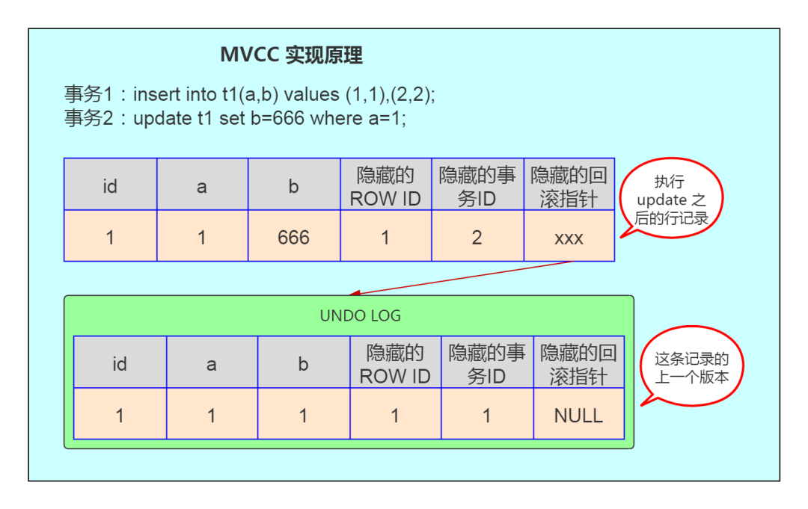
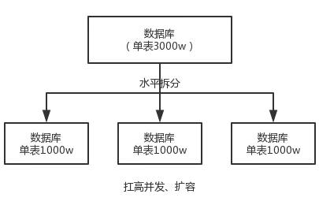

# MySQL面试题

## 什么是数据库事务？

事务是一个不可分割的数据库操作序列，也是数据库并发控制的基本单位，其执行的结果必须使数据库从一种一致性状态变到另一种一致性状态。**事务是逻辑上的一组操作，要么都执行，要么都不执行。**

事务最经典也经常被拿出来说例子就是转账了。

假如小明要给小红转账1000元，这个转账会涉及到两个关键操作就是：将小明的余额减少1000元，将小红的余额增加1000元。万一在这两个操作之间突然出现错误比如银行系统崩溃，导致小明余额减少而小红的余额没有增加，这样就不对了。事务就是保证这两个关键操作要么都成功，要么都要失败。

## 事务的特性

事务就是一组原子性的操作，这些操作要么全部发生，要么全部不发生。事务把数据库从一种一致性状态转换成另一种一致性状态。

- **原子性：是指事务包含所有操作要么全部成功，要么全部失败回滚。**事务是数据库的逻辑工作单位，事务中包含的各操作要么都做，要么都不做。
- **一致性：指事务必须使数据库从一个一致性状态变换成另一个一致性状态，也就是说一个事务执行之前和执行之后都必须处于一致性状态。**。因此当数据库只包含成功事务提交的结果时，就说数据库处于一致性状态。如果数据库系统 运行中发生故障，有些事务尚未完成就被迫中断，这些未完成事务对数据库所做的修改有一部分已写入物理数据库，这时数据库就处于一种不正确的状态，或者说是 不一致的状态。
  拿转账来说，假设用户 A 和用户 B 两者的钱加起来一共是 5000，那么不管 A 和 B 之间如何转账，转几次账，事务结束后两个用户的钱相加起来应该还得是 5000，这就是事务的一致性。
- **隔离性：是当多个用户并发访问数据库时，比如操作同一张表时，数据表为每个用户开启的事务，不能被其他事务所干扰，多个并发事务之间要相互隔离。**一个事务的执行不能其它事务干扰。即一个事务内部的//操作及使用的数据对其它并发事务是隔离的，并发执行的各个事务之间不能互相干扰。
- **持久性：持久性是指一个事务一旦被提交，那么对数据库中的数据的改变就是永久的，即便是在数据库系统遇到故障的性况下也不会丢失提交事务的操作**。

## 事务的隔离级别

- **Serializable(串行化)：可避免脏读、不可重复读、幻读。（就是串行化读数据）**。最高隔离级别，完全ACID隔离，一个个事务依次执行
- **Repeatable read(可重复读)：可避免脏读、不可重复读的发生。**对同一个字段多次读取结果完全一致除非自己改，还会幻读
- **Read committed(读已提交)：可避免脏读的发生。**允许读取并发事务已经提交的数据，还会幻读，不可重复读
- **Read uncommitted(读未提交)：最低级别，任何情况都无法保证。**允许读取尚未提交的数据。导致脏读，幻读，不可重复读

**在 MySQL 数据库中，支持上面四种隔离级别，默认的为 Repeatable read (可重复读)**；而在 Oracle 数据库中，只支持 Serializable (串行化)级别和 Read committed (读已提交)这两种级别，其中默认的为 Read committed 级别。


**事务隔离机制的实现基于锁机制和并发调度。**其中并**发调度使用的是MVCC（多版本并发控制）**，通过保存修改的旧版本信息来支持并发一致性读和回滚等特性。

因为隔离级别越低，事务请求的锁越少，所以大部分数据库系统的隔离级别都是READ-COMMITTED(读取提交内容):，但是你要知道的是InnoDB 存储引擎默认使用 **REPEATABLE-READ（可重读）**并不会有任何性能损失。

InnoDB 存储引擎在 分布式事务 的情况下一般会用到**SERIALIZABLE(可串行化)**隔离级别。

## MySQL事务日志介绍下？

**innodb 事务日志包括 redo log 和 undo log。**

- **undo log（回滚日志）**：是 Innodb 存储引擎层生成的日志，实现了事务中的**原子性**，主要**用于事务回滚和 MVCC**。
- **redo log（重做日志）**：是 Innodb 存储引擎层生成的日志，实现了事务中的**持久性**，主要**用于掉电等故障恢复**；

**undo log 指事务开始之前，在操作任何数据之前，首先将需操作的数据备份到一个地方。redo log 指事务中操作的任何数据，将最新的数据备份到一个地方。**

事务日志的目的：实例或者介质失败，事务日志文件就能派上用场。

**redo log** 不是随着事务的提交才写入的，而是**在事务的执行过程中，便开始写入 redo 中**。具体的落盘策略可以进行配置 。防止在发生故障的时间点，尚有脏页未写入磁盘，在重启 MySQL 服务的时候，根据 redo log 进行重做，从而达到事务的未入磁盘数据进行持久化这一特性。**RedoLog 是为了实现事务的持久性而出现的产物。**

**undo log**用来回滚行记录到某个版本。事务未提交之前，**Undo 保存了未提交之前的版本数据**，Undo 中的数据可作为数据旧版本快照供其他并发事务进行快照读。是**为了实现事务的原子性而出现的产物**,在 MySQL innodb 存储引擎中**用来实现多版本并发控制**。

## 在事务中可以混合使用存储引擎吗?

**尽量不要**在同一个事务中使用多种存储引擎，**MySQL服务器层不管理事务，事务是由下层的存储引擎实现的。**

如果在事务中混合使用了事务型和非事务型的表（例如InnoDB和MyISAM表）,在正常提交的情况下不会有什么问题。

但如果该事务需要回滚，非事务型的表上的变更就无法撤销，这会导致数据库处于不一致的状态，这种情况很难修复，事务的最终结果将无法确定。所以，为每张表选择合适的存储引擎非常重要。

## MySQL中是如何实现事务隔离的

**读未提交和串行化基本上是不需要考虑的隔离级别**，前者不加锁限制，后者相当于单线程执行，效率太差。

**MySQL 在可重复读级别解决了幻读问题，是通过行锁和间隙锁的组合 Next-Key 锁实现的。**

详细原理看这篇文章：https://haicoder.net/note/MySQL-interview/MySQL-interview-MySQL-trans-level.html

## InnoDB存储引擎默认的是什么?为什么?

MySQL InnoDB 存储引擎的默认支持的隔离级别是 REPEATABLE-READ(可重读)

至于**InnoDB为什么选用可重复读,我的个人理解是:在InnoDB存储引擎中,使用可重复读可以解决脏读、不可重复读,而幻读也有可能发生,但是是可以避免的,通过加Next-Key Lock锁可以解决幻读问题。并且并非隔离级别越高越好,隔离级别越高的话,并发性能越低,所以在实际的开发中,需要根据业务场景进行选择事务的隔离级别。**

## ACID特性

- 原子性：语句要么全执行，要么全不执行，是事务最核心的特性，事务本身就是以原子性来定义的；**原子性是通过 undo log（回滚日志） 来保证的；**
- 持久性：保证事务提交后不会因为宕机等原因导致数据丢失；**持久性是通过 redo log （重做日志）来保证的；**
- 隔离性：保证事务执行尽可能不受其他事务影响；InnoDB默认的隔离级别是RR，RR的实现主要基于锁机制（包含next-key lock）、MVCC（包括数据的隐藏列、基于undo log的版本链、ReadView）；**隔离性是通过 MVCC（多版本并发控制） 或锁机制来保证的；**
- 一致性：事务追求的最终目标，一致性的实现既需要数据库层面的保障，也需要应用层面的保障；**一致性则是通过持久性+原子性+隔离性来保证；**

## MySQL逻辑架构和存储引擎


如上图所示，MySQL服务器逻辑架构从上往下可以分为三层：

（1）第一层：处理客户端连接、授权认证等。

（2）第二层：服务器层，负责查询语句的解析、优化、缓存以及内置函数的实现、存储过程等。

（3）第三层：存储引擎，负责MySQL中数据的存储和提取。**MySQL中服务器层不管理事务，事务是由存储引擎实现的。**MySQL支持事务的存储引擎有InnoDB、NDB Cluster等，其中InnoDB的使用最为广泛；其他存储引擎不支持事务，如MyIsam、Memory等。

如无特殊说明，后文中描述的内容都是基于InnoDB。

## 原子性

**1. 定义**

**原子性是指一个事务是一个不可分割的工作单位，其中的操作要么都做，要么都不做；如果事务中一个sql语句执行失败，则已执行的语句也必须回滚，数据库退回到事务前的状态。**

**2. 实现原理：undo log**

**实现原子性的关键，是当事务回滚时能够撤销所有已经成功执行的sql语句**。InnoDB实现回滚，靠的是undo log：当事务对数据库进行修改时，InnoDB会生成对应的undo log；如果事务执行失败或调用了rollback，导致事务需要回滚，便可以利用undo log中的信息将数据回滚到修改之前的样子。

**undo log属于逻辑日志，它记录的是sql执行相关的信息**。当发生回滚时，InnoDB会根据undo log的内容做与之前相反的工作：对于每个insert，回滚时会执行delete；对于每个delete，回滚时会执行insert；对于每个update，回滚时会执行一个相反的update，把数据改回去。

以update操作为例：当事务执行update时，其生成的undo log中会包含被修改行的主键(以便知道修改了哪些行)、修改了哪些列、这些列在修改前后的值等信息，回滚时便可以使用这些信息将数据还原到update之前的状态。

## 持久性

**1. 定义**

**持久性是指事务一旦提交，它对数据库的改变就应该是永久性的。接下来的其他操作或故障不应该对其有任何影响。**

**2. 实现原理：redo log**

redo log和undo log都属于InnoDB的事务日志。下面先聊一下redo log存在的背景。

InnoDB作为MySQL的存储引擎，数据是存放在磁盘中的，但如果每次读写数据都需要磁盘IO，效率会很低。为此，InnoDB提供了缓存(Buffer Pool)，Buffer Pool中包含了磁盘中部分数据页的映射，作为访问数据库的缓冲：当从数据库读取数据时，会首先从Buffer Pool中读取，如果Buffer Pool中没有，则从磁盘读取后放入Buffer Pool；当向数据库写入数据时，会首先写入Buffer Pool，Buffer Pool中修改的数据会定期刷新到磁盘中（这一过程称为刷脏）。

Buffer Pool的使用大大提高了读写数据的效率，但是也带了新的问题：如果MySQL宕机，而此时Buffer Pool中修改的数据还没有刷新到磁盘，就会导致数据的丢失，事务的持久性无法保证。

于是，redo log被引入来解决这个问题：**当数据修改时，除了修改Buffer Pool中的数据，还会在redo log记录这次操作**；当事务提交时，会调用fsync接口对redo log进行刷盘。如果MySQL宕机，重启时可以读取redo log中的数据，对数据库进行恢复。redo log采用的是WAL（Write-ahead logging，预写式日志），所有修改先写入日志，再更新到Buffer Pool，保证了数据不会因MySQL宕机而丢失，从而满足了持久性要求。

既然redo log也需要在事务提交时将日志写入磁盘，为什么它比直接将Buffer Pool中修改的数据写入磁盘(即刷脏)要快呢？主要有以下两方面的原因：

（1）刷脏是随机IO，因为每次修改的数据位置随机，但**写redo log是追加操作，属于顺序IO**。

（2）刷脏是以数据页（Page）为单位的，MySQL默认页大小是16KB，一个Page上一个小修改都要整页写入；而redo log中只包含真正需要写入的部分，**无效IO大大减少。**

## redo log与binlog的区别

我们知道，在MySQL中还存在binlog(二进制日志)也可以记录写操作并用于数据的恢复，但二者是有着根本的不同的：

（1）**作用不同**：redo log是用于故障恢复的，保证MySQL宕机也不会影响持久性；binlog是用于point-in-time recovery的，保证服务器可以基于时间点恢复数据，此外binlog还用于主从复制。

（2）**层次不同**：redo log是InnoDB存储引擎实现的，而binlog是MySQL的服务器层(可以参考文章前面对MySQL逻辑架构的介绍)实现的，同时支持InnoDB和其他存储引擎。

（3）**内容不同**：redo log是物理日志，内容基于磁盘的Page；binlog的内容是二进制的，根据binlog_format参数的不同，可能基于sql语句、基于数据本身或者二者的混合。

（4）**写入时机不同**：binlog在事务提交时写入；redo log的写入时机相对多元：

前面曾提到：当事务提交时会调用fsync对redo log进行刷盘；这是默认情况下的策略，修改innodb_flush_log_at_trx_commit参数可以改变该策略，但事务的持久性将无法保证。

除了事务提交时，还有其他刷盘时机：如master thread每秒刷盘一次redo log等，这样的好处是不一定要等到commit时刷盘，commit速度大大加快。

## 隔离性

**1. 定义**

与原子性、持久性侧重于研究事务本身不同，隔离性研究的是不同事务之间的相互影响。**隔离性是指，事务内部的操作与其他事务是隔离的，并发执行的各个事务之间不能互相干扰**。严格的隔离性，对应了事务隔离级别中的Serializable (可串行化)，但实际应用中出于性能方面的考虑很少会使用可串行化。

隔离性追求的是并发情形下事务之间互不干扰。简单起见，我们主要考虑最简单的读操作和写操作(加锁读等特殊读操作会特殊说明)，那么隔离性的探讨，主要可以分为两个方面：

- (一个事务)**写**操作对(另一个事务)**写**操作的影响：**锁机制保证隔离性**
- (一个事务)**写**操作对(另一个事务)**读**操作的影响：**MVCC保证隔离性**

## 锁机制

首先来看两个事务的写操作之间的相互影响。隔离性要求同一时刻只能有一个事务对数据进行写操作，InnoDB通过锁机制来保证这一点。

锁机制的基本原理可以概括为：事务在修改数据之前，需要先获得相应的锁；获得锁之后，事务便可以修改数据；该事务操作期间，这部分数据是锁定的，其他事务如果需要修改数据，需要等待当前事务提交或回滚后释放锁。

## 行锁与表锁

**按照粒度，锁可以分为表锁、行锁以及其他位于二者之间的锁**。表锁在操作数据时会锁定整张表，并发性能较差；行锁则只锁定需要操作的数据，并发性能好。但是由于加锁本身需要消耗资源(获得锁、检查锁、释放锁等都需要消耗资源)，因此在锁定数据较多情况下使用表锁可以节省大量资源。MySQL中不同的存储引擎支持的锁是不一样的，例如MyIsam只支持表锁，而InnoDB同时支持表锁和行锁，且出于性能考虑，绝大多数情况下使用的都是行锁。

## 如何查看锁信息

有多种方法可以查看InnoDB中锁的情况，例如：

```sql
select * from information_schema.innodb_locks; #锁的概况
show engine innodb status; #InnoDB整体状态，其中包括锁的情况
```

下面来看一个例子：

```sql
#在事务A中执行：
start transaction;
update account SET balance = 1000 where id = 1;
#在事务B中执行：
start transaction;
update account SET balance = 2000 where id = 1;
```

此时查看锁的情况：


`show engine innodb status`查看锁相关的部分：


通过上述命令可以查看事务24052和24053占用锁的情况；其中lock_type为RECORD，代表锁为行锁(记录锁)；lock_mode为X，代表排它锁(写锁)。

除了排它锁(写锁)之外，MySQL中还有共享锁(读锁)的概念。由于本文重点是MySQL事务的实现原理，因此对锁的介绍到此为止，后续会专门写文章分析MySQL中不同锁的区别、使用场景等，欢迎关注。

介绍完写操作之间的相互影响，下面讨论写操作对读操作的影响。

## 什么是脏读？幻读？不可重复读？

- 脏读：读到其他事务未提交的数据；
- 不可重复读：前后读取的数据不一致；
- 幻读：前后读取的记录数量不一致。

1、脏读：事务 A 读取了事务 B 更新的数据，然后 B 回滚操作，那么 A 读取到的数据是脏数据

2、不可重复读：事务 A 多次读取同一数据，事务 B 在事务 A 多次读取的过程中，对数据作了更新并提交，导致事务 A 多次读取同一数据时，结果 不一致。

3、幻读：系统管理员 A 将数据库中所有学生的成绩从具体分数改为 ABCDE 等级，但是系统管理员 B 就在这个时候插入了一条具体分数的记录，当系统管理员 A 改结束后发现还有一条记录没有改过来，就好像发生了幻觉一样，这就叫幻读。

**不可重复读侧重于修改，幻读侧重于新增或删除（多了或少量行），脏读是一个事务回滚影响另外一个事务。**

## 脏读、不可重复读和幻读

首先来看并发情况下，读操作可能存在的三类问题：

（1）**脏读：当前事务(A)中可以读到其他事务(B)未提交的数据（脏数据）**，这种现象是脏读。举例如下（以账户余额表为例）：


（2）**不可重复读：在事务A中先后两次读取同一个数据，两次读取的结果不一样，这种现象称为不可重复读**。脏读与不可重复读的区别在于：**前者读到的是其他事务未提交的数据，后者读到的是其他事务已提交的数据**。举例如下：


（3）**幻读：在事务A中按照某个条件先后两次查询数据库，两次查询结果的条数不同，这种现象称为幻读**。不可重复读与幻读的区别可以通俗的理解为：**前者是数据变了，后者是数据的行数变了**。举例如下：


## 什么是 MVCC？

**MVCC， 即多版本并发控制。**MVCC 的实现，是通过**保存数据在某个时间点的快照来实现的**。根据事务开始的时间不同，每个事务对同一张表，同一时刻看到的数据可能是不一样的。

## MVCC 的实现原理

它的实现原理主要是`版本链`，`undo日志` ，`Read View `来实现的

对于 InnoDB ，聚簇索引记录中包含 3 个隐藏的列：

- **ROW ID：隐藏的自增 ID，如果表没有主键，InnoDB 会自动按 ROW ID 产生一个聚集索引树。**
- **事务 ID：记录最后一次修改该记录的事务 ID。**
- **回滚指针：指向这条记录的上一个版本。**

我们拿上面的例子，对应解释下 MVCC 的实现原理，如下图：



如图，首先 insert 语句向表 t1 中插入了一条数据，a 字段为 1，b 字段为 1， ROW ID 也为 1 ，事务 ID 假设为 1，回滚指针假设为 null。当执行 `update t1 set b=666 where a=1` 时，大致步骤如下：

- 数据库会先对满足 a=1 的行加排他锁；
- 然后将原记录复制到 undo 表空间中；
- 修改 b 字段的值为 666，修改事务 ID 为 2；
- 并通过隐藏的回滚指针指向 undo log 中的历史记录；
- 事务提交，释放前面对满足 a=1 的行所加的排他锁。

在前面实验的第 6 步中，session2 查询的结果是 session1 修改之前的记录，这个记录就是**来自 undolog** 中。

因此可以总结出 MVCC 实现的原理大致是：

I**nnoDB 每一行数据都有一个隐藏的回滚指针，用于指向该行修改前的最后一个历史版本，这个历史版本存放在 undo log 中。如果要执行更新操作，会将原记录放入 undo log 中，并通过隐藏的回滚指针指向 undo log 中的原记录。其它事务此时需要查询时，就是查询 undo log 中这行数据的最后一个历史版本。**

**MVCC 最大的好处是读不加锁，读写不冲突，极大地增加了 MySQL 的并发性**。通过 MVCC，**保证了**事务 ACID 中的 I（**隔离性**）特性。

## 介绍一下MVCC

**MVCC最大的优点是读不加锁，因此读写不冲突，并发性能好。**InnoDB实现MVCC，多个版本的数据可以共存，主要基于以下技术及数据结构：

1）**隐藏列**：InnoDB中每行数据都有隐藏列，隐藏列中包含了本行数据的事务id、指向undo log的指针等。

2）**基于undo log的版本链**：前面说到每行数据的隐藏列中包含了指向undo log的指针，而每条undo log也会指向更早版本的undo log，从而形成一条版本链。

3）**ReadView**：通过隐藏列和版本链，MySQL可以将数据恢复到指定版本；但是具体要恢复到哪个版本，则需要根据ReadView来确定。所谓ReadView，是指事务（记做事务A）在某一时刻给整个事务系统（trx_sys）打快照，之后再进行读操作时，会将读取到的数据中的事务id与trx_sys快照比较，从而判断数据对该ReadView是否可见，即对事务A是否可见。

## MVCC能解决什么问题?

数据库并发场景有三种,分别为:

读-读:不存在任何问题,也不需要并发控制

**读-写:有线程安全问题,可能会造成事务隔离性问题,可能遇到脏读,幻读,不可重复读**

**写-写:有线程安全问题,可能会存在更新丢失问题,比如第一类更新丢失,第二类更新丢失**

MVCC可以为数据库解决以下问题：

在并发读写数据库时,可以做到在读操作时不用阻塞写操作,写操作也不用阻塞读操作,**提高了数据库并发读写的性能**，同时还**可以解决脏读,幻读,不可重复读**等事务隔离问题,但**不能解决更新丢失问题**。

**MVCC只在读取已提交和可重复 读两种隔离级别下有作用**。

**MVCC常见的实现方式乐观锁和悲观锁**

MVCC是行级锁的变种,很多情况下避免了加锁操作。

应对高并发事务, MVCC比单纯的加锁更高效;

## MVCC解决并发哪些问题？

mvcc用来解决读—写冲突的无锁并发控制，就是为事务分配`单向增长`的`时间戳`。为每个数据修改保存一个`版本`，版本与事务时间戳`相关联`。

读操作`只读取`该事务`开始前`的`数据库快照`。

**解决问题如下：**

- `并发读-写时`：可以做到读操作不阻塞写操作，同时写操作也不会阻塞读操作。

- 解决`脏读`、`幻读`、`不可重复读`等事务隔离问题，但不能解决上面的`写-写 更新丢失`问题。

**因此有了下面提高并发性能的`组合拳`：**

- `MVCC + 悲观锁`：MVCC解决读写冲突，悲观锁解决写写冲突

- `MVCC + 乐观锁`：MVCC解决读写冲突，乐观锁解决写写冲突

## 版本链

我们数据库中的每行数据，除了我们肉眼看见的数据，还有几个`隐藏字段`，得开`天眼`才能看到。分别是`db_trx_id`、`db_roll_pointer`、`db_row_id`。

- db_trx_id

  6byte，最近修改(修改/插入)`事务ID`：记录`创建`这条记录/`最后一次修改`该记录的`事务ID`。

- db_roll_pointer（版本链关键）

  7byte，`回滚指针`，指向`这条记录`的`上一个版本`（存储于rollback segment里）

- db_row_id

  6byte，隐含的`自增ID`（隐藏主键），如果数据表`没有主键`，InnoDB会自动以db_row_id产生一个`聚簇索引`。

- 实际还有一个`删除flag`隐藏字段, 记录被`更新`或`删除`并不代表真的删除，而是`删除flag`变了


如上图，`db_row_id`是数据库默认为该行记录生成的`唯一隐式主键`，`db_trx_id`是当前操作该记录的`事务ID`，而`db_roll_pointer`是一个`回滚指针`，用于配合`undo日志`，指向上一个`旧版本`。

每次对数据库记录进行改动，都会记录一条`undo日志`，每条undo日志也都有一个`roll_pointer`属性（INSERT操作对应的undo日志没有该属性，因为该记录并没有更早的版本），可以将这些`undo日志都连起来`，`串成一个链表`，所以现在的情况就像下图一样：


对该记录每次更新后，都会将旧值放到一条undo日志中，就算是该记录的一个旧版本，随着更新次数的增多，所有的版本都会被`roll_pointer`属性连接成一个`链表`，我们把这个链表称之为`版本链`，版本链的头节点就是当前记录最新的值。另外，每个版本中还包含生成该版本时对应的事务id，这个信息很重要，在根据ReadView判断版本可见性的时候会用到。

## trx_sys中的主要内容

`low_limit_id`：表示生成ReadView时系统中应该分配给下一个事务的id。如果数据的事务id大于等于low_limit_id，则对该ReadView不可见。

`up_limit_id`：表示生成ReadView时当前系统中活跃的读写事务中最小的事务id。如果数据的事务id小于up_limit_id，则对该ReadView可见。

`rw_trx_ids`：表示生成ReadView时当前系统中活跃的读写事务的事务id列表。如果数据的事务id在low_limit_id和up_limit_id之间，则需要判断事务id是否在rw_trx_ids中：如果在，说明生成ReadView时事务仍在活跃中，因此数据对ReadView不可见；如果不在，说明生成ReadView时事务已经提交了，因此数据对ReadView可见。

## 读已提交（RC）隔离级别下的非加锁读

RC与RR一样，都使用了MVCC，其主要区别在于：

RR是在事务开始后第一次执行select前创建ReadView，直到事务提交都不会再创建。根据前面的介绍，RR可以避免脏读、不可重复读和幻读。

RC每次执行select前都会重新建立一个新的ReadView，因此如果事务A第一次select之后，事务B对数据进行了修改并提交，那么事务A第二次select时会重新建立新的ReadView，因此事务B的修改对事务A是可见的。因此RC隔离级别可以避免脏读，但是无法避免不可重复读和幻读。

## 加锁读与next-key lock

按照是否加锁，MySQL的读可以分为两种：

一种是**非加锁读，也称作快照读、一致性读**，使用普通的select语句，这种情况下使用MVCC避免了脏读、不可重复读、幻读，保证了隔离性。

另一种是加锁读，查询语句有所不同，如下所示：

```sql
#共享锁读取
select...lock in share mode
#排它锁读取
select...for update
```

加锁读在查询时会对查询的数据加锁（共享锁或排它锁）。由于锁的特性，当某事务对数据进行加锁读后，其他事务无法对数据进行写操作，因此可以避免脏读和不可重复读。而避免幻读，则需要通过next-key lock。**next-key lock是行锁的一种，实现相当于record lock(记录锁) + gap lock(间隙锁)**；其特点是不仅会锁住记录本身(record lock的功能)，还会锁定一个范围(gap lock的功能)。因此，加锁读同样可以避免脏读、不可重复读和幻读，保证隔离性。

## InnoDB有哪些实现隔离性的措施

概括来说，**InnoDB实现的RR，通过锁机制（包含next-key lock）、MVCC（包括数据的隐藏列、基于undo log的版本链、ReadView）等，实现了一定程度的隔离性，可以满足大多数场景的需要。**

不过需要说明的是，**RR虽然避免了幻读问题，但是毕竟不是Serializable，不能保证完全的隔离**，下面是两个例子：

第一个例子，如果在事务中第一次读取采用非加锁读，第二次读取采用加锁读，则如果在两次读取之间数据发生了变化，两次读取到的结果不一样，因为加锁读时不会采用MVCC。

第二个例子，如下所示，大家可以自己验证一下。


## 一致性

**1. 基本概念**

**一致性是指事务执行结束后，数据库的完整性约束没有被破坏，事务执行的前后都是合法的数据状态**。数据库的完整性约束包括但不限于：实体完整性（如行的主键存在且唯一）、列完整性（如字段的类型、大小、长度要符合要求）、外键约束、用户自定义完整性（如转账前后，两个账户余额的和应该不变）。

**2. 实现**

可以说，一致性是事务追求的最终目标：前面提到的**原子性、持久性和隔离性，都是为了保证数据库状态的一致性**。此外，除了数据库层面的保障，一致性的实现也需要应用层面进行保障。

实现一致性的措施包括：

- **保证原子性、持久性和隔离性**，如果这些特性无法保证，事务的一致性也无法保证

- **数据库本身提供保障，例如不允许向整形列插入字符串值、字符串长度不能超过列的限制等**

- **应用层面进行保障**，例如如果转账操作只扣除转账者的余额，而没有增加接收者的余额，无论数据库实现的多么完美，也无法保证状态的一致

## 事务是如何通过日志来实现的


因为事务在修改页时，要先记 undo，在记 undo 之前要记 undo 的 redo， 然后修改数据页，再记数据页修改的 redo。 Redo（里面包括 undo 的修改） 一定要比数据页先持久化到磁盘。

当事务需要回滚时，因为有 undo，可以把数据页回滚到前镜像的 状态，崩溃恢复时，如果 redo log 中事务没有对应的 commit 记录，那么需要用 undo把该事务的修改回滚到事务开始之前。

如果有 commit 记录，就用 redo 前滚到该事务完成时并提交掉。

## MySQL支持事务吗？


在缺省模式下，MySQL是autocommit模式的，所有的数据库更新操作都会即时提交，所以在缺省情况下，MySQL是不支持事务的。

但是如果你的MySQL表类型是使用InnoDB Tables 或 BDB tables的话，你的MySQL就可以使用事务处理,使用SET AUTOCOMMIT=0就可以使MySQL允许在非autocommit模式，在非autocommit模式下，你必须使用COMMIT来提交你的更改，或者用ROLLBACK来回滚你的更改。

## 索引是什么？

**索引是表的目录，在查找内容之前可以先在目录中查找索引位置，以此快速定位查询数据。对于索引，会保存在额外的文件中。**

**索引是帮助MySQL高效获取数据的数据结构。**

索引是一种特殊的文件(InnoDB数据表上的索引是表空间的一个组成部分)，它们包含着对数据表里所有记录的引用指针。

索引是一种数据结构。数据库索引，是数据库管理系统中一个排序的数据结构，以协助快速查询、更新数据库表中数据。索引的实现通常使用B树及其变种B+树。更通俗的说，索引就相当于目录。为了方便查找书中的内容，通过对内容建立索引形成目录。而且索引是一个文件，它是要占据物理空间的。

MySQL索引的建立对于MySQL的高效运行是很重要的，索引可以大大提高MySQL的检索速度。比如我们在查字典的时候，前面都有检索的拼音和偏旁、笔画等，然后找到对应字典页码，这样然后就打开字典的页数就可以知道我们要搜索的某一个key的全部值的信息了。

## 索引有哪些优缺点？

**索引的优点**

* 可以大大加快数据的检索速度，这也是创建索引的最主要的原因。
* 通过使用索引，可以在查询的过程中，使用优化隐藏器，提高系统的性能。

**索引的缺点**

* 时间方面：创建索引和维护索引要耗费时间，具体地，当对表中的数据进行增加、删除和修改的时候，索引也要动态的维护，会降低增/改/删的执行效率；
* 空间方面：索引需要占物理空间。

- 实际上索引也是一张表，该表保存了主键和索引字段，并指向实体表的记录，所以索引列也是要**占用空间**的

- 虽然索引大大提高了查询速度，同时却会**降低更新表的速度**，如果对表INSERT，，UPDATE和DELETE。因为更新表时，MySQL不仅要不存数据，还要保存一下索引文件每次更新添加了索引列的字段，都会调整因为更新所带来的键值变化后的索引信息

- 索引只是提高效率的一个因素，如果你的MySQL有大数据量的表，就需要**花时间研究建立优秀的索引，或优化查询语句**

## 索引分类

- 按「数据结构」分类：**B+tree索引、Hash索引、Full-text索引**。
- 按「物理存储」分类：**聚簇索引（主键索引）、二级索引（辅助索引）**。
- 按「字段特性」分类：**主键索引、唯一索引、普通索引、前缀索引**。
- 按「字段个数」分类：**单列索引、联合索引**。

1、从存储结构上来划分：BTree索引（B-Tree或B+Tree索引），Hash索引，full-index全文索引，R-Tree索引。这里所描述的是索引存储时保存的形式。

2、从应用层次来分：普通索引，唯一索引，复合索引。

3、根据中数据的物理顺序与键值的逻辑（索引）顺序关系：聚集索引，非聚集索引。

* 聚簇索引(聚集索引)：并不是一种单独的索引类型，而是一种数据存储方式。具体细节取决于不同的实现，InnoDB的聚簇索引其实就是在同一个结构中保存了B-Tree索引(技术上来说是B+Tree)和数据行。

* 非聚簇索引： 不是聚簇索引，就是非聚簇索引

平时讲的索引类型一般是指在应用层次的划分。

* 普通索引：即一个索引只包含单个列，一个表可以有多个单列索引 
* 复合索引：多列值组成一个索引，专门用于组合搜索，其效率大于索引合并 
* 唯一索引：索引列的值必须唯一，但允许有空值


**1、** 主键索引: 数据列不允许重复，不允许为NULL，一个表只能有一个主键。

**2、** 唯一索引: 数据列不允许重复，允许为NULL值，一个表允许多个列创建唯一索引。

**3、** 普通索引: 基本的索引类型，没有唯一性的限制，允许为NULL值。

**4、** 全文索引：是目前搜索引擎使用的一种关键技术，对文本的内容进行分词、搜索。

**5、** 覆盖索引：查询列要被所建的索引覆盖，不必读取数据行

**6、** 组合索引：多列值组成一个索引，用于组合搜索，效率大于索引合并

## 为什么 MySQL 的索引要使用 B+树而不是其它树形结构?比如 B 树？

B-tree：因为B树不管叶子节点还是非叶子节点，都会保存数据，这样导致在非叶子节点中能保存的指针数量变少（有些资料也称为扇出），**指针少的情况下要保存大量数据，只能增加树的高度，导致IO操作变多，查询性能变低；**

Hash：虽然可以快速定位，但是没有顺序，**IO复杂度高。**

二叉树：**树的高度不均匀**，不能自平衡，查找效率跟数据有关（树的高度），**并且IO代价高。**

红黑树：**树的高度随着数据量增加而增加，IO代价高。**

**不使用平衡二叉树的原因如下**：

最大原因**：深度太大**(因为一个节点最多只有2个子节点)，一次查询需要的I/O复杂度为O(lgN),而**b+tree只需要O(log_mN),而其出度m非常大，其深度一般不会超过4** 
**平衡二叉树逻辑上很近的父子节点，物理上可能很远，无法充分发挥磁盘顺序读和预读的高效特性。**

## MyISAM和InnoDB实现BTree索引方式的区别

**MyISAM**

B+Tree叶节点的data域存放的是数据记录的地址。在索引检索的时候，首先按照B+Tree搜索算法搜索索引，如果指定的Key存在，则取出其 data 域的值，然后以 data 域的值为地址读取相应的数据记录。**这被称为“非聚簇索引”。** 

**索引文件和数据文件是分离的。**

**InnoDB**

- **InnoDB 的 B+Tree 索引分为主索引（聚集索引）和辅助索引(非聚集索引)。**一张表一定包含一个聚集索引构成的 B+ 树以及若干辅助索引的构成的 B+ 树。
- 辅助索引的存在并不会影响聚集索引，因为**聚集索引构成的 B+ 树是数据实际存储的形式**，而**辅助索引只用于加速数据的查找**，所以**一张表上往往有多个辅助索引以此来提升数据库的性能。**
- 就很容易明白为什么不建议使用过长的字段作为主键，因为**所有辅助索引都引用主索引，过长的主索引会令辅助索引变得过大**。再例如，用非单调的字段作为主键在InnoDB中不是个好主意，因为InnoDB数据文件本身是一颗B+Tree，非单调的主键会造成在插入新记录时数据文件为了维持B+Tree的特性而频繁的分裂调整，十分低效，而**使用自增字段作为主键则是一个很好的选择。**

## 索引这么多优点，为什么不对表中的每一个列创建一个索引呢？

1. 当对表中的数据进行增加、删除和修改的时候，**索引也要动态的维护**，这样就降低了数据的维护速度。
2. 索引需要占物理空间，除了数据表占数据空间之外，**每一个索引还要占一定的物理空间**，如果要建立聚簇索引，那么需要的空间就会更大。
3. 创建索引和维护索引要**耗费时间**，这种时间随着数据量的增加而增加。

## 说一说索引的底层实现？

**Hash索引** 

基于哈希表实现，只有精确匹配索引所有列的查询才有效，对于每一行数据，存储引擎都会对所有的索引列计算一个哈希码（hash code），并且Hash索引将所有的哈希码存储在索引中，同时在索引表中保存指向每个数据行的指针。

> 图片来源：https://www.javazhiyin.com/40232.html


**B-Tree索引**（MySQL使用B+Tree）

B-Tree能加快数据的访问速度，因为存储引擎不再需要进行全表扫描来获取数据，数据分布在各个节点之中。


**B+Tree索引**

是B-Tree的改进版本，同时也是数据库索引索引所采用的存储结构。**数据都在叶子节点上，并且增加了顺序访问指针，每个叶子节点都指向相邻的叶子节点的地址**。相比B-Tree来说，**进行范围查找时只需要查找两个节点，进行遍历即可**。而B-Tree需要获取所有节点，相比之下B+Tree效率更高。

B+tree性质：

* n棵子tree的节点包含n个关键字，不用来保存数据而是保存数据的索引。

* 所有的叶子结点中包含了全部关键字的信息，及指向含这些关键字记录的指针，且叶子结点本身依关键字的大小自小而大顺序链接。

* 所有的非终端结点可以看成是索引部分，结点中仅含其子树中的最大（或最小）关键字。

* B+ 树中，数据对象的插入和删除仅在叶节点上进行。

* B+树有2个头指针，一个是树的根节点，一个是最小关键码的叶节点。


## 为什么索引结构默认使用B+Tree，而不是B-Tree，Hash，二叉树，红黑树？

B-tree： 从两个方面来回答

*  **B+树的磁盘读写代价更低**：B+树的内部节点并没有指向关键字具体信息的指针，因此其内部节点相对B(B-)树更小，如果把所有同一内部节点的关键字存放在同一盘块中，那么盘块所能容纳的关键字数量也越多，一次性读入内存的需要查找的关键字也就越多，相对`IO读写次数就降低`了。

*  由于**B+树的数据都存储在叶子结点中，分支结点均为索引**，方便扫库，只需要扫一遍叶子结点即可，但是B树因为其分支结点同样存储着数据，我们要找到具体的数据，需要进行一次中序遍历按序来扫，所以B+树更加适合在`区间查询`的情况，所以通常B+树用于数据库索引。

Hash： 

* 虽然可以快速定位，但是没有顺序，IO复杂度高；

- 基于Hash表实现，只有Memory存储引擎显式支持哈希索引 ；

- **适合等值查询**，如=、in()、<=>，**不支持范围查询** ；

- 因为不是按照索引值顺序存储的，就不能像B+Tree索引一样利用索引完成排序；

- Hash索引在查询等值时非常快 ；

- 因为Hash索引始终索引的所有列的全部内容，所以**不支持部分索引列的匹配查找** ；

- 如果有大量重复键值得情况下，哈希索引的效率会很低，因为**存在哈希碰撞问题** 。

二叉树： 树的高度不均匀，不能自平衡，查找效率跟数据有关（树的高度），并且IO代价高。

红黑树： 树的高度随着数据量增加而增加，IO代价高。

## 讲一讲聚簇索引与非聚簇索引？

在 InnoDB 里，索引B+ Tree的叶子节点存储了整行数据的是主键索引，也被称之为聚簇索引，即将数据存储与索引放到了一块，找到索引也就找到了数据。

而索引B+ Tree的叶子节点存储了主键的值的是非主键索引，也被称之为非聚簇索引、二级索引。

聚簇索引与非聚簇索引的区别：

- 非聚集索引与聚集索引的区别在于**非聚集索引的叶子节点不存储表中的数据，而是存储该列对应的主键（行号）** 

- 对于InnoDB来说，想要查找数据我们还需要根据主键再去聚集索引中进行查找，这个再根据聚集索引查找数据的过程，我们称为**回表**。第一次索引一般是顺序IO，回表的操作属于随机IO。需要回表的次数越多，即随机IO次数越多，我们就越倾向于使用全表扫描 。

- **通常情况下， 主键索引（聚簇索引）查询只会查一次，而非主键索引（非聚簇索引）需要回表查询多次。**当然，如果是覆盖索引的话，查一次即可 

- 注意：MyISAM无论主键索引还是二级索引都是非聚簇索引，而**InnoDB的主键索引是聚簇索引，二级索引是非聚簇索引**。我们自己建的索引基本都是非聚簇索引。

## 非聚簇索引一定会回表查询吗？

**不一定**，这涉及到查询语句所要求的字段是否全部命中了索引，如果全部命中了索引，那么就不必再进行回表查询。一个索引包含（覆盖）所有需要查询字段的值，被称之为"覆盖索引"。

举个简单的例子，假设我们在员工表的年龄上建立了索引，那么当进行`select score from student where score > 90`的查询时，在索引的叶子节点上，已经包含了score 信息，不会再次进行回表查询。

## 联合索引是什么？为什么需要注意联合索引中的顺序？

MySQL可以**使用多个字段同时建立一个索引，叫做联合索引**。在联合索引中，如果想要命中索引，需要按照建立索引时的字段顺序挨个使用，否则无法命中索引。

具体原因为:

MySQL使用索引时需要索引有序，假设现在建立了"name，age，school"的联合索引，那么索引的排序为: 先按照name排序，如果name相同，则按照age排序，如果age的值也相等，则按照school进行排序。

当进行查询时，此时索引仅仅按照name严格有序，因此必须首先使用name字段进行等值查询，之后对于匹配到的列而言，其按照age字段严格有序，此时可以使用age字段用做索引查找，以此类推。因此在建立联合索引的时候应该注意索引列的顺序，一般情况下，将查询需求频繁或者字段选择性高的列放在前面。此外可以根据特例的查询或者表结构进行单独的调整。

## 讲一讲前缀索引？

因为可能我们索引的字段非常长，这既占内存空间，也不利于维护。所以我们就想，如果**只把很长字段的前面的公共部分作为一个索引**，就会产生超级加倍的效果。但是，我们需要注意，**order by不支持前缀索引** 。

 流程是： 

 先计算完整列的选择性 :`  select count(distinct col_1)/count(1) from table_1  `

 再计算不同前缀长度的选择性 :` select count(distinct left(col_1,4))/count(1) from table_1  `

 找到最优长度之后，创建前缀索引 :` create index idx_front on table_1 (col_1(4))`

## 了解索引下推吗？

MySQL 5.6引入了索引下推优化。**默认开启**，使用`SET optimizer_switch = ‘index_condition_pushdown=off’;`可以将其关闭。 

-  有了索引下推优化，可以在**减少回表次数** 

-  **在InnoDB中只针对二级索引有效**

官方文档中给的例子和解释如下：

在 people_table中有一个二级索引(zipcode，lastname，address)，查询是`SELECT * FROM people WHERE zipcode=’95054′ AND lastname LIKE ‘%etrunia%’ AND address LIKE ‘%Main Street%’; `

* 如果没有使用索引下推技术，则MySQL会通过zipcode=’95054’从存储引擎中查询对应的数据，返回到MySQL服务端，然后MySQL服务端基于lastname LIKE ‘%etrunia%’ and address LIKE ‘%Main Street%’来判断数据是否符合条件 

* 如果使用了索引下推技术，则MYSQL首先会返回符合zipcode=’95054’的索引，然后根据lastname LIKE ‘%etrunia%’ and address LIKE ‘%Main Street%’来判断索引是否符合条件。如果符合条件，则根据该索引来定位对应的数据，如果不符合，则直接reject掉。

## 怎么查看MySQL语句有没有用到索引？

通过explain，如以下例子：

` EXPLAIN SELECT * FROM employees.titles WHERE emp_no='10001' AND title='Senior Engineer' AND from_date='1986-06-26'; `

| id   | select_type | table  | partitions | type  | possible_keys | key     | key_len | ref               | filtered | rows | Extra |
| ---- | ----------- | ------ | ---------- | ----- | ------------- | ------- | ------- | ----------------- | -------- | ---- | ----- |
| 1    | SIMPLE      | titles | null       | const | PRIMARY       | PRIMARY | 59      | const,const,const | 10       | 1    |       |


* id：在⼀个⼤的查询语句中每个**SELECT**关键字都对应⼀个唯⼀的id ，如`explain select * from s1 where id = (select id from s1 where name = 'egon1');`第一个select的id是1，第二个select的id是2。有时候会出现两个select，但是id却都是1，这是因为优化器把子查询变成了连接查询 。

* select_type：select关键字对应的那个查询的类型，如SIMPLE,PRIMARY,SUBQUERY,DEPENDENT,SNION 。

* table：每个查询对应的表名 。

* type：`type` 字段比较重要, 它提供了判断查询是否高效的重要依据依据. 通过 `type` 字段, 我们判断此次查询是 `全表扫描` 还是 `索引扫描` 等。如**const(主键索引或者唯一二级索引进行等值匹配的情况下),ref(普通的⼆级索引列与常量进行等值匹配),index(扫描全表索引的覆盖索引) 。**

  通常来说, 不同的 type 类型的性能关系如下:
  `ALL < index < range ~ index_merge < ref < eq_ref < const < system`
  `ALL` 类型因为是全表扫描, 因此在相同的查询条件下, 它是速度最慢的.
  而 `index` 类型的查询虽然不是全表扫描, 但是它扫描了所有的索引, 因此比 ALL 类型的稍快.

* possible_key：查询中可能用到的索引*(可以把用不到的删掉，降低优化器的优化时间)* 。

* key：**此字段是 MySQL 在当前查询时所真正使用到的索引。**

* filtered：查询器预测满足下一次查询条件的百分比 。

* rows 也是一个重要的字段. MySQL 查询优化器根据统计信息, 估算 SQL 要查找到结果集需要扫描读取的数据行数.这个值非常直观显示 SQL 的效率好坏, 原则上 **rows 越少越好。**

* extra：表示额外信息，如Using where,Start temporary,End temporary,Using temporary等。

## 为什么官方建议使用自增长主键作为索引？

结合B+Tree的特点，**自增主键是连续的，在插入过程中尽量减少页分裂，即使要进行页分裂，也只会分裂很少一部分**。并且能减少数据的移动，每次插入都是插入到最后。总之就是**减少分裂和移动的频率**。

插入连续的数据：

> 图片来自：https://www.javazhiyin.com/40232.html


插入非连续的数据：


## 如何创建索引？

创建索引有三种方式。

1、 **在执行CREATE TABLE时创建索引**

```sql
CREATE TABLE user_index2 (
	id INT auto_increment PRIMARY KEY,
	first_name VARCHAR (16),
	last_name VARCHAR (16),
	id_card VARCHAR (18),
	information text,
	KEY name (first_name, last_name),
	FULLTEXT KEY (information),
	UNIQUE KEY (id_card)
);
```

2、 **使用ALTER TABLE命令去增加索引。**

```sql
ALTER TABLE table_name ADD INDEX index_name (column_list);
```

ALTER TABLE用来创建普通索引、UNIQUE索引或PRIMARY KEY索引。

其中table_name是要增加索引的表名，column_list指出对哪些列进行索引，多列时各列之间用逗号分隔。

索引名index_name可自己命名，缺省时，MySQL将根据第一个索引列赋一个名称。另外，ALTER TABLE允许在单个语句中更改多个表，因此可以在同时创建多个索引。
3、 **使用CREATE INDEX命令创建。**

```sql
CREATE INDEX index_name ON table_name (column_list);
```

## 创建索引时需要注意什么？

* **非空字段**：应该指定列为NOT NULL，除非你想存储NULL。在mysql中，含有空值的列很难进行查询优化，因为它们使得索引、索引的统计信息以及比较运算更加复杂。你应该**用0、一个特殊的值或者一个空串代替空值**；
* **取值离散大的字段**：（变量各个取值之间的差异程度）的列放到联合索引的前面，可以通过count()函数查看字段的差异值，返回值越大说明字段的唯一值越多字段的离散程度高；
* 索**引字段越小越好**：数据库的数据存储以页为单位一页存储的数据越多一次IO操作获取的数据越大效率越高。

## MySQL 索引使用有哪些注意事项呢？


可以从三个维度回答这个问题：索引哪些情况会失效，索引不适合哪些场景，索引规则

**索引不适合哪些场景**

**1、** 数据量少的不适合加索引

**2、** 更新比较频繁的也不适合加索引

**3、** 区分度低的字段不适合加索引（如性别）

**索引的一些潜规则**

**1、** 覆盖索引

2、回表

**3、** 索引数据结构（B+树）

**4、** 最左前缀原则

**5、** 索引下推


## 索引有哪些优缺点？


**索引的优点**

**1、** 可以大大加快数据的检索速度，这也是创建索引的最主要的原因。

**2、** 通过使用索引，可以在查询的过程中，使用优化隐藏器，提高系统的性能。

**索引的缺点**

**1、** 时间方面：创建索引和维护索引要耗费时间，具体地，当对表中的数据进行增加、删除和修改的时候，索引也要动态的维护，会降低增/改/删的执行效率；

**2、** 空间方面：索引需要占物理空间。

## 建索引的原则有哪些？

1、**最左前缀匹配原则**，非常重要的原则，mysql会一直向右匹配直到遇到范围查询(>、<、between、like)就停止匹配，比如a = 1 and b = 2 and c > 3 and d = 4 如果建立(a,b,c,d)顺序的索引，d是用不到索引的，如果建立(a,b,d,c)的索引则都可以用到，a,b,d的顺序可以任意调整。

2、**=和in可以乱序**，比如a = 1 and b = 2 and c = 3 建立(a,b,c)索引可以任意顺序，mysql的查询优化器会帮你优化成索引可以识别的形式。

3、**尽量选择区分度高的列作为索引**，区分度的公式是count(distinct col)/count(*)，表示字段不重复的比例，比例越大我们扫描的记录数越少，唯一键的区分度是1，而一些状态、性别字段可能在大数据面前区分度就是0，那可能有人会问，这个比例有什么经验值吗？使用场景不同，这个值也很难确定，一般需要join的字段我们都要求是0.1以上，即平均1条扫描10条记录。

4、**索引列不能参与计算**，保持列“干净”，比如from_unixtime(create_time) = ’2014-05-29’就不能使用到索引，原因很简单，b+树中存的都是数据表中的字段值，但进行检索时，需要把所有元素都应用函数才能比较，显然成本太大。所以语句应该写成create_time = unix_timestamp(’2014-05-29’)。

5、**尽量的扩展索引，不要新建索引**。比如表中已经有a的索引，现在要加(a,b)的索引，那么只需要修改原来的索引即可。

**2、** 较频繁作为查询条件的字段才去创建索引

**3、** 更新频繁字段不适合创建索引

**4、** 若是不能有效区分数据的列不适合做索引列(如性别，男女未知，最多也就三种，区分度实在太低)

**5、** 尽量的扩展索引，不要新建索引。比如表中已经有a的索引，现在要加(a,b)的索引，那么只需要修改原来的索引即可。

**6、** 定义有外键的数据列一定要建立索引。

**7、** 对于那些查询中很少涉及的列，重复值比较多的列不要建立索引。

**8、** 对于定义为text、image和bit的数据类型的列不要建立索引。

## 哪些情况需要建索引

- 主键自动建立唯一索引

- 频繁作为查询的条件的字段应该创建索引
- 查询中与其他表关联的字段，外键关系建立索引
- 频繁更新的字段不适合创建索引：因为每次更新不单单是更新了记录还会更新索引，加重IO负担
- Where条件里用不到的字段不创建索引
- 单间/组合索引的选择问题（在高并发下倾向创建组合索引）
- 查询中排序的字段，若通过索引去访问将大大提高排序的速度
- 查询中统计或者分组字段

## 哪些不适合建索引

- 表记录太少
- 经常增删改的表
- 数据重复且分布平均的表字段，因此应该只为经常查询和经常排序的数据列建立索引。注意，如果某个数据列包含许多重复的内容，为它建立索引就没有太大的实际效果。

## 索引失效情况？

- like以%开头索引无效，当like以&结尾，索引有效。

- or语句前后没有同事使用索引，当且仅当or语句查询条件的前后列均为索引时，索引生效。

- 组合索引，使用的不是第一列索引时候，索引失效，即最左匹配规则。

- 数据类型出现隐式转换，如varchar不加单引号的时候可能会自动转换为int类型，这个时候索引失效。

- 在索引列上使用IS NULL或者 IS NOT NULL 时候，索引失效，因为索引是不索引空值得。

- 在索引字段上使用，NOT、 <>、！= 、时候是不会使用索引的，对于这样的处理只会进行全表扫描。

- 当全表扫描速度比索引速度快的时候不会使用索引。

- 类型不一致导致的索引失效

- 函数导致的索引失效，如果使用函数在索引列，这是不走索引的。

- 运算符导致的索引失效，如果你对列进行了（+，-，*，/，!）, 那么都将不会走索引。

- OR引起的索引失效，OR导致索引是在特定情况下的，并不是所有的OR都是使索引失效，如果OR连接的是同一个字段，那么索引不会失效，反之索引失效。

- 模糊搜索导致的索引失效，当`%`放在匹配字段前是不走索引的，放在后面才会走索引。

- NOT IN、NOT EXISTS导致索引失效。

- 如何字段类型是字符串，where时一定用引号括起来，否则索引失效

- 左连接查询或者右连接查询查询关联的字段编码格式不一样，可能导致索引失效。

- MySQL估计使用全表扫描要比使用索引快,则不使用索引。

- MySQL 在遇到字符串和数字比较的时候，会自动把字符串转为数字，然后再进行比较。如果字符串是索引列，而条件语句中的输入参数是数字的话，那么索引列会发生隐式类型转换，由于隐式类型转换是通过 CAST 函数实现的，等同于对索引列使用了函数，所以就会导致索引失效。

## 使用索引查询一定能提高查询的性能吗？

**通常通过索引查询数据比全表扫描要快。**但是我们也必须注意到它的代价。

索引需要空间来存储，也需要定期维护， 每当有记录在表中增减或索引列被修改时，索引本身也会被修改。 这意味着每条记录的INSERT，DELETE，UPDATE将为此多付出4，5 次的磁盘I/O。 因为索引需要额外的存储空间和处理，那些不必要的索引反而会使查询反应时间变慢。**使用索引查询不一定能提高查询性能**，索引范围查询(INDEX RANGE SCAN)适用于两种情况:

* 基于一个范围的检索，一般查询返回结果集小于表中记录数的30%。
* 基于非唯一性索引的检索。

## mysql 数据库中索引的工作机制是什么?

**数据库索引,是数据库管理系统中一个排序的数据结构,以协助快速查询、更新数据库表中数据。索引的实现通常使用 B 树及其变种 B+树**

## 唯一索引和主键索引的区别,唯一、主键索引与聚簇、非聚簇索引的关系?

唯一索引 与 主键

唯一索引是在表上一个或者多个字段组合建立的索引,这个(或这几个)字段的值组合起来在表中不可以重复。**一张表可以建立任意多个唯一索引**,但一般只建立一个。
主键是一种特殊的唯一索引,区别在于,**唯一索引列允许null值,而主键列不允许为null值**。**一张表最多建立一个主键,也可以不建立主键**。

聚簇索引、非聚簇索引、主键

在《数据库原理》一书中是这么解释聚簇索引和非聚簇索引的区别的:

**聚簇索引的叶子节点就是数据节点**,而**非聚簇索引的叶子节点仍然是索引节点,只不过有指向对应数据块的指针**。

怎么理解呢?

聚簇索引的顺序,就是数据在硬盘上的物理顺序。**一般情况下主键就是默认的聚簇索引**。**一张表只允许存在一个聚簇索引**,因为真实数据的物理顺序只能有一种。如果一张表上还没有聚簇索引,为它新创建聚簇索引时,就需要对已有数据重新进行排序,所以对表进行修改速度较慢是聚簇索引的缺点,对于经常更新的列不宜建立聚簇索引。

**聚簇索引性能最好**,因为一旦具有第一个索引值的记录被找到,具有连续索引值的记录也一定物理地紧跟其后。一张表只能有一个聚簇索引,所以非常珍贵,必须慎重设置,一般要根据这个表最常用的SQL查询方式选择某个(或多个)字段作为聚簇索引(或复合聚簇索引)。

**聚簇索引默认是主键,如果表中没有定义主键,InnoDB[1]会选择一个唯一的非空索引代替(“唯一的非空索引”是指列不能出现null值的唯一索引,跟主键性质一样)。如果没有这样的索引,InnoDB会隐式地定义一个主键来作为聚簇索引。**

聚簇索引 与 唯一索引

严格来说,**聚簇索引不一定是唯一索引,聚簇索引的索引值并不要求是唯一的**,唯一聚簇索引才是!**在一个有聚簇索引的列上是可以插入两个或多个相同值的**,这些相同值在硬盘上的物理排序与聚簇索引的排序相同,仅此而已。

## Hash 索引和 B+ 树索引区别是什么?你在设计索引是怎么抉择的?

- **B+ 树可以进行范围查询,Hash 索引不能。**
- **B+ 树支持联合索引的最左侧原则,Hash 索引不支持。**
- **B+ 树支持 order by 排序,Hash 索引不支持。**
- **Hash 索引在等值查询上比 B+ 树效率更高。**
- **B+ 树使用 like 进行模糊查询的时候,like 后面(比如%开头)的话可以起到优化的作用,Hash 索引根本无法进行模糊查询。**

## 如何选择在哪些列上建索引?

一张表一般都要去建主键,所以**主键索引几乎是每张表必备的**,这个就不多说了。

选择性高的列,也就是**重复度低的列**。比如女子学校学生表中的性别列,所有数据的值都是女,这样的列就不适合建索引。比如学生表中的身份证号列,选择性就很高,就适合建索引。

**经常用于查询的列(出现在where条件中的列)**。不过如果不符合上一条的条件,即便是出现在where条件中也不适合建索引,甚至就不应该出现在where条件中。

**多表关联查询时作为关联条件的列。**比如学生表中有班级ID的列用于和班级表关联查询时作为关联条件,这个列就适合建索引。

值会频繁变化的列不适合建索引。因为在数据发生变化时是需要针对索引做一些处理的,所以如果不是有非常必要的原因,不要值会频繁变化的列上建索引,会影响数据更新的性能。反过来也就是说**索引要建在值比较固定不变的列上。**

**一张表上不要建太多的索引**。和上一条的原因类似,如果一张表上的索引太多,会严重影响数据增删改的性能。也会耗费很大的磁盘空间。

## 说一下覆盖索引?

覆盖索引并不是说是索引结构,**覆盖索引是一种很常用的优化手段**。因为在使用辅助索引的时候,我们只可以拿到主键值,相当于获取数据还需要再根据主键查询主键索引再获取到数据。但是试想下这么一种情况,在上面abc_innodb表中的组合索引查询时,如果我只需要abc字段的,那是不是意味着我们查询到组合索引的叶子节点就可以直接返回了,而不需要回表。这种情况就是覆盖索引。

举例子:

假设我们只需要查询商品的名称、价格信息,我们有什么方式来避免回表呢?我们可以建立一个组合索引,即商品编码、名称、价格作为一个组合索引。如果索引中存在这些数据,查询将不会再次检索主键索引,从而避免回表。

从辅助索引中查询得到记录,而不需要通过聚族索引查询获得,MySQL 中将其称为覆盖索引。使用覆盖索引的好处很明显,我们不需要查询出包含整行记录的所有信息,因此可以减少大量的 I/O 操作。

通常在 InnoDB 中,除了查询部分字段可以使用覆盖索引来优化查询性能之外,统计数量也会用到。例如, SELECT COUNT(*) 时,如果不存在辅助索引,此时会通过查询聚族索引来统计行数,如果此时正好存在一个辅助索引,则会通过查询辅助索引来统计行数,减少 I/O 操作。

## 哈希索引

hash大家应该非常的熟悉，就是我们老生常谈的HashMap里用到的技术。Hash索引其检索效率非常高，索引的检索可以一次定位。

可能很多人又有疑问了，既然Hash索引的效率这么高，为什么都用Hash索引而还要使用B-Tree索引呢?

任何事物都是有两面性的，Hash索引也一样，虽然Hash索引效率高，但是Hash索引本身由于其特殊性也带来了很多限制和弊端，主要有以下这些：

**原因一：Hash索引是无序的不能使用范围查询**

Hash索引仅仅能满足"=","IN"和"<=>"查询(注意<>和＜＝＞是不同的操作），不能使用范围查询，例如WHERE price > 100。

由于Hash索引比较的是进行Hash运算之后的Hash值，所以它只能用于等值的过滤，不能用于基于范围的过滤。

**原因二：Hash索引不能利用部分索引键查询。**

对于复合索引，Hash索引在计算Hash值的时候，是组合索引键合并后再一起计算Hash值，而不是单独计算Hash值。

所以通过复合索引的前面一个或几个索引键进行查询的时候，Hash索引也无法被利用。

**原因三：Hash索引在任何时候都不能避免表扫描。**

Hash索引是将索引键通过Hash运算之后，将 Hash运算结果的Hash值和所对应的行指针信息存放于一个Hash表中。

由于不同索引键存在相同Hash值，所以无法从Hash索引中直接完成查询，还是要通过访问表中的实际数据进行相应的比较，并得到相应的结果。

hash索引out出局

## 平衡二叉树索引


又称 AVL树。 它除了具备二叉查找树的基本特征之外，还具有一个非常重要的特点：它的左子树和右子树都是平衡二叉树。

且左子树和右子树的深度之差的绝对值（平衡因子 ）不超过1。也就是说AVL树每个节点的平衡因子只可能是-1、0和1（左子树高度减去右子树高度）。

**被淘汰的原因**

- **树的高度过高，高度越高，查找速度越慢**

- **他支持范围查找，但是他需要在进行回旋查找**

比如我要找到大于5的数据

第一步我先定位到5，然后在树上按照二叉树规则去回旋查找大于5其他数据6、7、8、9、10。。。

如果大于5的数据很多，那速度是很慢的。

## B树索引


大家可以看到B树和二叉树最大的区别在于：它一个节点可以存储两个值，这就意味着它的树高度，比二叉树的高度更低，它的查询速度就更快。这是他的优点

那为什么最终还是不用它呢，还是**因为他在范围查找的时候，存在回旋查询的问题**。**同样order by排序的时候效率也很低，因为要把树上的数据手动排序一遍。**

## B+树索引


它是B数的升级版，B+树相比B树，新增叶子节点与非叶子节点关系。

叶子节点中包含了key和value，key存储的是1-10这些数字，value存储的是数据存储地址，非叶子节点中只是包含了key，不包含value。

所有相邻的叶子节点包含非叶子节点，使用链表进行结合，有一定顺序排序，从而范围查询效率非常高。

**比如我们要查找大于5的数据：**

- 首先我们定位到5的位置

- 然后直接将5后面的数据全部拿出来即可，因为这是有序链表，已经排好序了

我们在order by排序的时候为什么要使用索引进行排序，原因就在这。

## 联合索引

开局一张图，由数据库的`a`字段和`b`字段组成一个`联合索引`。


从本质上来说，联合索引也是一个B+树，和单值索引不同的是，联合索引的键值对不是1，而是大于1个。

**a, b 排序分析**

a顺序：1，1，2，2，3，3

b顺序：1，2，1，4，1，2

大家可以发现a字段是有序排列，b字段是无序排列（因为B+树只能选一个字段来构建有序的树）

一不小心又会发现，在a相等的情况下，b字段是有序的。

大家想想平时编程中我们要对两个字段排序，是不是先按照第一个字段排序，如果第一个字段出现相等的情况，就用第二个字段排序。这个排序方式同样被用到了B+树里。

## 什么是聚簇索引？何时使用聚簇索引与非聚簇索引

- 聚簇索引：**将数据存储与索引放到了一块，找到索引也就找到了数据**
- 非聚簇索引：将数据存储于索引分开结构，索引结构的叶子节点指向了数据的对应行，myisam通过key\_buffer把索引先缓存到内存中，当需要访问数据时（通过索引访问数据），在内存中直接搜索索引，然后通过索引找到磁盘相应数据，这也就是为什么索引不在key buffer命中时，速度慢的原因

澄清一个概念：**innodb中，在聚簇索引之上创建的索引称之为辅助索引，辅助索引访问数据总是需要二次查找，非聚簇索引都是辅助索引**，像复合索引、前缀索引、唯一索引，辅助索引叶子节点存储的不再是行的物理位置，而是主键值

## 何时使用聚簇索引与非聚簇索引


## 如何删除索引 


根据索引名删除普通索引、唯一索引、全文索引：`alter table 表名 drop KEY 索引名`

```
alter table user_index drop KEY name;
alter table user_index drop KEY id_card;
alter table user_index drop KEY information;
```

**删除主键索引：**`alter table 表名 drop primary key`（因为主键只有一个）。这里值得注意的是，如果主键自增长，那么不能直接执行此操作（自增长依赖于主键索引）：

**需要取消自增长再行删除：**

```
alter table user_index
-- 重新定义字段
MODIFY id int,
drop PRIMARY KEY
```

但通常不会删除主键，因为设计主键一定与业务逻辑无关。


## 索引算法有哪些？ 


索引算法有 BTree算法和Hash算法

**BTree算法**

BTree是最常用的MySQL数据库索引算法，也是MySQL默认的算法。因为它不仅可以被用在=,>,>=,<,<=和between这些比较操作符上，而且还可以用于like操作符，只要它的查询条件是一个不以通配符开头的常量， 例如：

```
-- 只要它的查询条件是一个不以通配符开头的常量
select * from user where name like 'jack%'; 
-- 如果一通配符开头，或者没有使用常量，则不会使用索引，例如： 
select * from user where name like '%jack';
```

**Hash算法**

Hash Hash索引只能用于对等比较，例如=,<=>（相当于=）操作符。由于是一次定位数据，不像BTree索引需要从根节点到枝节点，最后才能访问到页节点这样多次IO访问，所以检索效率远高于BTree索引。

## 前缀索引 


**1、** 语法：`index(field(10))`，使用字段值的前10个字符建立索引，默认是使用字段的全部内容建立索引。

**2、** 前提：前缀的标识度高。比如密码就适合建立前缀索引，因为密码几乎各不相同。

**3、** 实操的难度：在于前缀截取的长度。

**4、** 我们可以利用`select count(*)/count(distinct left(password,prefixLen));`，通过从调整`prefixLen`的值（从1自增）查看不同前缀长度的一个平均匹配度，接近1时就可以了（表示一个密码的前`prefixLen`个字符几乎能确定唯一一条记录）


## MySQL5.6和MySQL5.7对索引做了哪些优化？


**1、** MySQL5.6引入了索引下推优化，默认是开启的。

**2、** 例子：user表中（a,b,c）构成一个索引。

**3、** select * from user where a='23' and b like '%eqw%' and c like 'dasd'。

**4、** 解释：如果没有索引下推原则，则MySQL会通过a='23' 先查询出一个对应的数据。然后返回到MySQL服务端。MySQL服务端再基于两个like模糊查询来校验and查询出的数据是否符合条件。这个过程就设计到回表操作。

**5、** 如果使用了索引下推技术，则MySQL会首先返回返回条件a='23'的数据的索引，然后根据模糊查询的条件来校验索引行数据是否符合条件，如果符合条件，则直接根据索引来定位对应的数据，如果不符合直接reject掉。因此，有了索引下推优化，可以在有like条件的情况下，减少回表的次数。

## 主键索引与唯一索引的区别  


**1、** 主键是一种约束，唯一索引是一种索引，两者在本质上是不同的。

**2、** 主键创建后一定包含一个唯一性索引，唯一性索引并不一定就是主键。

**3、** 唯一性索引列允许空值，而主键列不允许为空值。

**4、** 主键列在创建时，已经默认为空值 ++ 唯一索引了。

**5、** 一个表最多只能创建一个主键，但可以创建多个唯一索引。

**6、** 主键更适合那些不容易更改的唯一标识，如自动递增列、身份证号等。

**7、** 主键可以被其他表引用为外键，而唯一索引不能。 

## 你怎么看到为表格定义的所有索引？


索引是通过以下方式为表格定义的：

`SHOW INDEX FROM <tablename>;`

## Hash索引和B+树索引有什么区别或者说优劣呢?


**1、** 首先要知道Hash索引和B+树索引的底层实现原理：

**2、** hash索引底层就是hash表，进行查找时，调用一次hash函数就可以获取到相应的键值，之后进行回表查询获得实际数据。B+树底层实现是多路平衡查找树。对于每一次的查询都是从根节点出发，查找到叶子节点方可以获得所查键值，然后根据查询判断是否需要回表查询数据。

**那么可以看出他们有以下的不同：**

**1、** hash索引进行等值查询更快(一般情况下)，但是却无法进行范围查询。

**2、** 因为在hash索引中经过hash函数建立索引之后，索引的顺序与原顺序无法保持一致，不能支持范围查询。而B+树的的所有节点皆遵循(左节点小于父节点，右节点大于父节点，多叉树也类似)，天然支持范围。

**3、** hash索引不支持使用索引进行排序，原理同上。

**4、** hash索引不支持模糊查询以及多列索引的最左前缀匹配。原理也是因为hash函数的不可预测。AAAA和AAAAB的索引没有相关性。

**5、** hash索引任何时候都避免不了回表查询数据，而B+树在符合某些条件(聚簇索引，覆盖索引等)的时候可以只通过索引完成查询。

**6、** hash索引虽然在等值查询上较快，但是不稳定。性能不可预测，当某个键值存在大量重复的时候，发生hash碰撞，此时效率可能极差。而B+树的查询效率比较稳定，对于所有的查询都是从根节点到叶子节点，且树的高度较低。

**7、** 因此，在大多数情况下，直接选择B+树索引可以获得稳定且较好的查询速度。而不需要使用hash索引。

## Hash索引和B+树区别是什么？


**1、** B+树可以进行范围查询，Hash索引不能。

**2、** B+树支持联合索引的最左侧原则，Hash索引不支持。

**3、** B+树支持order by排序，Hash索引不支持。

**4、** Hash索引在等值查询上比B+树效率更高。

**5、** B+树使用like 进行模糊查询的时候，like后面（比如%开头）的话可以起到优化的作用，Hash索引根本无法进行模糊查询。

## 索引的数据结构（**Hash索引**，B+树索引）


索引的数据结构和具体存储引擎的实现有关，在MySQL中使用较多的索引有**Hash索引**，**B+树索引**等，而我们经常使用的InnoDB存储引擎的默认索引实现为：B+树索引。对于哈希索引来说，底层的数据结构就是哈希表，因此在绝大多数需求为单条记录查询的时候，可以选择哈希索引，查询性能最快；其余大部分场景，建议选择BTree索引。

**B树索引**

MySQL通过存储引擎取数据，基本上90%的人用的就是InnoDB了，按照实现方式分，InnoDB的索引类型目前只有两种：BTREE（B树）索引和HASH索引。B树索引是MySQL数据库中使用最频繁的索引类型，基本所有存储引擎都支持BTree索引。通常我们说的索引不出意外指的就是（B树）索引（实际是用B+树实现的，因为在查看表索引时，MySQL一律打印BTREE，所以简称为B树索引）

**哈希索引**

简要说下，类似于数据结构中简单实现的HASH表（散列表）一样，当我们在MySQL中用哈希索引时，主要就是通过Hash算法（常见的Hash算法有直接定址法、平方取中法、折叠法、除数取余法、随机数法），将数据库字段数据转换成定长的Hash值，与这条数据的行指针一并存入Hash表的对应位置；如果发生Hash碰撞（两个不同关键字的Hash值相同），则在对应Hash键下以链表形式存储。当然这只是简略模拟图。


## 简单描述MySQL中，索引，主键，唯一索引，联合索引的区别，对数据库的性能有什么影响（从读写两方面）


索引是一种特殊的文件(InnoDB数据表上的索引是表空间的一个组成部分)，它们包含着对数据表里所有记录的引用指针。

普通索引(由关键字KEY或INDEX定义的索引)的唯一任务是加快对数据的访问速度。

普通索引允许被索引的数据列包含重复的值。如果能确定某个数据列将只包含彼此各不相同的值，在为这个数据列创建索引的时候就应该用关键字UNIQUE把它定义为一个唯一索引。也就是说，唯一索引可以保证数据记录的唯一性。

主键，是一种特殊的唯一索引，在一张表中只能定义一个主键索引，主键用于唯一标识一条记录，使用关键字 PRIMARY KEY 来创建。

索引可以覆盖多个数据列，如像INDEX(columnA, columnB)索引，这就是联合索引。

索引可以极大的提高数据的查询速度，但是会降低插入、删除、更新表的速度，因为在执行这些写操作时，还要操作索引文件。

## 优化锁方面的意见？

* **使用较低的隔离级别**
* 设计索引，尽量**使用索引去访问数据，加锁更加精确**，从而减少锁冲突
* 选择合理的事务大小，给记录显式加锁时，最好**一次性请求足够级别的锁**。列如，修改数据的话，最好申请排他锁，而不是先申请共享锁，修改时在申请排他锁，这样会导致死锁
* 不同的程序访问一组表的时候，应尽量**约定一个相同的顺序访问各表**，对于一个表而言，尽可能的**固定顺序的获取表中的行**。这样大大的减少死锁的机会。
* 尽量**使用相等条件访问数据**，这样可以避免间隙锁对并发插入的影响
* **不要申请超过实际需要的锁级别**
* **数据查询的时候不是必要，不要使用加锁**。MySQL的MVCC可以实现事务中的查询不用加锁，优化事务性能：**MVCC只在committed read（读提交）和 repeatable read （可重复读）两种隔离级别**
* 对于特定的事务，**可以使用表锁来提高处理速度活着减少死锁的可能。**

## 为什么要分库分表？

**分表**

比如你单表都几千万数据了，你确定你能扛住么？绝对不行，**单表数据量太大，会极大影响你的 sql执行的性能**，到了后面你的 sql 可能就跑的很慢了。一般来说，就以我的经验来看，单表到几百万的时候，性能就会相对差一些了，你就得分表了。

**分表就是把一个表的数据放到多个表中，然后查询的时候你就查一个表**。比如按照用户 id 来分表，将一个用户的数据就放在一个表中。然后操作的时候你对一个用户就操作那个表就好了。这样可以控制每个表的数据量在可控的范围内，比如每个表就固定在 200 万以内。

**分库**

分库就是你一个库一般我们经验而言，最多支撑到并发 2000，一定要扩容了，而且一个健康的单库并发值你最好保持在每秒 1000 左右，不要太大。那么你可以**将一个库的数据拆分到多个库中，访问的时候就访问一个库好了**。

这就是所谓的分库分表。


## 用过哪些分库分表中间件？不同的分库分表中间件都有什么优点和缺点？

这个其实就是看看你了解哪些分库分表的中间件，各个中间件的优缺点是啥？然后你用过哪些分库分表的中间件。

比较常见的包括：

- cobar
- TDDL
- atlas
- sharding-jdbc
- mycat

**cobar**

阿里 b2b 团队开发和开源的，属于 proxy 层方案。早些年还可以用，但是最近几年都没更新了，基本没啥人用，差不多算是被抛弃的状态吧。而且不支持读写分离、存储过程、跨库 join 和分页等操作。

**TDDL**

淘宝团队开发的，属于 client 层方案。支持基本的 crud 语法和读写分离，但不支持 join、多表查询等语法。目前使用的也不多，因为还依赖淘宝的 diamond 配置管理系统。

**atlas**

360 开源的，属于 proxy 层方案，以前是有一些公司在用的，但是确实有一个很大的问题就是社区最新的维护都在 5 年前了。所以，现在用的公司基本也很少了。

**sharding-jdbc**

当当开源的，属于 client 层方案。确实之前用的还比较多一些，因为 SQL 语法支持也比较多，没有太多限制，而且目前推出到了 2.0 版本，支持分库分表、读写分离、分布式 id 生成、柔性事务（最大努力送达型事务、TCC 事务）。而且确实之前使用的公司会比较多一些（这个在官网有登记使用的公司，可以看到从 2017 年一直到现在，是有不少公司在用的），目前社区也还一直在开发和维护，还算是比较活跃，个人认为算是一个现在也**可以选择的方案**。

**mycat**

基于 cobar 改造的，属于 proxy 层方案，支持的功能非常完善，而且目前应该是非常火的而且不断流行的数据库中间件，社区很活跃，也有一些公司开始在用了。但是确实相比于 sharding jdbc 来说，年轻一些，经历的锤炼少一些。

## 如何对数据库如何进行垂直拆分或水平拆分的？

**水平拆分**的意思，就是**把一个表的数据给弄到多个库的多个表里去，但是每个库的表结构都一样，只不过每个库表放的数据是不同的，所有库表的数据加起来就是全部数据**。水平拆分的意义，就是将数据均匀放更多的库里，然后用多个库来抗更高的并发，还有就是用多个库的存储容量来进行扩容。



**垂直拆分**的意思，就是**把一个有很多字段的表给拆分成多个表**，**或者是多个库上去**。**每个库表的结构都不一样，每个库表都包含部分字段**。一般来说，会**将较少的访问频率很高的字段放到一个表里去**，然后**将较多的访问频率很低的字段放到另外一个表里去**。因为数据库是有缓存的，你访问频率高的行字段越少，就可以在缓存里缓存更多的行，性能就越好。这个一般在表层面做的较多一些。


两种**分库分表的方式**：

- 一种是**按照 range 来分，就是每个库一段连续的数据**，这个一般是按比如**时间范围**来的，但是这种一般较少用，因为很容易产生热点问题，大量的流量都打在最新的数据上了。
- 或者是**按照某个字段hash一下均匀分散**，这个较为常用。

range 来分，好处在于说，**扩容的时候很简单**，因为你只要预备好，给每个月都准备一个库就可以了，到了一个新的月份的时候，自然而然，就会写新的库了；**缺点，但是大部分的请求，都是访问最新的数据**。实际生产用 range，要看场景。

hash 分发，好处在于说，**可以平均分配每个库的数据量和请求压力**；坏处在于说**扩容起来比较麻烦**，会有一个数据迁移的过程，之前的数据需要重新计算 hash 值重新分配到不同的库或表

## 什么是MySQL主从同步？

**主从同步使得数据可以从一个数据库服务器复制到其他服务器上，在复制数据时，一个服务器充当主服务器（master），其余的服务器充当从服务器（slave）。**

因为复制是异步进行的，所以从服务器不需要一直连接着主服务器，从服务器甚至可以通过拨号断断续续地连接主服务器。通过配置文件，可以指定复制所有的数据库，某个数据库，甚至是某个数据库上的某个表。

## MySQL主从同步的目的？为什么要做主从同步？

1. 通过增加从服务器来**提高数据库的性能**，**在主服务器上执行写入和更新**，**在从服务器上向外提供读功能**，可以动态地调整从服务器的数量，从而调整整个数据库的性能。
2. **提高数据安全**-因为数据已复制到从服务器，从服务器可以终止复制进程，所以，可以在从服务器上备份而不破坏主服务器相应数据
3. 在主服务器上生成实时数据，而在从服务器上分析这些数据，从而提高主服务器的性能
4. **数据备份**。一般我们都会做数据备份，可能是写定时任务，一些特殊行业可能还需要手动备份，有些行业要求备份和原数据不能在同一个地方，所以主从就能很好的解决这个问题，不仅备份及时，而且还可以多地备份，保证数据的安全

## 如何实现MySQL的读写分离？

其实很简单，就是**基于主从复制架构**，简单来说，**就搞一个主库，挂多个从库，然后我们就单单只是写主库，然后主库会自动把数据给同步到从库上去。**

## MySQL主从复制流程和原理？

基本原理流程，是3个线程以及之间的关联

主：**binlog线程**——记录下所有改变了数据库数据的语句，放进master上的binlog中；

从：**io线程**——在使用start slave 之后，负责从master上拉取 binlog 内容，放进自己的relay log中；

从：**sql执行线程**——执行relay log中的语句；

**复制过程如下**：


**Binary log：主数据库的二进制日志**

**Relay log：从服务器的中继日志**

第一步：master在每个事务更新数据完成之前，将该操作记录串行地写入到binlog文件中。

第二步：salve开启一个I/O Thread，该线程在master打开一个普通连接，主要工作是binlog dump process。如果读取的进度已经跟上了master，就进入睡眠状态并等待master产生新的事件。I/O线程最终的目的是将这些事件写入到中继日志中。

第三步：SQL Thread会读取中继日志，并顺序执行该日志中的SQL事件，从而与主数据库中的数据保持一致。


## MySQL主从同步延时问题如何解决？

MySQL 实际上在有两个同步机制，一个是**半同步复制，用来 解决主库数据丢失问题**；一个是**并行复制，用来 解决主从同步延时问题**。

- 半同步复制，也叫 semi-sync 复制，指的就是主库写入 binlog 日志之后，就会将强制此时立即将数据同步到从库，从库将日志写入自己本地的 relay log 之后，接着会返回一个 ack 给主库，主库接收到至少一个从库的 ack 之后才会认为写操作完成了。
- 并行复制，指的是从库开启多个线程，并行读取 relay log 中不同库的日志，然后并行重放不同库的日志，这是**库级别的并行**。

## 如何定位及优化SQL语句的性能问题？

对于低性能的SQL语句的定位，最重要也是最有效的方法就是**使用执行计划**，**MySQL提供了explain命令来查看语句的执行计划**。 我们知道，不管是哪种数据库，或者是哪种数据库引擎，在对一条SQL语句进行执行的过程中都会做很多相关的优化，对于查询语句，最重要的优化方式就是使用索引。

 而执行计划，就是**显示数据库引擎对于SQL语句的执行的详细情况，其中包含了是否使用索引，使用什么索引，使用的索引的相关信息等**。


## 大表数据查询，怎么优化

* **优化shema、sql语句+索引；**
* **加缓存，memcached, redis；**
* **主从复制，读写分离；**
* **垂直拆分，根据你模块的耦合度，将一个大的系统分为多个小的系统，也就是分布式系统；**
* **水平切分**，针对数据量大的表，这一步最麻烦，最能考验技术水平，要选择一个合理的sharding key, 为了有好的查询效率，表结构也要改动，做一定的冗余，应用也要改，sql中尽量带sharding key，将数据定位到限定的表上去查，而不是扫描全部的表；

## 大表怎么优化？某个表有近千万数据，CRUD比较慢，如何优化？

当MySQL单表记录数过大时，数据库的CRUD性能会明显下降，一些常见的优化措施如下：

1.  **限定数据的范围：** 务必禁止不带任何限制数据范围条件的查询语句。比如：我们当用户在查询订单历史的时候，我们可以控制在一个月的范围内。；
2.  **读/写分离：** 经典的数据库拆分方案，主库负责写，从库负责读；
3.  **缓存：** 使用MySQL的缓存，另外对重量级、更新少的数据可以考虑使用应用级别的缓存；

还有就是通过分库分表的方式进行优化，主要有垂直分表和水平分表

## 超大分页怎么处理?

**超大的分页一般从两个方向上来解决.**

**1、** 数据库层面,这也是我们主要集中关注的(虽然收效没那么大),类似于`select * from table where age > 20 limit 1000000,10`这种查询其实也是有可以优化的余地的、这条语句需要load1000000数据然后基本上全部丢弃,只取10条当然比较慢、当时我们可以修改为`select * from table where id in (select id from table where age > 20 limit 1000000,10)`.这样虽然也load了一百万的数据,但是由于索引覆盖,要查询的所有字段都在索引中,所以速度会很快、同时如果ID连续的好,我们还可以`select * from table where id > 1000000 limit 10`,效率也是不错的,优化的可能性有许多种,但是核心思想都一样,就是减少load的数据.

**2、** 从需求的角度减少这种请求…主要是不做类似的需求(直接跳转到几百万页之后的具体某一页.只允许逐页查看或者按照给定的路线走,这样可预测,可缓存)以及防止ID泄漏且连续被人恶意攻击.

解决超大分页,其实主要是靠缓存,可预测性的提前查到内容,缓存至Redis等k-V数据库中,直接返回即可

在阿里巴巴《Java开发手册》中,对超大分页的解决办法是类似于上面提到的第一种.

> 【推荐】**利用延迟关联或者子查询优化超多分页场景。** 
>
> 说明：MySQL并不是跳过offset行，而是取offset+N行，然后返回放弃前offset行，返回N行，那当offset特别大的时候，效率就非常的低下，要么控制返回的总页数，要么对超过特定阈值的页数进行SQL改写。 
>
> 正例：先快速定位需要获取的id段，然后再关联： 
>
> SELECT a.* FROM 表1 a, (select id from 表1 where 条件 LIMIT 100000,20 ) b where a.id=b.id

## 统计过慢查询吗？对慢查询都怎么优化过？

在业务系统中，除了使用主键进行的查询，其他的我都会在测试库上测试其耗时，慢查询的统计主要由运维在做，会定期将业务中的慢查询反馈给我们。

慢查询的优化首先要搞明白**慢的原因是什么？ 是查询条件没有命中索引？是load了不需要的数据列？还是数据量太大？**

所以优化也是针对这三个方向来的，

* 首先分析语句，看看是否load了额外的数据，可能是查询了多余的行并且抛弃掉了，可能是加载了许多结果中并不需要的列，对语句进行分析以及重写。
* 分析语句的执行计划，然后获得其使用索引的情况，之后修改语句或者修改索引，使得语句可以尽可能的命中索引。
* 如果对语句的优化已经无法进行，可以考虑表中的数据量是否太大，如果是的话可以进行横向或者纵向的分表。

## 如何优化查询过程中的数据访问

* 访问数据太多导致查询性能下降
* 确定应用程序是否在检索大量超过需要的数据，可能是太多行或列
* 确认MySQL服务器是否在分析大量不必要的数据行
* 查询不需要的数据。解决办法：使用limit解决
* 多表关联返回全部列。解决办法：指定列名
* 总是返回全部列。解决办法：避免使用SELECT *
* 重复查询相同的数据。解决办法：可以缓存数据，下次直接读取缓存
* 是否在扫描额外的记录。解决办法：
  使用explain进行分析，如果发现查询需要扫描大量的数据，但只返回少数的行，可以通过如下技巧去优化：
  使用索引覆盖扫描，把所有的列都放到索引中，这样存储引擎不需要回表获取对应行就可以返回结果。
* 改变数据库和表的结构，修改数据表范式
* 重写SQL语句，让优化器可以以更优的方式执行查询。

## 数据库结构优化

一个好的数据库设计方案对于数据库的性能往往会起到事半功倍的效果。

需要考虑数据冗余、查询和更新的速度、字段的数据类型是否合理等多方面的内容。

1. **将字段很多的表分解成多个表**

对于字段较多的表，如果有些字段的使用频率很低，可以将这些字段分离出来形成新表。

因为当一个表的数据量很大时，会由于使用频率低的字段的存在而变慢。

2. **增加中间表**

对于需要经常联合查询的表，可以建立中间表以提高查询效率。

通过建立中间表，将需要通过联合查询的数据插入到中间表中，然后将原来的联合查询改为对中间表的查询。

3. **增加冗余字段**

设计数据表时应尽量遵循范式理论的规约，尽可能的减少冗余字段，让数据库设计看起来精致、优雅。但是，合理的加入冗余字段可以提高查询速度。

表的规范化程度越高，表和表之间的关系越多，需要连接查询的情况也就越多，性能也就越差。

注意：

冗余字段的值在一个表中修改了，就要想办法在其他表中更新，否则就会导致数据不一致的问题。

## 优化方向：

**数据库表设计，良好的SQL、分库分表，主从读写分离、缓存、搜索引擎、硬件升级、索引使用、系统配置。**

## SQL调优：

1. 命中查询缓存
2. explain使用索引
3. limit 1
4. 搜索字段走索引
5. join字段走索引（属性相同，字符集相同）
6. 避免使用order by rand()
7. 避免select *，消耗网络传输、需要查数据字典、查不了索引字段需要回表，客户端映射字段多有消耗。
8. select字段最好可以都是组合索引字段，不用查到主索引树去。
9. in查询走索引，但是量大的时候可能不会走，因为超过1/3的数量的时候全表扫描了。

第一范式是字段最小不可拆解，第二范式是字段和主键关联依赖，第三范式是字段和主键无间接关联（传递依赖）无冗余。

## MySQL 数据优化。

**优化数据类型**

- 避免使用 NULL,NULL 需要特殊处理, 大多数时候应该使用 NOT NULL,或者使用一个特殊的值,如 0,-1 作为默认值。
- 仅可能使用更小的字段,MySQL 从磁盘读取数据后是存储到内存中的,然后使用 cpu 周期和磁盘 I/O 读取它,这意味着越小的数据类型占用的空间越小.

**小心字符集转换**

- 客户端或应用程序使用的字符集可能和表本身的字符集不一样,这需要MySQL 在运行过程中隐含地进行转换,此外,要确定字符集如 UTF-8 是否支持多字节字符,因此它们需要更多的存储空间。

**优化 count(mycol) 和 count(*)**

**优化子查询**

- 遇到子查询时,MySQL 查询优化引擎并不是总是最有效的,这就是为什么经常将子查询转换为连接查询的原因了,优化器已经能够正确处理连接查询了,当然要注意的一点是,确保连接表 (第二个表) 的连接列是有索引的,在第一个表上 MySQL 通常会相对于第二个表的查询子集进行一次全表扫描,这是嵌套循环算法的一部分。

**优化 UNION**

- 在跨多个不同的数据库时使用 UNION 是一个有趣的优化方法,UNION 从两个互不关联的表中返回数据,这就意味着不会出现重复的行,同时也必须对数据进行排序,我们知道排序是非常耗费资源的,特别是对大表的排序。
- UNION ALL 可以大大加快速度,如果你已经知道你的数据不会包括重复行,或者你不在乎是否会出现重复的行,在这两种情况下使用UNION ALL 更适合。此外,还可以在应用程序逻辑中采用某些方法避免出现重复的行,这样 UNION ALL 和 UNION 返回的结果都是一样的,但 UNION ALL 不会进行排序。

## 优化查询过程中的数据访问

- 访问数据太多导致查询性能下降

- 确定应用程序是否在检索大量超过需要的数据，可能是太多行或列
- 确认MySQL服务器是否在分析大量不必要的数据行
- 避免犯如下SQL语句错误
- 查询不需要的数据。解决办法：使用limit解决
- 多表关联返回全部列。解决办法：指定列名
- 总是返回全部列。解决办法：避免使用SELECT \*
- 重复查询相同的数据。解决办法：可以缓存数据，下次直接读取缓存
- 是否在扫描额外的记录。解决办法：
- 使用explain进行分析，如果发现查询需要扫描大量的数据，但只返回少数的行，可以通过如下技巧去优化：
- 使用索引覆盖扫描，把所有的列都放到索引中，这样存储引擎不需要回表获取对应行就可以返回结果。
- 改变数据库和表的结构，修改数据表范式
- 重写SQL语句，让优化器可以以更优的方式执行查询。

## 优化长难的查询语句

- 一个复杂查询还是多个简单查询

- MySQL内部每秒能扫描内存中上百万行数据，相比之下，响应数据给客户端就要慢得多
- 使用尽可能小的查询是好的，但是有时将一个大的查询分解为多个小的查询是很有必要的。
- 切分查询
- 将一个大的查询分为多个小的相同的查询
- 一次性删除1000万的数据要比一次删除1万，暂停一会的方案更加损耗服务器开销。
- 分解关联查询，让缓存的效率更高。
- 执行单个查询可以减少锁的竞争。
- 在应用层做关联更容易对数据库进行拆分。
- 查询效率会有大幅提升。
- 较少冗余记录的查询。

## 优化特定类型的查询语句

- count\(\*\)会忽略所有的列，直接统计所有列数，不要使用count\(列名\)
- MyISAM中，没有任何where条件的count\(\*\)非常快。
- 当有where条件时，MyISAM的count统计不一定比其它引擎快。
- 可以使用explain查询近似值，用近似值替代count\(\*\)
- 增加汇总表
- 使用缓存

## 优化关联查询

- 确定ON或者USING子句中是否有索引。
- 确保GROUP BY和ORDER BY只有一个表中的列，这样MySQL才有可能使用索引。

## 优化子查询

- 用关联查询替代
- 优化GROUP BY和DISTINCT
- 这两种查询据可以使用索引来优化，是最有效的优化方法
- 关联查询中，使用标识列分组的效率更高
- 如果不需要ORDER BY，进行GROUP BY时加ORDER BY NULL，MySQL不会再进行文件排序。
- WITH ROLLUP超级聚合，可以挪到应用程序处理

## 优化LIMIT分页

- LIMIT偏移量大的时候，查询效率较低
- 可以记录上次查询的最大ID，下次查询时直接根据该ID来查询

## 优化UNION查询

- UNION ALL的效率高于UNION

## 优化WHERE子句

解题方法

对于此类考题，先说明如何定位低效SQL语句，然后根据SQL语句可能低效的原因做排查，先从索引着手，如果索引没有问题，考虑以上几个方面，数据访问的问题，长难查询句的问题还是一些特定类型优化的问题，逐一回答。

SQL语句优化的一些方法？

1. 对查询进行优化，应尽量避免全表扫描，首先应考虑在 where 及 order by 涉及的列上建立索引。

2. 应尽量避免在 where 子句中对字段进行 null 值判断，否则将导致引擎放弃使用索引而进行全表扫描，如：

```sql
select id from t where num is null
-- 可以在num上设置默认值0，确保表中num列没有null值，然后这样查询：
select id from t where num=
```

3. 应尽量避免在 where 子句中使用\!=或\<>操作符，否则引擎将放弃使用索引而进行全表扫描。

4. 应尽量避免在 where 子句中使用or 来连接条件，否则将导致引擎放弃使用索引而进行全表扫描，如：

```sql
select id from t where num=10 or num=20
-- 可以这样查询：
select id from t where num=10 union all select id from t where num=20
```

5. in 和 not in 也要慎用，否则会导致全表扫描，如：

```sql
select id from t where num in(1,2,3) 
-- 对于连续的数值，能用 between 就不要用 in 了：
select id from t where num between 1 and 3
```

6. 下面的查询也将导致全表扫描：`select id from t where name like ‘\%李\%’`若要提高效率，可以考虑全文检索。

7. 如果在 where 子句中使用参数，也会导致全表扫描。因为SQL只有在运行时才会解析局部变量，但优化程序不能将访问计划的选择推迟到运行时；它必须在编译时进行选择。然 而，如果在编译时建立访问计划，变量的值还是未知的，因而无法作为索引选择的输入项。如下面语句将进行全表扫描：

```sql
select id from t where num=@num
-- 可以改为强制查询使用索引：
select id from t with(index(索引名)) where num=@num
```

 - 8.应尽量避免在 where 子句中对字段进行表达式操作，这将导致引擎放弃使用索引而进行全表扫描。如：

```sql
select id from t where num/2=100
-- 应改为:
select id from t where num=100*2
```

 - 9.应尽量避免在where子句中对字段进行函数操作，这将导致引擎放弃使用索引而进行全表扫描。如：

```sql
select id from t where substring(name,1,3)=’abc’
-- name以abc开头的id应改为:
select id from t where name like ‘abc%’
```

- 10.不要在 where 子句中的“=”左边进行函数、算术运算或其他表达式运算，否则系统将可能无法正确使用索引。

## 为什么要优化

- 系统的吞吐量瓶颈往往出现在数据库的访问速度上
- 随着应用程序的运行，数据库的中的数据会越来越多，处理时间会相应变慢
- 数据是存放在磁盘上的，读写速度无法和内存相比

优化原则：**减少系统瓶颈，减少资源占用，增加系统的反应速度。**

## 读写分离常见方案？

**1、** 应用程序根据业务逻辑来判断，增删改等写操作命令发给主库，查询命令发给备库。

**2、** 利用中间件来做代理，负责对数据库的请求识别出读还是写，并分发到不同的数据库中。（如：amoeba，MySQL-proxy）

## 读写分离有哪些解决方案？

读写分离是依赖于主从复制，而主从复制又是为读写分离服务的。因为主从复制要求`slave`不能写只能读（如果对`slave`执行写操作，那么`show slave status`将会呈现`Slave_SQL_Running=NO`，此时你需要按照前面提到的手动同步一下`slave`）。

**方案一**

使用mysql-proxy代理

优点：直接实现读写分离和负载均衡，不用修改代码，master和slave用一样的帐号，mysql官方不建议实际生产中使用

缺点：降低性能， 不支持事务

**方案二**

使用AbstractRoutingDataSource+aop+annotation在dao层决定数据源。  
如果采用了mybatis， 可以将读写分离放在ORM层，比如mybatis可以通过mybatis plugin拦截sql语句，所有的insert/update/delete都访问master库，所有的select 都访问salve库，这样对于dao层都是透明。 plugin实现时可以通过注解或者分析语句是读写方法来选定主从库。不过这样依然有一个问题， 也就是不支持事务， 所以我们还需要重写一下DataSourceTransactionManager， 将read-only的事务扔进读库， 其余的有读有写的扔进写库。

**方案三**

使用AbstractRoutingDataSource+aop+annotation在service层决定数据源，可以支持事务.

缺点：类内部方法通过this.xx\(\)方式相互调用时，aop不会进行拦截，需进行特殊处理。

## 分库分表后面临的问题

- **事务支持** 分库分表后，就成了分布式事务了。如果依赖数据库本身的分布式事务管理功能去执行事务，将付出高昂的性能代价； 如果由应用程序去协助控制，形成程序逻辑上的事务，又会造成编程方面的负担。

- **跨库join**

  只要是进行切分，跨节点Join的问题是不可避免的。但是良好的设计和切分却可以减少此类情况的发生。解决这一问题的普遍做法是分两次查询实现。在第一次查询的结果集中找出关联数据的id,根据这些id发起第二次请求得到关联数据。 分库分表方案产品

- **跨节点的count,order by,group by以及聚合函数问题** 这些是一类问题，因为它们都需要基于全部数据集合进行计算。多数的代理都不会自动处理合并工作。解决方案：与解决跨节点join问题的类似，分别在各个节点上得到结果后在应用程序端进行合并。和join不同的是每个结点的查询可以并行执行，因此很多时候它的速度要比单一大表快很多。但如果结果集很大，对应用程序内存的消耗是一个问题。

- **数据迁移，容量规划，扩容等问题** 来自淘宝综合业务平台团队，它利用对2的倍数取余具有向前兼容的特性（如对4取余得1的数对2取余也是1）来分配数据，避免了行级别的数据迁移，但是依然需要进行表级别的迁移，同时对扩容规模和分表数量都有限制。总得来说，这些方案都不是十分的理想，多多少少都存在一些缺点，这也从一个侧面反映出了Sharding扩容的难度。

- **ID问题**

- 一旦数据库被切分到多个物理结点上，我们将不能再依赖数据库自身的主键生成机制。一方面，某个分区数据库自生成的ID无法保证在全局上是唯一的；另一方面，应用程序在插入数据之前需要先获得ID,以便进行SQL路由. 一些常见的主键生成策略

**UUID** 使用UUID作主键是最简单的方案，但是缺点也是非常明显的。由于UUID非常的长，除占用大量存储空间外，最主要的问题是在索引上，在建立索引和基于索引进行查询时都存在性能问题。 **Twitter的分布式自增ID算法Snowflake** 在分布式系统中，需要生成全局UID的场合还是比较多的，twitter的snowflake解决了这种需求，实现也还是很简单的，除去配置信息，核心代码就是毫秒级时间41位 机器ID 10位 毫秒内序列12位。

- 跨分片的排序分页

  般来讲，分页时需要按照指定字段进行排序。当排序字段就是分片字段的时候，我们通过分片规则可以比较容易定位到指定的分片，而当排序字段非分片字段的时候，情况就会变得比较复杂了。为了最终结果的准确性，我们需要在不同的分片节点中将数据进行排序并返回，并将不同分片返回的结果集进行汇总和再次排序，最后再返回给用户。如下图所示：

  


## 垂直分区

**根据数据库里面数据表的相关性进行拆分。** 例如，用户表中既有用户的登录信息又有用户的基本信息，可以将用户表拆分成两个单独的表，甚至放到单独的库做分库。

**简单来说垂直拆分是指数据表列的拆分，把一张列比较多的表拆分为多张表。** 如下图所示，这样来说大家应该就更容易理解了。


**垂直拆分的优点：** 可以使得行数据变小，在查询时减少读取的Block数，减少I/O次数。此外，垂直分区可以简化表的结构，易于维护。

**垂直拆分的缺点：** 主键会出现冗余，需要管理冗余列，并会引起Join操作，可以通过在应用层进行Join来解决。此外，垂直分区会让事务变得更加复杂；

## 垂直分表

把主键和一些列放在一个表，然后把主键和另外的列放在另一个表中


适用场景

- 1、如果一个表中某些列常用，另外一些列不常用
- 2、可以使数据行变小，一个数据页能存储更多数据，查询时减少I/O次数

缺点

- 有些分表的策略基于应用层的逻辑算法，一旦逻辑算法改变，整个分表逻辑都会改变，扩展性较差
- 对于应用层来说，逻辑算法增加开发成本
- 管理冗余列，查询所有数据需要join操作

## 水平分区

**保持数据表结构不变，通过某种策略存储数据分片。这样每一片数据分散到不同的表或者库中，达到了分布式的目的。 水平拆分可以支撑非常大的数据量。**

水平拆分是指数据表行的拆分，表的行数超过200万行时，就会变慢，这时可以把一张的表的数据拆成多张表来存放。举个例子：我们可以将用户信息表拆分成多个用户信息表，这样就可以避免单一表数据量过大对性能造成影响。


水品拆分可以支持非常大的数据量。需要注意的一点是:分表仅仅是解决了单一表数据过大的问题，但由于表的数据还是在同一台机器上，其实对于提升MySQL并发能力没有什么意义，所以 **水平拆分最好分库** 。

水平拆分能够 **支持非常大的数据量存储，应用端改造也少**，但 **分片事务难以解决** ，跨界点Join性能较差，逻辑复杂。

《Java工程师修炼之道》的作者推荐 **尽量不要对数据进行分片，因为拆分会带来逻辑、部署、运维的各种复杂度** ，一般的数据表在优化得当的情况下支撑千万以下的数据量是没有太大问题的。如果实在要分片，尽量选择客户端分片架构，这样可以减少一次和中间件的网络I/O。

## 水平分表

表很大，分割后可以降低在查询时需要读的数据和索引的页数，同时也降低了索引的层数，提高查询次数


适用场景

- 1、表中的数据本身就有独立性，例如表中分表记录各个地区的数据或者不同时期的数据，特别是有些数据常用，有些不常用。
- 2、需要把数据存放在多个介质上。

水平切分的缺点

- 1、给应用增加复杂度，通常查询时需要多个表名，查询所有数据都需UNION操作
- 2、在许多数据库应用中，这种复杂度会超过它带来的优点，查询时会增加读一个索引层的磁盘次数

## 据库分片的两种常见方案

- **客户端代理：** **分片逻辑在应用端，封装在jar包中，通过修改或者封装JDBC层来实现。** 当当网的 **Sharding-JDBC** 、阿里的TDDL是两种比较常用的实现。
- **中间件代理：** **在应用和数据中间加了一个代理层。分片逻辑统一维护在中间件服务中。** 我们现在谈的 **Mycat** 、360的Atlas、网易的DDB等等都是这种架构的实现。

## MySQL数据库cpu飙升到500%的话他怎么处理？

当 cpu 飙升到 500%时，先用操作系统命令 top 命令观察是不是 mysqld 占用导致的，如果不是，找出占用高的进程，并进行相关处理。

如果是 mysqld 造成的， show processlist，看看里面跑的 session 情况，是不是有消耗资源的 sql 在运行。找出消耗高的 sql，看看执行计划是否准确， index 是否缺失，或者实在是数据量太大造成。

一般来说，肯定要 kill 掉这些线程\(同时观察 cpu 使用率是否下降\)，等进行相应的调整\(比如说加索引、改 sql、改内存参数\)之后，再重新跑这些 SQL。

也有可能是每个 sql 消耗资源并不多，但是突然之间，有大量的 session 连进来导致 cpu 飙升，这种情况就需要跟应用一起来分析为何连接数会激增，再做出相应的调整，比如说限制连接数等

## MySQL主从复制原理以及流程

主从复制：将主数据库中的DDL和DML操作通过二进制日志（BINLOG）传输到从数据库上，然后将这些日志重新执行（重做）；从而使得从数据库的数据与主数据库保持一致。

**主从复制的作用**

1.  主数据库出现问题，可以切换到从数据库。

2.  可以进行数据库层面的读写分离。

3.  可以在从数据库上进行日常备份。

**MySQL主从复制解决的问题**

- 数据分布：随意开始或停止复制，并在不同地理位置分布数据备份
- 负载均衡：降低单个服务器的压力
- 高可用和故障切换：帮助应用程序避免单点失败
- 升级测试：可以用更高版本的MySQL作为从库

## MySQL 主从复制架构

**单向主从**

一个主人，一个仆人


一主多从

一个主人，多个仆人


**互为主从**

两台机器都可以写入数据，两台机器既是主人，也是仆人


**多主多从**


## 级联双主复制逻辑架构

级联复制模式下，部分slave的数据同步不连接主节点，而是连接从节点。因为如果主节点有太多的从节点，就会损耗一部分性能用于replication（复制），那么我们可以让3~5个从节点连接主节点，其它从节点作为二级或者三级与从节点连接，这样不仅可以缓解主节点的压力，并且对数据一致性没有负面影响。


## MySQL主从复制集群搭建—binlog二进制文件方式

今天我们就来讲讲如何实现`MySQL集群`的搭建。主从复制有两种方式可以实现，`binlog`和`GTID`，这期我们先通过`binlog`方式来实现，下篇我们来讲`binlog`的原理，和注意事项。

## 一主一从集群搭建

**binlog 简介**

`Mysql`中有一个`binlog`二进制日志，这个日志会记录下`主服务器`所有修改了的`SQL`语句，`从服务器`把主服务器上的`binlog`二进制日志，在指定的位置开始复制`主服务器`所有修改的语句，在`从服务器`上执行一遍。

简而言之就是，`主服务器`会把`create、update、delete`语句都记录到一个二进制文件中（binlog），`从服务器`读取这个文件，执行一遍文件中记录的`create、update、delete`语句。从而实现主从数据同步。

**准备工作**

- 三台服务器：192.168.216.111、192.168.216.222、192.168.216.333
- 主从和主主我们用 111 和 222 两台机器，111 位主，222 位从。主主时两台机器都为主。双主多从时，333为从
- 服务器环境：采用 Windows 的，因为大多数小伙伴都是用 Windows 系统，方便大家学习，真实企业中用 Linux。
- 三台机器分别装好 MySQL 数据库，并能互相 ping 通。

**配置主从库 my.ini 或者 my.cnf 文件**

`my.ini是Windows系统的，my.cnf是Linux系统的`，我们这期主要以 Windows 系统为例

- 在 111 和 222 的 my.ini 中的[mysqld]节点下配置

  > - server-id = `唯一ID`：主服务器唯一 ID，一般设置为机器 IP 地址后三位
  > - log-bin = `二进制日志文件存放路径`：这个是启动并记录 binlog 日志
  > - log-err = `错误日志路径`（可选）：启动错误日志
  > - read-only = `0`：0是读写都行（主库），1是只读（从库）
  > - binlog-lgnore-db= `数据库名`（可选）：设置不要主从复制的数据库
  > - binlog-do-db = `数据库名`（可选）：需要复制的数据库名

**111 主库建授权用户给 222 从库**

当主库和从库都配置完 my.ini 文件之后，还需要主库建立一个授权用户，让从库能通过这个用户登录到主库上。

- 语法

```sql
111主库执行：
GRANT REPLICATION SLAVE ON *.* TO '用户名'@'从机IP' IDENTIFIED BY '密码';（建立授权用户）
FLUSH PRIVILEGES;(刷新MySQL的系统权限相关表)
```

- 在从机上试试可否连接上主机

```sql
222从库执行：
mysql -h 主机IP -usally -pilovesally
```

- 如果连接失败，看看是不是防火墙的原因，配置防火墙的 IP 规则

**开始主从复制**

- 查看 master 111 主机状态

```sql
show master status;
```


这里主要看`File`和`Position`两个参数，`File`代表从哪个日志文件里同步数据，`Position`代表从这个文件的什么位置开始同步数据，binlog-do-db 和 binlog-lgnore-db 意思为同步哪几个数据库和不同步哪几个数据库。

- 从库登录主库设置同步数据文件

如果之前做过同步数据，那么请先停止（stop slave;），否则会报错。

```sql
222执行：
MASTER_HOST='主机IP',
MASTER_USER='主机用户名'，
MASTER_PASSWORD='主机密码',
MASTER_LOG_FILE='File名字'，
MASTER_LOG_POS=Position数字；
```

- 启动从库复制功能

```sql
start slave;
```

- 查看从库同步状态

```sql
show slave status\G;
```


这两个参数都是 YES，说明同步成功！这时候可以插入一些新数据，试试从库能不能同步这些数据！

## 主主复制集群搭建

上面介绍了主从复制的实现方法，我们在主从复制的基础上介绍主主复制（只需要把 111 也变成 222 的从机），把上面讲的`222`从库改成主库，实现`111`和`222`两个库互为主从，不懂的同学可以看看上篇文章的主主复制架构图。

**从库转主库**

- 将上面`222`从库变成主库，在222上执行如下语句，注意这次的从机 IP 是`111`的 IP，因为要互为主备

```sql
GRANT REPLICATION SLAVE ON *.* TO '用户名'@'从机IP' IDENTIFIED BY '密码';（建立授权用户）
FLUSH PRIVILEGES;(刷新MySQL的系统权限相关表)
```

**配置两个主主数据库 my.ini**

- 在[mysqld]下配置如下参数

```sql
auto_increment_increment=2   #步长值auto_imcrement。一般有n台主MySQL就填n
auto_increment_offset=1  #起始值。一般填第n台主MySQL
```

**111 同步 222 数据**

- 查看 master 222 主机状态

```sql
show master status;
```


- `111`设置同步`222`数据文件

如果之前做过同步数据，那么请先停止（stop slave;），否则会报错。

```sql
MASTER_HOST='主机IP',
MASTER_USER='主机用户名'，
MASTER_PASSWORD='主机密码',
MASTER_LOG_FILE='File名字'，
MASTER_LOG_POS=Position数字；
```

- 查看`111`库同步状态

```sql
show slave status\G;
```


这两个参数都是 YES，说明同步成功！这时候可以插入一些新数据，看看`111`和`222`两个库能不能互相同步数据。

## 双主多从集群搭建

我们在上面双主集群的基础上，创建双主多从集群，这时候`333`机器就该上场了。因为`111`和`222`机器都是主，那么`333`机器作为从机，随便挂靠在其中一个主机上便可。我们这里选`111`吧。

步骤和第一个主从复制集群搭建的一样，按照上面的操作即可。

当我们做好所有操作之后，在`111`主机上新增数据进行测试，发现`222`和`333`均已同步数据。但是在`222`新增数据测试时，会发现`111`同步了，但是`333`并没有同步。因为`333`是挂在`111`下的从库，所有`222`主机新增数据的时候，`333`并没有同步`222`的数据，这显然是不行的。解决方案很简单，在两台主机 111 和 222 的配置文件里都加上如下配置，重启即可。

```sql
log-slave-updates=on
```

从库作为其他从库的主库时，必须添加这个参数才能生效。`111`和`222`互为对方的从库，`333`是`111`的从库，所以`111`和`222`要加上这个参数，大家好好理解一下这个逻辑。

## GTID 简介

从 MySQL 5.6.5 版本新增了一种主从复制方式：`GTID`，其全称是`Global Transaction Identifier`，即全局事务标识。通过`GTID`保证每个主库提交的事务在集群中都有唯一的一个`事务ID`。强化了数据库主从的一致性和故障恢复数据的容错能力。在主库宕机发生主从切换的情况下。`GTID`方式可以让其他从库自动找到新主库复制的位置，而且`GTID`可以忽略已经执行过的事务，减少了数据发生错误的概率。

## GTID 组成

`GTID`是对一个已经提交事务的编号，并且是全局唯一的。`GTID`是由`UUID`和`TID`组成的。`UUID`是`MySQL`实例的唯一标识，`TID`代表该实例上已经提交的事务数量，随着事务提交数量递增。

举个例子：`3E11FA47-71CA-11E1-9E33-C80AA9429562:23`，冒号前面是`UUID`，后面是`TID`。

## GTID 工作原理

- 主库 master 提交一个事务时会产生 GTID，并且记录在 binlog 日志中

- 从库 salve I/O 线程读取 master 的 binlog 日志文件，并存储在 slave 的 relay log 中。slave 将 master 的 GTID 这个值，设置到 gtid_next 中，即下一个要读取的 GTID 值。

- slave 读取这个 gtid_next，然后对比 slave 自己的 binlog 日志中是否有这个 GTID

- 如果有这个记录，说明这个 GTID 的事务已经执行过了，可以忽略掉

- 如果没有这个记录，slave 就会执行该 GTID 事务，并记录到 slave 自己的 binlog 日志中。在读取执行事务前会先检查其他 session 持有该 GTID，确保不被重复执行。

- 在解析过程中会判断是否有主键，如果没有就用二级索引，如果没有就用全部扫描。

## GTID实现

**环境**

这里我们准备两台机器，一主一从。

- 主（master）：192.168.216.111
- 从（salve）：192.168.216.222

master主库配置

在`[mysqld]`下配置，配置完需要重启

```sql
#GTID:
server_id=111  #服务器id，一般设置为机器 IP 地址后三位
gtid_mode=on  #开启gtid模式

#强制gtid一致性，开启后对于特定create table不被支持
enforce_gtid_consistency=on

#binlog
log_bin = 二进制日志文件存放路径
log-slave-updates=true

#强烈建议，其他格式可能造成数据不一致
binlog_format=row

#relay log
skip_slave_start=1
```

**slave从库配置**

在`[mysqld]`下配置，配置完需要重启

```sql
#GTID:
gtid_mode=on #开启gtid模式
enforce_gtid_consistency=on

#服务器id，一般设置为机器 IP 地址后三位
server_id=222

#binlog
log-bin=slave-binlog
log-slave-updates=true

#强烈建议，其他格式可能造成数据不一致
binlog_format=row

#relay log
skip_slave_start=1
```

**检查GTID是否开启**

```sql
show variables like '%gtid%';
```


**主库建立授权用户**

```sql
# 建立授权用户
GRANT REPLICATION SLAVE ON *.* TO '用户名'@'从机IP' IDENTIFIED BY '密码';
# 刷新MySQL的系统权限相关表
FLUSH PRIVILEGES;
```

**salve连接到master**

```sql
CHANGE MASTER TO  
MASTER_HOST='master的IP',    
MASTER_USER='用户名',    
MASTER_PASSWORD='密码',    
MASTER_PORT=端口号,    
# 1 代表采用GTID协议复制
# 0 代表采用老的binlog复制
MASTER_AUTO_POSITION = 1;
```

**开启主从复制**

```sql
start slave;
```

**查看slave状态**

```sql
show slave status\G
```

**在master上查看salve信息**

```sql
show slave hosts;
```


至此`GTID`主从复制方式搭建完毕，可以操作主库验证一下从库是否同步了数据。


## MySQL数据库作发布系统的存储，一天五万条以上的增量，预计运维三年,怎么优化？


a、设计良好的数据库结构，允许部分数据冗余，尽量避免join查询，提高效率。

b、选择合适的表字段数据类型和存储引擎，适当的添加索引。

c、MySQL库主从读写分离。

d、找规律分表，减少单表中的数据量提高查询速度。

e。添加缓存机制，比如Memcached，apc等。

f、不经常改动的页面，生成静态页面。

g、书写高效率的SQL。比如 SELECT * FROM TABEL 改为 SELECT field_1, field_2, field_3 FROM TABLE.

## 如何定位及优化SQL语句的性能问题？创建的索引有没有被使用到?或者说怎么才可以知道这条语句运行很慢的原因？ 


对于低性能的SQL语句的定位，最重要也是最有效的方法就是使用执行计划，MySQL提供了explain命令来查看语句的执行计划。 我们知道，不管是哪种数据库，或者是哪种数据库引擎，在对一条SQL语句进行执行的过程中都会做很多相关的优化，**对于查询语句，最重要的优化方式就是使用索引**。 而**执行计划，就是显示数据库引擎对于SQL语句的执行的详细情况，其中包含了是否使用索引，使用什么索引，使用的索引的相关信息等**。

执行计划包含的信息 **id** 有一组数字组成。表示一个查询中各个子查询的执行顺序;

**1、** id相同执行顺序由上至下。

**2、** id不同，id值越大优先级越高，越先被执行。

**3、** id为null时表示一个结果集，不需要使用它查询，常出现在包含union等查询语句中。

**select_type** 每个子查询的查询类型，一些常见的查询类型。

| id   | select_type  | description                               |
| ---- | ------------ | ----------------------------------------- |
| 1    | SIMPLE       | 不包含任何子查询或union等查询             |
| 2    | PRIMARY      | 包含子查询最外层查询就显示为 PRIMARY      |
| 3    | SUBQUERY     | 在select或 where字句中包含的查询          |
| 4    | DERIVED      | from字句中包含的查询                      |
| 5    | UNION        | 出现在union后的查询语句中                 |
| 6    | UNION RESULT | 从UNION中获取结果集，例如上文的第三个例子 |


**table** 查询的数据表，当从衍生表中查数据时会显示 x 表示对应的执行计划id **partitions** 表分区、表创建的时候可以指定通过那个列进行表分区。 举个例子：

```
create table tmp (
id int unsigned not null AUTO_INCREMENT,
name varchar(255),
PRIMARY KEY (id)
) engine = innodb
partition by key (id) partitions 5;
```

**type**(非常重要，可以看到有没有走索引) 访问类型

**1、** ALL 扫描全表数据

**2、** index 遍历索引

**3、** range 索引范围查找

**4、** index_subquery 在子查询中使用 ref

**5、** unique_subquery 在子查询中使用 eq_ref

**6、** ref_or_null 对Null进行索引的优化的 ref

**7、** fulltext 使用全文索引

**8、** ref 使用非唯一索引查找数据

**9、** eq_ref 在join查询中使用PRIMARY KEYorUNIQUE NOT NULL索引关联。

**10、**  **possible_keys** 可能使用的索引，注意不一定会使用。查询涉及到的字段上若存在索引，则该索引将被列出来。当该列为 NULL时就要考虑当前的SQL是否需要优化了。

**11、**  **key** 显示MySQL在查询中实际使用的索引，若没有使用索引，显示为NULL。

**12、**  **TIPS**:查询中若使用了覆盖索引(覆盖索引：索引的数据覆盖了需要查询的所有数据)，则该索引仅出现在key列表中

**13、**  **key_length** 索引长度

**14、**  **ref** 表示上述表的连接匹配条件，即哪些列或常量被用于查找索引列上的值

**15、**  **rows** 返回估算的结果集数目，并不是一个准确的值。

**16、**  **extra** 的信息非常丰富，常见的有：

**17、** Using index 使用覆盖索引

**18、** Using where 使用了用where子句来过滤结果集

**19、** Using filesort 使用文件排序，使用非索引列进行排序时出现，非常消耗性能，尽量优化。

**20、** Using temporary 使用了临时表 sql优化的目标可以参考阿里开发手册

**推荐**

SQL性能优化的目标：至少要达到 range 级别，要求是ref级别，如果可以是consts最好

**说明：**

**1、** consts 单表中最多只有一个匹配行（主键或者唯一索引），在优化阶段即可读取到数据。

**2、** ref 指的是使用普通的索引（normal index）。

**3、** range 对索引进行范围检索。

**反例：**

explain表的结果，type=index，索引物理文件全扫描，速度非常慢，这个index级别比较range还低，与全表扫描是小巫见大巫。

## 说说分库与分表的设计


分库分表方案，分库分表中间件，分库分表可能遇到的问题

**「分库分表方案:」**

**1、** 水平分库：以字段为依据，按照一定策略（hash、range等），将一个库中的数据拆分到多个库中。

**2、** 水平分表：以字段为依据，按照一定策略（hash、range等），将一个表中的数据拆分到多个表中。

**3、** 垂直分库：以表为依据，按照业务归属不同，将不同的表拆分到不同的库中。

**4、** 垂直分表：以字段为依据，按照字段的活跃性，将表中字段拆到不同的表（主表和扩展表）中。

**「常用的分库分表中间件：」**

**1、** sharding-jdbc（当当）

**2、** Mycat

**3、** TDDL（淘宝）

**4、** Oceanus(58同城数据库中间件)

**5、** vitess（谷歌开发的数据库中间件）

**6、** Atlas(Qihoo 360)

**「分库分表可能遇到的问题」**

**1、** 事务问题：需要用分布式事务啦

**2、** 跨节点Join的问题：解决这一问题可以分两次查询实现

**3、** 跨节点的count,order by,group by以及聚合函数问题：分别在各个节点上得到结果后在应用程序端进行合并。

**4、** 数据迁移，容量规划，扩容等问题

**5、** ID问题：数据库被切分后，不能再依赖数据库自身的主键生成机制啦，最简单可以考虑UUID

**6、** 跨分片的排序分页问题（后台加大pagesize处理？）

## 百万级别或以上的数据如何删除


关于索引：由于索引需要额外的维护成本，因为索引文件是单独存在的文件,所以当我们对数据的增加,修改,删除,都会产生额外的对索引文件的操作,这些操作需要消耗额外的IO,会降低增/改/删的执行效率。所以，在我们删除数据库百万级别数据的时候，查询MySQL官方手册得知删除数据的速度和创建的索引数量是成正比的。

**1、** 所以我们想要删除百万数据的时候可以先删除索引（此时大概耗时三分多钟）

**2、** 然后删除其中无用数据（此过程需要不到两分钟）

**3、** 删除完成后重新创建索引(此时数据较少了)创建索引也非常快，约十分钟左右。

**4、** 与之前的直接删除绝对是要快速很多，更别说万一删除中断,一切删除会回滚。那更是坑了。

## 一个6亿的表a，一个3亿的表b，通过外间tid关联，你如何最快的查询出满足条件的第50000到第50200中的这200条数据记录。


**1、** 如果A表TID是自增长,并且是连续的,B表的ID为索引 select * from a,b where a.tid = b.id and a.tid>500000 limit 200;

**2、** 如果A表的TID不是连续的,那么就需要使用覆盖索引.TID要么是主键,要么是辅助索引,B表ID也需要有索引。 select * from b , (select tid from a limit 50000,200) a where b.id = a .tid;


## SQL语句优化的一些方法


**1、** 对查询进行优化，应尽量避免全表扫描，首先应考虑在 where 及 order by 涉及的列上建立索引。

**2、** 应尽量避免在 where 子句中对字段进行 null 值判断，否则将导致引擎放弃使用索引而进行全表扫描，如：

```
select id from t where num is null
-- 可以在num上设置默认值0，确保表中num列没有null值，然后这样查询：
select id from t where num=0
```

**3、** 应尽量避免在 where 子句中使用!=或<>操作符，否则引擎将放弃使用索引而进行全表扫描。

**4、** 应尽量避免在 where 子句中使用or 来连接条件，否则将导致引擎放弃使用索引而进行全表扫描，如：

```
select id from t where num=10 or num=20
-- 可以这样查询：
select id from t where num=10 union all select id from t where num=20
```

5、in 和 not in 也要慎用，否则会导致全表扫描，如：

```
select id from t where num in(1,2,3) 
-- 对于连续的数值，能用 between 就不要用 in 了：
select id from t where num between 1 and 3
```

**6、** 下面的查询也将导致全表扫描：select id from t where name like ‘%李%’若要提高效率，可以考虑全文检索。

**7、** 如果在 where 子句中使用参数，也会导致全表扫描。因为SQL只有在运行时才会解析局部变量，但优化程序不能将访问计划的选择推迟到运行时；它必须在编译时进行选择。然 而，如果在编译时建立访问计划，变量的值还是未知的，因而无法作为索引选择的输入项。如下面语句将进行全表扫描：

```
select id from t where num=@num
-- 可以改为强制查询使用索引：
select id from t with(index(索引名)) where num=@num
```

**8、** 应尽量避免在 where 子句中对字段进行表达式操作，这将导致引擎放弃使用索引而进行全表扫描。如：

```
select id from t where num/2=100
-- 应改为:
select id from t where num=100*2
```

**9、** 应尽量避免在where子句中对字段进行函数操作，这将导致引擎放弃使用索引而进行全表扫描。如：

```
select id from t where substring(name,1,3)=’abc’
-- name以abc开头的id应改为:
select id from t where name like ‘abc%’
```

**10、** 不要在 where 子句中的“=”左边进行函数、算术运算或其他表达式运算，否则系统将可能无法正确使用索引。


## 锁的优化策略

1、读写分离

2、分段加锁

3、减少锁持有的时间

4、多个线程尽量以相同的顺序去获取资源

不能将锁的粒度过于细化，不然可能会出现线程的加锁和释放次数过多，反而效率不如一次加一把大锁。


## limit 1000000 加载很慢的话，你是怎么解决的呢？


**方案一：如果id是连续的，可以这样，返回上次查询的最大记录(偏移量)，再往下limit**

```
select id，name from employee where id>1000000 limit 10.
```

**方案二：在业务允许的情况下限制页数：**

建议跟业务讨论，有没有必要查这么后的分页啦。因为绝大多数用户都不会往后翻太多页。

**方案三：order by + 索引（id为索引）**

```
select id，name from employee order by id  limit 1000000，10
```

**方案四：利用延迟关联或者子查询优化超多分页场景。（先快速定位需要获取的id段，然后再关联）**

```
SELECT a.* FROM employee a, (select id from employee where 条件 LIMIT 1000000,10 ) b where a.id=b.id
```


## MYSQL数据库服务器性能分析的方法命令有哪些?


Show status, 一些值得监控的变量值：

**1、** Bytes_received和Bytes_sent 和服务器之间来往的流量。

**2、** Com_*服务器正在执行的命令。

**3、** Created_*在查询执行期限间创建的临时表和文件。

**4、** Handler_*存储引擎操作。

**5、** Select_*不同类型的联接执行计划。

**6、** Sort_*几种排序信息。

Show profiles 是MySql用来分析当前会话SQL语句执行的资源消耗情况


## 实践中如何优化MySQL 


最好是按照以下顺序优化：

**1、** SQL语句及索引的优化

**2、** 数据库表结构的优化

**3、** 系统配置的优化

**4、** 硬件的优化

详细可以查看 [阿里P8架构师谈：MySQL慢查询优化、索引优化、以及表等优化总结](http://youzhixueyuan.com/MySQL-slow-query-optimization-index-optimization.html)


## 优化子查询


**1、** 用关联查询替代

**2、** 优化GROUP BY和DISTINCT

**3、** 这两种查询据可以使用索引来优化，是最有效的优化方法

**4、** 关联查询中，使用标识列分组的效率更高

**5、** 如果不需要ORDER BY，进行GROUP BY时加ORDER BY NULL，MySQL不会再进行文件排序。

**6、** WITH ROLLUP超级聚合，可以挪到应用程序处理

## 优化数据库的方法


**1、**  选取最适用的字段属性，尽可能减少定义字段宽度，尽量把字段设置NOTNULL，例如’省份’、’性别’最好适用ENUM

**2、**  使用连接(JOIN)来代替子查询

**3、**  适用联合(UNION)来代替手动创建的临时表

**4、**  事务处理

**5、**  锁定表、优化事务处理

**6、**  适用外键，优化锁定表

**7、**  建立索引

**8、**  优化查询语句

## 怎么优化SQL查询语句吗


**1、** 对查询进行优化，应尽量避免全表扫描，首先应考虑在 where 及 order by 涉及的列上建立索引

**2、** 用索引可以提高查询

**3、** SELECT子句中避免使用*号，尽量全部大写SQL

**4、** 应尽量避免在 where 子句中对字段进行 is null 值判断，否则将导致引擎放弃使用索引而进行全表扫描，使用 IS NOT NULL

**5、** where 子句中使用 or 来连接条件，也会导致引擎放弃使用索引而进行全表扫描

**6、** in 和 not in 也要慎用，否则会导致全表扫描


## SQL优化的一般步骤是什么，怎么看执行计划（explain），如何理解其中各个字段的含义。


**1、** show status 命令了解各种 sql 的执行频率

**2、** 通过慢查询日志定位那些执行效率较低的 sql 语句

**3、** explain 分析低效 sql 的执行计划（这点非常重要，日常开发中用它分析Sql，会大大降低Sql导致的线上事故）

## MySQL数据库cpu飙升的话，要怎么处理呢？


**排查过程：**

**1、** 使用top 命令观察，确定是MySQLd导致还是其他原因。

**2、** 如果是MySQLd导致的，show processlist，查看session情况，确定是不是有消耗资源的sql在运行。

**3、** 找出消耗高的 sql，看看执行计划是否准确， 索引是否缺失，数据量是否太大。

**处理：**

**1、** kill 掉这些线程(同时观察 cpu 使用率是否下降)，

**2、** 进行相应的调整(比如说加索引、改 sql、改内存参数)

**3、** 重新跑这些 SQL。

**其他情况：**

也有可能是每个 sql 消耗资源并不多，但是突然之间，有大量的 session 连进来导致 cpu 飙升，这种情况就需要跟应用一起来分析为何连接数会激增，再做出相应的调整，比如说限制连接数等


## 说说对SQL语句优化有哪些方法？


**1、** Where子句中：where表之间的连接必须写在其他Where条件之前，那些可以过滤掉最大数量记录的条件必须写在Where子句的末尾.HAVING最后。

**2、** 用EXISTS替代IN、用NOT EXISTS替代NOT IN。

**3、**  避免在索引列上使用计算

**4、** 避免在索引列上使用IS NULL和IS NOT NULL

**5、** 对查询进行优化，应尽量避免全表扫描，首先应考虑在 where 及 order by 涉及的列上建立索引。

**6、** 应尽量避免在 where 子句中对字段进行 null 值判断，否则将导致引擎放弃使用索引而进行全表扫描

**7、** 应尽量避免在 where 子句中对字段进行表达式操作，这将导致引擎放弃使用索引而进行全表扫描


## 日常工作中你是怎么优化SQL的？


可以从这几个维度回答这个问题：

**1、** 加索引

**2、** 避免返回不必要的数据

**3、** 适当分批量进行

**4、** 优化sql结构

**5、** 分库分表

**6、** 读写分离


## 优化数据库的方法


**1、** 选取最适用的字段属性，尽可能减少定义字段宽度，尽量把字段设置NOTNULL，例如’省份’、’性别’最好适用ENUM

**2、** 使用连接(JOIN)来代替子查询

**3、** 适用联合(UNION)来代替手动创建的临时表

**4、** 事务处理

**5、** 锁定表、优化事务处理

**6、** 适用外键，优化锁定表

**7、** 建立索引

**8、** 优化查询语句

## 执行一条 SQL 查询语句，期间发生了什么？

- 连接器：建立连接，管理连接、校验用户身份；
- 查询缓存：查询语句如果命中查询缓存则直接返回，否则继续往下执行。MySQL 8.0 已删除该模块；
- 解析 SQL，通过解析器对 SQL 查询语句进行词法分析、语法分析，然后构建语法树，方便后续模块读取表名、字段、语句类型；
- 执行 SQL：执行 SQL 共有三个阶段：
  - 预处理阶段：检查表或字段是否存在；将 `select *` 中的 `*` 符号扩展为表上的所有列。
  - 优化阶段：基于查询成本的考虑， 选择查询成本最小的执行计划；
  - 执行阶段：根据执行计划执行 SQL 查询语句，从存储引擎读取记录，返回给客户端；

## 数据库优化的思路

这个我借鉴了慕课上关于数据库优化的课程。

1.SQL语句优化  

- 应尽量避免在 where 子句中使用!=或<>操作符，否则将引擎放弃使用索引而进行全表扫描。  

- 应尽量避免在 where 子句中对字段进行 null 值判断，否则将导致引擎放弃使用索引而进行全表扫描，如：

  ```sql
  select id from t where num is null
  ```

  可以在num上设置默认值0，确保表中num列没有null值，然后这样查询：  

  ```sql
  select id from t where num=0
  ```

  liueleven 的评论：

  ```
  不是非我杠精，关于null,isNull,isNotNull其实是要看成本的，是否回表等因素总和考虑，才会决定是要走索引还是走全表扫描。
  ```

  也给大家找了一个作者的博文（[MySQL中IS NULL、IS NOT NULL、!=不能用索引？胡扯！](https://mp.weixin.qq.com/s/CEJFsDBizdl0SvugGX7UmQ)），仅供参考！！！

  [zhiyong0804d的意见]之所以未把第二条删除还是考虑可能很多人都被误导了。那这样的组织能让大家兼听则明。

- 很多时候用 exists 代替 in 是一个好的选择。

- 用Where子句替换HAVING 子句 因为HAVING 只会在检索出所有记录之后才对结果集进行过滤。

2.索引优化

    看上文索引

3.数据库结构优化

- 范式优化： 比如消除冗余（节省空间。。）

- 反范式优化：比如适当加冗余等（减少join）

- 拆分表：分区将数据在物理上分隔开，不同分区的数据可以制定保存在处于不同磁盘上的数据文件里。这样，当对这个表进行查询时，只需要在表分区中进行扫描，而不必进行全表扫描，明显缩短了查询时间，另外处于不同磁盘的分区也将对这个表的数据传输分散在不同的磁盘I/O，一个精心设置的分区可以将数据传输对磁盘I/O竞争均匀地分散开。对数据量大的时时表可采取此方法。可按月自动建表分区。

- 拆分其实又分垂直拆分和水平拆分：

  案例： 简单购物系统暂设涉及如下表：

    1.产品表（数据量10w，稳定） 

    2.订单表（数据量200w，且有增长趋势）

    3.用户表 （数据量100w，且有增长趋势）

  以mysql为例讲述下水平拆分和垂直拆分，mysql能容忍的数量级在百万静态数据可以到千万 

  **垂直拆分：**

  解决问题：表与表之间的io竞争 

  不解决问题：单表中数据量增长出现的压力 

  方案： 把产品表和用户表放到一个server上 订单表单独放到一个server上 

  **水平拆分：**

  解决问题：单表中数据量增长出现的压力 

  不解决问题：表与表之间的io争夺

  方案：**用户表** 通过性别拆分为男用户表和女用户表，**订单表** 通过已完成和完成中拆分为已完成订单和未完成订单，**产品表** 未完成订单放一个server上，已完成订单表盒男用户表放一个server上，女用户表放一个server上(女的爱购物 哈哈)。

4.服务器硬件优化

这个么多花钱咯！

## 并发操作问题

- **脏读：脏读是指在一个事务处理过程中读取到了另外一个未提交事务中的数据。**
- **不可重复读：不可重复读是指在对于数据库中的某个数据，一个事务范围内多次查询却返回了不同的数据值，这是由于在查询间隔，被另一个事务修改并提交了。**
- **虚读(幻读)：幻读发生在当两个完全相同的查询执行时，第二次查询所返回的结果集跟第一个查询不相同。**
  比如两个事务操作，A 事务查询状态为 1 的记录时，这时 B 事务插入了一条状态为 1 的记录，A 事务再次查询返回的结果不一样。

## MySQL中myisam与innodb的区别?

* **InnoDB支持事务，而MyISAM不支持事务**
* **InnoDB支持MVCC, 而MyISAM不支持**
* **InnoDB支持外键，而MyISAM不支持**
* **InnoDB不支持全文索引，而MyISAM支持**，查询效率上 MyISAM 要高。
* **InnoDB 是聚集索引**，数据文件是和索引绑在一起的，必须要有主键，通过主键索引效率很高；**MyISAM 是非聚集索引**，数据文件是分离的，索引保存的是数据文件的指针，主键索引和辅助索引是独立的。
* InnoDB 不保存表的具体行数，MyISAM 用一个变量保存了整个表的行数。
* **MyISAM 采用表级锁**(table-level locking)；**InnoDB 支持行级锁**(row-level locking)和**表级锁**,**默认为行级锁**。

## 说一下B+树与B树的区别?

1. **B+树内节点不存储数据,所有 data 存储在叶节点导致查询时间复杂度固定为 log n**。而B-树查询时间复杂度不固定,与 key 在树中的位置有关,最好为O(1)。
2. **B+树叶节点两两相连可大大增加区间访问性**,可使用在范围查询等,而B-树每个节点 key 和 data 在一起,则无法区间查找。
3. **B+树更适合外部存储**。由于内节点无 data 域,每个节点能索引的范围更大更精确

## 为什么MySQL数据库使用B+树不使用B树?

**当存储同数量级的数据的时候,B+树的高度比B树的高度小,这样的话进程IO操作的次数就少,效果就高。**因为B+树的所有非叶子节点只存索引,数据存在叶子节点,一般3层的树高度,即可存千万级别的数据,而B数不行。(具体的计算可以到网上去看看,有面试官可能会问你怎么算出来的。

## 什么是最左匹配原则？

**最左优先，以最左边的为起点任何连续的索引都能匹配上**。同时**遇到范围查询**(`>、<、between、like`)就会**停止匹配**。 
例如：b = 2 如果建立(a,b)顺序的索引，是匹配不到(a,b)索引的；但是如果查询条件是a = 1 and b = 2,就可以，因为**优化器会自动调整a,b的顺序**。再比如a = 1 and b = 2 and c > 3 and d = 4 如果建立(a,b,c,d)顺序的索引，d是用不到索引的，因为c字段是一个范围查询，它之后的字段会停止匹配。

**最左匹配原则的原理**

MySQL中的索引可以以一定顺序引用多列，这种索引叫作联合索引.**最左匹配原则都是针对联合索引来说的**

- 我们都知道索引的底层是一颗B+树，那么联合索引当然还是一颗B+树，只不过联合索引的健值数量不是一个，而是多个。构建一颗B+树只能根据一个值来构建，因此数据库依据联合索引最左的字段来构建B+树。 
  例子：假如创建一个（a,b)的联合索引，那么它的索引树是这样的可以看到a的值是有顺序的，1，1，2，2，3，3，而b的值是没有顺序的1，2，1，4，1，2。所以b = 2这种查询条件没有办法利用索引，因为联合索引首先是按a排序的，b是无序的。

同时我们还可以发现在a值相等的情况下，b值又是按顺序排列的，但是这种顺序是相对的。所以最左匹配原则遇上范围查询就会停止，剩下的字段都无法使用索引。例如a = 1 and b = 2 a,b字段都可以使用索引，因为在a值确定的情况下b是相对有序的，而a>1and b=2，a字段可以匹配上索引，但b值不可以，因为a的值是一个范围，在这个范围中b是无序的。

优点：**最左前缀原则的利用也可以显著提高查询效率，是常见的MySQL性能优化手段。**

最左前缀匹配原则和联合索引的索引存储结构和检索方式是有关系的。

在组合索引树中,最底层的叶子节点按照第一列a列从左到右递增排列,但是b列和c列是无序的,b列只有在a列值相等的情况下小范围内递增有序,而c列只能在a,b两列相等的情况下小范围内递增有序。

就像上面的查询,B+树会先比较a列来确定下一步应该搜索的方向,往左还是往右。如果a列相同再比较b列。但是如果查询条件没有a列,B+树就不知道第一步应该从哪个节点查起。

可以说创建的idx_abc(a,b,c)索引,相当于创建了(a)、(a,b)(a,b,c)三个索引。组合索引的最左前缀匹配原则:使用组合索引查询时,mysql会一直向右匹配直至遇到范围查询(>、<、between、like)就停止匹配。

## 讲一讲MySQL的最左前缀原则?

最左前缀原则就是最左优先，在创建多列索引时，要根据业务需求，**where子句中使用最频繁的一列放在最左边**。
mysql会一直向右匹配直到遇到范围查询(>、<、between、like)就停止匹配，比如a = 1 and b = 2 and c > 3 and d = 4 如果建立(a,b,c,d)顺序的索引，d是用不到索引的，如果建立(a,b,d,c)的索引则都可以用到，a,b,d的顺序可以任意调整。

=和in可以乱序，比如a = 1 and b = 2 and c = 3 建立(a,b,c)索引可以任意顺序，mysql的查询优化器会帮你优化成索引可以识别的形式。

## MySQL建表的约束条件有哪些？

- 主键约束（Primay Key Coustraint） 唯一性，非空性
- 唯一约束 （Unique Counstraint）唯一性，可以空，但只能有一个
- 检查约束 (Check Counstraint) 对该列数据的范围、格式的限制
- 默认约束 (Default Counstraint) 该数据的默认值
- 外键约束 (Foreign Key Counstraint) 需要建立两表间的关系并引用主表的列

## MySQL执行查询的过程？

1. 客户端通过TCP连接发送连接请求到mysql连接器，**连接器**会对该请求进行权限验证及连接资源分配
2. **查缓存**。（当判断缓存是否命中时，MySQL不会进行解析查询语句，而是直接使用SQL语句和客户端发送过来的其他原始信息。所以，任何字符上的不同，例如空格、注解等都会导致缓存的不命中。）
3. **语法分析**（SQL语法是否写错了）。 如何把语句给到预处理器，检查数据表和数据列是否存在，解析别名看是否存在歧义。
4. **优化**。是否使用索引，生成执行计划。
5. 交给**执行器**，将数据保存到结果集中，同时会逐步将数据缓存到查询缓存中，最终将结果集返回给客户端。


更新语句执行会复杂一点。需要检查表是否有排它锁，写 binlog，刷盘，是否执行 commit。

## 数据库的三范式是什么？

- 第一范式：强调的是列的原子性，即数据库表的每一列都是不可分割的原子数据项。
- 第二范式：要求实体的属性完全依赖于主关键字。所谓完全 依赖是指不能存在仅依赖主关键字一部分的属性。
- 第三范式：任何非主属性不依赖于其它非主属性。

## MySQL 支持哪些存储引擎?

MySQL 支持多种存储引擎,比如 **InnoDB,MyISAM,Memory,Archive** 等等.在大多数的情况下,直接选择使用 InnoDB 引擎都是最合适的,**InnoDB 也是 MySQL 的默认存储引擎。**

##  超键、候选键、主键、外键分别是什么？

* 超键：在关系中能唯一标识元组的属性集称为关系模式的超键。一个属性可以为作为一个超键，多个属性组合在一起也可以作为一个超键。**超键包含候选键和主键。**
* 候选键：**是最小超键，即没有冗余元素的超键。**
* 主键：数据库表中对储存数据对象予以唯一和完整标识的数据列或属性的组合。**一个数据列只能有一个主键，且主键的取值不能缺失，即不能为空值**（Null）。
* 外键：**在一个表中存在的另一个表的主键称此表的外键。**

## SQL 约束有哪几种？

* NOT NULL: 用于控制字段的内容一定不能为空（NULL）。
* UNIQUE: 控件字段内容不能重复，一个表允许有多个 Unique 约束。
* PRIMARY KEY: 也是用于控件字段内容不能重复，但它在一个表只允许出现一个。
* FOREIGN KEY: 用于预防破坏表之间连接的动作，也能防止非法数据插入外键列，因为它必须是它指向的那个表中的值之一。
* CHECK: 用于控制字段的值范围。

## MySQL 中的 varchar 和 char 有什么区别？

**char 是一个定长字段**,假如申请了`char(10)`的空间,那么无论实际存储多少内容.该字段都占用 10 个字符,而 **varchar 是变长的**,也就是说申请的只是最大长度,占用的空间为实际字符长度+1,最后一个字符存储使用了多长的空间.

在**检索效率上来讲,char > varchar**,因此在使用中,如果确定某个字段的值的长度,可以使用 char,否则应该尽量使用 varchar.例如存储用户 MD5 加密后的密码,则应该使用 char。

## varchar与char的区别

**CHAR 和 VARCHAR 类型在存储和检索方面有所不同。CHAR 列长度固定为创建表时声明的长度,长度值范围是 1 到 255。当 CHAR 值被存储时,它们被用空格填充到特定长度,检索 CHAR 值时需删除尾随空格。**

**char的特点**

- char表示定长字符串，长度是固定的；

- 如果插入数据的长度小于char的固定长度时，则用空格填充；

- 因为长度固定，所以存取速度要比varchar快很多，甚至能快50%，但正因为其长度固定，所以会占据多余的空间，是空间换时间的做法；

- 对于char来说，最多能存放的字符个数为255，和编码无关

**varchar的特点**

- varchar表示可变长字符串，长度是可变的；

- 插入的数据是多长，就按照多长来存储；

- varchar在存取方面与char相反，它存取慢，因为长度不固定，但正因如此，不占据多余的空间，是时间换空间的做法；

- 对于varchar来说，最多能存放的字符个数为65532

总之，结合**性能角度（char更快）和节省磁盘空间角度（varchar更小）**，具体情况还需具体来设计数据库才是妥当的做法。

## MySQL 的数据类型转换规则是什么

**MySQL 在遇到字符串和数字比较的时候，会自动把字符串转为数字，然后再进行比较**。

## MySQL中 in 和 exists 区别

**MySQL中的in语句是把外表和内表作hash 连接，而exists语句是对外表作loop循环，每次loop循环再对内表进行查询**。一直大家都认为exists比in语句的效率要高，这种说法其实是不准确的。这个是要区分环境的。

如果查询的两个表大小相当，那么用in和exists差别不大。
**如果两个表中一个较小，一个是大表，则子查询表大的用exists，子查询表小的用in。**
not in 和not exists：如果查询语句使用了not in，那么内外表都进行全表扫描，没有用到索引；而not exists的子查询依然能用到表上的索引。所以无论那个表大，用**not exists都比not in要快**。

## drop、delete与truncate的区别

三者都表示删除，但是三者有一些差别：

|          |                  Delete                  |            Truncate            |                         Drop                         |
| :------: | :--------------------------------------: | :----------------------------: | :--------------------------------------------------: |
|   类型   |                 属于DML                  |            属于DDL             |                       属于DDL                        |
|   回滚   |                  可回滚                  |            不可回滚            |                       不可回滚                       |
| 删除内容 | 表结构还在，删除表的全部或者一部分数据行 | 表结构还在，删除表中的所有数据 | 从数据库中删除表，所有的数据行，索引和权限也会被删除 |
| 删除速度 |         删除速度慢，需要逐行删除         |           删除速度快           |                     删除速度最快                     |

因此，**在不再需要一张表的时候，用drop；在想删除部分数据行时候，用delete；在保留表而删除所有数据的时候用truncate。**

## 什么是存储过程？有哪些优缺点？

**存储过程是一些预编译的 SQL 语句。**

1、更加直白的理解：存储过程可以说是一个记录集，它是由一些 T-SQL 语句组成的代码块，这些 T-SQL 语句代码像一个方法一样实现一些功能（对单表或多表的增删改查），然后再给这个代码块取一个名字，在用到这个功能的时候调用他就行了。 

2、存储过程是一个预编译的代码块，**执行效率比较高**,一个存储过程替代大量 T_SQL 语句 ，可以降低网络通信量，提高通信速率,可以一定程度上确保数据安全。

但是,在互联网项目中,其实是不太推荐存储过程的,比较出名的就是阿里的《Java 开发手册》中**禁止使用存储过程,存储过程难以调试和扩展,更没有移植性**。我个人的理解是,在互联网项目中,迭代太快,项目的生命周期也比较短,人员流动相比于传统的项目也更加频繁,在这样的情况下,**存储过程的管理确实是没有那么方便**,同时,复用性也没有写在服务层那么好。

## 什么是MySQL的 binlog？

MySQL的 **binlog 是记录所有数据库表结构变更**（例如 CREATE、ALTER TABLE）以及**表数据修改**（INSERT、UPDATE、DELETE）**的二进制日志**。binlog 不会记录 SELECT 和 SHOW 这类操作，因为这类操作对数据本身并没有修改，但你可以通过查询通用日志来查看 MySQL 执行过的所有语句。

- **binlog （归档日志）**：是 Server 层生成的日志，主要**用于数据备份和主从复制**；

MySQL binlog **以事件形式记录，还包含语句所执行的消耗的时间**，MySQL 的二进制日志是**事务安全型**的。

binlog 有三种格式，各有优缺点：

* **statement：** 基于 SQL 语句的模式，某些语句和函数如 UUID, LOAD DATA INFILE 等在复制过程可能导致数据不一致甚至出错。
* **row：** 基于行的模式，记录的是行的变化，很安全。但是 binlog 会比其他两种模式大很多，在一些大表中清除大量数据时在 binlog 中会生成很多条语句，可能导致从库延迟变大。
* **mixed：** 混合模式，根据语句来选用是 statement 还是 row 模式。

## MySQL的binlog有有几种录入格式?分别有什么区别?

有三种格式,**statement,row和mixed.**

- statement模式下,记录单元为语句.即**每一个sql造成的影响会记录**.由于sql的执行是有上下文的,因此在保存的时候需要保存相关的信息,同时还有一些使用了函数之类的语句无法被记录复制.
- **row级别下,记录单元为每一行的改动**,基本是可以全部记下来但是由于很多操作,会导致大量行的改动(比如alter table),因此这种模式的文件保存的信息太多,日志量太大。
- **mixed. 一种折中的方案,普通操作使用statement记录,当无法使用statement的时候使用row**. 此外,新版的MySQL中对row级别也做了一些优化,当表结构发生变化的时候,会记录语句而不是逐行记录.

## 为什么要加锁?

当多个用户并发地存取数据时，在数据库中就会产生多个事务同时存取同一数据的情况。若对并发操作不加控制就可能会读取和存储不正确的数据，破坏数据库的一致性。

**保证多用户环境下保证数据库完整性和一致性。**

## 按照锁的粒度分数据库锁有哪些？

在关系型数据库中，可以**按照锁的粒度把数据库锁分**为**行级锁(INNODB引擎)、表级锁(MYISAM引擎)和页级锁(BDB引擎 )。**

**行级锁**

- 行级锁是MySQL中**锁定粒度最细**的一种锁，表示**只针对当前操作的行**进行加锁。行级锁能大大减少数据库操作的冲突。其**加锁粒度最小**，但**加锁的开销也最大**。**行级锁分为共享锁 和 排他锁**。
- 开销大，加锁慢；**会出现死锁**；锁定粒度最小，发生锁冲突的概率最低，**并发度也最高**。

**表级锁**

- 表级锁是MySQL中**锁定粒度最大**的一种锁，表示**对当前操作的整张表加锁**，它**实现简单，资源消耗较少**，被大部分MySQL引擎支持。最常使用的MYISAM与INNODB都支持表级锁定。**表级锁定分为表共享读锁（共享锁）与表独占写锁（排他锁）**。
- 开销小，加锁快；**不会出现死锁**；锁定粒度大，发出锁冲突的概率最高，**并发度最低**。

**页级锁**

- 页级锁是MySQL中锁定粒度介于行级锁和表级锁中间的一种锁。表级锁速度快，但冲突多，行级冲突少，但速度慢。所以取了折衷的页级，**一次锁定相邻的一组记录**。BDB支持页级锁
- 开销和加锁时间界于表锁和行锁之间；**会出现死锁**；锁定粒度界于表锁和行锁之间，**并发度一般**

**MyISAM和InnoDB存储引擎使用的锁：**

- **MyISAM采用表级锁**(table-level locking)。
- **InnoDB支持行级锁(row-level locking)和表级锁，默认为行级锁**

## 从锁的类别上分MySQL都有哪些锁呢？

**从锁的类别上来讲，有共享锁和排他锁。**

* **共享锁: 又叫做读锁**。 当用户要进行数据的读取时，对数据加上共享锁。**共享锁可以同时加上多个**。

* **排他锁: 又叫做写锁**。 当用户要进行数据的写入时，对数据加上排他锁。**排他锁只可以加一个**，他和其他的排他锁，共享锁都相斥。

用上面的例子来说就是用户的行为有两种，一种是来看房，多个用户一起看房是可以接受的。 一种是真正的入住一晚，在这期间，无论是想入住的还是想看房的都不可以。

锁的粒度取决于具体的存储引擎，**InnoDB实现了行级锁，页级锁，表级锁。**

他们的加锁开销从大到小，并发能力也是从大到小。

## 数据库的乐观锁和悲观锁是什么？怎么实现的？

数据库管理系统（DBMS）中的并发控制的任务是确保在多个事务同时存取数据库中同一数据时不破坏事务的隔离性和统一性以及数据库的统一性。**乐观并发控制（乐观锁）和悲观并发控制（悲观锁）是并发控制主要采用的技术手段。**

* 悲观锁：**假定会发生并发冲突，屏蔽一切可能违反数据完整性的操作。在查询完数据的时候就把事务锁起来，直到提交事务。**实现方式：**使用数据库中的锁机制**

* 乐观锁：**假设不会发生并发冲突，只在提交操作时检查是否违反数据完整性。在修改数据的时候把事务锁起来，通过version的方式来进行锁定。**实现方式：乐观锁一般会**使用版本号机制或CAS算法实现。**

**两种锁的使用场景**

从上面对两种锁的介绍，我们知道两种锁各有优缺点，不可认为一种好于另一种，像**乐观锁适用于写比较少的情况下（多读场景）**，即冲突真的很少发生的时候，这样可以省去了锁的开销，加大了系统的整个吞吐量。

但如果是多写的情况，一般会经常产生冲突，这就会导致上层应用会不断的进行retry，这样反倒是降低了性能，所以一般**多写的场景下用悲观锁就比较合适**。

## InnoDB引擎的行锁是怎么实现的？

**InnoDB是基于索引来完成行锁**

例: `select * from tab_with_index where id = 1 for update;`

**for update 可以根据条件来完成行锁锁定，并且 id 是有索引键的列**，如果 id 不是索引键那么InnoDB将完成表锁，并发将无从谈起

## 什么是死锁？怎么解决？

**死锁是指两个或多个事务在同一资源上相互占用，并请求锁定对方的资源，从而导致恶性循环的现象。**

常见的解决死锁的方法

1、如果不同程序会并发存取多个表，尽量**约定以相同的顺序访问表**，可以大大降低死锁机会。

2、在同一个事务中，尽可能做到**一次锁定所需要的所有资源**，减少死锁产生概率；

3、对于非常容易产生死锁的业务部分，可以尝试使用**升级锁定颗粒度**，通过表级锁定来减少死锁产生的概率；如果业务处理不好可以**用分布式事务锁或者使用乐观锁**

## 隔离级别与锁的关系

**在Read Uncommitted级别下，读取数据不需要加共享锁**，这样就不会跟被修改的数据上的排他锁冲突

**在Read Committed级别下，读操作需要加共享锁，但是在语句执行完以后释放共享锁；**

**在Repeatable Read级别下，读操作需要加共享锁，但是在事务提交之前并不释放共享锁，也就是必须等待事务执行完毕以后才释放共享锁。**

**SERIALIZABLE 是限制性最强的隔离级别，因为该级别锁定整个范围的键，并一直持有锁，直到事务完成。**

## 四种隔离级别具体是如何实现的呢？

- 对于「读未提交」隔离级别的事务来说，因为可以读到未提交事务修改的数据，所以直接读取最新的数据就好了；
- 对于「串行化」隔离级别的事务来说，通过加读写锁的方式来避免并行访问；
- 对于「读提交」和「可重复读」隔离级别的事务来说，它们是通过 **Read View \**来实现的，它们的区别在于创建 Read View 的时机不同，大家可以把 Read View 理解成一个数据快照，就像相机拍照那样，定格某一时刻的风景。\**「读提交」隔离级别是在「每个语句执行前」都会重新生成一个 Read View，而「可重复读」隔离级别是「启动事务时」生成一个 Read View，然后整个事务期间都在用这个 Read View**。

注意，执行「开始事务」命令，并不意味着启动了事务。在 MySQL 有两种开启事务的命令，分别是：

- 第一种：begin/start transaction 命令；
- 第二种：start transaction with consistent snapshot 命令；

这两种开启事务的命令，事务的启动时机是不同的：

- 执行了 begin/start transaction 命令后，并不代表事务启动了。只有在执行这个命令后，执行了增删查改操作的 SQL 语句，才是事务真正启动的时机；
- 执行了 start transaction with consistent snapshot 命令，就会马上启动事务。

## 什么是锁,锁的作用是什么?

**锁是数据库系统区别文件系统的一个关键特性,锁机制用于管理对共享资源的并发访问,保持数据的完整性和一致性。【**摘自:MySQL技术内幕InnoDB存储引擎】

## 数据库有哪些锁?lock和latch的区别

数据库中有表锁和行锁等

**lock锁:锁的对象是事务,用于锁定数据库中的对象,如表、页、行等,并且lock锁一般在commit或rollback后释放,有死锁机制。**

**latch锁:一般称为轻量级锁,要求锁定的时间必须非常短,在InnoDB中又可以分为mutex(互斥量)和rwlock(读写锁)。目的是用来保证并发线程操作临界资源的正确性,并且通常没有死锁检测的机制。**

## InnoDB存储引擎中的锁都有哪些类型?

可以分为**共享锁、排他锁、意向锁、一致性非锁定读和一致性锁定读。**

**其中共享锁和排他锁均属于行级锁**。

共享锁(S Lock):允许事务读一行数据。

排他锁(X Lock):允许事务删除或更新一行数据。

> 行锁的三种算法:
> Record Lock:单个行记录上的锁
> Gap Lock:间隙锁,锁定一个范围,但不包含记录本身。
> Next-Key Lock:Gap+Record Lock锁定一个范围,并且锁定记录本身。

**意向锁属于表级别的锁,又可以分为意向共享锁(IS Lock)和意向排他锁(IX Lock)。**

意向共享锁(IS Lock):事务想要获得一张表中某几行的共享锁。

意向排他锁(IX Lock):事务想要获得一张表中某几行的排他锁。

一致性非锁定读:指InnoDB存储引擎通过多版本控制的方式来读取当前执行时间数据库中行的数据。如果读取的行正在执行DELETE或UPDATE操作,这时读取操作不会因此等待行上锁的释放,相反的,InnoDB存储引擎会读取一个快照数据。

一致性锁定读:InnoDB存储引擎对于SELECT语句支持两种一致性锁定读的操作:select ... for update和select ... lock in share mode。

## 锁可能会带来什么问题?

通过锁机制实现了事务的隔离性,使得事务可以并发的工作,但同时也会有一些潜在的问题。**锁会带来如下问题:脏读、不可重复读、丢失修改和幻读。**

- 脏读(Dirty read): 当一个事务正在访问数据并且对数据进行了修改,而这种修改还没有提交到数据库中,这时另外一个事务也访问了这个数据,然后使用了这个
  数据。因为这个数据是还没有提交的数据,那么另外一个事务读到的这个数据是“脏数据”,依据“脏数据”所做的操作可能是不正确的。
- 丢失修改(Lost to modify): 指在一个事务读取一个数据时,另外一个事务也访问了该数据,那么在第一个事务中修改了这个数据后,第二个事务也修改了这个数据。这样第一个事务内的修改结果就被丢失,因此称为丢失修改。 例如:事务1读取某表中的数据A=20,事务2也读取A=20,事务1修改A=A-1,事务2也修改A=A-
  1,最终结果A=19,事务1的修改被丢失。
- 不可重复读(Unrepeatableread): 指在一个事务内多次读同一数据。在这个事务还没有结束时,另一个事务也访问该数据。那么,在第一个事务中的两次读数据
  之间,由于第二个事务的修改导致第一个事务两次读取的数据可能不太一样。这就发生了在一个事务内两次读到的数据是不一样的情况,因此称为不可重复读。
- 幻读(Phantom read): 幻读与不可重复读类似。它发生在一个事务(T1)读取了几行数据,接着另一个并发事务(T2)插入了一些数据时。在随后的查询中,第一个事务(T1)就会发现多了一些原本不存在的记录,就好像发生了幻觉一样,所以称为幻读。

不可重复读和幻读区别:

**不可重复读的重点是修改**比如多次读取一条记录发现其中某些列的值被修改,**幻读的重点在于新增或者删除**比如多次读取一条记录发现记录增多或减少了。【摘自MySQL技术内幕:InnoDB存储引擎可以使用Next-Key Locking机制来避免Phantom Problem问题】

## 数据库中的死锁概念你知道吗?

**死锁是指两个或两个以上的事务在执行过程中,因争夺资源而造成的一种互相等待的现象。**

**解决死锁的办法:一种是超时回滚,一种是采用死锁检测机制(wait-for graph等待图)**

如果面试官让你举例子,可以举例下面的例子:


在 MySQL 中,gap lock 默认是开启的,即innodb_locks_unsafe_for_binlog 参数值是disable 的,且 MySQL 中默认的是 RR 事务隔离级别。

当我们执行以下查询 SQL 时,由于 order_no 列为非唯一索引,此时又是 RR 事务隔离级别,所以 SELECT 的加锁类型为 gap lock,这里的 gap 范围是 (4,+∞)。

```sql
SELECT id FROM demo.order_record where order_no = 4 for update;
```

执行查询 SQL 语句获取的 gap lock 并不会导致阻塞,而当我们执行以下插入 SQL 时,会在插入间隙上再次获取插入意向锁。插入意向锁其实也是一种 gap 锁,它与 gap lock 是冲突的,所以当其它事务持有该间隙的 gap lock 时,需要等待其它事务释放 gap lock 之后,才能获取到插入意向锁。

以上事务 A 和事务 B 都持有间隙 (4,+∞)的 gap 锁,而接下来的插入操作为了获取到插入意向锁,都在等待对方事务的 gap 锁释放,于是就造成了循环等待,导致死锁。

```sql
INSERT INTO demo.order_record(order_no, status, create_date) VALUES (5, 1, '2019-07-13 10:57:03')
```

最后送上锁之间的兼容性表格:


## binlog和redolog的区别?

(1)重做日志是在InnoDB存储引擎层产生的,而二进制日志是在MySQL数据库上层产生的,二进制日志不仅仅针对InnoDB存储引擎,任何存储引擎都会产生二进制日志。
(2)两种日志的记录内容形式不同。二进制日志是一种逻辑日志,记录的是SQL语句;而InnoDB存储引擎层面的重做日志是物理格式日志,记录的是对于每个页的修改。
(3)写入磁盘的时间不同,二进制日志只在事务提交完成后进行一次写入,而redo log在事务进行中不断的写入。

## int（11）：

11还是其他都不会影响int的范围，只是前面填充0到11位。

## 删除了数据之后自增主键：

**innodb内存中会保留最大id，所以还是会以最大id+1作为主键，但是重启mysql之后内存清了，就会重新计算当前最大id+1。MyISAM则把最大id储存在文件中，重启也还在。**

## select count(1)和select count(*)：

**实际无区别**。**表没有主键那么count(1)更快，有主键的话count(主键)最快。**count(\*)找表a中最短的列进行统计行数，如果一个表用count(*)比较多，考虑在一个最短的列建立一个单列索引，会极大的提升性能。**count(col)不包括NULL字段统计。**

## 哪种 count 性能最好？

**count(*) = count(1) > count(主键字段) > count(字段)**
count() 是一个聚合函数，函数的参数不仅可以是字段名，也可以是其他任意表达式，该函数作用是**统计符合查询条件的记录中，函数指定的参数不为 NULL 的记录有多少个**。

假设 count() 函数的参数是字段名，如下：

```sql
select count(name) from t_order;
```

这条语句是统计「 t_order 表中，name 字段不为 NULL 的记录」有多少个。也就是说，如果某一条记录中的 name 字段的值为 NULL，则就不会被统计进去。

再来假设 count() 函数的参数是数字 1 这个表达式，如下：

```sql
select count(1) from t_order;
```

这条语句是统计「 t_order 表中，1 这个表达式不为 NULL 的记录」有多少个。

1 这个表达式就是单纯数字，它永远都不是 NULL，所以上面这条语句，其实是在统计 t_order 表中有多少个记录。

## **死锁原因**：

**互斥条件（某一时间独占资源）、请求和保持（已获取的资源不释放）、不可剥夺（已获取的资源，不能强行剥夺）、循环等待。**

**降低死锁**：**超时释放、顺序访问、避免事务干扰、事务简单、降低隔离级别、资源一次获取否则都释放。**

## 在 MySQL 中 ENUM 的用法是什么?

**ENUM 是一个字符串对象,用于指定一组预定义的值,并可在创建表时使用。**
SQL 语法如下:

```sql
Create table size(name ENUM('Smail,'Medium','Large');
```

##  列的字符串类型可以是什么?

字符串类型是:

- SET
- BLOB
- ENUM
- CHAR
- TEXT
- VARCHAR

## TIMESTAMP 在 UPDATE CURRENT_TIMESTAMP 数据类型上做什么?

创建表时 TIMESTAMP 列用 Zero 更新。只要表中的其他字段发生更改,UPDATE CURRENT_TIMESTAMP 修饰符就将时间戳字段更新为当前时间。

## 主键和候选键有什么区别?

表格的每一行都由主键唯一标识, 一个表只有一个主键。
主键也是候选键。按照惯例,候选键可以被指定为主键,并且可以用于任何外键引用。

## LIKE 和 REGEXP 操作有什么区别?

**LIKE 和 REGEXP 运算符用于表示 ^ 和%。**

```sql
SELECT * FROM <tablename> WHERE * REGEXP "^b";
SELECT * FROM <tablename> WHERE * LIKE "%b";
```

## BLOB 和 TEXT 有什么区别?

- **BLOB 是一个二进制对象,可以容纳可变数量的数据。**有四种类型的 BLOB：

TINYBLOB、BLOB、MEDIUMBLOB、LONGBLOB，它们只能在所能容纳价值的最大长度上有所不同。

- **TEXT 是一个不区分大小写的 BLOB。**四种 TEXT 类型：

TINYTEXT、TEXT、MEDIUMTEXT、LONGTEXT

它们对应于四种 BLOB 类型,并具有相同的最大长度和存储要求。

BLOB 和 TEXT 类型之间的唯一区别在于**对 BLOB 值进行排序和比较时区分大小写,对 TEXT 值不区分大小写。**

## 数据库的三范式?

第一范式:数据库表的每一个字段都是不可分割的。每个列都不可以再拆分。

第二范式:数据库表中的非主属性只依赖于主键。在第一范式的基础上，非主键列完全依赖于主键，而不能是依赖于主键的一部分。

第三范式:不存在非主属性对关键字的传递函数依赖关系。在第二范式的基础上，非主键列只依赖于主键，不依赖于其他非主键。

在设计数据库结构的时候，要尽量遵守三范式，如果不遵守，必须有足够的理由。比如性能。事实上我们经常会为了性能而妥协数据库的设计。

## 什么是通用 SQL 函数?

数学函数

- Abs(num)求绝对值
- floor(num)向下取整
- ceil(num)向上取整

字符串函数

- insert (s1,index,length,s2) 替换函数，s1 表示被替换的字符串，s2 表示将要替换的字符串， index 表示被替换的位置, 从 1 开始，length 表示被替换的长度
- upper(str),ucase(str)将字母改为大写
- lower(str),lcase(str)将字母改为小写
- left(str,length)返回 str 字符串的前 length 个字符
- right(str,length)返回 str 字符串的后 length 个字符
- substring(str,index,length)返回 str 字符串从 index 位开始长度为length 个字符(index 从 1 开始)
- reverse(str)将 str 字符串倒序输出

日期函数

- curdate()、current_date( ) 获取当前日期
- curtime()、current_time( ) 获取当前日期
- now()获取当前日期和时间
- datediff(d1、d2)d1 和 d2 之间的天数差
- adddate(date,num)返回 date 日期开始,之后 num 天的日期
-  subdate(date,num)返回 date 日期开始,之前 num 天的日期

聚合函数

- Count(字段)根据某个字段统计总记录数(当前数据库保存到多少条数据) 
-  sum(字段)计算某个字段的数值总和
- avg(字段)计算某个字段的数值的平均值
- Max(字段)、min(字段)求某个字段最大或最小值

## MySQL 中有哪几种锁?

**MyISAM 支持表锁,InnoDB 支持表锁和行锁,默认为行锁。**
表级锁:开销小,加锁快,不会出现死锁。锁定粒度大,发生锁冲突的概率最高,并发量最低。
行级锁:开销大,加锁慢,会出现死锁。锁力度小,发生锁冲突的概率小,并发度最高。

## MySQL 的关键字。

添加索引: alter table tableName add 索引(索引字段)

主键:primary key

唯一:unique

全局:fulltext

普通:index

多列: index index_name

页级: 引擎 BDB。次锁定相邻的一组记录。

表级: 引擎 MyISAM , 理解为锁住整个表,可以同时读,写不行。

行级: 引擎INNODB , 单独的一行记录加锁,对指定的记录进行加锁,这样其它进程还是可以对同一个表中的其它记录进行操作。 表级锁速度快,但冲突多,行级冲突少,但速度慢。

## 数据库备份。

必须要在未登录状态下

- 导出整个数据库

```sql
mysqldump -u 用户名 -p 数据库名 > 导出的文件名
```

- 导出一个表

```sql
mysqldump -u 用户名 -p 数据库名 表名> 导出的文件名
```

- 导出一个数据库结构

```sql
mysqldump -u dbuser -p -d --add-drop-table
dbname >d:/dbname_db.sql
```

-d 没有数据 --add-drop-table 在每个 create 语句之前增加一个 drop table

## 为什么要使用数据库

**数据保存在内存**

优点： 存取速度快

缺点： 数据不能永久保存

**数据保存在文件**

**优点：** 数据永久保存

**缺点：**

1）速度比内存操作慢，频繁的IO操作。

2）查询数据不方便

**数据保存在数据库**

**1）数据永久保存**

**2）使用SQL语句，查询方便效率高。**

**3）管理数据方便**

## 什么是SQL？

结构化查询语言\(Structured Query Language\)简称SQL，是一种数据库查询语言。

作用：用于存取数据、查询、更新和管理关系数据库系统。

## 什么是MySQL?

MySQL是一个关系型数据库管理系统，由瑞典MySQL AB 公司开发，属于 Oracle 旗下产品。MySQL 是最流行的关系型数据库管理系统之一，在 WEB 应用方面，MySQL是最好的 RDBMS \(Relational Database Management System，关系数据库管理系统\) 应用软件之一。在Java企业级开发中非常常用，因为 MySQL 是开源免费的，并且方便扩展。

## mysql有关权限的表都有哪几个

MySQL服务器通过权限表来控制用户对数据库的访问，权限表存放在mysql数据库里，由mysql\_install\_db脚本初始化。这些权限表分别user，db，table\_priv，columns\_priv和host。下面分别介绍一下这些表的结构和内容：

- `user权限表`：记录允许连接到服务器的用户帐号信息，里面的权限是全局级的。

- `db权限表`：记录各个帐号在各个数据库上的操作权限。
- `table_priv权限表`：记录数据表级的操作权限。
- `columns_priv权限表`：记录数据列级的操作权限。
- `host权限表`：配合db权限表对给定主机上数据库级操作权限作更细致的控制。这个权限表不受GRANT和REVOKE语句的影响。

## mysql有哪些数据类型

| **分类**             | **类型名称**   | **说明**                                                     |
| -------------------- | -------------- | ------------------------------------------------------------ |
| **整数类型**         | tinyInt        | 很小的整数\(8位二进制\)                                      |
|                      | smallint       | 小的整数\(16位二进制\)                                       |
|                      | mediumint      | 中等大小的整数\(24位二进制\)                                 |
|                      | int\(integer\) | 普通大小的整数\(32位二进制\)                                 |
| **小数类型**         | float          | 单精度浮点数                                                 |
|                      | double         | 双精度浮点数                                                 |
|                      | decimal\(m,d\) | 压缩严格的定点数                                             |
| **日期类型**         | year           | YYYY 1901\~2155                                              |
|                      | time           | HH:MM:SS -838:59:59\~838:59:59                               |
|                      | date           | YYYY-MM-DD 1000-01-01\~9999-12-3                             |
|                      | datetime       | YYYY-MM-DD HH:MM:SS 1000-01-01 00:00:00\~ 9999-12-31 23:59:59 |
|                      | timestamp      | YYYY-MM-DD HH:MM:SS 19700101 00:00:01 UTC\~2038-01-19 03:14:07UTC |
| **文本、二进制类型** | CHAR\(M\)      | M为0\~255之间的整数                                          |
|                      | VARCHAR\(M\)   | M为0\~65535之间的整数                                        |
|                      | TINYBLOB       | 允许长度0\~255字节                                           |
|                      | BLOB           | 允许长度0\~65535字节                                         |
|                      | MEDIUMBLOB     | 允许长度0\~167772150字节                                     |
|                      | LONGBLOB       | 允许长度0\~4294967295字节                                    |
|                      | TINYTEXT       | 允许长度0\~255字节                                           |
|                      | TEXT           | 允许长度0\~65535字节                                         |
|                      | MEDIUMTEXT     | 允许长度0\~167772150字节                                     |
|                      | LONGTEXT       | 允许长度0\~4294967295字节                                    |
|                      | VARBINARY\(M\) | 允许长度0\~M个字节的变长字节字符串                           |
|                      | BINARY\(M\)    | 允许长度0\~M个字节的定长字节字符串                           |

- `1、整数类型`，包括TINYINT、SMALLINT、MEDIUMINT、INT、BIGINT，分别表示1字节、2字节、3字节、4字节、8字节整数。**任何整数类型都可以加上UNSIGNED属性，表示数据是无符号的，即非负整数。**  

  `长度`：整数类型可以被指定长度，例如：INT\(11\)表示长度为11的INT类型。**长度在大多数场景是没有意义的，它不会限制值的合法范围，只会影响显示字符的个数，而且需要和UNSIGNED ZEROFILL属性配合使用才有意义。**  

  `例子`，假定类型设定为INT\(5\)，属性为UNSIGNED ZEROFILL，如果用户插入的数据为12的话，那么数据库实际存储数据为00012。

- `2、实数类型`，包括FLOAT、DOUBLE、DECIMAL。  

  DECIMAL可以用于存储比BIGINT还大的整型，能存储精确的小数。  而FLOAT和DOUBLE是有取值范围的，并支持使用标准的浮点进行近似计算。  计算时FLOAT和DOUBLE相比DECIMAL效率更高一些，DECIMAL你可以理解成是用字符串进行处理。

- `3、字符串类型`，包括VARCHAR、CHAR、TEXT、BLOB  

  **VARCHAR用于存储可变长字符串，它比定长类型更节省空间**。  VARCHAR使用额外1或2个字节存储字符串长度。列长度小于255字节时，使用1字节表示，否则使用2字节表示。 **VARCHAR存储的内容超出设置的长度时，内容会被截断。**  

  CHAR是定长的，根据定义的字符串长度分配足够的空间。  **CHAR会根据需要使用空格进行填充**方便比较。  CHAR适合存储很短的字符串，或者所有值都接近同一个长度。  **CHAR存储的内容超出设置的长度时，内容同样会被截断。**

  **使用策略：**  

  **对于经常变更的数据来说，CHAR比VARCHAR更好**，因为CHAR不容易产生碎片。  

  **对于非常短的列，CHAR比VARCHAR在存储空间上更有效率**。  使用时要注意只分配需要的空间，更长的列排序时会消耗更多内存。 **尽量避免使用TEXT/BLOB**类型，查询时会使用临时表，导致严重的性能开销。

- `4、枚举类型（ENUM）`，把不重复的数据存储为一个预定义的集合。 
  有时可以使用ENUM代替常用的字符串类型。 ENUM存储非常紧凑，会把列表值压缩到一个或两个字节。ENUM在内部存储时，其实存的是整数。尽量避免使用数字作为ENUM枚举的常量，因为容易混乱。排序是按照内部存储的整数.

- `5、日期和时间类型`，**尽量使用timestamp，空间效率高于datetime**，用整数保存时间戳通常不方便处理。**如果需要存储微妙，可以使用bigint存储**。看到这里，这道真题是不是就比较容易回答了。

## MySQL存储引擎MyISAM与InnoDB区别

存储引擎Storage engine：MySQL中的数据、索引以及其他对象是如何存储的，是一套文件系统的实现。

常用的存储引擎有以下：

- **Innodb引擎**：Innodb引擎提供了对数据库ACID事务的支持。并且还提供了行级锁和外键的约束。它的设计的目标就是处理大数据容量的数据库系统。

- **MyIASM引擎**\(原本Mysql的默认引擎\)：不提供事务的支持，也不支持行级锁和外键。

- **MEMORY引擎**：所有的数据都在内存中，数据的处理速度快，但是安全性不高。

**MyISAM与InnoDB区别**

|                                                              | MyISAM                                                       | Innodb                                                       |
| ------------------------------------------------------------ | ------------------------------------------------------------ | ------------------------------------------------------------ |
| 存储结构                                                     | 每张表被存放在三个文件：frm-表格定义、MYD\(MYData\)-数据文件、MYI\(MYIndex\)-索引文件 | 所有的表都保存在同一个数据文件中（也可能是多个文件，或者是独立的表空间文件），InnoDB表的大小只受限于操作系统文件的大小，一般为2GB |
| 存储空间                                                     | MyISAM可被压缩，存储空间较小                                 | InnoDB的表需要更多的内存和存储，它会在主内存中建立其专用的缓冲池用于高速缓冲数据和索引 |
| 可移植性、备份及恢复                                         | 由于MyISAM的数据是以文件的形式存储，所以在跨平台的数据转移中会很方便。在备份和恢复时可单独针对某个表进行操作 | 免费的方案可以是拷贝数据文件、备份 binlog，或者用 mysqldump，在数据量达到几十G的时候就相对痛苦了 |
| 文件格式                                                     | 数据和索引是分别存储的，数据`.MYD`，索引`.MYI`               | 数据和索引是集中存储的，`.ibd`                               |
| 记录存储顺序                                                 | 按记录插入顺序保存                                           | 按主键大小有序插入                                           |
| 外键                                                         | 不支持                                                       | 支持                                                         |
| 事务                                                         | 不支持                                                       | 支持                                                         |
| 锁支持（锁是避免资源争用的一个机制，MySQL锁对用户几乎是透明的） | 表级锁定                                                     | 行级锁定、表级锁定，锁定力度小并发能力高                     |
| SELECT                                                       | MyISAM更优                                                   |                                                              |
| INSERT、UPDATE、DELETE                                       |                                                              | InnoDB更优                                                   |
| select count\(\*\)                                           | myisam更快，因为myisam内部维护了一个计数器，可以直接调取。   |                                                              |
| 索引的实现方式                                               | B+树索引，myisam 是堆表                                      | B+树索引，Innodb 是索引组织表                                |
| 哈希索引                                                     | 不支持                                                       | 支持                                                         |
| 全文索引                                                     | 支持                                                         | 不支持                                                       |

## MyISAM索引与InnoDB索引的区别？

- InnoDB索引是聚簇索引，MyISAM索引是非聚簇索引。
- InnoDB的主键索引的叶子节点存储着行数据，因此主键索引非常高效。
- MyISAM索引的叶子节点存储的是行数据地址，需要再寻址一次才能得到数据。
- InnoDB非主键索引的叶子节点存储的是主键和其他带索引的列数据，因此查询时做到覆盖索引会非常高效。

## InnoDB引擎的4大特性

- **插入缓冲（insert buffer\)**

- **二次写\(double write\)**

- **自适应哈希索引\(ahi\)**

- **预读\(read ahead\)**

## 存储引擎选择

如果没有特别的需求，使用默认的`Innodb`即可。

MyISAM：以读写插入为主的应用程序，比如博客系统、新闻门户网站。

Innodb：更新（删除）操作频率也高，或者要保证数据的完整性；并发量高，支持事务和外键。比如OA自动化办公系统。

## 对MySQL的锁了解吗

当数据库有并发事务的时候，可能会产生数据的不一致，这时候需要一些机制来保证访问的次序，锁机制就是这样的一个机制。

就像酒店的房间，如果大家随意进出，就会出现多人抢夺同一个房间的情况，而在房间上装上锁，申请到钥匙的人才可以入住并且将房间锁起来，其他人只有等他使用完毕才可以再次使用。

## InnoDB存储引擎的锁的算法有三种

- **Record lock：单个行记录上的锁**
- **Gap lock：间隙锁，锁定一个范围，不包括记录本身**
- **Next-key lock：record+gap 锁定一个范围，包含记录本身**

**相关知识点：**

1.  innodb对于行的查询使用next-key lock

2.  **Next-locking keying为了解决(Phantom Problem)幻读问题**

3.  当查询的索引含有唯一属性时，将next-key lock降级为record key

4.  Gap锁设计的目的是为了阻止多个事务将记录插入到同一范围内，而这会导致幻读问题的产生

5.  有两种方式显式关闭gap锁：（除了外键约束和唯一性检查外，其余情况仅使用record lock） A. 将事务隔离级别设置为RC B. 将参数innodb\_locks\_unsafe\_for\_binlog设置为1

## 为什么要使用视图？什么是视图？

为了提高复杂SQL语句的复用性和表操作的安全性，MySQL数据库管理系统提供了视图特性。**所谓视图，本质上是一种虚拟表，在物理上是不存在的，其内容与真实的表相似，包含一系列带有名称的列和行数据。**但是，**视图并不在数据库中以储存的数据值形式存在**。**行和列数据来自定义视图的查询所引用基本表，并且在具体引用视图时动态生成。**

视图使开发者只关心感兴趣的某些特定数据和所负责的特定任务，只能看到视图中所定义的数据，而不是视图所引用表中的数据，从而提高了数据库中数据的安全性。

## 视图有哪些特点？

视图的特点如下:

- **视图的列可以来自不同的表**，是表的抽象和在逻辑意义上建立的新关系。

- 视图是由基本表\(实表\)产生的表\(虚表\)。

- **视图的建立和删除不影响基本表**。

- **对视图内容的更新\(添加，删除和修改\)直接影响基本表**。

- **当视图来自多个基本表时，不允许添加和删除数据**。

视图的操作包括创建视图，查看视图，删除视图和修改视图。

## 视图的使用场景有哪些？

视图根本用途：简化sql查询，提高开发效率。如果说还有另外一个用途那就是兼容老的表结构。

下面是视图的常见使用场景：

- **重用SQL语句；**
- **简化复杂的SQL操作**。在编写查询后，可以方便的重用它而不必知道它的基本查询细节；
- **使用表的组成部分而不是整个表**；
- **保护数据**。可以给用户授予表的特定部分的访问权限而不是整个表的访问权限；
- **更改数据格式和表示**。视图可返回与底层表的表示和格式不同的数据。

## 视图的优点

1.  **查询简单化**。视图能简化用户的操作
2.  **数据安全性**。视图使用户能以多种角度看待同一数据，能够对机密数据提供安全保护
3.  **逻辑数据独立性**。视图对重构数据库提供了一定程度的逻辑独立性

## 视图的缺点

1. **性能**。数据库必须把视图的查询转化成对基本表的查询，如果这个视图是由一个复杂的多表查询所定义，那么，即使是视图的一个简单查询，数据库也把它变成一个复杂的结合体，需要花费一定的时间。

2. **修改限制**。当用户试图修改视图的某些行时，数据库必须把它转化为对基本表的某些行的修改。事实上，当从视图中插入或者删除时，情况也是这样。对于简单视图来说，这是很方便的，但是，对于比较复杂的视图，可能是不可修改的

   这些视图有如下特征：1.有UNIQUE等集合操作符的视图。2.有GROUP BY子句的视图。3.有诸如AVG\\SUM\\MAX等聚合函数的视图。 4.使用DISTINCT关键字的视图。5.连接表的视图（其中有些例外）

## 什么是游标？

**游标是系统为用户开设的一个数据缓冲区，存放SQL语句的执行结果**，每个游标区都有一个名字。用户可以通过游标逐一获取记录并赋给主变量，交由主语言进一步处理。

## 什么是存储过程？有哪些优缺点？

存储过程是一个预编译的SQL语句，优点是允许模块化的设计，就是说只需要创建一次，以后在该程序中就可以调用多次。如果某次操作需要执行多次SQL，使用存储过程比单纯SQL语句执行要快。

**优点**

1）存储过程是预编译过的，执行效率高。

2）存储过程的代码直接存放于数据库中，通过存储过程名直接调用，减少网络通讯。

3）安全性高，执行存储过程需要有一定权限的用户。

4）存储过程可以重复使用，减少数据库开发人员的工作量。

**缺点**

1）调试麻烦，但是用 PL/SQL Developer 调试很方便！弥补这个缺点。

2）移植问题，数据库端代码当然是与数据库相关的。但是如果是做工程型项目，基本不存在移植问题。

3）重新编译问题，因为后端代码是运行前编译的，如果带有引用关系的对象发生改变时，受影响的存储过程、包将需要重新编译（不过也可以设置成运行时刻自动编译）。

4）如果在一个程序系统中大量的使用存储过程，到程序交付使用的时候随着用户需求的增加会导致数据结构的变化，接着就是系统的相关问题了，最后如果用户想维护该系统可以说是很难很难、而且代价是空前的，维护起来更麻烦。

## 什么是触发器？触发器的使用场景有哪些？

触发器是用户定义在关系表上的一类由事件驱动的特殊的存储过程。**触发器是指一段代码，当触发某个事件时，自动执行这些代码。**

使用场景

- 可以通过数据库中的相关表实现级联更改。
- 实时监控某张表中的某个字段的更改而需要做出相应的处理。
- 例如可以生成某些业务的编号。
- 注意不要滥用，否则会造成数据库及应用程序的维护困难。
- 大家需要牢记以上基础知识点，重点是理解数据类型CHAR和VARCHAR的差异，表存储引擎InnoDB和MyISAM的区别。

## MySQL中都有哪些触发器？

在MySQL数据库中有如下六种触发器：

- Before Insert
- After Insert
- Before Update
- After Update
- Before Delete
- After Delete

## SQL语句主要分为哪几类

**数据定义语言DDL**（Data Ddefinition Language）**CREATE，DROP，ALTER**

主要为以上操作 即**对逻辑结构等有操作的**，其中包括表结构，视图和索引。

**数据查询语言DQL**（Data Query Language）**SELECT**

这个较为好理解 即**查询操作**，以select关键字。各种简单查询，连接查询等 都属于DQL。

**数据操纵语言DML**（Data Manipulation Language）**INSERT，UPDATE，DELETE**

主要为以上操作 **即对数据进行操作的**，对应上面所说的查询操作 DQL与DML共同构建了多数初级程序员常用的增删改查操作。而查询是较为特殊的一种 被划分到DQL中。

**数据控制语言DCL**（Data Control Language）**GRANT，REVOKE，COMMIT，ROLLBACK**

主要为以上操作 即对数据库安全性完整性等有操作的，可以简单的理解为**权限控制**等。

## 六种关联查询

 -    **交叉连接（CROSS JOIN）**
 -    **内连接（INNER JOIN）**
 -    **外连接（LEFT JOIN/RIGHT JOIN）**
 -    **联合查询（UNION与UNION ALL）**
 -    **全连接（FULL JOIN）**
 -    **交叉连接（CROSS JOIN）**

`SELECT * FROM A,B(,C)`或者`SELECT * FROM A CROSS JOIN B (CROSS JOIN C)`没有任何关联条件，结果是笛卡尔积，结果集会很大，没有意义，

很少使用内连接（INNER JOIN）`SELECT * FROM A,B WHERE A.id=B.id`或者`SELECT * FROM A INNER JOIN B ON A.id=B.id`多表中同时符合某种条件的数据记录的集合，**INNER JOIN可以缩写为JOIN**

内连接分为三类

- 等值连接：`ON A.id=B.id`

- 不等值连接：`ON A.id > B.id`

- 自连接：`SELECT * FROM A T1 INNER JOIN A T2 ON T1.id=T2.pid`

外连接（LEFT JOIN/RIGHT JOIN）

- 左外连接：LEFT OUTER JOIN, 以左表为主，先查询出左表，按照ON后的关联条件匹配右表，没有匹配到的用NULL填充，可以简写成LEFT JOIN

- 右外连接：RIGHT OUTER JOIN, 以右表为主，先查询出右表，按照ON后的关联条件匹配左表，没有匹配到的用NULL填充，可以简写成RIGHT JOIN

联合查询（UNION与UNION ALL）

```
SELECT * FROM A UNION SELECT * FROM B UNION ...
```

- 就是**把多个结果集集中在一起，UNION前的结果为基准，需要注意的是联合查询的列数要相等，相同的记录行会合并**

- 如果**使用UNION ALL，不会合并重复的记录行**

- **效率 UNION ALL高于 UNION** 

全连接（FULL JOIN）

 -    **MySQL不支持全连接**

 -    可以使用LEFT JOIN 和UNION和RIGHT JOIN联合使用

```
SELECT * FROM A LEFT JOIN B ON A.id=B.id UNIONSELECT * FROM A RIGHT JOIN B ON A.id=B.id
```

表连接面试题

有2张表，1张R、1张S，R表有ABC三列，S表有CD两列，表中各有三条记录。

R表

| A    | B    | C    |
| ---- | ---- | ---- |
| a1   | b1   | c1   |
| a2   | b2   | c2   |
| a3   | b3   | c3   |

S表

| C    | D    |
| ---- | ---- |
| c1   | d1   |
| c2   | d2   |
| c4   | d3   |

1.  交叉连接\(笛卡尔积\):

`select r.*,s.* from r,s`

| A    | B    | C    | C    | D    |
| ---- | ---- | ---- | ---- | ---- |
| a1   | b1   | c1   | c1   | d1   |
| a2   | b2   | c2   | c1   | d1   |
| a3   | b3   | c3   | c1   | d1   |
| a1   | b1   | c1   | c2   | d2   |
| a2   | b2   | c2   | c2   | d2   |
| a3   | b3   | c3   | c2   | d2   |
| a1   | b1   | c1   | c4   | d3   |
| a2   | b2   | c2   | c4   | d3   |
| a3   | b3   | c3   | c4   | d3   |

2. 内连接结果：

   `select r.*,s.*from r inner join s on r.c=s.c`

| A    | B    | C    | C    | D    |
| ---- | ---- | ---- | ---- | ---- |
| a1   | b1   | c1   | c1   | d1   |
| a2   | b2   | c2   | c2   | d2   |

3. 左连接结果：

   `select r.*,s.* from r left join s on r.c=s.c`

| A    | B    | C    | C    | D    |
| ---- | ---- | ---- | ---- | ---- |
| a1   | b1   | c1   | c1   | d1   |
| a2   | b2   | c2   | c2   | d2   |
| a3   | b3   | c3   |      |      |

4. 右连接结果：

   `select r.*,s.* from r right join s on r.c=s.c`

|      |      |      |      |      |
| ---- | ---- | ---- | ---- | ---- |
| A    | B    | C    | C    | D    |
| a1   | b1   | c1   | c1   | d1   |
| a2   | b2   | c2   | c2   | d2   |
|      |      |      | c4   | d3   |

5. 全表连接的结果（MySql不支持，Oracle支持）：

   `select r.*,s.* from r full join s on r.c=s.c`

| A    | B    | C    | C    | D    |
| ---- | ---- | ---- | ---- | ---- |
| a1   | b1   | c1   | c1   | d1   |
| a2   | b2   | c2   | c2   | d2   |
| a3   | b3   | c3   |      |      |
|      |      |      | c4   | d3   |

## 什么是子查询

1.  条件：**一条SQL语句的查询结果做为另一条查询语句的条件或查询结果**

2.  嵌套：**多条SQL语句嵌套使用，内部的SQL查询语句称为子查询。**

## 子查询的三种情况

1.子查询是单行单列的情况：结果集是一个值，父查询使用：=、 \<、 > 等运算符

```sql
-- 查询工资最高的员工是谁？ 
select  * from employee where salary=(select max(salary) from employee);   
```

2.子查询是多行单列的情况：结果集类似于一个数组，父查询使用：in 运算符

```sql
-- 查询工资最高的员工是谁？ 
select  * from employee where salary=(select max(salary) from employee);    
```

3.子查询是多行多列的情况：结果集类似于一张虚拟表，不能用于where条件，用于select子句中做为子表

```sql
-- 1) 查询出2011年以后入职的员工信息

-- 2) 查询所有的部门信息，与上面的虚拟表中的信息比对，找出所有部门ID相等的员工。

select * from dept d,  (select * from employee where join_date > '2011-1-1') e where e.dept_id =  d.id;    

-- 使用表连接：
select d.*, e.* from  dept d inner join employee e on d.id = e.dept_id where e.join_date >  '2011-1-1'  
```

## varchar\(50\)中50的涵义

**最多存放50个字符**，varchar\(50\)和\(200\)存储hello所占空间一样，但后者在排序时会消耗更多内存，因为order by col采用fixed\_length计算col长度\(memory引擎也一样\)。在早期 MySQL 版本中， 50 代表字节数，现在代表字符数。

## int\(20\)中20的含义

**是指显示字符的长度**。**20表示最大显示宽度为20，但仍占4字节存储，存储范围不变**；

**不影响内部存储，只是影响带 zerofill 定义的 int 时，前面补多少个 0，易于报表展示**

mysql为什么这么设计

对大多数应用没有意义，只是规定一些工具用来显示字符的个数；**int\(1\)和int\(20\)存储和计算均一样；**

## mysql中int\(10\)和char\(10\)以及varchar\(10\)的区别

- int\(10\)的10表示显示的数据的长度，不是存储数据的大小；chart\(10\)和varchar\(10\)的10表示存储数据的大小，即表示存储多少个字符。

  int\(10\) 10位的数据长度 9999999999，占32个字节，int型4位  

  char\(10\) 10位固定字符串，不足补空格 最多10个字符  

  varchar\(10\) 10位可变字符串，不足补空格 最多10个字符

- char\(10\)表示存储定长的10个字符，不足10个就用空格补齐，占用更多的存储空间

- varchar\(10\)表示存储10个变长的字符，存储多少个就是多少个，空格也按一个字符存储，这一点是和char\(10\)**的空格不同的，char\(10\)的空格表示占位不算一个字符**

## FLOAT和DOUBLE的区别是什么？

- FLOAT类型数据可以存储至多8位十进制数，并在内存中占4字节。

- DOUBLE类型数据可以存储至多18位十进制数，并在内存中占8字节。

## UNION与UNION ALL的区别？

- **如果使用UNION ALL，不会合并重复的记录行**

- **效率 UNION ALL 高于 UNION**

## SQL的生命周期？

1.  应用服务器与数据库服务器建立一个连接

2.  数据库进程拿到请求sql

3.  解析并生成执行计划，执行

4.  读取数据到内存并进行逻辑处理

5.  通过步骤一的连接，发送结果到客户端

6.  关掉连接，释放资源


## mysql 分页

LIMIT 子句可以被用于强制 SELECT 语句返回指定的记录数。LIMIT 接受一个或两个数字参数。参数必须是一个整数常量。

如果给定两个参数，**第一个参数指定第一个返回记录行的偏移量，第二个参数指定返回记录行的最大数目。初始记录行的偏移量是 0\(而不是 1\)**

```
mysql> SELECT * FROM table LIMIT 5,10; // 检索记录行 6-15 
```

**为了检索从某一个偏移量到记录集的结束所有的记录行，可以指定第二个参数为 \-1：**

```
mysql> SELECT * FROM table LIMIT 95,-1; // 检索记录行 96-last. 
```

**如果只给定一个参数，它表示返回最大的记录行数目：**

```
mysql> SELECT * FROM table LIMIT 5; //检索前 5 个记录行 
```

换句话说，LIMIT n 等价于 LIMIT 0,n。

## 为什么要尽量设定一个主键？

**主键是数据库确保数据行在整张表唯一性的保障**，即使业务上本张表没有主键，也建议添加一个自增长的ID列作为主键。设定了主键之后，在后续的删改查的时候可能更加快速以及确保操作数据范围安全。

## 主键使用自增ID还是UUID？

**推荐使用自增ID**，不要使用UUID。

因为在InnoDB存储引擎中，主键索引是作为聚簇索引存在的，也就是说，主键索引的B+树叶子节点上存储了主键索引以及全部的数据\(按照顺序\)，如果主键索引是自增ID，那么只需要不断向后排列即可，如果是UUID，由于到来的ID与原来的大小不确定，会造成非常多的数据插入，数据移动，然后导致产生很多的内存碎片，进而造成插入性能的下降。

总之，在数据量大一些的情况下，用自增主键性能会好一些。

**关于主键是聚簇索引，如果没有主键，InnoDB会选择一个唯一键来作为聚簇索引，如果没有唯一键，会生成一个隐式的主键。**

## 字段为什么要求定义为not null？

**null值会占用更多的字节，且会在程序中造成很多与预期不符的情况。并且null对索引不友好**

## 如果要存储用户的密码散列，应该使用什么字段进行存储？

**密码散列，盐，用户身份证号等固定长度的字符串应该使用char而不是varchar来存储，这样可以节省空间且提高检索效率。**

## 数据表损坏的修复方式有哪些？

使用 myisamchk 来修复，具体步骤：

- 1）修复前将mysql服务停止。
- 2）打开命令行方式，然后进入到mysql的/bin目录。
- 3）执行myisamchk –recover 数据库所在路径/\*.MYI

使用repair table 或者 OPTIMIZE table命令来修复，REPAIR TABLE table\_name 修复表 OPTIMIZE TABLE table\_name 优化表 REPAIR TABLE 用于修复被破坏的表。 

OPTIMIZE TABLE 用于回收闲置的数据库空间，当表上的数据行被删除时，所占据的磁盘空间并没有立即被回收，使用了OPTIMIZE TABLE命令后这些空间将被回收，并且对磁盘上的数据行进行重排（注意：是磁盘上，而非数据库）  

## Explain 用法

Explain + SQL 语句;

如：`Explain select \* from user;`
会生成如下 SQL 分析结果，下面详细对每个字段进行详解


**id**

是一组数字，代表多个表之间的查询顺序，或者包含子句查询语句中的顺序，id 总共分为三种情况，依次详解

- id 相同，执行顺序由上至下

  

- id 不同，如果是子查询，id 号会递增，id 值越大优先级越高，越先被执行

  

- id 相同和不同的情况同时存在

  

**select_type** 

select_type 包含以下几种值

- simple
- primary
- subquery
- derived
- union
- union result

**simple**

简单的 select 查询，查询中不包含子查询或者 union 查询


**primary**

如果 SQL 语句中包含任何子查询，那么子查询的最外层会被标记为 primary


**subquery**

在 select 或者 where 里包含了子查询，那么子查询就会被标记为 subQquery，同三.二同时出现


**derived**

在 from 中包含的子查询，会被标记为衍生查询，会把查询结果放到一个临时表中


**union / union result** 

如果有两个 select 查询语句，他们之间用 union 连起来查询，那么第二个 select 会被标记为 union，union 的结果被标记为 union result。它的 id 是为 null 的


**table**

表示这一行的数据是哪张表的数据

**type**

type 是代表 MySQL 使用了哪种索引类型，不同的索引类型的查询效率也是不一样的，type 大致有以下种类

- system
- const
- eq_ref
- ref
- range
- index
- all
  

**system**

表中只有一行记录，system 是 const 的特例，几乎不会出现这种情况，可以忽略不计

**const**

将主键索引或者唯一索引放到 where 条件中查询，MySQL 可以将查询条件转变成一个常量，只匹配一行数据，索引一次就找到数据了


**eq_ref**

在多表查询中，如 T1 和 T2，T1 中的一行记录，在 T2 中也只能找到唯一的一行，说白了就是 T1 和 T2 关联查询的条件都是主键索引或者唯一索引，这样才能保证 T1 每一行记录只对应 T2 的一行记录

举个不太恰当的例子，`EXPLAIN SELECT \* from t1 , t2 where t1.id = t2.id`


**ref**

不是主键索引，也不是唯一索引，就是普通的索引，可能会返回多个符合条件的行。


**range**

体现在对某个索引进行区间范围检索，一般出现在 where 条件中的 between、and、<、>、in 等范围查找中。


**index**

将所有的索引树都遍历一遍，查找到符合条件的行。索引文件比数据文件还是要小很多，所以比不用索引全表扫描还是要快很多。

**all**

没用到索引，单纯的将表数据全部都遍历一遍，查找到符合条件的数据

**possible_keys**

此次查询中涉及字段上若存在索引，则会被列出来，表示可能会用到的索引，但并不是实际上一定会用到的索引

**key**

此次查询中实际上用到的索引

**key_len**

表示索引中使用的字节数，通过该属性可以知道在查询中使用的索引长度，注意：这个长度是最大可能长度，并非实际使用长度，在不损失精确性的情况下，长度越短查询效率越高

**ref**

显示关联的字段。如果使用常数等值查询，则显示 const，如果是连接查询，则会显示关联的字段。


- tb_emp 表为非唯一性索引扫描，实际使用的索引列为 idx_name，由于 tb_emp.name='rose'为一个常量，所以 ref=const。

- tb_dept 为唯一索引扫描，从 sql 语句可以看出，实际使用了 PRIMARY 主键索引，ref=db01.tb_emp.deptid 表示关联了 db01 数据库中 tb_emp 表的 deptid 字段。

**rows**

根据表信息统计以及索引的使用情况，大致估算说要找到所需记录需要读取的行数，rows 越小越好

**extra**

不适合在其他列显示出来，但在优化时十分重要的信息

**using  fileSort（重点优化）**

俗称 " 文件排序 " ，在数据量大的时候几乎是“九死一生”，在 order by 或者在 group by 排序的过程中，order by 的字段不是索引字段，或者 select 查询字段存在不是索引字段，或者 select 查询字段都是索引字段，但是 order by 字段和 select 索引字段的顺序不一致，都会导致 fileSort


**using temporary（重点优化）**

使用了临时表保存中间结果，常见于 order by 和 group by 中。


**USING index（重点）**

表示相应的 select 操作中使用了覆盖索引（Coveing Index）,避免访问了表的数据行，效率不错！
如果同时出现 using where，表明索引被用来执行索引键值的查找；如果没有同时出现 using where，表面索引用来读取数据而非执行查找动作。

查询出来的字段不需要回表

 explain的输出结果Extra字段为**Using index**时，能够触发索引覆盖。 

**Using where**

表明使用了 where 过滤

**using join buffer**

使用了连接缓存

**impossible where**

where 子句的值总是 false，不能用来获取任何元组

**select tables optimized away**

在没有 GROUPBY 子句的情况下，基于索引优化 MIN/MAX 操作或者对于 MyISAM 存储引擎优化 COUNT(\*)操作，不必等到执行阶段再进行计算，查询执行计划生成的阶段即完成优化。

**distinct**

优化 distinct，在找到第一匹配的元组后即停止找同样值的工作

```
【推荐】SQL性能优化的目标：至少要达到 range 级别，要求是ref级别，如果可以是consts最好。 
说明： 
1） consts 单表中最多只有一个匹配行（主键或者唯一索引），在优化阶段即可读取到数据。 
2） ref 指的是使用普通的索引（normal index）。 
3） range 对索引进行范围检索。 
反例：explain表的结果，type=index，索引物理文件全扫描，速度非常慢，这个index级别比较range还低，与全表扫描是小巫见大巫。
```

## 慢查询日志

- 慢查询日志是MySQL提供的一种日志记录，它用来记录查询响应时间超过阀值的SQL语句

- 这个时间阀值通过参数long_query_time设置，如果SQL语句查询时间大于这个值，则会被记录到慢查询日志中，这个值默认是10秒

- MySQL默认不开启慢查询日志，在需要调优的时候可以手动开启，但是多少会对数据库性能有点影响


## 如何开启慢查询日志

查看是否开启了慢查询日志

```sql
SHOW VARIABLES LIKE '%slow_query_log%'
```

用命令方式开启慢查询日志，但是重启MySQL后此设置会失效

```sql
set global slow_query_log = 1
```

永久生效开启方式可以在my.cnf里进行配置，在[mysqld]下新增以下两个参数，重启MySQL即可生效

```sql
slow_query_log=1
slow_query_log_file=日志文件存储路径
```

## 慢查询时间阀值

查看慢查询时间阀值

```sql
SHOW VARIABLES LIKE 'long_query_time%';
```

修改慢查询时间阀值

```sql
set global long_query_time=3;
```

修改后的时间阀值生效

```
需要重新连接或者新开一个回话才能看到修改值。
```

在MySQL配置文件中修改时间阀值

```sql
[mysqld]下配置
slow_query_log=1
slow_query_log_file=日志文件存储路径
long_query_time=3
log_output=FILE
```

## 慢查询日志分析工具

慢查询日志可能会数据量非常大，那么我们如何快速找到需要优化的SQL语句呢，这个神奇诞生了，它就是mysqldumpshow。

## mysqldumpslow --help语法


通过mysqldumpslow --help可知这个命令是由三部分组成：mysqldumpslow [日志查找选项] [日志文件存储位置]。

**日志查找选项**

- -s：是表示按何种方式排序
- c：访问次数
- l：锁定时间
- r：返回记录
- t：查询时间
- al：平均锁定时间
- ar：平均返回记录数
- at：平均查询时间
- -t：即为返回前面多少条的数据
- -g：后边搭配一个正则匹配模式，大小写不敏感的

## 常用mysqldumpslow分析语法

查找返回记录做多的10条SQL

```sql
mysqldumpslow -s r -t 10 日志路径
```

查找使用频率最高的10条SQL

```sql
mysqldumpslow -s c -t 10 日志路径
```

查找按照时间排序的前10条里包含左连接的SQL

```sql
mysqldumpslow -s t -t 10 -g "left join" 日志路径
```

通过more查看日志，防止爆屏

```
mysqldumpslow -s r -t 10 日志路径 | more
```

## Show profiles是什么

是`MySQL`提供可以用来分析当前会话中`SQL`语句执行的资源消耗情况。可以用于`SQL`的调优测量。默认情况下，参数处于关闭状态，并保存最近 15 次的运行结果

开启 profiles

- 查看是否开启

```sql
show variables like "%profiling%";
```

- 开启

```sql
set profiling = 1;
```

开始分析

- 先执行要分析的`SQL`语句

- 执行`show profiles;`会出现如下结果

  

- 分析以上截图某一条`SQL`语法

```sql
show profile type1,type2.. for query Query_ID
```

- 比如我们分析截图中的第`5`条`SQL`语句

```sql
show profile cpu,block io for query 5
```


## show profile返回结果字段含义

- Status ： sql 语句执行的状态
- Duration: sql 执行过程中每一个步骤的耗时
- CPU_user: 当前用户占有的 cpu
- CPU_system: 系统占有的 cpu
- Block_ops_in : I/O 输入
- Block_ops_out : I/O 输出

## show profile type 选项

- all：显示所有的性能开销信息
- block io：显示块 IO 相关的开销信息
- context switches: 上下文切换相关开销
- cpu：显示 CPU 相关的信息
- ipc：显示发送和接收相关的开销信息
- memory：显示内存相关的开销信息
- page faults：显示页面错误相关开销信息
- source：显示和 Source_function、Source_file、Source_line 相关的开销信息
- swaps：显示交换次数的相关信息

## status出现以下情况的建议

- System lock

> 确认是由于哪个锁引起的，通常是因为MySQL或InnoDB内核级的锁引起的。`建议`：如果耗时较大再关注即可，一般情况下都还好

- Sending data

> `解释`：从server端发送数据到客户端，也有可能是接收存储引擎层返回的数据，再发送给客户端，数据量很大时尤其经常能看见。
> `备注`：Sending Data不是网络发送，是从硬盘读取，发送到网络是Writing to net。`建议`：通过索引或加上LIMIT，减少需要扫描并且发送给客户端的数据量

- Sorting result

> 正在对结果进行排序，类似Creating sort index，不过是正常表，而不是在内存表中进行排序。
> `建议`：创建适当的索引

- Table lock

> 表级锁，没什么好说的，要么是因为MyISAM引擎表级锁，要么是其他情况显式锁表

- create sort index

> 当前的SELECT中需要用到临时表在进行ORDER BY排序
> `建议`：创建适当的索引

- Creating tmp table

> 创建临时表。先拷贝数据到临时表，用完后再删除临时表。消耗内存，数据来回拷贝删除，消耗时间，`建议`：优化索引

- converting HEAP to MyISAM

> 查询结果太大，内存不够，数据往磁盘上搬了。`建议`：优化索引，可以调整max_heap_table_size

- Copying to tmp table on disk

> 把内存中临时表复制到磁盘上，危险！！！`建议`：优化索引，可以调整tmp_table_size参数，增大内存临时表大

## show processlist 简介

语法

不同用户之间只能查看自己的数据，如果想查看所有的请用管理员查询

```sql
show processlist;
```

返回结果字段说明

- id：SQL 的 ID 标识，需要 kill 这个 SQL 进程的时候可以使用

- User：当前连接用户

- Host：所属的 IP 和端口

- db：数据库名

- command：连接状态，一般是`休眠`（sleep），`查询`（query），`连接`（connect），如果一条 SQL 语句是`query`状态，而且`time`时间很长，说明存在`问题`

- time：连接状态持续的时间，单位是秒（s）

- state（`重点分析`）：当前 SQL 语句的状态，是优化的重要参数

- info：显示当前所执行的 SQL 语句


## state 详解

state 在优化中是很重要的字段，能提供给我们很多这条 SQL 线程的当前状态，帮助我们能定位分析问题。下面列举出 state 的一些常见的字段。

- state

  `解释`：代表资源未释放，如果通过连接池连接数据库，那么 state 应该是一个稳定的范围。如果有大量的 SQL 请求忘记关闭数据库连接，会造成大量连接请求阻塞，数据库挂掉。

- checking table

  `解释`：正在检查数据数据表，这个操作是系统自动的

- closing tables

  `解释`：表示正在将表中修改的数据刷新到磁盘中去，然后关闭用完的表，这是一个很快的操作。

  `优化建议`：如果这个过程很慢，那就需要看看磁盘是否满了，或者磁盘在进行大量的 IO 操作等等

- connect out

  `解释`：主从复制里，从服务器正在连接主服务器

- creating tmp table

  `解释`：正在创建临时表，临时存放查询结果

- copying to tmp table on disk

  `解释`：当使用 order by、group by 或者 join 查询时，会出创建临时表的情况，当数据太大，会把内存中的临时表数据存储到硬盘上。

  `优化建议`：一：优化索引，尽量减少创建临时表。二：优化 SQL 语句逻辑,可以用 Java 代码实现部分耗时的 SQL 逻辑。三：可以调节`tmp_table_size`和`max_heap_table_size`两个参数，增大内存中临时表的大小。

- flushing tables

  在执行刷新表，等待其他线程关闭数据库表

- killed

  `解释`：发送了一个 kill 请求给某线程，那么这个线程将会检查 kill 标志位，同时会放弃下一个 kill 请求。MySQL 会在每次的主循环中检查 kill 标志位，不过有些情况下该线程可能会过一小段才能死掉。如果该线程程被其他线程锁住了，那么 kill 请求会在锁释放时马上生效。

- sending data

  `解释`：这个字段字面上很容易误导人，大部分人觉得他仅仅是发送数据给客户端，但其实是`收集` + `发送`。当 MySQL 使用索引查询完后，得到一堆行的 id，如果有的查询列不在索引中，那么 MySQL 需要到 id 所在的数据行，将数据取出来返回给客户端。

- sorting for group / order

  `解释`：SQL 语句中使用了 group 和 order 进行排序

  `优化建议`：如果出现了创建临时表或者文件内排序的情况，比较耗时的情况下需要优化索引

- Waiting for net / reading from net / writing to net

  `解释`：主要是网络状态的描述，如大量出现，要检查数据库网络连接状态和流量

  `优化建议`：比如外挂流量攻击数据库时，会导致网络带宽被占满，大量的连接请求打到数据库，造成数据库崩溃，建议进行防流量攻击。

- locked

  `解释`：SQL 被锁住了，如表锁，行锁，间隙锁等等。

  `优化建议`：正确使用索引，避免索引失效升级为表锁。使用 innodb 搜索引擎，不要用 myisam。

- Opening tables

  `解释`：一个 SQL 线程正在尝试打开数据表，这个过程正常的情况是很快的，但是如果有人在 alter table，或者 lock table 语句之前完之前，其他线程无法打开这个数据表。

- Waiting for tables

  `解释`：该线程得到通知，数据表结构已经被修改了，需要重新打开数据表以取得新的结构。然后，为了能的重新打开数据表，必须等到所有其他线程关闭这个表。

  以下几种情况下会产生这个通知：FLUSH TABLES tbl_name、 ALTER TABLE、 RENAME TABLE、 REPAIR TABLE、 ANALYZE TABLE、或 OPTIMIZE TABLE。

- System lock

  `解释`：正在等待取得一个外部的系统锁。如果当前没有运行多个 mysqld 服务器同时请求同一个表，那么可以通过增加--skip-external-locking 参数来禁止外部系统锁。默认情况下这个参数是关闭的。

## 分析最佳左前缀原理

先举一个遵循最佳左前缀法则的例子

```sql
select * from testTable where a=1 and b=2
```

**`分析如下：`**

首先a字段在B+树上是有序的，所以我们可以通过二分查找法来定位到a=1的位置。

其次在a确定的情况下，b是相对有序的，因为有序，所以同样可以通过二分查找法找到b=2的位置。

再来看看不遵循最佳左前缀的例子

```sql
select * from testTable where b=2
```

**`分析如下：`**

我们来回想一下b有顺序的前提：在a确定的情况下。

现在你的a都飞了，那b肯定是不能确定顺序的，在一个无序的B+树上是无法用二分查找来定位到b字段的。

所以这个时候，是用不上索引的。大家懂了吗？

## 范围查询右边失效原理

举例

```sql
select * from testTable where a>1 and b=2
```

**`分析如下：`**

首先a字段在B+树上是有序的，所以可以用二分查找法定位到1，然后将所有大于1的数据取出来，a可以用到索引。

b有序的前提是a是确定的值，那么现在a的值是取大于1的，可能有10个大于1的a，也可能有一百个a。

大于1的a那部分的B+树里，b字段是无序的（开局一张图），所以b不能在无序的B+树里用二分查找来查询，b用不到索引。

like索引失效原理

```sql
where name like "a%"

where name like "%a%"

where name like "%a"
```

**我们先来了解一下%的用途**

- `%放在右边`，代表查询以"a"开头的数据，如：abc

- `两个%%`，代表查询数据中包含"a"的数据，如：cab、cba、abc

- `%放在左边`，代表查询以"a"为结尾的数据，如cba

为什么%放在右边有时候能用到索引

- %放右边叫做：`前缀`

- %%叫做：`中缀`

- %放在左边叫做：`后缀`

没错，这里依然是最佳左前缀法则这个概念


大家可以看到，上面的B+树是由字符串组成的。

`字符串的排序方式`：先按照第一个字母排序，如果第一个字母相同，就按照第二个字母排序。。。以此类推

**`开始分析`**

**一、%号放右边（前缀）**

由于B+树的索引顺序，是按照首字母的大小进行排序，前缀匹配又是匹配首字母。所以可以在B+树上进行有序的查找，查找首字母符合要求的数据。所以有些时候可以用到索引。

**二、%号放右边**

是匹配字符串尾部的数据，我们上面说了排序规则，尾部的字母是没有顺序的，所以不能按照索引顺序查询，就用不到索引。

**三、两个%%号**

这个是查询任意位置的字母满足条件即可，只有首字母是进行索引排序的，其他位置的字母都是相对无序的，所以查找任意位置的字母是用不上索引的。

总结

这里把一些经典的索引失效案例给大家分析了，希望能引发大家的思考，能够通过这些案例，明白其他情况索引失效的原理。

之后我们在讲讲，如何通过索引查询到数据整个流程，`InnoDB`和`MyISAM`两个引擎底层索引的实现区别。

**B+树在满足聚簇索引和覆盖索引的时候不需要回表查询数据**

在B+树的索引中，叶子节点可能存储了当前的key值，也可能存储了当前的key值以及整行的数据，这就是聚簇索引和非聚簇索引。 在InnoDB中，只有主键索引是聚簇索引，如果没有主键，则挑选一个唯一键建立聚簇索引。如果没有唯一键，则隐式的生成一个键来建立聚簇索引。

当查询使用聚簇索引时，在对应的叶子节点，可以获取到整行数据，因此不用再次进行回表查询。

## 当前读、快照读都是什么

什么是MySQL InnoDB下的当前读和快照读？

当前读

它读取的数据库记录，都是`当前最新`的`版本`，会对当前读取的数据进行`加锁`，防止其他事务修改数据。是`悲观锁`的一种操作。

如下操作都是当前读：

- select lock in share mode (共享锁)

- select for update (排他锁)

- update (排他锁)
- insert (排他锁)
- delete (排他锁)

- 串行化事务隔离级别

快照读

快照读的实现是基于`多版本`并发控制，即MVCC，既然是多版本，那

么快照读读到的数据不一定是当前最新的数据，有可能是之前`历史版本`的数据。

如下操作是快照读：

- 不加锁的select操作（注：事务级别不是串行化）

## 快照读与mvcc的关系

`MVCCC`是“维持一个数据的多个版本，使读写操作没有冲突”的一个`抽象概念`。

这个概念需要具体功能去实现，这个具体实现就是`快照读`。（具体实现下面讲）

## 数据库并发场景

- `读-读`：不存在任何问题，也不需要并发控制

- `读-写`：有线程安全问题，可能会造成事务隔离性问题，可能遇到脏读，幻读，不可重复读

- `写-写`：有线程安全问题，可能会存在更新丢失问题，比如第一类更新丢失，第二类更新丢失

## undo日志

Undo log 主要用于`记录`数据被`修改之前`的日志，在表信息修改之前先会把数据拷贝到`undo log`里。

当`事务`进行`回滚时`可以通过undo log 里的日志进行`数据还原`。

**Undo log 的用途**

- 保证`事务`进行`rollback`时的`原子性和一致性`，当事务进行`回滚`的时候可以用undo log的数据进行`恢复`。

- 用于MVCC`快照读`的数据，在MVCC多版本控制中，通过读取`undo log`的`历史版本数据`可以实现`不同事务版本号`都拥有自己`独立的快照数据版本`。

**undo log主要分为两种：**

- insert undo log

  代表事务在insert新记录时产生的undo log , 只在事务回滚时需要，并且在事务提交后可以被立即丢弃

- update undo log（主要）

  事务在进行update或delete时产生的undo log ; 不仅在事务回滚时需要，在快照读时也需要；

  所以不能随便删除，只有在快速读或事务回滚不涉及该日志时，对应的日志才会被purge线程统一清除

## Read View(读视图)

事务进行`快照读`操作的时候生产的`读视图`(Read View)，在该事务执行的快照读的那一刻，会生成数据库系统当前的一个`快照`。

记录并维护系统当前`活跃事务的ID`(没有commit，当每个事务开启时，都会被分配一个ID, 这个ID是递增的，所以越新的事务，ID值越大)，是系统中当前不应该被`本事务`看到的`其他事务id列表`。

Read View主要是用来做`可见性`判断的, 即当我们`某个事务`执行`快照读`的时候，对该记录创建一个Read View读视图，把它比作条件用来判断`当前事务`能够看到`哪个版本`的数据，既可能是当前`最新`的数据，也有可能是该行记录的undo log里面的`某个版本`的数据。

**Read View几个属性**

- `trx_ids`: 当前系统活跃(`未提交`)事务版本号集合。

- `low_limit_id`: 创建当前read view 时“当前系统`最大事务版本号`+1”。

- `up_limit_id`: 创建当前read view 时“系统正处于活跃事务`最小版本号`”

- `creator_trx_id`: 创建当前read view的事务版本号；

## Read View可见性判断条件


- `db_trx_id` < `up_limit_id` || `db_trx_id` == `creator_trx_id`（显示）

  如果数据事务ID小于read view中的`最小活跃事务ID`，则可以肯定该数据是在`当前事务启之前`就已经`存在`了的,所以可以`显示`。

  或者数据的`事务ID`等于`creator_trx_id` ，那么说明这个数据就是当前事务`自己生成的`，自己生成的数据自己当然能看见，所以这种情况下此数据也是可以`显示`的。

- `db_trx_id` >= `low_limit_id`（不显示）

  如果数据事务ID大于read view 中的当前系统的`最大事务ID`，则说明该数据是在当前read view 创建`之后才产生`的，所以数据`不显示`。如果小于则进入下一个判断

- `db_trx_id`是否在`活跃事务`（trx_ids）中

  - `不存在`：则说明read view产生的时候事务`已经commit`了，这种情况数据则可以`显示`。

  - `已存在`：则代表我Read View生成时刻，你这个事务还在活跃，还没有Commit，你修改的数据，我当前事务也是看不见的。

## Read Committed、Repeatable Read生成时机

一个select 产生一个快照读
更新操作需要先查询出数据再更新，产生的是当前读

- 读已提交`RC`隔离级别下，是每个select`快照读`都会`生成并获取最新`的`Read View`；

- 而在可重复读`RR`隔离级别下，则是`同一个事务中`的`第一个快照读`才会创建`Read View`, `之后的`快照读获取的都是`同一个Read View`，之后的查询就`不会重复生成`了，所以一个事务的查询结果每次`都是一样的`。

## 解决幻读问题

- `快照读`：通过MVCC来进行控制的，不用加锁。按照MVCC中规定的“语法”进行增删改查等操作，以避免幻读。

- `当前读`：通过next-key锁（行锁+gap锁）来解决问题的。

## RC、RR级别下的InnoDB快照读区别

- 在RR级别下的某个事务的对某条记录的第一次快照读会创建一个快照及Read View， 将当前系统活跃的其他事务记录起来，此后在调用快照读的时候，还是使用的是同一个Read View，所以只要当前事务在其他事务提交更新之前使用过快照读，那么之后的快照读使用的都是同一个Read View，所以对之后的修改不可见；

- 即RR级别下，快照读生成Read View时，Read View会记录此时所有其他活动事务的快照，这些事务的修改对于当前事务都是不可见的。而早于Read View创建的事务所做的修改均是可见

- 而在RC级别下的，事务中，每次快照读都会新生成一个快照和Read View, 这就是我们在RC级别下的事务中可以看到别的事务提交的更新的原因

总结

从以上的描述中我们可以看出来，所谓的MVCC指的就是在使用`READ COMMITTD`、`REPEATABLE READ`这两种隔离级别的事务在执行普通的`SEELCT`操作时访问记录的`版本链`的过程，这样子可以使不同事务的`读-写`、`写-读`操作`并发执行`，从而`提升系统性能`。

## MySQL里记录货币用什么字段类型好


NUMERIC和DECIMAL类型被MySQL实现为同样的类型，这在SQL92标准允许。他们被用于保存值，该值的准确精度是极其重要的值，例如与金钱有关的数据。当声明一个类是这些类型之一时，精度和规模的能被(并且通常是)指定。

**例如：**

salary DECIMAL(9,2)

在这个例子中，9(precision)代表将被用于存储值的总的小数位数，而2(scale)代表将被用于存储小数点后的位数。

因此，在这种情况下，能被存储在salary列中的值的范围是从-9999999.99到9999999.99。


## 数据库自增主键可能遇到什么问题。


使用自增主键对数据库做分库分表，可能出现诸如主键重复等的问题。解决方案的话，简单点的话可以考虑使用UUID哈

自增主键会产生表锁，从而引发问题

自增主键可能用完问题。


## MyISAM表格将在哪里存储，并且还提供其存储格式？


每个MyISAM表格以三种格式存储在磁盘上：

·“.frm”文件存储表定义

·数据文件具有“.MYD”（MYData）扩展名

索引文件具有“.MYI”（MYIndex）扩展名


## myisamchk是用来做什么的？


它用来压缩MyISAM表，这减少了磁盘或内存使用。


## 什么是数据库连接池?为什么需要数据库连接池呢?


**连接池基本原理：**

数据库连接池原理：在内部对象池中，维护一定数量的数据库连接，并对外暴露数据库连接的获取和返回方法。

**应用程序和数据库建立连接的过程：**

**1、** 通过TCP协议的三次握手和数据库服务器建立连接

**2、** 发送数据库用户账号密码，等待数据库验证用户身份

**3、** 完成身份验证后，系统可以提交SQL语句到数据库执行

**4、** 把连接关闭，TCP四次挥手告别。

**数据库连接池好处：**

**1、** 资源重用 (连接复用)

**2、** 更快的系统响应速度

**3、** 新的资源分配手段

**4、** 统一的连接管理，避免数据库连接泄漏


## 列对比运算符是什么？


在SELECT语句的列比较中使用=，<>，<=，<，> =，>，<<，>>，<=>，AND，OR或LIKE运算符。


## 按照锁的粒度分，数据库锁有哪些呢？锁机制与InnoDB锁算法


按锁粒度分有：表锁，页锁，行锁

按锁机制分有：乐观锁，悲观锁


## LIKE声明中的％和_是什么意思？


％对应于0个或更多字符，_只是LIKE语句中的一个字符。

**如何在Unix和MySQL时间戳之间进行转换？**

UNIX_TIMESTAMP是从MySQL时间戳转换为Unix时间戳的命令

FROM_UNIXTIME是从Unix时间戳转换为MySQL时间戳的命令


## 备份计划，MySQLdump以及xtranbackup的实现原理


**备份计划**

**1、** 视库的大小来定，一般来说 100G 内的库，可以考虑使用 MySQLdump 来做，因为 MySQLdump更加轻巧灵活，备份时间选在业务低峰期，可以每天进行都进行全量备份(MySQLdump 备份出来的文件比较小，压缩之后更小)。

**2、** 100G 以上的库，可以考虑用 xtranbackup 来做，备份速度明显要比 MySQLdump 要快。一般是选择一周一个全备，其余每天进行增量备份，备份时间为业务低峰期。

**备份恢复时间**

**1、** 物理备份恢复快，逻辑备份恢复慢

**2、** 这里跟机器，尤其是硬盘的速率有关系，以下列举几个仅供参考

**3、** 20G的2分钟（MySQLdump）

**4、** 80G的30分钟(MySQLdump)

**5、** 111G的30分钟（MySQLdump)

**6、** 288G的3小时（xtra)

**7、** 3T的4小时（xtra)

**8、** 逻辑导入时间一般是备份时间的5倍以上

**备份恢复失败如何处理**

首先在恢复之前就应该做足准备工作，避免恢复的时候出错。比如说备份之后的有效性检查、权限检查、空间检查等。如果万一报错，再根据报错的提示来进行相应的调整。

**MySQLdump和xtrabackup实现原理**

**MySQLdump**

MySQLdump 属于逻辑备份。加入–single-transaction 选项可以进行一致性备份。后台进程会先设置 session 的事务隔离级别为 RR(SET SESSION TRANSACTION ISOLATION LEVELREPEATABLE READ)，之后显式开启一个事务(START TRANSACTION /*!40100 WITH CONSISTENTSNAPSHOT */)，这样就保证了该事务里读到的数据都是事务事务时候的快照。之后再把表的数据读取出来。如果加上–master-data=1 的话，在刚开始的时候还会加一个数据库的读锁(FLUSH TABLES WITH READ LOCK),等开启事务后，再记录下数据库此时 binlog 的位置(showmaster status)，马上解锁，再读取表的数据。等所有的数据都已经导完，就可以结束事务

**Xtrabackup:**

xtrabackup 属于物理备份，直接拷贝表空间文件，同时不断扫描产生的 redo 日志并保存下来。最后完成 innodb 的备份后，会做一个 flush engine logs 的操作(老版本在有 bug，在5.6 上不做此操作会丢数据)，确保所有的 redo log 都已经落盘(涉及到事务的两阶段提交

- 概念，因为 xtrabackup 并不拷贝 binlog，所以必须保证所有的 redo log 都落盘，否则可能会丢最后一组提交事务的数据)。这个时间点就是 innodb 完成备份的时间点，数据文件虽然不是一致性的，但是有这段时间的 redo 就可以让数据文件达到一致性(恢复的时候做的事情)。然后还需要 flush tables with read lock，把 myisam 等其他引擎的表给备份出来，备份完后解锁。这样就做到了完美的热备。


## InnoDB引擎的4大特性


**1、** 插入缓冲（insert buffer)

**2、** 二次写(double write)

**3、** 自适应哈希索引(ahi)

**4、** 预读(read ahead)

## innoDB的B+Tree 存储整行数据和主键的值得区别？


**1、** 整行数据：innoDB的B+Tree存储了整行数据的是主键索引，也被成为聚凑索引。

**2、** 存储主键的值：成为非主键索引，也被称为非聚凑索引


## MySQL_fetch_array和MySQL_fetch_object的区别是什么？


以下是MySQL_fetch_array和MySQL_fetch_object的区别：

MySQL_fetch_array（） – 将结果行作为关联数组或来自数据库的常规数组返回。

MySQL_fetch_object – 从数据库返回结果行作为对象。

## 什么是存储过程？用什么来调用？


存储过程是一个预编译的SQL语句，优点是允许模块化的设计，就是说只需创建一次，以后在该程序中就可以调用多次。如果某次操作需要执行多次SQL，使用存储过程比单纯SQL语句执行要快。可以用一个命令对象来调用存储过程。


## 完整性约束包括哪些？ 


数据完整性(Data Integrity)是指数据的精确(Accuracy)和可靠性(Reliability)。

**分为以下四类：**

**1、** 实体完整性：规定表的每一行在表中是惟一的实体。

**2、** 域完整性：是指表中的列必须满足某种特定的数据类型约束，其中约束又包括取值范围、精度等规定。

**3、** 参照完整性：是指两个表的主关键字和外关键字的数据应一致，保证了表之间的数据的一致性，防止了数据丢失或无意义的数据在数据库中扩散。

**4、** 用户定义的完整性：不同的关系数据库系统根据其应用环境的不同，往往还需要一些特殊的约束条件。用户定义的完整性即是针对某个特定关系数据库的约束条件，它反映某一具体应用必须满足的语义要求。

与表有关的约束：包括列约束(NOT NULL（非空约束）)和表约束(PRIMARY KEY、foreign key、check、UNIQUE) 。


## MySQL自增主键用完了怎么办？

自增主键一般用int类型，一般达不到最大值，可以考虑提前分库分表的。

## NOW（）和CURRENT_DATE（）有什么区别？


NOW（）命令用于显示当前年份，月份，日期，小时，分钟和秒。

CURRENT_DATE（）仅显示当前年份，月份和日期。


## MySQL中有哪些不同的表？


**共有5种类型的表格：**

**1、** MyISAM

**2、** Heap

**3、** Merge

**4、** INNODB

**5、** ISAM


## MySQL一条SQL加锁分析


一条SQL加锁，可以分9种情况进行：

**1、** 组合一：id列是主键，RC隔离级别

**2、** 组合二：id列是二级唯一索引，RC隔离级别

**3、** 组合三：id列是二级非唯一索引，RC隔离级别

**4、** 组合四：id列上没有索引，RC隔离级别

**5、** 组合五：id列是主键，RR隔离级别

**6、** 组合六：id列是二级唯一索引，RR隔离级别

**7、** 组合七：id列是二级非唯一索引，RR隔离级别

**8、** 组合八：id列上没有索引，RR隔离级别

**9、** 组合九：Serializable隔离级别


## 如果一个表有一列定义为TIMESTAMP，将发生什么？ 

每当行被更改时，时间戳字段将获取当前时间戳。


## Innodb的事务与日志的实现方式


**有多少种日志**

innodb两种日志redo和undo。

**日志的存放形式**

**1、** redo：在页修改的时候，先写到 redo log buffer 里面， 然后写到 redo log 的文件系统缓存里面(fwrite)，然后再同步到磁盘文件（ fsync）。

**2、** Undo：在 MySQL5.5 之前， undo 只能存放在 ibdata文件里面， 5.6 之后，可以通过设置 innodb_undo_tablespaces 参数把 undo log 存放在 ibdata之外。

**事务是如何通过日志来实现的**

**1、** 因为事务在修改页时，要先记 undo，在记 undo 之前要记 undo 的 redo， 然后修改数据页，再记数据页修改的 redo。 Redo（里面包括 undo 的修改） 一定要比数据页先持久化到磁盘。

**2、** 当事务需要回滚时，因为有 undo，可以把数据页回滚到前镜像的 状态，崩溃恢复时，如果 redo log 中事务没有对应的 commit 记录，那么需要用 undo把该事务的修改回滚到事务开始之前。

**3、** 如果有 commit 记录，就用 redo 前滚到该事务完成时并提交掉。


## select for update有什么含义，会锁表还是锁行还是其他。 


**select for update 含义**

select查询语句是不会加锁的，但是select for update除了有查询的作用外，还会加锁呢，而且它是悲观锁哦。至于加了是行锁还是表锁，这就要看是不是用了索引/主键啦。

没用索引/主键的话就是表锁，否则就是是行锁。

**select for update 加锁验证**

表结构：

```
//id 为主键，name为唯一索引
CREATE TABLE `account` (
  `id` int(11) NOT NULL AUTO_INCREMENT,
  `name` varchar(255) DEFAULT NULL,
  `balance` int(11) DEFAULT NULL,
  PRIMARY KEY (`id`),
  KEY `idx_name` (`name`) USING BTREE
) ENGINE=InnoDB AUTO_INCREMENT=1570068 DEFAULT CHARSET=utf8
```

id为主键，select for update 1270070这条记录时，再开一个事务对该记录更新，发现更新阻塞啦，其实是加锁了。如下图：

我们再开一个事务对另外一条记录1270071更新，发现更新成功，因此，如果查询条件用了索引/主键，**会加行锁**~

我们继续一路向北吧，换普通字段balance吧，发现又阻塞了。因此，没用索引/主键的话，**select for update加的就是表锁**


## 你们数据库是否支持emoji表情存储，如果不支持，如何操作？ 


更换字符集utf8-->utf8mb4


## 存储引擎分类有哪些以及使用场景？


**存储引擎主要有**

**1、** MyIsam

**2、** InnoDB

**3、** Memory

**4、** Archive

**5、** Federated

默认为:InnoDB 引擎。InnoDB 底层存储结构为 B+树， B 树的每个节点对应 innodb

的一个 page，page 大小是固定的，一般设为 16k

**使用场景**

**1、** 经常更新的表，适合处理多重并发的更新请求

**2、** 支持事务。

**3、** 可以从灾难中恢复(通过 bin-log 日志等)

**4、** 外键约束。只有他支持外键。

**5、** 支持自动增加列属性 auto_increment


## 视图有哪些特点？


**视图的特点如下:**

**1、** 视图的列可以来自不同的表，是表的抽象和在逻辑意义上建立的新关系。

**2、** 视图是由基本表(实表)产生的表(虚表)。

**3、** 视图的建立和删除不影响基本表。

**4、** 对视图内容的更新(添加，删除和修改)直接影响基本表。

**5、** 当视图来自多个基本表时，不允许添加和删除数据。

视图的操作包括创建视图，查看视图，删除视图和修改视图。


## 为表中得字段选择合适得数据类型


字段类型优先级: 整形>date,time>enum,char>varchar>blob,text

优先考虑数字类型，其次是日期或者二进制类型，最后是字符串类型，同级别得数据类型，应该优先选择占用空间小的数据类型


## 什么是锁？


数据库是一个多用户使用的共享资源。当多个用户并发地存取数据时，在数据库中就会产生多个事务同时存取同一数据的情况。若对并发操作不加控制就可能会读取和存储不正确的数据，破坏数据库的一致性。

加锁是实现数据库并发控制的一个非常重要的技术。当事务在对某个数据对象进行操作前，先向系统发出请求，对其加锁。加锁后事务就对该数据对象有了一定的控制，在该事务释放锁之前，其他的事务不能对此数据对象进行更新操作。

**基本锁类型：锁包括行级锁和表级锁**

## 在高并发情况下，如何做到安全的修改同一行数据？

要安全的修改同一行数据，就要保证一个线程在修改时其它线程无法更新这行记录。一般有悲观锁和乐观锁两种方案~


## 简述在MySQL数据库中MyISAM和InnoDB的区别


**MyISAM：**

不支持事务，但是每次查询都是原子的；

支持表级锁，即每次操作是对整个表加锁；

**存储表的总行数；**

一个MYISAM表有三个文件：索引文件、表结构文件、数据文件；

采用菲聚集索引，索引文件的数据域存储指向数据文件的指针。辅索引与主索引基本一致，但是辅索引不用保证唯一性。

**InnoDb：**

支持ACID的事务，支持事务的四种隔离级别；

支持行级锁及外键约束：因此可以支持写并发；

**不存储总行数：**

一个InnoDb引擎存储在一个文件空间（共享表空间，表大小不受操作系统控制，一个表可能分布在多个文件里），也有可能为多个（设置为独立表空，表大小受操作系统文件大小限制，一般为2G），受操作系统文件大小的限制；

主键索引采用聚集索引（索引的数据域存储数据文件本身），辅索引的数据域存储主键的值；因此从辅索引查找数据，需要先通过辅索引找到主键值，再访问辅索引；最好使用自增主键，防止插入数据时，为维持B+树结构，文件的大调整。

## MySQL中DATETIME和TIMESTAMP的区别


存储精度都为秒

**区别：**

**1、** DATETIME 的日期范围是 1001——9999 年；TIMESTAMP 的时间范围是 1970——2038 年

**2、** DATETIME 存储时间与时区无关；TIMESTAMP 存储时间与时区有关，显示的值也依赖于时区

**3、** DATETIME 的存储空间为 8 字节；TIMESTAMP 的存储空间为 4 字节

**4、** DATETIME 的默认值为 null；TIMESTAMP 的字段默认不为空(not null)，默认值为当前时间(CURRENT_TIMESTAMP)


## 存储日期


**1、** `Datatime:以 YYYY-MM-DD HH:MM:SS` 格式存储时期时间，精确到秒，占用8个字节得存储空间，datatime类型与时区无关

**2、** Timestamp:以时间戳格式存储，占用4个字节，范围小1970-1-1到2038-1-19，显示依赖于所指定得时区，默认在第一个列行的数据修改时可以自动得修改timestamp列得值

**3、** Date:（生日）占用得字节数比使用字符串.datatime.int储存要少，使用date只需要3个字节，存储日期月份，还可以利用日期时间函数进行日期间得计算

**4、** Time:存储时间部分得数据

**5、** 注意:不要使用字符串类型来存储日期时间数据（通常比字符串占用得储存空间小，在进行查找过滤可以利用日期得函数）

**6、** 使用int存储日期时间不如使用timestamp类型


## MySQL的复制原理以及流程


「主从复制原理，简言之，就三步曲，如下：」

**1、** 主数据库有个bin-log二进制文件，纪录了所有增删改Sql语句。（binlog线程）

**2、** 从数据库把主数据库的bin-log文件的sql语句复制过来。（io线程）

**3、** 从数据库的relay-log重做日志文件中再执行一次这些sql语句。（Sql执行线程）

**上图主从复制分了五个步骤进行：**

步骤一：主库的更新事件(update、insert、delete)被写到binlog

步骤二：从库发起连接，连接到主库。

步骤三：此时主库创建一个binlog dump thread，把binlog的内容发送到从库。

步骤四：从库启动之后，创建一个I/O线程，读取主库传过来的binlog内容并写入到relay log

步骤五：还会创建一个SQL线程，从relay log里面读取内容，从Exec_Master_Log_Pos位置开始执行读取到的更新事件，将更新内容写入到slave的db

## 主键、超键、候选键、外键是什么

**超键(super key)**: 在关系中能唯一标识元组的属性集称为关系模式的超键

**候选键(candidate key)**: 不含有多余属性的超键称为候选键。也就是在候选键中，若再删除属性，就不是键了！

**主键(primary key)**: 用户选作元组标识的一个候选键程序主键

**外键(foreign key)**：如果关系模式R中属性K是其它模式的主键，那么k在模式R中称为外键。

举例

比如有如下数据：

| 学号 | 姓名 | 性别 | 年龄 | 系别 | 专业 |
|:---:|:---:|:---:|:---:|:---:|:---:|
|20020612 |李辉 |男 |20 |计算机 |软件开发 |
|20060613| 张明| 男 |18 |计算机 |软件开发 |
|20060614| 王小玉| 女 |19 |物理 |力学 |
|20060615| 李淑华| 女 |17 |生物 |动物学 |
|20060616| 赵静| 男 |21 |化学 |食品化学 |
|20060617| 赵静| 女 |20 |生物 |植物学|

1. 超键

   在关系中能唯一标识元组的属性集称为关系模式的超键。

   于是我们从例子中可以发现 学号是标识学生实体的唯一标识。那么该元组的超键就为学号。

   除此之外我们还可以把它跟其他属性组合起来，比如：

   (`学号`，`性别`)

   (`学号`，`年龄`)

   这样也是超键.

2. 候选键

   不含多余属性的超键为候选键。

   根据例子可知，学号是一个可以唯一标识元组的唯一标识，因此学号是一个候选键，实际上，候选键是超键的子集，比如 （学号，年龄）是超键，但是它不是候选键。因为它还有了额外的属性。

3. 主键

   用户选择的候选键作为该元组的唯一标识，那么它就为主键。

   简单的说，例子中的元组的候选键为学号，但是我们选定他作为该元组的唯一标识，那么学号就为主键。

4. 外键

   外键是相对于主键的，比如在学生记录里，主键为学号，在成绩单表中也有学号字段，因此学号为成绩单表的外键，为学生表的主键。

总结

**主键为候选键的子集，候选键为超键的子集，而外键的确定是相对于主键的。**

## 视图的作用，视图可以更改么？

视图是虚拟的表，与包含数据的表不一样，视图只包含使用时动态检索数据的查询；不包含任何列或数据。使用视图可以简化复杂的sql操作，隐藏具体的细节，保护数据；视图创建后，可以使用与表相同的方式利用它们。

视图不能被索引，也不能有关联的触发器或默认值，如果视图本身内有order by 则对视图再次order by将被覆盖。

创建视图：create view XXX as XXXXXXXXXXXXXX;

对于某些视图比如未使用联结子查询分组聚集函数Distinct Union等，是可以对其更新的，对视图的更新将对基表进行更新；但是视图主要用于简化检索，保护数据，并不用于更新，而且大部分视图都不可以更新。

## drop,delete与truncate的区别

drop直接删掉表 truncate删除表中数据，再插入时自增长id又从1开始 delete删除表中数据，可以加where字句。

（1） DELETE语句执行删除的过程是每次从表中删除一行，并且同时将该行的删除操作作为事务记录在日志中保存以便进行进行回滚操作。TRUNCATE TABLE 则一次性地从表中删除所有的数据并不把单独的删除操作记录记入日志保存，删除行是不能恢复的。并且在删除的过程中不会激活与表有关的删除触发器。执行速度快。

（2） 表和索引所占空间。当表被TRUNCATE 后，这个表和索引所占用的空间会恢复到初始大小，而DELETE操作不会减少表或索引所占用的空间。drop语句将表所占用的空间全释放掉。

（3） 一般而言，drop > truncate > delete

（4） 应用范围。TRUNCATE 只能对TABLE；DELETE可以是table和view

（5） TRUNCATE 和DELETE只删除数据，而DROP则删除整个表（结构和数据）。

（6） truncate与不带where的delete ：只删除数据，而不删除表的结构（定义）drop语句将删除表的结构被依赖的约束（constrain),触发器（trigger)索引（index);依赖于该表的存储过程/函数将被保留，但其状态会变为：invalid。

（7） delete语句为DML（Data Manipulation Language),这个操作会被放到 rollback segment中,事务提交后才生效。如果有相应的 tigger,执行的时候将被触发。

（8） truncate、drop是DDL（Data Define Language),操作立即生效，原数据不放到 rollback segment中，不能回滚

（9） 在没有备份情况下，谨慎使用 drop 与 truncate。要删除部分数据行采用delete且注意结合where来约束影响范围。回滚段要足够大。要删除表用drop;若想保留表而将表中数据删除，如果于事务无关，用truncate即可实现。如果和事务有关，或老是想触发trigger,还是用delete。

（10） Truncate table 表名 速度快,而且效率高,因为: truncate table 在功能上与不带 WHERE 子句的 DELETE 语句相同：二者均删除表中的全部行。但 TRUNCATE TABLE 比 DELETE 速度快，且使用的系统和事务日志资源少。DELETE 语句每次删除一行，并在事务日志中为所删除的每行记录一项。TRUNCATE TABLE 通过释放存储表数据所用的数据页来删除数据，并且只在事务日志中记录页的释放。

（11） TRUNCATE TABLE 删除表中的所有行，但表结构及其列、约束、索引等保持不变。新行标识所用的计数值重置为该列的种子。如果想保留标识计数值，请改用 DELETE。如果要删除表定义及其数据，请使用 DROP TABLE 语句。

（12） 对于由 FOREIGN KEY 约束引用的表，不能使用 TRUNCATE TABLE，而应使用不带 WHERE 子句的 DELETE 语句。由于 TRUNCATE TABLE 不记录在日志中，所以它不能激活触发器。

## 数据库范式

1 第一范式（1NF）

在任何一个关系数据库中，第一范式（1NF）是对关系模式的基本要求，不满足第一范式（1NF）的数据库就不是关系数据库。
所谓第一范式（1NF）是指数据库表的每一列都是不可分割的基本数据项，同一列中不能有多个值，即实体中的某个属性不能有多个值或者不能有重复的属性。如果出现重复的属性，就可能需要定义一个新的实体，新的实体由重复的属性构成，新实体与原实体之间为一对多关系。在第一范式（1NF）中表的每一行只包含一个实例的信息。简而言之，第一范式就是无重复的列。

2 第二范式（2NF）

第二范式（2NF）是在第一范式（1NF）的基础上建立起来的，即满足第二范式（2NF）必须先满足第一范式（1NF）。第二范式（2NF）要求数据库表中的每个实例或行必须可以被惟一地区分。为实现区分通常需要为表加上一个列，以存储各个实例的惟一标识。这个惟一属性列被称为主关键字或主键、主码。
第二范式（2NF）要求实体的属性完全依赖于主关键字。所谓完全依赖是指不能存在仅依赖主关键字一部分的属性，如果存在，那么这个属性和主关键字的这一部分应该分离出来形成一个新的实体，新实体与原实体之间是一对多的关系。为实现区分通常需要为表加上一个列，以存储各个实例的惟一标识。简而言之，第二范式就是非主属性非部分依赖于主关键字。

3 第三范式（3NF）

满足第三范式（3NF）必须先满足第二范式（2NF）。简而言之，第三范式（3NF）要求一个数据库表中不包含已在其它表中已包含的非主关键字信息。例如，存在一个部门信息表，其中每个部门有部门编号（dept_id）、部门名称、部门简介等信息。那么在员工信息表中列出部门编号后就不能再将部门名称、部门简介等与部门有关的信息再加入员工信息表中。如果不存在部门信息表，则根据第三范式（3NF）也应该构建它，否则就会有大量的数据冗余。简而言之，第三范式就是属性不依赖于其它非主属性。（我的理解是消除冗余）

## 存储过程与触发器的区别

触发器与存储过程非常相似，触发器也是SQL语句集，两者唯一的区别是触发器不能用EXECUTE语句调用，而是在用户执行Transact-SQL语句时自动触发（激活）执行。

触发器是在一个修改了指定表中的数据时执行的存储过程。

通常通过创建触发器来强制实现不同表中的逻辑相关数据的引用完整性和一致性。由于用户不能绕过触发器，所以可以用它来强制实施复杂的业务规则，以确保数据的完整性。

触发器不同于存储过程，触发器主要是通过事件执行触发而被执行的，而存储过程可以通过存储过程名称名字而直接调用。当对某一表进行诸如UPDATE、INSERT、DELETE这些操作时，SQLSERVER就会自动执行触发器所定义的SQL语句，从而确保对数据的处理必须符合这些SQL语句所定义的规则。

## 解释 SQL 的 left join 和 right join

left join 和 right join 都是两个表进行 merge 的操作，left join 是将右边的表 merge 到左边，right join 是将左边的表 merge 到右边，通常我们会指定按照哪几列进行 merge

举个例子：

**left table**

| 姓名 | 学号      |
| ---- | --------- |
| 小红 | SZ1716029 |
| 小明 | SZ1716030 |
| 小王 | SZ1716031 |

**right table**

| 学号      | 排名 |
| --------- | ---- |
| SZ1716029 | 1    |
| SZ1716030 | 2    |

**left table** left join **right table** on 学号

| 学号      | 姓名 | 排名 |
| --------- | ---- | ---- |
| SZ1716029 | 小红 | 1    |
| SZ1716030 | 小明 | 2    |
| SZ1716031 | 小王 | NULL |

**left table** right join **right table** on 学号

| 学号      | 姓名 | 排名 |
| --------- | ---- | ---- |
| SZ1716029 | 小红 | 1    |
| SZ1716030 | 小明 | 2    |

