# Redis面试题

## Redis是什么？简述它的优缺点？

Redis本质上是一个Key-Value类型的内存数据库，很像Memcached，整个数据库加载在内存当中操作，定期通过异步操作把数据库中的数据flush到硬盘上进行保存。因为是纯内存操作，Redis的性能非常出色，每秒可以处理超过 10万次读写操作，是已知性能最快的Key-Value 数据库。

Redis的出色之处不仅仅是性能，Redis最大的魅力是支持保存多种数据结构，此外单个value的最大限制是1GB，不像 Memcached只能保存1MB的数据，因此Redis可以用来实现很多有用的功能，比方说用他的List来做FIFO双向链表，实现一个轻量级的高性 能消息队列服务，用他的Set可以做高性能的tag系统等等。另外Redis也可以对存入的Key-Value设置expire时间，因此也可以被当作一 个功能加强版的Memcached来用。

**优点**：

* 读写性能极高， Redis能读的速度是110000次/s，写的速度是81000次/s。
* 支持数据持久化，支持AOF和RDB两种持久化方式。
* 支持事务， Redis的所有操作都是原子性的，意思就是要么成功执行要么失败完全不执行。单个操作是原子性的。多个操作也支持事务，即原子性，通过MULTI和EXEC指令包起来。
* 数据结构丰富，除了支持string类型的value外，还支持hash、set、zset、list等数据结构。
* 支持主从复制，主机会自动将数据同步到从机，可以进行读写分离。
* 丰富的特性 – Redis还支持 publish/subscribe， 通知， key 过期等特性。

**缺点**：

* 数据库容量受到物理内存的限制，不能用作海量数据的高性能读写，因此Redis适合的场景主要局限在较小数据量的高性能操作和运算上。
* 主机宕机，宕机前有部分数据未能及时同步到从机，切换IP后还会引入数据不一致的问题，降低了系统的可用性。


## Redis最适合的场景？


**1、** 会话缓存（Session Cache）

最常用的一种使用Redis的情景是会话缓存（session cache）。用Redis缓存会话比其他存储（如Memcached）的优势在于：Redis提供持久化。当维护一个不是严格要求一致性的缓存时，如果用户的购物车信息全部丢失，大部分人都会不高兴的，现在，他们还会这样吗？ 幸运的是，随着 Redis 这些年的改进，很容易找到怎么恰当的使用Redis来缓存会话的文档。甚至广为人知的商业平台Magento也提供Redis的插件。

**2、** 全页缓存（FPC）

除基本的会话token之外，Redis还提供很简便的FPC平台。回到一致性问题，即使重启了Redis实例，因为有磁盘的持久化，用户也不会看到页面加载速度的下降，这是一个极大改进，类似PHP本地FPC。 再次以Magento为例，Magento提供一个插件来使用Redis作为全页缓存后端。 此外，对WordPress的用户来说，Pantheon有一个非常好的插件 wp-Redis，这个插件能帮助你以最快速度加载你曾浏览过的页面。

3、队列

Reids在内存存储引擎领域的一大优点是提供 list 和 set 操作，这使得Redis能作为一个很好的消息队列平台来使用。Redis作为队列使用的操作，就类似于本地程序语言（如Python）对 list 的 push/pop 操作。 如果你快速的在Google中搜索“Redis queues”，你马上就能找到大量的开源项目，这些项目的目的就是利用Redis创建非常好的后端工具，以满足各种队列需求。例如，Celery有一个后台就是使用Redis作为broker，你可以从这里去查看。

4，排行榜/计数器

Redis在内存中对数字进行递增或递减的操作实现的非常好。集合（Set）和有序集合（Sorted Set）也使得我们在执行这些操作的时候变的非常简单，Redis只是正好提供了这两种数据结构。所以，我们要从排序集合中获取到排名最靠前的10个用户–我们称之为“user_scores”，我们只需要像下面一样执行即可： 当然，这是假定你是根据你用户的分数做递增的排序。如果你想返回用户及用户的分数，你需要这样执行： ZRANGE user_scores 0 10 WITHSCORES Agora Games就是一个很好的例子，用Ruby实现的，它的排行榜就是使用Redis来存储数据的，你可以在这里看到。

**5、** 发布/订阅

最后（但肯定不是最不重要的）是Redis的发布/订阅功能。发布/订阅的使用场景确实非常多。我已看见人们在社交网络连接中使用，还可作为基于发布/订阅的脚本触发器，甚至用Redis的发布/订阅功能来建立聊天系统！

## Redis的常用场景有哪些?

**1、缓存**

缓存现在几乎是所有中大型网站都在用的必杀技，合理的利用缓存不仅能够提升网站访问速度，还能大大降低数据库的压力。Redis提供了键过期功能，也提供了灵活的键淘汰策略，所以，现在Redis用在缓存的场合非常多。

**2、排行榜**

很多网站都有排行榜应用的，如京东的月度销量榜单、商品按时间的上新排行榜等。Redis提供的有序集合数据类构能实现各种复杂的排行榜应用。

**3、计数器**

什么是计数器，如电商网站商品的浏览量、视频网站视频的播放数等。为了保证数据实时效，每次浏览都得给+1，并发量高时如果每次都请求数据库操作无疑是种挑战和压力。Redis提供的incr命令来实现计数器功能，内存操作，性能非常好，非常适用于这些计数场景。

**4、分布式会话**

集群模式下，在应用不多的情况下一般使用容器自带的session复制功能就能满足，当应用增多相对复杂的系统中，一般都会搭建以Redis等内存数据库为中心的session服务，session不再由容器管理，而是由session服务及内存数据库管理。

**5、分布式锁**

在很多互联网公司中都使用了分布式技术，分布式技术带来的技术挑战是对同一个资源的并发访问，如全局ID、减库存、秒杀等场景，并发量不大的场景可以使用数据库的悲观锁、乐观锁来实现，但在并发量高的场合中，利用数据库锁来控制资源的并发访问是不太理想的，大大影响了数据库的性能。可以利用Redis的setnx功能来编写分布式的锁，如果设置返回1说明获取锁成功，否则获取锁失败，实际应用中要考虑的细节要更多。

**6、 社交网络**

点赞、踩、关注/被关注、共同好友等是社交网站的基本功能，社交网站的访问量通常来说比较大，而且传统的关系数据库类型不适合存储这种类型的数据，Redis提供的哈希、集合等数据结构能很方便的的实现这些功能。如在微博中的共同好友，通过Redis的set能够很方便得出。

**7、最新列表**

Redis列表结构，LPUSH可以在列表头部插入一个内容ID作为关键字，LTRIM可用来限制列表的数量，这样列表永远为N个ID，无需查询最新的列表，直接根据ID去到对应的内容页即可。

**8、消息系统**

消息队列是大型网站必用中间件，如ActiveMQ、RabbitMQ、Kafka等流行的消息队列中间件，主要用于业务解耦、流量削峰及异步处理实时性低的业务。Redis提供了发布/订阅及阻塞队列功能，能实现一个简单的消息队列系统。另外，这个不能和专业的消息中间件相比。

## Redis的数据类型有哪些？

有五种常用数据类型：String、Hash、Set、List、SortedSet。以及三种特殊的数据类型：Bitmap、HyperLogLog、Geospatial ，其中HyperLogLog、Bitmap的底层都是 String 数据类型，Geospatial 的底层是 Sorted Set 数据类型。

**五种常用的数据类型**：

1、String：String是最常用的一种数据类型，普通的key- value 存储都可以归为此类。其中Value既可以是数字也可以是字符串。使用场景：常规key-value缓存应用。常规计数: 微博数， 粉丝数。

2、Hash：Hash 是一个键值(key => value)对集合。Redishash 是一个 string 类型的 field 和 value 的映射表，hash 特别适合用于存储对象，并且可以像数据库中update一个属性一样只修改某一项属性值。

3、Set：Set是一个无序的天然去重的集合，即Key-Set。此外还提供了交集、并集等一系列直接操作集合的方法，对于求共同好友、共同关注什么的功能实现特别方便。

4、List：List是一个有序可重复的集合，其遵循FIFO的原则，底层是依赖双向链表实现的，因此支持正向、反向双重查找。通过List，我们可以很方面的获得类似于最新回复这类的功能实现。

5、SortedSet：类似于java中的TreeSet，是Set的可排序版。此外还支持优先级排序，维护了一个score的参数来实现。适用于排行榜和带权重的消息队列等场景。

**三种特殊的数据类型**：

1、Bitmap：位图，Bitmap想象成一个以位为单位数组，数组中的每个单元只能存0或者1，数组的下标在Bitmap中叫做偏移量。使用Bitmap实现统计功能，更省空间。如果只需要统计数据的二值状态，例如商品有没有、用户在不在等，就可以使用 Bitmap，因为它只用一个 bit 位就能表示 0 或 1。

2、Hyperloglog。HyperLogLog 是一种用于统计基数的数据集合类型，HyperLogLog 的优点是，在输入元素的数量或者体积非常非常大

时，计算基数所需的空间总是固定 的、并且是很小的。每个 HyperLogLog 键只需要花费 12 KB 内存，就可以计算接近 2^64 个不同元素的基 数。场景：统计网页的UV（即Unique Visitor，不重复访客，一个人访问某个网站多次，但是还是只计算为一次）。

要注意，HyperLogLog 的统计规则是基于概率完成的，所以它给出的统计结果是有一定误差的，标准误算率是 0.81%。

3、Geospatial ：主要用于存储地理位置信息，并对存储的信息进行操作，适用场景如朋友的定位、附近的人、打车距离计算等。

## 说说你对Redis的了解?

首先Redis是基于C语言编写的,而且是内存中的数据库,读写速度很快。在项目中也经常会使用Redis,一般会用来做缓存、或者分布式锁,也可以来设计消息队列,同时还支持事务 、持久化、Lua 脚本、多种集群方案。


## 使用Redis有哪些优点？


**1、** 速度快，因为数据存在内存中，类似于HashMap，HashMap的优势就是查找和操作的时间复杂度都是O(1)

**2、** 支持丰富数据类型，支持string，list，set，sorted set，hash

**3、** 支持事务，操作都是原子性，所谓的原子性就是对数据的更改要么全部执行，要么全部不执行

**4、** 丰富的特性：可用于缓存，消息，按key设置过期时间，过期后将会自动删除

## Redis集群方案应该怎么做？都有哪些方案？


**1、** codis。

目前用的最多的集群方案，基本和twemproxy一致的效果，但它支持在 节点数量改变情况下，旧节点数据可恢复到新hash节点。

**2、** Redis cluster3.0自带的集群，特点在于他的分布式算法不是一致性hash，而是hash槽的概念，以及自身支持节点设置从节点。具体看官方文档介绍。

**3、** 在业务代码层实现，起几个毫无关联的Redis实例，在代码层，对key 进行hash计算，然后去对应的Redis实例操作数据。 这种方式对hash层代码要求比较高，考虑部分包

## Redis相比Memcached有哪些优势？

* 数据类型：Memcached所有的值均是简单的字符串，Redis支持更为丰富的数据类型，支持string(字符串)，list(列表)，Set(集合)、Sorted Set(有序集合)、Hash(哈希)等。

* 持久化：Redis支持数据落地持久化存储，可以将内存中的数据保持在磁盘中，重启的时候可以再次加载进行使用。 memcache不支持数据持久存储 。

* 集群模式：Redis提供主从同步机制，以及 Cluster集群部署能力，能够提供高可用服务。Memcached没有原生的集群模式，需要依靠客户端来实现往集群中分片写入数据

* 性能对比：Redis的速度比Memcached快很多。

* 网络IO模型：Redis使用单线程的多路 IO 复用模型，Memcached使用多线程的非阻塞IO模式。

* Redis支持服务器端的数据操作：Redis相比Memcached来说，拥有更多的数据结构和并支持更丰富的数据操作，通常在Memcached里，你需要将数据拿到客户端来进行类似的修改再set回去。

  这大大增加了网络IO的次数和数据体积。在Redis中，这些复杂的操作通常和一般的GET/SET一样高效。所以，如果需要缓存能够支持更复杂的结构和操作，那么Redis会是不错的选择。

## Memcached 与Redis 的区别？

共同点 :

1. 都是基于内存的数据库,一般都用来当做缓存使用。
2. 都有过期策略。
3. 两者的性能都非常高。

区别 :

1. Redis 支持更丰富的数据类型(支持更复杂的应用场景)。Redis 不仅仅支持简单的 k/v 类型的数据,同时还提供 list,set,zset,hash 等数据结构的存储。Memcached 只支持最简单的 k/v 数据类型。

2. Redis 支持数据的持久化,可以将内存中的数据保持在磁盘中,重启的时候可以再次加载进行使用,而 Memecache 把数据全部存在内存之中。

3. Redis 有灾难恢复机制。 因为可以把缓存中的数据持久化到磁盘上。

4. Redis 在服务器内存使用完之后,可以将不用的数据放到磁盘上。但是,Memcached 在服务器内存使用完之后,就会直接报异常。

5. Memcached 没有原生的集群模式,需要依靠客户端来实现往集群中分片写入数据;但是 Redis 目前是原生支持 cluster 模式的.

6. Memcached 是多线程,非阻塞 IO 复用的网络模型;Redis 使用单线程的多路IO 复用模型。 (Redis 6.0 引入了多线程 IO )

7. Redis 支持发布订阅模型、Lua 脚本、事务等功能,而 Memcached 不支持。并且,Redis 支持更多的编程语言。

8. Memcached过期数据的删除策略只用了惰性删除,而 Redis 同时使用了惰性删除与定期删除。

9. 1)、存储方式

   Memecache把数据全部存在内存之中，断电后会挂掉，数据不能超过内存大小。

   Redis有部份存在硬盘上，这样能保证数据的持久性。

   2)、数据支持类型

   Memcache对数据类型支持相对简单。

   Redis有复杂的数据类型。

   3)、使用底层模型不同

   它们之间底层实现方式 以及与客户端之间通信的应用协议不一样。

   Redis直接自己构建了VM 机制 ，因为一般的系统调用系统函数的话，会浪费一定的时间去移动和请求。

   4），value大小

   redis最大可以达到1GB，而memcache只有1MB

## Redis 常见性能问题和解决方案


**1、** Master 最好不要写内存快照，如果 Master 写内存快照，save 命令调度 rdbSave函数， 会阻塞主线程的工作， 当快照比较大时对性能影响是非常大的， 会间断性暂停服务

**2、** 如果数据比较重要， 某个 Slave 开启 AOF 备份数据， 策略设置为每秒同步一

**3、** 为了主从复制的速度和连接的稳定性， Master 和 Slave 最好在同一个局域网

**4、** 尽量避免在压力很大的主库上增加从

**5、** 主从复制不要用图状结构， 用单向链表结构更为稳定， 即：Master <- Slave1<- Slave2 <- Slave3… 这样的结构方便解决单点故障问题，实现 Slave 对 Master 的替换。如果 Master 挂了， 可以立刻启用 Slave1 做 Master， 其他不变。

1) Master写内存快照，save命令调度rdbSave函数，会阻塞主线程的工作，当快照比较大时对性能影响是非常大的，会间断性暂停服务，所以Master最好不要写内存快照。

2) Master AOF持久化，如果不重写AOF文件，这个持久化方式对性能的影响是最小的，但是AOF文件会不断增大，AOF文件过大会影响Master重启的恢复速度。Master最好不要做任何持久化工作，包括内存快照和AOF日志文件，特别是不要启用内存快照做持久化,如果数据比较关键，某个Slave开启AOF备份数据，策略为每秒同步一次。

3) Master调用BGREWRITEAOF重写AOF文件，AOF在重写的时候会占大量的CPU和内存资源，导致服务load过高，出现短暂服务暂停现象。

4) Redis主从复制的性能问题，为了主从复制的速度和连接的稳定性，Slave和Master最好在同一个局域网内

## Redis 6.0 采用多线程后，性能的提升效果如何？

Redis 作者 antirez 在 RedisConf 2019 分享时曾提到：Redis 6 引入的多线程 IO 特性对性能提升至少是一倍以上。

国内也有大牛曾使用 unstable 版本在阿里云 esc 进行过测试，GET/SET 命令在 4 线程 IO 时性能相比单线程是几乎是翻倍了。


## 怎么测试Redis的连通性？


ping


## Redis 集群会有写操作丢失吗？为什么？


Redis 并不能保证数据的强一致性，这意味这在实际中集群在特定的条件下可能会丢失写操作。


## Redis回收使用的是什么算法？


LRU算法


## Redis的并发竞争问题如何解决?


单进程单线程模式，采用队列模式将并发访问变为串行访问。Redis本身没有锁的概念，Redis对于多个客户端连接并不存在竞争，利用setnx实现锁。


## AOF常用配置总结


下面是AOF常用的配置项，以及默认值；前面介绍过的这里不再详细介绍。

**1、** appendonly no：是否开启AOF

**2、** appendfilename "appendonly.aof"：AOF文件名

**3、** dir ./：RDB文件和AOF文件所在目录

**4、** appendfsync everysec：fsync持久化策略

**5、** no-appendfsync-on-rewrite no：AOF重写期间是否禁止fsync；如果开启该选项，可以减轻文件重写时CPU和硬盘的负载（尤其是硬盘），但是可能会丢失AOF重写期间的数据；需要在负载和安全性之间进行平衡

**6、** auto-aof-rewrite-percentage 100：文件重写触发条件之一

**7、** auto-aof-rewrite-min-size 64mb：文件重写触发提交之一

**8、** aof-load-truncated yes：如果AOF文件结尾损坏，Redis启动时是否仍载入AOF文件

## AOF持久化是什么

Aof保存的是`appendonly.aof`文件，是将Redis所有的`写命令`（增删改）记录到这个日志文件中，`读命令`不记录。

只允许在文件末尾追加内容，不允许改写文件。

Redis启动的时候就会读取该文件，简而言之，就是将文件中的命令`重新执行`一遍，完成数据恢复到内存的工作。

如何配置

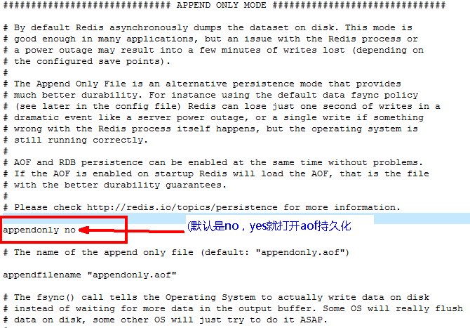

即：在redis.conf文件里配置，截图上的改成`appendonly yes`。

**持久化策略**

通过Appendfsync配置

- Appendfsync Always

> `每次发生`数据`变更`会被立即`记录`到磁盘，`性能较差`但`数据完整性比较好`

- Appendfsync Everysec

> 出厂默认推荐，异步操作，`每秒`记录，如果`一秒`内`宕机`，有数据`丢失`

## AOF启动/恢复/修复

同样我们需要将AOF文件`加载`到`内存`中之后才能`使用`，如果`AOF`文件被`破坏`了，我们该如何`修复`呢？

- 正常恢复到内存中

> 将有数据的aof文件复制一份保存到对应目录，目录路径可以通过`config get dir`命令获取，重新启动Redis就可以了

- 异常恢复文件到内存中

> 备份异常AOF文件，使用命令对文件进行修复：`redis-check-aof --fix 文件名`，然后重新启动Redis就可以了

## Rewrite重写AOF文件

**什么是Rewrite**

> AOF采用`文件追加`方式，文件会`越来越大`为避免出现此种情况，新增了重写机制。

> 当AOF`文件的大小`超过所设定的`阈值`时，Redis就会`启动`AOF文件的内容`压缩`，只保留可以恢复数据的`最小指令集`.可以使用命令`bgrewriteaof`进行重写文件

**Rewrite原理**

> AOF文件持续增长而过大时，会fork出一条`新进程`来将文件重写(也是先写临时文件最后再rename)。

> 遍历`新进程`的内存中数据，每条记录有一条的Set语句。重写aof文件的操作，并没有读取旧的aof文件。

> 而是将整个内存中的数据库内容用命令的方式重写了一个`新的aof`文件，这点和快照有点类似

**触发重写机制**

> Redis会记录上次重写时的AOF大小，默认配置是当AOF文件大小是上次rewrite后大小的一倍，且文件大于64M时触发

## AOF优势/劣势

**优势**

- 每次修改同步：appendfsync always同步持久化，每次发生数据变更会被立即记录到磁盘，性能较差但数据完整性比较好

- 每秒同步：appendfsync everysec异步操作，每秒记录，如果一秒内宕机，仅一秒内的数据丢失

**劣势**

- 相同数据集的数据而言aof文件要远大于rdb文件，恢复速度慢于rdb

- Aof运行效率要慢于rdb,每秒同步策略效率较好，不同步效率和rdb相同

## AOF总结

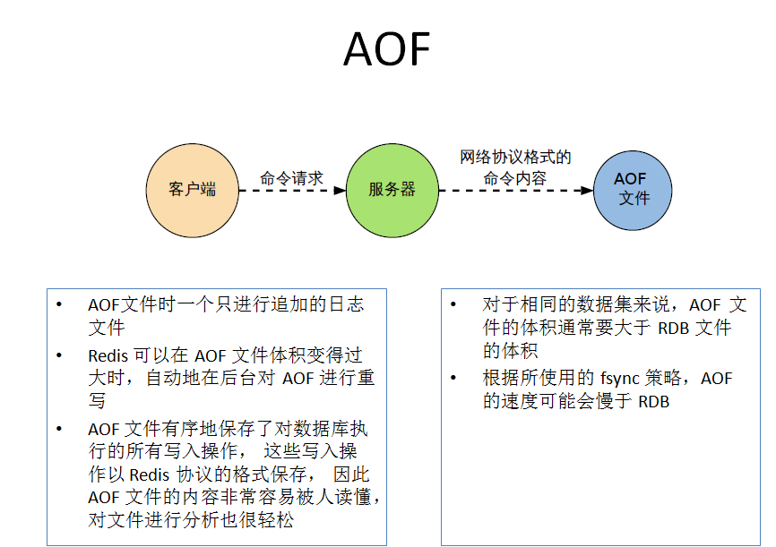


## Redis 管道 Pipeline  


在某些场景下我们在**一次操作中可能需要执行多个命令**，而如果我们只是一个命令一个命令去执行则会浪费很多网络消耗时间，如果将命令一次性传输到 `Redis`中去再执行，则会减少很多开销时间。但是需要注意的是 `pipeline`中的命令并不是原子性执行的，也就是说管道中的命令到达 `Redis`服务器的时候可能会被其他的命令穿插

## Redis集群方案什么情况下会导致整个集群不可用？


有A，B，C三个节点的集群,在没有复制模型的情况下,如果节点B失败了，那么整个集群就会以为缺少5501-11000这个范围的槽而不可用。

## Redis集群最大节点个数是多少？

16384个


## 为什么Redis需要把所有数据放到内存中？

Redis为了达到最快的读写速度将数据都读到内存中，并通过异步的方式将数据写入磁盘。所以Redis具有快速和数据持久化的特征。如果不将数据放在内存中，磁盘I/O速度为严重影响Redis的性能。在内存越来越便宜的今天，Redis将会越来越受欢迎。如果设置了最大使用的内存，则数据已有记录数达到内存限值后不能继续插入新值。


## Redis的内存用完了会发生什么？


如果达到设置的上限，Redis的写命令会返回错误信息（但是读命令还可以正常返回。）或者你可以将Redis当缓存来使用配置淘汰机制，当Redis达到内存上限时会冲刷掉旧的内容。


## Redis 的回收策略（淘汰策略）

Redis是不断的删除一些过期数据，但是很多没有设置过期时间的数据也会越来越多，那么Redis内存不够用的时候是怎么处理的呢？答案就是淘汰策略。此类的

当Redis的内存超过最大允许的内存之后，Redis会触发内存淘汰策略，删除一些不常用的数据，以保证Redis服务器的正常运行。

**Redisv4.0前提供 6种数据淘汰策略**：

- volatile-lru：利用LRU算法移除设置过过期时间的key (LRU:最近使用 Least Recently Used )，从已设置过期时间的数据集（ server.db[i].expires）中挑选最近最少使用的数据淘汰，只限于设置了 expire 的部分; 优先删除最近最少使用(less recently used ,LRU) 的 key。
- allkeys-lru：当内存不足以容纳新写入数据时，在键空间中，移除最近最少使用的key（这个是最常用的），从数据集（ server.db[i].dict） 中挑选最近最少使用的数据淘汰，所有key通用; 优先删除最近最少使用(less recently used ,LRU) 的 key。
- volatile-ttl：从已设置过期时间的数据集（server.db[i].expires）中挑选将要过期的数据淘汰，只限于设置了 **expire** 的部分; 优先删除剩余时间(time to live,TTL) 短的key。
- volatile-random：从已设置过期时间的数据集（server.db[i].expires）中任意选择数据淘汰，只限于设置了 **expire** 的部分; 随机删除一部分 key。
- allkeys-random：从数据集（server.db[i].dict）中任意选择数据淘汰，所有key通用; 随机删除一部分 key。
- no-eviction：禁止驱逐数据，也就是说当内存不足以容纳新写入数据时，新写入操作会报错。这个应该没人使用吧！ 不删除策略, 达到最大内存限制时, 如果需要更多内存, 直接返回错误信息。大多数写命令都会导致占用更多的内存(有极少数会例外。

注意这里的 6 种机制，volatile 和 allkeys 规定了是对已设置过期时间的数据集淘汰数据还是从全部数据集淘汰数据， 后面的 lru、ttl 以及 random 是三种不同的淘汰策略， 再加上一种 no-enviction 永不回收的策略。

**Redisv4.0后增加以下两种**：

- volatile-lfu：从已设置过期时间的数据集(server.db[i].expires)中挑选最不经常使用的数据淘汰(LFU(Least Frequently Used)算法，也就是最频繁被访问的数据将来最有可能被访问到)
- allkeys-lfu：当内存不足以容纳新写入数据时，在键空间中，移除最不经常使用的key。

内存淘汰策略可以通过配置文件来修改，Redis.conf对应的配置项是maxmemory-policy 修改对应的值就行，默认是noeviction。

使用策略规则：

**1、** 如果数据呈现幂律分布，也就是一部分数据访问频率高，一部分数据访问频率   低， 则使用 allkeys-lru

**2、** 如果数据呈现平等分布， 也就是所有的数据访问频率都相同， 则使用allkeys-random

## Redis过期键的删除策略

**Redis的过期删除策略就是：惰性删除和定期删除两种策略配合使用。**

**惰性删除**：惰性删除不会去主动删除数据，而是在访问数据的时候，再检查当前键值是否过期，如果过期则执行删除并返回 null 给客户端，如果没有过期则返回正常信息给客户端。它的优点是简单，不需要对过期的数据做额外的处理，只有在每次访问的时候才会检查键值是否过期，缺点是删除过期键不及时，造成了一定的空间浪费。

**定期删除**：Redis会周期性的随机测试一批设置了过期时间的key并进行处理。测试到的已过期的key将被删除。

附：删除key常见的三种处理方式。

**1、定时删除**

在设置某个key 的过期时间同时，我们创建一个定时器，让定时器在该过期时间到来时，立即执行对其进行删除的操作。

优点：定时删除对内存是最友好的，能够保存内存的key一旦过期就能立即从内存中删除。

缺点：对CPU最不友好，在过期键比较多的时候，删除过期键会占用一部分 CPU 时间，对服务器的响应时间和吞吐量造成影响。

**2、惰性删除**

设置该key 过期时间后，我们不去管它，当需要该key时，我们在检查其是否过期，如果过期，我们就删掉它，反之返回该key。

优点：对 CPU友好，我们只会在使用该键时才会进行过期检查，对于很多用不到的key不用浪费时间进行过期检查。

缺点：对内存不友好，如果一个键已经过期，但是一直没有使用，那么该键就会一直存在内存中，如果数据库中有很多这种使用不到的过期键，这些键便永远不会被删除，内存永远不会释放。从而造成内存泄漏。

**3、定期删除**

每隔一段时间，我们就对一些key进行检查，删除里面过期的key。

优点：可以通过限制删除操作执行的时长和频率来减少删除操作对 CPU 的影响。另外定期删除，也能有效释放过期键占用的内存。

缺点：难以确定删除操作执行的时长和频率。如果执行的太频繁，定期删除策略变得和定时删除策略一样，对CPU不友好。如果执行的太少，那又和惰性删除一样了，过期键占用的内存不会及时得到释放。另外最重要的是，在获取某个键时，如果某个键的过期时间已经到了，但是还没执行定期删除，那么就会返回这个键的值，这是业务不能忍受的错误。

## Redis数据过期后的删除策略?

常用的过期数据的删除策略就两个(重要!自己造缓存轮子的时候需要格外考虑的东西):

1. 惰性删除 :只会在取出key的时候才对数据进行过期检查。这样对CPU最友好,但是可能会造成太多过期 key 没有被删除。
2. 定期删除 : 每隔一段时间抽取一批 key 执行删除过期key操作。并且,Redis 底层会通过限制删除操作执行的时长和频率来减少删除操作对CPU时间的影响。

定期删除对内存更加友好,惰性删除对CPU更加友好。两者各有千秋,所以Redis采用的是定期删除+惰性/懒汉式删除 。

但是,仅仅通过给 key 设置过期时间还是有问题的。因为还是可能存在定期删除和惰性删除漏掉了很多过期 key 的情况。这样就导致大量过期 key 堆积在内存里,然后就Out of memory了。


## 假如Redis里面有1亿个key，其中有10w个key是以某个固定的已知的前缀开头的，如果将它们全部找出来？


使用keys指令可以扫出指定模式的key列表。

对方接着追问：如果这个Redis正在给线上的业务提供服务，那使用keys指令会有什么问题？

这个时候你要回答Redis关键的一个特性：Redis的单线程的。keys指令会导致线程阻塞一段时间，线上服务会停顿，直到指令执行完毕，服务才能恢复。这个时候可以使用scan指令，scan指令可以无阻塞的提取出指定模式的key列表，但是会有一定的重复概率，在客户端做一次去重就可以了，但是整体所花费的时间会比直接用keys指令长。

## 一个Redis实例最多能存放多少的keys？List、Set、Sorted Set他们最多能存放多少元素？


理论上Redis可以处理多达232的keys，并且在实际中进行了测试，每个实例至少存放了2亿5千万的keys。我们正在测试一些较大的值。任何list、set、和sorted set都可以放232个元素。换句话说，Redis的存储极限是系统中的可用内存值。


## 为什么要做Redis分区？ 


分区可以让Redis管理更大的内存，Redis将可以使用所有机器的内存。如果没有分区，你最多只能使用一台机器的内存。分区使Redis的计算能力通过简单地增加计算机得到成倍提升,Redis的网络带宽也会随着计算机和网卡的增加而成倍增长。


## 定时删除


优点：对内存友好，定时删除策略可以保证过期键会尽可能快地被删除，并释放国期间所占用的内存

缺点：对cpu时间不友好，在过期键比较多时，删除任务会占用很大一部分cpu时间，在内存不紧张但cpu时间紧张的情况下，将cpu时间用在删除和当前任务无关的过期键上，影响服务器的响应时间和吞吐量


## Redis分布式锁实现

先拿setnx来争抢锁，抢到之后，再用expire给锁加一个过期时间防止锁忘记了释放。如果在setnx之后执行expire之前进程意外crash或者要重启维护了，那会怎么样？set指令有非常复杂的参数，这个应该是可以同时把setnx和expire合成一条指令来用的！

## 使用过Redis分布式锁么，它是什么回事？


先拿setnx来争抢锁，抢到之后，再用expire给锁加一个过期时间防止锁忘记了释放。

这时候对方会告诉你说你回答得不错，然后接着问如果在setnx之后执行expire之前进程意外crash或者要重启维护了，那会怎么样？

这时候你要给予惊讶的反馈：唉，是喔，这个锁就永远得不到释放了。紧接着你需要抓一抓自己得脑袋，故作思考片刻，好像接下来的结果是你主动思考出来的，然后回我记得set指令有非常复杂的参数，这个应该是可以同时把setnx和expire合成一条指令来用的！对方这时会显露笑容，心里开始默念：摁，这小子还不错。

## 什么是分布式锁？为什么用分布式锁？

锁在程序中的作用就是同步工具，保证共享资源在同一时刻只能被一个线程访问，Java中的锁我们都很熟悉了，像synchronized 、Lock都是我们经常使用的，但是Java的锁只能保证单机的时候有效，分布式集群环境就无能为力了，这个时候我们就需要用到分布式锁。

分布式锁，顾名思义，就是分布式项目开发中用到的锁，可以用来控制分布式系统之间同步访问共享资源。

思路是：在整个系统提供一个**全局、唯一**的获取锁的“东西”，然后每个系统在需要加锁时，都去问这个“东西”拿到一把锁，这样不同的系统拿到的就可以认为是同一把锁。至于这个“东西”，可以是Redis、Zookeeper，也可以是数据库。

一般来说，分布式锁需要满足的特性有这么几点：

1、互斥性：在任何时刻，对于同一条数据，只有一台应用可以获取到分布式锁；

2、高可用性：在分布式场景下，一小部分服务器宕机不影响正常使用，这种情况就需要将提供分布式锁的服务以集群的方式部署；

3、防止锁超时：如果客户端没有主动释放锁，服务器会在一段时间之后自动释放锁，防止客户端宕机或者网络不可达时产生死锁；

4、独占性：加锁解锁必须由同一台服务器进行，也就是锁的持有者才可以释放锁，不能出现你加的锁，别人给你解锁了。

## 常见的分布式锁有哪些解决方案？

实现分布式锁目前有三种流行方案，即基于关系型数据库、Redis、ZooKeeper 的方案

 1、基于关系型数据库，如MySQL
基于关系型数据库实现分布式锁，是依赖数据库的唯一性来实现资源锁定，比如主键和唯一索引等。

缺点：

* 这把锁强依赖数据库的可用性，数据库是一个单点，一旦数据库挂掉，会导致业务系统不可用。
* 这把锁没有失效时间，一旦解锁操作失败，就会导致锁记录一直在数据库中，其他线程无法再获得到锁。
* 这把锁只能是非阻塞的，因为数据的insert操作，一旦插入失败就会直接报错。没有获得锁的线程并不会进入排队队列，要想再次获得锁就要再次触发获得锁操作。
* 这把锁是非重入的，同一个线程在没有释放锁之前无法再次获得该锁。因为数据中数据已经存在了。

2、基于Redis实现

优点：

Redis 锁实现简单，理解逻辑简单，性能好，可以支撑高并发的获取、释放锁操作。

缺点：

* Redis 容易单点故障，集群部署，并不是强一致性的，锁的不够健壮；
* key 的过期时间设置多少不明确，只能根据实际情况调整；
* 需要自己不断去尝试获取锁，比较消耗性能。

3、基于zookeeper

优点：

zookeeper 天生设计定位就是分布式协调，强一致性，锁很健壮。如果获取不到锁，只需要添加一个监听器就可以了，不用一直轮询，性能消耗较小。

缺点：

在高请求高并发下，系统疯狂的加锁释放锁，最后 zk 承受不住这么大的压力可能会存在宕机的风险。

## Redis实现分布式锁

分布式锁的三个核心要素

1、加锁

使用setnx来加锁。key是锁的唯一标识，按业务来决定命名，value这里设置为test。

```
setx key test
```

当一个线程执行setnx返回1，说明key原本不存在，该线程成功得到了锁；当一个线程执行setnx返回0，说明key已经存在，该线程抢锁失败；

2、解锁

有加锁就得有解锁。当得到的锁的线程执行完任务，需要释放锁，以便其他线程可以进入。释放锁的最简单方式就是执行del指令。

```
del key
```

释放锁之后，其他线程就可以继续执行setnx命令来获得锁。

3、锁超时

锁超时知道的是：如果一个得到锁的线程在执行任务的过程中挂掉，来不及显式地释放锁，这块资源将会永远被锁住，别的线程北向进来。

所以，setnx的key必须设置一个超时时间，以保证即使没有被显式释放，这把锁也要在一段时间后自动释放。setnx不支持超时参数，所以需要额外指令，

```
expire key 30
```

上述分布式锁存在的问题

**通过上述`setnx` 、`del`和`expire`实现的分布式锁还是存在着一些问题。**

1、SETNX 和 EXPIRE 非原子性

假设一个场景中，某一个线程刚执行setnx，成功得到了锁。此时setnx刚执行成功，还未来得及执行expire命令，节点就挂掉了。此时这把锁就没有设置过期时间，别的线程就再也无法获得该锁。

**解决措施:**

由于`setnx`指令本身是不支持传入超时时间的，而在Redis2.6.12版本上为`set`指令增加了可选参数, 用法如下：

```
SET key value [EX seconds][PX milliseconds] [NX|XX]
```

- EX second: 设置键的过期时间为second秒；
- PX millisecond：设置键的过期时间为millisecond毫秒；
- NX：只在键不存在时，才对键进行设置操作；
- XX：只在键已经存在时，才对键进行设置操作；
- SET操作完成时，返回OK，否则返回nil。

2、锁误解除

如果线程 A 成功获取到了锁，并且设置了过期时间 30 秒，但线程 A 执行时间超过了 30 秒，锁过期自动释放，此时线程 B 获取到了锁；随后 A 执行完成，线程 A 使用 DEL 命令来释放锁，但此时线程 B 加的锁还没有执行完成，线程 A 实际释放的线程 B 加的锁。

**解决办法：**

在del释放锁之前加一个判断，验证当前的锁是不是自己加的锁。

具体在加锁的时候把当前线程的id当做value，可生成一个 UUID 标识当前线程，在删除之前验证key对应的value是不是自己线程的id。

还可以使用 lua 脚本做验证标识和解锁操作。

3、超时解锁导致并发

如果线程 A 成功获取锁并设置过期时间 30 秒，但线程 A 执行时间超过了 30 秒，锁过期自动释放，此时线程 B 获取到了锁，线程 A 和线程 B 并发执行。

A、B 两个线程发生并发显然是不被允许的，一般有两种方式解决该问题：

- 将过期时间设置足够长，确保代码逻辑在锁释放之前能够执行完成。
- 为获取锁的线程增加守护线程，为将要过期但未释放的锁增加有效时间。

4、不可重入

当线程在持有锁的情况下再次请求加锁，如果一个锁支持一个线程多次加锁，那么这个锁就是可重入的。如果一个不可重入锁被再次加锁，由于该锁已经被持有，再次加锁会失败。Redis 可通过对锁进行重入计数，加锁时加 1，解锁时减 1，当计数归 0 时释放锁。

5、无法等待锁释放

上述命令执行都是立即返回的，如果客户端可以等待锁释放就无法使用。

- 可以通过客户端轮询的方式解决该问题，当未获取到锁时，等待一段时间重新获取锁，直到成功获取锁或等待超时。这种方式比较消耗服务器资源，当并发量比较大时，会影响服务器的效率。
- 另一种方式是使用 Redis 的发布订阅功能，当获取锁失败时，订阅锁释放消息，获取锁成功后释放时，发送锁释放消息。

具体实现参考：https://xiaomi-info.github.io/2019/12/17/Redis-distributed-lock/


## Redis做异步队列


一般使用list结构作为队列，rpush生产消息，lpop消费消息。当lpop没有消息的时候，要适当sleep一会再重试。缺点：在消费者下线的情况下，生产的消息会丢失，得使用专业的消息队列如rabbitmq等。能不能生产一次消费多次呢？使用pub/sub主题订阅者模式，可以实现1:N的消息队列。


## WATCH命令和基于CAS的乐观锁


在Redis的事务中，WATCH命令可用于提供CAS(check-and-set)功能。假设我们通过WATCH命令在事务执行之前监控了多个Keys，倘若在WATCH之后有任何Key的值发生了变化，EXEC命令执行的事务都将被放弃，同时返回Null multi-bulk应答以通知调用者事务

执行失败。例如，我们再次假设Redis中并未提供incr命令来完成键值的原子性递增，如果要实现该功能，我们只能自行编写相应的代码。其伪码如下：

```
val = GET mykey
val = val + 1
SET mykey $val
```

以上代码只有在单连接的情况下才可以保证执行结果是正确的，因为如果在同一时刻有多个客户端在同时执行该段代码，那么就会出现多线程程序中经常出现的一种错误场景--竞态争用(race condition)。

比如，客户端A和B都在同一时刻读取了mykey的原有值，假设该值为10，此后两个客户端又均将该值加一后set回Redis服务器，这样就会导致mykey的结果为11，而不是我们认为的12。为了解决类似的问题，我们需要借助WATCH命令的帮助，见如下代码：

```
WATCH mykey
val = GET mykey
val = val + 1
MULTI
SET mykey $val
EXEC
```

和此前代码不同的是，新代码在获取mykey的值之前先通过WATCH命令监控了该键，此后又将set命令包围在事务中，这样就可以有效的保证每个连接在执行EXEC之前，如果当前连接获取的mykey的值被其它连接的客户端修改，那么当前连接的EXEC命令将执行失败。这样调用者在判断返回值后就可以获悉val是否被重新设置成功。


## 查看Redis使用情况及状态信息用什么命令？


info

## 修改配置不重启Redis会实时生效吗？


针对运行实例，有许多配置选项可以通过 CONFIG SET 命令进行修改，而无需执行任何形式的重启。 从 Redis 2.2 开始，可以从 AOF 切换到 RDB 的快照持久性或其他方式而不需要重启 Redis。检索 ‘CONFIG GET *’ 命令获取更多信息。

但偶尔重新启动是必须的，如为升级 Redis 程序到新的版本，或者当你需要修改某些目前 CONFIG 命令还不支持的配置参数的时候。


## 是否使用过 Redis 集群，集群的原理是什么？


**1、** Redis Sentinal 着眼于高可用， 在 master 宕机时会自动将 slave 提升为master， 继续提供服务。

**2、** Redis Cluster 着眼于扩展性， 在单个 Redis 内存不足时， 使用 Cluster 进行分片存储。


## 缓存并发问题 


这里的并发指的是多个Redis的client同时set key引起的并发问题。比较有效的解决方案就是把Redis.set操作放在队列中使其串行化，必须的一个一个执行，具体的代码就不上了，当然加锁也是可以的，至于为什么不用Redis中的事务，留给各位看官自己思考探究。


## Reids主从复制

复制是高可用Redis的基础，哨兵和集群都是在复制基础上实现高可用的。复制主要实现了数据的多机备份，以及对于读操作的负载均衡和简单的故障恢复。缺陷：故障恢复无法自动化；写操作无法负载均衡；存储能力受到单机的限制。

## 介绍下Redis多副本（主从）

Redis多副本，采用主从（replication）部署结构，相较于单副本而言最大的特点就是主从实例间数据实时同步，并且提供数据持久化和备份策略。主从实例部署在不同的物理服务器上，根据公司的基础环境配置，可以实现同时对外提供服务和读写分离策略。

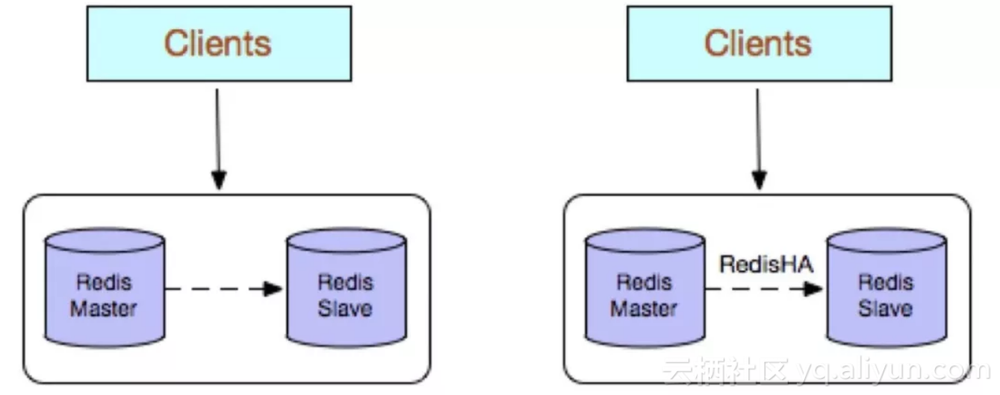

**优点：**

*  高可靠性：一方面，采用双机主备架构，能够在主库出现故障时自动进行主备切换，从库提升为主库提供服务，保证服务平稳运行；另一方面，开启数据持久化功能和配置合理的备份策略，能有效的解决数据误操作和数据异常丢失的问题；
*  读写分离策略：从节点可以扩展主库节点的读能力，有效应对大并发量的读操作。

**缺点：**

* 故障恢复复杂，如果没有RedisHA系统（需要开发），当主库节点出现故障时，需要手动将一个从节点晋升为主节点，同时需要通知业务方变更配置，并且需要让其它从库节点去复制新主库节点，整个过程需要人为干预，比较繁琐；
* 主库的写能力受到单机的限制，可以考虑分片；
* 主库的存储能力受到单机的限制，可以考虑Pika；
* 原生复制的弊端在早期的版本中也会比较突出，如：Redis复制中断后，Slave会发起psync，此时如果同步不成功，则会进行全量同步，主库执行全量备份的同时可能会造成毫秒或秒级的卡顿；又由于COW机制，导致极端情况下的主库内存溢出，程序异常退出或宕机；主库节点生成备份文件导致服务器磁盘IO和CPU（压缩）资源消耗；发送数GB大小的备份文件导致服务器出口带宽暴增，阻塞请求，建议升级到最新版本。

## 了解主从复制的原理吗？

**1、主从架构的核心原理**

当启动一个slave node的时候，它会发送一个PSYNC命令给master node

如果这是slave node重新连接master node，那么master node仅仅会复制给slave部分缺少的数据; 否则如果是slave node第一次连接master node，那么会触发一次full resynchronization

开始full resynchronization的时候，master会启动一个后台线程，开始生成一份RDB快照文件，同时还会将从客户端收到的所有写命令缓存在内存中。RDB文件生成完毕之后，master会将这个RDB发送给slave，slave会先写入本地磁盘，然后再从本地磁盘加载到内存中。然后master会将内存中缓存的写命令发送给slave，slave也会同步这些数据。

slave node如果跟master node有网络故障，断开了连接，会自动重连。master如果发现有多个slave node都来重新连接，仅仅会启动一个rdb save操作，用一份数据服务所有slave node。

**2、主从复制的断点续传**

从Redis 2.8开始，就支持主从复制的断点续传，如果主从复制过程中，网络连接断掉了，那么可以接着上次复制的地方，继续复制下去，而不是从头开始复制一份

master node会在内存中常见一个backlog，master和slave都会保存一个replica offset还有一个master id，offset就是保存在backlog中的。如果master和slave网络连接断掉了，slave会让master从上次的replica offset开始继续复制

但是如果没有找到对应的offset，那么就会执行一次resynchronization

**3、无磁盘化复制**

master在内存中直接创建rdb，然后发送给slave，不会在自己本地落地磁盘了

repl-diskless-sync repl-diskless-sync-delay，等待一定时长再开始复制，因为要等更多slave重新连接过来

**4、过期key处理**

slave不会过期key，只会等待master过期key。如果master过期了一个key，或者通过LRU淘汰了一个key，那么会模拟一条del命令发送给slave。

## 由于主从延迟导致读取到过期数据怎么处理？

1. 通过scan命令扫库：当Redis中的key被scan的时候，相当于访问了该key，同样也会做过期检测，充分发挥Redis惰性删除的策略。这个方法能大大降低了脏数据读取的概率，但缺点也比较明显，会造成一定的数据库压力，否则影响线上业务的效率。
2. Redis加入了一个新特性来解决主从不一致导致读取到过期数据问题，增加了key是否过期以及对主从库的判断，如果key已过期，当前访问的master则返回null；当前访问的是从库，且执行的是只读命令也返回null。

## 主从复制的过程中如果因为网络原因停止复制了会怎么样？

如果出现网络故障断开连接了，会自动重连的，从Redis 2.8开始，就支持主从复制的断点续传，可以接着上次复制的地方，继续复制下去，而不是从头开始复制一份。

master如果发现有多个slave node都来重新连接，仅仅会启动一个rdb save操作，用一份数据服务所有slave node。

master node会在内存中创建一个`backlog`，master和slave都会保存一个`replica offset`，还有一个`master id`，offset就是保存在backlog中的。如果master和slave网络连接断掉了，slave会让master从上次的replica offset开始继续复制。

但是如果没有找到对应的offset，那么就会执行一次`resynchronization`全量复制。

## Redis主从架构数据会丢失吗，为什么？

有两种数据丢失的情况：

1. 异步复制导致的数据丢失：因为master -> slave的复制是异步的，所以可能有部分数据还没复制到slave，master就宕机了，此时这些部分数据就丢失了。
2. 脑裂导致的数据丢失：某个master所在机器突然脱离了正常的网络，跟其他slave机器不能连接，但是实际上master还运行着，此时哨兵可能就会认为master宕机了，然后开启选举，将其他slave切换成了master。这个时候，集群里就会有两个master，也就是所谓的脑裂。此时虽然某个slave被切换成了master，但是可能client还没来得及切换到新的master，还继续写向旧master的数据可能也丢失了。因此旧master再次恢复的时候，会被作为一个slave挂到新的master上去，自己的数据会清空，重新从新的master复制数据。

## 如何解决主从架构数据丢失的问题？

数据丢失的问题是不可避免的，但是我们可以尽量减少。

在Redis的配置文件里设置参数

```
min-slaves-to-write 1
min-slaves-max-lag 10
```

`min-slaves-to-write`默认情况下是0，`min-slaves-max-lag`默认情况下是10。

上面的配置的意思是要求至少有1个slave，数据复制和同步的延迟不能超过10秒。如果说一旦所有的slave，数据复制和同步的延迟都超过了10秒钟，那么这个时候，master就不会再接收任何请求了。

减小`min-slaves-max-lag`参数的值，这样就可以避免在发生故障时大量的数据丢失，一旦发现延迟超过了该值就不会往master中写入数据。

那么对于client，我们可以采取降级措施，将数据暂时写入本地缓存和磁盘中，在一段时间后重新写入master来保证数据不丢失；也可以将数据写入kafka消息队列，隔一段时间去消费kafka中的数据。

## Redis主从复制

概念

Redis的主从复制概念和MySQL的主从复制大概类似。一台`主机master`，一台`从机slaver`。master主机数据更新后根据配置和策略，自动同步到slaver从机，Master以`写为主`，Slave以`读为主`。


主要用途 

- `读写分离`：适用于读多写少的应用，增加多个从机，提高读的速度，提高程序并发

- `数据容灾恢复`：从机复制主机的数据，相当于数据备份，如果主机数据丢失，那么可以通过从机存储的数据进行恢复。

- `高并发、高可用集群实现的基础`：在高并发的场景下，就算主机挂了，从机可以进行`主从切换`，从机自动成为主机对外提供服务。

## 一主多从配置

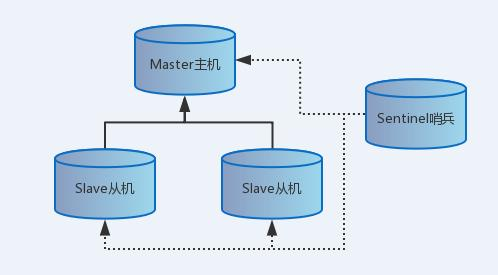

环境准备

老哥太穷了，就用一台机器模拟三个机器。

- `第一步：`将redis.conf复制3份，分别是redis6379.conf、redis6380.conf、redis6381.conf

- `第二步：` 修改三个redis.conf文件里的port端口、pid文件名、日志文件名、rdb文件名

- `第三步：` 分别打开三个窗口模拟三台服务器，并开启redis服务。

查看当前3台机器主从角色

先用命令`info replication`看看3台机器目前的`角色`是什么。

```
# 三台机器都是这个状态
127.0.0.1:6379> info replication
# 角色是master主机
role:master
# 从机个数为0
connected_slaves:0
```

设置主从关系

这里注意，我们只设置从机就可以了，不用设置主机。我们选择`6380`和`6381`作为`从机`。`6379`作为`主机`。

```
# 6380 端口
127.0.0.1:6380> SLAVEOF 127.0.0.1 6379

# 6381 端口
127.0.0.1:6381> SLAVEOF 127.0.0.1 6379
```

再次查看3台机器目前角色

再次执行命令：`info replication`

```
# 主机
127.0.0.1:6379> info replication
role:master # 角色：主机
connected_slaves:2 #连接的从机个数，以及从机IP和端口
slave0:ip=127.0.0.1,port=6380,state=online,offset=98,lag=1
slave1:ip=127.0.0.1,port=6381,state=online,offset=98,lag=1

# 从机1
127.0.0.1:6380> info replication
role:slave # 角色：从机
master_host:127.0.0.1 # 主机的IP和端口
master_port:6379

# 从机2
127.0.0.1:6381> info replication
role:slave # 角色：从机
master_host:127.0.0.1 # 主机的IP和端口
master_port:6379
```

搭建成功，试验一把

- `全量复制：` 从机会把主机之前的数据全部都同步过来，大家可以在从机上get 某key试试。

- `增量复制：` 当主机新增数据时，从机会将该新增数据同步过来，大家可以在主机上执行命令set key value，然后在从机上get 该key，看是否能获取到。

读写分离

Redis的从机`默认`不允许进行`写操作`，大家可以在从机上执行命令`set key value`，会报错。

```
# 6380从机
127.0.0.1:6380> set k3 v3
(error) READONLY You can't write against a read only slave.
```

## 主从复制原理

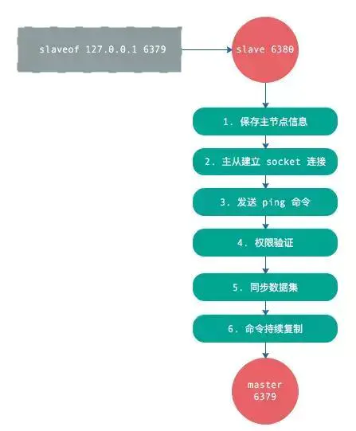

全量复制

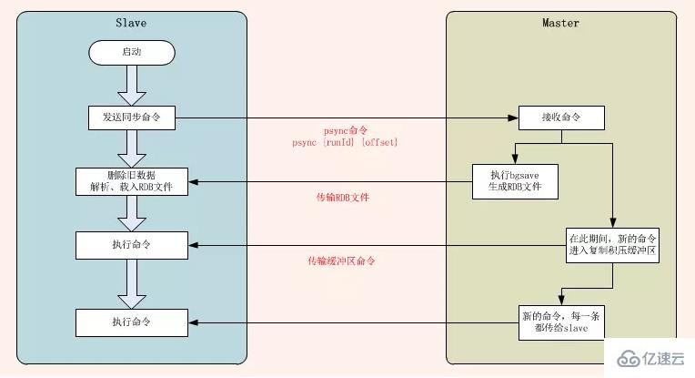

**①**slave发送psync，由于是第一次复制，不知道master的runid，自然也不知道offset，所以发送psync ？ -1

**②**master收到请求，发送master的runid和offset给从节点。

**③**从节点slave保存master的信息

**④**主节点bgsave保存rdb文件

**⑤**主机点发送rdb文件

并且在**④**和**⑤**的这个过程中产生的数据，会写到复制缓冲区repl_back_buffer之中去。

**⑥**主节点发送上面两个步骤产生的buffer到从节点slave

**⑦**从节点清空原来的数据，如果它之前有数据，那么久会清空数据

**⑧**从节点slave把rdb文件的数据装载进自身。

## Redis如何做内存优化？

*  尽可能使用散列表（hashes），散列表（是说散列表里面存储的数少）使用的内存非常小，所以你应该尽可能的将你的数据模型抽象到一个散列表里面。比如你的web系统中有一个用户对象，不要为这个用户的名称，姓氏，邮箱，密码设置单独的key,而是应该把这个用户的所有信息存储到一张散列表里面.
*  **控制key的数量**。当使用Redis存储大量数据时，通常会存在大量键，过多的键同样会消耗大量内存。Redis本质是一个数据结构服务器，它为我们提供多种数据结构，如hash，list，set，zset 等结构。使用Redis时不要进入一个误区，大量使用get/set这样的API，把Redis当成Memcached使用。对于存储相同的数据内容利用Redis的数据结构降低外层键的数量，也可以节省大量内存。
*  **缩减键值对象**，降低Redis内存使用最直接的方式就是缩减键（key）和值（value）的长度。

   - key长度：如在设计键时，在完整描述业务情况下，键值越短越好。
   - value长度：值对象缩减比较复杂，常见需求是把业务对象序列化成二进制数组放入Redis。首先应该在业务上精简业务对象，去掉不必要的属性避免存储无效数据。其次在序列化工具选择上，应该选择更高效的序列化工具来降低字节数组大小。
*  **编码优化**。Redis对外提供了string,list,hash,set,zet等类型，但是Redis内部针对不同类型存在编码的概念，所谓编码就是具体使用哪种底层数据结构来实现。编码不同将直接影响数据的内存占用和读写效率。可参考文章：https://cloud.tencent.com/developer/article/1162213


## Pipeline有什么好处，为什么要用pipeline？


可以将多次IO往返的时间缩减为一次，前提是pipeline执行的指令之间没有因果相关性。使用Redis-benchmark进行压测的时候可以发现影响Redis的QPS峰值的一个重要因素是pipeline批次指令的数目。


## Redis常用管理命令


```
# dbsize 返回当前数据库 key 的数量。
# info 返回当前 Redis 服务器状态和一些统计信息。
# monitor 实时监听并返回Redis服务器接收到的所有请求信息。
# shutdown 把数据同步保存到磁盘上，并关闭Redis服务。
# config get parameter 获取一个 Redis 配置参数信息。（个别参数可能无法获取）
# config set parameter value 设置一个 Redis 配置参数信息。（个别参数可能无法获取）
# config resetstat 重置 info 命令的统计信息。（重置包括：keyspace 命中数、
# keyspace 错误数、 处理命令数，接收连接数、过期 key 数）
# debug object key 获取一个 key 的调试信息。
# debug segfault 制造一次服务器当机。
# flushdb 删除当前数据库中所有 key,此方法不会失败。小心慎用
# flushall 删除全部数据库中所有 key，此方法不会失败。小心慎用
```

## Redis持久化机制？

为了能够重用Redis数据，或者防止系统故障，我们需要将Redis中的数据写入到磁盘空间中，即持久化。

Redis提供了两种不同的持久化方法可以将数据存储在磁盘中，一种叫快照`RDB`，另一种叫只追加文件`AOF`。

**RDB**

在指定的时间间隔内将内存中的数据集快照写入磁盘(`Snapshot`)，它恢复时是将快照文件直接读到内存里。

**优势**：适合大规模的数据恢复；对数据完整性和一致性要求不高

**劣势**：在一定间隔时间做一次备份，所以如果Redis意外`down`掉的话，就会丢失最后一次快照后的所有修改。

**AOF**

以日志的形式来记录每个写操作，将Redis执行过的所有写指令记录下来(读操作不记录)，只许追加文件但不可以改写文件，Redis启动之初会读取该文件重新构建数据，换言之，Redis重启的话就根据日志文件的内容将写指令从前到后执行一次以完成数据的恢复工作。

AOF采用文件追加方式，文件会越来越大，为避免出现此种情况，新增了重写机制，当AOF文件的大小超过所设定的阈值时， Redis就会启动AOF文件的内容压缩，只保留可以恢复数据的最小指令集.。

**优势**

- 每修改同步：`appendfsync always` 同步持久化，每次发生数据变更会被立即记录到磁盘，性能较差但数据完整性比较好
- 每秒同步：`appendfsync everysec` 异步操作，每秒记录，如果一秒内宕机，有数据丢失
- 不同步：`appendfsync no`   从不同步

**劣势**

- 相同数据集的数据而言`aof`文件要远大于`rdb`文件，恢复速度慢于`rdb`
- `aof`运行效率要慢于`rdb`，每秒同步策略效率较好，不同步效率和`rdb`相同

## 如何选择合适的持久化方式

- 如果是数据不那么敏感，且可以从其他地方重新生成补回的，那么可以关闭持久化。
- 如果是数据比较重要，不想再从其他地方获取，且可以承受数分钟的数据丢失，比如缓存等，那么可以只使用RDB。
- 如果是用做内存数据库，要使用Redis的持久化，建议是RDB和AOF都开启，或者定期执行bgsave做快照备份，RDB方式更适合做数据的备份，AOF可以保证数据的不丢失。

**补充：Redis4.0 对于持久化机制的优化**

Redis4.0相对与3.X版本其中一个比较大的变化是4.0添加了新的混合持久化方式。

简单的说：新的AOF文件前半段是RDB格式的全量数据后半段是AOF格式的增量数据，如下图：


**优势**：混合持久化结合了RDB持久化 和 AOF 持久化的优点， 由于绝大部分都是RDB格式，加载速度快，同时结合AOF，增量的数据以AOF方式保存了，数据更少的丢失。

**劣势**：兼容性差，一旦开启了混合持久化，在4.0之前版本都不识别该aof文件，同时由于前部分是RDB格式，阅读性较差。

## Redis持久化数据和缓存怎么做扩容？

* 如果Redis被当做缓存使用，使用一致性哈希实现动态扩容缩容。

* 如果Redis被当做一个持久化存储使用，必须使用固定的keys-to-nodes映射关系，节点的数量一旦确定不能变化。否则的话(即Redis节点需要动态变化的情况），必须使用可以在运行时进行数据再平衡的一套系统，而当前只有Redis集群可以做到这样。

## 什么是Redis持久化?Redis有哪几种持久化方式?优缺点是什么?

持久化就是把内存的数据写到磁盘中去,防止服务宕机了内存数据丢失。Redis 提供了两种持久化方式:RDB(默认)快照方式 和AOF追加方式。

RDB(Redis DataBase:通过创建快照来获取存储在内存里面的数据在某个时间点上的副本。在创建快照之后,用户可以对快照进行备份,可以将快照复制到其他服务器从而创建相同数据的服务器副本。(如果系统真的发生崩溃,用户将丢失最近一次生成快照之后更改的所有数据。)

AOF(Append Only File:将被执行的写命令写到AOF文件的末尾。

比较:

1. AOF文件比RDB更新频率高,优先使用AOF还原数据。
2. AOF比RDB更安全也更大
3. RDB性能比AOF好
4. 如果两个都配了优先加载AOF

## RDB持久化

RDB持久化的机制是在`一段时间内`达到`某修改次数`，就把内存数据快照Snapshot`持久化`到硬盘上，比如：配置1分钟内修改100次，达到这个条件时，就会进行持久化操作。RDB文件格式是`dump.rdb`

如何配置


即：在redis.conf文件里配置，截图上的save \<seconds\> \<changes\> 

如：save 1 100（一分钟内修改100次）

如何停止：在redis.conf文件里配置`save ""`，或者通过命令`config set save ""`

## 触发RDB几种方式

- 自动触发

> 就是上面说的redis.conf里的save配置

- 手动触发

> 执行`save`命令：save时只管保存，其它不管，全部阻塞

> 执行`bgsave`命令：Redis会在后台异步进行快照操作，
> 快照同时还可以响应客户端请求。可以通过lastsave
> 命令获取最后一次成功执行快照的时间

> 执行`flushall`命令，也会产生dump.rdb文件，但里面是空的，无意义

## RDB优势与劣势

优势

- 适合大规模的数据恢复

- 对数据完整性和一致性要求不高

劣势

- 在一定间隔时间做一次备份，所以如果redis意外down掉的话，就会丢失最后一次快照后的所有修改。

- Fork的时候，内存中的数据被`克隆`了一份，`大致2倍`的膨胀性能需要考虑

## RDB总结

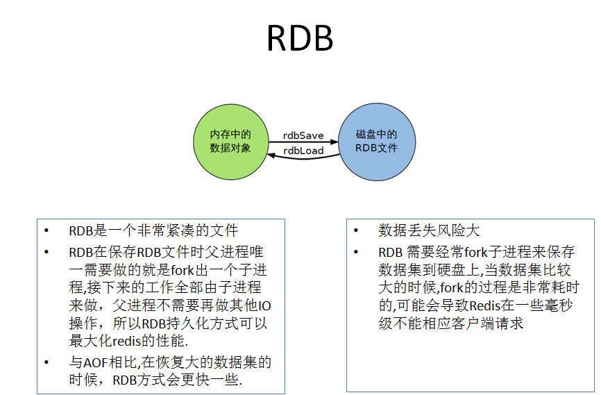

## 持久化原理-fork

Redis会单独创建（fork）一个子进程来进行持久化，会先将数据写入到
一个临时文件中，待持久化过程都结束了，再用这个临时文件替换上次持久化好的文件。

整个过程中，主进程是不进行任何IO操作的，这就确保了极高的性能，如果需要进行大规模数据的恢复，且对于数据恢复的完整性不是非常敏感。

那RDB方式要比AOF方式更加的高效。RDB的缺点是最后一次持久化后的数据可能丢失。

Fork的作用是复制一个与当前进程一样的进程。新进程的所有数据（变量、环境变量、程序计数器等），数值都和原进程一致，但是是一个全新的进程，并作为原进程的子进程。

## 将持久化文件重新加载到内存中

Redis是`基于内存`的，所以要将`硬盘`上的数据重新`加载到内存`中提供服务。

- 将备份文件 (dump.rdb) 移动到 redis 安装目录并启动服务即可，redis就会自动加载文件数据至内存了。Redis 服务器在载入 RDB 文件期间，会一直处于阻塞状态，直到载入工作完成为止。
- 获取 redis 的安装目录可以使用 config get dir 命令


## Twemproxy是什么？


Twemproxy是Twitter维护的（缓存）代理系统，代理Memcached的ASCII协议和Redis协议。它是单线程程序，使用c语言编写，运行起来非常快。它是采用Apache 2.0 license的开源软件。 Twemproxy支持自动分区，如果其代理的其中一个Redis节点不可用时，会自动将该节点排除（这将改变原来的keys-instances的映射关系，所以你应该仅在把Redis当缓存时使用Twemproxy)。 Twemproxy本身不存在单点问题，因为你可以启动多个Twemproxy实例，然后让你的客户端去连接任意一个Twemproxy实例。 Twemproxy是Redis客户端和服务器端的一个中间层，由它来处理分区功能应该不算复杂，并且应该算比较可靠的。


## Redis没有直接使用C字符串


(即以空字符’\0’结尾的字符数组)作为默认的字符串表示，而是使用了SDS。SDS是简单动态字符串(Simple Dynamic String)的缩写。


## Redis如何设置密码及验证密码？


设置密码：config set requirepass 123456

授权密码：auth 123456


## 一个 Redis 实例最多能存放多少的 keys？List、Set、Sorted Set 他们最多能存放多少元素?  


理论上 Redis 可以处理多达 232 的 keys，并且在实际中进行了测试，每个实例至少存放了 2 亿 5 千万的 keys。我们正在测试一些较大的值。任何 list、set、和 sorted set 都可以放 232 个元素。换句话说， Redis 的存储极限是系统中的可用内存值。


## MySQL里有2000w数据，Redis中只存20w的数据，如何保证Redis中的数据都是热点数据？

Redis内存数据集大小上升到一定大小的时候，就会施行数据淘汰策略。

其实面试除了考察Redis，不少公司都很重视高并发高可用的技术，特别是一线互联网公司，分布式、JVM、spring源码分析、微服务等知识点已是面试的必考题。我自己整理收集了一套系统的架构技术体系，针对当前互联网公司的技术需求以及结合主流技术，这些东西可能你们平时在工作中接触过，但是缺少的全面系统的学习，加入


## Redis还提供的高级工具 


像慢查询分析、性能测试、Pipeline、事务、Lua自定义命令、Bitmaps、HyperLogLog、/订阅、Geo等个性化功能。


## Pipeline 有什么好处，为什么要用pipeline？


可以将多次 IO 往返的时间缩减为一次，前提是 pipeline 执行的指令之间没有因果相关性。使用 Redis-benchmark 进行压测的时候可以发现影响 Redis 的 QPS 峰值的一个重要因素是 pipeline 批次指令的数目。


## Redis 集群方案什么情况下会导致整个集群不可用？


有 A， B， C 三个节点的集群,在没有复制模型的情况下,如果节点 B 失败了， 那么整个集群就会以为缺少 5501-11000 这个范围的槽而不可用。


## Redis 的内存用完了会发生什么？


如果达到设置的上限，Redis 的写命令会返回错误信息（ 但是读命令还可以正常返回。） 或者你可以将 Redis 当缓存来使用配置淘汰机制， 当 Redis 达到内存上限时会冲刷掉旧的内容。


## 删除key


```
del key1 key2 ...
```


## Redis 到底是怎么实现“附近的人”


```
GEOADD key longitude latitude member [longitude latitude member ...]
```

将给定的位置对象（纬度、经度、名字）添加到指定的key。其中，key为集合名称，member为该经纬度所对应的对象。在实际运用中，当所需存储的对象数量过多时，可通过设置多key(如一个省一个key)的方式对对象集合变相做sharding，避免单集合数量过多。

**成功插入后的返回值：**

```
(integer) N
```

其中N为成功插入的个数。


## Redis key的过期时间和永久有效分别怎么设置？


EXPIRE和PERSIST命令。


## 请用Redis和任意语言实现一段恶意登录保护的代码


限制1小时内每用户Id最多只能登录5次。具体登录函数或功能用空函数即可，不用详细写出。

用列表实现:列表中每个元素代表登陆时间,只要最后的第5次登陆时间和现在时间差不超过1小时就禁止登陆.用Python写的代码如下：

```
#!/usr/bin/env python3
import Redis  
import sys  
import time  
 
r = Redis.StrictRedis(host=’127.0.0.1′, port=6379, db=0)  
try:       
    id = sys.argv[1]
except:      
    print(‘input argument error’)    
    sys.exit(0)  
if r.llen(id) >= 5 and time.time() – float(r.lindex(id, 4)) <= 3600:      
    print(“you are forbidden logining”)
else:       
    print(‘you are allowed to login’)    
    r.lpush(id, time.time())    
    # login_func()
```


## Redis中海量数据的正确操作方式


利用SCAN系列命令（SCAN、SSCAN、HSCAN、ZSCAN）完成数据迭代。

## Redis的同步机制了解么？

主从同步。第一次同步时，主节点做一次bgsave，并同时将后续修改操作记录到内存buffer，待完成后将rdb文件全量同步到复制节点，复制节点接受完成后将rdb镜像加载到内存。加载完成后，再通知主节点将期间修改的操作记录同步到复制节点进行重放就完成了同步过程。

## Redis为什么这么快？

- 内存存储：Redis是使用内存(in-memeroy)存储，没有磁盘IO上的开销。数据存在内存中，类似于 HashMap，HashMap 的优势就是查找和操作的时间复杂度都是O(1)。

- 单线程实现（ Redis 6.0以前）：Redis使用单个线程处理请求，避免了多个线程之间线程切换和锁资源争用的开销。注意：单线程是指的是在核心网络模型中，网络请求模块使用一个线程来处理，即一个线程处理所有网络请求。

- 非阻塞IO：Redis使用多路复用IO技术，将epoll作为I/O多路复用技术的实现，再加上Redis自身的事件处理模型将epoll中的连接、读写、关闭都转换为事件，不在网络I/O上浪费过多的时间。

- 优化的数据结构：Redis有诸多可以直接应用的优化数据结构的实现，应用层可以直接使用原生的数据结构提升性能。

- 使用底层模型不同：Redis直接自己构建了 VM (虚拟内存)机制 ，因为一般的系统调用系统函数的话，会浪费一定的时间去移动和请求。

  > Redis的VM(虚拟内存)机制就是暂时把不经常访问的数据(冷数据)从内存交换到磁盘中，从而腾出宝贵的内存空间用于其它需要访问的数据(热数据)。通过VM功能可以实现冷热数据分离，使热数据仍在内存中、冷数据保存到磁盘。这样就可以避免因为内存不足而造成访问速度下降的问题。
  >
  > Redis提高数据库容量的办法有两种：一种是可以将数据分割到多个RedisServer上；另一种是使用虚拟内存把那些不经常访问的数据交换到磁盘上。**需要特别注意的是Redis并没有使用OS提供的Swap，而是自己实现。**

## 单线程的 Redis 为什么这么快？

Redis 有多快？官方给出的答案是读写速度 10万/秒，如果说这是在单线程情况下跑出来的成绩，你会不会惊讶？为什么单线程的 Redis 速度这么快？原因有以下几点：

纯内存操作：

- Redis 是完全基于内存的，所以读写效率非常的高，当然 Redis 存在持久化操作，在持久化操作是都是 fork 子进程和利用 Linux 系统的页缓存技术来完成，并不会影响 Redis 的性能。 

- 单线程操作：单线程并不是坏事，单线程可以避免了频繁的上下文切换，频繁的上下文切换也会影响性能的。 

- 合理高效的数据结构 

- 采用了非阻塞 I/O 多路复用机制：多路I/O复用模型是利用 select、poll、epoll 可以同时监察多个流的 I/O 事件的能力，在空闲的时候，会把当前线程阻塞掉，当有一个或多个流有 I/O 事件时，就从阻塞态中唤醒，于是程序就会轮询一遍所有的流（epoll 是只轮询那些真正发出了事件的流），并且只依次顺序的处理就绪的流，这种做法就避免了大量的无用操作。

## 为什么要用 Redis 做缓存？

**从高并发上来说：**

- 直接操作缓存能够承受的请求是远远大于直接访问数据库的，所以我们可以考虑把数据库中的部分数据转移到缓存中去，这样用户的一部分请求会直接到缓存这里而不用经过数据库。

**从高性能上来说：**

- 用户第一次访问数据库中的某些数据。 因为是从硬盘上读取的所以这个过程会比较慢。将该用户访问的数据存在缓存中，下一次再访问这些数据的时候就可以直接从缓存中获取了。操作缓存就是直接操作内存，所以速度相当快。如果数据库中的对应数据改变的之后，同步改变缓存中相应的数据。

## 为什么要用 Redis 而不用 map/guava 做缓存?

缓存分为本地缓存和分布式缓存。以java为例，使用自带的map或者guava实现的是本地缓存，最主要的特点是轻量以及快速，生命周期随着jvm的销毁而结束，并且在多实例的情况下，每个实例都需要各自保存一份缓存，缓存不具有一致性。

使用Redis或memcached之类的称为分布式缓存，在多实例的情况下，各实例共用一份缓存数据，缓存具有一致性。缺点是需要保持Redis或memcached服务的高可用，整个程序架构上较为复杂。

对比:

* Redis 可以用几十 G 内存来做缓存，Map 不行，一般 JVM 也就分几个 G 数据就够大了；
* Redis 的缓存可以持久化，Map 是内存对象，程序一重启数据就没了；
* Redis 可以实现分布式的缓存，Map 只能存在创建它的程序里；
* Redis 可以处理每秒百万级的并发，是专业的缓存服务，Map 只是一个普通的对象；
* Redis 缓存有过期机制，Map 本身无此功能；Redis 有丰富的 API，Map 就简单太多了；
* Redis可单独部署，多个项目之间可以共享，本地内存无法共享；
* Redis有专门的管理工具可以查看缓存数据。

## Redis key的过期时间和永久有效分别怎么设置？

通过expire或pexpire命令，客户端可以以秒或毫秒的精度为数据库中的某个键设置生存时间。

与expire和pexpire命令类似，客户端可以通过expireat和pexpireat命令，以秒或毫秒精度给数据库中的某个键设置过期时间，可以理解为：让某个键在某个时间点过期。

## 缓存异常

缓存异常有四种类型，分别是缓存和数据库的数据不一致、缓存雪崩、缓存击穿和缓存穿透。

## 如何保证缓存与数据库双写时的数据一致性？

> 背景：使用到缓存，无论是本地内存做缓存还是使用 Redis 做缓存，那么就会存在数据同步的问题，因为配置信息缓存在内存中，而内存时无法感知到数据在数据库的修改。这样就会造成数据库中的数据与缓存中数据不一致的问题。

共有四种方案：

1. 先更新数据库，后更新缓存
2. 先更新缓存，后更新数据库
3. 先删除缓存，后更新数据库
4. 先更新数据库，后删除缓存

第一种和第二种方案，没有人使用的，因为第一种方案存在问题是：并发更新数据库场景下，会将脏数据刷到缓存。

第二种方案存在的问题是：如果先更新缓存成功，但是数据库更新失败，则肯定会造成数据不一致。

目前主要用第三和第四种方案。

**先删除缓存，后更新数据库**

该方案也会出问题，此时来了两个请求，请求 A（更新操作） 和请求 B（查询操作）

1. 请求A进行写操作，删除缓存
2. 请求B查询发现缓存不存在
3. 请求B去数据库查询得到旧值
4. 请求B将旧值写入缓存
5. 请求A将新值写入数据库

上述情况就会导致不一致的情形出现。而且，如果不采用给缓存设置过期时间策略，该数据永远都是脏数据。

## 延时双删

最简单的解决办法延时双删

使用伪代码如下：

```java
public void write(String key,Object data){
		Redis.delKey(key);
	    db.updateData(data);
	    Thread.sleep(1000);
	    Redis.delKey(key);
	}
```

转化为中文描述就是
（1）先淘汰缓存
（2）再写数据库（这两步和原来一样）
（3）休眠1秒，再次淘汰缓存，这么做，可以将1秒内所造成的缓存脏数据，再次删除。确保读请求结束，写请求可以删除读请求造成的缓存脏数据。自行评估自己的项目的读数据业务逻辑的耗时，写数据的休眠时间则在读数据业务逻辑的耗时基础上，加几百ms即可。

如果使用的是 Mysql 的读写分离的架构的话，那么其实主从同步之间也会有时间差。

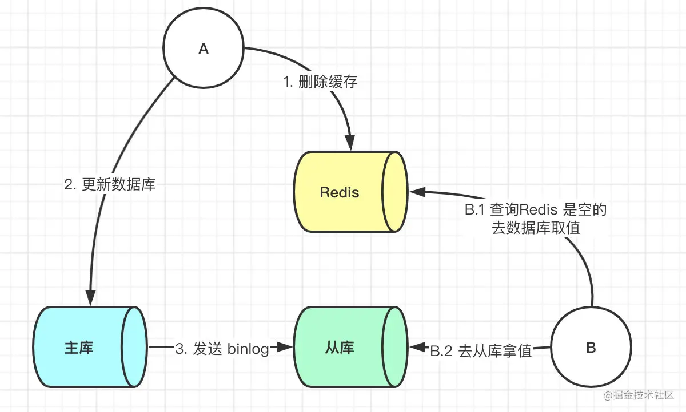

此时来了两个请求，请求 A（更新操作） 和请求 B（查询操作）

1. 请求 A 更新操作，删除了 Redis
2. 请求主库进行更新操作，主库与从库进行同步数据的操作
3. 请 B 查询操作，发现 Redis 中没有数据
4. 去从库中拿去数据
5. 此时同步数据还未完成，拿到的数据是旧数据

此时的解决办法就是如果是对 Redis 进行填充数据的查询数据库操作，那么就强制将其指向主库进行查询。

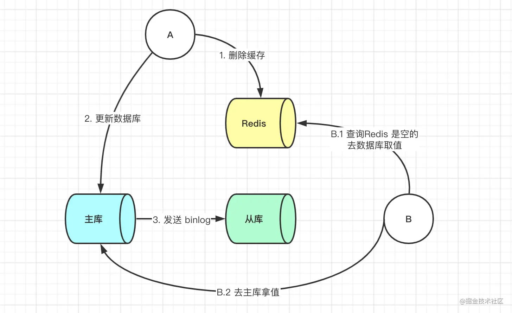

## 更新与读取操作进行异步串行化

采用**更新与读取操作进行异步串行化**

**异步串行化**

我在系统内部维护n个内存队列，更新数据的时候，根据数据的唯一标识，将该操作路由之后，发送到其中一个jvm内部的内存队列中（对同一数据的请求发送到同一个队列）。读取数据的时候，如果发现数据不在缓存中，并且此时队列里有更新库存的操作，那么将重新读取数据+更新缓存的操作，根据唯一标识路由之后，也将发送到同一个jvm内部的内存队列中。然后每个队列对应一个工作线程，每个工作线程串行地拿到对应的操作，然后一条一条的执行。

这样的话，一个数据变更的操作，先执行删除缓存，然后再去更新数据库，但是还没完成更新的时候，如果此时一个读请求过来，读到了空的缓存，那么可以先将缓存更新的请求发送到队列中，此时会在队列中积压，排在刚才更新库的操作之后，然后同步等待缓存更新完成，再读库。

**读操作去重**

多个读库更新缓存的请求串在同一个队列中是没意义的，因此可以做过滤，如果发现队列中已经有了该数据的更新缓存的请求了，那么就不用再放进去了，直接等待前面的更新操作请求完成即可，待那个队列对应的工作线程完成了上一个操作（数据库的修改）之后，才会去执行下一个操作（读库更新缓存），此时会从数据库中读取最新的值，然后写入缓存中。

如果请求还在等待时间范围内，不断轮询发现可以取到值了，那么就直接返回；如果请求等待的时间超过一定时长，那么这一次直接从数据库中读取当前的旧值。（返回旧值不是又导致缓存和数据库不一致了么？那至少可以减少这个情况发生，因为等待超时也不是每次都是，几率很小吧。这里我想的是，如果超时了就直接读旧值，这时候仅仅是读库后返回而不放缓存）

## 先更新数据库，后删除缓存

这一种情况也会出现问题，比如更新数据库成功了，但是在删除缓存的阶段出错了没有删除成功，那么此时再读取缓存的时候每次都是错误的数据了。

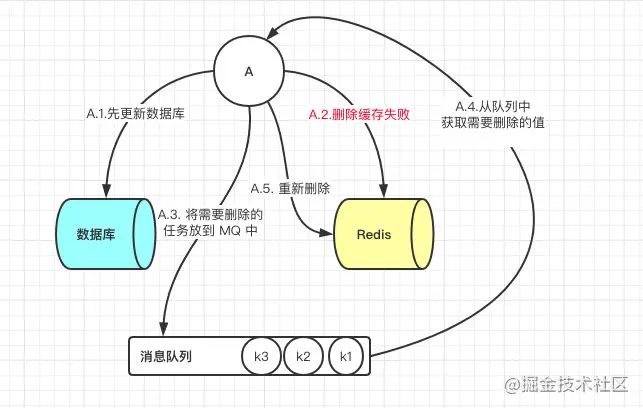

此时解决方案就是利用消息队列进行删除的补偿。具体的业务逻辑用语言描述如下：

1. 请求 A 先对数据库进行更新操作
2. 在对 Redis 进行删除操作的时候发现报错，删除失败
3. 此时将Redis 的 key 作为消息体发送到消息队列中
4. 系统接收到消息队列发送的消息后再次对 Redis 进行删除操作

但是这个方案会有一个缺点就是会对业务代码造成大量的侵入，深深的耦合在一起，所以这时会有一个优化的方案，我们知道对 Mysql 数据库更新操作后再 binlog 日志中我们都能够找到相应的操作，那么我们可以订阅 Mysql 数据库的 binlog 日志对缓存进行操作。

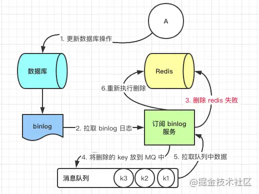

## 什么是缓存击穿?

缓存击穿跟缓存雪崩有点类似，缓存雪崩是大规模的key失效，而缓存击穿是某个热点的key失效，大并发集中对其进行请求，就会造成大量请求读缓存没读到数据，从而导致高并发访问数据库，引起数据库压力剧增。这种现象就叫做缓存击穿。

从两个方面解决，第一是否可以考虑热点key不设置过期时间，第二是否可以考虑降低打在数据库上的请求数量。

解决方案：

* 在缓存失效后，通过互斥锁或者队列来控制读数据写缓存的线程数量，比如某个key只允许一个线程查询数据和写缓存，其他线程等待。这种方式会阻塞其他的线程，此时系统的吞吐量会下降

* 热点数据缓存永远不过期。永不过期实际包含两层意思：
  * 物理不过期，针对热点key不设置过期时间
  * 逻辑过期，把过期时间存在key对应的value里，如果发现要过期了，通过一个后台的异步线程进行缓存的构建

## 什么是缓存穿透?

缓存穿透是指用户请求的数据在缓存中不存在即没有命中，同时在数据库中也不存在，导致用户每次请求该数据都要去数据库中查询一遍。如果有恶意攻击者不断请求系统中不存在的数据，会导致短时间大量请求落在数据库上，造成数据库压力过大，甚至导致数据库承受不住而宕机崩溃。

>  缓存穿透的关键在于在Redis中查不到key值，它和缓存击穿的根本区别在于传进来的key在Redis中是不存在的。假如有黑客传进大量的不存在的key，那么大量的请求打在数据库上是很致命的问题，所以在日常开发中要对参数做好校验，一些非法的参数，不可能存在的key就直接返回错误提示。


解决方法：

* 将无效的key存放进Redis中：

当出现Redis查不到数据，数据库也查不到数据的情况，我们就把这个key保存到Redis中，设置value="null"，并设置其过期时间极短，后面再出现查询这个key的请求的时候，直接返回null，就不需要再查询数据库了。但这种处理方式是有问题的，假如传进来的这个不存在的Key值每次都是随机的，那存进Redis也没有意义。

* 使用布隆过滤器：

如果布隆过滤器判定某个 key 不存在布隆过滤器中，那么就一定不存在，如果判定某个 key 存在，那么很大可能是存在(存在一定的误判率)。于是我们可以在缓存之前再加一个布隆过滤器，将数据库中的所有key都存储在布隆过滤器中，在查询Redis前先去布隆过滤器查询 key 是否存在，如果不存在就直接返回，不让其访问数据库，从而避免了对底层存储系统的查询压力。

> 如何选择：针对一些恶意攻击，攻击带过来的大量key是随机，那么我们采用第一种方案就会缓存大量不存在key的数据。那么这种方案就不合适了，我们可以先对使用布隆过滤器方案进行过滤掉这些key。所以，针对这种key异常多、请求重复率比较低的数据，优先使用第二种方案直接过滤掉。而对于空数据的key有限的，重复率比较高的，则可优先采用第一种方式进行缓存。

## 什么是缓存雪崩?

如果缓在某一个时刻出现大规模的key失效，那么就会导致大量的请求打在了数据库上面，导致数据库压力巨大，如果在高并发的情况下，可能瞬间就会导致数据库宕机。这时候如果运维马上又重启数据库，马上又会有新的流量把数据库打死。这就是缓存雪崩。

造成缓存雪崩的关键在于同一时间的大规模的key失效，主要有两种可能：第一种是Redis宕机，第二种可能就是采用了相同的过期时间。

解决方案：

1、事前：

* 均匀过期：设置不同的过期时间，让缓存失效的时间尽量均匀，避免相同的过期时间导致缓存雪崩，造成大量数据库的访问。如把每个Key的失效时间都加个随机值，`setRedis（Key，value，time + Math.random() * 10000）；`，保证数据不会在同一时间大面积失效。

* 分级缓存：第一级缓存失效的基础上，访问二级缓存，每一级缓存的失效时间都不同。

* 热点数据缓存永远不过期。永不过期实际包含两层意思：
  * 物理不过期，针对热点key不设置过期时间
  * 逻辑过期，把过期时间存在key对应的value里，如果发现要过期了，通过一个后台的异步线程进行缓存的构建

* 保证Redis缓存的高可用，防止Redis宕机导致缓存雪崩的问题。可以使用 主从+ 哨兵，Redis集群来避免 Redis 全盘崩溃的情况。

2、事中：

* 互斥锁：在缓存失效后，通过互斥锁或者队列来控制读数据写缓存的线程数量，比如某个key只允许一个线程查询数据和写缓存，其他线程等待。这种方式会阻塞其他的线程，此时系统的吞吐量会下降

* 使用熔断机制，限流降级。当流量达到一定的阈值，直接返回“系统拥挤”之类的提示，防止过多的请求打在数据库上将数据库击垮，至少能保证一部分用户是可以正常使用，其他用户多刷新几次也能得到结果。

3、事后：

开启Redis持久化机制，尽快恢复缓存数据，一旦重启，就能从磁盘上自动加载数据恢复内存中的数据。

## 什么是缓存穿透?如何避免?什么是缓存击穿,如何避免?什么是缓存雪崩?何如避免?

**缓存穿透**

一般的缓存系统,都是按照key去缓存查询,如果不存在对应的value,就应该去后端系统查找(比如DB)。一些恶意的请求会故意查询不存在的key,请求量很大,就会对后端系统造成很大的压力。这就叫做缓存穿透。

**如何避免?**

1:对查询结果为空的情况也进行缓存,缓存时间设置短一点,或者该key对应的数据insert了之后清理缓存。

2:对一定不存在的key进行过滤。可以把所有的可能存在的key放到一个大的Bitmap中,查询时通过该bitmap过滤。

**缓存击穿**

对于设置了过期时间的 key,缓存在某个时间点过期的时候,恰好这时间点对这个 Key 有大量的并发请求过来,这些请求发现缓存过期一般都会从后端 DB 加载数据并回设到缓存,这个时候大并发的请求可能会瞬间把 DB 压垮。

如何避免?:1.使用互斥锁:当缓存失效时,不立即去 load db,先使用如 Redis 的 setnx去设置一个互斥锁,当操作成功返回时再进行 load db 的操作并回设缓存,否则重试 get 缓存的方法。2.永远不过期:物理不过期,但逻辑过期(后台异步线程去刷新)。

**缓存雪崩**

当缓存服务器重启或者大量缓存集中在某一个时间段失效,这样在失效的时候,会给后端系统带来很大压力。导致系统崩溃。

**如何避免?**

1:在缓存失效后,通过加锁或者队列来控制读数据库写缓存的线程数量。比如对某个key只允许一个线程查询数据和写缓存,其他线程等待。

2:做二级缓存,A1为原始缓存,A2为拷贝缓存,A1失效时,可以访问A2,A1缓存失效时间设置为短期,A2设置为长期

3:不同的key,设置不同的过期时间,让缓存失效的时间点尽量均匀

## 什么是缓存预热?

缓存预热是指系统上线后，提前将相关的缓存数据加载到缓存系统。避免在用户请求的时候，先查询数据库，然后再将数据缓存的问题，用户直接查询事先被预热的缓存数据。

如果不进行预热，那么Redis初始状态数据为空，系统上线初期，对于高并发的流量，都会访问到数据库中， 对数据库造成流量的压力。

缓存预热解决方案：

* 数据量不大的时候，工程启动的时候进行加载缓存动作；

* 数据量大的时候，设置一个定时任务脚本，进行缓存的刷新；

* 数据量太大的时候，优先保证热点数据进行提前加载到缓存。

## 什么是缓存降级？

缓存降级是指缓存失效或缓存服务器挂掉的情况下，不去访问数据库，直接返回默认数据或访问服务的内存数据。降级一般是有损的操作，所以尽量减少降级对于业务的影响程度。

在进行降级之前要对系统进行梳理，看看系统是不是可以丢卒保帅；从而梳理出哪些必须誓死保护，哪些可降级；比如可以参考日志级别设置预案：

* 一般：比如有些服务偶尔因为网络抖动或者服务正在上线而超时，可以自动降级；
* 警告：有些服务在一段时间内成功率有波动（如在95~100%之间），可以自动降级或人工降级，并发送告警；
* 错误：比如可用率低于90%，或者数据库连接池被打爆了，或者访问量突然猛增到系统能承受的最大阀值，此时可以根据情况自动降级或者人工降级；
* 严重错误：比如因为特殊原因数据错误了，此时需要紧急人工降级。

## 如何避免缓存雪崩？

当**大量缓存数据在同一时间过期（失效）\**时，如果此时有大量的用户请求，都无法在 Redis 中处理，于是全部请求都直接访问数据库，从而导致数据库的压力骤增，严重的会造成数据库宕机，从而形成一系列连锁反应，造成整个系统崩溃，这就是\**缓存雪崩**的问题。

对于缓存雪崩问题，我们可以采用两种方案解决。

- **将缓存失效时间随机打散：** 我们可以在原有的失效时间基础上增加一个随机值（比如 1 到 10 分钟）这样每个缓存的过期时间都不重复了，也就降低了缓存集体失效的概率。
- **设置缓存不过期：** 我们可以通过后台服务来更新缓存数据，从而避免因为缓存失效造成的缓存雪崩，也可以在一定程度上避免缓存并发问题。

## 如何避免缓存击穿？

如果缓存中的**某个热点数据过期**了，此时大量的请求访问了该热点数据，就无法从缓存中读取，直接访问数据库，数据库很容易就被高并发的请求冲垮，这就是**缓存击穿**的问题。

应对缓存击穿可以采取前面说到两种方案：

- 互斥锁方案（Redis 中使用 setNX 方法设置一个状态位，表示这是一种锁定状态），保证同一时间只有一个业务线程请求缓存，未能获取互斥锁的请求，要么等待锁释放后重新读取缓存，要么就返回空值或者默认值。
- 不给热点数据设置过期时间，由后台异步更新缓存，或者在热点数据准备要过期前，提前通知后台线程更新缓存以及重新设置过期时间；

## 如何避免缓存穿透？

当用户访问的数据，**既不在缓存中，也不在数据库中**，导致请求在访问缓存时，发现缓存缺失，再去访问数据库时，发现数据库中也没有要访问的数据，没办法构建缓存数据，来服务后续的请求。那么当有大量这样的请求到来时，数据库的压力骤增，这就是**缓存穿透**的问题。

应对缓存穿透的方案，常见的方案有三种。

- **非法请求的限制**：当有大量恶意请求访问不存在的数据的时候，也会发生缓存穿透，因此在 API 入口处我们要判断求请求参数是否合理，请求参数是否含有非法值、请求字段是否存在，如果判断出是恶意请求就直接返回错误，避免进一步访问缓存和数据库。
- **设置空值或者默认值**：当我们线上业务发现缓存穿透的现象时，可以针对查询的数据，在缓存中设置一个空值或者默认值，这样后续请求就可以从缓存中读取到空值或者默认值，返回给应用，而不会继续查询数据库。
- **使用布隆过滤器快速判断数据是否存在，避免通过查询数据库来判断数据是否存在**：我们可以在写入数据库数据时，使用布隆过滤器做个标记，然后在用户请求到来时，业务线程确认缓存失效后，可以通过查询布隆过滤器快速判断数据是否存在，如果不存在，就不用通过查询数据库来判断数据是否存在，即使发生了缓存穿透，大量请求只会查询 Redis 和布隆过滤器，而不会查询数据库，保证了数据库能正常运行，Redis 自身也是支持布隆过滤器的。

## 如何设计一个缓存策略，可以动态缓存热点数据呢？

热点数据动态缓存的策略总体思路：**通过数据最新访问时间来做排名，并过滤掉不常访问的数据，只留下经常访问的数据**。

以电商平台场景中的例子，现在要求只缓存用户经常访问的 Top 1000 的商品。具体细节如下：

- 先通过缓存系统做一个排序队列（比如存放 1000 个商品），系统会根据商品的访问时间，更新队列信息，越是最近访问的商品排名越靠前；
- 同时系统会定期过滤掉队列中排名最后的 200 个商品，然后再从数据库中随机读取出 200 个商品加入队列中；
- 这样当请求每次到达的时候，会先从队列中获取商品 ID，如果命中，就根据 ID 再从另一个缓存数据结构中读取实际的商品信息，并返回。

在 Redis 中可以用 zadd 方法和 zrange 方法来完成排序队列和获取 200 个商品的操作。

## 说说常见的缓存更新策略？

常见的缓存更新策略共有3种：

- Cache Aside（旁路缓存）策略；
- Read/Write Through（读穿 / 写穿）策略；
- Write Back（写回）策略；
- 实际开发中，Redis 和 MySQL 的更新策略用的是 Cache Aside，另外两种策略应用不了。

## Cache Aside（旁路缓存）策略

Cache Aside（旁路缓存）策略是最常用的，应用程序直接与「数据库、缓存」交互，并负责对缓存的维护，该策略又可以细分为「读策略」和「写策略」。

**写策略的步骤：**

- 先更新数据库中的数据，再删除缓存中的数据。

**读策略的步骤：**

- 如果读取的数据命中了缓存，则直接返回数据；
- 如果读取的数据没有命中缓存，则从数据库中读取数据，然后将数据写入到缓存，并且返回给用户。

## 为什么「先更新数据库再删除缓存」不会有数据不一致的问题？

**因为缓存的写入通常要远远快于数据库的写入**，所以在实际中很难出现请求 B 已经更新了数据库并且删除了缓存，请求 A 才更新完缓存的情况。而一旦请求 A 早于请求 B 删除缓存之前更新了缓存，那么接下来的请求就会因为缓存不命中而从数据库中重新读取数据，所以不会出现这种不一致的情况。

**Cache Aside 策略适合读多写少的场景，不适合写多的场景**，因为当写入比较频繁时，缓存中的数据会被频繁地清理，这样会对缓存的命中率有一些影响。如果业务对缓存命中率有严格的要求，那么可以考虑两种解决方案：

- 一种做法是在更新数据时也更新缓存，只是在更新缓存前先加一个分布式锁，因为这样在同一时间只允许一个线程更新缓存，就不会产生并发问题了。当然这么做对于写入的性能会有一些影响；
- 另一种做法同样也是在更新数据时更新缓存，只是给缓存加一个较短的过期时间，这样即使出现缓存不一致的情况，缓存的数据也会很快过期，对业务的影响也是可以接受。

## Read/Write Through（读穿 / 写穿）策略

Read/Write Through（读穿 / 写穿）策略原则是应用程序只和缓存交互，不再和数据库交互，而是由缓存和数据库交互，相当于更新数据库的操作由缓存自己代理了。

***1、Read Through 策略***

先查询缓存中数据是否存在，如果存在则直接返回，如果不存在，则由缓存组件负责从数据库查询数据，并将结果写入到缓存组件，最后缓存组件将数据返回给应用。

***2、Write Through 策略***

当有数据更新的时候，先查询要写入的数据在缓存中是否已经存在：

- 如果缓存中数据已经存在，则更新缓存中的数据，并且由缓存组件同步更新到数据库中，然后缓存组件告知应用程序更新完成。
- 如果缓存中数据不存在，直接更新数据库，然后返回；

## Write Back（写回）策略

Write Back（写回）策略在更新数据的时候，只更新缓存，同时将缓存数据设置为脏的，然后立马返回，并不会更新数据库。对于数据库的更新，会通过批量异步更新的方式进行。

Write Back 是计算机体系结构中的设计，比如 CPU 的缓存、操作系统中文件系统的缓存都采用了 Write Back（写回）策略。

**Write Back 策略特别适合写多的场景**，因为发生写操作的时候， 只需要更新缓存，就立马返回了。比如，写文件的时候，实际上是写入到文件系统的缓存就返回了，并不会写磁盘。

**但是带来的问题是，数据不是强一致性的，而且会有数据丢失的风险**，因为缓存一般使用内存，而内存是非持久化的，所以一旦缓存机器掉电，就会造成原本缓存中的脏数据丢失。所以你会发现系统在掉电之后，之前写入的文件会有部分丢失，就是因为 Page Cache 还没有来得及刷盘造成的。

## Redis 如何实现延迟队列？

在 Redis 可以使用有序集合（ZSet）的方式来实现延迟消息队列的，ZSet 有一个 Score 属性可以用来存储延迟执行的时间。

使用 zadd score1 value1 命令就可以一直往内存中生产消息。再利用 zrangebysocre 查询符合条件的所有待处理的任务， 通过循环执行队列任务即可。

## 什么是 Redis 大 key？

大 key 并不是指 key 的值很大，而是 key 对应的 value 很大。

一般而言，下面这两种情况被称为大 key：

- String 类型的值大于 10 KB；
- Hash、List、Set、ZSet 类型的元素的个数超过 5000个；

## 大 key 会造成什么问题？

大 key 会带来以下四种影响：

- **客户端超时阻塞**。由于 Redis 执行命令是单线程处理，然后在操作大 key 时会比较耗时，那么就会阻塞 Redis，从客户端这一视角看，就是很久很久都没有响应。
- **引发网络阻塞**。每次获取大 key 产生的网络流量较大，如果一个 key 的大小是 1 MB，每秒访问量为 1000，那么每秒会产生 1000MB 的流量，这对于普通千兆网卡的服务器来说是灾难性的。
- **阻塞工作线程**。如果使用 del 删除大 key 时，会阻塞工作线程，这样就没办法处理后续的命令。
- **内存分布不均**。集群模型在 slot 分片均匀情况下，会出现数据和查询倾斜情况，部分有大 key 的 Redis 节点占用内存多，QPS 也会比较大。

## 如何删除大 key？

这里给出两种方法：

- 分批次删除
- 异步删除（Redis 4.0版本以上）

## Redis 管道有什么用？

管道技术（Pipeline）是客户端提供的一种批处理技术，用于一次处理多个 Redis 命令，从而提高整个交互的性能。

使用**管道技术可以解决多个命令执行时的网络等待**，它是把多个命令整合到一起发送给服务器端处理之后统一返回给客户端，这样就免去了每条命令执行后都要等待的情况，从而有效地提高了程序的执行效率。

但使用管道技术也要注意避免发送的命令过大，或管道内的数据太多而导致的网络阻塞。

要注意的是，管道技术本质上是客户端提供的功能，而非 Redis 服务器端的功能。

## Redis 事务支持回滚吗？

MySQL 在执行事务时，会提供回滚机制，当事务执行发生错误时，事务中的所有操作都会撤销，已经修改的数据也会被恢复到事务执行前的状态。

**Redis 中并没有提供回滚机制**，虽然 Redis 提供了 DISCARD 命令，但是这个命令只能用来主动放弃事务执行，把暂存的命令队列清空，起不到回滚的效果。

## 如何用 Redis 实现分布式锁的？

分布式锁是用于分布式环境下并发控制的一种机制，用于控制某个资源在同一时刻只能被一个应用所使用。

Redis 的 SET 命令有个 NX 参数可以实现「key不存在才插入」，所以可以用它来实现分布式锁：

- 如果 key 不存在，则显示插入成功，可以用来表示加锁成功；
- 如果 key 存在，则会显示插入失败，可以用来表示加锁失败。

基于 Redis 节点实现分布式锁时，对于加锁操作，我们需要满足三个条件。

- 加锁包括了读取锁变量、检查锁变量值和设置锁变量值三个操作，但需要以原子操作的方式完成，所以，我们使用 SET 命令带上 NX 选项来实现加锁；
- 锁变量需要设置过期时间，以免客户端拿到锁后发生异常，导致锁一直无法释放，所以，我们在 SET 命令执行时加上 EX/PX 选项，设置其过期时间；
- 锁变量的值需要能区分来自不同客户端的加锁操作，以免在释放锁时，出现误释放操作，所以，我们使用 SET 命令设置锁变量值时，每个客户端设置的值是一个唯一值，用于标识客户端；

满足这三个条件的分布式命令如下：

```c
SET lock_key unique_value NX PX 10000 
```

- lock_key 就是 key 键；
- unique_value 是客户端生成的唯一的标识，区分来自不同客户端的锁操作；
- NX 代表只在 lock_key 不存在时，才对 lock_key 进行设置操作；
- PX 10000 表示设置 lock_key 的过期时间为 10s，这是为了避免客户端发生异常而无法释放锁。

而解锁的过程就是将 lock_key 键删除（del lock_key），但不能乱删，要保证执行操作的客户端就是加锁的客户端。所以，解锁的时候，我们要先判断锁的 unique_value 是否为加锁客户端，是的话，才将 lock_key 键删除。

可以看到，解锁是有两个操作，这时就需要 Lua 脚本来保证解锁的原子性，因为 Redis 在执行 Lua 脚本时，可以以原子性的方式执行，保证了锁释放操作的原子性。

```c
// 释放锁时，先比较 unique_value 是否相等，避免锁的误释放
if redis.call("get",KEYS[1]) == ARGV[1] then
    return redis.call("del",KEYS[1])
else
    return 0
end
```

## 基于 Redis 实现分布式锁有什么优缺点？

基于 Redis 实现分布式锁的**优点**：

1. 性能高效（这是选择缓存实现分布式锁最核心的出发点）。
2. 实现方便。很多研发工程师选择使用 Redis 来实现分布式锁，很大成分上是因为 Redis 提供了 setnx 方法，实现分布式锁很方便。
3. 避免单点故障（因为 Redis 是跨集群部署的，自然就避免了单点故障）。

基于 Redis 实现分布式锁的**缺点**：

- 超时时间不好设置。如果锁的超时时间设置过长，会影响性能，如果设置的超时时间过短会保护不到共享资源。比如在有些场景中，一个线程 A 获取到了锁之后，由于业务代码执行时间可能比较长，导致超过了锁的超时时间，自动失效，注意 A 线程没执行完，后续线程 B 又意外的持有了锁，意味着可以操作共享资源，那么两个线程之间的共享资源就没办法进行保护了。
  - **那么如何合理设置超时时间呢？** 我们可以基于续约的方式设置超时时间：先给锁设置一个超时时间，然后启动一个守护线程，让守护线程在一段时间后，重新设置这个锁的超时时间。实现方式就是：写一个守护线程，然后去判断锁的情况，当锁快失效的时候，再次进行续约加锁，当主线程执行完成后，销毁续约锁即可，不过这种方式实现起来相对复杂。
- **Redis 主从复制模式中的数据是异步复制的，这样导致分布式锁的不可靠性**。如果在 Redis 主节点获取到锁后，在没有同步到其他节点时，Redis 主节点宕机了，此时新的 Redis 主节点依然可以获取锁，所以多个应用服务就可以同时获取到锁。

## Redis 如何解决集群情况下分布式锁的可靠性？

为了保证集群环境下分布式锁的可靠性，Redis 官方已经设计了一个分布式锁算法 Redlock（红锁）。

它是基于多个 Redis 节点的分布式锁，即使有节点发生了故障，锁变量仍然是存在的，客户端还是可以完成锁操作。

Redlock 算法的基本思路，**是让客户端和多个独立的 Redis 节点依次请求申请加锁，如果客户端能够和半数以上的节点成功地完成加锁操作，那么我们就认为，客户端成功地获得分布式锁，否则加锁失败**。

## Redis为何选择单线程？

在Redis 6.0以前，Redis的核心网络模型选择用单线程来实现。先来看下官方的回答：

> It's not very frequent that CPU becomes your bottleneck with Redis， as usually Redisis either memory or network bound. For instance， using pipelining Redisrunning on an average Linux system can deliver even 1 million requests per second， so if your application mainly uses O(N) or O(log(N)) commands， it is hardly going to use too much CPU.

核心意思就是，对于一个 DB 来说，CPU 通常不会是瓶颈，因为大多数请求不会是 CPU 密集型的，而是 I/O 密集型。具体到 Redis的话，如果不考虑 RDB/AOF 等持久化方案，Redis是完全的纯内存操作，执行速度是非常快的，因此这部分操作通常不会是性能瓶颈，Redis真正的性能瓶颈在于网络 I/O，也就是客户端和服务端之间的网络传输延迟，因此 Redis选择了单线程的 I/O 多路复用来实现它的核心网络模型。

实际上更加具体的选择单线程的原因如下：

* 避免过多的上下文切换开销：如果是单线程则可以规避进程内频繁的线程切换开销，因为程序始终运行在进程中单个线程内，没有多线程切换的场景。
* 避免同步机制的开销：如果 Redis选择多线程模型，又因为 Redis是一个数据库，那么势必涉及到底层数据同步的问题，则必然会引入某些同步机制，比如锁，而我们知道 Redis不仅仅提供了简单的 key-value 数据结构，还有 list、set 和 hash 等等其他丰富的数据结构，而不同的数据结构对同步访问的加锁粒度又不尽相同，可能会导致在操作数据过程中带来很多加锁解锁的开销，增加程序复杂度的同时还会降低性能。
* 简单可维护：如果 Redis使用多线程模式，那么所有的底层数据结构都必须实现成线程安全的，这无疑又使得 Redis的实现变得更加复杂。

总而言之，Redis选择单线程可以说是多方博弈之后的一种权衡：在保证足够的性能表现之下，使用单线程保持代码的简单和可维护性。

## Redis真的是单线程？

讨论 这个问题前，先看下 Redis的版本中两个重要的节点：

1. Redisv4.0（引入多线程处理异步任务）
2. Redis 6.0（在网络模型中实现多线程 I/O ）

所以，网络上说的Redis是单线程，通常是指在Redis 6.0之前，其核心网络模型使用的是单线程。

且Redis6.0引入**多线程I/O**，只是用来**处理网络数据的读写和协议的解析**，而**执行命令依旧是单线程**。

> Redis在 v4.0 版本的时候就已经引入了的多线程来做一些异步操作，此举主要针对的是那些非常耗时的命令，通过将这些命令的执行进行异步化，避免阻塞单线程的事件循环。
>
> 在 Redisv4.0 之后增加了一些的非阻塞命令如 `UNLINK`、`FLUSHALL ASYNC`、`FLUSHDB ASYNC`。

## Redis 6.0为何引入多线程？

很简单，就是 Redis的网络 I/O 瓶颈已经越来越明显了。

随着互联网的飞速发展，互联网业务系统所要处理的线上流量越来越大，Redis的单线程模式会导致系统消耗很多 CPU 时间在网络 I/O 上从而降低吞吐量，要提升 Redis的性能有两个方向：

- 优化网络 I/O 模块
- 提高机器内存读写的速度

后者依赖于硬件的发展，暂时无解。所以只能从前者下手，网络 I/O 的优化又可以分为两个方向：

- 零拷贝技术或者 DPDK 技术
- 利用多核优势

零拷贝技术有其局限性，无法完全适配 Redis这一类复杂的网络 I/O 场景，更多网络 I/O 对 CPU 时间的消耗和 Linux 零拷贝技术。而 DPDK 技术通过旁路网卡 I/O 绕过内核协议栈的方式又太过于复杂以及需要内核甚至是硬件的支持。

总结起来，Redis支持多线程主要就是两个原因：

* 可以充分利用服务器 CPU 资源，目前主线程只能利用一个核

* 多线程任务可以分摊 Redis 同步 IO 读写负荷

## Redis 6.0 多线程的实现机制？

**流程简述如下**：

- 主线程负责接收建立连接请求，获取 Socket 放入全局等待读处理队列。
- 主线程处理完读事件之后，通过 RR（Round Robin）将这些连接分配给这些 IO 线程。
- 主线程阻塞等待 IO 线程读取 Socket 完毕。
- 主线程通过单线程的方式执行请求命令，请求数据读取并解析完成，但并不执行。
- 主线程阻塞等待 IO 线程将数据回写 Socket 完毕。


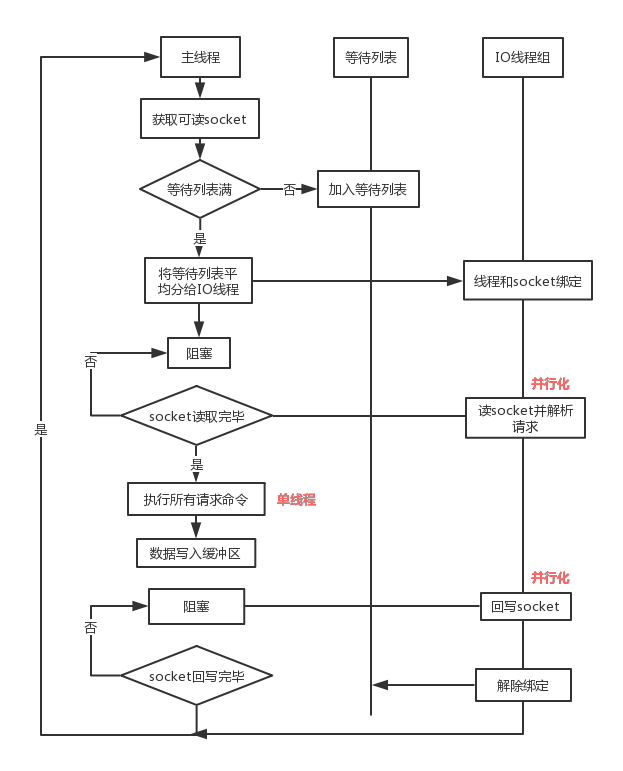

**该设计有如下特点**：

- IO 线程要么同时在读 Socket，要么同时在写，不会同时读或写。
- IO 线程只负责读写 Socket 解析命令，不负责命令处理。

## Redis 6.0开启多线程后，是否会存在线程并发安全问题？

从实现机制可以看出，Redis 的多线程部分只是用来处理网络数据的读写和协议解析，执行命令仍然是单线程顺序执行。

所以我们不需要去考虑控制 Key、Lua、事务，LPUSH/LPOP 等等的并发及线程安全问题。

## Redis 6.0 与 Memcached 多线程模型的对比

- **相同点：**都采用了 Master 线程 -Worker 线程的模型。

- **不同点**：Memcached 执行主逻辑也是在 Worker 线程里，模型更加简单，实现了真正的线程隔离，符合我们对线程隔离的常规理解。

  而 Redis 把处理逻辑交还给 Master 线程，虽然一定程度上增加了模型复杂度，但也解决了线程并发安全等问题。

## 介绍下Redis的线程模型

Redis的线程模型包括Redis 6.0之前和Redis 6.0。

下面介绍的是Redis 6.0之前。

Redis 是基于 reactor 模式开发了网络事件处理器，这个处理器叫做文件事件处理器（file event handler）。由于这个文件事件处理器是单线程的，所以 Redis 才叫做单线程的模型。采用 IO 多路复用机制同时监听多个 Socket，根据 socket 上的事件来选择对应的事件处理器来处理这个事件。

> IO多路复用是 IO 模型的一种，有时也称为异步阻塞 IO，是基于经典的 Reactor 设计模式设计的。多路指的是多个 Socket 连接，复用指的是复用一个线程。多路复用主要有三种技术：Select，Poll，Epoll。
>
> Epoll 是最新的也是目前最好的多路复用技术。

模型如下图：


文件事件处理器的结构包含了四个部分：

- 多个 Socket。Socket 会产生 AE_READABLE 和 AE_WRITABLE 事件：
  - 当 socket 变得可读时或者有新的可以应答的 socket 出现时，socket 就会产生一个 AE_READABLE 事件
  - 当 socket 变得可写时，socket 就会产生一个 AE_WRITABLE 事件。
- IO 多路复用程序
- 文件事件分派器
- 事件处理器。事件处理器包括：连接应答处理器、命令请求处理器、命令回复处理器，每个处理器对应不同的 socket 事件：
  - 如果是客户端要连接 Redis，那么会为 socket 关联连接应答处理器
  - 如果是客户端要写数据到 Redis（读、写请求命令），那么会为 socket 关联命令请求处理器
  - 如果是客户端要从 Redis 读数据，那么会为 socket 关联命令回复处理器

多个 socket 会产生不同的事件，不同的事件对应着不同的操作，IO 多路复用程序监听着这些 Socket，当这些 Socket 产生了事件，IO 多路复用程序会将这些事件放到一个队列中，通过这个队列，以有序、同步、每次一个事件的方式向文件时间分派器中传送。当事件处理器处理完一个事件后，IO 多路复用程序才会继续向文件分派器传送下一个事件。

下图是客户端与 Redis 通信的一次完整的流程：

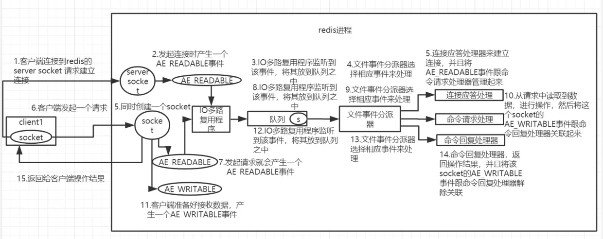

1. Redis 启动初始化的时候，Redis 会将连接应答处理器与 AE_READABLE 事件关联起来。
2. 如果一个客户端跟 Redis 发起连接，此时 Redis 会产生一个 AE_READABLE 事件，由于开始之初 AE_READABLE 是与连接应答处理器关联，所以由连接应答处理器来处理该事件，这时连接应答处理器会与客户端建立连接，创建客户端响应的 socket，同时将这个 socket 的 AE_READABLE 事件与命令请求处理器关联起来。
3. 如果这个时间客户端向 Redis 发送一个命令（set k1 v1），这时 socket 会产生一个 AE_READABLE 事件，IO 多路复用程序会将该事件压入队列中，此时事件分派器从队列中取得该事件，由于该 socket 的 AE_READABLE 事件已经和命令请求处理器关联了，因此事件分派器会将该事件交给命令请求处理器处理，命令请求处理器读取事件中的命令并完成。操作完成后，Redis 会将该 socket 的 AE_WRITABLE 事件与命令回复处理器关联。
4. 如果客户端已经准备好接受数据后，Redis 中的该 socket 会产生一个 AE_WRITABLE 事件，同样会压入队列然后被事件派发器取出交给相对应的命令回复处理器，由该命令回复处理器将准备好的响应数据写入 socket 中，供客户端读取。
5. 命令回复处理器写完后，就会删除该 socket 的 AE_WRITABLE 事件与命令回复处理器的关联关系。

## Redis事务的概念

Redis的事务并不是我们传统意义上理解的事务，我们都知道 单个 Redis 命令的执行是原子性的，但 Redis 没有在事务上增加任何维持原子性的机制，所以 Redis **事务的执行并不是原子性的**。

事务可以理解为一个**打包的批量执行脚本**，但**批量指令并非原子化**的操作，中间某条指令的失败不会导致前面已做指令的回滚，也不会造成后续的指令不做。

**总结：**

   　1.  Redis事务中如果有某一条命令执行失败，之前的命令不会回滚，其后的命令仍然会被继续执行。**鉴于这个原因，所以说Redis的事务严格意义上来说是不具备原子性的**。

  　2.  Redis事务中所有命令都会序列化、按顺序地执行。事务在执行的过程中，不会被其他客户端发送来的命令请求所打断。

  　3.  在事务开启之前，如果客户端与服务器之间出现通讯故障并导致网络断开，其后所有待执行的语句都将不会被服务器执行。然而如果网络中断事件是发生在客户端执行EXEC命令之后，那么该事务中的所有命令都会被服务器执行。

>  当使用Append-Only模式时，Redis会通过调用系统函数write将该事务内的所有写操作在本次调用中全部写入磁盘。然而如果在写入的过程中出现系统崩溃，如电源故障导致的宕机，那么此时也许只有部分数据被写入到磁盘，而另外一部分数据却已经丢失。Redis服务器会在重新启动时执行一系列必要的一致性检测，一旦发现类似问题，就会立即退出并给出相应的错误提示。此时，我们就要充分利用Redis工具包中提供的Redis-check-aof工具，该工具可以帮助我们定位到数据不一致的错误，并将已经写入的部分数据进行回滚。修复之后我们就可以再次重新启动Redis服务器了。

## Redis事务的三个阶段

1. multi 开启事务
2. 大量指令入队
3. exec执行事务块内命令，**截止此处一个事务已经结束。**
4. discard 取消事务
5. watch 监视一个或多个key，如果事务执行前key被改动，事务将打断。unwatch 取消监视。

事务执行过程中，如果服务端收到有EXEC、DISCARD、WATCH、MULTI之外的请求，将会把请求放入队列中排队.

## Redis事务相关命令

Redis事务功能是通过MULTI、EXEC、DISCARD和WATCH 四个原语实现的

* WATCH 命令是一个乐观锁，可以为 Redis 事务提供 check-and-set （CAS）行为。 可以监控一个或多个键，一旦其中有一个键被修改（或删除），之后的事务就不会执行，监控一直持续到EXEC命令。
* MULTI命令用于开启一个事务，它总是返回OK。 MULTI执行之后，客户端可以继续向服务器发送任意多条命令，这些命令不会立即被执行，而是被放到一个队列中，当EXEC命令被调用时，所有队列中的命令才会被执行。
* EXEC：执行所有事务块内的命令。返回事务块内所有命令的返回值，按命令执行的先后顺序排列。 当操作被打断时，返回空值 nil 。
  通过调用DISCARD，客户端可以清空事务队列，并放弃执行事务， 并且客户端会从事务状态中退出。
* UNWATCH命令可以取消watch对所有key的监控。

## Redis事务支持隔离性吗?

Redis 是单进程程序，并且它保证在执行事务时，不会对事务进行中断，事务可以运行直到执行完所有事务队列中的命令为止。因此，**Redis 的事务是总是带有隔离性的**。

## Redis为什么不支持事务回滚？

* Redis 命令只会因为错误的语法而失败，或是命令用在了错误类型的键上面，这些问题不能在入队时发现，这也就是说，从实用性的角度来说，失败的命令是由编程错误造成的，而这些错误应该在开发的过程中被发现，而不应该出现在生产环境中.
* 因为不需要对回滚进行支持，所以 Redis 的内部可以保持简单且快速。

## Redis事务其他实现

* 基于Lua脚本，Redis可以保证脚本内的命令一次性、按顺序地执行，
  其同时也不提供事务运行错误的回滚，执行过程中如果部分命令运行错误，剩下的命令还是会继续运行完。
* 基于中间标记变量，通过另外的标记变量来标识事务是否执行完成，读取数据时先读取该标记变量判断是否事务执行完成。但这样会需要额外写代码实现，比较繁琐。

## 怎么理解Redis事务？


事务是一个单独的隔离操作：事务中的所有命令都会序列化、按顺序地执行。事务在执行的过程中，不会被其他客户端发送来的命令请求所打断。

事务是一个原子操作：事务中的命令要么全部被执行，要么全部都不执行。

## 如何实现 redis 事务？

Redis 通过 MULTI、EXEC、WATCH 等命令来实现事务(transaction)功能。事务提供了一种将多个命令请求打包，然后一次性、按顺序地执行多个命令的机制，并且在事务执行期间，服务器不会中断事务而改去执行其他客户端的命令请求，它会将事务中的所有命令都执行完毕，然后才去处理其他客户端的命令请求。

在传统的关系式数据库中，常常用 ACID 性质来检验事务功能的可靠性和安全性。在 Redis 中，事务总是具有原子性（Atomicity）、一致性（Consistency）和隔离性（Isolation），并且当 Redis 运行在某种特定的持久化模式下时，事务也具有持久性（Durability）。

## Redis常见使用方式有哪些？

Redis的几种常见使用方式包括：

*  Redis单副本；
*  Redis多副本（主从）；
*  Redis Sentinel（哨兵）；
*  Redis Cluster；
*  Redis自研。

使用场景：

如果数据量很少，主要是承载高并发高性能的场景，比如缓存一般就几个G的话，单机足够了。

主从模式：master 节点挂掉后，需要手动指定新的 master，可用性不高，基本不用。

哨兵模式：master 节点挂掉后，哨兵进程会主动选举新的 master，可用性高，但是每个节点存储的数据是一样的，浪费内存空间。数据量不是很多，集群规模不是很大，需要自动容错容灾的时候使用。

Redis cluster 主要是针对海量数据+高并发+高可用的场景，如果是海量数据，如果你的数据量很大，那么建议就用Redis cluster，所有master的容量总和就是Redis cluster可缓存的数据容量。

## 介绍下Redis单副本

Redis单副本，采用单个Redis节点部署架构，没有备用节点实时同步数据，不提供数据持久化和备份策略，适用于数据可靠性要求不高的纯缓存业务场景。

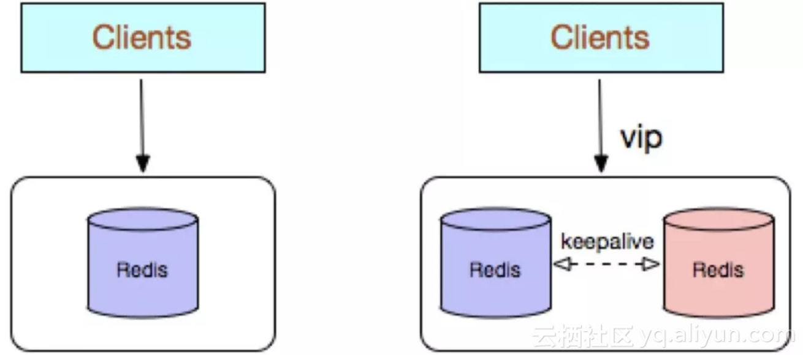

**优点：**

* 架构简单，部署方便；
* 高性价比：缓存使用时无需备用节点（单实例可用性可以用supervisor或crontab保证），当然为了满足业务的高可用性，也可以牺牲一个备用节点，但同时刻只有一个实例对外提供服务；
* 高性能。

**缺点：**

* 不保证数据的可靠性；
* 在缓存使用，进程重启后，数据丢失，即使有备用的节点解决高可用性，但是仍然不能解决缓存预热问题，因此不适用于数据可靠性要求高的业务；
* 高性能受限于单核CPU的处理能力（Redis是单线程机制），CPU为主要瓶颈，所以适合操作命令简单，排序、计算较少的场景。也可以考虑用Memcached替代。

## 介绍下Redis Sentinel（哨兵）

> 主从模式下，当主服务器宕机后，需要手动把一台从服务器切换为主服务器，这就需要人工干预，费事费力，还会造成一段时间内服务不可用。这种方式并不推荐，实际生产中，我们优先考虑哨兵模式。这种模式下，master 宕机，哨兵会自动选举 master 并将其他的 slave 指向新的 master。

Redis Sentinel是社区版本推出的原生高可用解决方案，其部署架构主要包括两部分：Redis Sentinel集群和Redis数据集群。

其中Redis Sentinel集群是由若干Sentinel节点组成的分布式集群，可以实现故障发现、故障自动转移、配置中心和客户端通知。Redis Sentinel的节点数量要满足2n+1（n>=1）的奇数个。

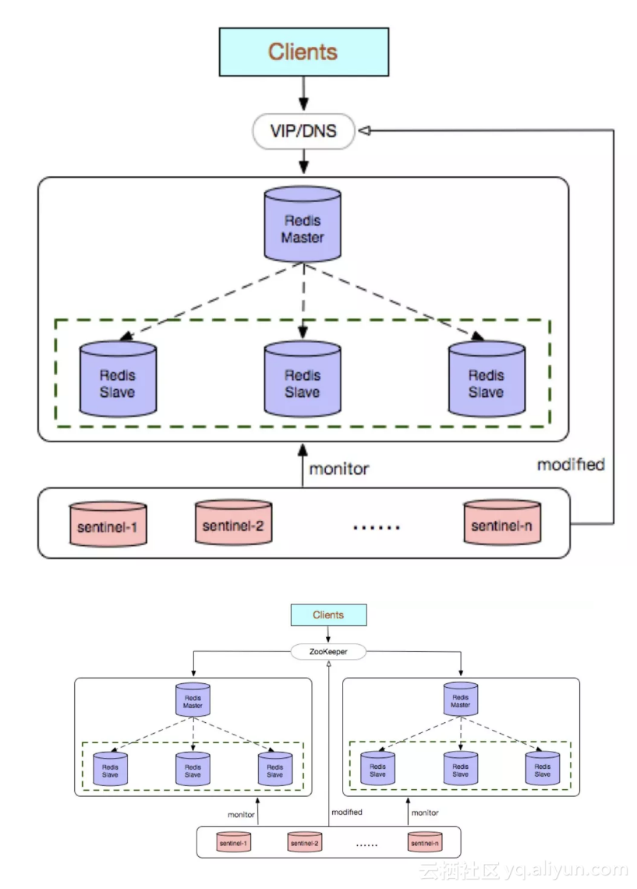

**优点：**

* Redis Sentinel集群部署简单；
* 能够解决Redis主从模式下的高可用切换问题；
* 很方便实现Redis数据节点的线形扩展，轻松突破Redis自身单线程瓶颈，可极大满足Redis大容量或高性能的业务需求；
* 可以实现一套Sentinel监控一组Redis数据节点或多组数据节点。

**缺点：**

* 部署相对Redis主从模式要复杂一些，原理理解更繁琐；
* 资源浪费，Redis数据节点中slave节点作为备份节点不提供服务；
* Redis Sentinel主要是针对Redis数据节点中的主节点的高可用切换，对Redis的数据节点做失败判定分为主观下线和客观下线两种，对于Redis的从节点有对节点做主观下线操作，并不执行故障转移。
* 不能解决读写分离问题，实现起来相对复杂。

## Redis哨兵是怎么工作的？

1. 每个Sentinel以每秒钟一次的频率向它所知的Master，Slave以及其他 Sentinel 实例发送一个 PING 命令。
2. 如果一个实例（instance）距离最后一次有效回复 PING 命令的时间超过 down-after-milliseconds 选项所指定的值， 则这个实例会被当前 Sentinel 标记为主观下线。
3. 如果一个Master被标记为主观下线，则正在监视这个Master的所有 Sentinel 要以每秒一次的频率确认Master的确进入了主观下线状态。
4. 当有足够数量的 Sentinel（大于等于配置文件指定的值）在指定的时间范围内确认Master的确进入了主观下线状态， 则Master会被标记为客观下线 。
5. 当Master被 Sentinel 标记为客观下线时，Sentinel 向下线的 Master 的所有 Slave 发送 INFO 命令的频率会从 10 秒一次改为每秒一次 （在一般情况下， 每个 Sentinel 会以每 10 秒一次的频率向它已知的所有Master，Slave发送 INFO 命令 ）。
6. 若没有足够数量的 Sentinel 同意 Master 已经下线， Master 的客观下线状态就会变成主观下线。若 Master 重新向 Sentinel 的 PING 命令返回有效回复， Master 的主观下线状态就会被移除。
7. sentinel节点会与其他sentinel节点进行“沟通”，投票选举一个sentinel节点进行故障处理，在从节点中选取一个主节点，其他从节点挂载到新的主节点上自动复制新主节点的数据。

## 同步配置的时候其他哨兵根据什么更新自己的配置呢？

执行切换的那个哨兵，会从要切换到的新master（salve->master）那里得到一个configuration epoch，这就是一个version号，每次切换的version号都必须是唯一的。

如果第一个选举出的哨兵切换失败了，那么其他哨兵，会等待failover-timeout时间，然后接替继续执行切换，此时会重新获取一个新的configuration epoch 作为新的version号。

这个version号就很重要了，因为各种消息都是通过一个channel去发布和监听的，所以一个哨兵完成一次新的切换之后，新的master配置是跟着新的version号的，其他的哨兵都是根据版本号的大小来更新自己的master配置的。

## 为什么Redis哨兵集群只有2个节点无法正常工作？

哨兵集群必须部署2个以上节点。

如果两个哨兵实例，即两个Redis实例，一主一从的模式。

则Redis的配置quorum=1，表示一个哨兵认为master宕机即可认为master已宕机。

但是如果是机器1宕机了，那哨兵1和master都宕机了，虽然哨兵2知道master宕机了，但是这个时候，需要majority，也就是大多数哨兵都是运行的，2个哨兵的majority就是2（2的majority=2，3的majority=2，5的majority=3，4的majority=2），2个哨兵都运行着，就可以允许执行故障转移。

但此时哨兵1没了就只有1个哨兵了了，此时就没有majority来允许执行故障转移，所以故障转移不会执行。

## 哨兵简介

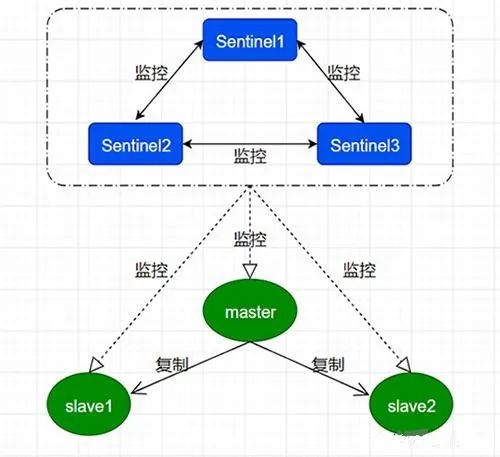

`Sentinel`（哨兵）是Redis`高可用`的解决方案，可以运行多个Sentinel组成一个哨兵分布式系统。

这里我们的`哨兵机制`就是解决这个问题：`故障转移`，如果主节点挂掉，就进行`主从切换`，让从节点`升级`为主节点，继续对外提供服务。

使用流言协议(gossip protocols)来接收主机`是否下线`；并使用投票协议(agreement protocols)来决定是否执行`自动故障迁移`； 以及选择哪个从服务器作为`新的主服务器`。

## Sentinel哨兵职责如下：

- `监控`(Monitoring)：Sentinel 会不断地定期检查你的主服务器和从服务器是否运作正常。

- `提醒`(Notification): 当被监控的某个 Redis 服务器出现问题时， Sentinel 可以通过 API 向管理员或者其他应用程序发送通知。

- `自动故障迁移`(Automaticfailover): 当一个主服务器`不能正常工作`时， Sentinel 会开始一次`自动故障迁移`操作，它会将失效主服务器的其中一个从服务器`升级`为新的主服务器，并让失效主服务器的其他从服务器改为复制新的主服务器; 当`客户端`试图连接失效的主服务器时，集群也会向客户端返回新主服务器的地址， 使得集群可以使用新主服务器代替失效服务器。

- `统一的配置管理`：连接者询问sentinel取得主从的地址。

## 哨兵搭建

机器准备

`主从复制`的搭建，之前的文章讲过了，大家可以去参考

| 服务器名称 | 节点类型                 | IP地址         | 端口  |
| ---------- | ------------------------ | -------------- | ----- |
| Node1      | Redis服务1(主节点Master) | 192.168.14.101 | 6379  |
| Node2      | Redis服务2(从节点slave1) | 192.168.14.102 | 6380  |
| Node3      | Redis服务3(从节点slave2) | 192.168.14.103 | 6381  |
| Sentinel1  | 哨兵服务1                | 192.168.14.101 | 26379 |
| Sentinel2  | 哨兵服务2                | 192.168.14.102 | 26380 |
| Sentinel3  | 哨兵服务3                | 192.168.14.103 | 26381 |

## 介绍下Redis Cluster

> Redis 的哨兵模式基本已经可以实现高可用，读写分离 ，但是在这种模式下每台 Redis 服务器都存储相同的数据，很浪费内存，所以在 Redis3.0 上加入了 Cluster 集群模式，实现了 Redis 的分布式存储，对数据进行分片，也就是说每台 Redis 节点上存储不同的内容。

Redis Cluster是社区版推出的Redis分布式集群解决方案，主要解决Redis分布式方面的需求，比如，当遇到单机内存，并发和流量等瓶颈的时候，Redis Cluster能起到很好的负载均衡的目的。

Redis Cluster集群节点最小配置6个节点以上（3主3从），其中主节点提供读写操作，从节点作为备用节点，不提供请求，只作为故障转移使用。

Redis Cluster采用虚拟槽分区，所有的键根据哈希函数映射到0～16383个整数槽内，每个节点负责维护一部分槽以及槽所印映射的键值数据。

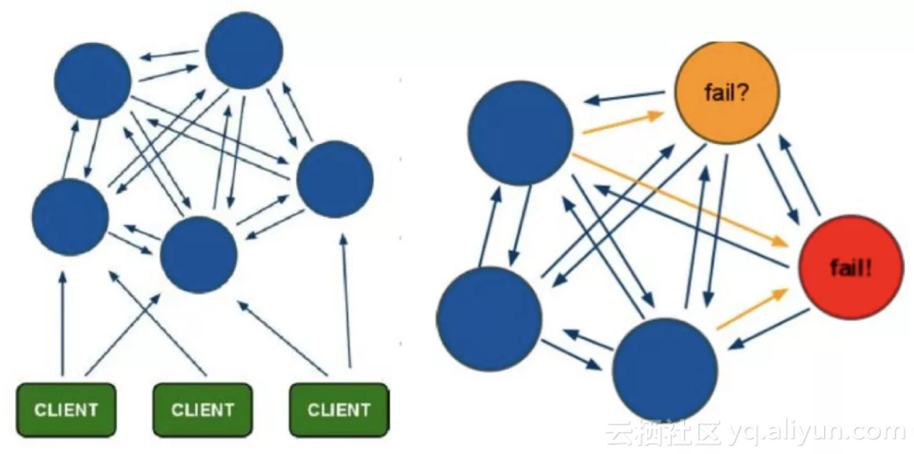

**优点：**

* 无中心架构；
* 数据按照slot存储分布在多个节点，节点间数据共享，可动态调整数据分布；
* 可扩展性：可线性扩展到1000多个节点，节点可动态添加或删除；
* 高可用性：部分节点不可用时，集群仍可用。通过增加Slave做standby数据副本，能够实现故障自动failover，节点之间通过gossip协议交换状态信息，用投票机制完成Slave到Master的角色提升；
* 降低运维成本，提高系统的扩展性和可用性。

**缺点：**

* Client实现复杂，驱动要求实现Smart Client，缓存slots mapping信息并及时更新，提高了开发难度，客户端的不成熟影响业务的稳定性。目前仅JedisCluster相对成熟，异常处理部分还不完善，比如常见的“max redirect exception”。
* 节点会因为某些原因发生阻塞（阻塞时间大于clutser-node-timeout），被判断下线，这种failover是没有必要的。
* 数据通过异步复制，不保证数据的强一致性。
* 多个业务使用同一套集群时，无法根据统计区分冷热数据，资源隔离性较差，容易出现相互影响的情况。
* Slave在集群中充当“冷备”，不能缓解读压力，当然可以通过SDK的合理设计来提高Slave资源的利用率。
* Key批量操作限制，如使用mset、mget目前只支持具有相同slot值的Key执行批量操作。对于映射为不同slot值的Key由于Keys不支持跨slot查询，所以执行mset、mget、sunion等操作支持不友好。
* Key事务操作支持有限，只支持多key在同一节点上的事务操作，当多个Key分布于不同的节点上时无法使用事务功能。
* Key作为数据分区的最小粒度，不能将一个很大的键值对象如hash、list等映射到不同的节点。
* 不支持多数据库空间，单机下的Redis可以支持到16个数据库，集群模式下只能使用1个数据库空间，即db 0。
* 复制结构只支持一层，从节点只能复制主节点，不支持嵌套树状复制结构。
* 避免产生hot-key，导致主库节点成为系统的短板。
* 避免产生big-key，导致网卡撑爆、慢查询等。
* 重试时间应该大于cluster-node-time时间。
* Redis Cluster不建议使用pipeline和multi-keys操作，减少max redirect产生的场景。

## 介绍下Redis自研

Redis自研的高可用解决方案，主要体现在配置中心、故障探测和failover的处理机制上，通常需要根据企业业务的实际线上环境来定制化。

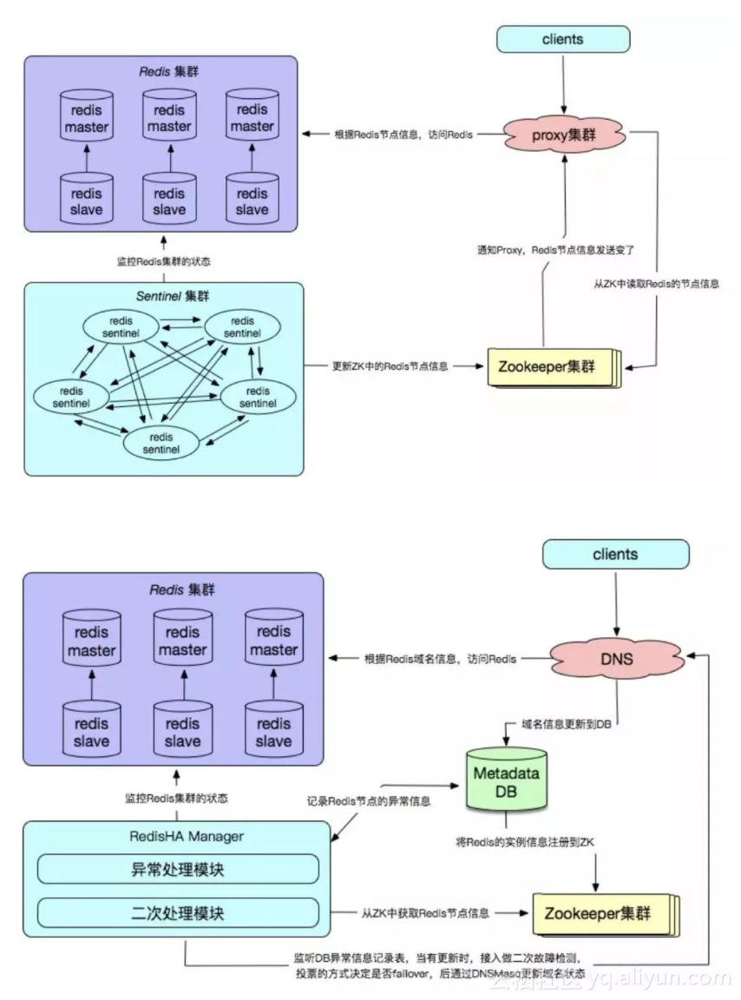

**优点：**

* 高可靠性、高可用性；
* 自主可控性高；
* 贴切业务实际需求，可缩性好，兼容性好。

**缺点：**

* 实现复杂，开发成本高；
* 需要建立配套的周边设施，如监控，域名服务，存储元数据信息的数据库等；
* 维护成本高。

## Redis高可用方案具体怎么实施？

使用官方推荐的哨兵(sentinel)机制就能实现，当主节点出现故障时，由Sentinel自动完成故障发现和转移，并通知应用方，实现高可用性。它有四个主要功能：

- 集群监控，负责监控Redis master和slave进程是否正常工作。
- 消息通知，如果某个Redis实例有故障，那么哨兵负责发送消息作为报警通知给管理员。
- 故障转移，如果master node挂掉了，会自动转移到slave node上。
- 配置中心，如果故障转移发生了，通知client客户端新的master地址。

## 故障转移时会从剩下的slave选举一个新的master，被选举为master的标准是什么？

如果一个master被认为odown了，而且majority哨兵都允许了主备切换，那么某个哨兵就会执行主备切换操作，此时首先要选举一个slave来，会考虑slave的一些信息。

* 跟master断开连接的时长。
  如果一个slave跟master断开连接已经超过了down-after-milliseconds的10倍，外加master宕机的时长，那么slave就被认为不适合选举为master.

```
( down-after-milliseconds * 10) + milliseconds_since_master_is_in_SDOWN_state
```

* slave优先级。
  按照slave优先级进行排序，slave priority越低，优先级就越高

* 复制offset。
  如果slave priority相同，那么看replica offset，哪个slave复制了越多的数据，offset越靠后，优先级就越高

* run id
  如果上面两个条件都相同，那么选择一个run id比较小的那个slave。

## Redis cluster中是如何实现数据分布的？这种方式有什么优点？

Redis cluster有固定的16384个hash slot（哈希槽），对每个key计算CRC16值，然后对16384取模，可以获取key对应的hash slot。

Redis cluster中每个master都会持有部分slot（槽），比如有3个master，那么可能每个master持有5000多个hash slot。

hash slot让node的增加和移除很简单，增加一个master，就将其他master的hash slot移动部分过去，减少一个master，就将它的hash slot移动到其他master上去。每次增加或减少master节点都是对16384取模，而不是根据master数量，这样原本在老的master上的数据不会因master的新增或减少而找不到。并且增加或减少master时Redis cluster移动hash slot的成本是非常低的。

## Redis cluster节点间通信是什么机制？

Redis cluster节点间采取gossip协议进行通信，所有节点都持有一份元数据，不同的节点如果出现了元数据的变更之后U不断地i将元数据发送给其他节点让其他节点进行数据变更。

> 节点互相之间不断通信，保持整个集群所有节点的数据是完整的。
> 主要交换故障信息、节点的增加和移除、hash slot信息等。

这种机制的好处在于，元数据的更新比较分散，不是集中在一个地方，更新请求会陆陆续续，打到所有节点上去更新，有一定的延时，降低了压力;

缺点，元数据更新有延时，可能导致集群的一些操作会有一些滞后。

## 了解RedLock吗？

Redlock是一种算法，Redlock也就是 Redis Distributed Lock，可用实现多节点Redis的分布式锁。

RedLock官方推荐，Redisson完成了对Redlock算法封装。

此种方式具有以下特性：

* 互斥访问：即永远只有一个 client 能拿到锁
* 避免死锁：最终 client 都可能拿到锁，不会出现死锁的情况，即使锁定资源的服务崩溃或者分区，仍然能释放锁。
* 容错性：只要大部分 Redis 节点存活（一半以上），就可以正常提供服务

## 什么是 RedLock？

获取当前时间（start）。

依次向 N 个 Redis节点请求锁。请求锁的方式与从单节点 Redis获取锁的方式一致。为了保证在某个 Redis节点不可用时该算法能够继续运行，获取锁的操作都需要设置超时时间，需要保证该超时时间远小于锁的有效时间。这样才能保证客户端在向某个 Redis节点获取锁失败之后，可以立刻尝试下一个节点。

计算获取锁的过程总共消耗多长时间（consumeTime = end - start）。如果客户端从大多数 Redis节点（>= N/2 + 1) 成功获取锁，并且获取锁总时长没有超过锁的有效时间，这种情况下，客户端会认为获取锁成功，否则，获取锁失败。

如果最终获取锁成功，锁的有效时间应该重新设置为锁最初的有效时间减去 consumeTime。

如果最终获取锁失败，客户端应该立刻向所有 Redis节点发起释放锁的请求。

## RedLock的原理

假设有5个完全独立的Redis主服务器

1. 获取当前时间戳

2. client尝试按照顺序使用相同的key,value获取所有Redis服务的锁，在获取锁的过程中的获取时间比锁过期时间短很多，这是为了不要过长时间等待已经关闭的Redis服务。并且试着获取下一个Redis实例。

  比如：TTL为5s,设置获取锁最多用1s，所以如果一秒内无法获取锁，就放弃获取这个锁，从而尝试获取下个锁

3. client通过获取所有能获取的锁后的时间减去第一步的时间，这个时间差要小于TTL时间并且至少有3个Redis实例成功获取锁，才算真正的获取锁成功

4. 如果成功获取锁，则锁的真正有效时间是 TTL减去第三步的时间差 的时间；比如：TTL 是5s,获取所有锁用了2s,则真正锁有效时间为3s(其实应该再减去时钟漂移);

5. 如果客户端由于某些原因获取锁失败，便会开始解锁所有Redis实例；因为可能已经获取了小于3个锁，必须释放，否则影响其他client获取锁

算法示意图如下：

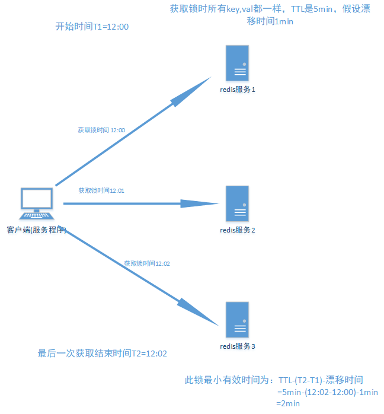


## 如果现在有个读超高并发的系统，用Redis来抗住大部分读请求，你会怎么设计？

如果是读高并发的话，先看读并发的数量级是多少，因为Redis单机的读QPS在万级，每秒几万没问题，使用一主多从+哨兵集群的缓存架构来承载每秒10W+的读并发，主从复制，读写分离。

使用哨兵集群主要是提高缓存架构的可用性，解决单点故障问题。主库负责写，多个从库负责读，支持水平扩容，根据读请求的QPS来决定加多少个Redis从实例。如果读并发继续增加的话，只需要增加Redis从实例就行了。

如果需要缓存1T+的数据，选择Redis cluster模式，每个主节点存一部分数据，假设一个master存32G，那只需要n*32G>=1T，n个这样的master节点就可以支持1T+的海量数据的存储了。

> Redis单主的瓶颈不在于读写的并发，而在于内存容量，即使是一主多从也是不能解决该问题，因为一主多从架构下，多个slave的数据和master的完全一样。假如master是10G那slave也只能存10G数据。所以数据量受单主的影响。
> 而这个时候又需要缓存海量数据，那就必须得有多主了，并且多个主保存的数据还不能一样。Redis官方给出的 Redis cluster 模式完美的解决了这个问题。

## Redis 实现原理或机制。

Redis 是一个 key-value 存储系统。和 Memcached 类似,但是解决了断电后数据完全丢失的情况,而且她支持更多无化的 value 类型,除了和 string 外,还支持
lists(链表)、sets(集合)和 zsets(有序集合)几种数据类型。这些数据类型都支持 push/pop、add/remove 及取交集并集和差集及更丰富的操作,而且这些操作都
是原子性的。

Redis 是一种基于客户端 - 服务端模型以及请求 / 响应协议的 TCP 服务。这意味着通常情况下一个请求会遵循以下步骤:

客户端向服务端发送一个查询请求,并监听 Socket 返回,通常是以阻塞模式,等待服务端响应。服务端处理命令,并将结果返回给客户端。

在服务端未响应时,客户端可以继续向服务端发送请求,并最终一次性读取所有服务端的响应。

Redis 管道技术最显著的优势是提高了 Redis 服务的性能。

分区是分割数据到多个 Redis 实例的处理过程,因此每个实例只保存 key 的一个子集。

通过利用多台计算机内存的和值,允许我们构造更大的数据库。

通过多核和多台计算机,允许我们扩展计算能力;通过多台计算机和网络适配器,允许我们扩展网络带宽。

Redis 的一些特性在分区方面表现的不是很好:

涉及多个 key 的操作通常是不被支持的。举例来说,当两个 set 映射到不同的Redis 实例上时,你就不能对这两个 set 执行交集操作。

涉及多个 key 的 Redis 事务不能使用。

当使用分区时,数据处理较为复杂,比如你需要处理多个 rdb/aof 文件,并且从多个实例和主机备份持久化文件。

增加或删除容量也比较复杂。Redis 集群大多数支持在运行时增加、删除节点的透明数据平衡的能力,但是类似于客户端分区、代理等其他系统则不支持这项特性。然而,一种叫做 presharding 的技术对此是有帮助的。

## Redis 有两种类型分区。

最简单的分区方式是按范围分区,就是映射一定范围的对象到特定的 Redis 实例。

比如,ID 从 0 到 10000 的用户会保存到实例 R0,ID 从 10001 到 20000 的用户会保存到 R1,以此类推。

这种方式是可行的,并且在实际中使用,不足就是要有一个区间范围到实例的映射表。这个表要被管理,同时还需要各 种对象的映射表,通常对 Redis 来说并非是好的方法。

哈希分区:另外一种分区方法是 hash 分区。这对任何 key 都适用,也无需是object_name: 这种形式,像下面描述的一样简单:

用一个 hash 函数将 key 转换为一个数字,比如使用 crc32 hash 函数。对 key foobar 执行 crc32(foobar) 会输出类似 93024922 的整数。

对这个整数取模,将其转化为 0-3 之间的数字,就可以将这个整数映射到 4 个Redis 实例中的一个了。93024922 % 4 = 2,就是说 key foobar 应该被存到 R2实例中。注意:取模操作是取除的余数,通常在多种编程语言中用 % 操作符实现。

实际上,上面的集群模式还存在两个问题:

1. 扩容问题:

因为使用了一致性哈稀进行分片,那么不同的 key 分布到不同的 Redis-Server 上,当我们需要扩容时,需要增加机器到分片列表中,这时候会使得同样的 key 算出来落到跟原来不同的机器上,这样如果要取某一个值,会出现取不到的情况,对于这种情况,Redis 的作者提出了一种名为 Pre-Sharding 的方式:

Pre-Sharding 方法是将每一个台物理机上,运行多个不同断口的 Redis 实例,假如有三个物理机,每个物理机运行三个 Redis 实际,那么我们的分片列表中实际有 9 个 Redis 实例,当我们需要扩容时,增加一台物理机,步骤如下:

在新的物理机上运行 Redis-Server;

该 Redis-Server 从属于 (slaveof) 分片列表中的某一 Redis-Server(假设叫 RedisA);

等主从复制 (Replication) 完成后,将客户端分片列表中 RedisA 的IP 和端口改为新物理机上 Redis-Server 的 IP 和端口;

停止 RedisA。

这样相当于将某一 Redis-Server 转移到了一台新机器上。Prd-Sharding 实际上是一种在线扩容的办法,但还是很依赖 Redis 本身的复制功能的,如果主库快照数据文件过大,这个复制的过程也会很久,同时会给主库带来压力。所以做这个拆分的过程最好选择为业务访问低峰时段进行。

2. 单点故障问题:

还是用到 Redis 主从复制的功能,两台物理主机上分别都运行有 Redis-Server,其中一个 Redis-Server 是另一个的从库,采用双机热备技术,客户端通过虚拟 IP 访问主库的物理 IP,当主库宕机时,切换到从库的物理 IP。只是事后修复主库时,应该将之前的从库改为主库(使用命令 slaveof no one),主库变为其从库(使命令 slaveof IP PORT),这样才能保证修复期间新增数据的一致性。

## redis键（key）常用命令

| 命令                             | 注释                                                   |
| -------------------------------- | ------------------------------------------------------ |
| keys *                           | 获取所有的key                                          |
| select 0（库角标）               | 选择第几个库                                           |
| move key 0（库角标）             | 将当前的数据库key移动到某个数据库,目标库有，则不能移动 |
| flush 0（库角标）                | 清除指定库                                             |
| randomkey                        | 获取随机key                                            |
| type key                         | key的类型                                              |
| set key value                    | 设置key和value                                         |
| get key                          | 获取key的value                                         |
| mset key1 value1 key2 value2     | 批量设置key、value                                     |
| mget key1 key2 key3              | 批量获取value                                          |
| del key                          | 删除key                                                |
| exists key                       | 判断是否存在key                                        |
| expire key second（秒）          | 给key设置过期时间                                      |
| pexpire key millisecond （毫秒） | 给key设置过期时间                                      |
| persist key                      | 删除过期时间，持久保存key                              |


## String类型

String是redis最基本的类型，你可以理解成与Memcached一模一样的类型，一个key对应一个value。

String类型是二进制安全的。意思是redis的string可以包含任何数据。比如jpg图片或者序列化的对象 。

String类型是Redis最基本的数据类型，一个redis中字符串value最多可以是`512M`

存储结构类似：`key:value`

常用命令

| 命令                                  | 注释                                           |
| ------------------------------------- | ---------------------------------------------- |
| set key value                         | 设置值                                         |
| get key                               | 获取值                                         |
| getrange key start end                | 获取指定范围的value                            |
| getset key value                      | 设置新value，并返回旧value                     |
| getbit key offset                     | 获取字符串中某个位置的字符                     |
| mget key1 key2                        | 获取多个value                                  |
| setex key second（秒） value          | 设置key、value，同时设置过期时间               |
| setnx key value                       | key不存在时设置key                             |
| setrange key offset value             | 用新value替换老value部分字符，从offset开始替换 |
| strlen key                            | 获取value长度                                  |
| mset key1 value1 key2 value2          | 批量设置key、value                             |
| msetnx key1 value1 key2 value2        | 批量设置，当且仅当所有要设置的key都不存在时    |
| psetex key milliseconds（毫秒） value | 设置过期时间，单位毫秒                         |
| incr key                              | 如果value是数字，使用这个语法使数字自增1       |
| incrby key increment                  | 给value增加指定的值increment                   |
| decr key                              | 给value减去1                                   |
| decrby key decrement                  | 给value减去指定的值decrement                   |
| append key value                      | 将value追加到key原来的value尾部                |

## List类型

它是一个字符串链表，left、right都可以插入添加；

如果键不存在，创建新的链表；
如果键已存在，新增内容；
如果值全移除，对应的键也就消失了。

链表的操作无论是头和尾效率都极高，但假如是对中间元素进行操作，效率就很惨淡了。

`key`是列表的名称，`value`是列表。

存储结构类似：`key:[value1, value2, value3, value4]`

常用命令

| 命令                                  | 注释                                                         |
| ------------------------------------- | ------------------------------------------------------------ |
| blpop key timeout                     | 在timeout时间内，获取并移除列表的第一个元素                  |
| brpop key1 timeout                    | 在timeout时间内，获取并移除列表的最后一个元素                |
| brpoplpush source destination timeout | 在timeout时间内，从source列表中取出一个值，放到destination列表中 |
| lindex key index                      | 获取列表index位置的值                                        |
| linsert key BEFORE                    | AFTER value1 value2                                          |
| llen key                              | 返回列表的长度                                               |
| lpop key                              | 获取并移除列表的第一个元素                                   |
| lpush key value value2                | 将一个或多个value插入到列表的头部                            |
| lpushx key value                      | 当key已经存在的时候，向列表的头部插入value                   |
| lrange key start end                  | 获取列表部分数据，从start到end范围                           |
| lrem key count value                  | count>0，从列表的头部开始算起，移除count个value相同的数据；count<0，从列表的尾部开始算起，移除count绝对值个value相同的数据；count=0，全部移除value相同的数据 |
| lset key index value                  | 在列表index位置设置value                                     |
| ltrim key start end                   | 保留start到end内的数据，其余的全部删除                       |
| rpop key                              | 获取并移除列表最后一个元素                                   |
| rpoplpush source destination          | 移除source列表最后一个元素，并把该元素添加到destination列表的头部 |
| RPUSH key value1 value2               | 将一个或多个value添加到列表的尾部                            |
| rpushx key value                      | 为已经存在的列表添加值                                       |

## Hash类型

hash 是一个 string 类型的 field（字段） 和 value（值） 的映射表，hash 特别适合用于存储对象。

存储结构类似：`key:{field1:value1, field2:value2, field3:value3}`

如：HMSET `keyName` `name` "redis tutorial" `description` "redis basic commands for caching"

常用命令

| 命令                                           | 注释                                                     |
| ---------------------------------------------- | -------------------------------------------------------- |
| hdel key field1 field2                         | 删除key中一个或多个field及value                          |
| hexists key field                              | 查看哈希表key中，指定的field字段是否存在                 |
| hget key field                                 | 在key中查找filed字段的value值                            |
| hgetall key                                    | 获取在哈希表中指定 key 的所有字段和值                    |
| hincrby key field increment                    | 为哈希表 key 中的指定字段的整数值加上增量increment       |
| hincrbyfloat key field increment               | 为哈希表 key 中的指定字段的浮点数值加上增量 increment 。 |
| hkeys key                                      | 获取所有哈希表中的字段                                   |
| hlen key                                       | 获取哈希表中字段的数量                                   |
| hmget key field1 field2                        | 获取所有指定字段的值                                     |
| hmset key field1 value1 field2 value2          | 同时将多个 field-value对设置到哈希表 key 中              |
| hset key field value                           | 将哈希表 key 中的字段 field 的值设为 value 。            |
| hsetnx key field value                         | 只有在字段 field 不存在时，设置哈希表字段的值。          |
| hvals key                                      | 获取哈希表中所有值。                                     |
| hscan key cursor [MATCH pattern] [COUNT count] | 迭代哈希表中的键值对。                                   |

## set类型

Redis 的 Set 是 String 类型的无序集合。集合成员是唯一的，这就意味着集合中不能出现重复的数据。

Redis 中集合是通过哈希表实现的，所以添加，删除，查找的复杂度都是 O(1)。

存储结构类似：`key:("value1", "value2", "value3")`

常用命令

| 命令                                           | 注释                                                         |
| ---------------------------------------------- | ------------------------------------------------------------ |
| sadd key value1 value2                         | 向集合添加一个或多个成员                                     |
| scard key                                      | 获取集合的成员数大小                                         |
| sdiff key1 key2 key3                           | 返回第一个集合与其他集合之间的差异。                         |
| sdiffstore destination key1 key2               | 返回给定所有集合的差集并存储在 destination 新key中           |
| sinter key1 key2                               | 返回给定所有集合的交集                                       |
| sinterstore destination key1 key2              | 返回给定所有集合的交集并存储在 destination 新key中           |
| sismember key value                            | 判断key的集合中是否存在value                                 |
| smembers key                                   | 返回key集合中所有的value                                     |
| smove source destination value                 | 将 value 元素从 source的key 集合移动到 destination的key 集合中 |
| spop key                                       | 随机获取并移除key中的一个value                               |
| srandmember key count                          | 随机返回集合中count个value                                   |
| srem key value1 value2                         | 移除集合中一个或多个value                                    |
| sunion key1 key2                               | 返回所有给定集合的并集                                       |
| sunionstore destination key1 key2              | 所有给定集合的并集存储在 destination key集合中               |
| SSCAN key cursor [MATCH pattern] [COUNT count] | 迭代集合中的元素                                             |

## Zset(sorted set)类型

Redis 有序集合和集合一样也是string类型元素的集合,且不允许重复的成员。

不同的是每个元素都会关联一个double类型的分数。redis正是通过分数来为集合中的成员进行从小到大的排序。

有序集合的成员是唯一的,但分数(score)却可以重复。

集合是通过哈希表实现的，所以添加，删除，查找的复杂度都是O(1)。 集合中最大的成员数为 232 - 1 (4294967295, 每个集合可存储40多亿个成员)。

存储结构类似：`key:{score1:value1, score2:value2, score3:value3, }`

常用命令

| 命令                                           | 注释                                                         |
| ---------------------------------------------- | ------------------------------------------------------------ |
| zadd key score1 value1 score2 value2           | 向有序集合添加一个或多个成员，或者更新已存在成员的分数       |
| zcard key                                      | 获取有序集合的成员数                                         |
| zcount key min max                             | 计算在有序集合中指定区间分数的成员数                         |
| zincrby key increment value                    | 有序集合中对指定成员的分数加上增量 increment                 |
| zinterstore destination numkeys key [key ...]  | 计算给定的一个或多个有序集的交集并将结果集存储在新的有序集合 key 中 |
| zlexcount key min max                          | 在有序集合中计算指定字典区间内成员数量                       |
| zrange key start stop [WITHSCORES]             | 通过索引区间返回有序集合指定区间内的成员                     |
| zrangebylex key min max [LIMIT offset count]   | 通过字典区间返回有序集合的成员                               |
| zrangebyscore key min max [WITHSCORES] [LIMIT] | 通过分数返回有序集合指定区间内的成员                         |
| zrank key value                                | 返回有序集合中指定成员的索引                                 |
| zrem key value [value ...]                     | 移除有序集合中的一个或多个成员                               |
| zremrangebylex key min max                     | 移除有序集合中给定的字典区间的所有成员                       |
| zremrangebyrank key start end                  | 移除有序集合中给定的排名区间的所有成员                       |
| zremrangebyscore key min max                   | 移除有序集合中给定的分数区间的所有成员                       |
| zrevrange key start stop [WITHSCORES]          | 返回有序集中指定区间内的成员，通过索引，分数从高到低         |
| zrevrangebyscore key max min [WITHSCORES]      | 返回有序集中指定分数区间内的成员，分数从高到低排序           |
| zrevrank key value                             | 返回有序集合中指定成员的排名，有序集成员按分数值递减(从大到小)排序 |
| zscore key value                               | 返回有序集中，成员的分数值                                   |
| zunionstore destination numkeys key [key ...]  | 计算给定的一个或多个有序集的并集，并存储在新的 key 中        |
| zscan key cursor [MATCH pattern] [COUNT count] | 迭代有序集合中的元素（包括元素成员和元素分值）               |

## sentinel.conf主要配置讲解

在每个主从Redis目录下新建一个名为sentinel.conf的文件，在该文件下配置如下命令。

`命令总格式`：sentinel <option_name> <master_name> <option_value>

一：配置sentinel监控master

`示例`：sentinel monitor mymaster 127.0.0.1 6380 1

`详解`：sentinel监控的master的名字叫做mymaster，地址为127.0.0.1:6380；sentinel在集群中，需要多个sentinel互相沟通来确认某个master是否真的死了；数字1代表，当集群中有1个sentinel认为master死了时，才能真正认为该master已经不可用了。

二：配置sentinel心跳

`示例`：sentinel down-after-milliseconds mymaster 5000

`详解`：sentinel向master发送心跳PING，确认master是否存活，如果master在`down-after-milliseconds`时间（单位毫秒）范围内没有给sentinel回应`PONG`，或者回复一个错误消息，那么sentinel就主观的认为这个master不可用了

三：配置主从切换时，同步新master的salve个数

`示例`：sentinel parallel-syncs mymaster 1

`详解`：在发生failover主备切换时，这个选项指定了最多可以有多少个slave同时对新的master进行同步数据。这个数字越小，完成failover所需的时间就越长，但是如果这个数字越大，就意味着越多的slave因为replication而不可用。可以设为 1 来保证每次只有一个slave处于不能处理命令请求的状态

四：配置故障转移最大时间

`示例`：sentinel failover-timeout mymaster 60000（毫秒）

`详解`：若Sentinel进程在该配置值内未能完成故障转移的操作，则认为本次故障转移操作失败。

五：配置报警脚本

`示例`：sentinel notification-script mymaster <script-path>

`详解`：Sentinel检测到Master主服务器异常时，所要调用的报警脚本。

## sentinel配置文件示例

大家按照这个配置，分别给3个sentinel节点进行配置

```
# 哨兵sentinel实例运行的端口 默认26379
port 26379

#以守护进程模式启动
daemonize yes

# 哨兵sentinel的工作目录
dir /tmp

#日志文件名
logfile "sentinel_26379.log"

# sentinel监控的master主机
sentinel monitor mymaster 192.168.1.108 6379 2

# sentinel连接主从密码验证，注意必须为主从设置一样的密码
# sentinel auth-pass <master-name> <password>
sentinel auth-pass mymaster 1234

# 指定多少毫秒之后 主节点没有应答哨兵sentinel 此时 哨兵主观上认为主节点下线 默认30秒
sentinel down-after-milliseconds mymaster 30000

sentinel parallel-syncs mymaster 1

# 失效转移最大时间设置
sentinel failover-timeout mymaster 180000

#如果了这个脚本路径，那么必须保证这个脚本存在于这个路径，并且是可执行的，否则sentinel无法正常启动成功。
sentinel notification-script mymaster /var/redis/notify.sh  
```

启动sentinel

`方式1`：redis-sentinel redis-sentinel.conf

`方式2`：redis-server sentinel.conf --sentinel

验证主从切换

kill掉master主节点，模拟主机出现故障

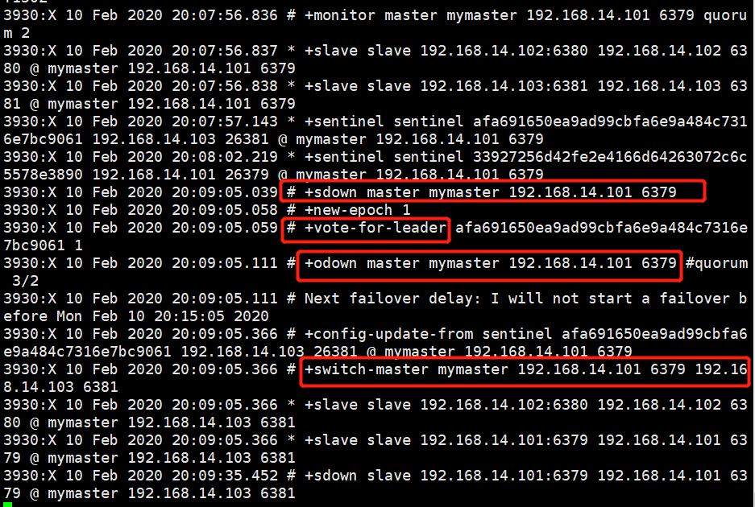

上面截图红框框住的几个重要信息，这里先介绍最后一行，`switch-master mymaster` 192.168.14.101 6379 192.168.14.103 6381，表示master服务器由`6379`切换为`6381`端口的redis服务器。

`PS:+switch-master` 表示切换主节点

查看6381端口Redis服务器

通过命令info replication查看，我们发现,6381的Redis服务已经切换成master节点了. 

另外，也可以查看sentinel.conf 配置文件，里面的 sentinel monitor mymaster 192.168.14.101 6379 2 也自动更改为6381了


至此，哨兵模式搭建验证完成。

## 全量复制的开销

**①**bgsave时间

**②**rdb文件网络传输时间

**③**从节点清空数据的

**④**从节点加载rdb的时间

**⑤**可能的aof重写时间，这是针对从节点，例如开启了aof之后，从节点添加buffer数据时候，可能需要aof重写

基于上面的原因，有的情况下不适合使用全量复制，例如网络抖动之后，从节点只需要传送一部分数据，不需要传送全部数据，`redis2.8`之后实现了部分复制功能

## 部分复制

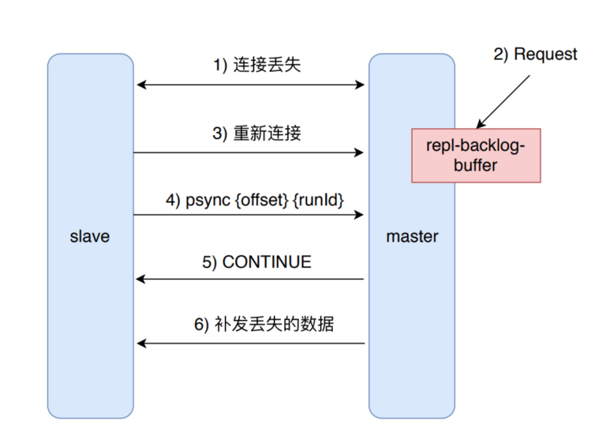

**①**假设发送网络抖动或者别的情况，暂时失去了连接

**②**这个时候，master还在继续往buffer里面写数据

**③**slave重新连接上了master

**④**slave向master发送自己的offset和runid

**⑤**master判断slave的offset是否在buffer的队列里面，如果是，那就返回continue给slave，否则需要进行全量复制（因为这说明已经错过了很多数据了）

**⑥**master发送从slave的offset开始到缓冲区队列结尾的数据给slave

## 手写一个 LRU 算法

```java
class LRUCache<K, V> extends LinkedHashMap<K, V> {
    private final int CACHE_SIZE;

    /**
     * 传递进来最多能缓存多少数据
     *
     * @param cacheSize 缓存大小
     */
    public LRUCache(int cacheSize) {
        // true 表示让 linkedHashMap 按照访问顺序来进行排序，最近访问的放在头部，最老访问的放在尾部。
        super((int) Math.ceil(cacheSize / 0.75) + 1, 0.75f, true);
        CACHE_SIZE = cacheSize;
    }

    @Override
    protected boolean removeEldestEntry(Map.Entry<K, V> eldest) {
        // 当 map中的数据量大于指定的缓存个数的时候，就自动删除最老的数据。
        return size() > CACHE_SIZE;
    }
}
```


## jedis 和 Redisson 有哪些区别？

jedis：提供了比较全面的 Redis 命令的支持。

Redisson：实现了分布式和可扩展的 Java 数据结构，与 jedis 相比 Redisson 的功能相对简单，不支持排序、事务、管道、分区等 Redis 特性。

## 请问Redis的rehash怎么做的，为什么要渐进rehash，渐进rehash又是怎么实现的?

因为redis是单线程，当K很多时，如果一次性将键值对全部rehash，庞大的计算量会影响服务器性能，甚至可能会导致服务器在一段时间内停止服务。不可能一步完成整个rehash操作，所以redis是分多次、渐进式的rehash。渐进性哈希分为两种：

**1）操作redis时，额外做一步rehash**

对redis做读取、插入、删除等操作时，会把位于table[dict->rehashidx]位置的链表移动到新的dictht中，然后把rehashidx做加一操作，移动到后面一个槽位。

**2）后台定时任务调用rehash**

后台定时任务rehash调用链，同时可以通过server.hz控制rehash调用频率

## 请问Redis的数据类型底层怎么实现?

1）字符串：整数值、embstr编码的简单动态字符串、简单动态字符串（SDS)

2）列表：压缩列表、双端链表

3）哈希：压缩列表、字典

4）集合：整数集合、字典

5）有序集合：压缩列表、跳跃表和字典

## 动态字符串SDS

SDS是"simple dynamic string"的缩写。 redis中所有场景中出现的字符串，基本都是由SDS来实现的

- 所有非数字的key。例如set msg "hello world" 中的key msg.

- 字符串数据类型的值。例如`` set msg "hello world"中的msg的值"hello wolrd"

- 非字符串数据类型中的“字符串值”。例如RPUSH fruits "apple" "banana" "cherry"中的"apple" "banana" "cherry"

**SDS长这样：**

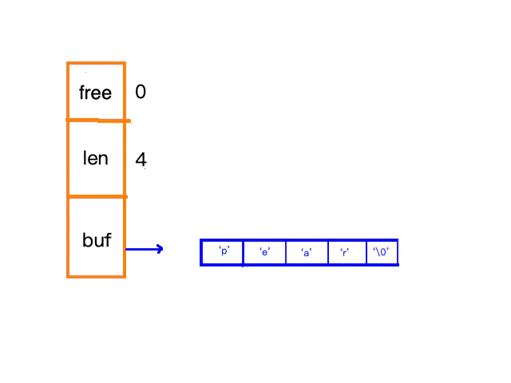

- free:还剩多少空间 

- len:字符串长度 

- buf:存放的字符数组

**空间预分配**

为减少修改字符串带来的内存重分配次数，sds采用了“一次管够”的策略：

- 若修改之后sds长度小于1MB,则多分配现有len长度的空间

- 若修改之后sds长度大于等于1MB，则扩充除了满足修改之后的长度外，额外多1MB空间

**惰性空间释放**

为避免缩短字符串时候的内存重分配操作，sds在数据减少时，并不立刻释放空间。

## 双向链表

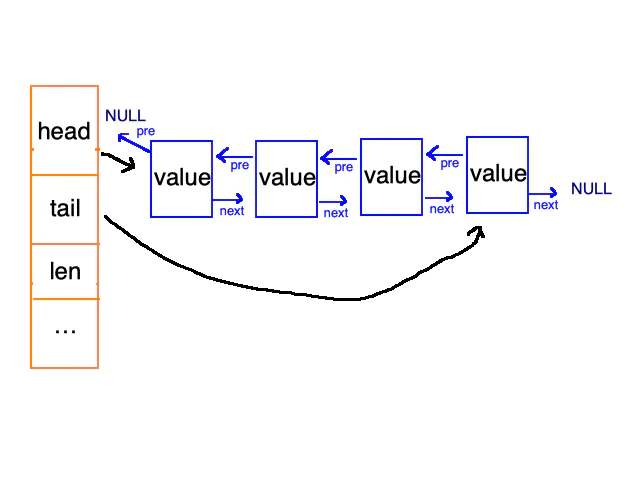

分两部分，一部分是“统筹部分”：橘黄色，

一部分是“具体实施方“：蓝色。

主体”统筹部分“：

- head指向具体双向链表的头
- tail指向具体双向链表的尾
- len双向链表的长度

具体"实施方"：一目了然的双向链表结构，有前驱pre有后继next

由list和listNode两个数据结构构成。

## ziplist

压缩列表。 redis的列表键和哈希键的底层实现之一。此数据结构是为了节约内存而开发的。

和各种语言的数组类似，它是由连续的内存块组成的，这样一来，由于内存是连续的，就减少了很多内存碎片和指针的内存占用，进而节约了内存。

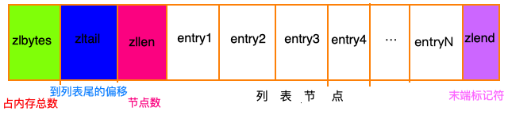

然后文中的entry的结构是这样的：


元素的遍历

然后再根据ziplist节点元素中的previous_entry_length属性，来逐个遍历:

**连锁更新**

再次看看entry元素的结构，有一个previous_entry_length字段，他的长度要么都是1个字节，要么都是5个字节：

- 前一节点的长度小于254字节，则previous_entry_length长度为1字节

- 前一节点的长度大于254字节，则previous_entry_length长度为5字节

假设现在存在一组压缩列表，长度都在250字节至253字节之间，突然新增一新节点new， 长度大于等于254字节，会出现：

程序需要不断的对压缩列表进行空间重分配工作，直到结束。

除了增加操作，删除操作也有可能带来“连锁更新”。 请看下图，ziplist中所有entry节点的长度都在250字节至253字节之间，big节点长度大于254字节，small节点小于254字节。

## 哈希表

哈希表略微有点复杂。哈希表的制作方法一般有两种，一种是：开放寻址法，一种是拉链法。redis的哈希表的制作使用的是拉链法。

整体结构如下图：

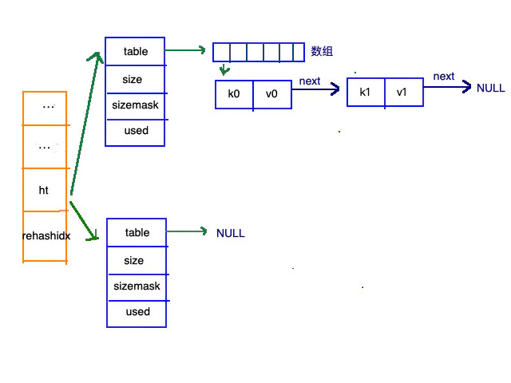

也是分为两部分：左边橘黄色部分和右边蓝色部分，同样，也是”统筹“和”实施“的关系。 具体哈希表的实现，都是在蓝色部分实现的。 先来看看蓝色部分：

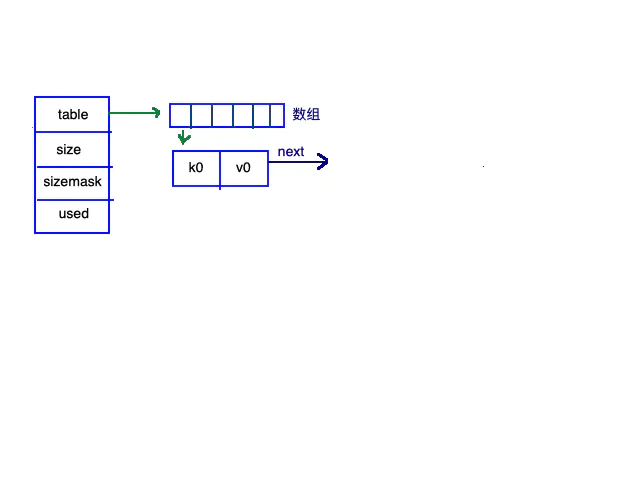

这也分为左右两边“统筹”和“实施”的两部分。

右边部分很容易理解：就是通常拉链表实现的哈希表的样式；数组就是bucket，一般不同的key首先会定位到不同的bucket，若key重复，就用链表把冲突的key串起来。

**新建key的过程：**

**假如重复了:**

**rehash**

再来看看哈希表总体图中左边橘黄色的“统筹”部分，其中有两个关键的属性：ht和rehashidx。
ht是一个数组，有且只有俩元素ht[0]和ht[1];其中，ht[0]存放的是redis中使用的哈希表，而ht[1]和rehashidx和哈希表的rehash有关。

rehash指的是重新计算键的哈希值和索引值，然后将键值对重排的过程。

加载因子（load factor） = ht[0].used / ht[0].size。

**扩容和收缩标准**

扩容：

- 没有执行BGSAVE和BGREWRITEAOF指令的情况下，哈希表的加载因子大于等于1。

- 正在执行BGSAVE和BGREWRITEAOF指令的情况下，哈希表的加载因子大于等于5。

收缩:

- 加载因子小于0.1时，程序自动开始对哈希表进行收缩操作。

**扩容和收缩的数量**

扩容：第一个大于等于ht[0].used * 2的2^n(2的n次方幂)。

收缩：第一个大于等于ht[0].used的2^n(2的n次方幂)。

## intset

整数集合是集合键的底层实现方式之一。

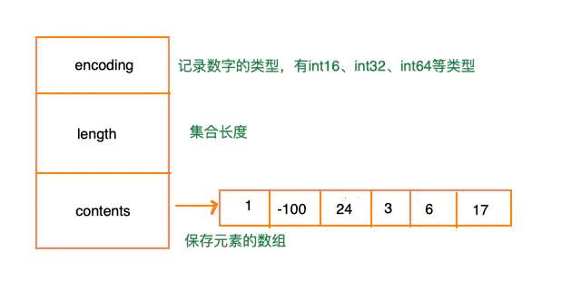

## 跳表

跳表这种数据结构长这样：

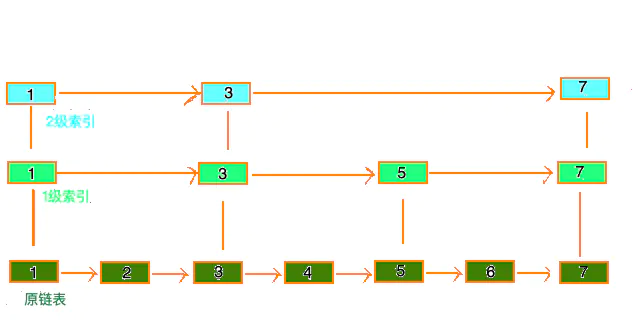

redis中把跳表抽象成如下所示：

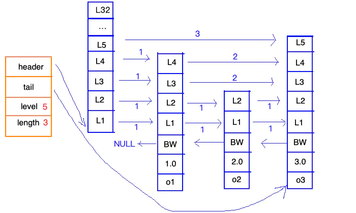

看这个图，左边“统筹”，右边实现。 统筹部分有以下几点说明：

- header: 跳表表头
- tail:跳表表尾
- level:层数最大的那个节点的层数
- length：跳表的长度

实现部分有以下几点说明：

- 表头：是链表的哨兵节点，不记录主体数据。

- 是个双向链表

- 分值是有顺序的

- o1、o2、o3是节点所保存的成员，是一个指针，可以指向一个SDS值。

- 层级高度最高是32。没每次创建一个新的节点的时候，程序都会随机生成一个介于1和32之间的值作为level数组的大小，这个大小就是“高度”

## 什么是布隆过滤器

布隆过滤器（Bloom Filter），是1970年，由一个叫布隆的小伙子提出的，距今已经五十年了，和老哥一样老。

它实际上是一个很长的二进制向量和一系列随机映射函数，二进制大家应该都清楚，存储的数据不是0就是1，默认是0。

主要用于判断一个元素是否在一个集合中，0代表不存在某个数据，1代表存在某个数据。
                                                       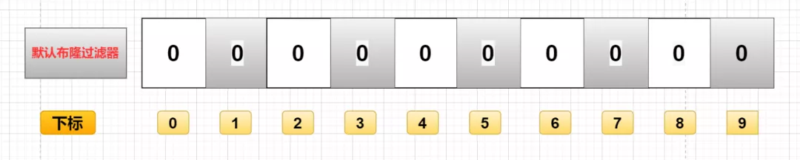

## 布隆过滤器用途

- 解决Redis缓存穿透（今天重点讲解）

- 在爬虫时，对爬虫网址进行过滤，已经存在布隆中的网址，不在爬取。

- 垃圾邮件过滤，对每一个发送邮件的地址进行判断是否在布隆的黑名单中，如果在就判断为垃圾邮件。

以上只是简单的用途举例，大家可以举一反三，灵活运用在工作中。
                                                       

## 布隆过滤器原理

存入数据过程

布隆过滤器上面说了，就是一个二进制数据的集合。当一个数据加入这个集合时，经历如下洗礼（这里有缺点，下面会讲）：

- 通过K个哈希函数计算该数据，返回K个计算出的hash值

- 这些K个hash值映射到对应的K个二进制的数组下标

- 将K个下标对应的二进制数据改成1。       
          

例如，第一个哈希函数返回x，第二个第三个哈希函数返回y与z，那么：X、Y、Z对应的二进制改成1。

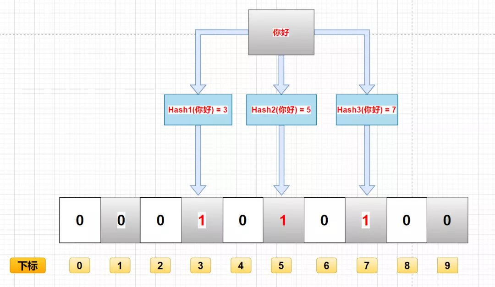

查询数据过程

布隆过滤器主要作用就是查询一个数据，在不在这个二进制的集合中，查询过程如下：

- 通过K个哈希函数计算该数据，对应计算出的K个hash值

- 通过hash值找到对应的二进制的数组下标

- 判断：如果存在一处位置的二进制数据是0，那么该数据不存在。如果都是1，该数据存在集合中。（这里有缺点，下面会讲）

删除数据过程                                         

一般不能删除布隆过滤器里的数据，这是一个缺点之一，我们下面会分析。

## 布隆过滤器的优缺点

优点

- 由于存储的是二进制数据，所以占用的空间很小

- 它的插入和查询速度是非常快的，时间复杂度是O（K），可以联想一下HashMap的过程

- 保密性很好，因为本身不存储任何原始数据，只有二进制数据

缺点

这就要回到我们上面所说的那些缺点了。

添加数据是通过计算数据的hash值，那么很有可能存在这种情况：两个不同的数据计算得到相同的hash值。

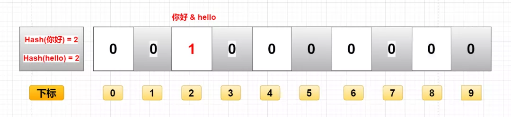

例如图中的“你好”和“hello”，假如最终算出hash值相同，那么他们会将同一个下标的二进制数据改为1。

这个时候，你就不知道下标为2的二进制，到底是代表“你好”还是“hello”。

**由此得出如下缺点：**

**一、存在误判**

假如上面的图没有存"hello"，只存了"你好"，那么用"hello"来查询的时候，会判断"hello"存在集合中。

**二、删除困难**

还是用上面的举例，因为“你好”和“hello”的hash值相同，对应的数组下标也是一样的。

这时候老哥想去删除“你好”，将下标为2里的二进制数据，由1改成了0。

那么我们是不是连“hello”都一起删了呀。（0代表有这个数据，1代表没有这个数据）

## 实现布隆过滤器方式

有很多种实现方式，其中一种就是Guava提供的实现方式。

```java
import com.google.common.hash.BloomFilter;
import com.google.common.hash.Funnels;

public class BloomFilterCase {

  /**
   * 预计要插入多少数据
   */
  private static int size = 1000000;

  /**
   * 期望的误判率
   */
  private static double fpp = 0.01;

  /**
   * 布隆过滤器
   */
  private static BloomFilter<Integer> bloomFilter = BloomFilter.create(Funnels.integerFunnel(), size, fpp);


  public static void main(String[] args) {
    // 插入10万样本数据
    for (int i = 0; i < size; i++) {
      bloomFilter.put(i);
    }

    // 用另外十万测试数据，测试误判率
    int count = 0;
    for (int i = size; i < size + 100000; i++) {
      if (bloomFilter.mightContain(i)) {
        count++;
        System.out.println(i + "误判了");
      }
    }
    System.out.println("总共的误判数:" + count);
  }
}
```

运行结果：

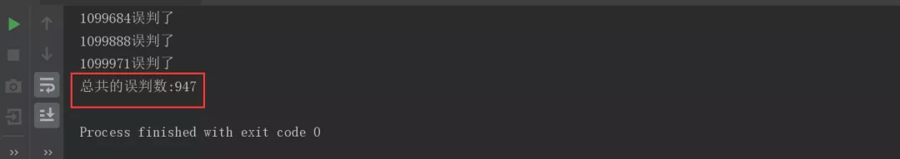

10万数据里有947个误判，约等于0.01%，也就是我们代码里设置的误判率：fpp = 0.01。

## 布隆过滤器解决缓存穿透

其实布隆过滤器本质来讲，就是起到一个黑名单或者白名单的作用。我们从这两个角度去分析缓存穿透问题。

白名单解决缓存穿透

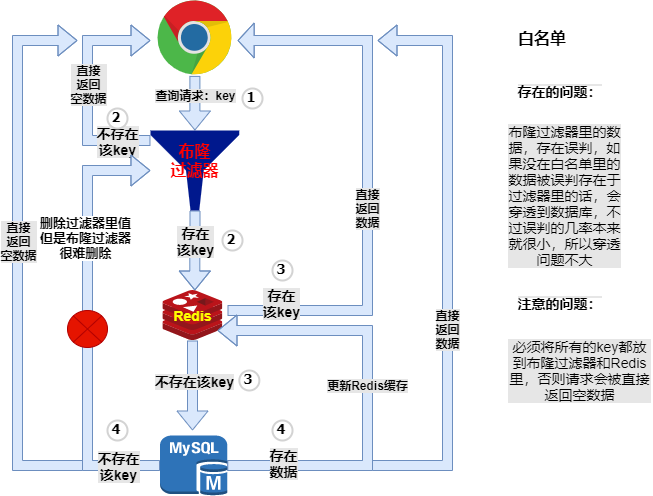

**注意问题**

- 如果没在白名单里的数据被误判存在于过滤器里的话，会穿透到数据库，不过误判的几率本来就很小，所以穿透问题不大。

- 必须将所有的查询key都放到布隆过滤器和Redis里，否则请求会被直接返回空数据。

代码实现

```java
import com.alibaba.fastjson.JSON;
import com.bilibili.itlaoge.model.User;
import org.redisson.Redisson;
import org.redisson.api.RBloomFilter;
import org.redisson.api.RBucket;
import org.redisson.api.RedissonClient;
import org.redisson.config.Config;

/**
 * 解决缓存穿透—白名单
 */
public class RedissonBloomFilter {

    /**
     * 构造Redisson
     */
    static RedissonClient redisson = null;

    static RBloomFilter<String> bloomFilter = null;

    static {
      Config config = new Config();
      config.useSingleServer().setAddress("redis://127.0.0.1:6379");

      //构造Redisson
      redisson = Redisson.create(config);
      //构造布隆过滤器
      bloomFilter = redisson.getBloomFilter("userIdFilter");

      // 将查询数据放入Redis缓存和布隆过滤器里
      initData(redisson, bloomFilter);
  }
  
  private static void initData(RedissonClient redisson, RBloomFilter<String> bloomFilter) {

      //初始化布隆过滤器：预计元素为100000000L,误差率为3%
      bloomFilter.tryInit(100000000L,0.01);

      //将id为1的数据，插入到布隆过滤器中
      bloomFilter.add("1");
      bloomFilter.add("2");

      // 将id为1对应的user数据，插入到Redis缓存中
      redisson.getBucket("1").set("{id:1, userName:'张三', age:18}");
    }

    public static void main(String[] args) {

      User user = getUserById(2L);
      System.out.println("user对象为：" + JSON.toJSONString(user));
    }

    public static User getUserById(Long id) {

      if (null == id) {
          return null;
      }
      String idKey = id.toString();

      // 开始模拟缓存穿透
      // 前端查询请求key
      if (bloomFilter.contains(idKey)) {

          // 通过了过滤器白名单校验，去Redis里查询真正的数据
          RBucket<Object> bucket = redisson.getBucket(idKey);
          Object object = bucket.get();

          // 如果Redis有数据，直接返回该数据
          if (null != object) {
              System.out.println("从Redis里面查询出来的");
              String userStr = object.toString();
              return JSON.parseObject(userStr, User.class);
          }

          // 如果Redis为空，去查询数据库
          User user = selectByDb(idKey);
          if (null == user) {
              return null;
          } else {
              // 将数据重新刷进缓存
              redisson.getBucket(id.toString()).set(JSON.toJSONString(user));
          }
          return user;
      }

      return null;
    }

    private static User selectByDb(String id) {
      System.out.println("从MySQL里面查询出来的");
      User user = new User();
      user.setId(1L);
      user.setUserName("张三");
      user.setAge(18);
      return user;
    }

}
```

```java
/**
 * 用户实体类
 * @author hp
 */
public class User implements Serializable {

    public static String maYunPhone = "18890019390";

    private Long id;

    /**
     * 用户名
     */
    private String userName;

    /**
     * 年龄
     */
    private Integer age;
}
```

黑名单解决缓存穿透

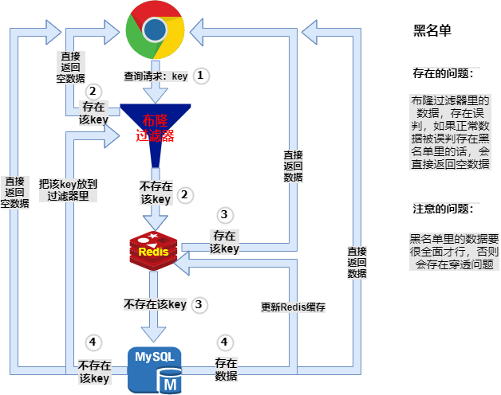

**注意问题**

- 布隆过滤器里的数据，存在误判，如果正常数据被误判存在黑名单里的话，会直接返回空数据。

- 黑名单里的数据要很全面才行，否则会有比较严重的穿透问题。

- 本来是在黑名单里的非法数据，之后有可能是正常数据。如：用id大于100万的数来请求，我们数据库里只有10万数据，这时候如果把id放进黑名单里。等数据达到100万的时候，就会出现问题。

## 布隆过滤器其他应用场景举例

视频推送场景（黑名单）

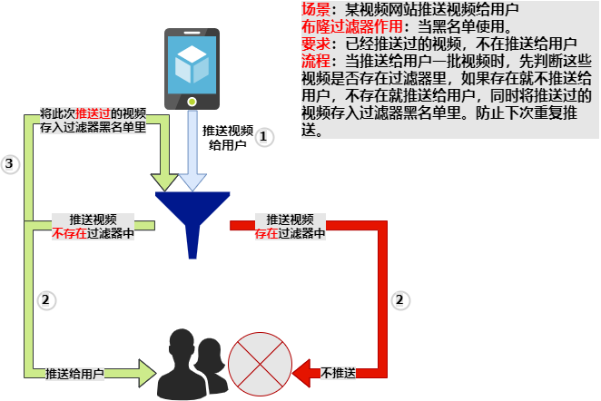

背景：某视频网站给用户推送视频

布隆过滤器作用：当黑名单使用。

要求：对于某用户，已经推送过的视频，不在进行推送。

流程：当推送给用户一批视频时，先判断这些视频是否存在过滤器里；如果存在就不推送给用户，不存在就推送给用户；同时将推送过的视频存入过滤器黑名单里，防止下次重复推送。

转载视频/文章案例（白名单）

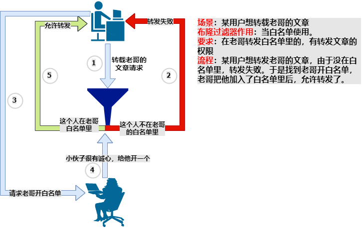

背景：某用户想转载老哥的文章。

布隆过滤器作用：当白名单使用。

要求：在老哥转发白名单里的，有转发文章的权限。

流程：某用户想转发老哥的文章，由于没在白名单里，转发失败。于是找到老哥开白名单，老哥把他加入了白名单里后，允许转发了。