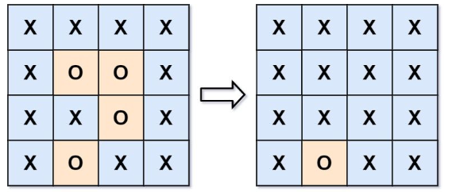
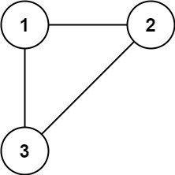
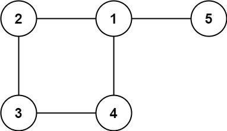

# 力扣刷题笔记（六）

[TOC]


## [279. 完全平方数](https://leetcode.cn/problems/perfect-squares/)

难度：中等:star::star::star::star:

### 题目

给你一个整数 n ，返回 和为 n 的完全平方数的最少数量 。

完全平方数 是一个整数，其值等于另一个整数的平方；换句话说，其值等于一个整数自乘的积。例如，1、4、9 和 16 都是完全平方数，而 3 和 11 不是。

 

示例 1：

```
输入：n = 12
输出：3 
解释：12 = 4 + 4 + 4
```

示例 2：

```
输入：n = 13
输出：2
解释：13 = 4 + 9
```

提示：

- 1 <= n <= 10^4^

### 代码

- 动态规划

```java
class Solution {
    public int numSquares(int n) {
        int[] dp = new int[n+1];
        for (int i = 1; i <= n; i++) {
            dp[i] = i; // 把i全部拆成1，数量是i
            for (int j = 1; j * j <= i; j++) {
                // dp[i - j * j]表示把i拆成i-j*j和一个j*j的完全平方数的最少数量
                dp[i] = Math.min(dp[i], dp[i - j * j] + 1);
            }
        }
        return dp[n];
    }
    
}
```

### 笔记

- 采用i - j * j的方式，就可以确保把i拆成一个数和一个完全平方数。 
  dp[i]表示和为i的完全平方数的最少数量。（最坏的情况，一定可以全部拆成1）。
  `dp[i] = min (dp[i - j * j]) + 1`

## [剑指 Offer 47. 礼物的最大价值](https://leetcode.cn/problems/li-wu-de-zui-da-jie-zhi-lcof/)

难度：中等:star::star::star::star:

### 题目

在一个 m*n 的棋盘的每一格都放有一个礼物，每个礼物都有一定的价值（价值大于 0）。你可以从棋盘的左上角开始拿格子里的礼物，并每次向右或者向下移动一格、直到到达棋盘的右下角。给定一个棋盘及其上面的礼物的价值，请计算你最多能拿到多少价值的礼物？

 

示例 1:

```
输入: 
[
  [1,3,1],
  [1,5,1],
  [4,2,1]
]
输出: 12
解释: 路径 1→3→5→2→1 可以拿到最多价值的礼物
```


提示：

- 0 < grid.length <= 200
- 0 < grid[0].length <= 200

### 代码

- 动态规划

```java
class Solution {
    public int maxValue(int[][] grid) {
        int m = grid.length;
        int n = grid[0].length;
        int[][] dp = new int[m+1][n+1];
        for (int i = 1; i <= m; i++) {
            for (int j = 1; j <= n; j++) {
                dp[i][j] = Math.max(dp[i-1][j], dp[i][j-1]) + grid[i-1][j-1];
            }
        }
        return dp[m][n];
    }
}
```

### 笔记


## [354. 俄罗斯套娃信封问题](https://leetcode.cn/problems/russian-doll-envelopes/)

难度：困难:star::star::star::star::star:

### 题目

给你一个二维整数数组 envelopes ，其中 envelopes[i] = [wi, hi] ，表示第 i 个信封的宽度和高度。

当另一个信封的宽度和高度都比这个信封大的时候，这个信封就可以放进另一个信封里，如同俄罗斯套娃一样。

请计算 最多能有多少个 信封能组成一组“俄罗斯套娃”信封（即可以把一个信封放到另一个信封里面）。

注意：不允许旋转信封。

示例 1：

```
输入：envelopes = [[5,4],[6,4],[6,7],[2,3]]
输出：3
解释：最多信封的个数为 3, 组合为: [2,3] => [5,4] => [6,7]。
```

示例 2：

```
输入：envelopes = [[1,1],[1,1],[1,1]]
输出：1
```


提示：

- 1 <= envelopes.length <= 10^5^
- envelopes[i].length == 2
- 1 <= wi, hi <= 10^5^

### 代码

- 排序+动态规划【超时】

```java
class Solution {
    public int maxEnvelopes(int[][] envelopes) {
        int m = envelopes.length;
        Arrays.sort(envelopes, new Comparator<int[]>(){
            // 按宽度升序排列，如果宽度一样，则按高度降序排列
            public int compare(int[] a, int[] b) {
                return a[0] == b[0] ? b[1] - a[1] : a[0] - b[0];
            }
        });
        int[] height = new int[m];
        for (int i = 0; i < m; i++) {
            height[i] = envelopes[i][1];
        }
        // 求高度数组中的最长递增子序列
        // 动态规划同https://leetcode.cn/problems/longest-increasing-subsequence/
        int[] dp = new int[m];
        dp[0] = 1;
        int res = 1;
        for (int i = 1; i < m; i++) {
            dp[i] = 1;
            for (int j = 0; j <= i; j++) {
                if (height[i] > height[j]) {
                    dp[i] = Math.max(dp[i], dp[j] + 1);
                }
            }
            res = Math.max(res, dp[i]);
        }
        return res;
    }
}
```

- 排序+贪心+二分

```java
class Solution {
    public int maxEnvelopes(int[][] envelopes) {
        int m = envelopes.length;
        Arrays.sort(envelopes, new Comparator<int[]>(){
            // 按宽度升序排列，如果宽度一样，则按高度降序排列
            public int compare(int[] a, int[] b) {
                return a[0] == b[0] ? b[1] - a[1] : a[0] - b[0];
            }
        });
        // 求高度数组中的最长递增子序列
        // 贪心+二分同https://leetcode.cn/problems/longest-increasing-subsequence/
        int[] d = new int[m+1];
        d[1] = envelopes[0][1];
        int size = 1;
        for (int i = 1; i < m; i++) {
            if (envelopes[i][1] > d[size]) {
                d[++size] = envelopes[i][1];
            } else {
                int left = 1, right = size;
                while (left < right) {
                    int mid = (left + right) >> 1;
                    if (d[mid] >= envelopes[i][1]) {
                        right = mid;
                    } else {
                        left = mid + 1;
                    }
                }
                int p = d[left] >= envelopes[i][1] ? left : 1;
                d[p] = envelopes[i][1];
            }
        }
        return size;
    }
}
```

### 笔记

- Java二维数组排序（第一维升序，第二维降序）：

  ```java
  int[][] envelopes;
  Arrays.sort(envelopes, new Comparator<int[]>(){
              // 按宽度升序排列，如果宽度一样，则按高度降序排列
              public int compare(int[] a, int[] b) {
                  return a[0] == b[0] ? b[1] - a[1] : a[0] - b[0];
              }
          });
  ```

- 实际上是最长递增子序列问题上升到二维。
  先对宽度w进行升序排列，如果w相等，则按照高度h降序排列。之后把所有的h作为一个数组，在这个数组上计算最长递增子序列（[300. 最长递增子序列](https://leetcode.cn/problems/longest-increasing-subsequence/)）。
  计算最长递增子序列有两种方法，动规和贪心+二分。用动规，在本题会超时。

## [416. 分割等和子集](https://leetcode.cn/problems/partition-equal-subset-sum/)

难度：中等:star::star::star::star:

### 题目

给你一个 只包含正整数 的 非空 数组 nums 。请你判断是否可以将这个数组分割成两个子集，使得两个子集的元素和相等。

 

示例 1：

```
输入：nums = [1,5,11,5]
输出：true
解释：数组可以分割成 [1, 5, 5] 和 [11] 。
```

示例 2：

```
输入：nums = [1,2,3,5]
输出：false
解释：数组不能分割成两个元素和相等的子集。
```


提示：

- 1 <= nums.length <= 200
- 1 <= nums[i] <= 100

### 代码

- 动态规划

```java
class Solution {
    public boolean canPartition(int[] nums) {
        int n = nums.length;
        if (n == 1) {
            return false;
        }
        int sum = 0;
        for (int num : nums) {
            sum += num;
        }
        // 数组和为奇数，不能均分为两个元素和相等的子集
        if (sum % 2 == 1) {
            return false;
        }
        // 转为背包问题，求是否能从数组中选择一些元素，使这些元素的和等于sum的一半，
        int target = sum / 2;
        // dp[i][j]=true表示从nums的[0:i-1]闭区间中选择一些元素（选择一些物品），能够使元素和恰好为j（能够恰好装满容量为j的背包）
        // dp[i][j]=false表示从nums的[0:i-1]闭区间中选择一些元素（选择一些物品），不能够使元素和恰好为j（不能够恰好装满容量为j的背包）
        boolean[][] dp = new boolean[n+1][target+1];
        for (int i = 1; i <= n; i++) {
            for (int j = 1; j <= target; j++) {
                // 可以选择一个nums[i-1]恰好装满j
                if (j == nums[i-1]) {
                    dp[i][j] = true;
                } 
                // 剩余容量还挺多，不选nums[i-1]，dp[i][j]是true还是false,就看dp[i-1][j]是true还是false。选nums[i-1]，dp[i][j]是true还是false,就看dp[i-1][j-nums[i-1]]是true还是false（dp[i-1][j-nums[i-1]]是true,表示从nums的[0:i-2]闭区间中选择一些元素，能够使元素和恰好为j-nums[i-1]，这时，加上nums[i-1]，就使元素和恰好为j，则dp[i][j]也是true；dp[i-1][j-nums[i-1]]是false,表示从nums的[0:i-2]闭区间中选择一些元素，不能够使元素和恰好为j-nums[i-1]，这时，加上nums[i-1]，还是不能使元素和恰好为j，则dp[i][j]也是false。）。综合来说，dp[i][j] = dp[i-1][j] || dp[i-1][j-nums[i-1]]，也即，除非不选nums[i-1]和选nums[i-1]，都为false，那dp[i][j]就为false，否则，dp[i][j]就为true。
                else if (j > nums[i-1]) {
                    dp[i][j] = dp[i-1][j] || dp[i-1][j-nums[i-1]];
                } 
                // j < nums[i-1]，剩余容量不够，肯定不能选nums[i-1]，dp[i][j]是true还是false,就看dp[i-1][j]是true还是false。
                else {
                    dp[i][j] = dp[i-1][j];
                }
            }
        }
        return dp[n][target];
    }
}
```

- 动规+滚动数组

```java
class Solution {
    public boolean canPartition(int[] nums) {
        int n = nums.length;
        if (n == 1) {
            return false;
        }
        int sum = 0;
        for (int num : nums) {
            sum += num;
        }
        // 数组和为奇数，不能均分为两个元素和相等的子集
        if (sum % 2 == 1) {
            return false;
        }
        // 转为背包问题，求是否能从数组中选择一些元素，使这些元素的和等于sum的一半，
        int target = sum / 2;
        boolean[] dp = new boolean[target+1];
        for (int i = 0; i < n; i++) {
            for (int j = target; j >= 0; j--) {
               if (j == nums[i]) {
                   dp[j] = true;
               }
               else if (j > nums[i]) {
                   dp[j] = dp[j] || dp[j-nums[i]];
               }
            //    else {
            //        dp[j] = dp[j];
            //    }
            }
        }
        return dp[target];
    }
}
```

- 动规+滚动数组

```java
class Solution {
    public boolean canPartition(int[] nums) {
        int n = nums.length;
        if (n == 1) {
            return false;
        }
        int sum = 0;
        for (int num : nums) {
            sum += num;
        }
        // 数组和为奇数，不能均分为两个元素和相等的子集
        if (sum % 2 == 1) {
            return false;
        }
        // 转为背包问题，求是否能从数组中选择一些元素，使这些元素的和等于sum的一半，
        int target = sum / 2;
        // dp[j]表示从nums数组的闭区间[0,i]中选择一些元素，这些元素能装进容量为j的背包，元素和为dp[j]
        int[] dp = new int[target+1];
        for (int i = 0; i < n; i++) {
            for (int j = target; j >= nums[i]; j--) {
                dp[j] = Math.max(dp[j], dp[j-nums[i]] + nums[i]);
            }
        }
        // 从nums数组的闭区间[0,n-1]中选择一些元素，这些元素能装进容量为target的背包，元素和为dp[target]，元素和刚好等于target，说明能从数组中选择一些元素，使这些元素的和等于sum的一半。若不等于，说明不能
        return dp[target] == target;
    }
}
```

### 笔记

- 动态规划：这道问题是我学习「背包」问题的入门问题，做这道题**需要做一个等价转换：是否可以从输入数组中挑选出一些正整数，使得这些数的和 等于 整个数组元素的和的一半。**
  本题与 0-1 背包问题有一个很大的不同，即：
  - 0-1 背包问题选取的物品的容积总量 不能超过 规定的总量；
  - 本题选取的数字之和需要 恰好等于 规定的和的一半。
- 动规+滚动数组：j要从后往前遍历


## [1049. 最后一块石头的重量 II](https://leetcode.cn/problems/last-stone-weight-ii/)

难度：中等:star::star::star::star:

### 题目

有一堆石头，用整数数组 stones 表示。其中 stones[i] 表示第 i 块石头的重量。

每一回合，从中选出任意两块石头，然后将它们一起粉碎。假设石头的重量分别为 x 和 y，且 x <= y。那么粉碎的可能结果如下：

- 如果 x == y，那么两块石头都会被完全粉碎；
- 如果 x != y，那么重量为 x 的石头将会完全粉碎，而重量为 y 的石头新重量为 y-x。

最后，最多只会剩下一块 石头。返回此石头 最小的可能重量 。如果没有石头剩下，就返回 0。

 

示例 1：

```
输入：stones = [2,7,4,1,8,1]
输出：1
解释：
组合 2 和 4，得到 2，所以数组转化为 [2,7,1,8,1]，
组合 7 和 8，得到 1，所以数组转化为 [2,1,1,1]，
组合 2 和 1，得到 1，所以数组转化为 [1,1,1]，
组合 1 和 1，得到 0，所以数组转化为 [1]，这就是最优值。
```

示例 2：

```
输入：stones = [31,26,33,21,40]
输出：5
```


提示：

- 1 <= stones.length <= 30
- 1 <= stones[i] <= 100

### 代码

- 动态规划

```java
class Solution {
    public int lastStoneWeightII(int[] stones) {
        int n = stones.length;
        int sum = 0;
        for (int stone : stones) {
            sum += stone;
        }
        int target = sum / 2;
        // dp[j] 表示容量为j的背包，最多可以装重量为dp[j]的石头。（石头的体积和重量相同）
        int[] dp = new int[target + 1];
        for (int i = 0; i < n; i++) {
            for (int j = target; j >= stones[i]; j--) {
                dp[j] = Math.max(dp[j], dp[j - stones[i]] + stones[i]);
            }
        }
        // dp[target]是总重量<=target的一堆石头的，sum - dp[target]是另一堆石头
        return (sum - dp[target]) - dp[target];
    }
}
```

### 笔记

- 转为01背包问题：将石头分成两个集合，用一个集合粉碎另一个集合，要使粉碎后的剩余重量最小，应该使得两个集合的石头重量之后尽可能地接近

  这个问题等价于：求在不超过sum/2的前提下，所能形成的最大数组序列和是多少？

## [494. 目标和](https://leetcode.cn/problems/target-sum/)

难度：中等:star::star::star::star:

### 题目

给你一个整数数组 nums 和一个整数 target 。

向数组中的每个整数前添加 '+' 或 '-' ，然后串联起所有整数，可以构造一个 表达式 ：

- 例如，nums = [2, 1] ，可以在 2 之前添加 '+' ，在 1 之前添加 '-' ，然后串联起来得到表达式 "+2-1" 。

返回可以通过上述方法构造的、运算结果等于 target 的不同 表达式 的数目。

 

示例 1：

```
输入：nums = [1,1,1,1,1], target = 3
输出：5
解释：一共有 5 种方法让最终目标和为 3 。
-1 + 1 + 1 + 1 + 1 = 3
+1 - 1 + 1 + 1 + 1 = 3
+1 + 1 - 1 + 1 + 1 = 3
+1 + 1 + 1 - 1 + 1 = 3
+1 + 1 + 1 + 1 - 1 = 3
```

示例 2：

```
输入：nums = [1], target = 1
输出：1
```


提示：

- 1 <= nums.length <= 20
- 0 <= nums[i] <= 1000
- 0 <= sum(nums[i]) <= 1000
- -1000 <= target <= 1000

### 代码

- 动态规划

```java
class Solution {
    public int findTargetSumWays(int[] nums, int target) {
        int n = nums.length;
        int sum = 0;
        for (int num : nums) {
            sum += num;
        }
        // 凑不出
        if (Math.abs(target) > sum) {
            return 0;
        }
        // 凑不出
        if ((target + sum) % 2 != 0 ) {
            return 0;
        }
        // x为表达式中的正数和，则-(sum-x)为表达式中的负数和，则有x-(sum-x)=target，即x= (target + sum) / 2,正数和要为正整数，所以target+sum要为偶数。
        int x = (target + sum) / 2;
        // dp[j]表示从nums的[0,i]中选出来的数加起来等于j的方法数
        int[] dp = new int[x + 1];
        // dp[0]表示凑出0有1种方法，即啥也不选。dp[0]=1方便状态转移
        dp[0] = 1;
        for (int i = 0; i < n; i++) {
            for (int j = x; j >= nums[i]; j--) {
                dp[j] += dp[j - nums[i]]; // 求方案数，这里就是累加
            }
        }
        return dp[x];
    }
}
```

### 笔记

- 动态规划：https://programmercarl.com/0494.%E7%9B%AE%E6%A0%87%E5%92%8C.html#%E5%8A%A8%E6%80%81%E8%A7%84%E5%88%92


## [474. 一和零](https://leetcode.cn/problems/ones-and-zeroes/)

难度：中等:star::star::star::star:

### 题目

给你一个二进制字符串数组 strs 和两个整数 m 和 n 。

请你找出并返回 strs 的最大子集的长度，该子集中 最多 有 m 个 0 和 n 个 1 。

如果 x 的所有元素也是 y 的元素，集合 x 是集合 y 的 子集 。

 

示例 1：

```
输入：strs = ["10", "0001", "111001", "1", "0"], m = 5, n = 3
输出：4
解释：最多有 5 个 0 和 3 个 1 的最大子集是 {"10","0001","1","0"} ，因此答案是 4 。
其他满足题意但较小的子集包括 {"0001","1"} 和 {"10","1","0"} 。{"111001"} 不满足题意，因为它含 4 个 1 ，大于 n 的值 3 。
```

示例 2：

```
输入：strs = ["10", "0", "1"], m = 1, n = 1
输出：2
解释：最大的子集是 {"0", "1"} ，所以答案是 2 。
```


提示：

- 1 <= strs.length <= 600
- 1 <= strs[i].length <= 100
- strs[i] 仅由 '0' 和 '1' 组成
- 1 <= m, n <= 100

### 代码

- 动态规划

```java
class Solution {
    public int findMaxForm(String[] strs, int m, int n) {
        // dp[i][j]表示子集中最多有i个0，j个1的最大子集长度
        int[][] dp = new int[m+1][n+1];
        int num0, num1;
        for (String str : strs) {
            num0 = 0;
            num1 = 0;
            for (char ch : str.toCharArray()) {
                if (ch == '0') {
                    num0++;
                } else {
                    num1++;
                }
            }
            // 倒序遍历
            for (int i = m; i >= num0; i--) {
                for (int j = n; j >= num1; j--) {
                    dp[i][j] = Math.max(dp[i][j], dp[i-num0][j-num1] + 1);
                }
            }
        }
        return dp[m][n];
    }
}
```

### 笔记

- 动态规划：https://programmercarl.com/0474.%E4%B8%80%E5%92%8C%E9%9B%B6.html#%E6%80%9D%E8%B7%AF 

  思路：把总共的 0 和 1 的个数视为背包的容量，每一个字符串视为装进背包的物品。这道题就可以使用 0-1 背包问题的思路完成，这里的目标值是能放进背包的字符串的数量。


## [337. 打家劫舍 III](https://leetcode.cn/problems/house-robber-iii/)

难度：中等:star::star::star::star:

### 题目

小偷又发现了一个新的可行窃的地区。这个地区只有一个入口，我们称之为 root 。

除了 root 之外，每栋房子有且只有一个“父“房子与之相连。一番侦察之后，聪明的小偷意识到“这个地方的所有房屋的排列类似于一棵二叉树”。 如果 两个直接相连的房子在同一天晚上被打劫 ，房屋将自动报警。

给定二叉树的 root 。返回 在不触动警报的情况下 ，小偷能够盗取的最高金额 。

 

示例 1:


```
输入: root = [3,2,3,null,3,null,1]
输出: 7 
解释: 小偷一晚能够盗取的最高金额 3 + 3 + 1 = 7
```


示例 2:


```
输入: root = [3,4,5,1,3,null,1]
输出: 9
解释: 小偷一晚能够盗取的最高金额 4 + 5 = 9
```


提示：

- 树的节点数在 [1, 10^4^] 范围内
- 0 <= Node.val <= 10^4^

### 代码

- 动态规划+后序遍历

```java
/**
 * Definition for a binary tree node.
 * public class TreeNode {
 *     int val;
 *     TreeNode left;
 *     TreeNode right;
 *     TreeNode() {}
 *     TreeNode(int val) { this.val = val; }
 *     TreeNode(int val, TreeNode left, TreeNode right) {
 *         this.val = val;
 *         this.left = left;
 *         this.right = right;
 *     }
 * }
 */
class Solution {
    public int rob(TreeNode root) {
        int[] dp = postOrder(root);
        return Math.max(dp[0], dp[1]);
    }
    public int[] postOrder(TreeNode root) {
        if (root == null) {
            return new int[]{0, 0};
        }
        int[] left = postOrder(root.left);
        int[] right = postOrder(root.right);
        // dp[0]是不选根结点时的最高金额，dp[1]是选根结点时的最高金额
        int[] dp = new int[2];
        // 不选根结点，左子树和右子树的根结点可选可不选。
        dp[0] = Math.max(left[0], left[1]) + Math.max(right[0], right[1]);
        // 选根结点，左子树和右子树的根结点一定不选。
        dp[1] = root.val + left[0] + right[0];
        return dp;
    }
}
```

### 笔记

- 动规：https://leetcode.cn/problems/house-robber-iii/solution/shu-xing-dp-ru-men-wen-ti-by-liweiwei1419/
  本题一定是要后序遍历，因为通过递归函数的返回值来做下一步计算。


## [674. 最长连续递增序列](https://leetcode.cn/problems/longest-continuous-increasing-subsequence/)

难度：简单:star::star::star:

### 题目

给定一个未经排序的整数数组，找到最长且 连续递增的子序列，并返回该序列的长度。

连续递增的子序列 可以由两个下标 l 和 r（l < r）确定，如果对于每个 l <= i < r，都有 nums[i] < nums[i + 1] ，那么子序列 [nums[l], nums[l + 1], ..., nums[r - 1], nums[r]] 就是连续递增子序列。

 

示例 1：

```
输入：nums = [1,3,5,4,7]
输出：3
解释：最长连续递增序列是 [1,3,5], 长度为3。
尽管 [1,3,5,7] 也是升序的子序列, 但它不是连续的，因为 5 和 7 在原数组里被 4 隔开。 
```

示例 2：

```
输入：nums = [2,2,2,2,2]
输出：1
解释：最长连续递增序列是 [2], 长度为1。
```


提示：

- 1 <= nums.length <= 10^4^
- -10^9^ <= nums[i] <= 10^9^

### 代码

- 动态规划

```java
class Solution {
    public int findLengthOfLCIS(int[] nums) {
        int n = nums.length;
        int[] dp = new int[n + 1];
        dp[0] = 1;
        for (int i = 1; i <= n; i++) {
            if (i > 1 && nums[i-1] > nums[i-2]) {
                dp[i] = dp[i-1] + 1;
            } else {
                dp[i] = 1;
            }
        }
        int res = 1;
        for (int i : dp) {
            res = Math.max(res, i);
        }
        return res;
    }
}
```

- 贪心

```java
class Solution {
    public int findLengthOfLCIS(int[] nums) {
        int n = nums.length;
        int count = 1;
        int res = 1;
        for (int i = 0; i < n - 1; i++) {
            if (nums[i+1] > nums[i]) {
                count++;
            } else {
                count = 1;
            }
            res = count > res ? count : res;
        }
        return res;
    }
}
```


### 笔记

- 动态规划：dp[i]：以下标i为结尾的（对应数组nums中的下标i-1）数组的连续递增的子序列长度为dp[i]。
  注意：dp[i]不是表示最长的长度，而是必须以下标i为结尾的（必须以nums[i-1]结尾）序列长度

- 贪心：从 0 位置开始遍历，遍历时根据前后元素状态判断是否递增，递增则 count++，递减则 count=1，如果 count>res，则更新 res


## [718. 最长重复子数组](https://leetcode.cn/problems/maximum-length-of-repeated-subarray/)

难度：中等:star::star::star::star:

### 题目

给两个整数数组 nums1 和 nums2 ，返回 两个数组中 公共的 、长度最长的子数组的长度 。

 

示例 1：

```
输入：nums1 = [1,2,3,2,1], nums2 = [3,2,1,4,7]
输出：3
解释：长度最长的公共子数组是 [3,2,1] 。
```

示例 2：

```
输入：nums1 = [0,0,0,0,0], nums2 = [0,0,0,0,0]
输出：5
```


提示：

- 1 <= nums1.length, nums2.length <= 1000
- 0 <= nums1[i], nums2[i] <= 100

### 代码

- 动态规划

```java
class Solution {
    public int findLength(int[] nums1, int[] nums2) {
        int m = nums1.length;
        int n = nums2.length;
        int[][] dp = new int[m+1][n+1];
        int res = 0;
        for (int i = 1; i <= m; i++) {
            for (int j = 1; j <= n; j++) {
                if (nums1[i-1] == nums2[j-1]) {
                    dp[i][j] = dp[i-1][j-1] + 1;
                }
                res = dp[i][j] > res ? dp[i][j] : res;
            }
        }
        return res;
    }
}
```

### 笔记

- 动态规划：`dp[i][j]`表示nums1中以nums1[i-1]结尾的数组与nums2[j-1]结尾的数组的公共子数组长度。（不一定是最长的）


## [1035. 不相交的线](https://leetcode.cn/problems/uncrossed-lines/)

难度：中等:star::star::star::star:

### 题目

在两条独立的水平线上按给定的顺序写下 nums1 和 nums2 中的整数。

现在，可以绘制一些连接两个数字 nums1[i] 和 nums2[j] 的直线，这些直线需要同时满足满足：

- nums1[i] == nums2[j]
- 且绘制的直线不与任何其他连线（非水平线）相交。

请注意，连线即使在端点也不能相交：每个数字只能属于一条连线。

以这种方法绘制线条，并返回可以绘制的最大连线数。

 

示例 1：


```
输入：nums1 = [1,4,2], nums2 = [1,2,4]
输出：2
解释：可以画出两条不交叉的线，如上图所示。 
但无法画出第三条不相交的直线，因为从 nums1[1]=4 到 nums2[2]=4 的直线将与从 nums1[2]=2 到 nums2[1]=2 的直线相交。
```

示例 2：

```
输入：nums1 = [2,5,1,2,5], nums2 = [10,5,2,1,5,2]
输出：3
```

示例 3：

```
输入：nums1 = [1,3,7,1,7,5], nums2 = [1,9,2,5,1]
输出：2
```


提示：

- 1 <= nums1.length, nums2.length <= 500
- 1 <= nums1[i], nums2[j] <= 2000

### 代码

- 动态规划

```java
class Solution {
    public int maxUncrossedLines(int[] nums1, int[] nums2) {
        int m = nums1.length;
        int n = nums2.length;
        int[][] dp = new int[m+1][n+1];
        for (int i = 1; i <= m; i++) {
            for (int j = 1; j <= n; j++) {
                if (nums1[i-1] == nums2[j-1]) {
                    dp[i][j] = dp[i-1][j-1] + 1;
                } else {
                    dp[i][j] = Math.max(dp[i][j-1], dp[i-1][j]);
                }
            }
        }
        return dp[m][n];
    }
}
```

### 笔记

- 动态规划：`dp[i][j]`表示nums1中0到i-1的这些数和nums2中0到j-1的这些数能绘制的最大连线数。注意：这里的`dp[i][j]`就是指最大连线数，所以`dp[m][n]`就是要求的。`dp[i][j]`表示的最大连线数中的连线不一定包括nums1[i-1]和nums2[j-1]。


## [115. 不同的子序列](https://leetcode.cn/problems/distinct-subsequences/)

难度：困难:star::star::star::star::star:

### 题目

给定一个字符串 s 和一个字符串 t ，计算在 s 的子序列中 t 出现的个数。

字符串的一个 子序列 是指，通过删除一些（也可以不删除）字符且不干扰剩余字符相对位置所组成的新字符串。（例如，"ACE" 是 "ABCDE" 的一个子序列，而 "AEC" 不是）

题目数据保证答案符合 32 位带符号整数范围。

 

示例 1：


```
输入：s = "rabbbit", t = "rabbit"
输出：3
解释：
如下图所示, 有 3 种可以从 s 中得到 "rabbit" 的方案。
rabbbit
rabbbit
rabbbit
```

示例 2：


```
输入：s = "babgbag", t = "bag"
输出：5
解释：
如下图所示, 有 5 种可以从 s 中得到 "bag" 的方案。 
babgbag
babgbag
babgbag
babgbag
babgbag
```


提示：

- 0 <= s.length, t.length <= 1000
- s 和 t 由英文字母组成

### 代码

- 动态规划

```java
class Solution {
    public int numDistinct(String s, String t) {
        int m = s.length();
        int n = t.length();
        if (m < n) {
            return 0;
        }
        // dp[i][j]表示s中0到i-1的字符串中出现t中0到j-1的字符串的个数
        int[][] dp = new int[m+1][n+1];
        for (int i = 0; i <= m; i++) {
            // 直接删除一个字符，方案数是1
            dp[i][0] = 1;
        }
        for (int i = 1; i <= m; i++) {
            for (int j = 1; j <= n; j++) {
                if (s.charAt(i-1) == t.charAt(j-1)) {
                    // dp[i-1][j-1]表示第i个字符用来匹配第j个字符，dp[i-1][j]表示第i个字符不用来匹配第j个字符
                    dp[i][j] = dp[i-1][j-1] + dp[i-1][j];
                } else {
                    dp[i][j] = dp[i-1][j];
                }
            }
        }
        return dp[m][n];
    }
}
```

### 笔记

- 动态规划：当s[i - 1] 与 t[j - 1]相等时，dp`[i][j]`可以有两部分组成。
  一部分是用s[i - 1]来匹配，那么个数为`dp[i - 1][j - 1]`。
  一部分是不用s[i - 1]来匹配，个数为`dp[i - 1][j]`。
  这里可能有同学不明白了，为什么还要考虑 不用s[i - 1]来匹配，都相同了指定要匹配啊。
  例如： s：bagg 和 t：bag ，s[3] 和 t[2]是相同的，但是字符串s也可以不用s[3]来匹配，即用s[0]s[1]s[2]组成的bag。
  当然也可以用s[3]来匹配，即：s[0]s[1]s[3]组成的bag。
  所以当s[i - 1] 与 t[j - 1]相等时，`dp[i][j] = dp[i - 1][j - 1] + dp[i - 1][j]`;
  当s[i - 1] 与 t[j - 1]不相等时，`dp[i][j]`只有一部分组成，不用s[i - 1]来匹配，即：`dp[i - 1][j]`
  所以递推公式为：`dp[i][j] = dp[i - 1][j];`


## [583. 两个字符串的删除操作](https://leetcode.cn/problems/delete-operation-for-two-strings/)

难度：中等:star::star::star::star:

### 题目

给定两个单词 word1 和 word2 ，返回使得 word1 和  word2 相同所需的最小步数。

每步 可以删除任意一个字符串中的一个字符。

 

示例 1：

```
输入: word1 = "sea", word2 = "eat"
输出: 2
解释: 第一步将 "sea" 变为 "ea" ，第二步将 "eat "变为 "ea"
```

示例  2:

```
输入：word1 = "leetcode", word2 = "etco"
输出：4
```


提示：

- 1 <= word1.length, word2.length <= 500
- word1 和 word2 只包含小写英文字母

### 代码

- 动态规划

```java
class Solution {
    public int minDistance(String word1, String word2) {
        int m = word1.length();
        int n = word2.length();
        int[][] dp = new int[m+1][n+1];
        for (int i = 0; i <= m; i++) {
            // 删除i次
            dp[i][0] = i;
        }
        for (int j = 0; j <= n; j++) {
            // 删除j次
            dp[0][j] = j;
        }
        for (int i = 1; i <= m; i++) {
            for (int j = 1; j <= n; j++) {
                if (word1.charAt(i-1) == word2.charAt(j-1)) {
                    dp[i][j] = dp[i-1][j-1];
                } else {
                    dp[i][j] = Math.min(dp[i][j-1], dp[i-1][j]) + 1;
                }
            }
        }
        return dp[m][n];
    }
}
```

### 笔记

- 动态规划：`dp[i][j]`：以i-1为结尾的字符串word1，和以j-1位结尾的字符串word2，想要达到相等，所需要删除元素的最少次数。
  当word1[i - 1] 与 word2[j - 1]相同的时候，`dp[i][j] = dp[i - 1][j - 1];`
  当word1[i - 1] 与 word2[j - 1]不相同的时候，有两种情况：
  情况一：删word1[i - 1]，最少操作次数为`dp[i - 1][j] + 1`
  情况二：删word2[j - 1]，最少操作次数为`dp[i][j - 1] + 1`
  那最后当然是取最小值，所以当word1[i - 1] 与 word2[j - 1]不相同的时候，递推公式：`dp[i][j] = min(dp[i - 1][j] + 1, dp[i][j - 1] + 1);`

  注意：初始化的时候，`dp[i][0]=i,dp[0][j]=j;`


## [647. 回文子串](https://leetcode.cn/problems/palindromic-substrings/)

难度：中等:star::star::star::star:

### 题目

给你一个字符串 s ，请你统计并返回这个字符串中 回文子串 的数目。

回文字符串 是正着读和倒过来读一样的字符串。

子字符串 是字符串中的由连续字符组成的一个序列。

具有不同开始位置或结束位置的子串，即使是由相同的字符组成，也会被视作不同的子串。

 

示例 1：

```
输入：s = "abc"
输出：3
解释：三个回文子串: "a", "b", "c"
```

示例 2：

```
输入：s = "aaa"
输出：6
解释：6个回文子串: "a", "a", "a", "aa", "aa", "aaa"
```


提示：

- 1 <= s.length <= 1000
- s 由小写英文字母组成

### 代码

- 动态规划

```java
class Solution {
    public int countSubstrings(String s) {
        int n = s.length();
        boolean[][] dp = new boolean[n][n];
        int res = 0;
        for (int i = n - 1; i >= 0; i--) {
            for (int j = i; j < n; j++) {
                if (s.charAt(i) == s.charAt(j)) {
                    if (j - i <= 1) {
                        dp[i][j] = true;
                    } else {
                        dp[i][j] = dp[i+1][j-1];
                    }
                }
                if (dp[i][j] == true) {
                    res++;
                }
            }
        }
        return res;
    }
}
```

- 中心扩展法

```java
class Solution {
    public int countSubstrings(String s) {
        int n = s.length();
        int res = 0;
        for (int i = 0; i < n; i++) {
            // 以i为中心的回文子串个数
            res += extend(s, i, i, n);
            // 以i和i+1为中心的回文子串个数
            res += extend(s, i, i+1, n);
        }
        return res;
    }
    public int extend(String s, int left, int right, int n) {
        int res = 0;
        while(left >= 0 && right < n && s.charAt(left) == s.charAt(right)) {
            // 向左扩展
            left--;
            // 向右扩展
            right++;
            res++;
        }
        return res;
    }
}
```

### 笔记

- 对于回文串的常见处理思路是：找中心然后向两边扩散看是不是对称的就可以了。

- 动态规划：布尔类型的`dp[i][j]`：表示区间范围[i,j] （注意是左闭右闭）的子串是否是回文子串，如果是`dp[i][j]`为true，否则为false。
  在确定递推公式时，就要分析如下几种情况。
  整体上是两种，就是s[i]与s[j]相等，s[i]与s[j]不相等这两种。

  - 当s[i]与s[j]不相等，那没啥好说的了，`dp[i][j]`一定是false。
  - 当s[i]与s[j]相等时，这就复杂一些了，有如下三种情况
  	- 情况一：下标i 与 j相同，同一个字符例如a，当然是回文子串
  	- 情况二：下标i 与 j相差为1，例如aa，也是回文子串
  	- 情况三：下标：i 与 j相差大于1的时候，例如cabac，此时s[i]与s[j]已经相同了，我们看i到j区间是不是回文子串就看aba是不是回文就可以了，那么aba的区间就是 i+1 与 j-1区间，这个区间是不是回文就看`dp[i + 1][j - 1]`是否为true。

  然后统计`dp[i][j]`为true的格式

- 双指针，中心扩展法：首先确定回文串，就是找中心然后向两边扩散看是不是对称的就可以了。
  在遍历中心点的时候，要注意中心点有两种情况。
  一个元素可以作为中心点，两个元素也可以作为中心点。


## [1005. K 次取反后最大化的数组和](https://leetcode.cn/problems/maximize-sum-of-array-after-k-negations/)

难度：简单:star::star::star:

### 题目

给你一个整数数组 nums 和一个整数 k ，按以下方法修改该数组：

选择某个下标 i 并将 nums[i] 替换为 -nums[i] 。
重复这个过程恰好 k 次。可以多次选择同一个下标 i 。

以这种方式修改数组后，返回数组 可能的最大和 。

 

示例 1：

```
输入：nums = [4,2,3], k = 1
输出：5
解释：选择下标 1 ，nums 变为 [4,-2,3] 。
```

示例 2：

```
输入：nums = [3,-1,0,2], k = 3
输出：6
解释：选择下标 (1, 2, 2) ，nums 变为 [3,1,0,2] 。
```

示例 3：

```
输入：nums = [2,-3,-1,5,-4], k = 2
输出：13
解释：选择下标 (1, 4) ，nums 变为 [2,3,-1,5,4] 。
```


提示：

- 1 <= nums.length <= 10^4^
- -100 <= nums[i] <= 100
- 1 <= k <= 10^4^


### 代码

- 贪心

```java
class Solution {
    public int largestSumAfterKNegations(int[] nums, int k) {
        Arrays.sort(nums);
        int res = 0;
        int m = Integer.MAX_VALUE;
        for (int i = 0; i < nums.length; i++) {
            // 把负数都修改
            if (nums[i] < 0 && k > 0) {
                nums[i] = -nums[i];
                k--;
            }
            res += nums[i];
            m = nums[i] < m ? nums[i] : m;
        }
        // 如果k还没用完，修改**新的**最小正数
        k = k % 2;
        if (k == 1) {
            // res要减去已经被转成正数的m,再加上转成负数的-m，
            res -= 2*m;
        }
        return res;
    }
}
```


### 笔记

- 细节：需要注意的是，在之前将负数修改为正数的过程中，可能出现了（相较于原始数组中最小的正数）更小的正数，这一点不能忽略。
- 负数都修改完之后，如果k还没用完，修改偶数k次是没有意义的，如果k是奇数就要修改**新的**最小正数，这时不用真的去修改，只需要将res减去已经被转成正数的m,再加上转成负数的-m就可以了。


## [134. 加油站](https://leetcode.cn/problems/gas-station/)

难度：中等:star::star::star::star:

### 题目

在一条环路上有 n 个加油站，其中第 i 个加油站有汽油 gas[i] 升。

你有一辆油箱容量无限的的汽车，从第 i 个加油站开往第 i+1 个加油站需要消耗汽油 cost[i] 升。你从其中的一个加油站出发，开始时油箱为空。

给定两个整数数组 gas 和 cost ，如果你可以绕环路行驶一周，则返回出发时加油站的编号，否则返回 -1 。如果存在解，则 保证 它是 唯一 的。

 

示例 1:

```
输入: gas = [1,2,3,4,5], cost = [3,4,5,1,2]
输出: 3
解释:
从 3 号加油站(索引为 3 处)出发，可获得 4 升汽油。此时油箱有 = 0 + 4 = 4 升汽油
开往 4 号加油站，此时油箱有 4 - 1 + 5 = 8 升汽油
开往 0 号加油站，此时油箱有 8 - 2 + 1 = 7 升汽油
开往 1 号加油站，此时油箱有 7 - 3 + 2 = 6 升汽油
开往 2 号加油站，此时油箱有 6 - 4 + 3 = 5 升汽油
开往 3 号加油站，你需要消耗 5 升汽油，正好足够你返回到 3 号加油站。
因此，3 可为起始索引。
```

示例 2:

```
输入: gas = [2,3,4], cost = [3,4,3]
输出: -1
解释:
你不能从 0 号或 1 号加油站出发，因为没有足够的汽油可以让你行驶到下一个加油站。
我们从 2 号加油站出发，可以获得 4 升汽油。 此时油箱有 = 0 + 4 = 4 升汽油
开往 0 号加油站，此时油箱有 4 - 3 + 2 = 3 升汽油
开往 1 号加油站，此时油箱有 3 - 3 + 3 = 3 升汽油
你无法返回 2 号加油站，因为返程需要消耗 4 升汽油，但是你的油箱只有 3 升汽油。
因此，无论怎样，你都不可能绕环路行驶一周。
```


提示:

- gas.length == n
- cost.length == n
- 1 <= n <= 10^5^
- 0 <= gas[i], cost[i] <= 10^4^

### 代码

- 暴力法【超时】

```java
class Solution {
    public int canCompleteCircuit(int[] gas, int[] cost) {
        int m = gas.length;
        for (int i = 0; i < m; i++) {
            int remaining = 0;
            if (gas[i] >= cost[i]) {
                remaining = gas[i];
                // 开始尝试
                int start = i;
                while (true) {
                    int next = (start + 1) % m;
                    remaining -= cost[start];
                    if (remaining >= 0) {
                        remaining += gas[next];
                        start = next;
                    } else {
                        break;
                    }
                    if (next == i && remaining >=0) {
                        return start;
                    }
                }
            }
        }
        return -1;
    }
}
```

- 贪心

```java
class Solution {
    public int canCompleteCircuit(int[] gas, int[] cost) {
        int curSum = 0;
        int totalSum = 0;
        int start = 0;
        for (int i = 0; i < gas.length; i++) {
            // 当前累计剩余油量
            curSum += (gas[i] - cost[i]);
            // 总的累计剩余油量
            totalSum += (gas[i] - cost[i]);
            
            if (curSum < 0) {
                // 更新开始位置
                start = i + 1;
                // 重新累计当前剩余油量
                curSum = 0;
            }
        }
        // 总剩余油量不够一圈
        if (totalSum < 0) {
            return -1;
        }
        return start;
    }
}
```

### 笔记

- 贪心算法：https://leetcode.cn/problems/gas-station/solution/134-jia-you-zhan-tan-xin-jing-dian-ti-mu-xiang-jie/


## [135. 分发糖果](https://leetcode.cn/problems/candy/)

难度：困难:star::star::star::star::star:

### 题目

n 个孩子站成一排。给你一个整数数组 ratings 表示每个孩子的评分。

你需要按照以下要求，给这些孩子分发糖果：

- 每个孩子至少分配到 1 个糖果。
- 相邻两个孩子评分更高的孩子会获得更多的糖果。

请你给每个孩子分发糖果，计算并返回需要准备的 最少糖果数目 。

 

示例 1：

```
输入：ratings = [1,0,2]
输出：5
解释：你可以分别给第一个、第二个、第三个孩子分发 2、1、2 颗糖果。
```

示例 2：

```
输入：ratings = [1,2,2]
输出：4
解释：你可以分别给第一个、第二个、第三个孩子分发 1、2、1 颗糖果。
     第三个孩子只得到 1 颗糖果，这满足题面中的两个条件。
```


提示：

- n == ratings.length
- 1 <= n <= 2 * 10^4^
- 0 <= ratings[i] <= 2 * 10^4^

### 代码

- 贪心

```java
class Solution {
    public int candy(int[] ratings) {
        int n = ratings.length;
        int[] candy = new int[n];
        // 至少分配1个
        Arrays.fill(candy, 1);
        // 从左到右，给右边比左边高的，多分配一个
        for (int i = 1; i < n; i++) {
            if (ratings[i] > ratings[i-1]) {
                candy[i] = candy[i-1] + 1;
            }
        }
        // 从右到左，给左边比右边高的，多分配一个
        for (int i = n-2; i >= 0; i--) {
            if (ratings[i] > ratings[i+1]) {
                // 这里要求最大值，防止覆盖从左到右遍历的结果。
                candy[i] = Math.max(candy[i], candy[i+1] + 1);
            }
        }
        // 统计结果
        int res = 0;
        for (int i : candy) {
            res += i;
        }
        return res;
    }
}
```

### 笔记

- 这道题目一定是要确定一边之后，再确定另一边，例如比较每一个孩子的左边，然后再比较右边，如果两边一起考虑一定会顾此失彼。

## [860. 柠檬水找零](https://leetcode.cn/problems/lemonade-change/)

难度：简单:star::star::star:

### 题目

在柠檬水摊上，每一杯柠檬水的售价为 5 美元。顾客排队购买你的产品，（按账单 bills 支付的顺序）一次购买一杯。

每位顾客只买一杯柠檬水，然后向你付 5 美元、10 美元或 20 美元。你必须给每个顾客正确找零，也就是说净交易是每位顾客向你支付 5 美元。

注意，一开始你手头没有任何零钱。

给你一个整数数组 bills ，其中 bills[i] 是第 i 位顾客付的账。如果你能给每位顾客正确找零，返回 true ，否则返回 false 。

 

示例 1：

```
输入：bills = [5,5,5,10,20]
输出：true
解释：
前 3 位顾客那里，我们按顺序收取 3 张 5 美元的钞票。
第 4 位顾客那里，我们收取一张 10 美元的钞票，并返还 5 美元。
第 5 位顾客那里，我们找还一张 10 美元的钞票和一张 5 美元的钞票。
由于所有客户都得到了正确的找零，所以我们输出 true。
```

示例 2：

```
输入：bills = [5,5,10,10,20]
输出：false
解释：
前 2 位顾客那里，我们按顺序收取 2 张 5 美元的钞票。
对于接下来的 2 位顾客，我们收取一张 10 美元的钞票，然后返还 5 美元。
对于最后一位顾客，我们无法退回 15 美元，因为我们现在只有两张 10 美元的钞票。
由于不是每位顾客都得到了正确的找零，所以答案是 false。
```


提示：

- 1 <= bills.length <= 10^5^
- bills[i] 不是 5 就是 10 或是 20 


### 代码

- 贪心

```java
class Solution {
    public boolean lemonadeChange(int[] bills) {
        int n = bills.length;
        int five = 0;
        int ten = 0;
        for (int i = 0; i < n; i++) {
            switch(bills[i]) {
                case 5:
                    five++;
                    break;
                case 10:
                    ten++;
                    five--;
                    break;
                case 20:
                    if (ten > 0) {
                        ten--;
                        five--;
                    } else {
                        five -= 3;
                    }
                    break;
            }
            if (five < 0 || ten < 0) {
                return false;
            }
        }
        return true;
    }
}
```

### 笔记

- 贪心：five记录收到的5块的个数，ten记录收到的10块的个数，twenty记录收到的20块的个数。收到5块的，不用找零，收到10块的，就找5块的，收到20块的，就优先找一个10块+一个5块，没有10块，就找3个5块。 
  20块的不用记录，因为20块的不会被找出去。

## [406. 根据身高重建队列](https://leetcode.cn/problems/queue-reconstruction-by-height/)

难度：中等:star::star::star::star:

### 题目

假设有打乱顺序的一群人站成一个队列，数组 people 表示队列中一些人的属性（不一定按顺序）。每个 people[i] = [hi, ki] 表示第 i 个人的身高为 hi ，前面 正好 有 ki 个身高大于或等于 hi 的人。

请你重新构造并返回输入数组 people 所表示的队列。返回的队列应该格式化为数组 queue ，其中 queue[j] = [hj, kj] 是队列中第 j 个人的属性（queue[0] 是排在队列前面的人）。

 

示例 1：

```
输入：people = [[7,0],[4,4],[7,1],[5,0],[6,1],[5,2]]
输出：[[5,0],[7,0],[5,2],[6,1],[4,4],[7,1]]
解释：
编号为 0 的人身高为 5 ，没有身高更高或者相同的人排在他前面。
编号为 1 的人身高为 7 ，没有身高更高或者相同的人排在他前面。
编号为 2 的人身高为 5 ，有 2 个身高更高或者相同的人排在他前面，即编号为 0 和 1 的人。
编号为 3 的人身高为 6 ，有 1 个身高更高或者相同的人排在他前面，即编号为 1 的人。
编号为 4 的人身高为 4 ，有 4 个身高更高或者相同的人排在他前面，即编号为 0、1、2、3 的人。
编号为 5 的人身高为 7 ，有 1 个身高更高或者相同的人排在他前面，即编号为 1 的人。
因此 [[5,0],[7,0],[5,2],[6,1],[4,4],[7,1]] 是重新构造后的队列。
```

示例 2：

```
输入：people = [[6,0],[5,0],[4,0],[3,2],[2,2],[1,4]]
输出：[[4,0],[5,0],[2,2],[3,2],[1,4],[6,0]]
```


提示：

- 1 <= people.length <= 2000
- 0 <= hi <= 106
- 0 <= ki < people.length
- 题目数据确保队列可以被重建


### 代码

- 贪心

```java
class Solution {
    public int[][] reconstructQueue(int[][] people) {
        Arrays.sort(people, new Comparator<int[]>(){
            // 按高度降序，高度相同，则按个数升序
            public int compare(int[] a, int[] b) {
                return a[0] == b[0] ? a[1] - b[1] : b[0] - a[0];
            }
        });
        LinkedList<int[]> queue = new LinkedList<>();
        for (int[] p : people) {
            // 把人直接插入到其个数的位置
            queue.add(p[1], p);
        }
        return queue.toArray(new int[people.length][]);
    }
}
```

### 笔记

- 贪心：先按高度降序排列，高度相同，则按个数升序排列。这样，每个人前面都是比他高或者一样高的人，然后按每个人对应的ki，将其插入对应的位置即可。

- Java中二维数组排序，第一维降序，第二维升序：

  ```java
  int[][] people;
  Arrays.sort(people, new Comparator<int[]>(){
      // 按高度降序，高度相同，则按个数升序
      public int compare(int[] a, int[] b) {
          return a[0] == b[0] ? a[1] - b[1] : b[0] - a[0];
      }
  });
  ```


## [452. 用最少数量的箭引爆气球](https://leetcode.cn/problems/minimum-number-of-arrows-to-burst-balloons/)

难度：中等:star::star::star::star:

### 题目

有一些球形气球贴在一堵用 XY 平面表示的墙面上。墙面上的气球记录在整数数组 points ，其中points[i] = [xstart, xend] 表示水平直径在 xstart 和 xend之间的气球。你不知道气球的确切 y 坐标。

一支弓箭可以沿着 x 轴从不同点 完全垂直 地射出。在坐标 x 处射出一支箭，若有一个气球的直径的开始和结束坐标为 xstart，xend， 且满足  xstart ≤ x ≤ xend，则该气球会被 引爆 。可以射出的弓箭的数量 没有限制 。 弓箭一旦被射出之后，可以无限地前进。

给你一个数组 points ，返回引爆所有气球所必须射出的 最小 弓箭数 。

示例 1：

```
输入：points = [[10,16],[2,8],[1,6],[7,12]]
输出：2
解释：气球可以用2支箭来爆破:
-在x = 6处射出箭，击破气球[2,8]和[1,6]。
-在x = 11处发射箭，击破气球[10,16]和[7,12]。
```

示例 2：

```
输入：points = [[1,2],[3,4],[5,6],[7,8]]
输出：4
解释：每个气球需要射出一支箭，总共需要4支箭。
```

示例 3：

```
输入：points = [[1,2],[2,3],[3,4],[4,5]]
输出：2
解释：气球可以用2支箭来爆破:

- 在x = 2处发射箭，击破气球[1,2]和[2,3]。
- 在x = 4处射出箭，击破气球[3,4]和[4,5]。
```

提示:

- 1 <= points.length <= 10^5^
- points[i].length == 2
- -2^31^ <= xstart < xend <= 2^31^ - 1

### 代码

- 贪心

```java
class Solution {
    public int findMinArrowShots(int[][] points) {
        Arrays.sort(points, new Comparator<int[]>(){
            public int compare(int[] a, int[] b) {
                return Integer.compare(a[1], b[1]);
            }
        });
        int res = 1;
        // 右边界
        int right = points[0][1];
        for (int[] point : points) {
            // 如果后面一个区间的开始大于前一个区间的结尾,就需要新增一支箭
            if (point[0] > right) {
                // 更新右边界
                right = point[1];
                res++;
            }
        }
        return res;
    }
}
```

### 笔记

- Java中二维数组排序，按第二维升序排列:

  ```java
  int[][] points;
  Arrays.sort(points, new Comparator<int[]>(){
      public int compare(int[] a, int[] b) {
          return Integer.compare(a[1], b[1]);
      }
  });
  ```


## [435. 无重叠区间](https://leetcode.cn/problems/non-overlapping-intervals/)

难度：中等:star::star::star::star:

### 题目

给定一个区间的集合 intervals ，其中 intervals[i] = [starti, endi] 。返回 需要移除区间的最小数量，使剩余区间互不重叠 。

 

示例 1:

```
输入: intervals = [[1,2],[2,3],[3,4],[1,3]]
输出: 1
解释: 移除 [1,3] 后，剩下的区间没有重叠。
```

示例 2:

```
输入: intervals = [ [1,2], [1,2], [1,2] ]
输出: 2
解释: 你需要移除两个 [1,2] 来使剩下的区间没有重叠。
```

示例 3:

```
输入: intervals = [ [1,2], [2,3] ]
输出: 0
解释: 你不需要移除任何区间，因为它们已经是无重叠的了。
```


提示:

- 1 <= intervals.length <= 10^5^
- intervals[i].length == 2
- -5 * 10^4^ <= starti < endi <= 5 * 10^4^

### 代码

- 贪心

```java
class Solution {
    public int eraseOverlapIntervals(int[][] intervals) {
        Arrays.sort(intervals, new Comparator<int[]>(){
            public int compare(int[] a, int[] b) {
                return a[1] - b[1];
            }
        });
        int res = 0;
        int right = intervals[0][1];
        for (int i = 1; i < intervals.length; i++) {
            if (intervals[i][0] < right) {
                res++;
            } else {
                right = intervals[i][1];
            }
        }
        return res;
    }
}
```

### 笔记

- Java中二维数组排序，按第二维升序排列:

  ```java
  int[][] intervals;
  Arrays.sort(intervals, new Comparator<int[]>(){
  		public int compare(int[] a, int[] b) {
  				return a[1] - b[1];
  		}
  });
  ```

- 按右边界升序排列，当后一个区间的左边界小于前一个区间的右边界，就移除该后一个区间（不用真的移除，res++即可）。当后一个区间的左边界大于等于前一个区间的右边界，就说明这两个区间没有重叠，那么就更新右边界为该后一个区间的右边界。


## [763. 划分字母区间](https://leetcode.cn/problems/partition-labels/)

字符串 S 由小写字母组成。我们要把这个字符串划分为尽可能多的片段，同一字母最多出现在一个片段中。返回一个表示每个字符串片段的长度的列表。

 

示例：

```
输入：S = "ababcbacadefegdehijhklij"
输出：[9,7,8]
解释：
划分结果为 "ababcbaca", "defegde", "hijhklij"。
每个字母最多出现在一个片段中。
像 "ababcbacadefegde", "hijhklij" 的划分是错误的，因为划分的片段数较少。
```


提示：

- S的长度在[1, 500]之间。
- S只包含小写字母 'a' 到 'z' 。

### 代码

- 贪心

```java
class Solution {
    public List<Integer> partitionLabels(String s) {
        // 记录每个字符最后出现的位置
        int[] set = new int[26];
        for (int i = 0; i < s.length(); i++) {
            set[s.charAt(i) - 'a'] = i;
        }
        List<Integer> res = new ArrayList<>();
        int start = 0;
        int end = 0;
        // 如果找到字符最远出现位置下标和当前下标相等了，则找到了分割点
        for (int i = 0; i < s.length(); i++) {
            end = Math.max(end, set[s.charAt(i) - 'a']);
            if (i == end) {
                res.add(end - start + 1);
                start = end + 1;
            }
        }
        return res;
    }
}
```

### 笔记

- 在遍历的过程中相当于是要找每一个字母的边界，如果找到之前遍历过的所有字母的最远边界，说明这个边界就是分割点了。此时前面出现过所有字母，最远也就到这个边界了。
  可以分为如下两步：
  - 统计每一个字符最后出现的位置。
  - 从头遍历字符，并更新字符的最远出现下标，如果找到字符最远出现位置下标和当前下标相等了，则找到了分割点。


## [56. 合并区间](https://leetcode.cn/problems/merge-intervals/)

难度：中等:star::star::star::star:

### 题目

以数组 intervals 表示若干个区间的集合，其中单个区间为 intervals[i] = [starti, endi] 。请你合并所有重叠的区间，并返回 一个不重叠的区间数组，该数组需恰好覆盖输入中的所有区间 。

 

示例 1：

```
输入：intervals = [[1,3],[2,6],[8,10],[15,18]]
输出：[[1,6],[8,10],[15,18]]
解释：区间 [1,3] 和 [2,6] 重叠, 将它们合并为 [1,6].
```

示例 2：

```
输入：intervals = [[1,4],[4,5]]
输出：[[1,5]]
解释：区间 [1,4] 和 [4,5] 可被视为重叠区间。
```


提示：

- 1 <= intervals.length <= 10^4^
- intervals[i].length == 2
- 0 <= starti <= endi <= 10^4^

### 代码

- 贪心

```java
class Solution {
    public int[][] merge(int[][] intervals) {
        int n = intervals.length;
        Arrays.sort(intervals, new Comparator<int[]>(){
            public int compare(int[] a, int[] b) {
                return a[0] - b[0];
            }
        });
        int left = intervals[0][0];
        int right = intervals[0][1];
        ArrayList<int[]> res = new ArrayList<>();
        for (int i = 1; i < n; i++) {
            if (intervals[i][0] <= right) {
                // 更新右边界，先不急加进去
                right = Math.max(right, intervals[i][1]);
            } else {
                // 再添加
                res.add(new int[]{left, right});
                left = intervals[i][0];
                right = intervals[i][1];
            }
        }
        res.add(new int[]{left, right});
        return res.toArray(new int[res.size()][]);
    }
}
```

### 笔记

- Java中int[]类型的ArrayList转二维数组：

  ```java
  ArrayList<int[]> res = new ArrayList<>();
  res.toArray(new int[res.size()][]);
  ```

- 按左边界升序排列，然后当下一个的左边界小于等于上一个的右边界的时候，更新右边界（注意，要取最大值，因为下一个的右边界可能比上一个的右边界小，所以不能直接更新为下一个的右边界。），但先不急加到结果中，因为可能连续几个区间都要合并，所以要一直更新右边界。等到下一个的左边界大于上一个的右边界时，把记录下来的左边界和右边界加到结果中。然后更新左边界和右边界为最新的。


## [738. 单调递增的数字](https://leetcode.cn/problems/monotone-increasing-digits/)

难度：中等:star::star::star::star:

当且仅当每个相邻位数上的数字 x 和 y 满足 x <= y 时，我们称这个整数是单调递增的。

给定一个整数 n ，返回 小于或等于 n 的最大数字，且数字呈 单调递增 。

 

示例 1:

```
输入: n = 10
输出: 9
```

示例 2:

```
输入: n = 1234
输出: 1234
```

示例 3:

```
输入: n = 332
输出: 299
```


提示:

- 0 <= n <= 10^9^

### 代码

- 累加法

```java
class Solution {
    public int monotoneIncreasingDigits(int n) {
        int ones = 111111111;
        int res = 0;
        for (int i = 0; i < 9; i++) {
            while (res + ones > n) {
                ones /= 10;
            }
            res += ones;
            if (ones == 0) {
                break;
            }
        }
        return res;
    }
}
```

- 贪心

```java
class Solution {
    public int monotoneIncreasingDigits(int n) {
        char[] chars = String.valueOf(n).toCharArray();
        int m = chars.length;
        int start = m;
        for (int i = m - 2; i >= 0; i--) {
            // 从后往前，找到第一个递减（从前往后看）的数
            if (chars[i] > chars[i+1]) {
                // 将这个数减一
                chars[i]--;
                // 记录这个数后面的位置
                start = i + 1;
                // 这里不能直接跳出，因为这个数减一之后，它又比前一个数小了，所以还要继续往前找，出现递减的都要减一
                // break;
            }
        }
        // 将这个数后面的数变成9
        for (int i = start; i < m; i++) {
            chars[i] = '9';
        }
        return Integer.parseInt(String.valueOf(chars));
    }
}
```

### 笔记

- 累加法：https://leetcode.cn/problems/monotone-increasing-digits/solution/1111lei-jia-fa-by-wincss-zt83/
- 贪心：既然要尽可能的大，那么这个数从高位开始要尽可能地保持不变。那么我们找到从高到低第一个满足 str[i]>str[i+1] 的位置，然后把 str[i] - 1，再把后面的位置都变成 9 即可。


## [968. 监控二叉树](https://leetcode.cn/problems/binary-tree-cameras/)

难度：困难:star::star::star::star::star:

### 题目

给定一个二叉树，我们在树的节点上安装摄像头。

节点上的每个摄影头都可以监视其父对象、自身及其直接子对象。

计算监控树的所有节点所需的最小摄像头数量。

 

示例 1：


```
输入：[0,0,null,0,0]
输出：1
解释：如图所示，一台摄像头足以监控所有节点。
```


示例 2：


```
输入：[0,0,null,0,null,0,null,null,0]
输出：2
解释：需要至少两个摄像头来监视树的所有节点。 上图显示了摄像头放置的有效位置之一。
```

提示：

- 给定树的节点数的范围是 [1, 1000]。
- 每个节点的值都是 0。

### 代码

- 贪心

```java
/**
 * Definition for a binary tree node.
 * public class TreeNode {
 *     int val;
 *     TreeNode left;
 *     TreeNode right;
 *     TreeNode() {}
 *     TreeNode(int val) { this.val = val; }
 *     TreeNode(int val, TreeNode left, TreeNode right) {
 *         this.val = val;
 *         this.left = left;
 *         this.right = right;
 *     }
 * }
 */
class Solution {
    private int res = 0;
    public int minCameraCover(TreeNode root) {
        // 如果根结点的状态是无覆盖
        if (postOrder(root) == 0) {
            // 根结点要放一个摄像头
            res++;
        }
        return res;
    }
    /**
     结点的状态值：
     0 表示无覆盖
     1 表示有摄像头
     2 表示有覆盖
     后序遍历，根据左右节点的状态值，判断自己的状态
     */
    public int postOrder(TreeNode root) {
        if (root == null) {
            // 空结点默认为有覆盖状态，避免在叶子节点上放摄像头
            return 2;
        }
        int left = postOrder(root.left);
        int right = postOrder(root.right);
        // 如果左右节点都覆盖了，那么当前结点的状态就应是无覆盖
        if (left == 2 && right == 2) {
            return 0;
        }
        else if (left == 0 || right == 0) {
            // 左右节点至少一个是无覆盖，那他们的父节点应该放一个摄像头
            // 放摄像头了，摄像头数+1
            res++;
            return 1;
        } else {
            // 左右节点至少一个有摄像头，那么当前结点的状态就是有覆盖状态
            return 2;
        }
    }
}
```


### 笔记

- 贪心：https://leetcode.cn/problems/binary-tree-cameras/solution/968-jian-kong-er-cha-shu-di-gui-shang-de-zhuang-ta/


## [887. 鸡蛋掉落](https://leetcode.cn/problems/super-egg-drop/)

难度：困难:star::star::star::star::star:

### 题目

给你 k 枚相同的鸡蛋，并可以使用一栋从第 1 层到第 n 层共有 n 层楼的建筑。

已知存在楼层 f ，满足 0 <= f <= n ，任何从 高于 f 的楼层落下的鸡蛋都会碎，从 f 楼层或比它低的楼层落下的鸡蛋都不会破。

每次操作，你可以取一枚没有碎的鸡蛋并把它从任一楼层 x 扔下（满足 1 <= x <= n）。如果鸡蛋碎了，你就不能再次使用它。如果某枚鸡蛋扔下后没有摔碎，则可以在之后的操作中 重复使用 这枚鸡蛋。

请你计算并返回要确定 f 确切的值 的 最小操作次数 是多少？

示例 1：

```
输入：k = 1, n = 2
输出：2
解释：
鸡蛋从 1 楼掉落。如果它碎了，肯定能得出 f = 0 。 
否则，鸡蛋从 2 楼掉落。如果它碎了，肯定能得出 f = 1 。 
如果它没碎，那么肯定能得出 f = 2 。 
因此，在最坏的情况下我们需要移动 2 次以确定 f 是多少。
```

示例 2：

```
输入：k = 2, n = 6
输出：3
```

示例 3：

```
输入：k = 3, n = 14
输出：4
```


提示：

- 1 <= k <= 100
- 1 <= n <= 10^4^

### 代码

- 动态规划

```java
class Solution {
    Map<Integer, Integer> memo = new HashMap<>();
    public int superEggDrop(int k, int n) {
        return dp(k, n);
    }
    public int dp(int k, int n) {
        if (k == 1) {
            return n;
        }
        if (n == 0) {
            return 0;
        }
        if (memo.containsKey(n * 100 + k)) {
            return memo.get(n * 100 + k);
        }
        int res = Integer.MAX_VALUE;
        int lo = 1, hi = n;
        while (lo <= hi) {
            int mid = (lo + hi) / 2;
            // 碎了
            int broken = dp(k - 1, mid - 1);
            // 没碎
            int not_broken = dp(k, n - mid); 
            if (broken > not_broken) {
                hi = mid - 1;
                res = Math.min(res, broken + 1);
            } else {
                lo = mid + 1;
                res = Math.min(res, not_broken + 1);
            }
        }
        memo.put(n * 100 + k, res);
        return res;
    }

}
```


### 笔记

- 动态规划：https://leetcode.cn/problems/super-egg-drop/solution/ji-ben-dong-tai-gui-hua-jie-fa-by-labuladong/

  https://leetcode.cn/problems/super-egg-drop/solution/dong-tai-gui-hua-zhi-jie-shi-guan-fang-ti-jie-fang/

- 李永乐老师的视频：https://www.bilibili.com/video/BV1KE41137PK?from=search&seid=17973611971894816621

## [1884. 鸡蛋掉落-两枚鸡蛋](https://leetcode.cn/problems/egg-drop-with-2-eggs-and-n-floors/)

难度：中等:star::star::star::star:

### 题目

给你 2 枚相同 的鸡蛋，和一栋从第 1 层到第 n 层共有 n 层楼的建筑。

已知存在楼层 f ，满足 0 <= f <= n ，任何从 高于 f 的楼层落下的鸡蛋都 会碎 ，从 f 楼层或比它低 的楼层落下的鸡蛋都 不会碎 。

每次操作，你可以取一枚 没有碎 的鸡蛋并把它从任一楼层 x 扔下（满足 1 <= x <= n）。如果鸡蛋碎了，你就不能再次使用它。如果某枚鸡蛋扔下后没有摔碎，则可以在之后的操作中 重复使用 这枚鸡蛋。

请你计算并返回要确定 f 确切的值 的 最小操作次数 是多少？

 

示例 1：

```
输入：n = 2
输出：2
解释：我们可以将第一枚鸡蛋从 1 楼扔下，然后将第二枚从 2 楼扔下。
如果第一枚鸡蛋碎了，可知 f = 0；
如果第二枚鸡蛋碎了，但第一枚没碎，可知 f = 1；
否则，当两个鸡蛋都没碎时，可知 f = 2。
```

示例 2：

```
输入：n = 100
输出：14
解释：
一种最优的策略是：

- 将第一枚鸡蛋从 9 楼扔下。如果碎了，那么 f 在 0 和 8 之间。将第二枚从 1 楼扔下，然后每扔一次上一层楼，在 8 次内找到 f 。总操作次数 = 1 + 8 = 9 。
- 如果第一枚鸡蛋没有碎，那么再把第一枚鸡蛋从 22 层扔下。如果碎了，那么 f 在 9 和 21 之间。将第二枚鸡蛋从 10 楼扔下，然后每扔一次上一层楼，在 12 次内找到 f 。总操作次数 = 2 + 12 = 14 。
- 如果第一枚鸡蛋没有再次碎掉，则按照类似的方法从 34, 45, 55, 64, 72, 79, 85, 90, 94, 97, 99 和 100 楼分别扔下第一枚鸡蛋。
  不管结果如何，最多需要扔 14 次来确定 f 。
```

提示：

- 1 <= n <= 1000

### 代码

- 动态规划

```java
class Solution {
    public Map<Integer, Integer> memo = new HashMap<>();
    public int twoEggDrop(int n) {
        return dp(n, 2);
    }
    public int dp(int f, int m) {
        // f: 楼层，m: 鸡蛋个数=1,2
        if (m == 1) {
            return f;
        }
        if (f == 0) {
            return 0;
        }
        if (memo.containsKey(f * 100 + m)) {
            return memo.get(f * 100 + m);
        }
        int res = Integer.MAX_VALUE;
        for (int i = 1; i <= f; i++) {
            res = Math.min(res, Math.max(dp(i - 1, 1), dp(f - i, 2)) + 1);
            memo.put(f * 100 + m, res);
        }
        return res;
    }
    
}
```

- 数学法

```java
class Solution {
    public int twoEggDrop(int n) {
        return (int)Math.ceil(Math.sqrt(2*n+0.25)-0.5);
    }
}
```

### 笔记

- 动态规划：要通过备忘录来减少重复的递归，否则会超时。
  递归公式：参考李永乐老师的视频：https://www.bilibili.com/video/BV1KE41137PK?from=search&seid=17973611971894816621
  dp(f, m)表示有f层楼，m个鸡蛋，最小操作次数为dp(f,m)
  假设第一次选在第i层，那么`dp_i(f,m) = max(dp(i-1,m-1),dp(f-i,m))+1`。即如果第一次选在第i层，那么会出现两种情况，如果碎了，那么还剩下i-1层，m-1个鸡蛋，最小操作次数是dp(i-1,m-1)+1，如果没碎，那么还剩下f-i层，m个鸡蛋，最小操作次数是dp(f-i,m)+1。最坏的情况是取第一次碎了和第一次没碎这两种情况中的最大值。第一次选的这个第i层的i是不知道的，我们就遍历所有的i，也即i从第1层到第n层都试一下，然后取最小值。最小值对应的i就是我们第一次选的楼层，这个最小值就是f层楼，m个鸡蛋时的最小操作次数。
- 数学法：公式来源：李永乐老师的视频：https://www.bilibili.com/video/BV1KE41137PK?from=search&seid=17973611971894816621
  第一个鸡蛋选第一次选间隔x层（第一次也就是第x层），如果没碎，第二次选间隔x-1层（第二次也就是x+x-1层），...，一直没碎，最后就是间隔1层。所有间隔的层次加起来要大于等于总层数n，即：`x + x-1 + x-2 + ... + 1 >= n`。即`x(x+1) / 2 >= n)`，解得`x >= sqrt(2 * n + 0.25) - 0.5`。告诉n，解出最小的x即可。由于要返回整数，代码中将解出来的x向上取整。
  为什么要向上取整？举个例子，n=100，算出来`x>=13.65`，如果我们取x=13，即第一次选第13层，第二次选第13+12=25层，推理下去会发现，不能确定临界楼层。我们这里向上取整。


## [312. 戳气球](https://leetcode.cn/problems/burst-balloons/)

难度：困难:star::star::star::star::star:

### 题目

有 n 个气球，编号为0 到 n - 1，每个气球上都标有一个数字，这些数字存在数组 nums 中。

现在要求你戳破所有的气球。戳破第 i 个气球，你可以获得 nums[i - 1] * nums[i] * nums[i + 1] 枚硬币。 这里的 i - 1 和 i + 1 代表和 i 相邻的两个气球的序号。如果 i - 1或 i + 1 超出了数组的边界，那么就当它是一个数字为 1 的气球。

求所能获得硬币的最大数量。

 

示例 1：

```
输入：nums = [3,1,5,8]
输出：167
解释：
nums = [3,1,5,8] --> [3,5,8] --> [3,8] --> [8] --> []
coins =  3*1*5    +   3*5*8   +  1*3*8  + 1*8*1 = 167
```

示例 2：

```
输入：nums = [1,5]
输出：10
```


提示：

- n == nums.length
- 1 <= n <= 300
- 0 <= nums[i] <= 100

### 代码

- 动态规划

```java
class Solution {
    public int maxCoins(int[] nums) {
        int n = nums.length;
        // 两侧添加虚拟气球，避免状态转移时判断边界（避免越界）
        int[] balloons = new int[n + 2];
        balloons[0] = balloons[n + 1] = 1;
        for (int i = 1; i <= n; i++) {
            balloons[i] = nums[i-1];
        }

        int[][] dp = new int[n + 2][n + 2];
        // i从下往上
        for (int i = n; i >= 0; i--) {
            // j从左往右
            for (int j = i + 1; j <= n + 1; j++) {
                // 遍历最后戳破的气球k
                for (int k = i + 1; k <= j - 1; k++) {
                    dp[i][j] = Math.max(dp[i][j], balloons[k] * balloons[i] * balloons[j] + dp[i][k] + dp[k][j]);
                }
            }
        }
        return dp[0][n + 1];
    }
}
```

### 笔记

- 动态规划：状态转移方程理解：https://leetcode.cn/problems/burst-balloons/solution/zhe-ge-cai-pu-zi-ji-zai-jia-ye-neng-zuo-guan-jian-/

  `dp[i][j] = x 表示，戳破气球 i 和气球 j 之间（开区间，不包括 i 和 j）的所有气球，可以获得的最高分数为 x`。
  `dp[i][j] = Math.max(balloons[k] * balloons[i] * balloons[j] + dp[i][k] + dp[k][j]);其中，dp[i][j]是k遍历闭区间[i+1, j-1]得到的结果取最大值。`

- 关键点：这个问题中我们每戳破一个气球 nums[i]，得到的分数和该气球相邻的气球 nums[i-1] 和 nums[i+1] 是有相关性的。运用动态规划算法的一个重要条件：子问题必须独立。所以对于这个戳气球问题，如果想用动态规划，**必须巧妙地定义 dp 数组的含义，避免子问题产生相关性**，才能推出合理的状态转移方程。


## [877. 石子游戏](https://leetcode.cn/problems/stone-game/)

难度：中等:star::star::star::star:

### 题目

Alice 和 Bob 用几堆石子在做游戏。一共有偶数堆石子，排成一行；每堆都有 正 整数颗石子，数目为 piles[i] 。

游戏以谁手中的石子最多来决出胜负。石子的 总数 是 奇数 ，所以没有平局。

Alice 和 Bob 轮流进行，Alice 先开始 。 每回合，玩家从行的 开始 或 结束 处取走整堆石头。 这种情况一直持续到没有更多的石子堆为止，此时手中 石子最多 的玩家 获胜 。

假设 Alice 和 Bob 都发挥出最佳水平，当 Alice 赢得比赛时返回 true ，当 Bob 赢得比赛时返回 false 。

 

示例 1：

```
输入：piles = [5,3,4,5]
输出：true
解释：
Alice 先开始，只能拿前 5 颗或后 5 颗石子 。
假设他取了前 5 颗，这一行就变成了 [3,4,5] 。
如果 Bob 拿走前 3 颗，那么剩下的是 [4,5]，Alice 拿走后 5 颗赢得 10 分。
如果 Bob 拿走后 5 颗，那么剩下的是 [3,4]，Alice 拿走后 4 颗赢得 9 分。
这表明，取前 5 颗石子对 Alice 来说是一个胜利的举动，所以返回 true 。
```

示例 2：

```
输入：piles = [3,7,2,3]
输出：true
```


提示：

- 2 <= piles.length <= 500
- piles.length 是 偶数
- 1 <= piles[i] <= 500
- sum(piles[i]) 是 奇数

### 代码

- 动态规划

```java
class Solution {
    public boolean stoneGame(int[] piles) {
        int n = piles.length;
        int[][] dp = new int[n][n];
        for (int i = 0; i < n; i++) {
            dp[i][i] = piles[i];
        }
        for (int i = n - 2; i >= 0; i--) {
            for (int j = i + 1; j < n; j++) {
                dp[i][j] = Math.max(piles[i] - dp[i + 1][j], piles[j] - dp[i][j-1]);
            }
        }
        return dp[0][n - 1] > 0;
    }
}
```

- 数学法

```java
class Solution {
    public boolean stoneGame(int[] piles) {
        return true;
    }
}
```

### 笔记

- 动态规划：`dp[[i][j]表示在闭区间pilies[i:j]内两个玩家的石子数量之差的最大值。`
  转移方程：`dp[i][j] = Math.max(piles[i] - dp[i + 1][j], piles[j] - dp[i][j-1]);`，`piles[i] - dp[i+1][j]`表示当前玩家如果选区间左边的，选完后的两个玩家的石子数量之差，即当前的石子数减去闭区间i+1到j的数量差，比如闭区间i+1到j的数量差`dp[i+1][j]=4`,当前获得piles[i]=10个石子，那数量差就变成了10-4=6。同理，`piles[j] - dp[i][j-1]`表示当前玩家如果选区间右边的，选完后的两个玩家的石子数量之差，即当前的石子数减去闭区间i到j-1的数量差，比如闭区间i到j-1的数量差`dp[i][j-1]=-3`,当前获得piles[j]=4个石子，那数量差就变成了4-(-3)=7。
- 数学法可以证明在题目的限制条件下，先手必胜。所以可以直接返回True。

## [1870. 准时到达的列车最小时速](https://leetcode.cn/problems/minimum-speed-to-arrive-on-time/)

难度：中等:star::star::star::star:

### 题目

给你一个浮点数 hour ，表示你到达办公室可用的总通勤时间。要到达办公室，你必须按给定次序乘坐 n 趟列车。另给你一个长度为 n 的整数数组 dist ，其中 dist[i] 表示第 i 趟列车的行驶距离（单位是千米）。

每趟列车均只能在整点发车，所以你可能需要在两趟列车之间等待一段时间。

- 例如，第 1 趟列车需要 1.5 小时，那你必须再等待 0.5 小时，搭乘在第 2 小时发车的第 2 趟列车。

返回能满足你准时到达办公室所要求全部列车的 最小正整数 时速（单位：千米每小时），如果无法准时到达，则返回 -1 。

生成的测试用例保证答案不超过 107 ，且 hour 的 小数点后最多存在两位数字 。

 

示例 1：

```
输入：dist = [1,3,2], hour = 6
输出：1
解释：速度为 1 时：

- 第 1 趟列车运行需要 1/1 = 1 小时。
- 由于是在整数时间到达，可以立即换乘在第 1 小时发车的列车。第 2 趟列车运行需要 3/1 = 3 小时。
- 由于是在整数时间到达，可以立即换乘在第 4 小时发车的列车。第 3 趟列车运行需要 2/1 = 2 小时。
- 你将会恰好在第 6 小时到达。
```

示例 2：

```
输入：dist = [1,3,2], hour = 2.7
输出：3
解释：速度为 3 时：

- 第 1 趟列车运行需要 1/3 = 0.33333 小时。
- 由于不是在整数时间到达，故需要等待至第 1 小时才能搭乘列车。第 2 趟列车运行需要 3/3 = 1 小时。
- 由于是在整数时间到达，可以立即换乘在第 2 小时发车的列车。第 3 趟列车运行需要 2/3 = 0.66667 小时。
- 你将会在第 2.66667 小时到达。
```

示例 3：

```
输入：dist = [1,3,2], hour = 1.9
输出：-1
解释：不可能准时到达，因为第 3 趟列车最早是在第 2 小时发车。
```


提示：

- n == dist.length
- 1 <= n <= 10^5^
- 1 <= dist[i] <= 10^5^
- 1 <= hour <= 10^9^
- hours 中，小数点后最多存在两位数字

### 代码

- 二分法

```java
class Solution {
    public int minSpeedOnTime(int[] dist, double hour) {
        int n = dist.length;
        // 最后一趟车可以小于1小时，但不能是0小时
        if (n - 1 >= hour) {
            return -1;
        }
        int max_speed = 0;
        for (int d : dist) {
            max_speed = Math.max(max_speed, d);
        }
        // 最小速度为1
        int lo = 1;
        // hour只会精确到小数点后面两位，所以速度的最大上限为距离最大值的100倍
        int hi = max_speed * 100;
        while (lo < hi) {
            int mid = lo + (hi - lo) / 2;
            double cost = 0.0d;
            for (int i = 0; i < n; i++) {
                if (i == n - 1) {
                    cost += (dist[i]*1.0 / mid);
                } else {
                    cost += Math.ceil(dist[i]*1.0 / mid);
                }
            }
            if (cost <= hour) {
                hi = mid;
            } else {
                lo = mid + 1;
            }
        }
        return lo;
    }
}
```

### 笔记

- 二分法：注意二分的边界，最小速度为1，hour只会精确到小数点后面两位，所以速度的最大上限为距离最大值的100倍。 
  确定了速度的上下界之后，通过二分法快速查找满足的速度。对每一个速度计算总耗时，超过了hour,就要加速，总耗时小于等于hour，就要减速。


## [146. LRU 缓存](https://leetcode.cn/problems/lru-cache/)

难度：中等:star::star::star::star:

### 题目

请你设计并实现一个满足  LRU (最近最少使用) 缓存 约束的数据结构。
实现 LRUCache 类：

- LRUCache(int capacity) 以 正整数 作为容量 capacity 初始化 LRU 缓存
- int get(int key) 如果关键字 key 存在于缓存中，则返回关键字的值，否则返回 -1 。
- void put(int key, int value) 如果关键字 key 已经存在，则变更其数据值 value ；如果不存在，则向缓存中插入该组 key-value 。如果插入操作导致关键字数量超过 capacity ，则应该 逐出 最久未使用的关键字。

函数 get 和 put 必须以 O(1) 的平均时间复杂度运行。

 

示例：

```
输入
["LRUCache", "put", "put", "get", "put", "get", "put", "get", "get", "get"]
[[2], [1, 1], [2, 2], [1], [3, 3], [2], [4, 4], [1], [3], [4]]
输出
[null, null, null, 1, null, -1, null, -1, 3, 4]

解释
LRUCache lRUCache = new LRUCache(2);
lRUCache.put(1, 1); // 缓存是 {1=1}
lRUCache.put(2, 2); // 缓存是 {1=1, 2=2}
lRUCache.get(1);    // 返回 1
lRUCache.put(3, 3); // 该操作会使得关键字 2 作废，缓存是 {1=1, 3=3}
lRUCache.get(2);    // 返回 -1 (未找到)
lRUCache.put(4, 4); // 该操作会使得关键字 1 作废，缓存是 {4=4, 3=3}
lRUCache.get(1);    // 返回 -1 (未找到)
lRUCache.get(3);    // 返回 3
lRUCache.get(4);    // 返回 4
```


提示：

- 1 <= capacity <= 3000
- 0 <= key <= 10000
- 0 <= value <= 10^5^
- 最多调用 2 * 10^5^次 get 和 put

### 代码

- 双链表+哈希表

```java
class LRUCache {
    class DLinkedList {
        private int key;
        private int value;
        private DLinkedList next;
        private DLinkedList prev;
        public DLinkedList() {}
        public DLinkedList(int key, int value) {
            this.key = key;
            this.value = value;
        }
    }
    // 双向链表头部放最近访问的元素，尾部放最久未访问的元素
    private DLinkedList head;
    private DLinkedList tail;
    // 哈希表保存键和对应的结点，这样可以快速根据键找到访问的结点，然后将其移动
    private HashMap<Integer, DLinkedList> cache;
    private int size;
    private int capacity;
    public LRUCache(int capacity) {
        // 初始化的容量
        this.capacity = capacity;
        // size记录链表中元素的个数
        this.size = 0;
        // 虚拟头结点
        head = new DLinkedList();
        // 虚拟尾结点
        tail = new DLinkedList();
        head.next = tail;
        tail.prev = head;
        cache = new HashMap<>();
    }
    
    public int get(int key) {
        if (cache.containsKey(key)) {
            // 访问了key，要把它移到链表头部
            // 利用哈希表可以快速找到对应的结点
            moveToHead(cache.get(key));
            return cache.get(key).value;
        }
        return -1;
    }
    
    public void put(int key, int value) {
       if (cache.containsKey(key)) {
           // 变更其数据值value
           cache.get(key).value = value;
           // 访问了key，要把它移到链表头部
           moveToHead(cache.get(key));
       } else {
           // 先新建结点
           DLinkedList node = new DLinkedList(key, value);
           if (size >= capacity) {
               // 没有容量
               // 要先更新哈希表
               cache.remove(tail.prev.key);
               // 再删除尾部结点
               removeNode(tail.prev);
               // 更新链表长度
               size--;
            } 
            // 有容量，就直接插入到头部
            insertToHead(node);
            // 还要在哈希表中记录一下key和对应的node
            cache.put(key, node);
            // 更新链表长度
            size++;
       }
    }
    // 双向链表的操作函数
    public void insertToHead(DLinkedList node) {
        node.next = head.next;
        head.next = node;
        node.prev = head;
        node.next.prev = node;
    }
    public void removeNode(DLinkedList node) {
        node.prev.next = node.next;
        node.next.prev = node.prev;
    }
    public void insertToTail(DLinkedList node) {
        tail.prev.next = node;
        node.prev = tail.prev;
        tail.prev = node;
        node.next = tail;
    }
    public void moveToHead(DLinkedList node) {
        // 先移除
        removeNode(node);
        // 再插入到头部
        insertToHead(node);
    }

}

/**
 * Your LRUCache object will be instantiated and called as such:
 * LRUCache obj = new LRUCache(capacity);
 * int param_1 = obj.get(key);
 * obj.put(key,value);
 */
```

### 笔记

- 使用一个双向链表和一个哈希表实现。双向链表头部放最近访问的元素，尾部放最久未访问的元素，哈希表保存键和对应的结点，这样可以快速根据键找到访问的结点，然后将其移动。
- 要自己定义一个双向链表的类，并实现一些双向链表的插入删除算法，封装成一些函数，方便调用。
  定义双向链表时，添加虚拟头结点和虚拟尾结点可以方便删除和删除操作。
  要注意保持哈希表和链表中数据的一致，在链表中添加或删除结点时要更新哈希表。


## [208. 实现 Trie (前缀树)](https://leetcode.cn/problems/implement-trie-prefix-tree/)

难度：中等:star::star::star::star:

### 题目

Trie（发音类似 "try"）或者说 前缀树 是一种树形数据结构，用于高效地存储和检索字符串数据集中的键。这一数据结构有相当多的应用情景，例如自动补完和拼写检查。

请你实现 Trie 类：

- Trie() 初始化前缀树对象。
- void insert(String word) 向前缀树中插入字符串 word 。
- boolean search(String word) 如果字符串 word 在前缀树中，返回 true（即，在检索之前已经插入）；否则，返回 false 。
- boolean startsWith(String prefix) 如果之前已经插入的字符串 word 的前缀之一为 prefix ，返回 true ；否则，返回 false 。

示例：

```
输入
["Trie", "insert", "search", "search", "startsWith", "insert", "search"]
[[], ["apple"], ["apple"], ["app"], ["app"], ["app"], ["app"]]
输出
[null, null, true, false, true, null, true]

解释
Trie trie = new Trie();
trie.insert("apple");
trie.search("apple");   // 返回 True
trie.search("app");     // 返回 False
trie.startsWith("app"); // 返回 True
trie.insert("app");
trie.search("app");     // 返回 True
```


提示：

- 1 <= word.length, prefix.length <= 2000
- word 和 prefix 仅由小写英文字母组成
- insert、search 和 startsWith 调用次数 总计 不超过 3 * 10^4^ 次

### 代码

- 字典树

```java
class Trie {
    private Trie[] children;
    private boolean isEnd;
    public Trie() {
        children = new Trie[26];
        isEnd = false;
    }
    
    public void insert(String word) {
        Trie node = this;
        for (int i = 0; i < word.length(); i++) {
            char ch = word.charAt(i);
            int index = ch - 'a';
            if (node.children[index] == null) {
                node.children[index] = new Trie();
            }
            node = node.children[index];
        }
        node.isEnd = true;
    }
    
    public boolean search(String word) {
        Trie node = searchPrefix(word);
        return node != null && node.isEnd;
    }
    
    public boolean startsWith(String prefix) {
        return searchPrefix(prefix) != null;
    }
    private Trie searchPrefix(String prefix) {
        Trie node = this;
        for (int i = 0; i < prefix.length(); i++) {
            char ch = prefix.charAt(i);
            int index = ch - 'a';
            if (node.children[index] == null) {
                return null;
            }
            node = node.children[index];
        }
        return node;
    }
}

/**
 * Your Trie object will be instantiated and called as such:
 * Trie obj = new Trie();
 * obj.insert(word);
 * boolean param_2 = obj.search(word);
 * boolean param_3 = obj.startsWith(prefix);
 */
```

### 笔记

- 字典树：是一个有根多叉树。每个结点有一个数组和一个标识，这个数组也是字典树类型，即数组中的每一个值都可以表示一个字典树，这个标识表示当前结点是否是某个字符串的结尾（当前结点的父节点中有这个字符串的最后一个字符，从根结点到当前结点的父节点的路径中有该字符串）。 

  不是很好理解，可以画个图，方便看，但是图画出来也比较复杂

## [622. 设计循环队列](https://leetcode.cn/problems/design-circular-queue/)

难度：中等:star::star::star::star:

### 题目

设计你的循环队列实现。 循环队列是一种线性数据结构，其操作表现基于 FIFO（先进先出）原则并且队尾被连接在队首之后以形成一个循环。它也被称为“环形缓冲器”。

循环队列的一个好处是我们可以利用这个队列之前用过的空间。在一个普通队列里，一旦一个队列满了，我们就不能插入下一个元素，即使在队列前面仍有空间。但是使用循环队列，我们能使用这些空间去存储新的值。

你的实现应该支持如下操作：

- MyCircularQueue(k): 构造器，设置队列长度为 k 。
- Front: 从队首获取元素。如果队列为空，返回 -1 。
- Rear: 获取队尾元素。如果队列为空，返回 -1 。
- enQueue(value): 向循环队列插入一个元素。如果成功插入则返回真。
- deQueue(): 从循环队列中删除一个元素。如果成功删除则返回真。
- isEmpty(): 检查循环队列是否为空。
- isFull(): 检查循环队列是否已满。

示例：

```
MyCircularQueue circularQueue = new MyCircularQueue(3); // 设置长度为 3
circularQueue.enQueue(1);  // 返回 true
circularQueue.enQueue(2);  // 返回 true
circularQueue.enQueue(3);  // 返回 true
circularQueue.enQueue(4);  // 返回 false，队列已满
circularQueue.Rear();  // 返回 3
circularQueue.isFull();  // 返回 true
circularQueue.deQueue();  // 返回 true
circularQueue.enQueue(4);  // 返回 true
circularQueue.Rear();  // 返回 4
```


提示：

- 所有的值都在 0 至 1000 的范围内；
- 操作数将在 1 至 1000 的范围内；
- 请不要使用内置的队列库。

### 代码

- 单链表

```java
class MyCircularQueue {
    class Node {
        private int value;
        private Node next;
        public Node() {}
        public Node(int value) {
            this.value = value;
            this.next = null;
        }
    }
    private Node head;
    private Node tail;
    private int size;
    private int capacity;
    public MyCircularQueue(int k) {
        size = 0;
        capacity = k;
    }
    
    public boolean enQueue(int value) {
        // 没容量
        if (size == capacity) {
            return false;
        }
        // 新建一个结点
        Node node = new Node(value);
        node.next = tail;
        if (size == 0) {
            head = tail = node;
        } else {
            // 有节点，就插到尾结点的后面
            tail.next = node;
            // 更新尾指针
            tail = node;
        }
        size++;
        return true;
    }
    
    public boolean deQueue() {
        // 没元素
        if (size == 0) {
            return false;
        }
        // 删除头结点，更新头指针
        head = head.next;
        size--;
        return true;
    }
    
    public int Front() {
        // 没元素
        if (size == 0) {
            return -1;
        }
        return head.value;
    }
    
    public int Rear() {
        // 没元素
        if (size == 0) {
            return -1;
        }
        return tail.value;
    }
    
    public boolean isEmpty() {
        return size == 0;
    }
    
    public boolean isFull() {
        return size == capacity;
    }
}

/**
 * Your MyCircularQueue object will be instantiated and called as such:
 * MyCircularQueue obj = new MyCircularQueue(k);
 * boolean param_1 = obj.enQueue(value);
 * boolean param_2 = obj.deQueue();
 * int param_3 = obj.Front();
 * int param_4 = obj.Rear();
 * boolean param_5 = obj.isEmpty();
 * boolean param_6 = obj.isFull();
 */
```

- 循环单链表

```java
class MyCircularQueue {
    class Node {
        private int value;
        private Node next;
        public Node() {}
        public Node(int value) {
            this.value = value;
            this.next = null;
        }
    }
    private Node head;
    private Node tail;
    // 记录链表中的元素个数
    private int size;
    private int capacity;
    public MyCircularQueue(int k) {
        size = 0;
        capacity = k;
        // 构造一个长度为k的循环单链表，后面添加元素的时候只需要改变值，不需要新建结点
        head = new Node(-1);
        Node cur = head;
        k--;
        while(k != 0) {
            cur.next = new Node(-1);
            cur = cur.next;
            k--;
        }
        tail = cur;
        // 循环
        tail.next = head;
    }
    
    public boolean enQueue(int value) {
        // 没容量
        if (size == capacity) {
            return false;
        }
        // 先移动尾指针
        tail = tail.next;
        // 再更新尾结点的值表示插入
        tail.value = value;
        // 更新计数
        size++;
        return true;
    }
    
    public boolean deQueue() {
        // 没元素
        if (size == 0) {
            return false;
        }
        // 先更新头结点的值表示删除
        head.value = -1;
        // 再移动头指针
        head = head.next;
        // 更新计数
        size--;
        return true;
    }
    
    public int Front() {
        // 没元素
        if (size == 0) {
            return -1;
        }
        return head.value;
    }
    
    public int Rear() {
        // 没元素
        if (size == 0) {
            return -1;
        }
        return tail.value;
    }
    
    public boolean isEmpty() {
        return size == 0;
    }
    
    public boolean isFull() {
        return size == capacity;
    }
}

/**
 * Your MyCircularQueue object will be instantiated and called as such:
 * MyCircularQueue obj = new MyCircularQueue(k);
 * boolean param_1 = obj.enQueue(value);
 * boolean param_2 = obj.deQueue();
 * int param_3 = obj.Front();
 * int param_4 = obj.Rear();
 * boolean param_5 = obj.isEmpty();
 * boolean param_6 = obj.isFull();
 */
```

### 笔记

- 单链表：按照题解中的单链表方法实现，感觉不符合循环队列的定义，没有体现出循环。
- 循环单链表：这个是体现出来循环，构造一个长度为k的循环单链表，后面添加元素的时候只需要改变值，不需要新建结点，这样才是重复利用空间，体现了循环。
  注意：添加元素的时候，要先移动尾指针，再更新尾结点的值表示插入。删除元素的时候，要先更新头结点的值表示删除，再移动头指针。


## [641. 设计循环双端队列](https://leetcode.cn/problems/design-circular-deque/)

难度：中等:star::star::star::star:

### 题目

设计实现双端队列。

实现 MyCircularDeque 类:

- MyCircularDeque(int k) ：构造函数,双端队列最大为 k 。
- boolean insertFront()：将一个元素添加到双端队列头部。 如果操作成功返回 true ，否则返回 false 。
- boolean insertLast() ：将一个元素添加到双端队列尾部。如果操作成功返回 true ，否则返回 false 。
- boolean deleteFront() ：从双端队列头部删除一个元素。 如果操作成功返回 true ，否则返回 false 。
- boolean deleteLast() ：从双端队列尾部删除一个元素。如果操作成功返回 true ，否则返回 false 。
- int getFront() )：从双端队列头部获得一个元素。如果双端队列为空，返回 -1 。
- int getRear() ：获得双端队列的最后一个元素。 如果双端队列为空，返回 -1 。
- boolean isEmpty() ：若双端队列为空，则返回 true ，否则返回 false  。
- boolean isFull() ：若双端队列满了，则返回 true ，否则返回 false 。

示例 1：

```
输入
["MyCircularDeque", "insertLast", "insertLast", "insertFront", "insertFront", "getRear", "isFull", "deleteLast", "insertFront", "getFront"]
[[3], [1], [2], [3], [4], [], [], [], [4], []]
输出
[null, true, true, true, false, 2, true, true, true, 4]

解释
MyCircularDeque circularDeque = new MycircularDeque(3); // 设置容量大小为3
circularDeque.insertLast(1);			        // 返回 true
circularDeque.insertLast(2);			        // 返回 true
circularDeque.insertFront(3);			        // 返回 true
circularDeque.insertFront(4);			        // 已经满了，返回 false
circularDeque.getRear();  				// 返回 2
circularDeque.isFull();				        // 返回 true
circularDeque.deleteLast();			        // 返回 true
circularDeque.insertFront(4);			        // 返回 true
circularDeque.getFront();				// 返回 4
```

提示：

- 1 <= k <= 1000
- 0 <= value <= 1000
- insertFront, insertLast, deleteFront, deleteLast, getFront, getRear, isEmpty, isFull  调用次数不大于 2000 次

### 代码

- 循环双向链表

```java
class MyCircularDeque {
    class Node {
        private int value;
        private Node next;
        private Node prev;
        public Node(){}
        public Node(int value) {
            this.value = value;
            this.next = null;
            this.prev = null;
        }
    }
    private Node head;
    private Node tail;
    private int size;
    private int capacity;
    public MyCircularDeque(int k) {
        capacity = k;
        size = 0;
        // 先构建一个长度为k的循环双向链表
        head = new Node(-1);
        k--;
        Node cur = head;
        while (k != 0) {
            cur.next = new Node(-1);
            cur.next.prev = cur;
            cur = cur.next;
            k--;
        }
        tail = cur;
        // 循环
        head.prev = tail;
        tail.next = head;
    }
    
    public boolean insertFront(int value) {
        // 有容量
        if (size < capacity) {
            // 先移动head
            head = head.prev;
            // 再更新head的值表示插入
            head.value = value;
            // 更新计数
            size++;
            return true;
        }
        return false;
    }
    
    public boolean insertLast(int value) {
        // 有容量
        if (size < capacity) {
            // 先移动tail
            tail = tail.next;
            // 再更新tail的值表示插入
            tail.value = value;
            // 更新计数
            size++;
            return true;
        }
        return false;
    }
    
    public boolean deleteFront() {
        // 有节点能删除
        if (size > 0) {
            // 先更新head的值表示删除
            head.value = -1;
            // 再移动head
            head = head.next;
            // 更新计数
            size--;
            return true;
        }
        return false;
    }
    
    public boolean deleteLast() {
        // 有节点能删除
        if (size > 0) {
            // 先更新tail的值表示删除
            tail.value = -1;
            // 再移动tail
            tail = tail.prev;
            // 更新计数
            size--;
            return true;
        }
        return false;
    }
    
    public int getFront() {
        if (size > 0) {
            return head.value;
        }
        return -1;
    }
    
    public int getRear() {
        if (size > 0) {
            return tail.value;
        }
        return -1;
    }
    
    public boolean isEmpty() {
        return size == 0;
    }
    
    public boolean isFull() {
        return size == capacity;
    }
}

/**
 * Your MyCircularDeque object will be instantiated and called as such:
 * MyCircularDeque obj = new MyCircularDeque(k);
 * boolean param_1 = obj.insertFront(value);
 * boolean param_2 = obj.insertLast(value);
 * boolean param_3 = obj.deleteFront();
 * boolean param_4 = obj.deleteLast();
 * int param_5 = obj.getFront();
 * int param_6 = obj.getRear();
 * boolean param_7 = obj.isEmpty();
 * boolean param_8 = obj.isFull();
 */
```

### 笔记

- 先构建一个长度为k的循环双向链表，插入和删除元素时只更改结点的值，不用再新建结点。
   注意插入和删除时head或tail的移动方向和顺序，


## [705. 设计哈希集合](https://leetcode.cn/problems/design-hashset/)

难度：简单:star::star::star:

### 题目

不使用任何内建的哈希表库设计一个哈希集合（HashSet）。

实现 MyHashSet 类：

- void add(key) 向哈希集合中插入值 key 。
- bool contains(key) 返回哈希集合中是否存在这个值 key 。
- void remove(key) 将给定值 key 从哈希集合中删除。如果哈希集合中没有这个值，什么也不做。

示例：

```
输入：
["MyHashSet", "add", "add", "contains", "contains", "add", "contains", "remove", "contains"]
[[], [1], [2], [1], [3], [2], [2], [2], [2]]
输出：
[null, null, null, true, false, null, true, null, false]

解释：
MyHashSet myHashSet = new MyHashSet();
myHashSet.add(1);      // set = [1]
myHashSet.add(2);      // set = [1, 2]
myHashSet.contains(1); // 返回 True
myHashSet.contains(3); // 返回 False ，（未找到）
myHashSet.add(2);      // set = [1, 2]
myHashSet.contains(2); // 返回 True
myHashSet.remove(2);   // set = [1]
myHashSet.contains(2); // 返回 False ，（已移除）
```

提示：

- 0 <= key <= 10^6^
- 最多调用 10^4^ 次 add、remove 和 contains

### 代码

- 大数组

```java
class MyHashSet {

    private boolean[] data;
    public MyHashSet() {
        data = new boolean[1000001];
    }
    
    public void add(int key) {
        data[key] = true;
    }
    
    public void remove(int key) {
        data[key] = false;
    }
    
    public boolean contains(int key) {
        return data[key];
    }
}

/**
 * Your MyHashSet object will be instantiated and called as such:
 * MyHashSet obj = new MyHashSet();
 * obj.add(key);
 * obj.remove(key);
 * boolean param_3 = obj.contains(key);
 */
```

- 链地址法

```java
class MyHashSet {
    private static final int BASE = 769;
    private LinkedList[] data;
    public MyHashSet() {
        data = new LinkedList[BASE];
        for (int i = 0; i < BASE; i++) {
            data[i] = new LinkedList<Integer>();
        }
    }
    
    public void add(int key) {
        int h = hash(key);
        Iterator<Integer> iterator = data[h].iterator();
        while (iterator.hasNext()) {
            // 找到了，已经在里面，就直接返回
            Integer element = iterator.next();
            if (element == key) {
                return;
            }
        }
        // 没找到就加进去
        data[h].offerLast(key);
    }
    
    public void remove(int key) {
        int h = hash(key);
        Iterator<Integer> iterator = data[h].iterator();
        while (iterator.hasNext()) {
            // 找到了就删除
            Integer element = iterator.next();
            if (element == key) {
                data[h].remove(element);
                return;
            }
        }
    }
    
    public boolean contains(int key) {
        int h = hash(key);
        Iterator<Integer> iterator = data[h].iterator();
        while (iterator.hasNext()) {
            // 找到了就返回true
            Integer element = iterator.next();
            if (element == key) {
                return true;
            }
        }
        return false;
    }

    private static int hash(int key) {
        return key % BASE;
    }
}

/**
 * Your MyHashSet object will be instantiated and called as such:
 * MyHashSet obj = new MyHashSet();
 * obj.add(key);
 * obj.remove(key);
 * boolean param_3 = obj.contains(key);
 */
```


### 笔记

- 超大数组：因此我们只需要 10^6 + 1大小的数组，就能让每个数据都有一个单独的索引，不会有 key 的碰撞问题。
  因为对于 HashSet 来说，我们只需要关注一个 key 是否存在，而不是 key:value 形式的 HashMap，因此，我们把数组的元素设计成 bool 型的，当某个 key 的对应的数组中的位置取值为 true 说明该 key 存在，取值为 false，说明该 key 不存在。
- Java中的迭代器Iterator类：https://www.runoob.com/java/java-iterator.html
- 链地址法：数组+链表，数组中存储链表的头指针，出现冲突的记录存在同一个线性链表中。
  设哈希表的大小为base，则可以设计一个简单的哈希函数：hash(x)=x mod base。
  我们开辟一个大小为base 的数组，数组的每个位置是一个链表。当计算出哈希值之后，就插入到对应位置的链表当中。
  由于我们使用整数除法作为哈希函数，为了尽可能避免冲突，应当将base 取为一个质数。在这里，我们取 base=769。


## [706. 设计哈希映射](https://leetcode.cn/problems/design-hashmap/)

难度：简单:star::star::star:

### 题目

不使用任何内建的哈希表库设计一个哈希映射（HashMap）。

实现 MyHashMap 类：

- MyHashMap() 用空映射初始化对象
- void put(int key, int value) 向 HashMap 插入一个键值对 (key, value) 。如果 key 已经存在于映射中，则更新其对应的值 value 。
- int get(int key) 返回特定的 key 所映射的 value ；如果映射中不包含 key 的映射，返回 -1 。
- void remove(key) 如果映射中存在 key 的映射，则移除 key 和它所对应的 value 。

示例：

```
输入：
["MyHashMap", "put", "put", "get", "get", "put", "get", "remove", "get"]
[[], [1, 1], [2, 2], [1], [3], [2, 1], [2], [2], [2]]
输出：
[null, null, null, 1, -1, null, 1, null, -1]

解释：
MyHashMap myHashMap = new MyHashMap();
myHashMap.put(1, 1); // myHashMap 现在为 [[1,1]]
myHashMap.put(2, 2); // myHashMap 现在为 [[1,1], [2,2]]
myHashMap.get(1);    // 返回 1 ，myHashMap 现在为 [[1,1], [2,2]]
myHashMap.get(3);    // 返回 -1（未找到），myHashMap 现在为 [[1,1], [2,2]]
myHashMap.put(2, 1); // myHashMap 现在为 [[1,1], [2,1]]（更新已有的值）
myHashMap.get(2);    // 返回 1 ，myHashMap 现在为 [[1,1], [2,1]]
myHashMap.remove(2); // 删除键为 2 的数据，myHashMap 现在为 [[1,1]]
myHashMap.get(2);    // 返回 -1（未找到），myHashMap 现在为 [[1,1]]
```


提示：

- 0 <= key, value <= 10^6^
- 最多调用 10^4^ 次 put、get 和 remove 方法

### 代码

- 链地址法

```java
class MyHashMap {
    class Pair {
        private int key;
        private int value;
        public Pair(){}
        public Pair(int key, int value) {
            this.key = key;
            this.value = value;
        }
        public int getKey() {
            return this.key;
        }
        public int getValue() {
            return this.value;
        }
        public void setValue(int value) {
            this.value = value;
        }
    }
    private static final int BASE = 769;
    private LinkedList[] data;
    public MyHashMap() {
        data = new LinkedList[BASE];
        for (int i = 0; i < BASE; i++) {
            data[i] = new LinkedList<Pair>();
        }
    }
    
    public void put(int key, int value) {
        int h = hash(key);
        Iterator<Pair> iterator = data[h].iterator();
        while(iterator.hasNext()) {
            // 找到了，直接更改值
            Pair pair = iterator.next();
            if (pair.getKey() == key) {
                pair.setValue(value);
                return;
            }
        }
        // 没找到就加进去
        data[h].offerLast(new Pair(key, value));
    }
    
    public int get(int key) {
        int h = hash(key);
        Iterator<Pair> iterator = data[h].iterator();
        while(iterator.hasNext()) {
            // 找到了
            Pair pair = iterator.next();
            if (pair.getKey() == key) {
                return pair.getValue();
            }
        }
        // 没找到
        return -1;
    }
    
    public void remove(int key) {
        int h = hash(key);
        Iterator<Pair> iterator = data[h].iterator();
        while(iterator.hasNext()) {
            // 找到了
            Pair pair = iterator.next();
            if (pair.getKey() == key) {
                data[h].remove(pair);
                return;
            }
        }
    }

    private int hash(int key) {
        return key % BASE;
    }
}

/**
 * Your MyHashMap object will be instantiated and called as such:
 * MyHashMap obj = new MyHashMap();
 * obj.put(key,value);
 * int param_2 = obj.get(key);
 * obj.remove(key);
 */
```

### 笔记

- 「设计哈希映射」与「设计哈希集合」解法接近，唯一的区别在于我们存储的不是 key 本身，而是 (key,value) 对。除此之外，代码基本是类似的。

## [130. 被围绕的区域](https://leetcode.cn/problems/surrounded-regions/)

难度：中等:star::star::star::star:

### 题目

给你一个 m x n 的矩阵 board ，由若干字符 'X' 和 'O' ，找到所有被 'X' 围绕的区域，并将这些区域里所有的 'O' 用 'X' 填充。

示例 1：



```
输入：board = [["X","X","X","X"],["X","O","O","X"],["X","X","O","X"],["X","O","X","X"]]
输出：[["X","X","X","X"],["X","X","X","X"],["X","X","X","X"],["X","O","X","X"]]
解释：被围绕的区间不会存在于边界上，换句话说，任何边界上的 'O' 都不会被填充为 'X'。 任何不在边界上，或不与边界上的 'O' 相连的 'O' 最终都会被填充为 'X'。如果两个元素在水平或垂直方向相邻，则称它们是“相连”的。
```

示例 2：

```
输入：board = [["X"]]
输出：[["X"]]
```


提示：

- m == board.length
- n == board[i].length
- 1 <= m, n <= 200
- board[i][j] 为 'X' 或 'O'

### 代码

- 深度优先搜索

```java
class Solution {
    private int[][] directions = {{-1, 0}, {0, 1}, {1, 0}, {0, -1}}; // 上，右，下，左
    private int m, n;
    public void solve(char[][] board) {
        m = board.length;
        n = board[0].length;
        // 首先把和边界上的O相连的变成其它字符
        // 第一列和最后一列
        for (int i = 0; i < m; i++) {
            if (board[i][0] == 'O') {
                dfs(board, i, 0);
            }
            if (board[i][n-1] == 'O') {
                dfs(board, i, n-1);
            }
        }
        // 第一行和最后一行
        for (int j = 0; j < n; j++) {
            if (board[0][j] == 'O') {
                dfs(board, 0, j);
            }
            if (board[m-1][j] == 'O') {
                dfs(board, m-1, j);
            }
        }
        // 再把剩下的O变成X，其它字符A变回O
        for (int i = 0; i < m; i++)  {
            for (int j = 0; j < n; j++) {
                if (board[i][j] == 'O') {
                    board[i][j] = 'X';
                }
                else if (board[i][j] == 'A') {
                    board[i][j] = 'O';
                }
            }
        }
    }
    public void dfs(char[][] board, int x, int y) {
        if (x < 0 || x >= m || y < 0 || y >= n || board[x][y] != 'O') {
            return;
        }
        board[x][y] = 'A';
        for (int direction[] : directions) {
            int nextx = x + direction[0];
            int nexty = y + direction[1];
            dfs(board, nextx, nexty);
        }
    }
    
}
```


### 笔记

- 本题要求将所有被字母 X 包围的字母 O都变为字母 X ，但很难判断哪些 O 是被包围的，哪些 O 不是被包围的。注意到题目解释中提到：任何边界上的 O 都不会被填充为 X。 我们可以想到，所有的不被包围的 O 都直接或间接与边界上的 O 相连。我们可以利用这个性质判断 O 是否在边界上，具体地说：对于每一个边界上的 O，我们以它为起点，标记所有与它直接或间接相连的字母 O；
  最后我们遍历这个矩阵，对于每一个字母：
  - 如果该字母被标记过，则该字母为没有被字母 X 包围的字母 O，我们将其还原为字母 O；
  - 如果该字母没有被标记过，则该字母为被字母 X 包围的字母 O，我们将其修改为字母 X。


## [547. 省份数量](https://leetcode.cn/problems/number-of-provinces/)

难度：中等:star::star::star::star:

### 题目

有 n 个城市，其中一些彼此相连，另一些没有相连。如果城市 a 与城市 b 直接相连，且城市 b 与城市 c 直接相连，那么城市 a 与城市 c 间接相连。

省份 是一组直接或间接相连的城市，组内不含其他没有相连的城市。

给你一个 n x n 的矩阵 isConnected ，其中 `isConnected[i][j] = 1 `表示第 i 个城市和第 j 个城市直接相连，而` isConnected[i][j] = 0 `表示二者不直接相连。

返回矩阵中 省份 的数量。

 

示例 1：


```
输入：isConnected = [[1,1,0],[1,1,0],[0,0,1]]
输出：2
```

示例 2：


```
输入：isConnected = [[1,0,0],[0,1,0],[0,0,1]]
输出：3
```


提示：

- 1 <= n <= 200
- n == isConnected.length
- n == isConnected[i].length
- `isConnected[i] [j] 为 1 或 0`
- `isConnected[i][i] == 1`
- `isConnected[i][j] == isConnected[j][i]`

### 代码

- 深度优先搜索

```java
class Solution {
    public int findCircleNum(int[][] isConnected) {
        // n个城市
        int n = isConnected.length;
        // 标记某个城市是否被访问
        boolean[] visited = new boolean[n];
        int res = 0;
        for (int i = 0; i < n; i++) {
            // 城市i未访问，res++，遍历和i相连的城市
            if (!visited[i]) {
                res++;
                dfs(isConnected, i, visited);
            }
        }
        return res; 
    }
    private void dfs(int[][] isConnected, int i, boolean[] visited) {
        // 把当前城市i标记为访问
        visited[i] = true;
        // 遍历和i相连的城市
        for (int j = 0; j < isConnected.length; j++) {
            if (isConnected[i][j] == 1 && !visited[j]) {
                dfs(isConnected, j, visited);
            }
        }
    }
}
```

- 广度优先搜索

```java
class Solution {
    public int findCircleNum(int[][] isConnected) {
        // n个城市
        int n = isConnected.length;
        // 标记某个城市是否被访问
        boolean[] visited = new boolean[n];
        int res = 0;
        Queue<Integer> queue = new LinkedList<>();
        for (int i = 0; i < n; i++) {
            // 有城市未被访问，res++
            if (!visited[i]) {
                res++;
                // 访问和城市i连通的城市
                queue.offer(i);
                visited[i] = true;
                while (!queue.isEmpty()) {
                    int v = queue.poll();
                    for (int j = 0; j < n; j++) {
                        if (isConnected[v][j] == 1 && !visited[j]) {
                            queue.offer(j);
                            visited[j] = true;
                        }
                    }
                }
            }
        }
        return res; 
    }
    
}
```

### 笔记

- 深度优先搜索：深度优先搜索的思路是很直观的。遍历所有城市，对于每个城市，如果该城市尚未被访问过，则从该城市开始深度优先搜索，通过矩阵 isConnected 得到与该城市直接相连的城市有哪些，这些城市和该城市属于同一个连通分量，然后对这些城市继续深度优先搜索，直到同一个连通分量的所有城市都被访问到，即可得到一个省份。遍历完全部城市以后，即可得到连通分量的总数，即省份的总数。


## [684. 冗余连接](https://leetcode.cn/problems/redundant-connection/)

难度：中等:star::star::star::star:

### 题目

 树可以看成是一个连通且 无环 的 无向 图。

给定往一棵 n 个节点 (节点值 1～n) 的树中添加一条边后的图。添加的边的两个顶点包含在 1 到 n 中间，且这条附加的边不属于树中已存在的边。图的信息记录于长度为 n 的二维数组 edges ，edges[i] = [ai, bi] 表示图中在 ai 和 bi 之间存在一条边。

请找出一条可以删去的边，删除后可使得剩余部分是一个有着 n 个节点的树。如果有多个答案，则返回数组 edges 中最后出现的边。

 

示例 1：



```
输入: edges = [[1,2], [1,3], [2,3]]
输出: [2,3]
```


示例 2：



```
输入: edges = [[1,2], [2,3], [3,4], [1,4], [1,5]]
输出: [1,4]
```


提示:

- n == edges.length
- 3 <= n <= 1000
- edges[i].length == 2
- 1 <= ai < bi <= edges.length
- ai != bi
- edges 中无重复元素
- 给定的图是连通的 

### 代码

- 并查集

```java
class Solution {
    public int[] findRedundantConnection(int[][] edges) {
        int n = edges.length;
        int[] parent = new int[n + 1];
        for (int i = 1; i <= n; i++) {
            parent[i] = i;
        }
        for (int[] edge : edges) {
            if (find(parent, edge[0]) != find(parent, edge[1])) {
                union(parent, edge[0], edge[1]);
            } else {
                return edge;
            }
        }
        return new int[0];
    }
    private void union(int[] parent, int x, int y) {
        // 把x合并到y所在的集合。x的父节点被改为y的父节点
        parent[find(parent, x)] = parent[find(parent, y)];
    }
    private int find(int[] parent, int x) {
        if (parent[x] != x) {
            // 路径压缩
            parent[x] = find(parent, parent[x]);
        }
        return parent[x];
    }
}
```

### 笔记

- 并查集：可以通过并查集寻找附加的边。初始时，每个节点都属于不同的连通分量。遍历每一条边，判断这条边连接的两个顶点是否属于相同的连通分量。
  如果两个顶点属于不同的连通分量，则说明在遍历到当前的边之前，这两个顶点之间不连通，因此当前的边不会导致环出现，合并这两个顶点的连通分量。
  如果两个顶点属于相同的连通分量，则说明在遍历到当前的边之前，这两个顶点之间已经连通，因此当前的边导致环出现，为附加的边，将当前的边作为答案返回。
- 并查集：https://labuladong.github.io/algo/2/20/50/ 、
  https://oi-wiki.org/ds/dsu/

## [886. 可能的二分法](https://leetcode.cn/problems/possible-bipartition/)

难度：中等:star::star::star::star:

### 题目

给定一组 n 人（编号为 1, 2, ..., n）， 我们想把每个人分进任意大小的两组。每个人都可能不喜欢其他人，那么他们不应该属于同一组。

给定整数 n 和数组 dislikes ，其中 dislikes[i] = [ai, bi] ，表示不允许将编号为 ai 和  bi的人归入同一组。当可以用这种方法将所有人分进两组时，返回 true；否则返回 false。

 

示例 1：

```
输入：n = 4, dislikes = [[1,2],[1,3],[2,4]]
输出：true
解释：group1 [1,4], group2 [2,3]
```

示例 2：

```
输入：n = 3, dislikes = [[1,2],[1,3],[2,3]]
输出：false
```

示例 3：

```
输入：n = 5, dislikes = [[1,2],[2,3],[3,4],[4,5],[1,5]]
输出：false
```


提示：

- 1 <= n <= 2000
- 0 <= dislikes.length <= 10^4^
- dislikes[i].length == 2
- 1 <= dislikes[i][j] <= n
- ai < bi
- dislikes 中每一组都 不同

### 代码

- 二分图

```java
class Solution {
    private ArrayList<Integer>[] graph;
    private Map<Integer, Integer> color;
    public boolean possibleBipartition(int n, int[][] dislikes) {
        // 采用邻接矩阵的方式建图
        graph = new ArrayList[n+1];
        for (int i = 1; i <= n; i++) {
            graph[i] = new ArrayList();
        }
        for (int[] edge : dislikes) {
            // 无向图，边是双向的
            graph[edge[0]].add(edge[1]);
            graph[edge[1]].add(edge[0]);
        }
        color = new HashMap<>();
        for (int node = 1; node <= n; node++) {
            // node还没有上色，就接着看从node开始上色（默认上颜色0），如果有不能正常按照规则上色的，就返回false
            if (!color.containsKey(node) && !dfs(node, 0)) {
                return false;
            }
        }
        return true;
    }
    // 从node开始上色（默认上颜色0），如果有不能正常按照规则上色的，就返回false，如果都能正常上色，就返回true
    private boolean dfs(int node, int c) {
        // 已经上色了，看已上色和要上的色是否冲突
        if (color.containsKey(node)) {
            return color.get(node) == c;
        }
        // 上色
        color.put(node, c);
        // 递归，对其它顶点上另一种色
        for (int i : graph[node]) {
            // 0 ^ 1 = 1, 1 ^ 1 = 0, 当前顶点上色0，相邻顶点就上色1，当前定点上色1，相邻顶点就上色0
            if (!dfs(i, c ^ 1)) {
                return false;
            }
        }
        return true;
    }
}
```

### 笔记

- 二分图：思路：
  尝试将每个人分配到一个组是很自然的想法。假设第一组中的人是红色，第二组中的人是蓝色。
  如果第一个人是红色的，那么这个人不喜欢的人必须是蓝色的。然后，任何不喜欢蓝色人的人都是红色的，那么任何不喜欢红色人的人都是蓝色的，依此类推。
  如果在任何时候存在冲突，那么这个任务是不可能的完成的，因为从第一步开始每一步都符合逻辑。如果没有冲突，那么着色是有效的，所以答案是 true。
  算法：
  考虑由给定的 “不喜欢” 边缘形成的 N 人的图表。我们要检查这个图的每个连通分支是否为二分的。
  对于每个连通的部分，我们只需试着用两种颜色对它进行着色，就可以检查它是否是二分的。如何做到这一点：将任一结点涂成红色，然后将它的所有邻居都涂成蓝色，然后将所有的邻居的邻居都涂成红色，以此类推。如果我们将一个红色结点涂成蓝色（或蓝色结点涂成红色），那么就会产生冲突。

## [49. 字母异位词分组](https://leetcode.cn/problems/group-anagrams/)

难度：中等:star::star::star::star:

### 题目

给你一个字符串数组，请你将 字母异位词 组合在一起。可以按任意顺序返回结果列表。

字母异位词 是由重新排列源单词的字母得到的一个新单词，所有源单词中的字母通常恰好只用一次。

 

示例 1:

```
输入: strs = ["eat", "tea", "tan", "ate", "nat", "bat"]
输出: [["bat"],["nat","tan"],["ate","eat","tea"]]
```

示例 2:

```
输入: strs = [""]
输出: [[""]]
```

示例 3:

```
输入: strs = ["a"]
输出: [["a"]]
```


提示：

- 1 <= strs.length <= 10^4^
- 0 <= strs[i].length <= 100
- strs[i] 仅包含小写字母

### 代码

- 排序+HashMap

```java
class Solution {
    public List<List<String>> groupAnagrams(String[] strs) {
        Map<String, List<String>> map = new HashMap<>();
        for (String str : strs) {
            char[] c = str.toCharArray();
            Arrays.sort(c);
            String key = new String(c);
            List<String> value = map.getOrDefault(key, new ArrayList<String>());
            value.add(str);
            map.put(key, value);
        }
        return new ArrayList<List<String>>(map.values());
    }
}
```

### 笔记

- 排序+HashMap：将每个字符串变成字符数组后排序，然后又转为字符串，那么所有的字母异位词都会变成同一个字符串，把这个字符串当作键，这个字符串的字母异位词的集合作为值。最后返回HashMap的值集合（转为列表）

- Java中String转char数组：

  ```java
  String str;
  char[] c = str.toCharArray();
  ```

- Java中char数组转String：

  ```java
  char[] c;
  String key = new String(c);
  ```


## [75. 颜色分类](https://leetcode.cn/problems/sort-colors/)

难度：中等:star::star::star::star:

### 题目

给定一个包含红色、白色和蓝色、共 n 个元素的数组 nums ，原地对它们进行排序，使得相同颜色的元素相邻，并按照红色、白色、蓝色顺序排列。

我们使用整数 0、 1 和 2 分别表示红色、白色和蓝色。

必须在不使用库的sort函数的情况下解决这个问题。

 

示例 1：

```
输入：nums = [2,0,2,1,1,0]
输出：[0,0,1,1,2,2]
```

示例 2：

```
输入：nums = [2,0,1]
输出：[0,1,2]
```


提示：

- n == nums.length
- 1 <= n <= 300
- nums[i] 为 0、1 或 2


进阶：

- 你可以不使用代码库中的排序函数来解决这道题吗？
- 你能想出一个仅使用常数空间的一趟扫描算法吗？

### 代码

- 计数赋值

```java
class Solution {
    public void sortColors(int[] nums) {
        int count0 = 0, count1 = 0;
        for (int num : nums) {
            if (num == 0) {
                count0++;
            } else if (num == 1) {
                count1++;
            }
        }
        for (int i = 0; i < nums.length; i++) {
            if (i < count0) {
                nums[i] = 0;
            } else if (i < count0 + count1) {
                nums[i] = 1;
            } else {
                nums[i] = 2;
            }
        }
    }
}
```

- 双指针

```java
class Solution {
    public void sortColors(int[] nums) {
        int p0 = 0, p1 = 0;
        for (int i = 0; i < nums.length; i++) {
            if (nums[i] == 0) {
                // 交换nums[i]和nums[p0]
                int tmp = nums[p0];
                nums[p0] = nums[i];
                nums[i] = tmp;
                if (p0 < p1) {
                    // 交换nums[i]和nums[p1]
                    tmp = nums[p1];
                    nums[p1] = nums[i];
                    nums[i] = tmp;
                }
                // p0和p1一起移动
                p0++;
                p1++;
            } else if (nums[i] == 1) {
                // 交换nums[i]和nums[p1]
                int tmp = nums[p1];
                nums[p1] = nums[i];
                nums[i] = tmp;
                p1++;
            }
        }
    }
}
```

### 笔记

- 计数赋值：0的个数+1的个数+2的个数=n，先遍历一遍数组，统计0和1的个数，分别为count0和count1，然后把数组的前count0个赋值为0，count0到count0+count1赋值为1，剩下的赋值为2.
- 双指针：官方题解，指针p0用来交换0，指针p1用来交换1。
  思路来源于：先遍历一遍，把0都换到前面，再遍历一遍，把1都换到前面（从0的后面开始）。这种方式需要两次遍历，双指针就是采用类似的思路，通过一次遍历来实现，但是交换规则要复杂一些。


## [179. 最大数](https://leetcode.cn/problems/largest-number/)

难度：中等:star::star::star::star:

### 题目

给定一组非负整数 nums，重新排列每个数的顺序（每个数不可拆分）使之组成一个最大的整数。

注意：输出结果可能非常大，所以你需要返回一个字符串而不是整数。

 

示例 1：

```
输入：nums = [10,2]
输出："210"
```

示例 2：

```
输入：nums = [3,30,34,5,9]
输出："9534330"
```


提示：

- 1 <= nums.length <= 100
- 0 <= nums[i] <= 10^9^


### 代码

- 按结果排序

```java
class Solution {
    public String largestNumber(int[] nums) {
        int n = nums.length;
        String[] strs = new String[n];
        for (int i = 0; i < n; i++) {
            strs[i] = "" + nums[i];
        }
        Arrays.sort(strs, new Comparator<String>() {
            public int compare(String a, String b) {
                return (b + a).compareTo(a + b);
            }
        });
        StringBuilder res = new StringBuilder();
        for (String s : strs) {
            res.append(s);
        }
        // 含有前导0
        if (res.charAt(0) == '0') {
            return "0";
        }
        return res.toString();
    }
}
```

### 笔记

- 对于 nums中的任意两个值 a 和 b，我们无法直接从常规角度上确定其大小/先后关系。
  但我们可以根据「结果」来决定 a 和 b 的排序关系：
  如果拼接结果 ab 要比 ba 好，那么我们会认为 a 应该放在 b 前面。
- 注意：如果输入的 nums 中只有 0 时，上面的结果会返回 "00" 这样的全零字符串。解决办法是可以提前判断 nums 是否全部为零，或者可以判断最终拼接完成的字符串中首位是不是 "0"，因为如果 nums 至少有一个数字不是 0， 那么该数字一定都会排在所有的 0 的前面。
- Java中字符串的比较：https://www.runoob.com/manual/jdk11api/java.base/java/lang/String.html#compareTo

## [912. 排序数组](https://leetcode.cn/problems/sort-an-array/)

难度：中等:star::star::star::star:

### 题目

给你一个整数数组 nums，请你将该数组升序排列。

 

示例 1：

```
输入：nums = [5,2,3,1]
输出：[1,2,3,5]
```

示例 2：

```
输入：nums = [5,1,1,2,0,0]
输出：[0,0,1,1,2,5]
```


提示：

- 1 <= nums.length <= 5 * 10^4^
- -5 * 10^4^ <= nums[i] <= 5 * 10^4^

### 代码

- 直接插入排序

```java
class Solution {
    public int[] sortArray(int[] nums) {
        insertSort(nums);
        return nums;
    }
    public void insertSort(int[] nums) {
        for (int i = 1; i < nums.length; i++) {
            if (nums[i] < nums[i-1]) {
                // 哨兵，可以减少nums[i]的交换次数
                int sentry = nums[i];
                // 边找插入位置，边将前面的数往后移
                // 从i-1开始往回找到能插入nums[i]的地方
                int j = i - 1;
                while(j >= 0 && sentry < nums[j]) {
                    // 前面的数往后移，可以直接覆盖后面的数
                    nums[j + 1] = nums[j];
                    // j往前移
                    j--;
                }
                // 插入到正确位置。nums[j] <= sentry, 即最开始的nums[i]插入到sentry的后面
                nums[j + 1] = sentry;
            }
        }
    }
}
```

- 单路快排

```java
import java.util.Random;
class Solution {
    private final static Random RANDOM = new Random();
    public int[] sortArray(int[] nums) {
        quickSort(nums, 0, nums.length - 1);
        return nums;
    }
    
    // 对nums中[left, right]闭区间的元素进行快速排序（升序）
    private void quickSort(int[] nums, int left, int right) {
        // 递归终止
        if (left >= right) {
            return;
        }
        // 划分，得到划分的边界索引（枢轴元素最终所在位置的索引）
        int pivotIndex = partition(nums, left, right);
        // 递归排序左边
        quickSort(nums, left, pivotIndex - 1);
        // 递归排序右边
        quickSort(nums, pivotIndex + 1, right);
    }
    private int partition(int[] nums, int left, int right) {
        // 选择一个随机索引对应的值作为枢轴
        // 生成[left, right]闭区间之间的随机数
        int randomIndex = left + RANDOM.nextInt(right - left + 1);
        swap(nums, left, randomIndex);
        int pivot = nums[left];
        // 循环不变量，lt是严格小于pivot的元素的索引
        int lt = left; // lt : less than,严格小于
        // [left + 1, lt] < pivot
        // (lt, i) >= pivot
        // 根军循环不变量的定义，交换值，小的交换到前面，大的不动，
        for (int i = left + 1; i <= right; i++) {
            if (nums[i] < pivot) {
                lt++;
                swap(nums, i, lt);
            }
        }
        // 最后再将枢轴元素交换到lt的位置，因为lt的值是严格小于pivot的，所以可以把lt的值交换的最前面
        swap(nums, left, lt);
        return lt;
    }
    private void swap(int[] nums, int i, int j) {
        int tmp = nums[i];
        nums[i] = nums[j];
        nums[j] = tmp;
    } 
}
```

- 双路快排

```java
import java.util.Random;
class Solution {
    private final static Random RANDOM = new Random();
    public int[] sortArray(int[] nums) {
        quickSort(nums, 0, nums.length - 1);
        return nums;
    }
    
    // 对nums中[left, right]闭区间的元素进行快速排序（升序）
    private void quickSort(int[] nums, int left, int right) {
        // 递归终止
        if (left >= right) {
            return;
        }
        // 划分，得到划分的边界索引（枢轴元素最终所在位置的索引）
        int pivotIndex = partition(nums, left, right);
        // 递归排序左边
        quickSort(nums, left, pivotIndex - 1);
        // 递归排序右边
        quickSort(nums, pivotIndex + 1, right);
    }
    private int partition(int[] nums, int left, int right) {
        // 选择一个随机索引对应的值作为枢轴
        // 生成[left, right]闭区间之间的随机数
        int randomIndex = left + RANDOM.nextInt(right - left + 1);
        swap(nums, left, randomIndex);
        int pivot = nums[left];
        // 循环不变量
        int le = left + 1; // le : less equals, 小于等于
        int ge = right; // ge : greater equals, 大于等于
        // [left + 1, le) <= pivot
        // (ge, right] >= pivot
        // 根据循环不变量的定义，交换值
        while (true) {
            // le从左往右找到大于等于pivot的值
            while(le <= ge && nums[le] < pivot) {
                le++;
            }
            // ge从右往左找到小于等于pivot的值
            while (le <= ge && nums[ge] > pivot) {
                ge--;
            }
            // le来到了第一个大于等于pivot的值
            // ge来到了第一个小于等于pivot的值
            // 退出循环
            if (le >= ge) {
                break;
            }
            // 交换大于等于pivot的值和小于等于pivot的值
            swap(nums, le, ge);
            le++;
            ge--;
        }
        // 最后再将枢轴元素交换到ge的位置，因为ge的值是小于等于pivot，所以要把这个换到前面
        swap(nums, left, ge);
        return ge;
    }
    private void swap(int[] nums, int i, int j) {
        int tmp = nums[i];
        nums[i] = nums[j];
        nums[j] = tmp;
    } 
}
```

- 三路快排

```java
import java.util.Random;
class Solution {
    private final static Random RANDOM = new Random();
    public int[] sortArray(int[] nums) {
        quickSort(nums, 0, nums.length - 1);
        return nums;
    }
    
    // 对nums中[left, right]闭区间的元素进行快速排序（升序）
    private void quickSort(int[] nums, int left, int right) {
        // 递归终止
        if (left >= right) {
            return;
        }
        // 选择随机元素作为枢轴
        int randomIndex = left + RANDOM.nextInt(right - left + 1);
        swap(nums, left, randomIndex);
        int pivot = nums[left];
        // [left + 1, lt] < pivot
        // (lt, i) = pivot
        // [gt, right] > pivot
        int lt = left;
        int gt = right + 1;
        int i = left + 1;
        while (i < gt) {
            // 小于枢轴的移到左边
            if (nums[i] < pivot) {
                lt++;
                swap(nums, i, lt);
                i++;
            } else if (nums[i] > pivot) {
                // 大于枢轴的移到右边
                gt--;
                swap(nums, i, gt);
                // 注意，由于gt的值还不知道，把gt的值换到i的位置来，i位置的值还是不知道的，这时i还不能移动
            } else {
                // nums[i] == pivot
                // 等于枢轴的不动
                i++;
            }
        }
        // lt的值是小于最开始的left的值，所以把lt换到前面去
        swap(nums, left, lt);
        // 注意相同元素很多时，这里大大减少了两侧递归的时间
        quickSort(nums, left, lt);
        quickSort(nums, gt, right);
    }
    
    private void swap(int[] nums, int i, int j) {
        int tmp = nums[i];
        nums[i] = nums[j];
        nums[j] = tmp;
    } 
}
```

- 归并排序

```java
class Solution {
    private int[] tmp;
    public int[] sortArray(int[] nums) {
        int n = nums.length;
        tmp = new int[n];
        mergeSort(nums, 0, n-1);
        return nums;
    }
    private void mergeSort(int[] nums, int left, int right) {
        if (left < right) {
            // 从中间划分为两个子序列
            int mid = left + (right - left) / 2;
            // 对左侧子序列递归进行归并排序
            mergeSort(nums, left, mid);
            // 对右侧子序列递归进行归并排序
            mergeSort(nums, mid + 1, right);
            // 归并
            merge(nums, left, mid, right);
        }
    }
    private void merge(int[] nums, int left, int mid, int right) {
        int i = left;
        int j = mid + 1;
        int k;
        // 先把nums中的元素复制到辅助数组tmp中，后面就可以直接在nums数组中合并了
        for (k = left; k <= right; k++) {
            tmp[k] = nums[k];
        }
        for (k = i; i <= mid && j <= right; k++) {
            // 比较tmp左右两段中的元素，将较小的值合并到nums中（可以直接覆盖nums中的值）
            if (tmp[i] <= tmp[j]) {
                nums[k] = tmp[i];
                i++;
            } else {
                nums[k] = tmp[j];
                j++;
            }
        }
        // 若左边未合并完，直接复制左边未合并完的部分
        while(i <= mid) {
            nums[k] = tmp[i];
            k++;
            i++;
        }
        // 若右边未合并完，直接复制右边未合并完的部分
        while(j <= right) {
            nums[k] = tmp[j];
            k++;
            j++;
        }
    }
    
}
```

- 堆排序

```java
class Solution {
    public int[] sortArray(int[] nums) {
        heapSort(nums);
        return nums;
    }
    private void heapSort(int[] nums) {
        int n = nums.length; 
        // 首先建堆，即，将数组调整为大顶堆
        // 将数组看成是一个完全二叉树，则最后一个非叶子结点是第n/2（向下取整）个元素，对应到数组中的索引就是n / 2 - 1，也可以等价的写成(n - 2) / 2。调整堆就从最后一个非叶子结点开始。
        for (int i = (n - 2) / 2; i >= 0; i--) {
            heapAdjust(nums, i, n);
        }
        // 循环将堆顶元素和堆的最后一个元素交换，每交换一次，就调整一次堆
        for (int j = n - 1; j >= 1; j--) {
            // 堆顶元素就是nums[0]，堆顶元素也是最大值，每次把最大值交换到数组的最后面
            swap(nums, 0, j);
            // 每次把最大值调到最后面后，堆的大小也是在减小的，只需要调整剩余的元素即可。这时是从堆顶开始调整
            heapAdjust(nums, 0, j);
        }
    }
    private void heapAdjust(int[] nums, int parentIndex, int size) {
        // 当前结点作为父节点
        int parent = nums[parentIndex];
        // 父节点的左孩子的下标就是2 * parentIndex + 1，右孩子的下标就是2 * parentIndex + 2
        int childIndex = 2 * parentIndex + 1;
        // size是堆的大小
        while (childIndex < size) {
            // 如果有右孩子，且右孩子大于左孩子的值，则childIndex移动到右孩子
            if (childIndex + 1 < size && nums[childIndex + 1] > nums[childIndex]) {
                childIndex++;
            }
            // 如果上一步，childIndex移动到了右孩子，如果这里父节点又大于右孩子，那么父节点就既大于左孩子又大于等于右孩子，就不用调整了，可以直接break。如果上一步i没有移动到右孩子，说明要么没有右孩子，要么左孩子大于等于右孩子，如果这里父节点又大于左孩子，那么同理，也不用调整了，可以直接break
            if (parent >= nums[childIndex]) {
                break;
            }
            // 如果上面没有break，那么childIndex就来到了左孩子和右孩子中较大的那一个了
            // 无需真正交换，可以直接把较大的孩子的值赋给父节点。因为在整个while中parent的值没有变
            nums[parentIndex] = nums[childIndex];
            // 把较大的孩子作为新的父节点
            parentIndex = childIndex;
            // 新的左孩子
            childIndex = 2 * parentIndex + 1;
        }
        // 把最开始的父节点的值赋值到新的parentIndex位置
        nums[parentIndex] = parent;
    }
    private void swap(int[] nums, int i, int j) {
        int tmp = nums[i];
        nums[i] = nums[j];
        nums[j] = tmp;
    }
    
}
```

### 笔记

- 直接插入排序：先用哨兵记录当前元素，然后找当前元素的插入位置，边找插入位置，边将前面的数往后移，即从i-1开始往回找到能插入nums[i]的地方。最后将哨兵插入到正确的位置。

- 单路快排：小往前，大不动

- 双路快排：主要目的是让等于pivot的元素均匀的分到数组的两边，所以，lt和gt遇到等于pivot的元素时都要停下来（lt遇到大于的时候也要停下来，gt遇到小于的时候也要停下来），然后交换它们的值，虽然交换相等的元素没有什么意义，但是这样的操作会把等于pivot的元素均匀的分到数组的两边，避免一边的数组很长，另一边的很短。

  从左往右找到大于等于pivot的值，从右往左找到小于等于pivot的值，交换大于等于pivot的值和小于等于pivot的值。最后再将枢轴元素交换到gt的位置，因为gt的值是小于等于pivot，所以要把这个换到前面

- 三路快排：小于枢轴的移到左边，大于枢轴的移到右边，等于枢轴的不动。在三路快排中，partition会得到两个切分点，左边和右边各一个，如果把partition写成函数，要返回一个数组。在这里实现的时候，就直接把partition的部分写在了quickSort中，这样就不用返回一个数组了。

- 归并排序：需要一个额外的辅助空间。先从中间划分为两个子序列，然后对左侧子序列递归进行归并排序，然后对右侧子序列递归进行归并排序，然后合并左右两边。

- 堆排序：首先建堆，即，将数组调整为大顶堆，将数组看成是一个完全二叉树，则最后一个非叶子结点是第n/2（向下取整）个元素，对应到数组中的索引就是n / 2 - 1，也可以等价的写成(n - 2) / 2。调整堆就从最后一个非叶子结点开始。循环将堆顶元素和堆的最后一个元素交换，每交换一次，就调整一次堆。
  调整堆：把当前结点作为父节点，然后把当前结点，当前结点的左孩子，当前结点的右孩子，中的最大值交换到父节点。然后继续调整那个被交换的孩子结点。

- 排序算法总结：
  - 直接插入排序：时间复杂度：O(n^2)，空间复杂度：O（1），稳定，顺+链。
  - 快速排序：时间复杂度：O(nlogn)，空间复杂度：O（logn），不稳定，顺+链。
  - 归并排序：时间复杂度：O(nlogn)，空间复杂度：O(n)，稳定。顺+链。
  - 堆排序：时间复杂度：O（nlogn），空间复杂度：O（1），不稳定，顺+链。

## [215. 数组中的第K个最大元素 ](https://leetcode.cn/problems/kth-largest-element-in-an-array/)

难度：中等:star::star::star::star:

### 题目

给定整数数组 nums 和整数 k，请返回数组中第 k 个最大的元素。

请注意，你需要找的是数组排序后的第 k 个最大的元素，而不是第 k 个不同的元素。

 

示例 1:

```
输入: [3,2,1,5,6,4] 和 k = 2
输出: 5
```

示例 2:

```
输入: [3,2,3,1,2,4,5,5,6] 和 k = 4
输出: 4
```


提示：

- 1 <= k <= nums.length <= 10^4^
- -10^4^ <= nums[i] <= 10^4^

### 代码

- Arrays.sort()

```java
class Solution {
    public int findKthLargest(int[] nums, int k) {
        Arrays.sort(nums);
        int n = nums.length;
        return nums[n-k];
    }
}
```

- 基于快速排序的查找

```java
import java.util.Random;
class Solution {
    private final static Random RANDOM = new Random();
    public int findKthLargest(int[] nums, int k) {
        int n = nums.length;
        // 第k个最大元素，在数组的升序排列中的下标是n-k。
        // 返回partition后得到的下标是n-k处的值
        return quickFind(nums, 0, n - 1, n - k);
    }
    private int quickFind(int[] nums, int left, int right, int target) {
        // 每一次partition会将一个元素交换到它最终应该在的索引位置
        int pivotIndex = partition(nums, left, right);
        // 如果这个索引是我们要找的索引,就可以直接这个位置的值
        if (pivotIndex == target) {
            return nums[pivotIndex];
        } else if (pivotIndex < target) {
            // 如果这个索引小于我们要找的索引，说明我们要找的索引在pivotIndex的右边
            return quickFind(nums, pivotIndex + 1, right, target);
        } else {
            // pivotIndex > target
            // 如果这个索引大于我们要找的索引，说明我们要找的索引在pivotIndex的左边
            return quickFind(nums, left, pivotIndex - 1, target);
        }
    }
    // 双路快排中的partition
    private int partition(int[] nums, int left, int right) {
        int randomIndex = left + RANDOM.nextInt(right - left + 1);
        swap(nums, left, randomIndex);
        int pivot = nums[left];
        int le = left + 1;
        int ge = right;
        while (true) {
            while (le <= ge && nums[le] < pivot) {
                le++;
            }
            while (le <= ge && nums[ge] > pivot) {
                ge--;
            }
            if (le >= ge) {
                break;
            }
            swap(nums, le, ge);
            le++;
            ge--;
        }
        swap(nums, left, ge);
        return ge;
    }
    private void swap(int[] nums, int i, int j) {
        int tmp = nums[i];
        nums[i] = nums[j];
        nums[j] = tmp;
    }
}
```

- 基于堆排序的查找

```java
class Solution {
    public int findKthLargest(int[] nums, int k) {
        int n = nums.length;
        return heapFind(nums, n - k);
    }
    private int heapFind(int[] nums, int target) {
        int n = nums.length;
        for (int i = (n - 2) / 2; i >= 0; i--) {
            heapAdjust(nums, i, n);
        }
        for (int j = n - 1; j >= 1; j--) {
            // 索引为n-k时的堆顶元素就是第k个最大的元素
            if (j == target) {
                return nums[0];
            }
            swap(nums, 0, j);
            heapAdjust(nums, 0, j);
        }
        return nums[0];
    }
    private void heapAdjust(int[] nums, int parentIndex, int size) {
        int parent = nums[parentIndex];
        int childIndex = parentIndex * 2 + 1;
        while (childIndex < size) {
            if (childIndex + 1 < size && nums[childIndex + 1] > nums[childIndex]) {
                childIndex++;
            }
            if (parent >= nums[childIndex]) {
                break;
            }
            nums[parentIndex] = nums[childIndex];
            parentIndex = childIndex;
            childIndex = 2 * parentIndex + 1;
        }
        nums[parentIndex] = parent;
    }
    private void swap(int[] nums, int i, int j) {
        int tmp = nums[i];
        nums[i] = nums[j];
        nums[j] = tmp;
    }
}
```

### 笔记

- 基于快速排序的查找：这是一道经典的利用快速排序中partition思想的题目，我们注意到，快速排序中，每一次partition会将一个元素交换到它最终应该在的索引位置，而第k个最大元素，在数组的升序排列中的下标是n-k（比如，有6个元素，升序后，第2个最大元素的索引就是6-2=4，第3个最大元素的索引就是6-3=3）。所以，当partition得到一个下标等于n-k时，我们就可以直接返回这个下标处的值，即为第k个最大元素的值。
  这样做的优点就是我们不需要将整个数组排序后再找第k个最大元素，在排序的中途找到了就可以返回。
- 基于堆排序的查找：注意到在堆排序中，我们会每次将一个最大值从堆顶调整到堆尾，具体来说，在数组中从后往前，每次将索引为j和索引为0的值交换，然后继续从堆顶开始调整堆，那么当j==n-k时的堆顶元素就是第k个最大的元素，我们直接返回此时的堆顶元素nums[0]即可。


## [6. Z 字形变换](https://leetcode.cn/problems/zigzag-conversion/)

难度：中等:star::star::star::star:

### 题目

将一个给定字符串 s 根据给定的行数 numRows ，以从上往下、从左到右进行 Z 字形排列。

比如输入字符串为 "PAYPALISHIRING" 行数为 3 时，排列如下：

```
P   A   H   N
A P L S I I G
Y   I   R
```


之后，你的输出需要从左往右逐行读取，产生出一个新的字符串，比如："PAHNAPLSIIGYIR"。

请你实现这个将字符串进行指定行数变换的函数：

```
string convert(string s, int numRows);
```

示例 1：

```
输入：s = "PAYPALISHIRING", numRows = 3
输出："PAHNAPLSIIGYIR"
```

示例 2：

```
输入：s = "PAYPALISHIRING", numRows = 4
输出："PINALSIGYAHRPI"
解释：
P     I    N
A   L S  I G
Y A   H R
P     I
```

示例 3：

```
输入：s = "A", numRows = 1
输出："A"
```


提示：

- 1 <= s.length <= 1000
- s 由英文字母（小写和大写）、',' 和 '.' 组成
- 1 <= numRows <= 1000

### 代码

- 用二维数组模拟

```java
class Solution {
    public String convert(String s, int numRows) {
        if (numRows == 1) {
            return s;
        }
        int n = s.length();
        char[][] arr = new char[numRows][n];
        char[] sArray = s.toCharArray();
        int row = 0;
        int col = 0;
        for (int i = 0; i < n; i++) {
            arr[row][col] = sArray[i];
            if (col == 0 || col % (numRows - 1) == 0) {
                row++;
            } 
            if (row == numRows) {
                row -= 2;
                if (row < 0) {
                    row = 0;
                }
                col++;
            } else if (col % (numRows - 1) != 0) {
                row--;
                col++;
            }
        }
        StringBuilder res = new StringBuilder();
        for (int i = 0; i < numRows; i++) {
            for (int j = 0; j <= col; j++) {
                if (arr[i][j] != 0) {
                    res.append(arr[i][j]);
                }
            }
        }
        return res.toString();
    }
}
```


### 笔记

- 二维数组模拟：建一个二维数组，然后按照Z字形排列的规律模拟填进去，然后按行输出
- Java中定义的char数组中的默认字符是空字符，其ASCII码是0

## [7. 整数反转](https://leetcode.cn/problems/reverse-integer/)

难度：中等:star::star::star::star:

### 题目

给你一个 32 位的有符号整数 x ，返回将 x 中的数字部分反转后的结果。

如果反转后整数超过 32 位的有符号整数的范围 [−231,  231 − 1] ，就返回 0。

假设环境不允许存储 64 位整数（有符号或无符号）。

示例 1：

```
输入：x = 123
输出：321
```

示例 2：

```
输入：x = -123
输出：-321
```

示例 3：

```
输入：x = 120
输出：21
```

示例 4：

```
输入：x = 0
输出：0
```


提示：

- -2^31^ <= x <= 2^31^ - 1

### 代码

- 模拟

```java
class Solution {
    public int reverse(int x) {
        if (x == 0) {
            return 0;
        }
        int flag = 0;
        if (x < 0) {
            flag = 1;
            x = -x;
        }
        int i = 0;
        int res = 0;
        while (x > 0) {
            int num = x % 10;
            if (res > Integer.MAX_VALUE / 10) {
                return 0;
            } 
            res = res * 10 + num;
            x = x / 10;
        }
        return flag == 0 ? res : -res;
    }
}
```

### 笔记

- 用一个数把x对10取余得到的每一位都存起来，然后按顺序乘和加起来。


## [10. 正则表达式匹配](https://leetcode.cn/problems/regular-expression-matching/)

难度：困难:star::star::star::star::star:

### 题目

给你一个字符串 s 和一个字符规律 p，请你来实现一个支持 '.' 和 '*' 的正则表达式匹配。

- '.' 匹配任意单个字符
- '*' 匹配零个或多个前面的那一个元素

所谓匹配，是要涵盖 整个 字符串 s的，而不是部分字符串。

示例 1：

```
输入：s = "aa", p = "a"
输出：false
解释："a" 无法匹配 "aa" 整个字符串。
```

示例 2:

```
输入：s = "aa", p = "a*"
输出：true
解释：因为 '*' 代表可以匹配零个或多个前面的那一个元素, 在这里前面的元素就是 'a'。因此，字符串 "aa" 可被视为 'a' 重复了一次。
```

示例 3：

```
输入：s = "ab", p = ".*"
输出：true
解释：".*" 表示可匹配零个或多个（'*'）任意字符（'.'）。
```


提示：

- 1 <= s.length <= 20
- 1 <= p.length <= 30
- s 只包含从 a-z 的小写字母。
- p 只包含从 a-z 的小写字母，以及字符 . 和 *。
- 保证每次出现字符 * 时，前面都匹配到有效的字符


### 代码

- 动态规划

```java
class Solution {
    public boolean isMatch(String s, String p) {
        int m = s.length();
        int n = p.length();
        boolean[][] dp = new boolean[m+1][n+1];
        dp[0][0] = true;
        for (int i = 0; i <= m; i++) {
            for (int j = 1; j <= n; j++) {
                if (p.charAt(j - 1) == '*') {
                    dp[i][j] = dp[i][j-2];
                    if (matches(s, p, i, j-1)) {
                        dp[i][j] = dp[i][j] || dp[i-1][j];
                    }
                } else {
                    if (matches(s, p, i, j)) {
                        dp[i][j] = dp[i - 1][j - 1];
                    }
                }
            }
        }
        return dp[m][n];
    }
    private boolean matches(String s, String p, int i, int j) {
        if (i == 0) {
            return false;
        }
        if (p.charAt(j - 1) == '.') {
            return true;
        }
        return s.charAt(i - 1) == p.charAt(j - 1);
    }
}
```

### 笔记

- 动态规划：看官方题解的状态转移方程：https://leetcode.cn/problems/regular-expression-matching/solution/zheng-ze-biao-da-shi-pi-pei-by-leetcode-solution/
- 字符串匹配类的问题，通常用动态规划解决。

## [11. 盛最多水的容器](https://leetcode.cn/problems/container-with-most-water/)

难度：中等:star::star::star::star:

### 题目

给定一个长度为 n 的整数数组 height 。有 n 条垂线，第 i 条线的两个端点是 (i, 0) 和 (i, height[i]) 。

找出其中的两条线，使得它们与 x 轴共同构成的容器可以容纳最多的水。

返回容器可以储存的最大水量。

说明：你不能倾斜容器。

 

示例 1：


```
输入：[1,8,6,2,5,4,8,3,7]
输出：49 
解释：图中垂直线代表输入数组 [1,8,6,2,5,4,8,3,7]。在此情况下，容器能够容纳水（表示为蓝色部分）的最大值为 49。
```

示例 2：

```
输入：height = [1,1]
输出：1
```


提示：

- n == height.length
- 2 <= n <= 10^5^
- 0 <= height[i] <= 10^4^

### 代码

- 暴力法【超时】

```java
class Solution {
    public int maxArea(int[] height) {
        int n = height.length;
        int res = 0;
        for (int i = 0; i < n; i++) {
            for (int j = i + 1; j < n; j++) {
                res = Math.max(res, (j - i) * Math.min(height[i], height[j]));
            }
        }
        return res;
    }
}
```

- 双指针

```java
class Solution {
    public int maxArea(int[] height) {
        int n = height.length;
        int res = 0;
        int i = 0;
        int j = n - 1;
        while (i < j) {
            res = Math.max(res, (j - i) * Math.min(height[i], height[j]));
            if (height[i] < height[j]) {
                i++;
            } else {
                j--;
            }
        }
        return res;
    }
}
```

### 笔记

- 双指针：看宫水三叶的题解：https://leetcode.cn/problems/container-with-most-water/solution/shua-chuan-lc-shuang-zhi-zhen-tan-xin-ji-52gf/

  **只有将高度小的指针往内移动，才会枚举到更大的面积**


## [22. 括号生成](https://leetcode.cn/problems/generate-parentheses/)

难度：中等:star::star::star::star:

### 题目


数字 n 代表生成括号的对数，请你设计一个函数，用于能够生成所有可能的并且 有效的 括号组合。

 

示例 1：

```
输入：n = 3
输出：["((()))","(()())","(())()","()(())","()()()"]
```

示例 2：

```
输入：n = 1
输出：["()"]
```


提示：

- 1 <= n <= 8

### 代码

- 回溯法

```java
class Solution {
    private List<String> res = new LinkedList<>();
    public List<String> generateParenthesis(int n) {
        StringBuilder path = new StringBuilder();
        backtrack(n, n, path);
        return res;
    }
    private void backtrack(int left, int right, StringBuilder path) {
        // 可用的左括号有left个，可用的右括号有right个
        // left > right也要停止，已经不合法了。因为剩下的左括号比右括号多，那肯定有个左括号不能被匹配
        if (left < 0 || right < 0 || left > right) {
            return;
        }
        // 左右括号都用完
        if (left == 0 && right == 0) {
            res.add(path.toString());
            return;
        }
        // 尝试添加左括号
        path.append("(");
        backtrack(left - 1, right, path);
        path.deleteCharAt(path.length()-1);

        // 尝试添加右括号
        path.append(")");
        backtrack(left, right - 1, path);
        path.deleteCharAt(path.length()-1);
    }
}
```

### 笔记

- 回溯法：一个技巧：通过left和right记录左右括号的个数来剪枝。

## [25. K 个一组翻转链表](https://leetcode.cn/problems/reverse-nodes-in-k-group/)

难度：困难:star::star::star::star::star:

### 题目

给你链表的头节点 head ，每 k 个节点一组进行翻转，请你返回修改后的链表。

k 是一个正整数，它的值小于或等于链表的长度。如果节点总数不是 k 的整数倍，那么请将最后剩余的节点保持原有顺序。

你不能只是单纯的改变节点内部的值，而是需要实际进行节点交换。

 

示例 1：


```
输入：head = [1,2,3,4,5], k = 2
输出：[2,1,4,3,5]
```


示例 2：


```
输入：head = [1,2,3,4,5], k = 3
输出：[3,2,1,4,5]
```

提示：

- 链表中的节点数目为 n
- 1 <= k <= n <= 5000
- 0 <= Node.val <= 1000


进阶：你可以设计一个只用 O(1) 额外内存空间的算法解决此问题吗？

### 代码

- 递归

```java
/**
 * Definition for singly-linked list.
 * public class ListNode {
 *     int val;
 *     ListNode next;
 *     ListNode() {}
 *     ListNode(int val) { this.val = val; }
 *     ListNode(int val, ListNode next) { this.val = val; this.next = next; }
 * }
 */
class Solution {
    public ListNode reverseKGroup(ListNode head, int k) {
        if (head == null) {
            return null;
        }
        ListNode a, b;
        a = b = head;
        for (int i = 0; i < k; i++) {
            if (b == null) {
                return head;
            }
            b = b.next;
        }
        ListNode newHead = reverse(a, b);
        a.next = reverseKGroup(b, k);
        return newHead;
    }
    private ListNode reverse(ListNode a, ListNode b) {
        ListNode pre = null;
        ListNode cur = a;
        ListNode nxt = cur.next;
        while (nxt != b) {
            cur.next = pre;
            pre = cur;
            cur = nxt;
            nxt = cur.next;
        }
        cur.next = pre;
        return cur;
    }
}
```

- 模拟

```java
/**
 * Definition for singly-linked list.
 * public class ListNode {
 *     int val;
 *     ListNode next;
 *     ListNode() {}
 *     ListNode(int val) { this.val = val; }
 *     ListNode(int val, ListNode next) { this.val = val; this.next = next; }
 * }
 */
class Solution {
    public ListNode reverseKGroup(ListNode head, int k) {
        ListNode dummy = new ListNode();
        dummy.next = head;
        ListNode pre = dummy;
        ListNode end = dummy.next; 
        while (end != null) {
            for (int i = 1; i < k && end != null; i++) {
                end = end.next;
            }
            // 最后不够k个不翻转。恰好够k个的时候，end肯定有值
            if (end == null) {
                break;
            }
            // 先断开
            ListNode nxt = end.next;
            end.next = null;
            // 翻转并重新接上
            ListNode start = pre.next;
            // 翻转并接上左边
            pre.next = reverse(start);
            // 接上右边，翻转后，start指向的结点跑到右边了
            start.next = nxt;
            // 还要更新pre
            pre = start;
            // end向右移
            end = nxt;
        }
        return dummy.next;
    }
    private ListNode reverse(ListNode a) {
        ListNode pre = null;
        ListNode cur = a;
        ListNode nxt = cur.next;
        while (nxt != null) {
            cur.next = pre;
            pre = cur;
            cur = nxt;
            nxt = cur.next;
        }
        cur.next = pre;
        return cur;
    }
}
```

### 笔记

- 递归：https://leetcode.cn/problems/reverse-nodes-in-k-group/solution/di-gui-si-wei-ru-he-tiao-chu-xi-jie-by-labuladong/

- 模拟：参考https://leetcode.cn/problems/reverse-nodes-in-k-group/solution/tu-jie-kge-yi-zu-fan-zhuan-lian-biao-by-user7208t/ 

  主要是控制好指针不要丢了，模拟进行即可。加一个哑巴结点，这样无论之后链表有没有翻转，它的 next 指针都会指向正确的头节点。那么我们只要返回它的下一个节点就好了。
