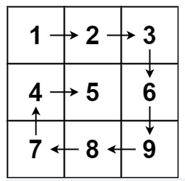
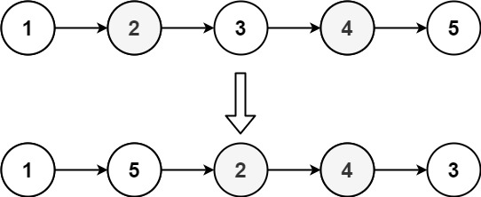
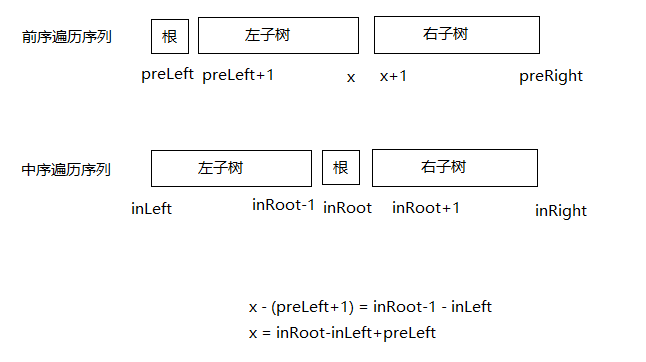

# 力扣刷题笔记（四）

[TOC]

## [509. 斐波那契数](https://leetcode-cn.com/problems/fibonacci-number/)

难度：简单:star::star::star:

### 题目

斐波那契数 （通常用 F(n) 表示）形成的序列称为 斐波那契数列 。该数列由 0 和 1 开始，后面的每一项数字都是前面两项数字的和。也就是：

F(0) = 0，F(1) = 1
F(n) = F(n - 1) + F(n - 2)，其中 n > 1
给定 n ，请计算 F(n) 。

 

示例 1：

```
输入：n = 2
输出：1
解释：F(2) = F(1) + F(0) = 1 + 0 = 1
```

示例 2：

```
输入：n = 3
输出：2
解释：F(3) = F(2) + F(1) = 1 + 1 = 2
```

示例 3：

```
输入：n = 4
输出：3
解释：F(4) = F(3) + F(2) = 2 + 1 = 3
```


提示：

- 0 <= n <= 30

### 代码

- 动态规划

```java
class Solution {
    public int fib(int n) {
        if (n < 2) {
            return n;
        }
        int[] dp = new int[n+1];
        dp[0] = 0;
        dp[1] = 1;
        for(int i = 2; i <= n; i++) {
            dp[i] = dp[i-1] + dp[i-2];
        }
        return dp[n];
    }
}
```

- 状态压缩

```java
class Solution {
    public int fib(int n) {
        if (n < 2) {
            return n;
        }
        int f0 = 0;
        int f1 = 1;
        int fn = 0;
        for(int i = 2; i <= n; i++) {
            fn = f0 + f1;
            f0 = f1;
            f1 = fn;
        }
        return fn;
    }
}
```

### 笔记

## [剑指 Offer 03. 数组中重复的数字](https://leetcode-cn.com/problems/shu-zu-zhong-zhong-fu-de-shu-zi-lcof/)

难度：简单:star::star::star:

### 题目

找出数组中重复的数字。


在一个长度为 n 的数组 nums 里的所有数字都在 0～n-1 的范围内。数组中某些数字是重复的，但不知道有几个数字重复了，也不知道每个数字重复了几次。请找出数组中任意一个重复的数字。

示例 1：

```
输入：
[2, 3, 1, 0, 2, 5, 3]
输出：2 或 3 
```


限制：

- 2 <= n <= 100000

### 代码

- HashMap

```java
class Solution {
    public int findRepeatNumber(int[] nums) {
        HashMap<Integer, Integer> map = new HashMap<>();
        for(int num : nums) {
            map.put(num, map.getOrDefault(num, 0) + 1);
            if (map.get(num) >=2) {
                return num;
            }
        }
        return nums[0];
    }
}
```

- HashSet

```java
class Solution {
    public int findRepeatNumber(int[] nums) {
        HashSet<Integer> set = new HashSet<>();
        for(int num : nums) {
            if (set.contains(num)) {
                return num;
            } else {
                set.add(num);
            }
        }
        return nums[0];
    }
}
```

- 排序

```java
class Solution {
    public int findRepeatNumber(int[] nums) {
        Arrays.sort(nums);
        for(int i = 1; i < nums.length; i++) {
            if (nums[i] == nums[i-1]) {
                return nums[i];
            }
        }
        return nums[0];
    }
}
```

### 笔记

- 

## [59. 螺旋矩阵 II](https://leetcode-cn.com/problems/spiral-matrix-ii/)

难度：中等:star::star::star::star:

### 题目

你一个正整数 n ，生成一个包含 1 到 n2 所有元素，且元素按顺时针顺序螺旋排列的 n x n 正方形矩阵 matrix 。


示例 1：


```
输入：n = 3
输出：[[1,2,3],[8,9,4],[7,6,5]]
```

示例 2：

```
输入：n = 1
输出：[[1]]
```


提示：

- 1 <= n <= 20

### 代码

- 按方向模拟

```java
class Solution {
    public int[][] generateMatrix(int n) {
        int[][] res = new int[n][n];
        int[][] direction = {{0, 1}, {1, 0}, {0, -1}, {-1, 0}}; // 右、下、左、上;
        int x = 0;
        int y = 0;
        int d = 0;
        int next_x = 0;
        int next_y = 0;
        for(int m = 1; m <= n*n; m++) {
            res[x][y] = m;
            next_x = x + direction[d][0];
            next_y = y + direction[d][1];
            if(next_x >= n || next_y >= n || next_x < 0 || next_y < 0 || res[next_x][next_y] != 0) {
                d = (d + 1) % 4;
                next_x = x + direction[d][0];
                next_y = y + direction[d][1];
            }
            x = next_x;
            y = next_y;
        }
        return res;
    }
}
```

- 按圈模拟

```java
class Solution {
    public int[][] generateMatrix(int n) {
        int[][] res = new int[n][n];
        int top = 0;
        int left = 0;
        int bottom = n-1;
        int right = n-1;
        int m = 1;
        while(top < bottom && left < right) {
            // 从左填到右（最右边不填）
            for(int i = left; i < right; i++) {
                res[top][i] = m;
                m++;
            }
            // 从上填到下（最下边不填）
            for(int i = top; i < bottom; i++) {
                res[i][right] = m;
                m++;
            }
            // 从右填到左（最左边不填）
            for(int i = right; i > left; i--) {
                res[bottom][i] = m;
                m++;
            }
            // 从下填到上（最上边不填）
            for(int i = bottom; i > top; i--) {
                res[i][left] = m;
                m++;
            }
            top++;
            left++;
            bottom--;
            right--;
        }
        // 奇数再添加中间的一个
        if (n % 2 != 0) {
            res[top][left] = m;
        }
        return res;
    }
}
```

- 按圈模拟

```java
class Solution {
    public int[][] generateMatrix(int n) {
        int[][] res = new int[n][n];
        int top = 0;
        int left = 0;
        int bottom = n-1;
        int right = n-1;
        int m = 1;
        while(m <= n*n) {
            // 从左填到右
            for(int i = left; i <= right; i++) {
                res[top][i] = m;
                m++;
            }
            top++;
            // 从上填到下
            for(int i = top; i <= bottom; i++) {
                res[i][right] = m;
                m++;
            }
            right--;
            // 从右填到左
            for(int i = right; i >= left; i--) {
                res[bottom][i] = m;
                m++;
            }
            bottom--;
            // 从下填到上
            for(int i = bottom; i >= top; i--) {
                res[i][left] = m;
                m++;
            }
            left++;
        }
        return res;
    }
}
```

### 笔记

- 按方向模拟：上下左右四个方向，直接通过变量不好控制，使用方向数组来控制方向是个好办法。
  为了避免覆盖重复的值，可以通过**判断当前值不等于0，就说明该位置已经走过了**。
  使用next_x和next_y来控制边界，这样遇到边界时，x和y不需要回退，直接转向。
- 按圈模拟：先填充最外面的一圈，再填空第二圈，填充的时候：按照从左填到右（最右边不填），从上填到下（最下边不填），从右填到左（最左边不填），从下填到上（最上边不填）的顺序填写。
  注意，如果n是奇数的话，再填写中间的一个
- 按圈模拟：从左到右填满，填满后到下一行，下一行从上到下填满，填满后往左一列，从右到左填满，填满后到上一行，从下到上填满，填满后往右一列。
  使用num <= tar而不是l < r || t < b作为迭代条件，是为了解决当n为奇数时，矩阵中心数字无法在迭代过程中被填充的问题。

## [54. 螺旋矩阵](https://leetcode-cn.com/problems/spiral-matrix/)

难度：中等:star::star::star::star:

### 题目

给你一个 m 行 n 列的矩阵 matrix ，请按照 顺时针螺旋顺序 ，返回矩阵中的所有元素。

 

示例 1：



```
输入：matrix = [[1,2,3],[4,5,6],[7,8,9]]
输出：[1,2,3,6,9,8,7,4,5]
```

示例 2：


```
输入：matrix = [[1,2,3,4],[5,6,7,8],[9,10,11,12]]
输出：[1,2,3,4,8,12,11,10,9,5,6,7]
```


提示：

- m == matrix.length
- n == matrix[i].length
- 1 <= m, n <= 10
- -100 <= matrix[i][j] <= 100

### 代码

- 按方向遍历

```java
class Solution {
    public List<Integer> spiralOrder(int[][] matrix) {
        ArrayList<Integer> res = new ArrayList<>();
        int[][] direction = {{0, 1}, {1, 0}, {0, -1}, {-1, 0}};
        int m = matrix.length;
        int n = matrix[0].length;
        int num = m * n;
        int x = 0;
        int y = 0;
        int next_x = 0;
        int next_y = 0;
        int i = 0;
        while(num > 0) {
            res.add(matrix[x][y]);
            matrix[x][y] = 101;
            num--;
            next_x = x + direction[i][0];
            next_y = y + direction[i][1];
            if (next_x >= m || next_y >= n || next_x < 0 || next_y < 0 || matrix[next_x][next_y]==101) {
                i = (i + 1) % 4;
                next_x = x + direction[i][0];
                next_y = y + direction[i][1];    
            }
            x = next_x;
            y = next_y;
        }
        return res;
    }
}
```

- 按圈遍历

```java
class Solution {
    public List<Integer> spiralOrder(int[][] matrix) {
        ArrayList<Integer> res = new ArrayList<>();
        int m = matrix.length;
        int n = matrix[0].length;
        int top = 0;
        int bottom = m - 1;
        int left = 0;
        int right = n - 1;
        int num = m * n;
        while(num > 0) {
            if (num == 0) {
                return res;
            }
            // 从左往右
            for(int i = left; i <= right; i++) {
                res.add(matrix[top][i]);
                num--;
            }
            // 往下一行
            top++;
            if (num == 0) {
                return res;
            }
            // 从上往下
            for(int i = top; i <= bottom; i++) {
                res.add(matrix[i][right]);
                num--;
            }
            // 往左一列
            right--;
            if (num == 0) {
                return res;
            }
            // 从右往左
            for(int i = right; i >= left; i--) {
                res.add(matrix[bottom][i]);
                num--;
            }
            // 往上一行
            bottom--;
            if (num == 0) {
                return res;
            }
            // 从下往上
            for(int i = bottom; i >= top; i--) {
                res.add(matrix[i][left]);
                num--;
            }
            // 往右一列
            left++;
        }
        return res;
    }
}
```

- 按圈遍历

```java
class Solution {
    public List<Integer> spiralOrder(int[][] matrix) {
        ArrayList<Integer> res = new ArrayList<>();
        int m = matrix.length;
        int n = matrix[0].length;
        int top = 0;
        int bottom = m - 1;
        int left = 0;
        int right = n - 1;
        int num = m * n;
        while(num > 0) {
            // 从左往右
            for(int i = left; i <= right; i++) {
                res.add(matrix[top][i]);
                num--;
            }
            // 往下一行
            top++;
            // 从上往下
            for(int i = top; i <= bottom; i++) {
                res.add(matrix[i][right]);
                num--;
            }
            // 往左一列
            right--;
            // 从右往左
            for(int i = right; i >= left; i--) {
                res.add(matrix[bottom][i]);
                num--;
            }
            // 往上一行
            bottom--;
            // 从下往上
            for(int i = bottom; i >= top; i--) {
                res.add(matrix[i][left]);
                num--;
            }
            // 往右一列
            left++;
        }
        return res.subList(0, m*n);
    }
}
```

### 笔记

- 按方向遍历：定义四个方向`int[][] direction = {{0, 1}, {1, 0}, {0, -1}, {-1, 0}};`并且使用next_x和next_y来控制边界，如果一个位置已经访问过，就把它的值改一下，防止重复遍历。
- 按圈遍历：从左往右遍历完，然后往下一行，再从上往下遍历完，然后往左一列，再从右往左遍历完，然后往上一行，再从下往上遍历完，然后往右一列，循环。
- ArrayList的subList() 方法用于截取并返回动态数组中的一部分。
  arraylist.subList(int fromIndex, int toIndex)
  注：arraylist 是 ArrayList 类的一个对象。
  参数说明：
  fromIndex - 截取元素的起始位置，包含该索引位置元素
  toIndex - 截取元素的结束位置，不包含该索引位置元素

## [剑指 Offer 29. 顺时针打印矩阵](https://leetcode-cn.com/problems/shun-shi-zhen-da-yin-ju-zhen-lcof/)

难度：简单:star::star::star:

### 题目

输入一个矩阵，按照从外向里以顺时针的顺序依次打印出每一个数字。

 

示例 1：

```
输入：matrix = [[1,2,3],[4,5,6],[7,8,9]]
输出：[1,2,3,6,9,8,7,4,5]
```

示例 2：

```
输入：matrix = [[1,2,3,4],[5,6,7,8],[9,10,11,12]]
输出：[1,2,3,4,8,12,11,10,9,5,6,7]
```


限制：

- 0 <= matrix.length <= 100
- 0 <= matrix[i].length <= 100

注意：本题与主站 54 题相同：https://leetcode-cn.com/problems/spiral-matrix/

### 代码

- 按方向遍历

```java
class Solution {
    public int[] spiralOrder(int[][] matrix) {
        int[][] direction = {{0, 1}, {1, 0}, {0, -1}, {-1, 0}};
        int m = matrix.length;
        if (m == 0) {
            return new int[]{};
        }
        int n = matrix[0].length;
        int num = m * n;
        int[] res = new int[num];
        int x = 0;
        int y = 0;
        int next_x = 0;
        int next_y = 0;
        int i = 0;
        int dIndex = 0;
        while(i < num) {
            res[i] = matrix[x][y];
            matrix[x][y] = 101;
            i++;
            next_x = x + direction[dIndex][0];
            next_y = y + direction[dIndex][1];
            if (next_x >= m || next_y >= n || next_x < 0 || next_y < 0 || matrix[next_x][next_y]==101) {
                dIndex = (dIndex + 1) % 4;
                next_x = x + direction[dIndex][0];
                next_y = y + direction[dIndex][1];    
            }
            x = next_x;
            y = next_y;
        }
        return res;
    }
}
```

- 按圈遍历

```java
class Solution {
    public int[] spiralOrder(int[][] matrix) {
        int m = matrix.length;
        if (m == 0) {
            return new int[]{};
        }
        int n = matrix[0].length;
        int top = 0;
        int bottom = m - 1;
        int left = 0;
        int right = n - 1;
        int num = m * n;
        int[] res = new int[num];
        int count = 0;
        while(count < num) {
            // 从左往右
            for(int i = left; i <= right && count < num; i++) {
                res[count] = matrix[top][i];
                count++;
            }
            // 往下一行
            top++;
            // 从上往下
            for(int i = top; i <= bottom && count < num; i++) {
                res[count] = matrix[i][right];
                count++;
            }
            // 往左一列
            right--;
            // 从右往左
            for(int i = right; i >= left && count < num; i--) {
                res[count] = matrix[bottom][i];
                count++;
            }
            // 往上一行
            bottom--;
            // 从下往上
            for(int i = bottom; i >= top && count < num; i--) {
                res[count] = matrix[i][left];
                count++;
            }
            // 往右一列
            left++;
        }
        return res;
    }
}
```

### 笔记

- Java返回空数组：

  ```java
  return new int[]{};
  ```

## [904. 水果成篮](https://leetcode-cn.com/problems/fruit-into-baskets/)

难度：中等:star::star::star::star:

### 题目

你正在探访一家农场，农场从左到右种植了一排果树。这些树用一个整数数组 fruits 表示，其中 fruits[i] 是第 i 棵树上的水果 种类 。

你想要尽可能多地收集水果。然而，农场的主人设定了一些严格的规矩，你必须按照要求采摘水果：

你只有 两个 篮子，并且每个篮子只能装 单一类型 的水果。每个篮子能够装的水果总量没有限制。
你可以选择任意一棵树开始采摘，你必须从 每棵 树（包括开始采摘的树）上 恰好摘一个水果 。采摘的水果应当符合篮子中的水果类型。每采摘一次，你将会向右移动到下一棵树，并继续采摘。
一旦你走到某棵树前，但水果不符合篮子的水果类型，那么就必须停止采摘。
给你一个整数数组 fruits ，返回你可以收集的水果的 最大 数目。

 

示例 1：

```
输入：fruits = [1,2,1]
输出：3
解释：可以采摘全部 3 棵树。
```

示例 2：

```
输入：fruits = [0,1,2,2]
输出：3
解释：可以采摘 [1,2,2] 这三棵树。
如果从第一棵树开始采摘，则只能采摘 [0,1] 这两棵树。
```

示例 3：

```
输入：fruits = [1,2,3,2,2]
输出：4
解释：可以采摘 [2,3,2,2] 这四棵树。
如果从第一棵树开始采摘，则只能采摘 [1,2] 这两棵树。
```

示例 4：

```
输入：fruits = [3,3,3,1,2,1,1,2,3,3,4]
输出：5
解释：可以采摘 [1,2,1,1,2] 这五棵树。
```


提示：

- 1 <= fruits.length <= 10^5^
- 0 <= fruits[i] < fruits.length

### 代码

- 滑动窗口

```java
class Solution {
    public int totalFruit(int[] fruits) {
        int n = fruits.length;
        int left = 0;
        int right = 0;
        int res = 0;
        HashMap<Integer, Integer> map = new HashMap<>();
        while(right < n) {
            // 记录窗口内每种水果的个数
            map.put(fruits[right], map.getOrDefault(fruits[right], 0) + 1);
            right++;
            // System.out.println(left + ", " + right);
            // 窗口内水果的种类超过两类时，要收缩窗口
            while(map.size() > 2) {
                map.put(fruits[left], map.get(fruits[left]) - 1);
                // 一个水果去掉了，就把它移出去
                if(map.get(fruits[left]) == 0) {
                    map.remove(fruits[left]);
                }
                left++;
            }
            // 窗口内水果的种类没有超过两类时，这个一直在增加。超过两类时，left会更新。
            res = Math.max(res, right-left);
            // System.out.println(map.toString());
        }
        return res;
        
    }
}
```

- 滑动窗口

```java
class Solution {
    public int totalFruit(int[] fruits) {
        int n = fruits.length;
        int left = 0;
        int right = 0;
        int res = 0;
        int[] map = new int[n];
        int count = 0;
        while(right < n) {
            // 记录窗口内每种水果的个数
            map[fruits[right]]++;
            if (map[fruits[right]] == 1) {
                count++;
            }
            right++;
            // System.out.println(left + ", " + right);
            // 窗口内水果的种类超过两类时，要收缩窗口
            while(count > 2) {
                map[fruits[left]]--;
                // 一个水果去掉了，就把它移出去
                if(map[fruits[left]] == 0) {
                    count--;
                }
                left++;
            }
            // 窗口内水果的种类没有超过两类时，这个一直在增加。超过两类时，left会更新。
            res = Math.max(res, right-left);
        }
        return res;
        
    }
}
```

### 笔记

- 滑动窗口的基本思想：右边一直往右，窗口内的元素满足某些条件时（需要滑动窗口时），移除窗口左边的元素，左边开始往右，直到窗口内的元素不满足某些条件，然后右边继续往右。

- 满足某些条件的子串问题、子数组问题通常可以考虑使用滑动窗口

- 滑动窗口的基本模板：

  ```java
  int left = 0;
  int right = 0;
  while(right < n) {
  	... // 右边进入窗口，更新一些东西
  	right++;
  	// 要收缩窗口
  	while(...) {
  		... // 左边出窗口前，更新一些东西
  		left++;
  	}
  }
  ```
  一般来说，左边出窗口时的操作和右边进窗口时的操作是对称的，右边进的时候往里加，左边出的时候就往外减。

- 由于题目说`0 <= fruits[i] < fruits.length`，所以可以使用一个长度为fruits.length的数组代替HashMap来计数，不过要增加一个变量count，来记录水果的种类数，作用同HashMap.size()。

## [76. 最小覆盖子串](https://leetcode-cn.com/problems/minimum-window-substring/)

难度：困难:star::star::star::star::star:

### 题目

给你一个字符串 s 、一个字符串 t 。返回 s 中涵盖 t 所有字符的最小子串。如果 s 中不存在涵盖 t 所有字符的子串，则返回空字符串 "" 。

 

注意：

- 对于 t 中重复字符，我们寻找的子字符串中该字符数量必须不少于 t 中该字符数量。
- 如果 s 中存在这样的子串，我们保证它是唯一的答案。

示例 1：

```
输入：s = "ADOBECODEBANC", t = "ABC"
输出："BANC"
```

示例 2：

```
输入：s = "a", t = "a"
输出："a"
```

示例 3:

```
输入: s = "a", t = "aa"
输出: ""
解释: t 中两个字符 'a' 均应包含在 s 的子串中，
因此没有符合条件的子字符串，返回空字符串。
```


提示：

- 1 <= s.length, t.length <= 10^5^
- s 和 t 由英文字母组成

进阶：你能设计一个在 o(n) 时间内解决此问题的算法吗？

### 代码

- 滑动窗口

```java
class Solution {
    public String minWindow(String s, String t) {
        int m = s.length();
        int n = t.length();
        if (m < n) {
            return "";
        }
        HashMap<Character, Integer> sMap = new HashMap<>();
        HashMap<Character, Integer> tMap = new HashMap<>();
        for(int i = 0; i < n; i++) {
            tMap.put(t.charAt(i), tMap.getOrDefault(t.charAt(i), 0) + 1);
        }
        int left = 0;
        int right = 0;
        int count = 0;
        String res = "";
        while(right < m) {
            char c1 = s.charAt(right);
            right++;
            // 只把那些在t中的字符记录下来，看能不能覆盖t
            if (tMap.containsKey(c1)) {
                sMap.put(c1, sMap.getOrDefault(c1, 0) + 1);
                // 因为map的键是Integer类型的，所以要用equals比较。
                if (sMap.get(c1).equals(tMap.get(c1))) {
                    // 这里要相等的时候才加1，表示截止到c1，刚好覆盖字符串t。
                    // 小于的时候，还没有覆盖t,不用加1
                    // 大于的时候，不用加1，因为在相等的时候已经加过1了
                    count++;
                }
            }
            // 可以覆盖t
            while(count == tMap.size()) {
                // 保存可以覆盖t的时候的字符串
                if (right - left < res.length() || left == 0) {
                    res = s.substring(left, right);
                }
                char c2 = s.charAt(left);
                left++;
                // 和上面的操作是对称的。
                // 只把那些在t中的字符移出
                if (tMap.containsKey(c2)) {
                    // 因为map的键是Integer类型的，所以要用equals比较。
                    if (sMap.get(c2).equals(tMap.get(c2))) {
                        // 这里要相等的时候才减一，表示c2开始刚好覆盖t，现在c2要往后移了
                        // 去掉了c2，变成了小于，表示刚好不能覆盖t
                        count--;
                    }
                    // 一次只移出一个c2（最左边的）
                    sMap.put(c2, sMap.get(c2) - 1);
                }
            }
        }
        return res;
    }
}
```

### 笔记

- Java中Integer类型的比较要使用equals。当我们比较包装类的时候，如果范围在【-128，127】之间，可以直接用==比较，超出这个范围要用equals，进行比较。

  ```java
  @Test
  public void test1(){
      Integer i = 100;
      Integer i2 = 100;
  
      Integer i3 = 300;
      Integer i4 = 300;
  
      System.out.println(i==i2); // 输出 true
      System.out.println(i3==i4);// 输出 false
  }
  ```

## [438. 找到字符串中所有字母异位词](https://leetcode-cn.com/problems/find-all-anagrams-in-a-string/)

难度：中等:star::star::star::star:

### 题目

给定两个字符串 s 和 p，找到 s 中所有 p 的 异位词 的子串，返回这些子串的起始索引。不考虑答案输出的顺序。

异位词 指由相同字母重排列形成的字符串（包括相同的字符串）。

 

示例 1:

```
输入: s = "cbaebabacd", p = "abc"
输出: [0,6]
解释:
起始索引等于 0 的子串是 "cba", 它是 "abc" 的异位词。
起始索引等于 6 的子串是 "bac", 它是 "abc" 的异位词。
```

 示例 2:

```
输入: s = "abab", p = "ab"
输出: [0,1,2]
解释:
起始索引等于 0 的子串是 "ab", 它是 "ab" 的异位词。
起始索引等于 1 的子串是 "ba", 它是 "ab" 的异位词。
起始索引等于 2 的子串是 "ab", 它是 "ab" 的异位词。
```


提示:

- 1 <= s.length, p.length <= 3 * 10^4^
- s 和 p 仅包含小写字母

### 代码

- 滑动窗口

```java
class Solution {
    public List<Integer> findAnagrams(String s, String p) {
        int sLen = s.length();
        int pLen = p.length();
        ArrayList<Integer> res = new ArrayList<>();
        if (sLen < pLen) {
            return res;
        }
        HashMap<Character, Integer> sMap = new HashMap<>();
        HashMap<Character, Integer> pMap = new HashMap<>();
        for(int i = 0; i < pLen; i++) {
            pMap.put(p.charAt(i), pMap.getOrDefault(p.charAt(i), 0) + 1);
        }
        int left = 0;
        int right = 0;
        int count = 0;
        while(right < sLen) {
            char c1 = s.charAt(right);
            right++;
            if (pMap.containsKey(c1)) {
                sMap.put(c1, sMap.getOrDefault(c1, 0) + 1);
                if (sMap.get(c1).equals(pMap.get(c1))) {
                    count++;
                }
            }
            while(right - left == pLen) {
                if (count == pMap.size()) {
                    res.add(left);
                }
                char c2 = s.charAt(left);
                left++;
                if (pMap.containsKey(c2)) {
                    if (sMap.get(c2).equals(pMap.get(c2))) {
                        count--;
                    }
                    sMap.put(c2, sMap.get(c2) - 1);
                }
            }
        }

        return res;
    }
}
```

- 滑动窗口-两个数组

```java
class Solution {
    public List<Integer> findAnagrams(String s, String p) {
        int sLen = s.length();
        int pLen = p.length();
        ArrayList<Integer> res = new ArrayList<>();
        if (sLen < pLen) {
            return res;
        }
        int[] sMap = new int[26];
        int[] pMap = new int[26];
        int pNum = 0;
        for(int i = 0; i < pLen; i++) {
            pMap[p.charAt(i) - 'a']++;
            if (pMap[p.charAt(i) - 'a'] == 1) {
                pNum++;
            }
        }
        int left = 0;
        int right = 0;
        int sNum = 0;
        while(right < sLen) {
            int c1 = s.charAt(right) - 'a';
            right++;
            if (pMap[c1] > 0) {
                sMap[c1]++;
                if (sMap[c1] == pMap[c1]) {
                    sNum++;
                }
            }
            while(right - left == pLen) {
                if (sNum == pNum) {
                    res.add(left);
                }
                int c2 = s.charAt(left) - 'a';
                left++;
                if (pMap[c2] > 0) {
                    if (sMap[c2] == pMap[c2]) {
                        sNum--;
                    }
                    sMap[c2]--;
                }
            }
        }

        return res;
    }
}
```

- 滑动窗口-一个数组

```java
class Solution {
    public List<Integer> findAnagrams(String s, String p) {
        int sLen = s.length();
        int pLen = p.length();
        ArrayList<Integer> res = new ArrayList<>();
        if (sLen < pLen) {
            return res;
        }
        int[] map = new int[26];
        for(int i = 0; i < pLen; i++) {
            map[p.charAt(i) - 'a']++;
        }
        int left = 0;
        int right = 0;
        while(right < sLen) {
            int c1 = s.charAt(right) - 'a';
            right++;
            map[c1]--;
            // 有小于0，说明c1不在p中，缩减窗口
            while(map[c1] < 0) {
                int c2 = s.charAt(left) - 'a';
                left++;
                map[c2]++;
            }
            // 出while,或者没有进while，说明从c2到c1都在p中(对应的map都为0)
            // 这时若c2和c1之间的距离刚好是p的长度，那就说明刚好这一段子串是p的异位词
            if (right - left == pLen) {
                res.add(left);
            }
        }
        return res;
    }
}
```

### 笔记

## [15. 三数之和](https://leetcode-cn.com/problems/3sum/)

难度：中等:star::star::star::star:

### 题目

给你一个包含 n 个整数的数组 nums，判断 nums 中是否存在三个元素 a，b，c ，使得 a + b + c = 0 ？请你找出所有和为 0 且不重复的三元组。

注意：答案中不可以包含重复的三元组。

 

示例 1：

```
输入：nums = [-1,0,1,2,-1,-4]
输出：[[-1,-1,2],[-1,0,1]]
```

示例 2：

```
输入：nums = []
输出：[]
```

示例 3：

```
输入：nums = [0]
输出：[]
```


提示：

- 0 <= nums.length <= 3000
- -10^5^ <= nums[i] <= 10^5^

### 代码

- 转为两数之和

```java
class Solution {
    public List<List<Integer>> threeSum(int[] nums) {
        Arrays.sort(nums);
        List<List<Integer>> res = new ArrayList<>();
        for(int i = 0; i < nums.length; ) {
            int tmp = i;
            List<int[]> two = twoSum(nums, i + 1, 0 - nums[i]);
            if (two.size() > 0) {
                for(int[] t : two) {
                    res.add(new ArrayList<>(){{add(nums[tmp]); add(t[0]); add(t[1]);}});
                }
            }
            while(i < nums.length && nums[i] == nums[tmp]) i++;
        }
        return res;
    }
    public List<int[]> twoSum(int[] nums, int start, int target) {
        int lo = start;
        int hi = nums.length - 1;
        List<int[]> res = new ArrayList<>();
        while(lo < hi) {
            int sum = nums[lo] + nums[hi];
            if (sum < target) {
                // 跳过相同值
                int left = nums[lo];
                while(lo < hi && left == nums[lo]) lo++;
            } 
            else if (sum > target){
                // 跳过相同值
                int right = nums[hi];
                while(lo < hi && right == nums[hi]) hi--;
            } 
            else if (sum == target) {
                int left = nums[lo];
                int right = nums[hi];
                res.add(new int[]{left, right});
                // 跳过相同值
                while(lo < hi && left == nums[lo]) lo++;
                while(lo < hi && right == nums[hi]) hi--;
            }
        }
        return res;
    }
}
```

- 转为两数之和

```java
class Solution {
    public List<List<Integer>> threeSum(int[] nums) {
        Arrays.sort(nums);
        List<List<Integer>> res = new ArrayList<>();
        for(int i = 0; i < nums.length; ) {
            int tmp = i;
            // 从i+1开始，避免每次找两数之和时是在整个数组中找，会出现重复。
            // 比如a+b=-c,a+c=-b,b+c=-a，这些都是重复的。
            List<List<Integer>> two = twoSum(nums, i + 1, 0 - nums[i]);
            if (two.size() > 0) {
                for(List<Integer> t : two) {
                    t.add(nums[i]);
                    res.add(t);
                }
            }
            // 跳过相同值
            while(i < nums.length && nums[i] == nums[tmp]) i++;
        }
        return res;
    }
    public List<List<Integer>> twoSum(int[] nums, int start, int target) {
        int lo = start;
        int hi = nums.length - 1;
        List<List<Integer>> res = new ArrayList<>();
        while(lo < hi) {
            int sum = nums[lo] + nums[hi];
            if (sum < target) {
                // 跳过相同值
                int left = nums[lo];
                while(lo < hi && left == nums[lo]) lo++;
            } 
            else if (sum > target){
                // 跳过相同值
                int right = nums[hi];
                while(lo < hi && right == nums[hi]) hi--;
            } 
            else if (sum == target) {
                int left = nums[lo];
                int right = nums[hi];
                res.add(new ArrayList<>(){{add(left); add(right);}});
                // 跳过相同值
                while(lo < hi && left == nums[lo]) lo++;
                while(lo < hi && right == nums[hi]) hi--;
            }
        }
        return res;
    }
}
```

- 排序+双指针

```java
class Solution {
    public List<List<Integer>> threeSum(int[] nums) {
        Arrays.sort(nums);
        List<List<Integer>> res = new ArrayList<>();
        int n = nums.length;
        for(int i = 0; i < n; i++) {
            if (nums[i] > 0) {
                break;
            }
            if (i > 0 && nums[i] == nums[i-1]) {
                continue;
            }
            int j = i + 1;
            int k = n - 1;
            while(j < k) {
                int sum = nums[i] + nums[j] + nums[k];
                if (sum < 0) {
                    int tmp = j;
                    while(j < k && nums[j] == nums[tmp]) {
                        j++;
                    }
                } else if (sum > 0) {
                    int tmp = k;
                    while(k > j && nums[k] == nums[tmp]) {
                        k--;
                    }
                } else if (sum == 0) {
                    res.add(Arrays.asList(nums[i], nums[j], nums[k]));
                    int tmp1 = j;
                    int tmp2 = k;
                    while(j < k && nums[j] == nums[tmp1]) {
                        j++;
                    }
                    while(k > j && nums[k] == nums[tmp2]) {
                        k--;
                    }
                }
            }
        }
        return res;
    }
}
```

### 笔记

- Java中ArrayList定义时赋值：

  ```java
  ArrayList<Integer> res = new ArrayList<Integer>(){{add(1); add(2);}};
  ```

- 三数之和：确定一个数字之后，和就是`target-nums[i]`,就转为了求两数之和。
  一些技巧：

  1. 先排序，可以加快查找
  2. 排完序后，找两数之和可以用双指针，同时注意到，因为排了序，所以在找两数之和时，左右指针都可以跳过相同的值。
  3. 找三数之和时，为了避免重复，可以缩减找两数之和的数组范围。
  4. 由于排过序，在遍历第一个数的时候，也可以跳过相同的值。

- Java中Arrays.asList():

  ```java
  public static <T> List<T> asList(T... a); //返回由指定数组支持的固定大小的列表。 （对返回列表的更改“直写”到数组。）
  // 此方法还提供了一种方便的方法来创建初始化为包含多个元素的固定大小的列表：
  List<String> stooges = Arrays.asList("Larry", "Moe", "Curly"); 
  ```

## [18. 四数之和](https://leetcode-cn.com/problems/4sum/)

难度：中等:star::star::star::star:

### 题目

给你一个由 n 个整数组成的数组 nums ，和一个目标值 target 。请你找出并返回满足下述全部条件且不重复的四元组 [nums[a], nums[b], nums[c], nums[d]] （若两个四元组元素一一对应，则认为两个四元组重复）：

- 0 <= a, b, c, d < n
- a、b、c 和 d 互不相同
- nums[a] + nums[b] + nums[c] + nums[d] == target
- 你可以按 任意顺序 返回答案 。

 

示例 1：

```
输入：nums = [1,0,-1,0,-2,2], target = 0
输出：[[-2,-1,1,2],[-2,0,0,2],[-1,0,0,1]]
```

示例 2：

```
输入：nums = [2,2,2,2,2], target = 8
输出：[[2,2,2,2]]
```


提示：

- 1 <= nums.length <= 200
- -10^9^ <= nums[i] <= 10^9^
- -10^9^ <= target <= 10^9^

### 代码

- 转为三数之和

```java
class Solution {
    public List<List<Integer>> fourSum(int[] nums, int target) {
        Arrays.sort(nums);
        List<List<Integer>> res = new ArrayList<>();
        for(int i = 0; i < nums.length; ) {
            int tmp = i;
            List<List<Integer>> three = threeSum(nums, i + 1, target - nums[i]);
            for(List<Integer> t: three) {
                t.add(nums[i]);
                res.add(t);
            }
            while(i < nums.length && nums[i]==nums[tmp]) i++;
        }
        return res;
    }
    public List<List<Integer>> threeSum(int[] nums, int start, int target) {
        List<List<Integer>> res = new ArrayList<>();
        for(int i = start; i < nums.length; ) {
            int tmp = i;
            List<List<Integer>> two = twoSum(nums, i + 1, target - nums[i]);
            for(List<Integer> t : two) {
                t.add(nums[i]);
                res.add(t);
            }
            while(i < nums.length && nums[i]==nums[tmp]) i++;
        }
        return res;
    }
    public List<List<Integer>> twoSum(int[] nums, int start, int target) {
        List<List<Integer>> res = new ArrayList<>();
        int lo = start;
        int hi = nums.length - 1;
        while(lo < hi) {
            int sum = nums[lo] + nums[hi];
            if (sum < target) {
                int tmp = lo;
                while(lo < hi && nums[lo] == nums[tmp]) lo++;
            }
            else if (sum > target) {
                int tmp = hi;
                while(hi > lo && nums[hi] == nums[tmp]) hi--;
            }
            else if (sum == target) {
                int tmp1 = nums[lo];
                int tmp2 = nums[hi];
                res.add(new ArrayList<>(){{add(tmp1); add(tmp2);}});
                while(lo < hi && nums[lo] == tmp1) lo++;
                while(hi > lo && nums[hi] == tmp2) hi--;
            }
        }
        return res;
    }
}
```

- 转为三数之和

```java
class Solution {
    public List<List<Integer>> fourSum(int[] nums, int target) {
        Arrays.sort(nums);
        List<List<Integer>> res = new ArrayList<>();
        for(int i = 0; i < nums.length; i++) {
            if (i > 0 && nums[i] == nums[i-1]) continue;
            List<List<Integer>> three = threeSum(nums, i + 1, target - nums[i]);
            for(List<Integer> t : three) {
                t.add(nums[i]);
                res.add(t);
            }
        }
        return res;
    }
    public List<List<Integer>> threeSum(int[] nums, int start, int target) {
        List<List<Integer>> res = new ArrayList<>();
        for(int i = start; i < nums.length; i++) {
            if (i > start && nums[i] == nums[i-1]) continue;
            int j = i + 1;
            int k = nums.length - 1;
            while(j < k) {
                int sum = nums[i] + nums[j] + nums[k];
                if (sum < target) {
                    int tmp = nums[j];
                    while(j < k && nums[j] == tmp) j++;
                }
                else if (sum > target) {
                    int tmp = nums[k];
                    while(k > j && nums[k] == tmp) k--;
                } 
                else if (sum == target) {
                    int tmp1 = nums[j];
                    int tmp2 = nums[k];
                    int tmp3 = nums[i];
                    res.add(new ArrayList<>(){{add(tmp3); add(tmp1); add(tmp2);}});
                    while(j < k && nums[j] == tmp1) j++;
                    while(k > j && nums[k] == tmp2) k--;
                }
            }
        }
        return res;
    }
}
```

- nSum模板

```java
class Solution {
    public List<List<Integer>> fourSum(int[] nums, int target) {
        Arrays.sort(nums);
        List<List<Integer>> res = nSum(nums, 4, 0, target);
        return res;
    }
    public List<List<Integer>> nSum(int[] nums, int n, int start, int target) {
        List<List<Integer>> res = new ArrayList<>();
        int m = nums.length;
        if (n < 2 || n > m) {
            return res;
        }
        if (n == 2) {
            int lo = start;
            int hi = nums.length - 1;
            while(lo < hi) {
                int sum = nums[lo] + nums[hi];
                if (sum < target) {
                    int tmp = lo;
                    while(lo < hi && nums[lo] == nums[tmp]) lo++;
                }
                else if (sum > target) {
                    int tmp = hi;
                    while(hi > lo && nums[hi] == nums[tmp]) hi--;
                }
                else if (sum == target) {
                    int tmp1 = nums[lo];
                    int tmp2 = nums[hi];
                    res.add(new ArrayList<>(){{add(tmp1); add(tmp2);}});
                    while(lo < hi && nums[lo] == tmp1) lo++;
                    while(hi > lo && nums[hi] == tmp2) hi--;
                }
            }
        }
        if (n > 2) {
            for(int i = start; i < nums.length; ) {
                int tmp = i;
                List<List<Integer>> sub = nSum(nums, n - 1, i + 1, target - nums[i]);
                for(List<Integer> t : sub) {
                    t.add(nums[i]);
                    res.add(t);
                }
                while(i < nums.length && nums[i]==nums[tmp]) i++;
            }
        }
        return res;
    }
}
```

- 排序+双指针

```java
class Solution {
    public List<List<Integer>> fourSum(int[] nums, int target) {
        Arrays.sort(nums);
        List<List<Integer>> res = new ArrayList<>();
        int n = nums.length;
        for(int i = 0; i < n; i++) {
            if (i > 0 && nums[i] == nums[i-1]) continue;
            for(int j = i + 1; j < n; j++) {
                if (j > i + 1 && nums[j] == nums[j - 1]) continue;
                int k = j + 1;
                int l = n - 1;
                while(k < l) {
                    int sum = nums[i] + nums[j] + nums[k] + nums[l];
                    if (sum < target) {
                        int tmp = nums[k];
                        while(k < l && nums[k] == tmp) k++;
                    }
                    else if (sum > target) {
                        int tmp = nums[l];
                        while(l > k && nums[l] == tmp) l--;
                    }
                    else if (sum == target) {
                        int tmp1 = nums[k];
                        int tmp2 = nums[l];
                        res.add(Arrays.asList(nums[i], nums[j], nums[k], nums[l]));
                        while(k < l && nums[k] == tmp1) k++;
                        while(l > k && nums[l] == tmp2) l--;
                    }
                }
            }
        }
        return res;
    }
}
```

### 笔记

- nSum问题代码模板：

  ```java
  public List<List<Integer>> nSum(int[] nums, int n, int start, int target) {
          List<List<Integer>> res = new ArrayList<>();
          int m = nums.length;
          if (n < 2 || n > m) {
              return res;
          }
          if (n == 2) {
              int lo = start;
              int hi = nums.length - 1;
              while(lo < hi) {
                  int sum = nums[lo] + nums[hi];
                  if (sum < target) {
                      int tmp = lo;
                      while(lo < hi && nums[lo] == nums[tmp]) lo++;
                  }
                  else if (sum > target) {
                      int tmp = hi;
                      while(hi > lo && nums[hi] == nums[tmp]) hi--;
                  }
                  else if (sum == target) {
                      int tmp1 = nums[lo];
                      int tmp2 = nums[hi];
                      res.add(new ArrayList<>(){{add(tmp1); add(tmp2);}});
                      while(lo < hi && nums[lo] == tmp1) lo++;
                      while(hi > lo && nums[hi] == tmp2) hi--;
                  }
              }
          }
          if (n > 2) {
              for(int i = start; i < nums.length; ) {
                  int tmp = i;
                  List<List<Integer>> sub = nSum(nums, n - 1, i + 1, target - nums[i]);
                  for(List<Integer> t : sub) {
                      t.add(nums[i]);
                      res.add(t);
                  }
                  while(i < nums.length && nums[i]==nums[tmp]) i++;
              }
          }
          return res;
      }
  ```

## [16. 最接近的三数之和](https://leetcode-cn.com/problems/3sum-closest/)

难度：中等:star::star::star::star:

### 题目

给你一个长度为 n 的整数数组 nums 和 一个目标值 target。请你从 nums 中选出三个整数，使它们的和与 target 最接近。

返回这三个数的和。

假定每组输入只存在恰好一个解。

 

示例 1：

```
输入：nums = [-1,2,1,-4], target = 1
输出：2
解释：与 target 最接近的和是 2 (-1 + 2 + 1 = 2) 。
```

示例 2：

```
输入：nums = [0,0,0], target = 1
输出：0
```

提示：

- 3 <= nums.length <= 1000
- -1000 <= nums[i] <= 1000
- -10^4^ <= target <= 10^4^

### 代码

- 排序+双指针

```java
class Solution {
    public int threeSumClosest(int[] nums, int target) {
        Arrays.sort(nums);
        int n = nums.length;
        int res = nums[0] + nums[1] + nums[2];
        for(int i = 0; i < n; i++) {
            if (i > 0 && nums[i] == nums[i-1]) continue;
            int j = i + 1;
            int k = n - 1;
            while(j < k) {
                int sum = nums[i] + nums[j] + nums[k];
                if (Math.abs(sum - target) < Math.abs(res - target)) {
                    res = sum;
                }
                if (sum == target) {
                    return sum;
                }
                if (sum < target) {
                    j++;
                }
                if (sum > target) {
                    k--;
                }
            }
        }
        return res;
    }
}
```

- 跳过相同值

```java
class Solution {
    public int threeSumClosest(int[] nums, int target) {
        Arrays.sort(nums);
        int n = nums.length;
        int res = nums[0] + nums[1] + nums[2];
        for(int i = 0; i < n; i++) {
            if (i > 0 && nums[i] == nums[i - 1]) continue;
            int j = i + 1;
            int k = n - 1;
            while(j < k) {
                int sum = nums[i] + nums[j] + nums[k];
                if (Math.abs(sum - target) < Math.abs(res - target)) {
                    res = sum;
                }
                if (sum == target) {
                    return sum;
                }
                else if (sum < target) {
                    int tmp = nums[j];
                    while(j < k && nums[j] == tmp) j++;
                } else if (sum > target) {
                    int tmp = nums[k];
                    while(k > j && nums[k] == tmp) k--;
                }
            }
        }
        return res;
    }
}
```

### 笔记

- 这里的res初始化为`nums[0] + nums[1] + nums[2];`是比较好的，初始化为0时，res会出现一直没有更新。

## [153. 寻找旋转排序数组中的最小值](https://leetcode-cn.com/problems/find-minimum-in-rotated-sorted-array/)

难度：中等:star::star::star::star:

### 题目

已知一个长度为 n 的数组，预先按照升序排列，经由 1 到 n 次 **旋转** 后，得到输入数组。例如，原数组 nums = [0,1,2,4,5,6,7] 在变化后可能得到：

- 若旋转 4 次，则可以得到 [4,5,6,7,0,1,2]
- 若旋转 7 次，则可以得到 [0,1,2,4,5,6,7]

注意，数组 [a[0], a[1], a[2], ..., a[n-1]] **旋转一次** 的结果为数组 [a[n-1], a[0], a[1], a[2], ..., a[n-2]] 。

给你一个元素值 **互不相同** 的数组 nums ，它原来是一个升序排列的数组，并按上述情形进行了多次旋转。请你找出并返回数组中的 **最小元素** 。

你必须设计一个时间复杂度为 O(log n) 的算法解决此问题。

 

示例 1：

```
输入：nums = [3,4,5,1,2]
输出：1
解释：原数组为 [1,2,3,4,5] ，旋转 3 次得到输入数组。
```

示例 2：

```
输入：nums = [4,5,6,7,0,1,2]
输出：0
解释：原数组为 [0,1,2,4,5,6,7] ，旋转 4 次得到输入数组。
```

示例 3：

```
输入：nums = [11,13,15,17]
输出：11
解释：原数组为 [11,13,15,17] ，旋转 4 次得到输入数组。
```


提示：

- n == nums.length
- 1 <= n <= 5000
- -5000 <= nums[i] <= 5000
- nums 中的所有整数 互不相同
- nums 原来是一个升序排序的数组，并进行了 1 至 n 次旋转

### 代码

- 二分

```java
class Solution {
    public int findMin(int[] nums) {
        int n = nums.length;
        int lo = 0;
        int hi = n - 1;
        while(lo < hi) {
            int mid = lo + (hi - lo) / 2;
            if (nums[hi] > nums[mid]) {
                hi = mid;
            } 
            else {
                lo = mid + 1;
            }
        }
        return nums[lo];
    }
}
```

### 笔记

- 经过分析，直接比较hi和mid位置的值比较方便。mid左边递增，右边递增，如果右边比mid大，说明从mid到hi是递增的，所以hi要减小。如果右边比mid小，说明从mid到hi是先减后增，最小值在mid到hi之间，所以lo要往mid靠近。

## [154. 寻找旋转排序数组中的最小值 II](https://leetcode-cn.com/problems/find-minimum-in-rotated-sorted-array-ii/)

难度：困难:star::star::star::star:

### 题目

已知一个长度为 n 的数组，预先按照升序排列，经由 1 到 n 次 旋转 后，得到输入数组。例如，原数组 nums = [0,1,4,4,5,6,7] 在变化后可能得到：

- 若旋转 4 次，则可以得到 [4,5,6,7,0,1,4]
- 若旋转 7 次，则可以得到 [0,1,4,4,5,6,7]

注意，数组 [a[0], a[1], a[2], ..., a[n-1]] 旋转一次 的结果为数组 [a[n-1], a[0], a[1], a[2], ..., a[n-2]] 。

给你一个可能存在 重复 元素值的数组 nums ，它原来是一个升序排列的数组，并按上述情形进行了多次旋转。请你找出并返回数组中的 最小元素 。

你必须尽可能减少整个过程的操作步骤。

 

示例 1：

```
输入：nums = [1,3,5]
输出：1
```

示例 2：

```
输入：nums = [2,2,2,0,1]
输出：0
```


提示：

- n == nums.length
- 1 <= n <= 5000
- -5000 <= nums[i] <= 5000
- nums 原来是一个升序排序的数组，并进行了 1 至 n 次旋转

进阶：这道题与 [寻找旋转排序数组中的最小值](https://leetcode-cn.com/problems/find-minimum-in-rotated-sorted-array/description/) 类似，但 nums 可能包含重复元素。允许重复会影响算法的时间复杂度吗？会如何影响，为什么？

### 代码

- 跳过相同+二分

```java
class Solution {
    public int findMin(int[] nums) {
        int n = nums.length;
        int lo = 0;
        int hi = n - 1;
        while (lo < hi) {
            while(hi > lo && nums[hi] == nums[hi - 1]) {
                hi--;
            }
            while(lo < hi && nums[lo] == nums[lo + 1]) {
                lo++;
            }
            int mid = lo + (hi - lo) / 2;
            if (nums[mid] < nums[hi]) {
                hi = mid;
            } else {
                lo = mid + 1;
            }
        }
        return nums[lo];
    }
}
```

### 笔记

- 有重复元素时，直接让hi跳到mid或者让lo跳到mid+1，会错过最小值，因此，再进行二分之前，先让hi和lo分别跳过相同的元素，再进行二分。

## [238. 除自身以外数组的乘积](https://leetcode-cn.com/problems/product-of-array-except-self/)

难度：中等:star::star::star::star:

### 题目

给你一个整数数组 nums，返回 数组 answer ，其中 answer[i] 等于 nums 中除 nums[i] 之外其余各元素的乘积 。

题目数据 保证 数组 nums之中任意元素的全部前缀元素和后缀的乘积都在  32 位 整数范围内。

请不要使用除法，且在 O(n) 时间复杂度内完成此题。

 

示例 1:

```
输入: nums = [1,2,3,4]
输出: [24,12,8,6]
```

示例 2:

```
输入: nums = [-1,1,0,-3,3]
输出: [0,0,9,0,0]
```


提示：

- 2 <= nums.length <= 105
- -30 <= nums[i] <= 30
- 保证 数组 nums之中任意元素的全部前缀元素和后缀的乘积都在  32 位 整数范围内

进阶：你可以在 O(1) 的额外空间复杂度内完成这个题目吗？（ 出于对空间复杂度分析的目的，输出数组不被视为额外空间。）

### 代码

- 前缀积乘后缀积

```java
class Solution {
    public int[] productExceptSelf(int[] nums) {
        int n = nums.length;
        int[] answer = new int[n];
        int[] left = new int[n];
        int[] right = new int[n];
        left[0] = 1;
        for (int i = 1; i < n; i++) {
            left[i] = left[i-1] * nums[i-1];
        }
        right[n - 1] = 1;
        for (int i = n - 2; i >= 0; i--) {
            right[i] = right[i + 1] * nums[i + 1];
        }
        for (int i = 0; i < n; i++) {
            answer[i] = left[i] * right[i];
        }
        return answer;
    }
}
```

- 省空间

```java
class Solution {
    public int[] productExceptSelf(int[] nums) {
        int n = nums.length;
        int[] answer = new int[n];
        answer[0] = 1;
        for (int i = 1; i < n; i++) {
            answer[i] = answer[i - 1] * nums[i - 1];
        }
        int right = 1;
        for (int i = n - 2; i >= 0; i--) {
            right *= nums[i + 1];
            answer[i] = answer[i] * right;
        }
        return answer;
    }
}
```

### 笔记

- 前缀积乘后缀积：用一个数组记录每个数的前缀积，另一个数组记录每个元素的后缀积，然后把两个数组对应元素相乘。
- 省空间：直接先用answer数组保存前缀积，再一个变量来记录后缀积，并直接在answer数组上修改，得到前缀积和后缀积的乘积

## [8. 字符串转换整数 (atoi)](https://leetcode-cn.com/problems/string-to-integer-atoi/)

难度：中等:star::star::star::star:

### 题目

请你来实现一个 myAtoi(string s) 函数，使其能将字符串转换成一个 32 位有符号整数（类似 C/C++ 中的 atoi 函数）。

函数 myAtoi(string s) 的算法如下：

1. 读入字符串并丢弃无用的前导空格
2. 检查下一个字符（假设还未到字符末尾）为正还是负号，读取该字符（如果有）。 确定最终结果是负数还是正数。 如果两者都不存在，则假定结果为正。
3. 读入下一个字符，直到到达下一个非数字字符或到达输入的结尾。字符串的其余部分将被忽略。
4. 将前面步骤读入的这些数字转换为整数（即，"123" -> 123， "0032" -> 32）。如果没有读入数字，则整数为 0 。必要时更改符号（从步骤 2 开始）。
5. 如果整数数超过 32 位有符号整数范围 [−231,  231 − 1] ，需要截断这个整数，使其保持在这个范围内。具体来说，小于 −231 的整数应该被固定为 −231 ，大于 231 − 1 的整数应该被固定为 231 − 1 。
6. 返回整数作为最终结果。

**注意：**

- 本题中的空白字符只包括空格字符 ' ' 。
- 除前导空格或数字后的其余字符串外，**请勿忽略** 任何其他字符。

示例 1：

```
输入：s = "42"
输出：42
解释：加粗的字符串为已经读入的字符，插入符号是当前读取的字符。
第 1 步："42"（当前没有读入字符，因为没有前导空格）
         ^
第 2 步："42"（当前没有读入字符，因为这里不存在 '-' 或者 '+'）
         ^
第 3 步："42"（读入 "42"）
           ^
解析得到整数 42 。
由于 "42" 在范围 [-231, 231 - 1] 内，最终结果为 42 。
```

示例 2：

```
输入：s = "   -42"
输出：-42
解释：
第 1 步："   -42"（读入前导空格，但忽视掉）
            ^
第 2 步："   -42"（读入 '-' 字符，所以结果应该是负数）
             ^
第 3 步："   -42"（读入 "42"）
               ^
解析得到整数 -42 。
由于 "-42" 在范围 [-231, 231 - 1] 内，最终结果为 -42 。
```

示例 3：

```
输入：s = "4193 with words"
输出：4193
解释：
第 1 步："4193 with words"（当前没有读入字符，因为没有前导空格）
         ^
第 2 步："4193 with words"（当前没有读入字符，因为这里不存在 '-' 或者 '+'）
         ^
第 3 步："4193 with words"（读入 "4193"；由于下一个字符不是一个数字，所以读入停止）
             ^
解析得到整数 4193 。
由于 "4193" 在范围 [-231, 231 - 1] 内，最终结果为 4193 。
```


提示：

- 0 <= s.length <= 200
- s 由英文字母（大写和小写）、数字（0-9）、' '、'+'、'-' 和 '.' 组成

### 代码

- 模拟

```java
class Solution {
    public int myAtoi(String s) {
        int n = s.length();
        char[] array = s.toCharArray();
        int i = 0;
        // 1. 丢弃无用的前导空格
        while (i < n && array[i] == ' ') {
            i++;
        }
        // 2. 到字符末尾
        if (i == n) {
            return 0;
        }
        // 2. 确定正负
        int sign = 1;
        if (array[i] == '-') {
            sign = -1;
            i++;
        }
        else if (array[i] == '+') {
            i++;
        }
        // 3. 转换字符
        int res = 0;
        while(i < n) {
            // 4. 到达非数字
            if (!Character.isDigit(array[i])) {
                break;
            } else {
                int digit = sign * (array[i] - '0');
                // 5. 超过整数范围
                if (sign > 0 && res > (Integer.MAX_VALUE - digit) / 10) {
                    return Integer.MAX_VALUE;
                }
                if (sign < 0 && res < (Integer.MIN_VALUE - digit) / 10) {
                    return Integer.MIN_VALUE;
                }
                // 4. 转为整数
                res = res * 10 + digit;
            }
            i++;
        }
        return res;
    }
}
```

### 笔记

- 超过整数范围的判断要放在`res = res * 10 + digit;`之前，否则，计算过程中会出现越界

## [2. 两数相加](https://leetcode-cn.com/problems/add-two-numbers/)

难度：中等:star::star::star::star:

### 题目

给你两个 **非空** 的链表，表示两个非负的整数。它们每位数字都是按照 逆序 的方式存储的，并且每个节点只能存储 一位 数字。

请你将两个数相加，并以相同形式返回一个表示和的链表。

你可以假设除了数字 0 之外，这两个数都不会以 0 开头。

 

示例 1：


```
输入：l1 = [2,4,3], l2 = [5,6,4]
输出：[7,0,8]
解释：342 + 465 = 807.
```

示例 2：

```
输入：l1 = [0], l2 = [0]
输出：[0]
```

示例 3：

```
输入：l1 = [9,9,9,9,9,9,9], l2 = [9,9,9,9]
输出：[8,9,9,9,0,0,0,1]
```


提示：

- 每个链表中的节点数在范围 [1, 100] 内
- 0 <= Node.val <= 9
- 题目数据保证列表表示的数字不含前导零

### 代码

- 模拟

```java
/**
 * Definition for singly-linked list.
 * public class ListNode {
 *     int val;
 *     ListNode next;
 *     ListNode() {}
 *     ListNode(int val) { this.val = val; }
 *     ListNode(int val, ListNode next) { this.val = val; this.next = next; }
 * }
 */
class Solution {
    public ListNode addTwoNumbers(ListNode l1, ListNode l2) {
        ListNode res = new ListNode();
        ListNode p = res;
        int carry = 0;
        while(l1 != null && l2 != null) {
            p.val = l1.val + l2.val + carry;
            carry = p.val / 10;
            p.val = p.val % 10;
            l1 = l1.next;
            l2 = l2.next;
            if (l1 != null && l2 != null) {
                p.next= new ListNode();
                p = p.next;
            }
        }
        while (l1 != null) {
            p.next= new ListNode();
            p = p.next;
            p.val = l1.val + carry;
            carry = p.val / 10;
            p.val = p.val % 10;
            l1 = l1.next;
        }
        while (l2 != null) {
            p.next= new ListNode();
            p = p.next;
            p.val = l2.val + carry;
            carry = p.val / 10;
            p.val = p.val % 10;
            l2 = l2.next;
        }
        if (carry > 0) {
            p.next= new ListNode();
            p = p.next;
            p.val = carry;
        }
        return res;
    }
}
```

- 短的补0

```java
/**
 * Definition for singly-linked list.
 * public class ListNode {
 *     int val;
 *     ListNode next;
 *     ListNode() {}
 *     ListNode(int val) { this.val = val; }
 *     ListNode(int val, ListNode next) { this.val = val; this.next = next; }
 * }
 */
class Solution {
    public ListNode addTwoNumbers(ListNode l1, ListNode l2) {
        ListNode res = new ListNode();
        ListNode p = res;
        int carry = 0;
        while(l1 != null || l2 != null) {
            int a = (l1 == null ? 0 : l1.val);
            int b = (l2 == null ? 0 : l2.val);
            p.val = a + b + carry;
            carry = p.val / 10;
            p.val = p.val % 10;
            l1 = (l1 == null ? l1 : l1.next);
            l2 = (l2 == null ? l2 : l2.next);
            if (l1 != null || l2 != null) {
                p.next= new ListNode();
                p = p.next;
            }
        }
        if (carry > 0) {
            p.next= new ListNode();
            p = p.next;
            p.val = carry;
        }
        return res;
    }
}
```

### 笔记

- 短的相加时，可以补0，这样就不用循环完之后再判断了。

## [445. 两数相加 II](https://leetcode-cn.com/problems/add-two-numbers-ii/)

难度：中等:star::star::star::star:

### 题目

给你两个 非空 链表来代表两个非负整数。数字最高位位于链表开始位置。它们的每个节点只存储一位数字。将这两数相加会返回一个新的链表。

你可以假设除了数字 0 之外，这两个数字都不会以零开头。

 

示例1：


```
输入：l1 = [7,2,4,3], l2 = [5,6,4]
输出：[7,8,0,7]
```

示例2：

```
输入：l1 = [2,4,3], l2 = [5,6,4]
输出：[8,0,7]
```

示例3：

```
输入：l1 = [0], l2 = [0]
输出：[0]
```


提示：

- 链表的长度范围为 [1, 100]
- 0 <= node.val <= 9
- 输入数据保证链表代表的数字无前导 0

进阶：如果输入链表不能翻转该如何解决？

### 代码

- 用数组

```java
/**
 * Definition for singly-linked list.
 * public class ListNode {
 *     int val;
 *     ListNode next;
 *     ListNode() {}
 *     ListNode(int val) { this.val = val; }
 *     ListNode(int val, ListNode next) { this.val = val; this.next = next; }
 * }
 */
class Solution {
    public ListNode addTwoNumbers(ListNode l1, ListNode l2) {
        int[] nums1 = new int[101];
        int[] nums2 = new int[101];
        int m = 0;
        while(l1 != null) {
            nums1[m] = l1.val;
            l1 = l1.next;
            m++;
        }
        int n = 0;
        while(l2 != null) {
            nums2[n] = l2.val;
            l2 = l2.next;
            n++;
        }
        // 让nums1比nums2短
        if (m > n) {
            int[] tmp = nums2;
            nums2 = nums1;
            nums1 = tmp;
            int t = m;
            m = n;
            n = t;
        }
        int carry = 0;
        for (int i = n - 1; i >= 0; i--) {
            int x = m - (n - i);
            int a = (x >= 0 ? nums1[x] : 0);
            nums2[i] = a + nums2[i] + carry;
            carry = nums2[i] / 10;
            nums2[i] %= 10;
        }
        ListNode res = new ListNode();
        ListNode p = res;
        if (carry > 0) {
            p.val = carry;
            p.next = new ListNode();
            p = p.next;
        }
        for(int i = 0; i < n - 1; i++) {
            p.val = nums2[i];
            p.next = new ListNode();
            p = p.next;
        }
        p.val = nums2[n - 1];
        return res;
    }
}
```

- 翻转链表

```java
/**
 * Definition for singly-linked list.
 * public class ListNode {
 *     int val;
 *     ListNode next;
 *     ListNode() {}
 *     ListNode(int val) { this.val = val; }
 *     ListNode(int val, ListNode next) { this.val = val; this.next = next; }
 * }
 */
class Solution {
    public ListNode addTwoNumbers(ListNode l1, ListNode l2) {
        l1 = reverse(l1);
        l2 = reverse(l2);
        ListNode res = new ListNode();
        ListNode p = res;
        int carry = 0;
        while(l1 != null || l2 != null) {
            int a = (l1 == null ? 0 : l1.val);
            int b = (l2 == null ? 0 : l2.val);
            res.val = a + b + carry;
            carry = res.val / 10;
            res.val %= 10;
            l1 = (l1 == null ? l1 : l1.next);
            l2 = (l2 == null ? l2 : l2.next);
            if (l1 != null || l2 != null) {
                res.next = new ListNode();
                res = res.next; 
            }
        }
        if (carry > 0) {
            res.next = new ListNode();
            res = res.next;
            res.val = carry;
        }
        res = reverse(p);
        return res;
    }
    public ListNode reverse(ListNode l) {
        ListNode dummy = null;
        ListNode p = dummy;
        while(l != null) {
            ListNode t = l.next;
            l.next = p;
            p = l;
            l = t;
        }
        return p;
    }
}
```

- 用栈

```java
/**
 * Definition for singly-linked list.
 * public class ListNode {
 *     int val;
 *     ListNode next;
 *     ListNode() {}
 *     ListNode(int val) { this.val = val; }
 *     ListNode(int val, ListNode next) { this.val = val; this.next = next; }
 * }
 */
class Solution {
    public ListNode addTwoNumbers(ListNode l1, ListNode l2) {
        Deque<Integer> stack1 = new LinkedList<>();
        Deque<Integer> stack2 = new LinkedList<>();
        while(l1 != null) {
            stack1.push(l1.val);
            l1 = l1.next;
        }
        while(l2 != null) {
            stack2.push(l2.val);
            l2 = l2.next;
        }
        Deque<Integer> stack = new LinkedList<>();
        int carry = 0;
        while(!stack1.isEmpty() || !stack2.isEmpty()) {
            int a = (stack1.isEmpty() ? 0 : stack1.pop());
            int b = (stack2.isEmpty() ? 0 : stack2.pop());
            int m = a + b + carry;
            carry = m / 10;
            m %= 10;
            stack.push(m);
        }
        if (carry > 0) {
            stack.push(carry);
        }
        ListNode p = new ListNode();
        ListNode res = p;
        while(!stack.isEmpty()) {
            p.val = stack.pop();
            if (!stack.isEmpty()) {
                p.next = new ListNode();
                p = p.next;
            }
        }
        return res;
    }
    
}
```

- 头插法

```java
/**
 * Definition for singly-linked list.
 * public class ListNode {
 *     int val;
 *     ListNode next;
 *     ListNode() {}
 *     ListNode(int val) { this.val = val; }
 *     ListNode(int val, ListNode next) { this.val = val; this.next = next; }
 * }
 */
class Solution {
    public ListNode addTwoNumbers(ListNode l1, ListNode l2) {
        Deque<Integer> stack1 = new LinkedList<>();
        Deque<Integer> stack2 = new LinkedList<>();
        while(l1 != null) {
            stack1.push(l1.val);
            l1 = l1.next;
        }
        while(l2 != null) {
            stack2.push(l2.val);
            l2 = l2.next;
        }
        int carry = 0;
        ListNode res = new ListNode();
        while(!stack1.isEmpty() || !stack2.isEmpty()) {
            int a = (stack1.isEmpty() ? 0 : stack1.pop());
            int b = (stack2.isEmpty() ? 0 : stack2.pop());
            res.val = a + b + carry;
            carry = res.val / 10;
            res.val %= 10;
            // 可用头插法建立链表
            if (!stack1.isEmpty() || !stack2.isEmpty()) {
                ListNode p = new ListNode();
                p.next = res;
                res = p;
            }
        }
        if (carry > 0) {
            ListNode p = new ListNode();
            p.next = res;
            res = p;
            res.val = carry;
        }
        return res;
    }
    
}
```

### 笔记

- 用数组：先把两个链表的值存到数组里，再反向遍历数组
- 对于逆序处理应该首先想到栈
- 对于链表的逆序处理，还可以想到头插法建立链表

## [剑指 Offer 06. 从尾到头打印链表](https://leetcode-cn.com/problems/cong-wei-dao-tou-da-yin-lian-biao-lcof/)

难度：简单:star::star::star:

### 题目

输入一个链表的头节点，从尾到头反过来返回每个节点的值（用数组返回）。

 

示例 1：

```
输入：head = [1,3,2]
输出：[2,3,1]
```


限制：

- 0 <= 链表长度 <= 10000

### 代码

- 遍历

```java
/**
 * Definition for singly-linked list.
 * public class ListNode {
 *     int val;
 *     ListNode next;
 *     ListNode(int x) { val = x; }
 * }
 */
class Solution {
    public int[] reversePrint(ListNode head) {
        int n = 0;
        ListNode p = head;
        while(p != null) {
            n++;
            p = p.next;
        }
        p = head;
        int[] res = new int[n];
        for(int i = n - 1; i >= 0; i--) {
            res[i] = p.val;
            p = p.next; 
        }
        return res;
    }
}
```

- 递归

```java
/**
 * Definition for singly-linked list.
 * public class ListNode {
 *     int val;
 *     ListNode next;
 *     ListNode(int x) { val = x; }
 * }
 */
class Solution {
    public int[] reversePrint(ListNode head) {
        ArrayList<Integer> arr = new ArrayList<>();
        recursion(head, arr);
        int[] res = new int[arr.size()];
        for(int i = 0; i < arr.size(); i++) {
            res[i] = arr.get(i);
        }
        return res;
    }
    public void recursion(ListNode l, ArrayList<Integer> arr) {
        if (l != null) {
            recursion(l.next, arr);
            arr.add(l.val);
        }
    }

}
```

- 用栈

```java
/**
 * Definition for singly-linked list.
 * public class ListNode {
 *     int val;
 *     ListNode next;
 *     ListNode(int x) { val = x; }
 * }
 */
class Solution {
    public int[] reversePrint(ListNode head) {
        Deque<Integer> stack = new LinkedList<>();
        while(head != null) {
            stack.push(head.val);
            head = head.next;
        }
        int[] res = new int[stack.size()];
        for(int i = 0; i < res.length; i++) {
            res[i] = stack.pop();
        }
        return res;
    }
    

}
```

### 笔记

- 链表自带递归特性，利用递归可以将链表反向输出
- 利用栈也可以解决很多倒序的问题

## [82. 删除排序链表中的重复元素 II](https://leetcode-cn.com/problems/remove-duplicates-from-sorted-list-ii/)

难度：中等:star::star::star::star:

### 题目

给定一个已排序的链表的头 head ， 删除原始链表中所有重复数字的节点，只留下不同的数字 。返回 已排序的链表 。

 

示例 1：


```
输入：head = [1,2,3,3,4,4,5]
输出：[1,2,5]
```

示例 2：

```
输入：head = [1,1,1,2,3]
输出：[2,3]
```


提示：

- 链表中节点数目在范围 [0, 300] 内
- -100 <= Node.val <= 100
- 题目数据保证链表已经按升序 排列

### 代码

- 双指针

```java
/**
 * Definition for singly-linked list.
 * public class ListNode {
 *     int val;
 *     ListNode next;
 *     ListNode() {}
 *     ListNode(int val) { this.val = val; }
 *     ListNode(int val, ListNode next) { this.val = val; this.next = next; }
 * }
 */
class Solution {
    public ListNode deleteDuplicates(ListNode head) {
        ListNode dummy = new ListNode(101, head);
        ListNode slow = dummy;
        ListNode fast = head;
        while(fast != null) {
            // 遇到重复元素，fast要再走快一点，让fast走到重复元素的最后一个
            while(fast.next != null && fast.val == fast.next.val) {
                fast = fast.next;
            }
            // 本来slow和fast是挨着的，如果没有挨着，说明fast走到了重复元素的最后一个。
            if (slow.next != fast) {
                slow.next = fast.next;
            } else {
                // 如果没有改变slow.next，也即没有删除重复元素，slow才正常移动，否则不动
                slow = slow.next;
            }
            // fast一直正常往后动
            fast = fast.next;
        }
        return dummy.next;
    }
}
```

- 双指针

```java
/**
 * Definition for singly-linked list.
 * public class ListNode {
 *     int val;
 *     ListNode next;
 *     ListNode() {}
 *     ListNode(int val) { this.val = val; }
 *     ListNode(int val, ListNode next) { this.val = val; this.next = next; }
 * }
 */
class Solution {
    public ListNode deleteDuplicates(ListNode head) {
        ListNode dummy = new ListNode();
        ListNode slow = dummy;
        ListNode fast = head;
        while(fast != null) {
            // 如果没有遇到相同的元素
            if (fast.next == null || fast.val != fast.next.val) {
                slow.next = fast;
                slow = fast;
            }
            // 跳过相同的元素
            while(fast.next != null && fast.val == fast.next.val) {
                fast = fast.next;
            }
            fast = fast.next;
        }
        slow.next = fast;
        return dummy.next;
    }
}
```

### 笔记

- 快慢指针：快指针是一直移动，然后在遇到相同元素时加速移动，慢指针在没有删除重复元素时才正常移动。

## [面试题 02.02. 返回倒数第 k 个节点](https://leetcode-cn.com/problems/kth-node-from-end-of-list-lcci/)

难度：简单:star::star::star:

### 题目

实现一种算法，找出单向链表中倒数第 k 个节点。返回该节点的值。

注意：本题相对原题稍作改动

示例：

```
输入： 1->2->3->4->5 和 k = 2
输出： 4
```


说明：

- 给定的 k 保证是有效的。

### 代码

- 快慢指针

```java
/**
 * Definition for singly-linked list.
 * public class ListNode {
 *     int val;
 *     ListNode next;
 *     ListNode(int x) { val = x; }
 * }
 */
class Solution {
    public int kthToLast(ListNode head, int k) {
        ListNode fast = head;
        ListNode slow = head;
        while(k > 0) {
            fast = fast.next;
            k--;
        }
        while(fast != null) {
            fast = fast.next;
            slow = slow.next;
        }
        return slow.val;
    }
}
```

### 笔记

## [24. 两两交换链表中的节点](https://leetcode-cn.com/problems/swap-nodes-in-pairs/)

难度：中等:star::star::star::star:

### 题目

给你一个链表，两两交换其中相邻的节点，并返回交换后链表的头节点。你必须在不修改节点内部的值的情况下完成本题（即，只能进行节点交换）。

 

示例 1：


```
输入：head = [1,2,3,4]
输出：[2,1,4,3]
```

示例 2：

```
输入：head = []
输出：[]
```

示例 3：

```
输入：head = [1]
输出：[1]
```


提示：

- 链表中节点的数目在范围 [0, 100] 内
- 0 <= Node.val <= 100

### 代码

- 双指针

```java
/**
 * Definition for singly-linked list.
 * public class ListNode {
 *     int val;
 *     ListNode next;
 *     ListNode() {}
 *     ListNode(int val) { this.val = val; }
 *     ListNode(int val, ListNode next) { this.val = val; this.next = next; }
 * }
 */
class Solution {
    public ListNode swapPairs(ListNode head) {
        ListNode dummy = new ListNode();
        dummy.next = head;
        ListNode pre = dummy;
        ListNode cur = head;
        while(cur != null && cur.next != null) {
            // 交换相邻节点
            pre.next = cur.next;
            cur.next = cur.next.next;
            pre.next.next = cur;
            // 向后移动
            pre = cur;
            cur = cur.next;
        }
        return dummy.next;
    }
}
```

- 递归

```java
/**
 * Definition for singly-linked list.
 * public class ListNode {
 *     int val;
 *     ListNode next;
 *     ListNode() {}
 *     ListNode(int val) { this.val = val; }
 *     ListNode(int val, ListNode next) { this.val = val; this.next = next; }
 * }
 */
class Solution {
    public ListNode swapPairs(ListNode head) {
        if (head == null || head.next == null) {
            return head;
        }
        ListNode newHead = head.next;
        head.next = swapPairs(newHead.next);
        newHead.next = head;
        return newHead;
    }
}
```

### 笔记

- 交换两个相邻的两个节点，要改变3个指针。如`->` 1 `->` 2 `->`。
- 递归是从后往前交换的，每次改了两个指针。

## [23. 合并K个升序链表](https://leetcode-cn.com/problems/merge-k-sorted-lists/)

难度：困难:star::star::star::star::star:

### 题目

给你一个链表数组，每个链表都已经按升序排列。

请你将所有链表合并到一个升序链表中，返回合并后的链表。

 

示例 1：

```
输入：lists = [[1,4,5],[1,3,4],[2,6]]
输出：[1,1,2,3,4,4,5,6]
解释：链表数组如下：
[
  1->4->5,
  1->3->4,
  2->6
]
将它们合并到一个有序链表中得到。
1->1->2->3->4->4->5->6
```

示例 2：

```
输入：lists = []
输出：[]
```

示例 3：

```
输入：lists = [[]]
输出：[]
```


提示：

- k == lists.length
- 0 <= k <= 10^4
- 0 <= lists[i].length <= 500
- -10^4 <= lists[i][j] <= 10^4
- lists[i] 按 升序 排列
- lists[i].length 的总和不超过 10^4

### 代码

- 两两合并

```java
/**
 * Definition for singly-linked list.
 * public class ListNode {
 *     int val;
 *     ListNode next;
 *     ListNode() {}
 *     ListNode(int val) { this.val = val; }
 *     ListNode(int val, ListNode next) { this.val = val; this.next = next; }
 * }
 */
class Solution {
    public ListNode mergeKLists(ListNode[] lists) {
        ListNode res = null;
        for (int i = 0; i < lists.length; i++) {
            res = mergeLists(res, lists[i]);
        }
        return res;
    }
    public ListNode mergeLists(ListNode l1, ListNode l2) {
        if (l1 == null) {
            return l2;
        }
        if (l2 == null) {
            return l1;
        }
        ListNode dummy = new ListNode();
        ListNode merge = dummy;
        while(l1 != null && l2 != null) {
            if (l1.val < l2.val) {
                merge.next = l1;
                l1 = l1.next;
            } else {
                merge.next = l2;
                l2 = l2.next;
            }
            merge = merge.next;
        }
        if (l1 != null) {
            merge.next = l1;
        }
        if (l2 != null) {
            merge.next = l2;
        }
        return dummy.next;
    }
}
```

- 分治法

```java
/**
 * Definition for singly-linked list.
 * public class ListNode {
 *     int val;
 *     ListNode next;
 *     ListNode() {}
 *     ListNode(int val) { this.val = val; }
 *     ListNode(int val, ListNode next) { this.val = val; this.next = next; }
 * }
 */
class Solution {
    public ListNode mergeKLists(ListNode[] lists) {
        return merge(lists, 0, lists.length - 1);
    }
    public ListNode merge(ListNode[] lists, int l, int r) {
        if (l == r) {
            return lists[l];
        }
        if (l > r) {
            return null;
        }
        int m = l + (r - l) / 2;
        return mergeLists(merge(lists, l, m), merge(lists, m + 1, r)); 
    }
    public ListNode mergeLists(ListNode l1, ListNode l2) {
        if (l1 == null) {
            return l2;
        }
        if (l2 == null) {
            return l1;
        }
        ListNode dummy = new ListNode();
        ListNode merge = dummy;
        while(l1 != null && l2 != null) {
            if (l1.val < l2.val) {
                merge.next = l1;
                l1 = l1.next;
            } else {
                merge.next = l2;
                l2 = l2.next;
            }
            merge = merge.next;
        }
        if (l1 != null) {
            merge.next = l1;
        }
        if (l2 != null) {
            merge.next = l2;
        }
        return dummy.next;
    }
}
```

- 优先队列

```java
/**
 * Definition for singly-linked list.
 * public class ListNode {
 *     int val;
 *     ListNode next;
 *     ListNode() {}
 *     ListNode(int val) { this.val = val; }
 *     ListNode(int val, ListNode next) { this.val = val; this.next = next; }
 * }
 */
class Solution {
    public ListNode mergeKLists(ListNode[] lists) {
        ListNode dummy = new ListNode(-1);
        ListNode tail = dummy;
        PriorityQueue<ListNode> priQueue = new PriorityQueue<>((a, b) -> a.val - b.val);
        for (ListNode node : lists) {
            if (node != null) {
                priQueue.add(node);
            }
        }
        while(!priQueue.isEmpty()) {
            ListNode p = priQueue.poll();
            tail.next = p;
            tail = tail.next;
            if (p.next != null) {
                priQueue.add(p.next);
            }
        }
        return dummy.next;
    }
    
}
```

### 笔记

- 分治法：两两合并 + 二分 + 递归

- 优先队列：https://leetcode-cn.com/problems/merge-k-sorted-lists/solution/shua-chuan-lc-you-xian-dui-lie-jie-fa-sh-3flb/

  PriorityQueue： https://www.liaoxuefeng.com/wiki/1252599548343744/1265120632401152
  https://www.runoob.com/manual/jdk11api/java.base/java/util/PriorityQueue.html

- PriorityQueue的定义和常用方法：

  ```java
  PriorityQueue<E> priQueue = new PriorityQueue<>(); // 使用默认的比较器
  priQueue.add(E); // 将指定的元素插入此优先级队列。插入后，队列会保持有序
  priQueue.offer(E); // 将指定的元素插入此优先级队列。插入后，队列会保持有序
  priQueue.poll(); //  返回优先级最高的元素
  priQueue.isEmpty(); // 是否为空
  priQueue.size(); // 返回元素个数
  ```

## [147. 对链表进行插入排序](https://leetcode-cn.com/problems/insertion-sort-list/)

难度：中等:star::star::star::star:

### 题目

给定单个链表的头 head ，使用 插入排序 对链表进行排序，并返回 排序后链表的头 。

插入排序 算法的步骤:

插入排序是迭代的，每次只移动一个元素，直到所有元素可以形成一个有序的输出列表。
每次迭代中，插入排序只从输入数据中移除一个待排序的元素，找到它在序列中适当的位置，并将其插入。
重复直到所有输入数据插入完为止。
下面是插入排序算法的一个图形示例。部分排序的列表(黑色)最初只包含列表中的第一个元素。每次迭代时，从输入数据中删除一个元素(红色)，并就地插入已排序的列表中。

对链表进行插入排序。


 

示例 1：


```
输入: head = [4,2,1,3]
输出: [1,2,3,4]
```


示例 2：

```
输入: head = [-1,5,3,4,0]
输出: [-1,0,3,4,5]
```


提示：

- 列表中的节点数在 [1, 5000]范围内
- -5000 <= Node.val <= 5000

### 代码

- 暴力法

```java
/**
 * Definition for singly-linked list.
 * public class ListNode {
 *     int val;
 *     ListNode next;
 *     ListNode() {}
 *     ListNode(int val) { this.val = val; }
 *     ListNode(int val, ListNode next) { this.val = val; this.next = next; }
 * }
 */
class Solution {
    public ListNode insertionSortList(ListNode head) {
        if (head == null || head.next == null) {
            return head;
        }
        ListNode dummy = new ListNode();
        dummy.next = head;
        // tail始终指向排序链表的尾结点
        ListNode tail = dummy.next;
        // 拿到head结点后
        ListNode cur = head.next;
        // 断开head的后继指针，相当于从输入数据中移除一个待排序的元素。不移出的话，后面插入的时候会出现环
        head.next = null;
        while(cur != null) {
            if (cur.val < tail.val) {
                // 从头查找插入位置
                ListNode p = dummy;
                // 拿到cur节点后
                ListNode tmp = cur.next;
                // 断开cur结点的后继指针
                cur.next = null;
                // 升序排列，插入的时候找第一个比cur大的数的前面
                while(cur.val > p.next.val) {
                    p = p.next;
                }
                // 把cur插进来
                cur.next = p.next;
                p.next = cur;
                // cur继续往后
                cur  = tmp;
            } else {
                // 直接接到后面
                ListNode tmp = cur.next;
                tail.next = cur;
                // 断开cur结点的后继指针
                cur.next = null;
                // cur继续往后
                cur = tmp;
                // tail也要更新
                tail = tail.next;
            } 
        }
        return dummy.next;
    }
}
```

- 官方题解

```java
/**
 * Definition for singly-linked list.
 * public class ListNode {
 *     int val;
 *     ListNode next;
 *     ListNode() {}
 *     ListNode(int val) { this.val = val; }
 *     ListNode(int val, ListNode next) { this.val = val; this.next = next; }
 * }
 */
class Solution {
    public ListNode insertionSortList(ListNode head) {
        if (head == null || head.next == null) {
            return head;
        }
        ListNode dummy = new ListNode();
        dummy.next = head;
        ListNode tail = head;
        ListNode cur = head.next;
        while(cur != null) {
            if (cur.val < tail.val) {
                ListNode pre = dummy;
                while(cur.val > pre.next.val) {
                    pre = pre.next;
                }
                tail.next = cur.next;
                cur.next = pre.next;
                pre.next = cur;
            } else {
                tail = cur;
            }
            cur = tail.next;
        }
        return dummy.next;
    }
}
```

### 笔记

- 暴力法：拿到一个结点，每次从头开始寻找插入位置

## [148. 排序链表](https://leetcode-cn.com/problems/sort-list/)

难度：中等:star::star::star::star:

### 题目

给你链表的头结点 head ，请将其按 升序 排列并返回 排序后的链表 。

 

示例 1：


```
输入：head = [4,2,1,3]
输出：[1,2,3,4]
```

示例 2：


```
输入：head = [-1,5,3,4,0]
输出：[-1,0,3,4,5]
```


示例 3：

```
输入：head = []
输出：[]
```


提示：

- 链表中节点的数目在范围 [0, 5 * 10^4^] 内
- -10^5^ <= Node.val <= 10^5^

进阶：你可以在 O(n log n) 时间复杂度和常数级空间复杂度下，对链表进行排序吗？

### 代码

- 插入排序

```java
/**
 * Definition for singly-linked list.
 * public class ListNode {
 *     int val;
 *     ListNode next;
 *     ListNode() {}
 *     ListNode(int val) { this.val = val; }
 *     ListNode(int val, ListNode next) { this.val = val; this.next = next; }
 * }
 */
class Solution {
    public ListNode sortList(ListNode head) {
        if (head == null || head.next == null) {
            return head;
        }
        ListNode dummy = new ListNode();
        dummy.next = head;
        ListNode tail = head;
        ListNode cur = head.next;
        while(cur != null) {
            if (cur.val < tail.val) {
                ListNode pre = dummy;
                while(cur.val > pre.next.val) {
                    pre = pre.next;
                }
                tail.next = cur.next;
                cur.next = pre.next;
                pre.next = cur;
            } else {
                tail = cur;
            }
            cur = tail.next;
        }
        return dummy.next;
    }
}
```

- 优先队列

```java
/**
 * Definition for singly-linked list.
 * public class ListNode {
 *     int val;
 *     ListNode next;
 *     ListNode() {}
 *     ListNode(int val) { this.val = val; }
 *     ListNode(int val, ListNode next) { this.val = val; this.next = next; }
 * }
 */
class Solution {
    public ListNode sortList(ListNode head) {
        if (head == null || head.next == null) {
            return head;
        }
        PriorityQueue<ListNode> priQueue = new PriorityQueue<>((a, b) -> a.val - b.val);
        while(head != null) {
            priQueue.offer(head);
            head = head.next;
        }
        ListNode dummy = new ListNode();
        ListNode tail = dummy;
        while(!priQueue.isEmpty()) {
            tail.next = priQueue.poll();
            tail = tail.next;
        }
        tail.next = null;
        return dummy.next;
    }
}
```

- 归并排序-递归

```java
/**
 * Definition for singly-linked list.
 * public class ListNode {
 *     int val;
 *     ListNode next;
 *     ListNode() {}
 *     ListNode(int val) { this.val = val; }
 *     ListNode(int val, ListNode next) { this.val = val; this.next = next; }
 * }
 */
class Solution {
    public ListNode sortList(ListNode head) {
        return mergeSortList(head, null);
    }
    public ListNode mergeSortList(ListNode head, ListNode tail) {
        if (head == null) {
            return head;
        }
        // 两个结点时返回左边的结点
        if (head.next == tail) {
            head.next = null;
            return head;
        }
        // 快慢指针找中点（靠右）
        ListNode slow = head, fast = head;
        while(fast != tail) {
            fast = fast.next;
            slow = slow.next;
            if (fast != tail) {
                fast = fast.next;
            }
        }
        ListNode mid = slow;
        // 递归合并左右
        ListNode left = mergeSortList(head, mid);
        ListNode right = mergeSortList(mid, tail);
        return merge(left, right);
    }

    public ListNode merge(ListNode l1, ListNode l2) {
        if (l1 == null) {
            return l2;
        }
        if (l2 == null) {
            return l1;
        }
        ListNode dummy = new ListNode();
        ListNode p = dummy;
        while(l1 != null && l2 != null) {
            if (l1.val < l2.val) {
                p.next = l1;
                l1 = l1.next;
            } else {
                p.next = l2;
                l2 = l2.next;
            }
            p = p.next;
        }
        if (l1 != null) {
            p.next = l1;
        }
        if (l2 != null) {
            p.next = l2;
        }
        return dummy.next;
    }
}
```

- 归并排序+迭代

```java
/**
 * Definition for singly-linked list.
 * public class ListNode {
 *     int val;
 *     ListNode next;
 *     ListNode() {}
 *     ListNode(int val) { this.val = val; }
 *     ListNode(int val, ListNode next) { this.val = val; this.next = next; }
 * }
 */
class Solution {
    public ListNode sortList(ListNode head) {
        // 计算链表长度
        int len = 0;
        ListNode p = head;
        while(p != null) {
            len++;
            p = p.next;
        }
        ListNode dummy = new ListNode(0, head);
        for(int subLen = 1; subLen < len; subLen *= 2) {
            ListNode pre = dummy;
            ListNode cur = dummy.next;
            while(cur != null) {
                ListNode head1 = cur;
                for(int i = 1; i < subLen && cur.next != null; i++) {
                    cur = cur.next;
                }
                ListNode head2 = cur.next;
                cur.next = null;
                cur = head2;
                for(int i = 1; i < subLen && cur != null && cur.next != null; i++) {
                    cur = cur.next;
                }
                ListNode next = null;
                if (cur != null) {
                    next = cur.next;
                    cur.next = null;
                }
                ListNode sorted = merge(head1, head2);
                pre.next = sorted;
                while(pre.next != null) {
                    pre = pre.next;
                }
                cur = next;
            }
        }
        return dummy.next;
    }
    

    public ListNode merge(ListNode l1, ListNode l2) {
        if (l1 == null) {
            return l2;
        }
        if (l2 == null) {
            return l1;
        }
        ListNode dummy = new ListNode();
        ListNode p = dummy;
        while(l1 != null && l2 != null) {
            if (l1.val < l2.val) {
                p.next = l1;
                l1 = l1.next;
            } else {
                p.next = l2;
                l2 = l2.next;
            }
            p = p.next;
        }
        if (l1 != null) {
            p.next = l1;
        }
        if (l2 != null) {
            p.next = l2;
        }
        return dummy.next;
    }
}
```

### 笔记

- 归并排序：时间复杂度：O(nlogn),可以在链表上进行归并排序，有递归版本和非递归版本。

## [92. 反转链表 II](https://leetcode-cn.com/problems/reverse-linked-list-ii/)

难度：中等:star::star::star::star:

### 题目

给你单链表的头指针 head 和两个整数 left 和 right ，其中 left <= right 。请你反转从位置 left 到位置 right 的链表节点，返回 反转后的链表 。

示例 1：


```
输入：head = [1,2,3,4,5], left = 2, right = 4
输出：[1,4,3,2,5]
```


示例 2：

```
输入：head = [5], left = 1, right = 1
输出：[5]
```


提示：

- 链表中节点数目为 n
- 1 <= n <= 500
- -500 <= Node.val <= 500
- 1 <= left <= right <= n


进阶： 你可以使用一趟扫描完成反转吗？

### 代码

- 头插法

```java
/**
 * Definition for singly-linked list.
 * public class ListNode {
 *     int val;
 *     ListNode next;
 *     ListNode() {}
 *     ListNode(int val) { this.val = val; }
 *     ListNode(int val, ListNode next) { this.val = val; this.next = next; }
 * }
 */
class Solution {
    public ListNode reverseBetween(ListNode head, int left, int right) {
        int n = 1;
        ListNode dummy = new ListNode(0, head);
        ListNode pre = dummy;
        while(n < left) {
            n++;
            pre = pre.next;
        }
        ListNode cur = pre.next;
        pre.next = null;
        ListNode tail = pre;
        
        while(n <= right) {
            ListNode next = cur.next;
            // 头插法建立单链表
            cur.next = pre.next;
            pre.next = cur;
            // 记录尾结点，只记录一次
            if (tail.next != null) {
                tail = tail.next;
            }
            // cur往后移
            cur = next;
            n++;
        }
        tail.next = cur;
        return dummy.next;
    }
}
```

- 递归

```java
/**
 * Definition for singly-linked list.
 * public class ListNode {
 *     int val;
 *     ListNode next;
 *     ListNode() {}
 *     ListNode(int val) { this.val = val; }
 *     ListNode(int val, ListNode next) { this.val = val; this.next = next; }
 * }
 */
class Solution {
    public ListNode reverseBetween(ListNode head, int left, int right) {
        if (left == 1) {
            return reverseN(head, right);
        }
        // 从head.next开始，是left-1到right-1（相对的，对于head来说right是第right个结点，对于head.next来说，right是第right-1个结点），
        head.next = reverseBetween(head.next, left - 1, right - 1);
        return head;
    }
    ListNode tail = null;
    // 反转前n个结点
    public ListNode reverseN(ListNode head, int n) {
        if (n == 1) {
            // 记录第n+1个结点，翻转前n个结点后，第一个结点要接在第n+1个结点的前面
            tail = head.next;
            return head;
        }
        // head.next开始，翻转前n-1个结点
        ListNode newHead = reverseN(head.next, n - 1);
        head.next.next = head;
        head.next = tail;
        return newHead;
    }
}
```

### 笔记

- 头插法可以满足链表问题中的倒序和翻转，反转等问题。

## [143. 重排链表](https://leetcode-cn.com/problems/reorder-list/)

难度：中等:star::star::star::star:

### 题目

给定一个单链表 L 的头节点 head ，单链表 L 表示为：

`L0 → L1 → … → Ln - 1 → Ln`
请将其重新排列后变为：

`L0 → Ln → L1 → Ln - 1 → L2 → Ln - 2 → …`
不能只是单纯的改变节点内部的值，而是需要实际的进行节点交换。

 

示例 1：


```
输入：head = [1,2,3,4]
输出：[1,4,2,3]
```

示例 2：



```
输入：head = [1,2,3,4,5]
输出：[1,5,2,4,3]
```


提示：

- 链表的长度范围为 [1, 5 * 10^4^]
- 1 <= node.val <= 1000

### 代码

- 用栈

```java
/**
 * Definition for singly-linked list.
 * public class ListNode {
 *     int val;
 *     ListNode next;
 *     ListNode() {}
 *     ListNode(int val) { this.val = val; }
 *     ListNode(int val, ListNode next) { this.val = val; this.next = next; }
 * }
 */
class Solution {
    public void reorderList(ListNode head) {
        ListNode dummy = new ListNode(0, head);
        Deque<ListNode> stack = new LinkedList<>();
        int n = 0;
        ListNode p = head;
        while(p != null) {
            stack.push(p);
            n++;
            p = p.next;
        }
        int m = n / 2;
        if (n % 2 != 0) {
            m++;
        }
        p = dummy;
        ListNode cur = head;
        while(m > 0) {
            p.next = cur;
            p = p.next;
            cur = cur.next;
            p.next = stack.pop();
            p = p.next;
            m--;
        }
        p.next = null;
    }   
}
```

- 栈+快慢指针

```java
/**
 * Definition for singly-linked list.
 * public class ListNode {
 *     int val;
 *     ListNode next;
 *     ListNode() {}
 *     ListNode(int val) { this.val = val; }
 *     ListNode(int val, ListNode next) { this.val = val; this.next = next; }
 * }
 */
class Solution {
    public void reorderList(ListNode head) {
        ListNode dummy = new ListNode(0, head);
        Deque<ListNode> stack = new LinkedList<>();
        int n = 0;
        ListNode fast = head;
        ListNode slow = head;
        while(fast != null && fast.next != null) {
            n++;
            fast = fast.next.next;
            slow = slow.next;
        }
        while(slow != null) {
            stack.push(slow);
            slow = slow.next;
            n++;
        }
        int m = n / 2;
        if (n % 2 != 0) {
            m++;
        }
        ListNode p = dummy;
        ListNode cur = head;
        while(m > 0) {
            p.next = cur;
            p = p.next;
            cur = cur.next;
            p.next = stack.pop();
            p = p.next;
            m--;
        }
        p.next = null;
    }   
}
```

- 用ArrayList

```java
/**
 * Definition for singly-linked list.
 * public class ListNode {
 *     int val;
 *     ListNode next;
 *     ListNode() {}
 *     ListNode(int val) { this.val = val; }
 *     ListNode(int val, ListNode next) { this.val = val; this.next = next; }
 * }
 */
class Solution {
    public void reorderList(ListNode head) {
        ArrayList<ListNode> array = new ArrayList<>();
        ListNode p = head;
        while(p != null) {
            array.add(p);
            p = p.next;
        }
        int i = 0;
        int j = array.size() - 1;
        while(i < j) {
            array.get(i).next = array.get(j);
            i++;
            array.get(j).next = array.get(i);
            j--;
        }
        array.get(i).next = null;
    }   
}
```

- 拆分+翻转+合并

```java
/**
 * Definition for singly-linked list.
 * public class ListNode {
 *     int val;
 *     ListNode next;
 *     ListNode() {}
 *     ListNode(int val) { this.val = val; }
 *     ListNode(int val, ListNode next) { this.val = val; this.next = next; }
 * }
 */
class Solution {
    public void reorderList(ListNode head) {
        // 快慢指针找中点
        ListNode fast = head;
        ListNode slow = head;
        while(fast != null && fast.next != null) {
            fast = fast.next.next;
            slow = slow.next;
        }
        // 头插法翻转后半部分
        ListNode cur = slow.next;
        slow.next = null;
        ListNode dummy = new ListNode();
        while(cur != null) {
            ListNode next = cur.next;
            cur.next = dummy.next;
            dummy.next = cur;
            cur = next;
        }
        // 合并前半部分和后半部分
        ListNode head1 = head;
        ListNode head2 = dummy.next;
        while(head1 != null && head2 != null) {
            ListNode next = head1.next;
            head1.next = head2;
            head1 = next;
            next = head2.next;
            head2.next = head1;
            head2 = next;
        }
    }   
}
```

### 笔记

- 利用栈可以倒着遍历
- 用ArrayList可以直接访问下标
- 注意到目标链表即为将原链表的左半端和反转后的右半端合并后的结果。
  这样我们的任务即可划分为三步：
  1. 找到原链表的中点（参考「876. 链表的中间结点」）。
  		- 我们可以使用快慢指针来 O(N) 地找到链表的中间节点。
  2. 将原链表的右半端反转（参考「206. 反转链表」）。
  		- 我们可以使用迭代法实现链表的反转。
  3. 将原链表的两端合并。
  			- 因为两链表长度相差不超过 1，因此直接合并即可。

## [61. 旋转链表](https://leetcode-cn.com/problems/rotate-list/)

难度：中等:star::star::star::star:

### 题目

给你一个链表的头节点 head ，旋转链表，将链表每个节点向右移动 k 个位置。

 

示例 1：


```
输入：head = [1,2,3,4,5], k = 2
输出：[4,5,1,2,3]
```

示例 2：

```
输入：head = [0,1,2], k = 4
输出：[2,0,1]
```


提示：

- 链表中节点的数目在范围 [0, 500] 内
- -100 <= Node.val <= 100
- 0 <= k <= 2 * 10^9^

### 代码

- 建环+拆环

```java
/**
 * Definition for singly-linked list.
 * public class ListNode {
 *     int val;
 *     ListNode next;
 *     ListNode() {}
 *     ListNode(int val) { this.val = val; }
 *     ListNode(int val, ListNode next) { this.val = val; this.next = next; }
 * }
 */
class Solution {
    public ListNode rotateRight(ListNode head, int k) {
        if (head == null || head.next == null) {
            return head;
        }
        int n = 1;
        ListNode tail = head;
        while(tail.next != null) {
            tail = tail.next;
            n++;
        }
        tail.next = head;
        k = k % n;
        k = n - k - 1;
        while(k > 0) {
            head = head.next;
            k--;
        }
        ListNode res = head.next;
        head.next = null;
        return res;
    }
}
```

### 笔记

- 先让尾结点和头结点连起来，再走到指定结点的前一个位置，再拆环。

## [328. 奇偶链表](https://leetcode-cn.com/problems/odd-even-linked-list/)

难度：中等:star::star::star::star:

### 题目

给定单链表的头节点 head ，将所有索引为奇数的节点和索引为偶数的节点分别组合在一起，然后返回重新排序的列表。

第一个节点的索引被认为是 奇数 ， 第二个节点的索引为 偶数 ，以此类推。

请注意，偶数组和奇数组内部的相对顺序应该与输入时保持一致。

你必须在 O(1) 的额外空间复杂度和 O(n) 的时间复杂度下解决这个问题。

 

示例 1:


```
输入: head = [1,2,3,4,5]
输出: [1,3,5,2,4]
```


示例 2:


```
输入: head = [2,1,3,5,6,4,7]
输出: [2,3,6,7,1,5,4]
```


提示:

- n ==  链表中的节点数
- 0 <= n <= 10^4^
- -10^6^ <= Node.val <= 10^6^

### 代码

- 分离后合并

```java
/**
 * Definition for singly-linked list.
 * public class ListNode {
 *     int val;
 *     ListNode next;
 *     ListNode() {}
 *     ListNode(int val) { this.val = val; }
 *     ListNode(int val, ListNode next) { this.val = val; this.next = next; }
 * }
 */
class Solution {
    public ListNode oddEvenList(ListNode head) {
        if (head == null) {
            return head;
        }
        int n = 1;
        ListNode dummy = new ListNode();
        ListNode pre = head;
        ListNode cur = head;
        ListNode head2 = dummy;
        cur = cur.next;
        while(cur != null) {
            // 断开奇数后面的，把奇数后面的接到head2上
            if (n % 2 != 0) {
                pre.next = cur.next;
                head2.next = cur;
                head2 = head2.next;
                cur.next = null;
                cur = pre.next;
            } else{
                cur = cur.next;
                pre = pre.next;
            }
            n++;
        }
        // 再把奇数的尾结点和偶数的头结点接上
        pre.next = dummy.next;
        return head;
    }
}
```

- 奇偶指针

```java
/**
 * Definition for singly-linked list.
 * public class ListNode {
 *     int val;
 *     ListNode next;
 *     ListNode() {}
 *     ListNode(int val) { this.val = val; }
 *     ListNode(int val, ListNode next) { this.val = val; this.next = next; }
 * }
 */
class Solution {
    public ListNode oddEvenList(ListNode head) {
        if (head == null) {
            return head;
        }
        // 第一个是奇数
        ListNode odd = head;
        // 第二个是偶数
        ListNode even = head.next;
        ListNode head2 = even;
        while(even != null) {
            // 奇数连奇数
            odd.next = even.next;
            // 链表有偶数个结点的时候，奇数结点要提前停下来
            if (odd.next == null) {
                break;
            }
            odd = odd.next;
            // 偶数连偶数
            even.next = odd.next;
            even = even.next;
        }
        // 奇数尾连偶数头
        odd.next = head2;
        return head;
    }
}
```

### 笔记

- 分离后合并：断开奇数后面的，把奇数后面的接到head2上，再把奇数的尾结点和偶数的头结点接上
- 奇偶指针：奇数指针指奇数，偶数指针指偶数，第一个是奇数，第二个是偶数，奇数连奇数，偶数连偶数

## [142. 环形链表 II](https://leetcode-cn.com/problems/linked-list-cycle-ii/)

难度：中等:star::star::star::star:

### 题目

给定一个链表的头节点  head ，返回链表开始入环的第一个节点。 如果链表无环，则返回 null。

如果链表中有某个节点，可以通过连续跟踪 next 指针再次到达，则链表中存在环。 为了表示给定链表中的环，评测系统内部使用整数 pos 来表示链表尾连接到链表中的位置（索引从 0 开始）。如果 pos 是 -1，则在该链表中没有环。注意：pos 不作为参数进行传递，仅仅是为了标识链表的实际情况。

不允许修改 链表。

 

示例 1：


```
输入：head = [3,2,0,-4], pos = 1
输出：返回索引为 1 的链表节点
解释：链表中有一个环，其尾部连接到第二个节点。
```


示例 2：


```
输入：head = [1,2], pos = 0
输出：返回索引为 0 的链表节点
解释：链表中有一个环，其尾部连接到第一个节点。
```


示例 3：


```
输入：head = [1], pos = -1
输出：返回 null
解释：链表中没有环。
```


提示：

- 链表中节点的数目范围在范围 [0, 10^4^] 内
- -10^5^ <= Node.val <= 10^5^
- pos 的值为 -1 或者链表中的一个有效索引

进阶：你是否可以使用 O(1) 空间解决此题？

### 代码

- 哈希集合

```java
/**
 * Definition for singly-linked list.
 * class ListNode {
 *     int val;
 *     ListNode next;
 *     ListNode(int x) {
 *         val = x;
 *         next = null;
 *     }
 * }
 */
public class Solution {
    public ListNode detectCycle(ListNode head) {
        HashSet<ListNode> set = new HashSet<>();
        ListNode p = head;
        while(p != null) {
            if (set.contains(p)) {
                return p;
            }
            set.add(p);
            p = p.next;
        }
        return null;
    }
}
```

- 快慢指针

```java
/**
 * Definition for singly-linked list.
 * class ListNode {
 *     int val;
 *     ListNode next;
 *     ListNode(int x) {
 *         val = x;
 *         next = null;
 *     }
 * }
 */
public class Solution {
    public ListNode detectCycle(ListNode head) {
        ListNode fast = head;
        ListNode slow = head;
        while(fast != null && fast.next != null) {
            fast = fast.next.next;
            slow = slow.next;
            if (fast == slow) {
                ListNode pre = head;
                while(pre != slow) {
                    pre = pre.next;
                    slow = slow.next;
                }
                return pre;
            }
        }
        return null;
    }
}
```

### 笔记

- 快慢指针：这里涉及到一个数学推导：https://leetcode-cn.com/problems/linked-list-cycle-ii/solution/huan-xing-lian-biao-ii-by-leetcode-solution/

## [707. 设计链表](https://leetcode-cn.com/problems/design-linked-list/)

难度：中等:star::star::star::star:

### 题目

设计链表的实现。您可以选择使用单链表或双链表。单链表中的节点应该具有两个属性：val 和 next。val 是当前节点的值，next 是指向下一个节点的指针/引用。如果要使用双向链表，则还需要一个属性 prev 以指示链表中的上一个节点。假设链表中的所有节点都是 0-index 的。

在链表类中实现这些功能：

- get(index)：获取链表中第 index 个节点的值。如果索引无效，则返回-1。
- addAtHead(val)：在链表的第一个元素之前添加一个值为 val 的节点。插入后，新节点将成为链表的第一个节点。
- addAtTail(val)：将值为 val 的节点追加到链表的最后一个元素。
- addAtIndex(index,val)：在链表中的第 index 个节点之前添加值为 val  的节点。如果 index 等于链表的长度，则该节点将附加到链表的末尾。如果 index 大于链表长度，则不会插入节点。如果index小于0，则在头部插入节点。
- deleteAtIndex(index)：如果索引 index 有效，则删除链表中的第 index 个节点。

示例：

```
MyLinkedList linkedList = new MyLinkedList();
linkedList.addAtHead(1);
linkedList.addAtTail(3);
linkedList.addAtIndex(1,2);   //链表变为1-> 2-> 3
linkedList.get(1);            //返回2
linkedList.deleteAtIndex(1);  //现在链表是1-> 3
linkedList.get(1);            //返回3
```


提示：

- 所有val值都在 [1, 1000] 之内。
- 操作次数将在  [1, 1000] 之内。
- 请不要使用内置的 LinkedList 库。

### 代码

- 官方题解-单链表

```java
public class ListNode {
    int val;
    ListNode next;
    ListNode(int val) {
        this.val = val;
    }
}

class MyLinkedList {
    int size;
    ListNode head; // 单链表的哑巴结点
    public MyLinkedList() {
        size = 0;
        head = new ListNode(0);
    }
    
    public int get(int index) {
        if (index < 0 || index >= size) return -1;
        ListNode cur = head;
        for (int i = 0; i <= index; i++) {
            cur = cur.next;
        }
        return cur.val;
    }
    
    public void addAtHead(int val) {
        // 在内部应该复用方法
        addAtIndex(0, val);
    }
    
    public void addAtTail(int val) {
        addAtIndex(size, val);
    }
    
    public void addAtIndex(int index, int val) {
        if (index > size) return;
        if (index < 0) index = 0;
        size++;
        ListNode pre = head;
        for(int i = 0; i < index; i++) {
            pre = pre.next;
        }
        ListNode toAdd = new ListNode(val);
        toAdd.next = pre.next;
        pre.next = toAdd;
    }
    
    public void deleteAtIndex(int index) {
        if (index < 0 || index >= size) return;
        size--;
        ListNode pre = head;
        for (int i = 0; i < index; i++) {
            pre = pre.next;
        }
        pre.next = pre.next.next;
    }
}

/**
 * Your MyLinkedList object will be instantiated and called as such:
 * MyLinkedList obj = new MyLinkedList();
 * int param_1 = obj.get(index);
 * obj.addAtHead(val);
 * obj.addAtTail(val);
 * obj.addAtIndex(index,val);
 * obj.deleteAtIndex(index);
 */
```

- 官方题解-双链表

```java
public class ListNode {
    int val;
    ListNode prev;
    ListNode next;
    ListNode(int val) {
        this.val = val;
    }
}

class MyLinkedList {
    int size;
    ListNode head; // 双链表的哑巴头结点
    ListNode tail; // 双链表的哑巴尾结点
    public MyLinkedList() {
        size = 0;
        head = new ListNode(0);
        tail = new ListNode(0);
        head.next = tail;
        tail.prev = head;
    }
    
    public int get(int index) {
        if (index < 0 || index >= size) return -1;
        ListNode cur = head;
        // 在前半部分
        if (index + 1 < size - index) {
            // 从前往后找
            for (int i = 0; i <= index; i++) {
                cur = cur.next;
            }
        } else {
            // 从后往前找
            cur = tail;
            for (int i = 0; i < size - index; i++) {
                cur = cur.prev;
            }
        }
        return cur.val;
    }
    
    public void addAtHead(int val) {
        ListNode pre = head;
        ListNode after = head.next;
        size++;
        ListNode toAdd = new ListNode(val);
        toAdd.prev = pre;
        toAdd.next = after;
        pre.next = toAdd;
        after.prev = toAdd;
    }
    
    public void addAtTail(int val) {
        ListNode pre = tail.prev;
        ListNode after = tail;
        size++;
        ListNode toAdd = new ListNode(val);
        toAdd.prev = pre;
        toAdd.next = after;
        pre.next = toAdd;
        after.prev = toAdd;
    }
    
    public void addAtIndex(int index, int val) {
        if (index > size) return;
        if (index < 0) index = 0;
        ListNode pre, after;
        if (index < size - index) {
            pre = head;
            for (int i = 0; i < index; i++) {
                pre = pre.next;
            }
            after = pre.next;
        } else {
            after = tail;
            for (int i = 0; i < size - index; i++) {
                after = after.prev;
            }
            pre = after.prev;
        }
        size++;
        ListNode toAdd = new ListNode(val);
        toAdd.prev = pre;
        toAdd.next = after;
        pre.next = toAdd;
        after.prev = toAdd;
    }
    
    public void deleteAtIndex(int index) {
        if (index < 0 || index >= size) return;
        ListNode pre, after;
        if (index < size - index) {
            pre = head;
            for (int i = 0; i < index; i++) {
                pre = pre.next;
            }
            after = pre.next.next;
        } else {
            after = tail;
            for (int i = 0; i < size - index - 1; i++) {
                after = after.prev;
            }
            pre = after.prev.prev;
        }
        size--;
        pre.next = after;
        after.prev = pre;
    }
}

/**
 * Your MyLinkedList object will be instantiated and called as such:
 * MyLinkedList obj = new MyLinkedList();
 * int param_1 = obj.get(index);
 * obj.addAtHead(val);
 * obj.addAtTail(val);
 * obj.addAtIndex(index,val);
 * obj.deleteAtIndex(index);
 */
```

### 笔记

## [剑指 Offer 26. 树的子结构](https://leetcode-cn.com/problems/shu-de-zi-jie-gou-lcof/)

难度：中等:star::star::star::star:

### 题目

输入两棵二叉树A和B，判断B是不是A的子结构。(约定空树不是任意一个树的子结构)

B是A的子结构， 即 A中有出现和B相同的结构和节点值。

例如:
给定的树 A:

         3
        / \
       4   5
      / \
     1   2

给定的树 B：

 ```
    4 
   /
  1
 ```

返回 true，因为 B 与 A 的一个子树拥有相同的结构和节点值。

示例 1：

```
输入：A = [1,2,3], B = [3,1]
输出：false
```

示例 2：

```
输入：A = [3,4,5,1,2], B = [4,1]
输出：true
```


限制：

- 0 <= 节点个数 <= 10000

### 代码

- 递归-DFS

```java
/**
 * Definition for a binary tree node.
 * public class TreeNode {
 *     int val;
 *     TreeNode left;
 *     TreeNode right;
 *     TreeNode(int x) { val = x; }
 * }
 */
class Solution {
    public boolean isSubStructure(TreeNode A, TreeNode B) {
        if (A == null || B == null) {
            return false;
        }
        // 先序遍历A的每一个结点
        return dfs(A, B) || isSubStructure(A.left, B) || isSubStructure(A.right, B);
    }
    // 判断以root2为根结点的树是不是以root1为根结点的树的子结构
    public boolean dfs(TreeNode root1, TreeNode root2) {
        // 这里的判断，开始的时候root2不等于空才会进到dfs里面，当在dfs里面进到这个判断的时候，说明B遍历完了，且已经遍历过的值是相等的，值不相等的话，在第二个判断就会返回false。B遍历完了，且已经遍历过的值是相等的，所以返回的是true。
        if (root2 == null) {
            return true;
        }
        if (root1 == null || root1.val != root2.val) {
            return false;
        }
        return dfs(root1.left, root2.left) && dfs(root1.right, root2.right);
    }
}
```

- 迭代-BFS

```java
/**
 * Definition for a binary tree node.
 * public class TreeNode {
 *     int val;
 *     TreeNode left;
 *     TreeNode right;
 *     TreeNode(int x) { val = x; }
 * }
 */
class Solution {
    public boolean isSubStructure(TreeNode A, TreeNode B) {
        if (A == null || B == null) {
            return false;
        }
        Queue<TreeNode> queue = new LinkedList<>();
        queue.offer(A);
        while(!queue.isEmpty()) {
            TreeNode node = queue.poll();
            if (node.val == B.val) {
                if (judge(node, B)) {
                    return true;
                }
            }
            if (node.left != null) {
                queue.offer(node.left);
            }
            if (node.right != null) {
                queue.offer(node.right);
            }
        }
        return false;
    }
    public boolean judge(TreeNode root1, TreeNode root2) {
        Queue<TreeNode> queue1 = new LinkedList<>();
        Queue<TreeNode> queue2 = new LinkedList<>();
        queue1.offer(root1);
        queue2.offer(root2);
        while(!queue2.isEmpty()) {
            TreeNode p = queue1.poll();
            TreeNode q = queue2.poll();
            if (p == null || p.val != q.val) {
                return false;
            }
            if (q.left != null) {
                queue1.offer(p.left);
                queue2.offer(q.left);
            }
            if (q.right != null) {
                queue1.offer(p.right);
                queue2.offer(q.right);
            }
        }
        return true;
    }
}
```

### 笔记

- 首先判断以root2为根结点的树是不是以root1为根结点的树的子结构，即B是不是A的某一个结点为根结点的树的子结构。然后遍历A的每一个结点，对A的每一个结点都做这样的判断。
- 迭代：
  判断函数：如果没有返回false，就一直往队列中添加。
  主函数：就是前序遍历。

## [102. 二叉树的层序遍历](https://leetcode-cn.com/problems/binary-tree-level-order-traversal/)

难度：中等:star::star::star::star:

### 题目

给你二叉树的根节点 root ，返回其节点值的 层序遍历 。 （即逐层地，从左到右访问所有节点）。

 

示例 1：


```
输入：root = [3,9,20,null,null,15,7]
输出：[[3],[9,20],[15,7]]
```

示例 2：

```
输入：root = [1]
输出：[[1]]
```

示例 3：

```
输入：root = []
输出：[]
```


提示：

- 树中节点数目在范围 [0, 2000] 内
- -1000 <= Node.val <= 1000

### 代码

- 层次遍历

```java
/**
 * Definition for a binary tree node.
 * public class TreeNode {
 *     int val;
 *     TreeNode left;
 *     TreeNode right;
 *     TreeNode() {}
 *     TreeNode(int val) { this.val = val; }
 *     TreeNode(int val, TreeNode left, TreeNode right) {
 *         this.val = val;
 *         this.left = left;
 *         this.right = right;
 *     }
 * }
 */
class Solution {
    public List<List<Integer>> levelOrder(TreeNode root) {
        List<List<Integer>> res = new LinkedList<>();
        Queue<TreeNode> queue = new LinkedList<>();
        queue.offer(root);
        while(!queue.isEmpty()) {
            int size = queue.size();
            List<Integer> row = new LinkedList<>();
            while(size > 0) {
                TreeNode node = queue.poll();
                size--;
                if (node != null) {
                    row.add(node.val);
                    queue.offer(node.left);
                    queue.offer(node.right);
                }
            }
            if (row.size() > 0) {
                res.add(row);
            }
        }
        return res;
    }
}
```

- 层次遍历

```java
/**
 * Definition for a binary tree node.
 * public class TreeNode {
 *     int val;
 *     TreeNode left;
 *     TreeNode right;
 *     TreeNode() {}
 *     TreeNode(int val) { this.val = val; }
 *     TreeNode(int val, TreeNode left, TreeNode right) {
 *         this.val = val;
 *         this.left = left;
 *         this.right = right;
 *     }
 * }
 */
class Solution {
    public List<List<Integer>> levelOrder(TreeNode root) {
        List<List<Integer>> res = new ArrayList<>();
        if (root == null) {
            return res;
        }
        Queue<TreeNode> queue = new LinkedList<>();
        queue.offer(root);
        while(!queue.isEmpty()) {
            int size = queue.size();
            List<Integer> row = new ArrayList<>();
            while(size > 0) {
                TreeNode node = queue.poll();
                size--;
                row.add(node.val);
                if (node.left != null) {
                    queue.offer(node.left);
                }
                if (node.right != null) {
                    queue.offer(node.right);
                }
            }
            if (row.size() > 0) {
                res.add(row);
            }
        }
        return res;
    }
}
```

### 笔记

- 层次遍历中，利用size记录当前层的元素个数是个好办法。

## [107. 二叉树的层序遍历 II](https://leetcode-cn.com/problems/binary-tree-level-order-traversal-ii/)

难度：中等:star::star::star::star:

### 题目

给你二叉树的根节点 root ，返回其节点值 **自底向上的层序遍历** 。 （即按从叶子节点所在层到根节点所在的层，逐层从左向右遍历）

 

示例 1：


```
输入：root = [3,9,20,null,null,15,7]
输出：[[15,7],[9,20],[3]]
```

示例 2：

```
输入：root = [1]
输出：[[1]]
```

示例 3：

```
输入：root = []
输出：[]
```


提示：

- 树中节点数目在范围 [0, 2000] 内
- -1000 <= Node.val <= 1000

### 代码

- 加一个栈

```java
/**
 * Definition for a binary tree node.
 * public class TreeNode {
 *     int val;
 *     TreeNode left;
 *     TreeNode right;
 *     TreeNode() {}
 *     TreeNode(int val) { this.val = val; }
 *     TreeNode(int val, TreeNode left, TreeNode right) {
 *         this.val = val;
 *         this.left = left;
 *         this.right = right;
 *     }
 * }
 */
class Solution {
    public List<List<Integer>> levelOrderBottom(TreeNode root) {
        List<List<Integer>> res = new ArrayList<>();
        if (root == null) {
            return res;
        }
        Queue<TreeNode> queue = new LinkedList<>();
        Deque<List<Integer>> stack = new LinkedList<>();
        queue.offer(root);
        while(!queue.isEmpty()) {
            int size = queue.size();
            List<Integer> row = new ArrayList<>();
            while(size > 0) {
                TreeNode p = queue.poll();
                size--;
                row.add(p.val);
                if (p.left != null) {
                    queue.offer(p.left);
                }
                if (p.right != null) {
                    queue.offer(p.right);
                }
            }
            stack.push(row);
        }
        while(!stack.isEmpty()) {
            res.add(stack.pop());
        }
        return res;
    }
}
```

- 添加到头部

```java
/**
 * Definition for a binary tree node.
 * public class TreeNode {
 *     int val;
 *     TreeNode left;
 *     TreeNode right;
 *     TreeNode() {}
 *     TreeNode(int val) { this.val = val; }
 *     TreeNode(int val, TreeNode left, TreeNode right) {
 *         this.val = val;
 *         this.left = left;
 *         this.right = right;
 *     }
 * }
 */
class Solution {
    public List<List<Integer>> levelOrderBottom(TreeNode root) {
        List<List<Integer>> res = new ArrayList<>();
        if (root == null) {
            return res;
        }
        Queue<TreeNode> queue = new LinkedList<>();
        queue.offer(root);
        while(!queue.isEmpty()) {
            int size = queue.size();
            List<Integer> row = new ArrayList<>();
            while(size > 0) {
                TreeNode p = queue.poll();
                size--;
                row.add(p.val);
                if (p.left != null) {
                    queue.offer(p.left);
                }
                if (p.right != null) {
                    queue.offer(p.right);
                }
            }
            res.add(0, row);
        }
        return res;
    }
}
```

### 笔记

- 出队列的时候，先都入栈，然后再重新添加到res中

- ArrayList可以直接添加到头部：

  ```java
  arraylist.add(int index，E element); // 添加元素到指定位置，如果 index 没有传入实际参数，元素将追加至数组的最末尾。index=0，则是每次添加到头部
  ```

## [199. 二叉树的右视图](https://leetcode-cn.com/problems/binary-tree-right-side-view/)

难度：中等:star::star::star::star:

### 题目

给定一个二叉树的 根节点 root，想象自己站在它的右侧，按照从顶部到底部的顺序，返回从右侧所能看到的节点值。

 

示例 1:


```
输入: [1,2,3,null,5,null,4]
输出: [1,3,4]
```

示例 2:

```
输入: [1,null,3]
输出: [1,3]
```

示例 3:

```
输入: []
输出: []
```


提示:

- 二叉树的节点个数的范围是 [0,100]
- -100 <= Node.val <= 100 

### 代码

- 层次遍历

```java
/**
 * Definition for a binary tree node.
 * public class TreeNode {
 *     int val;
 *     TreeNode left;
 *     TreeNode right;
 *     TreeNode() {}
 *     TreeNode(int val) { this.val = val; }
 *     TreeNode(int val, TreeNode left, TreeNode right) {
 *         this.val = val;
 *         this.left = left;
 *         this.right = right;
 *     }
 * }
 */
class Solution {
    public List<Integer> rightSideView(TreeNode root) {
        List<Integer> res = new ArrayList<>();
        if (root == null) {
            return res;
        }
        Queue<TreeNode> queue = new LinkedList<>();
        queue.offer(root);
        while(!queue.isEmpty()) {
            int size = queue.size();
            while(size > 0) {
                TreeNode p = queue.poll();
                if (size == 1) {
                    res.add(p.val);
                }
                size--;
                if (p.left != null) {
                    queue.offer(p.left);
                }
                if (p.right != null) {
                    queue.offer(p.right);
                }
            }
        }
        return res;
    }
}
```

- 深度优先-DFS 

```java
/**
 * Definition for a binary tree node.
 * public class TreeNode {
 *     int val;
 *     TreeNode left;
 *     TreeNode right;
 *     TreeNode() {}
 *     TreeNode(int val) { this.val = val; }
 *     TreeNode(int val, TreeNode left, TreeNode right) {
 *         this.val = val;
 *         this.left = left;
 *         this.right = right;
 *     }
 * }
 */
class Solution {
    private List<Integer> res = new ArrayList<>();
    public List<Integer> rightSideView(TreeNode root) {
        // 初始深度为0，初始res.size也是0
        dfs(root, 0);
        return res;
    }
    public void dfs(TreeNode root, int depth) {
        if (root != null) {
            // 每层添加一个，相等，就到了新的一层
            if (depth == res.size()) {
                res.add(root.val);
            }
            // 深度加1，访问下一层
            depth++;
            // 先访问右节点
            dfs(root.right, depth);
            // 再访问左节点
            dfs(root.left, depth);
        }
    }
}
```

### 笔记

- 层次遍历：保存每一行的最后一个即可

## [113. 路径总和 II](https://leetcode-cn.com/problems/path-sum-ii/)

难度：中等:star::star::star::star:

### 题目

给你二叉树的根节点 root 和一个整数目标和 targetSum ，找出所有 从根节点到叶子节点 路径总和等于给定目标和的路径。

叶子节点 是指没有子节点的节点。

 

示例 1：

```
输入：root = [5,4,8,11,null,13,4,7,2,null,null,5,1], targetSum = 22
输出：[[5,4,11,2],[5,8,4,5]]
```

示例 2：

```
输入：root = [1,2,3], targetSum = 5
输出：[]
```

示例 3：

```
输入：root = [1,2], targetSum = 0
输出：[]
```


提示：

- 树中节点总数在范围 [0, 5000] 内
- -1000 <= Node.val <= 1000
- -1000 <= targetSum <= 1000

### 代码

- DFS

```java
/**
 * Definition for a binary tree node.
 * public class TreeNode {
 *     int val;
 *     TreeNode left;
 *     TreeNode right;
 *     TreeNode() {}
 *     TreeNode(int val) { this.val = val; }
 *     TreeNode(int val, TreeNode left, TreeNode right) {
 *         this.val = val;
 *         this.left = left;
 *         this.right = right;
 *     }
 * }
 */
class Solution {
    List<List<Integer>> res = new ArrayList<>();
    List<Integer> path = new ArrayList<>();
    public List<List<Integer>> pathSum(TreeNode root, int targetSum) {
        dfs(root, targetSum);
        return res;
    }
    public void dfs(TreeNode root, int targetSum) {
        if (root != null) {
            path.add(root.val);
            if (root.left == null && root.right == null && root.val == targetSum) {
                res.add(new ArrayList<>(path)); // 这里要new一个新的path，否则后面的操作会影响这里的path
            }
            dfs(root.left, targetSum - root.val);
            dfs(root.right, targetSum - root.val);
            path.remove(path.size() - 1); // 回溯
        }
    }
}
```

- BFS

```java
/**
 * Definition for a binary tree node.
 * public class TreeNode {
 *     int val;
 *     TreeNode left;
 *     TreeNode right;
 *     TreeNode() {}
 *     TreeNode(int val) { this.val = val; }
 *     TreeNode(int val, TreeNode left, TreeNode right) {
 *         this.val = val;
 *         this.left = left;
 *         this.right = right;
 *     }
 * }
 */
class Solution {
    private List<List<Integer>> res = new ArrayList<>();
    private HashMap<TreeNode, TreeNode> map = new HashMap<>(); // 便于找到从根结点到叶子节点的路径
    public List<List<Integer>> pathSum(TreeNode root, int targetSum) {
        if (root == null) {
            return res;
        }
        Queue<TreeNode> queueNode = new LinkedList<>(); 
        Queue<Integer> queueSum = new LinkedList<>(); // 到当前结点的路径和
        queueNode.offer(root);
        queueSum.offer(0);
        while(!queueNode.isEmpty()) {
            TreeNode p = queueNode.poll();
            int num = queueSum.poll() + p.val;
            if (p.left == null && p.right == null && targetSum == num) {
                getPath(p);
            }
            if (p.left != null) {
                queueNode.offer(p.left);
                queueSum.offer(num);
                map.put(p.left, p); // 子节点: 父节点
            }
            if (p.right != null) {
                queueNode.offer(p.right);
                queueSum.offer(num);
                map.put(p.right, p); // 子节点: 父节点
            }
        }
        return res;
    }
    public void getPath(TreeNode node) {
        List<Integer> path = new ArrayList<>();
        while(node != null) {
            path.add(0, node.val);
            node = map.get(node); // 根据子节点，不断获取其父节点，直至根结点
        }
        res.add(path);
    }
    
}
```

### 笔记

- 深度优先：注意：

  - 添加到res中的时候，这里要new一个新的path，否则后面的操作会影响这里的path。
  - dfs结束后要回溯，否则path把所有的结点都加进去了。

- BFS：我们也可以采用广度优先搜索的方式，遍历这棵树。当我们遍历到叶子节点，且此时路径和恰为目标和时，我们就找到了一条满足条件的路径。

  为了节省空间，我们使用哈希表记录树中的每一个节点的父节点。每次找到一个满足条件的节点，我们就从该节点出发不断向父节点迭代，即可还原出从根节点到当前节点的路径。

## [105. 从前序与中序遍历序列构造二叉树](https://leetcode-cn.com/problems/construct-binary-tree-from-preorder-and-inorder-traversal/)

难度：中等:star::star::star::star:

### 题目

给定两个整数数组 preorder 和 inorder ，其中 preorder 是二叉树的先序遍历， inorder 是同一棵树的中序遍历，请构造二叉树并返回其根节点。

 

示例 1:


```
输入: preorder = [3,9,20,15,7], inorder = [9,3,15,20,7]
输出: [3,9,20,null,null,15,7]
```

示例 2:

```
输入: preorder = [-1], inorder = [-1]
输出: [-1]
```


提示:

- 1 <= preorder.length <= 3000
- inorder.length == preorder.length
- -3000 <= preorder[i], inorder[i] <= 3000
- preorder 和 inorder 均 无重复 元素
- inorder 均出现在 preorder
- preorder 保证 为二叉树的前序遍历序列
- inorder 保证 为二叉树的中序遍历序列

### 代码

- 递归

```java
/**
 * Definition for a binary tree node.
 * public class TreeNode {
 *     int val;
 *     TreeNode left;
 *     TreeNode right;
 *     TreeNode() {}
 *     TreeNode(int val) { this.val = val; }
 *     TreeNode(int val, TreeNode left, TreeNode right) {
 *         this.val = val;
 *         this.left = left;
 *         this.right = right;
 *     }
 * }
 */
class Solution {
    HashMap<Integer, Integer> map = new HashMap<>(); // 保存中序遍历序列中结点值和对应的索引，方便快速查找根结点的索引
    public TreeNode buildTree(int[] preorder, int[] inorder) {
        int n = inorder.length;
        for (int i = 0; i < n; i++) {
            map.put(inorder[i], i);
        }
        return buildTree(preorder, 0, n - 1, 0, n - 1);
    }
    public TreeNode buildTree(int[] preorder, int preLeft, int preRight, int inLeft, int inRight) {
        // 递归结束条件
        if (preLeft > preRight || inLeft > inRight) {
            return null;
        }

        // 构建根结点
        TreeNode root = new TreeNode(preorder[preLeft]);
        // 获取根结点在中序遍历序列中的索引
        int inRoot = map.get(preorder[preLeft]);
        // 构建左子树
        root.left = buildTree(preorder, preLeft + 1, inRoot - inLeft + preLeft, inLeft, inRoot - 1);
        // 构建右子树
        root.right = buildTree(preorder, inRoot - inLeft + preLeft + 1, preRight, inRoot + 1, inRight);
        // 返回根结点
        return root;

    }
}
```

### 笔记

- 思路：在前序遍历序列中确定根结点，然后在中序遍历序列中找到根结点的索引，进而确定左子树中结点的个数（根结点索引左边的元素个数）和右子树中结点的个数（根结点索引右边的元素个数），根据元素个数，可以在前序遍历序列中划分出两个子区间，这两个子区间分别是左子树的元素和右子树的元素。然后对这两个子区间，分别递归构建左子树和右子树。最后返回根结点。子区间的下标计算看图：



- 细节：在中序遍历中对根节点进行定位时，一种简单的方法是直接扫描整个中序遍历的结果并找出根节点，但这样做的时间复杂度较高。我们可以考虑使用哈希表来帮助我们快速地定位根节点。对于哈希映射中的每个键值对，键表示一个元素（节点的值），值表示其在中序遍历中的出现位置。在构造二叉树的过程之前，我们可以对中序遍历的列表进行一遍扫描，就可以构造出这个哈希映射。在此后构造二叉树的过程中，我们就只需要 O(1) 的时间对根节点进行定位了。

## [106. 从中序与后序遍历序列构造二叉树)](https://leetcode-cn.com/problems/construct-binary-tree-from-inorder-and-postorder-traversal/)

难度：中等:star::star::star::star:

### 题目

给定两个整数数组 inorder 和 postorder ，其中 inorder 是二叉树的中序遍历， postorder 是同一棵树的后序遍历，请你构造并返回这颗 二叉树 。

 

示例 1:


```
输入：inorder = [9,3,15,20,7], postorder = [9,15,7,20,3]
输出：[3,9,20,null,null,15,7]
```

示例 2:

```
输入：inorder = [-1], postorder = [-1]
输出：[-1]
```


提示:

- 1 <= inorder.length <= 3000
- postorder.length == inorder.length
- -3000 <= inorder[i], postorder[i] <= 3000
- inorder 和 postorder 都由 不同 的值组成
- postorder 中每一个值都在 inorder 中
- inorder 保证是树的中序遍历
- postorder 保证是树的后序遍历

### 代码

- 递归

```java
/**
 * Definition for a binary tree node.
 * public class TreeNode {
 *     int val;
 *     TreeNode left;
 *     TreeNode right;
 *     TreeNode() {}
 *     TreeNode(int val) { this.val = val; }
 *     TreeNode(int val, TreeNode left, TreeNode right) {
 *         this.val = val;
 *         this.left = left;
 *         this.right = right;
 *     }
 * }
 */
class Solution {
    HashMap<Integer, Integer> map = new HashMap<>();
    public TreeNode buildTree(int[] inorder, int[] postorder) {
        int n = inorder.length;
        for (int i = 0; i < n; i++) {
            map.put(inorder[i], i);
        }
        return buildTree(postorder, 0, n - 1, 0, n - 1);
    }
    public TreeNode buildTree(int[] postorder, int postLeft, int postRight, int inLeft, int inRight) {
        // 递归结束
        if (postLeft > postRight || inLeft > inRight) {
            return null;
        }

        // 构造根结点
        TreeNode root = new TreeNode(postorder[postRight]);
        // 确定在中序遍历序列中根结点的索引
        int inRoot = map.get(postorder[postRight]);
        // 构造左子树
        root.left = buildTree(postorder, postLeft, postRight - inRight + inRoot - 1, inLeft, inRoot - 1);
        // 构造右子树
        root.right = buildTree(postorder, postRight - inRight + inRoot, postRight - 1, inRoot + 1, inRight);

        // 返回根结点
        return root;

    }
}
```

### 笔记

- 细节：在中序遍历中对根节点进行定位时，一种简单的方法是直接扫描整个中序遍历的结果并找出根节点，但这样做的时间复杂度较高。我们可以考虑使用哈希表来帮助我们快速地定位根节点。对于哈希映射中的每个键值对，键表示一个元素（节点的值），值表示其在中序遍历中的出现位置。在构造二叉树的过程之前，我们可以对中序遍历的列表进行一遍扫描，就可以构造出这个哈希映射。在此后构造二叉树的过程中，我们就只需要 O(1) 的时间对根节点进行定位了。
- 思路：在后序遍历序列中确定根结点，然后在中序遍历序列中找到根结点的索引，进而确定左子树中结点的个数（根结点索引左边的元素个数）和右子树中结点的个数（根结点索引右边的元素个数），根据元素个数，可以在后序遍历序列中划分出两个子区间，这两个子区间分别是左子树的元素和右子树的元素。然后对这两个子区间，分别递归构建左子树和右子树。最后返回根结点。子区间的下标计算看图：


## [剑指 Offer 33. 二叉搜索树的后序遍历序列](https://leetcode-cn.com/problems/er-cha-sou-suo-shu-de-hou-xu-bian-li-xu-lie-lcof/)

难度：中等:star::star::star::star:

### 题目

输入一个整数数组，判断该数组是不是某二叉搜索树的后序遍历结果。如果是则返回 true，否则返回 false。假设输入的数组的任意两个数字都互不相同。

 

参考以下这颗二叉搜索树：

         5
        / \
       2   6
      / \
     1   3

示例 1：

```
输入: [1,6,3,2,5]
输出: false
```

示例 2：

```
输入: [1,3,2,6,5]
输出: true
```


提示：

- 数组长度 <= 1000

### 代码

- 递归

```java
class Solution {
    public boolean verifyPostorder(int[] postorder) {
        return helper(postorder, 0, postorder.length - 1);
    }
    public boolean helper(int[] postorder, int left, int right) {
        // 在递归过程中，进到这里，说明没有返回false,也即是满足二叉搜索树的，所以返回true
        if (left >= right) {
            return true;
        }
        int root = postorder[right];
        // 从左到右找第一个比根结点大的值，在pivot左边，可以认为是左子树，pivot右边可以认为是右子树
        int pivot = left;
        while(pivot < right && postorder[pivot] < root) {
            pivot++;
        }
        // 看右子树中的值是否都大于root，如果右子树中有小于root的，说明一定不满足二叉搜索树
        int tmp = pivot;
        while(tmp < right) {
            if (postorder[tmp] < root) {
                return false;
            }
            tmp++;
        }
        return helper(postorder, left, pivot - 1) && helper(postorder, pivot, right - 1);
    }
}
```


### 笔记

- 递归：利用二叉搜索树的性质（左小右大），首先从左到右找第一个比根结点大的值，在pivot左边，可以认为是左子树，pivot右边可以认为是右子树，然后看右子树中的值是否都大于root，如果右子树中有小于root的，说明一定不满足二叉搜索树。如果满足，就继续递归左子树的区间和右子树的区间。
  注意递归的结束条件：在递归过程中，进到这里，说明没有返回false,也即是满足二叉搜索树的，所以返回true


## [173. 二叉搜索树迭代器](https://leetcode-cn.com/problems/binary-search-tree-iterator/)

难度：中等:star::star::star::star:

### 题目

实现一个二叉搜索树迭代器类BSTIterator ，表示一个按中序遍历二叉搜索树（BST）的迭代器：

- BSTIterator(TreeNode root) 初始化 BSTIterator 类的一个对象。BST 的根节点 root 会作为构造函数的一部分给出。指针应初始化为一个不存在于 BST 中的数字，且该数字小于 BST 中的任何元素。
- boolean hasNext() 如果向指针右侧遍历存在数字，则返回 true ；否则返回 false 。
- int next()将指针向右移动，然后返回指针处的数字。

注意，指针初始化为一个不存在于 BST 中的数字，所以对 next() 的首次调用将返回 BST 中的最小元素。

你可以假设 next() 调用总是有效的，也就是说，当调用 next() 时，BST 的中序遍历中至少存在一个下一个数字。

 

示例：


```
输入
["BSTIterator", "next", "next", "hasNext", "next", "hasNext", "next", "hasNext", "next", "hasNext"]
[[[7, 3, 15, null, null, 9, 20]], [], [], [], [], [], [], [], [], []]
输出
[null, 3, 7, true, 9, true, 15, true, 20, false]

解释
BSTIterator bSTIterator = new BSTIterator([7, 3, 15, null, null, 9, 20]);
bSTIterator.next();    // 返回 3
bSTIterator.next();    // 返回 7
bSTIterator.hasNext(); // 返回 True
bSTIterator.next();    // 返回 9
bSTIterator.hasNext(); // 返回 True
bSTIterator.next();    // 返回 15
bSTIterator.hasNext(); // 返回 True
bSTIterator.next();    // 返回 20
bSTIterator.hasNext(); // 返回 False
```


提示：

- 树中节点的数目在范围 [1, 10^5^] 内
- 0 <= Node.val <= 10^6^
- 最多调用 10^5^ 次 hasNext 和 next 操作


进阶：

- 你可以设计一个满足下述条件的解决方案吗？next() 和 hasNext() 操作均摊时间复杂度为 O(1) ，并使用 O(h) 内存。其中 h 是树的高度。

### 代码

- 递归

```java
/**
 * Definition for a binary tree node.
 * public class TreeNode {
 *     int val;
 *     TreeNode left;
 *     TreeNode right;
 *     TreeNode() {}
 *     TreeNode(int val) { this.val = val; }
 *     TreeNode(int val, TreeNode left, TreeNode right) {
 *         this.val = val;
 *         this.left = left;
 *         this.right = right;
 *     }
 * }
 */
class BSTIterator {
    private int idx;
    private List<Integer> arr;

    public BSTIterator(TreeNode root) {
        idx = 0;
        arr = new ArrayList<>();
        inOrder(root, arr);
    }
    
    public int next() {
        int res = arr.get(idx);
        idx++;
        return res;
    }
    
    public boolean hasNext() {
        return idx < arr.size();
    }

    // 将中序遍历的结果都存下来
    private void inOrder(TreeNode root, List<Integer> arr) {
        if (root != null) {
            inOrder(root.left, arr);
            arr.add(root.val);
            inOrder(root.right, arr);
        }
    }
}

/**
 * Your BSTIterator object will be instantiated and called as such:
 * BSTIterator obj = new BSTIterator(root);
 * int param_1 = obj.next();
 * boolean param_2 = obj.hasNext();
 */
```

- 迭代-栈

```java
/**
 * Definition for a binary tree node.
 * public class TreeNode {
 *     int val;
 *     TreeNode left;
 *     TreeNode right;
 *     TreeNode() {}
 *     TreeNode(int val) { this.val = val; }
 *     TreeNode(int val, TreeNode left, TreeNode right) {
 *         this.val = val;
 *         this.left = left;
 *         this.right = right;
 *     }
 * }
 */
class BSTIterator {
    private TreeNode cur;
    private Deque<TreeNode> stack;

    public BSTIterator(TreeNode root) {
        cur = root;
        stack = new LinkedList<>();
    }
    
    public int next() {
        while(cur != null) {
            stack.push(cur);
            cur = cur.left;
        }
        cur = stack.pop();
        int res = cur.val;
        cur = cur.right;
        return res;
    }
    
    public boolean hasNext() {
        return cur != null || !stack.isEmpty();
    }

}

/**
 * Your BSTIterator object will be instantiated and called as such:
 * BSTIterator obj = new BSTIterator(root);
 * int param_1 = obj.next();
 * boolean param_2 = obj.hasNext();
 */
```

### 笔记

- 递归：我们可以直接对二叉搜索树做一次完全的递归遍历，获取中序遍历的全部结果并保存在数组中。随后，我们利用得到的数组本身来实现迭代器。
- 迭代总体思路是：栈中只保留左节点。
  迭代的思路：
  - 构造方法：一路到底，把根节点和它的所有左节点放到栈中；
  - 调用 next() 方法：弹出栈顶的节点；
  	- 如果它有右子树，则对右子树一路到底，把它和它的所有左节点放到栈中。

## [236. 二叉树的最近公共祖先](https://leetcode-cn.com/problems/lowest-common-ancestor-of-a-binary-tree/)

难度：中等:star::star::star::star:

### 题目

给定一个二叉树, 找到该树中两个指定节点的最近公共祖先。

百度百科中最近公共祖先的定义为：“对于有根树 T 的两个节点 p、q，最近公共祖先表示为一个节点 x，满足 x 是 p、q 的祖先且 x 的深度尽可能大（一个节点也可以是它自己的祖先）。”

 

示例 1：


```
输入：root = [3,5,1,6,2,0,8,null,null,7,4], p = 5, q = 1
输出：3
解释：节点 5 和节点 1 的最近公共祖先是节点 3 。
```

示例 2：

```
输入：root = [3,5,1,6,2,0,8,null,null,7,4], p = 5, q = 4
输出：5
解释：节点 5 和节点 4 的最近公共祖先是节点 5 。因为根据定义最近公共祖先节点可以为节点本身。
```

示例 3：

```
输入：root = [1,2], p = 1, q = 2
输出：1
```


提示：

- 树中节点数目在范围 [2, 10^5^] 内。
- -10^9^ <= Node.val <= 10^9^
- 所有 Node.val 互不相同 。
- p != q
- p 和 q 均存在于给定的二叉树中。

### 代码

- 存储完整路径

```java
/**
 * Definition for a binary tree node.
 * public class TreeNode {
 *     int val;
 *     TreeNode left;
 *     TreeNode right;
 *     TreeNode(int x) { val = x; }
 * }
 */
class Solution {
    public TreeNode lowestCommonAncestor(TreeNode root, TreeNode p, TreeNode q) {
        ArrayList<TreeNode> pPath = new ArrayList<>();
        ArrayList<TreeNode> qPath = new ArrayList<>();
        getPath(root, p, pPath);
        getPath(root, q, qPath);
        int i = 0, j = 0;
        while(i < pPath.size() && j < qPath.size()) {
            if (pPath.get(i) != qPath.get(j)) {
                return pPath.get(i-1);
            }
            i++;
            j++;
        }
        if (i == pPath.size()) {
            return pPath.get(i-1);
        }
        if (j == qPath.size()) {
            return qPath.get(j-1);
        }
        return root;
    }
    public boolean getPath(TreeNode root, TreeNode target, ArrayList<TreeNode> path) {
        if (root == null) {
            return false;
        }
        path.add(root);
        if (root == target) {
            return true;
        }
        if (getPath(root.left, target, path)) {
            return true;
        }
        if (getPath(root.right, target, path)) {
            return true;
        }
        path.remove(path.size()-1);
        return false;
    }
}
```

- 递归

```java
/**
 * Definition for a binary tree node.
 * public class TreeNode {
 *     int val;
 *     TreeNode left;
 *     TreeNode right;
 *     TreeNode(int x) { val = x; }
 * }
 */
class Solution {
    public TreeNode lowestCommonAncestor(TreeNode root, TreeNode p, TreeNode q) {
        if (root == null) {
            return null;
        }
        if (p == root || q == root) {
            return root;
        }
        // 左子树的最近公共祖先
        TreeNode left = lowestCommonAncestor(root.left, p, q);
        // 右子树的最近公共祖先
        TreeNode right = lowestCommonAncestor(root.right, p, q);
        // 最近公共祖先不在左子树
        if (left == null) {
            return right;
        }
        // 最近公共祖先不在右子树
        if (right == null) {
            return left;
        }
        // left != null && right != null
        return root;
    }
    
}
```

- 存储父节点

```java
/**
 * Definition for a binary tree node.
 * public class TreeNode {
 *     int val;
 *     TreeNode left;
 *     TreeNode right;
 *     TreeNode(int x) { val = x; }
 * }
 */
class Solution {
    HashMap<Integer, TreeNode> map = new HashMap<>();
    HashSet<Integer> set = new HashSet<>();
    public TreeNode lowestCommonAncestor(TreeNode root, TreeNode p, TreeNode q) {
        map.put(root.val, null);
        dfs(root);
        while(p != null) {
            // 记录p的祖先节点
            set.add(p.val);
            // 从p往上找
            p = map.get(p.val);
        }
        while(q != null) {
            // 如果q的祖先节点在p的祖先节点中
            if (set.contains(q.val)) {
                // 就返回这个祖先节点
                return q;
            }
            q = map.get(q.val);
        }
        return root;
    }
    public void dfs(TreeNode root) {
        if (root == null) {
            return;
        }
        if (root.left != null) {
            map.put(root.left.val, root);
            dfs(root.left);
        }
        if (root.right != null) {
            map.put(root.right.val, root);
            dfs(root.right);
        }
    }
    
}
```

### 笔记

- 存储完整路径：找出从根结点到两个结点的路径，然后找出路径中最后一个相同的结点（第一个不相同的结点的前一个）。如果两个结点在同一个路径上，那就返回先结束的路径的最后一个。

## [面试题 17.12. BiNode](https://leetcode-cn.com/problems/binode-lcci/)

难度：简单:star::star::star:

### 题目

二叉树数据结构TreeNode可用来表示单向链表（其中left置空，right为下一个链表节点）。实现一个方法，把二叉搜索树转换为单向链表，要求依然符合二叉搜索树的性质，转换操作应是原址的，也就是在原始的二叉搜索树上直接修改。

返回转换后的单向链表的头节点。

注意：本题相对原题稍作改动

 

示例：

```
输入： [4,2,5,1,3,null,6,0]
输出： [0,null,1,null,2,null,3,null,4,null,5,null,6]
```


提示：

- 节点数量不会超过 100000。

### 代码

- 中序遍历的递归

```java
/**
 * Definition for a binary tree node.
 * public class TreeNode {
 *     int val;
 *     TreeNode left;
 *     TreeNode right;
 *     TreeNode(int x) { val = x; }
 * }
 */
class Solution {
    private TreeNode head = new TreeNode();
    private TreeNode pre = head;
    public TreeNode convertBiNode(TreeNode root) {
        inOrder(root);
        return head.right;
    }
    public void inOrder(TreeNode root) {
        if (root != null) {
            inOrder(root.left);
            root.left = null;
            pre.right = root;
            pre = pre.right;
            inOrder(root.right);
        }
    }
}
```


### 笔记

- 中序遍历的递归：用pre记录当前结点的前一个结点，然后让当前结点的left=null，再让前一个结点的right=当前结点，在让pre走到当前结点

## [117. 填充每个节点的下一个右侧节点指针 II](https://leetcode-cn.com/problems/populating-next-right-pointers-in-each-node-ii/)

难度：中等:star::star::star::star:

### 题目

给定一个二叉树

```
struct Node {
  int val;
  Node *left;
  Node *right;
  Node *next;
}
```


填充它的每个 next 指针，让这个指针指向其下一个右侧节点。如果找不到下一个右侧节点，则将 next 指针设置为 NULL。

初始状态下，所有 next 指针都被设置为 NULL。

 

进阶：

- 你只能使用常量级额外空间。
- 使用递归解题也符合要求，本题中递归程序占用的栈空间不算做额外的空间复杂度。


示例：


```
输入：root = [1,2,3,4,5,null,7]
输出：[1,#,2,3,#,4,5,7,#]
解释：给定二叉树如图 A 所示，你的函数应该填充它的每个 next 指针，以指向其下一个右侧节点，如图 B 所示。序列化输出按层序遍历顺序（由 next 指针连接），'#' 表示每层的末尾。
```


提示：

- 树中的节点数小于 6000
- -100 <= node.val <= 100

### 代码

- 层次遍历

```java
/*
// Definition for a Node.
class Node {
    public int val;
    public Node left;
    public Node right;
    public Node next;

    public Node() {}
    
    public Node(int _val) {
        val = _val;
    }

    public Node(int _val, Node _left, Node _right, Node _next) {
        val = _val;
        left = _left;
        right = _right;
        next = _next;
    }
};
*/

class Solution {
    public Node connect(Node root) {
        if (root == null) {
            return root;
        }
        Queue<Node> queue = new LinkedList<>();
        queue.offer(root);
        while(!queue.isEmpty()) {
            int size = queue.size();
            while(size > 0) {
                Node cur = queue.poll();
                size--;
                // 设置next指针
                if (size > 0) {
                    cur.next = queue.peek();
                } else {
                    cur.next = null;
                }
                // 添加新结点
                if (cur.left != null) {
                    queue.offer(cur.left);
                }
                if (cur.right != null) {
                    queue.offer(cur.right);
                }
            }
        }
        return root;
    }
}
```

- 利用next指针

```java
/*
// Definition for a Node.
class Node {
    public int val;
    public Node left;
    public Node right;
    public Node next;

    public Node() {}
    
    public Node(int _val) {
        val = _val;
    }

    public Node(int _val, Node _left, Node _right, Node _next) {
        val = _val;
        left = _left;
        right = _right;
        next = _next;
    }
};
*/

class Solution {
    
    public Node connect(Node root) {
        if (root == null) {
            return root;
        }
        Node cur = root;
        while(cur != null) {
            // 下一层的哑巴头结点
            Node dummy = new Node();
            Node pre = dummy;
            while(cur != null) {
                // 连接cur的下一层的next
                if (cur.left != null) {
                    pre.next = cur.left;
                    pre = pre.next;
                }
                if (cur.right != null) {
                    pre.next = cur.right;
                    pre = pre.next;
                }
                // 沿着next遍历当前层
                cur = cur.next;
            }
            // cur进入下一层
            cur = dummy.next;
        }
        return root;
    }
    
}
```

### 笔记

- 一旦在某层的节点之间建立了next 指针，那这层节点实际上形成了一个链表。因此，如果先去建立某一层的 next 指针，再去遍历这一层，就无需再使用队列了。
  如果第 i 层节点之间已经建立 next 指针，就可以通过 next 指针访问该层的所有节点，同时对于每个第 ii层的节点，我们又可以通过它的left 和 right 指针知道其第i+1 层的孩子节点是什么，所以遍历过程中就能够按顺序为第 i + 1层节点建立 next 指针。

## [12. 整数转罗马数字](https://leetcode-cn.com/problems/integer-to-roman/)

难度：中等:star::star::star::star:

### 题目

罗马数字包含以下七种字符： I， V， X， L，C，D 和 M。

```
字符          数值
I             1
V             5
X             10
L             50
C             100
D             500
M             1000
```


例如， 罗马数字 2 写做 II ，即为两个并列的 1。12 写做 XII ，即为 X + II 。 27 写做  XXVII, 即为 XX + V + II 。

通常情况下，罗马数字中小的数字在大的数字的右边。但也存在特例，例如 4 不写做 IIII，而是 IV。数字 1 在数字 5 的左边，所表示的数等于大数 5 减小数 1 得到的数值 4 。同样地，数字 9 表示为 IX。这个特殊的规则只适用于以下六种情况：

- I 可以放在 V (5) 和 X (10) 的左边，来表示 4 和 9。
- X 可以放在 L (50) 和 C (100) 的左边，来表示 40 和 90。 
- C 可以放在 D (500) 和 M (1000) 的左边，来表示 400 和 900。

给你一个整数，将其转为罗马数字。

 

示例 1:

```
输入: num = 3
输出: "III"
```

示例 2:

```
输入: num = 4
输出: "IV"
```

示例 3:

```
输入: num = 9
输出: "IX"
```

示例 4:

```
输入: num = 58
输出: "LVIII"
解释: L = 50, V = 5, III = 3.
```

示例 5:

```
输入: num = 1994
输出: "MCMXCIV"
解释: M = 1000, CM = 900, XC = 90, IV = 4.
```


提示：

- 1 <= num <= 3999

### 代码

- 贪心

```java
class Solution {
    public String intToRoman(int num) {
        int[] values = {1000, 900, 500, 400, 100, 90, 50, 40, 10, 9, 5, 4, 1};
        String[] symbols = {"M", "CM", "D", "CD", "C", "XC", "L", "XL", "X", "IX", "V", "IV", "I"};
        StringBuilder res = new StringBuilder();
        for(int i = 0; i < values.length; i++) {
            int value = values[i];
            String symbol = symbols[i];
            while(num >= value) {
                num -= value;
                res.append(symbol);
            }
            if (num == 0) {
                break;
            }
        }
        return res.toString();
    }
}
```

- 硬编码

```java
class Solution {
    public String intToRoman(int num) {
        String[] thousands = {"", "M", "MM", "MMM"};
        String[] hundreds  = {"", "C", "CC", "CCC", "CD", "D", "DC", "DCC", "DCCC", "CM"};
        String[] tens      = {"", "X", "XX", "XXX", "XL", "L", "LX", "LXX", "LXXX", "XC"};
        String[] ones      = {"", "I", "II", "III", "IV", "V", "VI", "VII", "VIII", "IX"};
        StringBuilder res = new StringBuilder();
        res.append(thousands[num / 1000]);
        res.append(hundreds[num % 1000 / 100]);
        res.append(tens[num % 100 / 10]);
        res.append(ones[num % 10]);
        return res.toString();
    }
}
```

### 笔记

- 按照贪心的方式，尽可能先选出大的数字进行转换

## [137. 只出现一次的数字 II](https://leetcode-cn.com/problems/single-number-ii/)

难度：中等:star::star::star::star:

### 题目

给你一个整数数组 nums ，除某个元素仅出现 一次 外，其余每个元素都恰出现 三次 。请你找出并返回那个只出现了一次的元素。

 

示例 1：

```
输入：nums = [2,2,3,2]
输出：3
```

示例 2：

```
输入：nums = [0,1,0,1,0,1,99]
输出：99
```


提示：

- 1 <= nums.length <= 3 * 10^4^
- -2^31^ <= nums[i] <= 2^31^ - 1
- nums 中，除某个元素仅出现 一次 外，其余每个元素都恰出现 三次

进阶：你的算法应该具有线性时间复杂度。 你可以不使用额外空间来实现吗？


### 代码

- hashmap

```java
class Solution {
    public int singleNumber(int[] nums) {
        HashMap<Integer, Integer> map = new HashMap<>();
        for(int num : nums) {
            map.put(num, map.getOrDefault(num, 0) + 1);
        }
        for(Integer num : map.keySet()) {
            if (map.get(num) == 1) {
                return num.intValue();
            }
        }
        return 0;
    }
}
```

- 位运算

```java
class Solution {
    public int singleNumber(int[] nums) {
        int res = 0;
        for(int i = 0; i < 32; i++) {
            int count = 0;
            // 计算每个数的第i位二进制的和
            for(int num : nums) {
                count += ((num >> i) & 1);
            }
            if (count % 3 != 0) {
                res |= (1 << i);
            }
        }
        return res;
    }
}
```

- 数字电路设计

```java
class Solution {
    public int singleNumber(int[] nums) {
        int a = 0, b = 0;
        for(int num : nums) {
            b = ~a & (b ^ num);
            a = ~b & (a ^ num);
        }
        return b;
    }
}
```

### 笔记

## [260. 只出现一次的数字 III](https://leetcode-cn.com/problems/single-number-iii/)

难度：中等:star::star::star::star:

### 题目

给定一个整数数组 nums，其中恰好有两个元素只出现一次，其余所有元素均出现两次。 找出只出现一次的那两个元素。你可以按 任意顺序 返回答案。

 

进阶：你的算法应该具有线性时间复杂度。你能否仅使用常数空间复杂度来实现？

 

示例 1：

```
输入：nums = [1,2,1,3,2,5]
输出：[3,5]
解释：[5, 3] 也是有效的答案。
```

示例 2：

```
输入：nums = [-1,0]
输出：[-1,0]
```

示例 3：

```
输入：nums = [0,1]
输出：[1,0]
```


提示：

- 2 <= nums.length <= 3 * 10^4^
- -2^31^ <= nums[i] <= 2^31^- 1
- 除两个只出现一次的整数外，nums 中的其他数字都出现两次

### 代码

- HashMap

```java
class Solution {
    public int[] singleNumber(int[] nums) {
        HashMap<Integer, Integer> map = new HashMap<>();
        for(int num : nums) {
            map.put(num, map.getOrDefault(num, 0) + 1);
        }
        int[] res = new int[2];
        int i = 0;
        for(Integer num : map.keySet()) {
            if (map.get(num) == 1) {
                res[i] = num;
                i++;
            }
            if (i == 2) {
                break;
            }
        }
        return res;
    }
}
```

- 位运算

```java
class Solution {
    public int[] singleNumber(int[] nums) {
        int sum = 0;
        for(int num : nums) {
            sum ^= num;
        }
        // 防止溢出
        int mask = (sum == Integer.MIN_VALUE ? sum : (sum & (- sum)));
        int type1 = 0;
        int type2 = 0;
        for(int num : nums) {
            if ((num & mask) != 0) {
                type1 ^= num;
            }
            else {
                type2 ^= num;
            }
        }
        return new int[]{type1, type2};
    }
}
```

### 笔记

## [204. 计数质数](https://leetcode-cn.com/problems/count-primes/)

难度：中等:star::star::star::star:

### 题目

给定整数 n ，返回 所有小于非负整数 n 的质数的数量 。

 

示例 1：

```
输入：n = 10
输出：4
解释：小于 10 的质数一共有 4 个, 它们是 2, 3, 5, 7 。
```

示例 2：

```
输入：n = 0
输出：0
```

示例 3：

```
输入：n = 1
输出：0
```


提示：

- 0 <= n <= 5 * 10^6^

### 代码

- 暴力法（超时）

```java
class Solution {
    public int countPrimes(int n) {
        int res = 0;
        for(int i = 2; i < n; i++) {
            if (isPrimes(i)) {
                res++;
            }
        }
        return res;
    }
    public boolean isPrimes(int n) {
        for(int i = 2; i * i <= n; i++) {
            if (n % i == 0) {
                return false;
            }
        }
        return true;
    }
}
```

- 埃氏筛

```java
class Solution {
    public int countPrimes(int n) {
        boolean[] isPrime = new boolean[n];
        Arrays.fill(isPrime, true);
        // 从2开始枚举到sqrt(n)
        for(int i = 2; i*i < n; i++) {
            // 如果当前是质数
            if (isPrime[i]) {
                // 就把从i*i开始，i的所有倍数都设置为false
                for(int j = i*i; j < n; j+=i) {
                    isPrime[j] = false;
                }
            }
        }
        // 计数
        int res = 0;
        for(int i = 2; i < n; i++) {
            if (isPrime[i]) {
                res++;
            }
        }
        return res;
    }
    
}
```

### 笔记

## [剑指 Offer 65. 不用加减乘除做加法](https://leetcode-cn.com/problems/bu-yong-jia-jian-cheng-chu-zuo-jia-fa-lcof/)

难度：简单:star::star::star:

### 题目

写一个函数，求两个整数之和，要求在函数体内不得使用 “+”、“-”、“*”、“/” 四则运算符号。

 

示例:

```
输入: a = 1, b = 1
输出: 2
```


提示：

- a, b 均可能是负数或 0
- 结果不会溢出 32 位整数

### 代码

- 位运算

```java
class Solution {
    public int add(int a, int b) {
        // 进位为0时结束
        while(b != 0) {
            // 进位
            int c = (a & b) << 1;
            // 非进位和
            a ^= b;
            // b=进位
            b = c;
        }
        return a;
    }
}
```

### 笔记

## [剑指 Offer 59 - II. 队列的最大值](https://leetcode-cn.com/problems/dui-lie-de-zui-da-zhi-lcof/)

难度：中等:star::star::star::star:

### 题目

请定义一个队列并实现函数 max_value 得到队列里的最大值，要求函数max_value、push_back 和 pop_front 的均摊时间复杂度都是O(1)。

若队列为空，pop_front 和 max_value 需要返回 -1

示例 1：

```
输入: 
["MaxQueue","push_back","push_back","max_value","pop_front","max_value"]
[[],[1],[2],[],[],[]]
输出: [null,null,null,2,1,2]
```

示例 2：

```
输入: 
["MaxQueue","pop_front","max_value"]
[[],[],[]]
输出: [null,-1,-1]
```


限制：

- 1 <= push_back,pop_front,max_value的总操作数 <= 10000
- 1 <= value <= 10^5

### 代码

- 维护一个单调的双端队列

```java
class MaxQueue {
    private LinkedList<Integer> queue;
    private Deque<Integer> max;
    public MaxQueue() {
        queue = new LinkedList<>();
        max = new LinkedList<>();
    }
    
    public int max_value() {
        if (queue.isEmpty()) {
            return -1;
        }
        return max.peekFirst();
    }
    
    public void push_back(int value) {
        while(!max.isEmpty() && max.peekLast() < value) {
            max.pollLast();
        }
        max.addLast(value);
        queue.addLast(value);
    }
    
    public int pop_front() {
        if (queue.isEmpty()) {
            return -1;
        }
        int out = queue.pollFirst();
        if (out == max.peekFirst()) {
            max.pollFirst();
        }
        return out;
    }
}

/**
 * Your MaxQueue object will be instantiated and called as such:
 * MaxQueue obj = new MaxQueue();
 * int param_1 = obj.max_value();
 * obj.push_back(value);
 * int param_3 = obj.pop_front();
 */
```

### 笔记

## [150. 逆波兰表达式求值](https://leetcode-cn.com/problems/evaluate-reverse-polish-notation/)

难度：中等:star::star::star::star:

### 题目

根据 [逆波兰表示法](https://baike.baidu.com/item/%E9%80%86%E6%B3%A2%E5%85%B0%E5%BC%8F/128437)，求表达式的值。

有效的算符包括 +、-、*、/ 。每个运算对象可以是整数，也可以是另一个逆波兰表达式。

注意 两个整数之间的除法只保留整数部分。

可以保证给定的逆波兰表达式总是有效的。换句话说，表达式总会得出有效数值且不存在除数为 0 的情况。

 

示例 1：

```
输入：tokens = ["2","1","+","3","*"]
输出：9
解释：该算式转化为常见的中缀算术表达式为：((2 + 1) * 3) = 9
```

示例 2：

```
输入：tokens = ["4","13","5","/","+"]
输出：6
解释：该算式转化为常见的中缀算术表达式为：(4 + (13 / 5)) = 6
```

示例 3：

```
输入：tokens = ["10","6","9","3","+","-11","*","/","*","17","+","5","+"]
输出：22
解释：该算式转化为常见的中缀算术表达式为：
  ((10 * (6 / ((9 + 3) * -11))) + 17) + 5
= ((10 * (6 / (12 * -11))) + 17) + 5
= ((10 * (6 / -132)) + 17) + 5
= ((10 * 0) + 17) + 5
= (0 + 17) + 5
= 17 + 5
= 22
```


提示：

- 1 <= tokens.length <= 10^4^
- tokens[i] 是一个算符（"+"、"-"、"*" 或 "/"），或是在范围 [-200, 200] 内的一个整数


逆波兰表达式：

逆波兰表达式是一种后缀表达式，所谓后缀就是指算符写在后面。

- 平常使用的算式则是一种中缀表达式，如 ( 1 + 2 ) * ( 3 + 4 ) 。
- 该算式的逆波兰表达式写法为 ( ( 1 2 + ) ( 3 4 + ) * ) 。

逆波兰表达式主要有以下两个优点：

- 去掉括号后表达式无歧义，上式即便写成 1 2 + 3 4 + * 也可以依据次序计算出正确结果。
- 适合用栈操作运算：遇到数字则入栈；遇到算符则取出栈顶两个数字进行计算，并将结果压入栈中

### 代码

- 用队列

```java
class Solution {
    public int evalRPN(String[] tokens) {
        Queue<String> queue = new LinkedList<>();
        int op1;
        int op2;
        for(String t : tokens) {
            int size = queue.size();
            switch(t) {
                case "+":
                    while (size > 2) {
                        queue.offer(queue.poll());
                        size--;
                    }
                    op1 = Integer.parseInt(queue.poll());
                    op2 = Integer.parseInt(queue.poll());
                    queue.offer((op1 + op2) + "");
                    break;
                case "-":
                    while (size > 2) {
                        queue.offer(queue.poll());
                        size--;
                    }
                    op1 = Integer.parseInt(queue.poll());
                    op2 = Integer.parseInt(queue.poll());
                    queue.offer((op1 - op2) + "");
                    break;
                case "*":
                    while (size > 2) {
                        queue.offer(queue.poll());
                        size--;
                    }
                    op1 = Integer.parseInt(queue.poll());
                    op2 = Integer.parseInt(queue.poll());
                    queue.offer((op1 * op2) + "");
                    break;
                case "/":
                    while (size > 2) {
                        queue.offer(queue.poll());
                        size--;
                    }
                    op1 = Integer.parseInt(queue.poll());
                    op2 = Integer.parseInt(queue.poll());
                    queue.offer((op1 / op2) + "");
                    break;
                default:
                    queue.offer(t);
                    break;
            }
        }
        return Integer.parseInt(queue.poll());
    }
}
```

- 用栈

```java
class Solution {
    public int evalRPN(String[] tokens) {
        Deque<Integer> stack = new LinkedList<>();
        HashSet<String> set = new HashSet<>(){{
            add("+");
            add("-");
            add("*");
            add("/");
        }};
        for(String t : tokens) {
           if (set.contains(t)) {
                // 先出栈的是右操作数，后出栈的是左操作数
                int num2 = stack.pop();
                int num1 = stack.pop();
                switch(t) {
                    case "+":
                        stack.push(num1 + num2);
                        break;
                    case "-":
                        stack.push(num1 - num2);
                        break;
                    case "*":
                        stack.push(num1 * num2);
                        break;
                    case "/":
                        stack.push(num1 / num2);
                        break;
                    default:
                        break;
               }
           } else {
               stack.push(Integer.parseInt(t));
           }
        }
        return stack.pop();
    }
}
```

### 笔记

## [933. 最近的请求次数](https://leetcode-cn.com/problems/number-of-recent-calls/)

难度：简单:star::star::star:

### 题目

写一个 RecentCounter 类来计算特定时间范围内最近的请求。

请你实现 RecentCounter 类：

- RecentCounter() 初始化计数器，请求数为 0 。
- int ping(int t) 在时间 t 添加一个新请求，其中 t 表示以毫秒为单位的某个时间，并返回过去 3000 毫秒内发生的所有请求数（包括新请求）。确切地说，返回在 [t-3000, t] 内发生的请求数。

保证 每次对 ping 的调用都使用比之前更大的 t 值。

 

示例 1：

```
输入：
["RecentCounter", "ping", "ping", "ping", "ping"]
[[], [1], [100], [3001], [3002]]
输出：
[null, 1, 2, 3, 3]
解释：
RecentCounter recentCounter = new RecentCounter();
recentCounter.ping(1);     // requests = [1]，范围是 [-2999,1]，返回 1
recentCounter.ping(100);   // requests = [1, 100]，范围是 [-2900,100]，返回 2
recentCounter.ping(3001);  // requests = [1, 100, 3001]，范围是 [1,3001]，返回 3
recentCounter.ping(3002);  // requests = [1, 100, 3001, 3002]，范围是 [2,3002]，返回 3
```


提示：

- 1 <= t <= 10^9^
- 保证每次对 ping 调用所使用的 t 值都 严格递增
- 至多调用 ping 方法 10^4^ 次

### 代码

- 用队列

```java
class RecentCounter {
    Queue<Integer> queue;
    public RecentCounter() {
        queue = new LinkedList<>();
    }
    
    public int ping(int t) {
        queue.offer(t);
        while(queue.peek() < t - 3000) {
            queue.poll();
        }
        return queue.size();
    }
}

/**
 * Your RecentCounter object will be instantiated and called as such:
 * RecentCounter obj = new RecentCounter();
 * int param_1 = obj.ping(t);
 */
```

### 笔记

- 我们只会考虑最近 3000 毫秒到现在的 ping 数，因此我们可以使用队列存储这些 ping 的记录。当收到一个时间 t 的 ping 时，我们将它加入队列，并且将所有在时间 t - 3000 之前的 ping 移出队列。

