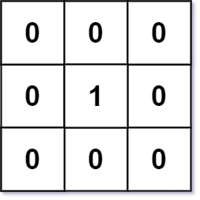
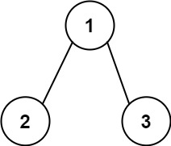
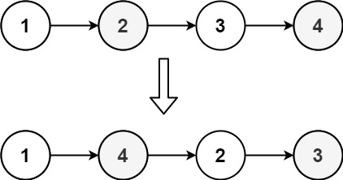
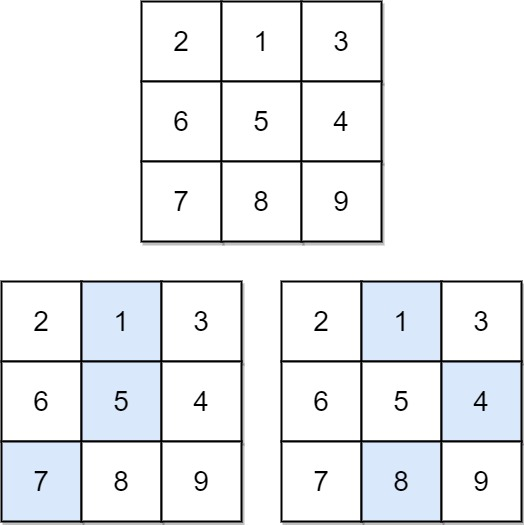
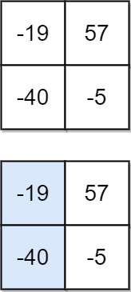

# 力扣刷题笔记（总） 
# 力扣刷题笔记（一）

## [278. 第一个错误的版本](https://leetcode-cn.com/problems/first-bad-version/)

难度 ： 简单:star::star::star:

### 题目

你是产品经理，目前正在带领一个团队开发新的产品。不幸的是，你的产品的最新版本没有通过质量检测。由于每个版本都是基于之前的版本开发的，所以错误的版本之后的所有版本都是错的。

假设你有 `n` 个版本` [1, 2, ..., n]`，你想找出导致之后所有版本出错的第一个错误的版本。

你可以通过调用 `bool isBadVersion(version)` 接口来判断版本号 `version `是否在单元测试中出错。实现一个函数来查找第一个错误的版本。你应该尽量减少对调用 API 的次数。


示例 1：

```
输入：n = 5, bad = 4
输出：4
解释：
调用 isBadVersion(3) -> false 
调用 isBadVersion(5) -> true 
调用 isBadVersion(4) -> true
所以，4 是第一个错误的版本。
```

示例 2：

```
输入：n = 1, bad = 1
输出：1
```

提示：

- 1 <= bad <= n <= 2^31^ - 1​

### 代码

```python
class Solution:
    def firstBadVersion(self, n):
        """
        :type n: int
        :rtype: int
        """
        left, right = 1, n
        while left <= right:
            mid = left + (right - left) // 2
            if not isBadVersion(mid):
                left = mid + 1
            else:
                right = mid - 1    
        return left
```

### 笔记

- 最后返回的是left。
  如果最后返回mid，则在n = 6, bad = 4时会输出错误结果。

## [189. 旋转数组](https://leetcode-cn.com/problems/rotate-array/)

难度 ： 中等:star::star::star::star:

### 题目

给定一个数组，将数组中的元素向右移动 k 个位置，其中 k 是非负数。

 

进阶：

尽可能想出更多的解决方案，至少有三种不同的方法可以解决这个问题。
你可以使用空间复杂度为 O(1) 的 原地 算法解决这个问题吗？

示例 1:

```
输入: nums = [1,2,3,4,5,6,7], k = 3
输出: [5,6,7,1,2,3,4]
解释:
向右旋转 1 步: [7,1,2,3,4,5,6]
向右旋转 2 步: [6,7,1,2,3,4,5]
向右旋转 3 步: [5,6,7,1,2,3,4]
```

示例 2:

```
输入：nums = [-1,-100,3,99], k = 2
输出：[3,99,-1,-100]
解释: 
向右旋转 1 步: [99,-1,-100,3]
向右旋转 2 步: [3,99,-1,-100]
```


提示：

- 1 <= nums.length <= 2 * 10^4​​​^
- -2^31^ <= nums[i] <= 2^31^ - 1
- 0 <= k <= 10^5^

### 代码

- Python切片

```python
class Solution:
    def rotate(self, nums: List[int], k: int) -> None:
        """
        Do not return anything, modify nums in-place instead.
        """
        n = len(nums)
        nums_c = nums[:]
        k %= n
        nums[:k] =  nums_c[n-k:]
        nums[k:] = nums_c[:n-k]
```

- 原地修改

```python
class Solution:
    def rotate(self, nums: List[int], k: int) -> None:
        """
        Do not return anything, modify nums in-place instead.
        """
        n = len(nums)
        k %= n
        self.reverse(nums, 0, n-1)
        self.reverse(nums, 0, k-1)
        self.reverse(nums, k, n-1)
    

    def reverse(self, nums: List[int], l: int, r: int) -> None:
        while l <= r:
            nums[l], nums[r] = nums[r], nums[l]
            l += 1
            r -= 1
```

- 循环

```java
class Solution {
    public void rotate(int[] nums, int k) {
        int n = nums.length;
        k %= n;
        int[] res = new int[n];
        for(int i = 0; i < n; i++) {
            res[i] = nums[(n - k + i) % n];
        }
        for(int i = 0; i < n; i++) {
            nums[i] = res[i];
        }
    }
}
```


### 笔记

- 由于需要modify nums in-place instead，所以nums的内存地址不能变，那就复制一份，再在原nums上修改。
- 注意，会出现循环的情况，k要取余。

## [283. 移动零](https://leetcode-cn.com/problems/move-zeroes/)

难度：简单:star::star::star:

### 题目

给定一个数组 nums，编写一个函数将所有 0 移动到数组的末尾，同时保持非零元素的相对顺序。

示例:

```
输入: [0,1,0,3,12]
输出: [1,3,12,0,0]
```


说明:

1. 必须在原数组上操作，不能拷贝额外的数组。
2. 尽量减少操作次数。

### 代码

- 方法一

```python
class Solution:
    def moveZeroes(self, nums: List[int]) -> None:
        """
        Do not return anything, modify nums in-place instead.
        """
        count = 0
        for i in nums[:]:
            if not i:
                nums.remove(i)
                nums.append(0)
```

- 双指针

```python
class Solution:
    def moveZeroes(self, nums: List[int]) -> None:
        """
        Do not return anything, modify nums in-place instead.
        """
        left, right = 0, 0
        while right < len(nums):
            if nums[right]:
                nums[left], nums[right] = nums[right], nums[left]
                left += 1
            right += 1
```

### 笔记

- 方法一：先删除，再添加
- 方法二：双指针，官方题解思想，很强。
  right找非0，left记录第一个0

## [167. 两数之和 II - 输入有序数组](https://leetcode-cn.com/problems/two-sum-ii-input-array-is-sorted/)

难度：简单:star::star::star:

### 题目

给定一个已按照 升序排列  的整数数组 `numbers` ，请你从数组中找出两个数满足相加之和等于目标数 `target` 。

函数应该以长度为 2 的整数数组的形式返回这两个数的下标值。`numbers `的下标 **从 1 开始计数** ，所以答案数组应当满足` 1 <= answer[0] < answer[1] <= numbers.length` 。

你可以假设每个输入只对应唯一的答案，而且你不可以重复使用相同的元素。

示例 1：

```
输入：numbers = [2,7,11,15], target = 9
输出：[1,2]
解释：2 与 7 之和等于目标数 9 。因此 index1 = 1, index2 = 2 。
```


示例 2：

```
输入：numbers = [2,3,4], target = 6
输出：[1,3]
```


示例 3：

```
输入：numbers = [-1,0], target = -1
输出：[1,2]
```


提示：

- 2 <= numbers.length <= 3 * 10^4^
- -1000 <= numbers[i] <= 1000
- numbers 按 递增顺序 排列
- -1000 <= target <= 1000
- 仅存在一个有效答案

### 代码

- 暴力解法

```python
class Solution:
    def twoSum(self, numbers: List[int], target: int) -> List[int]:
        left, right = 0, 1
        while True:
            if (numbers[left] + numbers[right]) < target:
                right += 1
            elif (numbers[left] + numbers[right]) > target:
                left += 1
                right = left + 1
            elif (numbers[left] + numbers[right]) == target:
                return [left + 1, right + 1]
            
            if right == len(numbers):
                left += 1
                right = left + 1
```

- 双指针

```python
class Solution:
    def twoSum(self, numbers: List[int], target: int) -> List[int]:
        left, right = 0, len(numbers) - 1
        while left < right:
            if (numbers[left] + numbers[right]) < target:
                left += 1
            elif (numbers[left] + numbers[right]) > target:
                right -= 1
            elif (numbers[left] + numbers[right]) == target:
                return [left + 1, right + 1]
        return [-1, -1]
```

### 笔记

- 优化解法：左边向右找，右边向左找。

## [1. 两数之和](https://leetcode-cn.com/problems/two-sum/)

难度：简单:star::star::star:

### 题目

给定一个整数数组 `nums `和一个整数目标值 `target`，请你在该数组中找出 和为目标值 `target  `的那 两个 整数，并返回它们的数组下标。

你可以假设每种输入只会对应一个答案。但是，数组中同一个元素在答案里不能重复出现。

你可以按任意顺序返回答案。

 

示例 1：

```
输入：nums = [2,7,11,15], target = 9
输出：[0,1]
解释：因为 nums[0] + nums[1] == 9 ，返回 [0, 1] 。
```


示例 2：

```
输入：nums = [3,2,4], target = 6
输出：[1,2]
```


示例 3：

```
输入：nums = [3,3], target = 6
输出：[0,1]
```


提示：

- 2 <= nums.length <= 10^4^
- -10^^9 <= nums[i] <= 10^9^
- -10^9^ <= target <= 10^9^
- 只会存在一个有效答案


**进阶：**你可以想出一个时间复杂度小于 O(n^2^) 的算法吗？

### 代码

- 暴力法

```python
class Solution:
    def twoSum(self, nums: List[int], target: int) -> List[int]:
        n = len(nums)
        for i in range(n):
            sub = target - nums[i]
            for j in range(i+1, n):
                if (sub - nums[j]) == 0:
                    return [i, j]
```

- 优化查找索引

```python
class Solution:
    def twoSum(self, nums: List[int], target: int) -> List[int]:
        n = len(nums)
        for i in range(n):
            sub = target - nums[i]
            nums_c = nums[i+1:]
            if sub in nums_c:
                return [i, nums_c.index(sub)+i+1]
        return []
```

- 哈希表

```python
class Solution:
    def twoSum(self, nums: List[int], target: int) -> List[int]:
        hashtable = {}
        for i in range(len(nums)):
            sub = target - nums[i]
            if sub in hashtable.keys():
                return [hashtable[sub], i]
            else:
                hashtable[nums[i]] = i
        return []
```

### 笔记

- 将值作为key，索引作为value。这样查找索引时可以直接拿到

## [557. 反转字符串中的单词 III](https://leetcode-cn.com/problems/reverse-words-in-a-string-iii/)

难度：简单:star::star::star:

### 题目

给定一个字符串，你需要反转字符串中每个单词的字符顺序，同时仍保留空格和单词的初始顺序。

 

示例：

```
输入："Let's take LeetCode contest"
输出："s'teL ekat edoCteeL tsetnoc"
```


提示：

- 在字符串中，每个单词由单个空格分隔，并且字符串中不会有任何额外的空格。

### 代码

- 暴力翻转

```python
class Solution:
    def reverseWords(self, s: str) -> str:
        left, right = 0, 0
        s_list = list(s)
        while right < len(s):
            if s[right] == ' ':
                l, r = left, right - 1
                while l < r:
                    s_list[l], s_list[r] = s_list[r], s_list[l]
                    l += 1
                    r -= 1
                left = right + 1
            if right == len(s) - 1:
                l, r = left, right
                while l < r:
                    s_list[l], s_list[r] = s_list[r], s_list[l]
                    l += 1
                    r -= 1
            right += 1
        st = ''
        for si in s_list:
            st = st + si
        return st
```

- Python切片

```python
class Solution:
    def reverseWords(self, s: str) -> str:
        return ' '.join([i[::-1] for i in s.split()])
```

### 笔记

- Python好用的小技巧：
  - `str[::-1]`可以翻转字符串
  - `join()`函数可以将列表转为字符串
  - `split()`函数可以将字符串转为列表

## [1711. 大餐计数](https://leetcode-cn.com/problems/count-good-meals/)

难度：中等:star::star::star::star:

### 题目

大餐 是指 **恰好包含两道不同餐品** 的一餐，其美味程度之和等于 2 的幂。

你可以搭配 **任意** 两道餐品做一顿大餐。

给你一个整数数组 `deliciousness `，其中 `deliciousness[i]` 是第 i 道餐品的美味程度，返回你可以用数组中的餐品做出的不同 大餐 的数量。结果需要对 10^9^ + 7 取余。

注意，只要餐品下标不同，就可以认为是不同的餐品，即便它们的美味程度相同。

 

示例 1：

```
输入：deliciousness = [1,3,5,7,9]
输出：4
解释：大餐的美味程度组合为 (1,3) 、(1,7) 、(3,5) 和 (7,9) 。
它们各自的美味程度之和分别为 4 、8 、8 和 16 ，都是 2 的幂。
```

示例 2：

```
输入：deliciousness = [1,1,1,3,3,3,7]
输出：15
解释：大餐的美味程度组合为 3 种 (1,1) ，9 种 (1,3) ，和 3 种 (1,7) 。
```

提示：

- 1 <= deliciousness.length <= 10^5^
- 0 <= deliciousness[i] <= 2^20^

### 代码

- ~~暴力解法【超时】~~

```python
class Solution:
    def countPairs(self, deliciousness: List[int]) -> int:
        mod = 10**9 + 7
        # 存储2的幂
        two_power = [2**i for i in range(21)]
        # 去个重，并用哈希表记录重复的个数
        hashtable = dict()
        for i in deliciousness:
            if i not in hashtable:
                hashtable[i] = 1
            else:
                hashtable[i] += 1
        # 再统计符合条件的数量
        count = 0
        # 美味程度相同，组成的大餐
        for key, value in hashtable.items():
            if value > 1 and (key * 2 in two_power):
                count = count + (value * (value - 1)) // 2
        # 美味程度不同，组成的大餐
        left, right = 0, 1
        deli_diff = list(hashtable.keys())
        while left < len(deli_diff) - 1:
            if (deli_diff[left] + deli_diff[right]) in two_power:
                v_l = hashtable[deli_diff[left]]
                v_r = hashtable[deli_diff[right]]
                count = count + v_l * v_r
            right += 1
            if right == len(deli_diff):
                left += 1
                right = left + 1
        return count % mod
```

- 用哈希表找差值

```python
class Solution:
    def countPairs(self, deliciousness: List[int]) -> int:
        mod = 10 ** 9 + 7
        # 存储2的幂
        two_power = [2**i for i in range(22)]
        # 去个重，并用哈希表记录重复的个数
        hashtable = dict()
        for i in deliciousness:
            if i not in hashtable:
                hashtable[i] = 1
            else:
                hashtable[i] += 1
        # 再统计符合条件的数量
        count = 0
        for key, value in hashtable.items():
            # 美味程度相同，组成的大餐
            if value > 1 and (key * 2 in two_power):
                count = count + (value * (value - 1)) // 2
            # 美味程度不同，组成的大餐
            for power in two_power:
                sub = power - key
                # 这个判断很关键，但是的确不太好理解
                if sub > key and (sub in hashtable.keys()):
                    count = count + value * hashtable[sub]
        return count % mod
```

### 笔记

- 优化方法：找一个满足某个条件的值，都可以考虑使用哈希表。

  注意点：
  - 存储2的幂的时候要到2^22^次幂，因为可能有两个2^21，比如：[1048576, 1048576]，输出应为1。
  - 寻找相同的组成的个数用组合的知识知道，是$C_{n}^{2}=\frac{n*(n-1)}{2}$，这个比较简单
  - 如何减少次数的寻找不同的组成的个数比较麻烦。这种情况下，稍微用了一点逆向思维：不是枚举两两元素的和，看是不是2的某次幂，而是用2的某次幂减去一个元素，再看它们的差是不是在哈希表中。`if sub > key and (sub in hashtable.keys()):`这个判断是最关键的，下面来仔细理解一下，`sub + key = power`，那么`sub > 0`这个好理解，为什么要`sub > key`呢？来举个例子：比如[149, 107, 254, 1]。key=149的时候，满足`sub in hashtable.keys()`就只有107了，但是sub=107是小于key=149的，这种情况是不是就漏掉了呢？确实漏掉了，这种情况是一种重复的情况，的确需要“被漏掉”，因为当key=107的时候，会找到sub=149>key=107这个满足要求的情况，也就是说已经会计算一次107,149这种组合，那么149,107这种组合就不用再重复计算了。同样的，254,1这种组合由于不满足sub=1>key=254,但sub=254>key=1的情况会被计算，即254和1这两个数的组合会被计算。**总结一下：每次找差值的时候，找比当前值要大的那个差值即可。如果当前值和一个比它小的值的组合满足条件，这种组合的计算交给那个比它小的值去找，它会找到这个当前值。**

## [19. 删除链表的倒数第 N 个结点](https://leetcode-cn.com/problems/remove-nth-node-from-end-of-list/)

难度：中等:star::star::star::star:

### 题目

给你一个链表，删除链表的倒数第 `n` 个结点，并且返回链表的头结点。

**进阶：**你能尝试使用一趟扫描实现吗？

 

**示例 1：**


```
输入：head = [1,2,3,4,5], n = 2
输出：[1,2,3,5]
```


示例 2：

```
输入：head = [1], n = 1
输出：[]
```


示例 3：

```
输入：head = [1,2], n = 1
输出：[1]
```


提示：

- 链表中结点的数目为 sz
- 1 <= sz <= 30
- 0 <= Node.val <= 100
- 1 <= n <= sz

### 代码

- 双指针

```c
/**
 * Definition for singly-linked list.
 * struct ListNode {
 *     int val;
 *     struct ListNode *next;
 * };
 */


struct ListNode* removeNthFromEnd(struct ListNode* head, int n){
    struct ListNode* p = head;
    struct ListNode* q = head;
    while(n > 0) {
        p = p->next;
        n--;
    }
    while(p && p->next) {
        p = p->next;
        q = q->next;
    }

    if(q != head || (q == head && p)){
        if(q->next) {
            q->next = q->next->next;
        }
    }
    if(q == head && !p) {
        head = q->next;
    }
    return head;

}
```

- 快慢指针

```c
/**
 * Definition for singly-linked list.
 * struct ListNode {
 *     int val;
 *     struct ListNode *next;
 * };
 */


struct ListNode* removeNthFromEnd(struct ListNode* head, int n){
    struct ListNode* p = head;
    struct ListNode* q = head;
    while(n > 0) {
        p = p->next;
        n--;
    }
    while(p && p->next) {
        p = p->next;
        q = q->next;
    }
    if(q != head || (q == head && p)) // 这时是删除q后面的
        q->next = q->next->next;
    if(q == head && !p) // 这时是删除q自己
        head = q->next;
    return head;
}
```

- 加一个虚拟头结点的快慢指针

```python
# Definition for singly-linked list.
# class ListNode:
#     def __init__(self, val=0, next=None):
#         self.val = val
#         self.next = next
class Solution:
    def removeNthFromEnd(self, head: ListNode, n: int) -> ListNode:
        h = ListNode()
        h.next = head
        p, q = head, h
        while n:
            p = p.next
            n -= 1
        while p:
            p = p.next
            q = q.next
        q.next = q.next.next
        return h.next
```

### 笔记

- 快慢指针很好用！

  加一个空的头结点可以省去很多判断。p先走n步，然后p,q再一起走，p走到None的时候，要删除的就是q的后面的那一个。直接：`q.next = q.next.next`就可以删除q后面的那个

## [1710. 主要元素](https://leetcode-cn.com/problems/find-majority-element-lcci/)

难度：简单:star::star::star:

### 题目

数组中占比超过一半的元素称之为主要元素。给你一个 整数 数组，找出其中的主要元素。若没有，返回 -1 。请设计时间复杂度为 O(N) 、空间复杂度为 O(1) 的解决方案。

 

示例 1：

```
输入：[1,2,5,9,5,9,5,5,5]
输出：5
```

示例 2：

```
输入：[3,2]
输出：-1
```

示例 3：

```
输入：[2,2,1,1,1,2,2]
输出：2
```

### 代码

- 摩尔投票

```python
class Solution:
    def majorityElement(self, nums: List[int]) -> int:
        major = -1
        count = 0
        for num in nums:
            # 这个判断必须要放在前面
            if count == 0:
                major = num
            if num == major:
                count += 1
            else:
                count -= 1
        count = 0
        for num in nums:
            if num == major:
                count += 1
        return major if count > len(nums) // 2 else -1
```

### 笔记

- 摩尔投票算法：第一遍找到可能为众数的那个数，主要就是找到major，第一遍遍历完，那个count就没有意义了。第二遍再确定第一遍找到的那个major在数组中的个数是不是大于一半。

## [3. 无重复字符的最长子串](https://leetcode-cn.com/problems/longest-substring-without-repeating-characters/)

难度：中等:star::star::star::star:

### 题目

给定一个字符串 s ，请你找出其中不含有重复字符的 最长子串 的长度。

 

示例 1:

```
输入: s = "abcabcbb"
输出: 3 
解释: 因为无重复字符的最长子串是 "abc"，所以其长度为 3。
```

示例 2:

```
输入: s = "bbbbb"
输出: 1
解释: 因为无重复字符的最长子串是 "b"，所以其长度为 1。
```

示例 3:

```
输入: s = "pwwkew"
输出: 3
解释: 因为无重复字符的最长子串是 "wke"，所以其长度为 3。
     请注意，你的答案必须是 子串 的长度，"pwke" 是一个子序列，不是子串。
```


示例 4:

```
输入: s = ""
输出: 0
```


提示：

- 0 <= s.length <= 5 * 10^4^
- s 由英文字母、数字、符号和空格组成

### 代码

- 暴力解法

```python
class Solution:
    def lengthOfLongestSubstring(self, s: str) -> int:
        p = 0
        sub_s = []
        len_s = len(s)
        len_sub = 0
        while p < len(s):
            if s[p] not in sub_s:
                sub_s.append(s[p])
                p += 1
            else:
                sub_s = sub_s[sub_s.index(s[p]) + 1:]
                sub_s.append(s[p])
                p += 1
            if len(sub_s) > len_sub:
                len_sub = len(sub_s)

        return len_sub
```

- 简化代码

```python
class Solution:
    def lengthOfLongestSubstring(self, s: str) -> int:
        p = 0
        sub_s = []
        len_s = len(s)
        len_sub = 0
        while p < len(s):
            if s[p] in sub_s:
                sub_s = sub_s[sub_s.index(s[p]) + 1:]
            sub_s.append(s[p])
            p += 1
            if len(sub_s) > len_sub:
                len_sub = len(sub_s)

        return len_sub
```

- 滑动窗口

```python
class Solution:
    def lengthOfLongestSubstring(self, s: str) -> int:
        left, right = 0, 0
        sub_set = set()
        s_len = len(s)
        sub_len = 0
        while left < s_len:
            while right < s_len and s[right] not in sub_set:
                sub_set.add(s[right])
                right += 1
            sub_len = max(sub_len, right - left)
            sub_set.remove(s[left])
            left += 1
        return sub_len
```

- 滑动窗口

```java
class Solution {
    public int lengthOfLongestSubstring(String s) {
        int n = s.length();
        if (n == 1) {
            return 1;
        }
        HashMap<Character, Integer> map = new HashMap<>();
        int left = 0;
        int right = 0;
        int res = 0;
        while(right < n) {
            char c1 = s.charAt(right);
            right++;
            map.put(c1, map.getOrDefault(c1, 0) + 1);
            // 收缩窗口时是出现重复字符
            while(map.get(c1) > 1) {
                char c2 = s.charAt(left);
                left++;
                map.put(c2, map.get(c2) - 1);
            }
            // 收缩完之后是没有重复字符，所以在这里更新res
            res = Math.max(right - left, res);
        }
        return res;
    }
}
```


### 笔记

- 注意：s[p]在sub_s中时，要把sub_s中从开始到s[p]的字符都删掉，只保留s[p]后面的一部分。

## [567. 字符串的排列](https://leetcode-cn.com/problems/permutation-in-string/)

难度：中等:star::star::star::star:

### 题目

给你两个字符串 s1 和 s2 ，写一个函数来判断 s2 是否包含 s1 的排列。

换句话说，s1 的排列之一是 s2 的 子串 。

 

示例 1：

```
输入：s1 = "ab" s2 = "eidbaooo"
输出：true
解释：s2 包含 s1 的排列之一 ("ba").
```

示例 2：

```
输入：s1= "ab" s2 = "eidboaoo"
输出：false
```


提示：

- 1 <= s1.length, s2.length <= 10^4^
- s1 和 s2 仅包含小写字母

### 代码

- 滑动窗口

```python
class Solution:
    def checkInclusion(self, s1: str, s2: str) -> bool:
        s1_len, s2_len = len(s1), len(s2)
        if s1_len > s2_len:
            return False
        
        s1_count, s2_count = [0] * 26, [0] * 26

        for i in range(s1_len):
           s1_count[ord(s1[i]) - ord('a')] += 1
           s2_count[ord(s2[i]) - ord('a')] += 1
        if s1_count == s2_count:
            return True
        
        for i in range(s1_len, s2_len):
            s2_count[ord(s2[i]) - ord('a')] += 1
            s2_count[ord(s2[i - s1_len]) - ord('a')] -= 1
            if s1_count == s2_count:
                return True
        return False
```

- 滑动窗口优化

```python
class Solution:
    def checkInclusion(self, s1: str, s2: str) -> bool:
        s1_len, s2_len = len(s1), len(s2)
        if s1_len > s2_len:
            return False
        
        s_count = [0] * 26

        for i in range(s1_len):
           s_count[ord(s1[i]) - ord('a')] -= 1
           s_count[ord(s2[i]) - ord('a')] += 1
        
        diff = 0
        for i in range(26):
            if s_count[i] != 0:
                diff += 1
        if diff == 0:
            return True
        for i in range(s1_len, s2_len):
            x, y = ord(s2[i]) - ord('a'), ord(s2[i - s1_len]) - ord('a')
            if x == y:
                continue
            
            if s_count[x] == 0:
                diff += 1
            s_count[x] += 1
            if s_count[x] == 0:
                diff -= 1
            if s_count[y] == 0:
                diff += 1
            s_count[y] -= 1
            if s_count[y] == 0:
                diff -= 1

            if diff == 0:
                return True
        return False
```

```java
class Solution {
    public boolean checkInclusion(String s1, String s2) {
        int m = s1.length();
        int n = s2.length();
        if (m > n) {
            return false;
        }
        HashMap<Character, Integer> map1 = new HashMap<>();
        HashMap<Character, Integer> map2 = new HashMap<>();
        for(int i = 0; i < m; i++) {
            map1.put(s1.charAt(i), map1.getOrDefault(s1.charAt(i), 0) + 1);
        }
        int left = 0;
        int right = 0;
        int count = 0;
        while (right < n) {
            char c1 = s2.charAt(right);
            right++;
            if (map1.containsKey(c1)) {
                map2.put(c1, map2.getOrDefault(c1, 0) + 1);
                // map的值是Integer类型，比较用equals
                if (map2.get(c1).equals(map1.get(c1))) {
                    count++;
                }
            }
            // 控制窗口大小为m
            while(right-left == m) {
                // 在窗口大小为m里面，个数都一样
                if (count == map1.size()) {
                    return true;
                }
                char c2 = s2.charAt(left);
                left++;
                if (map1.containsKey(c2)) {
                    // map的值是Integer类型，比较用equals
                    if (map2.get(c2).equals(map1.get(c2))) {
                        count--;
                    }
                    map2.put(c2, map2.get(c2) - 1);
                }
            }
        }
        return false;
    }
}
```

- 滑动窗口-两个数组

```java
class Solution {
    public boolean checkInclusion(String s1, String s2) {
        int m = s1.length();
        int n = s2.length();
        if (m > n) {
            return false;
        }
        // 仅包含小写字母，可以用数组替代
        int[] map1 = new int[26];
        int[] map2 = new int[26];
        int num1 = 0;
        for(int i = 0; i < m; i++) {
            map1[s1.charAt(i) - 'a']++;
            if (map1[s1.charAt(i) - 'a'] == 1) {
                num1++;
            }
        }
        int left = 0;
        int right = 0;
        int num2 = 0;
        while(right < n) {
            char c1 = s2.charAt(right);
            right++;
            if (map1[c1 - 'a'] != 0) {
                map2[c1 - 'a']++;
                if (map2[c1- 'a'] == map1[c1 - 'a']) {
                    num2++;
                }
            }
            while (right - left == m) {
                if (num2 == num1) {
                    return true;
                }
                char c2 = s2.charAt(left);
                left++;
                if (map1[c2 - 'a'] != 0) {
                    if (map2[c2- 'a'] == map1[c2 - 'a']) {
                        num2--;
                    }
                    map2[c2 - 'a']--;
                }
            }
        }
        return false;
        
    }
}
```

- 滑动窗口-一个数组

```java
class Solution {
    public boolean checkInclusion(String s1, String s2) {
        int m = s1.length();
        int n = s2.length();
        if (m > n) {
            return false;
        }
        // 仅包含小写字母，可以用数组替代
        int[] map = new int[26];
        for(int i = 0; i < m; i++) {
            map[s1.charAt(i) - 'a']++;
        }
        int left = 0;
        int right = 0;
        while(right < n) {
            char c1 = s2.charAt(right);
            map[c1 - 'a']--;
            right++;
            while (map[c1 - 'a'] < 0) {
                char c2 = s2.charAt(left);
                map[c2 - 'a']++;
                left++;
            }
            // 出上面的循环就表示从left到right的对应的map中的值都是0，说明能够匹配s1中的一些字符,
            // 如果这时right和left之间的距离刚好也是s1的长度，那就说明找到了一个排列
            if (right - left == m) {
                return true;
            }
        }
        return false;
        
    }
}
```


### 笔记

- 值得学习的小技巧：
  - 将字母映射到0-25这26个索引值，每个索引值就对应一个字母，改变对应索引下的值就可以统计每个字母的个数。（忽略大小写）
  - 滑动窗口的基本思想是：进一个，出一个，维护一个固定大小的窗口，然后针对这个固定大小的窗口进行比较（这个比较过程也是一个可以优化的部分，因为每次只进一个，出一个，可以不比较整个窗口）。

- 本题还要注意一点：题目没有说s1的长度一定比s2要小，所以要判断一下。

  **遇到两个字符串之间的相关算法，要记得看看要不要判断两个字符串的长度关系**


## [733. 图像渲染](https://leetcode-cn.com/problems/flood-fill/)

难度：简单:star::star::star:

### 题目

有一幅以二维整数数组表示的图画，每一个整数表示该图画的像素值大小，数值在 0 到 65535 之间。

给你一个坐标` (sr, sc) `表示图像渲染开始的像素值（行 ，列）和一个新的颜色值 `newColor`，让你重新上色这幅图像。

为了完成上色工作，从初始坐标开始，记录初始坐标的上下左右四个方向上像素值与初始坐标相同的相连像素点，接着再记录这四个方向上符合条件的像素点与他们对应四个方向上像素值与初始坐标相同的相连像素点，……，重复该过程。将所有有记录的像素点的颜色值改为新的颜色值。

最后返回经过上色渲染后的图像。

示例 1:

```
输入: 
image = [[1,1,1],[1,1,0],[1,0,1]]
sr = 1, sc = 1, newColor = 2
输出: [[2,2,2],[2,2,0],[2,0,1]]
解析: 
在图像的正中间，(坐标(sr,sc)=(1,1)),
在路径上所有符合条件的像素点的颜色都被更改成2。
注意，右下角的像素没有更改为2，
因为它不是在上下左右四个方向上与初始点相连的像素点。
```


注意:

- `image `和` image[0]` 的长度在范围` [1, 50]` 内。
- 给出的初始点将满足` 0 <= sr < image.length` 和 `0 <= sc < image[0].length`。
- `image[i][j] `和 `newColor `表示的颜色值在范围` [0, 65535]`内。

### 代码

- 广度优先搜索

```python
class Solution:
    def floodFill(self, image: List[List[int]], sr: int, sc: int, newColor: int) -> List[List[int]]:
        from collections import deque

        if newColor == image[sr][sc]:
            return image
        
        d = deque()
        # 上下左右
        directions = {(-1, 0), (1, 0), (0, -1), (0, 1)} # 集合

        d.append((sr, sc))
        originalColor = image[sr][sc]

        while len(d):
            point = d.popleft()
            r, c = point[0], point[1]
            image[r][c] = newColor
            for direction in directions:
                new_r = r + direction[0]
                new_c = c + direction[1]
                if (0 <= new_r < len(image)) and (0 <= new_c < len(image[0])) and (image[new_r][new_c] == originalColor):
                    d.append((new_r, new_c))
        return image
```

- 递归-深度优先搜索

```python
class Solution:
    def floodFill(self, image: List[List[int]], sr: int, sc: int, newColor: int) -> List[List[int]]:
        m, n = len(image), len(image[0])
        originalColor =  image[sr][sc]
        directions = {(-1, 0), (1, 0), (0, -1), (0, 1)}

        def dfs(x: int, y: int):
            if 0 <= x < m and 0 <= y < n and image[x][y] == originalColor:
                image[x][y] = newColor
                for direction in directions:
                    dfs(x + direction[0], y + direction[1])
        


        if newColor != image[sr][sc]:
            dfs(sr, sc)
        return image

```

- BFS-避免重复添加

```python
class Solution:
    def floodFill(self, image: List[List[int]], sr: int, sc: int, newColor: int) -> List[List[int]]:
        from collections import deque

        if newColor == image[sr][sc]:
            return image
        
        d = deque()
        # 上下左右
        directions = {(-1, 0), (1, 0), (0, -1), (0, 1)} # 集合
        visited = set()

        d.append((sr, sc))
        originalColor = image[sr][sc]
        visited.add((sr, sc))

        while len(d):
            point = d.popleft()
            r, c = point[0], point[1]
            image[r][c] = newColor
            for direction in directions:
                new_r = r + direction[0]
                new_c = c + direction[1]
                if ((new_r, new_c) not in visited) and (0 <= new_r < len(image)) and (0 <= new_c < len(image[0])) and (image[new_r][new_c] == originalColor):
                    d.append((new_r, new_c))
                    visited.add((new_r, new_c))
        return image
```

- 栈-深度优先搜索

```python
class Solution:
    def floodFill(self, image: List[List[int]], sr: int, sc: int, newColor: int) -> List[List[int]]:
        m, n = len(image), len(image[0])
        originalColor =  image[sr][sc]
        directions = {(-1, 0), (1, 0), (0, -1), (0, 1)}
        stack = []
        
        if newColor == originalColor:
            return image
        
        stack.append((sr, sc))
        while stack:
            x, y = stack.pop()
            if 0 <= x < m and 0 <= y < n and image[x][y] == originalColor:
                image[x][y] = newColor
                for direction in directions:
                    stack.append((x + direction[0], y + direction[1]))
        return image
```

### 笔记

- 深度优先搜索（DFS）：和栈密切相关。有递归版本和使用栈的版本。
  基于递归的DFS：从起点开始，判断起点是否符合条件，符合条件，（符合条件的话就可以执行一些操作了），开始for循环，往一个方向开始递归，得到一个该方向上的点，判断是否符合条件，（……），开始for循环，……，不符合条件的话会从这个点（已经在一个方向上到了底的点）往第二个方向，第三个方向，……。

- 广度优先搜索（BFS）：和队列紧密相连。
  首先将起点添加到队列，然后当队列不为空时开始循环循环，将队首元素出队，（出队后，对这个出队的元素执行一些操作），然后将与其相邻的元素（满足一定条件）入队。每次出一个，入好几个。

  由于BFS需要将元素入队，为了避免未被访问过的元素重复入队，通常会使用`visited = set()`来记录访问过的点

- 队列：Python中可以使用deque()，参考链接：[https://docs.python.org/zh-cn/3/library/collections.html#collections.deque](https://docs.python.org/zh-cn/3/library/collections.html#collections.deque)
  示例：
  ```python
  from collections import deque
  d = deque()
  d.append('a') # 从右端入队
  d.popleft() # 从左端出队
  ```
  deque()是双向队列，使用时可以当单向队列来用。

- 栈：在python中直接用列表list()代替即可。
  示例：
  ```python
  stack = []
  stack.append('a') # 从尾部入栈
  stack.pop() # 从尾部出栈
  ```

## [695. 岛屿的最大面积](https://leetcode-cn.com/problems/max-area-of-island/)

难度：中等:star::star::star::star:

### 题目

给定一个包含了一些 0 和 1 的非空二维数组 grid 。

一个 岛屿 是由一些相邻的 1 (代表土地) 构成的组合，这里的「相邻」要求两个 1 必须在水平或者竖直方向上相邻。你可以假设 grid 的四个边缘都被 0（代表水）包围着。

找到给定的二维数组中最大的岛屿面积。(如果没有岛屿，则返回面积为 0 。)

 

示例 1:

```
[[0,0,1,0,0,0,0,1,0,0,0,0,0],
 [0,0,0,0,0,0,0,1,1,1,0,0,0],
 [0,1,1,0,1,0,0,0,0,0,0,0,0],
 [0,1,0,0,1,1,0,0,1,0,1,0,0],
 [0,1,0,0,1,1,0,0,1,1,1,0,0],
 [0,0,0,0,0,0,0,0,0,0,1,0,0],
 [0,0,0,0,0,0,0,1,1,1,0,0,0],
 [0,0,0,0,0,0,0,1,1,0,0,0,0]]
```


对于上面这个给定矩阵应返回 6。注意答案不应该是 11 ，因为岛屿只能包含水平或垂直的四个方向的 1 。

示例 2:

```
[[0,0,0,0,0,0,0,0]]
```


对于上面这个给定的矩阵, 返回 0。

 

**注意:** 给定的矩阵grid 的长度和宽度都不超过 50。

### 代码

- 广度优先搜索

```python
class Solution:
    def maxAreaOfIsland(self, grid: List[List[int]]) -> int:
        from collections import deque

        m, n = len(grid), len(grid[0])
        count = 0
        ans = 0

        d = deque()
        directions = {(-1, 0), (1, 0), (0, -1), (0, 1)}
        # visited = set()

        for i in range(m):
           for j in range(n):
                d.append((i, j))

                while d:
                    x, y = d.popleft()
                    if 0 <= x < m and 0 <= y < n and grid[x][y]:
                        count += 1
                        for direction in directions:
                            next_x, next_y = x + direction[0], y + direction[1]
                            d.append((next_x, next_y))
                        grid[x][y] = 0
                ans = max(count, ans)
                count = 0
        return ans
```

- 递归-深度优先遍历

```python
class Solution:
    def maxAreaOfIsland(self, grid: List[List[int]]) -> int:

        m, n = len(grid), len(grid[0])
        ans = 0

        directions = {(-1, 0), (1, 0), (0, -1), (0, 1)}

        def dfs(x: int, y: int) -> int:
            count = 0
            if 0 <= x < m and 0 <= y < n and grid[x][y]:
                count = 1
                grid[x][y] = 0
                for direction in directions:
                    next_x, next_y = x + direction[0], y + direction[1]
                    count += dfs(next_x, next_y)
            return count
        
        # 还是得一个一个的遍历
        for i in range(m):
           for j in range(n):
                # 对每一个都进行一个DFS
                ans = max(ans, dfs(i, j))
        return ans
```

- 栈-深度优先遍历

```python
class Solution:
    def maxAreaOfIsland(self, grid: List[List[int]]) -> int:

        m, n = len(grid), len(grid[0])
        ans = 0

        directions = {(-1, 0), (1, 0), (0, -1), (0, 1)}
        stack = []

        # 还是得一个一个的遍历
        for i in range(m):
           for j in range(n):
                # 对每一个都进行一个DFS
                count = 0
                stack.append((i, j))
                while stack:
                    x, y = stack.pop()
                    if 0 <= x < m and 0 <= y < n and grid[x][y]:
                        count += 1
                        grid[x][y] = 0
                        for direction in directions:
                            next_x, next_y = x + direction[0], y + direction[1]
                            stack.append((next_x, next_y))
                ans = max(ans, count)
        return ans

```

### 笔记

- 沉岛思想：每次找到岛屿，则直接把找到的岛屿改成0，这是传说中的沉岛思想，就是遇到岛屿就把它沉没。
- 还是得一个一个的遍历，对每一个都进行一个BFS或DFS，但只有是1的时候，才往周围四个方向找。

## [617. 合并二叉树](https://leetcode-cn.com/problems/merge-two-binary-trees/)

难度：简单:star::star::star:

### 题目

给定两个二叉树，想象当你将它们中的一个覆盖到另一个上时，两个二叉树的一些节点便会重叠。

你需要将他们合并为一个新的二叉树。合并的规则是如果两个节点重叠，那么将他们的值相加作为节点合并后的新值，否则**不为** NULL 的节点将直接作为新二叉树的节点。

示例 1:

```
输入: 
	Tree 1                     Tree 2                  
          1                         2                             
         / \                       / \                            
        3   2                     1   3                        
       /                           \   \                      
      5                             4   7                  
输出: 
合并后的树:
	     3
	    / \
	   4   5
	  / \   \ 
	 5   4   7
```

**注意:** 合并必须从两个树的根节点开始。

### 代码

- 广度优先遍历

```python
# Definition for a binary tree node.
# class TreeNode:
#     def __init__(self, val=0, left=None, right=None):
#         self.val = val
#         self.left = left
#         self.right = right
class Solution:
    def mergeTrees(self, root1: TreeNode, root2: TreeNode) -> TreeNode:
        from collections import deque

        if root1 is None:
            return root2
        if root2 is None:
            return root1

        merge = TreeNode()
        queue1 = deque()
        queue2 = deque()
        queue = deque()

        queue1.append(root1)
        queue2.append(root2)
        queue.append(merge)

        while queue1 and queue2:
            node1 = queue1.popleft()
            node2 = queue2.popleft()
            node = queue.popleft()

            node.val = node1.val + node2.val

            left1, right1 = node1.left, node1.right
            left2, right2 = node2.left, node2.right

            if left1 and left2:
                node_l = TreeNode()
                node.left = node_l
                queue1.append(left1)
                queue2.append(left2)
                queue.append(node_l)
            elif left1:
                node.left = left1
            elif left2:
                node.left = left2
            
            if right1 and right2:
                node_r = TreeNode()
                node.right = node_r
                queue1.append(right1)
                queue2.append(right2)
                queue.append(node_r)
            elif right1:
                node.right = right1
            elif right2:
                node.right = right2
        
        return merge
```

- 递归-深度优先遍历

```python
# Definition for a binary tree node.
# class TreeNode:
#     def __init__(self, val=0, left=None, right=None):
#         self.val = val
#         self.left = left
#         self.right = right
class Solution:
    def mergeTrees(self, root1: TreeNode, root2: TreeNode) -> TreeNode:
        if root1 is None:
            return root2
        if root2 is None:
            return root1

        def dfs(tree1: TreeNode, tree2: TreeNode) -> TreeNode:
            if tree1 and tree2:
                tree1.val = tree1.val + tree2.val
                tree1.left = dfs(tree1.left, tree2.left)
                tree1.right = dfs(tree1.right, tree2.right)
            elif tree2:
                tree1 = tree2
            return tree1
        
        root1 = dfs(root1, root2)
        
        return root1
```

- 栈-深度优先遍历

```python
# Definition for a binary tree node.
# class TreeNode:
#     def __init__(self, val=0, left=None, right=None):
#         self.val = val
#         self.left = left
#         self.right = right
class Solution:
    def mergeTrees(self, root1: TreeNode, root2: TreeNode) -> TreeNode:
        if not root1:
            return root2
        if not root2:
            return root1

        stack1 = []
        stack2 = []

        stack1.append(root1)
        stack2.append(root2)

        while stack1 and stack2:
            node1 = stack1.pop()
            node2 = stack2.pop()

            node1.val += node2.val

            if node1.right and node2.right:
                stack1.append(node1.right)
                stack2.append(node2.right)
            elif node2.right:
                node1.right = node2.right

            if node1.left and node2.left:
                stack1.append(node1.left)
                stack2.append(node2.left)
            elif node2.left:
                node1.left = node2.left
            
        return root1
```

### 笔记

- 二叉树中，对左右子树的操作通常是相同的，所以可以先只考虑对左边子树的操作，然后对右边子树的操作照着左边写即可。
- 二叉树中的DFS和BFS：
  - 递归-深度优先搜索：先递归左子树，再递归右子树。
  - 广度优先搜索：分左右添加到队列。
- 合并的关键部分：
  合并到一个：`tree1 = tree2`，一个为空的话，直接另一个的（当前）根节点接过来，相当于把整个子树都接过来。
  新建一个树：`node.left = left1`，`node.left = left2`，`node.right = right1`，`node.right = right2`。

## [116. 填充每个节点的下一个右侧节点指针](https://leetcode-cn.com/problems/populating-next-right-pointers-in-each-node/)

难度：中等:star::star::star::star:

给定一个 完美二叉树 ，其所有叶子节点都在同一层，每个父节点都有两个子节点。二叉树定义如下：

```
struct Node {
  int val;
  Node *left;
  Node *right;
  Node *next;
}
```


填充它的每个 next 指针，让这个指针指向其下一个右侧节点。如果找不到下一个右侧节点，则将 next 指针设置为 NULL。

初始状态下，所有 next 指针都被设置为 NULL。

 

进阶：

- 你只能使用常量级额外空间。
- 使用递归解题也符合要求，本题中递归程序占用的栈空间不算做额外的空间复杂度。

示例：


```
输入：root = [1,2,3,4,5,6,7]
输出：[1,#,2,3,#,4,5,6,7,#]
解释：给定二叉树如图 A 所示，你的函数应该填充它的每个 next 指针，以指向其下一个右侧节点，如图 B 所示。序列化的输出按层序遍历排列，同一层节点由 next 指针连接，'#' 标志着每一层的结束。
```


提示：

- 树中节点的数量少于 4096
- -1000 <= node.val <= 1000

### 代码

- 暴力解法

```python
"""
# Definition for a Node.
class Node:
    def __init__(self, val: int = 0, left: 'Node' = None, right: 'Node' = None, next: 'Node' = None):
        self.val = val
        self.left = left
        self.right = right
        self.next = next
"""

class Solution:
    def connect(self, root: 'Node') -> 'Node':
        from collections import deque

        queue = deque()
        l = []
        if not root:
            return root
        queue.append(root)
        l.append(root)
        while queue:
            node = queue.popleft()
            if node.left and node.right:
                queue.append(node.left)
                queue.append(node.right)
                l.append(node.left)
                l.append(node.right)
        j = 1
        for i in range(len(l)):
            if i == 2**j - 2:
                l[i].next = None
                j += 1
            else:
                l[i].next = l[i+1]
            
        
        # l[0].next = None
        # l[1].next = l[2]
        # l[2].next = None
        # l[3].next = l[4]
        # l[4].next = l[5]
        # l[5].next = l[6]
        # l[6].next = None

        return root
```

- 层次遍历

```python
"""
# Definition for a Node.
class Node:
    def __init__(self, val: int = 0, left: 'Node' = None, right: 'Node' = None, next: 'Node' = None):
        self.val = val
        self.left = left
        self.right = right
        self.next = next
"""

class Solution:
    def connect(self, root: 'Node') -> 'Node':
        from collections import deque

        if not root:
            return root

        queue = deque()
        queue.append(root)
       
        while queue:
            size = len(queue)
            for i in range(size):
                node = queue.popleft()
                # 每一层最右边的结点的next默认就为空，不用更新
                if i < size - 1:
                    # 使用queue[0]可以快速访问队列的首个元素
                    node.next = queue[0]
                if node.left and node.right:
                    queue.append(node.left)
                    queue.append(node.right)

        return root
```

- 递归-深度优先搜索

```python
"""
# Definition for a Node.
class Node:
    def __init__(self, val: int = 0, left: 'Node' = None, right: 'Node' = None, next: 'Node' = None):
        self.val = val
        self.left = left
        self.right = right
        self.next = next
"""

class Solution:
    def connect(self, root: 'Node') -> 'Node':

        if not root:
            return root

        def dfs(node: 'Node', nextnode: 'Node'):
            if not node:
                return None
            node.next = nextnode
            if node.left and node.right:
                dfs(node.left, node.right)
                dfs(node.right, node.next.left if node.next else None )
        
        dfs(root, None)
            

        return root
```

- 进阶版

```python
"""
# Definition for a Node.
class Node:
    def __init__(self, val: int = 0, left: 'Node' = None, right: 'Node' = None, next: 'Node' = None):
        self.val = val
        self.left = left
        self.right = right
        self.next = next
"""

class Solution:
    def connect(self, root: 'Node') -> 'Node':

        if not root:
            return root

        leftmost = root
        while leftmost.left:
            head = leftmost
            while head:
                head.left.next = head.right
                if head.next:
                    head.right.next = head.next.left
                head = head.next
            leftmost = leftmost.left
            

        return root
```

### 笔记

- 暴力解法：先通过BFS将所有结点添加到一个列表中，然后再对列表中每个结点的next作出相应的修改。二叉树最右边的结点在列表中的索引是2^n^-2，n为该节点所在的层数，满足这个索引的，就把它的next=None,不是最右边的结点，next就等于它的下一个节点
- 层次遍历：使用一个size记录当前层的结点个数，再使用for循环来遍历并连接。每一层最右边的结点的next默认就为空，不用更新。使用queue[0]可以快速访问队列的首个元素
- 递归-深度优先遍历：同一个父节点，则左节点的next=右节点。不同父节点，右节点指向相邻的左节点，即该右节点的父节点的右节点的左孩子。
  利用了上一层已经建立的next，来找下一层中相邻的右节点和左节点。

## [542. 01 矩阵](https://leetcode-cn.com/problems/01-matrix/)

难度：中等:star::star::star::star:

### 题目

给定一个由 0 和 1 组成的矩阵 mat ，请输出一个大小相同的矩阵，其中每一个格子是 mat 中对应位置元素到最近的 0 的距离。

两个相邻元素间的距离为 1 。

 

示例 1：



```
输入：mat = [[0,0,0],[0,1,0],[0,0,0]]
输出：[[0,0,0],[0,1,0],[0,0,0]]
```

示例 2：


```
输入：mat = [[0,0,0],[0,1,0],[1,1,1]]
输出：[[0,0,0],[0,1,0],[1,2,1]]
```


提示：

- m == mat.length
- n == mat[i].length
- 1 <= m, n <= 10^4^
- 1 <= m * n <= 10^4^
- mat[i][j] is either 0 or 1.
- mat 中至少有一个 0 

### 代码

- 广度优先搜索

```python
class Solution:
    def updateMatrix(self, mat: List[List[int]]) -> List[List[int]]:
        from collections import deque

        queue = deque()
        visited = set()
        m, n = len(mat), len(mat[0])
        directions = {(-1, 0), (1, 0), (0, -1), (0, 1)}

        # 把所有的0入队，当成一个整体
        for i in range(m):
            for j in range(n):
                if mat[i][j] == 0:
                    queue.append((i, j))
                    visited.add((i, j))
        
        while queue:
            x, y = queue.popleft()
            for direction in directions:
                nextx, nexty = x + direction[0], y + direction[1]
                # 所有的0已经入队了，这里再往四个方向上搜索的时候就是到了1的位置
                if (nextx, nexty) not in visited and 0 <= nextx < m and 0 <= nexty < n:
                    # 从0到达的1，那么距离就是1，再从1到达1的，距离就是2，...
                    mat[nextx][nexty] = mat[x][y] + 1
                    queue.append((nextx, nexty))
                    visited.add((nextx, nexty))
        return mat
```

- 动态规划

```python
class Solution:
    def updateMatrix(self, mat: List[List[int]]) -> List[List[int]]:
        m, n = len(mat), len(mat[0])
        dist = [[m + n] * n for _ in range(m)]

        for i in range(m):
            for j in range(n):
                if mat[i][j] == 0:
                    dist[i][j] = 0
        # 往左上方向找。j,i往右下方向变化
        for i in range(m):
            for j in range(n):
                # 往上
                if i - 1 >= 0:
                    dist[i][j] = min(dist[i][j], dist[i - 1][j] + 1)
                # 往左
                if j - 1 >= 0:
                    dist[i][j] = min(dist[i][j], dist[i][j - 1] + 1)

        # 往右上方向找。j,i往左下方向变化
        for i in range(m):
            for j in range(n - 1, -1, -1):
                # 往上
                if i - 1 >= 0:
                    dist[i][j] = min(dist[i][j], dist[i - 1][j] + 1)
                # 往右
                if j + 1 < n:
                    dist[i][j] = min(dist[i][j], dist[i][j + 1] + 1)

        # 往左下方向找。j,i往右上方向变化
        for i in range(m - 1, -1, -1):
            for j in range(n):
                # 往下
                if i + 1 < m:
                    dist[i][j] = min(dist[i][j], dist[i + 1][j] + 1)
                # 往左
                if j - 1 >= 0:
                    dist[i][j] = min(dist[i][j], dist[i][j - 1] + 1)
        
        # 往右下方向找。j,i往左上方向变化
        for i in range(m - 1, -1, -1):
            for j in range(n - 1, -1, -1):
                # 往下
                if i + 1 < m:
                    dist[i][j] = min(dist[i][j], dist[i + 1][j] + 1)
                # 往右
                if j + 1 < n:
                    dist[i][j] = min(dist[i][j], dist[i][j + 1] + 1)
        return dist
```

- 简化动态规划

```python
class Solution:
    def updateMatrix(self, mat: List[List[int]]) -> List[List[int]]:
        m, n = len(mat), len(mat[0])
        dist = [[m + n] * n for _ in range(m)]

        for i in range(m):
            for j in range(n):
                if mat[i][j] == 0:
                    dist[i][j] = 0
        
        # # 或者不用这个
        # # 往左上方向找。j,i往右下方向变化
        # for i in range(m):
        #     for j in range(n):
        #         # 往上
        #         if i - 1 >= 0:
        #             dist[i][j] = min(dist[i][j], dist[i - 1][j] + 1)
        #         # 往左
        #         if j - 1 >= 0:
        #             dist[i][j] = min(dist[i][j], dist[i][j - 1] + 1)

        # 可以不用这个
        # 往右上方向找。j,i往左下方向变化
        for i in range(m):
            for j in range(n - 1, -1, -1):
                # 往上
                if i - 1 >= 0:
                    dist[i][j] = min(dist[i][j], dist[i - 1][j] + 1)
                # 往右
                if j + 1 < n:
                    dist[i][j] = min(dist[i][j], dist[i][j + 1] + 1)

        # 可以不用这个
        # 往左下方向找。j,i往右上方向变化
        for i in range(m - 1, -1, -1):
            for j in range(n):
                # 往下
                if i + 1 < m:
                    dist[i][j] = min(dist[i][j], dist[i + 1][j] + 1)
                # 往左
                if j - 1 >= 0:
                    dist[i][j] = min(dist[i][j], dist[i][j - 1] + 1)
        
        # # 或者不用这个
        # # 往右下方向找。j,i往左上方向变化
        # for i in range(m - 1, -1, -1):
        #     for j in range(n - 1, -1, -1):
        #         # 往下
        #         if i + 1 < m:
        #             dist[i][j] = min(dist[i][j], dist[i + 1][j] + 1)
        #         # 往右
        #         if j + 1 < n:
        #             dist[i][j] = min(dist[i][j], dist[i][j + 1] + 1)

        return dist
```

### 笔记

- 逆向思维：找到1到最近的0，处理起来比较麻烦，尤其是1比较多，0比较少的时候。可以换个思路，找到0最近的1。比如说，一个0上下左右（是1的元素）到0的距离为1，那么上（、下、左、右这个元素）的上下左右到这个0的距离就是2，再往四个方向上走一层，距离就是3。这样处理起来就比较见到。
  多源点最短路径问题中的一个常见思想：添加一个超级源点，将多源点连接到这个超级源点上，或者把多源点当成一个整体。这里就是把0当做起点，1当做终点，找出每个终点到最近的起点的距离。
- 多源点最短路径问题中的一个常见思想：添加一个超级源点，将多源点连接到这个超级源点上，或者把多源点当成一个整体。这里就是把0当做起点，1当做终点，找出每个终点到最近的起点的距离。
  在最短路问题中，如果我们要求多个源点出发的最短路时，一般我们都会建立一个「超级源点」连向所有的源点，用「超级源点」到终点的最短路等价多个源点到终点的最短路。

## [994. 腐烂的橘子](https://leetcode-cn.com/problems/rotting-oranges/)

难度：中等:star::star::star::star:

### 题目

在给定的网格中，每个单元格可以有以下三个值之一：

- 值 0 代表空单元格；
- 值 1 代表新鲜橘子；
- 值 2 代表腐烂的橘子。

每分钟，任何与腐烂的橘子（在 4 个正方向上）相邻的新鲜橘子都会腐烂。

返回直到单元格中没有新鲜橘子为止所必须经过的最小分钟数。如果不可能，返回 -1。

 

示例 1：


```
输入：[[2,1,1],[1,1,0],[0,1,1]]
输出：4
```

示例 2：

```
输入：[[2,1,1],[0,1,1],[1,0,1]]
输出：-1
解释：左下角的橘子（第 2 行， 第 0 列）永远不会腐烂，因为腐烂只会发生在 4 个正向上。
```

示例 3：

```
输入：[[0,2]]
输出：0
解释：因为 0 分钟时已经没有新鲜橘子了，所以答案就是 0 。
```


提示：

- 1 <=` grid.length` <= 10
- 1 <=` grid[0].length` <= 10
- `grid[i][j]` 仅为 0、1 或 2

### 代码

```python
class Solution:
    def orangesRotting(self, grid: List[List[int]]) -> int:
        from collections import deque

        queue = deque()
        m, n = len(grid), len(grid[0])
        visited = set()
        directions = {(-1, 0), (1, 0), (0, -1), (0, 1)}

        # 把所有的2先放入队列，后面一起扩散
        for i in range(m):
            for j in range(n):
                if grid[i][j] == 2:
                    queue.append((i, j))
                    visited.add((i, j))
        
        count = 0
        while queue:
            flag = False
            size = len(queue)
            # 一次搜索完队列中所有为2的
            while size > 0:
                x, y = queue.popleft()
                size -= 1
                for direction in directions:
                    nextx, nexty = x + direction[0], y + direction[1]
                    if (nextx, nexty) not in visited and 0 <= nextx < m and 0 <= nexty < n and grid[nextx][nexty] == 1:
                        # 把找到了的改为2
                        grid[nextx][nexty] = 2
                        # 说明这一次搜索腐烂过橘子
                        flag = True
                        queue.append((nextx, nexty))
                        visited.add((nextx, nexty))
            # 只有腐烂过橘子才把这一次搜索记为有效的
            if flag:
                count += 1
        # 搜索完成后，如果还有为1的，就那个1搜索不到
        for i in range(m):
            if 1 in grid[i]:
                return -1
        return count
```

### 笔记

- 使用【超级源点】的思路，把最开始所有腐烂的橘子当成整体，一起扩散。一下次扩散的时候也是把上一次扩散感染的橘子当成整体，一起扩散。

## [21. 合并两个有序链表](https://leetcode-cn.com/problems/merge-two-sorted-lists/)

难度：简单:star::star::star:

将两个升序链表合并为一个新的 升序 链表并返回。新链表是通过拼接给定的两个链表的所有节点组成的。 

示例 1：


```
输入：l1 = [1,2,4], l2 = [1,3,4]
输出：[1,1,2,3,4,4]
```

示例 2：

```
输入：l1 = [], l2 = []
输出：[]
```

示例 3：

```
输入：l1 = [], l2 = [0]
输出：[0]
```


提示：

- 两个链表的节点数目范围是 [0, 50]
- -100 <= Node.val <= 100
- l1 和 l2 均按 **非递减顺序** 排列

### 代码

- 暴力解法一

```python
# Definition for singly-linked list.
# class ListNode:
#     def __init__(self, val=0, next=None):
#         self.val = val
#         self.next = next
class Solution:
    def mergeTwoLists(self, l1: ListNode, l2: ListNode) -> ListNode:
        merge = []
        while l1:
            merge.append(l1.val)
            l1 = l1.next
        while l2:
            merge.append(l2.val)
            l2 = l2.next
        merge.sort()
        if not merge:
            return l1
        mergel = ListNode()
        p = mergel
        for i in merge[:-1]:
            p.val = i
            p.next = ListNode()
            p = p.next
        p.val = merge[-1]
        return mergel
```

- 暴力解法二

```python
# Definition for singly-linked list.
# class ListNode:
#     def __init__(self, val=0, next=None):
#         self.val = val
#         self.next = next
class Solution:
    def mergeTwoLists(self, l1: ListNode, l2: ListNode) -> ListNode:
        if not l1:
            return l2
        elif not l2:
            return l1
        
        m = ListNode()
        merge = m
        while l1 and l2:
            if l1.val <= l2.val:
                m.val = l1.val
                l1 = l1.next
            else:
                m.val = l2.val
                l2 = l2.next
            m.next = ListNode()
            m = m.next
        if not l1:
            m.val = l2.val
            m.next = l2.next
        elif not l2:
            m.val = l1.val
            m.next = l1.next
        return merge
```

- 穿针引线法

```python
# Definition for singly-linked list.
# class ListNode:
#     def __init__(self, val=0, next=None):
#         self.val = val
#         self.next = next
class Solution:
    def mergeTwoLists(self, l1: ListNode, l2: ListNode) -> ListNode:
        if not l1:
            return l2
        elif not l2:
            return l1
        m = ListNode()
        merge = m
        while l1 and l2:
            if l1.val <= l2.val:
                m.next = l1
                l1 = l1.next
            else:
                m.next = l2
                l2 = l2.next
            m = m.next
        if not l1:
            m.next = l2
        elif not l2:
            m.next = l1
        return merge.next
```

- 递归解法

```python
# Definition for singly-linked list.
# class ListNode:
#     def __init__(self, val=0, next=None):
#         self.val = val
#         self.next = next
class Solution:
    def mergeTwoLists(self, l1: ListNode, l2: ListNode) -> ListNode:
        if not l1:
            return l2
        elif not l2:
            return l1
        elif l1.val <= l2.val:
            l1.next = self.mergeTwoLists(l1.next, l2)
            return l1
        else:
            l2.next = self.mergeTwoLists(l1, l2.next)
            return l2
```

### 笔记

- 穿针引线法：新建一个头结点，然后把l1和l2中小的那个接到m的后面，只需要不断修改m的next即可，不需要新建多余的结点，直接让m.next指向已存在的结点
- 递归解法还是很值得学习的。
  l1: 1->2->3
  l2: 1->3->4
  递归的过程是这样的：如果`l1.val <= l2.val`，那就把l2拼接到l1上，也就是把l2拼接到l1.next上，即：`l1.next = self.mergeTwoLists(l1.next, l2)`
  如果`l1.val > l2.val`，那就把l1拼接到l2上，也就是把l1拼接到l2.next上，即：`l2.next = self.mergeTwoLists(l1, l2.next)`

## [206. 反转链表](https://leetcode-cn.com/problems/reverse-linked-list/)

难度：简单:star::star::star:

### 题目

给你单链表的头节点 head ，请你反转链表，并返回反转后的链表。

示例 1：


```
输入：head = [1,2,3,4,5]
输出：[5,4,3,2,1]
```

示例 2：


```
输入：head = [1,2]
输出：[2,1]
```

示例 3：

```
输入：head = []
输出：[]
```


提示：

- 链表中节点的数目范围是 [0, 5000]
- -5000 <= Node.val <= 5000

**进阶：**链表可以选用迭代或递归方式完成反转。你能否用两种方法解决这道题？

### 代码

- 头插法建立新链表

```python
# Definition for singly-linked list.
# class ListNode:
#     def __init__(self, val=0, next=None):
#         self.val = val
#         self.next = next
class Solution:
    def reverseList(self, head: ListNode) -> ListNode:
        dumb = ListNode()
        while head:
            t = head.next
            head.next = dumb.next
            dumb.next = head
            head = t
        return dumb.next
```

- 递归

```python
# Definition for singly-linked list.
# class ListNode:
#     def __init__(self, val=0, next=None):
#         self.val = val
#         self.next = next
class Solution:
    def reverseList(self, head: ListNode) -> ListNode:
        if not head or not head.next:
            return head
        newhead = self.reverseList(head.next)
        head.next.next = head
        head.next = None
        return newhead
```

### 笔记

- 头插法，但是不需要新建太多结点，只需要修改指针即可

  递归解法：很巧妙，`head.next.next = head`这个可以实现指针翻转的效果

- 递归解法：递归解题首先要做的是明确递推公式的含义，在这里对于结点1来说，它只需要知道它之后的所有节点反转之后的结果就可以了，也就是说递推公式reverseList的含义是：把拿到的链表进行反转，然后返回新的头结点。
  接着要做的就是反转结点1，也就是将head指向的结点作为其下一个结点的下一个结点，即head.next.next=head。
  作者：hardcore-aryabhata
  链接：https://leetcode-cn.com/problems/reverse-linked-list/solution/yi-bu-yi-bu-jiao-ni-ru-he-yong-di-gui-si-67c3/

## [77. 组合](https://leetcode-cn.com/problems/combinations/)

难度：中等:star::star::star::star:

### 题目

给定两个整数 n 和 k，返回范围 [1, n] 中所有可能的 k 个数的组合。

你可以按 **任何顺序** 返回答案。

 

示例 1：

```
输入：n = 4, k = 2
输出：
[
  [2,4],
  [3,4],
  [2,3],
  [1,2],
  [1,3],
  [1,4],
]
```

示例 2：

```
输入：n = 1, k = 1
输出：[[1]]
```


提示：

- 1 <= n <= 20
- 1 <= k <= n

### 代码

- Python一行代码

```python
class Solution:
    def combine(self, n: int, k: int) -> List[List[int]]:
        return list(itertools.combinations(range(1, n+1), k))
```

- 改写`itertools.combinations()`的源码

```python
class Solution:
    def combine(self, n: int, k: int) -> List[List[int]]:
        result = []
        pool = tuple(range(1, n+1))
        if k > n:
            return
        indices = list(range(k))
        result.append(list(pool[i] for i in indices))
        # yield tuple(pool[i] for i in indices)

        while True:
            for i in reversed(range(k)):
                if indices[i] != i + n - k:
                    break
            else:
                return result
            indices[i] += 1
            for j in range(i+1, k):
                indices[j] = indices[j-1] + 1
            result.append(list(pool[i] for i in indices))
            # yield tuple(pool[i] for i in indices)
```

- 回溯法（深度优先搜索）

```python
class Solution:
    def combine(self, n: int, k: int) -> List[List[int]]:
        result = []
        temp = []
        def dfs(n: int, k: int, start: int):
            if len(temp) == k:
                # 这里要添加temp的副本，否则之后的pop()和append()操作会影响这里的temp
                result.append(temp[:])
                return
            for i in range(start, n+1):
                temp.append(i)
                dfs(n, k, i + 1)
                temp.pop()
            
            
        dfs(n, k, 1)
        return result
```

- 回溯+剪枝

```python
class Solution:
    def combine(self, n: int, k: int) -> List[List[int]]:
        result = []
        temp = []
        def dfs(n: int, k: int, start: int):
            if len(temp) == k:
                # 这里要添加temp的副本，否则之后的pop()和append()操作会影响这里的temp
                result.append(temp[:])
                return
            
            for i in range(start, n - (k - len(temp)) + 2):
                temp.append(i)
                dfs(n, k, i + 1)
                temp.pop()
            
            
        dfs(n, k, 1)
        return result
```

- 回溯

```java
class Solution {
    List<List<Integer>> res = new ArrayList<>();
    public List<List<Integer>> combine(int n, int k) {
        List<Integer> path = new ArrayList<>();
        backtrack(n, k, 1, path);
        return res;
    }
    public void backtrack(int n, int k, int start, List<Integer> path) {
        if (k == 0) {
            res.add(new ArrayList<>(path));
            return;
        }
        for(int i = start; i <= n; i++) {
            path.add(i);
            backtrack(n, k - 1, i + 1, path);
            path.remove(path.size() - 1);
        }
    }
}
```

- 回溯+剪枝

```java
class Solution {
    List<List<Integer>> res = new ArrayList<>();
    public List<List<Integer>> combine(int n, int k) {
        List<Integer> path = new ArrayList<>();
        backtrack(n, k, 1, path);
        return res;
    }
    public void backtrack(int n, int k, int start, List<Integer> path) {
        if (k == path.size()) {
            res.add(new ArrayList<>(path));
            return;
        }
        for(int i = start; i <= n - (k - path.size()) + 1; i++) {
            path.add(i);
            backtrack(n, k, i + 1, path);
            path.remove(path.size() - 1);
        }
    }
}
```


### 笔记

- 改写itertools.combinations()的源码:
  [https://docs.python.org/3/library/itertools.html#itertools.combinations](https://docs.python.org/3/library/itertools.html#itertools.combinations)

- 回溯法：
  代码框架：
  ```python
  result = []
  def backtrack(路径, 选择列表):
      if 满足结束条件:
          result.add(路径)
          return
  
      for 选择 in 选择列表:
          做选择
          backtrack(路径, 选择列表)
          撤销选择
  ```
  其中for循环的部分的选择列表可以做剪枝。

- 回溯法：可以自己画个树来帮助理解dfs的过程。

- 剪枝：画出回溯法的树之后，可以看出那些搜索是可以剪枝的。剪枝部分主要修改做选择的那个for循环的选择列表。注意，这个选择列表的范围的缩减与搜索起点、当前还需要选几个数、已经选了几个数有关。
  比如：从当前起点到结束的元素个数 >= 总共需要的个数-已经有的个数
  也即：`n - start + 1 >= k - len(path)`

## [46. 全排列](https://leetcode-cn.com/problems/permutations/)

难度：中等:star::star::star::star:

### 题目

给定一个不含重复数字的数组 nums ，返回其 **所有可能的全排列** 。你可以 **按任意顺序** 返回答案。

 

示例 1：

```
输入：nums = [1,2,3]
输出：[[1,2,3],[1,3,2],[2,1,3],[2,3,1],[3,1,2],[3,2,1]]
```

示例 2：

```
输入：nums = [0,1]
输出：[[0,1],[1,0]]
```

示例 3：

```
输入：nums = [1]
输出：[[1]]
```


提示：

- 1 <= nums.length <= 6
- -10 <= nums[i] <= 10
- nums 中的所有整数 互不相同

### 代码

- 回溯法

```python
class Solution:
    def permute(self, nums: List[int]) -> List[List[int]]:
        n = len(nums)
        result = []
        path = []


        def backtrack(nums: List[int]):
            if len(path) == n:
                result.append(path[:])
                return

            for i in range(n):
                if nums[i] not in path:
                    path.append(nums[i])
                    backtrack(nums)
                    path.pop()
        
        backtrack(nums)
        return result
```

- Python一行代码

```python
class Solution:
    def permute(self, nums: List[int]) -> List[List[int]]:
        return list(itertools.permutations(nums))
```

- 修改`itertools.permutations()`源码

```python
class Solution:
    def permute(self, nums: List[int]) -> List[List[int]]:
        result = []
        pool = tuple(nums)
        n = len(pool)
        indices = list(range(n))
        cycles = list(range(n, 0, -1))
        result.append(list(pool[i] for i in indices[:n]))
        while n:
            for i in reversed(range(n)):
                cycles[i] -= 1
                if cycles[i] == 0:
                    indices[i:] = indices[i+1:] + indices[i:i+1]
                    cycles[i] = n - i
                else:
                    j = cycles[i]
                    indices[i], indices[-j] = indices[-j], indices[i]
                    result.append(list(pool[i] for i in indices[:n]))
                    break
            else:
                return result
```

### 笔记

- 一行代码链接：[https://docs.python.org/3/library/itertools.html#itertools.permutations](https://docs.python.org/3/library/itertools.html#itertools.permutations)
- 这里的回溯法就不需要设置起点了，直接在整个nums里面遍历即可，但是要注意排除已经用过的。

## [784. 字母大小写全排列](https://leetcode-cn.com/problems/letter-case-permutation/)

难度：中等:star::star::star::star:

### 题目

给定一个字符串S，通过将字符串S中的每个字母转变大小写，我们可以获得一个新的字符串。返回所有可能得到的字符串集合。

 

示例：

```
输入：S = "a1b2"
输出：["a1b2", "a1B2", "A1b2", "A1B2"]

输入：S = "3z4"
输出：["3z4", "3Z4"]

输入：S = "12345"
输出：["12345"]
```


提示：

- S 的长度不超过12。
- S 仅由数字和字母组成。

### 代码

- 暴力回溯

```python
class Solution:
    def letterCasePermutation(self, s: str) -> List[str]:
        n = len(s)
        sl = list(s)
        result = []
        path = []

        def backtrack(sl: List, start: int):
            if len(path) == n:
                result.append(''.join(path[:]))
                return
            if start > n-1:
                return
            for i in range(start, n):
                if sl[i].islower():
                    path.append(sl[i])
                    backtrack(sl, i+1)
                    path.pop()
                    sl[i] = sl[i].upper()
                elif sl[i].isupper():
                    path.append(sl[i])
                    backtrack(sl, i+1)
                    path.pop()
                    sl[i] = sl[i].lower()
                path.append(sl[i])
                backtrack(sl, i+1)
                path.pop()
        backtrack(sl, 0)
        return result
```

- 笛卡尔积

```python
class Solution:
    def letterCasePermutation(self, s: str) -> List[str]:
        f = lambda x: (x.lower(), x.upper()) if x.isalpha() else x
        return list(map(''.join, itertools.product(*map(f, s))))
```

- 备份扩展法

```python
class Solution:
    def letterCasePermutation(self, s: str) -> List[str]:
        result = []
        n = len(s)
        if s[0].isalpha():
            result.append(s[0].lower())
            result.append(s[0].upper())
        else:
            result.append(s[0])
        for i in range(1, n):
            if s[i].isalpha():
                result.extend(result)
                for j in range(len(result)):
                    if j < len(result)//2:
                        result[j] += s[i].lower()
                    else:
                        result[j] += s[i].upper()
            else:
                for j in range(len(result)):
                    result[j] += s[i]
        return result
```

### 笔记

- 备份扩展法：按官方题解方法一的思路，挺有意思的。例如：'a1b1'。首先把第一个字符添加进去，如果是字母，就添加其大小写进去；如果是数字，就直接添加进去。如result = ['a', 'A']，然后，遇到数字，就把result中的每个字符都连接上数字，result=['a1', 'A1']；遇到字母，就先把result扩展一份，result=['a1', 'A1', 'a1', 'A1']，然后前一半中的每个字符都拼接上字母的小写，后一半拼接上字母的大写，result=['a1b', 'A1b', 'a1B', 'A1B']。遇到数字，就直接拼接到每个字符后面，不用扩展，result=['a1b1', 'A1b1', 'a1B1', 'A1B1']。

## [70. 爬楼梯](https://leetcode-cn.com/problems/climbing-stairs/)

难度：简单:star::star::star:

### 题目

假设你正在爬楼梯。需要 n 阶你才能到达楼顶。

每次你可以爬 1 或 2 个台阶。你有多少种不同的方法可以爬到楼顶呢？

**注意：**给定 n 是一个正整数。

示例 1：

```
输入： 2
输出： 2
解释： 有两种方法可以爬到楼顶。

1.  1 阶 + 1 阶
2.  2 阶
```

示例 2：

```
输入： 3
输出： 3
解释： 有三种方法可以爬到楼顶。

1.  1 阶 + 1 阶 + 1 阶
2.  1 阶 + 2 阶
3.  2 阶 + 1 阶
```

### 代码

- 迭代

```python
class Solution:
    
    def climbStairs(self, n: int) -> int:
        if n == 1 or n == 2:
            return n
        f1 = 1
        f2 = 2
        count = 0
        for i in range(2, n):
            fn = f1 + f2
            f1, f2 = f2, fn
        return fn
```

- 公式法

```python
class Solution:
    
    def climbStairs(self, n: int) -> int:
        c = pow(5, 0.5)
        return round((pow((1 + c) / 2, n + 1) - pow((1 - c) / 2, n + 1)) / c)
```

### 笔记

- 递归法：f(n) = f(n-1)+f(n-2)。f(1)=1,f(2)=2,f(3)=3,f(4)=5,f(5)=8
  只需要算出f(n)的值即可，f(n)就是代表到达n的方法种树。
- 记忆化递归法：`fn = f1 + f2`，`f1, f2 = f2, fn`。保存前面计算的结果
- 斐波那契数列公式：[https://baike.baidu.com/item/%E6%96%90%E6%B3%A2%E9%82%A3%E5%A5%91%E6%95%B0%E5%88%97/99145](https://baike.baidu.com/item/%E6%96%90%E6%B3%A2%E9%82%A3%E5%A5%91%E6%95%B0%E5%88%97/99145)

## [198. 打家劫舍](https://leetcode-cn.com/problems/house-robber/)

难度：中等:star::star::star::star:

### 题目

你是一个专业的小偷，计划偷窃沿街的房屋。每间房内都藏有一定的现金，影响你偷窃的唯一制约因素就是相邻的房屋装有相互连通的防盗系统，**如果两间相邻的房屋在同一晚上被小偷闯入，系统会自动报警。**

给定一个代表每个房屋存放金额的非负整数数组，计算你 **不触动警报装置的情况下** ，一夜之内能够偷窃到的最高金额。

 

示例 1：

```
输入：[1,2,3,1]
输出：4
解释：偷窃 1 号房屋 (金额 = 1) ，然后偷窃 3 号房屋 (金额 = 3)。
     偷窃到的最高金额 = 1 + 3 = 4 。
```

示例 2：

```
输入：[2,7,9,3,1]
输出：12
解释：偷窃 1 号房屋 (金额 = 2), 偷窃 3 号房屋 (金额 = 9)，接着偷窃 5 号房屋 (金额 = 1)。
     偷窃到的最高金额 = 2 + 9 + 1 = 12 。
```


提示：

- 1 <= nums.length <= 100
- 0 <= nums[i] <= 400

### 代码

- 假动态规划

```python
class Solution:
    def rob(self, nums: List[int]) -> int:
        n = len(nums)
        if n == 1:
            return nums[0]
        dp = [0] * n
        dp[0], dp[1] = nums[0], nums[1]
        for k in range(2, n):
            dp[k] = max(dp[k-2], nums[k] + dp[k-2])
            dp[k-1] = max(dp[k-1], dp[k-2])
        print(dp)
        return max(dp)
```

- 动态规划

```python
class Solution:
    def rob(self, nums: List[int]) -> int:
        n = len(nums)
        if n == 1:
            return nums[0]
        dp = [0] * n
        dp[0]= nums[0]
        dp[1] = max(dp[0], nums[1])
        for k in range(2, n):
            dp[k] = max(dp[k-1], nums[k] + dp[k-2])
        # print(dp)
        return dp[-1]
```

- 动态规划+状态压缩

```python
class Solution:
    def rob(self, nums: List[int]) -> int:
        n = len(nums)
        if n == 1:
            return nums[0]
        first = nums[0]
        second = max(first, nums[1])
        for k in range(2, n):
           first, second = second, max(second, nums[k] + first)
        return second
```

### 笔记

- 状态转移方程：
  1, 2, 3, 4, 5, ..., k-2, k-1, k, ..., n

  dp(k) = max(dp(k-1), k + dp(k-2))
  对于第k个房子，偷还是不偷，取决于：第k个房子的金额加上前k-2个房子得到的总金额是不是比前k-1个房子的总金额要高。
  ```python
  if k + dp(k-2) >= dp(k-1):
      dp(k) = k + dp(k-2)
  if k + dp(k-2) < dp(k-1):
      dp(k) = dp(k-1)
  ```

- 动态规划问题，不直接考虑状态压缩的问题，直接想状态压缩想不出来，先想不压缩的情况。用一个dp[]数组来存储每个元素的状态（选、不选），这里的dp数组就是存储到当前元素的最大金额。
  再回过头来观察，发现dp[k]只和dp[k-1],dp[k-2]有关，即，只和其前两个状态有关，那么就可以用两个变量来存储其前两个状态。

## [120. 三角形最小路径和](https://leetcode-cn.com/problems/triangle/)

难度：中等:star::star::star::star:

### 题目

给定一个三角形 triangle ，找出自顶向下的最小路径和。

每一步只能移动到下一行中相邻的结点上。**相邻的结点** 在这里指的是 **下标** 与 **上一层结点下标** 相同或者等于 **上一层结点下标 + 1** 的两个结点。也就是说，如果正位于当前行的下标 i ，那么下一步可以移动到下一行的下标 i 或 i + 1 。

 

示例 1：

```python
输入：triangle = [[2],[3,4],[6,5,7],[4,1,8,3]]
输出：11
解释：如下面简图所示：
   2
  3 4
 6 5 7
4 1 8 3
自顶向下的最小路径和为 11（即，2 + 3 + 5 + 1 = 11）。
```

示例 2：

```python
输入：triangle = [[-10]]
输出：-10
```


提示：

- 1 <= triangle.length <= 200
- triangle[0].length == 1
- triangle[i].length == triangle[i - 1].length + 1
- -10^4^ <= triangle[i][j] <= 10^4^

**进阶：**

- 你可以只使用 `O(n)` 的额外空间（`n` 为三角形的总行数）来解决这个问题吗？

### 代码

- 状态更新法

```python
class Solution:
    def minimumTotal(self, triangle: List[List[int]]) -> int:
        m = len(triangle)
        dp = triangle
        for i in range(1, m):
            # 每一行的第一个可以直接更新
            dp[i][0] = dp[i - 1][0] + dp[i][0]
            # 每一行的最后一个可以直接更新
            dp[i][-1] = dp[i - 1][-1] + dp[i][-1]
            # 中间的取其左上角和正上方的最小值与自己相加后更新
            for j in range(1, len(triangle[i]) - 1):
                dp[i][j] = min(dp[i - 1][j - 1], dp[i - 1][j]) + triangle[i][j]
        return min(dp[-1])
```

- 修改原数组

```python
class Solution:
    def minimumTotal(self, triangle: List[List[int]]) -> int:
        m = len(triangle)
        dp = triangle
        for i in range(1, m):
            # 每一行的第一个可以直接更新
            triangle[i][0] = triangle[i - 1][0] + triangle[i][0]
            # 每一行的最后一个可以直接更新
            triangle[i][-1] = triangle[i - 1][-1] + triangle[i][-1]
            # 中间的取其左上角和正上方的最小值与自己相加后更新
            for j in range(1, len(triangle[i]) - 1):
                triangle[i][j] = min(triangle[i - 1][j - 1], triangle[i - 1][j]) + triangle[i][j]
        return min(triangle[-1])
```

- 自底向上

```python
class Solution:
    def minimumTotal(self, triangle: List[List[int]]) -> int:
        m = len(triangle)
        dp = triangle[:]
        for i in range(m - 2, -1, -1):
            for j in range(0, i + 1):
                dp[i][j] = min(dp[i + 1][j], dp[i + 1][j + 1]) + triangle[i][j]
        return dp[0][0]
```

- 自底向上+状态压缩

```python
class Solution:
    def minimumTotal(self, triangle: List[List[int]]) -> int:
        m = len(triangle)
        dp = triangle[-1]
        for i in range(m - 2, -1, -1):
            for j in range(0, i + 1):
                dp[j] = min(dp[j], dp[j + 1]) + triangle[i][j]
        return dp[0]
```

### 笔记

- 状态更新法（自己取的名字）（好像也算是动态规划法）：走到每个结点，就更新当前结点的值，表示自顶点到当前结点的路径和，最后，取三角形最后一行中的最小值即可。
  注意到：每一行的第一个只和上一行的第一个有关，那就可以简单的直接更新。同样的，每一行的最后一个只和上一行的最后一个有关，那也是直接简单的更新。
  中间的值，则是取其左上角的那个和其正上方的最小值与其相加。
- 自底向上法：第i层的每个数选择其正下方和右对角中小的那一个和自己相加，这样每一层中都有一个是最小值，且该值一定是最短路径中自底向上的那个最小值。这种寻找最短路径值的办法是成立的，它不是简单的自底向上找每一层的最小值，而是自底向上，对每一层和其下一层相应求和之后找“和”值中的最小值，再往上一层，也是找“和”值中的最小值，最终，最上面的那一个，就是最短路径的值
- 空间优化：在实际递推中我们发现，计算 dp[i][j] 时，只用到了下一行的 dp[i + 1][j]] 和 dp[i + 1][j + 1]。
  因此 dp数组不需要定义 N行，只要定义 1 行就可以了。

## [231. 2 的幂](https://leetcode-cn.com/problems/power-of-two/)

难度：简单:star::star::star:

### 题目

给你一个整数 n，请你判断该整数是否是 2 的幂次方。如果是，返回 true ；否则，返回 false 。

如果存在一个整数 x 使得 n == 2^x^ ，则认为 n 是 2 的幂次方。

 

示例 1：

```
输入：n = 1
输出：true
```

解释：2^0^ = 1

示例 2：

```
输入：n = 16
输出：true
```

解释：2^4^ = 16

示例 3：

```
输入：n = 3
输出：false
```

示例 4：

```
输入：n = 4
输出：true
```

示例 5：

```
输入：n = 5
输出：false
```


提示：

- -2^31^ <= n <= 2^31^ - 1

**进阶：**你能够不使用循环/递归解决此问题吗？

### 代码

- 循环法

```python
class Solution:
    def isPowerOfTwo(self, n: int) -> bool:
        if n == 1:
            return True
        while n > 2:
            n = n / 2
        if n == 2:
            return True
        return False
```

- 用函数

```python
class Solution:
    def isPowerOfTwo(self, n: int) -> bool:
        if n < 0:
            return False
        m = collections.Counter(bin(n))['1']
        if m != 1:
            return False
        else:
            return True
```

- 位运算

```python
class Solution:
    def isPowerOfTwo(self, n: int) -> bool:
        return n > 0 and (n & (-n) == n)
```

- 位运算

```python
class Solution:
    def isPowerOfTwo(self, n: int) -> bool:
        return n > 0 and (n & (n - 1) == 0)
```

### 笔记

- 补码：0的补码还是0，正数的补码是正数的原码，负数的补码是除符号位之外的位取反，然后加1。
  符号位：0表示正数，1表示负数
  (补码表示方式很多，有8位2进制表示，有16位二进制补码表示形式，以及32位二进制补码表示形式，64位进制补码表示形式等。每一种补码表示形式都只能表示有限的数字。以下都使用8位2进制来表示)
  -5用补码表示的过程就是：10000101 ->（取反）11111010 -> （加1）11111011
  -8用补码表示的过程就是：10001000 -> 11110111->11111000

- 位运算（一）：`n & (n - 1) == 0`则n为2的幂，例：
  n = 5
      101
  & 100
      100 != 0。5不是2的幂
  n = 8
      1000
  & 0111
      0000 == 0。8是2的幂

- 位运算（二）：参考补码的定义，有：
  `n & (-n) == n`，n为2的幂。
  如：
  n = 5
      00000101
  & 11111011
      00000001 != 00000101。5不是2的幂

  n = 8
      00001000
  & 11111000
      00001000 == 00001000。8是2的幂


## [191. 位1的个数](https://leetcode-cn.com/problems/number-of-1-bits/)

难度：简单:star::star::star:

### 题目

编写一个函数，输入是一个无符号整数（以二进制串的形式），返回其二进制表达式中数字位数为 '1' 的个数（也被称为**汉明重量**）。

 

提示：

- 请注意，在某些语言（如 Java）中，没有无符号整数类型。在这种情况下，输入和输出都将被指定为有符号整数类型，并且不应影响您的实现，因为无论整数是有符号的还是无符号的，其内部的二进制表示形式都是相同的。
- 在 Java 中，编译器使用二进制补码记法来表示有符号整数。因此，在上面的 示例 3 中，输入表示有符号整数 -3。

示例 1：

```
输入：00000000000000000000000000001011
输出：3
解释：输入的二进制串 00000000000000000000000000001011 中，共有三位为 '1'。
```

示例 2：

```
输入：00000000000000000000000010000000
输出：1
解释：输入的二进制串 00000000000000000000000010000000 中，共有一位为 '1'。
```

示例 3：

```
输入：11111111111111111111111111111101
输出：31
解释：输入的二进制串 11111111111111111111111111111101 中，共有 31 位为 '1'。
```


提示：

- 输入必须是长度为 32 的 **二进制串** 。


进阶：

- 如果多次调用这个函数，你将如何优化你的算法？

### 代码

- 用函数

```python
class Solution:
    def hammingWeight(self, n: int) -> int:
        return bin(n).count('1')
```

- 位运算

```python
class Solution:
    def hammingWeight(self, n: int) -> int:
        count = 0
        for i in range(32):
            if n & (1 << i):
                count += 1
        return count
```

- 位运算

```python
class Solution:
    def hammingWeight(self, n: int) -> int:
        count = 0
        while n:
            n = n & (n - 1)
            count += 1
        return count
```

### 笔记

- 位运算：当检查第 i位时，我们可以让 n 与 2^i进行与运算，当且仅当 n的第 i 位为 1时，运算结果不为 0。
  如：
      101
  & 001
      001 != 0 ->有一个1

  ​    101

  & 010
      000 == 0 -> 没有1

  ​    101

  & 100
      100  != 0 -> 有一个1
  		
  总共就有2个1

- 位运算：注意`n & (n - 1)`这个位运算的特点，每运算一次，会将n（二进制表示）中的最低位的1变为0。

  如：
      110      6
  & 101   &5
      100   =4
  & 011   &3
      000   =0
  &运算两次，6的二进制表示中1的个数为2

  ​    0111    7

  & 0110  &6
      0110  =6
  & 0101  &5
      0100  =4
  & 0011  &3
      0000  =0
  &运算3次，7的二进制表示中1的个数为3

## [190. 颠倒二进制位](https://leetcode-cn.com/problems/reverse-bits/)

难度：简单:star::star::star:

### 题目

颠倒给定的 32 位无符号整数的二进制位。

 

**提示：**

- 请注意，在某些语言（如 Java）中，没有无符号整数类型。在这种情况下，输入和输出都将被指定为有符号整数类型，并且不应影响您的实现，因为无论整数是有符号的还是无符号的，其内部的二进制表示形式都是相同的。
- 在 Java 中，编译器使用二进制补码记法来表示有符号整数。因此，在上面的 示例 2 中，输入表示有符号整数 -3，输出表示有符号整数 -1073741825。

进阶:

- 如果多次调用这个函数，你将如何优化你的算法？

 

示例 1：

```
输入: 00000010100101000001111010011100
输出: 00111001011110000010100101000000
解释: 输入的二进制串 00000010100101000001111010011100 表示无符号整数 43261596，
     因此返回 964176192，其二进制表示形式为 00111001011110000010100101000000。
```

示例 2：

```
输入：11111111111111111111111111111101
输出：10111111111111111111111111111111
解释：输入的二进制串 11111111111111111111111111111101 表示无符号整数 4294967293，
     因此返回 3221225471 其二进制表示形式为 10111111111111111111111111111111 。
```


提示：

- 输入是一个长度为 32 的二进制字符串

### 代码

- 使用列表翻转

```python
class Solution:
    def reverseBits(self, n: int) -> int:
        m = list(bin(n))[2:]
        m.reverse()
        m = ''.join(m)
        m += '0'*(32 - len(m))
        # print(m)
        m = '0b' + m
        return int(m, 2)
```

- 移位操作

```python
class Solution:
    def reverseBits(self, n: int) -> int:
        result = 0
        for i in range(32):
            # n & 1 是取n的最后一位
            result |= (n & 1) << (31 - i)
            n = n >> 1
        return result
```

- 对称操作

```python
class Solution:
    def reverseBits(self, n: int) -> int:
        result = 0
        for i in range(32):
            temp = (n >> i) & 1
            if temp:
                result |= temp << (31 - i)
        return result
```

- 分治交换

```python
class Solution:
    def reverseBits(self, n: int) -> int:
        # 1位交换: 10 -> 01 、01 -> 10
        n = ((n >> 1) & 0x55555555) | ((n & 0x55555555) << 1)
        # 2位交换：1010 -> 1010、 0110 -> 1001
        n = ((n >> 2) & 0x33333333) | ((n & 0x33333333) << 2)
        # 4位交换：10100011 -> 00111010
        n = ((n >> 4) & 0x0f0f0f0f) | ((n & 0x0f0f0f0f) << 4)
        # 8位交换：1010001111001001 -> 1010001111001001 
        n = ((n >> 8) & 0x00ff00ff) | ((n & 0x00ff00ff) << 8)
        # 16位交换：10100011110010011010001111001001 -> 10100011110010011010001111001001
        n = ((n >> 16) & 0x0000ffff) | ((n & 0x0000ffff) << 16)
        return n
```

### 笔记

- `result |= a`表示 `result = result | a`
- 对称位构造：如果某一位是 1 的话，则将答案相应的对称位置修改为 1
- 常用的位运算：
  - `n & 1` ：取n二进制表示下的最后一位。如`0010 & 0001 = 0000`，`0011 & 0001 = 0001`。n为十进制下的奇数，则 `n & 1` 的结果为1；n为十进制下的偶数，则 `n & 1` 的结果为0；
  - `n & (-n)`：n为偶数，则`n&(-n)=n`；n为奇数，则`n&(-n)=1`。

## [136. 只出现一次的数字](https://leetcode-cn.com/problems/single-number/)

难度：简单:star::star::star:

给定一个**非空**整数数组，除了某个元素只出现一次以外，其余每个元素均出现两次。找出那个只出现了一次的元素。

**说明：**

你的算法应该具有线性时间复杂度。 你可以不使用额外空间来实现吗？

示例 1:

```
输入: [2,2,1]
输出: 1
```

示例 2:

```
输入: [4,1,2,1,2]
输出: 4
```

### 代码

- 遍历统计

```python
class Solution:
    def singleNumber(self, nums: List[int]) -> int:
        for n in nums:
            if nums.count(n) == 1:
                return n
```

- 异或运算

```
class Solution:
    def singleNumber(self, nums: List[int]) -> int:
        result = 0
        for n in nums:
            result = result ^ n
        return result
```

- reduce()函数

```python
class Solution:
    def singleNumber(self, nums: List[int]) -> int:
        return functools.reduce(lambda x, y: x ^ y, nums)
```

### 笔记

- 异或运算：不同为1，相同为0。
  ```python
  >>> 2 ^ 2
  0
  >>> 2 ^ 1
  3
  >>> 2 ^ 2 ^ 1
  1
  >>> 4 ^ 1 ^ 2 ^1 ^ 2
  4
  >>> 2 ^ 0
  2
  >>> 3 ^ 0
  3
  >>> 
  ````
  由于有两个相同的数，那这两个数异或之后肯定是0

- 异或运算的性质：
  - 任何数和 0做异或运算，结果仍然是原来的数，即`a | 0 = a`
  - 任何数和其自身做异或运算，结果是 0，即`a | a = 1`
  - 异或运算满足交换律和结合律，即`a | b | a = b | a | a = b | (a | a) = b | 0 = b`。

## [495. 提莫攻击](https://leetcode-cn.com/problems/teemo-attacking/)

难度：简单:star::star::star:

### 题目

在《英雄联盟》的世界中，有一个叫 “提莫” 的英雄，他的攻击可以让敌方英雄艾希（编者注：寒冰射手）进入中毒状态。现在，给出提莫对艾希的攻击时间序列和提莫攻击的中毒持续时间，你需要输出艾希的中毒状态总时长。

你可以认为提莫在给定的时间点进行攻击，并立即使艾希处于中毒状态。

 

示例1:

```
输入: [1,4], 2
输出: 4
原因: 第 1 秒初，提莫开始对艾希进行攻击并使其立即中毒。中毒状态会维持 2 秒钟，直到第 2 秒末结束。
第 4 秒初，提莫再次攻击艾希，使得艾希获得另外 2 秒中毒时间。
所以最终输出 4 秒。
```

示例2:

```
输入: [1,2], 2
输出: 3
原因: 第 1 秒初，提莫开始对艾希进行攻击并使其立即中毒。中毒状态会维持 2 秒钟，直到第 2 秒末结束。
但是第 2 秒初，提莫再次攻击了已经处于中毒状态的艾希。
由于中毒状态不可叠加，提莫在第 2 秒初的这次攻击会在第 3 秒末结束。
所以最终输出 3 。
```


提示：

- 你可以假定时间序列数组的总长度不超过 10000。
- 你可以假定提莫攻击时间序列中的数字和提莫攻击的中毒持续时间都是非负整数，并且不超过 10,000,000。

### 代码

- 暴力解法

```python
class Solution:
    def findPoisonedDuration(self, timeSeries: List[int], duration: int) -> int:
        total = set()
        for time in timeSeries:
            for i in range(max(time, len(total)), time + duration):
                total.add(i)
        return len(total)
```

- 官方题解

```python
class Solution:
    def findPoisonedDuration(self, timeSeries: List[int], duration: int) -> int:
        total = 0
        n = len(timeSeries)
        for i in range(n - 1):
            if timeSeries[i] + duration < timeSeries[i + 1]:
                total += duration
            else:
                total += timeSeries[i + 1] - timeSeries[i]
        return total + duration
```

### 笔记

- 注意：中毒状态不可叠加，`timeSeries[i] + duration >= timeSeries[i + 1]`的时候，把第`timeSeries[i]`秒的攻击时间算到第`timeSeries[i]`秒的这一次攻击上，但是攻击时间压缩到`timeSeries[i + 1]`为止，第`timeSeries[i]`秒本身多余的攻击时间，算到第`timeSeries[i+1]`秒的攻击时间中。

## [414. 第三大的数](https://leetcode-cn.com/problems/third-maximum-number/)

难度：简单:star::star::star:

给你一个非空数组，返回此数组中 第三大的数 。如果不存在，则返回数组中最大的数。

 

示例 1：

```
输入：[3, 2, 1]
输出：1
解释：第三大的数是 1 。
```

示例 2：

```
输入：[1, 2]
输出：2
解释：第三大的数不存在, 所以返回最大的数 2 。
```

示例 3：

```
输入：[2, 2, 3, 1]
输出：1
解释：注意，要求返回第三大的数，是指在所有不同数字中排第三大的数。
此例中存在两个值为 2 的数，它们都排第二。在所有不同数字中排第三大的数为 1 。
```

**提示：**

- 1 <= nums.length <= 10^4^
- -2^31^ <= nums[i] <= 2^31^ - 1

**进阶：**你能设计一个时间复杂度 O(n) 的解决方案吗？

### 代码

- 暴力解法

```python
class Solution:
    def thirdMax(self, nums: List[int]) -> int:
        firstMax = max(nums)
        while firstMax in nums:
            nums.remove(firstMax)
        if nums:
            secondMax = max(nums)
            while secondMax in nums:
                nums.remove(secondMax)
        if nums:
            thirdMax = max(nums)
            return thirdMax
        return firstMax
```

### 笔记

- 暴力解法：删除所有第一大和第二大的，剩下的最大的，存在，则为第三大的

## [628. 三个数的最大乘积](https://leetcode-cn.com/problems/maximum-product-of-three-numbers/)

难度：简单:star::star::star:

给你一个整型数组 nums ，在数组中找出由三个数组成的最大乘积，并输出这个乘积。

 

示例 1：

```
输入：nums = [1,2,3]
输出：6
```

示例 2：

```
输入：nums = [1,2,3,4]
输出：24
```

示例 3：

```
输入：nums = [-1,-2,-3]
输出：-6
```


提示：

- 3 <= nums.length <= 10^4^
- -1000 <= nums[i] <= 1000

### 代码

- 排序法

```python
class Solution:
    def maximumProduct(self, nums: List[int]) -> int:
        nums.sort()
        return max(nums[-1] * nums[-2] * nums[-3], nums[-1] * nums[0] * nums[1])
```

- 遍历法

```python
class Solution:
    def maximumProduct(self, nums: List[int]) -> int:
        firstMax, secondMax, thirdMax = -1001, -1001, -1001
        firstMin, secondMin = 1001, 1001
        
        for n in nums:
            if n > firstMax:
                thirdMax = secondMax
                secondMax = firstMax
                firstMax = n
            elif n > secondMax:
                thirdMax = secondMax
                secondMax = n
            elif n > thirdMax:
                thirdMax = n

            if n < firstMin:
                secondMin = firstMin
                firstMin = n
            elif n < secondMin:
                secondMin = n
        return max(firstMax * secondMax * thirdMax, firstMax * firstMin * secondMin)
```

### 笔记

- 注意，这个题和[第三大的数](https://leetcode-cn.com/problems/third-maximum-number/)这个题有一点区别，那个题是返回在所有不同数字中排第三大的数。这个题不是在不同数中的三个大数相乘，只要最后的乘积最大即可。比如有nums = [1,1,1,2,2,2]，那最大的乘积就是2*2*2。
- 排序思路：排序之后，比较最后的三个数相乘和 最小的两个数与最大的数相乘，取最大值即可。
- 遍历法，遍历一遍，找到最大的三个数和最小的两个数。
  寻找的思路：更新最大值的时候，要先把最大值给到第二大，更新第二大的时候，要先把第二大的给到第三大。
  更新最小值的时候，要先把最小值给到第二小。

## [645. 错误的集合](https://leetcode-cn.com/problems/set-mismatch/)

难度：简单:star::star::star:

### 题目

集合 s 包含从 1 到 n 的整数。不幸的是，因为数据错误，导致集合里面某一个数字复制了成了集合里面的另外一个数字的值，导致集合 **丢失了一个数字** 并且 **有一个数字重复** 。

给定一个数组 nums 代表了集合 S 发生错误后的结果。

请你找出重复出现的整数，再找到丢失的整数，将它们以数组的形式返回。

 

示例 1：

```
输入：nums = [1,2,2,4]
输出：[2,3]
```

示例 2：

```
输入：nums = [1,1]
输出：[1,2]
```


提示：

- 2 <= nums.length <= 10^4^
- 1 <= nums[i] <= 10^4^

### 代码

- 用集合

```python
class Solution:
    def findErrorNums(self, nums: List[int]) -> List[int]:
        n = len(nums)
        s = (n * (n + 1)) // 2
        refer = set()
        res = []
        for num in nums:
            if num not in refer:
                refer.add(num)
            else:
                res.append(num)
        # 差值就是缺的那一个
        t = s - sum(refer)
        res.append(t)
        return res
```

- 用切片

```python
class Solution:
    def findErrorNums(self, nums: List[int]) -> List[int]:
        n = len(nums)
        res = []
        s = (n * (n + 1)) // 2
        for i in range(n - 1):
            if nums[i] in nums[i + 1:]:
                res.append(nums[i])
        res.append(s - (sum(nums) - res[0]))
        return res
```

- 用集合

```python
class Solution:
    def findErrorNums(self, nums: List[int]) -> List[int]:
        n = len(nums)
        res = []
        s = (n * (n + 1)) // 2
        refer = set()
        for num in nums:
            if num not in refer:
                refer.add(num)
            else:
                res.append(num)
                break
        res.append(s - (sum(nums) - res[0]))
        return res
```

- 数学解法

```python
class Solution:
    def findErrorNums(self, nums: List[int]) -> List[int]:
        res = []
        n = len(nums)
        s = sum(set(nums))
        # 重复的数字
        res.append(sum(nums) - s)
        # 丢失的数字
        res.append((n * (n + 1)) // 2 - s)
        return res
```

- 哈希表

```python
class Solution:
    def findErrorNums(self, nums: List[int]) -> List[int]:
        hashtable = dict()
        n = len(nums)
        for i in range(1, n + 1):
            hashtable[i] = 0
        for num in nums:
            hashtable[num] += 1
        res = []
        for k, v in hashtable.items():
            if v == 2:
                res.append(k)
        for k, v in hashtable.items():
            if v == 0:
                res.append(k)
        return res
```

- 位运算

```python
class Solution:
    def findErrorNums(self, nums: List[int]) -> List[int]:
        n = len(nums)
        xor = 0
        for num in nums:
            xor ^= num
        for i in range(1, n + 1):
            xor ^= i
        lowbit = xor & (-xor)
        num1, num2 = 0, 0
        for num in nums:
            if (num & lowbit) == 0:
                num1 ^= num
            else:
                num2 ^= num
        for i in range(1, n + 1):
            if (i & lowbit) == 0:
                num1 ^= i
            else:
                num2 ^= i
        for num in nums:
            if num == num1:
                return [num1, num2]
        return [num2, num1]
```

### 笔记

- 用数学解法找重复数字和缺失数字是个好思路。

- 位运算：还是没能理解背后的真正原理。
  留几个测试用例：
  ```
  1,2,2,4
  [2,3]
  ```

  ```
  1,3,3,4
  [3,2]
  ```

  ```
  3,2,3,4,6,5
  [3,1]
  ```

## [442. 数组中重复的数据](https://leetcode-cn.com/problems/find-all-duplicates-in-an-array/)

难度：中等:star::star::star::star:

### 题目

给定一个整数数组 a，其中1 ≤ a[i] ≤ n （n为数组长度）, 其中有些元素出现**两次**而其他元素出现**一次**。

找到所有出现**两次**的元素。

你可以不用到任何额外空间并在O(n)时间复杂度内解决这个问题吗？

示例：

```
输入:
[4,3,2,7,8,2,3,1]

输出:
[2,3]
```

### 代码

- 哈希表

```python
class Solution:
    def findDuplicates(self, nums: List[int]) -> List[int]:
        hashtable = dict()
        res = []
        for num in nums:
            if num not in hashtable.keys():
                hashtable[num] = 1
            else:
                res.append(num)
        return res
```

- 原地修改

```python
class Solution:
    def findDuplicates(self, nums: List[int]) -> List[int]:
        res = []
        for num in nums:
            if nums[abs(num) - 1] > 0:
                nums[abs(num) - 1] *= -1
            else:
                res.append(abs(num))
        return res
```

### 笔记

- 原地修改：当遇到`1 ≤ a[i] ≤ n （n为数组长度）`这种条件时，可以考虑采用原地修改的办法，因为数组中每一个元素值-1后都不超过数组的索引，所以可以利用这个特点对数组进行原地修改。常用的办法是遍历一遍数组，遍历过程中将索引为当前的遍历值减一的数组元素`*-1`，表示当前的元素已经遍历过，再次遇到的时候，如果数组元素小于0，则表示该元素已经出现过。

## [41. 缺失的第一个正数](https://leetcode-cn.com/problems/first-missing-positive/)

难度：困难:star::star::star::star::star:

### 题目

给你一个未排序的整数数组 nums ，请你找出其中没有出现的最小的正整数。

请你实现时间复杂度为 O(n) 并且只使用常数级别额外空间的解决方案。

示例 1：

```
输入：nums = [1,2,0]
输出：3
```

示例 2：

```
输入：nums = [3,4,-1,1]
输出：2
```

示例 3：

```
输入：nums = [7,8,9,11,12]
输出：1
```


提示：

- 1 <= nums.length <= 5 * 10^5^
- -2^31^ <= nums[i] <= 2^31^ - 1

### 代码

- set集合

```python
class Solution:
    def firstMissingPositive(self, nums: List[int]) -> int:
        s = set(nums)
        n = len(nums)
        for i in range(1, n + 1):
            if i not in s:
                return i
        return n + 1
```

- 原地哈希

```python
class Solution:
    def firstMissingPositive(self, nums: List[int]) -> int:
        n = len(nums)
        for i in range(n):
            if nums[i] <= 0:
                nums[i] = n + 1
        for i in range(n):
            num = abs(nums[i])
            if num <= n:
                nums[num - 1] = -abs(nums[num - 1])
        for i in range(n):
            if nums[i] > 0:
                return i + 1
        return n + 1
```

### 笔记

- 原地哈希：如果数组中的数不在[1,N]之间，那么可以只考虑abs(nums[i])<=N的那些数，然后对这些数进行原地修改（取相反数）。修改时，对于nums[i]，是修改`nums[nums[i]-1]`，其中1<=nums[i]<=N

## [274. H 指数](https://leetcode-cn.com/problems/h-index/)

难度：中等:star::star::star::star:

### 题目

给你一个整数数组 citations ，其中 citations[i] 表示研究者的第 i 篇论文被引用的次数。计算并返回该研究者的 **h 指数**。

h 指数的定义：h 代表“高引用次数”（high citations），一名科研人员的 h 指数是指他（她）的 （n 篇论文中）**总共**有 h 篇论文分别被引用了**至少** h 次。且其余的 n - h 篇论文每篇被引用次数 **不超过** h 次。

例如：某人的 h 指数是 20，这表示他已发表的论文中，每篇被引用了至少 20 次的论文总共有 20 篇。

提示：如果 h 有多种可能的值，**h 指数** 是其中最大的那个。

 

示例 1：

```
输入：citations = [3,0,6,1,5]
输出：3 
解释：给定数组表示研究者总共有 5 篇论文，每篇论文相应的被引用了 3, 0, 6, 1, 5 次。
     由于研究者有 3 篇论文每篇 至少 被引用了 3 次，其余两篇论文每篇被引用 不多于 3 次，所以她的 h 指数是 3。
```

示例 2：

```
输入：citations = [1,3,1]
输出：1
```


提示：

- n == citations.length
- 1 <= n <= 5000
- 0 <= citations[i] <= 1000

### 代码

- 排序

```python
class Solution:
    def hIndex(self, citations: List[int]) -> int:
        citations.sort()
        n = len(citations)
        h = 0
        for i in range(n-1, -1, -1):
            if citations[i] > h:
                h += 1
        return h
```

- 计数

```python
class Solution:
    def hIndex(self, citations: List[int]) -> int:
        n = len(citations)
        counter = [0] * (n + 1)
        for c in citations:
            if c >= n:
                counter[n] += 1
            else:
                counter[c] += 1
        total = 0
        for i in range(n, -1, -1):
            total += counter[i]
            if total >= i:
                return i
```

- 二分查找

```python
class Solution:
    def hIndex(self, citations: List[int]) -> int:
        n = len(citations)
        l, r = 0, n
        while l < r:
            h = (l + r + 1) // 2
            # 判断h是否满足要求
            count = 0
            for c in citations:
                if c >= h:
                    count += 1
            if count >= h:
                l = h
            else:
                r = h - 1
        return l
```

### 笔记

- 题意：对排序后的数组从大到小遍历。根据 H 指数的定义，如果当前 H 指数为 h 并且在遍历过程中找到当前值citations[i] > h，则说明我们找到了一篇被引用了至少 h+1次的论文，所以将现有的 h 值加 1。继续遍历直到 h无法继续增大。最后返回 h作为最终答案。
- 题意理解：参考：[https://leetcode-cn.com/problems/h-index/solution/er-fen-cai-lun-wen-pian-shu-java-by-liwe-zoh7/](https://leetcode-cn.com/problems/h-index/solution/er-fen-cai-lun-wen-pian-shu-java-by-liwe-zoh7/)
- 题意再理解：不要被n-h迷惑了。排序后，按引用次数从大到小看，找一个数h，满足有h篇引用次数大于等于h，第h+1篇的引用次数小于等于h。0<=h<=n，h本质上代表论文的篇数。表示超过这些篇数的文章，每一篇文章的引用次数也超过这些篇数。
  例：[4,0,6,1,5]
  排序后：[6,5,4,1,0]
  h=0,
  一篇引用次数大于0，h=1
  又有一篇引用次数大于1，h=2
  又有一篇引用次数大于2，h=3
  一篇引用次数小于3，h=3。返回。说明有3篇论文引用次数>=3，剩下的论文引用次数小于等于 3。
- 二分查找：h一定在[0,1,2,...,n]这个有序数组中，h代表篇数，n是总篇数，在这个有序数组中找到一个h,看h是否满足有h篇论文每一篇的引用次数都大于h。

##  [34. 在排序数组中查找元素的第一个和最后一个位置](https://leetcode-cn.com/problems/find-first-and-last-position-of-element-in-sorted-array/)

难度：中等:star::star::star::star:

### 题目

给定一个按照升序排列的整数数组 nums，和一个目标值 target。找出给定目标值在数组中的开始位置和结束位置。

如果数组中不存在目标值 target，返回 [-1, -1]。

进阶：

你可以设计并实现时间复杂度为 O(log n) 的算法解决此问题吗？

示例 1：

```
输入：nums = [5,7,7,8,8,10], target = 8
输出：[3,4]
```

示例 2：

```
输入：nums = [5,7,7,8,8,10], target = 6
输出：[-1,-1]
```

示例 3：

```
输入：nums = [], target = 0
输出：[-1,-1]
```


提示：

- 0 <= nums.length <= 10^5^
- -10^9^ <= nums[i] <= 10^9^
- nums 是一个非递减数组
- -10^9^ <= target <= 10^9^

### 代码

- 两个二分查找

```python
class Solution:
    def searchRange(self, nums: List[int], target: int) -> List[int]:
        return [self.leftBinarySearch(nums, target), self.rightBinarySearch(nums, target)]
    
    def leftBinarySearch(self, nums, k):
        n = len(nums)
        l, r = 0, n - 1
        while l <= r:
            m = l + (r - l) // 2
            if nums[m] == k:
                r = m - 1
            elif nums[m] < k:
                l = m + 1
            elif nums[m] > k:
                r = m - 1
        if l >= n or nums[l] != k:
            return -1
        return l
    def rightBinarySearch(self, nums, k):
        l, r = 0, len(nums) - 1
        while l <= r:
            m = l + (r - l) // 2
            if nums[m] == k:
                l = m + 1
            elif nums[m] < k:
                l = m + 1
            elif nums[m] > k:
                r = m - 1
        if r < 0 or nums[r] != k:
            return -1
        return r
```

- 列表索引

```python
class Solution:
    def searchRange(self, nums: List[int], target: int) -> List[int]:
        try:
            left = nums.index(target)
            nums.reverse()
            right = len(nums) - 1 - nums.index(target)
        except ValueError:
            left = -1
            right = -1
        return [left, right]
```

- bisect库

```python
class Solution:
    def searchRange(self, nums: List[int], target: int) -> List[int]:
        import bisect
        left = bisect.bisect_left(nums, target)
        right = bisect.bisect_right(nums, target) - 1
        if left != len(nums) and nums[left] == target:
            return [left, right]
        else:
            return [-1, -1]
```

- 一个二分查找

```python
class Solution:
    def searchRange(self, nums: List[int], target: int) -> List[int]:
        left = self.leftBinarySearch(nums, target)
        right = self.leftBinarySearch(nums, target + 1)
        if left == right:
            return [-1, -1]
        return [left, right - 1]


    def leftBinarySearch(self, nums, x):
        lo, hi = 0, len(nums)
        while lo < hi:
            mid = lo + (hi - lo) // 2
            if nums[mid] < x:
                lo = mid + 1
            else:
                hi = mid
        return lo
```

### 笔记

- 两个二分查找：一个二分查找找左边界，一个二分查找找右边界。
  找左边界的二分查找：相等的时候压缩右边界。
  找右边界的二分查找：相等的时候压缩左边界。
  找左右边界的时候均要判断是否越界。
- bisect库：[https://docs.python.org/zh-cn/3/library/bisect.html](https://docs.python.org/zh-cn/3/library/bisect.html)
- 一个二分查找：找两次，第一次找最左边的target，第二次找第一个大于target的（也即在所有大于target的值中找最左边的）。所以可以用同一个找左边界的二分查找。

## [69. x 的平方根 ](https://leetcode-cn.com/problems/sqrtx/)

难度：简单:star::star::star:

### 题目

实现 int sqrt(int x) 函数。

计算并返回 x 的平方根，其中 x 是非负整数。

由于返回类型是整数，结果只保留整数的部分，小数部分将被舍去。

示例 1:

```
输入: 4
输出: 2
```

示例 2:

```
输入: 8
输出: 2
说明: 8 的平方根是 2.82842..., 
     由于返回类型是整数，小数部分将被舍去。
```

### 代码

- int(x**0.5)

```python
class Solution:
    def mySqrt(self, x: int) -> int:
        return int(x**0.5)
```

- 二分近似

```python
class Solution:
    def mySqrt(self, x: int) -> int:
        if x <= 1:
            return x
        lo, hi = 0, x
        while lo < hi:
            mid = lo + (hi - lo) // 2
            if x < mid**2 :
                hi = mid
            else:
                lo = mid + 1
        return lo - 1
```

- math.isqrt(x)

```python
class Solution:
    def mySqrt(self, x: int) -> int:
        return math.isqrt(x)
```

- 用对数代替根号

```python
class Solution:
    def mySqrt(self, x: int) -> int:
        if x == 0:
            return 0
        ans = int(math.exp(0.5 * math.log(x)))
        return ans + 1 if (ans + 1) ** 2 <= x else ans
```

- 牛顿迭代法

```python
class Solution:
    def mySqrt(self, x: int) -> int:
        if x == 0:
            return 0
        C, x0 = x, x
        while True:
            xi = 0.5 * (x0 + C / x0)
            if abs(x0 - xi) < 1e-7:
                break
            x0 = xi
        return int(x0)
```

### 笔记

- 「袖珍计算器算法」是一种用指数函数 exp 和对数函数 ln 代替平方根函数的方法。我们通过有限的可以使用的数学函数，得到我们想要计算的结果。
  注意： 由于计算机无法存储浮点数的精确值（浮点数的存储方法可以参考 IEEE 754，这里不再赘述），而指数函数和对数函数的参数和返回值均为浮点数，因此运算过程中会存在误差。
  因此在得到结果的整数部分 ans 后，我们应当找出 ans 与 ans+1 中哪一个是真正的答案（取平方更接近x的那一个）。
- 二分近似：通过二分查找，找到最后一个平方小于x的那个整数。
- 牛顿迭代法：用公式不断逼近零点，得到开方的近似值。

## [925. 长按键入](https://leetcode-cn.com/problems/long-pressed-name/)

难度：简单:star::star::star:

### 题目

你的朋友正在使用键盘输入他的名字 name。偶尔，在键入字符 c 时，按键可能会被长按，而字符可能被输入 1 次或多次。

你将会检查键盘输入的字符 typed。如果它对应的可能是你的朋友的名字（其中一些字符可能被长按），那么就返回 True。

 

示例 1：

```
输入：name = "alex", typed = "aaleex"
输出：true
解释：'alex' 中的 'a' 和 'e' 被长按。
```

示例 2：

```
输入：name = "saeed", typed = "ssaaedd"
输出：false
解释：'e' 一定需要被键入两次，但在 typed 的输出中不是这样。
```

示例 3：

```
输入：name = "leelee", typed = "lleeelee"
输出：true
```

示例 4：

```
输入：name = "laiden", typed = "laiden"
输出：true
解释：长按名字中的字符并不是必要的。
```


提示：

- name.length <= 1000
- typed.length <= 1000
- name 和 typed 的字符都是小写字母。

### 代码

- 笨办法

```python
class Solution:
    def isLongPressedName(self, name: str, typed: str) -> bool:
        # if typed.find(name) >= 0:
            # return True
        name_list = list(name)
        typed_list = list(typed)

        for n in name_list[:-1]:
            if len(typed_list) == 0:
                return False
            flag = 1
            if n == name_list[name_list.index(n) + 1]:
                typed_list.remove(n)
                flag = 0
            else:
                while typed_list and n == typed_list[0]:
                    typed_list.remove(n)
                    flag = 0
            if flag:
                return False
            name_list.pop(0)
        if len(typed_list) == 0:
            return False

        while typed_list and name_list[-1] == typed_list[0]:
            typed_list.remove(name_list[-1])

        if typed_list:
            return False
        else:
            return True
```

### 笔记

## [704. 二分查找](https://leetcode-cn.com/problems/binary-search/)

难度：:star::star::star:

### 题目

给定一个 n 个元素有序的（升序）整型数组 nums 和一个目标值 target  ，写一个函数搜索 nums 中的 target，如果目标值存在返回下标，否则返回 -1。

示例 1:

```
输入: nums = [-1,0,3,5,9,12], target = 9
输出: 4
解释: 9 出现在 nums 中并且下标为 4
```


示例 2:

```
输入: nums = [-1,0,3,5,9,12], target = 2
输出: -1
解释: 2 不存在 nums 中因此返回 -1
```


提示：

- 你可以假设 nums 中的所有元素是不重复的。
- n 将在 [1, 10000]之间。
- nums 的每个元素都将在 [-9999, 9999]之间。

### 代码

- 二分法

```python
class Solution:
    def search(self, nums: List[int], target: int) -> int:
        min = 0
        max = len(nums) - 1
        while min <= max:
            mid = min + (max - min)//2
            if target < nums[mid]:
                max = mid - 1
            elif target > nums[mid]:
                min = mid + 1
            elif target == nums[mid]:
                return mid
        return -1
```

### 笔记

## [35. 搜索插入位置](https://leetcode-cn.com/problems/search-insert-position/)

难度：简单:star::star::star:

### 题目

给定一个排序数组和一个目标值，在数组中找到目标值，并返回其索引。如果目标值不存在于数组中，返回它将会被按顺序插入的位置。

请必须使用时间复杂度为 O(log n) 的算法。

 

示例 1:

```
输入: nums = [1,3,5,6], target = 5
输出: 2
```

示例 2:

```
输入: nums = [1,3,5,6], target = 2
输出: 1
```

示例 3:

```
输入: nums = [1,3,5,6], target = 7
输出: 4
```

示例 4:

```
输入: nums = [1,3,5,6], target = 0
输出: 0
```

示例 5:

```
输入: nums = [1], target = 0
输出: 0
```


提示:

- 1 <= nums.length <= 10^4^
- -10^4^ <= nums[i] <= 10^4^
- nums 为无重复元素的升序排列数组
- -10^4^ <= target <= 10^4^

### 代码

- 二分法

```python
class Solution:
    def searchInsert(self, nums: List[int], target: int) -> int:
        left, right = 0, len(nums) - 1
        while left <= right:
            mid = left + (right - left) // 2
            if target < nums[mid]:
                right = mid - 1
            elif target > nums[mid]:
                left = mid + 1
            elif target == nums[mid]:
                return mid
        return right + 1
```

- 二分法

```python
class Solution:
    def searchInsert(self, nums: List[int], target: int) -> int:
        left, right = 0, len(nums) - 1
        while left <= right:
            mid = left + ((right - left) >> 1)
            if target < nums[mid]:
                right = mid - 1
            elif target > nums[mid]:
                left = mid + 1
            elif target == nums[mid]:
                return mid
        return left
```

### 笔记

## [977. 有序数组的平方](https://leetcode-cn.com/problems/squares-of-a-sorted-array/)

难度：简单:star::star::star:

### 题目

给你一个按 非递减顺序 排序的整数数组 nums，返回 每个数字的平方 组成的新数组，要求也按 非递减顺序 排序。

 

示例 1：

```
输入：nums = [-4,-1,0,3,10]
输出：[0,1,9,16,100]
解释：平方后，数组变为 [16,1,0,9,100]
排序后，数组变为 [0,1,9,16,100]
```

示例 2：

```
输入：nums = [-7,-3,2,3,11]
输出：[4,9,9,49,121]
```


提示：

- 1 <= nums.length <= 10^4^
- -10^4^ <= nums[i] <= 10^4^
- nums 已按 非递减顺序 排序


进阶：

- 请你设计时间复杂度为 O(n) 的算法解决本问题

### 代码

- 笨办法

```python
class Solution:
    def sortedSquares(self, nums: List[int]) -> List[int]:
        left, right = 0, len(nums) - 1
        while left <= right:
            mid = left + ((right - left) >> 1)
            if nums[mid] < 0:
                left = mid + 1
            elif nums[mid] > 0:
                right = mid - 1
            elif nums[mid] == 0:
                divide = mid
                break
        if left > right:
            divide = left
        nums_squares = []
        nums_p = nums[divide:]
        nums_n = nums[:divide]
        for i in nums_p:
            nums_squares.append(i**2)
        for i in nums_n:
            t = i**2
            position = self.findInsertPosition(nums_squares, t)
            nums_squares.insert(position, t)
        return nums_squares

    
    def findInsertPosition(self, numss: List[int], target: int) -> int:
        l, r = 0, len(numss) - 1
        while l <= r:
            m = l + ((r - l) >> 1)
            if target < numss[m]:
                r = m - 1
            elif target > numss[m]:
                l = m + 1
            elif target == numss[m]:
                return m
        return l
```

- 双指针

```python
class Solution:
    def sortedSquares(self, nums: List[int]) -> List[int]:
        l, r, p = 0, len(nums) - 1, len(nums)-1
        ans = [0] * (p + 1)
        while l <= r:
            if -nums[l] <= nums[r]:
                ans[p] = nums[r] ** 2
                r -= 1
            else:
                ans[p] = nums[l] ** 2
                l += 1
            p -= 1
        return ans
```

- 双指针

```python
class Solution:
    def sortedSquares(self, nums: List[int]) -> List[int]:
        l, r = 0, len(nums) - 1
        ans = []
        while l <= r:
            if -nums[l] <= nums[r]:
                ans.insert(0, nums[r] ** 2)
                r -= 1
            elif -nums[l] >= nums[r]:
                ans.insert(0, nums[l] ** 2)
                l += 1
        return ans
```

- 双指针

```python
class Solution:
    def sortedSquares(self, nums: List[int]) -> List[int]:
        l, r, p = 0, len(nums) - 1, len(nums)
        ans = [0] * p
        while l <= r:
            if -nums[l] <= nums[r]:
                ans[p-1] = nums[r] ** 2
                p -= 1
                r -= 1
            else:
                ans[p-1] = nums[l] ** 2
                p -= 1
                l += 1
        return ans
```

### 笔记

## [344. 反转字符串](https://leetcode-cn.com/problems/reverse-string/)

难度：简单:star::star::star:

### 题目

编写一个函数，其作用是将输入的字符串反转过来。输入字符串以字符数组 char[] 的形式给出。

不要给另外的数组分配额外的空间，你必须原地修改输入数组、使用 O(1) 的额外空间解决这一问题。

你可以假设数组中的所有字符都是 ASCII 码表中的可打印字符。

 

示例 1：

```
输入：["h","e","l","l","o"]
输出：["o","l","l","e","h"]
```

示例 2：

```
输入：["H","a","n","n","a","h"]
输出：["h","a","n","n","a","H"]
```

### 代码

- 双指针

```python
class Solution:
    def reverseString(self, s: List[str]) -> None:
        """
        Do not return anything, modify s in-place instead.
        """
        left, right = 0, len(s) - 1
        while left < right:
            s[left], s[right] = s[right], s[left]
            left += 1
            right -= 1
```

- 用Python函数

```python
class Solution:
    def reverseString(self, s: List[str]) -> None:
        """
        Do not return anything, modify s in-place instead.
        """
        s.reverse()
```

### 笔记

## [876. 链表的中间结点](https://leetcode-cn.com/problems/middle-of-the-linked-list/)

难度：简单:star::star::star:

### 题目

给定一个头结点为 head 的非空单链表，返回链表的中间结点。

如果有两个中间结点，则返回第二个中间结点。

 

示例 1：

```
输入：[1,2,3,4,5]
输出：此列表中的结点 3 (序列化形式：[3,4,5])
返回的结点值为 3 。 (测评系统对该结点序列化表述是 [3,4,5])。
注意，我们返回了一个 ListNode 类型的对象 ans，这样：
ans.val = 3, ans.next.val = 4, ans.next.next.val = 5, 以及 ans.next.next.next = NULL.
```

示例 2：

```
输入：[1,2,3,4,5,6]
输出：此列表中的结点 4 (序列化形式：[4,5,6])
由于该列表有两个中间结点，值分别为 3 和 4，我们返回第二个结点。
```


提示：

- 给定链表的结点数介于 1 和 100 之间。

### 代码

- 单指针

```python
# Definition for singly-linked list.
# class ListNode:
#     def __init__(self, val=0, next=None):
#         self.val = val
#         self.next = next
class Solution:
    def middleNode(self, head: ListNode) -> ListNode:
        size = 0
        p = head
        while p!= None:
            size += 1
            p = p.next
        mid = size // 2 + 1
        p = head
        while mid > 1:
            p = p.next
            mid -= 1
        return p
```

- 快慢指针

```python
# Definition for singly-linked list.
# class ListNode:
#     def __init__(self, val=0, next=None):
#         self.val = val
#         self.next = next
class Solution:
    def middleNode(self, head: ListNode) -> ListNode:
        slow, fast = head, head
        while fast and fast.next:
            slow = slow.next
            fast = fast.next.next
        return slow
```

### 笔记

## [485. 最大连续 1 的个数](https://leetcode-cn.com/problems/max-consecutive-ones/)

难度：简单:star::star::star:

### 题目

给定一个二进制数组， 计算其中最大连续 1 的个数。

 

示例：

```
输入：[1,1,0,1,1,1]
输出：3
解释：开头的两位和最后的三位都是连续 1 ，所以最大连续 1 的个数是 3.
```


提示：

- 输入的数组只包含 0 和 1 。
- 输入数组的长度是正整数，且不超过 10,000。

### 代码

- 遍历

```python
class Solution:
    def findMaxConsecutiveOnes(self, nums: List[int]) -> int:
        result, count = 0, 0
        for n in nums:
            if n:
                count += n
            else:
                result = max(result, count)
                count = 0
        result = max(result, count)
        return result
```

### 笔记

## [697. 数组的度](https://leetcode-cn.com/problems/degree-of-an-array/)

难度：简单:star::star::star:

### 题目

给定一个非空且只包含非负数的整数数组 nums，数组的度的定义是指数组里任一元素出现频数的最大值。

你的任务是在 nums 中找到与 nums 拥有相同大小的度的最短连续子数组，返回其长度。

 

示例 1：

```
输入：[1, 2, 2, 3, 1]
输出：2
解释：
输入数组的度是2，因为元素1和2的出现频数最大，均为2.
连续子数组里面拥有相同度的有如下所示:
[1, 2, 2, 3, 1], [1, 2, 2, 3], [2, 2, 3, 1], [1, 2, 2], [2, 2, 3], [2, 2]
最短连续子数组[2, 2]的长度为2，所以返回2.
```

示例 2：

```
输入：[1,2,2,3,1,4,2]
输出：6
```


提示：

- nums.length 在1到 50,000 区间范围内。
- nums[i] 是一个在 0 到 49,999 范围内的整数。

### 代码

- 暴力解法

```python
class Solution:
    def findShortestSubArray(self, nums: List[int]) -> int:
        hashtable = dict()
        for num in nums:
            if num not in hashtable.keys():
                hashtable[num] = 0
            else:
                hashtable[num] += 1
        degree = max(hashtable.values())
        dk = []
        for k, v in hashtable.items():
            if v == degree:
                dk.append(k)
        n = len(nums)
        count = 50001
        for key in dk:
            for i in range(n):
                if nums[i] == key:
                    fisrt = i
                    break
            for j in range(n-1, -1, -1):
                if nums[j] == key:
                    last = j
                    break
            count = min(count, j - i + 1)
        return count
```

- 哈希表

```python
class Solution:
    def findShortestSubArray(self, nums: List[int]) -> int:
        hashtable = dict()
        n = len(nums)
        for i in range(n):
            if nums[i] not in hashtable.keys():
                hashtable[nums[i]] = [1, i, i]
            else:
                hashtable[nums[i]][0] += 1
                hashtable[nums[i]][2] = i
        # print(hashtable)
        degree = 0
        minLen = 50001
        for count, left, right in hashtable.values():
            if count > degree:
                degree = count
                minLen = right - left + 1
            elif count == degree:
                minLen = min(minLen, right - left + 1)

        return minLen
```

### 笔记

## [448. 找到所有数组中消失的数字](https://leetcode-cn.com/problems/find-all-numbers-disappeared-in-an-array/)

难度：:star::star::star:

### 题目

给你一个含 n 个整数的数组 nums ，其中 nums[i] 在区间 [1, n] 内。请你找出所有在 [1, n] 范围内但没有出现在 nums 中的数字，并以数组的形式返回结果。

 

示例 1：

```
输入：nums = [4,3,2,7,8,2,3,1]
输出：[5,6]
```

示例 2：

```
输入：nums = [1,1]
输出：[2]
```


提示：

- n == nums.length
- 1 <= n <= 10^5^
- 1 <= nums[i] <= n

进阶：

- 你能在不使用额外空间且时间复杂度为 O(n) 的情况下解决这个问题吗? 你可以假定返回的数组不算在额外空间内。

### 代码

- 哈希集合

```python
class Solution:
    def findDisappearedNumbers(self, nums: List[int]) -> List[int]:
        n = len(nums)
        res = []
        s = set(nums)
        for num in range(1, n + 1):
            if num not in s:
                res.append(num)
        return res
```

- 集合的差集

```python
class Solution:
    def findDisappearedNumbers(self, nums: List[int]) -> List[int]:
        n = len(nums)
        return list(set(range(1, n + 1)) - set(nums))
```

- 原地修改

```python
class Solution:
    def findDisappearedNumbers(self, nums: List[int]) -> List[int]:
        for num in nums:
            if nums[abs(num) - 1] > 0:
                nums[abs(num) - 1] *= -1
        res = []
        n = len(nums)
        for i in range(n):
            if nums[i] > 0:
                res.append(i + 1)
        return res
```

### 笔记

## [453. 最小操作次数使数组元素相等](https://leetcode-cn.com/problems/minimum-moves-to-equal-array-elements/)

难度：简单:star::star::star:

### 题目

给定一个长度为 n 的 非空 整数数组，每次操作将会使 n - 1 个元素增加 1。找出让数组所有元素相等的最小操作次数。

 

示例：

```
输入：
[1,2,3]
输出：
3
解释：
只需要3次操作（注意每次操作会增加两个元素的值）：
[1,2,3]  =>  [2,3,3]  =>  [3,4,3]  =>  [4,4,4]
```

### 代码

- ~~暴力解法【超时】~~

```python
class Solution:
    def minMoves(self, nums: List[int]) -> int:
        n = len(nums)
        count = 0
        while len(set(nums)) != 1:
            maxi = nums.index(max(nums))
            for i in range(n):
                if i == maxi:
                    continue
                else:
                    nums[i] += 1
            count += 1
            # print(nums)
        return count
```

- 逆向思维

```python
class Solution:
    def minMoves(self, nums: List[int]) -> int:
        min_num = min(nums)
        ans = 0
        for i in nums:
            ans += i - min_num
        return ans
```

- 排序+diff

```python
class Solution:
    def minMoves(self, nums: List[int]) -> int:
        nums.sort()
        n = len(nums)
        count = 0
        for i in range(n-1, 0, -1):
            diff = nums[i] - nums[0]
            count += diff
            nums[0] += diff
            nums[i - 1] += count
        return count
```

- 利用排序

```python
class Solution:
    def minMoves(self, nums: List[int]) -> int:
        nums.sort()
        n = len(nums)
        count = 0
        for i in range(n-1, 0, -1):
            count += nums[i] - nums[0]
        return count
```

### 笔记

- 暴力解法：每次除了最大值之外的所有值+1。
- 逆向思维：将每次n-1个元素+1转化为每次1个元素-1，至所有元素相等（是nums中的最小值）。
  最后的次数就等于nums中的每个元素减最小值的和。
  因为所有的值都被减到了最小值。
- 排序+diff：思想是题解中的动态规划。排序之后，每次让最小值加到和最大值相等，由于排好序，所以每次的最大值是nums中从n-1往前，最小值是nums[0]。遍历完后，所有值就会相等。
- 利用排序：详解参考官方题解方法三：[https://leetcode-cn.com/problems/minimum-moves-to-equal-array-elements/solution/zui-xiao-yi-dong-ci-shu-shi-shu-zu-yuan-su-xiang-d/](https://leetcode-cn.com/problems/minimum-moves-to-equal-array-elements/solution/zui-xiao-yi-dong-ci-shu-shi-shu-zu-yuan-su-xiang-d/)

## [367. 有效的完全平方数](https://leetcode-cn.com/problems/valid-perfect-square/)

难度：简单:star::star::star:

### 题目

给定一个 正整数 num ，编写一个函数，如果 num 是一个完全平方数，则返回 true ，否则返回 false 。

进阶：不要 使用任何内置的库函数，如  sqrt 。

 

示例 1：

```
输入：num = 16
输出：true
```

示例 2：

```
输入：num = 14
输出：false
```


提示：

- 1 <= num <= 2^31 - 1

### 代码

- num ** 0.5

```python
class Solution:
    def isPerfectSquare(self, num: int) -> bool:
        return True if (num ** 0.5) - int(num ** 0.5) == 0 else False
```

- 二分查找

```python
class Solution:
    def isPerfectSquare(self, num: int) -> bool:
        lo, hi = 0, num
        while lo < hi:
            mid = lo + (hi - lo) // 2
            if mid**2 < num:
                lo = mid + 1
            else:
                hi = mid
        return True if (lo**2 == num) else False
```

- 缩小右边界

```python
class Solution:
    def isPerfectSquare(self, num: int) -> bool:
        if num == 1:
            return True
        lo, hi = 0, num // 2
        while lo < hi:
            mid = lo + (hi - lo) // 2
            if mid**2 < num:
                lo = mid + 1
            else:
                hi = mid
        return True if (lo**2 == num) else False
```

- 牛顿迭代法

```python
class Solution:
    def isPerfectSquare(self, num: int) -> bool:
        if num == 1:
            return True
        x0, C = num/2, num
        while True:
            xi = 0.5 * (x0 + C / x0)
            if abs(x0 - xi) < 1e-7:
                break
            x0 = xi
        if int(xi)**2 - num == 0:
            return True
        else:
            return False
```

### 笔记

- 二分查找：可采用标准的二分查找模板，通过二分查找来不断逼近根号值，最后验证该值是否为平方根。
- 缩小右边界：由于根号的特点，可以缩小右边界。
- 牛顿迭代法：通过递推公式不断逼近根号值。
  注意：结束逼近条件是判断$x_{i+1}$ 和$x_{i}$之间的距离非常小，就不用再逼近了。

## [4. 寻找两个正序数组的中位数](https://leetcode-cn.com/problems/median-of-two-sorted-arrays/)

难度：困难:star::star::star::star::star:

### 题目

给定两个大小分别为 m 和 n 的正序（从小到大）数组 nums1 和 nums2。请你找出并返回这两个正序数组的 中位数 。

 

示例 1：

```
输入：nums1 = [1,3], nums2 = [2]
输出：2.00000
解释：合并数组 = [1,2,3] ，中位数 2
```

示例 2：

```
输入：nums1 = [1,2], nums2 = [3,4]
输出：2.50000
解释：合并数组 = [1,2,3,4] ，中位数 (2 + 3) / 2 = 2.5
```

示例 3：

```
输入：nums1 = [0,0], nums2 = [0,0]
输出：0.00000
```

示例 4：

```
输入：nums1 = [], nums2 = [1]
输出：1.00000
```

示例 5：

```
输入：nums1 = [2], nums2 = []
输出：2.00000
```

提示：

- nums1.length == m
- nums2.length == n
- 0 <= m <= 1000
- 0 <= n <= 1000
- 1 <= m + n <= 2000
- -10^6^ <= nums1[i], nums2[i] <= 10^6^

进阶：你能设计一个时间复杂度为 O(log (m+n)) 的算法解决此问题吗？

### 代码

- 用二分查找来合并

```python
class Solution:
    def findMedianSortedArrays(self, nums1: List[int], nums2: List[int]) -> float:
        m, n = len(nums1), len(nums2)
        if m == 0 and n == 0:
            return None
        elif m == 0 :
            return nums2[n//2] if n % 2 != 0 else (nums2[n//2] + nums2[n//2 - 1]) / 2
        elif n == 0:
            return nums1[m//2] if m % 2 != 0 else (nums1[m//2] + nums1[m//2 - 1]) / 2
        
        import bisect
        for i in nums2:
            bisect.insort_left(nums1, i)
        total = m + n
        return nums1[total//2] if total % 2 != 0 else (nums1[total//2] + nums1[total//2 - 1]) / 2
```

- 合并有序表

```python
class Solution:
    def findMedianSortedArrays(self, nums1: List[int], nums2: List[int]) -> float:
        m, n = len(nums1), len(nums2)
        if m == 0 and n == 0:
            return None
        elif m == 0 :
            return nums2[n//2] if n % 2 != 0 else (nums2[n//2] + nums2[n//2 - 1]) / 2
        elif n == 0:
            return nums1[m//2] if m % 2 != 0 else (nums1[m//2] + nums1[m//2 - 1]) / 2
        
        total = m + n
        nums = [0] * total
        i, j, k = 0, 0, 0
        while i < m and j < n:
            if nums1[i] <= nums2[j]:
               nums[k] = nums1[i]
               i += 1
            else:
                nums[k] = nums2[j]
                j += 1
            k += 1
    
        while j < n:
            nums[k] = nums2[j]
            j += 1
            k += 1
        
        while i < m:
            nums[k] = nums1[i]
            i += 1
            k += 1
        
        return nums[total//2] if total % 2 != 0 else (nums[total//2] + nums[total//2 - 1]) / 2
```

- 找第k小的数

```python
class Solution:
    def findMedianSortedArrays(self, nums1: List[int], nums2: List[int]) -> float:
        m, n = len(nums1), len(nums2)

        def getKthElement(k):
            index1_start, index2_start = 0, 0
            while True:
                if index1_start >= m :
                    return nums2[index2_start + k - 1]
                if index2_start >= n :
                    return nums1[index1_start + k - 1]
                if k == 1:
                    return min(nums1[index1_start], nums2[index2_start])

                index1 = min(index1_start + k // 2 - 1, m - 1)
                index2 = min(index2_start + k // 2 - 1, n - 1)
                if nums1[index1] <= nums2[index2]:
                    k = k - (index1 - index1_start + 1)
                    index1_start = index1 + 1
                else:
                    k = k - (index2 - index2_start + 1)
                    index2_start = index2 + 1
        
        total = m + n
        if total % 2 == 0:
            return (getKthElement(total//2) + getKthElement(total//2 + 1)) / 2
        else:
            return getKthElement(total//2 + 1)
```

- 二分法

```python
class Solution:
    def findMedianSortedArrays(self, nums1: List[int], nums2: List[int]) -> float:
        if len(nums1) > len(nums2):
            return self.findMedianSortedArrays(nums2, nums1)
        
        m, n = len(nums1), len(nums2)
        
        # 使用二分来查找满足条件的i
        # 主要是要找到满足`nums1[i - 1] <= nums2[j]`的最大的i
        lo, hi = 0, m
        leftTotal = (m + n + 1) // 2
        while lo < hi:
            i = lo + (hi - lo + 1) // 2
            j = leftTotal - i
            if nums1[i - 1] <= nums2[j]:
                lo = i
            else:
                hi = i - 1
        i = lo
        j = leftTotal - i
        # 确定i和j之后，分割线位于i和j的左边
        # 然后找分割线左边的最大值和分割线右边的最小值
        nums1LeftMax = float('-inf') if i == 0 else nums1[i - 1]
        nums2LeftMax = float('-inf') if j == 0 else nums2[j - 1]
        nums1RightMin = float('inf') if i == m else nums1[i]
        nums2RightMin = float('inf') if j == n else nums2[j]

        if (m + n) % 2 == 0:
            return (max(nums1LeftMax, nums2LeftMax) + min(nums1RightMin, nums2RightMin)) / 2
        else:
            return max(nums1LeftMax, nums2LeftMax)
```

### 笔记

- 找第k小的数：
  - m+n为奇数，找第(m+n)/2 + 1小的（就是中位数）。m+n为偶数，找第(m+n)/2和第(m+n)/2 + 1小的两个，再取平均值。
  - 找第k小的数，关键是比较一次之后，看排除了多少个,一般情况下是排除k/2个，但是，当一个已经都排除的时候，就不是排除k/2个，所以，计算排除多少个，用index1 - index1_start + 1和index2 - index2_start + 1，k更新的时候就相应的减去排除的个数。比如，k=7是找第7小的，排除3个后，再就是找第7-3=4小的。
  - 同时，还需要更新起始位置，排除几个元素并不是真的将他们删除，而是排除几个，下一次的起始位置就从几开始。
  - 一个数组如果排除完了，就是在另一个数组的未排除元素中找当前第k小的（反映到下标上就是k-1），那么再加上起始位置，就是最开始的第k小的。
  - k==1的时候，说明是在当前未排除的元素中找第1小的，也就是两个数组中未排除元素的最小值。
- 二分法：
  - 从在一个序列中的二分扩展到两个序列的二分。
  - 看到有序和log复杂度，就要想到二分法。
  - 中位数刚好也是有二分的作用，再深入一步，对于一个偶数序列，中位数是中间两个数的平均值；对于一个奇数序列，中位数是最中间的那个数。
  - 在一个序列中是找一个或两个数，在两个序列中就是找两个或四个数。
  - 中位数在一个序列中具有“分割”的作用，这个性质在一个序列中不容易被重视，因为很容易就可以得到一个有序序列的中位数。但是，这个“分割”作用，在两个有序序列中就很重要，利用这个分割作用，我们可以确定一条“分割线”来分割这两个序列，使这两个序列在这个分割线左边和右边的元素个数相等（m+n为偶数时），或左边比右边多一个（m+n为奇数时）。
  - 为了简化边界条件的讨论，我们设定m<=n，当m>n时，交换两个数组。
  - i和j都位于分割线的右边，也即分割线位于`A[i-1]`和`A[i]`之间，`B[j-1]`和`B[j]`之间。
  - 现在使用二分法的目的主要就是找到满足中位数的性质的i和j，其实主要是找i，因为，`j = (m + n +1) / 2 - i`，其中+1可以避免讨论m+n为奇数还是偶数。确定了i之后，就可以确定j。
  - 使用二分来查找满足条件的i，主要是要找到满足`nums1[i - 1] <= nums2[j]`的最大的i。
  - 确定i和j之后，分割线位于i和j的左边，然后找分割线左边的最大值和分割线右边的最小值。


# 力扣刷题笔记（二）

## [27. 移除元素](https://leetcode-cn.com/problems/remove-element/)

难度：简单:star::star::star:

### 题目

给你一个数组 nums 和一个值 val，你需要 原地 移除所有数值等于 val 的元素，并返回移除后数组的新长度。

不要使用额外的数组空间，你必须仅使用 O(1) 额外空间并 原地 修改输入数组。

元素的顺序可以改变。你不需要考虑数组中超出新长度后面的元素。

说明:

为什么返回数值是整数，但输出的答案是数组呢?

请注意，输入数组是以「引用」方式传递的，这意味着在函数里修改输入数组对于调用者是可见的。

你可以想象内部操作如下:

```
// nums 是以“引用”方式传递的。也就是说，不对实参作任何拷贝
int len = removeElement(nums, val);

// 在函数里修改输入数组对于调用者是可见的。
// 根据你的函数返回的长度, 它会打印出数组中 该长度范围内 的所有元素。
for (int i = 0; i < len; i++) {
    print(nums[i]);
}
```

示例 1：

```
输入：nums = [3,2,2,3], val = 3
输出：2, nums = [2,2]
解释：函数应该返回新的长度 2, 并且 nums 中的前两个元素均为 2。你不需要考虑数组中超出新长度后面的元素。例如，函数返回的新长度为 2 ，而 nums = [2,2,3,3] 或 nums = [2,2,0,0]，也会被视作正确答案。
```

示例 2：

```
输入：nums = [0,1,2,2,3,0,4,2], val = 2
输出：5, nums = [0,1,4,0,3]
解释：函数应该返回新的长度 5, 并且 nums 中的前五个元素为 0, 1, 3, 0, 4。注意这五个元素可为任意顺序。你不需要考虑数组中超出新长度后面的元素。
```

提示：

- 0 <= nums.length <= 100
- 0 <= nums[i] <= 50
- 0 <= val <= 100

### 代码

- nums.remove(val)

```python
class Solution:
    def removeElement(self, nums: List[int], val: int) -> int:
        while val in nums:
            nums.remove(val)
        return len(nums)
```

- 倒着遍历

```python
class Solution:
    def removeElement(self, nums: List[int], val: int) -> int:
        n = len(nums)
        j = n - 1
        for i in range(n-1, -1, -1):
            if val == nums[i]:
                nums[i], nums[j] = nums[j], nums[i]
                j -= 1
        return j + 1
```

- 双指针

```python
class Solution:
    def removeElement(self, nums: List[int], val: int) -> int:
        left, right = 0, len(nums)
        while left < right:
            if nums[left] == val:
                nums[left] = nums[right-1]
                right -= 1
            else:
                left += 1
        return left
```

### 笔记

- 双指针：一个从左，一个从右，从左找到等于val的时候，左边的不动，等着，把右边的给它，然后右边的往左走。左边的那个个val不相等的时候，左边就往右走，找等于val的。
  左指针找等于val的，右指针盲目的吧当前的值给左指针等于val的那个位置，每次都是判断左指针。

## [26. 删除有序数组中的重复项](https://leetcode-cn.com/problems/remove-duplicates-from-sorted-array/)

难度：简单:star::star::star:

### 题目

给你一个有序数组 nums ，请你 原地 删除重复出现的元素，使每个元素 只出现一次 ，返回删除后数组的新长度。

不要使用额外的数组空间，你必须在 原地 修改输入数组 并在使用 O(1) 额外空间的条件下完成。

说明:

为什么返回数值是整数，但输出的答案是数组呢?

请注意，输入数组是以「引用」方式传递的，这意味着在函数里修改输入数组对于调用者是可见的。

你可以想象内部操作如下:

```
// nums 是以“引用”方式传递的。也就是说，不对实参做任何拷贝
int len = removeDuplicates(nums);

// 在函数里修改输入数组对于调用者是可见的。
// 根据你的函数返回的长度, 它会打印出数组中 该长度范围内 的所有元素。
for (int i = 0; i < len; i++) {
    print(nums[i]);
}
```

示例 1：

```
输入：nums = [1,1,2]
输出：2, nums = [1,2]
解释：函数应该返回新的长度 2 ，并且原数组 nums 的前两个元素被修改为 1, 2 。不需要考虑数组中超出新长度后面的元素。
```

示例 2：

```
输入：nums = [0,0,1,1,1,2,2,3,3,4]
输出：5, nums = [0,1,2,3,4]
解释：函数应该返回新的长度 5 ， 并且原数组 nums 的前五个元素被修改为 0, 1, 2, 3, 4 。不需要考虑数组中超出新长度后面的元素。
```

提示：

- 0 <= nums.length <= 3 * 10^4^
- -10^4^ <= nums[i] <= 10^4^
- nums 已按升序排列

### 代码

- 快慢指针

```python
class Solution:
    def removeDuplicates(self, nums: List[int]) -> int:
        n = len(nums)
        left, right = 0, 1
        while right < n:
            if nums[left] == nums[right]:
                right += 1
            else:
                left += 1
                nums[left] = nums[right]
        return left + 1
```

- 快慢指针+二分

```python
class Solution:
    def removeDuplicates(self, nums: List[int]) -> int:
        n = len(nums)
        left, right = 0, 0
        while right < n:
            if nums[left] == nums[right]:
                right = self.bisect_right(nums, left, nums[right])
            else:
                left += 1
                nums[left] = nums[right]
        return left if n==0 else left + 1

    def bisect_right(self, nums, start, k):
        lo, hi = start, len(nums)
        while lo < hi:
            mid = lo + (hi - lo) // 2
            if nums[mid] > k:
                hi = mid
            else:
                lo = mid + 1
        return lo
```

- 好的快慢指针

```python
class Solution:
    def removeDuplicates(self, nums: List[int]) -> int:
        j = 1
        for i in range(1, len(nums)):
            if nums[i] != nums[j - 1]:
                nums[j] = nums[i]
                j += 1
        return j
```

### 笔记

- 好的快慢指针：i 去找和j不同的，找到和j不同的就把j替换掉。j指向最后被替换位置的下一个。

## [80. 删除有序数组中的重复项 II](https://leetcode-cn.com/problems/remove-duplicates-from-sorted-array-ii/)

难度：中等:star::star::star::star:

### 题目

给你一个有序数组 nums ，请你 原地 删除重复出现的元素，使每个元素 最多出现两次 ，返回删除后数组的新长度。

不要使用额外的数组空间，你必须在 原地 修改输入数组 并在使用 O(1) 额外空间的条件下完成。

说明：

为什么返回数值是整数，但输出的答案是数组呢？

请注意，输入数组是以「引用」方式传递的，这意味着在函数里修改输入数组对于调用者是可见的。

你可以想象内部操作如下:

```
// nums 是以“引用”方式传递的。也就是说，不对实参做任何拷贝
int len = removeDuplicates(nums);

// 在函数里修改输入数组对于调用者是可见的。
// 根据你的函数返回的长度, 它会打印出数组中 该长度范围内 的所有元素。
for (int i = 0; i < len; i++) {
    print(nums[i]);
}
```

示例 1：

```
输入：nums = [1,1,1,2,2,3]
输出：5, nums = [1,1,2,2,3]
解释：函数应返回新长度 length = 5, 并且原数组的前五个元素被修改为 1, 1, 2, 2, 3 。 不需要考虑数组中超出新长度后面的元素。
```

示例 2：

```
输入：nums = [0,0,1,1,1,1,2,3,3]
输出：7, nums = [0,0,1,1,2,3,3]
解释：函数应返回新长度 length = 7, 并且原数组的前五个元素被修改为 0, 0, 1, 1, 2, 3, 3 。 不需要考虑数组中超出新长度后面的元素。
```

提示：

- 1 <= nums.length <= 3 * 10^4^
- -10^4^ <= nums[i] <= 10^4^
- nums 已按升序排列

### 代码

- 快慢指针

```python
class Solution:
    def removeDuplicates(self, nums: List[int]) -> int:
        n = len(nums)
        if n <= 2:
            return n
        slow, fast = 2, 2
        while fast < n:
            if nums[fast] != nums[slow - 2]:
                nums[slow] = nums[fast]
                slow += 1
            fast += 1
        return slow
```

- 快慢指针

```python
class Solution:
    def removeDuplicates(self, nums: List[int]) -> int:
        n = len(nums)
        slow = 2
        for fast in range(2, n):
            if nums[fast] != nums[slow - 2]:
                nums[slow] = nums[fast]
                slow += 1
        return n if n <= 2 else slow
```

### 笔记

- 关键的思路在于找不同，找到不同的时候，进行替换。

## [844. 比较含退格的字符串](https://leetcode-cn.com/problems/backspace-string-compare/)

难度：简单:star::star::star:

### 题目

 给定 S 和 T 两个字符串，当它们分别被输入到空白的文本编辑器后，判断二者是否相等，并返回结果。 # 代表退格字符。

注意：如果对空文本输入退格字符，文本继续为空。

示例 1：

```
输入：S = "ab#c", T = "ad#c"
输出：true
解释：S 和 T 都会变成 “ac”。
```

示例 2：

```
输入：S = "ab##", T = "c#d#"
输出：true
解释：S 和 T 都会变成 “”。
```

示例 3：

```
输入：S = "a##c", T = "#a#c"
输出：true
解释：S 和 T 都会变成 “c”。
```

示例 4：

```
输入：S = "a#c", T = "b"
输出：false
解释：S 会变成 “c”，但 T 仍然是 “b”。
```

提示：

- 1 <= S.length <= 200
- 1 <= T.length <= 200
- S 和 T 只含有小写字母以及字符 '#'。

进阶：

- 你可以用 O(N) 的时间复杂度和 O(1) 的空间复杂度解决该问题吗？

### 代码

- 暴力解法

```python
class Solution:
    def backspaceCompare(self, s: str, t: str) -> bool:
        return True if self.back(s) ==self.back(t) else False

    def back(self, x):
        m = len(x)
        x2 = [1] * m
        for i in range(m):
            if x[i] == '#':
                x2[i] = 0
                j = i - 1
                while j > -1:
                    if x2[j] == 1:
                        x2[j] = 0
                        break
                    j -= 1
        xx = ''
        for i in range(m):
            if x2[i] == 1:
                xx += x[i]
        return xx
```

- 用栈

```python
class Solution:
    def backspaceCompare(self, s: str, t: str) -> bool:
        return self.back(s) == self.back(t)

    def back(self, x):
        stack = []
        for i in x:
            if i != '#':
                stack.append(i)
            else:
                if stack:
                    stack.pop()
        return stack
```

- 两个指针

```python
class Solution:
    def backspaceCompare(self, s: str, t: str) -> bool:
        i = len(s) - 1
        j = len(t) - 1
        skipS, skipT = 0, 0
        while i >= 0 or j >= 0 :
            while i >= 0 :
                if s[i] == '#':
                    skipS += 1
                    i -= 1
                elif skipS > 0 :
                    skipS -= 1
                    i -= 1
                else:
                    break
            while j >= 0 :
                if t[j] == '#' :
                    skipT += 1
                    j -= 1
                elif skipT > 0 :
                    skipT -= 1
                    j -= 1
                else:
                    break
            if i < 0 and j < 0:
                return True
            if i < 0 and j >= 0:
                return False
            if j < 0 and i >= 0:
                return False
            if s[i] != t[j]:
                return False
            i -= 1
            j -= 1
        return True
```

- 简化判断

```python
class Solution:
    def backspaceCompare(self, s: str, t: str) -> bool:
        i = len(s) - 1
        j = len(t) - 1
        skipS, skipT = 0, 0
        while i >= 0 or j >= 0 :
            while i >= 0 :
                if s[i] == '#':
                    skipS += 1
                    i -= 1
                elif skipS > 0 :
                    skipS -= 1
                    i -= 1
                else:
                    break
            while j >= 0 :
                if t[j] == '#' :
                    skipT += 1
                    j -= 1
                elif skipT > 0 :
                    skipT -= 1
                    j -= 1
                else:
                    break
            if i >= 0 and j >= 0:
                if s[i] != t[j]:
                    return False
            elif i >= 0 or j >= 0:
                return False
            i -= 1
            j -= 1
        return True
```

### 笔记

- 用栈：要学会利用栈这种数据结构，对一些删除、修改、撤销等操作，可以考虑使用栈来解决。
- 两个指针：关键点就是反向遍历和使用skipS、skipT这个变量，是#就加一，不是#就减一。i和j分别指向从后往前依次未被删除的值，比较这两个保留下来的值，不一样就返回False，一样就继续往前找下一个倒数被保留下来的值。

## [209. 长度最小的子数组](https://leetcode-cn.com/problems/minimum-size-subarray-sum/)

难度：中等:star::star::star::star:

### 题目

给定一个含有 n 个正整数的数组和一个正整数 target 。

找出该数组中满足其和 ≥ target 的长度最小的 连续子数组 [numsl, numsl+1, ..., numsr-1, numsr] ，并返回其长度。如果不存在符合条件的子数组，返回 0 。

示例 1：

```
输入：target = 7, nums = [2,3,1,2,4,3]
输出：2
解释：子数组 [4,3] 是该条件下的长度最小的子数组。
```

示例 2：

```
输入：target = 4, nums = [1,4,4]
输出：1
```

示例 3：

```
输入：target = 11, nums = [1,1,1,1,1,1,1,1]
输出：0
```

提示：

- 1 <= target <= 10^9^
- 1 <= nums.length <= 10^5^
- 1 <= nums[i] <= 10^5^

进阶：

- 如果你已经实现 O(n) 时间复杂度的解法, 请尝试设计一个 O(n log(n)) 时间复杂度的解法。

### 代码

- 滑动窗口

```python
class Solution:
    def minSubArrayLen(self, target: int, nums: List[int]) -> int:
        n = len(nums)
        left = 0
        count = float('inf')
        s = 0
        for right in range(n):
            s += nums[right]
            while s >= target :
                count = min(count, right - left + 1)
                s -= nums[left]
                left += 1

        return count if count != float('inf') else 0 
```

- 前缀和加二分

```python
class Solution:
    def minSubArrayLen(self, target: int, nums: List[int]) -> int:
        import bisect
        n = len(nums)
        sums = [0]
        for i in nums:
            sums.append(sums[-1] + i)
        count = n + 1
        for i in range(1, n + 1):
            s = sums[i-1] + target
            bound = bisect.bisect_left(sums, s)
            if bound != (n + 1):
                count = min(count, bound - (i - 1))
        return count if count != (n + 1) else 0
```

### 笔记

- 滑动窗口：右边的一直走，左边的满足条件时进入while开始缩小。

## [907. 子数组的最小值之和](https://leetcode-cn.com/problems/sum-of-subarray-minimums/)

难度：中等:star::star::star::star:

### 题目

给定一个整数数组 arr，找到 min(b) 的总和，其中 b 的范围为 arr 的每个（连续）子数组。

由于答案可能很大，因此 返回答案模 10^9 + 7 。

示例 1：

```
输入：arr = [3,1,2,4]
输出：17
解释：
子数组为 [3]，[1]，[2]，[4]，[3,1]，[1,2]，[2,4]，[3,1,2]，[1,2,4]，[3,1,2,4]。 
最小值为 3，1，2，4，1，1，2，1，1，1，和为 17。
```

示例 2：

```
输入：arr = [11,81,94,43,3]
输出：444
```

提示：

- 1 <= arr.length <= 3 * 10^4^
- 1 <= arr[i] <= 3 * 10^4^

### 代码

- 暴力法（超时）

```python
class Solution:
    def sumSubarrayMins(self, arr: List[int]) -> int:
        n = len(arr)
        count = sum(arr)
        for i in range(0, n-1):
            minimum = arr[i]
            for j in range(i+1, n):
                if arr[j] < minimum:
                    minimum = arr[j]
                count += minimum        
        return count % (10**9 + 7)
```

- 单调栈

```python
class Solution:
    def sumSubarrayMins(self, arr: List[int]) -> int:
        stack = []
        ans = dot = 0
        for y in arr:
            # 子数组中元素的个数
            count = 1
            while stack and stack[-1][0] >= y:
                x, c = stack.pop()
                count += c
                dot -= x*c
            stack.append((y, count))
            # print(stack)
            dot += y * count
            ans += dot
        return ans % (10**9 + 7)
```

- 双指针

```python
class Solution:
    def sumSubarrayMins(self, arr: List[int]) -> int:
        l = len(arr)
        count = 0
        for i in range(l):
            j = i - 1
            m = n = 0
            while j >= 0 and arr[j] >= arr[i]:
                m += 1
                j -= 1
            k = i + 1
            while k < l and arr[k] > arr[i]:
                n += 1
                k += 1
            count += arr[i] * (m + 1) * (n + 1)
        return count % (10**9 + 7)
```

- 单调栈（二）

```python
class Solution:
    def sumSubarrayMins(self, arr: List[int]) -> int:
        arr.append(0)
        stack = [-1]
        res = 0
        for i in range(len(arr)):
            while arr[i] < arr[stack[-1]]:
                # 进来的i是小于目前遍历到的最大的值的索引
                index = stack.pop()
                # index是目前遍历到的最大的值的索引（位于栈顶），pop之后，
                # stack[-1]是目前遍历到的位于arr[stack[-1]]的值的索引（位于栈顶）
                # 进来一个小于目前最大值的值的时候，说明以当前最大值作为最小值的子数组不能包含
                # 后面的元素了，因为后面的元素已经有一个比它小了。这个时候就可以开始计算以这个
                # 最大值作为最小值的子数组的个数了。个数=(该最大值的索引 - 在它前面比它小的那
                # 个值的索引) * (在它后面比它小的那个值的索引 - 该最大值的索引)。
                res += arr[index] * (index - stack[-1]) * (i - index)
            stack.append(i)
        return res % (10**9 + 7)
```

### 笔记

- 题目本质理解：这道题的本质在于找到数组中的每一个数作为最小值的范围，比如对于某个数nums[i]能够最小值以这种形式表示：左边连续m个数比nums[i]大，右边连续n个数比nums[i]大。
  
  作者：drinkwater999
  链接：https://leetcode-cn.com/problems/sum-of-subarray-minimums/solution/dan-diao-zhan-zuo-you-liang-bian-di-yi-g-ww3n/

- 暴力法（超时）：计算每个长度为1的子数组的最小值的和，再计算每个长度为2的子树组的最小值的和，...，再计算每个长度为n的子树组的最小值的和。最后把这些和加起来。

- 双指针（超时）：根据公式，对于每个元素a[i]，以该元素作为最小值的子数组的最小值之和=a[i] * 该元素作为最小值的子数组的个数=a[i] * (m + 1) * (n + 1)。其中，m是a[i]左边大于等于a[i]的个数，n是a[i]右边大于a[i]的个数。

- 单调栈法：对于每一个元素，如果该元素大于等于前一个元素，则将该元素入栈，维护一个从栈顶到栈底是递减的栈。因为我们要找每一个元素作为最小值的子数组个数，如果下一个元素比当前一个元素要小，那么下一个元素就不能是当前元素作为最小值的子数组中的元素。首先在数组末尾添加一个最小值（比如-1,0都可以，因为数组中的元素都是大于0的），在栈底添加一个-1，这样一开始可以取到数组末尾的最小值，第一个元素肯定大于最小值，那么可以将第一个元素添加到栈顶。然后遍历第二个元素，如果该元素大于等于栈顶的元素，则将该元素入栈，如果该元素小于栈顶元素，则计算以栈顶元素为最小值的子数组的个数，个数=(该最大值的索引 - 在它前面比它小的那个值的索引) * (在它后面比它小的那个值的索引 - 该最大值的索引)。
  **关键点**：**在栈底添加一个为-1的索引**，**在数组中也添加一个值为-1**。

## [739. 每日温度](https://leetcode-cn.com/problems/daily-temperatures/)

难度：中等:star::star::star::star:

### 题目

请根据每日 气温 列表 temperatures ，请计算在每一天需要等几天才会有更高的温度。如果气温在这之后都不会升高，请在该位置用 0 来代替。

示例 1:

```
输入: temperatures = [73,74,75,71,69,72,76,73]
输出: [1,1,4,2,1,1,0,0]
```

示例 2:

```
输入: temperatures = [30,40,50,60]
输出: [1,1,1,0]
```

示例 3:

```
输入: temperatures = [30,60,90]
输出: [1,1,0]
```

提示：

- 1 <= temperatures.length <= 10^5^
- 30 <= temperatures[i] <= 100

### 代码

- 单调栈

```python
class Solution:
    def dailyTemperatures(self, temperatures: List[int]) -> List[int]:
        n = len(temperatures)
        stack = []
        result = [0]*n
        for i in range(n):
            while stack and temperatures[i] > temperatures[stack[-1]]:
                index = stack.pop()
                result[index] = i - index
            stack.append(i)
        return result
```

### 笔记

- 单调栈：由于单调栈满足从栈底到栈顶元素对应的温度递减，因此每次有元素进栈时，会将温度更低的元素全部移除，并更新出栈元素对应的等待天数，这样可以确保等待天数一定是最小的。
  
  作者：LeetCode-Solution
  链接：https://leetcode-cn.com/problems/daily-temperatures/solution/mei-ri-wen-du-by-leetcode-solution/

- 单调栈：由于我们需要知道天数，天数其实就是两个温度对应的索引的差，所以我们在栈中存储温度对应的索引。首先将第一天的温度入栈（这里的入栈均是指将索引入栈，后面同），再看第二天的温度比第一天的温度高还是低，如果低的话，就可以将第二天的温度直接入栈（因为我们要找比第一天温度高的那一天，所以，温度比第一天低就可以直接入栈）；如果高的话，那就说明第一天再过一天就有一天温度比它高，所以，这时就可以将第一天出栈，并且计算第一天还有几天遇到比它温度高的，也即第二天的索引-第一天的索引=1。第一天处理完了之后，将第二天的温度入栈，再看第三天，如果第三天的温度比第二天低，则直接将第三天温度入栈，如果第三天温度更高，那么和上面的计算一样，第二天还有1天遇到更高的温度。第二天处理完了，再将第三天温度入栈。
  由于每次是遇到比前一天温度低的时候，才将这一天的温度直接入栈，所以我们维护的是一个从栈顶到栈底递增的栈。

## [496. 下一个更大元素 I](https://leetcode-cn.com/problems/next-greater-element-i/)

难度：简单:star::star::star:

### 题目

给你两个 没有重复元素 的数组 nums1 和 nums2 ，其中nums1 是 nums2 的子集。

请你找出 nums1 中每个元素在 nums2 中的下一个比其大的值。

nums1 中数字 x 的下一个更大元素是指 x 在 nums2 中对应位置的右边的第一个比 x 大的元素。如果不存在，对应位置输出 -1 。

示例 1:

```
输入: nums1 = [4,1,2], nums2 = [1,3,4,2].
输出: [-1,3,-1]
解释:
    对于 num1 中的数字 4 ，你无法在第二个数组中找到下一个更大的数字，因此输出 -1 。
    对于 num1 中的数字 1 ，第二个数组中数字1右边的下一个较大数字是 3 。
    对于 num1 中的数字 2 ，第二个数组中没有下一个更大的数字，因此输出 -1 。
```

示例 2:

```
输入: nums1 = [2,4], nums2 = [1,2,3,4].
输出: [3,-1]
解释:
    对于 num1 中的数字 2 ，第二个数组中的下一个较大数字是 3 。
    对于 num1 中的数字 4 ，第二个数组中没有下一个更大的数字，因此输出 -1 。
```

提示：

- 1 <= nums1.length <= nums2.length <= 1000
- 0 <= nums1[i], nums2[i] <= 10^4^
- nums1和nums2中所有整数 互不相同
- nums1 中的所有整数同样出现在 nums2 中

**进阶：你可以设计一个时间复杂度为 O(nums1.length + nums2.length) 的解决方案吗？**

### 代码

- 单调栈+哈希表

```python
class Solution:
    def nextGreaterElement(self, nums1: List[int], nums2: List[int]) -> List[int]:
        stack = []
        res = {}
        for i in nums2:
            while stack and i > stack[-1]:
                t = stack.pop()
                res[t] =i
            stack.append(i)
            res[i] = -1
        ans = []
        for i in nums1:
            ans.append(res[i])
        return ans
```

### 笔记

- 看到没有重复元素就要想到用哈希表。
- 寻找下一个更大元素就是单调栈的典型应用场景。

## [503. 下一个更大元素 II](https://leetcode-cn.com/problems/next-greater-element-ii/)

难度：中等:star::star::star::star:

### 题目

给定一个循环数组（最后一个元素的下一个元素是数组的第一个元素），输出每个元素的下一个更大元素。数字 x 的下一个更大的元素是按数组遍历顺序，这个数字之后的第一个比它更大的数，这意味着你应该循环地搜索它的下一个更大的数。如果不存在，则输出 -1。

示例 1:

```
输入: [1,2,1]
输出: [2,-1,2]
解释: 第一个 1 的下一个更大的数是 2；
数字 2 找不到下一个更大的数； 
第二个 1 的下一个最大的数需要循环搜索，结果也是 2。
```

注意: 输入数组的长度不会超过 10000。

### 代码

- 单调栈+重复数组

```python
class Solution:
    def nextGreaterElements(self, nums: List[int]) -> List[int]:
        n = len(nums)
        nums2 = nums + nums
        stack = []
        result = [-1] * 2 * n
        for i in range(2*n):
            while stack and nums2[i] > nums2[stack[-1]]:
                j = stack.pop()
                result[j] = nums2[i]
            stack.append(i)
        return result[:n]
```

- 单调栈+循环数组

```python
class Solution:
    def nextGreaterElements(self, nums: List[int]) -> List[int]:
        n = len(nums)
        stack = []
        result = [-1] * n
        for i in range(2*n):
            i = i % n
            while stack and nums[i] > nums[stack[-1]]:
                j = stack.pop()
                result[j] = nums[i]
            stack.append(i)
        return result
```

### 笔记

- 寻找下一个更大的元素就是单调栈的典型应用场景
- 对于循环数组，一个常用的思路就是将数组复制一份，再将两个数组拼到一起。
- 这个题可以不用重复数组，就按照循环数组的做法，对下标取余即可。

## [9. 回文数](https://leetcode-cn.com/problems/palindrome-number/)

难度：简单:star::star::star:

### 题目

给你一个整数 x ，如果 x 是一个回文整数，返回 true ；否则，返回 false 。

回文数是指正序（从左向右）和倒序（从右向左）读都是一样的整数。例如，121 是回文，而 123 不是。

示例 1：

```
输入：x = 121
输出：true
```

示例 2：

```
输入：x = -121
输出：false

解释：从左向右读, 为 -121 。 从右向左读, 为 121- 。因此它不是一个回文数。
```

示例 3：

```
输入：x = 10
输出：false
解释：从右向左读, 为 01 。因此它不是一个回文数。
```

示例 4：

```
输入：x = -101
输出：false
```

提示：

- -2^31^ <= x <= 2^31^ - 1

**进阶：你能不将整数转为字符串来解决这个问题吗？**

### 代码

- 转字符串

```python
class Solution:
    def isPalindrome(self, x: int) -> bool:
        if x < 0:
            return False
        number = list(str(x))
        # while x > 0:
        #     low = x % 10
        #     number.append(low)
        #     x = x // 10
        n = len(number)
        for i in range(n):
            if number[i] != number[n-i-1]:
                return False
        return True
```

- 直接翻转字符串

```python
class Solution:
    def isPalindrome(self, x: int) -> bool:
        return True if str(x) == str(x)[::-1]  else False
```

- 直接翻转字符串

```java
class Solution {
    public boolean isPalindrome(int x) {
        if (x < 0) {
            return false;
        }
        StringBuilder y = new StringBuilder(String.valueOf(x));
        if (String.valueOf(x).equals(y.reverse().toString()))
            return true;
        else
            return false;
    }
}
```

- 直接翻转字符串（简写）

```java
class Solution {
    public boolean isPalindrome(int x) {
        StringBuilder y = new StringBuilder(x + "");
        if ((x + "").equals(y.reverse().toString()))
            return true;
        else
            return false;
    }
}
```

- 数学方法

```java
class Solution {
    public boolean isPalindrome(int x) {
        if (x < 0)
            return false;
        int div = 1;
        int y = x;
        while (y >= 10) {
            y = y / 10;
            div *= 10;
        }
        while (x > 0) {
            int low = x % 10;
            int high = x / div;
            // System.out.println(x);
            if (low != high) 
                return false;
            x = (x % div) / 10;
            div /= 100;
        }
        return true;
    }
}
```

- 进阶（翻转后一半的数字）

```java
class Solution {
    public boolean isPalindrome(int x) {
        if (x < 0 || (x % 10==0 && x != 0))
            return false;
        int y = 0;
        while (x > y) {
            y = y * 10 + (x % 10);
            x /= 10;
        }
        if (x == y || x == y / 10)
            return true;
        else
            return false;
    }
}
```

### 笔记

- 去除一个数的最高位和最低位的方法：`x = (x % div) / 10;`。其中div是最高位的位数。比如，x=1221,则div=1000。

## [13. 罗马数字转整数](https://leetcode-cn.com/problems/roman-to-integer/)

难度：简单:star::star::star:

### 题目

罗马数字包含以下七种字符: I， V， X， L，C，D 和 M。

```
字符          数值
I             1
V             5
X             10
L             50
C             100
D             500
M             1000
```

例如， 罗马数字 2 写做 II ，即为两个并列的 1 。12 写做 XII ，即为 X + II 。 27 写做  XXVII, 即为 XX + V + II 。

通常情况下，罗马数字中小的数字在大的数字的右边。但也存在特例，例如 4 不写做 IIII，而是 IV。数字 1 在数字 5 的左边，所表示的数等于大数 5 减小数 1 得到的数值 4 。同样地，数字 9 表示为 IX。这个特殊的规则只适用于以下六种情况：

- I 可以放在 V (5) 和 X (10) 的左边，来表示 4 和 9。
- X 可以放在 L (50) 和 C (100) 的左边，来表示 40 和 90。 
- C 可以放在 D (500) 和 M (1000) 的左边，来表示 400 和 900。

给定一个罗马数字，将其转换成整数。

示例 1:

```
输入: s = "III"
输出: 3
```

示例 2:

```
输入: s = "IV"
输出: 4
```

示例 3:

```
输入: s = "IX"
输出: 9
```

示例 4:

```
输入: s = "LVIII"
输出: 58
解释: L = 50, V= 5, III = 3.
```

示例 5:

```
输入: s = "MCMXCIV"
输出: 1994
解释: M = 1000, CM = 900, XC = 90, IV = 4.
```

提示：

- 1 <= s.length <= 15
- s 仅含字符 ('I', 'V', 'X', 'L', 'C', 'D', 'M')
- 题目数据保证 s 是一个有效的罗马数字，且表示整数在范围 [1, 3999] 内
- 题目所给测试用例皆符合罗马数字书写规则，不会出现跨位等情况。
- IL 和 IM 这样的例子并不符合题目要求，49 应该写作 XLIX，999 应该写作 CMXCIX 。
- 关于罗马数字的详尽书写规则，可以参考 罗马数字 - Mathematics 。

### 代码

- 暴力判断

```java
class Solution {
    public int romanToInt(String s) {
        HashMap<Character, Integer> dict = new HashMap<>();
        dict.put('I', 1);
        dict.put('V', 5);
        dict.put('X', 10);
        dict.put('L', 50);
        dict.put('C', 100);
        dict.put('D', 500);
        dict.put('M', 1000);
        int result = 0;
        for (int i = 0; i < s.length(); i++) {
            int roman = dict.get(s.charAt(i));
            int next_roman = 0;
            if (i+1 < s.length())
                next_roman = dict.get(s.charAt(i+1));
            if ((roman == 1 && (next_roman == 5 || next_roman == 10)) || (roman == 10 && (next_roman == 50 || next_roman == 100) || (roman == 100 && (next_roman == 500 || next_roman == 1000)))) {
                result += (next_roman - roman);
                i++;
            } else {
                result += roman;
            }
        }
        return result;

    }
}
```

- 直接判断

```java
class Solution {
    public int romanToInt(String s) {
        HashMap<Character, Integer> dict = new HashMap<>();
        dict.put('I', 1);
        dict.put('V', 5);
        dict.put('X', 10);
        dict.put('L', 50);
        dict.put('C', 100);
        dict.put('D', 500);
        dict.put('M', 1000);
        int result = 0;
        for (int i = 0; i < s.length(); i++) {
            int roman = dict.get(s.charAt(i));
            int next_roman = 0;
            if (i+1 < s.length())
                next_roman = dict.get(s.charAt(i+1));
            if (roman < next_roman) {
                result += (next_roman - roman);
                i++;
            } else {
                result += roman;
            }
        }
        return result;

    }
}
```

### 笔记

## [14. 最长公共前缀](https://leetcode-cn.com/problems/longest-common-prefix/)

难度：简单:star::star::star:

### 题目

编写一个函数来查找字符串数组中的最长公共前缀。

如果不存在公共前缀，返回空字符串 ""。

示例 1：

```
输入：strs = ["flower","flow","flight"]
输出："fl"
```

示例 2：

```
输入：strs = ["dog","racecar","car"]
输出：""
解释：输入不存在公共前缀。
```

提示：

- 1 <= strs.length <= 200
- 0 <= strs[i].length <= 200
- strs[i] 仅由小写英文字母组成

### 代码

- 暴力解法

```java
class Solution {
    public String longestCommonPrefix(String[] strs) {
        int shortest = 201;
        int j = 0;
        for (int i = 0; i < strs.length; i++) {
            if (strs[i].length() < shortest) {
                shortest = strs[i].length();
                j = i;
            }
        }
        for (int i = 0; i < shortest; i++) {
            char prefix = 'A';
            for (String s : strs) {
                if (prefix == 'A') {
                    prefix = s.charAt(i);
                }
                else if (prefix != s.charAt(i)){
                    return s.substring(0, i);
                }
            }
        }
        return strs[j];
    }
}
```

- 横向比较

```java
class Solution {
    public String longestCommonPrefix(String[] strs) {
        String prefix = strs[0];
        for (int i=1; i < strs.length; i++) {
            prefix = lcp(prefix, strs[i]);
        }
        return prefix;
    }
    public String lcp(String str1, String str2) {
        int shortest = Math.min(str1.length(), str2.length());
        for (int i = 0; i < shortest; i++) {
            if (str1.charAt(i) != str2.charAt(i)) {
                return str1.substring(0, i);
            }
        }
        return str1.substring(0, shortest);
    }
}
```

- 纵向比较

```java
class Solution {
    public String longestCommonPrefix(String[] strs) {
        String prefix = strs[0];
        for (int i=0; i < prefix.length(); i++) {
            char c = prefix.charAt(i);
            for (int j=1; j < strs.length; j++) {
                if (i >= strs[j].length() || c != strs[j].charAt(i)) {
                    return prefix.substring(0, i);
                }
            }
        }
        return prefix;
    }

}
```

### 笔记

- 暴力解法：找到长度最短的元素，按该长度来循环，比较每一个字符串的每一个元素
- 横向比较：得到第一个和第二个的前缀，和第三个比较得到新的前缀，再用新的前缀和第四个比较。。。最终得到的就是所有字符串的公共前缀。
- 纵向比较：以第一个字符串为基准，比较第一个字符串的第一个字符和其它所有字符串的第一个字符，再比较第一个字符串的第二个字符和其它所有字符串的第二个字符，再比较第一个字符串的第三个字符和其它所有字符串的第三个字符。。。。

## [20. 有效的括号](https://leetcode-cn.com/problems/valid-parentheses/)

难度：简单:star::star::star:

### 题目

给定一个只包括 '('，')'，'{'，'}'，'['，']' 的字符串 s ，判断字符串是否有效。

有效字符串需满足：

左括号必须用相同类型的右括号闭合。
左括号必须以正确的顺序闭合。

示例 1：

```
输入：s = "()"
输出：true
```

示例 2：

```
输入：s = "()[]{}"
输出：true
```

示例 3：

```
输入：s = "(]"
输出：false
```

示例 4：

```
输入：s = "([)]"
输出：false
```

示例 5：

```
输入：s = "{[]}"
输出：true
```

提示：

- 1 <= s.length <= 10^4^
- s 仅由括号 '()[]{}' 组成

### 代码

- 栈的应用

```java
class Solution {
    public boolean isValid(String s) {
        if (s.length()%2==1)
            return false;
        HashMap<Character, Character> pairs = new HashMap<>() {{
            put('(', ')');
            put('[', ']');
            put('{', '}');
        }};
        Deque<Character> stack = new LinkedList<>();
        for (int i=0; i < s.length(); i++) {
            char c = s.charAt(i);
            if (pairs.containsKey(c)) {
                stack.push(c);
            }
            if (pairs.containsValue(c)) {
                if (stack.isEmpty() || pairs.get(stack.peek())!=c) {
                    return false;
                } else {
                    stack.pop();
                }
            }
        }
        return stack.isEmpty();
    }
}
```

### 笔记

- 这是一个利用栈的典型应用

## [28. 实现 strStr()](https://leetcode-cn.com/problems/implement-strstr/)

难度：简单:star::star::star:

### 题目

实现 [strStr()]([strstr（PHP语言函数）_百度百科 (baidu.com)](https://baike.baidu.com/item/strstr/811469)) 函数。

给你两个字符串 haystack 和 needle ，请你在 haystack 字符串中找出 needle 字符串出现的第一个位置（下标从 0 开始）。如果不存在，则返回  -1 。

说明：

当 needle 是空字符串时，我们应当返回什么值呢？这是一个在面试中很好的问题。

对于本题而言，当 needle 是空字符串时我们应当返回 0 。这与 C 语言的 [strstr()](https://baike.baidu.com/item/strstr/811469) 以及 Java 的 [indexOf()](https://docs.oracle.com/javase/7/docs/api/java/lang/String.html#indexOf(java.lang.String)) 定义相符。

示例 1：

```
输入：haystack = "hello", needle = "ll"
输出：2
```

示例 2：

```
输入：haystack = "aaaaa", needle = "bba"
输出：-1
```

示例 3：

```
输入：haystack = "", needle = ""
输出：0
```

提示：

- 0 <= haystack.length, needle.length <= 5 * 10^4^
- haystack 和 needle 仅由小写英文字符组成

### 代码

- 暴力法

```java
class Solution {
    public int strStr(String haystack, String needle) {
        int m = haystack.length();
        int n = needle.length();
        if (n > m || (m==n && !haystack.equals(needle))) {
            return -1;
        }
        if (n==0) {
            return 0;
        }
        int start = -1;
        for (int i=0; i < m; i++)  {
            if (haystack.charAt(i) == needle.charAt(0)) {
                start = i;
                break;
            }
        }
        if (start >= 0) {
            for (int j=start; j < m && j-start < n; j++) {
                if (haystack.charAt(j) != needle.charAt(j-start)) {
                    for (int i=start+1; i < m; i++)  {
                        if (haystack.charAt(i) == needle.charAt(0)) {
                            start = i;
                            j=i;
                            break;
                        }
                    }
                }
                if (m-start < n || (m-start==n && !haystack.substring(start, m).equals(needle))) {
                    return -1;
                }
            }
            return start;
        }
        return -1;
    }
}
```

- indexOf源码

```java
class Solution {
    public int strStr(String haystack, String needle) {
        int m = haystack.length();
        int n = needle.length();
        if (m == 0) {
            return n == 0 ? n : -1;
        }
        if (n == 0) {
            return 0;
        }

        char first = needle.charAt(0);
        int max = m - n;

        for (int i = 0; i <= max; i++) {
            // 找第一个相等的字符
            if(haystack.charAt(i) != first) {
                while (++i <= max && haystack.charAt(i) != first);
            }
            // 匹配后面的字符
            if (i <= max) {
                int j = i + 1;
                int end = j + n - 1;
                for (int k = 1; j < end && haystack.charAt(j) == needle.charAt(k); j++, k++);
                if (j == end) {
                    return i;
                }
            }
        }
        return -1;
    }
}
```

- KMP算法

- [ ] TODO

### 笔记

- indexOf()源码的一个小技巧：for循环的时候，尝试计算一个固定的最小范围，在这个最小的范围内循环。

## [53. 最大子数组和](https://leetcode-cn.com/problems/maximum-subarray/)

难度：简单

### 题目

给你一个整数数组 nums ，请你找出一个具有最大和的连续子数组（子数组最少包含一个元素），返回其最大和。

子数组 是数组中的一个连续部分。

示例 1：

```
输入：nums = [-2,1,-3,4,-1,2,1,-5,4]
输出：6
解释：连续子数组 [4,-1,2,1] 的和最大，为 6 。
```

示例 2：

```
输入：nums = [1]
输出：1
```

示例 3：

```
输入：nums = [5,4,-1,7,8]
输出：23
```

提示：

- 1 <= nums.length <= 10^5^
- -10^4^ <= nums[i] <= 10^4^

进阶：如果你已经实现复杂度为 O(n) 的解法，尝试使用更为精妙的 **分治法** 求解。

### 代码

- ~~暴力法~~（超时）

```java
class Solution {
    public int maxSubArray(int[] nums) {
        int max = (int) Collections.max(Arrays.asList(Arrays.stream(nums).boxed().toArray(Integer[]::new)));
        int n = nums.length;
        for (int i = 0; i < n-1; i++) {
            int count = nums[i];
            for (int j = i+1; j < n; j++) {
                count += nums[j];
                max = Math.max(max, count);
            }
            if (nums[i] > 0) {
                i++;
            }
        }
        return max;
    }
}
```

- 动态规划

```java
class Solution {
    public int maxSubArray(int[] nums) {
        int pre = 0;
        int maxValue = nums[0];
        for(int x : nums) {
            pre = Math.max(pre + x, x);
            maxValue = Math.max(maxValue, pre);
        }
        return maxValue;
    }
}
```

### 笔记

- 求最值、最优解的问题，可以尝试动态规划
- 动态规划：设f(i)表示数组nums从0到i的最大子数组和，则有$f(i) = max(f(i-1), f(i-1)+nums[i], nums[i])$

## [58. 最后一个单词的长度](https://leetcode-cn.com/problems/length-of-last-word/)

难度：简单:star::star::star:

### 题目

给你一个字符串 s，由若干单词组成，单词前后用一些空格字符隔开。返回字符串中最后一个单词的长度。

单词 是指仅由字母组成、不包含任何空格字符的最大子字符串。

示例 1：

```
输入：s = "Hello World"
输出：5
```

示例 2：

```
输入：s = "   fly me   to   the moon  "
输出：4
```

示例 3：

```
输入：s = "luffy is still joyboy"
输出：6
```

提示：

- 1 <= s.length <= 10^4^
- s 仅有英文字母和空格 ' ' 组成
- s 中至少存在一个单词

### 代码

- split

```java
class Solution {
    public int lengthOfLastWord(String s) {
        String [] wordList = s.split(" ");
        for (int i = wordList.length - 1; i >= 0; i--) {
            if (wordList[i].length()>=1) {
                return wordList[i].length();
            }
        }
        return s.length();
    }
}
```

- 反向遍历

```java
class Solution {
    public int lengthOfLastWord(String s) {
        int count = 0;
        for (int i = s.length()-1; i >= 0; i--) {
            int pre=count;
            if (s.charAt(i) != ' ') {
                count++;
            }
            if (count > 0 && count == pre) {
                return count;
            }
        }
        return count;
    }
}
```

### 笔记

## [66. 加一](https://leetcode-cn.com/problems/plus-one/submissions/)

难度：简单:star::star::star:

### 题目

给定一个由 整数 组成的 非空 数组所表示的非负整数，在该数的基础上加一。

最高位数字存放在数组的首位， 数组中每个元素只存储单个数字。

你可以假设除了整数 0 之外，这个整数不会以零开头。

示例 1：

```
输入：digits = [1,2,3]
输出：[1,2,4]
解释：输入数组表示数字 123。
```

示例 2：

```
输入：digits = [4,3,2,1]
输出：[4,3,2,2]
解释：输入数组表示数字 4321。
```

示例 3：

```
输入：digits = [0]
输出：[1]
```

提示：

- 1 <= digits.length <= 100
- 0 <= digits[i] <= 9

### 代码

- 按进位加

```java
class Solution {
    public int[] plusOne(int[] digits) {
        int last = digits.length - 1;
        if (digits[last] < 9) {
            digits[last] += 1;
            return digits;
        }
        int carry = 1;
        int compute = 0;
        for (int i = last; i >= 0; i--) {
            compute = digits[i] + carry;
            carry = 0;
            if (compute > 9) {
                digits[i] = compute % 10;
                carry = 1;
            } else {
                digits[i] = compute;
            }
        }
        if (carry == 1) {
            int[] dst = new int[digits.length + 1];
            dst[0] = 1;
            return dst;
        }
        return digits;
    }
}
```

- 找第一个小于9的

```java
class Solution {
    public int[] plusOne(int[] digits) {
        for (int i = digits.length - 1; i >= 0; i--) {
            if (digits[i] < 9) {
                digits[i] += 1;
                return digits;
            } else {
                digits[i] = 0;
            }
        }
        if (digits[0] == 0) {
            int[] dst = new int[digits.length + 1];
            dst[0] = 1;
            return dst;
        }
        return digits;
    }
}
```

### 笔记

- 找第一个小于9的：从后往前找，如果找到第一个小于9的，把它加1，然后把这个数后面所有是9的变成0。如果全是9，那么第一个数也会变成0，那就new一个比原数组长度大1的数组，将第一个数定为1，后面的全是0.

## [67. 二进制求和](https://leetcode-cn.com/problems/add-binary/)

难度：简单:star::star::star:

### 题目

给你两个二进制字符串，返回它们的和（用二进制表示）。

输入为 非空 字符串且只包含数字 1 和 0。

示例 1:

```
输入: a = "11", b = "1"
输出: "100"
```

示例 2:

```
输入: a = "1010", b = "1011"
输出: "10101"
```

提示：

- 每个字符串仅由字符 '0' 或 '1' 组成。
- 1 <= a.length, b.length <= 10^4^
- 字符串如果不是 "0" ，就都不含前导零。

### 代码

- 竖式加法

```java
class Solution {
    public String addBinary(String a, String b) {
        StringBuilder res = new StringBuilder();
        int i = a.length() - 1;
        int j = b.length() - 1;
        int carry = 0;
        while (i >= 0 || j >= 0) {
            int m = i >= 0 ? a.charAt(i) - '0' : 0;
            int n = j >= 0 ? b.charAt(j) - '0' : 0;
            int s = m + n + carry;
            res.append(s % 2);
            carry = s / 2;
            i--;
            j--; 
        }
        if (carry > 0) {
            res.append(carry);
        }
        return res.reverse().toString();
    }
}
```

### 笔记

- 竖式加法：模拟加法运算，逢2进1。
- java中char类型的字符相减是字符对应的ASCII码相减。'1'的ASCII码是49， '0'的ASCII码是48，'1' - '0' = 49-48=1。
- java中的StringBuilder可以直接append int、char、String等类型。

## [83. 删除排序链表中的重复元素](https://leetcode-cn.com/problems/remove-duplicates-from-sorted-list/)

难度：简单:star::star::star:

### 题目

给定一个已排序的链表的头 head ， 删除所有重复的元素，使每个元素只出现一次 。返回 已排序的链表 。

示例 1：


```
输入：head = [1,1,2]
输出：[1,2]
```

示例 2：


```
输入：head = [1,1,2,3,3]
输出：[1,2,3]
```

提示：

- 链表中节点数目在范围 [0, 300] 内
- -100 <= Node.val <= 100
- 题目数据保证链表已经按升序 排列

### 代码

- 快慢指针

```java
/**
 * Definition for singly-linked list.
 * public class ListNode {
 *     int val;
 *     ListNode next;
 *     ListNode() {}
 *     ListNode(int val) { this.val = val; }
 *     ListNode(int val, ListNode next) { this.val = val; this.next = next; }
 * }
 */
class Solution {
    public ListNode deleteDuplicates(ListNode head) {
        if (head == null) {
            return head;
        }
        ListNode fast = head.next;
        ListNode slow = head;
        while (fast != null) {
            if (fast.val != slow.val) {
                slow.next = fast;
                slow = fast;
            }
            fast = fast.next;
        }
        slow.next = fast;
        return head;
    }
}
```

- 一次遍历

```java
/**
 * Definition for singly-linked list.
 * public class ListNode {
 *     int val;
 *     ListNode next;
 *     ListNode() {}
 *     ListNode(int val) { this.val = val; }
 *     ListNode(int val, ListNode next) { this.val = val; this.next = next; }
 * }
 */
class Solution {
    public ListNode deleteDuplicates(ListNode head) {
        if (head == null) {
            return head;
        }
        ListNode cur = head;
        while (cur.next != null) {
            if (cur.val == cur.next.val) {
                cur.next = cur.next.next;
            } else {
                cur = cur.next;
            }
        }
        return head;

    }
}
```

### 笔记

## [88. 合并两个有序数组](https://leetcode-cn.com/problems/merge-sorted-array/)

难度：简单:star::star::star:

### 题目

给你两个按 非递减顺序 排列的整数数组 nums1 和 nums2，另有两个整数 m 和 n ，分别表示 nums1 和 nums2 中的元素数目。

请你 合并 nums2 到 nums1 中，使合并后的数组同样按 非递减顺序 排列。

注意：最终，合并后数组不应由函数返回，而是存储在数组 nums1 中。为了应对这种情况，nums1 的初始长度为 m + n，其中前 m 个元素表示应合并的元素，后 n 个元素为 0 ，应忽略。nums2 的长度为 n 。

示例 1：

```
输入：nums1 = [1,2,3,0,0,0], m = 3, nums2 = [2,5,6], n = 3
输出：[1,2,2,3,5,6]
解释：需要合并 [1,2,3] 和 [2,5,6] 。
合并结果是 [1,2,2,3,5,6] ，其中斜体加粗标注的为 nums1 中的元素。
```

示例 2：

```
输入：nums1 = [1], m = 1, nums2 = [], n = 0
输出：[1]
解释：需要合并 [1] 和 [] 。
合并结果是 [1] 。
```

示例 3：

```
输入：nums1 = [0], m = 0, nums2 = [1], n = 1
输出：[1]
解释：需要合并的数组是 [] 和 [1] 。
合并结果是 [1] 。
注意，因为 m = 0 ，所以 nums1 中没有元素。nums1 中仅存的 0 仅仅是为了确保合并结果可以顺利存放到 nums1 中。
```

提示：

- nums1.length == m + n
- nums2.length == n
- 0 <= m, n <= 200
- 1 <= m + n <= 200
- -10^9^ <= nums1[i], nums2[j] <= 10^9^

进阶：你可以设计实现一个时间复杂度为 O(m + n) 的算法解决此问题吗？

### 代码

- 合并后排序

```java
class Solution {
    public void merge(int[] nums1, int m, int[] nums2, int n) {
        for (int i = 0; i < n; i++) {
            nums1[m+i] = nums2[i];
        }
        Arrays.sort(nums1);
    }
}
```

- 正向双指针

```java
class Solution {
    public void merge(int[] nums1, int m, int[] nums2, int n) {
        int[] sorted = new int[m+n];
        int i = 0;
        int j = 0;
        int k = 0;
        while (k < m+n) {
            if (i < m && j < n) {
                if (nums1[i] <= nums2[j]) {
                    sorted[k] = nums1[i];
                    i++;
                } else {
                    sorted[k] = nums2[j];
                    j++;
                }
            }
            else if (i < m) {
                sorted[k] = nums1[i];
                i++;
            } else if (j < n) {
                sorted[k] = nums2[j];
                j++;
            }
            k++;
        }
        for (i = 0; i < m+n; i++) {
            nums1[i] = sorted[i];
        }
    }
}
```

- 逆向双指针

```java
class Solution {
    public void merge(int[] nums1, int m, int[] nums2, int n) {
        int k = m + n -1;
        int i = k - n;
        int j = k - m;
        while (k >= 0) {
            if (i >= 0 && j >= 0) {
                if (nums1[i] > nums2[j]) {
                    nums1[k] = nums1[i];
                    i--;
                } else {
                    nums1[k] = nums2[j];
                    j--;
                }
            }
            else if (i >= 0) {
                nums1[k] = nums1[i];
                i--;
            } else if (j >= 0) {
                nums1[k] = nums2[j];
                j--;
            }
            k--;
        }
    }
}
```

### 笔记

- 看见两个序列，就要想到使用双指针。
- 逆向双指针：从后面开始确定，谁大谁去后面。

## [94. 二叉树的中序遍历](https://leetcode-cn.com/problems/binary-tree-inorder-traversal/)

难度：简单:star::star::star:

### 题目

给定一个二叉树的根节点 root ，返回它的 中序 遍历。

示例 1：


```
输入：root = [1,null,2,3]
输出：[1,3,2]
```

示例 2：

```
输入：root = []
输出：[]
```

示例 3：

```
输入：root = [1]
输出：[1]
```

示例 4：


```
输入：root = [1,2]
输出：[2,1]
```

示例 5：


```
输入：root = [1,null,2]
输出：[1,2]
```

提示：

- 树中节点数目在范围 [0, 100] 内
- -100 <= Node.val <= 100

进阶: 递归算法很简单，你可以通过迭代算法完成吗？

### 代码

- 递归算法

```java
/**
 * Definition for a binary tree node.
 * public class TreeNode {
 *     int val;
 *     TreeNode left;
 *     TreeNode right;
 *     TreeNode() {}
 *     TreeNode(int val) { this.val = val; }
 *     TreeNode(int val, TreeNode left, TreeNode right) {
 *         this.val = val;
 *         this.left = left;
 *         this.right = right;
 *     }
 * }
 */
class Solution {
    List<Integer> result = new LinkedList<>();
    public List<Integer> inorderTraversal(TreeNode root) {
        if (root != null) {
            inorderTraversal(root.left);
            result.add(root.val);
            inorderTraversal(root.right);
        }
        return result;
    }
}
```

- 递归算法

```java
/**
 * Definition for a binary tree node.
 * public class TreeNode {
 *     int val;
 *     TreeNode left;
 *     TreeNode right;
 *     TreeNode() {}
 *     TreeNode(int val) { this.val = val; }
 *     TreeNode(int val, TreeNode left, TreeNode right) {
 *         this.val = val;
 *         this.left = left;
 *         this.right = right;
 *     }
 * }
 */
class Solution {
    public List<Integer> inorderTraversal(TreeNode root) {
        List<Integer> result = new LinkedList<>();
        inorder(root, result);
        return result;
    }
    public void inorder(TreeNode root, List<Integer> result) {
        if (root != null) {
            inorder(root.left, result);
            result.add(root.val);
            inorder(root.right, result);
        }
    }
}
```

- 非递归算法

```java
/**
 * Definition for a binary tree node.
 * public class TreeNode {
 *     int val;
 *     TreeNode left;
 *     TreeNode right;
 *     TreeNode() {}
 *     TreeNode(int val) { this.val = val; }
 *     TreeNode(int val, TreeNode left, TreeNode right) {
 *         this.val = val;
 *         this.left = left;
 *         this.right = right;
 *     }
 * }
 */
class Solution {
    public List<Integer> inorderTraversal(TreeNode root) {
        List<Integer> result = new LinkedList<>();
        if (root != null) {
            Deque<TreeNode> stack = new LinkedList<>();
            TreeNode p = new TreeNode();
            p = root;
            while ( p != null || !stack.isEmpty()) {
                while (p != null) {
                    stack.push(p);
                    p = p.left;
                }
                if (!stack.isEmpty()) {
                    p = stack.pop();
                    result.add(p.val);
                    p = p.right;
                }
            }
        }
        return result;
    } 
}
```

### 笔记

- Java定义栈及常用操作：
  
  ```java
  Deque<E> stack = new LinkedList<>();
  // stack.empty(); // 为空返回true，不为空返回false。
  // stack.isEmpty(); // 为空返回true，不为空返回false(与stack.empty()无结果上的区别)。
  // stack.peek(); // 为空返回null，不为空返回栈顶元素。
  // stack.size(); // 为空返回0，不为空返回一个大于1的整数。
  // stack.push(E); // 在栈的顶部添加元素
  // stack.pop(); 返回栈的顶部元素，并将其从栈顶删除
  ```

- 二叉树的中序遍历递归算法：（在当前节点不为空的情况下进行）
  
  1. 中序遍历左子树
  2. 访问（当前）根节点
  3. 中序遍历右子树

- 二叉树的中序遍历非递归算法：**借助栈来实现**。（在当前节点不为空的情况下进行）
  算法思想：
  
  1. 先将根入栈，再到左孩子。
  2. 把左孩子当作当前的根入栈，再到当前根的左孩子（有的话）。
  3. 一直到没有左孩子，然后将栈顶出栈，并访问。
  4. 再访问其右孩子，当作当前根，回到1，重复。

## [100. 相同的树](https://leetcode-cn.com/problems/same-tree/)

难度：简单:star::star::star:

### 题目

给你两棵二叉树的根节点 p 和 q ，编写一个函数来检验这两棵树是否相同。

如果两个树在结构上相同，并且节点具有相同的值，则认为它们是相同的。

示例 1：


```
输入：p = [1,2,3], q = [1,2,3]
输出：true
```

示例 2：


```
输入：p = [1,2], q = [1,null,2]
输出：false
```

示例 3：


```
输入：p = [1,2,1], q = [1,1,2]
输出：false
```

提示：

- 两棵树上的节点数目都在范围 [0, 100] 内
- -10^4^ <= Node.val <= 10^4^

### 代码

- 递归-深度优先搜索

```java
/**
 * Definition for a binary tree node.
 * public class TreeNode {
 *     int val;
 *     TreeNode left;
 *     TreeNode right;
 *     TreeNode() {}
 *     TreeNode(int val) { this.val = val; }
 *     TreeNode(int val, TreeNode left, TreeNode right) {
 *         this.val = val;
 *         this.left = left;
 *         this.right = right;
 *     }
 * }
 */
class Solution {

    public boolean isSameTree(TreeNode p, TreeNode q) {
        if (p == null && q == null) {
            return true;
        } 
        else if (p == null || q == null) {
            return false;
        }
        else if (p.val != q.val) {
            return false;
        }
        return isSameTree(p.left, q.left) && isSameTree(p.right, q.right);
    }
}
```

- 栈-深度优先搜索

```java
/**
 * Definition for a binary tree node.
 * public class TreeNode {
 *     int val;
 *     TreeNode left;
 *     TreeNode right;
 *     TreeNode() {}
 *     TreeNode(int val) { this.val = val; }
 *     TreeNode(int val, TreeNode left, TreeNode right) {
 *         this.val = val;
 *         this.left = left;
 *         this.right = right;
 *     }
 * }
 */
class Solution {

    public boolean isSameTree(TreeNode p, TreeNode q) {
        TreeNode node_p = new TreeNode();
        TreeNode node_q = new TreeNode();
        Deque<TreeNode> stack_p = new LinkedList<>();
        Deque<TreeNode> stack_q = new LinkedList<>();
        stack_p.push(p);
        stack_q.push(q);
        while (!stack_p.isEmpty() && !stack_q.isEmpty()) {
            node_p = stack_p.pop();
            node_q = stack_q.pop();
            if (node_p == null && node_q == null) {
                continue;
            }
            else if ((node_p == null || node_q == null) || node_p.val != node_q.val) {
                return false;
            }
            stack_p.push(node_p.right);
            stack_q.push(node_q.right);
            stack_p.push(node_p.left);
            stack_q.push(node_q.left);
        }
        return stack_p.isEmpty() && stack_q.isEmpty();
    }
}
```

- 队列-广度优先搜索

```java
/**
 * Definition for a binary tree node.
 * public class TreeNode {
 *     int val;
 *     TreeNode left;
 *     TreeNode right;
 *     TreeNode() {}
 *     TreeNode(int val) { this.val = val; }
 *     TreeNode(int val, TreeNode left, TreeNode right) {
 *         this.val = val;
 *         this.left = left;
 *         this.right = right;
 *     }
 * }
 */
class Solution {

    public boolean isSameTree(TreeNode p, TreeNode q) {
        TreeNode node_p = new TreeNode();
        TreeNode node_q = new TreeNode();
        Queue<TreeNode> queue_p = new LinkedList<>();
        Queue<TreeNode> queue_q = new LinkedList<>();
        queue_p.offer(p);
        queue_q.offer(q);
        while (!queue_p.isEmpty() && !queue_q.isEmpty()) {
            node_p = queue_p.poll();
            node_q = queue_q.poll();
            if (node_p == null && node_q == null) {
                continue;
            }
            else if ((node_p == null || node_q == null) || node_p.val != node_q.val) {
                return false;
            }
            queue_p.offer(node_p.left);
            queue_p.offer(node_p.right);
            queue_q.offer(node_q.left);
            queue_q.offer(node_q.right);
        }
        return queue_p.isEmpty() && queue_q.isEmpty();
    }
}
```

### 笔记

- java定义队列及常用操作：
  
  ```java
  Queue<E> queue = new LinkedList<>();
  // queue.offer(E); // 在队列尾部插入元素
  // queue.poll(); // 返回队列首部元素，并在队列中删除
  // queue.peek(); // 返回队列首部元素
  // queue.isEmpty(); // 判断队列是否为空
  ```

## [101. 对称二叉树](https://leetcode-cn.com/problems/symmetric-tree/)

难度：简单:star::star::star:

### 题目

给你一个二叉树的根节点 root ， 检查它是否轴对称。

示例 1：


```
输入：root = [1,2,2,3,4,4,3]
输出：true
```

示例 2：


```
输入：root = [1,2,2,null,3,null,3]
输出：false
```

提示：

- 树中节点数目在范围 [1, 1000] 内
- -100 <= Node.val <= 100

**进阶：**你可以运用递归和迭代两种方法解决这个问题吗？

### 代码

- 双指针递归

```java
/**
 * Definition for a binary tree node.
 * public class TreeNode {
 *     int val;
 *     TreeNode left;
 *     TreeNode right;
 *     TreeNode() {}
 *     TreeNode(int val) { this.val = val; }
 *     TreeNode(int val, TreeNode left, TreeNode right) {
 *         this.val = val;
 *         this.left = left;
 *         this.right = right;
 *     }
 * }
 */
class Solution {
    public boolean isSymmetric(TreeNode root) {
        return preOrder(root, root) > 0 ? false : true;
    }
    int res = 0;
    public int preOrder(TreeNode root1, TreeNode root2) {
        if (res > 0 || (root1 == null && root2 == null)) {
            return res;
        } 
        else if (root1 == null || root2 == null) {
            res++;
            return res;
        } else {
            if (root1.val != root2.val) {
                res++;
            }
            res += preOrder(root1.left, root2.right);
            res += preOrder(root1.right, root2.left);
        }
        //System.out.println(res);
        return res;
    }
}
```

- 优雅的递归

```java
/**
 * Definition for a binary tree node.
 * public class TreeNode {
 *     int val;
 *     TreeNode left;
 *     TreeNode right;
 *     TreeNode() {}
 *     TreeNode(int val) { this.val = val; }
 *     TreeNode(int val, TreeNode left, TreeNode right) {
 *         this.val = val;
 *         this.left = left;
 *         this.right = right;
 *     }
 * }
 */
class Solution {
    public boolean isSymmetric(TreeNode root) {
        return check(root, root);
    }
    public boolean check(TreeNode root1, TreeNode root2) {
        if (root1 == null && root2 == null) {
            return true;
        } 
        if (root1 == null || root2 == null) {
            return false;
        }
        return root1.val == root2.val && check(root1.left, root2.right) && check(root1.right, root2.left);
    }
}
```

- 队列，迭代

```java
/**
 * Definition for a binary tree node.
 * public class TreeNode {
 *     int val;
 *     TreeNode left;
 *     TreeNode right;
 *     TreeNode() {}
 *     TreeNode(int val) { this.val = val; }
 *     TreeNode(int val, TreeNode left, TreeNode right) {
 *         this.val = val;
 *         this.left = left;
 *         this.right = right;
 *     }
 * }
 */
class Solution {
    public boolean isSymmetric(TreeNode root) {
        return check(root, root);
    }
    public boolean check(TreeNode root1, TreeNode root2) {
        Queue<TreeNode> queue = new LinkedList<>();
        queue.offer(root1);
        queue.offer(root2);
        while (!queue.isEmpty()) {
            TreeNode p = queue.poll();
            TreeNode q = queue.poll();
            if (p == null && q == null) {
                continue;
            }
            if (p == null || q == null) {
                return false;
            }
            if (p.val != q.val) {
                return false;
            }
            queue.offer(p.left);
            queue.offer(q.right);
            queue.offer(p.right);
            queue.offer(q.left);
        }
        return true;
    }
}
```

### 笔记

- 迭代法：用一个队列就可以了，每次从队列中取出两个元素，来判断两个节点是否相同。

## [104. 二叉树的最大深度](https://leetcode-cn.com/problems/maximum-depth-of-binary-tree/)

难度：简单:star::star::star:

### 题目

给定一个二叉树，找出其最大深度。

二叉树的深度为根节点到最远叶子节点的最长路径上的节点数。

说明: 叶子节点是指没有子节点的节点。

示例：
给定二叉树 [3,9,20,null,null,15,7]，

        3
       / \
      9  20
        /  \
       15   7

返回它的最大深度 3 。

### 代码

- 递归-深度优先搜索

```java
/**
 * Definition for a binary tree node.
 * public class TreeNode {
 *     int val;
 *     TreeNode left;
 *     TreeNode right;
 *     TreeNode() {}
 *     TreeNode(int val) { this.val = val; }
 *     TreeNode(int val, TreeNode left, TreeNode right) {
 *         this.val = val;
 *         this.left = left;
 *         this.right = right;
 *     }
 * }
 */
class Solution {
    public int maxDepth(TreeNode root) {
        if (root != null) {
            int leftHeight = maxDepth(root.left);
            int rightHeight = maxDepth(root.right);
            return Math.max(leftHeight, rightHeight) + 1;
        }
        return 0;

    }
}
```

- 迭代-广度优先遍历

```java
/**
 * Definition for a binary tree node.
 * public class TreeNode {
 *     int val;
 *     TreeNode left;
 *     TreeNode right;
 *     TreeNode() {}
 *     TreeNode(int val) { this.val = val; }
 *     TreeNode(int val, TreeNode left, TreeNode right) {
 *         this.val = val;
 *         this.left = left;
 *         this.right = right;
 *     }
 * }
 */
class Solution {
    public int maxDepth(TreeNode root) {
        if (root == null) {
            return 0;
        }
        Queue<TreeNode> queue = new LinkedList<>();
        queue.offer(root);
        TreeNode p = new TreeNode();
        int depth = 0;
        while (!queue.isEmpty()) {
            int size = queue.size();
            while (size > 0) {
                p = queue.poll();
                size--;
                if (p.left != null) {
                    queue.offer(p.left);
                }
                if (p.right != null) {
                    queue.offer(p.right);
                }
            }
            depth++;
        }
        return depth;
    }
}
```

### 笔记

- 深度优先搜索：最大深度=max(左子树最大深度,右子树最大深度)+1
- 广度优先搜索：利用队列。入队时，要把每一层的元素全部入队，出队时，要把每一层的元素全部出队。在把当前层全部出队前，可以通过`int size = queue.size()`获取到当前层的元素个数。然后每出队一个元素，就把size减一，size减到了0就表示当前层都出队了（这时队列里是下一层的全部元素）。一层都出队完了，深度就加一。

## [108. 将有序数组转换为二叉搜索树](https://leetcode-cn.com/problems/convert-sorted-array-to-binary-search-tree/)

难度：简单:star::star::star:

### 题目

给你一个整数数组 nums ，其中元素已经按 **升序** 排列，请你将其转换为一棵 **高度平衡** 二叉搜索树。

**高度平衡** 二叉树是一棵满足「每个节点的左右两个子树的高度差的绝对值不超过 1 」的二叉树。

示例 1：


```
输入：nums = [-10,-3,0,5,9]
输出：[0,-3,9,-10,null,5]
解释：[0,-10,5,null,-3,null,9] 也将被视为正确答案：
```


示例 2：


```
输入：nums = [1,3]
输出：[3,1]
解释：[1,3] 和 [3,1] 都是高度平衡二叉搜索树。
```

提示：

- 1 <= nums.length <= 10^4^
- -10^4^ <= nums[i] <= 10^4^
- nums 按 **严格递增** 顺序排列

### 代码

- 递归-选择中点靠左的点

```java
/**
 * Definition for a binary tree node.
 * public class TreeNode {
 *     int val;
 *     TreeNode left;
 *     TreeNode right;
 *     TreeNode() {}
 *     TreeNode(int val) { this.val = val; }
 *     TreeNode(int val, TreeNode left, TreeNode right) {
 *         this.val = val;
 *         this.left = left;
 *         this.right = right;
 *     }
 * }
 */
class Solution {
    public TreeNode sortedArrayToBST(int[] nums) {
        return helper(nums, 0, nums.length-1);
    }
    public TreeNode helper(int[] nums, int left, int right) {
        if (left > right) {
            return null;
        }
        // 选择中间靠左边的值作为根节点
        int m = left + (right - left) / 2;
        TreeNode root = new TreeNode(nums[m]);
        root.left = helper(nums, left, m-1);
        root.right = helper(nums, m+1, right);
        return root;
    }
}
```

- 递归-选择中点靠右的点

```java
/**
 * Definition for a binary tree node.
 * public class TreeNode {
 *     int val;
 *     TreeNode left;
 *     TreeNode right;
 *     TreeNode() {}
 *     TreeNode(int val) { this.val = val; }
 *     TreeNode(int val, TreeNode left, TreeNode right) {
 *         this.val = val;
 *         this.left = left;
 *         this.right = right;
 *     }
 * }
 */
class Solution {
    public TreeNode sortedArrayToBST(int[] nums) {
        return helper(nums, 0, nums.length-1);
    }
    public TreeNode helper(int[] nums, int left, int right) {
        if (left > right) {
            return null;
        }
        // 选择中间靠右边的值作为根节点
        int m = left + (right - left + 1) / 2;
        TreeNode root = new TreeNode(nums[m]);
        root.left = helper(nums, left, m-1);
        root.right = helper(nums, m+1, right);
        return root;
    }
}
```

### 笔记

- 计算中点的写法：`int m = left +  (right - left)/2;`等价于`int m = (left + right)/2`。为了避免后后者中的left+right的结果可能出现超出int范围导致的越界，通常采用前者。这种写法是取中点靠左的点。
  `int m = left + (right - left + 1)/2`等价于`int m = (left + right + 1)/2`取中点靠右的点。

- 直观地看，我们可以选择中间数字作为二叉搜索树的根节点，这样分给左右子树的数字个数相同或只相差 11，可以使得树保持平衡。**如果数组长度是奇数，则根节点的选择是唯一的，如果数组长度是偶数，则可以选择中间位置左边的数字作为根节点或者选择中间位置右边的数字作为根节点，选择不同的数字作为根节点则创建的平衡二叉搜索树也是不同的。**
  确定平衡二叉搜索树的根节点之后，其余的数字分别位于平衡二叉搜索树的左子树和右子树中，左子树和右子树分别也是平衡二叉搜索树，因此可以通过递归的方式创建平衡二叉搜索树。
  
  当然，这只是我们直观的想法，为什么这么建树一定能保证是「平衡」的呢？这里可以参考[「1382. 将二叉搜索树变平衡」](https://leetcode-cn.com/problems/balance-a-binary-search-tree/)，这两道题的构造方法完全相同，这种方法是正确的，1382题解中给出了这个方法的正确性证明：[1382 官方题解]((https://leetcode-cn.com/problems/balance-a-binary-search-tree/solution/jiang-er-cha-sou-suo-shu-bian-ping-heng-by-leetcod/) )

- 要构建一个二叉搜索树的话，就需要满足二叉搜索树的性质（简单来说是“左小右大”）。由于数组是严格递增（升序）的，那么从中间选择分割点，分割点作为根节点，左区间构造左子树，右区间构造右子树，刚好可以满足二叉搜索树的性质。

- 从数组构建二叉树，一个常用的思路就是从数组中间开始构建，然后分两个区间，对两个区间作为子数组来构建，是一个递归构建的过程。

- 二叉搜索树中一般认为没有相等的值，对BST中序遍历可得到一个递增的序列。

- 题目要求是高度平衡的二叉搜索树，即：既是平衡二叉树（AVL树）又是二叉搜索树（BST）。
  
  1. 二叉平衡树（AVL树）：（递归定义）
     
     - 空树是二叉平衡树
     
     - 若非空，则：它的左右子树均是AVL树；左右子树的高（深）度差的绝对值不超过1。（只能为-1,0,1）。
  
  2. 二叉搜索树（BST）：（递归定义）
     
     - 空树是二叉搜索树
     
     - 若非空，则：其左子树的所有节点的值均小于它的根节点的值；其右子树的所有节点的值均大于它的根节点的值；它的左右子树也分别为二叉搜索树。

## [110. 平衡二叉树](https://leetcode-cn.com/problems/balanced-binary-tree/)

难度：简单:star::star::star:

### 题目

给定一个二叉树，判断它是否是高度平衡的二叉树。

本题中，一棵高度平衡二叉树定义为：

**一个二叉树每个节点 的左右两个子树的高度差的绝对值不超过 1 。**

示例 1：


```
输入：root = [3,9,20,null,null,15,7]
输出：true
```

示例 2：


```
输入：root = [1,2,2,3,3,null,null,4,4]
输出：false
```

示例 3：

```
输入：root = []
输出：true
```

提示：

- 树中的节点数在范围 [0, 5000] 内
- -10^4^ <= Node.val <= 10^4^

### 代码

- 自顶向下递归

```java
/**
 * Definition for a binary tree node.
 * public class TreeNode {
 *     int val;
 *     TreeNode left;
 *     TreeNode right;
 *     TreeNode() {}
 *     TreeNode(int val) { this.val = val; }
 *     TreeNode(int val, TreeNode left, TreeNode right) {
 *         this.val = val;
 *         this.left = left;
 *         this.right = right;
 *     }
 * }
 */
class Solution {
    public boolean isBalanced(TreeNode root) {
        if (root == null) {
            return true;
        }
        return Math.abs(height(root.left) - height(root.right)) <= 1 && isBalanced(root.left) && isBalanced(root.right);
    }
    public int height(TreeNode root) {
        if (root != null) {
            int leftHeight = height(root.left);
            int rightHeight = height(root.right);
            return Math.max(leftHeight, rightHeight) + 1;
        }
        return 0;
    }
}
```

- 自底向上递归

```java
/**
 * Definition for a binary tree node.
 * public class TreeNode {
 *     int val;
 *     TreeNode left;
 *     TreeNode right;
 *     TreeNode() {}
 *     TreeNode(int val) { this.val = val; }
 *     TreeNode(int val, TreeNode left, TreeNode right) {
 *         this.val = val;
 *         this.left = left;
 *         this.right = right;
 *     }
 * }
 */
class Solution {
    public boolean isBalanced(TreeNode root) {
        return height(root) >= 0;
    }
    public int height(TreeNode root) {
        if (root == null) {
            return 0;
        }
        int leftHeight = height(root.left);
        if (leftHeight == -1) {
            return -1;
        }
        int rightHeight = height(root.right);
        if (rightHeight == -1) {
            return -1;
        }
        if (Math.abs(leftHeight - rightHeight) > 1) {
            return -1;
        }
        return Math.max(leftHeight, rightHeight) + 1;
    }
}
```

### 笔记

- 自顶向下的递归采用了两个递归，一个递归计算一个节点的高度，另一个递归来调用这个递归来判断是否为高度平衡的二叉树

- 节点的深度：从根节点开始自顶向下逐层累加，根的深度为1。
  节点的高度：从叶子节点开始自底向上逐层累加，叶子节点高度为1。

- 自底向上递归：如果当前传入节点为根节点的二叉树已经不是二叉平衡树了，还返回高度的话就没有意义了。所以如果已经不是二叉平衡树了，可以返回-1 来标记已经不符合平衡树的规则了。
  如何判断当前传入节点为根节点的二叉树是否是平衡二叉树呢，当然是左子树高度和右子树高度相差。
  
  分别求出左右子树的高度，然后如果差值小于等于1，则返回当前二叉树的高度，否则则返回-1，表示已经不是平衡二叉树了。

## [111. 二叉树的最小深度](https://leetcode-cn.com/problems/minimum-depth-of-binary-tree/)

难度：简单:star::star::star:

### 题目

给定一个二叉树，找出其最小深度。

最小深度是从根节点到最近叶子节点的最短路径上的节点数量。

说明：叶子节点是指没有子节点的节点。

示例 1：


```
输入：root = [3,9,20,null,null,15,7]
输出：2
```

示例 2：

```
输入：root = [2,null,3,null,4,null,5,null,6]
输出：5
```

提示：

- 树中节点数的范围在 [0, 10^5^] 内
- -1000 <= Node.val <= 1000

### 代码

- 递归-深度优先遍历

```java
/**
 * Definition for a binary tree node.
 * public class TreeNode {
 *     int val;
 *     TreeNode left;
 *     TreeNode right;
 *     TreeNode() {}
 *     TreeNode(int val) { this.val = val; }
 *     TreeNode(int val, TreeNode left, TreeNode right) {
 *         this.val = val;
 *         this.left = left;
 *         this.right = right;
 *     }
 * }
 */
class Solution {
    public int minDepth(TreeNode root) {
        if (root == null) {
            return 0;
        }
        if (root.left == null && root.right == null) {
            return 1;
        }
        int leftDepth = minDepth(root.left);
        int rightDepth = minDepth(root.right);
        if (leftDepth == 0) {
            return rightDepth + 1;
        }
        if (rightDepth == 0) {
            return leftDepth + 1;
        }
        return Math.min(leftDepth, rightDepth) + 1;
    }

}
```

- 递归-深度优先遍历

```java
/**
 * Definition for a binary tree node.
 * public class TreeNode {
 *     int val;
 *     TreeNode left;
 *     TreeNode right;
 *     TreeNode() {}
 *     TreeNode(int val) { this.val = val; }
 *     TreeNode(int val, TreeNode left, TreeNode right) {
 *         this.val = val;
 *         this.left = left;
 *         this.right = right;
 *     }
 * }
 */
class Solution {
    public int minDepth(TreeNode root) {
        if (root == null) {
            return 0;
        }
        if (root.left == null && root.right == null) {
            return 1;
        }
        int min_depth = Integer.MAX_VALUE;
        if (root.left != null) {
            min_depth = Math.min(minDepth(root.left), min_depth);
        }
        if (root.right != null) {
            min_depth = Math.min(minDepth(root.right), min_depth);
        }
        return min_depth + 1;
    }

}
```

- 递归-深度优先遍历

```java
/**
 * Definition for a binary tree node.
 * public class TreeNode {
 *     int val;
 *     TreeNode left;
 *     TreeNode right;
 *     TreeNode() {}
 *     TreeNode(int val) { this.val = val; }
 *     TreeNode(int val, TreeNode left, TreeNode right) {
 *         this.val = val;
 *         this.left = left;
 *         this.right = right;
 *     }
 * }
 */
class Solution {
    public int minDepth(TreeNode root) {
        if (root == null) {
            return 0;
        }
        if (root.left == null && root.right == null) {
            return 1;
        }
        int leftDepth = minDepth(root.left);
        int rightDepth = minDepth(root.right);
        if (root.left == null) {
            return rightDepth + 1;
        }
        if (root.right == null) {
            return leftDepth + 1;
        }
        return Math.min(leftDepth, rightDepth) + 1;
    }

}
```

- 迭代-层次遍历

```java
/**
 * Definition for a binary tree node.
 * public class TreeNode {
 *     int val;
 *     TreeNode left;
 *     TreeNode right;
 *     TreeNode() {}
 *     TreeNode(int val) { this.val = val; }
 *     TreeNode(int val, TreeNode left, TreeNode right) {
 *         this.val = val;
 *         this.left = left;
 *         this.right = right;
 *     }
 * }
 */
class Solution {
    public int minDepth(TreeNode root) {
        if (root == null) {
            return 0;
        }
        Queue<TreeNode> queue = new LinkedList<>();
        queue.offer(root);
        int depth = 0;
        while(!queue.isEmpty()) {
            depth++;
            int size = queue.size();
            while (size > 0) {
                TreeNode p = queue.poll();
                if (p.left == null && p.right == null) {
                    return depth;
                }
                if (p.left != null) {
                    queue.offer(p.left);
                }
                if (p.right != null) {
                    queue.offer(p.right);
                }
                size--;
            }
        }
        return depth;
    }

}
```

### 笔记

- 层次遍历：每次入队一层的元素，出队一层的元素，第一个出队的叶子节点所在的层数就是最小的深度。

## [112. 路径总和](https://leetcode-cn.com/problems/path-sum/)

难度：简单:star::star::star:

### 题目

给你二叉树的根节点 root 和一个表示目标和的整数 targetSum 。判断该树中是否存在 根节点到叶子节点 的路径，这条路径上所有节点值相加等于目标和 targetSum 。如果存在，返回 true ；否则，返回 false 。

叶子节点 是指没有子节点的节点。

示例 1：


```
输入：root = [5,4,8,11,null,13,4,7,2,null,null,null,1], targetSum = 22
输出：true
解释：等于目标和的根节点到叶节点路径如上图所示。
```

示例 2：



```
输入：root = [1,2,3], targetSum = 5
输出：false
解释：树中存在两条根节点到叶子节点的路径：
(1 --> 2): 和为 3
(1 --> 3): 和为 4
不存在 sum = 5 的根节点到叶子节点的路径。
```

示例 3：

```
输入：root = [], targetSum = 0
输出：false
解释：由于树是空的，所以不存在根节点到叶子节点的路径。
```

提示：

- 树中节点的数目在范围 [0, 5000] 内
- -1000 <= Node.val <= 1000
- -1000 <= targetSum <= 1000

### 代码

- 两次先序遍历

```java
/**
 * Definition for a binary tree node.
 * public class TreeNode {
 *     int val;
 *     TreeNode left;
 *     TreeNode right;
 *     TreeNode() {}
 *     TreeNode(int val) { this.val = val; }
 *     TreeNode(int val, TreeNode left, TreeNode right) {
 *         this.val = val;
 *         this.left = left;
 *         this.right = right;
 *     }
 * }
 */
class Solution {
    public boolean hasPathSum(TreeNode root, int targetSum) {
        if (root == null) {
            return false;
        }
        preOrder(root);
        Deque<TreeNode> stack = new LinkedList<>();
        stack.push(root);
        while (!stack.isEmpty()) {
            TreeNode p = stack.pop();
            if (p.left == null && p.right == null && p.val == targetSum) {
                return true;
            }
            if (p.right != null) {
                stack.push(p.right);
            }
            if (p.left != null) {
                stack.push(p.left);
            }
        }
        return false;
    }
    public void preOrder(TreeNode root) {
        if (root != null) {
            if (root.left != null) {
                root.left.val = root.val + root.left.val;
            }
            if (root.right != null) {
                root.right.val = root.val + root.right.val;
            }
            preOrder(root.left);
            preOrder(root.right);
        }
    }
}
```

- 迭代-先序遍历

```java
/**
 * Definition for a binary tree node.
 * public class TreeNode {
 *     int val;
 *     TreeNode left;
 *     TreeNode right;
 *     TreeNode() {}
 *     TreeNode(int val) { this.val = val; }
 *     TreeNode(int val, TreeNode left, TreeNode right) {
 *         this.val = val;
 *         this.left = left;
 *         this.right = right;
 *     }
 * }
 */
class Solution {
    public boolean hasPathSum(TreeNode root, int targetSum) {
        if (root == null) {
            return false;
        }
        Deque<TreeNode> stack = new LinkedList<>();
        stack.push(root);
        while (!stack.isEmpty()) {
            TreeNode p = stack.pop();
            if (p.left != null) {
                p.left.val += p.val;
            }
            if (p.right != null) {
                p.right.val += p.val;
            }
            if (p.left == null && p.right == null && p.val == targetSum) {
                return true;
            }
            if (p.right != null) {
                stack.push(p.right);
            }
            if (p.left != null) {
                stack.push(p.left);
            }
        }
        return false;
    }
}
```

- 迭代-先序遍历

```java
/**
 * Definition for a binary tree node.
 * public class TreeNode {
 *     int val;
 *     TreeNode left;
 *     TreeNode right;
 *     TreeNode() {}
 *     TreeNode(int val) { this.val = val; }
 *     TreeNode(int val, TreeNode left, TreeNode right) {
 *         this.val = val;
 *         this.left = left;
 *         this.right = right;
 *     }
 * }
 */
class Solution {
    public boolean hasPathSum(TreeNode root, int targetSum) {
        if (root == null) {
            return false;
        }
        Deque<TreeNode> stack = new LinkedList<>();
        stack.push(root);
        while (!stack.isEmpty()) {
            TreeNode p = stack.pop();
            if (p.left == null && p.right == null && p.val == targetSum) {
                return true;
            }
            if (p.right != null) {
                p.right.val += p.val;
                stack.push(p.right);
            }
            if (p.left != null) {
                p.left.val += p.val;
                stack.push(p.left);
            }
        }
        return false;
    }
}
```

- 递归-找和改找差

```java
/**
 * Definition for a binary tree node.
 * public class TreeNode {
 *     int val;
 *     TreeNode left;
 *     TreeNode right;
 *     TreeNode() {}
 *     TreeNode(int val) { this.val = val; }
 *     TreeNode(int val, TreeNode left, TreeNode right) {
 *         this.val = val;
 *         this.left = left;
 *         this.right = right;
 *     }
 * }
 */
class Solution {
    public boolean hasPathSum(TreeNode root, int targetSum) {
        if (root == null) {
            return false;
        }
        if (root.left == null && root.right == null) {
            return root.val == targetSum;
        }
        return hasPathSum(root.left, targetSum - root.val) || hasPathSum(root.right, targetSum - root.val);
    }
}
```

- 两个队列

```java
/**
 * Definition for a binary tree node.
 * public class TreeNode {
 *     int val;
 *     TreeNode left;
 *     TreeNode right;
 *     TreeNode() {}
 *     TreeNode(int val) { this.val = val; }
 *     TreeNode(int val, TreeNode left, TreeNode right) {
 *         this.val = val;
 *         this.left = left;
 *         this.right = right;
 *     }
 * }
 */
class Solution {
    public boolean hasPathSum(TreeNode root, int targetSum) {
        if (root == null) {
            return false;
        }
        Queue<TreeNode> queue1 = new LinkedList<>();
        Queue<Integer> queue2 = new LinkedList<>();
        queue1.offer(root);
        queue2.offer(root.val);
        while(!queue1.isEmpty()) {
            TreeNode p = queue1.poll();
            int value = queue2.poll();
            if (p.left == null && p.right == null && value == targetSum) {
                return true;
            }
            if (p.left != null) {
                queue1.offer(p.left);
                queue2.offer(p.left.val + value);
            }
            if (p.right != null) {
                queue1.offer(p.right);
                queue2.offer(p.right.val + value);
            }
        }
        return false;
    }
}
```

### 笔记

- 递归：找根结点到叶子节点的路径和等于targetSum，也即，找根结点的子节点到叶子节点的路径和等于targetSum - root.val。

## [118. 杨辉三角](https://leetcode-cn.com/problems/pascals-triangle/)

难度：简单:star::star::star:

### 题目

给定一个非负整数 numRows，生成「杨辉三角」的前 numRows 行。

在「杨辉三角」中，每个数是它左上方和右上方的数的和。


示例 1:

```
输入: numRows = 5
输出: [[1],[1,1],[1,2,1],[1,3,3,1],[1,4,6,4,1]]
```

示例 2:

```
输入: numRows = 1
输出: [[1]]
```

提示:

- 1 <= numRows <= 30

### 代码

- 利用杨辉三角的性质

```java
class Solution {
    public List<List<Integer>> generate(int numRows) {
        List<List<Integer>> yangHui = new ArrayList<List<Integer>>();

        for(int i=0; i < numRows; i++) {
            ArrayList<Integer> row = new ArrayList<>(); 
            for(int j = 0; j <= i; j++) {
                if (j == 0 || j == i) {
                    row.add(1);
                } else {
                    int val = yangHui.get(i-1).get(j-1) + yangHui.get(i-1).get(j);
                    row.add(val);
                }
            }
            yangHui.add(row);
        }
        return yangHui;
    }
}
```

- 二维数组的定义

```java
class Solution {
    public List<List<Integer>> generate(int numRows) {
        List<List<Integer>> yangHui = new ArrayList<List<Integer>>();

        for(int i=0; i < numRows; i++) {
            ArrayList<Integer> row = new ArrayList<>(); 
            for(int j = 0; j <= i; j++) {
                if (j == 0 || j == i) {
                    row.add(1);
                } else {
                    row.add(yangHui.get(i-1).get(j-1) + yangHui.get(i-1).get(j));
                }
            }
            yangHui.add(row);
        }
        return yangHui;
    }
}
```

### 笔记

- 杨辉三角形的性质：
  f(i, j) = f(i-1, j-1) + f(i-1, j），0<=i<rows; 0<= j <= i;

- Java中定义一个二维的动态数组：
  
  ```java
  List<List<Integer>> yangHui = new ArrayList<List<Integer>>();
  List<List<Integer>> yangHui = new ArrayList<>();
  ```
  
  java中ArrayList的常用方法：
  
  ```java
  yangHui.add(E); // 添加元素到 ArrayList
  yangHui.get(i); // 访问第i+1个元素。索引从0开始
  yanghui.set(2, E); // 第一个参数为索引位置，第二个为要修改的值
  yanghui.remove(3); // 删除第四个元素
  yanghui.size(); // 计算 ArrayList 中的元素数量可以使用 size() 方法
  ```

## [119. 杨辉三角 II](https://leetcode-cn.com/problems/pascals-triangle-ii/)

难度：简单:star::star::star:

### 题目

给定一个非负索引 rowIndex，返回「杨辉三角」的第 rowIndex 行。

在「杨辉三角」中，每个数是它左上方和右上方的数的和。


示例 1:

```
输入: rowIndex = 3
输出: [1,3,3,1]
```

示例 2:

```
输入: rowIndex = 0
输出: [1]
```

示例 3:

```
输入: rowIndex = 1
输出: [1,1]
```

提示:

- 0 <= rowIndex <= 33

进阶：

- 你可以优化你的算法到 O(rowIndex) 空间复杂度吗？

### 代码

- 暴力法

```java
class Solution {
    public List<Integer> getRow(int rowIndex) {
        List<List<Integer>> yangHui = new ArrayList<>();
        for (int i = 0; i <= rowIndex; i++) {
            ArrayList<Integer> row = new ArrayList<>();
            for (int j = 0; j <= i; j++) {
                if (j == 0 || j == i) {
                    row.add(1);
                }
                else {
                    row.add(yangHui.get(i-1).get(j-1) + yangHui.get(i-1).get(j));
                }
            }
            yangHui.add(row);
        }
        return yangHui.get(rowIndex);
    }
}
```

- 只记录两行

```java
class Solution {
    public List<Integer> getRow(int rowIndex) {
        List<Integer> preRow = new ArrayList<>();
        for (int i = 0; i <= rowIndex; i++) {
            List<Integer> curRow = new ArrayList<>();
            for (int j = 0; j <= i; j++) {
                if (j == 0 || j == i) {
                    curRow.add(1);
                }
                else {
                    curRow.add(preRow.get(j-1) + preRow.get(j));
                }
            }
            preRow = curRow;
        }
        return preRow;
    }
}
```

- 一个数组

```java
class Solution {
    public List<Integer> getRow(int rowIndex) {
        List<Integer> row = new ArrayList<>();
        row.add(1);
        for (int i = 1; i <= rowIndex; i++) {
            row.add(0);
            for (int j = i; j > 0; j--) {
                row.set(j, row.get(j) + row.get(j-1));
            }
        }
        return row;
    }
}
```

### 笔记

- 暴力法：先构建杨辉三角的前rowIndex行，然后返回最后一行

- 只记录两行：前一行和当前行

- 一个数组：末尾添加一个0，然后从后往前算。
  
  ```
  1-->
  1, 0 -->
  1, 1 -->
  1, 1, 0 -->
  1, 1, 1 -->
  1, 2, 1 -->
  1, 2, 1, 0 -->
  1, 2, 1, 1 -->
  1, 2, 3, 1 -->
  1, 3, 3, 1
  ```

## [121. 买卖股票的最佳时机](https://leetcode-cn.com/problems/best-time-to-buy-and-sell-stock/)

难度：简单:star::star::star:

### 题目

给定一个数组 prices ，它的第 i 个元素 prices[i] 表示一支给定股票第 i 天的价格。

你只能选择 某一天 买入这只股票，并选择在 未来的某一个不同的日子 卖出该股票。设计一个算法来计算你所能获取的最大利润。

返回你可以从这笔交易中获取的最大利润。如果你不能获取任何利润，返回 0 。

示例 1：

```
输入：[7,1,5,3,6,4]
输出：5
解释：在第 2 天（股票价格 = 1）的时候买入，在第 5 天（股票价格 = 6）的时候卖出，最大利润 = 6-1 = 5 。
     注意利润不能是 7-1 = 6, 因为卖出价格需要大于买入价格；同时，你不能在买入前卖出股票。
```

示例 2：

```
输入：prices = [7,6,4,3,1]
输出：0
解释：在这种情况下, 没有交易完成, 所以最大利润为 0。
```

提示：

- 1 <= prices.length <= 10^5^
- 0 <= prices[i] <= 10^4^

### 代码

- 暴力法（超时）

```java
class Solution {
    public int maxProfit(int[] prices) {
        int profit = Integer.MIN_VALUE;
        for (int i = 0; i < prices.length; i++) {
            for (int j = i+1; j < prices.length; j++) {
                if (prices[j] > prices[i]) {
                    profit = Math.max(profit, prices[j] - prices[i]);
                }
            }
        }
        return Math.max(profit, 0);
    }
}
```

- 一次遍历

```java
class Solution {
    public int maxProfit(int[] prices) {
       int minPrice = Integer.MAX_VALUE;
       int profit = 0;
       for(int price : prices) {
           if (price < minPrice) {
               minPrice = price;
           }
           else if (price - minPrice > profit) {
               profit = price - minPrice;
           }
       }
       return profit;
    }
}
```

- 动态规划

```java
class Solution {
    public int maxProfit(int[] prices) {
        int n = prices.length;
        int[] dp = new int[n];
        dp[0] = 0;
        int minPrice = prices[0];
        for (int i = 1; i < n; i++) {
            minPrice = Math.min(minPrice, prices[i]);
            dp[i] = Math.max(dp[i-1], prices[i] - minPrice);
        }
        return dp[n-1];
    }
}
```

### 笔记

- 一次遍历：记录一个历史最低价，如果当天的价格低于历史最低价，那么当天的价格就作为历史最低价，如果当天的价格大于等于历史最低价，那就看当天的价格和历史最低价的差是不是当签的最大利润，如果是，就更新这个利润。

- 动态规划：
  
  1. 从最优策略的最后一步来划分子问题：
     到第i天的最大利润=max(到第i-1天的最大利润， 第i天的价格-前i-1天的最低价格）
       这里的i>=1
  
  2. 改写成状态转移方程：
     
          `f(i) = max(f(i-1), prices[i] - min(prices[0:i]))`
          这里的i>=1
          f(i)就是截止到第i天的最大利润（是当天卖出或者不卖出这两种情况下的最大利润）
  
  3. 确定初始条件
     
              f(0) = 0, 表示第0天的利润为0，也即因为第0天买入了就不能卖出。就算当前买入又卖出，那当天的利润还是0。
              还需要一个变量来记录前i-1天的最小值，比如i取1,（实际上是第二天），前0天的最小值也即第0天的最小值，所以这个变量的初始值就位prices[0]
  
  4. 计算顺序
     
          我们就依次计算，到第i天的最大利润。最后就返回截止到最后一天的最大利润。

- 动态规划：
  对于[7,1,5,3,6,4]，结合状态转移方程有：
  f(0) = 0 
  f(1) = max(0, 1-7) = 0
  f(2) = max(0, 5-1) = 4
  f(3) = max(4, 3-1) = 4
  f(4) = max(4, 6-1) = 5
  f(5) = max(5, 4-1) = 5

## [540. 有序数组中的单一元素](https://leetcode-cn.com/problems/single-element-in-a-sorted-array/)

难度：中等:star::star::star::star:

### 题目

给你一个仅由整数组成的有序数组，其中每个元素都会出现两次，唯有一个数只会出现一次。

请你找出并返回只出现一次的那个数。

你设计的解决方案必须满足 O(log n) 时间复杂度和 O(1) 空间复杂度。

示例 1:

```
输入: nums = [1,1,2,3,3,4,4,8,8]
输出: 2
```

示例 2:

```
输入: nums =  [3,3,7,7,10,11,11]
输出: 10
```

提示:

- 1 <= nums.length <= 10^5^
- 0 <= nums[i] <= 10^5^

### 代码

- 递归使用二分法

```java
class Solution {
    public int singleNonDuplicate(int[] nums) {
        return helper(nums, 0, nums.length - 1);
    }
    public int helper(int[] nums, int left, int right) {
        if (left == right) {
            return nums[left];
        }
        if (right - left == 1) {
            return -1;
        }
        int mid = left + (right - left) / 2;
        int res = -1;
        if (nums[mid] != nums[mid - 1] && nums[mid] != nums[mid + 1]) {
            return nums[mid];
        }
        else if (nums[mid] == nums[mid - 1]) {
            res = helper(nums, left, mid);
            if (res >= 0) {
                return res;
            } else {
                res = helper(nums, mid + 1, right);
                if (res >= 0) {
                    return res;
                }
            }
        }
        else if (nums[mid] == nums[mid + 1]) {
            res = helper(nums, left, mid - 1);
            if (res >= 0) {
                return res;
            } else {
                res = helper(nums, mid, right);
                if (res >= 0) {
                    return res;
                }
            }
        }
        return res;
    }
}
```

- 步长为2

```java
class Solution {
    public int singleNonDuplicate(int[] nums) {
        int n = nums.length;
        for(int i = 0; i < n - 1; i += 2) {
            if (nums[i] != nums[i+1]) {
                return nums[i];
            }
        }
        return nums[n - 1];
    }

}
```

- 使用异或

```java
class Solution {
    public int singleNonDuplicate(int[] nums) {
        int n = nums.length;
        int res = nums[0];
        for(int i = 1; i < n; i++) {
            res ^= nums[i];
        }
        return res;
    }

}
```

- 二分查找

```java
class Solution {
    public int singleNonDuplicate(int[] nums) {
        int lo = 0;
        int hi = nums.length - 1;
        while (lo < hi) {
            int mid = lo + (hi - lo) / 2;
            if (mid % 2 == 0) {
                if (nums[mid] == nums[mid+1]) {
                    lo = mid + 1;
                } else {
                    hi = mid;
                }
            } else {
                if (nums[mid] == nums[mid-1]) {
                    lo = mid + 1;
                } else {
                    hi = mid;
                }
            }
        }
        return nums[lo];
    }

}
```

- 二分+异或技巧

```java
class Solution {
    public int singleNonDuplicate(int[] nums) {
        int lo = 0;
        int hi = nums.length - 1;
        while (lo < hi) {
            int mid = lo + (hi - lo) / 2;
            if (nums[mid] == nums[mid^1]) {
                lo = mid + 1;
            } else {
                hi = mid;
            }
        }
        return nums[lo];
    }

}
```

### 笔记

- 递归使用二分：通过二分来划分区间，如果中间的数和左边的数相等，就把这个数划分到左边的区间，这样就分为左右两个区间；如果中间的数和右边的数相等，就把这个数划分到右边的区间，也是这样就分为了左右两个区间。递归处理左右区间，就把一对一对的都划分到一起去了，不能划分成一对的那一个就是要返回的那一个了

- 找不同可以使用异或。
  异或：相同为0，不同为1
  二进制下用1表示真，0表示假，则异或的运算法则为：0⊕0=0，1⊕0=1，0⊕1=1，1⊕1=0（同为0，异为1）
  异或的性质
  
  1. 归零律：a ^ a = 0
  2. 恒等律：a ^ 0 = a
  3. 交换律： a ^ b = b ^ a
  4. 结合律： a ^ b ^ c = a ^ ( b ^ c)  = (a ^ b ) ^ c
  5. 自反：a ^ b ^ a = b

- 二分查找：由于给定数组有序 且 常规元素总是两两出现，因此如果**不考虑“特殊”的单一元素**的话，我们有结论：成对元素中的第一个所对应的下标必然是偶数，成对元素中的第二个所对应的下标必然是奇数。
  
  然后再**考虑存在单一元素**的情况，假如单一元素所在的下标为 x，那么**下标 x之前（左边）的位置仍满足上述结论**，而**下标 x之后（右边）的位置由于 x的插入，导致结论翻转，**，也即在下标x的右边是：成对元素中的第一个所对应的下表必然是奇数，第二个所对应的是偶数。
  基于这个，我们就可以通过分割点的下标的奇偶和分割点与左右两边值的相等关系，确定x一定是位于分割点左边还是右边。
  具体来说：
  设分割点的下标为mid，则有：
  
  - mid是偶数，则如果nums[mid]==nums[mid+1]，则，mid位于x的左侧，也即x位于mid的右侧，因为在x的左侧是：成对元素中的第一个所对应的下标必然是偶数。而mid是偶数，且mid是成对元素的第一个（因为nums[mid]==nums[mid+1]），所以mid位于x的左侧。这时就要把mid向右移，即lo = mid + 1。同理，如果nums[mid]!=nums[mid+1]。则mid位于x的右侧，即x位于mid的左侧。因为相等时mid是在x左侧，那么不等，mid肯定就在x右侧了。这时就要把mid左移，即hi = mid
  - mid是奇数，则如果nums[mid]==nums[mid-1]，mid位于x的左侧，也即x位于mid的右侧，因为在x的左侧是：成对元素中的第二个所对应的下标必然是奇数。而mid是奇数，且mid是成对元素的第二个（因为nums[mid]==nums[mid-1]），所以mid位于x的左侧。这时就要把mid向右移，即lo = mid + 1。同理，如果nums[mid]!=nums[mid-1]。则mid位于x的右侧，即x位于mid的左侧。因为相等时mid是在x左侧，那么不等，mid肯定就在x右侧了。这时就要把mid左移，即hi = mid

- 异或技巧：
  
  - 当 mid 是偶数时，mid +1 = mid⊕1；
  - 当 mid 是奇数时，mid - 1 = mid⊕1。

## [141. 环形链表](https://leetcode-cn.com/problems/linked-list-cycle/)

难度：简单:star::star::star:

### 题目

给你一个链表的头节点 head ，判断链表中是否有环。

如果链表中有某个节点，可以通过连续跟踪 next 指针再次到达，则链表中存在环。 为了表示给定链表中的环，评测系统内部使用整数 pos 来表示链表尾连接到链表中的位置（索引从 0 开始）。注意：pos 不作为参数进行传递 。仅仅是为了标识链表的实际情况。

如果链表中存在环 ，则返回 true 。 否则，返回 false 。

示例 1：


```
输入：head = [3,2,0,-4], pos = 1
输出：true
解释：链表中有一个环，其尾部连接到第二个节点。
```

示例 2：


```
输入：head = [1,2], pos = 0
输出：true
解释：链表中有一个环，其尾部连接到第一个节点。
```

示例 3：


```
输入：head = [1], pos = -1
输出：false
解释：链表中没有环。
```

提示：

- 链表中节点的数目范围是 [0, 10^4^]
- -10^5^ <= Node.val <= 10^5^
- pos 为 -1 或者链表中的一个 有效索引 。

进阶：你能用 O(1)（即，常量）内存解决此问题吗？

### 代码

- 快慢指针

```java
/**
 * Definition for singly-linked list.
 * class ListNode {
 *     int val;
 *     ListNode next;
 *     ListNode(int x) {
 *         val = x;
 *         next = null;
 *     }
 * }
 */
public class Solution {
    public boolean hasCycle(ListNode head) {
        ListNode fast = head;
        ListNode slow = head;
        while (fast != null && fast.next !=null) {
            fast = fast.next.next;
            slow = slow.next;
            if (fast == slow) {
                return true;
            }
        }
        return false;
    }
}
```

- 哈希表

```java
/**
 * Definition for singly-linked list.
 * class ListNode {
 *     int val;
 *     ListNode next;
 *     ListNode(int x) {
 *         val = x;
 *         next = null;
 *     }
 * }
 */
public class Solution {
    public boolean hasCycle(ListNode head) {
        ListNode p = head;
        HashSet<ListNode> set = new HashSet<>();
        while(p != null) {
            if (!set.add(p)) {
                return true;
            }
            p = p.next;
        }
        return false;
    }
}
```

### 笔记

- 快慢指针：快指针走两步，慢指针走一步。如果有环，快指针一定可以追上慢指针，追上了，说明有环，就返回true，跳出循环，如果没追上，则，快指针会先到终点，为空，然后自己出循环，说明没有环，返回false。

- 哈希表：把访问过的节点保存到哈希表中，如果节点已经保存过，说明有环。

- java关于哈希表的定义和常用方法：
  
  ```java
  HashSet<E> set = new HashSet<>();
  set.add(E); // 如果E不在set中，将E插入set并返回true，如果E在set中，则不插入，并返回false
  set.remove(E); // 如果E在set中，将E删除并返回true，如果E不在set中，则返回false
  set.contains(E); // 如果set中有E，返回true，没有就返回false
  set.size(); // 返回set的元素个数
  set.isEmpty(); // set为空，返回true，不为空返回false
  ```

## [125. 验证回文串](https://leetcode-cn.com/problems/valid-palindrome/)

难度：简单:star::star::star:

### 题目

给定一个字符串，验证它是否是回文串，只考虑字母和数字字符，可以忽略字母的大小写。

说明：本题中，我们将空字符串定义为有效的回文串。

示例 1:

```
输入: "A man, a plan, a canal: Panama"
输出: true
解释："amanaplanacanalpanama" 是回文串
```

示例 2:

```
输入: "race a car"
输出: false
解释："raceacar" 不是回文串
```

提示：

- 1 <= s.length <= 2 * 10^5^
- 字符串 s 由 ASCII 字符组成

### 代码

- 双指针

```java
class Solution {
    public boolean isPalindrome(String s) {
        int i = 0;
        int j = s.length() - 1;
        while (i < j) {
            while (!Character.isLetterOrDigit(s.charAt(i))) {
                i++;
                // 没有数字和字母
                if (i == s.length()) {
                    return true;
                }
            }
            while (!Character.isLetterOrDigit(s.charAt(j))) {
                j--;
            }
            if (Character.toLowerCase(s.charAt(i)) != Character.toLowerCase(s.charAt(j))) {
                return false;
            }
            i++;
            j--;
        }
        return true;
    }
}
```

- 提取字符串

```java
class Solution {
    public boolean isPalindrome(String s) {
        StringBuilder sb = new StringBuilder();
        for (int i = 0; i < s.length(); i++) {
            if (Character.isLetterOrDigit(s.charAt(i))) {
                sb.append(Character.toLowerCase(s.charAt(i)));
            }
        }
        StringBuilder sb_rev = new StringBuilder(sb).reverse();
        return sb_rev.toString().equals(sb.toString());
    }
}
```

### 笔记

- Character类的常用方法：
  
  ```java
  Character.isDigit(char c);　　//判断字符c是否是数字字符，如‘1’，‘2’，是则返回true，否则返回false  
  
  Character.isLowerCase(char c) || Character.isUpperCase(char c);　　//判断c是否是字母字符，前面LowerCase是小写，后面UpperCase是大写，是返回True，否则返回False
  
  Character.isLetterOrDigit(char c);　　//判断c是否是字母或数字字符，是返回true,否则返回false
  Character.toUpperCase(char c); // 将字符c转换为大写
  Character.toLowerCase(char c); // 将字符c转换为小写
  Character.toString(char c); // 将字符c转换为字符串，长度为1
  ```

- StringBuilder类的定义和常用方法：
  
  ```java
  StringBuilder sb = new StringBuilder();
  sb.append(E); // 字符串拼接，append方法支持boolean,char,char[].double,float,int,long,String,Object
  sb.toString(); // 转字符串
  sb.reverse(); // 翻转字符串，执行这个之后，sb本身就被翻转了
  ```

- 关于StringBuilder的reverse：执行`sb.reverse();` 之后，sb本身就已经被翻转了。
  
  ```java
  StringBuilder sb = new StringBuilder("abcd");
  System.out.println(sb); // abcd
  sb.reverse(); 
  System.out.println(sb); // dcba
  ```
  
  ```java
  StringBuilder sb = new StringBuilder("abcd");
  System.out.println(sb); // abcd
  StringBuilder sb_rev = new StringBuilder(sb).reverse();
  System.out.println(sb); // abcd
  System.out.println(sb_rev); // dcba
  ```

## [144. 二叉树的前序遍历](https://leetcode-cn.com/problems/binary-tree-preorder-traversal/)

难度：简单:star::star::star:

### 题目

给你二叉树的根节点 root ，返回它节点值的 前序 遍历。

示例 1：


```
输入：root = [1,null,2,3]
输出：[1,2,3]
```

示例 2：

```
输入：root = []
输出：[]
```

示例 3：

```
输入：root = [1]
输出：[1]
```

示例 4：


```
输入：root = [1,2]
输出：[1,2]
```

示例 5：


```
输入：root = [1,null,2]
输出：[1,2]
```

提示：

- 树中节点数目在范围 [0, 100] 内
- -100 <= Node.val <= 100

进阶：递归算法很简单，你可以通过迭代算法完成吗？

### 代码

- 递归-前序遍历

```java
/**
 * Definition for a binary tree node.
 * public class TreeNode {
 *     int val;
 *     TreeNode left;
 *     TreeNode right;
 *     TreeNode() {}
 *     TreeNode(int val) { this.val = val; }
 *     TreeNode(int val, TreeNode left, TreeNode right) {
 *         this.val = val;
 *         this.left = left;
 *         this.right = right;
 *     }
 * }
 */
class Solution {
    public List<Integer> preorderTraversal(TreeNode root) {
        List<Integer> result = new ArrayList<>();
        preOrder(root, result);
        return result;
    }
    public void preOrder(TreeNode root, List<Integer> result) {
        if (root != null) {
            result.add(root.val);
            preOrder(root.left, result);
            preOrder(root.right, result);
        }
    }
}
```

- 迭代-前序遍历

```java
/**
 * Definition for a binary tree node.
 * public class TreeNode {
 *     int val;
 *     TreeNode left;
 *     TreeNode right;
 *     TreeNode() {}
 *     TreeNode(int val) { this.val = val; }
 *     TreeNode(int val, TreeNode left, TreeNode right) {
 *         this.val = val;
 *         this.left = left;
 *         this.right = right;
 *     }
 * }
 */
class Solution {
    public List<Integer> preorderTraversal(TreeNode root) {
        List<Integer> result = new ArrayList<>();
        if (root != null) {
            Deque<TreeNode> stack = new LinkedList<>();
            stack.push(root);
            while (!stack.isEmpty()) {
                TreeNode p = stack.pop();
                result.add(p.val);
                if (p.right != null) {
                    stack.push(p.right);
                }
                if (p.left != null) {
                    stack.push(p.left);
                }
            }
        }
        return result;
    }

}
```

- Morris遍历

```java
/**
 * Definition for a binary tree node.
 * public class TreeNode {
 *     int val;
 *     TreeNode left;
 *     TreeNode right;
 *     TreeNode() {}
 *     TreeNode(int val) { this.val = val; }
 *     TreeNode(int val, TreeNode left, TreeNode right) {
 *         this.val = val;
 *         this.left = left;
 *         this.right = right;
 *     }
 * }
 */
class Solution {
    public List<Integer> preorderTraversal(TreeNode root) {
        List<Integer> res = new ArrayList<>();
        if (root == null) {
            return res;
        }

        TreeNode p1 = root, p2 = null;

        while (p1 != null) {
            p2 = p1.left;
            if (p2 != null) {
                while (p2.right != null && p2.right != p1) {
                    p2 = p2.right;
                }
                if (p2.right == null) {
                    res.add(p1.val);
                    p2.right = p1;
                    p1 = p1.left;
                    continue;
                } else {
                    p2.right = null;
                }
            } else {
                res.add(p1.val);
            }
            p1 = p1.right;
        }
        return res;
    }

}
```

### 笔记

- Java中ArrayList的定义及常用方法：
  
  ```java
  List<E> arr = new ArrayList<>();
  ArrayList<E> arr = new ArrayList<>();
  arr.add(E); // 将指定的元素追加到此列表的末尾。
  arr.get(i); // 返回此列表中指定位置的元素。
  arr.set(i, E); // 用指定的元素替换此列表中指定位置的元素。
  arr.remove(i); // 删除此列表中指定位置的元素。
  arr.size(); // 返回此列表中的元素数。
  arr.isEmpty(); // 如果此列表不包含任何元素，则返回 true 。
  ```

- 递归-前序遍历：（根左右）（是一个递归定义）
  
  - 访问根结点
  - 前序遍历左子树
  - 前序遍历右子树

- 迭代-前序遍历：（借助栈来完成）
  算法思想：
  
  1. 先把根结点入栈，然后在栈非空的情况下，对子数进行遍历。
  2. 先把根结点出栈，然后根据出栈的结点，访问该节点（输出访问节点的值）。
  3. 再将当前结点的右孩子入栈（如果有的话），再将当前根结点的左孩子入栈（如果有的话）。【注意：实现入栈右孩子，再入栈左孩子，这样可以先访问先出栈的左孩子，符合先序遍历】。
  4. 左右都入栈后，再将当前栈顶的元素出栈，并访问这个结点。
  5. 重复上述操作，直至栈空。

- Morris遍历：
  有一种巧妙的方法可以在线性时间内，只占用常数空间来实现前序遍历。这种方法由 J. H. Morris 在 1979 年的论文「Traversing Binary Trees Simply and Cheaply」中首次提出，因此被称为 Morris 遍历。
  
  Morris 遍历的核心思想是利用树的大量空闲指针，实现空间开销的极限缩减。其前序遍历规则总结如下：
  
  1. 新建临时节点，令该节点为 root；
  
  2. 如果当前节点的左子节点为空，将当前节点加入答案，并遍历当前节点的右子节点；
  
  3. 如果当前节点的左子节点不为空，在当前节点的左子树中找到当前节点在中序遍历下的前驱节点：
     
     - 如果前驱节点的右子节点为空，将前驱节点的右子节点设置为当前节点。然后将当前节点加入答案，并将前驱节点的右子节点更新为当前节点。当前节点更新为当前节点的左子节点。
     
     - 如果前驱节点的右子节点为当前节点，将它的右子节点重新设为空。当前节点更新为当前节点的右子节点。
  
  重复步骤 2 和步骤 3，直到遍历结束。

## [145. 二叉树的后序遍历](https://leetcode-cn.com/problems/binary-tree-postorder-traversal/)

难度：简单:star::star::star:

### 题目

给你一棵二叉树的根节点 root ，返回其节点值的 后序遍历 。

示例 1：


```
输入：root = [1,null,2,3]
输出：[3,2,1]
```

示例 2：

```
输入：root = []
输出：[]
```

示例 3：

```
输入：root = [1]
输出：[1]
```

提示：

- 树中节点的数目在范围 [0, 100] 内
- -100 <= Node.val <= 100

进阶：递归算法很简单，你可以通过迭代算法完成吗？

### 代码

- 递归-后序遍历

```java
/**
 * Definition for a binary tree node.
 * public class TreeNode {
 *     int val;
 *     TreeNode left;
 *     TreeNode right;
 *     TreeNode() {}
 *     TreeNode(int val) { this.val = val; }
 *     TreeNode(int val, TreeNode left, TreeNode right) {
 *         this.val = val;
 *         this.left = left;
 *         this.right = right;
 *     }
 * }
 */
class Solution {
    public List<Integer> postorderTraversal(TreeNode root) {
        List<Integer> result = new ArrayList<>();
        postOrder(root, result);
        return result;
    }
    public void postOrder(TreeNode root, List<Integer> result) {
        if (root != null) {
            postOrder(root.left, result);
            postOrder(root.right, result);
            result.add(root.val);
        }
    }
}
```

- 迭代-后序遍历

```java
/**
 * Definition for a binary tree node.
 * public class TreeNode {
 *     int val;
 *     TreeNode left;
 *     TreeNode right;
 *     TreeNode() {}
 *     TreeNode(int val) { this.val = val; }
 *     TreeNode(int val, TreeNode left, TreeNode right) {
 *         this.val = val;
 *         this.left = left;
 *         this.right = right;
 *     }
 * }
 */
class Solution {
    public List<Integer> postorderTraversal(TreeNode root) {
        List<Integer> result = new ArrayList<>();
        if (root != null) {
            Deque<TreeNode> stack1 = new LinkedList<>();
            Deque<TreeNode> stack2 = new LinkedList<>();
            stack1.push(root);
            TreeNode p = new TreeNode();
            while(!stack1.isEmpty()) {
                p = stack1.pop();
                stack2.push(p);
                if (p.left != null) {
                    stack1.push(p.left);
                }
                if (p.right != null) {
                    stack1.push(p.right);
                }
            }
            while (!stack2.isEmpty()) {
                p = stack2.pop();
                result.add(p.val);
            }
        }
        return result;
    }

}
```

- Morris遍历

```java
/**
 * Definition for a binary tree node.
 * public class TreeNode {
 *     int val;
 *     TreeNode left;
 *     TreeNode right;
 *     TreeNode() {}
 *     TreeNode(int val) { this.val = val; }
 *     TreeNode(int val, TreeNode left, TreeNode right) {
 *         this.val = val;
 *         this.left = left;
 *         this.right = right;
 *     }
 * }
 */
class Solution {
    public List<Integer> postorderTraversal(TreeNode root) {
        List<Integer> res = new ArrayList<Integer>();
        if (root == null) {
            return res;
        }

        TreeNode p1 = root, p2 = null;

        while (p1 != null) {
            p2 = p1.left;
            if (p2 != null) {
                while (p2.right != null && p2.right != p1) {
                    p2 = p2.right;
                }
                if (p2.right == null) {
                    p2.right = p1;
                    p1 = p1.left;
                    continue;
                } else {
                    p2.right = null;
                    addPath(res, p1.left);
                }
            }
            p1 = p1.right;
        }
        addPath(res, root);
        return res;
    }

    public void addPath(List<Integer> res, TreeNode node) {
        int count = 0;
        while (node != null) {
            ++count;
            res.add(node.val);
            node = node.right;
        }
        int left = res.size() - count, right = res.size() - 1;
        while (left < right) {
            int temp = res.get(left);
            res.set(left, res.get(right));
            res.set(right, temp);
            left++;
            right--;
        }
    }

}
```

### 笔记

- 递归-后序遍历：（左右根）
  
  - 后序遍历左子树
  - 后序遍历右子树
  - 访问根结点

- 迭代-后序遍历：（借助两个栈来实现）
  算法思想：
  
  1. 先把根入栈1。
  2. 再把栈1的栈顶压入栈2.
  3. 从栈1出栈时，将其左右压入栈2.
  4. 再到3，重复，直至把右边都压入到栈2的下面，左边都压入到栈1的上面。
  5. 再把栈2中的依次出栈。

- Morris遍历：
  有一种巧妙的方法可以在线性时间内，只占用常数空间来实现后序遍历。这种方法由 J. H. Morris 在 1979 年的论文「Traversing Binary Trees Simply and Cheaply」中首次提出，因此被称为 Morris 遍历。
  
  Morris 遍历的核心思想是利用树的大量空闲指针，实现空间开销的极限缩减。其后序遍历规则总结如下：
  
  1. 新建临时节点，令该节点为 root；
  2. 如果当前节点的左子节点为空，则遍历当前节点的右子节点；
  3. 如果当前节点的左子节点不为空，在当前节点的左子树中找到当前节点在中序遍历下的前驱节点；
     - 如果前驱节点的右子节点为空，将前驱节点的右子节点设置为当前节点，当前节点更新为当前节点的左子节点。
     - 如果前驱节点的右子节点为当前节点，将它的右子节点重新设为空。倒序输出从当前节点的左子节点到该前驱节点这条路径上的所有节点。当前节点更新为当前节点的右子节点。
  
  重复步骤 2 和步骤 3，直到遍历结束。

## [155. 最小栈](https://leetcode-cn.com/problems/min-stack/)

难度：简单:star::star::star:

### 题目

设计一个支持 push ，pop ，top 操作，并能在常数时间内检索到最小元素的栈。

- push(x) —— 将元素 x 推入栈中。
- pop() —— 删除栈顶的元素。
- top() —— 获取栈顶元素。
- getMin() —— 检索栈中的最小元素。

示例:

输入：

```
["MinStack","push","push","push","getMin","pop","top","getMin"]
[[],[-2],[0],[-3],[],[],[],[]]
输出：
[null,null,null,null,-3,null,0,-2]

解释：
MinStack minStack = new MinStack();
minStack.push(-2);
minStack.push(0);
minStack.push(-3);
minStack.getMin();   --> 返回 -3.
minStack.pop();
minStack.top();      --> 返回 0.
minStack.getMin();   --> 返回 -2.
```

提示：

- pop、top 和 getMin 操作总是在 非空栈 上调用。

### 代码

- 辅助栈

```java
class MinStack {
    Deque<Integer> stack;
    Deque<Integer> hepler;
    public MinStack() {
        stack = new LinkedList<>();
        hepler = new LinkedList<>();
        hepler.push(Integer.MAX_VALUE);
    }

    public void push(int val) {
        stack.push(val);
        hepler.push(Math.min(hepler.peek(), val));
    }

    public void pop() {
        stack.pop();
        hepler.pop();
    }

    public int top() {
        return stack.peek();
    }

    public int getMin() {
        return this.hepler.peek();
    }
}

/**
 * Your MinStack object will be instantiated and called as such:
 * MinStack obj = new MinStack();
 * obj.push(val);
 * obj.pop();
 * int param_3 = obj.top();
 * int param_4 = obj.getMin();
 */
```

- 保存数组

```java
class MinStack {
    Deque<int[]> stack;
    public MinStack() {
        stack = new LinkedList<>();
    }

    public void push(int val) {
        if (stack.isEmpty()) {
            stack.push(new int[]{val, val});
        } else {
            stack.push(new int[]{val, Math.min(val, stack.peek()[1])});
        }

    }

    public void pop() {
        stack.pop();
    }

    public int top() {
        return stack.peek()[0];
    }

    public int getMin() {
        return stack.peek()[1];
    }
}

/**
 * Your MinStack object will be instantiated and called as such:
 * MinStack obj = new MinStack();
 * obj.push(val);
 * obj.pop();
 * int param_3 = obj.top();
 * int param_4 = obj.getMin();
 */
```

### 笔记

- 辅助栈：增加一个辅助栈，使得每个元素 a 与其相应的最小值 m 时刻保持一一对应。因此我们可以使用一个辅助栈，与元素栈同步插入与删除，用于存储与每个元素对应的最小值。

- 保存数组：可以用一个栈，这个栈同时保存的是每个数字 x 进栈的时候的值 与 插入该值后的栈内最小值。即每次新元素 x 入栈的时候保存一个元组：（当前值 x，栈内最小值）

- 定义能插入数组的栈：
  
  ```java
  Deque<int[]> stack = new LinkedList<>();
  stack.push(new int[]{val, val});
  ```

## [160. 相交链表](https://leetcode-cn.com/problems/intersection-of-two-linked-lists/)

难度：简单:star::star::star:

### 题目

给你两个单链表的头节点 headA 和 headB ，请你找出并返回两个单链表相交的起始节点。如果两个链表不存在相交节点，返回 null 。

图示两个链表在节点 c1 开始相交：


题目数据 **保证** 整个链式结构中不存在环。

注意，函数返回结果后，链表必须 **保持其原始结构** 。

自定义评测：

**评测系统** 的输入如下（你设计的程序 **不适用** 此输入）：

- intersectVal - 相交的起始节点的值。如果不存在相交节点，这一值为 0
- listA - 第一个链表
- listB - 第二个链表
- skipA - 在 listA 中（从头节点开始）跳到交叉节点的节点数
- skipB - 在 listB 中（从头节点开始）跳到交叉节点的节点数

评测系统将根据这些输入创建链式数据结构，并将两个头节点 headA 和 headB 传递给你的程序。如果程序能够正确返回相交节点，那么你的解决方案将被 **视作正确答案** 。

示例 1：


```
输入：intersectVal = 8, listA = [4,1,8,4,5], listB = [5,6,1,8,4,5], skipA = 2, skipB = 3
输出：Intersected at '8'
解释：相交节点的值为 8 （注意，如果两个链表相交则不能为 0）。
从各自的表头开始算起，链表 A 为 [4,1,8,4,5]，链表 B 为 [5,6,1,8,4,5]。
在 A 中，相交节点前有 2 个节点；在 B 中，相交节点前有 3 个节点。
```

示例 2：

```
输入：intersectVal = 2, listA = [1,9,1,2,4], listB = [3,2,4], skipA = 3, skipB = 1
输出：Intersected at '2'
解释：相交节点的值为 2 （注意，如果两个链表相交则不能为 0）。
从各自的表头开始算起，链表 A 为 [1,9,1,2,4]，链表 B 为 [3,2,4]。
在 A 中，相交节点前有 3 个节点；在 B 中，相交节点前有 1 个节点。
```

示例 3：

```
输入：intersectVal = 0, listA = [2,6,4], listB = [1,5], skipA = 3, skipB = 2
输出：null
解释：从各自的表头开始算起，链表 A 为 [2,6,4]，链表 B 为 [1,5]。
由于这两个链表不相交，所以 intersectVal 必须为 0，而 skipA 和 skipB 可以是任意值。
这两个链表不相交，因此返回 null 。
```

提示：

- listA 中节点数目为 m
- listB 中节点数目为 n
- 1 <= m, n <= 3 * 104
- 1 <= Node.val <= 105
- 0 <= skipA <= m
- 0 <= skipB <= n
- 如果 listA 和 listB 没有交点，intersectVal 为 0
- 如果 listA 和 listB 有交点，intersectVal == listA[skipA] == listB[skipB]

进阶：你能否设计一个时间复杂度 O(m + n) 、仅用 O(1) 内存的解决方案？

### 代码

- 动态数组

```java
/**
 * Definition for singly-linked list.
 * public class ListNode {
 *     int val;
 *     ListNode next;
 *     ListNode(int x) {
 *         val = x;
 *         next = null;
 *     }
 * }
 */
public class Solution {
    public ListNode getIntersectionNode(ListNode headA, ListNode headB) {
        ArrayList<ListNode> list = new ArrayList<>();
        ListNode p = headA;
        while (p != null) {
            list.add(p);
            p = p.next;
        }
        p = headB;
        while (p != null) {
            if (list.contains(p)) {
                return p;
            }
            p = p.next;
        }
        return null;
    }
}
```

- 哈希表

```java
/**
 * Definition for singly-linked list.
 * public class ListNode {
 *     int val;
 *     ListNode next;
 *     ListNode(int x) {
 *         val = x;
 *         next = null;
 *     }
 * }
 */
public class Solution {
    public ListNode getIntersectionNode(ListNode headA, ListNode headB) {
        HashSet<ListNode> list = new HashSet<>();
        ListNode p = headA;
        while (p != null) {
            list.add(p);
            p = p.next;
        }
        p = headB;
        while (p != null) {
            if (list.contains(p)) {
                return p;
            }
            p = p.next;
        }
        return null;
    }
}
```

- 指针对齐

```java
/**
 * Definition for singly-linked list.
 * public class ListNode {
 *     int val;
 *     ListNode next;
 *     ListNode(int x) {
 *         val = x;
 *         next = null;
 *     }
 * }
 */
public class Solution {
    public ListNode getIntersectionNode(ListNode headA, ListNode headB) {
        ListNode p = headA;
        ListNode q = headB;
        int m = 0;
        int n = 0;
        while (p != null) {
            m++;
            p = p.next;
        }
        while (q != null) {
            n++;
            q = q.next;
        }
        p = headA;
        q = headB;
        if (m > n) {
            for(int i = 0; i < m-n; i++) {
                p = p.next;
            }
        }
        else {
            for (int i = 0; i < n-m; i++) {
                q = q.next;
            }
        }
        while(p != null && q != null && p != q) {
            p = p.next;
            q = q.next;
        }
        if (p == q) {
            return p;
        }
        return null;
    }
}
```

- 双指针

```java
/**
 * Definition for singly-linked list.
 * public class ListNode {
 *     int val;
 *     ListNode next;
 *     ListNode(int x) {
 *         val = x;
 *         next = null;
 *     }
 * }
 */
public class Solution {
    public ListNode getIntersectionNode(ListNode headA, ListNode headB) {
        ListNode p = headA;
        ListNode q = headB;
        while(p != q) {
            if (p == null) {
                p = headB;
            } else {
                p = p.next;
            }
            if (q == null) {
                q = headA;
            } else {
                q = q.next;
            }
        }
        if (p != null && q != null && p == q) {
            return p;
        }

        return null;
    }
}
```

### 笔记

- ArrayList判断元素是否在数组中：
  
  ```java
  ArrayList<E> list = new LinkedList<>();
  list.contains(E); // 如果指定的元素存在于动态数组中，则返回 true。否则返回false
  ```

- 使用HashSet判断是否包含某个元素比ArrayList要快很多。

- 指针对齐是双指针应用中的一个重要思想，尤其是需要遍历长度不同的链表时，可以先计数之后，找到长度差，然后让两个指针对齐，即使需要遍历的长度相同。

- 双指针：更巧妙一点的做法，指针p把headA遍历完之后，接着遍历headB；指针q把headB遍历完之后，接着遍历headA。这样p和q都是遍历了最多会m+n个结点，如果没有交点的话，都会遍历m+n个结点，然后都为空，退出循环。如果有交点的话。会提前退出。

## [168. Excel表列名称](https://leetcode-cn.com/problems/excel-sheet-column-title/)

难度：简单:star::star::star:

### 题目

给你一个整数 columnNumber ，返回它在 Excel 表中相对应的列名称。

例如：

```
A -> 1
B -> 2
C -> 3
...
Z -> 26
AA -> 27
AB -> 28 
...
```

示例 1：

```
输入：columnNumber = 1
输出："A"
```

示例 2：

```
输入：columnNumber = 28
输出："AB"
```

示例 3：

```
输入：columnNumber = 701
输出："ZY"
```

示例 4：

```
输入：columnNumber = 2147483647
输出："FXSHRXW"
```

提示：

- 1 <= columnNumber <= 2^31^ - 1

### 代码

- 找规律

```java
class Solution {
    public String convertToTitle(int columnNumber) {
        StringBuilder result = new StringBuilder();
        int quotient = columnNumber;
        int remainder = 0;
        while (quotient > 26) {
            remainder = quotient % 26;
            quotient /= 26;
            if (remainder == 0) {
                remainder = 26;
                quotient--;
            }
            result.append((char)('A' + remainder - 1));
        }
        result.append((char)('A' + quotient - 1));
        return result.reverse().toString();
    }
}
```

### 笔记

- 找规律：其实是用字母表示的26进制。逢26进1。比如AB就是1* 26+2 = 28。
  有一个特殊的地方：如果余数是0，比如52。
  52%26 = 0， 52/26=2。这时需要将余数改为26，然后将商减一，即**相当于**52%26=26,52/26=1
- A 的ASCII码是65，Z的ASCII码是90。
  java中字符+整型，会将字符转为对应的十进制ASCII码运算。使用(char)num强转类型可以将整型转为对应的ASCII码。

## [169. 多数元素](https://leetcode-cn.com/problems/majority-element/)

难度：简单:star::star::star:

### 题目

给定一个大小为 n 的数组，找到其中的多数元素。多数元素是指在数组中出现次数 大于 ⌊ n/2 ⌋ 的元素。

你可以假设数组是非空的，并且给定的数组总是存在多数元素。

示例 1：

```
输入：[3,2,3]
输出：3
```

示例 2：

```
输入：[2,2,1,1,1,2,2]
输出：2
```

进阶：

- 尝试设计时间复杂度为 O(n)、空间复杂度为 O(1) 的算法解决此问题。

### 代码

- 哈希表计数

```java
class Solution {
    public int majorityElement(int[] nums) {
        HashMap<Integer, Integer> hashMap = new HashMap<>();
        int count = 0;
        for(int i = 0; i < nums.length; i++) {
            if (hashMap.containsKey(nums[i])) {
                hashMap.put(nums[i], hashMap.get(nums[i])+1);
            } else {
                hashMap.put(nums[i], 1);
            }
        }
        int maxKey = Integer.MIN_VALUE;
        int maxValue = Integer.MIN_VALUE;
        for (Map.Entry<Integer, Integer> entry : hashMap.entrySet()) {
            if (entry.getValue() > maxValue) {
                maxValue = entry.getValue();
                maxKey = entry.getKey();
            }
        }
        return maxKey;
    }
}
```

- 摩尔投票

```
class Solution {
    public int majorityElement(int[] nums) {
        int major = 0;
        int count = 0;
        for(int i : nums) {
            if (count == 0) {
                major = i;
            }
            if (i == major) {
                count++;
            } else {
                count--;
            }
        }
        return major;
    }
}
```

- 排序法

```java
class Solution {
    public int majorityElement(int[] nums) {
        Arrays.sort(nums);
        return nums[nums.length/2];
    }
}
```

### 笔记

- Java中关于HashMap的定义及常用方法：
  
  ```java
  HashMap<E, E> hashMap = new HashMap<>();
  hashMap.put(E, E); // 将键/值对添加到 hashMap 中,如果插入的 key 对应的 value 已经存在，则执行 value 替换操作，返回旧的 value 值，如果不存在则执行插入，返回 null。
  hashMap.containsKey(E); //    检查 hashMap 中是否存在指定的 key 对应的映射关系。
  hashMap.containsValue(E); // 检查 hashMap 中是否存在指定的 value 对应的映射关系。
  hashMap.get(E); // 获取指定 key 对应对 value
  hashMap.remove(E); // 删除 hashMap 中指定键 key 的映射关系
  hashMap.keySet(); // 返回 hashMap 中所有 key 组成的集合视图。
  hashMap.values(); // 返回 hashMap 中存在的所有 value 值。
  hashMap.entrySet(); // 返回此映射中包含的映射的 Set 视图。注意：Set 视图意思是 HashMap 中所有的键值对都被看作是一个 set 集合。
  hashMap.getOrDefault(E, defaultValue); // 返回指定键映射到的值，如果此映射不包含键的映射，则返回defaultValue 
  ```
  
  关于HashMap的常用遍历方法：
  
  ```java
  // 遍历HashMap的所有键
  Map<String, String> map = new HashMap<String, String>();
  for (String key : map.keySet()) {
      System.out.println(key);
      map.get(key);
  }
  ```
  
  ```java
  // 遍历HashMap的所有值
  Map<String, String> map = new HashMap<String, String>();
  for (String value : map.values()) {
      System.out.prntln(value);
  }
  ```
  
  ```java
  // 【推荐】遍历HashMap的键值对
  Map<String, String> map = new HashMap<String, String>();
  for (Map.Entry<String, String> entry : map.entrySet()) {
      entry.getKey();
      entry.getValue();
  }
  ```
  
  ```java
  // 使用forEach方法
  //通过 lambda 表达式使用 forEach()
  hashMap.forEach((key, value) -> {
          System.out.print(key + "=" + value + " ");
  });
  ```
  
- 关于Arrays.sort()：
  
  ```java
  Arrays.sort(nums); // 对数组进行升序排列（从小到大）
  ```
  
  ```java
  // 对数组进行降序排列
  Arrays.sort(nums, new Comparator<Integer>() {
      @Override
      public int compare(Integer o1, Integer o2) {
          return o2 - o1;
      }
  });
  // lambda 表达式，这种写法，nums中的类型需要是Integer
  Arrays.sort(nums, (o1, o2) -> o2 - o1);
  ```

- 摩尔投票：众数个数**至少**比非众数多一，把count加减当作一个众数抵消掉一个非众数，剩下的一定是众数。

## [171. Excel 表列序号](https://leetcode-cn.com/problems/excel-sheet-column-number/)

难度：简单:star::star::star:

### 题目

给你一个字符串 columnTitle ，表示 Excel 表格中的列名称。返回 该列名称对应的列序号 。

例如：

```
A -> 1
B -> 2
C -> 3
...
Z -> 26
AA -> 27
AB -> 28 
...
```

示例 1:

```
输入: columnTitle = "A"
输出: 1
```

示例 2:

```
输入: columnTitle = "AB"
输出: 28
```

示例 3:

```
输入: columnTitle = "ZY"
输出: 701
```

提示：

- 1 <= columnTitle.length <= 7
- columnTitle 仅由大写英文组成
- columnTitle 在范围 ["A", "FXSHRXW"] 内

### 代码

- 从后往前

```java
class Solution {
    public int titleToNumber(String columnTitle) {
        int res = 0;
        int n = columnTitle.length();
        for(int i = n-1; i >= 0; i--) {
            res += ((int)columnTitle.charAt(i) - 64)*Math.pow(26, n-1-i);
        }
        return res;
    }
}
```

- 从前往后

```java
class Solution {
    public int titleToNumber(String columnTitle) {
        int res = 0;
        int n = columnTitle.length();
        for(int i = 0; i < n; i++) {
            res = res * 26 + (columnTitle.charAt(i) - 'A' + 1);
        }
        return res;
    }
}
```

### 笔记

- Java计算幂次方：
  
  ```java
  Math.pow(a,b); // 返回a的b次方。
  ```

- 从后往前：从后往前遍历，最后的结果就是：每次字母对应的值 * 26的0,1,2,3...次幂 的和。‘

- 从前往后：res = res * 26 + (columnTitle.charAt(i) - 'A' + 1)

## [175. 组合两个表](https://leetcode-cn.com/problems/combine-two-tables/)

难度：简单:star::star::star:

### 题目

SQL架构

表1: `Person`

```
+-------------+---------+
| 列名         | 类型     |
+-------------+---------+
| PersonId    | int     |
| FirstName   | varchar |
| LastName    | varchar |
+-------------+---------+
PersonId 是上表主键
```

表2: `Address`

```
+-------------+---------+
| 列名         | 类型    |
+-------------+---------+
| AddressId   | int     |
| PersonId    | int     |
| City        | varchar |
| State       | varchar |
+-------------+---------+
AddressId 是上表主键
```

编写一个 SQL 查询，满足条件：无论 person 是否有地址信息，都需要基于上述两表提供 person 的以下信息：

```
FirstName, LastName, City, State
```

### 代码

- 左连接

```mysql
# Write your MySQL query statement below
select a.FirstName, a.LastName, b.City, b.State from Person a left join Address b on a.PersonId = b.PersonId; 
```

### 笔记

- MySQL中连接的使用：你可以在 SELECT, UPDATE 和 DELETE 语句中使用 Mysql 的 JOIN 来联合多表查询。
  
  JOIN 按照功能大致分为如下三类：
  
  INNER JOIN（内连接,或等值连接）：获取两个表中字段匹配关系的记录。
  LEFT JOIN（左连接）：获取左表所有记录，即使右表没有对应匹配的记录。
  RIGHT JOIN（右连接）： 与 LEFT JOIN 相反，用于获取右表所有记录，即使左表没有对应匹配的记录。

- inner join：2表值都存在
  
  outer join：附表中值可能存在null的情况。
  
  总结：
  
  ①A inner join B：取交集
  
  ②A left join B：取A全部，B没有对应的值，则为null
  
  ③A right join B：取B全部，A没有对应的值，则为null
  
  ④A full outer join B：取并集，彼此没有对应的值为null
  
  上述4种的对应条件，在on后填写。

## [181. 超过经理收入的员工](https://leetcode-cn.com/problems/employees-earning-more-than-their-managers/)

难度：简单:star::star::star:

### 题目

SQL架构

表：`Employee` 

```
+-------------+---------+
| Column Name | Type    |
+-------------+---------+
| id          | int     |
| name        | varchar |
| salary      | int     |
| managerId   | int     |
+-------------+---------+
Id是该表的主键。
该表的每一行都表示雇员的ID、姓名、工资和经理的ID。
```

编写一个SQL查询来查找收入比经理高的员工。

以 **任意顺序** 返回结果表。

查询结果格式如下所示。

**示例 1:**

```
输入: 
Employee 表:
+----+-------+--------+-----------+
| id | name  | salary | managerId |
+----+-------+--------+-----------+
| 1  | Joe   | 70000  | 3         |
| 2  | Henry | 80000  | 4         |
| 3  | Sam   | 60000  | Null      |
| 4  | Max   | 90000  | Null      |
+----+-------+--------+-----------+
输出: 
+----------+
| Employee |
+----------+
| Joe      |
+----------+
解释: Joe 是唯一挣得比经理多的雇员。
```

### 代码

- 用where

```mysql
# Write your MySQL query statement below
select a.name as 'Employee'
from Employee as a, Employee as b
where a.managerId=b.id and a.salary > b.salary
```

- 用join

```mysql
# Write your MySQL query statement below
select a.name as 'Employee'
from Employee as a inner join Employee as b
on a.managerId=b.id and a.salary > b.salary
```

### 笔记

- 用where：自关联查询
  用Join：JOIN 是一个更常用也更有效的将表连起来的办法，我们使用 ON 来指明条件。

## [182. 查找重复的电子邮箱](https://leetcode-cn.com/problems/duplicate-emails/)

难度：简单:star::star::star:

### 题目

SQL架构

编写一个 SQL 查询，查找 `Person` 表中所有重复的电子邮箱。

**示例：**

```
+----+---------+
| Id | Email   |
+----+---------+
| 1  | a@b.com |
| 2  | c@d.com |
| 3  | a@b.com |
+----+---------+
```

根据以上输入，你的查询应返回以下结果：

```
+---------+
| Email   |
+---------+
| a@b.com |
+---------+
```

**说明：**所有电子邮箱都是小写字母。

### 代码

- group by + 临时表

```mysql
# Write your MySQL query statement below
select tmp.Email from (
    select Email, count(Email) as num 
    from Person
    group by Email
) tmp 
where tmp.num > 1
```

- group by + having

```mysql
# Write your MySQL query statement below
select Email 
from Person 
group by Email 
having count(Email)>1
```

- 自连接+distinct

```mysql
# Write your MySQL query statement below
select distinct a.Email
from Person as a, Person as b
where a.Id != b.Id and a.Email = b.Email
```

- 左连接+distinct

```mysql
# Write your MySQL query statement below
select distinct a.Email
from Person as a
left join Person as b
on a.Email = b.Email
where a.Id != b.Id
```

### 笔记

- 向 GROUP BY 添加条件的一种更常用的方法是使用 HAVING 子句，该子句更为简单高效。
- 优先顺序：where>group by>having>order by

## [183. 从不订购的客户](https://leetcode-cn.com/problems/customers-who-never-order/)

难度：简单:star::star::star:

### 题目

SQL架构

某网站包含两个表，`Customers` 表和 `Orders` 表。编写一个 SQL 查询，找出所有从不订购任何东西的客户。

`Customers` 表：

```
+----+-------+
| Id | Name  |
+----+-------+
| 1  | Joe   |
| 2  | Henry |
| 3  | Sam   |
| 4  | Max   |
+----+-------+
```

`Orders` 表：

```
+----+------------+
| Id | CustomerId |
+----+------------+
| 1  | 3          |
| 2  | 1          |
+----+------------+
```

例如给定上述表格，你的查询应返回：

```
+-----------+
| Customers |
+-----------+
| Henry     |
| Max       |
+-----------+
```

### 代码

- 子查询+not in

```mysql
# Write your MySQL query statement below
select Name as 'Customers'
from Customers as a
where a.Id not in (
    select distinct CustomerId 
    from Orders
)
```

### 笔记

- 查询没有的时候可以考虑用not in

## [193. 有效电话号码](https://leetcode-cn.com/problems/valid-phone-numbers/)

难度：简单:star::star::star:

### 题目

给定一个包含电话号码列表（一行一个电话号码）的文本文件 file.txt，写一个单行 bash 脚本输出所有有效的电话号码。

你可以假设一个有效的电话号码必须满足以下两种格式： (xxx) xxx-xxxx 或 xxx-xxx-xxxx。（x 表示一个数字）

你也可以假设每行前后没有多余的空格字符。

示例：

假设 file.txt 内容如下：

```
987-123-4567
123 456 7890
(123) 456-7890
```

你的脚本应当输出下列有效的电话号码：

```
987-123-4567
(123) 456-7890
```

### 代码

- 正则表达式

```bash
# Read from the file file.txt and output all valid phone numbers to stdout.
grep -P '^([0-9]{3}-|\([0-9]{3}\) )[0-9]{3}-[0-9]{4}$' file.txt
```

### 笔记

- 正则表达式：[正则表达式中限定符与定位符的灵活使用](https://leetcode-cn.com/problems/valid-phone-numbers/solution/zheng-ze-biao-da-shi-zhong-xian-ding-fu-yu-ding-we/)

## [195. 第十行](https://leetcode-cn.com/problems/tenth-line/)

难度：简单:star::star::star:

### 题目

给定一个文本文件 file.txt，请只打印这个文件中的第十行。

示例:

假设 file.txt 有如下内容：

```
Line 1
Line 2
Line 3
Line 4
Line 5
Line 6
Line 7
Line 8
Line 9
Line 10
```

你的脚本应当显示第十行：

Line 10
说明:

1. 如果文件少于十行，你应当输出什么？
2. 至少有三种不同的解法，请尝试尽可能多的方法来解题。

### 代码

- awk

```bash
# Read from the file file.txt and output the tenth line to stdout.
awk 'NR==10' file.txt
```

- sed

```bash
# Read from the file file.txt and output the tenth line to stdout.
sed -n 10p file.txt
```

- tail + head

```bash
# Read from the file file.txt and output the tenth line to stdout.
tail -n +10 file.txt | head -1
```

### 笔记

- 打 印     第 十 行 ：sed -n '10p' file.txt
  打 印 一 到 十 行 ：sed -n '1,10p' file.txt
  查 找 指 定 字 符 ：grep -n 'KeyWord' file.txt
  打印指定字符上下5行：grep -C 5 'KeyWord' file.txt
  打印指定字符上下N行：grep -A 100 -B 100 'KeyWord' file.txt
  (-A after 后面, -B before 前面)
  
  查找指定字符出现次数： grep -o 'KeyWord' file.txt | wc -l

- 本题如果先head再tail的话会导致【假如文件不到10行依然会显示某一个错误的行】。所以先tail -n +10选出从第10行开始的所有行（保证了假如文件不到10行时，不应该有任何输出），然后再用head -1输出筛选出的内容的第1行。

## [196. 删除重复的电子邮箱](https://leetcode-cn.com/problems/delete-duplicate-emails/)

难度：简单:star::star::star:

### 题目

SQL架构

表: `Person`

```
+-------------+---------+
| Column Name | Type    |
+-------------+---------+
| id          | int     |
| email       | varchar |
+-------------+---------+
id是该表的主键列。
该表的每一行包含一封电子邮件。电子邮件将不包含大写字母。
```

编写一个SQL查询来 **删除** 所有重复的电子邮件，只保留一个id最小的唯一电子邮件。

以 **任意顺序** 返回结果表。

查询结果格式如下所示。

**示例 1:**

```
输入: 
Person 表:
+----+------------------+
| id | email            |
+----+------------------+
| 1  | john@example.com |
| 2  | bob@example.com  |
| 3  | john@example.com |
+----+------------------+
输出: 
+----+------------------+
| id | email            |
+----+------------------+
| 1  | john@example.com |
| 2  | bob@example.com  |
+----+------------------+
解释: john@example.com重复两次。我们保留最小的Id = 1。
```

### 代码

- delete

```mysql
# Write your MySQL query statement below
delete a
from Person as a, Person as b
where a.email = b.email and a.id > b.id
```

- delete + left join

```mysql
# Write your MySQL query statement below
delete a
from Person as a
left join Person as b
on a.email = b.email
where a.id > b.id
```

### 笔记

## [197. 上升的温度](https://leetcode-cn.com/problems/rising-temperature/)

难度：简单:star::star::star:

### 题目

SQL架构

表： `Weather`

```
+---------------+---------+
| Column Name   | Type    |
+---------------+---------+
| id            | int     |
| recordDate    | date    |
| temperature   | int     |
+---------------+---------+
id 是这个表的主键
该表包含特定日期的温度信息
```

编写一个 SQL 查询，来查找与之前（昨天的）日期相比温度更高的所有日期的 `id` 。

返回结果 **不要求顺序** 。

查询结果格式如下例。

**示例 1：**

```
输入：
Weather 表：
+----+------------+-------------+
| id | recordDate | Temperature |
+----+------------+-------------+
| 1  | 2015-01-01 | 10          |
| 2  | 2015-01-02 | 25          |
| 3  | 2015-01-03 | 20          |
| 4  | 2015-01-04 | 30          |
+----+------------+-------------+
输出：
+----+
| id |
+----+
| 2  |
| 4  |
+----+
解释：
2015-01-02 的温度比前一天高（10 -> 25）
2015-01-04 的温度比前一天高（20 -> 30）
```

### 代码

- datediff

```mysql
# Write your MySQL query statement below
select b.id
from Weather as a, Weather as b
where datediff(b.recordDate, a.recordDate)=1 and b.Temperature > a.Temperature
```

- date diff + left join

```mysql
# Write your MySQL query statement below
select b.id
from Weather as a
left join Weather as b
on datediff(b.recordDate, a.recordDate)=1 
where b.Temperature > a.Temperature
```

### 笔记

- DATEDIFF() 函数返回两个日期之间的天数。

## [202. 快乐数](https://leetcode-cn.com/problems/happy-number/)

难度：简单:star::star::star:

### 题目

编写一个算法来判断一个数 n 是不是快乐数。

「快乐数」 定义为：

- 对于一个正整数，每一次将该数替换为它每个位置上的数字的平方和。
- 然后重复这个过程直到这个数变为 1，也可能是 无限循环 但始终变不到 1。
- 如果这个过程 结果为 1，那么这个数就是快乐数。
- 如果 n 是 快乐数 就返回 true ；不是，则返回 false 。

 

示例 1：

```
输入：n = 19
输出：true
解释：
12 + 92 = 82
82 + 22 = 68
62 + 82 = 100
12 + 02 + 02 = 1
```

示例 2：

```
输入：n = 2
输出：false
```


提示：

- 1 <= n <= 2^31^ - 1

### 代码

- 暴力法

```java
class Solution {
    public boolean isHappy(int n) {
        HashSet<Integer> set = new HashSet<>();
        while (n != 1) {
            ArrayList<Integer> nums = new ArrayList<>();
            int i;
            while(n > 0) {
                i = n % 10;
                n = n / 10;
                nums.add(i);
            }
            int sumOfSquares = 0;
            for(int num : nums) {
                sumOfSquares += num * num;
            }
            if (set.contains(sumOfSquares)) {
                return false;
            }
            set.add(sumOfSquares);
            n = sumOfSquares;
        }
        return true;
    }
}
```

- 优化暴力法

```java
class Solution {
    public boolean isHappy(int n) {
        HashSet<Integer> set = new HashSet<>();
        while (n != 1) {
            int num;
            int sumOfSquares = 0;
            while(n > 0) {
                num = n % 10;
                n = n / 10;
                sumOfSquares += num * num;
            }
            if (set.contains(sumOfSquares)) {
                return false;
            }
            set.add(sumOfSquares);
            n = sumOfSquares;
        }
        return true;
    }
}
```

- 快慢指针

```java
class Solution {
    public boolean isHappy(int n) {
        int slow = n;
        int fast = n;
        while (fast != 1) {
            fast = squaresSum(fast);
            if (fast == 1) {
                return true;
            }
            fast = squaresSum(fast);
            if (fast == 1) {
                return true;
            }
            slow = squaresSum(slow);
            if (fast == slow) {
                return false;
            }
        }
        return true;
    }
    public int squaresSum(int n) {
        int num;
        int sumOfSquares = 0;
        while(n > 0) {
            num = n % 10;
            n = n / 10;
            sumOfSquares += num * num;
        }
        return sumOfSquares;
    }
}
```

### 笔记

- 无限循环即出现了循环，比如：
  2,4,16,37,58,89,145,42,20,4。又出现了4，就会陷入循环。

- 优化暴力：取出每一位的时候就顺便计算平方和

- 按照快乐数的计算方法，可能会出现3种情况：

  1. 最终会得到 1。
  2. 最终会进入循环。
  3. 值会越来越大，最后接近无穷大。

  但实际上第3种情况可以被证明（较复杂）不会出现，在代码只需要考虑第1和第2中情况。

- 对于循环问题可以考虑使用快慢指针：快指针算两次，慢指针算一次。如果有环，一定会相遇。


# 力扣刷题笔记（三）

## [203. 移除链表元素](https://leetcode-cn.com/problems/remove-linked-list-elements/)

难度：简单:star::star::star:

### 题目

给你一个链表的头节点 head 和一个整数 val ，请你删除链表中所有满足 Node.val == val 的节点，并返回 新的头节点 。

示例 1：


```
输入：head = [1,2,6,3,4,5,6], val = 6
输出：[1,2,3,4,5]
```

示例 2：

```
输入：head = [], val = 1
输出：[]
```

示例 3：

```
输入：head = [7,7,7,7], val = 7
输出：[]
```

提示：

- 列表中的节点数目在范围 [0, 10^4^] 内
- 1 <= Node.val <= 50
- 0 <= val <= 50

### 代码

- 哑巴节点+快慢指针

```java
/**
 * Definition for singly-linked list.
 * public class ListNode {
 *     int val;
 *     ListNode next;
 *     ListNode() {}
 *     ListNode(int val) { this.val = val; }
 *     ListNode(int val, ListNode next) { this.val = val; this.next = next; }
 * }
 */
class Solution {
    public ListNode removeElements(ListNode head, int val) {
        ListNode dummy = new ListNode();
        dummy.next = head;
        ListNode fast = head;
        ListNode slow = dummy;
        while (fast != null) {
            if(fast.val == val) {
                fast = fast.next;
                slow.next = fast;
            } else {
                fast = fast.next;
                slow = slow.next;
            }
        }
        return dummy.next;
    }
}
```

- 递归

```java
/**
 * Definition for singly-linked list.
 * public class ListNode {
 *     int val;
 *     ListNode next;
 *     ListNode() {}
 *     ListNode(int val) { this.val = val; }
 *     ListNode(int val, ListNode next) { this.val = val; this.next = next; }
 * }
 */
class Solution {
    public ListNode removeElements(ListNode head, int val) {
        if (head == null) {
            return head;
        }
        head.next = removeElements(head.next, val);
        if (head.val == val) {
            return head.next;
        } else {
            return head;
        }
    }
}
```

### 笔记

- 递归法：**链表的定义具有递归的性质，因此链表题目常可以用递归的方法求解。**
  首先递归的删除head后面的结点，然后判断head自己是否需要删除。
  对于给定的链表，**首先对除了头节点 head 以外的节点进行删除操作**，然后判断head 的节点值是否等于给定的 val。如果 head 的节点值等于val，则 head 需要被删除，因此删除操作后的头节点为 head.next；如果head 的节点值不等于val，则 head 保留，因此删除操作后的头节点还是head。上述过程是一个递归的过程。
  
  递归的终止条件是head 为空，此时直接返回 head。当 head 不为空时，递归地进行删除操作，然后判断head 的节点值是否等于 val 并决定是否要删除head。

## [205. 同构字符串](https://leetcode-cn.com/problems/isomorphic-strings/)

难度：简单:star::star::star:

### 题目

给定两个字符串 s 和 t ，判断它们是否是同构的。

如果 s 中的字符可以按某种映射关系替换得到 t ，那么这两个字符串是同构的。

每个出现的字符都应当映射到另一个字符，同时不改变字符的顺序。不同字符不能映射到同一个字符上，相同字符只能映射到同一个字符上，字符可以映射到自己本身。

示例 1:

```
输入：s = "egg", t = "add"
输出：true
```

示例 2：

```
输入：s = "foo", t = "bar"
输出：false
```

示例 3：

```
输入：s = "paper", t = "title"
输出：true
```

提示：

- 1 <= s.length <= 5 * 104
- t.length == s.length
- s 和 t 由任意有效的 ASCII 字符组成

### 代码

- 哈希表

```java
class Solution {
    public boolean isIsomorphic(String s, String t) {
        HashMap<Character, Character> map = new HashMap<>();
        for(int i = 0; i < s.length(); i++) {
            if (map.containsKey(s.charAt(i))) {
                if (map.get(s.charAt(i)) != t.charAt(i)) {
                    return false;
                }
            } else {
                if (map.containsValue(t.charAt(i))) {
                    return false;
                }
                map.put(s.charAt(i), t.charAt(i));
            }
        }
        return true;
    }
}
```

- 巧妙法

```java
class Solution {
    public boolean isIsomorphic(String s, String t) {
        for(int i = 0; i < s.length(); i++) {
            if(s.indexOf(s.charAt(i)) != t.indexOf(t.charAt(i))) {
                return false;
            }
        }
        return true;
    }
}
```

### 笔记

- 哈希表本身就是反映映射关系的，看到映射关系就要想到哈希表。这个题就是一个构造特殊一点的哈希表，即相同的键对应相同的值（相同字符只能映射到同一个字符上），相同的值对应相同的键（不同字符不能映射到同一个字符上）。能构造成功，即存在某种映射关系，就返回true，否则就返回false。
- 巧妙的方法：同一个位置的字符第一次出现的下标是一样的就是同构，否则就不同构。

## [217. 存在重复元素](https://leetcode-cn.com/problems/contains-duplicate/)

难度：简单:star::star::star:

### 题目

给你一个整数数组 nums 。如果任一值在数组中出现 至少两次 ，返回 true ；如果数组中每个元素互不相同，返回 false 。

示例 1：

```
输入：nums = [1,2,3,1]
输出：true
```

示例 2：

```
输入：nums = [1,2,3,4]
输出：false
```

示例 3：

```
输入：nums = [1,1,1,3,3,4,3,2,4,2]
输出：true
```

提示：

- 1 <= nums.length <= 10^5^
- -10^9^ <= nums[i] <= 10^9^

### 代码

- HashSet

```java
class Solution {
    public boolean containsDuplicate(int[] nums) {
        HashSet<Integer> set = new HashSet<>();
        for(int num : nums) {
            set.add(num);
        }
        return set.size() < nums.length;
    }
}
```

- HashMap

```java
class Solution {
    public boolean containsDuplicate(int[] nums) {
        HashMap<Integer, Integer> map = new HashMap<>();
        for(int num: nums) {
            if (map.containsKey(num)) {
                map.put(num, map.get(num) + 1);
                if (map.get(num) >= 2) {
                    return true;
                }
            }
            else {
                map.put(num, 1);
            }
        }
        return false;
    }
}
```

- 优化HashSet

```java
class Solution {
    public boolean containsDuplicate(int[] nums) {
        HashSet<Integer> set = new HashSet<>();
        for(int num : nums) {
            if (set.contains(num)) {
                return true;
            }
            set.add(num);
        }
        return false;
    }
}
```

- 排序

```java
class Solution {
    public boolean containsDuplicate(int[] nums) {
        Arrays.sort(nums);
        for(int i=0; i < nums.length - 1; i++) {
            if (nums[i] == nums[i+1]) {
                return true;
            }
        }
        return false;
    }
}
```

### 笔记

- 对数组进行排序：

```java
Arrays.sort(nums); // 升序
```

## [219. 存在重复元素 II](https://leetcode-cn.com/problems/contains-duplicate-ii/)

难度：简单:star::star::star:

### 题目

给你一个整数数组 nums 和一个整数 k ，判断数组中是否存在两个 不同的索引 i 和 j ，满足 nums[i] == nums[j] 且 abs(i - j) <= k 。如果存在，返回 true ；否则，返回 false 。

示例 1：

```
输入：nums = [1,2,3,1], k = 3
输出：true
```

示例 2：

```
输入：nums = [1,0,1,1], k = 1
输出：true
```

示例 3：

```
输入：nums = [1,2,3,1,2,3], k = 2
输出：false
```

提示：

- 1 <= nums.length <= 10^5^
- -10^9^ <= nums[i] <= 10^9^
- 0 <= k <= 10^5^

### 代码

- 哈希表

```java
class Solution {
    public boolean containsNearbyDuplicate(int[] nums, int k) {
        HashMap<Integer, Integer> map = new HashMap<>();
        for(int i = 0; i < nums.length; i++) {
            if (map.containsKey(nums[i])) {
                if (Math.abs(i - map.get(nums[i])) <= k) {
                    return true;
                }
            }
            map.put(nums[i], i);
        }
        return false;
    }
}
```

- 滑动窗口+HashSet

```java
class Solution {
    public boolean containsNearbyDuplicate(int[] nums, int k) {
        HashSet<Integer> set = new HashSet<>();
        for(int i = 0; i < nums.length; i++) {
            if (i > k) {
                set.remove(nums[i-k-1]);
            }
            if (set.contains(nums[i])) {
                return true;
            }
            set.add(nums[i]);
        }
        return false;
    }
}
```

### 笔记

- Java计算绝对值：
  
  ```java
  Math.abs(a-b);
  ```

- 看到类似这种`abs(i - j) <= k`表示一个区间的，就可以考虑使用滑动窗口。

- 滑动窗口：维护一个长度为k的窗口，**每来一个元素，就看它是否在窗口中（窗口内的元素个数是<=k的）**，如果在，那么这两个相等元素一定满足`abs(i - j) <= k`，就可以返回true。同时，为了保持窗口的大小是k，当i>k的时候，就要移除窗口内的第一个元素。

- 三叶姐姐YYDS：
  整理题意：是否存在长度不超过的 k + 1窗口，窗口内有相同元素。
  
  我们可以从前往后遍历 nums，同时使用 Set 记录遍历当前滑窗内出现过的元素。
  
  假设当前遍历的元素为 nums[i]：
  
  - 下标小于等于 k（起始滑窗长度还不足 k + 1）：直接往滑窗加数，即将当前元素加入 Set 中；
  - 下标大于 kk：将上一滑窗的左端点元素 nums[i - k - 1] 移除，判断当前滑窗的右端点元素 nums[i] 是否存在 Set 中，若存在，返回 True，否则将当前元素 nums[i] 加入 Set 中。
    重复上述过程，若整个 nums 处理完后仍未找到，返回 False。

## [225. 用队列实现栈](https://leetcode-cn.com/problems/implement-stack-using-queues/)

难度：简单:star::star::star:

### 题目

请你仅使用两个队列实现一个后入先出（LIFO）的栈，并支持普通栈的全部四种操作（push、top、pop 和 empty）。

实现 MyStack 类：

void push(int x) 将元素 x 压入栈顶。
int pop() 移除并返回栈顶元素。
int top() 返回栈顶元素。
boolean empty() 如果栈是空的，返回 true ；否则，返回 false 。

注意：

你只能使用队列的基本操作 —— 也就是 push to back、peek/pop from front、size 和 is empty 这些操作。
你所使用的语言也许不支持队列。 你可以使用 list （列表）或者 deque（双端队列）来模拟一个队列 , 只要是标准的队列操作即可。

示例：

输入：

```
["MyStack", "push", "push", "top", "pop", "empty"]
[[], [1], [2], [], [], []]
输出：
[null, null, null, 2, 2, false]

解释：
MyStack myStack = new MyStack();
myStack.push(1);
myStack.push(2);
myStack.top(); // 返回 2
myStack.pop(); // 返回 2
myStack.empty(); // 返回 False
```

提示：

- 1 <= x <= 9
- 最多调用100 次 push、pop、top 和 empty
- 每次调用 pop 和 top 都保证栈不为空

进阶：你能否仅用一个队列来实现栈。

### 代码

- 两个队列

```java
class MyStack {
    private Queue<Integer> queue1;
    private Queue<Integer> queue2;

    public MyStack() {
        queue1 = new LinkedList<>();
        queue2 = new LinkedList<>();
    }

    public void push(int x) {
        queue1.offer(x);
    }

    public int pop() {
        while(queue1.size()>1) {
            queue2.offer(queue1.poll());
        }
        while(!queue2.isEmpty()) {
            queue1.offer(queue2.poll());
        }
        return queue1.poll();
    }

    public int top() {
        while(queue1.size()>1) {
            queue2.offer(queue1.poll());
        }
        while(!queue2.isEmpty()) {
            queue1.offer(queue2.poll());
        }
        int result = queue1.peek();
        queue1.offer(queue1.poll());
        return result;
    }

    public boolean empty() {
        return queue1.isEmpty();
    }
}

/**
 * Your MyStack object will be instantiated and called as such:
 * MyStack obj = new MyStack();
 * obj.push(x);
 * int param_2 = obj.pop();
 * int param_3 = obj.top();
 * boolean param_4 = obj.empty();
 */
```

- 一个队列

```java
class MyStack {
    private Queue<Integer> queue;

    public MyStack() {
        queue = new LinkedList<>();
    }

    public void push(int x) {
        queue.offer(x);
    }

    public int pop() {
        int num = queue.size();
        while(num > 1) {
            queue.offer(queue.poll());
            num--;
        }
        return queue.poll();
    }

    public int top() {
        int num = queue.size();
        while(num > 1) {
            queue.offer(queue.poll());
            num--;
        }
        int result = queue.peek();
        queue.offer(queue.poll());
        return result;
    }

    public boolean empty() {
        return queue.isEmpty();
    }
}

/**
 * Your MyStack object will be instantiated and called as such:
 * MyStack obj = new MyStack();
 * obj.push(x);
 * int param_2 = obj.pop();
 * int param_3 = obj.top();
 * boolean param_4 = obj.empty();
 */
```

### 笔记

- 两个队列：一个队列存储所有元素，另一个队列作为中间队列，当需要pop时，即需要弹出队列的最后一个元素，则先把一个队列中的前n-1个元素，放到第二个队列中，再把第二个队列中的元素放到第一个队列中，也即放到最后一个元素的后面，然后将队首元素出队。需要top时，也是同样的操作，不过，最后一步是选择队首元素，选择完之后，要将队首元素重新放到最后面，这样就保证了top时，没有改变队列中元素的原本顺序，只是先把队尾元素调到队头，然后输出一下，然后重新把它调回队尾。
- 一个队列：原理同两个队列一样，只是出队前，先用一个num记录队列中原本有多少个元素，然后出队num-1个，出队后立刻将其添加到原队列的队尾。

## [226. 翻转二叉树](https://leetcode-cn.com/problems/invert-binary-tree/)

难度：简单:star::star::star:

### 题目

给你一棵二叉树的根节点 root ，翻转这棵二叉树，并返回其根节点。

示例 1：


```
输入：root = [4,2,7,1,3,6,9]
输出：[4,7,2,9,6,3,1]
```

示例 2：


```
输入：root = [2,1,3]
输出：[2,3,1]
```

示例 3：

```
输入：root = []
输出：[]
```

提示：

- 树中节点数目范围在 [0, 100] 内
- -100 <= Node.val <= 100

### 代码

- 递归

```java
/**
 * Definition for a binary tree node.
 * public class TreeNode {
 *     int val;
 *     TreeNode left;
 *     TreeNode right;
 *     TreeNode() {}
 *     TreeNode(int val) { this.val = val; }
 *     TreeNode(int val, TreeNode left, TreeNode right) {
 *         this.val = val;
 *         this.left = left;
 *         this.right = right;
 *     }
 * }
 */
class Solution {
    public TreeNode invertTree(TreeNode root) {
        if (root != null) {
            TreeNode tmp = invertTree(root.left);
            root.left = invertTree(root.right);
            root.right = tmp;
        }
        return root;
    }
}
```

- 层次遍历

```java
/**
 * Definition for a binary tree node.
 * public class TreeNode {
 *     int val;
 *     TreeNode left;
 *     TreeNode right;
 *     TreeNode() {}
 *     TreeNode(int val) { this.val = val; }
 *     TreeNode(int val, TreeNode left, TreeNode right) {
 *         this.val = val;
 *         this.left = left;
 *         this.right = right;
 *     }
 * }
 */
class Solution {
    public TreeNode invertTree(TreeNode root) {
        if (root != null) {
            Queue<TreeNode> queue = new LinkedList<>();
            queue.offer(root);
            while(!queue.isEmpty()) {
                TreeNode p = queue.poll();
                if (p != null) {
                    TreeNode tmp = p.left;
                    p.left = p.right;
                    p.right = tmp;
                    queue.offer(p.left);
                    queue.offer(p.right);
                }
            }
        }
        return root;
    }
}
```

### 笔记

- 递归：交换左右子树，类似于交换两个变量的值，中间需要引入一个tmp

## [228. 汇总区间](https://leetcode-cn.com/problems/summary-ranges/)

难度：简单:star::star::star:

### 题目

给定一个  无重复元素 的 有序 整数数组 nums 。

返回 恰好覆盖数组中所有数字 的 最小有序 区间范围列表 。也就是说，nums 的每个元素都恰好被某个区间范围所覆盖，并且不存在属于某个范围但不属于 nums 的数字 x 。

列表中的每个区间范围 [a,b] 应该按如下格式输出：

"a->b" ，如果 a != b
"a" ，如果 a == b

示例 1：

```
输入：nums = [0,1,2,4,5,7]
输出：["0->2","4->5","7"]
解释：区间范围是：
[0,2] --> "0->2"
[4,5] --> "4->5"
[7,7] --> "7"
```

示例 2：

```
输入：nums = [0,2,3,4,6,8,9]
输出：["0","2->4","6","8->9"]
解释：区间范围是：
[0,0] --> "0"
[2,4] --> "2->4"
[6,6] --> "6"
[8,9] --> "8->9"
```

提示：

- 0 <= nums.length <= 20
- -2^31^ <= nums[i] <= 2^31^ - 1
- nums 中的所有值都 互不相同
- nums 按升序排列

### 代码

- 遍历

```java
class Solution {
    public List<String> summaryRanges(int[] nums) {
        List<String> result = new ArrayList<>();
        StringBuilder ranges = new StringBuilder();
        int start = 0;
        int n = nums.length;
        if (n == 1) {
            ranges.append(nums[start]);
            result.add(ranges.toString());
            return result;
        }
        for(int i = 0; i < n - 1; i++) {
            if (nums[i+1] > nums[i] + 1) {
                ranges.append(nums[start]);
                if (i > start) {
                    ranges.append("->");
                    ranges.append(nums[i]);
                }
                result.add(ranges.toString());
                ranges.delete(0, ranges.length());
                start = i+1;
            } 
            if (i + 1 == n - 1) {
                ranges.append(nums[start]);
                if (i >= start) {
                    ranges.append("->");
                    ranges.append(nums[i+1]);
                }
                result.add(ranges.toString());
            }
        }
        return result;
    }
}
```

- 遍历

```java
class Solution {
    public List<String> summaryRanges(int[] nums) {
        List<String> result = new ArrayList<>();
        StringBuilder ranges = new StringBuilder();
        int start = 0;
        int n = nums.length;
        for(int i = 0; i < n; i++) {
            while(i+1 < n && nums[i+1] == nums[i] + 1) {
                i++;
            }
            ranges.append(nums[start]);
            if (i > start) {
                ranges.append("->" + nums[i]);
            }
            result.add(ranges.toString());
            start = i+1;
            ranges.delete(0, ranges.length());
        }
        return result;
    }
}
```

### 笔记

- 判断int型的差值为1时，采用`if(a-b>1)`的方式不行，因为
  
  ```
  int a = 2147483647;
  int b = -2147483647;
  System.out.println(a-b); // -2
  ```
  
  可以用`if(a>b+1)`。

- StringBuilder清空数据：
  
  ```java
  StringBuilder sb = new StringBuilder(); // 1. 重新new一个
  sb.delete(0, sb.length()); // 2. 使用delete
  sb.setLength(0); // 3. 使用setLength
  ```

## [232. 用栈实现队列](https://leetcode-cn.com/problems/implement-queue-using-stacks/)

难度：简单:star::star::star:

### 题目

请你仅使用两个栈实现先入先出队列。队列应当支持一般队列支持的所有操作（push、pop、peek、empty）：

实现 MyQueue 类：

```
void push(int x) 将元素 x 推到队列的末尾
int pop() 从队列的开头移除并返回元素
int peek() 返回队列开头的元素
boolean empty() 如果队列为空，返回 true ；否则，返回 false
```

说明：

你 只能 使用标准的栈操作 —— 也就是只有 push to top, peek/pop from top, size, 和 is empty 操作是合法的。
你所使用的语言也许不支持栈。你可以使用 list 或者 deque（双端队列）来模拟一个栈，只要是标准的栈操作即可。

示例 1：

```
输入：
["MyQueue", "push", "push", "peek", "pop", "empty"]
[[], [1], [2], [], [], []]
输出：
[null, null, null, 1, 1, false]

解释：
MyQueue myQueue = new MyQueue();
myQueue.push(1); // queue is: [1]
myQueue.push(2); // queue is: [1, 2] (leftmost is front of the queue)
myQueue.peek(); // return 1
myQueue.pop(); // return 1, queue is [2]
myQueue.empty(); // return false
```

提示：

- 1 <= x <= 9
- 最多调用 100 次 push、pop、peek 和 empty
- 假设所有操作都是有效的 （例如，一个空的队列不会调用 pop 或者 peek 操作）

进阶：

- 你能否实现每个操作均摊时间复杂度为 O(1) 的队列？换句话说，执行 n 个操作的总时间复杂度为 O(n) ，即使其中一个操作可能花费较长时间。

### 代码

- 两个栈

```java
class MyQueue {
    private Deque<Integer> stack1;
    private Deque<Integer> stack2;

    public MyQueue() {
        stack1 = new LinkedList<>();
        stack2 = new LinkedList<>();
    }

    public void push(int x) {
        stack1.push(x);
    }

    public int pop() {
        while(!stack1.isEmpty()) {
            stack2.push(stack1.pop());
        }
        int res = stack2.pop();
        while(!stack2.isEmpty()) {
            stack1.push(stack2.pop());
        }
        return res;
    }

    public int peek() {
        while(!stack1.isEmpty()) {
            stack2.push(stack1.pop());
        }
        int res = stack2.peek();
        while(!stack2.isEmpty()) {
            stack1.push(stack2.pop());
        }
        return res;
    }

    public boolean empty() {
        return stack1.isEmpty();
    }
}

/**
 * Your MyQueue object will be instantiated and called as such:
 * MyQueue obj = new MyQueue();
 * obj.push(x);
 * int param_2 = obj.pop();
 * int param_3 = obj.peek();
 * boolean param_4 = obj.empty();
 */
```

- 优化两个栈

```java
class MyQueue {
    private Deque<Integer> stack1;
    private Deque<Integer> stack2;

    public MyQueue() {
        stack1 = new LinkedList<>();
        stack2 = new LinkedList<>();
    }

    public void push(int x) {
        stack1.push(x);
    }

    public int pop() {
        if (stack2.isEmpty()) {
            while(!stack1.isEmpty()) {
                stack2.push(stack1.pop());
            }
        }
        return stack2.pop();
    }

    public int peek() {
        if (stack2.isEmpty()) {
            while(!stack1.isEmpty()) {
                stack2.push(stack1.pop());
            }
        }
        return stack2.peek();
    }

    public boolean empty() {
        return stack1.isEmpty() && stack2.isEmpty();
    }
}

/**
 * Your MyQueue object will be instantiated and called as such:
 * MyQueue obj = new MyQueue();
 * obj.push(x);
 * int param_2 = obj.pop();
 * int param_3 = obj.peek();
 * boolean param_4 = obj.empty();
 */
```

### 笔记

- 栈1作为对外插入的栈，要出栈（pop）的时候，把栈1的元素都压入栈2，这时栈2内元素的顺序和队列中的顺序就是一致的了，满足先进先出。只不过要再入栈的话，还是插入栈1，等栈2为空，不能进行pop的时候，就把栈1的元素又都压入栈2，再执行pop操作即可

## [234. 回文链表](https://leetcode-cn.com/problems/palindrome-linked-list/)

难度：简单:star::star::star:

### 题目

给你一个单链表的头节点 head ，请你判断该链表是否为回文链表。如果是，返回 true ；否则，返回 false 。

示例 1：


```
输入：head = [1,2,2,1]
输出：true
```

示例 2：


```
输入：head = [1,2]
输出：false
```

提示：

- 链表中节点数目在范围[1, 10^5^] 内
- 0 <= Node.val <= 9

进阶：你能否用 O(n) 时间复杂度和 O(1) 空间复杂度解决此题？

### 代码

- 暴力法

```java
/**
 * Definition for singly-linked list.
 * public class ListNode {
 *     int val;
 *     ListNode next;
 *     ListNode() {}
 *     ListNode(int val) { this.val = val; }
 *     ListNode(int val, ListNode next) { this.val = val; this.next = next; }
 * }
 */
class Solution {
    public boolean isPalindrome(ListNode head) {
        ArrayList<Integer> nums = new ArrayList<>();
        while(head != null) {
            nums.add(head.val);
            head = head.next;
        }
        int n = nums.size();
        int i, j;
        if (n % 2 == 0) {
            j = n / 2;
            i = j - 1;
        } else {
            j = n / 2 + 1;
            i = j - 2;
        }
        while(j < n) {
            if (nums.get(i) != nums.get(j)) {
                return false;
            }
            i--;
            j++;
        }
        return true;

    }
}
```

- 翻转后半部分链表

```java
/**
 * Definition for singly-linked list.
 * public class ListNode {
 *     int val;
 *     ListNode next;
 *     ListNode() {}
 *     ListNode(int val) { this.val = val; }
 *     ListNode(int val, ListNode next) { this.val = val; this.next = next; }
 * }
 */
class Solution {
    public boolean isPalindrome(ListNode head) {
        ListNode fast = head;
        ListNode slow = head;
        while(fast != null && fast.next != null ) {
            fast = fast.next.next;
            slow = slow.next;
        }
        // 翻转后半部分链表
        ListNode pre = null;
        while(slow != null) {
            ListNode tmp = slow.next;
            slow.next = pre;
            pre = slow;
            slow = tmp;
        }
        while(pre != null) {
            if (head.val != pre.val) {
                return false;
            }
            head = head.next;
            pre = pre.next;
        }
        return true;

    }
}
```

- 翻转前半部分链表

```java
/**
 * Definition for singly-linked list.
 * public class ListNode {
 *     int val;
 *     ListNode next;
 *     ListNode() {}
 *     ListNode(int val) { this.val = val; }
 *     ListNode(int val, ListNode next) { this.val = val; this.next = next; }
 * }
 */
class Solution {
    public boolean isPalindrome(ListNode head) {
        ListNode fast = head;
        ListNode slow = head;
        ListNode pre = null;
        while(fast != null && fast.next != null ) {
            fast = fast.next.next;
            // 同时翻转前半部分链表
            ListNode tmp = slow.next;
            slow.next = pre;
            pre = slow;
            slow = tmp;
        }
        // 链表长为奇数
        if (fast != null) {
            slow = slow.next;
        }
        while(pre != null) {
            if (slow.val != pre.val) {
                return false;
            }
            slow = slow.next;
            pre = pre.next;
        }
        return true;

    }
}
```

- 递归

```java
/**
 * Definition for singly-linked list.
 * public class ListNode {
 *     int val;
 *     ListNode next;
 *     ListNode() {}
 *     ListNode(int val) { this.val = val; }
 *     ListNode(int val, ListNode next) { this.val = val; this.next = next; }
 * }
 */
class Solution {
    private ListNode pre;
    public boolean isPalindrome(ListNode head) {
        pre = head;
        return helper(head);
    }
    public boolean helper(ListNode head) {
        if (head != null) {
            if (!helper(head.next)) {
                return false;
            }
            if (pre.val != head.val) {
                return false;
            }
            pre = pre.next;
        }
        return true;
    }
}
```

### 笔记

- 暴力法：将链表的值存到数组中，再判断这个数组是否是回文数组
- 快慢指针：快指针走两步，慢指针走一步，快指针为空或到末尾时，慢指针在链表的中间。
- 递归：由于递归的特性，自带从后往前的操作，可以利用这个特性，增加一个递归函数外的全局指针，从前往后走，递归本身从后往前走，比较两个指针的值，如果不相等，就返回false。

## [235. 二叉搜索树的最近公共祖先 ](https://leetcode-cn.com/problems/lowest-common-ancestor-of-a-binary-search-tree/)

难度：简单:star::star::star:

### 题目

给定一个二叉搜索树, 找到该树中两个指定节点的最近公共祖先。

百度百科中最近公共祖先的定义为：“对于有根树 T 的两个结点 p、q，最近公共祖先表示为一个结点 x，满足 x 是 p、q 的祖先且 x 的深度尽可能大（一个节点也可以是它自己的祖先）。”

例如，给定如下二叉搜索树:  root = [6,2,8,0,4,7,9,null,null,3,5]


示例 1:

```
输入: root = [6,2,8,0,4,7,9,null,null,3,5], p = 2, q = 8
输出: 6 
解释: 节点 2 和节点 8 的最近公共祖先是 6。
```

示例 2:

```
输入: root = [6,2,8,0,4,7,9,null,null,3,5], p = 2, q = 4
输出: 2
解释: 节点 2 和节点 4 的最近公共祖先是 2, 因为根据定义最近公共祖先节点可以为节点本身。
```

说明:

- 所有节点的值都是唯一的。
- p、q 为不同节点且均存在于给定的二叉搜索树中。

### 代码

- 递归

```java
/**
 * Definition for a binary tree node.
 * public class TreeNode {
 *     int val;
 *     TreeNode left;
 *     TreeNode right;
 *     TreeNode(int x) { val = x; }
 * }
 */

class Solution {
    public TreeNode lowestCommonAncestor(TreeNode root, TreeNode p, TreeNode q) {
        // 一个在左子树，一个在右子树
        if (p.val <= root.val && q.val >= root.val) {
            return root;
        }
        if (p.val >= root.val && q.val <= root.val) {
            return root;
        }
        // 都在左子树
        if (p.val < root.val && q.val < root.val) {
            return lowestCommonAncestor(root.left, p, q);
        }
        // 都在右子树
        if (p.val > root.val && q.val > root.val) {
            return lowestCommonAncestor(root.right, p, q);
        }
        return null;
    }
}
```

- 递归

```java
/**
 * Definition for a binary tree node.
 * public class TreeNode {
 *     int val;
 *     TreeNode left;
 *     TreeNode right;
 *     TreeNode(int x) { val = x; }
 * }
 */

class Solution {
    public TreeNode lowestCommonAncestor(TreeNode root, TreeNode p, TreeNode q) {
        // 都在左子树
        if (p.val < root.val && q.val < root.val) {
            return lowestCommonAncestor(root.left, p, q);
        }
        // 都在右子树
        if (p.val > root.val && q.val > root.val) {
            return lowestCommonAncestor(root.right, p, q);
        }
        // 一个在左子树，一个在右子树
        return root;
    }
}
```

- 两次遍历

```java
/**
 * Definition for a binary tree node.
 * public class TreeNode {
 *     int val;
 *     TreeNode left;
 *     TreeNode right;
 *     TreeNode(int x) { val = x; }
 * }
 */

class Solution {
    public TreeNode lowestCommonAncestor(TreeNode root, TreeNode p, TreeNode q) {
        ArrayList<TreeNode> path_p = getPath(root, p);
        ArrayList<TreeNode> path_q = getPath(root, q);
        TreeNode ancestor = null;
        for(int i = 0; i < path_p.size() && i < path_q.size(); i++) {
            if (path_p.get(i) == path_q.get(i)) {
                ancestor = path_p.get(i);
            }
            else {
                break;
            }
        }
        return ancestor;
    }

    public ArrayList<TreeNode> getPath(TreeNode root, TreeNode target) {
        ArrayList<TreeNode> path = new ArrayList<>();
        TreeNode node = root;
        while(node != target) {
            path.add(node);
            if (target.val < node.val) {
                node = node.left;
            }
            else if (target.val > node.val) {
                node = node.right;
            }
        }
        path.add(target);
        return path;
    }
}
```

- 一次遍历

```java
/**
 * Definition for a binary tree node.
 * public class TreeNode {
 *     int val;
 *     TreeNode left;
 *     TreeNode right;
 *     TreeNode(int x) { val = x; }
 * }
 */

class Solution {
    public TreeNode lowestCommonAncestor(TreeNode root, TreeNode p, TreeNode q) {
        TreeNode node = root;
        while(true) {
            // 都在左子树，就往左找
            if (p.val < node.val && q.val < node.val) {
                node = node.left;
            }
            // 都在右子树，就往右找
            else if (p.val > node.val && q.val > node.val) {
                node = node.right;
            }
            // 出现分叉，要找的就是当前结点
            else {
                break;
            }
        }
        return node;
    }

}
```

### 笔记

- 二叉搜索树（BST）：（递归定义）
  - 空树是二叉搜索树
  - 若非空，则：其左子树的所有节点的值均小于它的根节点的值；其右子树的所有节点的值均大于它的根节点的值；它的左右子树也分别为二叉搜索树。
- 在二叉搜索树中可以快速找到某个结点以及从根结点到该节点的路径，例如我们需要找到节点 p：
  - 我们从根节点开始遍历；
  - 如果当前节点就是 p，那么成功地找到了节点；
  - 如果当前节点的值大于 p的值，说明 p应该在当前节点的左子树，因此将当前节点移动到它的左子节点；
  - 如果当前节点的值小于 p 的值，说明 p应该在当前节点的右子树，因此将当前节点移动到它的右子节点。
    在寻找节点的过程中，我们可以顺便记录经过的节点，这样就得到了从根节点到被寻找节点的路径。
- 两次遍历：当我们分别得到了从根节点到 p和 q的路径之后，我们就可以很方便地找到它们的最近公共祖先了。显然，p 和 q的最近公共祖先就是从根节点到它们路径上的「分岔点」，也就是最后一个相同的节点。
- 一次遍历：
  - 我们从根节点开始遍历；
  - 如果当前节点的值大于 p 和 q的值，说明 p 和 q应该在当前节点的左子树，因此将当前节点移动到它的左子节点；
  - 如果当前节点的值小于 p 和 q 的值，说明 p 和 q 应该在当前节点的右子树，因此将当前节点移动到它的右子节点；
  - 如果当前节点的值不满足上述两条要求，那么说明当前节点就是「分岔点」。此时，p和 q 要么在当前节点的不同的子树中，要么其中一个就是当前节点。

## [237. 删除链表中的节点](https://leetcode-cn.com/problems/delete-node-in-a-linked-list/)

难度：简单:star::star::star:

### 题目

请编写一个函数，用于 删除单链表中某个特定节点 。在设计函数时需要注意，你无法访问链表的头节点 head ，只能直接访问 要被删除的节点 。

题目数据保证需要删除的节点 不是末尾节点 。

示例 1：

```
输入：head = [4,5,1,9], node = 5
输出：[4,1,9]
解释：指定链表中值为 5 的第二个节点，那么在调用了你的函数之后，该链表应变为 4 -> 1 -> 9
```

示例 2：

```
输入：head = [4,5,1,9], node = 1
输出：[4,5,9]
解释：指定链表中值为 1 的第三个节点，那么在调用了你的函数之后，该链表应变为 4 -> 5 -> 9
```

示例 3：

```
输入：head = [1,2,3,4], node = 3
输出：[1,2,4]
```

示例 4：

```
输入：head = [0,1], node = 0
输出：[1]
```

示例 5：

```
输入：head = [-3,5,-99], node = -3
输出：[5,-99]
```

提示：

- 链表中节点的数目范围是 [2, 1000]
- -1000 <= Node.val <= 1000
- 链表中每个节点的值都是唯一的
- 需要删除的节点 node 是 链表中的一个有效节点 ，且 不是末尾节点

### 代码

- 交换值

```java
/**
 * Definition for singly-linked list.
 * public class ListNode {
 *     int val;
 *     ListNode next;
 *     ListNode(int x) { val = x; }
 * }
 */
class Solution {
    public void deleteNode(ListNode node) {
        int tmp = node.val;
        node.val = node.next.val;
        node.next.val = tmp;
        node.next = node.next.next;
    }
}
```

- 不保存当前值

```java
/**
 * Definition for singly-linked list.
 * public class ListNode {
 *     int val;
 *     ListNode next;
 *     ListNode(int x) { val = x; }
 * }
 */
class Solution {
    public void deleteNode(ListNode node) {
        node.val = node.next.val;
        node.next = node.next.next;
    }
}
```

### 笔记

- 交换当前结点后后面结点的值，然后删除后面的结点

## [242. 有效的字母异位词](https://leetcode-cn.com/problems/valid-anagram/)

难度：简单:star::star::star:

### 题目

给定两个字符串 s 和 t ，编写一个函数来判断 t 是否是 s 的字母异位词。

注意：若 s 和 t 中每个字符出现的次数都相同，则称 s 和 t 互为字母异位词。

示例 1:

```
输入: s = "anagram", t = "nagaram"
输出: true
```

示例 2:

```
输入: s = "rat", t = "car"
输出: false
```

提示:

- 1 <= s.length, t.length <= 5 * 10^4^
- s 和 t 仅包含小写字母

进阶: 如果输入字符串包含 unicode 字符怎么办？你能否调整你的解法来应对这种情况？

### 代码

- HashMap

```java
class Solution {
    public boolean isAnagram(String s, String t) {
        int sLen = s.length();
        int tLen = t.length();
        if (sLen != tLen) {
            return false;
        }
        HashMap<Character, Integer> map_s = new HashMap<>();
        HashMap<Character, Integer> map_t = new HashMap<>();
        for (int i = 0; i < sLen; i++) {
            map_s.put(s.charAt(i), map_s.getOrDefault(s.charAt(i), 0) + 1);
            map_t.put(t.charAt(i), map_t.getOrDefault(t.charAt(i), 0) + 1);
        }
        if (map_s.equals(map_t)) {
            return true;
        } else {
            return false;
        }
    }
}
```

- 排序

```java
class Solution {
    public boolean isAnagram(String s, String t) {
        int sLen = s.length();
        int tLen = t.length();
        if (sLen != tLen) {
            return false;
        }
        char[] sArray = s.toCharArray();
        char[] tArray = t.toCharArray();
        Arrays.sort(sArray);
        Arrays.sort(tArray);
        return Arrays.equals(sArray, tArray);
    }
}
```

- 哈希表

```java
class Solution {
    public boolean isAnagram(String s, String t) {
        int sLen = s.length();
        int tLen = t.length();
        if (sLen != tLen) {
            return false;
        }
        int[] count = new int[26];
        for(int i = 0; i < sLen; i++) {
            count[s.charAt(i) - 'a'] ++;
            count[t.charAt(i) - 'a'] --;
        }
        for(int i = 0; i < 26; i++) {
            if (count[i] != 0) {
                return false;
            }
        }
        return true;

    }
}
```

- HashMap-进阶

```java
class Solution {
    public boolean isAnagram(String s, String t) {
        int sLen = s.length();
        int tLen = t.length();
        if (sLen != tLen) {
            return false;
        }
        HashMap<Character, Integer> map = new HashMap<>();
        for (int i = 0; i < sLen; i++) {
            map.put(s.charAt(i), map.getOrDefault(s.charAt(i), 0) + 1);
            map.put(t.charAt(i), map.getOrDefault(t.charAt(i), 0) - 1);
        }
        for(int value : map.values()) {
            if (value != 0) {
                return false;
            }
        }
        return true;
    }
}
```

### 笔记

- String转char数组：
  
  ```java
  String s;
  char[] c = s.toCharArray();
  ```

- char数组排序：
  
  ```java
  char[] c;
  Arrays.sort(c); // 调用完之后数组c就会改变
  ```
  
  比较char数组是否相等：
  
  ```java
  Arrays.equals(sArray, tArray);
  ```

- 哈希表：由于字符串只包含 26个小写字母，因此我们可以维护一个长度为 26的频次数组 table，先遍历记录字符串 s中字符出现的频次，然后遍历字符串 t，减去 table 中对应的频次，如果出现 table[i]<0，则说明 t 包含一个不在 s中的额外字符，返回 false 即可。

## [257. 二叉树的所有路径](https://leetcode-cn.com/problems/binary-tree-paths/)

难度：简单:star::star::star:

### 题目

给你一个二叉树的根节点 root ，按 任意顺序 ，返回所有从根节点到叶子节点的路径。

叶子节点 是指没有子节点的节点。

示例 1：


```
输入：root = [1,2,3,null,5]
输出：["1->2->5","1->3"]
```

示例 2：

```
输入：root = [1]
输出：["1"]
```

提示：

- 树中节点的数目在范围 [1, 100] 内
- -100 <= Node.val <= 100

### 代码

- 深度优先搜索

```java
/**
 * Definition for a binary tree node.
 * public class TreeNode {
 *     int val;
 *     TreeNode left;
 *     TreeNode right;
 *     TreeNode() {}
 *     TreeNode(int val) { this.val = val; }
 *     TreeNode(int val, TreeNode left, TreeNode right) {
 *         this.val = val;
 *         this.left = left;
 *         this.right = right;
 *     }
 * }
 */
class Solution {
    public List<String> binaryTreePaths(TreeNode root) {
        List<String> result = new ArrayList<>();
        dfs(root, result, "");
        return result;
    }
    public void dfs(TreeNode root, List<String> result, String path) {
        if (root != null) {
            StringBuilder sb = new StringBuilder(path);
            sb.append(root.val);
            if (root.left == null && root.right == null) {
                result.add(sb.toString());
            }
            else {
                sb.append("->");
                dfs(root.left, result, sb.toString());
                dfs(root.right, result, sb.toString());
            } 
        }

    }
}
```

- 迭代

```java
/**
 * Definition for a binary tree node.
 * public class TreeNode {
 *     int val;
 *     TreeNode left;
 *     TreeNode right;
 *     TreeNode() {}
 *     TreeNode(int val) { this.val = val; }
 *     TreeNode(int val, TreeNode left, TreeNode right) {
 *         this.val = val;
 *         this.left = left;
 *         this.right = right;
 *     }
 * }
 */
class Solution {
    public List<String> binaryTreePaths(TreeNode root) {
        List<String> result = new ArrayList<>();
        Deque<TreeNode> stack = new LinkedList<>();
        stack.push(root);
        // 使用栈来存放路径，便于回溯
        Deque<String> path = new LinkedList<>();
        // 路径和结点同时入栈
        path.push(root.val + "");
        while (!stack.isEmpty()) {
            // 路径和结点同时出栈
            TreeNode p = stack.pop();
            String curPath = path.pop();
            if (p.left == null && p.right == null) {
                result.add(curPath);
            } else {
                if (p.right != null) {
                    stack.push(p.right);
                    path.push(curPath + "->" + p.right.val);
                }
                if (p.left != null) {
                    stack.push(p.left);
                    path.push(curPath + "->" + p.left.val);
                }
            }
        }
        return result;
    }
}
```

- 层次遍历

```java
/**
 * Definition for a binary tree node.
 * public class TreeNode {
 *     int val;
 *     TreeNode left;
 *     TreeNode right;
 *     TreeNode() {}
 *     TreeNode(int val) { this.val = val; }
 *     TreeNode(int val, TreeNode left, TreeNode right) {
 *         this.val = val;
 *         this.left = left;
 *         this.right = right;
 *     }
 * }
 */
class Solution {
    public List<String> binaryTreePaths(TreeNode root) {
        List<String> result = new ArrayList<>();
        Queue<TreeNode> node_queue = new LinkedList<>();
        Queue<String> path_queue = new LinkedList<>();
        node_queue.offer(root);
        path_queue.offer(root.val + "");
        while(!node_queue.isEmpty()) {
            TreeNode p = node_queue.poll();
            String path = path_queue.poll();
            if (p.left == null && p.right == null) {
                result.add(path);
            } else {
                if (p.left != null) {
                    node_queue.offer(p.left);
                    path_queue.offer(path + "->" + p.left.val);
                }
                if (p.right != null) {
                    node_queue.offer(p.right);
                    path_queue.offer(path + "->" + p.right.val);
                }
            }
        }
        return result;
    }
}
```

### 笔记

- 深度优先搜索：
  
  - 如果当前节点不是叶子节点，则在当前的路径末尾添加该节点，并继续递归遍历该节点的每一个孩子节点。
  - 如果当前节点是叶子节点，则在当前路径末尾添加该节点后我们就得到了一条从根节点到叶子节点的路径，将该路径加入到答案即可。
  
  注意：StringBuilder的定义要放到dfs函数里面，作为局部的变量，保存从根结点到当前结点的路径，这样递归的时候，会有隐藏的回溯。

- 迭代和层次遍历：结点和路径要一起操作，这样才能起到回溯的作用。

## [258. 各位相加](https://leetcode-cn.com/problems/add-digits/)

难度：简单:star::star::star:

### 题目

给定一个非负整数 num，反复将各个位上的数字相加，直到结果为一位数。返回这个结果。

示例 1:

```
输入: num = 38
输出: 2 
解释: 各位相加的过程为：
38 --> 3 + 8 --> 11
11 --> 1 + 1 --> 2
由于 2 是一位数，所以返回 2。
```

示例 1:

```
输入: num = 0
输出: 0
```

提示：

- 0 <= num <= 2^31^ - 1

进阶：你可以不使用循环或者递归，在 O(1) 时间复杂度内解决这个问题吗？

### 代码

- 循环

```java
class Solution {
    public int addDigits(int num) {
        int s = sum(num);
        while(s >= 10) {
            s = sum(s);
        }
        return s;
    }
    public int sum(int num) {
        int res = 0;
        while(num > 0) {
            int a = num % 10;
            num = num /10;
            res += a;
        }
        return res;
    }
}
```

- 数学法

```java
class Solution {
    public int addDigits(int num) {
        return (num - 1) % 9 + 1;
    }
}
```

- 数学法

```java
class Solution {
    public int addDigits(int num) {
        if (num <= 9) {
            return num;
        }
        if (num % 9 == 0) {
            return 9;
        }
        return num % 9;
    }
}
```

### 笔记

- 数学法：
  abcde= a×(10^4^ - 1) + b×(10^3^ - 1) + c ×(10^2^ - 1) + d×(10 - 1) + e + a + b + c + d
  (10^i^ - 1) % 9 = 0
  abcde % 9 = (e + a + b + c + d) % 9
  特殊情况：abcde （>0）是9的倍数，则应当返回9，比如18,27,36等。abcde=0，则应该返回0。其它情况返回abcde % 9，也即等于各个位上的数字相加%9。
  避免情况的讨论，可以直接写成(num - 1 ) % 9 + 1；
- 在java、c、c++中，a%b的结果的正负和左操作数a相同，`-1%9=-1`
  在Python中，a%b的结果的正负和右操作数b相同，`-1%9=8`

## [263. 丑数](https://leetcode-cn.com/problems/ugly-number/)

难度：简单:star::star::star:

### 题目

给你一个整数 n ，请你判断 n 是否为 丑数 。如果是，返回 true ；否则，返回 false 。

丑数 就是只包含质因数 2、3 和/或 5 的正整数。

示例 1：

```
输入：n = 6
输出：true
解释：6 = 2 × 3
```

示例 2：

```
输入：n = 8
输出：true
解释：8 = 2 × 2 × 2
```

示例 3：

```
输入：n = 14
输出：false
解释：14 不是丑数，因为它包含了另外一个质因数 7 。
```

示例 4：

```
输入：n = 1
输出：true
解释：1 通常被视为丑数。
```

提示：

- -2^31^ <= n <= 2^31^ - 1

### 代码

- 循环

```java
class Solution {
    public boolean isUgly(int n) {
        if (n <= 0) {
            return false;
        }
        while(n > 0) {
            if (n == 1) {
                return true;
            }
            else if (n % 2 == 0) {
                n = n / 2;
            }
            else if (n % 3 == 0) {
                n = n / 3;
            } 
            else if (n % 5 == 0) {
                n = n / 5;
            }
            else {
                return false;
            }
        }
        return true;
    }
}
```

### 笔记

- 负数和0都是丑数

## [268. 丢失的数字](https://leetcode-cn.com/problems/missing-number/)

难度：简单:star::star::star:

### 题目

给定一个包含 [0, n] 中 n 个数的数组 nums ，找出 [0, n] 这个范围内没有出现在数组中的那个数。

示例 1：

```
输入：nums = [3,0,1]
输出：2
解释：n = 3，因为有 3 个数字，所以所有的数字都在范围 [0,3] 内。2 是丢失的数字，因为它没有出现在 nums 中。
```

示例 2：

```
输入：nums = [0,1]
输出：2
解释：n = 2，因为有 2 个数字，所以所有的数字都在范围 [0,2] 内。2 是丢失的数字，因为它没有出现在 nums 中。
```

示例 3：

```
输入：nums = [9,6,4,2,3,5,7,0,1]
输出：8
解释：n = 9，因为有 9 个数字，所以所有的数字都在范围 [0,9] 内。8 是丢失的数字，因为它没有出现在 nums 中。
```

示例 4：

```
输入：nums = [0]
输出：1
解释：n = 1，因为有 1 个数字，所以所有的数字都在范围 [0,1] 内。1 是丢失的数字，因为它没有出现在 nums 中。
```

提示：

- n == nums.length
- 1 <= n <= 10^4^
- 0 <= nums[i] <= n
- nums 中的所有数字都 独一无二

进阶：你能否实现线性时间复杂度、仅使用额外常数空间的算法解决此问题?

### 代码

- 排序

```java
class Solution {
    public int missingNumber(int[] nums) {
        Arrays.sort(nums);
        if (nums[0] != 0) {
            return 0;
        }
        for(int i = 0; i < nums.length - 1; i++) {
            if (nums[i + 1] - nums[i] > 1) {
                return i + 1;
            }
        }
        return nums.length;
    }
}
```

- 利用下标

```java
class Solution {
    public int missingNumber(int[] nums) {
        Arrays.sort(nums);
        for(int i = 0; i < nums.length; i++) {
            if (nums[i] != i) {
                return i;
            }
        }
        return nums.length;

    }
}
```

- HashSet

```java
class Solution {
    public int missingNumber(int[] nums) {
        HashSet<Integer> set = new HashSet<>();
        for(int i = 0; i < nums.length; i++) {
            set.add(nums[i]);
        }
        for(int i = 0; i < nums.length + 1; i++) {
            if (!set.contains(i)) {
                return i;
            }
        }
        return nums.length;
    }
}
```

- 求和作差

```java
class Solution {
    public int missingNumber(int[] nums) {
        int n = nums.length;
        int help = n * (n + 1) / 2;
        for (int num : nums) {
            help -= num;
        }
        return help;

    }
}
```

- 异或两次

```java
class Solution {
    public int missingNumber(int[] nums) {
        int res = 0;
        for (int num : nums) {
            res ^= num;
        }
        for (int i = 0; i < nums.length + 1; i++) {
            res ^= i;
        }
        return res;
    }
}
```

### 笔记

- 利用下标：排序后，当前元素和下标不一样，就返回下标。

- Java数组转HashSet:
  
  ```java
  Integer[] nums = new Integer[size];
  HashSet<Intger> set = new HashSet<>(Arrays.asList(nums));
  ```
  
  **注意：只有当nums是包装类型的数组时才可以使用`Arrays.asList()`进行转换，如果nums是原始类型（比如int[]）的数组，就不能使用`Arrays.asList()`进行转换。**

- 找缺失数、找出现一次数都是异或的经典应用。
  任何数异或0都是自己。

## [290. 单词规律](https://leetcode-cn.com/problems/word-pattern/)

难度：简单:star::star::star:

### 题目

给定一种规律 pattern 和一个字符串 s ，判断 s 是否遵循相同的规律。

这里的 遵循 指完全匹配，例如， pattern 里的每个字母和字符串 str 中的每个非空单词之间存在着双向连接的对应规律。

示例1:

```
输入: pattern = "abba", str = "dog cat cat dog"
输出: true
```

示例 2:

```
输入:pattern = "abba", str = "dog cat cat fish"
输出: false
```

示例 3:

```
输入: pattern = "aaaa", str = "dog cat cat dog"
输出: false
```

提示:

- 1 <= pattern.length <= 300
- pattern 只包含小写英文字母
- 1 <= s.length <= 3000
- s 只包含小写英文字母和 ' '
- s 不包含 任何前导或尾随对空格
- s 中每个单词都被 单个空格 分隔

### 代码

- HashMap

```java
class Solution {
    public boolean wordPattern(String pattern, String s) {
        String[] split = s.split(" ");
        if (pattern.length() != split.length) {
            return false;
        }
        HashMap<Character, String> map = new HashMap<>();
        for(int i = 0; i < pattern.length(); i++) {
            if (map.containsKey(pattern.charAt(i))) {
                if (!map.get(pattern.charAt(i)).equals(split[i])) {
                    return false;
                }
            } else {
                if (map.containsValue(split[i])) {
                    return false;
                }
                map.put(pattern.charAt(i), split[i]);
            }
        }
        return true;
    }
}
```

- 比较下标

```java
class Solution {
    public boolean wordPattern(String pattern, String s) {
        String[] split = s.split(" ");
        if (pattern.length() != split.length) {
            return false;
        }
        for(int i = 0; i < pattern.length(); i++) {
            if(pattern.indexOf(pattern.substring(i, i+1)) != firstIndex(split, split[i])) {
                return false;
            }
        }
        return true;
    }
    public int firstIndex(String[] src, String target) {
        for(int i = 0; i < src.length; i++) {
            if (src[i].equals(target)) {
                return i;
            }
        }
        return -1;
    }
}
```

- 两个HashMap

```java
class Solution {
    public boolean wordPattern(String pattern, String s) {
        String[] split = s.split(" ");
        if (pattern.length() != split.length) {
            return false;
        }
        HashMap<Character, String> map1 = new HashMap<>();
        HashMap<String, Character> map2 = new HashMap<>();
        for(int i = 0; i < pattern.length(); i++) {
            char p = pattern.charAt(i);
            if (map1.containsKey(p) && !map1.get(p).equals(split[i])) {
                return false;
            }
            if (map2.containsKey(split[i]) && map2.get(split[i]) != p) {
                return false;
            }
            map1.put(p, split[i]);
            map2.put(split[i], p);
        }
        return true;
    }
}
```

### 笔记

- 比较下标是一个巧妙的方法，相当于把下标和元素作为映射，然后看相同元素的下标是否一样。
- 两个HashMap：map.containsValue()是比较耗时的，所以用两个HashMap

## [292. Nim 游戏](https://leetcode-cn.com/problems/nim-game/submissions/)

难度：简单:star::star::star:

### 题目

你和你的朋友，两个人一起玩 Nim 游戏：

桌子上有一堆石头。
你们轮流进行自己的回合， 你作为先手 。
每一回合，轮到的人拿掉 1 - 3 块石头。
拿掉最后一块石头的人就是获胜者。
假设你们每一步都是最优解。请编写一个函数，来判断你是否可以在给定石头数量为 n 的情况下赢得游戏。如果可以赢，返回 true；否则，返回 false 。

示例 1：

```
输入：n = 4
输出：false 
解释：以下是可能的结果:

1. 移除1颗石头。你的朋友移走了3块石头，包括最后一块。你的朋友赢了。
2. 移除2个石子。你的朋友移走2块石头，包括最后一块。你的朋友赢了。
3. 你移走3颗石子。你的朋友移走了最后一块石头。你的朋友赢了。
   在所有结果中，你的朋友是赢家。
```

示例 2：

```
输入：n = 1
输出：true
```

示例 3：

```
输入：n = 2
输出：true
```

提示：

- 1 <= n <= 2^31^ - 1

### 代码

- 技巧

```java
class Solution {
    public boolean canWinNim(int n) {
        return n % 4 != 0;
    }
}
```

### 笔记

- 技巧
  
  | 总数  | 先拿  | 结果  |
  | --- | --- | --- |
  | 1   | 1   | 先胜  |
  | 2   | 2   | 先胜  |
  | 3   | 3   | 先胜  |
  | 4   | -   | 后胜  |
  | 5   | 1   | 先胜  |
  | 6   | 2   | 先胜  |
  | 7   | 3   | 先胜  |
  | 8   | -   | 后胜  |
  | 9   | 1   | 先胜  |

- 巴什博弈： 只有一堆n个物品，两个人轮流从这堆物品中取物， 规定每次至少取一个，最多取m个。最后取光者得胜。 只要 n 不能整除 m+1 ,那么必然是先手取胜，否则后手取胜 

## [303. 区域和检索](https://leetcode-cn.com/problems/range-sum-query-immutable/)

难度：简单:star::star::star:

### 题目

给定一个整数数组  nums，处理以下类型的多个查询:

计算索引 left 和 right （包含 left 和 right）之间的 nums 元素的 和 ，其中 left <= right
实现 NumArray 类：

NumArray(int[] nums) 使用数组 nums 初始化对象
int sumRange(int i, int j) 返回数组 nums 中索引 left 和 right 之间的元素的 总和 ，包含 left 和 right 两点（也就是 nums[left] + nums[left + 1] + ... + nums[right] )

示例 1：

```
输入：
["NumArray", "sumRange", "sumRange", "sumRange"]
[[[-2, 0, 3, -5, 2, -1]], [0, 2], [2, 5], [0, 5]]
输出：
[null, 1, -1, -3]

解释：
NumArray numArray = new NumArray([-2, 0, 3, -5, 2, -1]);
numArray.sumRange(0, 2); // return 1 ((-2) + 0 + 3)
numArray.sumRange(2, 5); // return -1 (3 + (-5) + 2 + (-1)) 
numArray.sumRange(0, 5); // return -3 ((-2) + 0 + 3 + (-5) + 2 + (-1))
```

提示：

- 1 <= nums.length <= 10^4^
- -10^5^ <= nums[i] <= 10^5^
- 0 <= i <= j < nums.length
- 最多调用 10^4^ 次 sumRange 方法

### 代码

- 暴力法-this

```java
class NumArray {
    private int[] nums;
    public NumArray(int[] nums) {
        this.nums = nums;
    }

    public int sumRange(int left, int right) {
        int sum = 0;
        for(int i = left; i <= right; i++) {
            sum += this.nums[i];
        }
        return sum;
    }
}

/**
 * Your NumArray object will be instantiated and called as such:
 * NumArray obj = new NumArray(nums);
 * int param_1 = obj.sumRange(left,right);
 */
```

- 暴力法-private

```java
class NumArray {
    private int[] numArray;
    public NumArray(int[] nums) {
        numArray = nums;
    }

    public int sumRange(int left, int right) {
        int sum = 0;
        for(int i = left; i <= right; i++) {
            sum += numArray[i];
        }
        return sum;
    }
}

/**
 * Your NumArray object will be instantiated and called as such:
 * NumArray obj = new NumArray(nums);
 * int param_1 = obj.sumRange(left,right);
 */
```

- 空间换时间

```java
class NumArray {
    private int[] numArray;
    private int[] sumArray;
    public NumArray(int[] nums) {
        numArray = nums;
        sumArray = new int[nums.length];
        sumArray[0] = nums[0];
        for(int i = 1; i < nums.length; i++) {
            sumArray[i] = sumArray[i-1] + nums[i];
        }
    }

    public int sumRange(int left, int right) {
        return left == 0 ? sumArray[right] : sumArray[right] - sumArray[left-1];
    }
}

/**
 * Your NumArray object will be instantiated and called as such:
 * NumArray obj = new NumArray(nums);
 * int param_1 = obj.sumRange(left,right);
 */
```

- 一个数组就够

```java
class NumArray {
    private int[] numArray;
    public NumArray(int[] nums) {
        numArray = nums;
        for(int i = 1; i < nums.length; i++) {
            numArray[i] = numArray[i-1] + nums[i];
        }
    }

    public int sumRange(int left, int right) {
        return left == 0 ? numArray[right] : numArray[right] - numArray[left-1];
    }
}

/**
 * Your NumArray object will be instantiated and called as such:
 * NumArray obj = new NumArray(nums);
 * int param_1 = obj.sumRange(left,right);
 */
```

### 笔记

- 空间换时间：由于初始化只执行一次，所以可以再初始化的时候就把从0到当前位置的和都求出来，这样在执行sumRange的时候可以直接查询。

## [326. 3 的幂](https://leetcode-cn.com/problems/power-of-three/)

难度：简单:star::star::star:

### 题目

给定一个整数，写一个函数来判断它是否是 3 的幂次方。如果是，返回 true ；否则，返回 false 。

整数 n 是 3 的幂次方需满足：存在整数 x 使得 n == 3^x^

示例 1：

```
输入：n = 27
输出：true
```

示例 2：

```
输入：n = 0
输出：false
```

示例 3：

```
输入：n = 9
输出：true
```

示例 4：

```
输入：n = 45
输出：false
```

提示：

- -2^31^ <= n <= 2^31^ - 1

进阶：你能不使用循环或者递归来完成本题吗？

### 代码

- 使用Math库（换底公式）

```java
class Solution {
    public boolean isPowerOfThree(int n) {
        if (n <= 0) {
            return false;
        }
        long x = Math.round(Math.log(n) / Math.log(3));
        return n == (int)Math.round(Math.pow(3, x));
    }
}
```

- 循环

```java
class Solution {
    public boolean isPowerOfThree(int n) {
        if (n <= 0) {
            return false;
        }
        while(n % 3 == 0) {
            n = n / 3;
        }
        return n == 1;
    }
}
```

- 取巧

```java
class Solution {
    public boolean isPowerOfThree(int n) {
        if (n <= 0) {
            return false;
        }
        return 1162261467 % n == 0;
    }
}
```

### 笔记

- 取巧：在题目给定的 32位有符号整数的范围内，最大的 3的幂为 $3^{19}$ = 1162261467。我们只需要判断 n是否是 $3^{19}$的约数即可。

## [338. 比特位计数](https://leetcode-cn.com/problems/counting-bits/)

难度：简单:star::star::star:

### 题目

给你一个整数 n ，对于 0 <= i <= n 中的每个 i ，计算其二进制表示中 1 的个数 ，返回一个长度为 n + 1 的数组 ans 作为答案。

示例 1：

```
输入：n = 2
输出：[0,1,1]
解释：
0 --> 0
1 --> 1
2 --> 10
```

示例 2：

```
输入：n = 5
输出：[0,1,1,2,1,2]
解释：
0 --> 0
1 --> 1
2 --> 10
3 --> 11
4 --> 100
5 --> 101
```

提示：

- 0 <= n <= 105

进阶：

- 很容易就能实现时间复杂度为 O(n log n) 的解决方案，你可以在线性时间复杂度 O(n) 内用一趟扫描解决此问题吗？
- 你能不使用任何内置函数解决此问题吗？（如，C++ 中的 __builtin_popcount ）

### 代码

- 位运算

```java
class Solution {
    public int[] countBits(int n) {
        int[] ans = new int[n + 1];
        for(int i = 0; i <= n; i++) {
            ans[i] = countOne(i);
        }
        return ans;
    }
    public int countOne(int num) {
        int count = 0;
        while (num > 0) {
            num = num & (num - 1);
            count++;
        }
        return count;
    }
}
```

- bitCount

```java
class Solution {
    public int[] countBits(int n) {
        int[] ans = new int[n + 1];
        for(int i = 0; i <= n; i++) {
            ans[i] = Integer.bitCount(i);
        }
        return ans;
    }
}
```

- 判断奇偶

```java
class Solution {
    public int[] countBits(int n) {
        int[] ans = new int[n + 1];
        ans[0] = 0;
        for(int i = 0; i <= n; i++) {
            if (i % 2 == 0) {
                ans[i] = ans[i/2];
            } else {
                ans[i] = ans[i-1] + 1;
            }
        }
        return ans;
    }
}
```

- 最低有效位

```java
class Solution {
    public int[] countBits(int n) {
        int[] ans = new int[n + 1];
        ans[0] = 0;
        for(int i = 1; i <= n; i++) {
            ans[i] = ans[i >> 1] + (i & 1);
        }
        return ans;
    }
}
```

- 最低设置位

```java
class Solution {
    public int[] countBits(int n) {
        int[] ans = new int[n + 1];
        ans[0] = 0;
        for(int i = 1; i <= n; i++) {
            ans[i] = ans[i & (i - 1)] + 1;
        }
        return ans;
    }
}
```

### 笔记

- 位运算：`n & (n - 1)`这个位运算的特点，每运算一次，会将n（二进制表示）中的最低位的1变为0。运算几次变为0，n的二进制表示就有几个1。
- 判断奇偶：
  https://leetcode-cn.com/problems/counting-bits/solution/hen-qing-xi-de-si-lu-by-duadua/
- Java的库函数`Integer.bitCount(i)`可以统计一个int型数字的二进制表示的1的个数。
- x/2 = x >> 1
  x%2 = x & 1

## [342. 4的幂](https://leetcode-cn.com/problems/power-of-four/)

难度：简单:star::star::star

### 题目

给定一个整数，写一个函数来判断它是否是 4 的幂次方。如果是，返回 true ；否则，返回 false 。

整数 n 是 4 的幂次方需满足：存在整数 x 使得 n == 4^x^

示例 1：

```
输入：n = 16
输出：true
```

示例 2：

```
输入：n = 5
输出：false
```

示例 3：

```
输入：n = 1
输出：true
```

提示：

- -2^31^ <= n <= 2^31^ - 1

进阶：你能不使用循环或者递归来完成本题吗？

### 代码

- 循环

```java
class Solution {
    public boolean isPowerOfFour(int n) {
        if (n <= 0) {
            return false;
        }
        while(n % 4 == 0) {
            n = n / 4;
        }
        return n == 1;
    }
}
```

- Math库

```java
class Solution {
    public boolean isPowerOfFour(int n) {
        if (n <= 0) {
            return false;
        }
        long x = Math.round(Math.log(n) / Math.log(4));
        return n == (int)Math.round(Math.pow(4, x));
    }
}
```

- 位运算

```java
class Solution {
    public boolean isPowerOfFour(int n) {
        return n > 0 && (n & (n - 1)) == 0 && (n & 0x2aaaaaaa) == 0; 
    }
}
```

- 模3余1

```java
class Solution {
    public boolean isPowerOfFour(int n) {
        return n > 0 && (n & (n - 1)) == 0 && (n % 3) == 1; 
    }
}
```

### 笔记

- 位运算：`n & (n - 1) == 0`则n为2的幂， 首先**判断是2的幂**，然后判断其只有偶数位上是1，如果有奇数为上是1，那就不是4的幂。
  0x2aaaaaaa= 0010 1010 1010 1010 1010 1010 1010 1010
  
                        31 30 29 ...                                        ...3 2 1 0
  
  由于n<=2^31 - 1，x<=31, 则若n = 4^x, 则x<=29, n < 2^29 - 1。
  若n = 29,则x=29/2 = 14.5 把不是整数，所以，n <= 2^28。
  如果n是4的幂次方，则只有n的第28,或26或,24..或.2位上为1，其余都为0时，才是4的幂次方，也即与0x2aaaaaaa相与的结果为0时，才是4的幂次方。
- & 与运算符的优先级 比 == 等等于号的优先级要低
- 如果 n 是 4的幂，那么它可以表示成 4^x的形式，我们可以发现它除以 3的余数一定为 1

## [345. 反转字符串中的元音字母](https://leetcode-cn.com/problems/reverse-vowels-of-a-string/)

难度：简单:star::star::star:

### 题目

给你一个字符串 s ，仅反转字符串中的所有元音字母，并返回结果字符串。

元音字母包括 'a'、'e'、'i'、'o'、'u'，且可能以大小写两种形式出现。

示例 1：

```
输入：s = "hello"
输出："holle"
```

示例 2：

```
输入：s = "leetcode"
输出："leotcede"
```

提示：

- 1 <= s.length <= 3 * 10^5^
- s 由 可打印的 ASCII 字符组成

### 代码

- 双指针

```java
class Solution {
    public String reverseVowels(String s) {
        HashSet<Character> set = new HashSet<>(){{
            add('a');
            add('e');
            add('i');
            add('o');
            add('u');
            add('A');
            add('E');
            add('I');
            add('O');
            add('U');
        }};
        char[] res = s.toCharArray();
        for(int i = 0, j = s.length() - 1; i < j;) {
            char left = s.charAt(i);
            char right = s.charAt(j);
            if (set.contains(left) && set.contains(right)) {
                char tmp = left;
                res[i] = right;
                res[j] = tmp;
                i++;
                j--;
            }
            else if(!set.contains(left)) {
                i++;
            }
            else if(!set.contains(right)) {
                j--;
            }
        }
        return String.valueOf(res);
    }
}
```

### 笔记

- String转char数组：
  
  ```java
  String s = "abcd";
  char[] c = s.toCharArray();
  ```
  
  char数组转String：
  
  ```java
  char[] c = {'a', 'b', 'c', 'd'};
  String s = String.valueOf(c);
  ```

## [349. 两个数组的交集](https://leetcode-cn.com/problems/intersection-of-two-arrays/)

难度：简单:star::star::star:

### 题目

给定两个数组 nums1 和 nums2 ，返回 它们的交集 。输出结果中的每个元素一定是 唯一 的。我们可以 不考虑输出结果的顺序 。

示例 1：

```
输入：nums1 = [1,2,2,1], nums2 = [2,2]
输出：[2]
```

示例 2：

```
输入：nums1 = [4,9,5], nums2 = [9,4,9,8,4]
输出：[9,4]
解释：[4,9] 也是可通过的
```

提示：

- 1 <= nums1.length, nums2.length <= 1000
- 0 <= nums1[i], nums2[i] <= 1000

### 代码

- 转集合求交集

```java
class Solution {
    public int[] intersection(int[] nums1, int[] nums2) {
        HashSet<Integer> set1 = new HashSet<>();
        HashSet<Integer> set2 = new HashSet<>();
        for(int num : nums1) {
            set1.add(num);
        }
        for(int num : nums2) {
            set2.add(num);
        }
        set1.retainAll(set2);
        int[] res = new int[set1.size()];
        Integer[] tmp = set1.toArray(Integer[]::new);
        for(int i = 0; i < set1.size(); i++) {
            res[i] = tmp[i].intValue();
        }
        return res;
    }
}
```

- 排序

```java
class Solution {
    public int[] intersection(int[] nums1, int[] nums2) {
        if (nums1.length > nums2.length) {
            return intersection(nums2, nums1);
        }
        Arrays.sort(nums1);
        Arrays.sort(nums2);
        ArrayList<Integer> res = new ArrayList<>();
        for(int i = 0; i < nums1.length; ) {
            int tmp = nums1[i];
            if (Arrays.binarySearch(nums2, tmp) >= 0) {
                res.add(nums1[i]);
            }
            while(i < nums1.length && tmp == nums1[i]) {
                i++;
            }
        }
        return res.stream().mapToInt(k->k).toArray();
    }
}
```

- 排序+双指针

```java
class Solution {
    public int[] intersection(int[] nums1, int[] nums2) {
        Arrays.sort(nums1);
        Arrays.sort(nums2);
        int n1 = nums1.length;
        int n2 = nums2.length;
        int[] res = new int[n1 + n2];
        int i = 0;
        int j = 0;
        int last = 0;
        while(i < n1 && j < n2) {
            if (nums1[i] == nums2[j]) {
                if(last == 0 || nums1[i] != res[last-1]) {
                    res[last] = nums1[i];
                    last++;
                }
                i++;
                j++;
            }
            else if (nums1[i] < nums2[j]) {
                i++;
            }
            else {
                j++;
            }
        }
        return Arrays.copyOfRange(res, 0, last);
    }
}
```

### 笔记

- Java求集合的交集：
  
  ```java
  HashSet<Integer> set1 = new HashSet<>();
  HashSet<Integer> set2 = new HashSet<>();
  set1.retainAll(set2);
  ```
  
  Java求集合的并集：
  
  ```java
  HashSet<Integer> set1 = new HashSet<>();
  HashSet<Integer> set2 = new HashSet<>();
  set1.addAll(set2);
  ```

- Java中HashSet转数组：
  
  ```java
  HashSet<Integer> set1 = new HashSet<>();
  Integer[] tmp = set1.toArray(Integer[]::new);
  ```
  
  Java中Integer转int:
  
  ```java
  Integer a = new Integer();
  int b = a.intValue();
  ```
  
  Java中int转Integer：
  
  ```java
  int b = 1;
  Integer a = new Integer(b);
  Integer c = Integer.valueOf(b);
  ```

- Java中ArrayList<Integer>转int[] ：
  
  ```java
      ArrayList<Integer> res = new ArrayList<>();
      int ans = res.stream().mapToInt(k->k).toArray();
  ```

- Arrays的方法：
  
  ```java
  int[] res = new int[n];
  int resCopy = Arrays.copyOfRange(res, 0, n-2); //将指定数组的指定范围复制到新数组中。不包括n-2
  ```

## [350. 两个数组的交集 II](https://leetcode-cn.com/problems/intersection-of-two-arrays-ii/)

难度：简单:star::star::star:

### 题目

给你两个整数数组 nums1 和 nums2 ，请你以数组形式返回两数组的交集。返回结果中每个元素出现的次数，应与元素在两个数组中都出现的次数一致（如果出现次数不一致，则考虑取较小值）。可以不考虑输出结果的顺序。

示例 1：

```
输入：nums1 = [1,2,2,1], nums2 = [2,2]
输出：[2,2]
```

示例 2:

```
输入：nums1 = [4,9,5], nums2 = [9,4,9,8,4]
输出：[4,9]
```

提示：

- 1 <= nums1.length, nums2.length <= 1000
- 0 <= nums1[i], nums2[i] <= 1000

进阶：

- 如果给定的数组已经排好序呢？你将如何优化你的算法？
- 如果 nums1 的大小比 nums2 小，哪种方法更优？
- 如果 nums2 的元素存储在磁盘上，内存是有限的，并且你不能一次加载所有的元素到内存中，你该怎么办？

### 代码

- 两个HashMap

```java
class Solution {
    public int[] intersect(int[] nums1, int[] nums2) {
        HashMap<Integer, Integer> map1 = new HashMap<>();
        HashMap<Integer, Integer> map2 = new HashMap<>();
        for(int num: nums1) {
            map1.put(num, map1.getOrDefault(num, 0) + 1);
        }
        for(int num: nums2) {
            map2.put(num, map2.getOrDefault(num, 0) + 1);
        }
        int[] res = new int[nums1.length + nums2.length];
        int i = 0;
        for(int num : map1.keySet()) {
            if(map2.containsKey(num)) {
                int tmp = Math.min(map1.get(num), map2.get(num));
                while(tmp > 0) {
                    res[i] = num;
                    i++;
                    tmp--;
                }
            }
        }
        return Arrays.copyOfRange(res, 0, i);
    }
}
```

- 排序+双指针

```java
class Solution {
    public int[] intersect(int[] nums1, int[] nums2) {
        if (nums1.length > nums2.length) {
            return intersect(nums2, nums1);
        } 
        Arrays.sort(nums1);
        Arrays.sort(nums2);
        int[] res = new int[nums1.length];
        int k = 0;
        for(int i = 0, j = 0; i < nums1.length && j < nums2.length; ) {
            if(nums1[i] < nums2[j]) {
                i++;
            } 
            else if (nums1[i] == nums2[j]) {
                res[k] = nums1[i];
                k++;
                i++;
                j++;
            }
            else {
                j++;
            }
        }
        return Arrays.copyOfRange(res, 0, k);
    }
}
```

### 笔记

## [374. 猜数字大小](https://leetcode-cn.com/problems/guess-number-higher-or-lower/)

难度：简单:star::star::star

### 题目

猜数字游戏的规则如下：

- 每轮游戏，我都会从 1 到 n 随机选择一个数字。 请你猜选出的是哪个数字。
- 如果你猜错了，我会告诉你，你猜测的数字比我选出的数字是大了还是小了。

你可以通过调用一个预先定义好的接口 int guess(int num) 来获取猜测结果，返回值一共有 3 种可能的情况（-1，1 或 0）：

- -1：我选出的数字比你猜的数字小 pick < num
- 1：我选出的数字比你猜的数字大 pick > num
- 0：我选出的数字和你猜的数字一样。恭喜！你猜对了！pick == num

返回我选出的数字。

示例 1：

```
输入：n = 10, pick = 6
输出：6
```

示例 2：

```
输入：n = 1, pick = 1
输出：1
```

示例 3：

```
输入：n = 2, pick = 1
输出：1
```

示例 4：

```
输入：n = 2, pick = 2
输出：2
```

提示：

- 1 <= n <= 2^31^ - 1
- 1 <= pick <= n

### 代码

- 折半查找

```java
/** 
 * Forward declaration of guess API.
 * @param  num   your guess
 * @return          -1 if num is lower than the guess number
 *                  1 if num is higher than the guess number
 *               otherwise return 0
 * int guess(int num);
 */

public class Solution extends GuessGame {
    public int guessNumber(int n) {
        int left = 1;
        int right = n;
        int pick = left + (right - left) / 2;
        int res = guess(pick);
        // System.out.println(pick + ", " + res);
        while(res != 0) {
            switch(res) {
                case 1:
                    left = pick + 1;
                    break;
                case -1:
                    right = pick - 1;
                    break;
                case 0:
                    return pick;
            }
            pick = left + (right - left) / 2;
            res = guess(pick);
            // System.out.println(pick + ", " + res);
        }
        return pick;
    }
}
```

- 二分查找

```java
/** 
 * Forward declaration of guess API.
 * @param  num   your guess
 * @return          -1 if num is lower than the guess number
 *                  1 if num is higher than the guess number
 *               otherwise return 0
 * int guess(int num);
 */

public class Solution extends GuessGame {
    public int guessNumber(int n) {
        int left = 1;
        int right = n;
        while(left < right) {
            int pick = left + (right - left) / 2;
            if (guess(pick) > 0) {
                left = pick + 1;
            } else {
                right = pick;
            }
        }
        return left;
    }
}
```

### 笔记

- 1表示我猜小了，-1表示我猜大了，0表示猜中了

## [383. 赎金信](https://leetcode-cn.com/problems/ransom-note/)

难度：简单:star::star::star:

### 题目

给你两个字符串：ransomNote 和 magazine ，判断 ransomNote 能不能由 magazine 里面的字符构成。

如果可以，返回 true ；否则返回 false 。

magazine 中的每个字符只能在 ransomNote 中使用一次。

示例 1：

```
输入：ransomNote = "a", magazine = "b"
输出：false
```

示例 2：

```
输入：ransomNote = "aa", magazine = "ab"
输出：false
```

示例 3：

```
输入：ransomNote = "aa", magazine = "aab"
输出：true
```

提示：

- 1 <= ransomNote.length, magazine.length <= 10^5^
- ransomNote 和 magazine 由小写英文字母组成

### 代码

- 两个HashMap

```java
class Solution {
    public boolean canConstruct(String ransomNote, String magazine) {
        if (ransomNote.length() > magazine.length()) {
            return false;
        }
        HashMap<Character, Integer> map1 = new HashMap<>();
        HashMap<Character, Integer> map2 = new HashMap<>();
        for (int i = 0; i < ransomNote.length(); i++) {
            map1.put(ransomNote.charAt(i), map1.getOrDefault(ransomNote.charAt(i), 0) + 1);
        }
        for (int i = 0; i < magazine.length(); i++) {
            map2.put(magazine.charAt(i), map2.getOrDefault(magazine.charAt(i), 0) +1);
        }
        for (char key : map1.keySet()) {
            if (!map2.containsKey(key)) {
                return false;
            }
            else if (map1.get(key) > map2.get(key)) {
                return false;
            }
        }
        return true;
    }
}
```

- 数组-加减

```java
class Solution {
    public boolean canConstruct(String ransomNote, String magazine) {
        if (ransomNote.length() > magazine.length()) {
            return false;
        }
        int[] num = new int[26];
        int i = 0;
        int j = 0;
        while(i < ransomNote.length() || j < magazine.length()) {
            if (i < ransomNote.length()) {
                num[ransomNote.charAt(i) - 'a']++;
                i++;
            }
            if ( j < magazine.length()) {
                num[magazine.charAt(j) - 'a']--;
                j++;
            }
        }
        for(i = 0; i < 26; i++) {
            if (num[i] > 0) {
                return false;
            }
        }
        return true;
    }
}
```

### 笔记

- 遇到只有小写字母组成，就可以考虑使用一个int[26]的数组来代替HashMap计数，下标表示字符与小写字母a的ASCII码相减，值表示该字符出现的次数。

## [387. 字符串中的第一个唯一字符](https://leetcode-cn.com/problems/first-unique-character-in-a-string/)

难度：简单:star::star::star:

### 题目

给定一个字符串 s ，找到 它的第一个不重复的字符，并返回它的索引 。如果不存在，则返回 -1 。

示例 1：

```
输入: s = "leetcode"
输出: 0
```

示例 2:

```
输入: s = "loveleetcode"
输出: 2
```

示例 3:

```
输入: s = "aabb"
输出: -1
```

提示:

- 1 <= s.length <= 10^5^
- s 只包含小写字母

### 代码

- 数组计数

```java
class Solution {
    public int firstUniqChar(String s) {
        int[] num = new int[26];
        for (int i = 0; i < s.length(); i++) {
            num[s.charAt(i) - 'a']++;
        }
        for (int i = 0; i < s.length(); i++) {
            if (num[s.charAt(i) - 'a'] == 1) {
                return i;
            }
        }
        return -1;
    }
}
```

### 笔记

## [389. 找不同](https://leetcode-cn.com/problems/find-the-difference/)

难度：简单:star::star::star:

### 题目

给定两个字符串 s 和 t ，它们只包含小写字母。

字符串 t 由字符串 s 随机重排，然后在随机位置添加一个字母。

请找出在 t 中被添加的字母。

示例 1：

```
输入：s = "abcd", t = "abcde"
输出："e"
解释：'e' 是那个被添加的字母。
```

示例 2：

```
输入：s = "", t = "y"
输出："y"
```

提示：

- 0 <= s.length <= 1000
- t.length == s.length + 1
- s 和 t 只包含小写字母

### 代码

- 数组计数

```java
class Solution {
    public char findTheDifference(String s, String t) {
        int[] count = new int[26];
        for (int i = 0; i < s.length(); i++) {
            count[s.charAt(i) - 'a']++;
            count[t.charAt(i) - 'a']--;
        }
        count[t.charAt(s.length()) - 'a']--;
        for (int i = 0; i < 26; i++) {
            if (count[i] == -1) {
                return (char)(i + 97);
            }
        }
        return 'a';
    }
}
```

- 求和作差

```java
class Solution {
    public char findTheDifference(String s, String t) {
        int sum = 0;
        for (int i = 0; i < t.length(); i++) {
            sum += (t.charAt(i) - 'a');
        }
        for (int i = 0; i < s.length(); i++) {
            sum -= (s.charAt(i) - 'a');
        }
        return (char)(sum + (int)'a');
    }
}
```

- 异或

```java
class Solution {
    public char findTheDifference(String s, String t) {
        char xor = '\u0000';
        for (int i = 0; i < s.length(); i++) {
            xor ^= s.charAt(i);
        }
        for (int i = 0; i < t.length(); i++) {
            xor ^= t.charAt(i);
        }
        return xor;
    }
}
```

- 异或

```java
class Solution {
    public char findTheDifference(String s, String t) {
        int xor = 0;
        for (int i = 0; i < s.length(); i++) {
            xor ^= s.charAt(i);
        }
        for (int i = 0; i < t.length(); i++) {
            xor ^= t.charAt(i);
        }
        return (char)xor;
    }
}
```

### 笔记

- Java中的空字符：`char c = '\u0000';`

## [392. 判断子序列](https://leetcode-cn.com/problems/is-subsequence/)

难度：简单:star::star::star:

### 题目

给定字符串 s 和 t ，判断 s 是否为 t 的子序列。

字符串的一个子序列是原始字符串删除一些（也可以不删除）字符而不改变剩余字符相对位置形成的新字符串。（例如，"ace"是"abcde"的一个子序列，而"aec"不是）。

进阶：

如果有大量输入的 S，称作 S1, S2, ... , Sk 其中 k >= 10亿，你需要依次检查它们是否为 T 的子序列。在这种情况下，你会怎样改变代码？

致谢：

特别感谢 @pbrother 添加此问题并且创建所有测试用例。

示例 1：

```
输入：s = "abc", t = "ahbgdc"
输出：true
```

示例 2：

```
输入：s = "axc", t = "ahbgdc"
输出：false
```

提示：

- 0 <= s.length <= 100
- 0 <= t.length <= 10^4
- 两个字符串都只由小写字符组成。

### 代码

- 双指针

```java
class Solution {
    public boolean isSubsequence(String s, String t) {
        if(s.length() > t.length()) {
            return false;
        }
        int i = 0;
        int j = 0;
        while(j < t.length() && i < s.length()) {
            if (s.charAt(i) == t.charAt(j)) {
                i++;
            }
            j++;
        }
        return i == s.length();
    }
}
```

- 动态规划

```java
class Solution {
    public boolean isSubsequence(String s, String t) {
        int m = s.length();
        int n = t.length();
        int[][] dp = new int[m + 1][n + 1];
        dp[0][0] = 0;
        for (int i = 1; i <= m; i++) {
            dp[i][0] = 0;
            for (int j = 1; j <= n; j++) {
                if (s.charAt(i-1) == t.charAt(j-1)) {
                    dp[i][j] = dp[i-1][j-1] + 1;
                } else {
                    dp[i][j] = dp[i][j-1];
                }
            }
        }
        return dp[m][n] == m;
    }
}
```

- 官解动规

```java
class Solution {
    public boolean isSubsequence(String s, String t) {
        int m = s.length();
        int n = t.length();
        // dp数组：dp[i][j]表示在字符串t中，从第i个位置开始（也即在t的子字符串t[i:]中），第一次出现字符j（这里的字符j我们用0到25的索引表示，0表示字符a,...,25表示字符z）的位置
        int[][] dp = new int[n + 1][26];
        // 初始化条件，dp[n][j] = n 表示在字符串t中，从第n（=t.length()）个位置开始，也即从t.charAt(n)（实际上对字符串t来说，取不到下标为n的字符）开始不存在任何字符
        for(int j = 0; j < 26; j++) {
            dp[n][j] = n;
        }
        // 从后往前递推，计算dp数组
        for(int i = n - 1; i >= 0; i--) {
            for (int j = 0; j < 26; j++) {
                // 从后往前看，记录字符串t中每个字符第一次出现的下标
                if (t.charAt(i) - 'a' == j) {
                    dp[i][j] = i;
                } else {
                    dp[i][j] = dp[i+1][j];
                }
            }
        }
        // 看字符串s中每一个字符在字符串t中第一次出现的位置
        int row = 0;
        for(int k = 0; k < m; k++) {
            // 如果字符串s中某个字符在字符串t中第一次出现的位置是n，就表示在字符串t中没有该字符
            if (dp[row][s.charAt(k) - 'a'] == n) {
                return false;
            }
            // 如果字符串s中某个字符在字符串t中第一次出现的位置是某个位置，那么该字符的下一个字符就可以直接从该字符在字符串t中第一次出现的位置的下一个位置开始找
            row = dp[row][s.charAt(k) - 'a'] + 1;
        }
        return true;
    }
}
```

### 笔记

- 在子序列中的相关问题，使用动态规划时，关于dp数组的定义，数组的下标通常是字符串中字符的下标，`dp[i]`通常表示一个长度。
  在本题中，是两个字符串，那一般会使用二维的dp数组，第一维的下标是一个字符串中字符的下标，第二维的下标也是一个字符串中字符的下标。dp[i][j]是表示一个长度。
- 动态规划：
  0. 首先想到要使用一个二维的dp数组，数组中的每个值表示的是一个长度。
  1. 然后确定状态：
     - 最后一步（ab是ahbgd的子序列，那么abc一定是ahbgdc的子序列）
     - 化成子问题（a是ah的子序列，那么ab一定是ahb的子序列，也一定是ahbgd的子序列
  2. 转移方程：
     - `s[i-1]==t[j-1], dp[i][j] = dp[i-1][j-1] + 1`。`dp[i][j]`表示一个表示一个长度为i的字符串s和一个长度为j的字符串t的公共子序列的长度。如果这两个字符串的最后一个字符相同，那么`dp[i][j] = dp[i-1][j-1] + 1`，也即长度为i和j的两个字符串的公共子序列的长度就等于长度为i-1和j-1（都去掉最后一个字符）的两个字符串的公共子序列的长度加1（加上最后一个字符，长度是1）。
     - `s[i-1] != t[j-1], dp[i][j] = dp[i][j-1]`。如果这两个字符串的最后一个字符不相同，那么长度为i和j的两个字符串的公共子序列的长度就等于长度为i和j-1（字符串t去掉最后一个字符）的两个字符串的公共子序列的长度
  3. 初始条件
      （初始条件的确定，主要是看`dp[i][j]`依赖哪些值，要确保在计算`dp[i][j]`之前，那些依赖的值都已经计算出来了）
     - `dp[0][0] `= 0；即两个长度为0的字符串的公共子序列长度是0；
     - `dp[i][0] `= 0; 即一个长度为i的字符串和一个长度为0的字符串的公共子序列长度是0。
  4. 计算顺序
     
          - 要先算`dp[i-1][j-1]`再算`dp[i][j]`，或者先算`dp[i][j-1]`再算`dp[i][j]`，也即从上往下，从左往右计算。
- 官方题解的动态规划:
  - dp数组：`dp[i][j]`表示在字符串t中，从第i个位置开始（也即在t的子字符串t[i:]中），第一次出现字符j（这里的字符j我们用0到25的索引表示，0表示字符a,...,25表示字符z）的位置
  - 初始化条件，`dp[n][j] = n `表示在字符串t中，从第n（=t.length()）个位置开始，也即从t.charAt(n)（实际上对字符串t来说，取不到下标为n的字符）开始不存在任何字符
  - 状态转移方程：
    - 如果t中的位置i的字符就是j,那么`dp[i][j] = i`
    - 否则，字符j就出现在t中的位置i+1开始往后，即`dp[i][j] = dp[i+1][j]`。
  - 要算`dp[i][[j]`我们得先算`dp[i+1][j]`，所以，我们要对字符串t倒着遍历。

## [401. 二进制手表](https://leetcode-cn.com/problems/binary-watch/)

难度：简单:star::star::star:

### 题目

二进制手表顶部有 4 个 LED 代表 小时（0-11），底部的 6 个 LED 代表 分钟（0-59）。每个 LED 代表一个 0 或 1，最低位在右侧。

例如，下面的二进制手表读取 "3:25" 。


（图源：WikiMedia - Binary clock samui moon.jpg ，许可协议：Attribution-ShareAlike 3.0 Unported (CC BY-SA 3.0) ）

给你一个整数 turnedOn ，表示当前亮着的 LED 的数量，返回二进制手表可以表示的所有可能时间。你可以 按任意顺序 返回答案。

小时不会以零开头：

- 例如，"01:00" 是无效的时间，正确的写法应该是 "1:00" 。

分钟必须由两位数组成，可能会以零开头：

- 例如，"10:2" 是无效的时间，正确的写法应该是 "10:02" 。

示例 1：

```
输入：turnedOn = 1
输出：["0:01","0:02","0:04","0:08","0:16","0:32","1:00","2:00","4:00","8:00"]
```

示例 2：

```
输入：turnedOn = 9
输出：[]
```

提示：

- 0 <= turnedOn <= 10

### 代码

- 枚举+bitCount

```java
class Solution {
    public List<String> readBinaryWatch(int turnedOn) {
        ArrayList<String> res = new ArrayList<>();
        StringBuilder time = new StringBuilder();
        for (int h = 0; h < 12; h++) {
            for (int m = 0; m < 60; m++) {
                if(Integer.bitCount(h) + Integer.bitCount(m) == turnedOn) {
                    time.append(h + ":");
                    time.append(m < 10 ? "0" + m: m);
                    res.add(time.toString());
                    time.setLength(0);
                }
            }
        }
        return res;
    }
}
```

### 笔记

- 枚举+bitCount：由题意可知，小时由 4个比特表示，分钟由 6个比特表示，比特位值为 0表示灯灭，为 1 表示灯亮。
  
  我们可以枚举小时的所有可能值 `[0,11]`，以及分钟的所有可能值 `[0,59]`，并计算二者的二进制中 1的个数之和，若为turnedOn，则将其加入到答案中。

## [404. 左叶子之和](https://leetcode-cn.com/problems/sum-of-left-leaves/)

难度：简单:star::star::star:

### 题目

给定二叉树的根节点 root ，返回所有左叶子之和。

示例 1：


```
输入: root = [3,9,20,null,null,15,7] 
输出: 24 
解释: 在这个二叉树中，有两个左叶子，分别是 9 和 15，所以返回 24
```

示例 2:

```
输入: root = [1]
输出: 0
```

提示:

- 节点数在 [1, 1000] 范围内
- -1000 <= Node.val <= 1000

### 代码

- 前序遍历

```java
/**
 * Definition for a binary tree node.
 * public class TreeNode {
 *     int val;
 *     TreeNode left;
 *     TreeNode right;
 *     TreeNode() {}
 *     TreeNode(int val) { this.val = val; }
 *     TreeNode(int val, TreeNode left, TreeNode right) {
 *         this.val = val;
 *         this.left = left;
 *         this.right = right;
 *     }
 * }
 */
class Solution {
    int sum = 0;
    public int sumOfLeftLeaves(TreeNode root) {
       if (root != null) {
            if (root.left != null && root.left.left == null && root.left.right == null) {
                sum += root.left.val;
            }
            sumOfLeftLeaves(root.left);
            sumOfLeftLeaves(root.right);
        }
        return sum;
    }
}
```

- 中序遍历

```java
/**
 * Definition for a binary tree node.
 * public class TreeNode {
 *     int val;
 *     TreeNode left;
 *     TreeNode right;
 *     TreeNode() {}
 *     TreeNode(int val) { this.val = val; }
 *     TreeNode(int val, TreeNode left, TreeNode right) {
 *         this.val = val;
 *         this.left = left;
 *         this.right = right;
 *     }
 * }
 */
class Solution {
    int sum = 0;
    public int sumOfLeftLeaves(TreeNode root) {
       if (root != null) {
           sumOfLeftLeaves(root.left);
            if (root.left != null && root.left.left == null && root.left.right == null) {
                sum += root.left.val;
            }
            sumOfLeftLeaves(root.right);
        }
        return sum;
    }
}
```

- 后序遍历

```java
/**
 * Definition for a binary tree node.
 * public class TreeNode {
 *     int val;
 *     TreeNode left;
 *     TreeNode right;
 *     TreeNode() {}
 *     TreeNode(int val) { this.val = val; }
 *     TreeNode(int val, TreeNode left, TreeNode right) {
 *         this.val = val;
 *         this.left = left;
 *         this.right = right;
 *     }
 * }
 */
class Solution {
    int sum = 0;
    public int sumOfLeftLeaves(TreeNode root) {
       if (root != null) {
           sumOfLeftLeaves(root.left);
           sumOfLeftLeaves(root.right);
            if (root.left != null && root.left.left == null && root.left.right == null) {
                sum += root.left.val;
            }
        }
        return sum;
    }
}
```

- 层次遍历

```java
/**
 * Definition for a binary tree node.
 * public class TreeNode {
 *     int val;
 *     TreeNode left;
 *     TreeNode right;
 *     TreeNode() {}
 *     TreeNode(int val) { this.val = val; }
 *     TreeNode(int val, TreeNode left, TreeNode right) {
 *         this.val = val;
 *         this.left = left;
 *         this.right = right;
 *     }
 * }
 */
class Solution {
    public int sumOfLeftLeaves(TreeNode root) {
       Queue<TreeNode> queue = new LinkedList<>();
       queue.offer(root);
       int sum = 0;
       while(!queue.isEmpty()) {
           TreeNode p = queue.poll();
           if (p.left != null && p.left.left == null && p.left.right == null) {
               sum += p.left.val;
           }
           if (p.left != null) {
               queue.offer(p.left);
           }
           if (p.right != null) {
               queue.offer(p.right);
           }
       }
       return sum;
    }
}
```

### 笔记

- 判断当前节点是不是左叶子是无法判断的，必须要通过节点的父节点来判断其左孩子是不是左叶子。
  判断是否是左叶子结点：
  
  ```java
  if (root.left != null && root.left.left == null && root.left.right == null) {
          System.out.println(root.left.val);
  }
  ```

## [405. 数字转换为十六进制数](https://leetcode-cn.com/problems/convert-a-number-to-hexadecimal/)

难度：简单:star::star::star:

### 题目

给定一个整数，编写一个算法将这个数转换为十六进制数。对于负整数，我们通常使用 补码运算 方法。

注意:

十六进制中所有字母(a-f)都必须是小写。
十六进制字符串中不能包含多余的前导零。如果要转化的数为0，那么以单个字符'0'来表示；对于其他情况，十六进制字符串中的第一个字符将不会是0字符。 
给定的数确保在32位有符号整数范围内。
不能使用任何由库提供的将数字直接转换或格式化为十六进制的方法。
示例 1：

```
输入:
26

输出:
"1a"
```

示例 2：

```
输入:
-1

输出:
"ffffffff"
```

### 代码

- 循环模拟

```java
class Solution {
    public String toHex(int num) {
        if (num == 0) {
            return "0";
        }
        StringBuilder res = new StringBuilder();
        // 处理负数的补码
        long _num = num;
        if (_num < 0) {
            _num += Math.pow(2, 32);
        }
        while(_num > 0) {
            long m = _num % 16;
            if (m < 10) {
                res.append((char)(m + '0'));
            } else {
                res.append((char)(m - 10 + 'a'));
            }
            _num /= 16;
        } 
        res.reverse();
        return res.toString();
    }
}
```

- 位运算+分组

```java
class Solution {
    public String toHex(int num) {
        if (num == 0) {
            return "0";
        }
        StringBuilder res = new StringBuilder();
        while (num != 0) {
            int m = num & 0xf;
            if (m < 10) {
                res.append((char)(m + '0'));
            } else {
                res.append((char)(m - 10 + 'a'));
            }
            num >>>= 4; // 无符号右移四位
        }
        res.reverse();
        return res.toString();
    }
}
```

### 笔记

- 循环模拟：首先，我们可以利用通用的进制转换思路来做，不断循环 num % k 和 num / k 的操作来构造出 k进制每一位。
  但需要处理「补码」问题：对于负数的 num，我们需要先在 numnum 基础上加上 2^{32}的偏移量，再进行进制转换。

- 一个十六进制数可以用4位二进制数表示，所以可以将 num 的二进制数按照四位一组分成 8 组，依次将每一组转换为对应的十六进制数，即可得到num 的十六进制数。

- Java中`>>`和`>>>`的区别：
  
  - `>>`：带符号右移。正数右移高位补0，负数右移高位补1。比如：
    `4 >> 1`，结果是2；`-4 >> 1`，结果是-2。`-2 >> 1`，结果是-1。
  
  - `>>>`：无符号右移。无论是正数还是负数，高位通通补0。
  
  对于正数而言，`>>`和`>>>`没区别。
  对于负数而言，`-2 >>> 1`，结果是2147483647（Integer.MAX_VALUE），`-1 >>> 1`，结果是2147483647（Integer.MAX_VALUE）。

## [409. 最长回文串](https://leetcode-cn.com/problems/longest-palindrome/)

难度：简单

### 题目

给定一个包含大写字母和小写字母的字符串 s ，返回 通过这些字母构造成的 最长的回文串 。

在构造过程中，请注意 区分大小写 。比如 "Aa" 不能当做一个回文字符串。

示例 1:

```
输入:s = "abccccdd"
输出:7
解释:
我们可以构造的最长的回文串是"dccaccd", 它的长度是 7。
```

示例 2:

```
输入:s = "a"
输入:1
```

示例 3:

```
输入:s = "bb"
输入: 2
```

提示:

- 1 <= s.length <= 2000
- s 只能由小写和/或大写英文字母组成

### 代码

- 计数

```java
class Solution {
    public int longestPalindrome(String s) {
        int[] count = new int[58];
        for (int i = 0; i < s.length(); i++) {
            count[s.charAt(i) - 'A']++;
        }
        int res = 0;
        for(int num : count) {
            res += (num / 2) * 2;
            // 最多只需要一个奇数字符，如果已经是奇数了，就不用再加1了。如果res是偶数，刚好有一个字符是奇数个，那么res就可以加1
            if (res % 2 == 0 && num % 2 == 1) {
                res++;
            }
        }
        return res;
    }
}
```

### 笔记

- 常用ASCII码的范围：
  0-9的十进制ASCII码是：48-57
  A-Z的十进制ASCII码是：65-90
  a-z的十进制ASCII码是：97-122
- 回文字符串的长度：偶数对 字符的个数 * 2 + 1（如果至少有一个字符的个数为奇数）

## [412. Fizz Buzz](https://leetcode-cn.com/problems/fizz-buzz/)

难度：简单:star::star::star:

### 题目

给你一个整数 n ，找出从 1 到 n 各个整数的 Fizz Buzz 表示，并用字符串数组 answer（下标从 1 开始）返回结果，其中：

- answer[i] == "FizzBuzz" 如果 i 同时是 3 和 5 的倍数。
- answer[i] == "Fizz" 如果 i 是 3 的倍数。
- answer[i] == "Buzz" 如果 i 是 5 的倍数。
- answer[i] == i （以字符串形式）如果上述条件全不满足。

示例 1：

```
输入：n = 3
输出：["1","2","Fizz"]
```

示例 2：

```
输入：n = 5
输出：["1","2","Fizz","4","Buzz"]
```

示例 3：

```
输入：n = 15
输出：["1","2","Fizz","4","Buzz","Fizz","7","8","Fizz","Buzz","11","Fizz","13","14","FizzBuzz"]
```

提示：

- 1 <= n <= 10^4^

### 代码

- 循环

```java
class Solution {
    public List<String> fizzBuzz(int n) {
        ArrayList<String> res = new ArrayList<>();
        for (int i = 1; i <= n; i++) {
            if (i % 3 == 0 && i % 5 == 0) {
                res.add("FizzBuzz");
            } 
            else if (i % 3 == 0) {
                res.add("Fizz");
            }
            else if (i % 5 == 0) {
                res.add("Buzz");
            }
            else {
                res.add(i+"");
            }
        }
        return res;
    }
}
```

### 笔记

## [415. 字符串相加](https://leetcode-cn.com/problems/add-strings/)

难度：简单:star::star::star:

### 题目

给定两个字符串形式的非负整数 num1 和num2 ，计算它们的和并同样以字符串形式返回。

你不能使用任何內建的用于处理大整数的库（比如 BigInteger）， 也不能直接将输入的字符串转换为整数形式。

示例 1：

```
输入：num1 = "11", num2 = "123"
输出："134"
```

示例 2：

```
输入：num1 = "456", num2 = "77"
输出："533"
```

示例 3：

```
输入：num1 = "0", num2 = "0"
输出："0"
```

提示：

- 1 <= num1.length, num2.length <= 10^4^
- num1 和num2 都只包含数字 0-9
- num1 和num2 都不包含任何前导零

### 代码

- 模拟加法

```java
class Solution {
    public String addStrings(String num1, String num2) {
        StringBuilder res = new StringBuilder();
        int carry = 0;
        int sum = 0;
        int i = num1.length() - 1;
        int j = num2.length() - 1;
        while (i >= 0 || j >= 0) {
            if (i < 0) {
                sum = num2.charAt(j) - '0';
                j--;
            }
            else if (j < 0) {
                sum = num1.charAt(i) - '0';
                i--;
            }
            else {
                sum = (num1.charAt(i) - '0') + (num2.charAt(j) - '0');
                i--;
                j--;
            }
            sum += carry;
            carry = sum / 10;
            res.append(sum % 10);
        }
        if (carry > 0) {
            res.append(carry);
        }
        return res.reverse().toString();
    }
}
```

### 笔记

- Java中char转int：
  
  ```java
  int num = Character.getNumericValue(ch);
  ```
  
  ```java
  int num = ch - '0'; // ch是数字字符
  ```
  
  ```java
  int num = Integer.parseInt(String.valueOf(ch))
  ```
  
  Java中int转char:
  
  ```java
  char ch = Character.forDigit(num,10); // num是数字
  ```
  
  ```java
  char ch = String.valueOf(num).charAt(0);
  ```
  
  ```java
  char ch = (char)('0' + num); // num是数字
  ```

## [434. 字符串中的单词数](https://leetcode-cn.com/problems/number-of-segments-in-a-string/)

难度：简单:star::star::star:

### 题目

统计字符串中的单词个数，这里的单词指的是连续的不是空格的字符。

请注意，你可以假定字符串里不包括任何不可打印的字符。

示例:

```
输入: "Hello, my name is John"
输出: 5
解释: 这里的单词是指连续的不是空格的字符，所以 "Hello," 算作 1 个单词。
```

### 代码

- 快慢指针

```java
class Solution {
    public int countSegments(String s) {
        int res = 0;
        int fast = 0;
        int slow = 0;
        while(slow < s.length()) {
            while(fast < s.length() && s.charAt(fast) != ' ') {
                fast++;
            }
            fast++;
            if (slow < fast && s.charAt(slow) != ' ') {
                res++;
            }
            slow = fast;
        }
        return res;
    }
}
```

- 统计单词首字母的个数

```java
class Solution {
    public int countSegments(String s) {
        if (s.length() == 0) {
            return 0;
        }
        int res = 0;
        for (int i = 1; i < s.length(); i++) {
            if (s.charAt(i) != ' ' && s.charAt(i - 1) == ' ') {
                res++;
            }
        }
        return s.charAt(0) == ' ' ? res : res + 1;
    }
}
```

- 统计单词首字母的个数

```java
class Solution {
    public int countSegments(String s) {
        int res = 0;
        for (int i = 0; i < s.length(); i++) {
            if (s.charAt(i) != ' ' && (i == 0 || s.charAt(i - 1) == ' ')) {
                res++;
            }
        }
        return res;
    }
}
```

### 笔记

- 计算字符串中单词的数量，就等同于计数单词的第一个下标的个数。因此，我们只需要遍历整个字符串，统计每个单词的第一个下标的数目即可。
  满足单词的第一个下标有以下两个条件：
  - 该下标对应的字符不为空格；
  - 该下标为初始下标或者该下标的前下标对应的字符为空格；
- 快慢指针：快指针找单词尾的空格，慢指针找单词头的非空格

## [441. 排列硬币](https://leetcode-cn.com/problems/arranging-coins/)

难度：简单:star::star::star:

### 题目

你总共有 n 枚硬币，并计划将它们按阶梯状排列。对于一个由 k 行组成的阶梯，其第 i 行必须正好有 i 枚硬币。阶梯的最后一行 可能 是不完整的。

给你一个数字 n ，计算并返回可形成 完整阶梯行 的总行数。

示例 1：


```
输入：n = 5
输出：2
解释：因为第三行不完整，所以返回 2 。
```

示例 2：


```
输入：n = 8
输出：3
解释：因为第四行不完整，所以返回 3 。
```

提示：

- 1 <= n <= 2^31^ - 1

### 代码

- 数学法

```java
class Solution {
    public int arrangeCoins(int n) {
        double x = Math.sqrt(2.0d * n + 0.25) - 0.5;
        return (int)Math.floor(x);
    }
}
```

- 循环

```java
class Solution {
    public int arrangeCoins(int n) {
        int row = 1;
        while(row <= n) {
            n -= row;
            row++;
        }
        return row - 1;
    }
}
```

- 二分法

```java
class Solution {
    public int arrangeCoins(int n) {
        long l = 1;
        long r = n;
        while(l < r) {
            long mid = l + (r - l) / 2;
            if (mid * (mid + 1) / 2 <= n) {
                l = mid + 1;
            } else {
                r = mid;
            }
        }
        return l > 1 ? (int)l - 1 : 1;
    }
}
```

### 笔记

- Java中Math类的常用方法：
  
  ```java
  double num;
  double res = Math.sqrt(num); // 计算num的算术平方根
  double res = Math.floor(num); // 返回给定参数最大的整数，该整数小于或等给定的参数。
  ```

- 数学法：设总行数为x，则有$\frac{x*(x+1)}{2} \geq n$，解得
  $x \geq \sqrt{2n+\frac{1}{4}} - \frac{1}{2}$，算出x后，取小于等于x的最大整数即可

- 二分法：到第 k 行时的总硬币数等于 k(k+1)/2，只要找到最接近 n 的那个 k 就可以了。

## [455. 分发饼干](https://leetcode-cn.com/problems/assign-cookies/)

难度：简单:star::star::star

### 题目

假设你是一位很棒的家长，想要给你的孩子们一些小饼干。但是，每个孩子最多只能给一块饼干。

对每个孩子 i，都有一个胃口值 g[i]，这是能让孩子们满足胃口的饼干的最小尺寸；并且每块饼干 j，都有一个尺寸 s[j] 。如果 s[j] >= g[i]，我们可以将这个饼干 j 分配给孩子 i ，这个孩子会得到满足。你的目标是尽可能满足越多数量的孩子，并输出这个最大数值。

示例 1:

```
输入: g = [1,2,3], s = [1,1]
输出: 1
解释: 
你有三个孩子和两块小饼干，3个孩子的胃口值分别是：1,2,3。
虽然你有两块小饼干，由于他们的尺寸都是1，你只能让胃口值是1的孩子满足。
所以你应该输出1。
```

示例 2:

```
输入: g = [1,2], s = [1,2,3]
输出: 2
解释: 
你有两个孩子和三块小饼干，2个孩子的胃口值分别是1,2。
你拥有的饼干数量和尺寸都足以让所有孩子满足。
所以你应该输出2.
```

提示：

- 1 <= g.length <= 3 * 10^4^
- 0 <= s.length <= 3 * 10^4^
- 1 <= g[i], s[j] <= 2^31^ - 1

### 代码

- 大胃口给大饼干

```java
class Solution {
    public int findContentChildren(int[] g, int[] s) {
        Arrays.sort(g);
        Arrays.sort(s);
        int res = 0;
        // 最大的胃口需要给最大的饼干
        int j = s.length - 1;
        for(int i = g.length - 1; i >= 0 && j >= 0; i--) {
            if (s[j] >= g[i]) {
                j--;
                res++;
            }
        }
        return res;
    }
}
```

- 小饼干给小胃口

```java
class Solution {
    public int findContentChildren(int[] g, int[] s) {
        Arrays.sort(g);
        Arrays.sort(s);
        int res = 0;
        // 最小的饼干给最小的胃口
        for (int j = 0, i = 0; j < s.length && i < g.length; j++) {
            if (s[j] >= g[i]) {
                i++;
                res++;
            }
        }
        return res;

    }
}
```

### 笔记

- 想清楚局部最优，想清楚全局最优，感觉局部最优是可以推出全局最优，**并想不出反例**，那么就试一试贪心。

## [459. 重复的子字符串](https://leetcode-cn.com/problems/repeated-substring-pattern/)

难度：简单:star::star::star:

### 题目

给定一个非空的字符串 s ，检查是否可以通过由它的一个子串重复多次构成。

示例 1:

```
输入: s = "abab"
输出: true
解释: 可由子串 "ab" 重复两次构成。
```

示例 2:

```
输入: s = "aba"
输出: false
```

示例 3:

```
输入: s = "abcabcabcabc"
输出: true
解释: 可由子串 "abc" 重复四次构成。 (或子串 "abcabc" 重复两次构成。)
```

提示：

- 1 <= s.length <= 10^4^
- s 由小写英文字母组成

### 代码

- 双倍字符串匹配

```java
class Solution {
    public boolean repeatedSubstringPattern(String s) {
        return (s + s).indexOf(s, 1) != s.length();
    }
}
```

- 枚举子串

```java
class Solution {
    public boolean repeatedSubstringPattern(String s) {
        int n = s.length();
        // 枚举子串的长度，1,2,3...，子串的长度最大为n/2
        for(int i = 1; 2 * i <= n; i++) {
            // 能构成，则n是子串长度的倍数
            if (n % i == 0) {
                boolean match = true;
                for(int j = i; j < n; j++) {
                    if (s.charAt(j) != s.charAt(j - i)) {
                        match = false;
                        break;
                    }
                }
                if (match) {
                    return true;
                }
            }
        }
        return false;
    }
}
```

### 笔记

- 双倍字符串匹配：我们将两个 s连在一起，并移除第一个和最后一个字符。如果 s 是该字符串的子串，那么 s就满足题目要求。可以证明，我们可以从位置 1开始查询，并希望查询结果**不为位置 n**，这与移除字符串的第一个和最后一个字符**是等价的**。

- 枚举子串：链接：https://leetcode-cn.com/problems/repeated-substring-pattern/solution/zhong-fu-de-zi-zi-fu-chuan-by-leetcode-solution/

- Java中String的indexOf():
  
  ```java
  int indexOf(String str, int fromIndex);
  // 返回指定子字符串在此字符串中第一次出现处的索引，从指定的索引开始。
  ```

## [461. 汉明距离](https://leetcode-cn.com/problems/hamming-distance/)

难度：简单

### 题目

两个整数之间的 汉明距离 指的是这两个数字对应二进制位不同的位置的数目。

给你两个整数 x 和 y，计算并返回它们之间的汉明距离。

示例 1：

```
输入：x = 1, y = 4
输出：2
解释：
1   (0 0 0 1)
4   (0 1 0 0)
       ↑   ↑
上面的箭头指出了对应二进制位不同的位置。
```

示例 2：

```
输入：x = 3, y = 1
输出：1
```

提示：

- 0 <= x, y <= 2^31^ - 1

### 代码

- Integer.bitCount

```java
class Solution {
    public int hammingDistance(int x, int y) {
        return Integer.bitCount(x ^ y);
    }
}
```

- 右移

```java
class Solution {
    public int hammingDistance(int x, int y) {
        int res = 0;
        for (int i = 0; i < 32; i++) {
            int a = (x >> i) & 1;
            int b = (y >> i) & 1;
            res += a ^ b;
        }
        return res;
    }
}
```

- 右移

```java
class Solution {
    public int hammingDistance(int x, int y) {
        int res = 0;
        for (int i = 0; i < 32; i++) {
            int a = x & 1;
            int b = y & 1;
            res += a ^ b;
            x >>= 1;
            y >>= 1;
        }
        return res;
    }
}
```

- 异或

```java
class Solution {
    public int hammingDistance(int x, int y) {
        int res = 0;
        int s = x ^ y;
        while (s != 0) {
            s = s & (s - 1);
            res++;
        }
        return res;
    }
}
```

- 异或

```java
class Solution {
    public int hammingDistance(int x, int y) {
        int res = 0;
        int s = x ^ y;
        while (s != 0) {
            res += (s & 1);
            s >>= 1;
        }
        return res;
    }
}
```

### 笔记

- 一个数`a&1`可以取出a的最后一位
- 每次执行`s = s & (s - 1);`都会移除s中最低位的一个1。

## [463. 岛屿的周长](https://leetcode-cn.com/problems/island-perimeter/)

难度：简单:star::star::star:

### 题目

给定一个 row x col 的二维网格地图 grid ，其中：`grid[i][j]` = 1 表示陆地， `grid[i][j]` = 0 表示水域。

网格中的格子 水平和垂直 方向相连（对角线方向不相连）。整个网格被水完全包围，但其中恰好有一个岛屿（或者说，一个或多个表示陆地的格子相连组成的岛屿）。

岛屿中没有“湖”（“湖” 指水域在岛屿内部且不和岛屿周围的水相连）。格子是边长为 1 的正方形。网格为长方形，且宽度和高度均不超过 100 。计算这个岛屿的周长。

示例 1：


```
输入：grid = [[0,1,0,0],[1,1,1,0],[0,1,0,0],[1,1,0,0]]
输出：16
解释：它的周长是上面图片中的 16 个黄色的边
```

示例 2：

```
输入：grid = [[1]]
输出：4
```

示例 3：

```
输入：grid = [[1,0]]
输出：4
```

提示：

- row == grid.length
- col == grid[i].length
- 1 <= row, col <= 100
- `grid[i][j]` 为 0 或 1

### 代码

- 深度优先搜索

```java
class Solution {
    static int[][] direction = {{-1, 0}, {1, 0}, {0, -1}, {0, 1}};
    public int islandPerimeter(int[][] grid) {
        int m = grid.length;
        int n = grid[0].length;
        int perimeter = 0;
        for (int i = 0; i < m; i++) {
            for (int j = 0; j < n; j++) {
                if (grid[i][j] == 1) {
                    perimeter += dfs(i, j, grid, m, n);
                }
            }
        }
        return perimeter;
    }
    public int dfs(int x, int y, int[][] grid, int m, int n) {
        // 遇到边界或水域，边+1
        if (x < 0 || y < 0 || x >=m || y >= n || grid[x][y] == 0) {
            return 1;
        }
        // 已经访问过
        if (grid[x][y] == 2) {
            return 0;
        }
        grid[x][y] = 2;
        int count = 0;
        // 往上下左右四个方向走
        for (int i = 0; i < 4; i++) {
            count += dfs(x + direction[i][0], y + direction[i][1], grid, m, n);
        }
        return count;
    }
}
```

- 遍历

```java
class Solution {

    public int islandPerimeter(int[][] grid) {
        int m = grid.length;
        int n = grid[0].length;
        int perimeter = 0;
        int[][] direction = {{-1, 0}, {1, 0}, {0, -1}, {0, 1}};
        for (int i = 0; i < m; i++) {
            for (int j = 0; j < n; j++) {
                if (grid[i][j] == 1) {
                    for(int d = 0; d < 4; d++) {
                        int x = i + direction[d][0];
                        int y = j + direction[d][1];
                        if (x < 0 || y < 0 || x >= m || y >= n || grid[x][y]==0) {
                            perimeter++;
                        }
                    }
                }
            }
        }
        return perimeter;
    }
}
```

- 遍历

```java
class Solution {

    public int islandPerimeter(int[][] grid) {
        int m = grid.length;
        int n = grid[0].length;
        int land = 0; //岛屿个数
        int join = 0; // 上边和左边有岛屿的个数
        for (int i = 0; i < m; i++) {
            for (int j = 0; j < n; j++) {
                if (grid[i][j] == 1) {
                    land++;
                    // 上边是岛屿
                    if (i - 1 >= 0 && grid[i-1][j] == 1) {
                        join++;
                    }
                    // 左边是岛屿
                    if (j - 1 >= 0 && grid[i][j-1] == 1) {
                        join++;
                    }
                    // 不用计算下边和右边，避免重复
                }

            }
        }
        return land * 4 - join * 2;
    }
}
```

### 笔记

- 遍历：遍历每个陆地格子，**看其四个方向是否为边界或者水域**，如果是，将这条边的贡献（即 1）加入答案 ans 中即可。

- 深度优先搜索：深度优先搜索可以扩展到统计多个岛屿各自的周长。需要注意的是为了防止陆地格子在深度优先搜索中被重复遍历导致死循环，我们需要将遍历过的陆地格子标记为已经遍历过，下面的代码中我们设定值为 2的格子为已经遍历过的陆地格子。

- Java二维网格中定义上下左右四个方向：
  
  ```java
  int[][] direction = {{-1, 0}, {1, 0}, {0, -1}, {0, 1}};
  ```

- 遍历：有两个陆地相连，就会减去两条边，可以发现，总边数=总陆地数 * 4 - 相邻的边数 * 2。
  计算相邻的边数时，看一个陆地的上边和左边是否有陆地，有就加1，注意，不用计算下边和右边，避免重复计算相邻的边。

## [476. 数字的补数](https://leetcode-cn.com/problems/number-complement/)

难度：简单:star::star::star:

### 题目

对整数的二进制表示取反（0 变 1 ，1 变 0）后，再转换为十进制表示，可以得到这个整数的补数。

例如，整数 5 的二进制表示是 "101" ，取反后得到 "010" ，再转回十进制表示得到补数 2 。
给你一个整数 num ，输出它的补数。

示例 1：

```
输入：num = 5
输出：2
解释：5 的二进制表示为 101（没有前导零位），其补数为 010。所以你需要输出 2 。
```

示例 2：

```
输入：num = 1
输出：0
解释：1 的二进制表示为 1（没有前导零位），其补数为 0。所以你需要输出 0 。
```

提示：

- 1 <= num < 2^31^

### 代码

- 模拟

```java
class Solution {
    public int findComplement(int num) {
        int s = -1;
        // 找到最高位的1
        for (int i = 31; i >= 0; i--) {
            if ((num >> i) != 0) {
                s = i;
                break;
            }
        }
        int res = 0;
        // 从最低位到最高位的1
        for(int i = 0; i < s; i++) {
            // num右移i位和1相与等于0就说明num的第i位是0，把第i位的0变成1就是把1左移i位
            if (((num >> i) & 1) == 0) {
                res |= (1 << i);
            }
        }
        return res;
    }
}
```

- 取反

```java
class Solution {
    public int findComplement(int num) {
        return ~num & ((Integer.highestOneBit(num) << 1) - 1);
    }
}
```

- 异或

```java
class Solution {
    public int findComplement(int num) {
        return num ^ ((Integer.highestOneBit(num) << 1) - 1);
    }
}
```

### 笔记

- 模拟：首先找到最高位的1，然后从最低位遍历到最高位的1，进行逐位取反，取反操作：num右移i位和1相与等于0就说明num的第i位是0，把第i位的0变成1就是把1左移i位。

- 取反：
  位运算中有一个运算符` ~ `表示取反，可不可以用它呢？我们实验一下：
  
  ```
  >>> Integer.toBinaryString(5)
  101
  >>> Integer.toBinaryString(~5)
  11111111111111111111111111111010
  ```
  
  我们看到，虽然 5 的二进制 101 被取反了，但是其前导 0 也被取反。
  对于 Java 而言，有库函数可以使用 `Integer.highestOneBit(num) `，它的作用是只保留 num 二进制的最高位的 1 的情况下的数字。
  
  ```
  >>> Integer.highestOneBit(5)
  4
  ```
  
  我们想得到和 num 的二进制位置相等的全 1 的数字，可以用 `((Integer.highestOneBit(num)) << 1) - 1`。

- 异或：把原本的数字的每一位都和 1 进行异或计算。
  我们需要构建和源数字的二进制位数相等的全 1 数字。可以用 `((Integer.highestOneBit(num)) << 1) - 1`。

## [482. 密钥格式化](https://leetcode-cn.com/problems/license-key-formatting/)

难度：简单:star::star::star:

### 题目

给定一个许可密钥字符串 s，仅由字母、数字字符和破折号组成。字符串由 n 个破折号分成 n + 1 组。你也会得到一个整数 k 。

我们想要重新格式化字符串 s，使每一组包含 k 个字符，除了第一组，它可以比 k 短，但仍然必须包含至少一个字符。此外，两组之间必须插入破折号，并且应该将所有小写字母转换为大写字母。

返回 重新格式化的许可密钥 。

示例 1：

```
输入：S = "5F3Z-2e-9-w", k = 4
输出："5F3Z-2E9W"
解释：字符串 S 被分成了两个部分，每部分 4 个字符；
     注意，两个额外的破折号需要删掉。
```

示例 2：

```
输入：S = "2-5g-3-J", k = 2
输出："2-5G-3J"
解释：字符串 S 被分成了 3 个部分，按照前面的规则描述，第一部分的字符可以少于给定的数量，其余部分皆为 2 个字符。
```

提示:

- 1 <= s.length <= 10^5^
- s 只包含字母、数字和破折号 '-'.
- 1 <= k <= 10^4^

### 代码

- 暴力法

```java
class Solution {
    public String licenseKeyFormatting(String s, int k) {
        StringBuilder res = new StringBuilder();
        for(int i = s.length()-1; i >= 0;) {
            int count = 0;
            while(count < k) {
                if (i < 0) {
                    break;
                }
                if (s.charAt(i) != '-') {
                    res.append(Character.toUpperCase(s.charAt(i)));
                    count++;
                }
                i--;
            }
            if (count == k) {
                res.append("-");
            }
        }
        res.reverse();
        if (res.length() == 0) {
            return "";
        }
        if (res.charAt(0) == '-') {
            res.deleteCharAt(0);
        }
        return res.toString();
    }
}
```

### 笔记

- Java中字母转大写字母：
  
  ```java
  Character.toUpperCase(); // 方法用于将小写字符转换为大写。返回转换后字符的大写形式，如果有的话；否则返回字符本身。
  ```
  
  StringBuilder的常用方法：
  
  ```java
  StringBuilder sb = new StringBuilder();
  char ch = sb.charAt(int index); //返回指定索引处的此序列中的 char值。
  sb.deleteCharAt(int index); //按此顺序删除指定位置的 char 。
  ```

## [492. 构造矩形](https://leetcode-cn.com/problems/construct-the-rectangle/)

难度：简单:star::star::star:

### 题目

作为一位web开发者， 懂得怎样去规划一个页面的尺寸是很重要的。 所以，现给定一个具体的矩形页面面积，你的任务是设计一个长度为 L 和宽度为 W 且满足以下要求的矩形的页面。要求：

1. 你设计的矩形页面必须等于给定的目标面积。
2. 宽度 W 不应大于长度 L ，换言之，要求 L >= W 。
3. 长度 L 和宽度 W 之间的差距应当尽可能小。

返回一个 数组 [L, W]，其中 L 和 W 是你按照顺序设计的网页的长度和宽度。

示例1：

```
输入: 4
输出: [2, 2]
解释: 目标面积是 4， 所有可能的构造方案有 [1,4], [2,2], [4,1]。
但是根据要求2，[1,4] 不符合要求; 根据要求3，[2,2] 比 [4,1] 更能符合要求. 所以输出长度 L 为 2， 宽度 W 为 2。
```

示例 2:

```
输入: area = 37
输出: [37,1]
```

示例 3:

```
输入: area = 122122
输出: [427,286]
```

提示:

- 1 <= area <= 10^7^

### 代码

- 开方，遍历

```java
class Solution {
    public int[] constructRectangle(int area) {
        int high = (int)Math.floor(Math.sqrt(area));
        int L = 0;
        int W = 0;
        for(int i = high; i > 0; i--) {
            if (area % i ==0) {
                W = i;
                L = area / i;
                break;
            }
        }
        return new int[]{L, W};

    }
}
```

- 数学

```java
class Solution {
    public int[] constructRectangle(int area) {
        int W = (int)Math.sqrt(area);
        while(area % W != 0) {
            W--;
        }
        return new int[]{area / W, W};
    }
}
```

### 笔记

- 使用开方，缩减范围，然后遍历

## [500. 键盘行](https://leetcode-cn.com/problems/keyboard-row/)

难度：简单:star::star::star:

### 题目

给你一个字符串数组 words ，只返回可以使用在 美式键盘 同一行的字母打印出来的单词。键盘如下图所示。

美式键盘 中：

第一行由字符 "qwertyuiop" 组成。
第二行由字符 "asdfghjkl" 组成。
第三行由字符 "zxcvbnm" 组成。


示例 1：

```
输入：words = ["Hello","Alaska","Dad","Peace"]
输出：["Alaska","Dad"]
```

示例 2：

```
输入：words = ["omk"]
输出：[]
```

示例 3：

```
输入：words = ["adsdf","sfd"]
输出：["adsdf","sfd"]
```

提示：

- 1 <= words.length <= 20
- 1 <= words[i].length <= 100
- words[i] 由英文字母（小写和大写字母）组成

### 代码

- 暴力法

```java
class Solution {
    public String[] findWords(String[] words) {
        String row1 = "qwertyuiop";
        String row2 = "asdfghjkl";
        String row3 = "zxcvbnm";
        HashSet<Character> set1 = new HashSet<>();
        HashSet<Character> set2 = new HashSet<>();
        HashSet<Character> set3 = new HashSet<>();
        for(int i = 0; i < row1.length(); i++) {
            set1.add(row1.charAt(i));
        }
        for(int i = 0; i < row2.length(); i++) {
            set2.add(row2.charAt(i));
        }
        for(int i = 0; i < row3.length(); i++) {
            set3.add(row3.charAt(i));
        }
        String[] res = new String[words.length];
        int count = 0;
        for(String word : words) {
            boolean flag = true;
            for (int i = 0; i < word.length(); i++) {
                if (!set1.contains(Character.toLowerCase(word.charAt(i)))) {
                    flag = false;
                }
            }
            if (flag) {
                res[count] = word;
                count++;
                continue;
            }
            flag = true;
            for (int i = 0; i < word.length(); i++) {
                if (!set2.contains(Character.toLowerCase(word.charAt(i)))) {
                    flag = false;
                }
            }
            if (flag) {
                res[count] = word;
                count++;
                continue;
            }
            flag = true;
            for (int i = 0; i < word.length(); i++) {
                if (!set3.contains(Character.toLowerCase(word.charAt(i)))) {
                    flag = false;
                }
            }
            if (flag) {
                res[count] = word;
                count++;
                continue;
            }
        }
        // System.out.println(count);
        return Arrays.copyOfRange(res, 0, count);
    }
}
```

- Hash数组

```java
class Solution {
    public String[] findWords(String[] words) {
        String[] keyboard = new String[]{"qwertyuiop", "asdfghjkl", "zxcvbnm"};
        int[] hash = new int[26];
        // 记录每个字符的行号
        for(int row = 0; row < 3; row++) {
            for(int i = 0; i < keyboard[row].length(); i++) {
                hash[Character.toLowerCase(keyboard[row].charAt(i)) - 'a'] = row + 1;
            }
        }
        String[] res = new String[words.length];
        int count = 0;
        for(String word : words) {
            boolean flag = true;
            // 看这个单词的每个字母是否个第一个字母的行数一样
            int row = hash[Character.toLowerCase(word.charAt(0)) - 'a'];
            for(int i = 1; i < word.length(); i++) {
                if (hash[Character.toLowerCase(word.charAt(i)) - 'a'] != row) {
                    flag = false;
                    break;
                }
            }
            if (flag) {
                res[count] = word;
                count++;
            }
        }
        return Arrays.copyOfRange(res, 0, count);
    }
}
```

### 笔记

- Hash数组：首先记录每个字符的行号，然后**看这个单词的每个字母是否和第一个字母的行数一样**

## [501. 二叉搜索树中的众数](https://leetcode-cn.com/problems/find-mode-in-binary-search-tree/)

难度：简单:star::star::star:

### 题目

给你一个含重复值的二叉搜索树（BST）的根节点 root ，找出并返回 BST 中的所有 众数（即，出现频率最高的元素）。

如果树中有不止一个众数，可以按 任意顺序 返回。

假定 BST 满足如下定义：

结点左子树中所含节点的值 小于等于 当前节点的值
结点右子树中所含节点的值 大于等于 当前节点的值
左子树和右子树都是二叉搜索树

示例 1：


```
输入：root = [1,null,2,2]
输出：[2]
```

示例 2：

```
输入：root = [0]
输出：[0]
```

提示：

- 树中节点的数目在范围 [1, 10^4^] 内
- -10^5^ <= Node.val <= 10^5^

进阶：你可以不使用额外的空间吗？（假设由递归产生的隐式调用栈的开销不被计算在内）

### 代码

- 暴力法

```java
/**
 * Definition for a binary tree node.
 * public class TreeNode {
 *     int val;
 *     TreeNode left;
 *     TreeNode right;
 *     TreeNode() {}
 *     TreeNode(int val) { this.val = val; }
 *     TreeNode(int val, TreeNode left, TreeNode right) {
 *         this.val = val;
 *         this.left = left;
 *         this.right = right;
 *     }
 * }
 */
class Solution {
    public int[] findMode(TreeNode root) {
        ArrayList<Integer> value = new ArrayList<>();
        inOrder(root, value);
        HashMap<Integer, Integer> map = new HashMap<>();
        for(Integer v : value) {
            map.put(v, map.getOrDefault(v, 0) + 1);
        }
        int max = Integer.MIN_VALUE;
        for(Integer v : map.values()) {
            max = v > max ? v : max;
        }
        int[] res = new int[value.size()];
        int count = 0;
        for(Integer v : map.keySet()) {
            if (max == map.get(v)) {
                res[count] = v.intValue();
                count++;
            }
        }
        return Arrays.copyOfRange(res, 0, count);
    }
    public void inOrder(TreeNode root, ArrayList<Integer> value) {
        if (root != null) {
            inOrder(root.left, value);
            value.add(root.val);
            inOrder(root.right, value);
        }
    }
}
```

- 中序遍历

```java
/**
 * Definition for a binary tree node.
 * public class TreeNode {
 *     int val;
 *     TreeNode left;
 *     TreeNode right;
 *     TreeNode() {}
 *     TreeNode(int val) { this.val = val; }
 *     TreeNode(int val, TreeNode left, TreeNode right) {
 *         this.val = val;
 *         this.left = left;
 *         this.right = right;
 *     }
 * }
 */
class Solution {
    private int cur = 0;
    private int count = 0;
    private int max = Integer.MIN_VALUE;
    private ArrayList<Integer> value = new ArrayList<>();
    public int[] findMode(TreeNode root) {
        inOrder(root);
        int[] res = new int[value.size()];
        int i = 0;
        for(Integer v : value) {
            res[i] = v;
            i++;
        }
        return res;

    }
    public void update(int x) {
        if (x == cur) {
            count++;
        } else {
            // 这里count要从1开始，不能从0开始
            count = 1;
            cur = x;
        }
        // 遇到更大的，就清空之前的，重新添加进去
        if (count > max) {
            max = count;
            value.clear();
            value.add(x);
        } else if (count == max) {
            value.add(x);
        }
    }
    public void inOrder(TreeNode root) {
        if (root != null) {
            inOrder(root.left);
            update(root.val);
            inOrder(root.right);
        }
    }
}
```

### 笔记

- 中序遍历：由于二叉搜索树的中序遍历是个非递减的有序序列，利用这个性质，在遍历时，就统计结点的值的个数，并且把它“当作众数”加到结果集中，当出现比这个个数要大的值的时候，就把之前的结果集清空，重新加入当前这个更大的值对应的结点的值到结果集中。这样就不要完整的存储整个树的结点。

## [504. 七进制数](https://leetcode-cn.com/problems/base-7/)

难度：简单:star::star::star:

### 题目

给定一个整数 num，将其转化为 7 进制，并以字符串形式输出。

示例 1:

```
输入: num = 100
输出: "202"
```

示例 2:

```
输入: num = -7
输出: "-10"
```

提示：

- -10^7^ <= num <= 10^7^

### 代码

- 模拟

```java
class Solution {
    public String convertToBase7(int num) {
        if (num == 0) {
            return "0";
        }
        StringBuilder res = new StringBuilder();
        boolean flag = false;
        if (num < 0) {
            flag = true;
            num = num * (-1);
        }
        while(num > 0) {
            res.append(num % 7);
            num = num / 7;
        }
        if (flag) {
            res.append("-");
        }
        return res.reverse().toString();
    }
}
```

### 笔记

## [506. 相对名次](https://leetcode-cn.com/problems/relative-ranks/)

难度：简单:star::star::star:

### 题目

给你一个长度为 n 的整数数组 score ，其中 score[i] 是第 i 位运动员在比赛中的得分。所有得分都 互不相同 。

运动员将根据得分 决定名次 ，其中名次第 1 的运动员得分最高，名次第 2 的运动员得分第 2 高，依此类推。运动员的名次决定了他们的获奖情况：

名次第 1 的运动员获金牌 "Gold Medal" 。
名次第 2 的运动员获银牌 "Silver Medal" 。
名次第 3 的运动员获铜牌 "Bronze Medal" 。
从名次第 4 到第 n 的运动员，只能获得他们的名次编号（即，名次第 x 的运动员获得编号 "x"）。
使用长度为 n 的数组 answer 返回获奖，其中 answer[i] 是第 i 位运动员的获奖情况。

示例 1：

```
输入：score = [5,4,3,2,1]
输出：["Gold Medal","Silver Medal","Bronze Medal","4","5"]
解释：名次为 [1st, 2nd, 3rd, 4th, 5th] 。
```

示例 2：

```
输入：score = [10,3,8,9,4]
输出：["Gold Medal","5","Bronze Medal","Silver Medal","4"]
解释：名次为 [1st, 5th, 3rd, 2nd, 4th] 。
```

提示：

- n == score.length
- 1 <= n <= 10^4^
- 0 <= score[i] <= 10^6^
- score 中的所有值 互不相同

### 代码

- HashMap+排序

```java
class Solution {
    public String[] findRelativeRanks(int[] score) {
        String[] rank = {"Gold Medal", "Silver Medal", "Bronze Medal"};
        int n = score.length;
        HashMap<Integer, Integer> map = new HashMap<>();
        for(int i = 0; i < n; i++) {
            map.put(score[i], i);
        }
        Arrays.sort(score);
        String[] res = new String[n];
        for(int i = n-1; i >= 0; i--) {
            if (i >= n-3) {
                res[map.get(score[i])] = rank[n-1-i];
            } else {
                res[map.get(score[i])] = n-1-i + 1 + "";
            }
        }
        return res;
    }
}
```

- 二维数组

```java
class Solution {
    public String[] findRelativeRanks(int[] score) {
        String[] rank = {"Gold Medal", "Silver Medal", "Bronze Medal"};
        int n = score.length;
        int[][] map = new int[n][2];
        for(int i = 0; i < n; i++) {
            map[i][0] = score[i];
            map[i][1] = i;
        }
        Arrays.sort(map, (a, b) -> b[0] - a[0]);
        String[] res = new String[n];
        for(int i = 0; i < n; i++) {
            if (i < 3) {
                res[map[i][1]] = rank[i];
            } else {
                res[map[i][1]] = i + 1 + "";
            }
        }
        return res;
    }
}
```

### 笔记

- 由于score 中的所有值 互不相同，所以可以使用HashMap记录原score数组中的值和对应的索引，然后对其进行排序，再遍历排序后的数组，可以利用HashMap快速找到每个值在原数组中的索引，然后对原数组中的相应的索引赋对应的值即可。
  Java对int类型的数组降序排列比较麻烦，这里就升序排列，然后倒着遍历。

- 用二维数组当HashMap，记录值和其索引。
  用二维数组，可以直接使用Arrays.sort()对二维数组进行降序排列
  
  ```java
  int[][] map = new int[n][2];
  Arrays.sort(map, (a, b) -> b[0] - a[0]); // 按第一维降序排列
  ```

## [507. 完美数](https://leetcode-cn.com/problems/perfect-number/)

难度：简单:star::star::star:

### 题目

对于一个 正整数，如果它和除了它自身以外的所有 正因子 之和相等，我们称它为 「完美数」。

给定一个 整数 n， 如果是完美数，返回 true；否则返回 false。

 

示例 1：

```
输入：num = 28
输出：true
解释：28 = 1 + 2 + 4 + 7 + 14
1, 2, 4, 7, 和 14 是 28 的所有正因子。
```

示例 2：

```
输入：num = 7
输出：false
```

提示：

- 1 <= num <= 10^8^

### 代码

- 模拟

```java
class Solution {
    public boolean checkPerfectNumber(int num) {
        int sum = 0;
        int i = 1;
        while(i < num) {
            if (num % i == 0) {
                sum += i;
            }
            i++;
        }
        return sum == num;

    }
}
```

- 模拟

```java
class Solution {
    public boolean checkPerfectNumber(int num) {
        int sum = 0;
        int i = 1;
        while(i <= num / i) {
            if (num % i == 0) {
                sum += i;
                // 因数是成对出现的，找到了小的，就可以把大的也加上
                // 要是i*i==num,i会被重复计算，所以要判断一下
                if (i * i != num) {
                    sum += (num / i);
                }
            }
            i++;
        }
        sum -= num;
        return sum == num;
    }
}
```

- 数学

```java
class Solution {
    public boolean checkPerfectNumber(int num) {
        return num == 6 || num == 28 || num == 496 || num == 8128 || num == 33550336;
    }
}
```

### 笔记

- 模拟：在枚举时，我们只需要枚举不超过$\sqrt{num}$的数。这是因为如果num 有一个大于 $\sqrt{num}$的因数 d，那么它一定有一个小于 $\sqrt{num}$的因数 $\frac{num}{d}$

  因数是成对出现的，找到了小的，就可以把大的也加上。要是i * i==num,i会被重复计算，所以要判断一下。

- 数学：据欧几里得-欧拉定理，每个偶完全数都可以写成
  $2^{p-1}\times \left( 2^{p}-1\right)$
  的形式，其中 p 为素数且 $2^{p}-1$为素数。

  由于目前奇完全数还未被发现，因此题目范围` [1,10^8]`内的完全数都可以写成上述形式。

  这一共有如下 5 个：
  6, 28, 496, 8128, 33550336

# 力扣刷题笔记（四）

## [509. 斐波那契数](https://leetcode-cn.com/problems/fibonacci-number/)

难度：简单:star::star::star:

### 题目

斐波那契数 （通常用 F(n) 表示）形成的序列称为 斐波那契数列 。该数列由 0 和 1 开始，后面的每一项数字都是前面两项数字的和。也就是：

F(0) = 0，F(1) = 1
F(n) = F(n - 1) + F(n - 2)，其中 n > 1
给定 n ，请计算 F(n) 。

 

示例 1：

```
输入：n = 2
输出：1
解释：F(2) = F(1) + F(0) = 1 + 0 = 1
```

示例 2：

```
输入：n = 3
输出：2
解释：F(3) = F(2) + F(1) = 1 + 1 = 2
```

示例 3：

```
输入：n = 4
输出：3
解释：F(4) = F(3) + F(2) = 2 + 1 = 3
```


提示：

- 0 <= n <= 30

### 代码

- 动态规划

```java
class Solution {
    public int fib(int n) {
        if (n < 2) {
            return n;
        }
        int[] dp = new int[n+1];
        dp[0] = 0;
        dp[1] = 1;
        for(int i = 2; i <= n; i++) {
            dp[i] = dp[i-1] + dp[i-2];
        }
        return dp[n];
    }
}
```

- 状态压缩

```java
class Solution {
    public int fib(int n) {
        if (n < 2) {
            return n;
        }
        int f0 = 0;
        int f1 = 1;
        int fn = 0;
        for(int i = 2; i <= n; i++) {
            fn = f0 + f1;
            f0 = f1;
            f1 = fn;
        }
        return fn;
    }
}
```

### 笔记

## [剑指 Offer 03. 数组中重复的数字](https://leetcode-cn.com/problems/shu-zu-zhong-zhong-fu-de-shu-zi-lcof/)

难度：简单:star::star::star:

### 题目

找出数组中重复的数字。


在一个长度为 n 的数组 nums 里的所有数字都在 0～n-1 的范围内。数组中某些数字是重复的，但不知道有几个数字重复了，也不知道每个数字重复了几次。请找出数组中任意一个重复的数字。

示例 1：

```
输入：
[2, 3, 1, 0, 2, 5, 3]
输出：2 或 3 
```


限制：

- 2 <= n <= 100000

### 代码

- HashMap

```java
class Solution {
    public int findRepeatNumber(int[] nums) {
        HashMap<Integer, Integer> map = new HashMap<>();
        for(int num : nums) {
            map.put(num, map.getOrDefault(num, 0) + 1);
            if (map.get(num) >=2) {
                return num;
            }
        }
        return nums[0];
    }
}
```

- HashSet

```java
class Solution {
    public int findRepeatNumber(int[] nums) {
        HashSet<Integer> set = new HashSet<>();
        for(int num : nums) {
            if (set.contains(num)) {
                return num;
            } else {
                set.add(num);
            }
        }
        return nums[0];
    }
}
```

- 排序

```java
class Solution {
    public int findRepeatNumber(int[] nums) {
        Arrays.sort(nums);
        for(int i = 1; i < nums.length; i++) {
            if (nums[i] == nums[i-1]) {
                return nums[i];
            }
        }
        return nums[0];
    }
}
```

### 笔记

- 

## [59. 螺旋矩阵 II](https://leetcode-cn.com/problems/spiral-matrix-ii/)

难度：中等:star::star::star::star:

### 题目

你一个正整数 n ，生成一个包含 1 到 n2 所有元素，且元素按顺时针顺序螺旋排列的 n x n 正方形矩阵 matrix 。


示例 1：


```
输入：n = 3
输出：[[1,2,3],[8,9,4],[7,6,5]]
```

示例 2：

```
输入：n = 1
输出：[[1]]
```


提示：

- 1 <= n <= 20

### 代码

- 按方向模拟

```java
class Solution {
    public int[][] generateMatrix(int n) {
        int[][] res = new int[n][n];
        int[][] direction = {{0, 1}, {1, 0}, {0, -1}, {-1, 0}}; // 右、下、左、上;
        int x = 0;
        int y = 0;
        int d = 0;
        int next_x = 0;
        int next_y = 0;
        for(int m = 1; m <= n*n; m++) {
            res[x][y] = m;
            next_x = x + direction[d][0];
            next_y = y + direction[d][1];
            if(next_x >= n || next_y >= n || next_x < 0 || next_y < 0 || res[next_x][next_y] != 0) {
                d = (d + 1) % 4;
                next_x = x + direction[d][0];
                next_y = y + direction[d][1];
            }
            x = next_x;
            y = next_y;
        }
        return res;
    }
}
```

- 按圈模拟

```java
class Solution {
    public int[][] generateMatrix(int n) {
        int[][] res = new int[n][n];
        int top = 0;
        int left = 0;
        int bottom = n-1;
        int right = n-1;
        int m = 1;
        while(top < bottom && left < right) {
            // 从左填到右（最右边不填）
            for(int i = left; i < right; i++) {
                res[top][i] = m;
                m++;
            }
            // 从上填到下（最下边不填）
            for(int i = top; i < bottom; i++) {
                res[i][right] = m;
                m++;
            }
            // 从右填到左（最左边不填）
            for(int i = right; i > left; i--) {
                res[bottom][i] = m;
                m++;
            }
            // 从下填到上（最上边不填）
            for(int i = bottom; i > top; i--) {
                res[i][left] = m;
                m++;
            }
            top++;
            left++;
            bottom--;
            right--;
        }
        // 奇数再添加中间的一个
        if (n % 2 != 0) {
            res[top][left] = m;
        }
        return res;
    }
}
```

- 按圈模拟

```java
class Solution {
    public int[][] generateMatrix(int n) {
        int[][] res = new int[n][n];
        int top = 0;
        int left = 0;
        int bottom = n-1;
        int right = n-1;
        int m = 1;
        while(m <= n*n) {
            // 从左填到右
            for(int i = left; i <= right; i++) {
                res[top][i] = m;
                m++;
            }
            top++;
            // 从上填到下
            for(int i = top; i <= bottom; i++) {
                res[i][right] = m;
                m++;
            }
            right--;
            // 从右填到左
            for(int i = right; i >= left; i--) {
                res[bottom][i] = m;
                m++;
            }
            bottom--;
            // 从下填到上
            for(int i = bottom; i >= top; i--) {
                res[i][left] = m;
                m++;
            }
            left++;
        }
        return res;
    }
}
```

### 笔记

- 按方向模拟：上下左右四个方向，直接通过变量不好控制，使用方向数组来控制方向是个好办法。
  为了避免覆盖重复的值，可以通过**判断当前值不等于0，就说明该位置已经走过了**。
  使用next_x和next_y来控制边界，这样遇到边界时，x和y不需要回退，直接转向。
- 按圈模拟：先填充最外面的一圈，再填空第二圈，填充的时候：按照从左填到右（最右边不填），从上填到下（最下边不填），从右填到左（最左边不填），从下填到上（最上边不填）的顺序填写。
  注意，如果n是奇数的话，再填写中间的一个
- 按圈模拟：从左到右填满，填满后到下一行，下一行从上到下填满，填满后往左一列，从右到左填满，填满后到上一行，从下到上填满，填满后往右一列。
  使用num <= tar而不是l < r || t < b作为迭代条件，是为了解决当n为奇数时，矩阵中心数字无法在迭代过程中被填充的问题。

## [54. 螺旋矩阵](https://leetcode-cn.com/problems/spiral-matrix/)

难度：中等:star::star::star::star:

### 题目

给你一个 m 行 n 列的矩阵 matrix ，请按照 顺时针螺旋顺序 ，返回矩阵中的所有元素。

 

示例 1：


```
输入：matrix = [[1,2,3],[4,5,6],[7,8,9]]
输出：[1,2,3,6,9,8,7,4,5]
```

示例 2：


```
输入：matrix = [[1,2,3,4],[5,6,7,8],[9,10,11,12]]
输出：[1,2,3,4,8,12,11,10,9,5,6,7]
```


提示：

- m == matrix.length
- n == matrix[i].length
- 1 <= m, n <= 10
- -100 <= matrix[i][j] <= 100

### 代码

- 按方向遍历

```java
class Solution {
    public List<Integer> spiralOrder(int[][] matrix) {
        ArrayList<Integer> res = new ArrayList<>();
        int[][] direction = {{0, 1}, {1, 0}, {0, -1}, {-1, 0}};
        int m = matrix.length;
        int n = matrix[0].length;
        int num = m * n;
        int x = 0;
        int y = 0;
        int next_x = 0;
        int next_y = 0;
        int i = 0;
        while(num > 0) {
            res.add(matrix[x][y]);
            matrix[x][y] = 101;
            num--;
            next_x = x + direction[i][0];
            next_y = y + direction[i][1];
            if (next_x >= m || next_y >= n || next_x < 0 || next_y < 0 || matrix[next_x][next_y]==101) {
                i = (i + 1) % 4;
                next_x = x + direction[i][0];
                next_y = y + direction[i][1];    
            }
            x = next_x;
            y = next_y;
        }
        return res;
    }
}
```

- 按圈遍历

```java
class Solution {
    public List<Integer> spiralOrder(int[][] matrix) {
        ArrayList<Integer> res = new ArrayList<>();
        int m = matrix.length;
        int n = matrix[0].length;
        int top = 0;
        int bottom = m - 1;
        int left = 0;
        int right = n - 1;
        int num = m * n;
        while(num > 0) {
            if (num == 0) {
                return res;
            }
            // 从左往右
            for(int i = left; i <= right; i++) {
                res.add(matrix[top][i]);
                num--;
            }
            // 往下一行
            top++;
            if (num == 0) {
                return res;
            }
            // 从上往下
            for(int i = top; i <= bottom; i++) {
                res.add(matrix[i][right]);
                num--;
            }
            // 往左一列
            right--;
            if (num == 0) {
                return res;
            }
            // 从右往左
            for(int i = right; i >= left; i--) {
                res.add(matrix[bottom][i]);
                num--;
            }
            // 往上一行
            bottom--;
            if (num == 0) {
                return res;
            }
            // 从下往上
            for(int i = bottom; i >= top; i--) {
                res.add(matrix[i][left]);
                num--;
            }
            // 往右一列
            left++;
        }
        return res;
    }
}
```

- 按圈遍历

```java
class Solution {
    public List<Integer> spiralOrder(int[][] matrix) {
        ArrayList<Integer> res = new ArrayList<>();
        int m = matrix.length;
        int n = matrix[0].length;
        int top = 0;
        int bottom = m - 1;
        int left = 0;
        int right = n - 1;
        int num = m * n;
        while(num > 0) {
            // 从左往右
            for(int i = left; i <= right; i++) {
                res.add(matrix[top][i]);
                num--;
            }
            // 往下一行
            top++;
            // 从上往下
            for(int i = top; i <= bottom; i++) {
                res.add(matrix[i][right]);
                num--;
            }
            // 往左一列
            right--;
            // 从右往左
            for(int i = right; i >= left; i--) {
                res.add(matrix[bottom][i]);
                num--;
            }
            // 往上一行
            bottom--;
            // 从下往上
            for(int i = bottom; i >= top; i--) {
                res.add(matrix[i][left]);
                num--;
            }
            // 往右一列
            left++;
        }
        return res.subList(0, m*n);
    }
}
```

### 笔记

- 按方向遍历：定义四个方向`int[][] direction = {{0, 1}, {1, 0}, {0, -1}, {-1, 0}};`并且使用next_x和next_y来控制边界，如果一个位置已经访问过，就把它的值改一下，防止重复遍历。
- 按圈遍历：从左往右遍历完，然后往下一行，再从上往下遍历完，然后往左一列，再从右往左遍历完，然后往上一行，再从下往上遍历完，然后往右一列，循环。
- ArrayList的subList() 方法用于截取并返回动态数组中的一部分。
  arraylist.subList(int fromIndex, int toIndex)
  注：arraylist 是 ArrayList 类的一个对象。
  参数说明：
  fromIndex - 截取元素的起始位置，包含该索引位置元素
  toIndex - 截取元素的结束位置，不包含该索引位置元素

## [剑指 Offer 29. 顺时针打印矩阵](https://leetcode-cn.com/problems/shun-shi-zhen-da-yin-ju-zhen-lcof/)

难度：简单:star::star::star:

### 题目

输入一个矩阵，按照从外向里以顺时针的顺序依次打印出每一个数字。

 

示例 1：

```
输入：matrix = [[1,2,3],[4,5,6],[7,8,9]]
输出：[1,2,3,6,9,8,7,4,5]
```

示例 2：

```
输入：matrix = [[1,2,3,4],[5,6,7,8],[9,10,11,12]]
输出：[1,2,3,4,8,12,11,10,9,5,6,7]
```


限制：

- 0 <= matrix.length <= 100
- 0 <= matrix[i].length <= 100

注意：本题与主站 54 题相同：https://leetcode-cn.com/problems/spiral-matrix/

### 代码

- 按方向遍历

```java
class Solution {
    public int[] spiralOrder(int[][] matrix) {
        int[][] direction = {{0, 1}, {1, 0}, {0, -1}, {-1, 0}};
        int m = matrix.length;
        if (m == 0) {
            return new int[]{};
        }
        int n = matrix[0].length;
        int num = m * n;
        int[] res = new int[num];
        int x = 0;
        int y = 0;
        int next_x = 0;
        int next_y = 0;
        int i = 0;
        int dIndex = 0;
        while(i < num) {
            res[i] = matrix[x][y];
            matrix[x][y] = 101;
            i++;
            next_x = x + direction[dIndex][0];
            next_y = y + direction[dIndex][1];
            if (next_x >= m || next_y >= n || next_x < 0 || next_y < 0 || matrix[next_x][next_y]==101) {
                dIndex = (dIndex + 1) % 4;
                next_x = x + direction[dIndex][0];
                next_y = y + direction[dIndex][1];    
            }
            x = next_x;
            y = next_y;
        }
        return res;
    }
}
```

- 按圈遍历

```java
class Solution {
    public int[] spiralOrder(int[][] matrix) {
        int m = matrix.length;
        if (m == 0) {
            return new int[]{};
        }
        int n = matrix[0].length;
        int top = 0;
        int bottom = m - 1;
        int left = 0;
        int right = n - 1;
        int num = m * n;
        int[] res = new int[num];
        int count = 0;
        while(count < num) {
            // 从左往右
            for(int i = left; i <= right && count < num; i++) {
                res[count] = matrix[top][i];
                count++;
            }
            // 往下一行
            top++;
            // 从上往下
            for(int i = top; i <= bottom && count < num; i++) {
                res[count] = matrix[i][right];
                count++;
            }
            // 往左一列
            right--;
            // 从右往左
            for(int i = right; i >= left && count < num; i--) {
                res[count] = matrix[bottom][i];
                count++;
            }
            // 往上一行
            bottom--;
            // 从下往上
            for(int i = bottom; i >= top && count < num; i--) {
                res[count] = matrix[i][left];
                count++;
            }
            // 往右一列
            left++;
        }
        return res;
    }
}
```

### 笔记

- Java返回空数组：

  ```java
  return new int[]{};
  ```

## [904. 水果成篮](https://leetcode-cn.com/problems/fruit-into-baskets/)

难度：中等:star::star::star::star:

### 题目

你正在探访一家农场，农场从左到右种植了一排果树。这些树用一个整数数组 fruits 表示，其中 fruits[i] 是第 i 棵树上的水果 种类 。

你想要尽可能多地收集水果。然而，农场的主人设定了一些严格的规矩，你必须按照要求采摘水果：

你只有 两个 篮子，并且每个篮子只能装 单一类型 的水果。每个篮子能够装的水果总量没有限制。
你可以选择任意一棵树开始采摘，你必须从 每棵 树（包括开始采摘的树）上 恰好摘一个水果 。采摘的水果应当符合篮子中的水果类型。每采摘一次，你将会向右移动到下一棵树，并继续采摘。
一旦你走到某棵树前，但水果不符合篮子的水果类型，那么就必须停止采摘。
给你一个整数数组 fruits ，返回你可以收集的水果的 最大 数目。

 

示例 1：

```
输入：fruits = [1,2,1]
输出：3
解释：可以采摘全部 3 棵树。
```

示例 2：

```
输入：fruits = [0,1,2,2]
输出：3
解释：可以采摘 [1,2,2] 这三棵树。
如果从第一棵树开始采摘，则只能采摘 [0,1] 这两棵树。
```

示例 3：

```
输入：fruits = [1,2,3,2,2]
输出：4
解释：可以采摘 [2,3,2,2] 这四棵树。
如果从第一棵树开始采摘，则只能采摘 [1,2] 这两棵树。
```

示例 4：

```
输入：fruits = [3,3,3,1,2,1,1,2,3,3,4]
输出：5
解释：可以采摘 [1,2,1,1,2] 这五棵树。
```


提示：

- 1 <= fruits.length <= 10^5^
- 0 <= fruits[i] < fruits.length

### 代码

- 滑动窗口

```java
class Solution {
    public int totalFruit(int[] fruits) {
        int n = fruits.length;
        int left = 0;
        int right = 0;
        int res = 0;
        HashMap<Integer, Integer> map = new HashMap<>();
        while(right < n) {
            // 记录窗口内每种水果的个数
            map.put(fruits[right], map.getOrDefault(fruits[right], 0) + 1);
            right++;
            // System.out.println(left + ", " + right);
            // 窗口内水果的种类超过两类时，要收缩窗口
            while(map.size() > 2) {
                map.put(fruits[left], map.get(fruits[left]) - 1);
                // 一个水果去掉了，就把它移出去
                if(map.get(fruits[left]) == 0) {
                    map.remove(fruits[left]);
                }
                left++;
            }
            // 窗口内水果的种类没有超过两类时，这个一直在增加。超过两类时，left会更新。
            res = Math.max(res, right-left);
            // System.out.println(map.toString());
        }
        return res;
        
    }
}
```

- 滑动窗口

```java
class Solution {
    public int totalFruit(int[] fruits) {
        int n = fruits.length;
        int left = 0;
        int right = 0;
        int res = 0;
        int[] map = new int[n];
        int count = 0;
        while(right < n) {
            // 记录窗口内每种水果的个数
            map[fruits[right]]++;
            if (map[fruits[right]] == 1) {
                count++;
            }
            right++;
            // System.out.println(left + ", " + right);
            // 窗口内水果的种类超过两类时，要收缩窗口
            while(count > 2) {
                map[fruits[left]]--;
                // 一个水果去掉了，就把它移出去
                if(map[fruits[left]] == 0) {
                    count--;
                }
                left++;
            }
            // 窗口内水果的种类没有超过两类时，这个一直在增加。超过两类时，left会更新。
            res = Math.max(res, right-left);
        }
        return res;
        
    }
}
```

### 笔记

- 滑动窗口的基本思想：右边一直往右，窗口内的元素满足某些条件时（需要滑动窗口时），移除窗口左边的元素，左边开始往右，直到窗口内的元素不满足某些条件，然后右边继续往右。

- 满足某些条件的子串问题、子数组问题通常可以考虑使用滑动窗口

- 滑动窗口的基本模板：

  ```java
  int left = 0;
  int right = 0;
  while(right < n) {
  	... // 右边进入窗口，更新一些东西
  	right++;
  	// 要收缩窗口
  	while(...) {
  		... // 左边出窗口前，更新一些东西
  		left++;
  	}
  }
  ```
  一般来说，左边出窗口时的操作和右边进窗口时的操作是对称的，右边进的时候往里加，左边出的时候就往外减。

- 由于题目说`0 <= fruits[i] < fruits.length`，所以可以使用一个长度为fruits.length的数组代替HashMap来计数，不过要增加一个变量count，来记录水果的种类数，作用同HashMap.size()。

## [76. 最小覆盖子串](https://leetcode-cn.com/problems/minimum-window-substring/)

难度：困难:star::star::star::star::star:

### 题目

给你一个字符串 s 、一个字符串 t 。返回 s 中涵盖 t 所有字符的最小子串。如果 s 中不存在涵盖 t 所有字符的子串，则返回空字符串 "" 。

 

注意：

- 对于 t 中重复字符，我们寻找的子字符串中该字符数量必须不少于 t 中该字符数量。
- 如果 s 中存在这样的子串，我们保证它是唯一的答案。

示例 1：

```
输入：s = "ADOBECODEBANC", t = "ABC"
输出："BANC"
```

示例 2：

```
输入：s = "a", t = "a"
输出："a"
```

示例 3:

```
输入: s = "a", t = "aa"
输出: ""
解释: t 中两个字符 'a' 均应包含在 s 的子串中，
因此没有符合条件的子字符串，返回空字符串。
```


提示：

- 1 <= s.length, t.length <= 10^5^
- s 和 t 由英文字母组成

进阶：你能设计一个在 o(n) 时间内解决此问题的算法吗？

### 代码

- 滑动窗口

```java
class Solution {
    public String minWindow(String s, String t) {
        int m = s.length();
        int n = t.length();
        if (m < n) {
            return "";
        }
        HashMap<Character, Integer> sMap = new HashMap<>();
        HashMap<Character, Integer> tMap = new HashMap<>();
        for(int i = 0; i < n; i++) {
            tMap.put(t.charAt(i), tMap.getOrDefault(t.charAt(i), 0) + 1);
        }
        int left = 0;
        int right = 0;
        int count = 0;
        String res = "";
        while(right < m) {
            char c1 = s.charAt(right);
            right++;
            // 只把那些在t中的字符记录下来，看能不能覆盖t
            if (tMap.containsKey(c1)) {
                sMap.put(c1, sMap.getOrDefault(c1, 0) + 1);
                // 因为map的键是Integer类型的，所以要用equals比较。
                if (sMap.get(c1).equals(tMap.get(c1))) {
                    // 这里要相等的时候才加1，表示截止到c1，刚好覆盖字符串t。
                    // 小于的时候，还没有覆盖t,不用加1
                    // 大于的时候，不用加1，因为在相等的时候已经加过1了
                    count++;
                }
            }
            // 可以覆盖t
            while(count == tMap.size()) {
                // 保存可以覆盖t的时候的字符串
                if (right - left < res.length() || left == 0) {
                    res = s.substring(left, right);
                }
                char c2 = s.charAt(left);
                left++;
                // 和上面的操作是对称的。
                // 只把那些在t中的字符移出
                if (tMap.containsKey(c2)) {
                    // 因为map的键是Integer类型的，所以要用equals比较。
                    if (sMap.get(c2).equals(tMap.get(c2))) {
                        // 这里要相等的时候才减一，表示c2开始刚好覆盖t，现在c2要往后移了
                        // 去掉了c2，变成了小于，表示刚好不能覆盖t
                        count--;
                    }
                    // 一次只移出一个c2（最左边的）
                    sMap.put(c2, sMap.get(c2) - 1);
                }
            }
        }
        return res;
    }
}
```

### 笔记

- Java中Integer类型的比较要使用equals。当我们比较包装类的时候，如果范围在【-128，127】之间，可以直接用==比较，超出这个范围要用equals，进行比较。

  ```java
  @Test
  public void test1(){
      Integer i = 100;
      Integer i2 = 100;
  
      Integer i3 = 300;
      Integer i4 = 300;
  
      System.out.println(i==i2); // 输出 true
      System.out.println(i3==i4);// 输出 false
  }
  ```

## [438. 找到字符串中所有字母异位词](https://leetcode-cn.com/problems/find-all-anagrams-in-a-string/)

难度：中等:star::star::star::star:

### 题目

给定两个字符串 s 和 p，找到 s 中所有 p 的 异位词 的子串，返回这些子串的起始索引。不考虑答案输出的顺序。

异位词 指由相同字母重排列形成的字符串（包括相同的字符串）。

 

示例 1:

```
输入: s = "cbaebabacd", p = "abc"
输出: [0,6]
解释:
起始索引等于 0 的子串是 "cba", 它是 "abc" 的异位词。
起始索引等于 6 的子串是 "bac", 它是 "abc" 的异位词。
```

 示例 2:

```
输入: s = "abab", p = "ab"
输出: [0,1,2]
解释:
起始索引等于 0 的子串是 "ab", 它是 "ab" 的异位词。
起始索引等于 1 的子串是 "ba", 它是 "ab" 的异位词。
起始索引等于 2 的子串是 "ab", 它是 "ab" 的异位词。
```


提示:

- 1 <= s.length, p.length <= 3 * 10^4^
- s 和 p 仅包含小写字母

### 代码

- 滑动窗口

```java
class Solution {
    public List<Integer> findAnagrams(String s, String p) {
        int sLen = s.length();
        int pLen = p.length();
        ArrayList<Integer> res = new ArrayList<>();
        if (sLen < pLen) {
            return res;
        }
        HashMap<Character, Integer> sMap = new HashMap<>();
        HashMap<Character, Integer> pMap = new HashMap<>();
        for(int i = 0; i < pLen; i++) {
            pMap.put(p.charAt(i), pMap.getOrDefault(p.charAt(i), 0) + 1);
        }
        int left = 0;
        int right = 0;
        int count = 0;
        while(right < sLen) {
            char c1 = s.charAt(right);
            right++;
            if (pMap.containsKey(c1)) {
                sMap.put(c1, sMap.getOrDefault(c1, 0) + 1);
                if (sMap.get(c1).equals(pMap.get(c1))) {
                    count++;
                }
            }
            while(right - left == pLen) {
                if (count == pMap.size()) {
                    res.add(left);
                }
                char c2 = s.charAt(left);
                left++;
                if (pMap.containsKey(c2)) {
                    if (sMap.get(c2).equals(pMap.get(c2))) {
                        count--;
                    }
                    sMap.put(c2, sMap.get(c2) - 1);
                }
            }
        }

        return res;
    }
}
```

- 滑动窗口-两个数组

```java
class Solution {
    public List<Integer> findAnagrams(String s, String p) {
        int sLen = s.length();
        int pLen = p.length();
        ArrayList<Integer> res = new ArrayList<>();
        if (sLen < pLen) {
            return res;
        }
        int[] sMap = new int[26];
        int[] pMap = new int[26];
        int pNum = 0;
        for(int i = 0; i < pLen; i++) {
            pMap[p.charAt(i) - 'a']++;
            if (pMap[p.charAt(i) - 'a'] == 1) {
                pNum++;
            }
        }
        int left = 0;
        int right = 0;
        int sNum = 0;
        while(right < sLen) {
            int c1 = s.charAt(right) - 'a';
            right++;
            if (pMap[c1] > 0) {
                sMap[c1]++;
                if (sMap[c1] == pMap[c1]) {
                    sNum++;
                }
            }
            while(right - left == pLen) {
                if (sNum == pNum) {
                    res.add(left);
                }
                int c2 = s.charAt(left) - 'a';
                left++;
                if (pMap[c2] > 0) {
                    if (sMap[c2] == pMap[c2]) {
                        sNum--;
                    }
                    sMap[c2]--;
                }
            }
        }

        return res;
    }
}
```

- 滑动窗口-一个数组

```java
class Solution {
    public List<Integer> findAnagrams(String s, String p) {
        int sLen = s.length();
        int pLen = p.length();
        ArrayList<Integer> res = new ArrayList<>();
        if (sLen < pLen) {
            return res;
        }
        int[] map = new int[26];
        for(int i = 0; i < pLen; i++) {
            map[p.charAt(i) - 'a']++;
        }
        int left = 0;
        int right = 0;
        while(right < sLen) {
            int c1 = s.charAt(right) - 'a';
            right++;
            map[c1]--;
            // 有小于0，说明c1不在p中，缩减窗口
            while(map[c1] < 0) {
                int c2 = s.charAt(left) - 'a';
                left++;
                map[c2]++;
            }
            // 出while,或者没有进while，说明从c2到c1都在p中(对应的map都为0)
            // 这时若c2和c1之间的距离刚好是p的长度，那就说明刚好这一段子串是p的异位词
            if (right - left == pLen) {
                res.add(left);
            }
        }
        return res;
    }
}
```

### 笔记

## [15. 三数之和](https://leetcode-cn.com/problems/3sum/)

难度：中等:star::star::star::star:

### 题目

给你一个包含 n 个整数的数组 nums，判断 nums 中是否存在三个元素 a，b，c ，使得 a + b + c = 0 ？请你找出所有和为 0 且不重复的三元组。

注意：答案中不可以包含重复的三元组。

 

示例 1：

```
输入：nums = [-1,0,1,2,-1,-4]
输出：[[-1,-1,2],[-1,0,1]]
```

示例 2：

```
输入：nums = []
输出：[]
```

示例 3：

```
输入：nums = [0]
输出：[]
```


提示：

- 0 <= nums.length <= 3000
- -10^5^ <= nums[i] <= 10^5^

### 代码

- 转为两数之和

```java
class Solution {
    public List<List<Integer>> threeSum(int[] nums) {
        Arrays.sort(nums);
        List<List<Integer>> res = new ArrayList<>();
        for(int i = 0; i < nums.length; ) {
            int tmp = i;
            List<int[]> two = twoSum(nums, i + 1, 0 - nums[i]);
            if (two.size() > 0) {
                for(int[] t : two) {
                    res.add(new ArrayList<>(){{add(nums[tmp]); add(t[0]); add(t[1]);}});
                }
            }
            while(i < nums.length && nums[i] == nums[tmp]) i++;
        }
        return res;
    }
    public List<int[]> twoSum(int[] nums, int start, int target) {
        int lo = start;
        int hi = nums.length - 1;
        List<int[]> res = new ArrayList<>();
        while(lo < hi) {
            int sum = nums[lo] + nums[hi];
            if (sum < target) {
                // 跳过相同值
                int left = nums[lo];
                while(lo < hi && left == nums[lo]) lo++;
            } 
            else if (sum > target){
                // 跳过相同值
                int right = nums[hi];
                while(lo < hi && right == nums[hi]) hi--;
            } 
            else if (sum == target) {
                int left = nums[lo];
                int right = nums[hi];
                res.add(new int[]{left, right});
                // 跳过相同值
                while(lo < hi && left == nums[lo]) lo++;
                while(lo < hi && right == nums[hi]) hi--;
            }
        }
        return res;
    }
}
```

- 转为两数之和

```java
class Solution {
    public List<List<Integer>> threeSum(int[] nums) {
        Arrays.sort(nums);
        List<List<Integer>> res = new ArrayList<>();
        for(int i = 0; i < nums.length; ) {
            int tmp = i;
            // 从i+1开始，避免每次找两数之和时是在整个数组中找，会出现重复。
            // 比如a+b=-c,a+c=-b,b+c=-a，这些都是重复的。
            List<List<Integer>> two = twoSum(nums, i + 1, 0 - nums[i]);
            if (two.size() > 0) {
                for(List<Integer> t : two) {
                    t.add(nums[i]);
                    res.add(t);
                }
            }
            // 跳过相同值
            while(i < nums.length && nums[i] == nums[tmp]) i++;
        }
        return res;
    }
    public List<List<Integer>> twoSum(int[] nums, int start, int target) {
        int lo = start;
        int hi = nums.length - 1;
        List<List<Integer>> res = new ArrayList<>();
        while(lo < hi) {
            int sum = nums[lo] + nums[hi];
            if (sum < target) {
                // 跳过相同值
                int left = nums[lo];
                while(lo < hi && left == nums[lo]) lo++;
            } 
            else if (sum > target){
                // 跳过相同值
                int right = nums[hi];
                while(lo < hi && right == nums[hi]) hi--;
            } 
            else if (sum == target) {
                int left = nums[lo];
                int right = nums[hi];
                res.add(new ArrayList<>(){{add(left); add(right);}});
                // 跳过相同值
                while(lo < hi && left == nums[lo]) lo++;
                while(lo < hi && right == nums[hi]) hi--;
            }
        }
        return res;
    }
}
```

- 排序+双指针

```java
class Solution {
    public List<List<Integer>> threeSum(int[] nums) {
        Arrays.sort(nums);
        List<List<Integer>> res = new ArrayList<>();
        int n = nums.length;
        for(int i = 0; i < n; i++) {
            if (nums[i] > 0) {
                break;
            }
            if (i > 0 && nums[i] == nums[i-1]) {
                continue;
            }
            int j = i + 1;
            int k = n - 1;
            while(j < k) {
                int sum = nums[i] + nums[j] + nums[k];
                if (sum < 0) {
                    int tmp = j;
                    while(j < k && nums[j] == nums[tmp]) {
                        j++;
                    }
                } else if (sum > 0) {
                    int tmp = k;
                    while(k > j && nums[k] == nums[tmp]) {
                        k--;
                    }
                } else if (sum == 0) {
                    res.add(Arrays.asList(nums[i], nums[j], nums[k]));
                    int tmp1 = j;
                    int tmp2 = k;
                    while(j < k && nums[j] == nums[tmp1]) {
                        j++;
                    }
                    while(k > j && nums[k] == nums[tmp2]) {
                        k--;
                    }
                }
            }
        }
        return res;
    }
}
```

### 笔记

- Java中ArrayList定义时赋值：

  ```java
  ArrayList<Integer> res = new ArrayList<Integer>(){{add(1); add(2);}};
  ```

- 三数之和：确定一个数字之后，和就是`target-nums[i]`,就转为了求两数之和。
  一些技巧：

  1. 先排序，可以加快查找
  2. 排完序后，找两数之和可以用双指针，同时注意到，因为排了序，所以在找两数之和时，左右指针都可以跳过相同的值。
  3. 找三数之和时，为了避免重复，可以缩减找两数之和的数组范围。
  4. 由于排过序，在遍历第一个数的时候，也可以跳过相同的值。

- Java中Arrays.asList():

  ```java
  public static <T> List<T> asList(T... a); //返回由指定数组支持的固定大小的列表。 （对返回列表的更改“直写”到数组。）
  此方法还提供了一种方便的方法来创建初始化为包含多个元素的固定大小的列表：
  
    List<String> stooges = Arrays.asList("Larry", "Moe", "Curly"); 
  ```

## [18. 四数之和](https://leetcode-cn.com/problems/4sum/)

难度：中等:star::star::star::star:

### 题目

给你一个由 n 个整数组成的数组 nums ，和一个目标值 target 。请你找出并返回满足下述全部条件且不重复的四元组 [nums[a], nums[b], nums[c], nums[d]] （若两个四元组元素一一对应，则认为两个四元组重复）：

- 0 <= a, b, c, d < n
- a、b、c 和 d 互不相同
- nums[a] + nums[b] + nums[c] + nums[d] == target
- 你可以按 任意顺序 返回答案 。

 

示例 1：

```
输入：nums = [1,0,-1,0,-2,2], target = 0
输出：[[-2,-1,1,2],[-2,0,0,2],[-1,0,0,1]]
```

示例 2：

```
输入：nums = [2,2,2,2,2], target = 8
输出：[[2,2,2,2]]
```


提示：

- 1 <= nums.length <= 200
- -10^9^ <= nums[i] <= 10^9^
- -10^9^ <= target <= 10^9^

### 代码

- 转为三数之和

```java
class Solution {
    public List<List<Integer>> fourSum(int[] nums, int target) {
        Arrays.sort(nums);
        List<List<Integer>> res = new ArrayList<>();
        for(int i = 0; i < nums.length; ) {
            int tmp = i;
            List<List<Integer>> three = threeSum(nums, i + 1, target - nums[i]);
            for(List<Integer> t: three) {
                t.add(nums[i]);
                res.add(t);
            }
            while(i < nums.length && nums[i]==nums[tmp]) i++;
        }
        return res;
    }
    public List<List<Integer>> threeSum(int[] nums, int start, int target) {
        List<List<Integer>> res = new ArrayList<>();
        for(int i = start; i < nums.length; ) {
            int tmp = i;
            List<List<Integer>> two = twoSum(nums, i + 1, target - nums[i]);
            for(List<Integer> t : two) {
                t.add(nums[i]);
                res.add(t);
            }
            while(i < nums.length && nums[i]==nums[tmp]) i++;
        }
        return res;
    }
    public List<List<Integer>> twoSum(int[] nums, int start, int target) {
        List<List<Integer>> res = new ArrayList<>();
        int lo = start;
        int hi = nums.length - 1;
        while(lo < hi) {
            int sum = nums[lo] + nums[hi];
            if (sum < target) {
                int tmp = lo;
                while(lo < hi && nums[lo] == nums[tmp]) lo++;
            }
            else if (sum > target) {
                int tmp = hi;
                while(hi > lo && nums[hi] == nums[tmp]) hi--;
            }
            else if (sum == target) {
                int tmp1 = nums[lo];
                int tmp2 = nums[hi];
                res.add(new ArrayList<>(){{add(tmp1); add(tmp2);}});
                while(lo < hi && nums[lo] == tmp1) lo++;
                while(hi > lo && nums[hi] == tmp2) hi--;
            }
        }
        return res;
    }
}
```

- 转为三数之和

```java
class Solution {
    public List<List<Integer>> fourSum(int[] nums, int target) {
        Arrays.sort(nums);
        List<List<Integer>> res = new ArrayList<>();
        for(int i = 0; i < nums.length; i++) {
            if (i > 0 && nums[i] == nums[i-1]) continue;
            List<List<Integer>> three = threeSum(nums, i + 1, target - nums[i]);
            for(List<Integer> t : three) {
                t.add(nums[i]);
                res.add(t);
            }
        }
        return res;
    }
    public List<List<Integer>> threeSum(int[] nums, int start, int target) {
        List<List<Integer>> res = new ArrayList<>();
        for(int i = start; i < nums.length; i++) {
            if (i > start && nums[i] == nums[i-1]) continue;
            int j = i + 1;
            int k = nums.length - 1;
            while(j < k) {
                int sum = nums[i] + nums[j] + nums[k];
                if (sum < target) {
                    int tmp = nums[j];
                    while(j < k && nums[j] == tmp) j++;
                }
                else if (sum > target) {
                    int tmp = nums[k];
                    while(k > j && nums[k] == tmp) k--;
                } 
                else if (sum == target) {
                    int tmp1 = nums[j];
                    int tmp2 = nums[k];
                    int tmp3 = nums[i];
                    res.add(new ArrayList<>(){{add(tmp3); add(tmp1); add(tmp2);}});
                    while(j < k && nums[j] == tmp1) j++;
                    while(k > j && nums[k] == tmp2) k--;
                }
            }
        }
        return res;
    }
}
```

- nSum模板

```java
class Solution {
    public List<List<Integer>> fourSum(int[] nums, int target) {
        Arrays.sort(nums);
        List<List<Integer>> res = nSum(nums, 4, 0, target);
        return res;
    }
    public List<List<Integer>> nSum(int[] nums, int n, int start, int target) {
        List<List<Integer>> res = new ArrayList<>();
        int m = nums.length;
        if (n < 2 || n > m) {
            return res;
        }
        if (n == 2) {
            int lo = start;
            int hi = nums.length - 1;
            while(lo < hi) {
                int sum = nums[lo] + nums[hi];
                if (sum < target) {
                    int tmp = lo;
                    while(lo < hi && nums[lo] == nums[tmp]) lo++;
                }
                else if (sum > target) {
                    int tmp = hi;
                    while(hi > lo && nums[hi] == nums[tmp]) hi--;
                }
                else if (sum == target) {
                    int tmp1 = nums[lo];
                    int tmp2 = nums[hi];
                    res.add(new ArrayList<>(){{add(tmp1); add(tmp2);}});
                    while(lo < hi && nums[lo] == tmp1) lo++;
                    while(hi > lo && nums[hi] == tmp2) hi--;
                }
            }
        }
        if (n > 2) {
            for(int i = start; i < nums.length; ) {
                int tmp = i;
                List<List<Integer>> sub = nSum(nums, n - 1, i + 1, target - nums[i]);
                for(List<Integer> t : sub) {
                    t.add(nums[i]);
                    res.add(t);
                }
                while(i < nums.length && nums[i]==nums[tmp]) i++;
            }
        }
        return res;
    }
}
```

- 排序+双指针

```java
class Solution {
    public List<List<Integer>> fourSum(int[] nums, int target) {
        Arrays.sort(nums);
        List<List<Integer>> res = new ArrayList<>();
        int n = nums.length;
        for(int i = 0; i < n; i++) {
            if (i > 0 && nums[i] == nums[i-1]) continue;
            for(int j = i + 1; j < n; j++) {
                if (j > i + 1 && nums[j] == nums[j - 1]) continue;
                int k = j + 1;
                int l = n - 1;
                while(k < l) {
                    int sum = nums[i] + nums[j] + nums[k] + nums[l];
                    if (sum < target) {
                        int tmp = nums[k];
                        while(k < l && nums[k] == tmp) k++;
                    }
                    else if (sum > target) {
                        int tmp = nums[l];
                        while(l > k && nums[l] == tmp) l--;
                    }
                    else if (sum == target) {
                        int tmp1 = nums[k];
                        int tmp2 = nums[l];
                        res.add(Arrays.asList(nums[i], nums[j], nums[k], nums[l]));
                        while(k < l && nums[k] == tmp1) k++;
                        while(l > k && nums[l] == tmp2) l--;
                    }
                }
            }
        }
        return res;
    }
}
```

### 笔记

- nSum问题代码模板：

  ```java
  public List<List<Integer>> nSum(int[] nums, int n, int start, int target) {
          List<List<Integer>> res = new ArrayList<>();
          int m = nums.length;
          if (n < 2 || n > m) {
              return res;
          }
          if (n == 2) {
              int lo = start;
              int hi = nums.length - 1;
              while(lo < hi) {
                  int sum = nums[lo] + nums[hi];
                  if (sum < target) {
                      int tmp = lo;
                      while(lo < hi && nums[lo] == nums[tmp]) lo++;
                  }
                  else if (sum > target) {
                      int tmp = hi;
                      while(hi > lo && nums[hi] == nums[tmp]) hi--;
                  }
                  else if (sum == target) {
                      int tmp1 = nums[lo];
                      int tmp2 = nums[hi];
                      res.add(new ArrayList<>(){{add(tmp1); add(tmp2);}});
                      while(lo < hi && nums[lo] == tmp1) lo++;
                      while(hi > lo && nums[hi] == tmp2) hi--;
                  }
              }
          }
          if (n > 2) {
              for(int i = start; i < nums.length; ) {
                  int tmp = i;
                  List<List<Integer>> sub = nSum(nums, n - 1, i + 1, target - nums[i]);
                  for(List<Integer> t : sub) {
                      t.add(nums[i]);
                      res.add(t);
                  }
                  while(i < nums.length && nums[i]==nums[tmp]) i++;
              }
          }
          return res;
      }
  ```

## [16. 最接近的三数之和](https://leetcode-cn.com/problems/3sum-closest/)

难度：中等:star::star::star::star:

### 题目

给你一个长度为 n 的整数数组 nums 和 一个目标值 target。请你从 nums 中选出三个整数，使它们的和与 target 最接近。

返回这三个数的和。

假定每组输入只存在恰好一个解。

 

示例 1：

```
输入：nums = [-1,2,1,-4], target = 1
输出：2
解释：与 target 最接近的和是 2 (-1 + 2 + 1 = 2) 。
```

示例 2：

```
输入：nums = [0,0,0], target = 1
输出：0
```

提示：

- 3 <= nums.length <= 1000
- -1000 <= nums[i] <= 1000
- -10^4^ <= target <= 10^4^

### 代码

- 排序+双指针

```java
class Solution {
    public int threeSumClosest(int[] nums, int target) {
        Arrays.sort(nums);
        int n = nums.length;
        int res = nums[0] + nums[1] + nums[2];
        for(int i = 0; i < n; i++) {
            if (i > 0 && nums[i] == nums[i-1]) continue;
            int j = i + 1;
            int k = n - 1;
            while(j < k) {
                int sum = nums[i] + nums[j] + nums[k];
                if (Math.abs(sum - target) < Math.abs(res - target)) {
                    res = sum;
                }
                if (sum == target) {
                    return sum;
                }
                if (sum < target) {
                    j++;
                }
                if (sum > target) {
                    k--;
                }
            }
        }
        return res;
    }
}
```

- 跳过相同值

```java
class Solution {
    public int threeSumClosest(int[] nums, int target) {
        Arrays.sort(nums);
        int n = nums.length;
        int res = nums[0] + nums[1] + nums[2];
        for(int i = 0; i < n; i++) {
            if (i > 0 && nums[i] == nums[i - 1]) continue;
            int j = i + 1;
            int k = n - 1;
            while(j < k) {
                int sum = nums[i] + nums[j] + nums[k];
                if (Math.abs(sum - target) < Math.abs(res - target)) {
                    res = sum;
                }
                if (sum == target) {
                    return sum;
                }
                else if (sum < target) {
                    int tmp = nums[j];
                    while(j < k && nums[j] == tmp) j++;
                } else if (sum > target) {
                    int tmp = nums[k];
                    while(k > j && nums[k] == tmp) k--;
                }
            }
        }
        return res;
    }
}
```

### 笔记

- 这里的res初始化为`nums[0] + nums[1] + nums[2];`是比较好的，初始化为0时，res会出现一直没有更新。

## [153. 寻找旋转排序数组中的最小值](https://leetcode-cn.com/problems/find-minimum-in-rotated-sorted-array/)

难度：中等:star::star::star::star:

### 题目

已知一个长度为 n 的数组，预先按照升序排列，经由 1 到 n 次 **旋转** 后，得到输入数组。例如，原数组 nums = [0,1,2,4,5,6,7] 在变化后可能得到：

- 若旋转 4 次，则可以得到 [4,5,6,7,0,1,2]
- 若旋转 7 次，则可以得到 [0,1,2,4,5,6,7]

注意，数组 [a[0], a[1], a[2], ..., a[n-1]] **旋转一次** 的结果为数组 [a[n-1], a[0], a[1], a[2], ..., a[n-2]] 。

给你一个元素值 **互不相同** 的数组 nums ，它原来是一个升序排列的数组，并按上述情形进行了多次旋转。请你找出并返回数组中的 **最小元素** 。

你必须设计一个时间复杂度为 O(log n) 的算法解决此问题。

 

示例 1：

```
输入：nums = [3,4,5,1,2]
输出：1
解释：原数组为 [1,2,3,4,5] ，旋转 3 次得到输入数组。
```

示例 2：

```
输入：nums = [4,5,6,7,0,1,2]
输出：0
解释：原数组为 [0,1,2,4,5,6,7] ，旋转 4 次得到输入数组。
```

示例 3：

```
输入：nums = [11,13,15,17]
输出：11
解释：原数组为 [11,13,15,17] ，旋转 4 次得到输入数组。
```


提示：

- n == nums.length
- 1 <= n <= 5000
- -5000 <= nums[i] <= 5000
- nums 中的所有整数 互不相同
- nums 原来是一个升序排序的数组，并进行了 1 至 n 次旋转

### 代码

- 二分

```java
class Solution {
    public int findMin(int[] nums) {
        int n = nums.length;
        int lo = 0;
        int hi = n - 1;
        while(lo < hi) {
            int mid = lo + (hi - lo) / 2;
            if (nums[hi] > nums[mid]) {
                hi = mid;
            } 
            else {
                lo = mid + 1;
            }
        }
        return nums[lo];
    }
}
```

### 笔记

- 经过分析，直接比较hi和mid位置的值比较方便。mid左边递增，右边递增，如果右边比mid大，说明从mid到hi是递增的，所以hi要减小。如果右边比mid小，说明从mid到hi是先减后增，最小值在mid到hi之间，所以lo要往mid靠近。

## [154. 寻找旋转排序数组中的最小值 II](https://leetcode-cn.com/problems/find-minimum-in-rotated-sorted-array-ii/)

难度：困难:star::star::star::star:

### 题目

已知一个长度为 n 的数组，预先按照升序排列，经由 1 到 n 次 旋转 后，得到输入数组。例如，原数组 nums = [0,1,4,4,5,6,7] 在变化后可能得到：

- 若旋转 4 次，则可以得到 [4,5,6,7,0,1,4]
- 若旋转 7 次，则可以得到 [0,1,4,4,5,6,7]

注意，数组 [a[0], a[1], a[2], ..., a[n-1]] 旋转一次 的结果为数组 [a[n-1], a[0], a[1], a[2], ..., a[n-2]] 。

给你一个可能存在 重复 元素值的数组 nums ，它原来是一个升序排列的数组，并按上述情形进行了多次旋转。请你找出并返回数组中的 最小元素 。

你必须尽可能减少整个过程的操作步骤。

 

示例 1：

```
输入：nums = [1,3,5]
输出：1
```

示例 2：

```
输入：nums = [2,2,2,0,1]
输出：0
```


提示：

- n == nums.length
- 1 <= n <= 5000
- -5000 <= nums[i] <= 5000
- nums 原来是一个升序排序的数组，并进行了 1 至 n 次旋转

进阶：这道题与 [寻找旋转排序数组中的最小值](https://leetcode-cn.com/problems/find-minimum-in-rotated-sorted-array/description/) 类似，但 nums 可能包含重复元素。允许重复会影响算法的时间复杂度吗？会如何影响，为什么？

### 代码

- 跳过相同+二分

```java
class Solution {
    public int findMin(int[] nums) {
        int n = nums.length;
        int lo = 0;
        int hi = n - 1;
        while (lo < hi) {
            while(hi > lo && nums[hi] == nums[hi - 1]) {
                hi--;
            }
            while(lo < hi && nums[lo] == nums[lo + 1]) {
                lo++;
            }
            int mid = lo + (hi - lo) / 2;
            if (nums[mid] < nums[hi]) {
                hi = mid;
            } else {
                lo = mid + 1;
            }
        }
        return nums[lo];
    }
}
```

### 笔记

- 有重复元素时，直接让hi跳到mid或者让lo跳到mid+1，会错过最小值，因此，再进行二分之前，先让hi和lo分别跳过相同的元素，再进行二分。

## [238. 除自身以外数组的乘积](https://leetcode-cn.com/problems/product-of-array-except-self/)

难度：中等:star::star::star::star:

### 题目

给你一个整数数组 nums，返回 数组 answer ，其中 answer[i] 等于 nums 中除 nums[i] 之外其余各元素的乘积 。

题目数据 保证 数组 nums之中任意元素的全部前缀元素和后缀的乘积都在  32 位 整数范围内。

请不要使用除法，且在 O(n) 时间复杂度内完成此题。

 

示例 1:

```
输入: nums = [1,2,3,4]
输出: [24,12,8,6]
```

示例 2:

```
输入: nums = [-1,1,0,-3,3]
输出: [0,0,9,0,0]
```


提示：

- 2 <= nums.length <= 105
- -30 <= nums[i] <= 30
- 保证 数组 nums之中任意元素的全部前缀元素和后缀的乘积都在  32 位 整数范围内

进阶：你可以在 O(1) 的额外空间复杂度内完成这个题目吗？（ 出于对空间复杂度分析的目的，输出数组不被视为额外空间。）

### 代码

- 前缀积乘后缀积

```java
class Solution {
    public int[] productExceptSelf(int[] nums) {
        int n = nums.length;
        int[] answer = new int[n];
        int[] left = new int[n];
        int[] right = new int[n];
        left[0] = 1;
        for (int i = 1; i < n; i++) {
            left[i] = left[i-1] * nums[i-1];
        }
        right[n - 1] = 1;
        for (int i = n - 2; i >= 0; i--) {
            right[i] = right[i + 1] * nums[i + 1];
        }
        for (int i = 0; i < n; i++) {
            answer[i] = left[i] * right[i];
        }
        return answer;
    }
}
```

- 省空间

```java
class Solution {
    public int[] productExceptSelf(int[] nums) {
        int n = nums.length;
        int[] answer = new int[n];
        answer[0] = 1;
        for (int i = 1; i < n; i++) {
            answer[i] = answer[i - 1] * nums[i - 1];
        }
        int right = 1;
        for (int i = n - 2; i >= 0; i--) {
            right *= nums[i + 1];
            answer[i] = answer[i] * right;
        }
        return answer;
    }
}
```

### 笔记

- 前缀积乘后缀积：用一个数组记录每个数的前缀积，另一个数组记录每个元素的后缀积，然后把两个数组对应元素相乘。
- 省空间：直接先用answer数组保存前缀积，再一个变量来记录后缀积，并直接在answer数组上修改，得到前缀积和后缀积的乘积

## [8. 字符串转换整数 (atoi)](https://leetcode-cn.com/problems/string-to-integer-atoi/)

难度：中等:star::star::star::star:

### 题目

请你来实现一个 myAtoi(string s) 函数，使其能将字符串转换成一个 32 位有符号整数（类似 C/C++ 中的 atoi 函数）。

函数 myAtoi(string s) 的算法如下：

1. 读入字符串并丢弃无用的前导空格
2. 检查下一个字符（假设还未到字符末尾）为正还是负号，读取该字符（如果有）。 确定最终结果是负数还是正数。 如果两者都不存在，则假定结果为正。
3. 读入下一个字符，直到到达下一个非数字字符或到达输入的结尾。字符串的其余部分将被忽略。
4. 将前面步骤读入的这些数字转换为整数（即，"123" -> 123， "0032" -> 32）。如果没有读入数字，则整数为 0 。必要时更改符号（从步骤 2 开始）。
5. 如果整数数超过 32 位有符号整数范围 [−231,  231 − 1] ，需要截断这个整数，使其保持在这个范围内。具体来说，小于 −231 的整数应该被固定为 −231 ，大于 231 − 1 的整数应该被固定为 231 − 1 。
6. 返回整数作为最终结果。

**注意：**

- 本题中的空白字符只包括空格字符 ' ' 。
- 除前导空格或数字后的其余字符串外，**请勿忽略** 任何其他字符。

示例 1：

```
输入：s = "42"
输出：42
解释：加粗的字符串为已经读入的字符，插入符号是当前读取的字符。
第 1 步："42"（当前没有读入字符，因为没有前导空格）
         ^
第 2 步："42"（当前没有读入字符，因为这里不存在 '-' 或者 '+'）
         ^
第 3 步："42"（读入 "42"）
           ^
解析得到整数 42 。
由于 "42" 在范围 [-231, 231 - 1] 内，最终结果为 42 。
```

示例 2：

```
输入：s = "   -42"
输出：-42
解释：
第 1 步："   -42"（读入前导空格，但忽视掉）
            ^
第 2 步："   -42"（读入 '-' 字符，所以结果应该是负数）
             ^
第 3 步："   -42"（读入 "42"）
               ^
解析得到整数 -42 。
由于 "-42" 在范围 [-231, 231 - 1] 内，最终结果为 -42 。
```

示例 3：

```
输入：s = "4193 with words"
输出：4193
解释：
第 1 步："4193 with words"（当前没有读入字符，因为没有前导空格）
         ^
第 2 步："4193 with words"（当前没有读入字符，因为这里不存在 '-' 或者 '+'）
         ^
第 3 步："4193 with words"（读入 "4193"；由于下一个字符不是一个数字，所以读入停止）
             ^
解析得到整数 4193 。
由于 "4193" 在范围 [-231, 231 - 1] 内，最终结果为 4193 。
```


提示：

- 0 <= s.length <= 200
- s 由英文字母（大写和小写）、数字（0-9）、' '、'+'、'-' 和 '.' 组成

### 代码

- 模拟

```java
class Solution {
    public int myAtoi(String s) {
        int n = s.length();
        char[] array = s.toCharArray();
        int i = 0;
        // 1. 丢弃无用的前导空格
        while (i < n && array[i] == ' ') {
            i++;
        }
        // 2. 到字符末尾
        if (i == n) {
            return 0;
        }
        // 2. 确定正负
        int sign = 1;
        if (array[i] == '-') {
            sign = -1;
            i++;
        }
        else if (array[i] == '+') {
            i++;
        }
        // 3. 转换字符
        int res = 0;
        while(i < n) {
            // 4. 到达非数字
            if (!Character.isDigit(array[i])) {
                break;
            } else {
                int digit = sign * (array[i] - '0');
                // 5. 超过整数范围
                if (sign > 0 && res > (Integer.MAX_VALUE - digit) / 10) {
                    return Integer.MAX_VALUE;
                }
                if (sign < 0 && res < (Integer.MIN_VALUE - digit) / 10) {
                    return Integer.MIN_VALUE;
                }
                // 4. 转为整数
                res = res * 10 + digit;
            }
            i++;
        }
        return res;
    }
}
```

### 笔记

- 超过整数范围的判断要放在`res = res * 10 + digit;`之前，否则，计算过程中会出现越界

## [2. 两数相加](https://leetcode-cn.com/problems/add-two-numbers/)

难度：中等:star::star::star::star:

### 题目

给你两个 **非空** 的链表，表示两个非负的整数。它们每位数字都是按照 逆序 的方式存储的，并且每个节点只能存储 一位 数字。

请你将两个数相加，并以相同形式返回一个表示和的链表。

你可以假设除了数字 0 之外，这两个数都不会以 0 开头。

 

示例 1：


```
输入：l1 = [2,4,3], l2 = [5,6,4]
输出：[7,0,8]
解释：342 + 465 = 807.
```

示例 2：

```
输入：l1 = [0], l2 = [0]
输出：[0]
```

示例 3：

```
输入：l1 = [9,9,9,9,9,9,9], l2 = [9,9,9,9]
输出：[8,9,9,9,0,0,0,1]
```


提示：

- 每个链表中的节点数在范围 [1, 100] 内
- 0 <= Node.val <= 9
- 题目数据保证列表表示的数字不含前导零

### 代码

- 模拟

```java
/**
 * Definition for singly-linked list.
 * public class ListNode {
 *     int val;
 *     ListNode next;
 *     ListNode() {}
 *     ListNode(int val) { this.val = val; }
 *     ListNode(int val, ListNode next) { this.val = val; this.next = next; }
 * }
 */
class Solution {
    public ListNode addTwoNumbers(ListNode l1, ListNode l2) {
        ListNode res = new ListNode();
        ListNode p = res;
        int carry = 0;
        while(l1 != null && l2 != null) {
            p.val = l1.val + l2.val + carry;
            carry = p.val / 10;
            p.val = p.val % 10;
            l1 = l1.next;
            l2 = l2.next;
            if (l1 != null && l2 != null) {
                p.next= new ListNode();
                p = p.next;
            }
        }
        while (l1 != null) {
            p.next= new ListNode();
            p = p.next;
            p.val = l1.val + carry;
            carry = p.val / 10;
            p.val = p.val % 10;
            l1 = l1.next;
        }
        while (l2 != null) {
            p.next= new ListNode();
            p = p.next;
            p.val = l2.val + carry;
            carry = p.val / 10;
            p.val = p.val % 10;
            l2 = l2.next;
        }
        if (carry > 0) {
            p.next= new ListNode();
            p = p.next;
            p.val = carry;
        }
        return res;
    }
}
```

- 短的补0

```java
/**
 * Definition for singly-linked list.
 * public class ListNode {
 *     int val;
 *     ListNode next;
 *     ListNode() {}
 *     ListNode(int val) { this.val = val; }
 *     ListNode(int val, ListNode next) { this.val = val; this.next = next; }
 * }
 */
class Solution {
    public ListNode addTwoNumbers(ListNode l1, ListNode l2) {
        ListNode res = new ListNode();
        ListNode p = res;
        int carry = 0;
        while(l1 != null || l2 != null) {
            int a = (l1 == null ? 0 : l1.val);
            int b = (l2 == null ? 0 : l2.val);
            p.val = a + b + carry;
            carry = p.val / 10;
            p.val = p.val % 10;
            l1 = (l1 == null ? l1 : l1.next);
            l2 = (l2 == null ? l2 : l2.next);
            if (l1 != null || l2 != null) {
                p.next= new ListNode();
                p = p.next;
            }
        }
        if (carry > 0) {
            p.next= new ListNode();
            p = p.next;
            p.val = carry;
        }
        return res;
    }
}
```

### 笔记

- 短的相加时，可以补0，这样就不用循环完之后再判断了。

## [445. 两数相加 II](https://leetcode-cn.com/problems/add-two-numbers-ii/)

难度：中等:star::star::star::star:

### 题目

给你两个 非空 链表来代表两个非负整数。数字最高位位于链表开始位置。它们的每个节点只存储一位数字。将这两数相加会返回一个新的链表。

你可以假设除了数字 0 之外，这两个数字都不会以零开头。

 

示例1：


```
输入：l1 = [7,2,4,3], l2 = [5,6,4]
输出：[7,8,0,7]
```

示例2：

```
输入：l1 = [2,4,3], l2 = [5,6,4]
输出：[8,0,7]
```

示例3：

```
输入：l1 = [0], l2 = [0]
输出：[0]
```


提示：

- 链表的长度范围为 [1, 100]
- 0 <= node.val <= 9
- 输入数据保证链表代表的数字无前导 0

进阶：如果输入链表不能翻转该如何解决？

### 代码

- 用数组

```java
/**
 * Definition for singly-linked list.
 * public class ListNode {
 *     int val;
 *     ListNode next;
 *     ListNode() {}
 *     ListNode(int val) { this.val = val; }
 *     ListNode(int val, ListNode next) { this.val = val; this.next = next; }
 * }
 */
class Solution {
    public ListNode addTwoNumbers(ListNode l1, ListNode l2) {
        int[] nums1 = new int[101];
        int[] nums2 = new int[101];
        int m = 0;
        while(l1 != null) {
            nums1[m] = l1.val;
            l1 = l1.next;
            m++;
        }
        int n = 0;
        while(l2 != null) {
            nums2[n] = l2.val;
            l2 = l2.next;
            n++;
        }
        // 让nums1比nums2短
        if (m > n) {
            int[] tmp = nums2;
            nums2 = nums1;
            nums1 = tmp;
            int t = m;
            m = n;
            n = t;
        }
        int carry = 0;
        for (int i = n - 1; i >= 0; i--) {
            int x = m - (n - i);
            int a = (x >= 0 ? nums1[x] : 0);
            nums2[i] = a + nums2[i] + carry;
            carry = nums2[i] / 10;
            nums2[i] %= 10;
        }
        ListNode res = new ListNode();
        ListNode p = res;
        if (carry > 0) {
            p.val = carry;
            p.next = new ListNode();
            p = p.next;
        }
        for(int i = 0; i < n - 1; i++) {
            p.val = nums2[i];
            p.next = new ListNode();
            p = p.next;
        }
        p.val = nums2[n - 1];
        return res;
    }
}
```

- 翻转链表

```java
/**
 * Definition for singly-linked list.
 * public class ListNode {
 *     int val;
 *     ListNode next;
 *     ListNode() {}
 *     ListNode(int val) { this.val = val; }
 *     ListNode(int val, ListNode next) { this.val = val; this.next = next; }
 * }
 */
class Solution {
    public ListNode addTwoNumbers(ListNode l1, ListNode l2) {
        l1 = reverse(l1);
        l2 = reverse(l2);
        ListNode res = new ListNode();
        ListNode p = res;
        int carry = 0;
        while(l1 != null || l2 != null) {
            int a = (l1 == null ? 0 : l1.val);
            int b = (l2 == null ? 0 : l2.val);
            res.val = a + b + carry;
            carry = res.val / 10;
            res.val %= 10;
            l1 = (l1 == null ? l1 : l1.next);
            l2 = (l2 == null ? l2 : l2.next);
            if (l1 != null || l2 != null) {
                res.next = new ListNode();
                res = res.next; 
            }
        }
        if (carry > 0) {
            res.next = new ListNode();
            res = res.next;
            res.val = carry;
        }
        res = reverse(p);
        return res;
    }
    public ListNode reverse(ListNode l) {
        ListNode dummy = null;
        ListNode p = dummy;
        while(l != null) {
            ListNode t = l.next;
            l.next = p;
            p = l;
            l = t;
        }
        return p;
    }
}
```

- 用栈

```java
/**
 * Definition for singly-linked list.
 * public class ListNode {
 *     int val;
 *     ListNode next;
 *     ListNode() {}
 *     ListNode(int val) { this.val = val; }
 *     ListNode(int val, ListNode next) { this.val = val; this.next = next; }
 * }
 */
class Solution {
    public ListNode addTwoNumbers(ListNode l1, ListNode l2) {
        Deque<Integer> stack1 = new LinkedList<>();
        Deque<Integer> stack2 = new LinkedList<>();
        while(l1 != null) {
            stack1.push(l1.val);
            l1 = l1.next;
        }
        while(l2 != null) {
            stack2.push(l2.val);
            l2 = l2.next;
        }
        Deque<Integer> stack = new LinkedList<>();
        int carry = 0;
        while(!stack1.isEmpty() || !stack2.isEmpty()) {
            int a = (stack1.isEmpty() ? 0 : stack1.pop());
            int b = (stack2.isEmpty() ? 0 : stack2.pop());
            int m = a + b + carry;
            carry = m / 10;
            m %= 10;
            stack.push(m);
        }
        if (carry > 0) {
            stack.push(carry);
        }
        ListNode p = new ListNode();
        ListNode res = p;
        while(!stack.isEmpty()) {
            p.val = stack.pop();
            if (!stack.isEmpty()) {
                p.next = new ListNode();
                p = p.next;
            }
        }
        return res;
    }
    
}
```

- 头插法

```java
/**
 * Definition for singly-linked list.
 * public class ListNode {
 *     int val;
 *     ListNode next;
 *     ListNode() {}
 *     ListNode(int val) { this.val = val; }
 *     ListNode(int val, ListNode next) { this.val = val; this.next = next; }
 * }
 */
class Solution {
    public ListNode addTwoNumbers(ListNode l1, ListNode l2) {
        Deque<Integer> stack1 = new LinkedList<>();
        Deque<Integer> stack2 = new LinkedList<>();
        while(l1 != null) {
            stack1.push(l1.val);
            l1 = l1.next;
        }
        while(l2 != null) {
            stack2.push(l2.val);
            l2 = l2.next;
        }
        int carry = 0;
        ListNode res = new ListNode();
        while(!stack1.isEmpty() || !stack2.isEmpty()) {
            int a = (stack1.isEmpty() ? 0 : stack1.pop());
            int b = (stack2.isEmpty() ? 0 : stack2.pop());
            res.val = a + b + carry;
            carry = res.val / 10;
            res.val %= 10;
            // 可用头插法建立链表
            if (!stack1.isEmpty() || !stack2.isEmpty()) {
                ListNode p = new ListNode();
                p.next = res;
                res = p;
            }
        }
        if (carry > 0) {
            ListNode p = new ListNode();
            p.next = res;
            res = p;
            res.val = carry;
        }
        return res;
    }
    
}
```

### 笔记

- 用数组：先把两个链表的值存到数组里，再反向遍历数组
- 对于逆序处理应该首先想到栈
- 对于链表的逆序处理，还可以想到头插法建立链表

## [剑指 Offer 06. 从尾到头打印链表](https://leetcode-cn.com/problems/cong-wei-dao-tou-da-yin-lian-biao-lcof/)

难度：简单:star::star::star:

### 题目

输入一个链表的头节点，从尾到头反过来返回每个节点的值（用数组返回）。

 

示例 1：

```
输入：head = [1,3,2]
输出：[2,3,1]
```


限制：

- 0 <= 链表长度 <= 10000

### 代码

- 遍历

```java
/**
 * Definition for singly-linked list.
 * public class ListNode {
 *     int val;
 *     ListNode next;
 *     ListNode(int x) { val = x; }
 * }
 */
class Solution {
    public int[] reversePrint(ListNode head) {
        int n = 0;
        ListNode p = head;
        while(p != null) {
            n++;
            p = p.next;
        }
        p = head;
        int[] res = new int[n];
        for(int i = n - 1; i >= 0; i--) {
            res[i] = p.val;
            p = p.next; 
        }
        return res;
    }
}
```

- 递归

```java
/**
 * Definition for singly-linked list.
 * public class ListNode {
 *     int val;
 *     ListNode next;
 *     ListNode(int x) { val = x; }
 * }
 */
class Solution {
    public int[] reversePrint(ListNode head) {
        ArrayList<Integer> arr = new ArrayList<>();
        recursion(head, arr);
        int[] res = new int[arr.size()];
        for(int i = 0; i < arr.size(); i++) {
            res[i] = arr.get(i);
        }
        return res;
    }
    public void recursion(ListNode l, ArrayList<Integer> arr) {
        if (l != null) {
            recursion(l.next, arr);
            arr.add(l.val);
        }
    }

}
```

- 用栈

```java
/**
 * Definition for singly-linked list.
 * public class ListNode {
 *     int val;
 *     ListNode next;
 *     ListNode(int x) { val = x; }
 * }
 */
class Solution {
    public int[] reversePrint(ListNode head) {
        Deque<Integer> stack = new LinkedList<>();
        while(head != null) {
            stack.push(head.val);
            head = head.next;
        }
        int[] res = new int[stack.size()];
        for(int i = 0; i < res.length; i++) {
            res[i] = stack.pop();
        }
        return res;
    }
    

}
```

### 笔记

- 链表自带递归特性，利用递归可以将链表反向输出
- 利用栈也可以解决很多倒序的问题表反向输出

## [82. 删除排序链表中的重复元素 II](https://leetcode-cn.com/problems/remove-duplicates-from-sorted-list-ii/)

难度：中等:star::star::star::star:

### 题目

给定一个已排序的链表的头 head ， 删除原始链表中所有重复数字的节点，只留下不同的数字 。返回 已排序的链表 。

 

示例 1：


```
输入：head = [1,2,3,3,4,4,5]
输出：[1,2,5]
```

示例 2：

```
输入：head = [1,1,1,2,3]
输出：[2,3]
```


提示：

- 链表中节点数目在范围 [0, 300] 内
- -100 <= Node.val <= 100
- 题目数据保证链表已经按升序 排列

### 代码

- 双指针

```java
/**
 * Definition for singly-linked list.
 * public class ListNode {
 *     int val;
 *     ListNode next;
 *     ListNode() {}
 *     ListNode(int val) { this.val = val; }
 *     ListNode(int val, ListNode next) { this.val = val; this.next = next; }
 * }
 */
class Solution {
    public ListNode deleteDuplicates(ListNode head) {
        ListNode dummy = new ListNode(101, head);
        ListNode slow = dummy;
        ListNode fast = head;
        while(fast != null) {
            // 遇到重复元素，fast要再走快一点，让fast走到重复元素的最后一个
            while(fast.next != null && fast.val == fast.next.val) {
                fast = fast.next;
            }
            // 本来slow和fast是挨着的，如果没有挨着，说明fast走到了重复元素的最后一个。
            if (slow.next != fast) {
                slow.next = fast.next;
            } else {
                // 如果没有改变slow.next，也即没有删除重复元素，slow才正常移动，否则不动
                slow = slow.next;
            }
            // fast一直正常往后动
            fast = fast.next;
        }
        return dummy.next;
    }
}
```

- 双指针

```java
/**
 * Definition for singly-linked list.
 * public class ListNode {
 *     int val;
 *     ListNode next;
 *     ListNode() {}
 *     ListNode(int val) { this.val = val; }
 *     ListNode(int val, ListNode next) { this.val = val; this.next = next; }
 * }
 */
class Solution {
    public ListNode deleteDuplicates(ListNode head) {
        ListNode dummy = new ListNode();
        ListNode slow = dummy;
        ListNode fast = head;
        while(fast != null) {
            // 如果没有遇到相同的元素
            if (fast.next == null || fast.val != fast.next.val) {
                slow.next = fast;
                slow = fast;
            }
            // 跳过相同的元素
            while(fast.next != null && fast.val == fast.next.val) {
                fast = fast.next;
            }
            fast = fast.next;
        }
        slow.next = fast;
        return dummy.next;
    }
}
```

### 笔记

- 快慢指针：快指针是一直移动，然后在遇到相同元素时加速移动，慢指针在没有删除重复元素时才正常移动。

## [面试题 02.02. 返回倒数第 k 个节点](https://leetcode-cn.com/problems/kth-node-from-end-of-list-lcci/)

难度：简单:star::star::star:

### 题目

实现一种算法，找出单向链表中倒数第 k 个节点。返回该节点的值。

注意：本题相对原题稍作改动

示例：

```
输入： 1->2->3->4->5 和 k = 2
输出： 4
```


说明：

- 给定的 k 保证是有效的。

### 代码

- 快慢指针

```java
/**
 * Definition for singly-linked list.
 * public class ListNode {
 *     int val;
 *     ListNode next;
 *     ListNode(int x) { val = x; }
 * }
 */
class Solution {
    public int kthToLast(ListNode head, int k) {
        ListNode fast = head;
        ListNode slow = head;
        while(k > 0) {
            fast = fast.next;
            k--;
        }
        while(fast != null) {
            fast = fast.next;
            slow = slow.next;
        }
        return slow.val;
    }
}
```

## [24. 两两交换链表中的节点](https://leetcode-cn.com/problems/swap-nodes-in-pairs/)

难度：中等:star::star::star::star:

### 题目

给你一个链表，两两交换其中相邻的节点，并返回交换后链表的头节点。你必须在不修改节点内部的值的情况下完成本题（即，只能进行节点交换）。

 

示例 1：


```
输入：head = [1,2,3,4]
输出：[2,1,4,3]
```

示例 2：

```
输入：head = []
输出：[]
```

示例 3：

```
输入：head = [1]
输出：[1]
```


提示：

- 链表中节点的数目在范围 [0, 100] 内
- 0 <= Node.val <= 100

### 代码

- 双指针

```java
/**
 * Definition for singly-linked list.
 * public class ListNode {
 *     int val;
 *     ListNode next;
 *     ListNode() {}
 *     ListNode(int val) { this.val = val; }
 *     ListNode(int val, ListNode next) { this.val = val; this.next = next; }
 * }
 */
class Solution {
    public ListNode swapPairs(ListNode head) {
        ListNode dummy = new ListNode();
        dummy.next = head;
        ListNode pre = dummy;
        ListNode cur = head;
        while(cur != null && cur.next != null) {
            // 交换相邻节点
            pre.next = cur.next;
            cur.next = cur.next.next;
            pre.next.next = cur;
            // 向后移动
            pre = cur;
            cur = cur.next;
        }
        return dummy.next;
    }
}
```

- 递归

```java
/**
 * Definition for singly-linked list.
 * public class ListNode {
 *     int val;
 *     ListNode next;
 *     ListNode() {}
 *     ListNode(int val) { this.val = val; }
 *     ListNode(int val, ListNode next) { this.val = val; this.next = next; }
 * }
 */
class Solution {
    public ListNode swapPairs(ListNode head) {
        if (head == null || head.next == null) {
            return head;
        }
        ListNode newHead = head.next;
        head.next = swapPairs(newHead.next);
        newHead.next = head;
        return newHead;
    }
}
```

### 笔记

- 交换两个相邻的两个节点，要改变3个指针。如`->` 1 `->` 2 `->`。
- 递归是从后往前交换的，每次改了两个指针。

## [23. 合并K个升序链表](https://leetcode-cn.com/problems/merge-k-sorted-lists/)

难度：困难:star::star::star::star::star:

### 题目

给你一个链表数组，每个链表都已经按升序排列。

请你将所有链表合并到一个升序链表中，返回合并后的链表。

 

示例 1：

```
输入：lists = [[1,4,5],[1,3,4],[2,6]]
输出：[1,1,2,3,4,4,5,6]
解释：链表数组如下：
[
  1->4->5,
  1->3->4,
  2->6
]
将它们合并到一个有序链表中得到。
1->1->2->3->4->4->5->6
```

示例 2：

```
输入：lists = []
输出：[]
```

示例 3：

```
输入：lists = [[]]
输出：[]
```


提示：

- k == lists.length
- 0 <= k <= 10^4
- 0 <= lists[i].length <= 500
- -10^4 <= lists[i][j] <= 10^4
- lists[i] 按 升序 排列
- lists[i].length 的总和不超过 10^4

### 代码

- 两两合并

```java
/**
 * Definition for singly-linked list.
 * public class ListNode {
 *     int val;
 *     ListNode next;
 *     ListNode() {}
 *     ListNode(int val) { this.val = val; }
 *     ListNode(int val, ListNode next) { this.val = val; this.next = next; }
 * }
 */
class Solution {
    public ListNode mergeKLists(ListNode[] lists) {
        ListNode res = null;
        for (int i = 0; i < lists.length; i++) {
            res = mergeLists(res, lists[i]);
        }
        return res;
    }
    public ListNode mergeLists(ListNode l1, ListNode l2) {
        if (l1 == null) {
            return l2;
        }
        if (l2 == null) {
            return l1;
        }
        ListNode dummy = new ListNode();
        ListNode merge = dummy;
        while(l1 != null && l2 != null) {
            if (l1.val < l2.val) {
                merge.next = l1;
                l1 = l1.next;
            } else {
                merge.next = l2;
                l2 = l2.next;
            }
            merge = merge.next;
        }
        if (l1 != null) {
            merge.next = l1;
        }
        if (l2 != null) {
            merge.next = l2;
        }
        return dummy.next;
    }
}
```

- 分治法

```java
/**
 * Definition for singly-linked list.
 * public class ListNode {
 *     int val;
 *     ListNode next;
 *     ListNode() {}
 *     ListNode(int val) { this.val = val; }
 *     ListNode(int val, ListNode next) { this.val = val; this.next = next; }
 * }
 */
class Solution {
    public ListNode mergeKLists(ListNode[] lists) {
        return merge(lists, 0, lists.length - 1);
    }
    public ListNode merge(ListNode[] lists, int l, int r) {
        if (l == r) {
            return lists[l];
        }
        if (l > r) {
            return null;
        }
        int m = l + (r - l) / 2;
        return mergeLists(merge(lists, l, m), merge(lists, m + 1, r)); 
    }
    public ListNode mergeLists(ListNode l1, ListNode l2) {
        if (l1 == null) {
            return l2;
        }
        if (l2 == null) {
            return l1;
        }
        ListNode dummy = new ListNode();
        ListNode merge = dummy;
        while(l1 != null && l2 != null) {
            if (l1.val < l2.val) {
                merge.next = l1;
                l1 = l1.next;
            } else {
                merge.next = l2;
                l2 = l2.next;
            }
            merge = merge.next;
        }
        if (l1 != null) {
            merge.next = l1;
        }
        if (l2 != null) {
            merge.next = l2;
        }
        return dummy.next;
    }
}
```

- 优先队列

```java
/**
 * Definition for singly-linked list.
 * public class ListNode {
 *     int val;
 *     ListNode next;
 *     ListNode() {}
 *     ListNode(int val) { this.val = val; }
 *     ListNode(int val, ListNode next) { this.val = val; this.next = next; }
 * }
 */
class Solution {
    public ListNode mergeKLists(ListNode[] lists) {
        ListNode dummy = new ListNode(-1);
        ListNode tail = dummy;
        PriorityQueue<ListNode> priQueue = new PriorityQueue<>((a, b) -> a.val - b.val);
        for (ListNode node : lists) {
            if (node != null) {
                priQueue.add(node);
            }
        }
        while(!priQueue.isEmpty()) {
            ListNode p = priQueue.poll();
            tail.next = p;
            tail = tail.next;
            if (p.next != null) {
                priQueue.add(p.next);
            }
        }
        return dummy.next;
    }
    
}
```

### 笔记

- 分治法：两两合并 + 二分 + 递归

- 优先队列：https://leetcode-cn.com/problems/merge-k-sorted-lists/solution/shua-chuan-lc-you-xian-dui-lie-jie-fa-sh-3flb/

  PriorityQueue： https://www.liaoxuefeng.com/wiki/1252599548343744/1265120632401152
  https://www.runoob.com/manual/jdk11api/java.base/java/util/PriorityQueue.html

- PriorityQueue的定义和常用方法：

  ```java
  PriorityQueue<E> priQueue = new PriorityQueue<>(); // 使用默认的比较器
  priQueue.add(E); // 将指定的元素插入此优先级队列。插入后，队列会保持有序
  priQueue.offer(E); // 将指定的元素插入此优先级队列。插入后，队列会保持有序
  priQueue.poll(); //  返回优先级最高的元素
  priQueue.isEmpty(); // 是否为空
  priQueue.size(); // 返回元素个数
  ```

## [147. 对链表进行插入排序](https://leetcode-cn.com/problems/insertion-sort-list/)

难度：中等:star::star::star::star:

### 题目

给定单个链表的头 head ，使用 插入排序 对链表进行排序，并返回 排序后链表的头 。

插入排序 算法的步骤:

插入排序是迭代的，每次只移动一个元素，直到所有元素可以形成一个有序的输出列表。
每次迭代中，插入排序只从输入数据中移除一个待排序的元素，找到它在序列中适当的位置，并将其插入。
重复直到所有输入数据插入完为止。
下面是插入排序算法的一个图形示例。部分排序的列表(黑色)最初只包含列表中的第一个元素。每次迭代时，从输入数据中删除一个元素(红色)，并就地插入已排序的列表中。

对链表进行插入排序。


 

示例 1：


```
输入: head = [4,2,1,3]
输出: [1,2,3,4]
```


示例 2：

```
输入: head = [-1,5,3,4,0]
输出: [-1,0,3,4,5]
```


提示：

- 列表中的节点数在 [1, 5000]范围内
- -5000 <= Node.val <= 5000

### 代码

- 暴力法

```java
/**
 * Definition for singly-linked list.
 * public class ListNode {
 *     int val;
 *     ListNode next;
 *     ListNode() {}
 *     ListNode(int val) { this.val = val; }
 *     ListNode(int val, ListNode next) { this.val = val; this.next = next; }
 * }
 */
class Solution {
    public ListNode insertionSortList(ListNode head) {
        if (head == null || head.next == null) {
            return head;
        }
        ListNode dummy = new ListNode();
        dummy.next = head;
        // tail始终指向排序链表的尾结点
        ListNode tail = dummy.next;
        // 拿到head结点后
        ListNode cur = head.next;
        // 断开head的后继指针，相当于从输入数据中移除一个待排序的元素。不移出的话，后面插入的时候会出现环
        head.next = null;
        while(cur != null) {
            if (cur.val < tail.val) {
                // 从头查找插入位置
                ListNode p = dummy;
                // 拿到cur节点后
                ListNode tmp = cur.next;
                // 断开cur结点的后继指针
                cur.next = null;
                // 升序排列，插入的时候找第一个比cur大的数的前面
                while(cur.val > p.next.val) {
                    p = p.next;
                }
                // 把cur插进来
                cur.next = p.next;
                p.next = cur;
                // cur继续往后
                cur  = tmp;
            } else {
                // 直接接到后面
                ListNode tmp = cur.next;
                tail.next = cur;
                // 断开cur结点的后继指针
                cur.next = null;
                // cur继续往后
                cur = tmp;
                // tail也要更新
                tail = tail.next;
            } 
        }
        return dummy.next;
    }
}
```

- 官方题解

```java
/**
 * Definition for singly-linked list.
 * public class ListNode {
 *     int val;
 *     ListNode next;
 *     ListNode() {}
 *     ListNode(int val) { this.val = val; }
 *     ListNode(int val, ListNode next) { this.val = val; this.next = next; }
 * }
 */
class Solution {
    public ListNode insertionSortList(ListNode head) {
        if (head == null || head.next == null) {
            return head;
        }
        ListNode dummy = new ListNode();
        dummy.next = head;
        ListNode tail = head;
        ListNode cur = head.next;
        while(cur != null) {
            if (cur.val < tail.val) {
                ListNode pre = dummy;
                while(cur.val > pre.next.val) {
                    pre = pre.next;
                }
                tail.next = cur.next;
                cur.next = pre.next;
                pre.next = cur;
            } else {
                tail = cur;
            }
            cur = tail.next;
        }
        return dummy.next;
    }
}
```

### 笔记

- 暴力法：拿到一个结点，每次从头开始寻找插入位置

## [148. 排序链表](https://leetcode-cn.com/problems/sort-list/)

难度：中等:star::star::star::star:

### 题目

给你链表的头结点 head ，请将其按 升序 排列并返回 排序后的链表 。

 

示例 1：


```
输入：head = [4,2,1,3]
输出：[1,2,3,4]
```

示例 2：


```
输入：head = [-1,5,3,4,0]
输出：[-1,0,3,4,5]
```


示例 3：

```
输入：head = []
输出：[]
```


提示：

- 链表中节点的数目在范围 [0, 5 * 10^4^] 内
- -10^5^ <= Node.val <= 10^5^

进阶：你可以在 O(n log n) 时间复杂度和常数级空间复杂度下，对链表进行排序吗？

### 代码

- 插入排序

```java
/**
 * Definition for singly-linked list.
 * public class ListNode {
 *     int val;
 *     ListNode next;
 *     ListNode() {}
 *     ListNode(int val) { this.val = val; }
 *     ListNode(int val, ListNode next) { this.val = val; this.next = next; }
 * }
 */
class Solution {
    public ListNode sortList(ListNode head) {
        if (head == null || head.next == null) {
            return head;
        }
        ListNode dummy = new ListNode();
        dummy.next = head;
        ListNode tail = head;
        ListNode cur = head.next;
        while(cur != null) {
            if (cur.val < tail.val) {
                ListNode pre = dummy;
                while(cur.val > pre.next.val) {
                    pre = pre.next;
                }
                tail.next = cur.next;
                cur.next = pre.next;
                pre.next = cur;
            } else {
                tail = cur;
            }
            cur = tail.next;
        }
        return dummy.next;
    }
}
```

- 优先队列

```java
/**
 * Definition for singly-linked list.
 * public class ListNode {
 *     int val;
 *     ListNode next;
 *     ListNode() {}
 *     ListNode(int val) { this.val = val; }
 *     ListNode(int val, ListNode next) { this.val = val; this.next = next; }
 * }
 */
class Solution {
    public ListNode sortList(ListNode head) {
        if (head == null || head.next == null) {
            return head;
        }
        PriorityQueue<ListNode> priQueue = new PriorityQueue<>((a, b) -> a.val - b.val);
        while(head != null) {
            priQueue.offer(head);
            head = head.next;
        }
        ListNode dummy = new ListNode();
        ListNode tail = dummy;
        while(!priQueue.isEmpty()) {
            tail.next = priQueue.poll();
            tail = tail.next;
        }
        tail.next = null;
        return dummy.next;
    }
}
```

- 归并排序-递归

```java
/**
 * Definition for singly-linked list.
 * public class ListNode {
 *     int val;
 *     ListNode next;
 *     ListNode() {}
 *     ListNode(int val) { this.val = val; }
 *     ListNode(int val, ListNode next) { this.val = val; this.next = next; }
 * }
 */
class Solution {
    public ListNode sortList(ListNode head) {
        return mergeSortList(head, null);
    }
    public ListNode mergeSortList(ListNode head, ListNode tail) {
        if (head == null) {
            return head;
        }
        // 两个结点时返回左边的结点
        if (head.next == tail) {
            head.next = null;
            return head;
        }
        // 快慢指针找中点（靠右）
        ListNode slow = head, fast = head;
        while(fast != tail) {
            fast = fast.next;
            slow = slow.next;
            if (fast != tail) {
                fast = fast.next;
            }
        }
        ListNode mid = slow;
        // 递归合并左右
        ListNode left = mergeSortList(head, mid);
        ListNode right = mergeSortList(mid, tail);
        return merge(left, right);
    }

    public ListNode merge(ListNode l1, ListNode l2) {
        if (l1 == null) {
            return l2;
        }
        if (l2 == null) {
            return l1;
        }
        ListNode dummy = new ListNode();
        ListNode p = dummy;
        while(l1 != null && l2 != null) {
            if (l1.val < l2.val) {
                p.next = l1;
                l1 = l1.next;
            } else {
                p.next = l2;
                l2 = l2.next;
            }
            p = p.next;
        }
        if (l1 != null) {
            p.next = l1;
        }
        if (l2 != null) {
            p.next = l2;
        }
        return dummy.next;
    }
}
```

- 归并排序+迭代

```java
/**
 * Definition for singly-linked list.
 * public class ListNode {
 *     int val;
 *     ListNode next;
 *     ListNode() {}
 *     ListNode(int val) { this.val = val; }
 *     ListNode(int val, ListNode next) { this.val = val; this.next = next; }
 * }
 */
class Solution {
    public ListNode sortList(ListNode head) {
        // 计算链表长度
        int len = 0;
        ListNode p = head;
        while(p != null) {
            len++;
            p = p.next;
        }
        ListNode dummy = new ListNode(0, head);
        for(int subLen = 1; subLen < len; subLen *= 2) {
            ListNode pre = dummy;
            ListNode cur = dummy.next;
            while(cur != null) {
                ListNode head1 = cur;
                for(int i = 1; i < subLen && cur.next != null; i++) {
                    cur = cur.next;
                }
                ListNode head2 = cur.next;
                cur.next = null;
                cur = head2;
                for(int i = 1; i < subLen && cur != null && cur.next != null; i++) {
                    cur = cur.next;
                }
                ListNode next = null;
                if (cur != null) {
                    next = cur.next;
                    cur.next = null;
                }
                ListNode sorted = merge(head1, head2);
                pre.next = sorted;
                while(pre.next != null) {
                    pre = pre.next;
                }
                cur = next;
            }
        }
        return dummy.next;
    }
    

    public ListNode merge(ListNode l1, ListNode l2) {
        if (l1 == null) {
            return l2;
        }
        if (l2 == null) {
            return l1;
        }
        ListNode dummy = new ListNode();
        ListNode p = dummy;
        while(l1 != null && l2 != null) {
            if (l1.val < l2.val) {
                p.next = l1;
                l1 = l1.next;
            } else {
                p.next = l2;
                l2 = l2.next;
            }
            p = p.next;
        }
        if (l1 != null) {
            p.next = l1;
        }
        if (l2 != null) {
            p.next = l2;
        }
        return dummy.next;
    }
}
```

### 笔记

- 归并排序：时间复杂度：O(nlogn),可以在链表上进行归并排序，有递归版本和非递归版本。

## [92. 反转链表 II](https://leetcode-cn.com/problems/reverse-linked-list-ii/)

难度：中等:star::star::star::star:

### 题目

给你单链表的头指针 head 和两个整数 left 和 right ，其中 left <= right 。请你反转从位置 left 到位置 right 的链表节点，返回 反转后的链表 。

示例 1：


```
输入：head = [1,2,3,4,5], left = 2, right = 4
输出：[1,4,3,2,5]
```


示例 2：

```
输入：head = [5], left = 1, right = 1
输出：[5]
```


提示：

- 链表中节点数目为 n
- 1 <= n <= 500
- -500 <= Node.val <= 500
- 1 <= left <= right <= n


进阶： 你可以使用一趟扫描完成反转吗？

### 代码

- 头插法

```java
/**
 * Definition for singly-linked list.
 * public class ListNode {
 *     int val;
 *     ListNode next;
 *     ListNode() {}
 *     ListNode(int val) { this.val = val; }
 *     ListNode(int val, ListNode next) { this.val = val; this.next = next; }
 * }
 */
class Solution {
    public ListNode reverseBetween(ListNode head, int left, int right) {
        int n = 1;
        ListNode dummy = new ListNode(0, head);
        ListNode pre = dummy;
        while(n < left) {
            n++;
            pre = pre.next;
        }
        ListNode cur = pre.next;
        pre.next = null;
        ListNode tail = pre;
        
        while(n <= right) {
            ListNode next = cur.next;
            // 头插法建立单链表
            cur.next = pre.next;
            pre.next = cur;
            // 记录尾结点，只记录一次
            if (tail.next != null) {
                tail = tail.next;
            }
            // cur往后移
            cur = next;
            n++;
        }
        tail.next = cur;
        return dummy.next;
    }
}
```

- 递归

```java
/**
 * Definition for singly-linked list.
 * public class ListNode {
 *     int val;
 *     ListNode next;
 *     ListNode() {}
 *     ListNode(int val) { this.val = val; }
 *     ListNode(int val, ListNode next) { this.val = val; this.next = next; }
 * }
 */
class Solution {
    public ListNode reverseBetween(ListNode head, int left, int right) {
        if (left == 1) {
            return reverseN(head, right);
        }
        // 从head.next开始，是left-1到right-1（相对的，对于head来说right是第right个结点，对于head.next来说，right是第right-1个结点），
        head.next = reverseBetween(head.next, left - 1, right - 1);
        return head;
    }
    ListNode tail = null;
    // 反转前n个结点
    public ListNode reverseN(ListNode head, int n) {
        if (n == 1) {
            // 记录第n+1个结点，翻转前n个结点后，第一个结点要接在第n+1个结点的前面
            tail = head.next;
            return head;
        }
        // head.next开始，翻转前n-1个结点
        ListNode newHead = reverseN(head.next, n - 1);
        head.next.next = head;
        head.next = tail;
        return newHead;
    }
}
```

### 笔记

- 头插法可以满足链表问题中的倒序和翻转，反转等问题。

## [143. 重排链表](https://leetcode-cn.com/problems/reorder-list/)

难度：中等:star::star::star::star:

### 题目

给定一个单链表 L 的头节点 head ，单链表 L 表示为：

`L0 → L1 → … → Ln - 1 → Ln`
请将其重新排列后变为：

`L0 → Ln → L1 → Ln - 1 → L2 → Ln - 2 → …`
不能只是单纯的改变节点内部的值，而是需要实际的进行节点交换。

 

示例 1：



```
输入：head = [1,2,3,4]
输出：[1,4,2,3]
```

示例 2：


```
输入：head = [1,2,3,4,5]
输出：[1,5,2,4,3]
```


提示：

- 链表的长度范围为 [1, 5 * 10^4^]
- 1 <= node.val <= 1000

### 代码

- 用栈

```java
/**
 * Definition for singly-linked list.
 * public class ListNode {
 *     int val;
 *     ListNode next;
 *     ListNode() {}
 *     ListNode(int val) { this.val = val; }
 *     ListNode(int val, ListNode next) { this.val = val; this.next = next; }
 * }
 */
class Solution {
    public void reorderList(ListNode head) {
        ListNode dummy = new ListNode(0, head);
        Deque<ListNode> stack = new LinkedList<>();
        int n = 0;
        ListNode p = head;
        while(p != null) {
            stack.push(p);
            n++;
            p = p.next;
        }
        int m = n / 2;
        if (n % 2 != 0) {
            m++;
        }
        p = dummy;
        ListNode cur = head;
        while(m > 0) {
            p.next = cur;
            p = p.next;
            cur = cur.next;
            p.next = stack.pop();
            p = p.next;
            m--;
        }
        p.next = null;
    }   
}
```

- 栈+快慢指针

```java
/**
 * Definition for singly-linked list.
 * public class ListNode {
 *     int val;
 *     ListNode next;
 *     ListNode() {}
 *     ListNode(int val) { this.val = val; }
 *     ListNode(int val, ListNode next) { this.val = val; this.next = next; }
 * }
 */
class Solution {
    public void reorderList(ListNode head) {
        ListNode dummy = new ListNode(0, head);
        Deque<ListNode> stack = new LinkedList<>();
        int n = 0;
        ListNode fast = head;
        ListNode slow = head;
        while(fast != null && fast.next != null) {
            n++;
            fast = fast.next.next;
            slow = slow.next;
        }
        while(slow != null) {
            stack.push(slow);
            slow = slow.next;
            n++;
        }
        int m = n / 2;
        if (n % 2 != 0) {
            m++;
        }
        ListNode p = dummy;
        ListNode cur = head;
        while(m > 0) {
            p.next = cur;
            p = p.next;
            cur = cur.next;
            p.next = stack.pop();
            p = p.next;
            m--;
        }
        p.next = null;
    }   
}
```

- 用ArrayList

```java
/**
 * Definition for singly-linked list.
 * public class ListNode {
 *     int val;
 *     ListNode next;
 *     ListNode() {}
 *     ListNode(int val) { this.val = val; }
 *     ListNode(int val, ListNode next) { this.val = val; this.next = next; }
 * }
 */
class Solution {
    public void reorderList(ListNode head) {
        ArrayList<ListNode> array = new ArrayList<>();
        ListNode p = head;
        while(p != null) {
            array.add(p);
            p = p.next;
        }
        int i = 0;
        int j = array.size() - 1;
        while(i < j) {
            array.get(i).next = array.get(j);
            i++;
            array.get(j).next = array.get(i);
            j--;
        }
        array.get(i).next = null;
    }   
}
```

- 拆分+翻转+合并

```java
/**
 * Definition for singly-linked list.
 * public class ListNode {
 *     int val;
 *     ListNode next;
 *     ListNode() {}
 *     ListNode(int val) { this.val = val; }
 *     ListNode(int val, ListNode next) { this.val = val; this.next = next; }
 * }
 */
class Solution {
    public void reorderList(ListNode head) {
        // 快慢指针找中点
        ListNode fast = head;
        ListNode slow = head;
        while(fast != null && fast.next != null) {
            fast = fast.next.next;
            slow = slow.next;
        }
        // 头插法翻转后半部分
        ListNode cur = slow.next;
        slow.next = null;
        ListNode dummy = new ListNode();
        while(cur != null) {
            ListNode next = cur.next;
            cur.next = dummy.next;
            dummy.next = cur;
            cur = next;
        }
        // 合并前半部分和后半部分
        ListNode head1 = head;
        ListNode head2 = dummy.next;
        while(head1 != null && head2 != null) {
            ListNode next = head1.next;
            head1.next = head2;
            head1 = next;
            next = head2.next;
            head2.next = head1;
            head2 = next;
        }
    }   
}
```

### 笔记

- 利用栈可以倒着遍历
- 用ArrayList可以直接访问下标
- 注意到目标链表即为将原链表的左半端和反转后的右半端合并后的结果。
  这样我们的任务即可划分为三步：
  1. 找到原链表的中点（参考「876. 链表的中间结点」）。
  		- 我们可以使用快慢指针来 O(N) 地找到链表的中间节点。
  2. 将原链表的右半端反转（参考「206. 反转链表」）。
  		- 我们可以使用迭代法实现链表的反转。
  3. 将原链表的两端合并。
  			- 因为两链表长度相差不超过 1，因此直接合并即可。

## [61. 旋转链表](https://leetcode-cn.com/problems/rotate-list/)

难度：中等:star::star::star::star:

### 题目

给你一个链表的头节点 head ，旋转链表，将链表每个节点向右移动 k 个位置。

 

示例 1：


```
输入：head = [1,2,3,4,5], k = 2
输出：[4,5,1,2,3]
```

示例 2：

```
输入：head = [0,1,2], k = 4
输出：[2,0,1]
```


提示：

- 链表中节点的数目在范围 [0, 500] 内
- -100 <= Node.val <= 100
- 0 <= k <= 2 * 10^9^

### 代码

- 建环+拆环

```java
/**
 * Definition for singly-linked list.
 * public class ListNode {
 *     int val;
 *     ListNode next;
 *     ListNode() {}
 *     ListNode(int val) { this.val = val; }
 *     ListNode(int val, ListNode next) { this.val = val; this.next = next; }
 * }
 */
class Solution {
    public ListNode rotateRight(ListNode head, int k) {
        if (head == null || head.next == null) {
            return head;
        }
        int n = 1;
        ListNode tail = head;
        while(tail.next != null) {
            tail = tail.next;
            n++;
        }
        tail.next = head;
        k = k % n;
        k = n - k - 1;
        while(k > 0) {
            head = head.next;
            k--;
        }
        ListNode res = head.next;
        head.next = null;
        return res;
    }
}
```

### 笔记

- 先让尾结点和头结点连起来，再走到指定结点的前一个位置，再拆环。

## [328. 奇偶链表](https://leetcode-cn.com/problems/odd-even-linked-list/)

难度：中等:star::star::star::star:

### 题目

给定单链表的头节点 head ，将所有索引为奇数的节点和索引为偶数的节点分别组合在一起，然后返回重新排序的列表。

第一个节点的索引被认为是 奇数 ， 第二个节点的索引为 偶数 ，以此类推。

请注意，偶数组和奇数组内部的相对顺序应该与输入时保持一致。

你必须在 O(1) 的额外空间复杂度和 O(n) 的时间复杂度下解决这个问题。

 

示例 1:


```
输入: head = [1,2,3,4,5]
输出: [1,3,5,2,4]
```


示例 2:


```
输入: head = [2,1,3,5,6,4,7]
输出: [2,3,6,7,1,5,4]
```


提示:

- n ==  链表中的节点数
- 0 <= n <= 10^4^
- -10^6^ <= Node.val <= 10^6^

### 代码

- 分离后合并

```java
/**
 * Definition for singly-linked list.
 * public class ListNode {
 *     int val;
 *     ListNode next;
 *     ListNode() {}
 *     ListNode(int val) { this.val = val; }
 *     ListNode(int val, ListNode next) { this.val = val; this.next = next; }
 * }
 */
class Solution {
    public ListNode oddEvenList(ListNode head) {
        if (head == null) {
            return head;
        }
        int n = 1;
        ListNode dummy = new ListNode();
        ListNode pre = head;
        ListNode cur = head;
        ListNode head2 = dummy;
        cur = cur.next;
        while(cur != null) {
            // 断开奇数后面的，把奇数后面的接到head2上
            if (n % 2 != 0) {
                pre.next = cur.next;
                head2.next = cur;
                head2 = head2.next;
                cur.next = null;
                cur = pre.next;
            } else{
                cur = cur.next;
                pre = pre.next;
            }
            n++;
        }
        // 再把奇数的尾结点和偶数的头结点接上
        pre.next = dummy.next;
        return head;
    }
}
```

- 奇偶指针

```java
/**
 * Definition for singly-linked list.
 * public class ListNode {
 *     int val;
 *     ListNode next;
 *     ListNode() {}
 *     ListNode(int val) { this.val = val; }
 *     ListNode(int val, ListNode next) { this.val = val; this.next = next; }
 * }
 */
class Solution {
    public ListNode oddEvenList(ListNode head) {
        if (head == null) {
            return head;
        }
        // 第一个是奇数
        ListNode odd = head;
        // 第二个是偶数
        ListNode even = head.next;
        ListNode head2 = even;
        while(even != null) {
            // 奇数连奇数
            odd.next = even.next;
            // 链表有偶数个结点的时候，奇数结点要提前停下来
            if (odd.next == null) {
                break;
            }
            odd = odd.next;
            // 偶数连偶数
            even.next = odd.next;
            even = even.next;
        }
        // 奇数尾连偶数头
        odd.next = head2;
        return head;
    }
}
```

### 笔记

- 分离后合并：断开奇数后面的，把奇数后面的接到head2上，再把奇数的尾结点和偶数的头结点接上
- 奇偶指针：奇数指针指奇数，偶数指针指偶数，第一个是奇数，第二个是偶数，奇数连奇数，偶数连偶数

## [142. 环形链表 II](https://leetcode-cn.com/problems/linked-list-cycle-ii/)

难度：中等:star::star::star::star:

### 题目

给定一个链表的头节点  head ，返回链表开始入环的第一个节点。 如果链表无环，则返回 null。

如果链表中有某个节点，可以通过连续跟踪 next 指针再次到达，则链表中存在环。 为了表示给定链表中的环，评测系统内部使用整数 pos 来表示链表尾连接到链表中的位置（索引从 0 开始）。如果 pos 是 -1，则在该链表中没有环。注意：pos 不作为参数进行传递，仅仅是为了标识链表的实际情况。

不允许修改 链表。

 

示例 1：


```
输入：head = [3,2,0,-4], pos = 1
输出：返回索引为 1 的链表节点
解释：链表中有一个环，其尾部连接到第二个节点。
```


示例 2：


```
输入：head = [1,2], pos = 0
输出：返回索引为 0 的链表节点
解释：链表中有一个环，其尾部连接到第一个节点。
```


示例 3：


```
输入：head = [1], pos = -1
输出：返回 null
解释：链表中没有环。
```


提示：

- 链表中节点的数目范围在范围 [0, 10^4^] 内
- -10^5^ <= Node.val <= 10^5^
- pos 的值为 -1 或者链表中的一个有效索引

进阶：你是否可以使用 O(1) 空间解决此题？

### 代码

- 哈希表

```java
/**
 * Definition for singly-linked list.
 * class ListNode {
 *     int val;
 *     ListNode next;
 *     ListNode(int x) {
 *         val = x;
 *         next = null;
 *     }
 * }
 */
public class Solution {
    public ListNode detectCycle(ListNode head) {
        HashSet<ListNode> set = new HashSet<>();
        ListNode p = head;
        while(p != null) {
            if (set.contains(p)) {
                return p;
            }
            set.add(p);
            p = p.next;
        }
        return null;
    }
}
```

- 快慢指针

```java
/**
 * Definition for singly-linked list.
 * class ListNode {
 *     int val;
 *     ListNode next;
 *     ListNode(int x) {
 *         val = x;
 *         next = null;
 *     }
 * }
 */
public class Solution {
    public ListNode detectCycle(ListNode head) {
        ListNode fast = head;
        ListNode slow = head;
        while(fast != null && fast.next != null) {
            fast = fast.next.next;
            slow = slow.next;
            if (fast == slow) {
                ListNode pre = head;
                while(pre != slow) {
                    pre = pre.next;
                    slow = slow.next;
                }
                return pre;
            }
        }
        return null;
    }
}
```

### 笔记

- 快慢指针：这里涉及到一个数学推导：https://leetcode-cn.com/problems/linked-list-cycle-ii/solution/huan-xing-lian-biao-ii-by-leetcode-solution/

## [707. 设计链表](https://leetcode-cn.com/problems/design-linked-list/)

难度：中等:star::star::star::star:

### 题目

设计链表的实现。您可以选择使用单链表或双链表。单链表中的节点应该具有两个属性：val 和 next。val 是当前节点的值，next 是指向下一个节点的指针/引用。如果要使用双向链表，则还需要一个属性 prev 以指示链表中的上一个节点。假设链表中的所有节点都是 0-index 的。

在链表类中实现这些功能：

- get(index)：获取链表中第 index 个节点的值。如果索引无效，则返回-1。
- addAtHead(val)：在链表的第一个元素之前添加一个值为 val 的节点。插入后，新节点将成为链表的第一个节点。
- addAtTail(val)：将值为 val 的节点追加到链表的最后一个元素。
- addAtIndex(index,val)：在链表中的第 index 个节点之前添加值为 val  的节点。如果 index 等于链表的长度，则该节点将附加到链表的末尾。如果 index 大于链表长度，则不会插入节点。如果index小于0，则在头部插入节点。
- deleteAtIndex(index)：如果索引 index 有效，则删除链表中的第 index 个节点。

示例：

```
MyLinkedList linkedList = new MyLinkedList();
linkedList.addAtHead(1);
linkedList.addAtTail(3);
linkedList.addAtIndex(1,2);   //链表变为1-> 2-> 3
linkedList.get(1);            //返回2
linkedList.deleteAtIndex(1);  //现在链表是1-> 3
linkedList.get(1);            //返回3
```


提示：

- 所有val值都在 [1, 1000] 之内。
- 操作次数将在  [1, 1000] 之内。
- 请不要使用内置的 LinkedList 库。

### 代码

- 官方题解-单链表

```java
public class ListNode {
    int val;
    ListNode next;
    ListNode(int val) {
        this.val = val;
    }
}

class MyLinkedList {
    int size;
    ListNode head; // 单链表的哑巴结点
    public MyLinkedList() {
        size = 0;
        head = new ListNode(0);
    }
    
    public int get(int index) {
        if (index < 0 || index >= size) return -1;
        ListNode cur = head;
        for (int i = 0; i <= index; i++) {
            cur = cur.next;
        }
        return cur.val;
    }
    
    public void addAtHead(int val) {
        // 在内部应该复用方法
        addAtIndex(0, val);
    }
    
    public void addAtTail(int val) {
        addAtIndex(size, val);
    }
    
    public void addAtIndex(int index, int val) {
        if (index > size) return;
        if (index < 0) index = 0;
        size++;
        ListNode pre = head;
        for(int i = 0; i < index; i++) {
            pre = pre.next;
        }
        ListNode toAdd = new ListNode(val);
        toAdd.next = pre.next;
        pre.next = toAdd;
    }
    
    public void deleteAtIndex(int index) {
        if (index < 0 || index >= size) return;
        size--;
        ListNode pre = head;
        for (int i = 0; i < index; i++) {
            pre = pre.next;
        }
        pre.next = pre.next.next;
    }
}

/**
 * Your MyLinkedList object will be instantiated and called as such:
 * MyLinkedList obj = new MyLinkedList();
 * int param_1 = obj.get(index);
 * obj.addAtHead(val);
 * obj.addAtTail(val);
 * obj.addAtIndex(index,val);
 * obj.deleteAtIndex(index);
 */
```

- 官方题解-双链表

```java
public class ListNode {
    int val;
    ListNode prev;
    ListNode next;
    ListNode(int val) {
        this.val = val;
    }
}

class MyLinkedList {
    int size;
    ListNode head; // 双链表的哑巴头结点
    ListNode tail; // 双链表的哑巴尾结点
    public MyLinkedList() {
        size = 0;
        head = new ListNode(0);
        tail = new ListNode(0);
        head.next = tail;
        tail.prev = head;
    }
    
    public int get(int index) {
        if (index < 0 || index >= size) return -1;
        ListNode cur = head;
        // 在前半部分
        if (index + 1 < size - index) {
            // 从前往后找
            for (int i = 0; i <= index; i++) {
                cur = cur.next;
            }
        } else {
            // 从后往前找
            cur = tail;
            for (int i = 0; i < size - index; i++) {
                cur = cur.prev;
            }
        }
        return cur.val;
    }
    
    public void addAtHead(int val) {
        ListNode pre = head;
        ListNode after = head.next;
        size++;
        ListNode toAdd = new ListNode(val);
        toAdd.prev = pre;
        toAdd.next = after;
        pre.next = toAdd;
        after.prev = toAdd;
    }
    
    public void addAtTail(int val) {
        ListNode pre = tail.prev;
        ListNode after = tail;
        size++;
        ListNode toAdd = new ListNode(val);
        toAdd.prev = pre;
        toAdd.next = after;
        pre.next = toAdd;
        after.prev = toAdd;
    }
    
    public void addAtIndex(int index, int val) {
        if (index > size) return;
        if (index < 0) index = 0;
        ListNode pre, after;
        if (index < size - index) {
            pre = head;
            for (int i = 0; i < index; i++) {
                pre = pre.next;
            }
            after = pre.next;
        } else {
            after = tail;
            for (int i = 0; i < size - index; i++) {
                after = after.prev;
            }
            pre = after.prev;
        }
        size++;
        ListNode toAdd = new ListNode(val);
        toAdd.prev = pre;
        toAdd.next = after;
        pre.next = toAdd;
        after.prev = toAdd;
    }
    
    public void deleteAtIndex(int index) {
        if (index < 0 || index >= size) return;
        ListNode pre, after;
        if (index < size - index) {
            pre = head;
            for (int i = 0; i < index; i++) {
                pre = pre.next;
            }
            after = pre.next.next;
        } else {
            after = tail;
            for (int i = 0; i < size - index - 1; i++) {
                after = after.prev;
            }
            pre = after.prev.prev;
        }
        size--;
        pre.next = after;
        after.prev = pre;
    }
}

/**
 * Your MyLinkedList object will be instantiated and called as such:
 * MyLinkedList obj = new MyLinkedList();
 * int param_1 = obj.get(index);
 * obj.addAtHead(val);
 * obj.addAtTail(val);
 * obj.addAtIndex(index,val);
 * obj.deleteAtIndex(index);
 */
```

### 笔记

## [剑指 Offer 26. 树的子结构](https://leetcode-cn.com/problems/shu-de-zi-jie-gou-lcof/)

难度：中等:star::star::star::star:

### 题目

输入两棵二叉树A和B，判断B是不是A的子结构。(约定空树不是任意一个树的子结构)

B是A的子结构， 即 A中有出现和B相同的结构和节点值。

例如:
给定的树 A:

         3
        / \
       4   5
      / \
     1   2

给定的树 B：

 ```
    4 
   /
  1
 ```

返回 true，因为 B 与 A 的一个子树拥有相同的结构和节点值。

示例 1：

```
输入：A = [1,2,3], B = [3,1]
输出：false
```

示例 2：

```
输入：A = [3,4,5,1,2], B = [4,1]
输出：true
```


限制：

- 0 <= 节点个数 <= 10000

### 代码

- 递归-DFS

```java
/**
 * Definition for a binary tree node.
 * public class TreeNode {
 *     int val;
 *     TreeNode left;
 *     TreeNode right;
 *     TreeNode(int x) { val = x; }
 * }
 */
class Solution {
    public boolean isSubStructure(TreeNode A, TreeNode B) {
        if (A == null || B == null) {
            return false;
        }
        // 先序遍历A的每一个结点
        return dfs(A, B) || isSubStructure(A.left, B) || isSubStructure(A.right, B);
    }
    // 判断以root2为根结点的树是不是以root1为根结点的树的子结构
    public boolean dfs(TreeNode root1, TreeNode root2) {
        // 这里的判断，开始的时候root2不等于空才会进到dfs里面，当在dfs里面进到这个判断的时候，说明B遍历完了，且已经遍历过的值是相等的，值不相等的话，在第二个判断就会返回false。B遍历完了，且已经遍历过的值是相等的，所以返回的是true。
        if (root2 == null) {
            return true;
        }
        if (root1 == null || root1.val != root2.val) {
            return false;
        }
        return dfs(root1.left, root2.left) && dfs(root1.right, root2.right);
    }
}
```

- 迭代-BFS

```java
/**
 * Definition for a binary tree node.
 * public class TreeNode {
 *     int val;
 *     TreeNode left;
 *     TreeNode right;
 *     TreeNode(int x) { val = x; }
 * }
 */
class Solution {
    public boolean isSubStructure(TreeNode A, TreeNode B) {
        if (A == null || B == null) {
            return false;
        }
        Queue<TreeNode> queue = new LinkedList<>();
        queue.offer(A);
        while(!queue.isEmpty()) {
            TreeNode node = queue.poll();
            if (node.val == B.val) {
                if (judge(node, B)) {
                    return true;
                }
            }
            if (node.left != null) {
                queue.offer(node.left);
            }
            if (node.right != null) {
                queue.offer(node.right);
            }
        }
        return false;
    }
    public boolean judge(TreeNode root1, TreeNode root2) {
        Queue<TreeNode> queue1 = new LinkedList<>();
        Queue<TreeNode> queue2 = new LinkedList<>();
        queue1.offer(root1);
        queue2.offer(root2);
        while(!queue2.isEmpty()) {
            TreeNode p = queue1.poll();
            TreeNode q = queue2.poll();
            if (p == null || p.val != q.val) {
                return false;
            }
            if (q.left != null) {
                queue1.offer(p.left);
                queue2.offer(q.left);
            }
            if (q.right != null) {
                queue1.offer(p.right);
                queue2.offer(q.right);
            }
        }
        return true;
    }
}
```

### 笔记

- 首先判断以root2为根结点的树是不是以root1为根结点的树的子结构，即B是不是A的某一个结点为根结点的树的子结构。然后遍历A的每一个结点，对A的每一个结点都做这样的判断。
- 迭代：
  判断函数：如果没有返回false，就一直往队列中添加。
  主函数：就是前序遍历。

## [102. 二叉树的层序遍历](https://leetcode-cn.com/problems/binary-tree-level-order-traversal/)

难度：中等:star::star::star::star:

### 题目

给你二叉树的根节点 root ，返回其节点值的 层序遍历 。 （即逐层地，从左到右访问所有节点）。

 

示例 1：


```
输入：root = [3,9,20,null,null,15,7]
输出：[[3],[9,20],[15,7]]
```

示例 2：

```
输入：root = [1]
输出：[[1]]
```

示例 3：

```
输入：root = []
输出：[]
```


提示：

- 树中节点数目在范围 [0, 2000] 内
- -1000 <= Node.val <= 1000

### 代码

- 层次遍历

```java
/**
 * Definition for a binary tree node.
 * public class TreeNode {
 *     int val;
 *     TreeNode left;
 *     TreeNode right;
 *     TreeNode() {}
 *     TreeNode(int val) { this.val = val; }
 *     TreeNode(int val, TreeNode left, TreeNode right) {
 *         this.val = val;
 *         this.left = left;
 *         this.right = right;
 *     }
 * }
 */
class Solution {
    public List<List<Integer>> levelOrder(TreeNode root) {
        List<List<Integer>> res = new LinkedList<>();
        Queue<TreeNode> queue = new LinkedList<>();
        queue.offer(root);
        while(!queue.isEmpty()) {
            int size = queue.size();
            List<Integer> row = new LinkedList<>();
            while(size > 0) {
                TreeNode node = queue.poll();
                size--;
                if (node != null) {
                    row.add(node.val);
                    queue.offer(node.left);
                    queue.offer(node.right);
                }
            }
            if (row.size() > 0) {
                res.add(row);
            }
        }
        return res;
    }
}
```

- 层次遍历

```java
/**
 * Definition for a binary tree node.
 * public class TreeNode {
 *     int val;
 *     TreeNode left;
 *     TreeNode right;
 *     TreeNode() {}
 *     TreeNode(int val) { this.val = val; }
 *     TreeNode(int val, TreeNode left, TreeNode right) {
 *         this.val = val;
 *         this.left = left;
 *         this.right = right;
 *     }
 * }
 */
class Solution {
    public List<List<Integer>> levelOrder(TreeNode root) {
        List<List<Integer>> res = new ArrayList<>();
        if (root == null) {
            return res;
        }
        Queue<TreeNode> queue = new LinkedList<>();
        queue.offer(root);
        while(!queue.isEmpty()) {
            int size = queue.size();
            List<Integer> row = new ArrayList<>();
            while(size > 0) {
                TreeNode node = queue.poll();
                size--;
                row.add(node.val);
                if (node.left != null) {
                    queue.offer(node.left);
                }
                if (node.right != null) {
                    queue.offer(node.right);
                }
            }
            if (row.size() > 0) {
                res.add(row);
            }
        }
        return res;
    }
}
```

### 笔记

- 层次遍历中，利用size记录当前层的元素个数是个好办法。

## [107. 二叉树的层序遍历 II](https://leetcode-cn.com/problems/binary-tree-level-order-traversal-ii/)

难度：中等:star::star::star::star:

### 题目

给你二叉树的根节点 root ，返回其节点值 **自底向上的层序遍历** 。 （即按从叶子节点所在层到根节点所在的层，逐层从左向右遍历）

 

示例 1：


```
输入：root = [3,9,20,null,null,15,7]
输出：[[15,7],[9,20],[3]]
```

示例 2：

```
输入：root = [1]
输出：[[1]]
```

示例 3：

```
输入：root = []
输出：[]
```


提示：

- 树中节点数目在范围 [0, 2000] 内
- -1000 <= Node.val <= 1000

### 代码

- 加一个栈

```java
/**
 * Definition for a binary tree node.
 * public class TreeNode {
 *     int val;
 *     TreeNode left;
 *     TreeNode right;
 *     TreeNode() {}
 *     TreeNode(int val) { this.val = val; }
 *     TreeNode(int val, TreeNode left, TreeNode right) {
 *         this.val = val;
 *         this.left = left;
 *         this.right = right;
 *     }
 * }
 */
class Solution {
    public List<List<Integer>> levelOrderBottom(TreeNode root) {
        List<List<Integer>> res = new ArrayList<>();
        if (root == null) {
            return res;
        }
        Queue<TreeNode> queue = new LinkedList<>();
        Deque<List<Integer>> stack = new LinkedList<>();
        queue.offer(root);
        while(!queue.isEmpty()) {
            int size = queue.size();
            List<Integer> row = new ArrayList<>();
            while(size > 0) {
                TreeNode p = queue.poll();
                size--;
                row.add(p.val);
                if (p.left != null) {
                    queue.offer(p.left);
                }
                if (p.right != null) {
                    queue.offer(p.right);
                }
            }
            stack.push(row);
        }
        while(!stack.isEmpty()) {
            res.add(stack.pop());
        }
        return res;
    }
}
```

- 添加到头部

```java
/**
 * Definition for a binary tree node.
 * public class TreeNode {
 *     int val;
 *     TreeNode left;
 *     TreeNode right;
 *     TreeNode() {}
 *     TreeNode(int val) { this.val = val; }
 *     TreeNode(int val, TreeNode left, TreeNode right) {
 *         this.val = val;
 *         this.left = left;
 *         this.right = right;
 *     }
 * }
 */
class Solution {
    public List<List<Integer>> levelOrderBottom(TreeNode root) {
        List<List<Integer>> res = new ArrayList<>();
        if (root == null) {
            return res;
        }
        Queue<TreeNode> queue = new LinkedList<>();
        queue.offer(root);
        while(!queue.isEmpty()) {
            int size = queue.size();
            List<Integer> row = new ArrayList<>();
            while(size > 0) {
                TreeNode p = queue.poll();
                size--;
                row.add(p.val);
                if (p.left != null) {
                    queue.offer(p.left);
                }
                if (p.right != null) {
                    queue.offer(p.right);
                }
            }
            res.add(0, row);
        }
        return res;
    }
}
```

### 笔记

- 出队列的时候，先都入栈，然后再重新添加到res中

- ArrayList可以直接添加到头部：

  ```java
  arraylist.add(int index，E element); // 添加元素到指定位置，如果 index 没有传入实际参数，元素将追加至数组的最末尾。index=0，则是每次添加到头部
  ```

## [199. 二叉树的右视图](https://leetcode-cn.com/problems/binary-tree-right-side-view/)

难度：中等:star::star::star::star:

### 题目

给定一个二叉树的 根节点 root，想象自己站在它的右侧，按照从顶部到底部的顺序，返回从右侧所能看到的节点值。

 

示例 1:


```
输入: [1,2,3,null,5,null,4]
输出: [1,3,4]
```

示例 2:

```
输入: [1,null,3]
输出: [1,3]
```

示例 3:

```
输入: []
输出: []
```


提示:

- 二叉树的节点个数的范围是 [0,100]
- -100 <= Node.val <= 100 

### 代码

- 层次遍历

```java
/**
 * Definition for a binary tree node.
 * public class TreeNode {
 *     int val;
 *     TreeNode left;
 *     TreeNode right;
 *     TreeNode() {}
 *     TreeNode(int val) { this.val = val; }
 *     TreeNode(int val, TreeNode left, TreeNode right) {
 *         this.val = val;
 *         this.left = left;
 *         this.right = right;
 *     }
 * }
 */
class Solution {
    public List<Integer> rightSideView(TreeNode root) {
        List<Integer> res = new ArrayList<>();
        if (root == null) {
            return res;
        }
        Queue<TreeNode> queue = new LinkedList<>();
        queue.offer(root);
        while(!queue.isEmpty()) {
            int size = queue.size();
            while(size > 0) {
                TreeNode p = queue.poll();
                if (size == 1) {
                    res.add(p.val);
                }
                size--;
                if (p.left != null) {
                    queue.offer(p.left);
                }
                if (p.right != null) {
                    queue.offer(p.right);
                }
            }
        }
        return res;
    }
}
```

- 深度优先-DFS 

```java
/**
 * Definition for a binary tree node.
 * public class TreeNode {
 *     int val;
 *     TreeNode left;
 *     TreeNode right;
 *     TreeNode() {}
 *     TreeNode(int val) { this.val = val; }
 *     TreeNode(int val, TreeNode left, TreeNode right) {
 *         this.val = val;
 *         this.left = left;
 *         this.right = right;
 *     }
 * }
 */
class Solution {
    private List<Integer> res = new ArrayList<>();
    public List<Integer> rightSideView(TreeNode root) {
        // 初始深度为0，初始res.size也是0
        dfs(root, 0);
        return res;
    }
    public void dfs(TreeNode root, int depth) {
        if (root != null) {
            // 每层添加一个，相等，就到了新的一层
            if (depth == res.size()) {
                res.add(root.val);
            }
            // 深度加1，访问下一层
            depth++;
            // 先访问右节点
            dfs(root.right, depth);
            // 再访问左节点
            dfs(root.left, depth);
        }
    }
}
```

### 笔记

- 层次遍历：保存每一行的最后一个即可

## [113. 路径总和 II](https://leetcode-cn.com/problems/path-sum-ii/)

难度：中等:star::star::star::star:

### 题目

给你二叉树的根节点 root 和一个整数目标和 targetSum ，找出所有 从根节点到叶子节点 路径总和等于给定目标和的路径。

叶子节点 是指没有子节点的节点。

 

示例 1：

```
输入：root = [5,4,8,11,null,13,4,7,2,null,null,5,1], targetSum = 22
输出：[[5,4,11,2],[5,8,4,5]]
```

示例 2：

```
输入：root = [1,2,3], targetSum = 5
输出：[]
```

示例 3：

```
输入：root = [1,2], targetSum = 0
输出：[]
```


提示：

- 树中节点总数在范围 [0, 5000] 内
- -1000 <= Node.val <= 1000
- -1000 <= targetSum <= 1000

### 代码

- DFS

```java
/**
 * Definition for a binary tree node.
 * public class TreeNode {
 *     int val;
 *     TreeNode left;
 *     TreeNode right;
 *     TreeNode() {}
 *     TreeNode(int val) { this.val = val; }
 *     TreeNode(int val, TreeNode left, TreeNode right) {
 *         this.val = val;
 *         this.left = left;
 *         this.right = right;
 *     }
 * }
 */
class Solution {
    List<List<Integer>> res = new ArrayList<>();
    List<Integer> path = new ArrayList<>();
    public List<List<Integer>> pathSum(TreeNode root, int targetSum) {
        dfs(root, targetSum);
        return res;
    }
    public void dfs(TreeNode root, int targetSum) {
        if (root != null) {
            path.add(root.val);
            if (root.left == null && root.right == null && root.val == targetSum) {
                res.add(new ArrayList<>(path)); // 这里要new一个新的path，否则后面的操作会影响这里的path
            }
            dfs(root.left, targetSum - root.val);
            dfs(root.right, targetSum - root.val);
            path.remove(path.size() - 1); // 回溯
        }
    }
}
```

- BFS

```java
/**
 * Definition for a binary tree node.
 * public class TreeNode {
 *     int val;
 *     TreeNode left;
 *     TreeNode right;
 *     TreeNode() {}
 *     TreeNode(int val) { this.val = val; }
 *     TreeNode(int val, TreeNode left, TreeNode right) {
 *         this.val = val;
 *         this.left = left;
 *         this.right = right;
 *     }
 * }
 */
class Solution {
    private List<List<Integer>> res = new ArrayList<>();
    private HashMap<TreeNode, TreeNode> map = new HashMap<>(); // 便于找到从根结点到叶子节点的路径
    public List<List<Integer>> pathSum(TreeNode root, int targetSum) {
        if (root == null) {
            return res;
        }
        Queue<TreeNode> queueNode = new LinkedList<>(); 
        Queue<Integer> queueSum = new LinkedList<>(); // 到当前结点的路径和
        queueNode.offer(root);
        queueSum.offer(0);
        while(!queueNode.isEmpty()) {
            TreeNode p = queueNode.poll();
            int num = queueSum.poll() + p.val;
            if (p.left == null && p.right == null && targetSum == num) {
                getPath(p);
            }
            if (p.left != null) {
                queueNode.offer(p.left);
                queueSum.offer(num);
                map.put(p.left, p); // 子节点: 父节点
            }
            if (p.right != null) {
                queueNode.offer(p.right);
                queueSum.offer(num);
                map.put(p.right, p); // 子节点: 父节点
            }
        }
        return res;
    }
    public void getPath(TreeNode node) {
        List<Integer> path = new ArrayList<>();
        while(node != null) {
            path.add(0, node.val);
            node = map.get(node); // 根据子节点，不断获取其父节点，直至根结点
        }
        res.add(path);
    }
    
}
```

### 笔记

- 深度优先：注意：

  - 添加到res中的时候，这里要new一个新的path，否则后面的操作会影响这里的path。
  - dfs结束后要回溯，否则path把所有的结点都加进去了。

- BFS：我们也可以采用广度优先搜索的方式，遍历这棵树。当我们遍历到叶子节点，且此时路径和恰为目标和时，我们就找到了一条满足条件的路径。

  为了节省空间，我们使用哈希表记录树中的每一个节点的父节点。每次找到一个满足条件的节点，我们就从该节点出发不断向父节点迭代，即可还原出从根节点到当前节点的路径。

## [105. 从前序与中序遍历序列构造二叉树](https://leetcode-cn.com/problems/construct-binary-tree-from-preorder-and-inorder-traversal/)

难度：中等:star::star::star::star:

### 题目

给定两个整数数组 preorder 和 inorder ，其中 preorder 是二叉树的先序遍历， inorder 是同一棵树的中序遍历，请构造二叉树并返回其根节点。

 

示例 1:


```
输入: preorder = [3,9,20,15,7], inorder = [9,3,15,20,7]
输出: [3,9,20,null,null,15,7]
```

示例 2:

```
输入: preorder = [-1], inorder = [-1]
输出: [-1]
```


提示:

- 1 <= preorder.length <= 3000
- inorder.length == preorder.length
- -3000 <= preorder[i], inorder[i] <= 3000
- preorder 和 inorder 均 无重复 元素
- inorder 均出现在 preorder
- preorder 保证 为二叉树的前序遍历序列
- inorder 保证 为二叉树的中序遍历序列

### 代码

- 递归

```java
/**
 * Definition for a binary tree node.
 * public class TreeNode {
 *     int val;
 *     TreeNode left;
 *     TreeNode right;
 *     TreeNode() {}
 *     TreeNode(int val) { this.val = val; }
 *     TreeNode(int val, TreeNode left, TreeNode right) {
 *         this.val = val;
 *         this.left = left;
 *         this.right = right;
 *     }
 * }
 */
class Solution {
    HashMap<Integer, Integer> map = new HashMap<>(); // 保存中序遍历序列中结点值和对应的索引，方便快速查找根结点的索引
    public TreeNode buildTree(int[] preorder, int[] inorder) {
        int n = inorder.length;
        for (int i = 0; i < n; i++) {
            map.put(inorder[i], i);
        }
        return buildTree(preorder, 0, n - 1, 0, n - 1);
    }
    public TreeNode buildTree(int[] preorder, int preLeft, int preRight, int inLeft, int inRight) {
        // 递归结束条件
        if (preLeft > preRight || inLeft > inRight) {
            return null;
        }

        // 构建根结点
        TreeNode root = new TreeNode(preorder[preLeft]);
        // 获取根结点在中序遍历序列中的索引
        int inRoot = map.get(preorder[preLeft]);
        // 构建左子树
        root.left = buildTree(preorder, preLeft + 1, inRoot - inLeft + preLeft, inLeft, inRoot - 1);
        // 构建右子树
        root.right = buildTree(preorder, inRoot - inLeft + preLeft + 1, preRight, inRoot + 1, inRight);
        // 返回根结点
        return root;

    }
}
```

### 笔记

- 思路：在前序遍历序列中确定根结点，然后在中序遍历序列中找到根结点的索引，进而确定左子树中结点的个数（根结点索引左边的元素个数）和右子树中结点的个数（根结点索引右边的元素个数），根据元素个数，可以在前序遍历序列中划分出两个子区间，这两个子区间分别是左子树的元素和右子树的元素。然后对这两个子区间，分别递归构建左子树和右子树。最后返回根结点。子区间的下标计算看图：


- 细节：在中序遍历中对根节点进行定位时，一种简单的方法是直接扫描整个中序遍历的结果并找出根节点，但这样做的时间复杂度较高。我们可以考虑使用哈希表来帮助我们快速地定位根节点。对于哈希映射中的每个键值对，键表示一个元素（节点的值），值表示其在中序遍历中的出现位置。在构造二叉树的过程之前，我们可以对中序遍历的列表进行一遍扫描，就可以构造出这个哈希映射。在此后构造二叉树的过程中，我们就只需要 O(1) 的时间对根节点进行定位了。

## [106. 从中序与后序遍历序列构造二叉树)](https://leetcode-cn.com/problems/construct-binary-tree-from-inorder-and-postorder-traversal/)

难度：中等:star::star::star::star:

### 题目

给定两个整数数组 inorder 和 postorder ，其中 inorder 是二叉树的中序遍历， postorder 是同一棵树的后序遍历，请你构造并返回这颗 二叉树 。

 

示例 1:


```
输入：inorder = [9,3,15,20,7], postorder = [9,15,7,20,3]
输出：[3,9,20,null,null,15,7]
```

示例 2:

```
输入：inorder = [-1], postorder = [-1]
输出：[-1]
```


提示:

- 1 <= inorder.length <= 3000
- postorder.length == inorder.length
- -3000 <= inorder[i], postorder[i] <= 3000
- inorder 和 postorder 都由 不同 的值组成
- postorder 中每一个值都在 inorder 中
- inorder 保证是树的中序遍历
- postorder 保证是树的后序遍历

### 代码

- 递归

```java
/**
 * Definition for a binary tree node.
 * public class TreeNode {
 *     int val;
 *     TreeNode left;
 *     TreeNode right;
 *     TreeNode() {}
 *     TreeNode(int val) { this.val = val; }
 *     TreeNode(int val, TreeNode left, TreeNode right) {
 *         this.val = val;
 *         this.left = left;
 *         this.right = right;
 *     }
 * }
 */
class Solution {
    HashMap<Integer, Integer> map = new HashMap<>();
    public TreeNode buildTree(int[] inorder, int[] postorder) {
        int n = inorder.length;
        for (int i = 0; i < n; i++) {
            map.put(inorder[i], i);
        }
        return buildTree(postorder, 0, n - 1, 0, n - 1);
    }
    public TreeNode buildTree(int[] postorder, int postLeft, int postRight, int inLeft, int inRight) {
        // 递归结束
        if (postLeft > postRight || inLeft > inRight) {
            return null;
        }

        // 构造根结点
        TreeNode root = new TreeNode(postorder[postRight]);
        // 确定在中序遍历序列中根结点的索引
        int inRoot = map.get(postorder[postRight]);
        // 构造左子树
        root.left = buildTree(postorder, postLeft, postRight - inRight + inRoot - 1, inLeft, inRoot - 1);
        // 构造右子树
        root.right = buildTree(postorder, postRight - inRight + inRoot, postRight - 1, inRoot + 1, inRight);

        // 返回根结点
        return root;

    }
}
```

### 笔记

- 细节：在中序遍历中对根节点进行定位时，一种简单的方法是直接扫描整个中序遍历的结果并找出根节点，但这样做的时间复杂度较高。我们可以考虑使用哈希表来帮助我们快速地定位根节点。对于哈希映射中的每个键值对，键表示一个元素（节点的值），值表示其在中序遍历中的出现位置。在构造二叉树的过程之前，我们可以对中序遍历的列表进行一遍扫描，就可以构造出这个哈希映射。在此后构造二叉树的过程中，我们就只需要 O(1) 的时间对根节点进行定位了。
- 思路：在后序遍历序列中确定根结点，然后在中序遍历序列中找到根结点的索引，进而确定左子树中结点的个数（根结点索引左边的元素个数）和右子树中结点的个数（根结点索引右边的元素个数），根据元素个数，可以在后序遍历序列中划分出两个子区间，这两个子区间分别是左子树的元素和右子树的元素。然后对这两个子区间，分别递归构建左子树和右子树。最后返回根结点。子区间的下标计算看图：


## [剑指 Offer 33. 二叉搜索树的后序遍历序列](https://leetcode-cn.com/problems/er-cha-sou-suo-shu-de-hou-xu-bian-li-xu-lie-lcof/)

难度：中等:star::star::star::star:

### 题目

输入一个整数数组，判断该数组是不是某二叉搜索树的后序遍历结果。如果是则返回 true，否则返回 false。假设输入的数组的任意两个数字都互不相同。

 

参考以下这颗二叉搜索树：

         5
        / \
       2   6
      / \
     1   3

示例 1：

```
输入: [1,6,3,2,5]
输出: false
```

示例 2：

```
输入: [1,3,2,6,5]
输出: true
```


提示：

- 数组长度 <= 1000

### 代码

- 递归

```java
class Solution {
    public boolean verifyPostorder(int[] postorder) {
        return helper(postorder, 0, postorder.length - 1);
    }
    public boolean helper(int[] postorder, int left, int right) {
        // 在递归过程中，进到这里，说明没有返回false,也即是满足二叉搜索树的，所以返回true
        if (left >= right) {
            return true;
        }
        int root = postorder[right];
        // 从左到右找第一个比根结点大的值，在pivot左边，可以认为是左子树，pivot右边可以认为是右子树
        int pivot = left;
        while(pivot < right && postorder[pivot] < root) {
            pivot++;
        }
        // 看右子树中的值是否都大于root，如果右子树中有小于root的，说明一定不满足二叉搜索树
        int tmp = pivot;
        while(tmp < right) {
            if (postorder[tmp] < root) {
                return false;
            }
            tmp++;
        }
        return helper(postorder, left, pivot - 1) && helper(postorder, pivot, right - 1);
    }
}
```


### 笔记

- 递归：利用二叉搜索树的性质（左小右大），首先从左到右找第一个比根结点大的值，在pivot左边，可以认为是左子树，pivot右边可以认为是右子树，然后看右子树中的值是否都大于root，如果右子树中有小于root的，说明一定不满足二叉搜索树。如果满足，就继续递归左子树的区间和右子树的区间。
  注意递归的结束条件：在递归过程中，进到这里，说明没有返回false,也即是满足二叉搜索树的，所以返回true


## [173. 二叉搜索树迭代器](https://leetcode-cn.com/problems/binary-search-tree-iterator/)

难度：中等:star::star::star::star:

### 题目

实现一个二叉搜索树迭代器类BSTIterator ，表示一个按中序遍历二叉搜索树（BST）的迭代器：

- BSTIterator(TreeNode root) 初始化 BSTIterator 类的一个对象。BST 的根节点 root 会作为构造函数的一部分给出。指针应初始化为一个不存在于 BST 中的数字，且该数字小于 BST 中的任何元素。
- boolean hasNext() 如果向指针右侧遍历存在数字，则返回 true ；否则返回 false 。
- int next()将指针向右移动，然后返回指针处的数字。

注意，指针初始化为一个不存在于 BST 中的数字，所以对 next() 的首次调用将返回 BST 中的最小元素。

你可以假设 next() 调用总是有效的，也就是说，当调用 next() 时，BST 的中序遍历中至少存在一个下一个数字。

 

示例：


```
输入
["BSTIterator", "next", "next", "hasNext", "next", "hasNext", "next", "hasNext", "next", "hasNext"]
[[[7, 3, 15, null, null, 9, 20]], [], [], [], [], [], [], [], [], []]
输出
[null, 3, 7, true, 9, true, 15, true, 20, false]

解释
BSTIterator bSTIterator = new BSTIterator([7, 3, 15, null, null, 9, 20]);
bSTIterator.next();    // 返回 3
bSTIterator.next();    // 返回 7
bSTIterator.hasNext(); // 返回 True
bSTIterator.next();    // 返回 9
bSTIterator.hasNext(); // 返回 True
bSTIterator.next();    // 返回 15
bSTIterator.hasNext(); // 返回 True
bSTIterator.next();    // 返回 20
bSTIterator.hasNext(); // 返回 False
```


提示：

- 树中节点的数目在范围 [1, 10^5^] 内
- 0 <= Node.val <= 10^6^
- 最多调用 10^5^ 次 hasNext 和 next 操作


进阶：

- 你可以设计一个满足下述条件的解决方案吗？next() 和 hasNext() 操作均摊时间复杂度为 O(1) ，并使用 O(h) 内存。其中 h 是树的高度。

### 代码

- 递归

```java
/**
 * Definition for a binary tree node.
 * public class TreeNode {
 *     int val;
 *     TreeNode left;
 *     TreeNode right;
 *     TreeNode() {}
 *     TreeNode(int val) { this.val = val; }
 *     TreeNode(int val, TreeNode left, TreeNode right) {
 *         this.val = val;
 *         this.left = left;
 *         this.right = right;
 *     }
 * }
 */
class BSTIterator {
    private int idx;
    private List<Integer> arr;

    public BSTIterator(TreeNode root) {
        idx = 0;
        arr = new ArrayList<>();
        inOrder(root, arr);
    }
    
    public int next() {
        int res = arr.get(idx);
        idx++;
        return res;
    }
    
    public boolean hasNext() {
        return idx < arr.size();
    }

    // 将中序遍历的结果都存下来
    private void inOrder(TreeNode root, List<Integer> arr) {
        if (root != null) {
            inOrder(root.left, arr);
            arr.add(root.val);
            inOrder(root.right, arr);
        }
    }
}

/**
 * Your BSTIterator object will be instantiated and called as such:
 * BSTIterator obj = new BSTIterator(root);
 * int param_1 = obj.next();
 * boolean param_2 = obj.hasNext();
 */
```

- 迭代-栈

```java
/**
 * Definition for a binary tree node.
 * public class TreeNode {
 *     int val;
 *     TreeNode left;
 *     TreeNode right;
 *     TreeNode() {}
 *     TreeNode(int val) { this.val = val; }
 *     TreeNode(int val, TreeNode left, TreeNode right) {
 *         this.val = val;
 *         this.left = left;
 *         this.right = right;
 *     }
 * }
 */
class BSTIterator {
    private TreeNode cur;
    private Deque<TreeNode> stack;

    public BSTIterator(TreeNode root) {
        cur = root;
        stack = new LinkedList<>();
    }
    
    public int next() {
        while(cur != null) {
            stack.push(cur);
            cur = cur.left;
        }
        cur = stack.pop();
        int res = cur.val;
        cur = cur.right;
        return res;
    }
    
    public boolean hasNext() {
        return cur != null || !stack.isEmpty();
    }

}

/**
 * Your BSTIterator object will be instantiated and called as such:
 * BSTIterator obj = new BSTIterator(root);
 * int param_1 = obj.next();
 * boolean param_2 = obj.hasNext();
 */
```

### 笔记

- 递归：我们可以直接对二叉搜索树做一次完全的递归遍历，获取中序遍历的全部结果并保存在数组中。随后，我们利用得到的数组本身来实现迭代器。
- 迭代总体思路是：栈中只保留左节点。
  迭代的思路：
  - 构造方法：一路到底，把根节点和它的所有左节点放到栈中；
  - 调用 next() 方法：弹出栈顶的节点；
  	- 如果它有右子树，则对右子树一路到底，把它和它的所有左节点放到栈中。

## [236. 二叉树的最近公共祖先](https://leetcode-cn.com/problems/lowest-common-ancestor-of-a-binary-tree/)

难度：中等:star::star::star::star:

### 题目

给定一个二叉树, 找到该树中两个指定节点的最近公共祖先。

百度百科中最近公共祖先的定义为：“对于有根树 T 的两个节点 p、q，最近公共祖先表示为一个节点 x，满足 x 是 p、q 的祖先且 x 的深度尽可能大（一个节点也可以是它自己的祖先）。”

 

示例 1：


```
输入：root = [3,5,1,6,2,0,8,null,null,7,4], p = 5, q = 1
输出：3
解释：节点 5 和节点 1 的最近公共祖先是节点 3 。
```

示例 2：

```
输入：root = [3,5,1,6,2,0,8,null,null,7,4], p = 5, q = 4
输出：5
解释：节点 5 和节点 4 的最近公共祖先是节点 5 。因为根据定义最近公共祖先节点可以为节点本身。
```

示例 3：

```
输入：root = [1,2], p = 1, q = 2
输出：1
```


提示：

- 树中节点数目在范围 [2, 10^5^] 内。
- -10^9^ <= Node.val <= 10^9^
- 所有 Node.val 互不相同 。
- p != q
- p 和 q 均存在于给定的二叉树中。

### 代码

- 存储完整路径

```java
/**
 * Definition for a binary tree node.
 * public class TreeNode {
 *     int val;
 *     TreeNode left;
 *     TreeNode right;
 *     TreeNode(int x) { val = x; }
 * }
 */
class Solution {
    public TreeNode lowestCommonAncestor(TreeNode root, TreeNode p, TreeNode q) {
        ArrayList<TreeNode> pPath = new ArrayList<>();
        ArrayList<TreeNode> qPath = new ArrayList<>();
        getPath(root, p, pPath);
        getPath(root, q, qPath);
        int i = 0, j = 0;
        while(i < pPath.size() && j < qPath.size()) {
            if (pPath.get(i) != qPath.get(j)) {
                return pPath.get(i-1);
            }
            i++;
            j++;
        }
        if (i == pPath.size()) {
            return pPath.get(i-1);
        }
        if (j == qPath.size()) {
            return qPath.get(j-1);
        }
        return root;
    }
    public boolean getPath(TreeNode root, TreeNode target, ArrayList<TreeNode> path) {
        if (root == null) {
            return false;
        }
        path.add(root);
        if (root == target) {
            return true;
        }
        if (getPath(root.left, target, path)) {
            return true;
        }
        if (getPath(root.right, target, path)) {
            return true;
        }
        path.remove(path.size()-1);
        return false;
    }
}
```

- 递归

```java
/**
 * Definition for a binary tree node.
 * public class TreeNode {
 *     int val;
 *     TreeNode left;
 *     TreeNode right;
 *     TreeNode(int x) { val = x; }
 * }
 */
class Solution {
    public TreeNode lowestCommonAncestor(TreeNode root, TreeNode p, TreeNode q) {
        if (root == null) {
            return null;
        }
        if (p == root || q == root) {
            return root;
        }
        // 左子树的最近公共祖先
        TreeNode left = lowestCommonAncestor(root.left, p, q);
        // 右子树的最近公共祖先
        TreeNode right = lowestCommonAncestor(root.right, p, q);
        // 最近公共祖先不在左子树
        if (left == null) {
            return right;
        }
        // 最近公共祖先不在右子树
        if (right == null) {
            return left;
        }
        // left != null && right != null
        return root;
    }
    
}
```

- 存储父节点

```java
/**
 * Definition for a binary tree node.
 * public class TreeNode {
 *     int val;
 *     TreeNode left;
 *     TreeNode right;
 *     TreeNode(int x) { val = x; }
 * }
 */
class Solution {
    HashMap<Integer, TreeNode> map = new HashMap<>();
    HashSet<Integer> set = new HashSet<>();
    public TreeNode lowestCommonAncestor(TreeNode root, TreeNode p, TreeNode q) {
        map.put(root.val, null);
        dfs(root);
        while(p != null) {
            // 记录p的祖先节点
            set.add(p.val);
            // 从p往上找
            p = map.get(p.val);
        }
        while(q != null) {
            // 如果q的祖先节点在p的祖先节点中
            if (set.contains(q.val)) {
                // 就返回这个祖先节点
                return q;
            }
            q = map.get(q.val);
        }
        return root;
    }
    public void dfs(TreeNode root) {
        if (root == null) {
            return;
        }
        if (root.left != null) {
            map.put(root.left.val, root);
            dfs(root.left);
        }
        if (root.right != null) {
            map.put(root.right.val, root);
            dfs(root.right);
        }
    }
    
}
```

### 笔记

- 存储完整路径：找出从根结点到两个结点的路径，然后找出路径中最后一个相同的结点（第一个不相同的结点的前一个）。如果两个结点在同一个路径上，那就返回先结束的路径的最后一个。

## [面试题 17.12. BiNode](https://leetcode-cn.com/problems/binode-lcci/)

难度：简单:star::star::star:

### 题目

二叉树数据结构TreeNode可用来表示单向链表（其中left置空，right为下一个链表节点）。实现一个方法，把二叉搜索树转换为单向链表，要求依然符合二叉搜索树的性质，转换操作应是原址的，也就是在原始的二叉搜索树上直接修改。

返回转换后的单向链表的头节点。

注意：本题相对原题稍作改动

 

示例：

```
输入： [4,2,5,1,3,null,6,0]
输出： [0,null,1,null,2,null,3,null,4,null,5,null,6]
```


提示：

- 节点数量不会超过 100000。

### 代码

- 中序遍历的递归

```java
/**
 * Definition for a binary tree node.
 * public class TreeNode {
 *     int val;
 *     TreeNode left;
 *     TreeNode right;
 *     TreeNode(int x) { val = x; }
 * }
 */
class Solution {
    private TreeNode head = new TreeNode();
    private TreeNode pre = head;
    public TreeNode convertBiNode(TreeNode root) {
        inOrder(root);
        return head.right;
    }
    public void inOrder(TreeNode root) {
        if (root != null) {
            inOrder(root.left);
            root.left = null;
            pre.right = root;
            pre = pre.right;
            inOrder(root.right);
        }
    }
}
```


### 笔记

- 中序遍历的递归：用pre记录当前结点的前一个结点，然后让当前结点的left=null，再让前一个结点的right=当前结点，在让pre走到当前结点

## [117. 填充每个节点的下一个右侧节点指针 II](https://leetcode-cn.com/problems/populating-next-right-pointers-in-each-node-ii/)

难度：中等:star::star::star::star:

### 题目

给定一个二叉树

```
struct Node {
  int val;
  Node *left;
  Node *right;
  Node *next;
}
```


填充它的每个 next 指针，让这个指针指向其下一个右侧节点。如果找不到下一个右侧节点，则将 next 指针设置为 NULL。

初始状态下，所有 next 指针都被设置为 NULL。

 

进阶：

- 你只能使用常量级额外空间。
- 使用递归解题也符合要求，本题中递归程序占用的栈空间不算做额外的空间复杂度。


示例：


```
输入：root = [1,2,3,4,5,null,7]
输出：[1,#,2,3,#,4,5,7,#]
解释：给定二叉树如图 A 所示，你的函数应该填充它的每个 next 指针，以指向其下一个右侧节点，如图 B 所示。序列化输出按层序遍历顺序（由 next 指针连接），'#' 表示每层的末尾。
```


提示：

- 树中的节点数小于 6000
- -100 <= node.val <= 100

### 代码

- 层次遍历

```java
/*
// Definition for a Node.
class Node {
    public int val;
    public Node left;
    public Node right;
    public Node next;

    public Node() {}
    
    public Node(int _val) {
        val = _val;
    }

    public Node(int _val, Node _left, Node _right, Node _next) {
        val = _val;
        left = _left;
        right = _right;
        next = _next;
    }
};
*/

class Solution {
    public Node connect(Node root) {
        if (root == null) {
            return root;
        }
        Queue<Node> queue = new LinkedList<>();
        queue.offer(root);
        while(!queue.isEmpty()) {
            int size = queue.size();
            while(size > 0) {
                Node cur = queue.poll();
                size--;
                // 设置next指针
                if (size > 0) {
                    cur.next = queue.peek();
                } else {
                    cur.next = null;
                }
                // 添加新结点
                if (cur.left != null) {
                    queue.offer(cur.left);
                }
                if (cur.right != null) {
                    queue.offer(cur.right);
                }
            }
        }
        return root;
    }
}
```

- 利用next指针

```java
/*
// Definition for a Node.
class Node {
    public int val;
    public Node left;
    public Node right;
    public Node next;

    public Node() {}
    
    public Node(int _val) {
        val = _val;
    }

    public Node(int _val, Node _left, Node _right, Node _next) {
        val = _val;
        left = _left;
        right = _right;
        next = _next;
    }
};
*/

class Solution {
    
    public Node connect(Node root) {
        if (root == null) {
            return root;
        }
        Node cur = root;
        while(cur != null) {
            // 下一层的哑巴头结点
            Node dummy = new Node();
            Node pre = dummy;
            while(cur != null) {
                // 连接cur的下一层的next
                if (cur.left != null) {
                    pre.next = cur.left;
                    pre = pre.next;
                }
                if (cur.right != null) {
                    pre.next = cur.right;
                    pre = pre.next;
                }
                // 沿着next遍历当前层
                cur = cur.next;
            }
            // cur进入下一层
            cur = dummy.next;
        }
        return root;
    }
    
}
```

### 笔记

- 一旦在某层的节点之间建立了next 指针，那这层节点实际上形成了一个链表。因此，如果先去建立某一层的 next 指针，再去遍历这一层，就无需再使用队列了。
  如果第 i 层节点之间已经建立 next 指针，就可以通过 next 指针访问该层的所有节点，同时对于每个第 ii 层的节点，我们又可以通过它的left 和 right 指针知道其第i+1 层的孩子节点是什么，所以遍历过程中就能够按顺序为第 i + 1层节点建立 next 指针。

## [12. 整数转罗马数字](https://leetcode-cn.com/problems/integer-to-roman/)

难度：中等:star::star::star::star:

### 题目

罗马数字包含以下七种字符： I， V， X， L，C，D 和 M。

```
字符          数值
I             1
V             5
X             10
L             50
C             100
D             500
M             1000
```


例如， 罗马数字 2 写做 II ，即为两个并列的 1。12 写做 XII ，即为 X + II 。 27 写做  XXVII, 即为 XX + V + II 。

通常情况下，罗马数字中小的数字在大的数字的右边。但也存在特例，例如 4 不写做 IIII，而是 IV。数字 1 在数字 5 的左边，所表示的数等于大数 5 减小数 1 得到的数值 4 。同样地，数字 9 表示为 IX。这个特殊的规则只适用于以下六种情况：

- I 可以放在 V (5) 和 X (10) 的左边，来表示 4 和 9。
- X 可以放在 L (50) 和 C (100) 的左边，来表示 40 和 90。 
- C 可以放在 D (500) 和 M (1000) 的左边，来表示 400 和 900。

给你一个整数，将其转为罗马数字。

 

示例 1:

```
输入: num = 3
输出: "III"
```

示例 2:

```
输入: num = 4
输出: "IV"
```

示例 3:

```
输入: num = 9
输出: "IX"
```

示例 4:

```
输入: num = 58
输出: "LVIII"
解释: L = 50, V = 5, III = 3.
```

示例 5:

```
输入: num = 1994
输出: "MCMXCIV"
解释: M = 1000, CM = 900, XC = 90, IV = 4.
```


提示：

- 1 <= num <= 3999

### 代码

- 贪心

```java
class Solution {
    public String intToRoman(int num) {
        int[] values = {1000, 900, 500, 400, 100, 90, 50, 40, 10, 9, 5, 4, 1};
        String[] symbols = {"M", "CM", "D", "CD", "C", "XC", "L", "XL", "X", "IX", "V", "IV", "I"};
        StringBuilder res = new StringBuilder();
        for(int i = 0; i < values.length; i++) {
            int value = values[i];
            String symbol = symbols[i];
            while(num >= value) {
                num -= value;
                res.append(symbol);
            }
            if (num == 0) {
                break;
            }
        }
        return res.toString();
    }
}
```

- 硬编码

```java
class Solution {
    public String intToRoman(int num) {
        String[] thousands = {"", "M", "MM", "MMM"};
        String[] hundreds  = {"", "C", "CC", "CCC", "CD", "D", "DC", "DCC", "DCCC", "CM"};
        String[] tens      = {"", "X", "XX", "XXX", "XL", "L", "LX", "LXX", "LXXX", "XC"};
        String[] ones      = {"", "I", "II", "III", "IV", "V", "VI", "VII", "VIII", "IX"};
        StringBuilder res = new StringBuilder();
        res.append(thousands[num / 1000]);
        res.append(hundreds[num % 1000 / 100]);
        res.append(tens[num % 100 / 10]);
        res.append(ones[num % 10]);
        return res.toString();
    }
}
```

### 笔记

- 按照贪心的方式，尽可能先选出大的数字进行转换

## [137. 只出现一次的数字 II](https://leetcode-cn.com/problems/single-number-ii/)

难度：中等:star::star::star::star:

### 题目

给你一个整数数组 nums ，除某个元素仅出现 一次 外，其余每个元素都恰出现 三次 。请你找出并返回那个只出现了一次的元素。

 

示例 1：

```
输入：nums = [2,2,3,2]
输出：3
```

示例 2：

```
输入：nums = [0,1,0,1,0,1,99]
输出：99
```


提示：

- 1 <= nums.length <= 3 * 10^4^
- -2^31^ <= nums[i] <= 2^31^ - 1
- nums 中，除某个元素仅出现 一次 外，其余每个元素都恰出现 三次

进阶：你的算法应该具有线性时间复杂度。 你可以不使用额外空间来实现吗？


### 代码

- hashmap

```java
class Solution {
    public int singleNumber(int[] nums) {
        HashMap<Integer, Integer> map = new HashMap<>();
        for(int num : nums) {
            map.put(num, map.getOrDefault(num, 0) + 1);
        }
        for(Integer num : map.keySet()) {
            if (map.get(num) == 1) {
                return num.intValue();
            }
        }
        return 0;
    }
}
```

- 位运算

```java
class Solution {
    public int singleNumber(int[] nums) {
        int res = 0;
        for(int i = 0; i < 32; i++) {
            int count = 0;
            // 计算每个数的第i位二进制的和
            for(int num : nums) {
                count += ((num >> i) & 1);
            }
            if (count % 3 != 0) {
                res |= (1 << i);
            }
        }
        return res;
    }
}
```

- 数字电路设计

```java
class Solution {
    public int singleNumber(int[] nums) {
        int a = 0, b = 0;
        for(int num : nums) {
            b = ~a & (b ^ num);
            a = ~b & (a ^ num);
        }
        return b;
    }
}
```

### 笔记

## [260. 只出现一次的数字 III](https://leetcode-cn.com/problems/single-number-iii/)

难度：中等:star::star::star::star:

### 题目

给定一个整数数组 nums，其中恰好有两个元素只出现一次，其余所有元素均出现两次。 找出只出现一次的那两个元素。你可以按 任意顺序 返回答案。

 

进阶：你的算法应该具有线性时间复杂度。你能否仅使用常数空间复杂度来实现？

 

示例 1：

```
输入：nums = [1,2,1,3,2,5]
输出：[3,5]
解释：[5, 3] 也是有效的答案。
```

示例 2：

```
输入：nums = [-1,0]
输出：[-1,0]
```

示例 3：

```
输入：nums = [0,1]
输出：[1,0]
```


提示：

- 2 <= nums.length <= 3 * 10^4^
- -2^31^ <= nums[i] <= 2^31^- 1
- 除两个只出现一次的整数外，nums 中的其他数字都出现两次

### 代码

- HashMap

```java
class Solution {
    public int[] singleNumber(int[] nums) {
        HashMap<Integer, Integer> map = new HashMap<>();
        for(int num : nums) {
            map.put(num, map.getOrDefault(num, 0) + 1);
        }
        int[] res = new int[2];
        int i = 0;
        for(Integer num : map.keySet()) {
            if (map.get(num) == 1) {
                res[i] = num;
                i++;
            }
            if (i == 2) {
                break;
            }
        }
        return res;
    }
}
```

- 位运算

```java
class Solution {
    public int[] singleNumber(int[] nums) {
        int sum = 0;
        for(int num : nums) {
            sum ^= num;
        }
        // 防止溢出
        int mask = (sum == Integer.MIN_VALUE ? sum : (sum & (- sum)));
        int type1 = 0;
        int type2 = 0;
        for(int num : nums) {
            if ((num & mask) != 0) {
                type1 ^= num;
            }
            else {
                type2 ^= num;
            }
        }
        return new int[]{type1, type2};
    }
}
```

### 笔记

## [204. 计数质数](https://leetcode-cn.com/problems/count-primes/)

难度：中等:star::star::star::star:

### 题目

给定整数 n ，返回 所有小于非负整数 n 的质数的数量 。

 

示例 1：

```
输入：n = 10
输出：4
解释：小于 10 的质数一共有 4 个, 它们是 2, 3, 5, 7 。
```

示例 2：

```
输入：n = 0
输出：0
```

示例 3：

```
输入：n = 1
输出：0
```


提示：

- 0 <= n <= 5 * 10^6^

### 代码

- 暴力法（超时）

```java
class Solution {
    public int countPrimes(int n) {
        int res = 0;
        for(int i = 2; i < n; i++) {
            if (isPrimes(i)) {
                res++;
            }
        }
        return res;
    }
    public boolean isPrimes(int n) {
        for(int i = 2; i * i <= n; i++) {
            if (n % i == 0) {
                return false;
            }
        }
        return true;
    }
}
```

- 埃氏筛

```java
class Solution {
    public int countPrimes(int n) {
        boolean[] isPrime = new boolean[n];
        Arrays.fill(isPrime, true);
        // 从2开始枚举到sqrt(n)
        for(int i = 2; i*i < n; i++) {
            // 如果当前是质数
            if (isPrime[i]) {
                // 就把从i*i开始，i的所有倍数都设置为false
                for(int j = i*i; j < n; j+=i) {
                    isPrime[j] = false;
                }
            }
        }
        // 计数
        int res = 0;
        for(int i = 2; i < n; i++) {
            if (isPrime[i]) {
                res++;
            }
        }
        return res;
    }
    
}
```

### 笔记

## [剑指 Offer 65. 不用加减乘除做加法](https://leetcode-cn.com/problems/bu-yong-jia-jian-cheng-chu-zuo-jia-fa-lcof/)

难度：简单:star::star::star:

### 题目

写一个函数，求两个整数之和，要求在函数体内不得使用 “+”、“-”、“*”、“/” 四则运算符号。

 

示例:

```
输入: a = 1, b = 1
输出: 2
```


提示：

- a, b 均可能是负数或 0
- 结果不会溢出 32 位整数

### 代码

- 位运算

```java
class Solution {
    public int add(int a, int b) {
        // 进位为0时结束
        while(b != 0) {
            // 进位
            int c = (a & b) << 1;
            // 非进位和
            a ^= b;
            // b=进位
            b = c;
        }
        return a;
    }
}
```

### 笔记

## [剑指 Offer 59 - II. 队列的最大值](https://leetcode-cn.com/problems/dui-lie-de-zui-da-zhi-lcof/)

难度：中等:star::star::star::star:

### 题目

请定义一个队列并实现函数 max_value 得到队列里的最大值，要求函数max_value、push_back 和 pop_front 的均摊时间复杂度都是O(1)。

若队列为空，pop_front 和 max_value 需要返回 -1

示例 1：

```
输入: 
["MaxQueue","push_back","push_back","max_value","pop_front","max_value"]
[[],[1],[2],[],[],[]]
输出: [null,null,null,2,1,2]
```

示例 2：

```
输入: 
["MaxQueue","pop_front","max_value"]
[[],[],[]]
输出: [null,-1,-1]
```


限制：

- 1 <= push_back,pop_front,max_value的总操作数 <= 10000
- 1 <= value <= 10^5

### 代码

- 维护一个单调的双端队列

```java
class MaxQueue {
    private LinkedList<Integer> queue;
    private Deque<Integer> max;
    public MaxQueue() {
        queue = new LinkedList<>();
        max = new LinkedList<>();
    }
    
    public int max_value() {
        if (queue.isEmpty()) {
            return -1;
        }
        return max.peekFirst();
    }
    
    public void push_back(int value) {
        while(!max.isEmpty() && max.peekLast() < value) {
            max.pollLast();
        }
        max.addLast(value);
        queue.addLast(value);
    }
    
    public int pop_front() {
        if (queue.isEmpty()) {
            return -1;
        }
        int out = queue.pollFirst();
        if (out == max.peekFirst()) {
            max.pollFirst();
        }
        return out;
    }
}

/**
 * Your MaxQueue object will be instantiated and called as such:
 * MaxQueue obj = new MaxQueue();
 * int param_1 = obj.max_value();
 * obj.push_back(value);
 * int param_3 = obj.pop_front();
 */
```

### 笔记

## [150. 逆波兰表达式求值](https://leetcode-cn.com/problems/evaluate-reverse-polish-notation/)

难度：中等:star::star::star::star:

### 题目

根据 [逆波兰表示法](https://baike.baidu.com/item/%E9%80%86%E6%B3%A2%E5%85%B0%E5%BC%8F/128437)，求表达式的值。

有效的算符包括 +、-、*、/ 。每个运算对象可以是整数，也可以是另一个逆波兰表达式。

注意 两个整数之间的除法只保留整数部分。

可以保证给定的逆波兰表达式总是有效的。换句话说，表达式总会得出有效数值且不存在除数为 0 的情况。

 

示例 1：

```
输入：tokens = ["2","1","+","3","*"]
输出：9
解释：该算式转化为常见的中缀算术表达式为：((2 + 1) * 3) = 9
```

示例 2：

```
输入：tokens = ["4","13","5","/","+"]
输出：6
解释：该算式转化为常见的中缀算术表达式为：(4 + (13 / 5)) = 6
```

示例 3：

```
输入：tokens = ["10","6","9","3","+","-11","*","/","*","17","+","5","+"]
输出：22
解释：该算式转化为常见的中缀算术表达式为：
  ((10 * (6 / ((9 + 3) * -11))) + 17) + 5
= ((10 * (6 / (12 * -11))) + 17) + 5
= ((10 * (6 / -132)) + 17) + 5
= ((10 * 0) + 17) + 5
= (0 + 17) + 5
= 17 + 5
= 22
```


提示：

- 1 <= tokens.length <= 10^4^
- tokens[i] 是一个算符（"+"、"-"、"*" 或 "/"），或是在范围 [-200, 200] 内的一个整数


逆波兰表达式：

逆波兰表达式是一种后缀表达式，所谓后缀就是指算符写在后面。

- 平常使用的算式则是一种中缀表达式，如 ( 1 + 2 ) * ( 3 + 4 ) 。
- 该算式的逆波兰表达式写法为 ( ( 1 2 + ) ( 3 4 + ) * ) 。

逆波兰表达式主要有以下两个优点：

- 去掉括号后表达式无歧义，上式即便写成 1 2 + 3 4 + * 也可以依据次序计算出正确结果。
- 适合用栈操作运算：遇到数字则入栈；遇到算符则取出栈顶两个数字进行计算，并将结果压入栈中

### 代码

- 用队列

```java
class Solution {
    public int evalRPN(String[] tokens) {
        Queue<String> queue = new LinkedList<>();
        int op1;
        int op2;
        for(String t : tokens) {
            int size = queue.size();
            switch(t) {
                case "+":
                    while (size > 2) {
                        queue.offer(queue.poll());
                        size--;
                    }
                    op1 = Integer.parseInt(queue.poll());
                    op2 = Integer.parseInt(queue.poll());
                    queue.offer((op1 + op2) + "");
                    break;
                case "-":
                    while (size > 2) {
                        queue.offer(queue.poll());
                        size--;
                    }
                    op1 = Integer.parseInt(queue.poll());
                    op2 = Integer.parseInt(queue.poll());
                    queue.offer((op1 - op2) + "");
                    break;
                case "*":
                    while (size > 2) {
                        queue.offer(queue.poll());
                        size--;
                    }
                    op1 = Integer.parseInt(queue.poll());
                    op2 = Integer.parseInt(queue.poll());
                    queue.offer((op1 * op2) + "");
                    break;
                case "/":
                    while (size > 2) {
                        queue.offer(queue.poll());
                        size--;
                    }
                    op1 = Integer.parseInt(queue.poll());
                    op2 = Integer.parseInt(queue.poll());
                    queue.offer((op1 / op2) + "");
                    break;
                default:
                    queue.offer(t);
                    break;
            }
        }
        return Integer.parseInt(queue.poll());
    }
}
```

- 用栈

```java
class Solution {
    public int evalRPN(String[] tokens) {
        Deque<Integer> stack = new LinkedList<>();
        HashSet<String> set = new HashSet<>(){{
            add("+");
            add("-");
            add("*");
            add("/");
        }};
        for(String t : tokens) {
           if (set.contains(t)) {
                // 先出栈的是右操作数，后出栈的是左操作数
                int num2 = stack.pop();
                int num1 = stack.pop();
                switch(t) {
                    case "+":
                        stack.push(num1 + num2);
                        break;
                    case "-":
                        stack.push(num1 - num2);
                        break;
                    case "*":
                        stack.push(num1 * num2);
                        break;
                    case "/":
                        stack.push(num1 / num2);
                        break;
                    default:
                        break;
               }
           } else {
               stack.push(Integer.parseInt(t));
           }
        }
        return stack.pop();
    }
}
```

### 笔记

## [933. 最近的请求次数](https://leetcode-cn.com/problems/number-of-recent-calls/)

难度：简单:star::star::star:

### 题目

写一个 RecentCounter 类来计算特定时间范围内最近的请求。

请你实现 RecentCounter 类：

- RecentCounter() 初始化计数器，请求数为 0 。
- int ping(int t) 在时间 t 添加一个新请求，其中 t 表示以毫秒为单位的某个时间，并返回过去 3000 毫秒内发生的所有请求数（包括新请求）。确切地说，返回在 [t-3000, t] 内发生的请求数。

保证 每次对 ping 的调用都使用比之前更大的 t 值。

 

示例 1：

```
输入：
["RecentCounter", "ping", "ping", "ping", "ping"]
[[], [1], [100], [3001], [3002]]
输出：
[null, 1, 2, 3, 3]
解释：
RecentCounter recentCounter = new RecentCounter();
recentCounter.ping(1);     // requests = [1]，范围是 [-2999,1]，返回 1
recentCounter.ping(100);   // requests = [1, 100]，范围是 [-2900,100]，返回 2
recentCounter.ping(3001);  // requests = [1, 100, 3001]，范围是 [1,3001]，返回 3
recentCounter.ping(3002);  // requests = [1, 100, 3001, 3002]，范围是 [2,3002]，返回 3
```


提示：

- 1 <= t <= 10^9^
- 保证每次对 ping 调用所使用的 t 值都 严格递增
- 至多调用 ping 方法 10^4^ 次

### 代码

- 用队列

```java
class RecentCounter {
    Queue<Integer> queue;
    public RecentCounter() {
        queue = new LinkedList<>();
    }
    
    public int ping(int t) {
        queue.offer(t);
        while(queue.peek() < t - 3000) {
            queue.poll();
        }
        return queue.size();
    }
}

/**
 * Your RecentCounter object will be instantiated and called as such:
 * RecentCounter obj = new RecentCounter();
 * int param_1 = obj.ping(t);
 */
```

### 笔记

- 我们只会考虑最近 3000 毫秒到现在的 ping 数，因此我们可以使用队列存储这些 ping 的记录。当收到一个时间 t 的 ping 时，我们将它加入队列，并且将所有在时间 t - 3000 之前的 ping 移出队列。

# 力扣刷题笔记（五）

## [227. 基本计算器 II](https://leetcode-cn.com/problems/basic-calculator-ii/)

难度：中等:star::star::star::star:

### 题目

给你一个字符串表达式 s ，请你实现一个基本计算器来计算并返回它的值。

整数除法仅保留整数部分。

你可以假设给定的表达式总是有效的。所有中间结果将在 [-231, 231 - 1] 的范围内。

注意：不允许使用任何将字符串作为数学表达式计算的内置函数，比如 eval() 。

 

示例 1：

```
输入：s = "3+2*2"
输出：7
```

示例 2：

```
输入：s = " 3/2 "
输出：1
```

示例 3：

```
输入：s = " 3+5 / 2 "
输出：5
```


提示：

- 1 <= s.length <= 3 * 10^5^
- s 由整数和算符 ('+', '-', '*', '/') 组成，中间由一些空格隔开
- s 表示一个 有效表达式
- 表达式中的所有整数都是非负整数，且在范围 [0, 2^31^ - 1] 内
- 题目数据保证答案是一个 32-bit 整数

### 代码

- 官方题解-一个栈

```java
class Solution {
    public int calculate(String s) {
        Deque<Integer> stack = new LinkedList<Integer>();
        char preSign = '+';
        int num = 0;
        int n = s.length();
        for(int i = 0; i < n; i++) {
            char a = s.charAt(i);
            if (Character.isDigit(a)) {
                num = num * 10 + (a - '0');
            }
            if (!Character.isDigit(a) && a != ' ' || i == n - 1) {
                // 这里判断的是num前面的符号
                switch(preSign) {
                    case '+':
                        stack.push(num);
                        break;
                    case '-':
                        stack.push(-num);
                        break;
                    case '*':
                        stack.push(stack.pop() * num);
                        break;
                    case '/':
                        stack.push(stack.pop() / num);
                        break;
                }
                preSign = a;
                num = 0;
            }
        }
        int res = 0;
        while(!stack.isEmpty()) {
            res += stack.pop();
        }
        return res;
    }
    
}
```

### 笔记

- 技巧：
  - 在前面加上一个'+'号
  - 先算乘除
  - '-'后面的数字，存其相反数
  - 最后在全部加起来

## [78. 子集](https://leetcode-cn.com/problems/subsets/)

难度：中等:star::star::star::star:

### 题目

给你一个整数数组 nums ，数组中的元素 互不相同 。返回该数组所有可能的子集（幂集）。

解集 不能 包含重复的子集。你可以按 任意顺序 返回解集。

 

示例 1：

```
输入：nums = [1,2,3]
输出：[[],[1],[2],[1,2],[3],[1,3],[2,3],[1,2,3]]
```

示例 2：

```
输入：nums = [0]
输出：[[],[0]]
```


提示：

- 1 <= nums.length <= 10
- -10 <= nums[i] <= 10
- nums 中的所有元素 互不相同

### 代码

- 回溯

```java
class Solution {
    List<List<Integer>> res = new ArrayList<>();
    public List<List<Integer>> subsets(int[] nums) {
        List<Integer> sub = new ArrayList<>();
        backtrack(nums, 0, sub);
        return res;
    }
    public void backtrack(int[] nums, int start, List<Integer> sub) {
        // 这里要保存一个新的
        res.add(new ArrayList<>(sub));
        for(int i = start; i < nums.length; i++) {
            sub.add(nums[i]);
            System.out.println(sub.toString());
            backtrack(nums, i + 1, sub);
            sub.remove(sub.size() - 1);
            System.out.println(sub.toString());
        }
    }

}
```

### 笔记

- 回溯算法的模板：

  ```java
  public void backtrack(参数) {
  	if (终止条件) {
  		保存结果;
  		return;
  	}
  	for (选择: 本层集合中的元素) {
  		处理结点;
  		backtrack(参数); // 递归
  		回溯; // 撤销处理结果
  	}
  }
  ```

## [90. 子集 II](https://leetcode-cn.com/problems/subsets-ii/)

难度：中等:star::star::star::star:

### 题目

给你一个整数数组 nums ，其中可能包含重复元素，请你返回该数组所有可能的子集（幂集）。

解集 不能 包含重复的子集。返回的解集中，子集可以按 任意顺序 排列。

 

示例 1：

```
输入：nums = [1,2,2]
输出：[[],[1],[1,2],[1,2,2],[2],[2,2]]
```

示例 2：

```
输入：nums = [0]
输出：[[],[0]]
```


提示：

- 1 <= nums.length <= 10
- -10 <= nums[i] <= 10

### 代码

- 排序+回溯

```java
class Solution {
    List<List<Integer>> res = new ArrayList<>();
    public List<List<Integer>> subsetsWithDup(int[] nums) {
        Arrays.sort(nums);
        List<Integer> sub = new ArrayList<>();
        backtrack(nums, 0, sub);
        return res;
    }
    public void backtrack(int[] nums, int start, List<Integer> sub) {
        if (!res.contains(sub)) {
            res.add(new ArrayList<>(sub));
        }
        for(int i = start; i < nums.length; i++) {
            sub.add(nums[i]);
            backtrack(nums, i + 1, sub);
            sub.remove(sub.size() - 1);
        }
    }
}
```

- 排序+回溯+剪枝

```java
class Solution {
    List<List<Integer>> res = new ArrayList<>();
    public List<List<Integer>> subsetsWithDup(int[] nums) {
        // 排序，方便后面跳过相同元素
        Arrays.sort(nums);
        List<Integer> sub = new ArrayList<>();
        backtrack(nums, 0, sub);
        return res;
    }
    public void backtrack(int[] nums, int start, List<Integer> sub) {
        res.add(new ArrayList<>(sub));
        for(int i = start; i < nums.length; i++) {
            // 跳过单个相同元素
            if (i > start && nums[i] == nums[i-1]) {
                continue;
            }
            sub.add(nums[i]);
            backtrack(nums, i + 1, sub);
            sub.remove(sub.size() - 1);
        }
    }
}
```

- 排序+回溯+HashSet

```java
class Solution {
    HashSet<List<Integer>> res = new HashSet<>();
    public List<List<Integer>> subsetsWithDup(int[] nums) {
        // 排序，方便后面跳过相同元素
        Arrays.sort(nums);
        List<Integer> sub = new ArrayList<>();
        backtrack(nums, 0, sub);
        return new ArrayList<>(res);
    }
    public void backtrack(int[] nums, int start, List<Integer> sub) {
        res.add(new ArrayList<>(sub));
        for(int i = start; i < nums.length; i++) {
            sub.add(nums[i]);
            backtrack(nums, i + 1, sub);
            sub.remove(sub.size() - 1);
        }
    }
}
```

### 笔记

- 排序+回溯+HashSet：可以将res定义为HashSet，这样往res中add的时候会自动去重。
  HashSet转List：

  ```java
  HashSet<List<Integer>> res = new HashSet<>();
  return new ArrayList<>(res);
  ```

## [216. 组合总和 III](https://leetcode-cn.com/problems/combination-sum-iii/)

难度：中等:star::star::star::star:

### 题目

找出所有相加之和为 n 的 k 个数的组合，且满足下列条件：

- 只使用数字1到9
- 每个数字 最多使用一次 

返回 所有可能的有效组合的列表 。该列表不能包含相同的组合两次，组合可以以任何顺序返回。

 

示例 1:

```
输入: k = 3, n = 7
输出: [[1,2,4]]
解释:
1 + 2 + 4 = 7
没有其他符合的组合了。
```

示例 2:

```
输入: k = 3, n = 9
输出: [[1,2,6], [1,3,5], [2,3,4]]
解释:
1 + 2 + 6 = 9
1 + 3 + 5 = 9
2 + 3 + 4 = 9
没有其他符合的组合了。
```

示例 3:

```
输入: k = 4, n = 1
输出: []
解释: 不存在有效的组合。
在[1,9]范围内使用4个不同的数字，我们可以得到的最小和是1+2+3+4 = 10，因为10 > 1，没有有效的组合。
```


提示:

- 2 <= k <= 9
- 1 <= n <= 60

### 代码

- 回溯+剪枝

```java
class Solution {
    List<List<Integer>> res = new ArrayList<>();
    public List<List<Integer>> combinationSum3(int k, int n) {
        List<Integer> path = new ArrayList<>();
        backtrack(k, n, 1, path);
        return res;
    }
    public void backtrack(int k, int n, int start, List<Integer> path) {
        if (path.size() == k) {
            if (n == 0) {
                res.add(new ArrayList<>(path));
            }
            return;
        }
        for(int i = start; i <= 9 && i <= n; i++) {
            path.add(i);
            backtrack(k, n - i, i + 1, path);
            path.remove(path.size() - 1);
        }
    }
}
```

### 笔记

## [17. 电话号码的字母组合](https://leetcode-cn.com/problems/letter-combinations-of-a-phone-number/)

难度：中等:star::star::star::star:

### 题目

给定一个仅包含数字 2-9 的字符串，返回所有它能表示的字母组合。答案可以按 任意顺序 返回。

给出数字到字母的映射如下（与电话按键相同）。注意 1 不对应任何字母。


 

示例 1：

```
输入：digits = "23"
输出：["ad","ae","af","bd","be","bf","cd","ce","cf"]
```

示例 2：

```
输入：digits = ""
输出：[]
```

示例 3：

```
输入：digits = "2"
输出：["a","b","c"]
```


提示：

- 0 <= digits.length <= 4
- digits[i] 是范围 ['2', '9'] 的一个数字。

### 代码

- 回溯法

```java
class Solution {
    private List<String> res = new ArrayList<>();
    private static HashMap<Character, String[]> map = new HashMap<>(){{
        put('2', new String[]{"a", "b", "c"});
        put('3', new String[]{"d", "e", "f"});
        put('4', new String[]{"g", "h", "i"});
        put('5', new String[]{"j", "k", "l"});
        put('6', new String[]{"m", "n", "o"});
        put('7', new String[]{"p", "q", "r", "s"});
        put('8', new String[]{"t", "u", "v"});
        put('9', new String[]{"w", "x", "y", "z"});
    }};
    public List<String> letterCombinations(String digits) {
        if (digits.length() == 0) {
            return res;
        }
        StringBuilder word = new StringBuilder();
        backtrack(digits, word, 0);
        return res;
    }
    public void backtrack(String digits, StringBuilder word, int start) {
        if (word.length() == digits.length()) {
            res.add(new String(word.toString()));
            return;
        }
        for(int i = start; i < digits.length(); i++) {
            String[] value =  map.get(digits.charAt(i));
            for(int j = 0; j < value.length; j++) {
                word.append(value[j]);
                backtrack(digits, word, i + 1);
                word.delete(word.length() - 1, word.length());
            }
        }
    }
}
```

### 笔记

## [39. 组合总和](https://leetcode-cn.com/problems/combination-sum/)

难度：中等:star::star::star::star:

### 题目

给你一个 无重复元素 的整数数组 candidates 和一个目标整数 target ，找出 candidates 中可以使数字和为目标数 target 的 所有 不同组合 ，并以列表形式返回。你可以按 任意顺序 返回这些组合。

candidates 中的 同一个 数字可以 无限制重复被选取 。如果至少一个数字的被选数量不同，则两种组合是不同的。 

对于给定的输入，保证和为 target 的不同组合数少于 150 个。

 

示例 1：

```
输入：candidates = [2,3,6,7], target = 7
输出：[[2,2,3],[7]]
解释：
2 和 3 可以形成一组候选，2 + 2 + 3 = 7 。注意 2 可以使用多次。
7 也是一个候选， 7 = 7 。
仅有这两种组合。
```

示例 2：

```
输入: candidates = [2,3,5], target = 8
输出: [[2,2,2,2],[2,3,3],[3,5]]
```

示例 3：

```
输入: candidates = [2], target = 1
输出: []
```


提示：

- 1 <= candidates.length <= 30
- 1 <= candidates[i] <= 200
- candidate 中的每个元素都 互不相同
- 1 <= target <= 500

### 代码

- 排序+回溯

```java
class Solution {
    private List<List<Integer>> res = new ArrayList<>();
    public List<List<Integer>> combinationSum(int[] candidates, int target) {
        Arrays.sort(candidates);
        List<Integer> path = new ArrayList<>();
        backtrack(candidates, target, 0, path, 0);
        return res;
    }
    public void backtrack(int[] candidates, int target, int start, List<Integer> path, int sum) {
        if (sum > target) {
            return;
        }
        if (sum == target) {
            res.add(new ArrayList<>(path));
            return;
        }
        for(int i = start; i < candidates.length; i++) {
            if (candidates[i] > target) {
                break;
            }
            path.add(candidates[i]);
            backtrack(candidates, target, i, path, sum + candidates[i]);
            path.remove(path.size() - 1);
        }
    }
}
```

- 回溯

```java
class Solution {
    private List<List<Integer>> res = new ArrayList<>();
    public List<List<Integer>> combinationSum(int[] candidates, int target) {
        List<Integer> path = new ArrayList<>();
        backtrack(candidates, target, 0, path, 0);
        return res;
    }
    public void backtrack(int[] candidates, int target, int start, List<Integer> path, int sum) {
        if (sum > target) {
            return;
        }
        if (sum == target) {
            res.add(new ArrayList<>(path));
            return;
        }
        for(int i = start; i < candidates.length; i++) {
            path.add(candidates[i]);
            backtrack(candidates, target, i, path, sum + candidates[i]);
            path.remove(path.size() - 1);
        }
    }
}
```

### 笔记

## [40. 组合总和 II](https://leetcode-cn.com/problems/combination-sum-ii/)

难度：中等:star::star::star::star:

### 题目

给定一个候选人编号的集合 candidates 和一个目标数 target ，找出 candidates 中所有可以使数字和为 target 的组合。

candidates 中的每个数字在每个组合中只能使用 一次 。

注意：解集不能包含重复的组合。 

 

示例 1:

```
输入: candidates = [10,1,2,7,6,1,5], target = 8,
输出:
[
[1,1,6],
[1,2,5],
[1,7],
[2,6]
]
```

示例 2:

```
输入: candidates = [2,5,2,1,2], target = 5,
输出:
[
[1,2,2],
[5]
]
```


提示:

- 1 <= candidates.length <= 100
- 1 <= candidates[i] <= 50
- 1 <= target <= 30

### 代码

- 回溯+剪枝

```java
class Solution {
    private List<List<Integer>> res = new ArrayList<>();
    public List<List<Integer>> combinationSum2(int[] candidates, int target) {
        Arrays.sort(candidates);
        List<Integer> path = new ArrayList<>();
        backtrack(candidates, target, path, 0, 0);
        return res;
    }
    public void backtrack(int[] candidates, int target, List<Integer> path, int start, int sum) {
        if (sum > target) {
            return;
        }
        if (sum == target) {
            res.add(new ArrayList<>(path));
            return;
        }
        for(int i = start; i < candidates.length; i++) {
            // 剪枝，跳过递归树中横向的（同一层的）相同值
            if (i > start && candidates[i] == candidates[i-1]) {
                // System.out.println(start + ", " + i);
                continue;
            }
            path.add(candidates[i]);
            backtrack(candidates, target, path, i + 1, sum + candidates[i]);
            path.remove(path.size() - 1);
        }
    }
}
```

### 笔记

- 剪枝时，和前一个元素相比，可以去掉重复的元素。

## [131. 分割回文串](https://leetcode-cn.com/problems/palindrome-partitioning/submissions/)

难度：中等:star::star::star::star:

### 题目

给你一个字符串 s，请你将 s 分割成一些子串，使每个子串都是 回文串 。返回 s 所有可能的分割方案。

回文串 是正着读和反着读都一样的字符串。

 

示例 1：

```
输入：s = "aab"
输出：[["a","a","b"],["aa","b"]]
```

示例 2：

```
输入：s = "a"
输出：[["a"]]
```


提示：

- 1 <= s.length <= 16
- s 仅由小写英文字母组成

### 代码

- 回溯

```java
class Solution {
    private List<List<String>> res = new ArrayList<>();
    public List<List<String>> partition(String s) {
        List<String> sub = new ArrayList<>();
        backtrack(s, sub, 0);
        return res;
    }
    public boolean isPalindrome(String t) {
        int i = 0;
        int j = t.length() - 1;
        while(i <= j) {
            if (t.charAt(i) != (t.charAt(j))) {
                return false;
            }
            i++;
            j--;
        }
        return true;
    }
    public void backtrack(String s, List<String> sub, int start) {
        if (start == s.length()) {
            res.add(new ArrayList<>(sub));
            return;
        }
        for (int i = start; i < s.length(); i++) {
            // 这里获取子串是从start到i+1
            if (isPalindrome(s.substring(start, i + 1))) {
                sub.add(s.substring(start, i + 1));
                backtrack(s, sub, i + 1);
                sub.remove(sub.size() - 1);
            } else {
                continue;
            }
        }
    }
}
```

- 动态规划+回溯

```java
class Solution {
    private List<List<String>> res = new ArrayList<>();
    private boolean[][] f;
    private int n;
    public List<List<String>> partition(String s) {
        // 动态规划预处理
        n = s.length();
        f = new boolean[n][n];
        for(int i = 0; i < n; i++) {
            Arrays.fill(f[i], true);
        }
        // 从左下角往右上角动规
        for(int i = n - 1; i >= 0; i--) {
            for (int j = i + 1; j < n; j++) {
                f[i][j] = (s.charAt(i) == s.charAt(j)) && f[i + 1][j - 1];
            }
        }
        List<String> sub = new ArrayList<>();
        backtrack(s, sub, 0);
        return res;
    }
    public void backtrack(String s, List<String> sub, int start) {
        if (start == n) {
            res.add(new ArrayList<>(sub));
            return;
        }
        for (int i = start; i < n; i++) {
            // 这里只需要判断子串[start, i]
            if (f[start][i]) {
                sub.add(s.substring(start, i + 1));
                backtrack(s, sub, i + 1);
                sub.remove(sub.size() - 1);
            } else {
                continue;
            }
        }
    }
}
```

### 笔记

- 回溯：注意这里获取子串时的写法

- 动规+回溯：每次截取子串耗时，可以先把所有的回文子串存到dp数组里。

  ```
  if i==j; dp[i][j] = true;
  if i < j && s[i]==s[j]; dp[i][j] = f[i+1][j-1]
  ```


## [93. 复原 IP 地址](https://leetcode-cn.com/problems/restore-ip-addresses/)

难度：中等:star::star::star::star:

### 题目

有效 IP 地址 正好由四个整数（每个整数位于 0 到 255 之间组成，且不能含有前导 0），整数之间用 '.' 分隔。

例如："0.1.2.201" 和 "192.168.1.1" 是 有效 IP 地址，但是 "0.011.255.245"、"192.168.1.312" 和 "192.168@1.1" 是 无效 IP 地址。
给定一个只包含数字的字符串 s ，用以表示一个 IP 地址，返回所有可能的有效 IP 地址，这些地址可以通过在 s 中插入 '.' 来形成。你 不能 重新排序或删除 s 中的任何数字。你可以按 任何 顺序返回答案。

 

示例 1：

```
输入：s = "25525511135"
输出：["255.255.11.135","255.255.111.35"]
```

示例 2：

```
输入：s = "0000"
输出：["0.0.0.0"]
```

示例 3：

```
输入：s = "101023"
输出：["1.0.10.23","1.0.102.3","10.1.0.23","10.10.2.3","101.0.2.3"]
```

提示：

- 1 <= s.length <= 20
- s 仅由数字组成

### 代码

- 回溯

```java
class Solution {
    private List<String> res = new ArrayList<>();
    public List<String> restoreIpAddresses(String s) {
        StringBuilder ip = new StringBuilder();
        backtrack(s, ip, 0, 0);
        return res;
    }
    public boolean isValid(String t) {
        // 只有一个数
        if (t.length() == 1) {
            return true;
        }
        // 多个数，含有前导0
        if (t.charAt(0) == '0') {
            return false;
        }
        int num = Integer.parseInt(t);
        // 在0到255范围内
        if (num > 255 || num < 0) {
            return false;
        }
        return true;
    }
    public void backtrack(String s, StringBuilder ip, int start, int pointNum) {
        if (pointNum == 4) {
            if (ip.length() - 4 == s.length()) {
                // 删除末尾的点
                res.add(ip.toString().substring(0, ip.length() - 1));
            }
            return;
        }
        for(int i = start; i < s.length(); i++) {
            String sub = s.substring(start, i + 1);
            if (isValid(sub)) {
                ip.append(sub + ".");
                pointNum++;
                backtrack(s, ip, i + 1, pointNum);
                ip.delete(ip.length() - sub.length() - 1, ip.length());
                pointNum--;
            } else {
                break;
            }
        }
    }
}
```

### 笔记

## [47. 全排列 II](https://leetcode-cn.com/problems/permutations-ii/)

难度：中等:star::star::star::star:

### 题目

给定一个可包含重复数字的序列 nums ，按任意顺序 返回所有不重复的全排列。

 

示例 1：

```
输入：nums = [1,1,2]
输出：
[[1,1,2],
 [1,2,1],
 [2,1,1]]
```

示例 2：

```
输入：nums = [1,2,3]
输出：[[1,2,3],[1,3,2],[2,1,3],[2,3,1],[3,1,2],[3,2,1]]
```


提示：

- 1 <= nums.length <= 8
- -10 <= nums[i] <= 10

### 代码

- 回溯【推荐】

```java
class Solution {
    private List<List<Integer>> res = new ArrayList<>();
    private HashSet<Integer> set = new HashSet<>();
    public List<List<Integer>> permuteUnique(int[] nums) {
        Arrays.sort(nums);
        List<Integer> path = new ArrayList<>();
        backtrack(nums, path);
        return res;
    }
    public void backtrack(int[] nums, List<Integer> path) {
        if (path.size() == nums.length) {
            res.add(new ArrayList<>(path));
            return;
        }
        for (int i = 0; i < nums.length; i++) {
            if (i > 0 && nums[i] == nums[i - 1] && !set.contains(i - 1)) {
                continue;
            }
            if (!set.contains(i)) {
                path.add(nums[i]);
                set.add(i);
                backtrack(nums, path);
                path.remove(path.size() - 1);
                set.remove(i);
            }
            
        }
    }
}
```

- 回溯

```java
class Solution {
    private List<List<Integer>> res = new ArrayList<>();
    private HashSet<Integer> set = new HashSet<>();
    public List<List<Integer>> permuteUnique(int[] nums) {
        Arrays.sort(nums);
        List<Integer> path = new ArrayList<>();
        backtrack(nums, path);
        return res;
    }
    public void backtrack(int[] nums, List<Integer> path) {
        if (path.size() == nums.length) {
            res.add(new ArrayList<>(path));
            return;
        }
        for (int i = 0; i < nums.length; i++) {
            if (i > 0 && nums[i] == nums[i - 1] && set.contains(i - 1)) {
                continue;
            }
            if (!set.contains(i)) {
                path.add(nums[i]);
                set.add(i);
                backtrack(nums, path);
                path.remove(path.size() - 1);
                set.remove(i);
            }
            
        }
    }
}
```

### 笔记

- 难点：去重，`set.contains(i - 1)`和`!set.contains(i - 1)`都可以:
  - `set.contains(i - 1)`表示同一个树枝上，第i个的前一个已经用过了。
  - `!set.contains(i - 1)`表示同一个树层上，第i个的前一个没有用过。【推荐】效率更高

## [51. N 皇后](https://leetcode-cn.com/problems/n-queens/)

难度：困难:star::star::star::star::star:

### 题目

n 皇后问题 研究的是如何将 n 个皇后放置在 n×n 的棋盘上，并且使皇后彼此之间不能相互攻击。

给你一个整数 n ，返回所有不同的 n 皇后问题 的解决方案。

每一种解法包含一个不同的 n 皇后问题 的棋子放置方案，该方案中 'Q' 和 '.' 分别代表了皇后和空位。

 

示例 1：


```
输入：n = 4
输出：[[".Q..","...Q","Q...","..Q."],["..Q.","Q...","...Q",".Q.."]]
解释：如上图所示，4 皇后问题存在两个不同的解法。
```

示例 2：

```
输入：n = 1
输出：[["Q"]]
```


提示：

- 1 <= n <= 9

### 代码

- 回溯法

```java
class Solution {
    private List<List<String>> res = new ArrayList<>();
    private char[][] chessboard;
    public List<List<String>> solveNQueens(int n) {
        // 构造棋盘
        chessboard = new char[n][n];
        for(int i = 0; i < n; i++) {
            Arrays.fill(chessboard[i], '.');
        }
        // 回溯
        backtrack(n, 0);
        return res;
    }
    public boolean isValid(int row, int col, int n) {
        // 检查正上方的列
        for (int i = 0; i < row; i++) {
            if (chessboard[i][col] == 'Q') {
                return false;
            }
        }

        // 检查左上方的对角线
        for (int i = row - 1, j = col - 1; i >= 0 && j >= 0; i--, j--) {
            if (chessboard[i][j] == 'Q') {
                return false;
            }
        }

        // 检查右上方的对角线
        for (int i = row - 1, j = col + 1; i >= 0 && j <= n - 1; i--, j++) {
            if (chessboard[i][j] == 'Q') {
                return false;
            }
        }
        return true;
    }
    public List<String> char2List(char[][] ch) {
        List<String> list = new ArrayList<>();
        for(char[] c : ch) {
            list.add(String.copyValueOf(c));
        }
        return list;
    }
    public void backtrack(int n, int row) {
        if (row == n) {
            res.add(char2List(chessboard));
            return;
        }
        for (int col = 0; col < n; col++) {
            if (isValid(row, col, n)) {
                chessboard[row][col] = 'Q';
                backtrack(n, row + 1);
                chessboard[row][col] = '.';
            }
        }
    }
}
```

### 笔记

- char数组转字符串：

  ``` java
  char[] c;
  String.copyValueOf(c); // 返回char数组参数的字符串表示形式。 复制字符数组的内容; 后续修改字符数组不会影响返回的字符串。
  ```

- 二维数组赋初始值：

  ``` java
  char[][] chessboard = new char[n][n];
  for(int i = 0; i < n; i++) {
  		Arrays.fill(chessboard[i], '.'); // 将指定的char值分配给指定的chars数组的每个元素。
  }
  ```

- 关于isValid函数：因为皇后是从上往下一行一行放置的，所以只用检查正上方，左上方，右下方三个方向。

## [37. 解数独](https://leetcode-cn.com/problems/sudoku-solver/)

难度：困难:star::star::star::star::star:

### 题目

编写一个程序，通过填充空格来解决数独问题。

数独的解法需 遵循如下规则：

数字 1-9 在每一行只能出现一次。
数字 1-9 在每一列只能出现一次。
数字 1-9 在每一个以粗实线分隔的 3x3 宫内只能出现一次。（请参考示例图）
数独部分空格内已填入了数字，空白格用 '.' 表示。

 

示例 1：


```
输入：board = [["5","3",".",".","7",".",".",".","."],["6",".",".","1","9","5",".",".","."],[".","9","8",".",".",".",".","6","."],["8",".",".",".","6",".",".",".","3"],["4",".",".","8",".","3",".",".","1"],["7",".",".",".","2",".",".",".","6"],[".","6",".",".",".",".","2","8","."],[".",".",".","4","1","9",".",".","5"],[".",".",".",".","8",".",".","7","9"]]
输出：[["5","3","4","6","7","8","9","1","2"],["6","7","2","1","9","5","3","4","8"],["1","9","8","3","4","2","5","6","7"],["8","5","9","7","6","1","4","2","3"],["4","2","6","8","5","3","7","9","1"],["7","1","3","9","2","4","8","5","6"],["9","6","1","5","3","7","2","8","4"],["2","8","7","4","1","9","6","3","5"],["3","4","5","2","8","6","1","7","9"]]
```


解释：输入的数独如上图所示，唯一有效的解决方案如下所示：


提示：

- board.length == 9
- board[i].length == 9
- board[i][j] 是一位数字或者 '.'
- 题目数据 保证 输入数独仅有一个解

### 代码

- 回溯法

```java
class Solution {
    public void solveSudoku(char[][] board) {
        backtrack(board, 0, 0);
    }
    public boolean isValid(char[][] board, int row, int col, char ch) {
        for (int i = 0; i < 9; i++) {
            // 同行或同列有重复数字
            if (board[row][i] == ch || board[i][col] == ch) {
                return false;
            }
        }
        // 9宫格是否有重复
        int startRow = (row / 3) * 3;
        int startCol = (col / 3) * 3;
        for(int i = startRow; i < startRow + 3; i++) {
            for (int j = startCol; j < startCol + 3; j++) {
                if (board[i][j] == ch) {
                    return false;
                }
            }
        }
        return true;
    }
    public boolean backtrack(char[][] board, int row, int col) {
        if (col == 9) {
            // 开始下一行
            return backtrack(board, row + 1, 0);
        }
        if (row == 9) {
            // 行结束
            return true;
        }
        if (board[row][col] != '.') {
            // 当前格是数字，跳到下一列
            return backtrack(board, row, col + 1);
        }
        for (char ch = '1'; ch <= '9'; ch++) {
            if (isValid(board, row, col, ch)) {
                board[row][col] = ch;
                // 找到一个可行解立即结束
                if (backtrack(board, row, col + 1)) {
                    return true;
                }
                board[row][col] = '.';
            }
        }
        // 当前格子1-9都不行，那就要前一个格子换个数
        return false;
    }
}
```

- 回溯法

```java
class Solution {
    public void solveSudoku(char[][] board) {
        backtrack(board);
    }
    public boolean isValid(char[][] board, int row, int col, char ch) {
        for (int i = 0; i < 9; i++) {
            // 同行或同列有重复数字
            if (board[row][i] == ch || board[i][col] == ch) {
                return false;
            }
        }
        // 9宫格是否有重复
        int startRow = (row / 3) * 3;
        int startCol = (col / 3) * 3;
        for(int i = startRow; i < startRow + 3; i++) {
            for (int j = startCol; j < startCol + 3; j++) {
                if (board[i][j] == ch) {
                    return false;
                }
            }
        }
        return true;
    }
    public boolean backtrack(char[][] board) {
        // 遍历行
        for (int i = 0; i < 9; i++) {
            // 遍历列
            for (int j = 0; j < 9; j++) {
                // 跳过数字
                if (board[i][j] != '.') {
                    continue;
                }
                for (char ch = '1'; ch <= '9'; ch++) {
                    if (isValid(board, i, j, ch)) {
                        board[i][j] = ch;
                        // 找到一个解立即返回
                        if (backtrack(board)) {
                            return true;
                        }
                        board[i][j] = '.';
                    }
                }
                // 9个数都试完了，都不行，就返回false
                return false;
            }
        }
        return true;
    }
}
```

### 笔记

- char类型也可以遍历：

  ```java
  for (char ch = '1'; ch <= '9'; ch++) {
  }
  ```

## [491. 递增子序列](https://leetcode-cn.com/problems/increasing-subsequences/)

难度：中等:star::star::star::star:

### 题目

给你一个整数数组 nums ，找出并返回所有该数组中不同的递增子序列，递增子序列中 至少有两个元素 。你可以按 任意顺序 返回答案。

数组中可能含有重复元素，如出现两个整数相等，也可以视作递增序列的一种特殊情况。

 

示例 1：

```
输入：nums = [4,6,7,7]
输出：[[4,6],[4,6,7],[4,6,7,7],[4,7],[4,7,7],[6,7],[6,7,7],[7,7]]
```

示例 2：

```
输入：nums = [4,4,3,2,1]
输出：[[4,4]]
```


提示：

- 1 <= nums.length <= 15
- -100 <= nums[i] <= 100

### 代码

- 回溯+剪枝

```java
class Solution {
    private List<List<Integer>> res = new ArrayList<>();
    public List<List<Integer>> findSubsequences(int[] nums) {
        List<Integer> path = new ArrayList<>();
        backtrack(nums, path, 0);
        return res;
    }
    public void backtrack(int[] nums, List<Integer> path, int start) {
        if (path.size() >= 2) {
            res.add(new ArrayList<>(path));
        }
        // 记录本层的HashSet
        HashSet<Integer> set = new HashSet<>();
        for (int i = start; i < nums.length; i++) {
            if (set.contains(nums[i])) {
                continue;
            }
            // 保持递增，要大于path中的最后一个
            if (path.isEmpty() || (i >= start && nums[i] >= path.get(path.size() - 1))) {
                path.add(nums[i]);
                set.add(nums[i]);
                backtrack(nums, path, i + 1);
                path.remove(path.size() - 1);
            }
        }
    }
}
```

### 笔记

- 使用一个内部的HashSet来记录树同一层的元素，进行去重，并且同一层，添加到set中的元素是没有remove的。

## [306. 累加数](https://leetcode-cn.com/problems/additive-number/)

难度：中等:star::star::star::star:

### 题目

累加数 是一个字符串，组成它的数字可以形成累加序列。

一个有效的 累加序列 必须 至少 包含 3 个数。除了最开始的两个数以外，序列中的每个后续数字必须是它之前两个数字之和。

给你一个只包含数字 '0'-'9' 的字符串，编写一个算法来判断给定输入是否是 累加数 。如果是，返回 true ；否则，返回 false 。

说明：累加序列里的数，除数字 0 之外，不会 以 0 开头，所以不会出现 1, 2, 03 或者 1, 02, 3 的情况。

 

示例 1：

```
输入："112358"
输出：true 
解释：累加序列为: 1, 1, 2, 3, 5, 8 。1 + 1 = 2, 1 + 2 = 3, 2 + 3 = 5, 3 + 5 = 8
```

示例 2：

```
输入："199100199"
输出：true 
解释：累加序列为: 1, 99, 100, 199。1 + 99 = 100, 99 + 100 = 199
```


提示：

- 1 <= num.length <= 35
- num 仅由数字（0 - 9）组成

进阶：你计划如何处理由过大的整数输入导致的溢出?

### 代码

- 回溯

```java
class Solution {
    private int n;
    private List<String> res = new ArrayList<>();
    public boolean isAdditiveNumber(String num) {
        n = num.length();
        return backtrack(num, 0);
    }
    public String addStr(String num1, String num2) {
        StringBuilder result = new StringBuilder();
        int i = num1.length() - 1;
        int j = num2.length() - 1;
        int carry = 0;
        while(i >= 0 || j >= 0) {
            int a = i >= 0 ? num1.charAt(i) - '0' : 0;
            int b = j >= 0 ? num2.charAt(j) - '0' : 0;
            int sum = a + b + carry;
            carry = sum / 10;
            result.append(sum % 10);
            i--;
            j--;
        }
        if (carry > 0) {
            result.append(carry);
        }
        return result.reverse().toString();
    }
    public boolean isValid(String num) {
        if (num.length() > 1 && num.charAt(0) == '0') {
            return false;
        }
        return true;
    }
    public boolean backtrack(String num, int start) {
        int m = res.size();
        if (m >= 3) {
            // 相等就什么也不会返回，会继续递归
            if (!res.get(m - 1).equals(addStr(res.get(m - 2), res.get(m - 3)))) {
                return false;
            }
            // 一直到了结尾，前面没有提前返回，说明找到了一组解
            if (start == n) {
                return true;
            }
        }
        for (int i = start; i < n; i++) {
            String sub = num.substring(start, i + 1);
            if (isValid(sub)) {
                res.add(sub);
                // System.out.println(res.toString());
                // 找到了一组解就提前结束
                if (backtrack(num, i + 1)) {
                    return true;
                }
                res.remove(res.size() - 1);
            }
        }
        return false;
    }
}
```

- 回溯

```java
class Solution {
    private int n;
    private List<List<Integer>> res = new ArrayList<>();
    public boolean isAdditiveNumber(String num) {
        n = num.length();
        return backtrack(num, 0);
    }
    public boolean check(List<Integer> a, List<Integer> b, List<Integer> c) {
        List<Integer> ans = new ArrayList<>();
        int t = 0;
        for (int i = 0; i < a.size() || i < b.size(); i++) {
            if (i < a.size()) {
                t += a.get(i);
            }
            if (i < b.size()) {
                t += b.get(i);
            }
            ans.add(t % 10);
            t /= 10;
        }
        if (t > 0) {
            ans.add(t);
        }
        boolean ok = c.size() == ans.size();
        for (int i = 0; i < c.size() && ok; i++) {
            if (c.get(i) != ans.get(i)) {
                ok = false;
            }
        }
        return ok;
    }
    public boolean backtrack(String num, int start) {
        int m = res.size();
        if (start == n) {
            return m >= 3;
        }
        int max = num.charAt(start) == '0' ? start + 1 : n;
        List<Integer> cur = new ArrayList<>();
        for (int i = start; i < max; i++) {
            cur.add(0, num.charAt(i) - '0');
            if (m < 2 || check(res.get(m - 2), res.get(m - 1), cur)) {
                res.add(cur);
                if (backtrack(num, i + 1)) {
                    return true;
                }
                res.remove(res.size() - 1);
            }
        }
        return false;
    }
}
```

### 笔记

## [1137. 第 N 个泰波那契数](https://leetcode-cn.com/problems/n-th-tribonacci-number/)

难度：简单:star::star::star:

### 题目

泰波那契序列 Tn 定义如下： 

T0 = 0, T1 = 1, T2 = 1, 且在 n >= 0 的条件下 Tn+3 = Tn + Tn+1 + Tn+2

给你整数 n，请返回第 n 个泰波那契数 Tn 的值。

 

示例 1：

```
输入：n = 4
输出：4
解释：
T_3 = 0 + 1 + 1 = 2
T_4 = 1 + 1 + 2 = 4
```

示例 2：

```
输入：n = 25
输出：1389537
```


提示：

- 0 <= n <= 37
- 答案保证是一个 32 位整数，即 answer <= 2^31 - 1。

### 代码

- 动态规划

```java
class Solution {
    public int tribonacci(int n) {
        if (n < 2) {
            return n;
        }
        if (n == 2) {
            return 1;
        }
        int[] dp = new int[n + 1];
        dp[0] = 0;
        dp[1] = 1;
        dp[2] = 1;
        for(int i = 3; i <= n; i++) {
            dp[i] = dp[i-1] + dp[i-2] + dp[i-3];
        }
        return dp[n];
    }
}
```

- 动规+状态压缩

```java
class Solution {
    public int tribonacci(int n) {
        if (n < 2) {
            return n;
        }
        if (n == 2) {
            return 1;
        }
        int t0 = 0, t1 = 1, t2 = 1;
        int t3 = 0;;
        for(int i = 3; i <= n; i++) {
            t3 = t0 + t1 + t2;
            t0 = t1;
            t1 = t2;
            t2 = t3;
        }
        return t3;
    }
}
```

### 笔记

## [746. 使用最小花费爬楼梯](https://leetcode-cn.com/problems/min-cost-climbing-stairs/)

难度：简单:star::star::star:

### 题目

给你一个整数数组 cost ，其中 cost[i] 是从楼梯第 i 个台阶向上爬需要支付的费用。一旦你支付此费用，即可选择向上爬一个或者两个台阶。

你可以选择从下标为 0 或下标为 1 的台阶开始爬楼梯。

请你计算并返回达到楼梯顶部的最低花费。

 

示例 1：

```
输入：cost = [10,15,20]
输出：15
解释：你将从下标为 1 的台阶开始。
- 支付 15 ，向上爬两个台阶，到达楼梯顶部。
总花费为 15 。
```

示例 2：

```
输入：cost = [1,100,1,1,1,100,1,1,100,1]
输出：6
解释：你将从下标为 0 的台阶开始。

- 支付 1 ，向上爬两个台阶，到达下标为 2 的台阶。
- 支付 1 ，向上爬两个台阶，到达下标为 4 的台阶。
- 支付 1 ，向上爬两个台阶，到达下标为 6 的台阶。
- 支付 1 ，向上爬一个台阶，到达下标为 7 的台阶。
- 支付 1 ，向上爬两个台阶，到达下标为 9 的台阶。
- 支付 1 ，向上爬一个台阶，到达楼梯顶部。
  总花费为 6 。
```


提示：

- 2 <= cost.length <= 1000
- 0 <= cost[i] <= 999

### 代码

- 动态规划

```java
class Solution {
    public int minCostClimbingStairs(int[] cost) {
        int n = cost.length;
        int[] dp = new int[n + 1];
        dp[0] = 0;
        dp[1] = 0;
        for (int i = 2; i <= n; i++) {
            dp[i] = Math.min(dp[i-1] + cost[i-1], dp[i-2] + cost[i-2]);
        }
        return dp[n];
    }
}
```

- 动规+状态压缩

```java
class Solution {
    public int minCostClimbingStairs(int[] cost) {
        int dp0 = 0, dp1 = 0, dpn = 0;
        for (int i = 2; i <= cost.length; i++) {
            dpn = Math.min(dp0 + cost[i-2], dp1 + cost[i-1]);
            dp0 = dp1;
            dp1 = dpn;
        }
        return dpn;
    }
}
```

### 笔记

## [213. 打家劫舍 II](https://leetcode-cn.com/problems/house-robber-ii/)

难度：中等:star::star::star::star:

### 题目

你是一个专业的小偷，计划偷窃沿街的房屋，每间房内都藏有一定的现金。这个地方所有的房屋都 围成一圈 ，这意味着第一个房屋和最后一个房屋是紧挨着的。同时，相邻的房屋装有相互连通的防盗系统，如果两间相邻的房屋在同一晚上被小偷闯入，系统会自动报警 。

给定一个代表每个房屋存放金额的非负整数数组，计算你 在不触动警报装置的情况下 ，今晚能够偷窃到的最高金额。

 

示例 1：

```
输入：nums = [2,3,2]
输出：3
解释：你不能先偷窃 1 号房屋（金额 = 2），然后偷窃 3 号房屋（金额 = 2）, 因为他们是相邻的。
```

示例 2：

```
输入：nums = [1,2,3,1]
输出：4
解释：你可以先偷窃 1 号房屋（金额 = 1），然后偷窃 3 号房屋（金额 = 3）。
     偷窃到的最高金额 = 1 + 3 = 4 。
```

示例 3：

```
输入：nums = [1,2,3]
输出：3
```


提示：

- 1 <= nums.length <= 100
- 0 <= nums[i] <= 1000

### 代码

- 动态规划

```java
class Solution {
    public int rob(int[] nums) {
        int n = nums.length;
        if (n == 1) {
            return nums[0];
        }
        if (n == 2) {
            return Math.max(nums[0], nums[1]);
        }
        int[] dp = new int[n];
        // 考虑第一个，不考虑最后一个。范围：[0, n-2]
        dp[0] = nums[0];
        dp[1] = Math.max(nums[0], nums[1]);
        for (int i = 2; i <= n - 2; i++) {
            dp[i] = Math.max(dp[i-2] + nums[i], dp[i-1]);
        }
        int res1 = dp[n-2];
        // 不考虑第一个，考虑最后一个。范围：[1, n-1]
        dp[1] = nums[1];
        dp[2] = Math.max(nums[1], nums[2]);
        for (int i = 3; i <= n - 1; i++) {
            dp[i] = Math.max(dp[i-2] + nums[i], dp[i-1]);
        }
        int res2 = dp[n-1];
        return Math.max(res1, res2);
    } 
}
```

- 动态规划

```java
class Solution {
    public int rob(int[] nums) {
        int n = nums.length;
        if (n == 1) {
            return nums[0];
        }
        if (n == 2) {
            return Math.max(nums[0], nums[1]);
        }
        // 考虑第一个，不考虑最后一个。范围：[0, n-2]
        int res1 = rob1(nums, 0, n-2);
        // 不考虑第一个，考虑最后一个。范围：[1, n-1]
        int res2 = rob1(nums, 1, n-1);
        return Math.max(res1, res2);
    }
    public int rob1(int[] nums, int start, int end) {
        int[] dp = new int[nums.length];
        dp[start] = nums[start];
        dp[start + 1] = Math.max(nums[start], nums[start + 1]);
        for (int i = start + 2; i <= end; i++) {
            dp[i] = Math.max(dp[i-2] + nums[i], dp[i-1]);
        }
        return dp[end];
    }
}
```

- 动态规划+状态压缩

```java
class Solution {
    public int rob(int[] nums) {
        int n = nums.length;
        if (n == 1) {
            return nums[0];
        }
        if (n == 2) {
            return Math.max(nums[0], nums[1]);
        }
        // 考虑第一个，不考虑最后一个。范围：[0, n-2]
        int res1 = rob1(nums, 0, n-2);
        // 不考虑第一个，考虑最后一个。范围：[1, n-1]
        int res2 = rob1(nums, 1, n-1);
        return Math.max(res1, res2);
    }
    public int rob1(int[] nums, int start, int end) {
        int first = nums[start];
        int second = Math.max(nums[start], nums[start + 1]);
        // 注意，这里的res初始值是second
        int res = second;
        for (int i = start + 2; i <= end; i++) {
            res = Math.max(first + nums[i], second);
            first = second;
            second = res;
        }
        return res;
    }
}
```

### 笔记

- 动态规划：把此环状排列房间问题约化为两个单排排列房间子问题：
  - 考虑第一个，不考虑最后一个。范围：`[0, n-2]`
  - 不考虑第一个，考虑最后一个。范围：`[1, n-1]`
  考虑第一个和考虑最后一个不代表一定选，只是放到考虑范围内。
  对于第二种情况，是要改变初始状态和for循环的初始索引。
- 动态规划：可以把两个for循环封装成一个函数。

## [740. 删除并获得点数](https://leetcode-cn.com/problems/delete-and-earn/)

难度：中等:star::star::star::star:

### 题目

你一个整数数组 nums ，你可以对它进行一些操作。

每次操作中，选择任意一个 nums[i] ，删除它并获得 nums[i] 的点数。之后，你必须删除 所有 等于 nums[i] - 1 和 nums[i] + 1 的元素。

开始你拥有 0 个点数。返回你能通过这些操作获得的最大点数。

 

示例 1：

```
输入：nums = [3,4,2]
输出：6
解释：
删除 4 获得 4 个点数，因此 3 也被删除。
之后，删除 2 获得 2 个点数。总共获得 6 个点数。
```

示例 2：

```
输入：nums = [2,2,3,3,3,4]
输出：9
解释：
删除 3 获得 3 个点数，接着要删除两个 2 和 4 。
之后，再次删除 3 获得 3 个点数，再次删除 3 获得 3 个点数。
总共获得 9 个点数。
```


提示：

- 1 <= nums.length <= 2 * 10^4^
- 1 <= nums[i] <= 10^4^

### 代码

- 动态规划

```java
class Solution {
    public int deleteAndEarn(int[] nums) {
        int max = 0;
        for(int i : nums) {
            max = Math.max(max, i);
        }
        // 记录所有相同点数的和
        int[] count = new int[max + 1];
        for(int i : nums) {
            count[i] += i;
        }
        // 转化为打家劫舍
        int[] dp = new int[max + 1];
        dp[0] = count[0];
        dp[1] = Math.max(count[0], count[1]);
        for (int i = 2; i < max + 1; i++) {
            dp[i] = Math.max(count[i] + dp[i-2], dp[i-1]);
        }
        return dp[max];
    }
}
```

### 笔记

- 动态规划：选择了 x，所有等于 x的元素也应一同被选择，以尽可能多地获得点数。记录数组 nums 中所有相同元素之和，选择了x，就是选择了所有相同的x，且不能选择所有的x-1和所有的x+1。这和打家劫舍是一样的了。

## [55. 跳跃游戏](https://leetcode-cn.com/problems/jump-game/)

难度：中等:star::star::star::star:

### 题目

给定一个非负整数数组 nums ，你最初位于数组的 第一个下标 。

数组中的每个元素代表你在该位置可以跳跃的最大长度。

判断你是否能够到达最后一个下标。

 

示例 1：

```
输入：nums = [2,3,1,1,4]
输出：true
解释：可以先跳 1 步，从下标 0 到达下标 1, 然后再从下标 1 跳 3 步到达最后一个下标。
```

示例 2：

```
输入：nums = [3,2,1,0,4]
输出：false
解释：无论怎样，总会到达下标为 3 的位置。但该下标的最大跳跃长度是 0 ， 所以永远不可能到达最后一个下标。
```


提示：

- 1 <= nums.length <= 3 * 10^4^
- 0 <= nums[i] <= 10^5^

### 代码

- 贪心算法

```java
class Solution {
    public boolean canJump(int[] nums) {
        int n = nums.length;
        int cover = 0;
        for (int i = 0; i < n; i++) {
            // 超过cover的下标肯定到不了
            if (i > cover) {
                return false;
            }
            // cover是当前能够到的最远下标
            // i + nums[i]是从i开始能够到的最远下标
            cover = Math.max(cover, i + nums[i]);
            if (cover >= n - 1) {
                return true;
            }
        }
        return false;
    }
}
```

### 笔记

## [45. 跳跃游戏 II](https://leetcode-cn.com/problems/jump-game-ii/)

难度：中等:star::star::star::star:

### 题目

给你一个非负整数数组 nums ，你最初位于数组的第一个位置。

数组中的每个元素代表你在该位置可以跳跃的最大长度。

你的目标是使用最少的跳跃次数到达数组的最后一个位置。

假设你总是可以到达数组的最后一个位置。

 

示例 1:

```
输入: nums = [2,3,1,1,4]
输出: 2
解释: 跳到最后一个位置的最小跳跃数是 2。
     从下标为 0 跳到下标为 1 的位置，跳 1 步，然后跳 3 步到达数组的最后一个位置。
```

示例 2:

```
输入: nums = [2,3,0,1,4]
输出: 2
```


提示:

- 1 <= nums.length <= 10^4^
- 0 <= nums[i] <= 1000

### 代码

- 贪心

```java
class Solution {
    public int jump(int[] nums) {
        int n = nums.length;
        int cover = 0;
        int end = 0; // 每次能够到达的最远的边界的下标
        int step = 0;
        // n - 1 + nums[n-1]没有什么意义，不需要用来计算cover
        for (int i = 0; i < n - 1; i++) {
            // 从位置i能够到达的最远位置
            cover = Math.max(cover, i + nums[i]);
            // 到达边界，更新边界，并计算步数，到达一次边界，算一步
            if (i == end) {
                end = cover;
                step++;
            }
        }
        return step;
    }
}
```

- 贪心+动规

```java
class Solution {
    public int jump(int[] nums) {
        int n = nums.length;
        int[] dp = new int[n];
        dp[0] = 0;
        for (int i = 1, j = 0; i < n; i++) {
            // j在i的左边。出while循环说明j是i左边第一个能够到达i的下标
            while(j + nums[j] < i) {
                j++;
            }
            // 从j是能够一步到达i
            dp[i] = dp[j] + 1;
        }
        return dp[n-1];
    }
}
```

### 笔记

- 贪心：在遍历数组时，我们不访问最后一个元素，这是因为在访问最后一个元素之前，我们的边界一定大于等于最后一个位置，否则就无法跳到最后一个位置了。如果访问最后一个元素，在边界正好为最后一个位置的情况下，我们会增加一次「不必要的跳跃次数」，因此我们不必访问最后一个元素。
- 贪心+动规：
  状态转移方程：
  `dp[i] = dp[j] + 1;`，dp[i]就是能够到达i需要的最少跳跃次数，就等于能够到达j需要的最少跳跃次数，其中从j是能够一步到达i的。
  在状态转移方程中，其实j可以是i左边的任意一个能够到达i的下标，为了找到跳跃的最少次数，我们通过贪心策略，寻找i左边第一个能够一步到达i的j。

## [918. 环形子数组的最大和](https://leetcode-cn.com/problems/maximum-sum-circular-subarray/)

难度：中等:star::star::star::star:

### 题目

给定一个长度为 n 的环形整数数组 nums ，返回 nums 的非空 子数组 的最大可能和 。

环形数组 意味着数组的末端将会与开头相连呈环状。形式上， nums[i] 的下一个元素是 nums[(i + 1) % n] ， nums[i] 的前一个元素是 nums[(i - 1 + n) % n] 。

子数组 最多只能包含固定缓冲区 nums 中的每个元素一次。形式上，对于子数组 nums[i], nums[i + 1], ..., nums[j] ，不存在 i <= k1, k2 <= j 其中 k1 % n == k2 % n 。

 

示例 1：

```
输入：nums = [1,-2,3,-2]
输出：3
解释：从子数组 [3] 得到最大和 3
```

示例 2：

```
输入：nums = [5,-3,5]
输出：10
解释：从子数组 [5,5] 得到最大和 5 + 5 = 10
```

示例 3：

```
输入：nums = [3,-2,2,-3]
输出：3
解释：从子数组 [3] 和 [3,-2,2] 都可以得到最大和 3
```


提示：

- n == nums.length
- 1 <= n <= 3 * 10^4^
- -3 * 10^4^ <= nums[i] <= 3 * 10^4^

### 代码

- 动态规划

```java
class Solution {
    public int maxSubarraySumCircular(int[] nums) {
        int n = nums.length;
        int[] dp = new int[n];
        dp[0] = nums[0];
        int pre = nums[0];
        int sum = nums[0];
        // 求[0, n-1]的最大子数组和
        for (int i = 1; i < n; i++) {
            pre = Math.max(pre + nums[i], nums[i]);
            dp[i] = Math.max(pre, dp[i - 1]);
            sum += nums[i];
        }
        int maxSub = dp[n - 1];
        // System.out.println(maxSub);
        // 求[0, n-1]的最小子数组和
        pre = nums[0];
        for (int i = 1; i < n; i++) {
            pre = Math.min(pre + nums[i], nums[i]);
            dp[i] = Math.min(pre, dp[i-1]);
        }
        int minSub = dp[n - 1];
        // System.out.println(minSub);
        // System.out.println(sum);
        return maxSub < 0 ? maxSub : Math.max(maxSub, sum - minSub);
        
    }
}
```

- 动规+状态压缩

```java
class Solution {
    public int maxSubarraySumCircular(int[] nums) {
        int n = nums.length;
        int dp0 = nums[0];
        int dp1 = nums[0];
        int preMax = nums[0];
        int preMin = nums[0];
        int sum = nums[0];
        int maxSub = nums[0];
        int minSub = nums[0];
        for (int i = 1; i < n; i++) {
            preMax = Math.max(preMax + nums[i], nums[i]);
            preMin = Math.min(preMin + nums[i], nums[i]);
            maxSub = Math.max(preMax, dp0);
            minSub = Math.min(preMin, dp1);
            dp0 = maxSub;
            dp1 = minSub;
            sum += nums[i];
        }
        // System.out.println(sum + "," + maxSub + "," + minSub);
        return maxSub < 0 ? maxSub : Math.max(maxSub, sum - minSub);
    }
}
```

### 笔记

- 最大的环形子数组和 = max(最大子数组和，数组总和-最小子数组和)
  极端情况：如果说这数组的所有数都是负数，即最大子数组和小于0，则直接返回最大子数组和（数组所有负数中最大的负数）
  （记住吧，公式证明起来有点啰嗦）
- 动规+状态压缩：就是把动规中求最大子数组和、最小子数组和放在了一个for循环中，并且将dp数组改为变量（因为dp数组中dp[i]只和dp[i-1]有关）

## [152. 乘积最大子数组](https://leetcode-cn.com/problems/maximum-product-subarray/)

难度：中等:star::star::star::star:

### 题目

给你一个整数数组 nums ，请你找出数组中乘积最大的非空连续子数组（该子数组中至少包含一个数字），并返回该子数组所对应的乘积。

测试用例的答案是一个 32-位 整数。

子数组 是数组的连续子序列。

 

示例 1:

```
输入: nums = [2,3,-2,4]
输出: 6
解释: 子数组 [2,3] 有最大乘积 6。
```

示例 2:

```
输入: nums = [-2,0,-1]
输出: 0
解释: 结果不能为 2, 因为 [-2,-1] 不是子数组。
```


提示:

- 1 <= nums.length <= 2 * 10^4^
- -10 <= nums[i] <= 10
- nums 的任何前缀或后缀的乘积都 保证 是一个 32-位 整数

### 代码

- 动态规划

```java
class Solution {
    public int maxProduct(int[] nums) {
        int n = nums.length;
        int[] maxDp = new int[n];
        int[] minDp = new int[n];
        maxDp[0] = nums[0];
        minDp[0] = nums[0];
        for (int i = 1; i < n; i++) {
            if (nums[i] > 0) {
                maxDp[i] = Math.max(maxDp[i-1] * nums[i], nums[i]);
                minDp[i] = Math.min(minDp[i-1] * nums[i], nums[i]);
            } else {
                // 负数的话，最大值变最小值，最小值变最大值
                maxDp[i] = Math.max(minDp[i-1] * nums[i], nums[i]);
                minDp[i] = Math.min(maxDp[i-1] * nums[i], nums[i]);
            }
        }
        int res = Integer.MIN_VALUE;
        for (int i = 0; i < n; i++) {
            res = Math.max(res, maxDp[i]);
        }
        return res;
    }
}
```

- 动态规划+状态压缩

```java
class Solution {
    public int maxProduct(int[] nums) {
        int n = nums.length;
        int maxDp0 = nums[0];
        int minDp0 = nums[0];
        int maxDp = nums[0];
        int minDp = nums[0];
        int res = nums[0];
        for (int i = 1; i < n; i++) {
            if (nums[i] > 0) {
                maxDp = Math.max(maxDp0 * nums[i], nums[i]);
                minDp = Math.min(minDp0 * nums[i], nums[i]);
            } else {
                // 负数的话，最大值变最小值，最小值变最大值
                maxDp = Math.max(minDp0 * nums[i], nums[i]);
                minDp = Math.min(maxDp0 * nums[i], nums[i]);
            }
            res = Math.max(res, maxDp);
            maxDp0 = maxDp;
            minDp0 = minDp;
        }
        return res;
    }
}
```

### 笔记

- 动态规划：`maxDp[i] = Math.max(maxDp[i-1] * nums[i], nums[i]);`这种方式是和nums[i]相比，最后要遍历一遍数组，找到最大值。真正的最大值可能在dp数组中间。

## [1567. 乘积为正数的最长子数组长度](https://leetcode-cn.com/problems/maximum-length-of-subarray-with-positive-product/)

难度：中等:star::star::star::star:

### 题目

给你一个整数数组 nums ，请你求出乘积为正数的最长子数组的长度。

一个数组的子数组是由原数组中零个或者更多个连续数字组成的数组。

请你返回乘积为正数的最长子数组长度。

 

示例  1：

```
输入：nums = [1,-2,-3,4]
输出：4
解释：数组本身乘积就是正数，值为 24 。
```

示例 2：

```
输入：nums = [0,1,-2,-3,-4]
输出：3
解释：最长乘积为正数的子数组为 [1,-2,-3] ，乘积为 6 。
注意，我们不能把 0 也包括到子数组中，因为这样乘积为 0 ，不是正数。
```

示例 3：

```
输入：nums = [-1,-2,-3,0,1]
输出：2
解释：乘积为正数的最长子数组是 [-1,-2] 或者 [-2,-3] 。
```


提示：

- 1 <= nums.length <= 10^5^
- -10^9^ <= nums[i] <= 10^9^

### 代码

- 动态规划

```java
class Solution {
    public int getMaxLen(int[] nums) {
        int n = nums.length;
        int[] poDp = new int[n];
        int[] neDp = new int[n];
        if (nums[0] > 0) {
            poDp[0] = 1;
        } else if (nums[0] < 0) {
            neDp[0] = 1;
        }
        int res = poDp[0];
        for (int i = 1; i < n; i++) {
            if (nums[i] > 0) {
               poDp[i] = poDp[i - 1] + 1;
               neDp[i] = neDp[i - 1] > 0 ? neDp[i - 1] + 1 : 0;
            } else if (nums[i] < 0) {
                poDp[i] = neDp[i - 1] > 0 ? neDp[i - 1] + 1 : 0;
                neDp[i] = poDp[i - 1] + 1;
            } else {
                poDp[i] = 0;
                neDp[i] = 0;
            }
            res = Math.max(res, poDp[i]);
        }
        return res;
    }
}
```

- 动规+状态压缩

```java
class Solution {
    public int getMaxLen(int[] nums) {
        int n = nums.length;
        int poDp0 = 0;
        int neDp0 = 0;
        int poDp;
        int neDp;
        if (nums[0] > 0) {
            poDp0 = 1;
        } else if (nums[0] < 0) {
            neDp0 = 1;
        }
        int res = poDp0;
        for (int i = 1; i < n; i++) {
            if (nums[i] > 0) {
               poDp = poDp0 + 1;
               neDp = neDp0 > 0 ? neDp0 + 1 : 0;
            } else if (nums[i] < 0) {
                poDp = neDp0 > 0 ? neDp0 + 1 : 0;
                neDp = poDp0 + 1;
            } else {
                poDp = 0;
                neDp = 0;
            }
            poDp0 = poDp;
            neDp0 = neDp;
            res = Math.max(res, poDp);
        }
        return res;
    }
}
```

### 笔记

- 动态规划：poDp[i]表示以下标i结尾的乘积（必须乘以nums[i]）为正数的最长子数组长度。
  neDp[i]表示以下标i结尾的乘积（必须乘以nums[i]）为负数的最长子数组长度。

## [1014. 最佳观光组合](https://leetcode-cn.com/problems/best-sightseeing-pair/)

难度：中等:star::star::star::star:

### 题目

给你一个正整数数组 values，其中 values[i] 表示第 i 个观光景点的评分，并且两个景点 i 和 j 之间的 距离 为 j - i。

一对景点（i < j）组成的观光组合的得分为 values[i] + values[j] + i - j ，也就是景点的评分之和 减去 它们两者之间的距离。

返回一对观光景点能取得的最高分。

 

示例 1：

```
输入：values = [8,1,5,2,6]
输出：11
解释：i = 0, j = 2, values[i] + values[j] + i - j = 8 + 5 + 0 - 2 = 11
```

示例 2：

```
输入：values = [1,2]
输出：2
```


提示：

- 2 <= values.length <= 5 * 10^4^
- 1 <= values[i] <= 1000

### 代码

- 动态规划

```java
class Solution {
    public int maxScoreSightseeingPair(int[] values) {
        int res = 0;
        int preMax = values[0] + 0;
        for (int j = 1; j < values.length; j++) {
            // 求对每一个j的最大值 = max(values[i] + i) + values[j] - j
            res = Math.max(res, preMax + values[j] - j);
            // 求values[i] + i的最大值
            preMax = Math.max(preMax, values[j] + j);
        }
        return res;
    }
}
```

### 笔记

- 思路：已知题目要求 res = A[i] + A[j] + i - j （i < j） 的最大值，
  而对于输入中的每一个 A[j] 来说， 它的值 A[j] 和它的下标 j 都是固定的，
  所以 A[j] - j 的值也是固定的。
  因此，对于每个 A[j] 而言， 想要求 res 的最大值，也就是要求 A[i] + i （i < j） 的最大值，
  所以不妨用一个变量 pre_max 记录当前元素 A[j] 之前的 A[i] + i 的最大值，
  这样对于每个 A[j] 来说，都有 最大得分 = pre_max + A[j] - j，
  再从所有 A[j] 的最大得分里挑出最大值返回即可。
  参考：https://leetcode-cn.com/problems/best-sightseeing-pair/solution/python-jie-fa-by-jiayangwu/

## [122. 买卖股票的最佳时机 II](https://leetcode-cn.com/problems/best-time-to-buy-and-sell-stock-ii/)

难度：中等:star::star::star::star:

### 题目

给你一个整数数组 prices ，其中 prices[i] 表示某支股票第 i 天的价格。

在每一天，你可以决定是否购买和/或出售股票。你在任何时候 最多 只能持有 一股 股票。你也可以先购买，然后在 同一天 出售。

返回 你能获得的 最大 利润 。

 

示例 1：

```
输入：prices = [7,1,5,3,6,4]
输出：7
解释：在第 2 天（股票价格 = 1）的时候买入，在第 3 天（股票价格 = 5）的时候卖出, 这笔交易所能获得利润 = 5 - 1 = 4 。
     随后，在第 4 天（股票价格 = 3）的时候买入，在第 5 天（股票价格 = 6）的时候卖出, 这笔交易所能获得利润 = 6 - 3 = 3 。
     总利润为 4 + 3 = 7 。
```

示例 2：

```
输入：prices = [1,2,3,4,5]
输出：4
解释：在第 1 天（股票价格 = 1）的时候买入，在第 5 天 （股票价格 = 5）的时候卖出, 这笔交易所能获得利润 = 5 - 1 = 4 。
     总利润为 4 。
```

示例 3：

```
输入：prices = [7,6,4,3,1]
输出：0
解释：在这种情况下, 交易无法获得正利润，所以不参与交易可以获得最大利润，最大利润为 0 。
```


提示：

- 1 <= prices.length <= 3 * 10^4^
- 0 <= prices[i] <= 10^4^

### 代码

- 贪心算法

```java
class Solution {
    public int maxProfit(int[] prices) {
        int res = 0;
        int pre = prices[0];
        for (int i = 0; i < prices.length; i++) {
            if (prices[i] > pre) {
                res += prices[i] - pre;
            } 
            pre = prices[i];
        }
        return res;
    }
}
```

- 动态规划

```java
class Solution {
    public int maxProfit(int[] prices) {
        int n = prices.length;
        int[][] dp = new int[n][2];
        dp[0][0] = 0;
        dp[0][1] = -prices[0];
        for (int i = 1; i < n; i++) {
            dp[i][0] = Math.max(dp[i-1][0], dp[i-1][1] + prices[i]);
            dp[i][1] = Math.max(dp[i-1][0] - prices[i], dp[i-1][1]);
        }
        return dp[n-1][0];
    }
}
```

- 动态规划+状态压缩

```java
class Solution {
    public int maxProfit(int[] prices) {
        int n = prices.length;
        int dp00 = 0;
        int dp01 = -prices[0];
        int dpi0 = 0;
        int dpi1 = -prices[0];
        for (int i = 1; i < n; i++) {
            dpi0 = Math.max(dp00, dp01 + prices[i]);
            dpi1 = Math.max(dp00 - prices[i], dp01);
            dp00 = dpi0;
            dp01 = dpi1;
        }
        return dpi0;
    }
}
```

### 笔记

- 贪心算法：针对这道问题的特殊解法
  贪心算法的直觉：由于不限制交易次数，只要今天股价比昨天高，就交易。
  下面对这个算法进行几点说明：

  - 该算法**仅可以用于计算**，但 **计算的过程并不是真正交易的过程**，但可以用贪心算法计算题目要求的最大利润。下面说明等价性：以 [1, 2, 3, 4] 为例，这 4 天的股价依次上升，按照贪心算法，得到的最大利润是：
  ```
  res =  (prices[3] - prices[2]) + (prices[2] - prices[1]) + (prices[1] - prices[0])
      =  prices[3] - prices[0]
  ```
  仔细观察上面的式子，按照贪心算法，在下标为 1、2、3 的这三天，我们做的操作应该是买进昨天的，卖出今天的，虽然**这种操作题目并不允许**，但是它等价于：在下标为 0 的那一天买入，在下标为 3 的那一天卖出。可以用于计算题目要求的最大利润

  作者：liweiwei1419
  链接：https://leetcode-cn.com/problems/best-time-to-buy-and-sell-stock-ii/solution/tan-xin-suan-fa-by-liweiwei1419-2/

- 动态规划: 

  - `dp[i][0]`表示到第i天结束，手中**没有股票**时的最大利润。
  - `dp[i][1]`表示到第i天结束，手中**有股票**时的最大利润。

  `dp[i][0] = max(dp[i-1][0], dp[i-1][1] + prices[i])`，即如果前一天手中没有股票，那么今天就不用卖出股票，今天就没有新的收入，今天的利润还是等于昨天的利润。如果前一天手中有股票，而今天手中是没有股票的，那么今天要卖出股票，今天的收入就是prices[i]，那今天的利润就是昨天的利润加上今天的收入。所以，今天手中没有股票时的最大利润就前一天手中有股票和前一天手中没有股票两种情况的最大值。
  `dp[i][1] = max(dp[i-1][0] - prices[i], dp[i-1][1])`，即如果前一天手中没有股票，那么今天就要买进股票，今天的支出是prices[i]，今天的利润就是前一天的利润减去今天的支出。如果前一天手中有股票，那么今天就不能再买入股票，今天的利润还是等于昨天的利润。所以，今天手中有股票时的最大利润就是前一天手中有股票和前一天手中没有股票两种情况的最大值。

## [123. 买卖股票的最佳时机 III](https://leetcode-cn.com/problems/best-time-to-buy-and-sell-stock-iii/)

难度：困难:star::star::star::star::star:

### 题目

给定一个数组，它的第 i 个元素是一支给定的股票在第 i 天的价格。

设计一个算法来计算你所能获取的最大利润。你最多可以完成 两笔 交易。

注意：你不能同时参与多笔交易（你必须在再次购买前出售掉之前的股票）。

 

示例 1:

```
输入：prices = [3,3,5,0,0,3,1,4]
输出：6
解释：在第 4 天（股票价格 = 0）的时候买入，在第 6 天（股票价格 = 3）的时候卖出，这笔交易所能获得利润 = 3-0 = 3 。
     随后，在第 7 天（股票价格 = 1）的时候买入，在第 8 天 （股票价格 = 4）的时候卖出，这笔交易所能获得利润 = 4-1 = 3 。
```

示例 2：

```
输入：prices = [1,2,3,4,5]
输出：4
解释：在第 1 天（股票价格 = 1）的时候买入，在第 5 天 （股票价格 = 5）的时候卖出, 这笔交易所能获得利润 = 5-1 = 4 。   
     注意你不能在第 1 天和第 2 天接连购买股票，之后再将它们卖出。   
     因为这样属于同时参与了多笔交易，你必须在再次购买前出售掉之前的股票。
```

示例 3：

```
输入：prices = [7,6,4,3,1] 
输出：0 
解释：在这个情况下, 没有交易完成, 所以最大利润为 0。
```

示例 4：

```
输入：prices = [1]
输出：0
```


提示：

- 1 <= prices.length <= 10^5^
- 0 <= prices[i] <= 10^5^

### 代码

- 动态规划

```java
class Solution {
    public int maxProfit(int[] prices) {
        int n = prices.length;
        int[][][] dp = new int[n][3][2];
        dp[0][2][0] = 0;
        dp[0][2][1] = -prices[0];
        dp[0][1][0] = 0;
        dp[0][1][1] = -prices[0];
        dp[0][0][0] = 0;
        for (int i = 1; i < n; i++) {
            dp[i][2][0] = Math.max(dp[i-1][2][0], dp[i-1][2][1] + prices[i]);
            dp[i][2][1] = Math.max(dp[i-1][1][0] - prices[i], dp[i-1][2][1]);
            dp[i][1][0] = Math.max(dp[i-1][1][0], dp[i-1][1][1] + prices[i]);
            dp[i][1][1] = Math.max(dp[i-1][0][0] - prices[i], dp[i-1][1][1]);
        }
        return dp[n-1][2][0];
    }
}
```

- 动规+状态压缩

```java
class Solution {
    public int maxProfit(int[] prices) {
        int dp_i10 = 0;
        int dp_i11 = -prices[0];
        int dp_i20 = 0;
        int dp_i21 = -prices[0];
        for (int price : prices) {
            dp_i20 = Math.max(dp_i20, dp_i21 + price);
            dp_i21 = Math.max(dp_i21, dp_i10 - price);
            dp_i10 = Math.max(dp_i10, dp_i11 + price);
            dp_i11 = Math.max(dp_i11, -price);
        }
        return dp_i20;
    }
}
```

### 笔记

- 动态规划：https://leetcode-cn.com/circle/article/qiAgHn/
  https://labuladong.gitee.io/algo/1/12/

- 买进才算一次交易，卖出不算一次交易

## [309. 最佳买卖股票时机含冷冻期](https://leetcode-cn.com/problems/best-time-to-buy-and-sell-stock-with-cooldown/)

难度：中等:star::star::star::star:

### 题目

给定一个整数数组prices，其中第  prices[i] 表示第 i 天的股票价格 。

设计一个算法计算出最大利润。在满足以下约束条件下，你可以尽可能地完成更多的交易（多次买卖一支股票）:

卖出股票后，你无法在第二天买入股票 (即冷冻期为 1 天)。
注意：你不能同时参与多笔交易（你必须在再次购买前出售掉之前的股票）。

 

示例 1:

```
输入: prices = [1,2,3,0,2]
输出: 3 
解释: 对应的交易状态为: [买入, 卖出, 冷冻期, 买入, 卖出]
```

示例 2:

```
输入: prices = [1]
输出: 0
```


提示：

- 1 <= prices.length <= 5000
- 0 <= prices[i] <= 1000

### 代码

- 动态规划

```java
class Solution {
    public int maxProfit(int[] prices) {
        int n = prices.length;
        int[][] dp = new int[n][2];
        dp[0][0] = 0;
        dp[0][1] = -prices[0];
        for (int i = 1; i < n; i++) {
            dp[i][0] = Math.max(dp[i-1][0], dp[i-1][1] + prices[i]);
            dp[i][1] = Math.max((i >= 2 ? dp[i - 2][0] : 0) - prices[i], dp[i-1][1]);
        }
        return dp[n-1][0];
    }
}
```

- 动规+状态压缩

```java
class Solution {
    public int maxProfit(int[] prices) {
        int n = prices.length;
        int dp_00 = 0;
        int dp_01 = -prices[0];
        int dp_i0 = 0;
        int dp_i1 = 0;
        int pre = 0;
        for (int i = 1; i < n; i++) {
            dp_i0 = Math.max(dp_00, dp_01 + prices[i]);
            dp_i1 = Math.max(pre - prices[i], dp_01);
            pre = dp_00;
            dp_00 = dp_i0;
            dp_01 = dp_i1;
        }
        return dp_i0;
    }
}
```

### 笔记

- 动态规划：在有「冷却时间」的情况下，如果在第 i - 1 天卖出了股票，就不能在第 i 天买入股票。因此，如果要在第 i 天买入股票，第二个状态转移方程中就不能使用 `dp[i - 1][0]`，而应该使用 `dp[i - 2][0]`。

## [714. 买卖股票的最佳时机含手续费](https://leetcode-cn.com/problems/best-time-to-buy-and-sell-stock-with-transaction-fee/)

难度：中等:star::star::star::star:

### 题目

给定一个整数数组 prices，其中 prices[i]表示第 i 天的股票价格 ；整数 fee 代表了交易股票的手续费用。

你可以无限次地完成交易，但是你每笔交易都需要付手续费。如果你已经购买了一个股票，在卖出它之前你就不能再继续购买股票了。

返回获得利润的最大值。

注意：这里的一笔交易指买入持有并卖出股票的整个过程，每笔交易你只需要为支付一次手续费。

 

示例 1：

```
输入：prices = [1, 3, 2, 8, 4, 9], fee = 2
输出：8
解释：能够达到的最大利润:  
在此处买入 prices[0] = 1
在此处卖出 prices[3] = 8
在此处买入 prices[4] = 4
在此处卖出 prices[5] = 9
总利润: ((8 - 1) - 2) + ((9 - 4) - 2) = 8
```

示例 2：

```
输入：prices = [1,3,7,5,10,3], fee = 3
输出：6
```


提示：

- 1 <= prices.length <= 5 * 10^4^
- 1 <= prices[i] < 5 * 10^4^
- 0 <= fee < 5 * 10^4^

### 代码

- 动态规划

```java
class Solution {
    public int maxProfit(int[] prices, int fee) {
        int n = prices.length;
        int[][] dp = new int[n][2];
        dp[0][0] = 0;
        dp[0][1] = -prices[0];
        for (int i = 1; i < n; i++) {
            dp[i][0] = Math.max(dp[i-1][0], dp[i-1][1] + prices[i] - fee);
            dp[i][1] = Math.max(dp[i-1][0] - prices[i], dp[i-1][1]);
        }
        return dp[n-1][0];
    }
}
```

- 动态规划

```java
class Solution {
    public int maxProfit(int[] prices, int fee) {
        int n = prices.length;
        int[][] dp = new int[n][2];
        dp[0][0] = 0;
        dp[0][1] = - prices[0] - fee;
        for (int i = 1; i < n; i++) {
            dp[i][0] = Math.max(dp[i-1][0], dp[i-1][1] + prices[i]);
            dp[i][1] = Math.max(dp[i-1][0] - prices[i] - fee, dp[i-1][1]);
        }
        return dp[n-1][0];
    }
}
```

- 动态规划+状态压缩

```java
class Solution {
    public int maxProfit(int[] prices, int fee) {
        int n = prices.length;
        int dp_00 = 0;
        int dp_01 = -prices[0];
        int dp_i0 = 0;
        int dp_i1 = -prices[0];
        for (int i = 1; i < n; i++) {
            dp_i0 = Math.max(dp_00, dp_01 + prices[i] - fee);
            dp_i1 = Math.max(dp_00 - prices[i], dp_01);
            dp_00 = dp_i0;
            dp_01 = dp_i1;
        }
        return dp_i0;
    }
}
```

- 动态规划+状态压缩

```java
class Solution {
    public int maxProfit(int[] prices, int fee) {
        int n = prices.length;
        int dp_00 = 0;
        int dp_01 = -prices[0]- fee;
        int dp_i0 = 0;
        int dp_i1 = -prices[0];
        for (int i = 1; i < n; i++) {
            dp_i0 = Math.max(dp_00, dp_01 + prices[i]);
            dp_i1 = Math.max(dp_00 - prices[i] - fee, dp_01);
            dp_00 = dp_i0;
            dp_01 = dp_i1;
        }
        return dp_i0;
    }
}
```

- 贪心算法

```java
class Solution {
    public int maxProfit(int[] prices, int fee) {
        int res = 0;
        int minPrice = prices[0];
        for (int i = 1; i < prices.length; i++) {
            minPrice = Math.min(minPrice, prices[i]);
            // 扣除手续费后仍有利润
            if (prices[i] > minPrice + fee) {
                res += prices[i] - minPrice - fee;
                // 要更新最低价，防止在明天收获利润时多减一次手续费
                minPrice = prices[i] - fee;
            }
        }
        return res;
    }
}
```

### 笔记

- 动态规划：

  - 在卖出的时候支付手续费：
  ```
  dp[0][0] = 0;
  dp[0][1] = -prices[0];
  dp[i][0] = Math.max(dp[i-1][0], dp[i-1][1] + prices[i] - fee);
  dp[i][1] = Math.max(dp[i-1][0] - prices[i], dp[i-1][1]);
  ```
  - 在买入的时候支付手续费：
  ```
  dp[0][0] = 0;
  dp[0][1] = - prices[0] - fee; // 注意，第一次买入的时候也要支付手续费
  dp[i][0] = Math.max(dp[i-1][0], dp[i-1][1] + prices[i]);
  dp[i][1] = Math.max(dp[i-1][0] - prices[i] - fee, dp[i-1][1]);
  ```

- 贪心算法：使用贪心策略，就是最低值买，最高值（如果算上手续费还盈利）就卖。

## [139. 单词拆分](https://leetcode-cn.com/problems/word-break/)

难度：中等:star::star::star::star:

### 题目

给你一个字符串 s 和一个字符串列表 wordDict 作为字典。请你判断是否可以利用字典中出现的单词拼接出 s 。

注意：不要求字典中出现的单词全部都使用，并且字典中的单词可以重复使用。

 

示例 1：

```
输入: s = "leetcode", wordDict = ["leet", "code"]
输出: true
解释: 返回 true 因为 "leetcode" 可以由 "leet" 和 "code" 拼接成。
```

示例 2：

```
输入: s = "applepenapple", wordDict = ["apple", "pen"]
输出: true
解释: 返回 true 因为 "applepenapple" 可以由 "apple" "pen" "apple" 拼接成。
     注意，你可以重复使用字典中的单词。
```

示例 3：

```
输入: s = "catsandog", wordDict = ["cats", "dog", "sand", "and", "cat"]
输出: false
```


提示：

- 1 <= s.length <= 300
- 1 <= wordDict.length <= 1000
- 1 <= wordDict[i].length <= 20
- s 和 wordDict[i] 仅有小写英文字母组成
- wordDict 中的所有字符串 互不相同

### 代码

- 动态规划

```java
class Solution {
    public boolean wordBreak(String s, List<String> wordDict) {
        HashSet<String> set = new HashSet<>(wordDict);
        int n = s.length();
        boolean[] dp = new boolean[n + 1];
        dp[0] = true;
        for (int i = 1; i <= n; i++) {
            for (int j = 0; j < i; j++) {
                String sub = s.substring(j, i);
                if (dp[j] && set.contains(sub)) {
                    dp[i] = true;
                    break;
                }
            }
        }
        return dp[n];
    }
}
```

### 笔记

- 动规：`dp[i] `表示前 i 个字符组成的字符串` s[0...i-1] `能否拆分成若干个字典中出现的单词。
  如果确定`dp[j] `是true，且` [j, i] `这个区间的子串出现在字典里，那么`dp[i]`一定是true。（j < i ）。
  所以递推公式是` if([j, i] 这个区间的子串出现在字典里 && dp[j]是true)` 那么 `dp[i] = true`。

- List转HashSet：

  ``` java
  List<String> wordDict = new ArrayList<>();
  HashSet<String> set = new HashSet<>(wordDict);
  ```

## [42. 接雨水](https://leetcode-cn.com/problems/trapping-rain-water/)

难度：困难:star::star::star::star::star:

### 题目

给定 n 个非负整数表示每个宽度为 1 的柱子的高度图，计算按此排列的柱子，下雨之后能接多少雨水。

 

示例 1：


```
输入：height = [0,1,0,2,1,0,1,3,2,1,2,1]
输出：6
解释：上面是由数组 [0,1,0,2,1,0,1,3,2,1,2,1] 表示的高度图，在这种情况下，可以接 6 个单位的雨水（蓝色部分表示雨水）。 
```

示例 2：

```
输入：height = [4,2,0,3,2,5]
输出：9
```


提示：

- n == height.length
- 1 <= n <= 2 * 10^4^
- 0 <= height[i] <= 10^5^

### 代码

- 动态规划

```java
class Solution {
    public int trap(int[] height) {
        int n = height.length;
        // 正向遍历，确定每个位置左边的最大值
        int[] leftMax = new int[n];
        leftMax[0] = height[0];
        for (int i = 1; i < n; i++) {
            leftMax[i] = Math.max(leftMax[i-1], height[i]);
        }
        // 反向遍历，确定每个位置右边的最大值
        int[] rightMax = new int[n];
        rightMax[n-1] = height[n-1];
        for (int i = n-2; i > 0; i--) {
            rightMax[i] = Math.max(rightMax[i+1], height[i]);
        }
        int res = 0;
        for (int i = 1; i < n - 1; i++) {
            res += (Math.min(leftMax[i], rightMax[i]) - height[i]);
        }
        return res;
    }
}
```

- 双指针

```java
class Solution {
    public int trap(int[] height) {
        int left = 0;
        int right = height.length - 1;
        int leftMax = 0;
        int rightMax = 0;
        int res = 0;
        while (left < right) {
            leftMax = Math.max(leftMax, height[left]);
            rightMax = Math.max(rightMax, height[right]);
            if (leftMax < rightMax) {
                res += (leftMax - height[left]);
                left++;
            } else {
                res += (rightMax - height[right]);
                right--;
            }
        }
        return res;
    }
}
```

### 笔记

- 动态规划：`dp[i] = dp[i-1] + min(max([0, ..., i]), max([i, ... , n-1])) - height[i]`
  dp[i]表示截止到第i个位置总共能接到的雨水 = 截止到第i-1个位置总共能接到的雨水 + 第i个位置能接到的雨水。
  第i个位置能接到的雨水 = min(i左边的最高柱子，i右边的最高柱子) - height[i]
  第0个位置和第n-1个位置不能接雨水。
- 双指针的思路是将动规中的leftMax数组和rightMax数组改为了变量。（不太好理解）

## [413. 等差数列划分](https://leetcode.cn/problems/arithmetic-slices/)

难度：中等:star::star::star::star:

### 题目

如果一个数列 至少有三个元素 ，并且任意两个相邻元素之差相同，则称该数列为等差数列。

例如，[1,3,5,7,9]、[7,7,7,7] 和 [3,-1,-5,-9] 都是等差数列。
给你一个整数数组 nums ，返回数组 nums 中所有为等差数组的 子数组 个数。

子数组 是数组中的一个连续序列。

 

示例 1：

```
输入：nums = [1,2,3,4]
输出：3
解释：nums 中有三个子等差数组：[1, 2, 3]、[2, 3, 4] 和 [1,2,3,4] 自身。
```

示例 2：

```
输入：nums = [1]
输出：0
```


提示：

- 1 <= nums.length <= 5000
- -1000 <= nums[i] <= 1000

### 代码

- 动态规划

```java
class Solution {
    public int numberOfArithmeticSlices(int[] nums) {
        int n = nums.length;
        if (n < 3) {
            return 0;
        }
        int[] dp = new int[n];
        dp[0] = 0;
        dp[1] = 0;
        for (int i = 2; i < n; i++) {
            if (nums[i] - nums[i-1] == nums[i-1] - nums[i-2]) {
                dp[i] = dp[i-1] + 1;
            } else {
                dp[i] = 0;
            }
        }
        int res = 0;
        for (int i : dp) {
            res += i;
        }
        return res;
    }

}
```

- 动规+状态压缩

```java
class Solution {
    public int numberOfArithmeticSlices(int[] nums) {
        int n = nums.length;
        if (n < 3) {
            return 0;
        }
        int dp0 = 0;
        int dpi = 0;
        int res = 0;
        for (int i = 2; i < n; i++) {
            if (nums[i] - nums[i-1] == nums[i-1] - nums[i-2]) {
                dpi = dp0 + 1;
            } else {
                dpi = 0;
            }
            dp0 = dpi;
            res += dpi;
        }
        return res;
    }

}
```

### 笔记

- 动态规划：设 dp[i] 表示**以 i 结尾的数组**构成的等差数列的个数。这个数列必须含有nums[i]，所以最后要返回dp数组元素之和。

  如果 nums[i] - nums[i-1] ≠ nums[i-1] - nums[i-2]，说明以 i 结尾的数组无法构成等差数列，dp[i] = 0；否则 dp[i] = 1 + dp[i - 1]。

  结果返回 dp 数组所有元素之和即可。

## [91. 解码方法](https://leetcode.cn/problems/decode-ways/)

难度：中等:star::star::star::star:

### 题目

一条包含字母 A-Z 的消息通过以下映射进行了 编码 ：

```
'A' -> "1"
'B' -> "2"
...
'Z' -> "26"
```


要 解码 已编码的消息，所有数字必须基于上述映射的方法，反向映射回字母（可能有多种方法）。例如，"11106" 可以映射为：

- "AAJF" ，将消息分组为 (1 1 10 6)
- "KJF" ，将消息分组为 (11 10 6)
  注意，消息不能分组为  (1 11 06) ，因为 "06" 不能映射为 "F" ，这是由于 "6" 和 "06" 在映射中并不等价。

给你一个只含数字的 非空 字符串 s ，请计算并返回 解码 方法的 总数 。

题目数据保证答案肯定是一个 32 位 的整数。

 

示例 1：

```
输入：s = "12"
输出：2
解释：它可以解码为 "AB"（1 2）或者 "L"（12）。
```

示例 2：

```
输入：s = "226"
输出：3
解释：它可以解码为 "BZ" (2 26), "VF" (22 6), 或者 "BBF" (2 2 6) 。
```

示例 3：

```
输入：s = "0"
输出：0
解释：没有字符映射到以 0 开头的数字。
含有 0 的有效映射是 'J' -> "10" 和 'T'-> "20" 。
由于没有字符，因此没有有效的方法对此进行解码，因为所有数字都需要映射。
```


提示：

- 1 <= s.length <= 100
- s 只包含数字，并且可能包含前导零。

### 代码

- 动态规划

```java
class Solution {
    public int numDecodings(String s) {
        int n = s.length();
        int[] dp = new int[n + 1];
        dp[0] = 1;
        for (int i = 1; i <= n; i++) {
            if (s.charAt(i - 1) != '0') {
                dp[i] = dp[i-1];
            }
            if (i >= 2 && s.charAt(i-2) != '0' && (s.charAt(i-2) - '0') * 10 + (s.charAt(i-1) - '0') <= 26) {
                dp[i] += dp[i-2];
            }
        }
        return dp[n];
    }
}
```

- 动态规划+状态压缩

```java
class Solution {
    public int numDecodings(String s) {
        int n = s.length();
        int dp0 = 1; // i - 2
        int dp1 = 1; // i - 1
        int dpi = 0;
        for (int i = 1; i <= n; i++) {
            dpi = 0;
            if (s.charAt(i - 1) != '0') {
                dpi = dp1;
            }
            if (i >= 2 && s.charAt(i-2) != '0' && (s.charAt(i-2) - '0') * 10 + (s.charAt(i-1) - '0') <= 26) {
                dpi += dp0;
            }
            dp0 = dp1;
            dp1 = dpi;
        }
        return dpi;
    }
}
```

### 笔记

- 动态规划：dp[i]表示字符串s中前i个字符的解码方法总数。对应字符串中的下标是0到i-1。
  考虑到第i个字符（下标为i-1）时的解码方法：
  - 只使用第i个字符。则需要第i个字符不为‘0’。这时的解码方法总数=dp[i-1]，这时方法数是不变的，因为这是一种确定的解码方案，不会增加解码方法的总数。
  - 只使用第i个字符和第i-1个字符。则需要第i-1个字符不为‘0’。并且需要第i-1个字符和第i个字符组成的字符串解码出的数字小于等于26。这时的解码方法总数=dp[i-2]。这也是一种确定的解码方案，不会增加解码方法的总数。
  - 如果对于第i个字符，既可以只使用它自己，也可以使用它和它的前一个一起，那么，dp[i]应该是要把上面两种方案加起来。
  - 注意，dp[0]=1。
- 这种题，对于最后一个状态的考虑，第i个字符要么选，要么个前一个一起选，要么不选（不选的时候，两个if都没进，就跳过了）

## [96. 不同的二叉搜索树](https://leetcode.cn/problems/unique-binary-search-trees/)

难度：中等:star::star::star::star:

### 题目

给你一个整数 n ，求恰由 n 个节点组成且节点值从 1 到 n 互不相同的 二叉搜索树 有多少种？返回满足题意的二叉搜索树的种数。

 

示例 1：


```
输入：n = 3
输出：5
```

示例 2：

```
输入：n = 1
输出：1
```


提示：

- 1 <= n <= 19

### 代码

- 动态规划

```java
class Solution {
    public int numTrees(int n) {
        int[] dp = new int[n + 1];
        dp[0] = 1;
        for (int i = 1; i <= n; i++) {
            for (int j = 1; j <= i; j++) {
                dp[i] += dp[j - 1] * dp[i - j];
            }
        }
        return dp[n];
    }
}
```

### 笔记

- 动态规划：dp[i] ： 1到i为节点组成的二叉搜索树的个数为dp[i]。dp[i] += dp[j - 1] * dp[i - j]; ，j-1 为j为头结点左子树节点数量，i-j 为以j为头结点右子树节点数量

## [264. 丑数 II](https://leetcode.cn/problems/ugly-number-ii/)

难度：中等:star::star::star::star:

### 题目

给你一个整数 n ，请你找出并返回第 n 个 丑数 。

丑数 就是只包含质因数 2、3 和/或 5 的正整数。

 

示例 1：

```
输入：n = 10
输出：12
解释：[1, 2, 3, 4, 5, 6, 8, 9, 10, 12] 是由前 10 个丑数组成的序列。
```

示例 2：

```
输入：n = 1
输出：1
解释：1 通常被视为丑数。
```


提示：

- 1 <= n <= 1690

### 代码

- 优先队列

```java
class Solution {
    private int[] nums = new int[]{2, 3, 5};
    public int nthUglyNumber(int n) {
        HashSet<Long> set = new HashSet<>();
        PriorityQueue<Long> priQueue = new PriorityQueue<>();
        set.add(1L);
        priQueue.add(1L);
        for (int i = 1; i <= n; i++) {
            long x = priQueue.poll();
            if (i == n) {
                return (int)x;
            }
            for (int num : nums) {
                long t = num * x;
                if (!set.contains(t)) {
                    set.add(t);
                    priQueue.add(t);
                }
            }
        }
        return -1;
    }
}
```

- 动态规划

```java
class Solution {
    public int nthUglyNumber(int n) {
        int[] dp = new int[n];
        dp[0] = 1;
        int p2 = 0, p3 = 0, p5 = 0;
        for (int i = 1; i < n; ++i) {
            int next2 = dp[p2] * 2;
            int next3 = dp[p3] * 3;
            int next5 = dp[p5] * 5;
            dp[i] = Math.min(next2, Math.min(next3, next5));
            if (dp[i] == next2) p2++;
            if (dp[i] == next3) p3++;
            if (dp[i] == next5) p5++;
        }
        return dp[n-1];
    }
}
```

### 笔记

- 优先队列：根据丑数的定义，我们有如下结论：
  - 1 是最小的丑数。
  - 对于任意一个丑数 x，其与任意的质因数（2、3、5）相乘，结果（2x、3x、5x）仍为丑数。
  优先队列（小根堆）解法：
  有了基本的分析思路，一个简单的解法是使用优先队列：
  - 起始先将最小丑数 1 放入队列
  - 每次从队列取出最小值 x，然后将 x所对应的丑数 2x、3x 和 5x 进行入队。
  - 对步骤 2 循环多次，第 n次出队的值即是答案。
  为了防止同一丑数多次进队，我们需要使用数据结构 Set 来记录入过队列的丑数。
- 做这样的题目，如果是逐个判断自然数是否为丑数，一定是会超时的。常见的办法是用生成的办法。
- 动态规划：要生成第 n 个丑数，我们必须从第一个丑数 1 开始，向后逐渐的寻找。丑数只包含 2， 3，5 三个因子，所以生成方式就是在已经生成的丑数集合中乘以 [2, 3, 5] 而得到新的丑数。
  现在的问题是在已经生成的丑数集合中，用哪个数字乘以 2？ 用哪个数字乘以 3？用哪个数字乘以 5？
  很显然的一个结论：用还没乘过 2 的最小丑数乘以 2；用还没乘过 3 的最小丑数乘以 3；用还没乘过 5 的最小丑数乘以 5。然后在得到的数字中取最小，就是新的丑数。
  实现的方法是用动态规划：
  - 我们需要定义 3 个指针 index2, index3, index5 分别表示丑数集合中还没乘过 2，3，5 的丑数位置。
  - 然后每次新的丑数 dp[i] = min(dp[index2] * 2, dp[index3] * 3, dp[index5] * 5) 。
  - 然后根据 dp[i] 是由 index2, index3, index5 中的哪个相乘得到的，对应的把此 index + 1，表示还没乘过该 index 的最小丑数变大了。

## [931. 下降路径最小和](https://leetcode.cn/problems/minimum-falling-path-sum/)

难度：中等:star::star::star::star:

### 题目

给你一个 n x n 的 方形 整数数组 matrix ，请你找出并返回通过 matrix 的下降路径 的 最小和 。

下降路径 可以从第一行中的任何元素开始，并从每一行中选择一个元素。在下一行选择的元素和当前行所选元素最多相隔一列（即位于正下方或者沿对角线向左或者向右的第一个元素）。具体来说，位置 (row, col) 的下一个元素应当是 (row + 1, col - 1)、(row + 1, col) 或者 (row + 1, col + 1) 。

 

示例 1：



```
输入：matrix = [[2,1,3],[6,5,4],[7,8,9]]
输出：13
解释：如图所示，为和最小的两条下降路径
```


示例 2：



```
输入：matrix = [[-19,57],[-40,-5]]
输出：-59
解释：如图所示，为和最小的下降路径
```


提示：

- n == matrix.length == matrix[i].length
- 1 <= n <= 100
- -100 <= matrix[i][j] <= 100

### 代码

- 动态规划

```java
class Solution {
    public int minFallingPathSum(int[][] matrix) {
        int m = matrix.length;
        int n = matrix[0].length;
        int[][] dp = new int[m][n];
        for (int i = 0; i < n; i++) {
            dp[0][i] = matrix[0][i];
        }
        for (int i = 1; i < m; i++) {
            for (int j = 0; j < n; j++) {
                if (j == 0) {
                    dp[i][j] = Math.min(dp[i-1][j], dp[i-1][j+1]) + matrix[i][j];
                }
                if (j > 0 && j < n - 1) {
                    dp[i][j] = Math.min(dp[i-1][j-1], Math.min(dp[i-1][j], dp[i-1][j+1])) + matrix[i][j];
                }
                if (j == n-1) {
                    dp[i][j] = Math.min(dp[i-1][j-1], dp[i-1][j]) + matrix[i][j];
                }
            }
        }
        int res = Integer.MAX_VALUE;
        for (int i = 0; i < n; i++) {
            // System.out.println(dp[m-1][i]);
            res = Math.min(res, dp[m-1][i]);
        }
        return res;
    }
}
```

### 笔记


## [1314. 矩阵区域和](https://leetcode.cn/problems/matrix-block-sum/)

难度：中等:star::star::star::star:

### 题目

给你一个 m x n 的矩阵 mat 和一个整数 k ，请你返回一个矩阵 answer ，其中每个 answer[i][j] 是所有满足下述条件的元素 mat[r][c] 的和： 

- i - k <= r <= i + k,
- j - k <= c <= j + k 且
- (r, c) 在矩阵内。

示例 1：

```
输入：mat = [[1,2,3],[4,5,6],[7,8,9]], k = 1
输出：[[12,21,16],[27,45,33],[24,39,28]]
```

示例 2：

```
输入：mat = [[1,2,3],[4,5,6],[7,8,9]], k = 2
输出：[[45,45,45],[45,45,45],[45,45,45]]
```


提示：

- m == mat.length
- n == mat[i].length
- 1 <= m, n, k <= 100
- 1 <= mat [i] [j] <= 100

### 代码

- 暴力法

```java
class Solution {
    public int[][] matrixBlockSum(int[][] mat, int k) {
        int m = mat.length;
        int n = mat[0].length;
        int[][] answer = new int[m][n];
        for (int i = 0; i < m; i++) {
            for (int j = 0; j < n; j++) {
                for (int r = i - k; r <= i + k; r++) {
                    for (int c = j - k; c <= j + k; c++) {
                        if (r >= 0 && r < m && c >= 0 && c < n) {
                            answer[i][j] += mat[r][c];
                        }
                    }
                }
            }
        }
        return answer;
    }
}
```

- 二维前缀和

```java
class Solution {
    public int[][] matrixBlockSum(int[][] mat, int k) {
        int m = mat.length;
        int n = mat[0].length;
        int[][] dp = new int[m + 1][n + 1];
        for (int i = 0; i < m; i++) {
            for (int j = 0; j < n; j++) {
                dp[i+1][j+1] = dp[i][j+1] + dp[i+1][j] + mat[i][j] - dp[i][j];
            }
        }
        int[][] answer = new int[m][n];
        int x1, y1, x2, y2;
        for (int i = 0; i < m; i++) {
            for (int j = 0; j < n; j++) {
                x1 = Math.max(0, i - k);
                y1 = Math.max(0, j - k);
                x2 = Math.min(m, i + k + 1);
                y2 = Math.min(n, j + k + 1);
                answer[i][j] = dp[x2][y2] - dp[x1][y2] - dp[x2][y1] + dp[x1][y1];
            }
        }
        return answer;
    }
}
```

### 笔记

- 二维前缀和：用数组 P 表示数组 mat 的二维前缀和，P 的维数为 (m + 1) * (n + 1)，其中 P[i][j] 表示数组 mat 中以 (0, 0) 为左上角，(i - 1, j - 1) 为右下角的矩形子数组的元素之和。
  题目需要对数组 mat 中的每个位置，计算以 (i - K, j - K) 为左上角，(i + K, j + K) 为右下角的矩形子数组的元素之和，我们可以在前缀和数组的帮助下，通过：
  `sum = P[i + K + 1][j + K + 1] - P[i - K][j + K + 1] - P[i + K + 1][j - K] + P[i - K][j - K]`
  得到元素之和。注意到 i + K + 1、j + K - 1、i - K 和 j - K 这些下标有可能不在矩阵内，因此对于所有的横坐标，我们需要将其规范在 [0, m] 的区间内；对于所有的纵坐标，我们需要将其规范在 [0, n] 的区间内。具体地：
  - i + K + 1 和 j + K - 1 分别可能超过 m 和 n，因此我们需要对这两个坐标与 m 和 n 取较小值，忽略不在矩阵内的部分；
  - i - K 和 j - K 可能小于 0，因此我们需要对这两个坐标与 0 取较大值，忽略不在矩阵内的部分。

## [304. 二维区域和检索](https://leetcode.cn/problems/range-sum-query-2d-immutable/)

难度：中等:star::star::star::star:

### 题目

给定一个二维矩阵 matrix，以下类型的多个请求：

- 计算其子矩形范围内元素的总和，该子矩阵的 左上角 为 (row1, col1) ，右下角 为 (row2, col2) 。

实现 NumMatrix 类：

- NumMatrix(int[][] matrix) 给定整数矩阵 matrix 进行初始化
- int sumRegion(int row1, int col1, int row2, int col2) 返回 左上角 (row1, col1) 、右下角 (row2, col2) 所描述的子矩阵的元素 总和 。


示例 1：


```
输入: 
["NumMatrix","sumRegion","sumRegion","sumRegion"]
[[[[3,0,1,4,2],[5,6,3,2,1],[1,2,0,1,5],[4,1,0,1,7],[1,0,3,0,5]]],[2,1,4,3],[1,1,2,2],[1,2,2,4]]
输出: 
[null, 8, 11, 12]

解释:
NumMatrix numMatrix = new NumMatrix([[3,0,1,4,2],[5,6,3,2,1],[1,2,0,1,5],[4,1,0,1,7],[1,0,3,0,5]]);
numMatrix.sumRegion(2, 1, 4, 3); // return 8 (红色矩形框的元素总和)
numMatrix.sumRegion(1, 1, 2, 2); // return 11 (绿色矩形框的元素总和)
numMatrix.sumRegion(1, 2, 2, 4); // return 12 (蓝色矩形框的元素总和)
```


提示：

- m == matrix.length
- n == matrix[i].length
- 1 <= m, n <= 200
- -10^5^ <= matrix[i][j] <= 10^5^
- 0 <= row1 <= row2 < m
- 0 <= col1 <= col2 < n
- 最多调用 10^4^ 次 sumRegion 方法

### 代码

- 二维前缀和

```java
class NumMatrix {
    private int[][] dp;
    public NumMatrix(int[][] matrix) {
        int m = matrix.length;
        int n = matrix[0].length;
        // 计算matrix中以(0, 0)为起点到(i-1, j-1)的矩形区域和
        // 周围填充一圈0，避免判断边界
        dp = new int[m + 1][n + 1];
        for (int i = 1; i <= m; i++) {
            for (int j = 1; j <= n; j++) {
                dp[i][j] = dp[i-1][j] + dp[i][j-1] + matrix[i-1][j-1] - dp[i-1][j-1];
            }
        }
    }
    
    public int sumRegion(int row1, int col1, int row2, int col2) {
        return dp[row2+1][col2+1] - dp[row1][col2+1] - dp[row2+1][col1] + dp[row1][col1];
    }
}

/**
 * Your NumMatrix object will be instantiated and called as such:
 * NumMatrix obj = new NumMatrix(matrix);
 * int param_1 = obj.sumRegion(row1,col1,row2,col2);
 */
```

### 笔记

- 二维前缀和模板：(三叶姐yyds)

  ```java
  // 预处理前缀和数组
  {
      sum = new int[n + 1][m + 1];
      for (int i = 1; i <= n; i++) {
          for (int j = 1; j <= m; j++) {
              // 当前格子(和) = 上方的格子(和) + 左边的格子(和) - 左上角的格子(和) + 当前格子(值)【和是指对应的前缀和，值是指原数组中的值】
              sum[i][j] = sum[i - 1][j] + sum[i][j - 1] - sum[i - 1][j - 1] + matrix[i - 1][j - 1];
          }
      }
  }
  
  // 首先我们要令左上角为 (x1, y1) 右下角为 (x2, y2)
  // 计算 (x1, y1, x2, y2) 的结果
  {
      // 前缀和是从 1 开始，原数组是从 0 开始，上来先将原数组坐标全部 +1，转换为前缀和坐标
      x1++; y1++; x2++; y2++;
      // 记作 22 - 12 - 21 + 11，然后 不减，减第一位，减第二位，减两位
      // 也可以记作 22 - 12(x - 1) - 21(y - 1) + 11(x y 都 - 1)
      ans = sum[x2][y2] - sum[x1 - 1][y2] - sum[x2][y1 - 1] + sum[x1 - 1][y1 - 1];
  }
  ```

## [62. 不同路径](https://leetcode.cn/problems/unique-paths/)

难度：中等:star::star::star::star:

### 题目

一个机器人位于一个 m x n 网格的左上角 （起始点在下图中标记为 “Start” ）。

机器人每次只能向下或者向右移动一步。机器人试图达到网格的右下角（在下图中标记为 “Finish” ）。

问总共有多少条不同的路径？

 

示例 1：


```
输入：m = 3, n = 7
输出：28
```

示例 2：

```
输入：m = 3, n = 2
输出：3
解释：
从左上角开始，总共有 3 条路径可以到达右下角。

1. 向右 -> 向下 -> 向下
2. 向下 -> 向下 -> 向右
3. 向下 -> 向右 -> 向下
```

示例 3：

```
输入：m = 7, n = 3
输出：28
```

示例 4：

```
输入：m = 3, n = 3
输出：6
```


提示：

- 1 <= m, n <= 100
- 题目数据保证答案小于等于 2 * 10^9^

### 代码

- 动态规划

```java
class Solution {
    public int uniquePaths(int m, int n) {
        int[][] dp = new int[m][n];
        for (int i = 0; i < m; i++) {
            for (int j = 0; j < n; j++) {
                if (i == 0 || j == 0) {
                    dp[i][j] = 1;
                } else {
                    dp[i][j] = dp[i-1][j] + dp[i][j-1];
                }
            }
        }
        return dp[m-1][n-1];
    }
}
```

### 笔记

## [63. 不同路径 II](https://leetcode.cn/problems/unique-paths-ii/)

难度：中等:star::star::star::star:

### 题目

一个机器人位于一个 m x n 网格的左上角 （起始点在下图中标记为 “Start” ）。

机器人每次只能向下或者向右移动一步。机器人试图达到网格的右下角（在下图中标记为 “Finish”）。

现在考虑网格中有障碍物。那么从左上角到右下角将会有多少条不同的路径？

网格中的障碍物和空位置分别用 1 和 0 来表示。

 

示例 1：


```
输入：obstacleGrid = [[0,0,0],[0,1,0],[0,0,0]]
输出：2
解释：3x3 网格的正中间有一个障碍物。
从左上角到右下角一共有 2 条不同的路径：

1. 向右 -> 向右 -> 向下 -> 向下
2. 向下 -> 向下 -> 向右 -> 向右
```

示例 2：


```
输入：obstacleGrid = [[0,1],[0,0]]
输出：1
```


提示：

- m == obstacleGrid.length
- n == obstacleGrid[i].length
- 1 <= m, n <= 100
- obstacleGrid[i][j] 为 0 或 1

### 代码

- 动态规划

```java
class Solution {
    public int uniquePathsWithObstacles(int[][] obstacleGrid) {
        int m = obstacleGrid.length;
        int n = obstacleGrid[0].length;
        int[][] dp = new int[m][n];
        // 初始化dp状态
        for (int i = 0; i < m; i++) {
            if (obstacleGrid[i][0] == 1) {
                dp[i][0] = 0;
                break;
            } else {
                dp[i][0] = 1;
            }
        }
        for (int j = 0; j < n; j++) {
            if (obstacleGrid[0][j] == 1) {
                dp[0][j] = 0;
                break;
            } else {
                dp[0][j] = 1;
            }
        }
        // 状态转移
        for (int i = 1; i < m; i++) {
            for (int j = 1; j < n; j++) {
                if (obstacleGrid[i][j] == 1) {
                    dp[i][j] = 0;
                } else {
                    dp[i][j] = dp[i-1][j] + dp[i][j-1];
                }
            }
        }
        return dp[m-1][n-1];
    }
}
```

### 笔记

- 注意：如果第0行和第0列中某个位置有障碍物，则该位置后面的位置都不能到达

## [64. 最小路径和](https://leetcode.cn/problems/minimum-path-sum/)

难度：中等:star::star::star::star:

### 题目

给定一个包含非负整数的 m x n 网格 grid ，请找出一条从左上角到右下角的路径，使得路径上的数字总和为最小。

说明：每次只能向下或者向右移动一步。

 

示例 1：


```
输入：grid = [[1,3,1],[1,5,1],[4,2,1]]
输出：7
解释：因为路径 1→3→1→1→1 的总和最小。
```

示例 2：

```
输入：grid = [[1,2,3],[4,5,6]]
输出：12
```


提示：

- m == grid.length
- n == grid[i].length
- 1 <= m, n <= 200
- 0 <= grid[i] [j] <= 100

### 代码

- 动态规划

```java
class Solution {
    public int minPathSum(int[][] grid) {
        int m = grid.length;
        int n = grid[0].length;
        int[][] dp = new int[m][n];
        dp[0][0] = grid[0][0];
        for (int i = 1; i < m; i++) {
            dp[i][0] = dp[i-1][0] + grid[i][0];
        }
        for (int j = 1; j < n; j++) {
            dp[0][j] = dp[0][j-1] + grid[0][j];
        }
        for (int i = 1; i < m; i++) {
            for (int j = 1; j < n; j++) {
                dp[i][j] = Math.min(dp[i-1][j], dp[i][j-1]) + grid[i][j];
            }
        }
        return dp[m-1][n-1];
    }
}
```

### 笔记

## [5. 最长回文子串](https://leetcode.cn/problems/longest-palindromic-substring/)

难度：中等:star::star::star::star:

### 题目

给你一个字符串 s，找到 s 中最长的回文子串。

 

示例 1：

```
输入：s = "babad"
输出："bab"
解释："aba" 同样是符合题意的答案。
```

示例 2：

```
输入：s = "cbbd"
输出："bb"
```


提示：

- 1 <= s.length <= 1000
- s 仅由数字和英文字母组成

### 代码

- 动态规划

```java
class Solution {
    public String longestPalindrome(String s) {
        int n = s.length();
        boolean[][] dp = new boolean[n][n];
        int dis = 0;
        int start = 0;
        int end = 0;
        for (int i = n-1; i >= 0; i--) {
            for (int j = i; j < n; j++) {
                if (i == j) {
                    dp[i][j] = true;
                }
                else if (s.charAt(i) == s.charAt(j)) {
                    if (j - i >= 2) {
                        dp[i][j] = dp[i+1][j-1];
                    } else {
                        dp[i][j] = true;
                    }
                } 
                else if (s.charAt(i) != s.charAt(j)) {
                    dp[i][j] = false;
                }
                if (dp[i][j] && (j - i > dis)) {
                    dis = j - i;
                    start = i;
                    end = j;
                }
            }
        }
        return s.substring(start, end+1);
    }
}
```

- 中心扩展

```java
class Solution {
    private int start = 0;
    private int end = 0;
    public String longestPalindrome(String s) {
        for (int i = 0; i < s.length(); i++) {
            // 回文串是奇数
            int l = i - 1;
            int r = i + 1;
            int[] sub = getSub(s, l, r);
            if (sub[1] - sub[0] > end - start) {
                start = sub[0];
                end = sub[1];
            }
            // 回文串是偶数
            l = i - 1;
            r = i + 1 - 1;
            sub = getSub(s, l, r);
            if (sub[1] - sub[0] > end - start) {
                start = sub[0];
                end = sub[1];
            }
        }
        return s.substring(start, end + 1);
    }

    public int[] getSub(String s, int l, int r) {
        while (l >= 0 && r < s.length() && s.charAt(l) == s.charAt(r)) {
            l--;
            r++;
        }
        // 返回当前最长回文子串的左右下标
        return new int[]{l + 1, r - 1};
    }
}
```


### 笔记

- 动态规划：`dp[i][j]`表示字符串s中的子串`s[i : j]`(含有第i个字符和第j个字符）是否是回文子串，如果是，则为true，如果不是，则为false。
  初始条件：对角线元素都为true，即`i==j,dp[i][j]=true`，因为只有一个字符。
  状态转移：`if s[i] == s[j]: dp[i][j]=dp[i+1][j-1]`。即如果第i个字符和第j个字符相等，则i到j的子串是否为回文子串就取决于从i+1到j-1的子串是否为回文子串。
  `if s[i] != s[j]: dp[i][j]=false`。即如果第i个字符和第j个字符不相等，则i到j的子串一定不是回文子串。

  注意：
  - `j >= i`。j在右边，i在左边。
  - `dp[i][j]`依赖于`dp[i+1][j-1]`，所以i要从后往前遍历，j要从前往后遍历，又j需要大于等于i，所以j从i开始往后遍历
  - 一个技巧，可以再循环中初始化对角线。
  - 一些特殊情况，比如对于`cbbd`，i=1,j=2的时候(s[1]==s[2])，按照上面的转移方程，`dp[1][2]=dp[2][1]`，这时`dp[2][1]`是没有被算出来，也是不合法的，因为我们要j>=i。这时就不能按照转移方程来推导，要单独处理。即如果j=i+1，并且s[i]==s[j]时，`dp[i][j]=true`。

- 子串一定是连续的，子序列不一定是连续的。
  子串用bool类型，子序列用长度。
  这种题都是讨论s.charAt(i)和s.charAt(j)是否相等，相等时的状态转移方程是什么什么，不相等时的状态转移方程是什么什么。

- 中心扩展：三叶姐：https://leetcode-cn.com/problems/longest-palindromic-substring/solution/shua-chuan-lc-po-su-jie-fa-manacher-suan-i2px/

  首先枚举回文串的中心 i，然后分两种情况向两边扩展边界，直到达到边界或者不满足回文串定义为止：
  - 回文串长度是奇数，则依次判断 s[i − k] == s[i + k], k = 1,2,3…
  - 回文串长度是偶数，则依次判断 s[i − k] == s[i + k − 1], k = 1,2,3…

## [516. 最长回文子序列](https://leetcode.cn/problems/longest-palindromic-subsequence/)

难度：中等:star::star::star::star:

### 题目

给你一个字符串 s ，找出其中最长的回文子序列，并返回该序列的长度。

子序列定义为：不改变剩余字符顺序的情况下，删除某些字符或者不删除任何字符形成的一个序列。

 

示例 1：

```
输入：s = "bbbab"
输出：4
解释：一个可能的最长回文子序列为 "bbbb" 。
```

示例 2：

```
输入：s = "cbbd"
输出：2
解释：一个可能的最长回文子序列为 "bb" 。
```


提示：

- 1 <= s.length <= 1000
- s 仅由小写英文字母组成

### 代码

- 动态规划

```java
class Solution {
    public int longestPalindromeSubseq(String s) {
        int n = s.length();
        int[][] dp = new int[n][n];
        int res = 1;
        for (int i = n - 1; i >= 0; i--) {
            for (int j = i; j < n; j++) {
                // 对角线都是1
                if (i == j) {
                    dp[i][j] = 1;
                    continue;
                }
                // 状态转移
                if (s.charAt(i) == s.charAt(j)) {
                    dp[i][j] = dp[i+1][j-1] + 2;
                }
                else {
                    dp[i][j] = Math.max(dp[i][j-1], dp[i+1][j]);
                }
                res = Math.max(res, dp[i][j]);
            }
        }
        return res;
    }
}
```

### 笔记

- 动态规划：`dp[i][j]`表示字符串s中的闭区间i到j的最长回文子序列的长度。如果第i个字符和第j个字符相等，那么从i到j的最长回文子序列的长度就等于从i+1到j-1的最长回文子序列的长度加2。**如果第i个字符和第j个字符不相等，那么从i到j的最长回文子序列的长度就等于从i到j-1的最长回文子序列长度或者从i+1到j的最长回文子序列的长度，具体来说，就是取两者的最大值**。
- 子序列是可以不连续的，定义dp数组时，`dp[i][j]`通常定义为子序列的长度

## [300. 最长递增子序列](https://leetcode.cn/problems/longest-increasing-subsequence/)

难度：中等:star::star::star::star:

### 题目

给你一个整数数组 nums ，找到其中最长严格递增子序列的长度。

子序列 是由数组派生而来的序列，删除（或不删除）数组中的元素而不改变其余元素的顺序。例如，[3,6,2,7] 是数组 [0,3,1,6,2,2,7] 的子序列。

示例 1：

```
输入：nums = [10,9,2,5,3,7,101,18]
输出：4
解释：最长递增子序列是 [2,3,7,101]，因此长度为 4 。
```

示例 2：

```
输入：nums = [0,1,0,3,2,3]
输出：4
```

示例 3：

```
输入：nums = [7,7,7,7,7,7,7]
输出：1
```


提示：

- 1 <= nums.length <= 2500
- -10^4^ <= nums[i] <= 10^4^


进阶：

- 你能将算法的时间复杂度降低到 O(n log(n)) 吗?

### 代码

- 动态规划

```java
class Solution {
    public int lengthOfLIS(int[] nums) {
        int n = nums.length;
        // dp[i]表示以nums[i]这个数结尾的最长递增子序列的长度
        int[] dp = new int[n];
        // 初始化
        Arrays.fill(dp, 1);
        for (int i = 1; i < n; i++) {
            // dp[j]是i之前的数组中以nums[j]结尾的最长递增子序列
            for (int j = 0; j < i; j++) {
                // 可以把nums[i]接在nums[j]后面
                if (nums[i] > nums[j]) {
                    dp[i] = Math.max(dp[i], dp[j] + 1);
                }
            }
        }
        // 找dp[i]中的最大值
        int res = 0;
        for (int i = 0; i < n; i++) {
            res = Math.max(res, dp[i]);
        }
        return res;
    }
}
```

- 贪心+二分

```java
class Solution {
    public int lengthOfLIS(int[] nums) {
        int n = nums.length;
        int[] d = new int[n+1];
        d[1] = nums[0];
        int size = 1;
        for (int i = 1; i < n; i++) {
            if (nums[i] > d[size]) {
                d[++size] = nums[i];
            } else {
                int left = 1, right = size;
                while (left < right) {
                    int mid = (left + right) >> 1;
                    if (d[mid] >= nums[i]) {
                        right = mid;
                    } else {
                        left = mid + 1;
                    }
                }
                int p = d[left] >= nums[i] ? left : 1;
                d[p] = nums[i];
            }
        }
        return size;
    }
}
```

### 笔记

- 动态规划：dp[i]表示**以nums[i]这个数结尾**的最长递增子序列的长度

- 贪心算法：一个新员工一个老员工价值相当，老员工就可以走了，因为新员工被榨取的剩余空间更多。

  整个算法流程为：
  设当前已求出的最长上升子序列的长度为 len（初始时为 1），从前往后遍历数组 nums，在遍历到nums[i] 时：
  - 如果 nums[i] > d[len] ，则直接加入到 d 数组末尾，并更新len=len+1；
  - 否则，在 d 数组中二分查找，找到第一个比nums[i] 小的数 d[k]，并更新 d[k+1]=nums[i]。

  注意：贪心算法是需要证明的，比较复杂，就不证明了。但从算法流程上来说，比较直观。

## [376. 摆动序列](https://leetcode.cn/problems/wiggle-subsequence/)

难度：中等:star::star::star::star:

### 题目

如果连续数字之间的差严格地在正数和负数之间交替，则数字序列称为 摆动序列 。第一个差（如果存在的话）可能是正数或负数。仅有一个元素或者含两个不等元素的序列也视作摆动序列。

- 例如， [1, 7, 4, 9, 2, 5] 是一个 摆动序列 ，因为差值 (6, -3, 5, -7, 3) 是正负交替出现的。

- 相反，[1, 4, 7, 2, 5] 和 [1, 7, 4, 5, 5] 不是摆动序列，第一个序列是因为它的前两个差值都是正数，第二个序列是因为它的最后一个差值为零。

子序列 可以通过从原始序列中删除一些（也可以不删除）元素来获得，剩下的元素保持其原始顺序。

给你一个整数数组 nums ，返回 nums 中作为 摆动序列 的 最长子序列的长度 。

 

示例 1：

```
输入：nums = [1,7,4,9,2,5]
输出：6
解释：整个序列均为摆动序列，各元素之间的差值为 (6, -3, 5, -7, 3) 。
```

示例 2：

```
输入：nums = [1,17,5,10,13,15,10,5,16,8]
输出：7
解释：这个序列包含几个长度为 7 摆动序列。
其中一个是 [1, 17, 10, 13, 10, 16, 8] ，各元素之间的差值为 (16, -7, 3, -3, 6, -8) 。
```

示例 3：

```
输入：nums = [1,2,3,4,5,6,7,8,9]
输出：2
```


提示：

- 1 <= nums.length <= 1000
- 0 <= nums[i] <= 1000


进阶：你能否用 O(n) 时间复杂度完成此题?

### 代码

- 动态规划

```java
class Solution {
    public int wiggleMaxLength(int[] nums) {
        int n = nums.length;
        if (n < 2) {
            return n;
        }
        int[] up = new int[n];
        int[] down = new int[n];
        up[0] = 1;
        down[0] = 1;
        for (int i = 1; i < n; i++) {
            if (nums[i] < nums[i-1]) {
                up[i] = up[i-1];
                down[i] = Math.max(up[i - 1] + 1, down[i - 1]);
            } else if (nums[i] > nums[i-1]) {
                up[i] = Math.max(up[i - 1], down[i - 1] + 1);
                down[i] = down[i - 1];
            } else {
                up[i] = up[i-1];
                down[i] = down[i-1];
            }
        }
        return Math.max(up[n-1], down[n-1]);
    }
}
```

- 动态规划+状态压缩

```java
class Solution {
    public int wiggleMaxLength(int[] nums) {
        int n = nums.length;
        if (n < 2) {
            return n;
        }
        int up = 1, down = 1;
        for (int i = 1; i < n; i++) {
            if (nums[i] < nums[i-1]) {
                down = Math.max(up + 1, down);
            } else if (nums[i] > nums[i-1]) {
                up = Math.max(up, down + 1);
            }
        }
        return Math.max(up, down);
    }
}
```

- 动态规划+状态压缩

```java
class Solution {
    public int wiggleMaxLength(int[] nums) {
        int n = nums.length;
        if (n < 2) {
            return n;
        }
        int up = 1, down = 1;
        for (int i = 1; i < n; i++) {
            if (nums[i] < nums[i-1]) {
                down = up + 1;
            } else if (nums[i] > nums[i-1]) {
                up = down + 1;
            }
        }
        return Math.max(up, down);
    }
}
```

- 贪心

```java
class Solution {
    public int wiggleMaxLength(int[] nums) {
        int n = nums.length;
        if (n < 2) {
            return n;
        }
        int curDiff = 0; // 当前一对差值
        int preDiff = 0; // 前一对差值
        int res = 1; // 记录峰值个数， 默认序列最右边有一个峰值
        for (int i = 0; i < n - 1; i++) {
            curDiff = nums[i+1] - nums[i];
            // 出现峰值
            if ((curDiff > 0 && preDiff <= 0) || (curDiff < 0 && preDiff >= 0)) {
                res++;
                preDiff = curDiff;
            }
        }
        return res;
    }
}
```

### 笔记

- 动态规划：
  - 某个序列被称为「上升摆动序列」，**当且仅当该序列是摆动序列，且最后一个元素呈上升趋势**。
  - 某个序列被称为「下降摆动序列」，**当且仅当该序列是摆动序列，且最后一个元素呈下降趋势**。
  - 特别地，对于长度为 1 的序列，它既是「上升摆动序列」，也是「下降摆动序列」。
  - up[i] 表示以前 i 个元素中的某一个为结尾的最长的「上升摆动序列」的长度。
  - down[i] 表示以前 ii 个元素中的某一个为结尾的最长的「下降摆动序列」的长度。
    状态转移：
  - up[i]的状态转移：
  	- if nums[i] <= nums[i-1]，则nums[i]不能被添加到up[i-1]的后面，up[i] = up[i-1]。
  	- if nums[i] > nums[i-1]，则nums[i]可以被添加到down[i-1]的后面得到一个新的上升摆动序列，up[i]=max(up[i-1], down[i-1]+1)
  - down[i]的状态转移：
  	- if nums[i] >= nums[i-1]，则nums{i]不能被添加到down[i]的后面，down[i] = down[i-1]
  	- if nums[i] < nums[i-1]，则nums[i]可以被添加到up[i-1]的后面得到一个新的下降摆动序列，down[i]=max(down[i-1], up[i-1]+1)
- 状态压缩：过程中 down 与 up 的差的绝对值值恒不大于 1，即 up≤down+1 且down≤up+1，于是有max(up,down+1)=down+1 且 max(up+1,down)=up+1。这样我们可以省去不必要的比较大小的过程。
- 贪心：我们只需要统计该序列中「峰」与「谷」的数量即可（注意序列两端的数也是「峰」或「谷」），但需要注意处理相邻的相同元素。
  在实际代码中，我们记录当前序列的上升下降趋势。每次加入一个新元素时，用新的上升下降趋势与之前对比，如果出现了「峰」或「谷」，答案加一，并更新当前序列的上升下降趋势。

## [1143. 最长公共子序列](https://leetcode.cn/problems/longest-common-subsequence/)

难度：中等:star::star::star::star:

### 题目

给定两个字符串 text1 和 text2，返回这两个字符串的最长 公共子序列 的长度。如果不存在 公共子序列 ，返回 0 。

一个字符串的 子序列 是指这样一个新的字符串：它是由原字符串在不改变字符的相对顺序的情况下删除某些字符（也可以不删除任何字符）后组成的新字符串。

例如，"ace" 是 "abcde" 的子序列，但 "aec" 不是 "abcde" 的子序列。
两个字符串的 公共子序列 是这两个字符串所共同拥有的子序列。

 

示例 1：

```
输入：text1 = "abcde", text2 = "ace" 
输出：3  
解释：最长公共子序列是 "ace" ，它的长度为 3 。
```

示例 2：

```
输入：text1 = "abc", text2 = "abc"
输出：3
解释：最长公共子序列是 "abc" ，它的长度为 3 。
```

示例 3：

```
输入：text1 = "abc", text2 = "def"
输出：0
解释：两个字符串没有公共子序列，返回 0 。
```


提示：

- 1 <= text1.length, text2.length <= 1000
- text1 和 text2 仅由小写英文字符组成。

### 代码

- 动态规划

```java
class Solution {
    public int longestCommonSubsequence(String text1, String text2) {
        int m = text1.length();
        int n = text2.length();
        int[][] dp = new int[m+1][n+1];
        for (int i = 1; i <= m; i++) {
            for (int j = 1; j <= n; j++) {
                if (text1.charAt(i-1) == text2.charAt(j-1)) {
                    dp[i][j] = dp[i-1][j-1] + 1;
                } else {
                    dp[i][j] = Math.max(dp[i][j-1], dp[i-1][j]);
                }
            }
        }
        return dp[m][n];
    }
}
```

### 笔记

- 动态规划：`dp[i][j]`表示text1中从0到i的子串与text2中从0到j的子串的最长公共子序列的长度。
  状态转移：
  - `if text1[i] == text2[j]: dp[i][j] = dp[i-1][j-1] + 1`。如果text1中的第i个字符和text2中的第j个字符相同，说明该字符可以加入到公共子序列中，则长度就等于两个子串除去该字符后的最长公共子序列长度加1。
  - `if text1[i] != text2[j]: dp[i][j] = max(dp[i][j-1], dp[i-1][j]`。如果text1中的第i个字符和text2中的第j个字符不相同，说明该字符不可以加入到公共子序列中，则长度就等于第1个子串除去该字符后与第2个子串的最长公共子序列长度或者第1个子串与第2个子串的最长公共子序列长度。具体取哪一个呢？取两者的最大值即可。

## [72. 编辑距离](https://leetcode.cn/problems/edit-distance/)

难度：困难:star::star::star::star::star:

### 题目

给你两个单词 word1 和 word2， 请返回将 word1 转换成 word2 所使用的最少操作数  。

你可以对一个单词进行如下三种操作：

- 插入一个字符
- 删除一个字符
- 替换一个字符

示例 1：

```
输入：word1 = "horse", word2 = "ros"
输出：3
解释：
horse -> rorse (将 'h' 替换为 'r')
rorse -> rose (删除 'r')
rose -> ros (删除 'e')
```

示例 2：

```
输入：word1 = "intention", word2 = "execution"
输出：5
解释：
intention -> inention (删除 't')
inention -> enention (将 'i' 替换为 'e')
enention -> exention (将 'n' 替换为 'x')
exention -> exection (将 'n' 替换为 'c')
exection -> execution (插入 'u')
```


提示：

- 0 <= word1.length, word2.length <= 500
- word1 和 word2 由小写英文字母组成

### 代码

- 动态规划

```java
class Solution {
    public int minDistance(String word1, String word2) {
        int m = word1.length();
        int n = word2.length();
        int[][] dp = new int[m+1][n+1];
        // 初始化
        for (int i = 0; i <= m; i++) {
            dp[i][0] = i;
        }
        for (int j = 0; j <= n; j++) {
            dp[0][j] = j;
        }
        // 状态转移
        for (int i = 1; i <= m; i++) {
            for (int j = 1; j <= n; j++) {
                if (word1.charAt(i-1) == word2.charAt(j-1)) {
                    dp[i][j] = dp[i-1][j-1];
                } else {
                    dp[i][j] = Math.min(Math.min(dp[i-1][j], dp[i][j-1]), dp[i-1][j-1]) + 1;
                }
            }
        }
        return dp[m][n];
    }
}
```

### 笔记

- 动态规划：设 `dp[i][j]` 表示将 word1 前 i 个字符组成的字符串 `word1[0...i-1]` 转换成 word2 前 j 个字符组成的字符串 `word2[0...j-1]` 的最小操作次数。m, n 分别表示 word1, word2 的长度。
  初始化 `dp[i][0] = i（i∈[0, m]），dp[0][j] = j （j∈[0, m]）`。
  i, j 分别从 1 开始遍历，判断 `word1[i - 1]` 与 `word2[j - 1] `是否相等：
  - 若 `word1[i - 1] == word2[j - 1]`，则` dp[i][j] = dp[i - 1][j - 1]`。
  - 若 `word1[i - 1] != word2[j - 1]`，则 `dp[i][j] = min(dp[i - 1][j], dp[i][j - 1], dp[i - 1][j - 1]) + 1`。其中` dp[i - 1][j] + 1 `对应插入操作，`dp[i][j - 1] + 1 `对应删除操作，`dp[i - 1][j - 1] + 1 `对应替换操作。取三者的最小值即可。

## [322. 零钱兑换](https://leetcode.cn/problems/coin-change/)

难度：中等:star::star::star::star:

### 题目

给你一个整数数组 coins ，表示不同面额的硬币；以及一个整数 amount ，表示总金额。

计算并返回可以凑成总金额所需的 最少的硬币个数 。如果没有任何一种硬币组合能组成总金额，返回 -1 。

你可以认为每种硬币的数量是无限的。

 

示例 1：

```
输入：coins = [1, 2, 5], amount = 11
输出：3 
解释：11 = 5 + 5 + 1
```

示例 2：

```
输入：coins = [2], amount = 3
输出：-1
```

示例 3：

```
输入：coins = [1], amount = 0
输出：0
```


提示：

- 1 <= coins.length <= 12
- 1 <= coins[i] <= 2^31^ - 1
- 0 <= amount <= 10^4

### 代码

- 动态规划

```java
class Solution {
    public int coinChange(int[] coins, int amount) {
        int[] dp = new int[amount + 1];
        Arrays.fill(dp, amount + 1);
        dp[0] = 0;
        for (int i = 1; i <= amount; i++) {
            for (int j = 0; j < coins.length; j++) {
                if (i >= coins[j]) {
                    dp[i] = Math.min(dp[i], dp[i - coins[j]] + 1);
                }
            }
        }
        return dp[amount] == amount + 1 ? -1 : dp[amount];
    }
}
```

### 笔记

- 当看到题目是给定一些「物品」，让我们从中进行选择，以达到「最大价值」或者「特定价值」时，我们应该联想到「背包问题」。

- 动态规划：dp[i]表示凑出金额i需要的最少硬币个数。
  对于：`coins = [1, 2, 5], amount = 11`来说。
  `dp[11]=min(dp[10], dp[9], dp[6]) + 1`。即，凑出11所需要的最少硬币数等于：

  - 凑出10所需要的最少硬币数加1（已经凑出10块，再用一个1块的就够了）
  - 凑出9所需要的最少硬币数加1（已经凑出9块，再用一个2块的就够了）
  - 凑出6所需要的最少硬币数加1（已经凑出6块，再用一个5块的就够了）
  - 那么到底选上面哪一种方案呢？肯定选这3种方案中需要硬币数最少的那一个方案了。
  写成一般形式：
  dp[i] = min(dp[i-1], dp[i-2], dp[i-5]) + 1。i=0,1,...,11，i表示目标金额是0,1,2,...,11。
  更一般的状态转移方程：
  `dp[i] = min(dp[i-coins[j]])+1`。`0<=j<coins.length`;。在代码实现上，可以在循环中这么写：`dp[i] = Math.min(dp[i], dp[i - coins[j]] + 1);`

  关于初始化：dp[0] = 0。表示凑出目标金额为0,需要0个硬币。由于在循环中要和dp[i]比较取最小值，所以dp的其它值初始化为一个较大的值，这里是取amount+1，表示凑出目标金额需要的最多的硬币个数加1（全部使用面额为1的，需要amount个，再加1，就确保在比较时一定会取dp[i - coins[j]] + 1）。

## [518. 零钱兑换 II](https://leetcode.cn/problems/coin-change-2/)

难度：中等

### 题目

给你一个整数数组 coins 表示不同面额的硬币，另给一个整数 amount 表示总金额。

请你计算并返回可以凑成总金额的硬币组合数。如果任何硬币组合都无法凑出总金额，返回 0 。

假设每一种面额的硬币有无限个。 

题目数据保证结果符合 32 位带符号整数。

 

示例 1：

```
输入：amount = 5, coins = [1, 2, 5]
输出：4
解释：有四种方式可以凑成总金额：
5=5
5=2+2+1
5=2+1+1+1
5=1+1+1+1+1
```

示例 2：

```
输入：amount = 3, coins = [2]
输出：0
解释：只用面额 2 的硬币不能凑成总金额 3 。
```

示例 3：

```
输入：amount = 10, coins = [10] 
输出：1
```


提示：

- 1 <= coins.length <= 300
- 1 <= coins[i] <= 5000
- coins 中的所有值 互不相同
- 0 <= amount <= 5000

### 代码

- 动态规划

```java
class Solution {
    public int change(int amount, int[] coins) {
        int[] dp = new int[amount + 1];
        dp[0] = 1;
        for (int j = 0; j < coins.length; j++) {
            for (int i = 1; i <= amount; i++) {
                if (i >= coins[j]) {
                    dp[i] += dp[i-coins[j]];
                    // System.out.println(dp[i]);
                }
            }
        }
        return dp[amount];
    }
}
```

### 笔记

- 动态规划：`dp[i] += dp[i-coins[j]], j = 0, 1, ..., n-1;`，dp[i]表示凑出金额i的硬币组合数。dp[0]=1；表示凑出0块的**组合数为1**，
- **如果求组合数就是外层for循环遍历物品，内层for遍历背包。
  如果求排列数就是外层for遍历背包，内层for循环遍历物品。**
- 关于遍历顺序：例如，coins[1,2]，对于dp[3]的计算，一定是先遍历硬币面额1（coins[0]），后遍历面额2（coins[1]）,只会出现以下2中组合：
  3 = 1 + 1 + 1
  3 = 1 + 2
  硬币面额2不能出现在硬币面额1之前，即不会重复计算3=2+1的情况。

## [377. 组合总和 Ⅳ](https://leetcode.cn/problems/combination-sum-iv/)

难度：中等:star::star::star::star:

### 题目


给你一个由 不同 整数组成的数组 nums ，和一个目标整数 target 。请你从 nums 中找出并返回总和为 target 的元素组合的个数。

题目数据保证答案符合 32 位整数范围。

 

示例 1：

```
输入：nums = [1,2,3], target = 4
输出：7
解释：
所有可能的组合为：
(1, 1, 1, 1)
(1, 1, 2)
(1, 2, 1)
(1, 3)
(2, 1, 1)
(2, 2)
(3, 1)
请注意，顺序不同的序列被视作不同的组合。
```

示例 2：

```
输入：nums = [9], target = 3
输出：0
```


提示：

- 1 <= nums.length <= 200
- 1 <= nums[i] <= 1000
- nums 中的所有元素 互不相同
- 1 <= target <= 1000

进阶：如果给定的数组中含有负数会发生什么？问题会产生何种变化？如果允许负数出现，需要向题目中添加哪些限制条件？

### 代码

- 动态规划

```java
class Solution {
    public int combinationSum4(int[] nums, int target) {
        int[] dp = new int[target + 1];
        dp[0] = 1;
        for (int i = 1; i <= target; i++) {
            for (int j = 0; j < nums.length; j++) {
                if (i >= nums[j]) {
                    dp[i] += dp[i - nums[j]];
                }
            }
        }
        return dp[target];
    }
}
```

### 笔记

- 动态规划：nums的每个元素可以选取多次，且需要考虑选取元素的顺序。由于需要考虑选取元素的顺序，因此这道题需要计算的是选取元素的排列数。
  dp[i]表示选取的元素之和等于i的方案数。由于考虑顺序，(1, 3)
  3, 1)都是可行的，所以对每一个目标金额，都是从nums[0]开始遍历。查找可行的方案数。


## [343. 整数拆分](https://leetcode.cn/problems/integer-break/)

难度：中等:star::star::star::star:

### 题目

给定一个正整数 n ，将其拆分为 k 个 正整数 的和（ k >= 2 ），并使这些整数的乘积最大化。

返回 你可以获得的最大乘积 。

 

示例 1:

```
输入: n = 2
输出: 1
解释: 2 = 1 + 1, 1 × 1 = 1。
```

示例 2:

```
输入: n = 10
输出: 36
解释: 10 = 3 + 3 + 4, 3 × 3 × 4 = 36。
```


提示:

- 2 <= n <= 58

### 代码

- 动态规划

```java
class Solution {
    public int integerBreak(int n) {
        int[] dp = new int[n+1];
        dp[1] = 1;
        for (int i = 2; i <= n; i++) {
            for (int j = 0; j <= i; j++) {
                dp[i] = Math.max(dp[i], Math.max(dp[i-j], i-j) * j);
            }
        }
        return dp[n];
    }
}
```

### 笔记

- 动态规划：dp[i]表示拆分整数i可以得到的最大乘积。
  一般来说：`dp[i] = max(dp[i-j] * j), j=0,1,..., i`，这个好理解，就是凑成i能得到的最大乘积就等于凑成i-j的最大乘积乘以j。举例来说：
  dp[0] = 0,表示凑成0的k个整数的乘积最大值为0；
  dp[1] = 1，表示凑成1的k个整数的乘积最大值为1；
  j为什么可以取0，举例来说明：
  dp[2] = max(dp[2] * 0, dp[1] * 1) = max(0, 1) = 1;
  dp[3] = max(dp[3] * 0, dp[2] * 1, dp[1] * 2)? 确定吗？dp[3]真是这样转移的吗？
  dp[2]=1是没错，但是，当计算dp[3]的时候，取dp[3] = dp[2] * 1 = 1 * 1 = 1的时候，dp[2]表示2被拆成1+1，也即3被拆成1+1+1。其实，3应该被拆成2 + 1或者1 + 2，乘积才是最大的。总的来说，计算dp[3]的时候，不是直接取dp[2]，而是应该看dp[2]和2谁大谁小，取大的那一个，对于3来说，要看2是取被拆还是不被拆，两者的最大值。
  所以，dp[3] = max(dp[3] * 0, max(dp[2], 2) * 1, max(dp[1], 1) * 2) = max(0, 2, 2) = 2。
  所以，真正的状态转移方程是：`dp[i] = max(max(d[i-j], i-j) * j), j=0,1,..., i`


# 力扣刷题笔记（六）

## [279. 完全平方数](https://leetcode.cn/problems/perfect-squares/)

难度：中等:star::star::star::star:

### 题目

给你一个整数 n ，返回 和为 n 的完全平方数的最少数量 。

完全平方数 是一个整数，其值等于另一个整数的平方；换句话说，其值等于一个整数自乘的积。例如，1、4、9 和 16 都是完全平方数，而 3 和 11 不是。

 

示例 1：

```
输入：n = 12
输出：3 
解释：12 = 4 + 4 + 4
```

示例 2：

```
输入：n = 13
输出：2
解释：13 = 4 + 9
```

提示：

- 1 <= n <= 10^4^

### 代码

- 动态规划

```java
class Solution {
    public int numSquares(int n) {
        int[] dp = new int[n+1];
        for (int i = 1; i <= n; i++) {
            dp[i] = i; // 把i全部拆成1，数量是i
            for (int j = 1; j * j <= i; j++) {
                // dp[i - j * j]表示把i拆成i-j*j和一个j*j的完全平方数的最少数量
                dp[i] = Math.min(dp[i], dp[i - j * j] + 1);
            }
        }
        return dp[n];
    }
    
}
```

### 笔记

- 采用i - j * j的方式，就可以确保把i拆成一个数和一个完全平方数。 
  dp[i]表示和为i的完全平方数的最少数量。（最坏的情况，一定可以全部拆成1）。
  `dp[i] = min (dp[i - j * j]) + 1`

## [剑指 Offer 47. 礼物的最大价值](https://leetcode.cn/problems/li-wu-de-zui-da-jie-zhi-lcof/)

难度：中等:star::star::star::star:

### 题目

在一个 m*n 的棋盘的每一格都放有一个礼物，每个礼物都有一定的价值（价值大于 0）。你可以从棋盘的左上角开始拿格子里的礼物，并每次向右或者向下移动一格、直到到达棋盘的右下角。给定一个棋盘及其上面的礼物的价值，请计算你最多能拿到多少价值的礼物？

 

示例 1:

```
输入: 
[
  [1,3,1],
  [1,5,1],
  [4,2,1]
]
输出: 12
解释: 路径 1→3→5→2→1 可以拿到最多价值的礼物
```


提示：

- 0 < grid.length <= 200
- 0 < grid[0].length <= 200

### 代码

- 动态规划

```java
class Solution {
    public int maxValue(int[][] grid) {
        int m = grid.length;
        int n = grid[0].length;
        int[][] dp = new int[m+1][n+1];
        for (int i = 1; i <= m; i++) {
            for (int j = 1; j <= n; j++) {
                dp[i][j] = Math.max(dp[i-1][j], dp[i][j-1]) + grid[i-1][j-1];
            }
        }
        return dp[m][n];
    }
}
```

### 笔记


## [354. 俄罗斯套娃信封问题](https://leetcode.cn/problems/russian-doll-envelopes/)

难度：困难:star::star::star::star::star:

### 题目

给你一个二维整数数组 envelopes ，其中 envelopes[i] = [wi, hi] ，表示第 i 个信封的宽度和高度。

当另一个信封的宽度和高度都比这个信封大的时候，这个信封就可以放进另一个信封里，如同俄罗斯套娃一样。

请计算 最多能有多少个 信封能组成一组“俄罗斯套娃”信封（即可以把一个信封放到另一个信封里面）。

注意：不允许旋转信封。

示例 1：

```
输入：envelopes = [[5,4],[6,4],[6,7],[2,3]]
输出：3
解释：最多信封的个数为 3, 组合为: [2,3] => [5,4] => [6,7]。
```

示例 2：

```
输入：envelopes = [[1,1],[1,1],[1,1]]
输出：1
```


提示：

- 1 <= envelopes.length <= 10^5^
- envelopes[i].length == 2
- 1 <= wi, hi <= 10^5^

### 代码

- 排序+动态规划【超时】

```java
class Solution {
    public int maxEnvelopes(int[][] envelopes) {
        int m = envelopes.length;
        Arrays.sort(envelopes, new Comparator<int[]>(){
            // 按宽度升序排列，如果宽度一样，则按高度降序排列
            public int compare(int[] a, int[] b) {
                return a[0] == b[0] ? b[1] - a[1] : a[0] - b[0];
            }
        });
        int[] height = new int[m];
        for (int i = 0; i < m; i++) {
            height[i] = envelopes[i][1];
        }
        // 求高度数组中的最长递增子序列
        // 动态规划同https://leetcode.cn/problems/longest-increasing-subsequence/
        int[] dp = new int[m];
        dp[0] = 1;
        int res = 1;
        for (int i = 1; i < m; i++) {
            dp[i] = 1;
            for (int j = 0; j <= i; j++) {
                if (height[i] > height[j]) {
                    dp[i] = Math.max(dp[i], dp[j] + 1);
                }
            }
            res = Math.max(res, dp[i]);
        }
        return res;
    }
}
```

- 排序+贪心+二分

```java
class Solution {
    public int maxEnvelopes(int[][] envelopes) {
        int m = envelopes.length;
        Arrays.sort(envelopes, new Comparator<int[]>(){
            // 按宽度升序排列，如果宽度一样，则按高度降序排列
            public int compare(int[] a, int[] b) {
                return a[0] == b[0] ? b[1] - a[1] : a[0] - b[0];
            }
        });
        // 求高度数组中的最长递增子序列
        // 贪心+二分同https://leetcode.cn/problems/longest-increasing-subsequence/
        int[] d = new int[m+1];
        d[1] = envelopes[0][1];
        int size = 1;
        for (int i = 1; i < m; i++) {
            if (envelopes[i][1] > d[size]) {
                d[++size] = envelopes[i][1];
            } else {
                int left = 1, right = size;
                while (left < right) {
                    int mid = (left + right) >> 1;
                    if (d[mid] >= envelopes[i][1]) {
                        right = mid;
                    } else {
                        left = mid + 1;
                    }
                }
                int p = d[left] >= envelopes[i][1] ? left : 1;
                d[p] = envelopes[i][1];
            }
        }
        return size;
    }
}
```

### 笔记

- Java二维数组排序（第一维升序，第二维降序）：

  ```java
  int[][] envelopes;
  Arrays.sort(envelopes, new Comparator<int[]>(){
              // 按宽度升序排列，如果宽度一样，则按高度降序排列
              public int compare(int[] a, int[] b) {
                  return a[0] == b[0] ? b[1] - a[1] : a[0] - b[0];
              }
          });
  ```

- 实际上是最长递增子序列问题上升到二维。
  先对宽度w进行升序排列，如果w相等，则按照高度h降序排列。之后把所有的h作为一个数组，在这个数组上计算最长递增子序列（[300. 最长递增子序列](https://leetcode.cn/problems/longest-increasing-subsequence/)）。
  计算最长递增子序列有两种方法，动规和贪心+二分。用动规，在本题会超时。

## [416. 分割等和子集](https://leetcode.cn/problems/partition-equal-subset-sum/)

难度：中等:star::star::star::star:

### 题目

给你一个 只包含正整数 的 非空 数组 nums 。请你判断是否可以将这个数组分割成两个子集，使得两个子集的元素和相等。

 

示例 1：

```
输入：nums = [1,5,11,5]
输出：true
解释：数组可以分割成 [1, 5, 5] 和 [11] 。
```

示例 2：

```
输入：nums = [1,2,3,5]
输出：false
解释：数组不能分割成两个元素和相等的子集。
```


提示：

- 1 <= nums.length <= 200
- 1 <= nums[i] <= 100

### 代码

- 动态规划

```java
class Solution {
    public boolean canPartition(int[] nums) {
        int n = nums.length;
        if (n == 1) {
            return false;
        }
        int sum = 0;
        for (int num : nums) {
            sum += num;
        }
        // 数组和为奇数，不能均分为两个元素和相等的子集
        if (sum % 2 == 1) {
            return false;
        }
        // 转为背包问题，求是否能从数组中选择一些元素，使这些元素的和等于sum的一半，
        int target = sum / 2;
        // dp[i][j]=true表示从nums的[0:i-1]闭区间中选择一些元素（选择一些物品），能够使元素和恰好为j（能够恰好装满容量为j的背包）
        // dp[i][j]=false表示从nums的[0:i-1]闭区间中选择一些元素（选择一些物品），不能够使元素和恰好为j（不能够恰好装满容量为j的背包）
        boolean[][] dp = new boolean[n+1][target+1];
        for (int i = 1; i <= n; i++) {
            for (int j = 1; j <= target; j++) {
                // 可以选择一个nums[i-1]恰好装满j
                if (j == nums[i-1]) {
                    dp[i][j] = true;
                } 
                // 剩余容量还挺多，不选nums[i-1]，dp[i][j]是true还是false,就看dp[i-1][j]是true还是false。选nums[i-1]，dp[i][j]是true还是false,就看dp[i-1][j-nums[i-1]]是true还是false（dp[i-1][j-nums[i-1]]是true,表示从nums的[0:i-2]闭区间中选择一些元素，能够使元素和恰好为j-nums[i-1]，这时，加上nums[i-1]，就使元素和恰好为j，则dp[i][j]也是true；dp[i-1][j-nums[i-1]]是false,表示从nums的[0:i-2]闭区间中选择一些元素，不能够使元素和恰好为j-nums[i-1]，这时，加上nums[i-1]，还是不能使元素和恰好为j，则dp[i][j]也是false。）。综合来说，dp[i][j] = dp[i-1][j] || dp[i-1][j-nums[i-1]]，也即，除非不选nums[i-1]和选nums[i-1]，都为false，那dp[i][j]就为false，否则，dp[i][j]就为true。
                else if (j > nums[i-1]) {
                    dp[i][j] = dp[i-1][j] || dp[i-1][j-nums[i-1]];
                } 
                // j < nums[i-1]，剩余容量不够，肯定不能选nums[i-1]，dp[i][j]是true还是false,就看dp[i-1][j]是true还是false。
                else {
                    dp[i][j] = dp[i-1][j];
                }
            }
        }
        return dp[n][target];
    }
}
```

- 动规+滚动数组

```java
class Solution {
    public boolean canPartition(int[] nums) {
        int n = nums.length;
        if (n == 1) {
            return false;
        }
        int sum = 0;
        for (int num : nums) {
            sum += num;
        }
        // 数组和为奇数，不能均分为两个元素和相等的子集
        if (sum % 2 == 1) {
            return false;
        }
        // 转为背包问题，求是否能从数组中选择一些元素，使这些元素的和等于sum的一半，
        int target = sum / 2;
        boolean[] dp = new boolean[target+1];
        for (int i = 0; i < n; i++) {
            for (int j = target; j >= 0; j--) {
               if (j == nums[i]) {
                   dp[j] = true;
               }
               else if (j > nums[i]) {
                   dp[j] = dp[j] || dp[j-nums[i]];
               }
            //    else {
            //        dp[j] = dp[j];
            //    }
            }
        }
        return dp[target];
    }
}
```

- 动规+滚动数组

```java
class Solution {
    public boolean canPartition(int[] nums) {
        int n = nums.length;
        if (n == 1) {
            return false;
        }
        int sum = 0;
        for (int num : nums) {
            sum += num;
        }
        // 数组和为奇数，不能均分为两个元素和相等的子集
        if (sum % 2 == 1) {
            return false;
        }
        // 转为背包问题，求是否能从数组中选择一些元素，使这些元素的和等于sum的一半，
        int target = sum / 2;
        // dp[j]表示从nums数组的闭区间[0,i]中选择一些元素，这些元素能装进容量为j的背包，元素和为dp[j]
        int[] dp = new int[target+1];
        for (int i = 0; i < n; i++) {
            for (int j = target; j >= nums[i]; j--) {
                dp[j] = Math.max(dp[j], dp[j-nums[i]] + nums[i]);
            }
        }
        // 从nums数组的闭区间[0,n-1]中选择一些元素，这些元素能装进容量为target的背包，元素和为dp[target]，元素和刚好等于target，说明能从数组中选择一些元素，使这些元素的和等于sum的一半。若不等于，说明不能
        return dp[target] == target;
    }
}
```

### 笔记

- 动态规划：这道问题是我学习「背包」问题的入门问题，做这道题**需要做一个等价转换：是否可以从输入数组中挑选出一些正整数，使得这些数的和 等于 整个数组元素的和的一半。**
  本题与 0-1 背包问题有一个很大的不同，即：
  - 0-1 背包问题选取的物品的容积总量 不能超过 规定的总量；
  - 本题选取的数字之和需要 恰好等于 规定的和的一半。
- 动规+滚动数组：j要从后往前遍历


## [1049. 最后一块石头的重量 II](https://leetcode.cn/problems/last-stone-weight-ii/)

难度：中等:star::star::star::star:

### 题目

有一堆石头，用整数数组 stones 表示。其中 stones[i] 表示第 i 块石头的重量。

每一回合，从中选出任意两块石头，然后将它们一起粉碎。假设石头的重量分别为 x 和 y，且 x <= y。那么粉碎的可能结果如下：

- 如果 x == y，那么两块石头都会被完全粉碎；
- 如果 x != y，那么重量为 x 的石头将会完全粉碎，而重量为 y 的石头新重量为 y-x。

最后，最多只会剩下一块 石头。返回此石头 最小的可能重量 。如果没有石头剩下，就返回 0。

 

示例 1：

```
输入：stones = [2,7,4,1,8,1]
输出：1
解释：
组合 2 和 4，得到 2，所以数组转化为 [2,7,1,8,1]，
组合 7 和 8，得到 1，所以数组转化为 [2,1,1,1]，
组合 2 和 1，得到 1，所以数组转化为 [1,1,1]，
组合 1 和 1，得到 0，所以数组转化为 [1]，这就是最优值。
```

示例 2：

```
输入：stones = [31,26,33,21,40]
输出：5
```


提示：

- 1 <= stones.length <= 30
- 1 <= stones[i] <= 100

### 代码

- 动态规划

```java
class Solution {
    public int lastStoneWeightII(int[] stones) {
        int n = stones.length;
        int sum = 0;
        for (int stone : stones) {
            sum += stone;
        }
        int target = sum / 2;
        // dp[j] 表示容量为j的背包，最多可以装重量为dp[j]的石头。（石头的体积和重量相同）
        int[] dp = new int[target + 1];
        for (int i = 0; i < n; i++) {
            for (int j = target; j >= stones[i]; j--) {
                dp[j] = Math.max(dp[j], dp[j - stones[i]] + stones[i]);
            }
        }
        // dp[target]是总重量<=target的一堆石头的，sum - dp[target]是另一堆石头
        return (sum - dp[target]) - dp[target];
    }
}
```

### 笔记

- 转为01背包问题：将石头分成两个集合，用一个集合粉碎另一个集合，要使粉碎后的剩余重量最小，应该使得两个集合的石头重量之后尽可能地接近

  这个问题等价于：求在不超过sum/2的前提下，所能形成的最大数组序列和是多少？

## [494. 目标和](https://leetcode.cn/problems/target-sum/)

难度：中等:star::star::star::star:

### 题目

给你一个整数数组 nums 和一个整数 target 。

向数组中的每个整数前添加 '+' 或 '-' ，然后串联起所有整数，可以构造一个 表达式 ：

- 例如，nums = [2, 1] ，可以在 2 之前添加 '+' ，在 1 之前添加 '-' ，然后串联起来得到表达式 "+2-1" 。

返回可以通过上述方法构造的、运算结果等于 target 的不同 表达式 的数目。

 

示例 1：

```
输入：nums = [1,1,1,1,1], target = 3
输出：5
解释：一共有 5 种方法让最终目标和为 3 。
-1 + 1 + 1 + 1 + 1 = 3
+1 - 1 + 1 + 1 + 1 = 3
+1 + 1 - 1 + 1 + 1 = 3
+1 + 1 + 1 - 1 + 1 = 3
+1 + 1 + 1 + 1 - 1 = 3
```

示例 2：

```
输入：nums = [1], target = 1
输出：1
```


提示：

- 1 <= nums.length <= 20
- 0 <= nums[i] <= 1000
- 0 <= sum(nums[i]) <= 1000
- -1000 <= target <= 1000

### 代码

- 动态规划

```java
class Solution {
    public int findTargetSumWays(int[] nums, int target) {
        int n = nums.length;
        int sum = 0;
        for (int num : nums) {
            sum += num;
        }
        // 凑不出
        if (Math.abs(target) > sum) {
            return 0;
        }
        // 凑不出
        if ((target + sum) % 2 != 0 ) {
            return 0;
        }
        // x为表达式中的正数和，则-(sum-x)为表达式中的负数和，则有x-(sum-x)=target，即x= (target + sum) / 2,正数和要为正整数，所以target+sum要为偶数。
        int x = (target + sum) / 2;
        // dp[j]表示从nums的[0,i]中选出来的数加起来等于j的方法数
        int[] dp = new int[x + 1];
        // dp[0]表示凑出0有1种方法，即啥也不选。dp[0]=1方便状态转移
        dp[0] = 1;
        for (int i = 0; i < n; i++) {
            for (int j = x; j >= nums[i]; j--) {
                dp[j] += dp[j - nums[i]]; // 求方案数，这里就是累加
            }
        }
        return dp[x];
    }
}
```

### 笔记

- 动态规划：https://programmercarl.com/0494.%E7%9B%AE%E6%A0%87%E5%92%8C.html#%E5%8A%A8%E6%80%81%E8%A7%84%E5%88%92


## [474. 一和零](https://leetcode.cn/problems/ones-and-zeroes/)

难度：中等:star::star::star::star:

### 题目

给你一个二进制字符串数组 strs 和两个整数 m 和 n 。

请你找出并返回 strs 的最大子集的长度，该子集中 最多 有 m 个 0 和 n 个 1 。

如果 x 的所有元素也是 y 的元素，集合 x 是集合 y 的 子集 。

 

示例 1：

```
输入：strs = ["10", "0001", "111001", "1", "0"], m = 5, n = 3
输出：4
解释：最多有 5 个 0 和 3 个 1 的最大子集是 {"10","0001","1","0"} ，因此答案是 4 。
其他满足题意但较小的子集包括 {"0001","1"} 和 {"10","1","0"} 。{"111001"} 不满足题意，因为它含 4 个 1 ，大于 n 的值 3 。
```

示例 2：

```
输入：strs = ["10", "0", "1"], m = 1, n = 1
输出：2
解释：最大的子集是 {"0", "1"} ，所以答案是 2 。
```


提示：

- 1 <= strs.length <= 600
- 1 <= strs[i].length <= 100
- strs[i] 仅由 '0' 和 '1' 组成
- 1 <= m, n <= 100

### 代码

- 动态规划

```java
class Solution {
    public int findMaxForm(String[] strs, int m, int n) {
        // dp[i][j]表示子集中最多有i个0，j个1的最大子集长度
        int[][] dp = new int[m+1][n+1];
        int num0, num1;
        for (String str : strs) {
            num0 = 0;
            num1 = 0;
            for (char ch : str.toCharArray()) {
                if (ch == '0') {
                    num0++;
                } else {
                    num1++;
                }
            }
            // 倒序遍历
            for (int i = m; i >= num0; i--) {
                for (int j = n; j >= num1; j--) {
                    dp[i][j] = Math.max(dp[i][j], dp[i-num0][j-num1] + 1);
                }
            }
        }
        return dp[m][n];
    }
}
```

### 笔记

- 动态规划：https://programmercarl.com/0474.%E4%B8%80%E5%92%8C%E9%9B%B6.html#%E6%80%9D%E8%B7%AF 

  思路：把总共的 0 和 1 的个数视为背包的容量，每一个字符串视为装进背包的物品。这道题就可以使用 0-1 背包问题的思路完成，这里的目标值是能放进背包的字符串的数量。


## [337. 打家劫舍 III](https://leetcode.cn/problems/house-robber-iii/)

难度：中等:star::star::star::star:

### 题目

小偷又发现了一个新的可行窃的地区。这个地区只有一个入口，我们称之为 root 。

除了 root 之外，每栋房子有且只有一个“父“房子与之相连。一番侦察之后，聪明的小偷意识到“这个地方的所有房屋的排列类似于一棵二叉树”。 如果 两个直接相连的房子在同一天晚上被打劫 ，房屋将自动报警。

给定二叉树的 root 。返回 在不触动警报的情况下 ，小偷能够盗取的最高金额 。

 

示例 1:


```
输入: root = [3,2,3,null,3,null,1]
输出: 7 
解释: 小偷一晚能够盗取的最高金额 3 + 3 + 1 = 7
```


示例 2:


```
输入: root = [3,4,5,1,3,null,1]
输出: 9
解释: 小偷一晚能够盗取的最高金额 4 + 5 = 9
```


提示：

- 树的节点数在 [1, 10^4^] 范围内
- 0 <= Node.val <= 10^4^

### 代码

- 动态规划+后序遍历

```java
/**
 * Definition for a binary tree node.
 * public class TreeNode {
 *     int val;
 *     TreeNode left;
 *     TreeNode right;
 *     TreeNode() {}
 *     TreeNode(int val) { this.val = val; }
 *     TreeNode(int val, TreeNode left, TreeNode right) {
 *         this.val = val;
 *         this.left = left;
 *         this.right = right;
 *     }
 * }
 */
class Solution {
    public int rob(TreeNode root) {
        int[] dp = postOrder(root);
        return Math.max(dp[0], dp[1]);
    }
    public int[] postOrder(TreeNode root) {
        if (root == null) {
            return new int[]{0, 0};
        }
        int[] left = postOrder(root.left);
        int[] right = postOrder(root.right);
        // dp[0]是不选根结点时的最高金额，dp[1]是选根结点时的最高金额
        int[] dp = new int[2];
        // 不选根结点，左子树和右子树的根结点可选可不选。
        dp[0] = Math.max(left[0], left[1]) + Math.max(right[0], right[1]);
        // 选根结点，左子树和右子树的根结点一定不选。
        dp[1] = root.val + left[0] + right[0];
        return dp;
    }
}
```

### 笔记

- 动规：https://leetcode.cn/problems/house-robber-iii/solution/shu-xing-dp-ru-men-wen-ti-by-liweiwei1419/
  本题一定是要后序遍历，因为通过递归函数的返回值来做下一步计算。


## [674. 最长连续递增序列](https://leetcode.cn/problems/longest-continuous-increasing-subsequence/)

难度：简单:star::star::star:

### 题目

给定一个未经排序的整数数组，找到最长且 连续递增的子序列，并返回该序列的长度。

连续递增的子序列 可以由两个下标 l 和 r（l < r）确定，如果对于每个 l <= i < r，都有 nums[i] < nums[i + 1] ，那么子序列 [nums[l], nums[l + 1], ..., nums[r - 1], nums[r]] 就是连续递增子序列。

 

示例 1：

```
输入：nums = [1,3,5,4,7]
输出：3
解释：最长连续递增序列是 [1,3,5], 长度为3。
尽管 [1,3,5,7] 也是升序的子序列, 但它不是连续的，因为 5 和 7 在原数组里被 4 隔开。 
```

示例 2：

```
输入：nums = [2,2,2,2,2]
输出：1
解释：最长连续递增序列是 [2], 长度为1。
```


提示：

- 1 <= nums.length <= 10^4^
- -10^9^ <= nums[i] <= 10^9^

### 代码

- 动态规划

```java
class Solution {
    public int findLengthOfLCIS(int[] nums) {
        int n = nums.length;
        int[] dp = new int[n + 1];
        dp[0] = 1;
        for (int i = 1; i <= n; i++) {
            if (i > 1 && nums[i-1] > nums[i-2]) {
                dp[i] = dp[i-1] + 1;
            } else {
                dp[i] = 1;
            }
        }
        int res = 1;
        for (int i : dp) {
            res = Math.max(res, i);
        }
        return res;
    }
}
```

- 贪心

```java
class Solution {
    public int findLengthOfLCIS(int[] nums) {
        int n = nums.length;
        int count = 1;
        int res = 1;
        for (int i = 0; i < n - 1; i++) {
            if (nums[i+1] > nums[i]) {
                count++;
            } else {
                count = 1;
            }
            res = count > res ? count : res;
        }
        return res;
    }
}
```


### 笔记

- 动态规划：dp[i]：以下标i为结尾的（对应数组nums中的下标i-1）数组的连续递增的子序列长度为dp[i]。
  注意：dp[i]不是表示最长的长度，而是必须以下标i为结尾的（必须以nums[i-1]结尾）序列长度

- 贪心：从 0 位置开始遍历，遍历时根据前后元素状态判断是否递增，递增则 count++，递减则 count=1，如果 count>res，则更新 res


## [718. 最长重复子数组](https://leetcode.cn/problems/maximum-length-of-repeated-subarray/)

难度：中等:star::star::star::star:

### 题目

给两个整数数组 nums1 和 nums2 ，返回 两个数组中 公共的 、长度最长的子数组的长度 。

 

示例 1：

```
输入：nums1 = [1,2,3,2,1], nums2 = [3,2,1,4,7]
输出：3
解释：长度最长的公共子数组是 [3,2,1] 。
```

示例 2：

```
输入：nums1 = [0,0,0,0,0], nums2 = [0,0,0,0,0]
输出：5
```


提示：

- 1 <= nums1.length, nums2.length <= 1000
- 0 <= nums1[i], nums2[i] <= 100

### 代码

- 动态规划

```java
class Solution {
    public int findLength(int[] nums1, int[] nums2) {
        int m = nums1.length;
        int n = nums2.length;
        int[][] dp = new int[m+1][n+1];
        int res = 0;
        for (int i = 1; i <= m; i++) {
            for (int j = 1; j <= n; j++) {
                if (nums1[i-1] == nums2[j-1]) {
                    dp[i][j] = dp[i-1][j-1] + 1;
                }
                res = dp[i][j] > res ? dp[i][j] : res;
            }
        }
        return res;
    }
}
```

### 笔记

- 动态规划：`dp[i][j]`表示nums1中以nums1[i-1]结尾的数组与nums2[j-1]结尾的数组的公共子数组长度。（不一定是最长的）


## [1035. 不相交的线](https://leetcode.cn/problems/uncrossed-lines/)

难度：中等:star::star::star::star:

### 题目

在两条独立的水平线上按给定的顺序写下 nums1 和 nums2 中的整数。

现在，可以绘制一些连接两个数字 nums1[i] 和 nums2[j] 的直线，这些直线需要同时满足满足：

- nums1[i] == nums2[j]
- 且绘制的直线不与任何其他连线（非水平线）相交。

请注意，连线即使在端点也不能相交：每个数字只能属于一条连线。

以这种方法绘制线条，并返回可以绘制的最大连线数。

 

示例 1：


```
输入：nums1 = [1,4,2], nums2 = [1,2,4]
输出：2
解释：可以画出两条不交叉的线，如上图所示。 
但无法画出第三条不相交的直线，因为从 nums1[1]=4 到 nums2[2]=4 的直线将与从 nums1[2]=2 到 nums2[1]=2 的直线相交。
```

示例 2：

```
输入：nums1 = [2,5,1,2,5], nums2 = [10,5,2,1,5,2]
输出：3
```

示例 3：

```
输入：nums1 = [1,3,7,1,7,5], nums2 = [1,9,2,5,1]
输出：2
```


提示：

- 1 <= nums1.length, nums2.length <= 500
- 1 <= nums1[i], nums2[j] <= 2000

### 代码

- 动态规划

```java
class Solution {
    public int maxUncrossedLines(int[] nums1, int[] nums2) {
        int m = nums1.length;
        int n = nums2.length;
        int[][] dp = new int[m+1][n+1];
        for (int i = 1; i <= m; i++) {
            for (int j = 1; j <= n; j++) {
                if (nums1[i-1] == nums2[j-1]) {
                    dp[i][j] = dp[i-1][j-1] + 1;
                } else {
                    dp[i][j] = Math.max(dp[i][j-1], dp[i-1][j]);
                }
            }
        }
        return dp[m][n];
    }
}
```

### 笔记

- 动态规划：`dp[i][j]`表示nums1中0到i-1的这些数和nums2中0到j-1的这些数能绘制的最大连线数。注意：这里的`dp[i][j]`就是指最大连线数，所以`dp[m][n]`就是要求的。`dp[i][j]`表示的最大连线数中的连线不一定包括nums1[i-1]和nums2[j-1]。


## [115. 不同的子序列](https://leetcode.cn/problems/distinct-subsequences/)

难度：困难:star::star::star::star::star:

### 题目

给定一个字符串 s 和一个字符串 t ，计算在 s 的子序列中 t 出现的个数。

字符串的一个 子序列 是指，通过删除一些（也可以不删除）字符且不干扰剩余字符相对位置所组成的新字符串。（例如，"ACE" 是 "ABCDE" 的一个子序列，而 "AEC" 不是）

题目数据保证答案符合 32 位带符号整数范围。

 

示例 1：


```
输入：s = "rabbbit", t = "rabbit"
输出：3
解释：
如下图所示, 有 3 种可以从 s 中得到 "rabbit" 的方案。
rabbbit
rabbbit
rabbbit
```

示例 2：


```
输入：s = "babgbag", t = "bag"
输出：5
解释：
如下图所示, 有 5 种可以从 s 中得到 "bag" 的方案。 
babgbag
babgbag
babgbag
babgbag
babgbag
```


提示：

- 0 <= s.length, t.length <= 1000
- s 和 t 由英文字母组成

### 代码

- 动态规划

```java
class Solution {
    public int numDistinct(String s, String t) {
        int m = s.length();
        int n = t.length();
        if (m < n) {
            return 0;
        }
        // dp[i][j]表示s中0到i-1的字符串中出现t中0到j-1的字符串的个数
        int[][] dp = new int[m+1][n+1];
        for (int i = 0; i <= m; i++) {
            // 直接删除一个字符，方案数是1
            dp[i][0] = 1;
        }
        for (int i = 1; i <= m; i++) {
            for (int j = 1; j <= n; j++) {
                if (s.charAt(i-1) == t.charAt(j-1)) {
                    // dp[i-1][j-1]表示第i个字符用来匹配第j个字符，dp[i-1][j]表示第i个字符不用来匹配第j个字符
                    dp[i][j] = dp[i-1][j-1] + dp[i-1][j];
                } else {
                    dp[i][j] = dp[i-1][j];
                }
            }
        }
        return dp[m][n];
    }
}
```

### 笔记

- 动态规划：当s[i - 1] 与 t[j - 1]相等时，dp`[i][j]`可以有两部分组成。
  一部分是用s[i - 1]来匹配，那么个数为`dp[i - 1][j - 1]`。
  一部分是不用s[i - 1]来匹配，个数为`dp[i - 1][j]`。
  这里可能有同学不明白了，为什么还要考虑 不用s[i - 1]来匹配，都相同了指定要匹配啊。
  例如： s：bagg 和 t：bag ，s[3] 和 t[2]是相同的，但是字符串s也可以不用s[3]来匹配，即用s[0]s[1]s[2]组成的bag。
  当然也可以用s[3]来匹配，即：s[0]s[1]s[3]组成的bag。
  所以当s[i - 1] 与 t[j - 1]相等时，`dp[i][j] = dp[i - 1][j - 1] + dp[i - 1][j]`;
  当s[i - 1] 与 t[j - 1]不相等时，`dp[i][j]`只有一部分组成，不用s[i - 1]来匹配，即：`dp[i - 1][j]`
  所以递推公式为：`dp[i][j] = dp[i - 1][j];`


## [583. 两个字符串的删除操作](https://leetcode.cn/problems/delete-operation-for-two-strings/)

难度：中等:star::star::star::star:

### 题目

给定两个单词 word1 和 word2 ，返回使得 word1 和  word2 相同所需的最小步数。

每步 可以删除任意一个字符串中的一个字符。

 

示例 1：

```
输入: word1 = "sea", word2 = "eat"
输出: 2
解释: 第一步将 "sea" 变为 "ea" ，第二步将 "eat "变为 "ea"
```

示例  2:

```
输入：word1 = "leetcode", word2 = "etco"
输出：4
```


提示：

- 1 <= word1.length, word2.length <= 500
- word1 和 word2 只包含小写英文字母

### 代码

- 动态规划

```java
class Solution {
    public int minDistance(String word1, String word2) {
        int m = word1.length();
        int n = word2.length();
        int[][] dp = new int[m+1][n+1];
        for (int i = 0; i <= m; i++) {
            // 删除i次
            dp[i][0] = i;
        }
        for (int j = 0; j <= n; j++) {
            // 删除j次
            dp[0][j] = j;
        }
        for (int i = 1; i <= m; i++) {
            for (int j = 1; j <= n; j++) {
                if (word1.charAt(i-1) == word2.charAt(j-1)) {
                    dp[i][j] = dp[i-1][j-1];
                } else {
                    dp[i][j] = Math.min(dp[i][j-1], dp[i-1][j]) + 1;
                }
            }
        }
        return dp[m][n];
    }
}
```

### 笔记

- 动态规划：`dp[i][j]`：以i-1为结尾的字符串word1，和以j-1位结尾的字符串word2，想要达到相等，所需要删除元素的最少次数。
  当word1[i - 1] 与 word2[j - 1]相同的时候，`dp[i][j] = dp[i - 1][j - 1];`
  当word1[i - 1] 与 word2[j - 1]不相同的时候，有两种情况：
  情况一：删word1[i - 1]，最少操作次数为`dp[i - 1][j] + 1`
  情况二：删word2[j - 1]，最少操作次数为`dp[i][j - 1] + 1`
  那最后当然是取最小值，所以当word1[i - 1] 与 word2[j - 1]不相同的时候，递推公式：`dp[i][j] = min(dp[i - 1][j] + 1, dp[i][j - 1] + 1);`

  注意：初始化的时候，`dp[i][0]=i,dp[0][j]=j;`


## [647. 回文子串](https://leetcode.cn/problems/palindromic-substrings/)

难度：中等:star::star::star::star:

### 题目

给你一个字符串 s ，请你统计并返回这个字符串中 回文子串 的数目。

回文字符串 是正着读和倒过来读一样的字符串。

子字符串 是字符串中的由连续字符组成的一个序列。

具有不同开始位置或结束位置的子串，即使是由相同的字符组成，也会被视作不同的子串。

 

示例 1：

```
输入：s = "abc"
输出：3
解释：三个回文子串: "a", "b", "c"
```

示例 2：

```
输入：s = "aaa"
输出：6
解释：6个回文子串: "a", "a", "a", "aa", "aa", "aaa"
```


提示：

- 1 <= s.length <= 1000
- s 由小写英文字母组成

### 代码

- 动态规划

```java
class Solution {
    public int countSubstrings(String s) {
        int n = s.length();
        boolean[][] dp = new boolean[n][n];
        int res = 0;
        for (int i = n - 1; i >= 0; i--) {
            for (int j = i; j < n; j++) {
                if (s.charAt(i) == s.charAt(j)) {
                    if (j - i <= 1) {
                        dp[i][j] = true;
                    } else {
                        dp[i][j] = dp[i+1][j-1];
                    }
                }
                if (dp[i][j] == true) {
                    res++;
                }
            }
        }
        return res;
    }
}
```

- 中心扩展法

```java
class Solution {
    public int countSubstrings(String s) {
        int n = s.length();
        int res = 0;
        for (int i = 0; i < n; i++) {
            // 以i为中心的回文子串个数
            res += extend(s, i, i, n);
            // 以i和i+1为中心的回文子串个数
            res += extend(s, i, i+1, n);
        }
        return res;
    }
    public int extend(String s, int left, int right, int n) {
        int res = 0;
        while(left >= 0 && right < n && s.charAt(left) == s.charAt(right)) {
            // 向左扩展
            left--;
            // 向右扩展
            right++;
            res++;
        }
        return res;
    }
}
```

### 笔记

- 对于回文串的常见处理思路是：找中心然后向两边扩散看是不是对称的就可以了。

- 动态规划：布尔类型的`dp[i][j]`：表示区间范围[i,j] （注意是左闭右闭）的子串是否是回文子串，如果是`dp[i][j]`为true，否则为false。
  在确定递推公式时，就要分析如下几种情况。
  整体上是两种，就是s[i]与s[j]相等，s[i]与s[j]不相等这两种。

  - 当s[i]与s[j]不相等，那没啥好说的了，dp[i][j]一定是false。
  - 当s[i]与s[j]相等时，这就复杂一些了，有如下三种情况
  	- 情况一：下标i 与 j相同，同一个字符例如a，当然是回文子串
  	- 情况二：下标i 与 j相差为1，例如aa，也是回文子串
  	- 情况三：下标：i 与 j相差大于1的时候，例如cabac，此时s[i]与s[j]已经相同了，我们看i到j区间是不是回文子串就看aba是不是回文就可以了，那么aba的区间就是 i+1 与 j-1区间，这个区间是不是回文就看`dp[i + 1][j - 1]`是否为true。

  然后统计`dp[i][j]`为true的格式

- 双指针，中心扩展法：首先确定回文串，就是找中心然后向两边扩散看是不是对称的就可以了。
  在遍历中心点的时候，要注意中心点有两种情况。
  一个元素可以作为中心点，两个元素也可以作为中心点。


## [1005. K 次取反后最大化的数组和](https://leetcode.cn/problems/maximize-sum-of-array-after-k-negations/)

难度：简单:star::star::star:

### 题目

给你一个整数数组 nums 和一个整数 k ，按以下方法修改该数组：

选择某个下标 i 并将 nums[i] 替换为 -nums[i] 。
重复这个过程恰好 k 次。可以多次选择同一个下标 i 。

以这种方式修改数组后，返回数组 可能的最大和 。

 

示例 1：

```
输入：nums = [4,2,3], k = 1
输出：5
解释：选择下标 1 ，nums 变为 [4,-2,3] 。
```

示例 2：

```
输入：nums = [3,-1,0,2], k = 3
输出：6
解释：选择下标 (1, 2, 2) ，nums 变为 [3,1,0,2] 。
```

示例 3：

```
输入：nums = [2,-3,-1,5,-4], k = 2
输出：13
解释：选择下标 (1, 4) ，nums 变为 [2,3,-1,5,4] 。
```


提示：

- 1 <= nums.length <= 10^4^
- -100 <= nums[i] <= 100
- 1 <= k <= 10^4^


### 代码

- 贪心

```java
class Solution {
    public int largestSumAfterKNegations(int[] nums, int k) {
        Arrays.sort(nums);
        int res = 0;
        int m = Integer.MAX_VALUE;
        for (int i = 0; i < nums.length; i++) {
            // 把负数都修改
            if (nums[i] < 0 && k > 0) {
                nums[i] = -nums[i];
                k--;
            }
            res += nums[i];
            m = nums[i] < m ? nums[i] : m;
        }
        // 如果k还没用完，修改**新的**最小正数
        k = k % 2;
        if (k == 1) {
            // res要减去已经被转成正数的m,再加上转成负数的-m，
            res -= 2*m;
        }
        return res;
    }
}
```


### 笔记

- 细节：需要注意的是，在之前将负数修改为正数的过程中，可能出现了（相较于原始数组中最小的正数）更小的正数，这一点不能忽略。
- 负数都修改完之后，如果k还没用完，修改偶数k次是没有意义的，如果k是奇数就要修改**新的**最小正数，这时不用真的去修改，只需要将res减去已经被转成正数的m,再加上转成负数的-m就可以了。


## [134. 加油站](https://leetcode.cn/problems/gas-station/)

难度：中等:star::star::star::star:

### 题目

在一条环路上有 n 个加油站，其中第 i 个加油站有汽油 gas[i] 升。

你有一辆油箱容量无限的的汽车，从第 i 个加油站开往第 i+1 个加油站需要消耗汽油 cost[i] 升。你从其中的一个加油站出发，开始时油箱为空。

给定两个整数数组 gas 和 cost ，如果你可以绕环路行驶一周，则返回出发时加油站的编号，否则返回 -1 。如果存在解，则 保证 它是 唯一 的。

 

示例 1:

```
输入: gas = [1,2,3,4,5], cost = [3,4,5,1,2]
输出: 3
解释:
从 3 号加油站(索引为 3 处)出发，可获得 4 升汽油。此时油箱有 = 0 + 4 = 4 升汽油
开往 4 号加油站，此时油箱有 4 - 1 + 5 = 8 升汽油
开往 0 号加油站，此时油箱有 8 - 2 + 1 = 7 升汽油
开往 1 号加油站，此时油箱有 7 - 3 + 2 = 6 升汽油
开往 2 号加油站，此时油箱有 6 - 4 + 3 = 5 升汽油
开往 3 号加油站，你需要消耗 5 升汽油，正好足够你返回到 3 号加油站。
因此，3 可为起始索引。
```

示例 2:

```
输入: gas = [2,3,4], cost = [3,4,3]
输出: -1
解释:
你不能从 0 号或 1 号加油站出发，因为没有足够的汽油可以让你行驶到下一个加油站。
我们从 2 号加油站出发，可以获得 4 升汽油。 此时油箱有 = 0 + 4 = 4 升汽油
开往 0 号加油站，此时油箱有 4 - 3 + 2 = 3 升汽油
开往 1 号加油站，此时油箱有 3 - 3 + 3 = 3 升汽油
你无法返回 2 号加油站，因为返程需要消耗 4 升汽油，但是你的油箱只有 3 升汽油。
因此，无论怎样，你都不可能绕环路行驶一周。
```


提示:

- gas.length == n
- cost.length == n
- 1 <= n <= 10^5^
- 0 <= gas[i], cost[i] <= 10^4^

### 代码

- 暴力法【超时】

```java
class Solution {
    public int canCompleteCircuit(int[] gas, int[] cost) {
        int m = gas.length;
        for (int i = 0; i < m; i++) {
            int remaining = 0;
            if (gas[i] >= cost[i]) {
                remaining = gas[i];
                // 开始尝试
                int start = i;
                while (true) {
                    int next = (start + 1) % m;
                    remaining -= cost[start];
                    if (remaining >= 0) {
                        remaining += gas[next];
                        start = next;
                    } else {
                        break;
                    }
                    if (next == i && remaining >=0) {
                        return start;
                    }
                }
            }
        }
        return -1;
    }
}
```

- 贪心

```java
class Solution {
    public int canCompleteCircuit(int[] gas, int[] cost) {
        int curSum = 0;
        int totalSum = 0;
        int start = 0;
        for (int i = 0; i < gas.length; i++) {
            // 当前累计剩余油量
            curSum += (gas[i] - cost[i]);
            // 总的累计剩余油量
            totalSum += (gas[i] - cost[i]);
            
            if (curSum < 0) {
                // 更新开始位置
                start = i + 1;
                // 重新累计当前剩余油量
                curSum = 0;
            }
        }
        // 总剩余油量不够一圈
        if (totalSum < 0) {
            return -1;
        }
        return start;
    }
}
```

### 笔记

- 贪心算法：https://leetcode.cn/problems/gas-station/solution/134-jia-you-zhan-tan-xin-jing-dian-ti-mu-xiang-jie/


## [135. 分发糖果](https://leetcode.cn/problems/candy/)

难度：困难:star::star::star::star::star:

### 题目

n 个孩子站成一排。给你一个整数数组 ratings 表示每个孩子的评分。

你需要按照以下要求，给这些孩子分发糖果：

- 每个孩子至少分配到 1 个糖果。
- 相邻两个孩子评分更高的孩子会获得更多的糖果。

请你给每个孩子分发糖果，计算并返回需要准备的 最少糖果数目 。

 

示例 1：

```
输入：ratings = [1,0,2]
输出：5
解释：你可以分别给第一个、第二个、第三个孩子分发 2、1、2 颗糖果。
```

示例 2：

```
输入：ratings = [1,2,2]
输出：4
解释：你可以分别给第一个、第二个、第三个孩子分发 1、2、1 颗糖果。
     第三个孩子只得到 1 颗糖果，这满足题面中的两个条件。
```


提示：

- n == ratings.length
- 1 <= n <= 2 * 10^4^
- 0 <= ratings[i] <= 2 * 10^4^

### 代码

- 贪心

```java
class Solution {
    public int candy(int[] ratings) {
        int n = ratings.length;
        int[] candy = new int[n];
        // 至少分配1个
        Arrays.fill(candy, 1);
        // 从左到右，给右边比左边高的，多分配一个
        for (int i = 1; i < n; i++) {
            if (ratings[i] > ratings[i-1]) {
                candy[i] = candy[i-1] + 1;
            }
        }
        // 从右到左，给左边比右边高的，多分配一个
        for (int i = n-2; i >= 0; i--) {
            if (ratings[i] > ratings[i+1]) {
                // 这里要求最大值，防止覆盖从左到右遍历的结果。
                candy[i] = Math.max(candy[i], candy[i+1] + 1);
            }
        }
        // 统计结果
        int res = 0;
        for (int i : candy) {
            res += i;
        }
        return res;
    }
}
```

### 笔记

- 这道题目一定是要确定一边之后，再确定另一边，例如比较每一个孩子的左边，然后再比较右边，如果两边一起考虑一定会顾此失彼。

## [860. 柠檬水找零](https://leetcode.cn/problems/lemonade-change/)

难度：简单:star::star::star:

### 题目

在柠檬水摊上，每一杯柠檬水的售价为 5 美元。顾客排队购买你的产品，（按账单 bills 支付的顺序）一次购买一杯。

每位顾客只买一杯柠檬水，然后向你付 5 美元、10 美元或 20 美元。你必须给每个顾客正确找零，也就是说净交易是每位顾客向你支付 5 美元。

注意，一开始你手头没有任何零钱。

给你一个整数数组 bills ，其中 bills[i] 是第 i 位顾客付的账。如果你能给每位顾客正确找零，返回 true ，否则返回 false 。

 

示例 1：

```
输入：bills = [5,5,5,10,20]
输出：true
解释：
前 3 位顾客那里，我们按顺序收取 3 张 5 美元的钞票。
第 4 位顾客那里，我们收取一张 10 美元的钞票，并返还 5 美元。
第 5 位顾客那里，我们找还一张 10 美元的钞票和一张 5 美元的钞票。
由于所有客户都得到了正确的找零，所以我们输出 true。
```

示例 2：

```
输入：bills = [5,5,10,10,20]
输出：false
解释：
前 2 位顾客那里，我们按顺序收取 2 张 5 美元的钞票。
对于接下来的 2 位顾客，我们收取一张 10 美元的钞票，然后返还 5 美元。
对于最后一位顾客，我们无法退回 15 美元，因为我们现在只有两张 10 美元的钞票。
由于不是每位顾客都得到了正确的找零，所以答案是 false。
```


提示：

- 1 <= bills.length <= 10^5^
- bills[i] 不是 5 就是 10 或是 20 


### 代码

- 贪心

```java
class Solution {
    public boolean lemonadeChange(int[] bills) {
        int n = bills.length;
        int five = 0;
        int ten = 0;
        for (int i = 0; i < n; i++) {
            switch(bills[i]) {
                case 5:
                    five++;
                    break;
                case 10:
                    ten++;
                    five--;
                    break;
                case 20:
                    if (ten > 0) {
                        ten--;
                        five--;
                    } else {
                        five -= 3;
                    }
                    break;
            }
            if (five < 0 || ten < 0) {
                return false;
            }
        }
        return true;
    }
}
```

### 笔记

- 贪心：five记录收到的5块的个数，ten记录收到的10块的个数，twenty记录收到的20块的个数。收到5块的，不用找零，收到10块的，就找5块的，收到20块的，就优先找一个10块+一个5块，没有10块，就找3个5块。 
  20块的不用记录，因为20块的不会被找出去。

## [406. 根据身高重建队列](https://leetcode.cn/problems/queue-reconstruction-by-height/)

难度：中等:star::star::star::star:

### 题目

假设有打乱顺序的一群人站成一个队列，数组 people 表示队列中一些人的属性（不一定按顺序）。每个 people[i] = [hi, ki] 表示第 i 个人的身高为 hi ，前面 正好 有 ki 个身高大于或等于 hi 的人。

请你重新构造并返回输入数组 people 所表示的队列。返回的队列应该格式化为数组 queue ，其中 queue[j] = [hj, kj] 是队列中第 j 个人的属性（queue[0] 是排在队列前面的人）。

 

示例 1：

```
输入：people = [[7,0],[4,4],[7,1],[5,0],[6,1],[5,2]]
输出：[[5,0],[7,0],[5,2],[6,1],[4,4],[7,1]]
解释：
编号为 0 的人身高为 5 ，没有身高更高或者相同的人排在他前面。
编号为 1 的人身高为 7 ，没有身高更高或者相同的人排在他前面。
编号为 2 的人身高为 5 ，有 2 个身高更高或者相同的人排在他前面，即编号为 0 和 1 的人。
编号为 3 的人身高为 6 ，有 1 个身高更高或者相同的人排在他前面，即编号为 1 的人。
编号为 4 的人身高为 4 ，有 4 个身高更高或者相同的人排在他前面，即编号为 0、1、2、3 的人。
编号为 5 的人身高为 7 ，有 1 个身高更高或者相同的人排在他前面，即编号为 1 的人。
因此 [[5,0],[7,0],[5,2],[6,1],[4,4],[7,1]] 是重新构造后的队列。
```

示例 2：

```
输入：people = [[6,0],[5,0],[4,0],[3,2],[2,2],[1,4]]
输出：[[4,0],[5,0],[2,2],[3,2],[1,4],[6,0]]
```


提示：

- 1 <= people.length <= 2000
- 0 <= hi <= 106
- 0 <= ki < people.length
- 题目数据确保队列可以被重建


### 代码

- 贪心

```java
class Solution {
    public int[][] reconstructQueue(int[][] people) {
        Arrays.sort(people, new Comparator<int[]>(){
            // 按高度降序，高度相同，则按个数升序
            public int compare(int[] a, int[] b) {
                return a[0] == b[0] ? a[1] - b[1] : b[0] - a[0];
            }
        });
        LinkedList<int[]> queue = new LinkedList<>();
        for (int[] p : people) {
            // 把人直接插入到其个数的位置
            queue.add(p[1], p);
        }
        return queue.toArray(new int[people.length][]);
    }
}
```

### 笔记

- 贪心：先按高度降序排列，高度相同，则按个数升序排列。这样，每个人前面都是比他高或者一样高的人，然后按每个人对应的ki，将其插入对应的位置即可。

- Java中二维数组排序，第一维降序，第二维升序：

  ```java
  int[][] people;
  Arrays.sort(people, new Comparator<int[]>(){
      // 按高度降序，高度相同，则按个数升序
      public int compare(int[] a, int[] b) {
          return a[0] == b[0] ? a[1] - b[1] : b[0] - a[0];
      }
  });
  ```


## [452. 用最少数量的箭引爆气球](https://leetcode.cn/problems/minimum-number-of-arrows-to-burst-balloons/)

难度：中等:star::star::star::star:

### 题目

有一些球形气球贴在一堵用 XY 平面表示的墙面上。墙面上的气球记录在整数数组 points ，其中points[i] = [xstart, xend] 表示水平直径在 xstart 和 xend之间的气球。你不知道气球的确切 y 坐标。

一支弓箭可以沿着 x 轴从不同点 完全垂直 地射出。在坐标 x 处射出一支箭，若有一个气球的直径的开始和结束坐标为 xstart，xend， 且满足  xstart ≤ x ≤ xend，则该气球会被 引爆 。可以射出的弓箭的数量 没有限制 。 弓箭一旦被射出之后，可以无限地前进。

给你一个数组 points ，返回引爆所有气球所必须射出的 最小 弓箭数 。

示例 1：

```
输入：points = [[10,16],[2,8],[1,6],[7,12]]
输出：2
解释：气球可以用2支箭来爆破:
-在x = 6处射出箭，击破气球[2,8]和[1,6]。
-在x = 11处发射箭，击破气球[10,16]和[7,12]。
```

示例 2：

```
输入：points = [[1,2],[3,4],[5,6],[7,8]]
输出：4
解释：每个气球需要射出一支箭，总共需要4支箭。
```

示例 3：

```
输入：points = [[1,2],[2,3],[3,4],[4,5]]
输出：2
解释：气球可以用2支箭来爆破:

- 在x = 2处发射箭，击破气球[1,2]和[2,3]。
- 在x = 4处射出箭，击破气球[3,4]和[4,5]。
```

提示:

- 1 <= points.length <= 10^5^
- points[i].length == 2
- -2^31^ <= xstart < xend <= 2^31^ - 1

### 代码

- 贪心

```java
class Solution {
    public int findMinArrowShots(int[][] points) {
        Arrays.sort(points, new Comparator<int[]>(){
            public int compare(int[] a, int[] b) {
                return Integer.compare(a[1], b[1]);
            }
        });
        int res = 1;
        // 右边界
        int right = points[0][1];
        for (int[] point : points) {
            // 如果后面一个区间的开始大于前一个区间的结尾,就需要新增一支箭
            if (point[0] > right) {
                // 更新右边界
                right = point[1];
                res++;
            }
        }
        return res;
    }
}
```

### 笔记

- Java中二维数组排序，按第二维升序排列:

  ```java
  int[][] points;
  Arrays.sort(points, new Comparator<int[]>(){
  		public int compare(int[] a, int[] b) {
  				return Integer.compare(a[1], b[1]);
  		}
  });
  ```


## [435. 无重叠区间](https://leetcode.cn/problems/non-overlapping-intervals/)

难度：中等:star::star::star::star:

### 题目

给定一个区间的集合 intervals ，其中 intervals[i] = [starti, endi] 。返回 需要移除区间的最小数量，使剩余区间互不重叠 。

 

示例 1:

```
输入: intervals = [[1,2],[2,3],[3,4],[1,3]]
输出: 1
解释: 移除 [1,3] 后，剩下的区间没有重叠。
```

示例 2:

```
输入: intervals = [ [1,2], [1,2], [1,2] ]
输出: 2
解释: 你需要移除两个 [1,2] 来使剩下的区间没有重叠。
```

示例 3:

```
输入: intervals = [ [1,2], [2,3] ]
输出: 0
解释: 你不需要移除任何区间，因为它们已经是无重叠的了。
```


提示:

- 1 <= intervals.length <= 10^5^
- intervals[i].length == 2
- -5 * 10^4^ <= starti < endi <= 5 * 10^4^

### 代码

- 贪心

```java
class Solution {
    public int eraseOverlapIntervals(int[][] intervals) {
        Arrays.sort(intervals, new Comparator<int[]>(){
            public int compare(int[] a, int[] b) {
                return a[1] - b[1];
            }
        });
        int res = 0;
        int right = intervals[0][1];
        for (int i = 1; i < intervals.length; i++) {
            if (intervals[i][0] < right) {
                res++;
            } else {
                right = intervals[i][1];
            }
        }
        return res;
    }
}
```

### 笔记

- Java中二维数组排序，按第二维升序排列:

  ```java
  int[][] intervals;
  Arrays.sort(intervals, new Comparator<int[]>(){
  		public int compare(int[] a, int[] b) {
  				return a[1] - b[1];
  		}
  });
  ```

- 按右边界升序排列，当后一个区间的左边界小于前一个区间的右边界，就移除该后一个区间（不用真的移除，res++即可）。当后一个区间的左边界大于等于前一个区间的右边界，就说明这两个区间没有重叠，那么就更新右边界为该后一个区间的右边界。


## [763. 划分字母区间](https://leetcode.cn/problems/partition-labels/)

字符串 S 由小写字母组成。我们要把这个字符串划分为尽可能多的片段，同一字母最多出现在一个片段中。返回一个表示每个字符串片段的长度的列表。

 

示例：

```
输入：S = "ababcbacadefegdehijhklij"
输出：[9,7,8]
解释：
划分结果为 "ababcbaca", "defegde", "hijhklij"。
每个字母最多出现在一个片段中。
像 "ababcbacadefegde", "hijhklij" 的划分是错误的，因为划分的片段数较少。
```


提示：

- S的长度在[1, 500]之间。
- S只包含小写字母 'a' 到 'z' 。

### 代码

- 贪心

```java
class Solution {
    public List<Integer> partitionLabels(String s) {
        // 记录每个字符最后出现的位置
        int[] set = new int[26];
        for (int i = 0; i < s.length(); i++) {
            set[s.charAt(i) - 'a'] = i;
        }
        List<Integer> res = new ArrayList<>();
        int start = 0;
        int end = 0;
        // 如果找到字符最远出现位置下标和当前下标相等了，则找到了分割点
        for (int i = 0; i < s.length(); i++) {
            end = Math.max(end, set[s.charAt(i) - 'a']);
            if (i == end) {
                res.add(end - start + 1);
                start = end + 1;
            }
        }
        return res;
    }
}
```

### 笔记

- 在遍历的过程中相当于是要找每一个字母的边界，如果找到之前遍历过的所有字母的最远边界，说明这个边界就是分割点了。此时前面出现过所有字母，最远也就到这个边界了。
  可以分为如下两步：
  - 统计每一个字符最后出现的位置。
  - 从头遍历字符，并更新字符的最远出现下标，如果找到字符最远出现位置下标和当前下标相等了，则找到了分割点。


## [56. 合并区间](https://leetcode.cn/problems/merge-intervals/)

难度：中等:star::star::star::star:

### 题目

以数组 intervals 表示若干个区间的集合，其中单个区间为 intervals[i] = [starti, endi] 。请你合并所有重叠的区间，并返回 一个不重叠的区间数组，该数组需恰好覆盖输入中的所有区间 。

 

示例 1：

```
输入：intervals = [[1,3],[2,6],[8,10],[15,18]]
输出：[[1,6],[8,10],[15,18]]
解释：区间 [1,3] 和 [2,6] 重叠, 将它们合并为 [1,6].
```

示例 2：

```
输入：intervals = [[1,4],[4,5]]
输出：[[1,5]]
解释：区间 [1,4] 和 [4,5] 可被视为重叠区间。
```


提示：

- 1 <= intervals.length <= 10^4^
- intervals[i].length == 2
- 0 <= starti <= endi <= 10^4^

### 代码

- 贪心

```java
class Solution {
    public int[][] merge(int[][] intervals) {
        int n = intervals.length;
        Arrays.sort(intervals, new Comparator<int[]>(){
            public int compare(int[] a, int[] b) {
                return a[0] - b[0];
            }
        });
        int left = intervals[0][0];
        int right = intervals[0][1];
        ArrayList<int[]> res = new ArrayList<>();
        for (int i = 1; i < n; i++) {
            if (intervals[i][0] <= right) {
                // 更新右边界，先不急加进去
                right = Math.max(right, intervals[i][1]);
            } else {
                // 再添加
                res.add(new int[]{left, right});
                left = intervals[i][0];
                right = intervals[i][1];
            }
        }
        res.add(new int[]{left, right});
        return res.toArray(new int[res.size()][]);
    }
}
```

### 笔记

- Java中int[]类型的ArrayList转二维数组：

  ```java
  ArrayList<int[]> res = new ArrayList<>();
  res.toArray(new int[res.size()][]);
  ```

- 按左边界升序排列，然后当下一个的左边界小于等于上一个的右边界的时候，更新右边界（注意，要取最大值，因为下一个的右边界可能比上一个的右边界小，所以不能直接更新为下一个的右边界。），但先不急加到结果中，因为可能连续几个区间都要合并，所以要一直更新右边界。等到下一个的左边界大于上一个的右边界时，把记录下来的左边界和右边界加到结果中。然后更新左边界和右边界为最新的。


## [738. 单调递增的数字](https://leetcode.cn/problems/monotone-increasing-digits/)

难度：中等:star::star::star::star:

当且仅当每个相邻位数上的数字 x 和 y 满足 x <= y 时，我们称这个整数是单调递增的。

给定一个整数 n ，返回 小于或等于 n 的最大数字，且数字呈 单调递增 。

 

示例 1:

```
输入: n = 10
输出: 9
```

示例 2:

```
输入: n = 1234
输出: 1234
```

示例 3:

```
输入: n = 332
输出: 299
```


提示:

- 0 <= n <= 10^9^

### 代码

- 累加法

```java
class Solution {
    public int monotoneIncreasingDigits(int n) {
        int ones = 111111111;
        int res = 0;
        for (int i = 0; i < 9; i++) {
            while (res + ones > n) {
                ones /= 10;
            }
            res += ones;
            if (ones == 0) {
                break;
            }
        }
        return res;
    }
}
```

- 贪心

```java
class Solution {
    public int monotoneIncreasingDigits(int n) {
        char[] chars = String.valueOf(n).toCharArray();
        int m = chars.length;
        int start = m;
        for (int i = m - 2; i >= 0; i--) {
            // 从后往前，找到第一个递减（从前往后看）的数
            if (chars[i] > chars[i+1]) {
                // 将这个数减一
                chars[i]--;
                // 记录这个数后面的位置
                start = i + 1;
                // 这里不能直接跳出，因为这个数减一之后，它又比前一个数小了，所以还要继续往前找，出现递减的都要减一
                // break;
            }
        }
        // 将这个数后面的数变成9
        for (int i = start; i < m; i++) {
            chars[i] = '9';
        }
        return Integer.parseInt(String.valueOf(chars));
    }
}
```

### 笔记

- 累加法：https://leetcode.cn/problems/monotone-increasing-digits/solution/1111lei-jia-fa-by-wincss-zt83/
- 贪心：既然要尽可能的大，那么这个数从高位开始要尽可能地保持不变。那么我们找到从高到低第一个满足 str[i]>str[i+1] 的位置，然后把 str[i] - 1，再把后面的位置都变成 9 即可。


## [968. 监控二叉树](https://leetcode.cn/problems/binary-tree-cameras/)

难度：困难:star::star::star::star::star:

### 题目

给定一个二叉树，我们在树的节点上安装摄像头。

节点上的每个摄影头都可以监视其父对象、自身及其直接子对象。

计算监控树的所有节点所需的最小摄像头数量。

 

示例 1：


```
输入：[0,0,null,0,0]
输出：1
解释：如图所示，一台摄像头足以监控所有节点。
```


示例 2：


```
输入：[0,0,null,0,null,0,null,null,0]
输出：2
解释：需要至少两个摄像头来监视树的所有节点。 上图显示了摄像头放置的有效位置之一。
```

提示：

- 给定树的节点数的范围是 [1, 1000]。
- 每个节点的值都是 0。

### 代码

- 贪心

```java
/**
 * Definition for a binary tree node.
 * public class TreeNode {
 *     int val;
 *     TreeNode left;
 *     TreeNode right;
 *     TreeNode() {}
 *     TreeNode(int val) { this.val = val; }
 *     TreeNode(int val, TreeNode left, TreeNode right) {
 *         this.val = val;
 *         this.left = left;
 *         this.right = right;
 *     }
 * }
 */
class Solution {
    private int res = 0;
    public int minCameraCover(TreeNode root) {
        // 如果根结点的状态是无覆盖
        if (postOrder(root) == 0) {
            // 根结点要放一个摄像头
            res++;
        }
        return res;
    }
    /**
     结点的状态值：
     0 表示无覆盖
     1 表示有摄像头
     2 表示有覆盖
     后序遍历，根据左右节点的状态值，判断自己的状态
     */
    public int postOrder(TreeNode root) {
        if (root == null) {
            // 空结点默认为有覆盖状态，避免在叶子节点上放摄像头
            return 2;
        }
        int left = postOrder(root.left);
        int right = postOrder(root.right);
        // 如果左右节点都覆盖了，那么当前结点的状态就应是无覆盖
        if (left == 2 && right == 2) {
            return 0;
        }
        else if (left == 0 || right == 0) {
            // 左右节点至少一个是无覆盖，那他们的父节点应该放一个摄像头
            // 放摄像头了，摄像头数+1
            res++;
            return 1;
        } else {
            // 左右节点至少一个有摄像头，那么当前结点的状态就是有覆盖状态
            return 2;
        }
    }
}
```


### 笔记

- 贪心：https://leetcode.cn/problems/binary-tree-cameras/solution/968-jian-kong-er-cha-shu-di-gui-shang-de-zhuang-ta/


## [887. 鸡蛋掉落](https://leetcode.cn/problems/super-egg-drop/)

难度：困难:star::star::star::star::star:

### 题目

给你 k 枚相同的鸡蛋，并可以使用一栋从第 1 层到第 n 层共有 n 层楼的建筑。

已知存在楼层 f ，满足 0 <= f <= n ，任何从 高于 f 的楼层落下的鸡蛋都会碎，从 f 楼层或比它低的楼层落下的鸡蛋都不会破。

每次操作，你可以取一枚没有碎的鸡蛋并把它从任一楼层 x 扔下（满足 1 <= x <= n）。如果鸡蛋碎了，你就不能再次使用它。如果某枚鸡蛋扔下后没有摔碎，则可以在之后的操作中 重复使用 这枚鸡蛋。

请你计算并返回要确定 f 确切的值 的 最小操作次数 是多少？

示例 1：

```
输入：k = 1, n = 2
输出：2
解释：
鸡蛋从 1 楼掉落。如果它碎了，肯定能得出 f = 0 。 
否则，鸡蛋从 2 楼掉落。如果它碎了，肯定能得出 f = 1 。 
如果它没碎，那么肯定能得出 f = 2 。 
因此，在最坏的情况下我们需要移动 2 次以确定 f 是多少。
```

示例 2：

```
输入：k = 2, n = 6
输出：3
```

示例 3：

```
输入：k = 3, n = 14
输出：4
```


提示：

- 1 <= k <= 100
- 1 <= n <= 10^4^

### 代码

- 动态规划

```java
class Solution {
    Map<Integer, Integer> memo = new HashMap<>();
    public int superEggDrop(int k, int n) {
        return dp(k, n);
    }
    public int dp(int k, int n) {
        if (k == 1) {
            return n;
        }
        if (n == 0) {
            return 0;
        }
        if (memo.containsKey(n * 100 + k)) {
            return memo.get(n * 100 + k);
        }
        int res = Integer.MAX_VALUE;
        int lo = 1, hi = n;
        while (lo <= hi) {
            int mid = (lo + hi) / 2;
            // 碎了
            int broken = dp(k - 1, mid - 1);
            // 没碎
            int not_broken = dp(k, n - mid); 
            if (broken > not_broken) {
                hi = mid - 1;
                res = Math.min(res, broken + 1);
            } else {
                lo = mid + 1;
                res = Math.min(res, not_broken + 1);
            }
        }
        memo.put(n * 100 + k, res);
        return res;
    }

}
```


### 笔记

- 动态规划：https://leetcode.cn/problems/super-egg-drop/solution/ji-ben-dong-tai-gui-hua-jie-fa-by-labuladong/

  https://leetcode.cn/problems/super-egg-drop/solution/dong-tai-gui-hua-zhi-jie-shi-guan-fang-ti-jie-fang/

- 李永乐老师的视频：https://www.bilibili.com/video/BV1KE41137PK?from=search&seid=17973611971894816621

## [1884. 鸡蛋掉落-两枚鸡蛋](https://leetcode.cn/problems/egg-drop-with-2-eggs-and-n-floors/)

难度：中等:star::star::star::star:

### 题目

给你 2 枚相同 的鸡蛋，和一栋从第 1 层到第 n 层共有 n 层楼的建筑。

已知存在楼层 f ，满足 0 <= f <= n ，任何从 高于 f 的楼层落下的鸡蛋都 会碎 ，从 f 楼层或比它低 的楼层落下的鸡蛋都 不会碎 。

每次操作，你可以取一枚 没有碎 的鸡蛋并把它从任一楼层 x 扔下（满足 1 <= x <= n）。如果鸡蛋碎了，你就不能再次使用它。如果某枚鸡蛋扔下后没有摔碎，则可以在之后的操作中 重复使用 这枚鸡蛋。

请你计算并返回要确定 f 确切的值 的 最小操作次数 是多少？

 

示例 1：

```
输入：n = 2
输出：2
解释：我们可以将第一枚鸡蛋从 1 楼扔下，然后将第二枚从 2 楼扔下。
如果第一枚鸡蛋碎了，可知 f = 0；
如果第二枚鸡蛋碎了，但第一枚没碎，可知 f = 1；
否则，当两个鸡蛋都没碎时，可知 f = 2。
```

示例 2：

```
输入：n = 100
输出：14
解释：
一种最优的策略是：

- 将第一枚鸡蛋从 9 楼扔下。如果碎了，那么 f 在 0 和 8 之间。将第二枚从 1 楼扔下，然后每扔一次上一层楼，在 8 次内找到 f 。总操作次数 = 1 + 8 = 9 。
- 如果第一枚鸡蛋没有碎，那么再把第一枚鸡蛋从 22 层扔下。如果碎了，那么 f 在 9 和 21 之间。将第二枚鸡蛋从 10 楼扔下，然后每扔一次上一层楼，在 12 次内找到 f 。总操作次数 = 2 + 12 = 14 。
- 如果第一枚鸡蛋没有再次碎掉，则按照类似的方法从 34, 45, 55, 64, 72, 79, 85, 90, 94, 97, 99 和 100 楼分别扔下第一枚鸡蛋。
  不管结果如何，最多需要扔 14 次来确定 f 。
```

提示：

- 1 <= n <= 1000

### 代码

- 动态规划

```java
class Solution {
    public Map<Integer, Integer> memo = new HashMap<>();
    public int twoEggDrop(int n) {
        return dp(n, 2);
    }
    public int dp(int f, int m) {
        // f: 楼层，m: 鸡蛋个数=1,2
        if (m == 1) {
            return f;
        }
        if (f == 0) {
            return 0;
        }
        if (memo.containsKey(f * 100 + m)) {
            return memo.get(f * 100 + m);
        }
        int res = Integer.MAX_VALUE;
        for (int i = 1; i <= f; i++) {
            res = Math.min(res, Math.max(dp(i - 1, 1), dp(f - i, 2)) + 1);
            memo.put(f * 100 + m, res);
        }
        return res;
    }
    
}
```

- 数学法

```java
class Solution {
    public int twoEggDrop(int n) {
        return (int)Math.ceil(Math.sqrt(2*n+0.25)-0.5);
    }
}
```

### 笔记

- 动态规划：要通过备忘录来减少重复的递归，否则会超时。
  递归公式：参考李永乐老师的视频：https://www.bilibili.com/video/BV1KE41137PK?from=search&seid=17973611971894816621
  dp(f, m)表示有f层楼，m个鸡蛋，最小操作次数为dp(f,m)
  假设第一次选在第i层，那么`dp_i(f,m) = max(dp(i-1,m-1),dp(f-i,m))+1`。即如果第一次选在第i层，那么会出现两种情况，如果碎了，那么还剩下i-1层，m-1个鸡蛋，最小操作次数是dp(i-1,m-1)+1，如果没碎，那么还剩下f-i层，m个鸡蛋，最小操作次数是dp(f-i,m)+1。最坏的情况是取第一次碎了和第一次没碎这两种情况中的最大值。第一次选的这个第i层的i是不知道的，我们就遍历所有的i，也即i从第1层到第n层都试一下，然后取最小值。最小值对应的i就是我们第一次选的楼层，这个最小值就是f层楼，m个鸡蛋时的最小操作次数。
- 数学法：公式来源：李永乐老师的视频：https://www.bilibili.com/video/BV1KE41137PK?from=search&seid=17973611971894816621
  第一个鸡蛋选第一次选间隔x层（第一次也就是第x层），如果没碎，第二次选间隔x-1层（第二次也就是x+x-1层），...，一直没碎，最后就是间隔1层。所有间隔的层次加起来要大于等于总层数n，即：`x + x-1 + x-2 + ... + 1 >= n`。即`x(x+1) / 2 >= n)`，解得`x >= sqrt(2 * n + 0.25) - 0.5`。告诉n，解出最小的x即可。由于要返回整数，代码中将解出来的x向上取整。
  为什么要向上取整？举个例子，n=100，算出来`x>=13.65`，如果我们取x=13，即第一次选第13层，第二次选第13+12=25层，推理下去会发现，不能确定临界楼层。我们这里向上取整。


## [312. 戳气球](https://leetcode.cn/problems/burst-balloons/)

难度：困难:star::star::star::star::star:

### 题目

有 n 个气球，编号为0 到 n - 1，每个气球上都标有一个数字，这些数字存在数组 nums 中。

现在要求你戳破所有的气球。戳破第 i 个气球，你可以获得 nums[i - 1] * nums[i] * nums[i + 1] 枚硬币。 这里的 i - 1 和 i + 1 代表和 i 相邻的两个气球的序号。如果 i - 1或 i + 1 超出了数组的边界，那么就当它是一个数字为 1 的气球。

求所能获得硬币的最大数量。

 

示例 1：

```
输入：nums = [3,1,5,8]
输出：167
解释：
nums = [3,1,5,8] --> [3,5,8] --> [3,8] --> [8] --> []
coins =  3*1*5    +   3*5*8   +  1*3*8  + 1*8*1 = 167
```

示例 2：

```
输入：nums = [1,5]
输出：10
```


提示：

- n == nums.length
- 1 <= n <= 300
- 0 <= nums[i] <= 100

### 代码

- 动态规划

```java
class Solution {
    public int maxCoins(int[] nums) {
        int n = nums.length;
        // 两侧添加虚拟气球，避免状态转移时判断边界（避免越界）
        int[] balloons = new int[n + 2];
        balloons[0] = balloons[n + 1] = 1;
        for (int i = 1; i <= n; i++) {
            balloons[i] = nums[i-1];
        }

        int[][] dp = new int[n + 2][n + 2];
        // i从下往上
        for (int i = n; i >= 0; i--) {
            // j从左往右
            for (int j = i + 1; j <= n + 1; j++) {
                // 遍历最后戳破的气球k
                for (int k = i + 1; k <= j - 1; k++) {
                    dp[i][j] = Math.max(dp[i][j], balloons[k] * balloons[i] * balloons[j] + dp[i][k] + dp[k][j]);
                }
            }
        }
        return dp[0][n + 1];
    }
}
```

### 笔记

- 动态规划：状态转移方程理解：https://leetcode.cn/problems/burst-balloons/solution/zhe-ge-cai-pu-zi-ji-zai-jia-ye-neng-zuo-guan-jian-/

  `dp[i][j] = x 表示，戳破气球 i 和气球 j 之间（开区间，不包括 i 和 j）的所有气球，可以获得的最高分数为 x`。
  `dp[i][j] = Math.max(balloons[k] * balloons[i] * balloons[j] + dp[i][k] + dp[k][j]);其中，dp[i][j]是k遍历闭区间[i+1, j-1]得到的结果取最大值。`

- 关键点：这个问题中我们每戳破一个气球 nums[i]，得到的分数和该气球相邻的气球 nums[i-1] 和 nums[i+1] 是有相关性的。运用动态规划算法的一个重要条件：子问题必须独立。所以对于这个戳气球问题，如果想用动态规划，**必须巧妙地定义 dp 数组的含义，避免子问题产生相关性**，才能推出合理的状态转移方程。


## [877. 石子游戏](https://leetcode.cn/problems/stone-game/)

难度：中等:star::star::star::star:

### 题目

Alice 和 Bob 用几堆石子在做游戏。一共有偶数堆石子，排成一行；每堆都有 正 整数颗石子，数目为 piles[i] 。

游戏以谁手中的石子最多来决出胜负。石子的 总数 是 奇数 ，所以没有平局。

Alice 和 Bob 轮流进行，Alice 先开始 。 每回合，玩家从行的 开始 或 结束 处取走整堆石头。 这种情况一直持续到没有更多的石子堆为止，此时手中 石子最多 的玩家 获胜 。

假设 Alice 和 Bob 都发挥出最佳水平，当 Alice 赢得比赛时返回 true ，当 Bob 赢得比赛时返回 false 。

 

示例 1：

```
输入：piles = [5,3,4,5]
输出：true
解释：
Alice 先开始，只能拿前 5 颗或后 5 颗石子 。
假设他取了前 5 颗，这一行就变成了 [3,4,5] 。
如果 Bob 拿走前 3 颗，那么剩下的是 [4,5]，Alice 拿走后 5 颗赢得 10 分。
如果 Bob 拿走后 5 颗，那么剩下的是 [3,4]，Alice 拿走后 4 颗赢得 9 分。
这表明，取前 5 颗石子对 Alice 来说是一个胜利的举动，所以返回 true 。
```

示例 2：

```
输入：piles = [3,7,2,3]
输出：true
```


提示：

- 2 <= piles.length <= 500
- piles.length 是 偶数
- 1 <= piles[i] <= 500
- sum(piles[i]) 是 奇数

### 代码

- 动态规划

```java
class Solution {
    public boolean stoneGame(int[] piles) {
        int n = piles.length;
        int[][] dp = new int[n][n];
        for (int i = 0; i < n; i++) {
            dp[i][i] = piles[i];
        }
        for (int i = n - 2; i >= 0; i--) {
            for (int j = i + 1; j < n; j++) {
                dp[i][j] = Math.max(piles[i] - dp[i + 1][j], piles[j] - dp[i][j-1]);
            }
        }
        return dp[0][n - 1] > 0;
    }
}
```

- 数学法

```java
class Solution {
    public boolean stoneGame(int[] piles) {
        return true;
    }
}
```

### 笔记

- 动态规划：`dp[[i][j]表示在闭区间pilies[i:j]内两个玩家的石子数量之差的最大值。`
  转移方程：`dp[i][j] = Math.max(piles[i] - dp[i + 1][j], piles[j] - dp[i][j-1]);`，`piles[i] - dp[i+1][j]`表示当前玩家如果选区间左边的，选完后的两个玩家的石子数量之差，即当前的石子数减去闭区间i+1到j的数量差，比如闭区间i+1到j的数量差`dp[i+1][j]=4`,当前获得piles[i]=10个石子，那数量差就变成了10-4=6。同理，`piles[j] - dp[i][j-1]`表示当前玩家如果选区间右边的，选完后的两个玩家的石子数量之差，即当前的石子数减去闭区间i到j-1的数量差，比如闭区间i到j-1的数量差`dp[i][j-1]=-3`,当前获得piles[j]=4个石子，那数量差就变成了4-(-3)=7。
- 数学法可以证明在题目的限制条件下，先手必胜。所以可以直接返回True。

## [1870. 准时到达的列车最小时速](https://leetcode.cn/problems/minimum-speed-to-arrive-on-time/)

难度：中等:star::star::star::star:

### 题目

给你一个浮点数 hour ，表示你到达办公室可用的总通勤时间。要到达办公室，你必须按给定次序乘坐 n 趟列车。另给你一个长度为 n 的整数数组 dist ，其中 dist[i] 表示第 i 趟列车的行驶距离（单位是千米）。

每趟列车均只能在整点发车，所以你可能需要在两趟列车之间等待一段时间。

- 例如，第 1 趟列车需要 1.5 小时，那你必须再等待 0.5 小时，搭乘在第 2 小时发车的第 2 趟列车。

返回能满足你准时到达办公室所要求全部列车的 最小正整数 时速（单位：千米每小时），如果无法准时到达，则返回 -1 。

生成的测试用例保证答案不超过 107 ，且 hour 的 小数点后最多存在两位数字 。

 

示例 1：

```
输入：dist = [1,3,2], hour = 6
输出：1
解释：速度为 1 时：

- 第 1 趟列车运行需要 1/1 = 1 小时。
- 由于是在整数时间到达，可以立即换乘在第 1 小时发车的列车。第 2 趟列车运行需要 3/1 = 3 小时。
- 由于是在整数时间到达，可以立即换乘在第 4 小时发车的列车。第 3 趟列车运行需要 2/1 = 2 小时。
- 你将会恰好在第 6 小时到达。
```

示例 2：

```
输入：dist = [1,3,2], hour = 2.7
输出：3
解释：速度为 3 时：

- 第 1 趟列车运行需要 1/3 = 0.33333 小时。
- 由于不是在整数时间到达，故需要等待至第 1 小时才能搭乘列车。第 2 趟列车运行需要 3/3 = 1 小时。
- 由于是在整数时间到达，可以立即换乘在第 2 小时发车的列车。第 3 趟列车运行需要 2/3 = 0.66667 小时。
- 你将会在第 2.66667 小时到达。
```

示例 3：

```
输入：dist = [1,3,2], hour = 1.9
输出：-1
解释：不可能准时到达，因为第 3 趟列车最早是在第 2 小时发车。
```


提示：

- n == dist.length
- 1 <= n <= 10^5^
- 1 <= dist[i] <= 10^5^
- 1 <= hour <= 10^9^
- hours 中，小数点后最多存在两位数字

### 代码

- 二分法

```java
class Solution {
    public int minSpeedOnTime(int[] dist, double hour) {
        int n = dist.length;
        // 最后一趟车可以小于1小时，但不能是0小时
        if (n - 1 >= hour) {
            return -1;
        }
        int max_speed = 0;
        for (int d : dist) {
            max_speed = Math.max(max_speed, d);
        }
        // 最小速度为1
        int lo = 1;
        // hour只会精确到小数点后面两位，所以速度的最大上限为距离最大值的100倍
        int hi = max_speed * 100;
        while (lo < hi) {
            int mid = lo + (hi - lo) / 2;
            double cost = 0.0d;
            for (int i = 0; i < n; i++) {
                if (i == n - 1) {
                    cost += (dist[i]*1.0 / mid);
                } else {
                    cost += Math.ceil(dist[i]*1.0 / mid);
                }
            }
            if (cost <= hour) {
                hi = mid;
            } else {
                lo = mid + 1;
            }
        }
        return lo;
    }
}
```

### 笔记

- 二分法：注意二分的边界，最小速度为1，hour只会精确到小数点后面两位，所以速度的最大上限为距离最大值的100倍。 
  确定了速度的上下界之后，通过二分法快速查找满足的速度。对每一个速度计算总耗时，超过了hour,就要加速，总耗时小于等于hour，就要减速。


## [146. LRU 缓存](https://leetcode.cn/problems/lru-cache/)

难度：中等:star::star::star::star:

### 题目

请你设计并实现一个满足  LRU (最近最少使用) 缓存 约束的数据结构。
实现 LRUCache 类：

- LRUCache(int capacity) 以 正整数 作为容量 capacity 初始化 LRU 缓存
- int get(int key) 如果关键字 key 存在于缓存中，则返回关键字的值，否则返回 -1 。
- void put(int key, int value) 如果关键字 key 已经存在，则变更其数据值 value ；如果不存在，则向缓存中插入该组 key-value 。如果插入操作导致关键字数量超过 capacity ，则应该 逐出 最久未使用的关键字。

函数 get 和 put 必须以 O(1) 的平均时间复杂度运行。

 

示例：

```
输入
["LRUCache", "put", "put", "get", "put", "get", "put", "get", "get", "get"]
[[2], [1, 1], [2, 2], [1], [3, 3], [2], [4, 4], [1], [3], [4]]
输出
[null, null, null, 1, null, -1, null, -1, 3, 4]

解释
LRUCache lRUCache = new LRUCache(2);
lRUCache.put(1, 1); // 缓存是 {1=1}
lRUCache.put(2, 2); // 缓存是 {1=1, 2=2}
lRUCache.get(1);    // 返回 1
lRUCache.put(3, 3); // 该操作会使得关键字 2 作废，缓存是 {1=1, 3=3}
lRUCache.get(2);    // 返回 -1 (未找到)
lRUCache.put(4, 4); // 该操作会使得关键字 1 作废，缓存是 {4=4, 3=3}
lRUCache.get(1);    // 返回 -1 (未找到)
lRUCache.get(3);    // 返回 3
lRUCache.get(4);    // 返回 4
```


提示：

- 1 <= capacity <= 3000
- 0 <= key <= 10000
- 0 <= value <= 10^5^
- 最多调用 2 * 10^5^次 get 和 put

### 代码

- 双链表+哈希表

```java
class LRUCache {
    class DLinkedList {
        private int key;
        private int value;
        private DLinkedList next;
        private DLinkedList prev;
        public DLinkedList() {}
        public DLinkedList(int key, int value) {
            this.key = key;
            this.value = value;
        }
    }
    // 双向链表头部放最近访问的元素，尾部放最久未访问的元素
    private DLinkedList head;
    private DLinkedList tail;
    // 哈希表保存键和对应的结点，这样可以快速根据键找到访问的结点，然后将其移动
    private HashMap<Integer, DLinkedList> cache;
    private int size;
    private int capacity;
    public LRUCache(int capacity) {
        // 初始化的容量
        this.capacity = capacity;
        // size记录链表中元素的个数
        this.size = 0;
        // 虚拟头结点
        head = new DLinkedList();
        // 虚拟尾结点
        tail = new DLinkedList();
        head.next = tail;
        tail.prev = head;
        cache = new HashMap<>();
    }
    
    public int get(int key) {
        if (cache.containsKey(key)) {
            // 访问了key，要把它移到链表头部
            // 利用哈希表可以快速找到对应的结点
            moveToHead(cache.get(key));
            return cache.get(key).value;
        }
        return -1;
    }
    
    public void put(int key, int value) {
       if (cache.containsKey(key)) {
           // 变更其数据值value
           cache.get(key).value = value;
           // 访问了key，要把它移到链表头部
           moveToHead(cache.get(key));
       } else {
           // 先新建结点
           DLinkedList node = new DLinkedList(key, value);
           if (size >= capacity) {
               // 没有容量
               // 要先更新哈希表
               cache.remove(tail.prev.key);
               // 再删除尾部结点
               removeNode(tail.prev);
               // 更新链表长度
               size--;
            } 
            // 有容量，就直接插入到头部
            insertToHead(node);
            // 还要在哈希表中记录一下key和对应的node
            cache.put(key, node);
            // 更新链表长度
            size++;
       }
    }
    // 双向链表的操作函数
    public void insertToHead(DLinkedList node) {
        node.next = head.next;
        head.next = node;
        node.prev = head;
        node.next.prev = node;
    }
    public void removeNode(DLinkedList node) {
        node.prev.next = node.next;
        node.next.prev = node.prev;
    }
    public void insertToTail(DLinkedList node) {
        tail.prev.next = node;
        node.prev = tail.prev;
        tail.prev = node;
        node.next = tail;
    }
    public void moveToHead(DLinkedList node) {
        // 先移除
        removeNode(node);
        // 再插入到头部
        insertToHead(node);
    }

}

/**
 * Your LRUCache object will be instantiated and called as such:
 * LRUCache obj = new LRUCache(capacity);
 * int param_1 = obj.get(key);
 * obj.put(key,value);
 */
```

### 笔记

- 使用一个双向链表和一个哈希表实现。双向链表头部放最近访问的元素，尾部放最久未访问的元素，哈希表保存键和对应的结点，这样可以快速根据键找到访问的结点，然后将其移动。
- 要自己定义一个双向链表的类，并实现一些双向链表的插入删除算法，封装成一些函数，方便调用。
  定义双向链表时，添加虚拟头结点和虚拟尾结点可以方便删除和删除操作。
  要注意保持哈希表和链表中数据的一致，在链表中添加或删除结点时要更新哈希表。


## [208. 实现 Trie (前缀树)](https://leetcode.cn/problems/implement-trie-prefix-tree/)

难度：中等:star::star::star::star:

### 题目

Trie（发音类似 "try"）或者说 前缀树 是一种树形数据结构，用于高效地存储和检索字符串数据集中的键。这一数据结构有相当多的应用情景，例如自动补完和拼写检查。

请你实现 Trie 类：

- Trie() 初始化前缀树对象。
- void insert(String word) 向前缀树中插入字符串 word 。
- boolean search(String word) 如果字符串 word 在前缀树中，返回 true（即，在检索之前已经插入）；否则，返回 false 。
- boolean startsWith(String prefix) 如果之前已经插入的字符串 word 的前缀之一为 prefix ，返回 true ；否则，返回 false 。

示例：

```
输入
["Trie", "insert", "search", "search", "startsWith", "insert", "search"]
[[], ["apple"], ["apple"], ["app"], ["app"], ["app"], ["app"]]
输出
[null, null, true, false, true, null, true]

解释
Trie trie = new Trie();
trie.insert("apple");
trie.search("apple");   // 返回 True
trie.search("app");     // 返回 False
trie.startsWith("app"); // 返回 True
trie.insert("app");
trie.search("app");     // 返回 True
```


提示：

- 1 <= word.length, prefix.length <= 2000
- word 和 prefix 仅由小写英文字母组成
- insert、search 和 startsWith 调用次数 总计 不超过 3 * 10^4^ 次

### 代码

- 字典树

```java
class Trie {
    private Trie[] children;
    private boolean isEnd;
    public Trie() {
        children = new Trie[26];
        isEnd = false;
    }
    
    public void insert(String word) {
        Trie node = this;
        for (int i = 0; i < word.length(); i++) {
            char ch = word.charAt(i);
            int index = ch - 'a';
            if (node.children[index] == null) {
                node.children[index] = new Trie();
            }
            node = node.children[index];
        }
        node.isEnd = true;
    }
    
    public boolean search(String word) {
        Trie node = searchPrefix(word);
        return node != null && node.isEnd;
    }
    
    public boolean startsWith(String prefix) {
        return searchPrefix(prefix) != null;
    }
    private Trie searchPrefix(String prefix) {
        Trie node = this;
        for (int i = 0; i < prefix.length(); i++) {
            char ch = prefix.charAt(i);
            int index = ch - 'a';
            if (node.children[index] == null) {
                return null;
            }
            node = node.children[index];
        }
        return node;
    }
}

/**
 * Your Trie object will be instantiated and called as such:
 * Trie obj = new Trie();
 * obj.insert(word);
 * boolean param_2 = obj.search(word);
 * boolean param_3 = obj.startsWith(prefix);
 */
```

### 笔记

- 字典树：是一个有根多叉树。每个结点有一个数组和一个标识，这个数组也是字典树类型，即数组中的每一个值都可以表示一个字典树，这个标识表示当前结点是否是某个字符串的结尾（当前结点的父节点中有这个字符串的最后一个字符，从根结点到当前结点的父节点的路径中有该字符串）。 

  不是很好理解，可以画个图，方便看，但是图画出来也比较复杂

## [622. 设计循环队列](https://leetcode.cn/problems/design-circular-queue/)

难度：中等:star::star::star::star:

### 题目

设计你的循环队列实现。 循环队列是一种线性数据结构，其操作表现基于 FIFO（先进先出）原则并且队尾被连接在队首之后以形成一个循环。它也被称为“环形缓冲器”。

循环队列的一个好处是我们可以利用这个队列之前用过的空间。在一个普通队列里，一旦一个队列满了，我们就不能插入下一个元素，即使在队列前面仍有空间。但是使用循环队列，我们能使用这些空间去存储新的值。

你的实现应该支持如下操作：

- MyCircularQueue(k): 构造器，设置队列长度为 k 。
- Front: 从队首获取元素。如果队列为空，返回 -1 。
- Rear: 获取队尾元素。如果队列为空，返回 -1 。
- enQueue(value): 向循环队列插入一个元素。如果成功插入则返回真。
- deQueue(): 从循环队列中删除一个元素。如果成功删除则返回真。
- isEmpty(): 检查循环队列是否为空。
- isFull(): 检查循环队列是否已满。

示例：

```
MyCircularQueue circularQueue = new MyCircularQueue(3); // 设置长度为 3
circularQueue.enQueue(1);  // 返回 true
circularQueue.enQueue(2);  // 返回 true
circularQueue.enQueue(3);  // 返回 true
circularQueue.enQueue(4);  // 返回 false，队列已满
circularQueue.Rear();  // 返回 3
circularQueue.isFull();  // 返回 true
circularQueue.deQueue();  // 返回 true
circularQueue.enQueue(4);  // 返回 true
circularQueue.Rear();  // 返回 4
```


提示：

- 所有的值都在 0 至 1000 的范围内；
- 操作数将在 1 至 1000 的范围内；
- 请不要使用内置的队列库。

### 代码

- 单链表

```java
class MyCircularQueue {
    class Node {
        private int value;
        private Node next;
        public Node() {}
        public Node(int value) {
            this.value = value;
            this.next = null;
        }
    }
    private Node head;
    private Node tail;
    private int size;
    private int capacity;
    public MyCircularQueue(int k) {
        size = 0;
        capacity = k;
    }
    
    public boolean enQueue(int value) {
        // 没容量
        if (size == capacity) {
            return false;
        }
        // 新建一个结点
        Node node = new Node(value);
        node.next = tail;
        if (size == 0) {
            head = tail = node;
        } else {
            // 有节点，就插到尾结点的后面
            tail.next = node;
            // 更新尾指针
            tail = node;
        }
        size++;
        return true;
    }
    
    public boolean deQueue() {
        // 没元素
        if (size == 0) {
            return false;
        }
        // 删除头结点，更新头指针
        head = head.next;
        size--;
        return true;
    }
    
    public int Front() {
        // 没元素
        if (size == 0) {
            return -1;
        }
        return head.value;
    }
    
    public int Rear() {
        // 没元素
        if (size == 0) {
            return -1;
        }
        return tail.value;
    }
    
    public boolean isEmpty() {
        return size == 0;
    }
    
    public boolean isFull() {
        return size == capacity;
    }
}

/**
 * Your MyCircularQueue object will be instantiated and called as such:
 * MyCircularQueue obj = new MyCircularQueue(k);
 * boolean param_1 = obj.enQueue(value);
 * boolean param_2 = obj.deQueue();
 * int param_3 = obj.Front();
 * int param_4 = obj.Rear();
 * boolean param_5 = obj.isEmpty();
 * boolean param_6 = obj.isFull();
 */
```

- 循环单链表

```java
class MyCircularQueue {
    class Node {
        private int value;
        private Node next;
        public Node() {}
        public Node(int value) {
            this.value = value;
            this.next = null;
        }
    }
    private Node head;
    private Node tail;
    // 记录链表中的元素个数
    private int size;
    private int capacity;
    public MyCircularQueue(int k) {
        size = 0;
        capacity = k;
        // 构造一个长度为k的循环单链表，后面添加元素的时候只需要改变值，不需要新建结点
        head = new Node(-1);
        Node cur = head;
        k--;
        while(k != 0) {
            cur.next = new Node(-1);
            cur = cur.next;
            k--;
        }
        tail = cur;
        // 循环
        tail.next = head;
    }
    
    public boolean enQueue(int value) {
        // 没容量
        if (size == capacity) {
            return false;
        }
        // 先移动尾指针
        tail = tail.next;
        // 再更新尾结点的值表示插入
        tail.value = value;
        // 更新计数
        size++;
        return true;
    }
    
    public boolean deQueue() {
        // 没元素
        if (size == 0) {
            return false;
        }
        // 先更新头结点的值表示删除
        head.value = -1;
        // 再移动头指针
        head = head.next;
        // 更新计数
        size--;
        return true;
    }
    
    public int Front() {
        // 没元素
        if (size == 0) {
            return -1;
        }
        return head.value;
    }
    
    public int Rear() {
        // 没元素
        if (size == 0) {
            return -1;
        }
        return tail.value;
    }
    
    public boolean isEmpty() {
        return size == 0;
    }
    
    public boolean isFull() {
        return size == capacity;
    }
}

/**
 * Your MyCircularQueue object will be instantiated and called as such:
 * MyCircularQueue obj = new MyCircularQueue(k);
 * boolean param_1 = obj.enQueue(value);
 * boolean param_2 = obj.deQueue();
 * int param_3 = obj.Front();
 * int param_4 = obj.Rear();
 * boolean param_5 = obj.isEmpty();
 * boolean param_6 = obj.isFull();
 */
```

### 笔记

- 单链表：按照题解中的单链表方法实现，感觉不符合循环队列的定义，没有体现出循环。
- 循环单链表：这个是体现出来循环，构造一个长度为k的循环单链表，后面添加元素的时候只需要改变值，不需要新建结点，这样才是重复利用空间，体现了循环。
  注意：添加元素的时候，要先移动尾指针，再更新尾结点的值表示插入。删除元素的时候，要先更新头结点的值表示删除，再移动头指针。


## [641. 设计循环双端队列](https://leetcode.cn/problems/design-circular-deque/)

难度：中等:star::star::star::star:

### 题目

设计实现双端队列。

实现 MyCircularDeque 类:

- MyCircularDeque(int k) ：构造函数,双端队列最大为 k 。
- boolean insertFront()：将一个元素添加到双端队列头部。 如果操作成功返回 true ，否则返回 false 。
- boolean insertLast() ：将一个元素添加到双端队列尾部。如果操作成功返回 true ，否则返回 false 。
- boolean deleteFront() ：从双端队列头部删除一个元素。 如果操作成功返回 true ，否则返回 false 。
- boolean deleteLast() ：从双端队列尾部删除一个元素。如果操作成功返回 true ，否则返回 false 。
- int getFront() )：从双端队列头部获得一个元素。如果双端队列为空，返回 -1 。
- int getRear() ：获得双端队列的最后一个元素。 如果双端队列为空，返回 -1 。
- boolean isEmpty() ：若双端队列为空，则返回 true ，否则返回 false  。
- boolean isFull() ：若双端队列满了，则返回 true ，否则返回 false 。

示例 1：

```
输入
["MyCircularDeque", "insertLast", "insertLast", "insertFront", "insertFront", "getRear", "isFull", "deleteLast", "insertFront", "getFront"]
[[3], [1], [2], [3], [4], [], [], [], [4], []]
输出
[null, true, true, true, false, 2, true, true, true, 4]

解释
MyCircularDeque circularDeque = new MycircularDeque(3); // 设置容量大小为3
circularDeque.insertLast(1);			        // 返回 true
circularDeque.insertLast(2);			        // 返回 true
circularDeque.insertFront(3);			        // 返回 true
circularDeque.insertFront(4);			        // 已经满了，返回 false
circularDeque.getRear();  				// 返回 2
circularDeque.isFull();				        // 返回 true
circularDeque.deleteLast();			        // 返回 true
circularDeque.insertFront(4);			        // 返回 true
circularDeque.getFront();				// 返回 4
```

提示：

- 1 <= k <= 1000
- 0 <= value <= 1000
- insertFront, insertLast, deleteFront, deleteLast, getFront, getRear, isEmpty, isFull  调用次数不大于 2000 次

### 代码

- 循环双向链表

```java
class MyCircularDeque {
    class Node {
        private int value;
        private Node next;
        private Node prev;
        public Node(){}
        public Node(int value) {
            this.value = value;
            this.next = null;
            this.prev = null;
        }
    }
    private Node head;
    private Node tail;
    private int size;
    private int capacity;
    public MyCircularDeque(int k) {
        capacity = k;
        size = 0;
        // 先构建一个长度为k的循环双向链表
        head = new Node(-1);
        k--;
        Node cur = head;
        while (k != 0) {
            cur.next = new Node(-1);
            cur.next.prev = cur;
            cur = cur.next;
            k--;
        }
        tail = cur;
        // 循环
        head.prev = tail;
        tail.next = head;
    }
    
    public boolean insertFront(int value) {
        // 有容量
        if (size < capacity) {
            // 先移动head
            head = head.prev;
            // 再更新head的值表示插入
            head.value = value;
            // 更新计数
            size++;
            return true;
        }
        return false;
    }
    
    public boolean insertLast(int value) {
        // 有容量
        if (size < capacity) {
            // 先移动tail
            tail = tail.next;
            // 再更新tail的值表示插入
            tail.value = value;
            // 更新计数
            size++;
            return true;
        }
        return false;
    }
    
    public boolean deleteFront() {
        // 有节点能删除
        if (size > 0) {
            // 先更新head的值表示删除
            head.value = -1;
            // 再移动head
            head = head.next;
            // 更新计数
            size--;
            return true;
        }
        return false;
    }
    
    public boolean deleteLast() {
        // 有节点能删除
        if (size > 0) {
            // 先更新tail的值表示删除
            tail.value = -1;
            // 再移动tail
            tail = tail.prev;
            // 更新计数
            size--;
            return true;
        }
        return false;
    }
    
    public int getFront() {
        if (size > 0) {
            return head.value;
        }
        return -1;
    }
    
    public int getRear() {
        if (size > 0) {
            return tail.value;
        }
        return -1;
    }
    
    public boolean isEmpty() {
        return size == 0;
    }
    
    public boolean isFull() {
        return size == capacity;
    }
}

/**
 * Your MyCircularDeque object will be instantiated and called as such:
 * MyCircularDeque obj = new MyCircularDeque(k);
 * boolean param_1 = obj.insertFront(value);
 * boolean param_2 = obj.insertLast(value);
 * boolean param_3 = obj.deleteFront();
 * boolean param_4 = obj.deleteLast();
 * int param_5 = obj.getFront();
 * int param_6 = obj.getRear();
 * boolean param_7 = obj.isEmpty();
 * boolean param_8 = obj.isFull();
 */
```

### 笔记

- 先构建一个长度为k的循环双向链表，插入和删除元素时只更改结点的值，不用再新建结点。
   注意插入和删除时head或tail的移动方向和顺序，


## [705. 设计哈希集合](https://leetcode.cn/problems/design-hashset/)

难度：简单:star::star::star:

### 题目

不使用任何内建的哈希表库设计一个哈希集合（HashSet）。

实现 MyHashSet 类：

- void add(key) 向哈希集合中插入值 key 。
- bool contains(key) 返回哈希集合中是否存在这个值 key 。
- void remove(key) 将给定值 key 从哈希集合中删除。如果哈希集合中没有这个值，什么也不做。

示例：

```
输入：
["MyHashSet", "add", "add", "contains", "contains", "add", "contains", "remove", "contains"]
[[], [1], [2], [1], [3], [2], [2], [2], [2]]
输出：
[null, null, null, true, false, null, true, null, false]

解释：
MyHashSet myHashSet = new MyHashSet();
myHashSet.add(1);      // set = [1]
myHashSet.add(2);      // set = [1, 2]
myHashSet.contains(1); // 返回 True
myHashSet.contains(3); // 返回 False ，（未找到）
myHashSet.add(2);      // set = [1, 2]
myHashSet.contains(2); // 返回 True
myHashSet.remove(2);   // set = [1]
myHashSet.contains(2); // 返回 False ，（已移除）
```

提示：

- 0 <= key <= 10^6^
- 最多调用 10^4^ 次 add、remove 和 contains

### 代码

- 大数组

```java
class MyHashSet {

    private boolean[] data;
    public MyHashSet() {
        data = new boolean[1000001];
    }
    
    public void add(int key) {
        data[key] = true;
    }
    
    public void remove(int key) {
        data[key] = false;
    }
    
    public boolean contains(int key) {
        return data[key];
    }
}

/**
 * Your MyHashSet object will be instantiated and called as such:
 * MyHashSet obj = new MyHashSet();
 * obj.add(key);
 * obj.remove(key);
 * boolean param_3 = obj.contains(key);
 */
```

- 链地址法

```java
class MyHashSet {
    private static final int BASE = 769;
    private LinkedList[] data;
    public MyHashSet() {
        data = new LinkedList[BASE];
        for (int i = 0; i < BASE; i++) {
            data[i] = new LinkedList<Integer>();
        }
    }
    
    public void add(int key) {
        int h = hash(key);
        Iterator<Integer> iterator = data[h].iterator();
        while (iterator.hasNext()) {
            // 找到了，已经在里面，就直接返回
            Integer element = iterator.next();
            if (element == key) {
                return;
            }
        }
        // 没找到就加进去
        data[h].offerLast(key);
    }
    
    public void remove(int key) {
        int h = hash(key);
        Iterator<Integer> iterator = data[h].iterator();
        while (iterator.hasNext()) {
            // 找到了就删除
            Integer element = iterator.next();
            if (element == key) {
                data[h].remove(element);
                return;
            }
        }
    }
    
    public boolean contains(int key) {
        int h = hash(key);
        Iterator<Integer> iterator = data[h].iterator();
        while (iterator.hasNext()) {
            // 找到了就返回true
            Integer element = iterator.next();
            if (element == key) {
                return true;
            }
        }
        return false;
    }

    private static int hash(int key) {
        return key % BASE;
    }
}

/**
 * Your MyHashSet object will be instantiated and called as such:
 * MyHashSet obj = new MyHashSet();
 * obj.add(key);
 * obj.remove(key);
 * boolean param_3 = obj.contains(key);
 */
```


### 笔记

- 超大数组：因此我们只需要 10^6 + 1大小的数组，就能让每个数据都有一个单独的索引，不会有 key 的碰撞问题。
  因为对于 HashSet 来说，我们只需要关注一个 key 是否存在，而不是 key:value 形式的 HashMap，因此，我们把数组的元素设计成 bool 型的，当某个 key 的对应的数组中的位置取值为 true 说明该 key 存在，取值为 false，说明该 key 不存在。
- Java中的迭代器Iterator类：https://www.runoob.com/java/java-iterator.html
- 链地址法：数组+链表，数组中存储链表的头指针，出现冲突的记录存在同一个线性链表中。
  设哈希表的大小为base，则可以设计一个简单的哈希函数：hash(x)=x mod base。
  我们开辟一个大小为base 的数组，数组的每个位置是一个链表。当计算出哈希值之后，就插入到对应位置的链表当中。
  由于我们使用整数除法作为哈希函数，为了尽可能避免冲突，应当将base 取为一个质数。在这里，我们取 base=769。


## [706. 设计哈希映射](https://leetcode.cn/problems/design-hashmap/)

难度：简单:star::star::star:

### 题目

不使用任何内建的哈希表库设计一个哈希映射（HashMap）。

实现 MyHashMap 类：

- MyHashMap() 用空映射初始化对象
- void put(int key, int value) 向 HashMap 插入一个键值对 (key, value) 。如果 key 已经存在于映射中，则更新其对应的值 value 。
- int get(int key) 返回特定的 key 所映射的 value ；如果映射中不包含 key 的映射，返回 -1 。
- void remove(key) 如果映射中存在 key 的映射，则移除 key 和它所对应的 value 。

示例：

```
输入：
["MyHashMap", "put", "put", "get", "get", "put", "get", "remove", "get"]
[[], [1, 1], [2, 2], [1], [3], [2, 1], [2], [2], [2]]
输出：
[null, null, null, 1, -1, null, 1, null, -1]

解释：
MyHashMap myHashMap = new MyHashMap();
myHashMap.put(1, 1); // myHashMap 现在为 [[1,1]]
myHashMap.put(2, 2); // myHashMap 现在为 [[1,1], [2,2]]
myHashMap.get(1);    // 返回 1 ，myHashMap 现在为 [[1,1], [2,2]]
myHashMap.get(3);    // 返回 -1（未找到），myHashMap 现在为 [[1,1], [2,2]]
myHashMap.put(2, 1); // myHashMap 现在为 [[1,1], [2,1]]（更新已有的值）
myHashMap.get(2);    // 返回 1 ，myHashMap 现在为 [[1,1], [2,1]]
myHashMap.remove(2); // 删除键为 2 的数据，myHashMap 现在为 [[1,1]]
myHashMap.get(2);    // 返回 -1（未找到），myHashMap 现在为 [[1,1]]
```


提示：

- 0 <= key, value <= 10^6^
- 最多调用 10^4^ 次 put、get 和 remove 方法

### 代码

- 链地址法

```java
class MyHashMap {
    class Pair {
        private int key;
        private int value;
        public Pair(){}
        public Pair(int key, int value) {
            this.key = key;
            this.value = value;
        }
        public int getKey() {
            return this.key;
        }
        public int getValue() {
            return this.value;
        }
        public void setValue(int value) {
            this.value = value;
        }
    }
    private static final int BASE = 769;
    private LinkedList[] data;
    public MyHashMap() {
        data = new LinkedList[BASE];
        for (int i = 0; i < BASE; i++) {
            data[i] = new LinkedList<Pair>();
        }
    }
    
    public void put(int key, int value) {
        int h = hash(key);
        Iterator<Pair> iterator = data[h].iterator();
        while(iterator.hasNext()) {
            // 找到了，直接更改值
            Pair pair = iterator.next();
            if (pair.getKey() == key) {
                pair.setValue(value);
                return;
            }
        }
        // 没找到就加进去
        data[h].offerLast(new Pair(key, value));
    }
    
    public int get(int key) {
        int h = hash(key);
        Iterator<Pair> iterator = data[h].iterator();
        while(iterator.hasNext()) {
            // 找到了
            Pair pair = iterator.next();
            if (pair.getKey() == key) {
                return pair.getValue();
            }
        }
        // 没找到
        return -1;
    }
    
    public void remove(int key) {
        int h = hash(key);
        Iterator<Pair> iterator = data[h].iterator();
        while(iterator.hasNext()) {
            // 找到了
            Pair pair = iterator.next();
            if (pair.getKey() == key) {
                data[h].remove(pair);
                return;
            }
        }
    }

    private int hash(int key) {
        return key % BASE;
    }
}

/**
 * Your MyHashMap object will be instantiated and called as such:
 * MyHashMap obj = new MyHashMap();
 * obj.put(key,value);
 * int param_2 = obj.get(key);
 * obj.remove(key);
 */
```

### 笔记

- 「设计哈希映射」与「设计哈希集合」解法接近，唯一的区别在于我们存储的不是 key 本身，而是 (key,value) 对。除此之外，代码基本是类似的。

## [130. 被围绕的区域](https://leetcode.cn/problems/surrounded-regions/)

难度：中等:star::star::star::star:

### 题目

给你一个 m x n 的矩阵 board ，由若干字符 'X' 和 'O' ，找到所有被 'X' 围绕的区域，并将这些区域里所有的 'O' 用 'X' 填充。

示例 1：


```
输入：board = [["X","X","X","X"],["X","O","O","X"],["X","X","O","X"],["X","O","X","X"]]
输出：[["X","X","X","X"],["X","X","X","X"],["X","X","X","X"],["X","O","X","X"]]
解释：被围绕的区间不会存在于边界上，换句话说，任何边界上的 'O' 都不会被填充为 'X'。 任何不在边界上，或不与边界上的 'O' 相连的 'O' 最终都会被填充为 'X'。如果两个元素在水平或垂直方向相邻，则称它们是“相连”的。
```

示例 2：

```
输入：board = [["X"]]
输出：[["X"]]
```


提示：

- m == board.length
- n == board[i].length
- 1 <= m, n <= 200
- board[i][j] 为 'X' 或 'O'

### 代码

- 深度优先搜索

```java
class Solution {
    private int[][] directions = {{-1, 0}, {0, 1}, {1, 0}, {0, -1}}; // 上，右，下，左
    private int m, n;
    public void solve(char[][] board) {
        m = board.length;
        n = board[0].length;
        // 首先把和边界上的O相连的变成其它字符
        // 第一列和最后一列
        for (int i = 0; i < m; i++) {
            if (board[i][0] == 'O') {
                dfs(board, i, 0);
            }
            if (board[i][n-1] == 'O') {
                dfs(board, i, n-1);
            }
        }
        // 第一行和最后一行
        for (int j = 0; j < n; j++) {
            if (board[0][j] == 'O') {
                dfs(board, 0, j);
            }
            if (board[m-1][j] == 'O') {
                dfs(board, m-1, j);
            }
        }
        // 再把剩下的O变成X，其它字符A变回O
        for (int i = 0; i < m; i++)  {
            for (int j = 0; j < n; j++) {
                if (board[i][j] == 'O') {
                    board[i][j] = 'X';
                }
                else if (board[i][j] == 'A') {
                    board[i][j] = 'O';
                }
            }
        }
    }
    public void dfs(char[][] board, int x, int y) {
        if (x < 0 || x >= m || y < 0 || y >= n || board[x][y] != 'O') {
            return;
        }
        board[x][y] = 'A';
        for (int direction[] : directions) {
            int nextx = x + direction[0];
            int nexty = y + direction[1];
            dfs(board, nextx, nexty);
        }
    }
    
}
```


### 笔记

- 本题要求将所有被字母 X 包围的字母 O都变为字母 X ，但很难判断哪些 O 是被包围的，哪些 O 不是被包围的。注意到题目解释中提到：任何边界上的 O 都不会被填充为 X。 我们可以想到，所有的不被包围的 O 都直接或间接与边界上的 O 相连。我们可以利用这个性质判断 O 是否在边界上，具体地说：对于每一个边界上的 O，我们以它为起点，标记所有与它直接或间接相连的字母 O；
  最后我们遍历这个矩阵，对于每一个字母：
  - 如果该字母被标记过，则该字母为没有被字母 X 包围的字母 O，我们将其还原为字母 O；
  - 如果该字母没有被标记过，则该字母为被字母 X 包围的字母 O，我们将其修改为字母 X。


## [547. 省份数量](https://leetcode.cn/problems/number-of-provinces/)

难度：中等:star::star::star::star:

### 题目

有 n 个城市，其中一些彼此相连，另一些没有相连。如果城市 a 与城市 b 直接相连，且城市 b 与城市 c 直接相连，那么城市 a 与城市 c 间接相连。

省份 是一组直接或间接相连的城市，组内不含其他没有相连的城市。

给你一个 n x n 的矩阵 isConnected ，其中 `isConnected[i][j] = 1 `表示第 i 个城市和第 j 个城市直接相连，而` isConnected[i][j] = 0 `表示二者不直接相连。

返回矩阵中 省份 的数量。

 

示例 1：


```
输入：isConnected = [[1,1,0],[1,1,0],[0,0,1]]
输出：2
```

示例 2：


```
输入：isConnected = [[1,0,0],[0,1,0],[0,0,1]]
输出：3
```


提示：

- 1 <= n <= 200
- n == isConnected.length
- n == isConnected[i].length
- `isConnected[i] [j] 为 1 或 0`
- `isConnected[i][i] == 1`
- `isConnected[i][j] == isConnected[j][i]`

### 代码

- 深度优先搜索

```java
class Solution {
    public int findCircleNum(int[][] isConnected) {
        // n个城市
        int n = isConnected.length;
        // 标记某个城市是否被访问
        boolean[] visited = new boolean[n];
        int res = 0;
        for (int i = 0; i < n; i++) {
            // 城市i未访问，res++，遍历和i相连的城市
            if (!visited[i]) {
                res++;
                dfs(isConnected, i, visited);
            }
        }
        return res; 
    }
    private void dfs(int[][] isConnected, int i, boolean[] visited) {
        // 把当前城市i标记为访问
        visited[i] = true;
        // 遍历和i相连的城市
        for (int j = 0; j < isConnected.length; j++) {
            if (isConnected[i][j] == 1 && !visited[j]) {
                dfs(isConnected, j, visited);
            }
        }
    }
}
```

- 广度优先搜索

```java
class Solution {
    public int findCircleNum(int[][] isConnected) {
        // n个城市
        int n = isConnected.length;
        // 标记某个城市是否被访问
        boolean[] visited = new boolean[n];
        int res = 0;
        Queue<Integer> queue = new LinkedList<>();
        for (int i = 0; i < n; i++) {
            // 有城市未被访问，res++
            if (!visited[i]) {
                res++;
                // 访问和城市i连通的城市
                queue.offer(i);
                visited[i] = true;
                while (!queue.isEmpty()) {
                    int v = queue.poll();
                    for (int j = 0; j < n; j++) {
                        if (isConnected[v][j] == 1 && !visited[j]) {
                            queue.offer(j);
                            visited[j] = true;
                        }
                    }
                }
            }
        }
        return res; 
    }
    
}
```

### 笔记

- 深度优先搜索：深度优先搜索的思路是很直观的。遍历所有城市，对于每个城市，如果该城市尚未被访问过，则从该城市开始深度优先搜索，通过矩阵 isConnected 得到与该城市直接相连的城市有哪些，这些城市和该城市属于同一个连通分量，然后对这些城市继续深度优先搜索，直到同一个连通分量的所有城市都被访问到，即可得到一个省份。遍历完全部城市以后，即可得到连通分量的总数，即省份的总数。


## [684. 冗余连接](https://leetcode.cn/problems/redundant-connection/)

难度：中等:star::star::star::star:

### 题目

 树可以看成是一个连通且 无环 的 无向 图。

给定往一棵 n 个节点 (节点值 1～n) 的树中添加一条边后的图。添加的边的两个顶点包含在 1 到 n 中间，且这条附加的边不属于树中已存在的边。图的信息记录于长度为 n 的二维数组 edges ，edges[i] = [ai, bi] 表示图中在 ai 和 bi 之间存在一条边。

请找出一条可以删去的边，删除后可使得剩余部分是一个有着 n 个节点的树。如果有多个答案，则返回数组 edges 中最后出现的边。

 

示例 1：


```
输入: edges = [[1,2], [1,3], [2,3]]
输出: [2,3]
```


示例 2：


```
输入: edges = [[1,2], [2,3], [3,4], [1,4], [1,5]]
输出: [1,4]
```


提示:

- n == edges.length
- 3 <= n <= 1000
- edges[i].length == 2
- 1 <= ai < bi <= edges.length
- ai != bi
- edges 中无重复元素
- 给定的图是连通的 

### 代码

- 并查集

```java
class Solution {
    public int[] findRedundantConnection(int[][] edges) {
        int n = edges.length;
        int[] parent = new int[n + 1];
        for (int i = 1; i <= n; i++) {
            parent[i] = i;
        }
        for (int[] edge : edges) {
            if (find(parent, edge[0]) != find(parent, edge[1])) {
                union(parent, edge[0], edge[1]);
            } else {
                return edge;
            }
        }
        return new int[0];
    }
    private void union(int[] parent, int x, int y) {
        // 把x合并到y所在的集合。x的父节点被改为y的父节点
        parent[find(parent, x)] = parent[find(parent, y)];
    }
    private int find(int[] parent, int x) {
        if (parent[x] != x) {
            // 路径压缩
            parent[x] = find(parent, parent[x]);
        }
        return parent[x];
    }
}
```

### 笔记

- 并查集：可以通过并查集寻找附加的边。初始时，每个节点都属于不同的连通分量。遍历每一条边，判断这条边连接的两个顶点是否属于相同的连通分量。
  如果两个顶点属于不同的连通分量，则说明在遍历到当前的边之前，这两个顶点之间不连通，因此当前的边不会导致环出现，合并这两个顶点的连通分量。
  如果两个顶点属于相同的连通分量，则说明在遍历到当前的边之前，这两个顶点之间已经连通，因此当前的边导致环出现，为附加的边，将当前的边作为答案返回。
- 并查集：https://labuladong.github.io/algo/2/20/50/ 、
  https://oi-wiki.org/ds/dsu/

## [886. 可能的二分法](https://leetcode.cn/problems/possible-bipartition/)

难度：中等:star::star::star::star:

### 题目

给定一组 n 人（编号为 1, 2, ..., n）， 我们想把每个人分进任意大小的两组。每个人都可能不喜欢其他人，那么他们不应该属于同一组。

给定整数 n 和数组 dislikes ，其中 dislikes[i] = [ai, bi] ，表示不允许将编号为 ai 和  bi的人归入同一组。当可以用这种方法将所有人分进两组时，返回 true；否则返回 false。

 

示例 1：

```
输入：n = 4, dislikes = [[1,2],[1,3],[2,4]]
输出：true
解释：group1 [1,4], group2 [2,3]
```

示例 2：

```
输入：n = 3, dislikes = [[1,2],[1,3],[2,3]]
输出：false
```

示例 3：

```
输入：n = 5, dislikes = [[1,2],[2,3],[3,4],[4,5],[1,5]]
输出：false
```


提示：

- 1 <= n <= 2000
- 0 <= dislikes.length <= 10^4^
- dislikes[i].length == 2
- 1 <= dislikes[i][j] <= n
- ai < bi
- dislikes 中每一组都 不同

### 代码

- 二分图

```java
class Solution {
    private ArrayList<Integer>[] graph;
    private Map<Integer, Integer> color;
    public boolean possibleBipartition(int n, int[][] dislikes) {
        // 采用邻接矩阵的方式建图
        graph = new ArrayList[n+1];
        for (int i = 1; i <= n; i++) {
            graph[i] = new ArrayList();
        }
        for (int[] edge : dislikes) {
            // 无向图，边是双向的
            graph[edge[0]].add(edge[1]);
            graph[edge[1]].add(edge[0]);
        }
        color = new HashMap<>();
        for (int node = 1; node <= n; node++) {
            // node还没有上色，就接着看从node开始上色（默认上颜色0），如果有不能正常按照规则上色的，就返回false
            if (!color.containsKey(node) && !dfs(node, 0)) {
                return false;
            }
        }
        return true;
    }
    // 从node开始上色（默认上颜色0），如果有不能正常按照规则上色的，就返回false，如果都能正常上色，就返回true
    private boolean dfs(int node, int c) {
        // 已经上色了，看已上色和要上的色是否冲突
        if (color.containsKey(node)) {
            return color.get(node) == c;
        }
        // 上色
        color.put(node, c);
        // 递归，对其它顶点上另一种色
        for (int i : graph[node]) {
            // 0 ^ 1 = 1, 1 ^ 1 = 0, 当前顶点上色0，相邻顶点就上色1，当前定点上色1，相邻顶点就上色0
            if (!dfs(i, c ^ 1)) {
                return false;
            }
        }
        return true;
    }
}
```

### 笔记

- 二分图：思路：
  尝试将每个人分配到一个组是很自然的想法。假设第一组中的人是红色，第二组中的人是蓝色。
  如果第一个人是红色的，那么这个人不喜欢的人必须是蓝色的。然后，任何不喜欢蓝色人的人都是红色的，那么任何不喜欢红色人的人都是蓝色的，依此类推。
  如果在任何时候存在冲突，那么这个任务是不可能的完成的，因为从第一步开始每一步都符合逻辑。如果没有冲突，那么着色是有效的，所以答案是 true。
  算法：
  考虑由给定的 “不喜欢” 边缘形成的 N 人的图表。我们要检查这个图的每个连通分支是否为二分的。
  对于每个连通的部分，我们只需试着用两种颜色对它进行着色，就可以检查它是否是二分的。如何做到这一点：将任一结点涂成红色，然后将它的所有邻居都涂成蓝色，然后将所有的邻居的邻居都涂成红色，以此类推。如果我们将一个红色结点涂成蓝色（或蓝色结点涂成红色），那么就会产生冲突。

## [49. 字母异位词分组](https://leetcode.cn/problems/group-anagrams/)

难度：中等:star::star::star::star:

### 题目

给你一个字符串数组，请你将 字母异位词 组合在一起。可以按任意顺序返回结果列表。

字母异位词 是由重新排列源单词的字母得到的一个新单词，所有源单词中的字母通常恰好只用一次。

 

示例 1:

```
输入: strs = ["eat", "tea", "tan", "ate", "nat", "bat"]
输出: [["bat"],["nat","tan"],["ate","eat","tea"]]
```

示例 2:

```
输入: strs = [""]
输出: [[""]]
```

示例 3:

```
输入: strs = ["a"]
输出: [["a"]]
```


提示：

- 1 <= strs.length <= 10^4^
- 0 <= strs[i].length <= 100
- strs[i] 仅包含小写字母

### 代码

- 排序+HashMap

```java
class Solution {
    public List<List<String>> groupAnagrams(String[] strs) {
        Map<String, List<String>> map = new HashMap<>();
        for (String str : strs) {
            char[] c = str.toCharArray();
            Arrays.sort(c);
            String key = new String(c);
            List<String> value = map.getOrDefault(key, new ArrayList<String>());
            value.add(str);
            map.put(key, value);
        }
        return new ArrayList<List<String>>(map.values());
    }
}
```

### 笔记

- 排序+HashMap：将每个字符串变成字符数组后排序，然后又转为字符串，那么所有的字母异位词都会变成同一个字符串，把这个字符串当作键，这个字符串的字母异位词的集合作为值。最后返回HashMap的值集合（转为列表）

- Java中String转char数组：

  ```java
  String str;
  char[] c = str.toCharArray();
  ```

- Java中char数组转String：

  ```java
  char[] c;
  String key = new String(c);
  ```


## [75. 颜色分类](https://leetcode.cn/problems/sort-colors/)

难度：中等:star::star::star::star:

### 题目

给定一个包含红色、白色和蓝色、共 n 个元素的数组 nums ，原地对它们进行排序，使得相同颜色的元素相邻，并按照红色、白色、蓝色顺序排列。

我们使用整数 0、 1 和 2 分别表示红色、白色和蓝色。

必须在不使用库的sort函数的情况下解决这个问题。

 

示例 1：

```
输入：nums = [2,0,2,1,1,0]
输出：[0,0,1,1,2,2]
```

示例 2：

```
输入：nums = [2,0,1]
输出：[0,1,2]
```


提示：

- n == nums.length
- 1 <= n <= 300
- nums[i] 为 0、1 或 2


进阶：

- 你可以不使用代码库中的排序函数来解决这道题吗？
- 你能想出一个仅使用常数空间的一趟扫描算法吗？

### 代码

- 计数赋值

```java
class Solution {
    public void sortColors(int[] nums) {
        int count0 = 0, count1 = 0;
        for (int num : nums) {
            if (num == 0) {
                count0++;
            } else if (num == 1) {
                count1++;
            }
        }
        for (int i = 0; i < nums.length; i++) {
            if (i < count0) {
                nums[i] = 0;
            } else if (i < count0 + count1) {
                nums[i] = 1;
            } else {
                nums[i] = 2;
            }
        }
    }
}
```

- 双指针

```java
class Solution {
    public void sortColors(int[] nums) {
        int p0 = 0, p1 = 0;
        for (int i = 0; i < nums.length; i++) {
            if (nums[i] == 0) {
                // 交换nums[i]和nums[p0]
                int tmp = nums[p0];
                nums[p0] = nums[i];
                nums[i] = tmp;
                if (p0 < p1) {
                    // 交换nums[i]和nums[p1]
                    tmp = nums[p1];
                    nums[p1] = nums[i];
                    nums[i] = tmp;
                }
                // p0和p1一起移动
                p0++;
                p1++;
            } else if (nums[i] == 1) {
                // 交换nums[i]和nums[p1]
                int tmp = nums[p1];
                nums[p1] = nums[i];
                nums[i] = tmp;
                p1++;
            }
        }
    }
}
```

### 笔记

- 计数赋值：0的个数+1的个数+2的个数=n，先遍历一遍数组，统计0和1的个数，分别为count0和count1，然后把数组的前count0个赋值为0，count0到count0+count1赋值为1，剩下的赋值为2.
- 双指针：官方题解，指针p0用来交换0，指针p1用来交换1。
  思路来源于：先遍历一遍，把0都换到前面，再遍历一遍，把1都换到前面（从0的后面开始）。这种方式需要两次遍历，双指针就是采用类似的思路，通过一次遍历来实现，但是交换规则要复杂一些。


## [179. 最大数](https://leetcode.cn/problems/largest-number/)

难度：中等:star::star::star::star:

### 题目

给定一组非负整数 nums，重新排列每个数的顺序（每个数不可拆分）使之组成一个最大的整数。

注意：输出结果可能非常大，所以你需要返回一个字符串而不是整数。

 

示例 1：

```
输入：nums = [10,2]
输出："210"
```

示例 2：

```
输入：nums = [3,30,34,5,9]
输出："9534330"
```


提示：

- 1 <= nums.length <= 100
- 0 <= nums[i] <= 10^9^


### 代码

- 按结果排序

```java
class Solution {
    public String largestNumber(int[] nums) {
        int n = nums.length;
        String[] strs = new String[n];
        for (int i = 0; i < n; i++) {
            strs[i] = "" + nums[i];
        }
        Arrays.sort(strs, new Comparator<String>() {
            public int compare(String a, String b) {
                return (b + a).compareTo(a + b);
            }
        });
        StringBuilder res = new StringBuilder();
        for (String s : strs) {
            res.append(s);
        }
        // 含有前导0
        if (res.charAt(0) == '0') {
            return "0";
        }
        return res.toString();
    }
}
```

### 笔记

- 对于 nums中的任意两个值 a 和 b，我们无法直接从常规角度上确定其大小/先后关系。
  但我们可以根据「结果」来决定 a 和 b 的排序关系：
  如果拼接结果 ab 要比 ba 好，那么我们会认为 a 应该放在 b 前面。
- 注意：如果输入的 nums 中只有 0 时，上面的结果会返回 "00" 这样的全零字符串。解决办法是可以提前判断 nums 是否全部为零，或者可以判断最终拼接完成的字符串中首位是不是 "0"，因为如果 nums 至少有一个数字不是 0， 那么该数字一定都会排在所有的 0 的前面。
- Java中字符串的比较：https://www.runoob.com/manual/jdk11api/java.base/java/lang/String.html#compareTo

## [912. 排序数组](https://leetcode.cn/problems/sort-an-array/)

难度：中等:star::star::star::star:

### 题目

给你一个整数数组 nums，请你将该数组升序排列。

 

示例 1：

```
输入：nums = [5,2,3,1]
输出：[1,2,3,5]
```

示例 2：

```
输入：nums = [5,1,1,2,0,0]
输出：[0,0,1,1,2,5]
```


提示：

- 1 <= nums.length <= 5 * 10^4^
- -5 * 10^4^ <= nums[i] <= 5 * 10^4^

### 代码

- 直接插入排序

```java
class Solution {
    public int[] sortArray(int[] nums) {
        insertSort(nums);
        return nums;
    }
    public void insertSort(int[] nums) {
        for (int i = 1; i < nums.length; i++) {
            if (nums[i] < nums[i-1]) {
                // 哨兵，可以减少nums[i]的交换次数
                int sentry = nums[i];
                // 边找插入位置，边将前面的数往后移
                // 从i-1开始往回找到能插入nums[i]的地方
                int j = i - 1;
                while(j >= 0 && sentry < nums[j]) {
                    // 前面的数往后移，可以直接覆盖后面的数
                    nums[j + 1] = nums[j];
                    // j往前移
                    j--;
                }
                // 插入到正确位置。nums[j] <= sentry, 即最开始的nums[i]插入到sentry的后面
                nums[j + 1] = sentry;
            }
        }
    }
}
```

- 单路快排

```java
import java.util.Random;
class Solution {
    private final static Random RANDOM = new Random();
    public int[] sortArray(int[] nums) {
        quickSort(nums, 0, nums.length - 1);
        return nums;
    }
    
    // 对nums中[left, right]闭区间的元素进行快速排序（升序）
    private void quickSort(int[] nums, int left, int right) {
        // 递归终止
        if (left >= right) {
            return;
        }
        // 划分，得到划分的边界索引（枢轴元素最终所在位置的索引）
        int pivotIndex = partition(nums, left, right);
        // 递归排序左边
        quickSort(nums, left, pivotIndex - 1);
        // 递归排序右边
        quickSort(nums, pivotIndex + 1, right);
    }
    private int partition(int[] nums, int left, int right) {
        // 选择一个随机索引对应的值作为枢轴
        // 生成[left, right]闭区间之间的随机数
        int randomIndex = left + RANDOM.nextInt(right - left + 1);
        swap(nums, left, randomIndex);
        int pivot = nums[left];
        // 循环不变量，lt是严格小于pivot的元素的索引
        int lt = left; // lt : less than,严格小于
        // [left + 1, lt] < pivot
        // (lt, i) >= pivot
        // 根军循环不变量的定义，交换值，小的交换到前面，大的不动，
        for (int i = left + 1; i <= right; i++) {
            if (nums[i] < pivot) {
                lt++;
                swap(nums, i, lt);
            }
        }
        // 最后再将枢轴元素交换到lt的位置，因为lt的值是严格小于pivot的，所以可以把lt的值交换的最前面
        swap(nums, left, lt);
        return lt;
    }
    private void swap(int[] nums, int i, int j) {
        int tmp = nums[i];
        nums[i] = nums[j];
        nums[j] = tmp;
    } 
}
```

- 双路快排

```java
import java.util.Random;
class Solution {
    private final static Random RANDOM = new Random();
    public int[] sortArray(int[] nums) {
        quickSort(nums, 0, nums.length - 1);
        return nums;
    }
    
    // 对nums中[left, right]闭区间的元素进行快速排序（升序）
    private void quickSort(int[] nums, int left, int right) {
        // 递归终止
        if (left >= right) {
            return;
        }
        // 划分，得到划分的边界索引（枢轴元素最终所在位置的索引）
        int pivotIndex = partition(nums, left, right);
        // 递归排序左边
        quickSort(nums, left, pivotIndex - 1);
        // 递归排序右边
        quickSort(nums, pivotIndex + 1, right);
    }
    private int partition(int[] nums, int left, int right) {
        // 选择一个随机索引对应的值作为枢轴
        // 生成[left, right]闭区间之间的随机数
        int randomIndex = left + RANDOM.nextInt(right - left + 1);
        swap(nums, left, randomIndex);
        int pivot = nums[left];
        // 循环不变量
        int le = left + 1; // le : less equals, 小于等于
        int ge = right; // ge : greater equals, 大于等于
        // [left + 1, le) <= pivot
        // (ge, right] >= pivot
        // 根据循环不变量的定义，交换值
        while (true) {
            // le从左往右找到大于等于pivot的值
            while(le <= ge && nums[le] < pivot) {
                le++;
            }
            // ge从右往左找到小于等于pivot的值
            while (le <= ge && nums[ge] > pivot) {
                ge--;
            }
            // le来到了第一个大于等于pivot的值
            // ge来到了第一个小于等于pivot的值
            // 退出循环
            if (le >= ge) {
                break;
            }
            // 交换大于等于pivot的值和小于等于pivot的值
            swap(nums, le, ge);
            le++;
            ge--;
        }
        // 最后再将枢轴元素交换到ge的位置，因为ge的值是小于等于pivot，所以要把这个换到前面
        swap(nums, left, ge);
        return ge;
    }
    private void swap(int[] nums, int i, int j) {
        int tmp = nums[i];
        nums[i] = nums[j];
        nums[j] = tmp;
    } 
}
```

- 三路快排

```java
import java.util.Random;
class Solution {
    private final static Random RANDOM = new Random();
    public int[] sortArray(int[] nums) {
        quickSort(nums, 0, nums.length - 1);
        return nums;
    }
    
    // 对nums中[left, right]闭区间的元素进行快速排序（升序）
    private void quickSort(int[] nums, int left, int right) {
        // 递归终止
        if (left >= right) {
            return;
        }
        // 选择随机元素作为枢轴
        int randomIndex = left + RANDOM.nextInt(right - left + 1);
        swap(nums, left, randomIndex);
        int pivot = nums[left];
        // [left + 1, lt] < pivot
        // (lt, i) = pivot
        // [gt, right] > pivot
        int lt = left;
        int gt = right + 1;
        int i = left + 1;
        while (i < gt) {
            // 小于枢轴的移到左边
            if (nums[i] < pivot) {
                lt++;
                swap(nums, i, lt);
                i++;
            } else if (nums[i] > pivot) {
                // 大于枢轴的移到右边
                gt--;
                swap(nums, i, gt);
                // 注意，由于gt的值还不知道，把gt的值换到i的位置来，i位置的值还是不知道的，这时i还不能移动
            } else {
                // nums[i] == pivot
                // 等于枢轴的不动
                i++;
            }
        }
        // lt的值是小于最开始的left的值，所以把lt换到前面去
        swap(nums, left, lt);
        // 注意相同元素很多时，这里大大减少了两侧递归的时间
        quickSort(nums, left, lt);
        quickSort(nums, gt, right);
    }
    
    private void swap(int[] nums, int i, int j) {
        int tmp = nums[i];
        nums[i] = nums[j];
        nums[j] = tmp;
    } 
}
```

- 归并排序

```java
class Solution {
    private int[] tmp;
    public int[] sortArray(int[] nums) {
        int n = nums.length;
        tmp = new int[n];
        mergeSort(nums, 0, n-1);
        return nums;
    }
    private void mergeSort(int[] nums, int left, int right) {
        if (left < right) {
            // 从中间划分为两个子序列
            int mid = left + (right - left) / 2;
            // 对左侧子序列递归进行归并排序
            mergeSort(nums, left, mid);
            // 对右侧子序列递归进行归并排序
            mergeSort(nums, mid + 1, right);
            // 归并
            merge(nums, left, mid, right);
        }
    }
    private void merge(int[] nums, int left, int mid, int right) {
        int i = left;
        int j = mid + 1;
        int k;
        // 先把nums中的元素复制到辅助数组tmp中，后面就可以直接在nums数组中合并了
        for (k = left; k <= right; k++) {
            tmp[k] = nums[k];
        }
        for (k = i; i <= mid && j <= right; k++) {
            // 比较tmp左右两段中的元素，将较小的值合并到nums中（可以直接覆盖nums中的值）
            if (tmp[i] <= tmp[j]) {
                nums[k] = tmp[i];
                i++;
            } else {
                nums[k] = tmp[j];
                j++;
            }
        }
        // 若左边未合并完，直接复制左边未合并完的部分
        while(i <= mid) {
            nums[k] = tmp[i];
            k++;
            i++;
        }
        // 若右边未合并完，直接复制右边未合并完的部分
        while(j <= right) {
            nums[k] = tmp[j];
            k++;
            j++;
        }
    }
    
}
```

- 堆排序

```java
class Solution {
    public int[] sortArray(int[] nums) {
        heapSort(nums);
        return nums;
    }
    private void heapSort(int[] nums) {
        int n = nums.length; 
        // 首先建堆，即，将数组调整为大顶堆
        // 将数组看成是一个完全二叉树，则最后一个非叶子结点是第n/2（向下取整）个元素，对应到数组中的索引就是n / 2 - 1，也可以等价的写成(n - 2) / 2。调整堆就从最后一个非叶子结点开始。
        for (int i = (n - 2) / 2; i >= 0; i--) {
            heapAdjust(nums, i, n);
        }
        // 循环将堆顶元素和堆的最后一个元素交换，每交换一次，就调整一次堆
        for (int j = n - 1; j >= 1; j--) {
            // 堆顶元素就是nums[0]，堆顶元素也是最大值，每次把最大值交换到数组的最后面
            swap(nums, 0, j);
            // 每次把最大值调到最后面后，堆的大小也是在减小的，只需要调整剩余的元素即可。这时是从堆顶开始调整
            heapAdjust(nums, 0, j);
        }
    }
    private void heapAdjust(int[] nums, int parentIndex, int size) {
        // 当前结点作为父节点
        int parent = nums[parentIndex];
        // 父节点的左孩子的下标就是2 * parentIndex + 1，右孩子的下标就是2 * parentIndex + 2
        int childIndex = 2 * parentIndex + 1;
        // size是堆的大小
        while (childIndex < size) {
            // 如果有右孩子，且右孩子大于左孩子的值，则childIndex移动到右孩子
            if (childIndex + 1 < size && nums[childIndex + 1] > nums[childIndex]) {
                childIndex++;
            }
            // 如果上一步，childIndex移动到了右孩子，如果这里父节点又大于右孩子，那么父节点就既大于左孩子又大于等于右孩子，就不用调整了，可以直接break。如果上一步i没有移动到右孩子，说明要么没有右孩子，要么左孩子大于等于右孩子，如果这里父节点又大于左孩子，那么同理，也不用调整了，可以直接break
            if (parent >= nums[childIndex]) {
                break;
            }
            // 如果上面没有break，那么childIndex就来到了左孩子和右孩子中较大的那一个了
            // 无需真正交换，可以直接把较大的孩子的值赋给父节点。因为在整个while中parent的值没有变
            nums[parentIndex] = nums[childIndex];
            // 把较大的孩子作为新的父节点
            parentIndex = childIndex;
            // 新的左孩子
            childIndex = 2 * parentIndex + 1;
        }
        // 把最开始的父节点的值赋值到新的parentIndex位置
        nums[parentIndex] = parent;
    }
    private void swap(int[] nums, int i, int j) {
        int tmp = nums[i];
        nums[i] = nums[j];
        nums[j] = tmp;
    }
    
}
```

### 笔记

- 直接插入排序：先用哨兵记录当前元素，然后找当前元素的插入位置，边找插入位置，边将前面的数往后移，即从i-1开始往回找到能插入nums[i]的地方。最后将哨兵插入到正确的位置。

- 单路快排：小往前，大不动

- 双路快排：主要目的是让等于pivot的元素均匀的分到数组的两边，所以，lt和gt遇到等于pivot的元素时都要停下来（lt遇到大于的时候也要停下来，gt遇到小于的时候也要停下来），然后交换它们的值，虽然交换相等的元素没有什么意义，但是这样的操作会把等于pivot的元素均匀的分到数组的两边，避免一边的数组很长，另一边的很短。

  从左往右找到大于等于pivot的值，从右往左找到小于等于pivot的值，交换大于等于pivot的值和小于等于pivot的值。最后再将枢轴元素交换到gt的位置，因为gt的值是小于等于pivot，所以要把这个换到前面

- 三路快排：小于枢轴的移到左边，大于枢轴的移到右边，等于枢轴的不动。在三路快排中，partition会得到两个切分点，左边和右边各一个，如果把partition写成函数，要返回一个数组。在这里实现的时候，就直接把partition的部分写在了quickSort中，这样就不用返回一个数组了。

- 归并排序：需要一个额外的辅助空间。先从中间划分为两个子序列，然后对左侧子序列递归进行归并排序，然后对右侧子序列递归进行归并排序，然后合并左右两边。

- 堆排序：首先建堆，即，将数组调整为大顶堆，将数组看成是一个完全二叉树，则最后一个非叶子结点是第n/2（向下取整）个元素，对应到数组中的索引就是n / 2 - 1，也可以等价的写成(n - 2) / 2。调整堆就从最后一个非叶子结点开始。循环将堆顶元素和堆的最后一个元素交换，每交换一次，就调整一次堆。
  调整堆：把当前结点作为父节点，然后把当前结点，当前结点的左孩子，当前结点的右孩子，中的最大值交换到父节点。然后继续调整那个被交换的孩子结点。

- 排序算法总结：
  - 直接插入排序：时间复杂度：O(n^2)，空间复杂度：O（1），稳定，顺+链。
  - 快速排序：时间复杂度：O(nlogn)，空间复杂度：O（logn），不稳定，顺+链。
  - 归并排序：时间复杂度：O(nlogn)，空间复杂度：O(n)，稳定。顺+链。
  - 堆排序：时间复杂度：O（nlogn），空间复杂度：O（1），不稳定，顺+链。

## [215. 数组中的第K个最大元素 ](https://leetcode.cn/problems/kth-largest-element-in-an-array/)

难度：中等:star::star::star::star:

### 题目

给定整数数组 nums 和整数 k，请返回数组中第 k 个最大的元素。

请注意，你需要找的是数组排序后的第 k 个最大的元素，而不是第 k 个不同的元素。

 

示例 1:

```
输入: [3,2,1,5,6,4] 和 k = 2
输出: 5
```

示例 2:

```
输入: [3,2,3,1,2,4,5,5,6] 和 k = 4
输出: 4
```


提示：

- 1 <= k <= nums.length <= 10^4^
- -10^4^ <= nums[i] <= 10^4^

### 代码

- Arrays.sort()

```java
class Solution {
    public int findKthLargest(int[] nums, int k) {
        Arrays.sort(nums);
        int n = nums.length;
        return nums[n-k];
    }
}
```

- 基于快速排序的查找

```java
import java.util.Random;
class Solution {
    private final static Random RANDOM = new Random();
    public int findKthLargest(int[] nums, int k) {
        int n = nums.length;
        // 第k个最大元素，在数组的升序排列中的下标是n-k。
        // 返回partition后得到的下标是n-k处的值
        return quickFind(nums, 0, n - 1, n - k);
    }
    private int quickFind(int[] nums, int left, int right, int target) {
        // 每一次partition会将一个元素交换到它最终应该在的索引位置
        int pivotIndex = partition(nums, left, right);
        // 如果这个索引是我们要找的索引,就可以直接这个位置的值
        if (pivotIndex == target) {
            return nums[pivotIndex];
        } else if (pivotIndex < target) {
            // 如果这个索引小于我们要找的索引，说明我们要找的索引在pivotIndex的右边
            return quickFind(nums, pivotIndex + 1, right, target);
        } else {
            // pivotIndex > target
            // 如果这个索引大于我们要找的索引，说明我们要找的索引在pivotIndex的左边
            return quickFind(nums, left, pivotIndex - 1, target);
        }
    }
    // 双路快排中的partition
    private int partition(int[] nums, int left, int right) {
        int randomIndex = left + RANDOM.nextInt(right - left + 1);
        swap(nums, left, randomIndex);
        int pivot = nums[left];
        int le = left + 1;
        int ge = right;
        while (true) {
            while (le <= ge && nums[le] < pivot) {
                le++;
            }
            while (le <= ge && nums[ge] > pivot) {
                ge--;
            }
            if (le >= ge) {
                break;
            }
            swap(nums, le, ge);
            le++;
            ge--;
        }
        swap(nums, left, ge);
        return ge;
    }
    private void swap(int[] nums, int i, int j) {
        int tmp = nums[i];
        nums[i] = nums[j];
        nums[j] = tmp;
    }
}
```

- 基于堆排序的查找

```java
class Solution {
    public int findKthLargest(int[] nums, int k) {
        int n = nums.length;
        return heapFind(nums, n - k);
    }
    private int heapFind(int[] nums, int target) {
        int n = nums.length;
        for (int i = (n - 2) / 2; i >= 0; i--) {
            heapAdjust(nums, i, n);
        }
        for (int j = n - 1; j >= 1; j--) {
            // 索引为n-k时的堆顶元素就是第k个最大的元素
            if (j == target) {
                return nums[0];
            }
            swap(nums, 0, j);
            heapAdjust(nums, 0, j);
        }
        return nums[0];
    }
    private void heapAdjust(int[] nums, int parentIndex, int size) {
        int parent = nums[parentIndex];
        int childIndex = parentIndex * 2 + 1;
        while (childIndex < size) {
            if (childIndex + 1 < size && nums[childIndex + 1] > nums[childIndex]) {
                childIndex++;
            }
            if (parent >= nums[childIndex]) {
                break;
            }
            nums[parentIndex] = nums[childIndex];
            parentIndex = childIndex;
            childIndex = 2 * parentIndex + 1;
        }
        nums[parentIndex] = parent;
    }
    private void swap(int[] nums, int i, int j) {
        int tmp = nums[i];
        nums[i] = nums[j];
        nums[j] = tmp;
    }
}
```

### 笔记

- 基于快速排序的查找：这是一道经典的利用快速排序中partition思想的题目，我们注意到，快速排序中，每一次partition会将一个元素交换到它最终应该在的索引位置，而第k个最大元素，在数组的升序排列中的下标是n-k（比如，有6个元素，升序后，第2个最大元素的索引就是6-2=4，第3个最大元素的索引就是6-3=3）。所以，当partition得到一个下标等于n-k时，我们就可以直接返回这个下标处的值，即为第k个最大元素的值。
  这样做的优点就是我们不需要将整个数组排序后再找第k个最大元素，在排序的中途找到了就可以返回。
- 基于堆排序的查找：注意到在堆排序中，我们会每次将一个最大值从堆顶调整到堆尾，具体来说，在数组中从后往前，每次将索引为j和索引为0的值交换，然后继续从堆顶开始调整堆，那么当j==n-k时的堆顶元素就是第k个最大的元素，我们直接返回此时的堆顶元素nums[0]即可。


## [6. Z 字形变换](https://leetcode.cn/problems/zigzag-conversion/)

难度：中等:star::star::star::star:

### 题目

将一个给定字符串 s 根据给定的行数 numRows ，以从上往下、从左到右进行 Z 字形排列。

比如输入字符串为 "PAYPALISHIRING" 行数为 3 时，排列如下：

```
P   A   H   N
A P L S I I G
Y   I   R
```


之后，你的输出需要从左往右逐行读取，产生出一个新的字符串，比如："PAHNAPLSIIGYIR"。

请你实现这个将字符串进行指定行数变换的函数：

```
string convert(string s, int numRows);
```

示例 1：

```
输入：s = "PAYPALISHIRING", numRows = 3
输出："PAHNAPLSIIGYIR"
```

示例 2：

```
输入：s = "PAYPALISHIRING", numRows = 4
输出："PINALSIGYAHRPI"
解释：
P     I    N
A   L S  I G
Y A   H R
P     I
```

示例 3：

```
输入：s = "A", numRows = 1
输出："A"
```


提示：

- 1 <= s.length <= 1000
- s 由英文字母（小写和大写）、',' 和 '.' 组成
- 1 <= numRows <= 1000

### 代码

- 用二维数组模拟

```java
class Solution {
    public String convert(String s, int numRows) {
        if (numRows == 1) {
            return s;
        }
        int n = s.length();
        char[][] arr = new char[numRows][n];
        char[] sArray = s.toCharArray();
        int row = 0;
        int col = 0;
        for (int i = 0; i < n; i++) {
            arr[row][col] = sArray[i];
            if (col == 0 || col % (numRows - 1) == 0) {
                row++;
            } 
            if (row == numRows) {
                row -= 2;
                if (row < 0) {
                    row = 0;
                }
                col++;
            } else if (col % (numRows - 1) != 0) {
                row--;
                col++;
            }
        }
        StringBuilder res = new StringBuilder();
        for (int i = 0; i < numRows; i++) {
            for (int j = 0; j <= col; j++) {
                if (arr[i][j] != 0) {
                    res.append(arr[i][j]);
                }
            }
        }
        return res.toString();
    }
}
```


### 笔记

- 二维数组模拟：建一个二维数组，然后按照Z字形排列的规律模拟填进去，然后按行输出
- Java中定义的char数组中的默认字符是空字符，其ASCII码是0

## [7. 整数反转](https://leetcode.cn/problems/reverse-integer/)

难度：中等:star::star::star::star:

### 题目

给你一个 32 位的有符号整数 x ，返回将 x 中的数字部分反转后的结果。

如果反转后整数超过 32 位的有符号整数的范围 [−231,  231 − 1] ，就返回 0。

假设环境不允许存储 64 位整数（有符号或无符号）。

示例 1：

```
输入：x = 123
输出：321
```

示例 2：

```
输入：x = -123
输出：-321
```

示例 3：

```
输入：x = 120
输出：21
```

示例 4：

```
输入：x = 0
输出：0
```


提示：

- -2^31^ <= x <= 2^31^ - 1

### 代码

- 模拟

```java
class Solution {
    public int reverse(int x) {
        if (x == 0) {
            return 0;
        }
        int flag = 0;
        if (x < 0) {
            flag = 1;
            x = -x;
        }
        int i = 0;
        int res = 0;
        while (x > 0) {
            int num = x % 10;
            if (res > Integer.MAX_VALUE / 10) {
                return 0;
            } 
            res = res * 10 + num;
            x = x / 10;
        }
        return flag == 0 ? res : -res;
    }
}
```

### 笔记

- 用一个数把x对10取余得到的每一位都存起来，然后按顺序乘和加起来。


## [10. 正则表达式匹配](https://leetcode.cn/problems/regular-expression-matching/)

难度：困难:star::star::star::star::star:

### 题目

给你一个字符串 s 和一个字符规律 p，请你来实现一个支持 '.' 和 '*' 的正则表达式匹配。

- '.' 匹配任意单个字符
- '*' 匹配零个或多个前面的那一个元素

所谓匹配，是要涵盖 整个 字符串 s的，而不是部分字符串。

示例 1：

```
输入：s = "aa", p = "a"
输出：false
解释："a" 无法匹配 "aa" 整个字符串。
```

示例 2:

```
输入：s = "aa", p = "a*"
输出：true
解释：因为 '*' 代表可以匹配零个或多个前面的那一个元素, 在这里前面的元素就是 'a'。因此，字符串 "aa" 可被视为 'a' 重复了一次。
```

示例 3：

```
输入：s = "ab", p = ".*"
输出：true
解释：".*" 表示可匹配零个或多个（'*'）任意字符（'.'）。
```


提示：

- 1 <= s.length <= 20
- 1 <= p.length <= 30
- s 只包含从 a-z 的小写字母。
- p 只包含从 a-z 的小写字母，以及字符 . 和 *。
- 保证每次出现字符 * 时，前面都匹配到有效的字符


### 代码

- 动态规划

```java
class Solution {
    public boolean isMatch(String s, String p) {
        int m = s.length();
        int n = p.length();
        boolean[][] dp = new boolean[m+1][n+1];
        dp[0][0] = true;
        for (int i = 0; i <= m; i++) {
            for (int j = 1; j <= n; j++) {
                if (p.charAt(j - 1) == '*') {
                    dp[i][j] = dp[i][j-2];
                    if (matches(s, p, i, j-1)) {
                        dp[i][j] = dp[i][j] || dp[i-1][j];
                    }
                } else {
                    if (matches(s, p, i, j)) {
                        dp[i][j] = dp[i - 1][j - 1];
                    }
                }
            }
        }
        return dp[m][n];
    }
    private boolean matches(String s, String p, int i, int j) {
        if (i == 0) {
            return false;
        }
        if (p.charAt(j - 1) == '.') {
            return true;
        }
        return s.charAt(i - 1) == p.charAt(j - 1);
    }
}
```

### 笔记

- 动态规划：看官方题解的状态转移方程：https://leetcode.cn/problems/regular-expression-matching/solution/zheng-ze-biao-da-shi-pi-pei-by-leetcode-solution/
- 字符串匹配类的问题，通常用动态规划解决。

## [11. 盛最多水的容器](https://leetcode.cn/problems/container-with-most-water/)

难度：中等:star::star::star::star:

### 题目

给定一个长度为 n 的整数数组 height 。有 n 条垂线，第 i 条线的两个端点是 (i, 0) 和 (i, height[i]) 。

找出其中的两条线，使得它们与 x 轴共同构成的容器可以容纳最多的水。

返回容器可以储存的最大水量。

说明：你不能倾斜容器。

 

示例 1：


```
输入：[1,8,6,2,5,4,8,3,7]
输出：49 
解释：图中垂直线代表输入数组 [1,8,6,2,5,4,8,3,7]。在此情况下，容器能够容纳水（表示为蓝色部分）的最大值为 49。
```

示例 2：

```
输入：height = [1,1]
输出：1
```


提示：

- n == height.length
- 2 <= n <= 10^5^
- 0 <= height[i] <= 10^4^

### 代码

- 暴力法【超时】

```java
class Solution {
    public int maxArea(int[] height) {
        int n = height.length;
        int res = 0;
        for (int i = 0; i < n; i++) {
            for (int j = i + 1; j < n; j++) {
                res = Math.max(res, (j - i) * Math.min(height[i], height[j]));
            }
        }
        return res;
    }
}
```

- 双指针

```java
class Solution {
    public int maxArea(int[] height) {
        int n = height.length;
        int res = 0;
        int i = 0;
        int j = n - 1;
        while (i < j) {
            res = Math.max(res, (j - i) * Math.min(height[i], height[j]));
            if (height[i] < height[j]) {
                i++;
            } else {
                j--;
            }
        }
        return res;
    }
}
```

### 笔记

- 双指针：看宫水三叶的题解：https://leetcode.cn/problems/container-with-most-water/solution/shua-chuan-lc-shuang-zhi-zhen-tan-xin-ji-52gf/

  **只有将高度小的指针往内移动，才会枚举到更大的面积**


## [22. 括号生成](https://leetcode.cn/problems/generate-parentheses/)

难度：中等:star::star::star::star:

### 题目


数字 n 代表生成括号的对数，请你设计一个函数，用于能够生成所有可能的并且 有效的 括号组合。

 

示例 1：

```
输入：n = 3
输出：["((()))","(()())","(())()","()(())","()()()"]
```

示例 2：

```
输入：n = 1
输出：["()"]
```


提示：

- 1 <= n <= 8

### 代码

- 回溯法

```java
class Solution {
    private List<String> res = new LinkedList<>();
    public List<String> generateParenthesis(int n) {
        StringBuilder path = new StringBuilder();
        backtrack(n, n, path);
        return res;
    }
    private void backtrack(int left, int right, StringBuilder path) {
        // 可用的左括号有left个，可用的右括号有right个
        // left > right也要停止，已经不合法了。因为剩下的左括号比右括号多，那肯定有个左括号不能被匹配
        if (left < 0 || right < 0 || left > right) {
            return;
        }
        // 左右括号都用完
        if (left == 0 && right == 0) {
            res.add(path.toString());
            return;
        }
        // 尝试添加左括号
        path.append("(");
        backtrack(left - 1, right, path);
        path.deleteCharAt(path.length()-1);

        // 尝试添加右括号
        path.append(")");
        backtrack(left, right - 1, path);
        path.deleteCharAt(path.length()-1);
    }
}
```

### 笔记

- 回溯法：一个技巧：通过left和right记录左右括号的个数来剪枝。

## [25. K 个一组翻转链表](https://leetcode.cn/problems/reverse-nodes-in-k-group/)

难度：困难:star::star::star::star::star:

### 题目

给你链表的头节点 head ，每 k 个节点一组进行翻转，请你返回修改后的链表。

k 是一个正整数，它的值小于或等于链表的长度。如果节点总数不是 k 的整数倍，那么请将最后剩余的节点保持原有顺序。

你不能只是单纯的改变节点内部的值，而是需要实际进行节点交换。

 

示例 1：


```
输入：head = [1,2,3,4,5], k = 2
输出：[2,1,4,3,5]
```


示例 2：


```
输入：head = [1,2,3,4,5], k = 3
输出：[3,2,1,4,5]
```

提示：

- 链表中的节点数目为 n
- 1 <= k <= n <= 5000
- 0 <= Node.val <= 1000


进阶：你可以设计一个只用 O(1) 额外内存空间的算法解决此问题吗？

### 代码

- 递归

```java
/**
 * Definition for singly-linked list.
 * public class ListNode {
 *     int val;
 *     ListNode next;
 *     ListNode() {}
 *     ListNode(int val) { this.val = val; }
 *     ListNode(int val, ListNode next) { this.val = val; this.next = next; }
 * }
 */
class Solution {
    public ListNode reverseKGroup(ListNode head, int k) {
        if (head == null) {
            return null;
        }
        ListNode a, b;
        a = b = head;
        for (int i = 0; i < k; i++) {
            if (b == null) {
                return head;
            }
            b = b.next;
        }
        ListNode newHead = reverse(a, b);
        a.next = reverseKGroup(b, k);
        return newHead;
    }
    private ListNode reverse(ListNode a, ListNode b) {
        ListNode pre = null;
        ListNode cur = a;
        ListNode nxt = cur.next;
        while (nxt != b) {
            cur.next = pre;
            pre = cur;
            cur = nxt;
            nxt = cur.next;
        }
        cur.next = pre;
        return cur;
    }
}
```

- 模拟

```java
/**
 * Definition for singly-linked list.
 * public class ListNode {
 *     int val;
 *     ListNode next;
 *     ListNode() {}
 *     ListNode(int val) { this.val = val; }
 *     ListNode(int val, ListNode next) { this.val = val; this.next = next; }
 * }
 */
class Solution {
    public ListNode reverseKGroup(ListNode head, int k) {
        ListNode dummy = new ListNode();
        dummy.next = head;
        ListNode pre = dummy;
        ListNode end = dummy.next; 
        while (end != null) {
            for (int i = 1; i < k && end != null; i++) {
                end = end.next;
            }
            // 最后不够k个不翻转。恰好够k个的时候，end肯定有值
            if (end == null) {
                break;
            }
            // 先断开
            ListNode nxt = end.next;
            end.next = null;
            // 翻转并重新接上
            ListNode start = pre.next;
            // 翻转并接上左边
            pre.next = reverse(start);
            // 接上右边，翻转后，start指向的结点跑到右边了
            start.next = nxt;
            // 还要更新pre
            pre = start;
            // end向右移
            end = nxt;
        }
        return dummy.next;
    }
    private ListNode reverse(ListNode a) {
        ListNode pre = null;
        ListNode cur = a;
        ListNode nxt = cur.next;
        while (nxt != null) {
            cur.next = pre;
            pre = cur;
            cur = nxt;
            nxt = cur.next;
        }
        cur.next = pre;
        return cur;
    }
}
```

### 笔记

- 递归：https://leetcode.cn/problems/reverse-nodes-in-k-group/solution/di-gui-si-wei-ru-he-tiao-chu-xi-jie-by-labuladong/

- 模拟：参考https://leetcode.cn/problems/reverse-nodes-in-k-group/solution/tu-jie-kge-yi-zu-fan-zhuan-lian-biao-by-user7208t/ 

  主要是控制好指针不要丢了，模拟进行即可。加一个哑巴结点，这样无论之后链表有没有翻转，它的 next 指针都会指向正确的头节点。那么我们只要返回它的下一个节点就好了。

