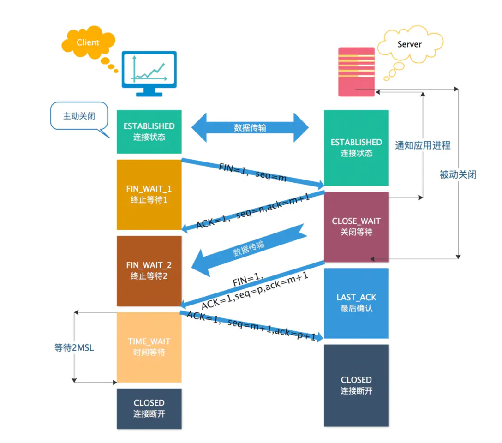
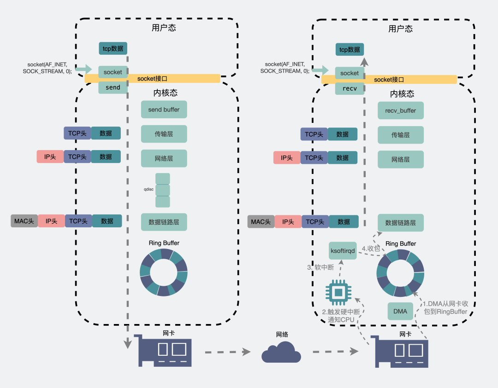

# 计算机网络面试题

## 计算机网络的各层协议及作用？

计算机网络体系可以大致分为一下三种，OSI七层模型、TCP/IP四层模型和五层模型。

* OSI七层模型：大而全，但是比较复杂、而且是先有了理论模型，没有实际应用。
* TCP/IP四层模型：是由实际应用发展总结出来的，从实质上讲，TCP/IP只有最上面三层，最下面一层没有什么具体内容，TCP/IP参考模型没有真正描述这一层的实现。
* 五层模型：五层模型只出现在计算机网络教学过程中，这是对七层模型和四层模型的一个折中，既简洁又能将概念阐述清楚。


七层网络体系结构各层的主要功能：

- 应用层：为应用程序提供交互服务。在互联网中的应用层协议很多，如域名系统DNS，支持万维网应用的HTTP协议，支持电子邮件的SMTP协议等。
- 表示层：主要负责数据格式的转换，如加密解密、转换翻译、压缩解压缩等。
- 会话层：负责在网络中的两节点之间建立、维持和终止通信，如服务器验证用户登录便是由会话层完成的。
- 运输层：有时也译为传输层，向主机进程提供通用的数据传输服务。该层主要有以下两种协议：
  - TCP：提供面向连接的、可靠的数据传输服务；
  - UDP：提供无连接的、尽最大努力的数据传输服务，但不保证数据传输的可靠性。
- 网络层：选择合适的路由和交换结点，确保数据及时传送。主要包括IP协议。
- 数据链路层：数据链路层通常简称为链路层。将网络层传下来的IP数据包组装成帧，并再相邻节点的链路上传送帧。
- 物理层：实现相邻节点间比特流的透明传输，尽可能屏蔽传输介质和通信手段的差异。

## OSI 的七层模型都有哪些？

- 物理层：利用传输介质为数据链路层提供物理连接，实现比特流的透明传输。
- 数据链路层：负责建立和管理节点间的链路。
- 网络层：通过路由选择算法，为报文或分组通过通信子网选择最适当的路径。
- 传输层：向用户提供可靠的端到端的差错和流量控制，保证报文的正确传输。
- 会话层：向两个实体的表示层提供建立和使用连接的方法。
- 表示层：处理用户信息的表示问题，如编码、数据格式转换和加密解密等。
- 应用层：直接向用户提供服务，完成用户希望在网络上完成的各种工作。

## TCP和UDP的区别？

TCP 和UDP都是属于运输层的

1、**TCP面向连接**(如打电话要先拨号建立连接);**UDP是无连接的**,即发送数据之前不需要建立连接

2、**TCP提供可靠的服务**。也就是说,通过TCP连接传送的数据,**无差错,不丢失,不重复,且按序到达**;UDP尽**最大努力交付**,即不保证可靠交付

3、**TCP面向字节流**,实际上是TCP把数据看成一连串无结构的字节流;**UDP是面向报文的**;UDP没有拥塞控制,因此网络出现拥塞不会使源主机的发送速率降低(对实时应用很有用,如IP电话,实时视频会议等)

4、每一条**TCP连接只能是点到点的**;**UDP支持一对一,一对多,多对一和多对多**的交互通信

5、**TCP首部开销20字节**;**UDP的首部开销小,只有8个字节**

6、**TCP的逻辑通信信道是全双工的可靠信道,UDP则是不可靠信道**

**对比如下**：

|              | UDP                                        | TCP                                              |
| :----------- | :----------------------------------------- | :----------------------------------------------- |
| 是否连接     | 无连接                                     | 面向连接                                         |
| 是否可靠     | 不可靠传输，不使用流量控制和拥塞控制       | 可靠传输，使用流量控制和拥塞控制                 |
| 是否有序     | 无序                                       | 有序，消息在传输过程中可能会乱序，TCP 会重新排序 |
| 传输速度     | 快                                         | 慢                                               |
| 连接对象个数 | 支持一对一，一对多，多对一和多对多交互通信 | 只能是一对一通信                                 |
| 传输方式     | 面向报文                                   | 面向字节流                                       |
| 首部开销     | 首部开销小，仅8字节                        | 首部最小20字节，最大60字节                       |
| 适用场景     | 适用于实时应用（IP电话、视频会议、直播等） | 适用于要求可靠传输的应用，例如文件传输           |

**总结**：

TCP 用于在传输层有必要实现可靠传输的情况，UDP 用于对高速传输和实时性有较高要求的通信。TCP 和 UDP 应该根据应用目的按需使用。

## UDP 和 TCP 对应的应用场景是什么？

**TCP 一般用于文件传输、发送和接收邮件、远程登录等场景。**

TCP 是面向连接，能保证数据的可靠性交付，因此经常用于：

- FTP文件传输
- HTTP / HTTPS

UDP 面向无连接，它可以随时发送数据，再加上UDP本身的处理既简单又高效，因此经常用于：

- 包总量较少的通信，如 DNS 、SNMP等
- **视频、音频等多媒体通信**，比如: QQ 语音、QQ 视频 、直播
- 广播通信


## 详细介绍一下 TCP 的三次握手机制？


> 图片来自：https://juejin.cn/post/6844904005315854343

三次握手机制：

* 第一次握手：客户端请求建立连接，向服务端发送一个**同步报文**（SYN=1），同时选择一个随机数 seq = x 作为**初始序列号**，并进入SYN_SENT状态，等待服务器确认。

* 第二次握手：：服务端收到连接请求报文后，如果同意建立连接，则向客户端发送**同步确认报文**（SYN=1，ACK=1），确认号为 ack = x + 1，同时选择一个随机数 seq = y 作为初始序列号，此时服务器进入SYN_RECV状态。
* 第三次握手：客户端收到服务端的确认后，向服务端发送一个**确认报文**（ACK=1），确认号为 ack = y + 1，序列号为 seq = x + 1，客户端和服务器进入ESTABLISHED状态，完成三次握手。

理想状态下，TCP连接一旦建立，在通信双方中的任何一方主动关闭连接之前，TCP 连接都将被一直保持下去。

## 不使用两次握手和四次握手的原因

TCP 建立连接时，通过三次握手**能防止历史连接的建立，能减少双方不必要的资源开销，能帮助双方同步初始化序列号**。序列号能够保证数据包不重复、不丢弃和按序传输。

- 两次握手：无法防止历史连接的建立，会造成双方资源的浪费，也无法可靠的同步双方序列号；
- 四次握手：三次握手就已经理论上最少可靠连接建立，所以不需要使用更多的通信次数。

## 为什么需要三次握手，而不是两次？

主要有三个原因：

1. **防止已过期的连接请求报文突然又传送到服务器，因而产生错误和资源浪费。**

   在双方两次握手即可建立连接的情况下，假设客户端发送 A 报文段请求建立连接，由于网络原因造成 A 暂时无法到达服务器，服务器接收不到请求报文段就不会返回确认报文段。

   客户端在长时间得不到应答的情况下重新发送请求报文段 B，这次 B 顺利到达服务器，服务器随即返回确认报文并进入 ESTABLISHED 状态，客户端在收到 确认报文后也进入 ESTABLISHED 状态，双方建立连接并传输数据，之后正常断开连接。

   此时姗姗来迟的 A 报文段才到达服务器，服务器随即返回确认报文并进入 ESTABLISHED 状态，但是已经进入 CLOSED 状态的客户端无法再接受确认报文段，更无法进入 ESTABLISHED 状态，这将导致服务器长时间单方面等待，造成资源浪费。

2. **三次握手才能让双方均确认自己和对方的发送和接收能力都正常。**

   **第一次握手**：客户端只是发送处请求报文段，什么都无法确认，而**服务器**可以**确认自己的接收能力和对方的发送能力正常**；

   **第二次握手**：**客户端可以确认自己发送能力和接收能力正常，对方发送能力和接收能力正常**；

   **第三次握手**：**服务器可以确认自己发送能力和接收能力正常，对方发送能力和接收能力正常**；

   可见三次握手才能让双方都确认自己和对方的发送和接收能力全部正常，这样就可以愉快地进行通信了。

3. **告知对方自己的初始序号值，并确认收到对方的初始序号值。**

   TCP 实现了可靠的数据传输，原因之一就是 TCP 报文段中维护了序号字段和确认序号字段，通过这两个字段双方都可以知道在自己发出的数据中，哪些是已经被对方确认接收的。这两个字段的值会在初始序号值得基础递增，如果是两次握手，只有发起方的初始序号可以得到确认，而另一方的初始序号则得不到确认。

## 为什么不能用两次握手进行连接？

答：3次握手完成两个重要的功能，既要双方做好发送数据的准备工作(双方都知道彼此已准备好)，也要允许双方就初始序列号进行协商，这个序列号在握手过程中被发送和确认。

现在把三次握手改成仅需要两次握手，死锁是可能发生的。作为例子，考虑计算机S和C之间的通信，假定C给S发送一个连接请求分组，S收到了这个分组，并发 送了确认应答分组。

按照两次握手的协定，S认为连接已经成功地建立了，可以开始发送数据分组。可是，C在S的应答分组在传输中被丢失的情况下，将不知道S 是否已准备好，不知道S建立什么样的序列号，C甚至怀疑S是否收到自己的连接请求分组。

在这种情况下，C认为连接还未建立成功，将忽略S发来的任何数据分 组，只等待连接确认应答分组。而S在发出的分组超时后，重复发送同样的分组。这样就形成了死锁。

## 为什么要三次握手，而不是四次？

因为三次握手已经可以确认双方的发送接收能力正常，双方都知道彼此已经准备好，而且也可以完成对双方初始序号值得确认，也就**无需再第四次握手了**。

- 第一次握手：服务端确认“自己收、客户端发”报文功能正常。
- 第二次握手：客户端确认“自己发、自己收、服务端收、客户端发”报文功能正常，客户端认为连接已建立。
- 第三次握手：服务端确认“自己发、客户端收”报文功能正常，此时双方均建立连接，可以正常通信。

## 为什么要进行三次握手？

为了防止服务器端开启一些无用的连接增加服务器开销以及防止已失效的连接请求报文段突然又传送到了服务端，因而产生错误。

由于网络传输是有延时的(要通过网络光纤和各种中间代理服务器)，在传输的过程中，比如客户端发起了SYN=1创建连接的请求(第一次握手)。

如果服务器端就直接创建了这个连接并返回包含SYN、ACK和Seq等内容的数据包给客户端，这个数据包因为网络传输的原因丢失了，丢失之后客户端就一直没有接收到服务器返回的数据包。

客户端可能设置了一个超时时间，时间到了就关闭了连接创建的请求。再重新发出创建连接的请求，而服务器端是不知道的，如果没有第三次握手告诉服务器端客户端收的到服务器端传输的数据的话，服务器端是不知道客户端有没有接收到服务器端返回的信息的。

## 为什么要进行四次挥手？

- 关闭连接时，客户端向服务端发送 FIN 时，仅仅表示客户端不再发送数据了但是还能接收数据。

- 服务器收到客户端的 FIN 报文时，先回一个 ACK 应答报文，而服务端可能还有数据需要处理和发送，等服务端不再发送数据时，才发送 FIN 报文给客户端来表示同意现在关闭连接。

从上面过程可知，服务端通常需要等待完成数据的发送和处理，所以服务端的 ACK 和 FIN 一般都会分开发送，从而比三次握手导致多了一次。

## 为什么是三次?不是两次、四次?

“因为三次才能保证双方具有接收和发送的能力。”,这样回答或许有些片面,可以在回答以下几点。

TCP 建立连接时,通过三次握手能防止历史连接的建立,能减少双方不必要的资源开销,能帮助双方同步初始化序列号。序列号能够保证数据包不重复、不丢弃和按序传输。

不使用两次和四次的原因:

**两次:无法防止历史连接的建立,会造成双方资源的浪费,也无法可靠的同步双方序列号;**

**四次:三次握手就已经理论上最少可靠连接建立,所以不需要使用更多的通信次数。**

## TCP有哪些控制位？

- *ACK*：该位为 `1` 时，「确认应答」的字段变为有效，TCP 规定除了最初建立连接时的 `SYN` 包之外该位必须设置为 `1` 。
- *RST*：该位为 `1` 时，表示 TCP 连接中出现异常必须强制断开连接。
- *SYN*：该位为 `1` 时，表示希望建立连接，并在其「序列号」的字段进行序列号初始值的设定。
- *FIN*：该位为 `1` 时，表示今后不会再有数据发送，希望断开连接。当通信结束希望断开连接时，通信双方的主机之间就可以相互交换 `FIN` 位为 1 的 TCP 段。

## TCP 的最大连接数是多少？

对 IPv4，客户端的 IP 数最多为 `2` 的 `32` 次方，客户端的端口数最多为 `2` 的 `16` 次方，也就是服务端单机最大 TCP 连接数，约为 `2` 的 `48` 次方。

当然，服务端最大并发 TCP 连接数远不能达到理论上限，会受以下因素影响：

- 文件描述符限制

  ，每个 TCP 连接都是一个文件，如果文件描述符被占满了，会发生 too many open files。Linux 对可打开的文件描述符的数量分别作了三个方面的限制：

  - **系统级**：当前系统可打开的最大数量，通过 cat /proc/sys/fs/file-max 查看；
  - **用户级**：指定用户可打开的最大数量，通过 cat /etc/security/limits.conf 查看；
  - **进程级**：单个进程可打开的最大数量，通过 cat /proc/sys/fs/nr_open 查看；

- **内存限制**，每个 TCP 连接都要占用一定内存，操作系统的内存是有限的，如果内存资源被占满后，会发生 OOM。

## 第一次握手丢失了，会发生什么？

在 Linux 里，客户端的 SYN 报文最大重传次数由 `tcp_syn_retries`内核参数控制，这个参数是可以自定义的，默认值一般是 5。通常，第一次超时重传是在 1 秒后，第二次超时重传是在 2 秒，第三次超时重传是在 4 秒后，第四次超时重传是在 8 秒后，第五次是在超时重传 16 秒后。没错，**每次超时的时间是上一次的 2 倍**。

当第五次超时重传后，会继续等待 32 秒，如果服务端仍然没有回应 ACK，客户端就不再发送 SYN 包，然后断开 TCP 连接。

所以，总耗时是 1+2+4+8+16+32=63 秒，大约 1 分钟左右。

## 第二次握手丢失了，会发生什么？

在 Linux 下，SYN-ACK 报文的最大重传次数由 `tcp_synack_retries`内核参数决定，默认值是 5。

因此，当第二次握手丢失了，客户端和服务端都会重传：

- 客户端会重传 SYN 报文，也就是第一次握手，最大重传次数由 `tcp_syn_retries`内核参数决定；
- 服务端会重传 SYN-ACK 报文，也就是第二次握手，最大重传次数由 `tcp_synack_retries` 内核参数决定。

## 第三次握手丢失了，会发生什么？

客户端收到服务端的 SYN-ACK 报文后，就会给服务端回一个 ACK 报文，也就是第三次握手，此时客户端状态进入到 `ESTABLISH` 状态。

因为这个第三次握手的 ACK 是对第二次握手的 SYN 的确认报文，所以当第三次握手丢失了，如果服务端那一方迟迟收不到这个确认报文，就会触发超时重传机制，重传 SYN-ACK 报文，直到收到第三次握手，或者达到最大重传次数。

注意，**ACK 报文是不会有重传的，当 ACK 丢失了，就由对方重传对应的报文**。

## 为什么每次建立 TCP 连接时，初始化的序列号都要求不一样呢？

主要原因有两个方面：

- 为了防止历史报文被下一个相同四元组的连接接收（主要方面）；
- 为了安全性，防止黑客伪造的相同序列号的 TCP 报文被对方接收；

## 第 2 次握手传回了 ACK，为什么还要传回 SYN？

接收端传回发送端所发送的 ACK 是为了告诉客户端，我接收到的信息确实就是你所发送的信号了，这表明从客户端到服务端的通信是正常的。而回传 SYN 则是为了建立并确认从服务端到客户端的通信。

SYN 同步序列编号(Synchronize Sequence Numbers) 是 TCP/IP 建立连接时使用的握手信号。在客户机和服务器之间建立正常的 TCP 网络连接时，客户机首先发出一个 SYN 消息，服务器使用 SYN-ACK 应答表示接收到了这个消息，最后客户机再以 ACK(Acknowledgement）消息响应。这样在客户机和服务器之间才能建立起可靠的 TCP 连接，数据才可以在客户机和服务器之间传递。

## 既然 IP 层会分片，为什么 TCP 层还需要 MSS 呢？

- `MTU`：一个网络包的最大长度，以太网中一般为 `1500` 字节；
- `MSS`：除去 IP 和 TCP 头部之后，一个网络包所能容纳的 TCP 数据的最大长度；

如果在 TCP 的整个报文（头部 + 数据）交给 IP 层进行分片，会有什么异常呢？

当 IP 层有一个超过 `MTU` 大小的数据（TCP 头部 + TCP 数据）要发送，那么 IP 层就要进行分片，把数据分片成若干片，保证每一个分片都小于 MTU。把一份 IP 数据报进行分片以后，由目标主机的 IP 层来进行重新组装后，再交给上一层 TCP 传输层。

这看起来井然有序，但这存在隐患的，**那么当如果一个 IP 分片丢失，整个 IP 报文的所有分片都得重传**。

因为 IP 层本身没有超时重传机制，它由传输层的 TCP 来负责超时和重传。

当接收方发现 TCP 报文（头部 + 数据）的某一片丢失后，则不会响应 ACK 给对方，那么发送方的 TCP 在超时后，就会重发「整个 TCP 报文（头部 + 数据）」。

因此，可以得知由 IP 层进行分片传输，是非常没有效率的。

所以，为了达到最佳的传输效能 TCP 协议在**建立连接的时候通常要协商双方的 MSS 值**，当 TCP 层发现数据超过 MSS 时，则就先会进行分片，当然由它形成的 IP 包的长度也就不会大于 MTU ，自然也就不用 IP 分片了。

## 第一次挥手丢失了，会发生什么？

当客户端（主动关闭方）调用 close 函数后，就会向服务端发送 FIN 报文，试图与服务端断开连接，此时客户端的连接进入到 `FIN_WAIT_1` 状态。

正常情况下，如果能及时收到服务端（被动关闭方）的 ACK，则会很快变为 `FIN_WAIT2`状态。

如果第一次挥手丢失了，那么客户端迟迟收不到被动方的 ACK 的话，也就会触发超时重传机制，重传 FIN 报文，重发次数由 `tcp_orphan_retries` 参数控制。

当客户端重传 FIN 报文的次数超过 `tcp_orphan_retries` 后，就不再发送 FIN 报文，直接进入到 `close` 状态。

## 第二次挥手丢失了，会发生什么？

当服务端收到客户端的第一次挥手后，就会先回一个 ACK 确认报文，此时服务端的连接进入到 `CLOSE_WAIT` 状态。

在前面我们也提了，ACK 报文是不会重传的，所以如果服务端的第二次挥手丢失了，客户端就会触发超时重传机制，重传 FIN 报文，直到收到服务端的第二次挥手，或者达到最大的重传次数。

这里提一下，当客户端收到第二次挥手，也就是收到服务端发送的 ACK 报文后，客户端就会处于 `FIN_WAIT2` 状态，在这个状态需要等服务端发送第三次挥手，也就是服务端的 FIN 报文。

对于 close 函数关闭的连接，由于无法再发送和接收数据，所以`FIN_WAIT2` 状态不可以持续太久，而 `tcp_fin_timeout` 控制了这个状态下连接的持续时长，默认值是 60 秒。

这意味着对于调用 close 关闭的连接，如果在 60 秒后还没有收到 FIN 报文，客户端（主动关闭方）的连接就会直接关闭。

但是注意，如果主动关闭方使用 shutdown 函数关闭连接，指定了只关闭发送方向，而接收方向并没有关闭，那么意味着主动关闭方还是可以接收数据的。此时，如果主动关闭方一直没收到第三次挥手，那么主动关闭方的连接将会一直处于 `FIN_WAIT2` 状态（`tcp_fin_timeout` 无法控制 shutdown 关闭的连接）。

## 第三次挥手丢失了，会发生什么？

当服务端（被动关闭方）收到客户端（主动关闭方）的 FIN 报文后，内核会自动回复 ACK，同时连接处于 `CLOSE_WAIT` 状态，顾名思义，它表示等待应用进程调用 close 函数关闭连接。

此时，内核是没有权利替代进程关闭连接，必须由进程主动调用 close 函数来触发服务端发送 FIN 报文。

服务端处于 CLOSE_WAIT 状态时，调用了 close 函数，内核就会发出 FIN 报文，同时连接进入 LAST_ACK 状态，等待客户端返回 ACK 来确认连接关闭。

如果迟迟收不到这个 ACK，服务端就会重发 FIN 报文，重发次数仍然由 `tcp_orphan_retrie`s 参数控制，这与客户端重发 FIN 报文的重传次数控制方式是一样的。

## 第四次挥手丢失了，会发生什么？

当客户端收到服务端的第三次挥手的 FIN 报文后，就会回 ACK 报文，也就是第四次挥手，此时客户端连接进入 `TIME_WAIT` 状态。

在 Linux 系统，TIME_WAIT 状态会持续 2MSL 后才会进入关闭状态。

然后，服务端（被动关闭方）没有收到 ACK 报文前，还是处于 LAST_ACK 状态。

如果第四次挥手的 ACK 报文没有到达服务端，服务端就会重发 FIN 报文，重发次数仍然由前面介绍过的 `tcp_orphan_retries` 参数控制。

## 如何优化 TIME_WAIT？

这里给出优化 TIME-WAIT 的几个方式，都是有利有弊：

- 打开 net.ipv4.tcp_tw_reuse 和 net.ipv4.tcp_timestamps 选项；
- net.ipv4.tcp_max_tw_buckets；
- 程序中使用 SO_LINGER ，应用强制使用 RST 关闭。

## 什么是 SYN洪泛攻击？如何防范？

SYN洪泛攻击属于 DOS 攻击的一种，它利用 TCP 协议缺陷，通过**发送大量的半连接请求，耗费 CPU 和内存资源**。

原理：

- 在三次握手过程中，服务器发送 `[SYN/ACK]` 包（第二个包）之后、收到客户端的 `[ACK]` 包（第三个包）之前的 TCP 连接称为半连接（half-open connect），此时服务器处于 `SYN_RECV`（等待客户端响应）状态。如果接收到客户端的 `[ACK]`，则 TCP 连接成功，如果未接受到，则会**不断重发请求**直至成功。
- SYN 攻击的攻击者在短时间内**伪造大量不存在的 IP 地址**，向服务器不断地发送 `[SYN]` 包，服务器回复 `[SYN/ACK]` 包，并等待客户的确认。由于源地址是不存在的，服务器需要不断的重发直至超时。
- 这些伪造的 `[SYN]` 包将长时间占用未连接队列，影响了正常的 SYN，导致目标系统运行缓慢、网络堵塞甚至系统瘫痪。

检测：**当在服务器上看到大量的半连接状态时，特别是源 IP 地址是随机的，基本上可以断定这是一次 SYN 攻击。**

防范：

* **通过防火墙、路由器等过滤网关防护**。
* **通过加固 TCP/IP 协议栈防范，如增加最大半连接数，缩短超时时间。**
* **SYN cookies技术。SYN Cookies 是对 TCP 服务器端的三次握手做一些修改，专门用来防范 SYN 洪泛攻击的一种手段。**

## ARQ 协议

**自动重传请求**（Automatic Repeat-reQuest，ARQ）是 OSI 模型中数据链路层和传输层的错误纠正协议之一。它通过使用确认和超时这两个机制，在不可靠服务的基础上实现可靠的信息传输。如果发送方在发送后一段时间之内没有收到确认帧，它通常会重新发送。ARQ 包括停止等待 ARQ 协议和连续 ARQ 协议。

## 停止等待 ARQ 协议

停止等待协议是为了实现可靠传输的，它的基本原理就是每发完一个分组就停止发送，等待对方确认（回复 ACK）。如果过了一段时间（超时时间后），还是没有收到 ACK 确认，说明没有发送成功，需要重新发送，直到收到确认后再发下一个分组。

在停止等待协议中，若接收方收到重复分组，就丢弃该分组，但同时还要发送确认。

**优缺点：**

- **优点：** 简单
- **缺点：** 信道利用率低，等待时间长

## 连续 ARQ 协议

连续 ARQ 协议可提高信道利用率。发送方维持一个发送窗口，凡位于发送窗口内的分组可以连续发送出去，而不需要等待对方确认。接收方一般采用累积确认，对按序到达的最后一个分组发送确认，表明到这个分组为止的所有分组都已经正确收到了。

**优缺点：**

- **优点：** 信道利用率高，容易实现，即使确认丢失，也不必重传。
- **缺点：** 不能向发送方反映出接收方已经正确收到的所有分组的信息。 比如：发送方发送了 5 条 消息，中间第三条丢失（3 号），这时接收方只能对前两个发送确认。发送方无法知道后三个分组的下落，而只好把后三个全部重传一次。这也叫 Go-Back-N（回退 N），表示需要退回来重传已经发送过的 N 个消息。

## 简述SYN攻击

SYN攻击即利用TCP协议缺陷,通过发送大量的半连接请求,占用半连接队列,耗费CPU和内存资源。
优化方式:

1. **缩短SYN Timeout时间**
2. **记录IP,若连续受到某个IP的重复SYN报文,从这个IP地址来的包会被一概丢弃。**

## 三次握手连接阶段，最后一次ACK包丢失，会发生什么？

**服务端：**

* 第三次的ACK在网络中丢失，那么服务端该TCP连接的状态为SYN_RECV,并且会根据 TCP的**超时重传机制**，会等待3秒、6秒、12秒后重新发送SYN+ACK包，以便客户端重新发送ACK包。
* 如果重发指定次数之后，仍然未收到 客户端的ACK应答，那么一段时间后，服务端自动关闭这个连接。

**客户端：**

**客户端认为这个连接已经建立**，如果客户端向服务端发送数据，服务端将以RST包（Reset，标示复位，用于异常的关闭连接）响应。此时，客户端知道第三次握手失败。

## 详细介绍一下 TCP 的四次挥手过程？



> 图片来源：https://juejin.im/post/5ddd1f30e51d4532c42c5abe

- 第一次挥手：客户端向服务端发送**连接释放报文**（FIN=1，ACK=1），主动关闭连接，同时等待服务端的确认。

  - 序列号 seq = u，即客户端上次发送的报文的最后一个字节的序号 + 1
  - 确认号 ack = k, 即服务端上次发送的报文的最后一个字节的序号 + 1

- 第二次挥手：服务端收到连接释放报文后，立即发出**确认报文**（ACK=1），序列号 seq = k，确认号 ack = u + 1。

  这时 TCP 连接处于半关闭状态，即**客户端到服务端的连接已经释放**了，但是服务端到客户端的连接还未释放。这表示客户端已经没有数据发送了，但是服务端可能还要给客户端发送数据。

- 第三次挥手：服务端向客户端发送**连接释放报文**（FIN=1，ACK=1），主动关闭连接，同时等待客户端 的确认。

  - 序列号 seq = w，即服务端上次发送的报文的最后一个字节的序号 + 1。
  - 确认号 ack = u + 1，与第二次挥手相同，因为这段时间客户端没有发送数据

- 第四次挥手：客户端收到服务端的连接释放报文后，立即发出**确认报文**（ACK=1），序列号 seq = u + 1，确认号为 ack = w + 1。

  此时，客户端就进入了 `TIME-WAIT` 状态。注意此时客户端到 TCP 连接还没有释放，必须经过 **2*MSL（最长报文段寿命）**的时间后，才进入 `CLOSED` 状态。而服务端只要收到客户端发出的确认，就立即进入 `CLOSED` 状态。可以看到，**服务端结束 TCP 连接的时间要比客户端早一些。**

## 为什么客户端的 TIME-WAIT 状态必须等待 2MSL ？

主要有两个原因：

1. **确保 ACK 报文能够到达服务端，从而使服务端正常关闭连接。**

   第四次挥手时，客户端第四次挥手的 ACK 报文不一定会到达服务端。服务端会超时重传 FIN/ACK 报文，此时如果客户端已经断开了连接，那么就无法响应服务端的二次请求，这样服务端迟迟收不到 FIN/ACK 报文的确认，就无法正常断开连接。

   **MSL 是报文段在网络上存活的最长时间**。**客户端等待 2MSL 时间，即「客户端 ACK 报文 1MSL 超时 + 服务端 FIN 报文 1MSL 传输」**，就能够收到服务端重传的 FIN/ACK 报文，然后客户端重传一次 ACK 报文，并重新启动 2MSL 计时器。如此保证服务端能够正常关闭。

   **如果服务端重发的 FIN 没有成功地在 2MSL 时间里传给客户端，服务端则会继续超时重试直到断开连接。**

2. **防止已失效的连接请求报文段出现在之后的连接中。**

   TCP 要求在 2MSL 内不使用相同的序列号。客户端在发送完最后一个 ACK 报文段后，再经过时间 2MSL，就可以保证本连接持续的时间内产生的所有报文段都从网络中消失。这样就可以使下一个连接中不会出现这种旧的连接请求报文段。或者即使收到这些过时的报文，也可以不处理它。

## 为什么TIME_WAIT状态需要经过2MSL(最大报文段生存时间)才能返回到CLOSE状态？

虽然按道理，四个报文都发送完毕，我们可以直接进入CLOSE状态了，但是我们必须假设网络是不可靠的，有可以最后一个ACK丢失。所以TIME_WAIT状态就是用来重发可能丢失的ACK报文。在Client发送出最后的ACK回复，但该ACK可能丢失。Server如果没有收到ACK，将不断重复发送FIN片段。所以Client不能立即关闭，它必须确认Server接收到了该ACK。

Client会在发送出ACK之后进入到TIME_WAIT状态。Client会设置一个计时器，等待2MSL的时间。如果在该时间内再次收到FIN，那么Client会重发ACK并再次等待2MSL。所谓的2MSL是两倍的MSL(Maximum Segment Lifetime)。MSL指一个片段在网络中最大的存活时间，2MSL就是一个发送和一个回复所需的最大时间。如果直到2MSL，Client都没有再次收到FIN，那么Client推断ACK已经被成功接收，则结束TCP连接。

## 如果已经建立了连接，但是客户端出现故障了怎么办？

或者说，如果三次握手阶段、四次挥手阶段的包丢失了怎么办？如“服务端重发 FIN丢失”的问题。

简而言之，通过**定时器 + 超时重试机制**，尝试获取确认，直到最后会自动断开连接。

具体而言，TCP 设有一个保活计时器。服务器每收到一次客户端的数据，都会重新复位这个计时器，时间通常是设置为 2 小时。若 2 小时还没有收到客户端的任何数据，服务器就开始重试：每隔 75 分钟发送一个探测报文段，若一连发送 10 个探测报文后客户端依然没有回应，那么服务器就认为连接已经断开了。

## TIME-WAIT 状态过多会产生什么后果？怎样处理？

过多的 TIME-WAIT 状态主要的危害有两种:

第一是**内存资源占用;**

第二是**对端口资源的占用,一个 TCP 连接至少消耗一个本地端口;**

从**服务器**来讲，短时间内关闭了大量的Client连接，就会造成服务器上出现大量的TIME_WAIT连接，**严重消耗着服务器的资源**，此时部分客户端就会显示连接不上。

从**客户端**来讲，客户端TIME_WAIT过多，就会**导致端口资源被占用**，因为端口就65536个，被占满就会导致无法创建新的连接。

**解决办法：**

* 服务器可以**设置 SO_REUSEADDR 套接字选项来避免 TIME_WAIT状态**，此套接字选项告诉内核，即使此端口正忙（处于TIME_WAIT状态），也请继续并重用它。
  
* **调整系统内核参数**，修改/etc/sysctl.conf文件，即修改`net.ipv4.tcp_tw_reuse 和 tcp_timestamps`

  ```bash
  net.ipv4.tcp_tw_reuse = 1 表示开启重用。允许将TIME-WAIT sockets重新用于新的TCP连接，默认为0，表示关闭；
  net.ipv4.tcp_tw_recycle = 1 表示开启TCP连接中TIME-WAIT sockets的快速回收，默认为0，表示关闭。
  ```

* **强制关闭**，发送 RST 包越过TIME_WAIT状态，直接进入CLOSED状态。

## TIME_WAIT 是服务器端的状态?还是客户端的状态?

TIME_WAIT 是主动断开连接的一方会进入的状态，一般情况下，都是**客户端所处的状态**;服务器端一般设置不主动关闭连接。

TIME_WAIT 需要等待 2MSL，在大量短连接的情况下，TIME_WAIT会太多，这也会消耗很多系统资源。对于服务器来说，在 HTTP 协议里指定 KeepAlive（浏览器重用一个 TCP 连接来处理多个 HTTP 请求），由浏览器来主动断开连接，可以一定程度上减少服务器的这个问题。

## 为什么需要 TIME_WAIT 状态?

主要是两个原因:

**防止具有相同「四元组」的「旧」数据包被收到;**

**保证「被动关闭连接」的一方能被正确的关闭,即保证最后的 ACK 能让被动关闭方接收,从而帮助其正常关闭;**

## TCP协议如何保证可靠性？

TCP主要提供了**检验和、序列号/确认应答、超时重传、滑动窗口、拥塞控制和 流量控制等方法实现了可靠性传输。**

* 检验和：通过检验和的方式，接收端可以检测出来数据是否有差错和异常，假如有差错就会直接丢弃TCP段，重新发送。

* 序列号/确认应答：

  序列号的作用不仅仅是应答的作用，有了序列号能够将接收到的数据根据序列号排序，并且去掉重复序列号的数据。

  TCP传输的过程中，每次接收方收到数据后，都会对传输方进行确认应答。也就是发送ACK报文，这个ACK报文当中带有对应的确认序列号，告诉发送方，接收到了哪些数据，下一次的数据从哪里发。

* 滑动窗口：滑动窗口既提高了报文传输的效率，也避免了发送方发送过多的数据而导致接收方无法正常处理的异常。

* 超时重传：超时重传是指发送出去的数据包到接收到确认包之间的时间，如果超过了这个时间会被认为是丢包了，需要重传。最大超时时间是动态计算的。

* 拥塞控制：在数据传输过程中，可能由于网络状态的问题，造成网络拥堵，此时引入拥塞控制机制，在保证TCP可靠性的同时，提高性能。

* 流量控制：如果主机A 一直向主机B发送数据，不考虑主机B的接受能力，则可能导致主机B的接受缓冲区满了而无法再接受数据，从而会导致大量的数据丢包，引发重传机制。而在重传的过程中，若主机B的接收缓冲区情况仍未好转，则会将大量的时间浪费在重传数据上，降低传送数据的效率。所以引入流量控制机制，主机B通过告诉主机A自己接收缓冲区的大小，来使主机A控制发送的数据量。流量控制与TCP协议报头中的窗口大小有关。

## TCP是如何保证可靠传输的?

1. 应用数据被分割成 TCP 认为最适合发送的数据块。
2. TCP 给发送的每一个包进行编号,接收方对数据包进行排序,把有序数据传送给应用层。
3. 校验和: TCP 将保持它首部和数据的检验和。这是一个端到端的检验和,目的是检测数据在传输过程中的任何变化。如果收到段的检验和有差错,TCP 将丢弃这
   个报文段和不确认收到此报文段。
4. TCP 的接收端会丢弃重复的数据。
5. 流量控制: TCP 连接的每一方都有固定大小的缓冲空间,TCP的接收端只允许发送端发送接收端缓冲区能接纳的数据。当接收方来不及处理发送方的数据,能提示
   发送方降低发送的速率,防止包丢失。TCP 使用的流量控制协议是可变大小的滑动窗口协议。 (TCP 利用滑动窗口实现流量控制)
6. 拥塞控制: 当网络拥塞时,减少数据的发送。
7. 自动重传请求（Automatic Repeat-reQuest，ARQ）协议: 也是为了实现可靠传输的,它的基本原理就是每发完一个分组就停止发送,等待对方确认。在收到确认后再发下一个分组。
8. 超时重传: 当 TCP 发出一个段后,它启动一个定时器,等待目的端确认收到这个报文段。如果不能及时收到一个确认,将重发这个报文段。

## 详细讲一下TCP的滑动窗口？

在进行数据传输时，如果传输的数据比较大，就需要拆分为多个数据包进行发送。**TCP 协议需要对数据进行确认后，才可以发送下一个数据包。这样一来，就会在等待确认应答包环节浪费时间。**

为了避免这种情况，TCP引入了窗口概念。**窗口大小指的是不需要等待确认应答包而可以继续发送数据包的最大值。**


从上面的图可以看到滑动窗口左边的是已发送并且被确认的分组，滑动窗口右边是还没有轮到的分组。

滑动窗口里面也分为两块，一块是已经发送但是未被确认的分组，另一块是窗口内等待发送的分组。随着已发送的分组不断被确认，窗口内等待发送的分组也会不断被发送。整个窗口就会往右移动，让还没轮到的分组进入窗口内。

可以看到滑动窗口起到了一个限流的作用，也就是说**当前滑动窗口的大小决定了当前 TCP 发送包的速率，而滑动窗口的大小取决于拥塞控制窗口和流量控制窗口的两者间的最小值。**

## 详细讲一下拥塞控制？

TCP 一共使用了四种算法来实现拥塞控制：

* **慢开始 (slow-start)；**

* **拥塞避免 (congestion avoidance)；**

* **快速重传 (fast retransmit)；**

* **快速恢复 (fast recovery)。**

发送方维持一个叫做拥塞窗口cwnd（congestion window）的状态变量。当cwndssthresh时，改用拥塞避免算法。

**慢开始：**不要一开始就发送大量的数据，由小到大逐渐增加拥塞窗口的大小。

**拥塞避免：**拥塞避免算法让拥塞窗口缓慢增长，即每经过一个往返时间RTT就把发送方的拥塞窗口cwnd加1而不是加倍。这样拥塞窗口按线性规律缓慢增长。

**快重传：**我们可以剔除一些不必要的拥塞报文，提高网络吞吐量。比如接收方在**收到一个失序的报文段后就立即发出重复确认，而不要等到自己发送数据时捎带确认。**快重传规定：发送方只要**一连收到三个**重复确认就应当立即重传对方尚未收到的报文段，而不必继续等待设置的重传计时器时间到期。


**快恢复：**主要是配合快重传。当发送方连续收到三个重复确认时，就执行“乘法减小”算法，把ssthresh门限减半（为了预防网络发生拥塞），但**接下来并不执行慢开始算法**，因为如果网络出现拥塞的话就不会收到好几个重复的确认，收到三个重复确认说明网络状况还可以。


## TCP 半连接队列和全连接队列

在 TCP 三次握手的时候,**Linux 内核会维护两个队列**,分别是:

**半连接队列,也称 SYN 队列;**

**全连接队列,也称 accept 队列**

**服务端收到客户端发起的 SYN 请求后,内核会把该连接存储到半连接队列,并向客户端响应 SYN+ACK,接着客户端会返回 ACK,服务端收到第三次握手的 ACK 后,内核会把连接从半连接队列移除,然后创建新的完全的连接,并将其添加到 accept 队列,等待进程调用accept 函数时把连接取出来。**

## TCP全连接队列满了会怎样？

当服务端并发处理大量请求时，如果 TCP 全连接队列过小，就容易溢出。发生 TCP 全连接队溢出的时候，后续的请求就会被丢弃，这样就会出现服务端请求数量上不去的现象。

我们还可以选择向客户端发送 RST 复位报文，告诉客户端连接已经建立失败。

tcp_abort_on_overflow 共有两个值分别是 0 和 1，其分别表示：

- 0 ：如果全连接队列满了，那么 server 扔掉 client 发过来的 ack ；
- 1 ：如果全连接队列满了，server 发送一个 `reset` 包给 client，表示废掉这个握手过程和这个连接；

## 怎样增大TCP全连接队列？

TCP 全连接队列的最大值取决于 somaxconn 和 backlog 之间的最小值，也就是 min(somaxconn, backlog)。

## TCP半连接队列满了会怎样？

1. 如果半连接队列满了，并且没有开启 tcp_syncookies，则会丢弃；
2. 若全连接队列满了，且没有重传 SYN+ACK 包的连接请求多于 1 个，则会丢弃；
3. 如果没有开启 tcp_syncookies，并且 max_syn_backlog 减去 当前半连接队列长度小于 (max_syn_backlog >> 2)，则会丢弃；

## 如何理解是 TCP 面向字节流协议？

- 先来说说为什么 UDP 是面向报文的协议？
  - 当用户消息通过 UDP 协议传输时，**操作系统不会对消息进行拆分**，在组装好 UDP 头部后就交给网络层来处理，所以发出去的 UDP 报文中的数据部分就是完整的用户消息，也就是**每个 UDP 报文就是一个用户消息的边界**，这样接收方在接收到 UDP 报文后，读一个 UDP 报文就能读取到完整的用户消息。
  - 操作系统在收到 UDP 报文后，会将其插入到队列里，**队列里的每一个元素就是一个 UDP 报文**，这样当用户调用 recvfrom() 系统调用读数据的时候，就会从队列里取出一个数据，然后从内核里拷贝给用户缓冲区。
- 再来说说为什么 TCP 是面向字节流的协议？
  - 当用户消息通过 TCP 协议传输时，**消息可能会被操作系统分组成多个的 TCP 报文**，也就是一个完整的用户消息被拆分成多个 TCP 报文进行传输。
  - 这时，接收方的程序如果不知道发送方发送的消息的长度，也就是不知道消息的边界时，是无法读出一个有效的用户消息的，因为用户消息被拆分成多个 TCP 报文后，并不能像 UDP 那样，一个 UDP 报文就能代表一个完整的用户消息。
  - 因此，**我们不能认为一个用户消息对应一个 TCP 报文，正因为这样，所以 TCP 是面向字节流的协议**。当两个消息的某个部分内容被分到同一个 TCP 报文时，就是我们常说的 TCP 粘包问题，这时接收方不知道消息的边界的话，是无法读出有效的消息。

## 如何解决粘包问题？

一般有三种方式分包的方式：

- 固定长度的消息；
- 特殊字符作为边界；
- 自定义消息结构。

## 为什么 TCP 每次建立连接时，初始化序列号都要不一样呢？

主要原因是为了防止历史报文被下一个相同四元组的连接接收。

## SYN 报文什么时候情况下会被丢弃？

SYN 报文被丢弃的两种场景：

- 开启 tcp_tw_recycle 参数，并且在 NAT 环境下，造成 SYN 报文被丢弃；
- TCP 两个队列满了（半连接队列和全连接队列），造成 SYN 报文被丢弃。

## 已建立连接的TCP，收到SYN会发生什么？

处于 establish 状态的服务端如果收到了客户端的 SYN 报文（注意此时的 SYN 报文其实是乱序的，因为 SYN 报文的初始化序列号其实是一个随机数），会回复一个携带了正确序列号和确认号的 ACK 报文，这个 ACK 被称之为 Challenge ACK。

接着，客户端收到这个 Challenge ACK，发现序列号并不是自己期望收到的，于是就会回 RST 报文，服务端收到后，就会释放掉该连接。

## 如何关闭一个 TCP 连接？

伪造一个四元组相同的 RST 报文不就行了？但是呢，**要伪造一个能关闭 TCP 连接的 RST 报文，必须同时满足「四元组相同」和「序列号正好落在对方的滑动窗口内」这两个条件。**

办法还是有的，**我们可以伪造一个四元组相同的 SYN 报文，来拿到“合法”的序列号！**

正如我们最开始学到的，如果处于 establish 状态的服务端，收到四元组相同的 SYN 报文后，**会回复一个 Challenge ACK，这个 ACK 报文里的「确认号」，正好是服务端下一次想要接收的序列号，说白了，就是可以通过这一步拿到服务端下一次预期接收的序列号。**

**然后用这个确认号作为 RST 报文的序列号，发送给服务端，此时服务端会认为这个 RST 报文里的序列号是合法的，于是就会释放连接！**

在 Linux 上有个叫 killcx 的工具，就是基于上面这样的方式实现的，它会主动发送 SYN 包获取 SEQ/ACK 号，然后利用 SEQ/ACK 号伪造两个 RST 报文分别发给客户端和服务端，这样双方的 TCP 连接都会被释放，这种方式活跃和非活跃的 TCP 连接都可以杀掉。

## 四次挥手中收到乱序的 FIN 包会如何处理？

如果 FIN 报文比数据包先抵达客户端，此时 FIN 报文其实是一个乱序的报文，此时客户端的 TCP 连接并不会从 FIN_WAIT_2 状态转换到 TIME_WAIT 状态。因此，我们要关注到点是看「在 FIN_WAIT_2 状态下，是如何处理收到的乱序到 FIN 报文，然后 TCP 连接又是什么时候才进入到 TIME_WAIT 状态?」。

在 FIN_WAIT_2 状态时，如果收到乱序的 FIN 报文，那么就被会加入到「乱序队列」，并不会进入到 TIME_WAIT 状态。

等再次收到前面被网络延迟的数据包时，会判断乱序队列有没有数据，然后会检测乱序队列中是否有可用的数据，如果能在乱序队列中找到与当前报文的序列号保持的顺序的报文，就会看该报文是否有 FIN 标志，如果发现有 FIN 标志，这时才会进入 TIME_WAIT 状态。

## 在 TIME_WAIT 状态的 TCP 连接，收到 SYN 后会发生什么？

针对这个问题，**关键是要看 SYN 的「序列号和时间戳」是否合法**，因为处于 TIME_WAIT 状态的连接收到 SYN 后，会判断 SYN 的「序列号和时间戳」是否合法，然后根据判断结果的不同做不同的处理。

如果处于 TIME_WAIT 状态的连接收到「合法的 SYN 」后，**就会重用此四元组连接，跳过 2MSL 而转变为 SYN_RECV 状态，接着就能进行建立连接过程**。

如果处于 TIME_WAIT 状态的连接收到「非法的 SYN 」后，就会**再回复一个第四次挥手的 ACK 报文，客户端收到后，发现并不是自己期望收到确认号（ack num），就回 RST 报文给服务端**。

## TCP 连接，一端断电和进程崩溃有什么区别？

**TCP keepalive**

- 如果对端程序是正常工作的。当 TCP 保活的探测报文发送给对端, 对端会正常响应，这样 **TCP 保活时间会被重置**，等待下一个 TCP 保活时间的到来。
- 如果对端主机崩溃，或对端由于其他原因导致报文不可达。当 TCP 保活的探测报文发送给对端后，石沉大海，没有响应，连续几次，达到保活探测次数后，**TCP 会报告该 TCP 连接已经死亡**。

**主机崩溃**

客户端主机崩溃了，服务端是**无法感知到的**，在加上服务端没有开启 TCP keepalive，又没有数据交互的情况下，**服务端的 TCP 连接将会一直处于 ESTABLISHED 连接状态**，直到服务端重启进程。

所以，我们可以得知一个点，在没有使用 TCP 保活机制且双方不传输数据的情况下，一方的 TCP 连接处在 ESTABLISHED 状态，并不代表另一方的连接还一定正常。

**进程崩溃**

如果其中一方的进程发生了崩溃，这个过程操作系统是可以感知的到的，于是就会发送 FIN 报文给对方，然后与对方进行 TCP 四次挥手。

## 拔掉网线后， 原本的 TCP 连接还存在吗？

**拔掉网线后，有数据传输**

- 在客户端拔掉网线后，如果服务端发送了数据报文，那么在服务端重传次数没有达到最大值之前，客户端就插回了网线，那么双方原本的 TCP 连接还是能正常存在，就好像什么事情都没有发生。
- 在客户端拔掉网线后，如果服务端发送了数据报文，在客户端插回网线之前，服务端重传次数达到了最大值时，服务端就会断开 TCP 连接。等到客户端插回网线后，向服务端发送了数据，因为服务端已经断开了与客户端相同四元组的 TCP 连接，所以就会回 RST 报文，客户端收到后就会断开 TCP 连接。至此， 双方的 TCP 连接都断开了。

**拔掉网线后，没有数据传输**

- 如果双方都没有开启 TCP keepalive 机制，那么在客户端拔掉网线后，如果客户端一直不插回网线，那么客户端和服务端的 TCP 连接状态将会一直保持存在。
- 如果双方都开启了 TCP keepalive 机制，那么在客户端拔掉网线后，如果客户端一直不插回网线，TCP keepalive 机制会探测到对方的 TCP 连接没有存活，于是就会断开 TCP 连接。而如果在 TCP 探测期间，客户端插回了网线，那么双方原本的 TCP 连接还是能正常存在。

## tcp_tw_reuse 为什么默认是关闭的？

其实这题在变相问「**如果 TIME_WAIT 状态持续时间过短或者没有，会有什么问题？**」

tcp_tw_reuse 的作用是让客户端快速复用处于 TIME_WAIT 状态的端口，相当于跳过了 TIME_WAIT 状态，这可能会出现这样的两个问题：

- 历史 RST 报文可能会终止后面相同四元组的连接，因为 PAWS 检查到即使 RST 是过期的，也不会丢弃。
- 如果第四次挥手的 ACK 报文丢失了，有可能被动关闭连接的一方不能被正常的关闭;

虽然 TIME_WAIT 状态持续的时间是有一点长，显得很不友好，但是它被设计来就是用来避免发生乱七八糟的事情。

## HTTPS 中 TLS 和 TCP 能同时握手吗？

**一般情况下，不管 TLS 握手次数如何，都得先经过 TCP 三次握手后才能进行**，因为 HTTPS 都是基于 TCP 传输协议实现的，得先建立完可靠的 TCP 连接才能做 TLS 握手的事情。

「HTTPS 中的 TLS 握手过程可以同时进行三次握手」对不对呢？

需要下面这两个条件同时满足才可以：

- **客户端和服务端都开启了 TCP Fast Open 功能，且 TLS 版本是 1.3；**
- **客户端和服务端已经完成过一次通信。**

## TCP Keepalive 和 HTTP Keep-Alive 是一个东西吗？

事实上，**这两个完全是两样不同东西**，实现的层面也不同：

- HTTP 的 Keep-Alive，是由**应用层（用户态）** 实现的，称为 HTTP 长连接；
- TCP 的 Keepalive，是由 **TCP 层（内核态）** 实现的，称为 TCP 保活机制；

**HTTP 的 Keep-Alive**

HTTP 长连接的特点是，只要任意一端没有明确提出断开连接，则保持 TCP 连接状态。

怎么才能使用 HTTP 的 Keep-Alive 功能？

在 HTTP 1.0 中默认是关闭的，如果浏览器要开启 Keep-Alive，它必须在请求的包头中添加：Connection: Keep-Alive

**TCP 的 Keepalive**

如果两端的 TCP 连接一直没有数据交互，达到了触发 TCP 保活机制的条件，那么内核里的 TCP 协议栈就会发送探测报文。

- 如果对端程序是正常工作的。当 TCP 保活的探测报文发送给对端, 对端会正常响应，这样 **TCP 保活时间会被重置**，等待下一个 TCP 保活时间的到来。
- 如果对端主机崩溃，或对端由于其他原因导致报文不可达。当 TCP 保活的探测报文发送给对端后，石沉大海，没有响应，连续几次，达到保活探测次数后，**TCP 会报告该 TCP 连接已经死亡**。

## TCP 协议有什么缺陷？

TCP 协议有哪些缺陷？主要有四个方面：

- 升级 TCP 的工作很困难；
- TCP 建立连接的延迟；
- TCP 存在队头阻塞问题；
- 网络迁移需要重新建立 TCP 连接；

## 如何基于 UDP 协议实现可靠传输？

主要是QUIC协议。


## TCP 和 UDP 可以同时绑定同一个端口吗？

可以的。

TCP 和 UDP 传输协议，在内核中是由两个完全独立的软件模块实现的。

当主机收到数据包后，可以在 IP 包头的「协议号」字段知道该数据包是 TCP/UDP，所以可以根据这个信息确定送给哪个模块（TCP/UDP）处理，送给 TCP/UDP 模块的报文根据「端口号」确定送给哪个应用程序处理。

因此， TCP/UDP 各自的端口号也相互独立，互不影响。

## 多个 TCP 服务进程可以绑定同一个端口吗？

如果两个 TCP 服务进程同时绑定的 IP 地址和端口都相同，那么执行 bind() 时候就会出错，错误是“Address already in use”。

如果两个 TCP 服务进程绑定的端口都相同，而 IP 地址不同，那么执行 bind() 不会出错。

## 重启 TCP 服务进程时，为什么会有“Address in use”的报错信息？

当我们重启 TCP 服务进程的时候，意味着通过服务器端发起了关闭连接操作，于是就会经过四次挥手，而对于主动关闭方，会在 TIME_WAIT 这个状态里停留一段时间，这个时间大约为 2MSL。

**当 TCP 服务进程重启时，服务端会出现 TIME_WAIT 状态的连接，TIME_WAIT 状态的连接使用的 IP+PORT 仍然被认为是一个有效的 IP+PORT 组合，相同机器上不能够在该 IP+PORT 组合上进行绑定，那么执行 bind() 函数的时候，就会返回了 Address already in use 的错误**。

## 客户端的端口可以重复使用吗？

在客户端执行 connect 函数的时候，只要客户端连接的服务器不是同一个，内核允许端口重复使用。

TCP 连接是由四元组（源IP地址，源端口，目的IP地址，目的端口）唯一确认的，那么只要四元组中其中一个元素发生了变化，那么就表示不同的 TCP 连接的。

所以，如果客户端已使用端口 64992 与服务端 A 建立了连接，那么客户端要与服务端 B 建立连接，还是可以使用端口 64992 的，因为内核是通过四元祖信息来定位一个 TCP 连接的，并不会因为客户端的端口号相同，而导致连接冲突的问题。

## 多个客户端可以 bind 同一个端口吗？

客户端是在调用 connect 函数的时候，由内核随机选取一个端口作为连接的端口。

而如果我们想自己指定连接的端口，就可以用 bind 函数来实现：客户端先通过 bind 函数绑定一个端口，然后调用 connect 函数就会跳过端口选择的过程了，转而使用 bind 时确定的端口。

要看多个客户端绑定的 IP + PORT 是否都相同，如果都是相同的，那么在执行 bind() 时候就会出错，错误是“Address already in use”。

如果一个绑定在 192.168.1.100:6666，一个绑定在 192.168.1.200:6666，因为 IP 不相同，所以执行 bind() 的时候，能正常绑定。

## 客户端 TCP 连接 TIME_WAIT 状态过多，会导致端口资源耗尽而无法建立新的连接吗？

如果客户端都是与同一个服务器（目标地址和目标端口一样）建立连接，那么如果客户端 TIME_WAIT 状态的连接过多，当端口资源被耗尽，就无法与这个服务器再建立连接了。

如果客户端都是与不同的服务器建立连接，即使客户端端口资源只有几万个， 客户端发起百万级连接也是没问题的（当然这个过程还会受限于其他资源，比如文件描述符、内存、CPU 等）。

## 如何解决客户端 TCP 连接 TIME_WAIT 过多，导致无法与同一个服务器建立连接的问题？

打开 `net.ipv4.tcp_tw_reuse` 这个内核参数。**因为开启了这个内核参数后，客户端调用 connect 函数时，如果选择到的端口，已经被相同四元组的连接占用的时候，就会判断该连接是否处于 TIME_WAIT 状态，如果该连接处于 TIME_WAIT 状态并且 TIME_WAIT 状态持续的时间超过了 1 秒，那么就会重用这个连接，然后就可以正常使用该端口了。**

## 服务端没有 listen，客户端发起连接建立，会发生什么？

服务端如果只 bind 了 IP 地址和端口，而没有调用 listen 的话，然后客户端对服务端发起了连接建立，服务端会回 RST 报文。

## 没有 listen，能建立 TCP 连接吗？

答案，**是可以的，客户端是可以自己连自己的形成连接（TCP自连接），也可以两个客户端同时向对方发出请求建立连接（TCP同时打开），这两个情况都有个共同点，就是没有服务端参与，也就是没有listen，就能建立连接**。

## 那没有listen，为什么还能建立连接？

我们知道执行 listen 方法时，会创建半连接队列和全连接队列。

三次握手的过程中会在这两个队列中暂存连接信息。

所以形成连接，前提是你得有个地方存放着，方便握手的时候能根据 IP + 端口等信息找到对应的 socket。

显然没有，因为客户端没有执行listen，因为半连接队列和全连接队列都是在执行 listen 方法时，内核自动创建的。

但内核还有个全局 hash 表，可以用于存放 sock 连接的信息。

这个全局 hash 表其实还细分为 ehash，bhash和listen_hash等，但因为过于细节，大家理解成有一个全局 hash 就够了，

**在 TCP 自连接的情况中，客户端在 connect 方法时，最后会将自己的连接信息放入到这个全局 hash 表中，然后将信息发出，消息在经过回环地址重新回到 TCP 传输层的时候，就会根据 IP + 端口信息，再一次从这个全局 hash 中取出信息。于是握手包一来一回，最后成功建立连接**。

## 没有 accept，能建立 TCP 连接吗？


**一般情况**下，如果启动服务器，会发现最后程序会**阻塞在**`accept()`里。客户端比较简单，创建好`socket`之后，直接就发起`connect`方法。此时回到服务端，会发现**之前一直阻塞的accept方法，返回结果了**。**就算不执行accept()方法，三次握手照常进行，并顺利建立连接。**更骚气的是，**在服务端执行accept()前，如果客户端发送消息给服务端，服务端是能够正常回复ack确认包的。**并且，`sleep(20)`结束后，服务端正常执行`accept()`，客户端前面发送的消息，还是能正常收到的。建立连接的过程中根本不需要`accept()`参与， **执行accept()只是为了从全连接队列里取出一条连接。**

## 为什么半连接队列要设计成哈希表？

先对比下**全连接里队列**，他本质是个链表，因为也是线性结构，说它是个队列也没毛病。它里面放的都是已经建立完成的连接，这些连接正等待被取走。而服务端取走连接的过程中，并不关心具体是哪个连接，只要是个连接就行，所以直接从队列头取就行了。这个过程算法复杂度为`O(1)`。

而**半连接队列**却不太一样，因为队列里的都是不完整的连接，嗷嗷等待着第三次握手的到来。那么现在有一个第三次握手来了，则需要从队列里把相应IP端口的连接取出，**如果半连接队列还是个链表，那我们就需要依次遍历，才能拿到我们想要的那个连接，算法复杂度就是O(n)。**

而如果将半连接队列设计成哈希表，那么查找半连接的算法复杂度就回到`O(1)`了。

因此出于效率考虑，全连接队列被设计成链表，而半连接队列被设计为哈希表。

## 用了 TCP 协议，数据一定不会丢吗？

可能会在几个地方丢包：

- 建立连接时丢包，半连接队列和全连接队列会占满，如果它们**满了**，那新来的包就会被**丢弃**；
- 流量控制丢包，当发送数据过快，流控队列长度`txqueuelen`又不够大时，就容易出现**丢包**现象；
- 网卡丢包，比如**网线质量差，接触不良**；
- RingBuffer过小导致丢包，如果这个**缓冲区过小**，而这时候发送的数据又过快，就有可能发生溢出，此时也会产生**丢包**；
- 网卡性能不足，网卡作为硬件，**传输速度是有上限的**。当网络传输速度过大，达到网卡上限时，就会发生丢包；
- 接收缓冲区丢包，当接受缓冲区满了，但如果这时候确实还有数据发来，就会发生**丢包**；
- 两端之间的网络丢包，中间有各种路由器和交换机还有光缆啥的，丢包也是很经常发生的；
- TCP只保证传输层的消息可靠性，并不保证应用层的消息可靠性。如果我们还想保证应用层的消息可靠性，就需要应用层自己去实现逻辑做保证。

## 数据包的发送流程？

为了发送数据包，两端首先会通过**三次握手**，建立TCP连接。

一个数据包，从聊天框里发出，消息会从**聊天软件**所在的**用户空间**拷贝到**内核空间**的**发送缓冲区（send buffer）**，数据包就这样顺着**传输层、网络层，进入到数据链路层，在这里数据包会经过流控（qdisc），再通过RingBuffer发到物理层的网卡**。数据就这样顺着**网卡**发到了**纷繁复杂**的网络世界里。这里头数据会经过n多个**路由器和交换机**之间的跳转，最后到达**目的机器的网卡**处。

此时目的机器的网卡会通知**DMA**将数据包信息放到`RingBuffer`中，再触发一个**硬中断**给`CPU`，`CPU`触发**软中断**让`ksoftirqd`去`RingBuffer`收包，于是一个数据包就这样顺着**物理层，数据链路层，网络层，传输层**，最后从内核空间拷贝到用户空间里的**聊天软件**里。



## 哪些报文会产生ACK回复？

- SYN报文
- FIN报文
- 携带数据的普通消息报文
- 携带数据的ACK报文

注意：SYN会消耗一个序列号。

## ARP协议

简单地说，ARP 是借助 **ARP 请求与 ARP 响应**两种类型的包确定 MAC 地址的。

- 主机会通过**广播发送 ARP 请求**，这个包中包含了想要知道的 MAC 地址的主机 IP 地址。
- 当同个链路中的所有设备收到 ARP 请求时，会去拆开 ARP 请求包里的内容，如果 ARP 请求包中的目标 IP 地址与自己的 IP 地址一致，那么这个设备就将自己的 MAC 地址塞入 **ARP 响应包**返回给主机。

操作系统通常会把第一次通过 ARP 获取的 MAC 地址缓存起来，以便下次直接从缓存中找到对应 IP 地址的 MAC 地址。

## ICMP协议

ICMP 全称是 **Internet Control Message Protocol**，也就是**互联网控制报文协议**。

`ICMP` 主要的功能包括：**确认 IP 包是否成功送达目标地址、报告发送过程中 IP 包被废弃的原因和改善网络设置等。**

ICMP 大致可以分为两大类：

- 一类是用于诊断的查询消息，也就是「**查询报文类型**」
- 另一类是通知出错原因的错误消息，也就是「**差错报文类型**」

## ping 的工作原理

**Ping是基于ICMP协议栈**,常常使用 ping 某一个 IP 地址或者某个域名看下基本连接是否正常;是否有丢包;是否有网络延迟。

**Ping是一种计算机网络工具,用来测试数据包能否透过IP协议到达特定主机。ping的运作原理是向目标主机传出一个ICMP echo@要求数据包,并等待接收echo回应数据包。程序会按时间和成功响应的次数估算丢失数据包率(丢包率)和数据包往返时间(网络时延,Round-trip delay time)。**———— 维基百科

ping 命令执行的时候,源主机先会构建一个 ICMP 回送请求消息数据包。

ICMP 数据包内包含多个字段,最重要的是两个:

第一个是**类型**,对于回送请求消息而言该字段为 8 ;另外一个是**序号**,主要用于区分连续ping 的时候发出的多个数据包。

每发出一个请求数据包,序号会自动加 1 。为了能够计算往返时间 RTT ,它会在报文的数据部分插入发送时间。

在规定的时候间内,源主机如果没有接到 ICMP 的应答包,则说明目标主机不可达;如果接收到了 ICMP 回送响应消息,则说明目标主机可达。此时,源主机会检查,用当前时刻减去该数据包最初从源主机上发出的时刻,就是 ICMP 数据包的时间延迟。

几个常用的 ICMP 差错报文的例子：

- 目标不可达消息 —— 类型 为 `3`
- 原点抑制消息 —— 类型 `4`
- 重定向消息 —— 类型 `5`
- 超时消息 —— 类型 `11`

**查询报文类型的使用**

ping 命令执行的时候，源主机首先会构建一个 **ICMP 回送请求消息**数据包。

ICMP 数据包内包含多个字段，最重要的是两个：

- 第一个是**类型**，对于回送请求消息而言该字段为 `8`；
- 另外一个是**序号**，主要用于区分连续 ping 的时候发出的多个数据包。

每发出一个请求数据包，序号会自动加 `1`。为了能够计算往返时间 `RTT`，它会在报文的数据部分插入发送时间。

**差错报文类型的使用**

raceroute 的第一个作用就是**故意设置特殊的 TTL，来追踪去往目的地时沿途经过的路由器。**

traceroute 还有一个作用是**故意设置不分片，从而确定路径的 MTU**。

## HTTP 是不保存状态的协议, 如何保存用户状态?

HTTP 是一种不保存状态，即无状态（stateless）协议。也就是说 HTTP 协议自身不对请求和响应之间的通信状态进行保存。那么我们保存用户状态呢？Session 机制的存在就是为了解决这个问题，Session 的主要作用就是通过服务端记录用户的状态。典型的场景是购物车，当你要添加商品到购物车的时候，系统不知道是哪个用户操作的，因为 HTTP 协议是无状态的。服务端给特定的用户创建特定的 Session 之后就可以标识这个用户并且跟踪这个用户了（一般情况下，服务器会在一定时间内保存这个 Session，过了时间限制，就会销毁这个 Session）。

在服务端保存 Session 的方法很多，最常用的就是内存和数据库(比如是使用内存数据库 redis 保存)。既然 Session 存放在服务器端，那么我们如何实现 Session 跟踪呢？大部分情况下，我们都是通过在 Cookie 中附加一个 Session ID 来方式来跟踪。

## URI 和 URL 的区别是什么?

- URI(Uniform Resource Identifier) 是统一资源标志符，可以唯一标识一个资源。
- URL(Uniform Resource Locator) 是统一资源定位符，可以提供该资源的路径。它是一种具体的 URI，即 URL 可以用来标识一个资源，而且还指明了如何 locate 这个资源。

## 物理层有什么作用

**主要解决两台物理机之间的通信,通过二进制比特流的传输来实现,二进制数据表现为电流电压上的强弱,到达目的地再转化为二进制机器码。网卡、集线器工作在这一层。**

## 数据链路层有什么作用

**在不可靠的物理介质上提供可靠的传输,接收来自物理层的位流形式的数据,并封装成帧,传送到上一层**;同样,也**将来自上层的数据帧,拆装为位流形式的数据转发到物理层**。这一层在物理层提供的比特流的基础上,通过**差错控制、流量控制**方法,使有差错的物理线路变为**无差错的数据链路**。提供**物理地址寻址**功能。**交换机工作在这一层。**

## 网络层有什么作用

**将网络地址翻译成对应的物理地址,并决定如何将数据从发送方路由到接收方,通过路由选择算法为分组通过通信子网选择最佳路径**。**路由器工作在这一层。**

## 传输层有什么作用

**传输层提供了进程间的逻辑通信,传输层向高层用户屏蔽了下面网络层的核心细节,使应用程序看起来像是在两个传输层实体之间有一条端到端的逻辑通信信道**。

## 会话层有什么作用

建立会话:身份验证,权限鉴定等;

保持会话:对该会话进行维护,在会话维持期间两者可以随时使用这条会话传输局;

断开会话:当应用程序或应用层规定的超时时间到期后,OSI会话层才会释放这条会话。

## 表示层有什么作用

对数据格式进行编译,对收到或发出的数据根据应用层的特征进行处理,如处理为文字、图片、音频、视频、文档等,还可以对压缩文件进行解压缩、对加密文件进行解密等。

## 应用层有什么作用

提供应用层协议,如HTTP协议,FTP协议等等,方便应用程序之间进行通信。

## 为何UDP不可靠

- **UDP面向数据报无连接的,数据报发出去,就不保留数据备份了。**
- **仅仅在IP数据报头部加入校验和复用。**
- **UDP没有服务器和客户端的概念。**
- **UDP报文过长的话是交给IP切成小段,如果某段报废报文就废了。**

## 简述TCP粘包现象

**TCP是面向流协议,发送的单位是字节流,因此会将多个小尺寸数据被封装在一个tcp报文中发出去的可能性。可以简单的理解成客户端调用了两次send,服务器端一个recv就把信息都读出来了。**

## TCP粘包现象处理方法

**固定发送信息长度,或在两个信息之间加入分隔符。**

## 简述TCP协议的滑动窗口

滑动窗口是传输层进行流量控制的一种措施,**接收方通过通告发送方自己的窗口大小**,从而控制发送方的发送速度,防止发送方发送速度过快而导致自己被淹没。

## 简述TCP协议的拥塞控制

拥塞是指一个或者多个交换点的数据报超载,TCP又会有重传机制,导致过载。

为了防止拥塞窗口cwnd增长过大引起网络拥塞,还需要设置一个慢开始门限ssthresh状态变量.

当cwnd < ssthresh 时,使用慢开始算法。

当cwnd > ssthresh 时,停止使用慢开始算法而改用拥塞避免算法。

当cwnd = ssthresh 时,即可使用慢开始算法,也可使用拥塞避免算法。

慢开始:由小到大逐渐增加拥塞窗口的大小,每接一次报文,cwnd指数增加。

拥塞避免:cwnd缓慢地增大,即每经过一个往返时间RTT就把发送方的拥塞窗口cwnd加1。

快恢复之前的策略:发送方判断网络出现拥塞,就把ssthresh设置为出现拥塞时发送方窗口值的一半,继续执行慢开始,之后进行拥塞避免。

快恢复:发送方判断网络出现拥塞,就把ssthresh设置为出现拥塞时发送方窗口值的一半,并把cwnd设置为ssthresh的一半,之后进行拥塞避免。

## 简述快重传

如果在超时重传定时器溢出之前,**接收到连续的三个重复冗余ACK**,发送端便知晓哪个报文段在传输过程中丢失了,于是重发该报文段,不需要等待超时重传定时器溢出再发送该报文。

## HTTP属于那一层?TCP/UDP属于哪一层?IP属于哪一层?

IP: 网络层
TCP/UDP: 传输层
HTTP、RTSP、FTP:应用层

## HTTP是什么? 

HTTP是**超文本传输协议**(HTTP 是在计算机世界的协议。它使计算机能够理解的语言确立了一种计算机之间交流通信的规范(**两个以上的参与者**),以及相关的各种控制和错误处理方式(**行为约定和规范)**。)

**HTTP 是一个在计算机世界里专门在「两点」之间「传输」文字、图片、音频、视频等「超文本」数据的「约定和规范」。**

## HTTP协议

HTTP协议是Hyper Text Transfer Protocol（**超文本传输协议**）的缩写，是用于从万维网（WWW:World Wide Web）服务器传输超文本到本地浏览器的传送协议。

HTTP是一个**基于TCP/IP**通信协议来传递数据（HTML 文件，图片文件，查询结果等）。

HTTP是一个属于**应用层的面向对象的协议**，由于其简捷、快速的方式，适用于分布式超媒体信息系统。它于1990年提出，经过几年的使用与发展，得到不断地完善和扩展。目前在WWW中使用的是HTTP/1.0的第六版，HTTP/1.1的规范化工作正在进行之中，而且HTTP-NG（Next Generation of HTTP）的建议已经提出。

HTTP协议工作于客户端-服务端架构为上。浏览器作为HTTP客户端通过URL向HTTP服务端即WEB服务器发送所有请求。Web服务器根据接收到的请求后，向客户端发送响应信息。

## HTTP协议特点

1、**简单快速**：

客户向服务器请求服务时，只需传送请求方法和路径。请求方法常用的有GET、HEAD、POST。每种方法规定了客户与服务器联系的类型不同。由于HTTP协议简单，使得HTTP服务器的程序规模小，因而通信速度很快。

2、**灵活**：

**HTTP允许传输任意类型的数据对象**。正在传输的类型由Content-Type加以标记。

3、**无连接**：

**无连接的含义是限制每次连接只处理一个请求**。服务器处理完客户的请求，并收到客户的应答后，即断开连接。采用这种方式可以节省传输时间。

4、**无状态**：

**HTTP协议是无状态协议**。**无状态是指协议对于事务处理没有记忆能力**。缺少状态意味着如果后续处理需要前面的信息，则它必须重传，这样可能导致每次连接传送的数据量增大。另一方面，在服务器不需要先前信息时它的应答就较快。

5、**支持B/S及C/S模式**。

6、**默认端口80**

7、**基于TCP协议**

## HTTP过程概述

HTTP协议定义Web客户端如何从Web服务器请求Web页面，以及服务器如何把Web页面传送给客户端。HTTP协议采用了请求/响应模型。客户端向服务器发送一个请求报文，请求报文包含请求的方法、URL、协议版本、请求头部和请求数据。服务器以一个状态行作为响应，响应的内容包括协议的版本、成功或者错误代码、服务器信息、响应头部和响应数据。

## HTTP 请求/响应的步骤

1、客户端连接到Web服务器

一个HTTP客户端，通常是浏览器，与Web服务器的HTTP端口（默认为80）建立一个TCP套接字连接。例如，http://www.baidu.com。

2、发送HTTP请求

通过TCP套接字，客户端向Web服务器发送一个文本的请求报文，一个请求报文由请求行、请求头部、空行和请求数据4部分组成。

3、服务器接受请求并返回HTTP响应

Web服务器解析请求，定位请求资源。服务器将资源复本写到TCP套接字，由客户端读取。一个响应由状态行、响应头部、空行和响应数据4部分组成。

4、释放连接TCP连接

若connection 模式为close，则服务器主动关闭TCP连接，客户端被动关闭连接，释放TCP连接;若connection 模式为keepalive，则该连接会保持一段时间，在该时间内可以继续接收请求;

5、客户端浏览器解析HTML内容

客户端浏览器首先解析状态行，查看表明请求是否成功的状态代码。然后解析每一个响应头，响应头告知以下为若干字节的HTML文档和文档的字符集。客户端浏览器读取响应数据HTML，根据HTML的语法对其进行格式化，并在浏览器窗口中显示。

## 说一下HTTP的优缺点?

**优点:简单、灵活和易于拓展、应用广泛和跨平台。**
**缺点:无状态、明文传输、不安全**

## http 响应码 301 和 302 代表的是什么？有什么区别？

**301：永久重定向；302：暂时重定向。**

它们的区别是，301 对搜索引擎优化（SEO）更加有利；302 有被提示为网络拦截的风险。

##  HTTP常见的状态码有哪些？

常见状态码：

* 200：服务器已成功处理了请求。 通常，这表示服务器提供了请求的网页。
* 301 ： (永久移动) 请求的网页已永久移动到新位置。 服务器返回此响应(对 GET 或 HEAD 请求的响应)时，会自动将请求者转到新位置。
* 302：(临时移动) 服务器目前从不同位置的网页响应请求，但请求者应继续使用原有位置来进行以后的请求。
* 400 ：客户端请求有语法错误，不能被服务器所理解。
* 403 ：服务器收到请求，但是拒绝提供服务。
* 404 ：(未找到) 服务器找不到请求的网页。
* 500： (服务器内部错误) 服务器遇到错误，无法完成请求。

状态码开头代表类型：


## 请你说一说HTTP返回码

HTTP协议的响应报文由状态行、响应头部和响应包体组成，其响应状态码总体描述如下：

**1xx：指示信息**--表示请求已接收，继续处理。

**2xx：成功**--表示请求已被成功接收、理解、接受。

**3xx：重定向**--要完成请求必须进行更进一步的操作。

**4xx：客户端错误**--请求有语法错误或请求无法实现。

**5xx：服务器端错误**--服务器未能实现合法的请求。

常见状态代码、状态描述的详细说明如下。

200 OK：客户端请求成功。

206 partial content服务器已经正确处理部分GET请求，实现断点续传或同时分片下载，该请求必须包含Range请求头来指示客户端期望得到的范围

300 multiple choices（可选重定向）:被请求的资源有一系列可供选择的反馈信息，由浏览器/用户自行选择其中一个。

301 moved permanently（永久重定向）：该资源已被永久移动到新位置，将来任何对该资源的访问都要使用本响应返回的若干个URI之一。

302 move temporarily(临时重定向)：请求的资源现在临时从不同的URI中获得，

304：not modified :如果客户端发送一个待条件的GET请求并且该请求以经被允许，而文档内容未被改变，则返回304,该响应不包含包体（即可直接使用缓存）。

403 Forbidden：服务器收到请求，但是拒绝提供服务。

404 not Found：请求资源不存在，举个例子：输入了错误的URL。

## 状态码301和302的区别是什么？

**共同点**：301和302状态码都表示重定向，就是说浏览器在拿到服务器返回的这个状态码后会自动跳转到一个新的URL地址，这个地址可以从响应的Location首部中获取（**用户看到的效果就是他输入的地址A瞬间变成了另一个地址B**）。
**不同点**：301表示旧地址A的资源已经被永久地移除了(这个资源不可访问了)，搜索引擎在抓取新内容的同时也将旧的网址交换为重定向之后的网址；302表示旧地址A的资源还在（仍然可以访问），这个重定向只是临时地从旧地址A跳转到地址B，搜索引擎会抓取新的内容而保存旧的网址。 SEO中302好于301。

**补充，重定向原因**：

1. 网站调整（如改变网页目录结构）；
2. 网页被移到一个新地址；
3. 网页扩展名改变(如应用需要把.php改成.Html或.shtml)。 

## HTTP 常用的请求方式？

| 方法    | 作用                                                    |
| ------- | ------------------------------------------------------- |
| GET     | 获取资源                                                |
| POST    | 传输实体主体                                            |
| PUT     | 上传文件                                                |
| DELETE  | 删除文件                                                |
| HEAD    | 和GET方法类似，但只返回报文首部，不返回报文实体主体部分 |
| PATCH   | 对资源进行部分修改                                      |
| OPTIONS | 查询指定的URL支持的方法                                 |
| CONNECT | 要求用隧道协议连接代理                                  |
| TRACE   | 服务器会将通信路径返回给客户端                          |

为了方便记忆，可以将PUT、DELETE、POST、GET理解为客户端对服务端的增删改查。

- PUT：上传文件，向服务器添加数据，可以看作增
- DELETE：删除文件
- POST：传输数据，向服务器提交数据，对服务器数据进行更新。
- GET：获取资源，查询服务器资源

## GET请求和POST请求的区别？

**使用上的区别**：

* GET使用URL或Cookie传参，而POST将数据放在BODY中”，这个是因为HTTP协议用法的约定。
* GET方式提交的数据有长度限制，则POST的数据则可以非常大”，这个是因为它们使用的操作系统和浏览器设置的不同引起的区别。

* POST比GET安全，因为数据在地址栏上不可见”，这个说法没毛病，但依然不是GET和POST本身的区别。

**本质区别**

**GET和POST最大的区别主要是GET请求是幂等性的，POST请求不是。**这个是它们本质区别。

幂等性是指一次和多次请求某一个资源应该具有同样的副作用。简单来说意味着对同一URL的多个请求应该返回同样的结果。

##  解释一下HTTP长连接和短连接？

**在HTTP/1.0中，默认使用的是短连接**。也就是说，浏览器和服务器每进行一次HTTP操作，就建立一次连接，但任务结束就中断连接。如果客户端浏览器访问的某个HTML或其他类型的 Web页中包含有其他的Web资源，如JavaScript文件、图像文件、CSS文件等；当浏览器每遇到这样一个Web资源，就会建立一个HTTP会话。

但从 **HTTP/1.1起，默认使用长连接**，用以保持连接特性。使用长连接的HTTP协议，会在响应头有加入这行代码：`Connection:keep-alive`

在使用长连接的情况下，当一个网页打开完成后，客户端和服务器之间用于传输HTTP数据的 TCP连接不会关闭，如果客户端再次访问这个服务器上的网页，会继续使用这一条已经建立的连接。Keep-Alive不会永久保持连接，它有一个保持时间，可以在不同的服务器软件（如Apache）中设定这个时间。实现长连接要客户端和服务端都支持长连接。

**HTTP协议的长连接和短连接，实质上是TCP协议的长连接和短连接。**

HTTP中的长连接短连接指HTTP底层TCP的连接。

短连接: 客户端与服务器进行一次HTTP连接操作,就进行一次TCP连接,连接结束TCP关闭连接。

长连接:如果HTTP头部带有参数keep-alive,即开启长连接网页完成打开后,底层用于传输数据的TCP连接不会直接关闭,会根据服务器设置的保持时间保持连接,保持时间过后连接关闭。

## HTTP请求报文和响应报文的格式？

**请求报文格式**：

1. 请求行（请求方法+URI协议+版本）
2. 请求头部
3. 空行
4. 请求主体

```html
GET/sample.jspHTTP/1.1 请求行
Accept:image/gif.image/jpeg, 请求头部
Accept-Language:zh-cn
Connection:Keep-Alive
Host:localhost
User-Agent:Mozila/4.0(compatible;MSIE5.01;Window NT5.0)
Accept-Encoding:gzip,deflate

username=jinqiao&password=1234 请求主体
```

**响应报文**：

1. 状态行（版本+状态码+原因短语）
2. 响应首部
3. 空行
4. 响应主体

```html
HTTP/1.1 200 OK
Server:Apache Tomcat/5.0.12
Date:Mon,6Oct2003 13:23:42 GMT
Content-Length:112

<html>
    <head>
        <title>HTTP响应示例<title>
    </head>
    <body>
        Hello HTTP!
    </body>
</html>
```

## HTTP1.0和HTTP1.1的区别?

* **长连接**：HTTP 1.1支持长连接（Persistent Connection）和请求的流水线（Pipelining）处理，在一个TCP连接上可以传送多个HTTP请求和响应，减少了建立和关闭连接的消耗和延迟，在HTTP1.1中默认开启`Connection： keep-alive`，一定程度上弥补了HTTP1.0每次请求都要创建连接的缺点。
* **缓存处理**：在HTTP1.0中主要使用header里的If-Modified-Since,Expires来做为缓存判断的标准，HTTP1.1则引入了更多的缓存控制策略，可供选择的缓存头来控制缓存策略。
* **带宽优化及网络连接的使用**：HTTP1.0中，存在一些浪费带宽的现象，例如客户端只是需要某个对象的一部分，而服务器却将整个对象送过来了，并且不支持断点续传功能，HTTP1.1则在请求头引入了range头域，它允许只请求资源的某个部分，即返回码是206（Partial Content），这样就方便了开发者自由的选择以便于充分利用带宽和连接。
* **错误通知的管理**：在HTTP1.1中新增了24个错误状态响应码，如409（Conflict）表示请求的资源与资源的当前状态发生冲突；410（Gone）表示服务器上的某个资源被永久性的删除。
* **Host头处理**：在HTTP1.0中认为每台服务器都绑定一个唯一的IP地址，因此，请求消息中的URL并没有传递主机名（hostname）。但随着虚拟主机技术的发展，在一台物理服务器上可以存在多个虚拟主机（Multi-homed Web Servers），并且它们共享一个IP地址。HTTP1.1的请求消息和响应消息都应支持Host头域，且请求消息中如果没有Host头域会报告一个错误（400 Bad Request）。

## HTTP1.1和 HTTP2.0的区别？

HTTP2.0相比HTTP1.1支持的特性：

* **新的二进制格式**：HTTP1.1的解析是基于文本。基于文本协议的格式解析存在天然缺陷，文本的表现形式有多样性，要做到健壮性考虑的场景必然很多，二进制则不同，只认0和1的组合。基于这种考虑HTTP2.0的协议解析决定采用二进制格式，实现方便且健壮。

* **多路复用**，即连接共享，即每一个request都是用作连接共享机制的。一个request对应一个id，这样一个连接上可以有多个request，每个连接的request可以随机的混杂在一起，接收方可以根据request的 id将request再归属到各自不同的服务端请求里面。

* **头部压缩**，HTTP1.1的头部（header）带有大量信息，而且每次都要重复发送；HTTP2.0使用encoder来减少需要传输的header大小，通讯双方各自cache一份header fields表，既避免了重复header的传输，又减小了需要传输的大小。

* **服务端推送**：服务器除了对最初请求的响应外，服务器还可以额外的向客户端推送资源，而无需客户端明确的请求。

## HTTP 与 HTTPS 的区别？

1. HTTP 是超文本传输协议,信息是明文传输,存在安全风险的问题。HTTPS 则解决HTTP 不安全的缺陷,**在TCP 和 HTTP 网络层之间加了 SSL/TLS 安全协议**,使得
   报文能够加密传输。
2. HTTP 连接建立相对简单, TCP 三次握手之后便可进行 HTTP 的报文传输。**HTTPS 在 TCP 三次握手之后,还需 SSL/TLS 的握手过程,才可进入加密报文传输**。
3. HTTP 的端口号是 80,HTTPS 的端口号是 443。
4. HTTPS 协议需要向 CA(证书权威机构)申请数字证书,来保证服务器的身份是可信的。需要一定经济成本；
5. http是明文传输，https是加密的安全传输；
6. http连接很简单，没有状态；https是ssl加密的传输，身份认证的网络协议，相对http传输比较安全。

|              |        HTTP        | HTTPS                                   |
| :----------: | :----------------: | --------------------------------------- |
|     端口     |         80         | 443                                     |
|    安全性    | 无加密，安全性较差 | 有加密机制，安全性较高                  |
|   资源消耗   |        较少        | 由于加密处理，资源消耗更多              |
| 是否需要证书 |       不需要       | 需要                                    |
|     协议     | 运行在TCP协议之上  | 运行在SSL协议之上，SSL运行在TCP协议之上 |

## HTTP1.1相对于HTTP1.0的优化是什么?

HTTP1.0最早在网页中使用是在1996年,那个时候只是使用一些较为简单的网页上和网络请求上,而HTTP1.1则在1999年才开始广泛应用于现在的各大浏览器网络请求中,同时HTTP1.1也是当前使用最为广泛的HTTP协议。 主要区别主要体现在:

1. **长连接** : 在HTTP/1.0中,默认使用的是短连接,也就是说每次请求都要重新建立一次连接。HTTP 是基于TCP/IP协议的,每一次建立或者断开连接都需要三次握
   手四次挥手的开销,如果每次请求都要这样的话,开销会比较大。因此最好能维持一个长连接,可以用个长连接来发多个请求。HTTP 1.1起,默认使用长连接 ,默
   认开启Connection: keep-alive。 HTTP/1.1的持续连接有非流水线方式和流水线方式 。流水线方式是客户在收到HTTP的响应报文之前就能接着发送新的请求报文。与之相对应的非流水线方式是客户在收到前一个响应后才能发送下一个请求。
2. **错误状态响应码** :在HTTP1.1中新增了24个错误状态响应码,如409(Conflict)表示请求的资源与资源的当前状态发生冲突;410(Gone)表示服务器上的某个资源被永久性的删除。
3. **缓存处理** :在HTTP1.0中主要使用header里的If-Modified-Since,Expires来做为缓存判断的标准,HTTP1.1则引入了更多的缓存控制策略例如Entity tag,If-Unmodified-Since, If-Match, If-None-Match等更多可供选择的缓存头来控制缓存策略。
4. **带宽优化及网络连接的使用** :HTTP1.0中,存在一些浪费带宽的现象,例如客户端只是需要某个对象的一部分,而服务器却将整个对象送过来了,并且不支持断点
   续传功能,HTTP1.1则在请求头引入了range头域,它允许只请求资源的某个部分,即返回码是206(Partial Content),这样就方便了开发者自由的选择以便于充分利用带宽和连接。

## HTTPS 解决了 HTTP 的哪些问题?

HTTP 由于是明文传输,所以安全上存在以下三个风险:**窃听风险**,如通信链路上可以获取通信内容,号容易没。**篡改风险**,如强制植入垃圾广告,视觉污染,用户眼容易瞎。**冒充风险**,冒充淘宝网站,用户钱容易没。

HTTPS 在 HTTP 与 TCP 层之间加了 SSL/TLS 协议,可以很好的解决了上述的⻛险:

**信息加密**:交互信息无法被窃取,但你的号会因为「自身忘记」账号而没。

**校验机制**:无法篡改通信内容,篡改了就不能正常显示,但百度「竞价排名」依然可以搜索垃圾广告。

**身份证书**:证明淘宝是真的淘宝网,但你的钱还是会因为「剁手」而没。

SSL/TLS 协议是能保证通信是安全的。

## HTTPS 是如何解决上面的三个风险的?

**混合加密的方式实现信息的机密性,解决了窃听的⻛险。**

**摘要算法的方式来实现完整性,它能够为数据生成独一无二的「指纹」,指纹用于校验数据的完整性,解决了篡改的风险。**

**将服务器公钥放入到数字证书中,解决了冒充的风险**

## 说一下HTTP1.1、HTTP2、HTTP3的演变?


HTTP1.1存在的性能瓶颈:

- 请求/响应头部未经压缩就发送,首部信息越多延迟越大,只能压缩Body部分首部过长,发送时造成浪费。

- 服务器是按请求的顺序响应的,如果服务器响应慢,会招致客户端一直请求不到数据,也就是队头阻塞;

- 没有请求优先级控制;

- 请求只能从客户端开始,服务器只能被动响应。

HTTP2改进了几个地方,分别是**头部压缩、二进制格式、数据流、多路复用和服务器推送**

HTTP/2 主要的问题在于,多个 HTTP 请求在复用一个 TCP 连接,下层的 TCP 协议是不知道有多少个 HTTP 请求的。所以一旦发生了丢包现象,就会触发 TCP 的᯿传机制,这样在在一个 TCP 连接中的所有的 HTTP请求都必须等待这个丢了的包被重传回来。

HTTP/1.1 中的管道( pipeline)传输中如果有一个请求阻塞了,那么队列后请求也统统被阻塞住了

HTTP/2 多个请求复一个TCP连接,一旦发生丢包,就会阻塞住所有的 HTTP 请求。这都是基于 TCP 传输层的问题,所以 HTTP/3 把 HTTP 下层的 TCP 协议改成UDP。

UDP 发生是不管顺序,也不管丢包的,所以不会出现 HTTP/1.1 的队头阻塞 和 HTTP/2 的丢包全部重传问题。

UDP 是不可靠传输的,但基于 UDP 的 QUIC 协议 可以实现类似 TCP 的可靠性传输。

QUIC 有自己的一套机制可以保证传输的可靠性的。当某个流丢包时,只会阻塞这个流,其他流不会受到影响。

TLS3 升级成了最新的 1.3 版本,头部压缩算法也升级成了 QPack 。

HTTPS 要建立一个连接,要花费 6 次交互,先是建立三次握手,然后是 TLS/1.3的三次握手。QUIC 直接把以往的 TCP 和 TLS/1.3 的 6 次交互合并成了 3 次,减少了交互次数。

## HTTPS 的优缺点?

**优点**：

* 安全性：

  * 使用HTTPS协议可认证用户和服务器，确保数据发送到正确的客户机和服务器；

  * HTTPS协议是由SSL+HTTP协议构建的可进行加密传输、身份认证的网络协议，要比http协议安全，可防止数据在传输过程中不被窃取、改变，确保数据的完整性。

  * HTTPS是现行架构下最安全的解决方案，虽然不是绝对安全，但它大幅增加了中间人攻击的成本。
* SEO方面：谷歌曾在2014年8月份调整搜索引擎算法，并称“比起同等HTTP网站，采用HTTPS加密的网站在搜索结果中的排名将会更高”。
* HTTPS传输数据过程中使用密钥进行加密，所以安全性更高
* HTTPS协议可以认证用户和服务器，确保数据发送到正确的用户和服务器

**缺点**：

- 在相同网络环境中，HTTPS 相比 HTTP 无论是响应时间还是耗电量都有大幅度上升。
- HTTPS 的安全是有范围的，在黑客攻击、服务器劫持等情况下几乎起不到作用。
- 在现有的证书机制下，中间人攻击依然有可能发生。
- HTTPS 需要更多的服务器资源，也会导致成本的升高。
- HTTPS握手阶段延时较高：由于在进行HTTP会话之前还需要进行SSL握手，因此HTTPS协议握手阶段延时增加
- HTTPS部署成本高：一方面HTTPS协议需要使用证书来验证自身的安全性，所以需要购买CA证书；另一方面由于采用HTTPS协议需要进行加解密的计算，占用CPU资源较多，需要的服务器配置或数目高

## 讲一讲HTTPS 的原理？


> 图片来源：https://segmentfault.com/a/1190000021494676

加密流程按图中的序号分为：

1. 客户端请求 HTTPS 网址，然后连接到 server 的 443 端口 (HTTPS 默认端口，类似于 HTTP 的80端口)。

2. 采用 HTTPS 协议的服务器必须要有一套数字 CA (Certification Authority)证书。颁发证书的同时会产生一个私钥和公钥。**私钥由服务端自己保存**，不可泄漏。公钥则是附带在证书的信息中，可以公开的。证书本身也附带一个证书电子签名，这个签名用来验证证书的完整性和真实性，可以防止证书被篡改。

3. 服务器响应客户端请求，将证书传递给客户端，证书包含公钥和大量其他信息，比如证书颁发机构信息，公司信息和证书有效期等。

4. 客户端解析证书并对其进行验证。如果证书不是可信机构颁布，或者证书中的域名与实际域名不一致，或者证书已经过期，就会向访问者显示一个警告，由其选择是否还要继续通信。

   如果证书没有问题，客户端就会从服务器证书中取出服务器的公钥A。然后客户端还会生成一个随机码 KEY，并使用公钥A将其加密。

5. 客户端把加密后的随机码 KEY 发送给服务器，作为后面对称加密的密钥。

6. 服务器在收到随机码 KEY 之后会使用私钥B将其解密。经过以上这些步骤，客户端和服务器终于建立了安全连接，完美解决了对称加密的密钥泄露问题，接下来就可以用对称加密愉快地进行通信了。

7. 服务器使用密钥 (随机码 KEY)对数据进行对称加密并发送给客户端，客户端使用相同的密钥 (随机码 KEY)解密数据。

8. 双方使用对称加密愉快地传输所有数据。

## https的连接过程

- 浏览器将支持的加密算法信息发给服务器

- 服务器选择一套浏览器支持的加密算法,以证书的形式回发给浏览器
- 客户端(SSL/TLS)解析证书验证证书合法性,生成对称加密的密钥,我们将该密钥称之为client key,即客户端密钥,用服务器的公钥对客户端密钥进行非对称加密。
- 客户端会发起HTTPS中的第二个HTTP请求,将加密之后的客户端对称密钥发送给服务器
- 服务器接收到客户端发来的密文之后,会用自己的私钥对其进行非对称解密,解密之后的明文就是客户端密钥,然后用客户端密钥对数据进行对称加密,这样数据就变成了密文。
- 服务器将加密后的密文发送给客户端
- 客户端收到服务器发送来的密文,用客户端密钥对其进行对称解密,得到服务器发送的数据。这样HTTPS中的第二个HTTP请求结束,整个HTTPS传输完成

## 简述http1.0

规定了请求头和请求尾,响应头和响应尾(get post)每一个请求都是一个单独的连接,做不到连接的复用

## 简述http1.1的改进

HTTP1.1默认开启长连接,在一个TCP连接上可以传送多个HTTP请求和响应。使用 TCP 长连接的方式改善了 HTTP/1.0 短连接造成的性能开销。

支持管道(pipeline)网络传输,只要第一个请求发出去了,不必等其回来,就可以发第二个请求出去,可以减少整体的响应时间。

服务端无法主动push

## 简述http2.0的改进

**提出多路复用**。多路复用前,文件时串行传输的,请求a文件,b文件只能等待,并且连接数过多。引入多路复用,a文件b文件可以同时传输。

**引入了二进制数据帧**。其中帧对数据进行顺序标识,有了序列id,服务器就可以进行并行传输数据。

## 简述TLS/SSL, HTTP, HTTPS的关系

**SSL全称为Secure Sockets Layer即安全套接层**,其继任为**TLS全称为Transport Layer Security即传输层安全协议**,均用于在传输层为数据通讯提供安全支持。
可以将**HTTPS协议简单理解为HTTP协议+TLS/SSL**

## SMTP:简单邮件传输(发送)协议

**简单邮件传输(发送)协议（SMTP，Simple Mail Transfer Protocol）** 基于 TCP 协议，用来发送电子邮件。

注意⚠️：**接受邮件的协议不是 SMTP 而是 POP3 协议。**

## POP3/IMAP:邮件接收的协议

这两个协议没必要多做阐述，只需要了解 **POP3 和 IMAP 两者都是负责邮件接收的协议**即可。另外，需要注意不要将这两者和 SMTP 协议搞混淆了。**SMTP 协议只负责邮件的发送，真正负责接收的协议是POP3/IMAP。**

IMAP 协议相比于POP3更新一点，为用户提供的可选功能也更多一点,几乎所有现代电子邮件客户端和服务器都支持IMAP。大部分网络邮件服务提供商都支持POP3和IMAP。

## FTP:文件传输协议

**FTP 协议** 主要提供文件传输服务，基于 TCP 实现可靠的传输。使用 FTP 传输文件的好处是可以屏蔽操作系统和文件存储方式。

FTP 是基于客户—服务器（C/S）模型而设计的，在客户端与 FTP 服务器之间建立两个连接。如果我们要基于 FTP 协议开发一个文件传输的软件的话，首先需要搞清楚 FTP 的原理。

## Telnet:远程登陆协议

**Telnet 协议** 通过一个终端登陆到其他服务器，建立在可靠的传输协议 TCP 之上。Telnet 协议的最大缺点之一是所有数据（包括用户名和密码）均以明文形式发送，这有潜在的安全风险。这就是为什么如今很少使用Telnet并被一种称为SSH的非常安全的协议所取代的主要原因。

## SSH:安全的网络传输协议

**SSH（ Secure Shell）** 是目前较可靠，专为远程登录会话和其他网络服务提供安全性的协议。利用 SSH 协议可以有效防止远程管理过程中的信息泄露问题。SSH 建立在可靠的传输协议 TCP 之上。

**Telnet 和 SSH 之间的主要区别在于 SSH 协议会对传输的数据进行加密保证数据安全性。**

## Get方法参数有大小限制吗

**一般HTTP协议里并不限制参数大小限制**。但一般由于get请求是直接附加到地址栏里面的,由于**浏览器地址栏有长度限制**,因此使GET请求在浏览器实现层面上看会有长度限制。

## 了解REST API吗

**REST API全称为表述性状态转移(Representational State Transfer,REST)**即利用HTTP中get、post、put、delete以及其他的HTTP方法构成REST中数据资源的增删改查操作:
Create : POST
Read : GET
Update : PUT/PATCH
Delete: DELETE

## http请求包含了什么

**包含:请求方法字段、URL字段、HTTP协议版本/产生请求的浏览器类型,请求数据,主机地址。**

## Put与Delete区别

**Put规定默认为更新某一资源,和Post一样,一般该操作会对服务器资源进行改变**
**Delete规定默认为删除某一资源,和Post一样,一般该操作会对服务器资源进行改变**

##  在浏览器中输入www.baidu.com后执行的全部过程？

1. 域名解析（域名 [www.baidu.com ](http://www.baidu.com/)变为 ip 地址）。

   **浏览器搜索自己的DNS缓存**（维护一张域名与IP的对应表）；若没有，则搜索**操作系统的DNS缓存**（维护一张域名与IP的对应表）；若没有，则搜索操作系统的**hosts文件**（维护一张域名与IP的对应表）。

   若都没有，则找 tcp/ip 参数中设置的首选 dns 服务器，即**本地 dns 服务器**（递归查询），**本地域名服务器查询自己的dns缓存**，如果没有，则进行迭代查询。将本地dns服务器将IP返回给操作系统，同时缓存IP。

2. 发起 tcp 的三次握手，建立 tcp 连接。浏览器会以一个随机端口（1024-65535）向服务端的 web 程序 **80** 端口发起 tcp 的连接。

3. 建立 tcp 连接后发起 http 请求。

4. 服务器响应 http 请求，客户端得到 html 代码。服务器 web 应用程序收到 http 请求后，就开始处理请求，处理之后就返回给浏览器 html 文件。

5. 浏览器解析 html 代码，并请求 html 中的资源。

6. 浏览器对页面进行渲染，并呈现给用户。

附一张形象的图片：

## 浏览器键入一个网址都经历了哪些过程?


1、解析URL得到发送给web的信息,并**生产 HTTP 请求**信息

2、查询服务器域名对应的IP 地址,这个过程中涉及到**DNS解析**。

3、通过 DNS 获取到 IP 后,就可以把 HTTP 的**传输**工作交给操作系统中的协议栈。

4、经过**TCP三次握手建立连接进行数据传输**。

5、TCP 模块在执行连接、收发、断开等各阶段操作时,都需要委托 **IP 模块将数据封装成网络包**发送给通信对象。

6、生成了 IP 头部之后,接下来网络包还需要在 **IP 头部的前面加上 MAC 头部**。

7、后续还会**经过网卡、交换机和路由器到对端**,然后就是一个**反向**的过程。

## 在浏览器中输入url地址到显示页面的过程？


总体来说分为以下几个过程:

- **DNS解析**
- **TCP连接**
- **发送HTTP请求**
- **服务器处理请求并返回HTTP报文**
- **浏览器解析渲染页面**
- **连接结束**

## 什么是 Cookie 和 Session ?

**什么是 Cookie**

HTTP Cookie（也叫 Web Cookie或浏览器 Cookie）是服务器发送到用户浏览器并保存在本地的一小块数据，它会在浏览器下次向同一服务器再发起请求时被携带并发送到服务器上。通常，它用于告知服务端两个请求是否来自同一浏览器，如保持用户的登录状态。Cookie 使基于无状态的 HTTP 协议记录稳定的状态信息成为了可能。

Cookie 主要用于以下三个方面：

- **会话状态管理**（如用户登录状态、购物车、游戏分数或其它需要记录的信息）
- **个性化设置**（如用户自定义设置、主题等）
- **浏览器行为跟踪**（如跟踪分析用户行为等）

**什么是 Session**.

**Session 代表着服务器和客户端一次会话的过程**。**Session 对象存储特定用户会话所需的属性及配置信息。**这样，当用户在应用程序的 Web 页之间跳转时，存储在 Session 对象中的变量将不会丢失，而是在整个用户会话中一直存在下去。当客户端关闭会话，或者 Session 超时失效时会话结束。

##  Cookie 和 Session 是如何配合的呢？

用户第一次请求服务器的时候，服务器根据用户提交的相关信息，创建对应的 Session ，请求返回时将此 Session 的唯一标识信息 SessionID 返回给浏览器，浏览器接收到服务器返回的 SessionID 信息后，会将此信息存入到 Cookie 中，同时 Cookie 记录此 SessionID 属于哪个域名。

当用户第二次访问服务器的时候，请求会自动判断此域名下是否存在 Cookie 信息，如果存在自动将 Cookie 信息也发送给服务端，服务端会从 Cookie 中获取 SessionID，再根据 SessionID 查找对应的 Session 信息，如果没有找到说明用户没有登录或者登录失效，如果找到 Session 证明用户已经登录可执行后面操作。

根据以上流程可知，**SessionID 是连接 Cookie 和 Session 的一道桥梁，大部分系统也是根据此原理来验证用户登录状态。**

## Cookie 被禁用怎么办?

最常用的就是利用 URL 重写把 Session ID 直接附加在 URL 路径的后面。

## Cookie 的作用是什么? 和 Session 有什么区别？

Cookie 和 Session 都是用来跟踪浏览器用户身份的会话方式，但是两者的应用场景不太一样。

**Cookie 一般用来保存用户信息** 比如 ① 我们在 Cookie 中保存已经登录过的用户信息，下次访问网站的时候页面可以自动帮你把登录的一些基本信息给填了；② 一般的网站都会有保持登录，也就是说下次你再访问网站的时候就不需要重新登录了，这是因为用户登录的时候我们可以存放了一个 Token 在 Cookie 中，下次登录的时候只需要根据 Token 值来查找用户即可(为了安全考虑，重新登录一般要将 Token 重写)；③ 登录一次网站后访问网站其他页面不需要重新登录。**Session 的主要作用就是通过服务端记录用户的状态。** 典型的场景是购物车，当你要添加商品到购物车的时候，系统不知道是哪个用户操作的，因为 HTTP 协议是无状态的。服务端给特定的用户创建特定的 Session 之后就可以标识这个用户并且跟踪这个用户了。

Cookie 数据保存在客户端(浏览器端)，Session 数据保存在服务器端。

Cookie 存储在客户端中，而 Session 存储在服务器上，相对来说 Session 安全性更高。如果要在 Cookie 中存储一些敏感信息，不要直接写入 Cookie 中，最好能将 Cookie 信息加密，然后使用到的时候再去服务器端解密。

## Cookie和Session的区别？

- 作用范围不同，**Cookie 保存在客户端（浏览器），Session 保存在服务器端。**
- 存取方式的不同，**Cookie 只能保存 ASCII，Session 可以存任意数据类型**，一般情况下我们可以在 Session 中保持一些常用变量信息，比如说 UserId 等。
- 有效期不同，**Cookie 可设置为长时间保持**，比如我们经常使用的默认登录功能，**Session 一般失效时间较短**，客户端关闭或者 Session 超时都会失效。
- 隐私策略不同，**Cookie 存储在客户端**，比较容易遭到不法获取，早期有人将用户的登录名和密码存储在 Cookie 中导致信息被窃取；**Session 存储在服务端**，安全性相对 Cookie 要好一些。
- 存储大小不同， **单个 Cookie 保存的数据不能超过 4K**，**Session 可存储数据远高于 Cookie。**

## 如何考虑分布式 Session 问题？

在互联网公司为了可以支撑更大的流量，后端往往需要多台服务器共同来支撑前端用户请求，那如果用户在 A 服务器登录了，第二次请求跑到服务 B 就会出现登录失效问题。

分布式 Session 一般会有以下几种解决方案：

* **客户端存储**：直接将信息存储在cookie中，cookie是存储在客户端上的一小段数据，客户端通过http协议和服务器进行cookie交互，通常用来存储一些不敏感信息

- **Nginx ip_hash 策略**：服务端使用 Nginx 代理，每个请求按访问 IP 的 hash 分配，这样来自同一 IP 固定访问一个后台服务器，避免了在服务器 A 创建 Session，第二次分发到服务器 B 的现象。
- **Session 复制**：任何一个服务器上的 Session 发生改变（增删改），该节点会把这个 Session 的所有内容序列化，然后广播给所有其它节点。
- **共享 Session**：**服务端无状态话，将用户的 Session 等信息使用缓存中间件（如Redis）来统一管理，保障分发到每一个服务器的响应结果都一致。**

建议采用共享 Session的方案。

## 什么是DDos攻击？

DDos全称Distributed Denial of Service，**分布式拒绝服务攻击**。最基本的DOS攻击过程如下：

1. 客户端向服务端发送请求链接数据包。
2. 服务端向客户端发送确认数据包。
3. 客户端不向服务端发送确认数据包，服务器一直等待来自客户端的确认

DDoS则是采用分布式的方法，通过在网络上占领多台“肉鸡”，用多台计算机发起攻击。

DOS攻击现在基本没啥作用了，因为服务器的性能都很好，而且是多台服务器共同作用，1V1的模式黑客无法占上风。对于DDOS攻击，预防方法有：

- **减少SYN timeout时间**。在握手的第三步，服务器会等待30秒-120秒的时间，减少这个等待时间就能释放更多的资源。
- **限制同时打开的SYN半连接数目。**

## 什么是 XSS 攻击，如何避免？

XSS也称 cross-site scripting，**跨站脚本**。这种攻击是**由于服务器将攻击者存储的数据原原本本地显示给其他用户所致的**。比如一个存在XSS漏洞的论坛，用户发帖时就可以引入**带有＜script＞标签的代码**，导致恶意代码的执行。

**XSS 攻击：即跨站脚本攻击**，它是 Web 程序中常见的漏洞。**原理是攻击者往 Web 页面里插入恶意的脚本代码**（css 代码、Javascript 代码等），当用户浏览该页面时，嵌入其中的脚本代码会被执行，从而达到恶意攻击用户的目的，如**盗取用户 cookie、破坏页面结构、重定向到其他网站**等。 

**预防 XSS 的核心是必须对输入的数据做过滤处理。**

预防措施有：

- **前端：过滤。**
- **后端：转义**，比如go自带的处理器就具有转义功能。

## 什么是 CSRF 攻击，如何避免？

**CSRF：Cross-Site Request Forgery（中文：跨站请求伪造）**，可以理解为攻击者盗用了你的身份，以你的名义发送恶意请求，比如：以你名义发送邮件、发消息、购买商品，虚拟货币转账等。 

防御手段：**验证请求来源地址； 关键操作添加验证码； 在请求地址添加 token 并验证。**

## 负载均衡算法有哪些？

多台服务器以对称的方式组成一个服务器集合，每台服务器都具有等价的地位，能互相分担负载。

- 轮询法：将请求按照顺序轮流的分配到服务器上。大锅饭，不能发挥某些高性能服务器的优势。
- 随机法：随机获取一台，和轮询类似。
- 哈希法：通过ip地址哈希化来确定要选择的服务器编号。好处是,每次客户端访问的服务器都是同一个服务器，能很好地利用session或者cookie。
- 加权轮询：根据服务器性能不同加权。

## 请你谈谈DNS的寻址过程

1、在浏览器中输入www.qq.com域名，操作系统会**先检查自己本地的hosts文件**是否有这个网址映射关系，如果有，就先调用这个IP地址映射，完成域名解析。

2、如果hosts里没有这个域名的映射，则**查找本地DNS解析器缓存**，是否有这个网址映射关系，如果有，直接返回，完成域名解析。

3、如果hosts与本地DNS解析器缓存都没有相应的网址映射关系，首先会找TCP/ip参数中设置的首选DNS服务器，在此我们叫它**本地DNS服务器**，此服务器收到查询时，如果要查询的域名，包含在本地配置区域资源中，则返回解析结果给客户机，完成域名解析，此解析具有权威性。

4、如果要查询的域名，不由本地DNS服务器区域解析，但该**服务器已缓存**了此网址映射关系，则调用这个IP地址映射，完成域名解析，此解析不具有权威性。

5、如果本地DNS服务器本地区域文件与缓存解析都失效，则**根据本地DNS服务器的设置（是否设置转发器）进行查询**，如果未用转发模式，本地DNS就把请求发至13台根DNS，**根DNS服务器**收到请求后会判断这个域名(.com)是谁来授权管理，并会返回一个负责该**顶级域名服务器**的一个IP。本地DNS服务器收到IP信息后，将会联系**负责.com域的这台服务器**。这台负责.com域的服务器收到请求后，如果自己无法解析，它就会找一个管理.com域的下一级DNS服务器地址(qq.com)给本地DNS服务器。当本地DNS服务器收到这个地址后，就会找qq.com域服务器，重复上面的动作，进行查询，直至找到www.qq.com主机。

6、如果用的是转发模式，此DNS服务器就会把请求转发至上一级DNS服务器，由上一级服务器进行解析，上一级服务器如果不能解析，或找根DNS或把转请求转至上上级，以此循环。不管是本地DNS服务器用是是转发，还是根提示，最后都是把结果返回给本地DNS服务器，由此DNS服务器再返回给客户机。

**从客户端到本地DNS服务器是属于递归查询，而DNS服务器之间就是的交互查询就是迭代查询。**

## forward 和 redirect 的区别？

**forward 是转发** 和 **redirect 是重定向**：

地址栏 url 显示：**foward url 不会发生改变，redirect url 会发生改变**；

数据共享：**forward 可以共享 request 里的数据，redirect 不能共享**；

效率：**forward 比 redirect 效率高**。

## 请你说一说IP地址作用，以及MAC地址作用

**MAC地址是一个硬件地址，用来定义网络设备的位置，主要由数据链路层负责。**

而**IP地址是IP协议提供的一种统一的地址格式，为互联网上的每一个网络和每一台主机分配一个逻辑地址，以此来屏蔽物理地址的差异。**

## 请你来说一下数字证书是什么，里面都包含那些内容

**1）概念：**

数字证书是数字证书在**一个身份和该身份的持有者所拥有的公/私钥对之间建立了一种联系**，由认证中心（CA）或者认证中心的下级认证中心颁发的。根证书是认证中心与用户建立信任关系的基础。在用户使用数字证书之前必须首先下载和安装。

认证中心是一家能向用户签发数字证书以确认用户身份的管理机构。为了防止数字凭证的伪造，认证中心的公共密钥必须是可靠的，认证中心必须公布其公共密钥或由更高级别的认证中心提供一个电子凭证来证明其公共密钥的有效性，后一种方法导致了多级别认证中心的出现。

**2）数字证书颁发过程：**

数字证书颁发过程如下：**用户产生了自己的密钥对，并将公共密钥及部分个人身份信息传送给一家认证中心**。认证中心在核实身份后，将执行一些必要的步骤，以确信请求确实由用户发送而来，然后，认证中心将发给用户一个数字证书，该证书内附了用户和他的密钥等信息，同时还附有对认证中心公共密钥加以确认的数字证书。当用户想证明其公开密钥的合法性时，就可以提供这一数字证书。

**3）内容：**

数字证书的格式普遍采用的是X.509V3国际标准，一个标准的X.509数字证书包含以下一些内容：

1、证书的版本信息；

2、证书的序列号，每个证书都有一个唯一的证书序列号；

3、证书所使用的签名算法；

4、证书的发行机构名称，命名规则一般采用X.500格式；

5、证书的有效期，通用的证书一般采用UTC时间格式；

6、证书所有人的名称，命名规则一般采用X.500格式；

7、证书所有人的公开密钥；

8、证书发行者对证书的签名。

## 简述DNS协议

**DNS协议是基于UDP的应用层协议,它的功能是根据用户输入的域名,解析出该域名对应的IP地址,从而给客户端进行访问。**

## 简述DNS解析过程

1、客户机发出查询请求,在本地计算机缓存查找,若没有找到,就会将请求发送给dns服务器

2、本地dns服务器会在自己的区域里面查找,找到即根据此记录进行解析,若没有找到,就会在本地的缓存里面查找

3、本地服务器没有找到客户机查询的信息,就会将此请求发送到根域名dns服务器

4、根域名服务器解析客户机请求的根域部分,它把包含的下一级的dns服务器的地址返回到客户机的dns服务器地址

5、客户机的dns服务器根据返回的信息接着访问下一级的dns服务器

6、这样递归的方法一级一级接近查询的目标,最后在有目标域名的服务器上面得到相应的IP信息

7、客户机的本地的dns服务器会将查询结果返回给我们的客户机

8、客户机根据得到的ip信息访问目标主机,完成解析过程

## 简述cookie

HTTP 协议本身是无状态的,为了使其能处理更加复杂的逻辑,**HTTP/1.1 引入 Cookie 来保存状态信息**。**Cookie是由服务端产生的,再发送给客户端保存,当客户端再次访问的时候,服务器可根据cookie辨识客户端是哪个,以此可以做个性化推送,免账号密码登录等等。**

## 简述session

**session用于标记特定客户端信息,存在在服务器的一个文件里**。一般客户端带Cookie对服务器进行访问,可通过cookie中的session id从整个session中查询到服务器记录的关于客户端的信息。

## 转发和重定向的区别

**转发是服务器行为**。服务器直接向目标地址访问URL,将相应内容读取之后发给浏览器,用户浏览器地址栏URL不变,转发页面和转发到的页面可以共享request里面的数据。

**重定向是利用服务器返回的状态码来实现的**,如果服务器返回301或者302,浏览器收到新的消息后自动跳转到新的网址重新请求资源。用户的地址栏url会发生改变,而且不能共享数据。

## 简述DNS劫持

**DNS是指将网页域名翻译为对应的IP的一种方法。DNS劫持指攻击者篡改结果,使用户对域名的解析IP变成了另一个IP。**