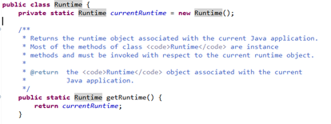
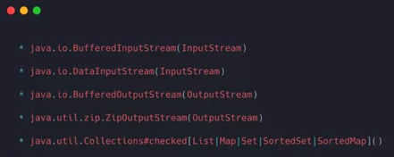

# 设计模式面试题

## 你了解的设计模式有哪些?

总的设计模式有23种,可以分为三大类。(建议在面试的时候说几个自己熟悉的,比如单例模式、工厂模式、模板模式等)

创建型模式(共五种):工厂方法模式、抽象工厂模式、单例模式、建造者模式、原型模式。

结构型模式(共七种):适配器模式、装饰器模式、代理模式、外观模式、桥接模式、组合模式、享元模式。

行为型模式(共十一种):策略模式、模板方法模式、观察者模式、迭代子模式、责任链模式、命令模式、备忘录模式、状态模式、访问者模式、中介者模式、解释器模式。

## 在Spring框架中都用到了哪些设计模式,并举例说明?

- 工厂设计模式 : Spring使用工厂模式通过 BeanFactory 、 ApplicationContext创建 bean 对象。
- 代理设计模式 : Spring AOP 功能的实现。
- 单例设计模式 : Spring 中的 Bean 默认都是单例的。
- 包装器设计模式 : 我们的项目需要连接多个数据库,而且不同的客户在每次访问中根据需要会去访问不同的数据库。这种模式让我们可以根据客户的需求能够动态切换不同的数据源。
- 观察者模式: Spring 事件驱动模型就是观察者模式很经典的一个应用。
- 适配器模式 :Spring AOP 的增强或通知(Advice)使用到了适配器模式、spring MVC 中也是用到了适配器模式适配 Controller 。

## 设计模式6大原则，以及哪些设计模式遵循了哪些原则

**（1）单一职责原则：**

一个类或者一个方法只负责一项职责，尽量做到类的只有一个行为原因引起变化；

**理解：** 不同的类具备不同的职责，各司其职。做系统设计是，如果发现有一个类拥有了两种职责，那么就要问一个问题：可以将这个类分成两个类吗？如果真的有必要，那就分开，千万不要让一个类干的事情太多。

**（2）开放封闭原则**

**理解：** 类、模块、函数，可以去扩展，但不要去修改。如果要修改代码，尽量用继承或组合的方式来扩展类的功能，而不是直接修改类的代码。当然，如果能保证对整个架构不会产生任何影响，那就没必要搞的那么复杂，直接改这个类吧。

**总结：** 对软件实体的改动，最好用扩展而非修改的方式。

**（3）里式替换原则**

**理解：** 父类可被子类替换，但反之不一定成立。也就是说，代码中可以将父类全部替换为子类，程序不会出现异常，但反过来就不一定了。

**总结：** 在继承类是，务必重写（override）父类中所有的方法，尤其需要注意父类的protected方法（它们往往是让你重写的），子类尽量不要暴露自己的public方法供外界调用。

**（4）迪米特法则（最少知识原则）**

**理解：** 尽量减少对象之间的交互，从而减小类之间的耦合。在做系统设计时，不要让一个类依赖于太多其他的类，需尽量减小依赖关系，否则死都不知道怎么死的。

**总结：** 一定要做到：低耦合、高内聚。

**（5）接口隔离原则**

**理解：** 不要对外暴露没有实际意义的接口。也就是说，尽量保证接口的实用性。当需要对外暴露接口时，需要再三斟酌，若没必要对外提供就删了吧，因为一旦提供了就意味着，将来要多做一件事情，何苦给自己找事做呢。

**总结：** 不要对外暴露没有实际意义的接口。

**（6）依赖倒置原则**

**理解：** 高层模块不应该依赖于底层模块，而应该依赖于抽象。抽象不应依赖于细节，细节应依赖于抽象。应该面向接口编程，不该面向实现类编程。面向实现类编程相当于就事论事，那是正向依赖；面向接口编程，相当于透过现象看本质，抓住事务的共性，那就是反向依赖，即依赖倒置。

**总结：** 面向接口编程，提取出事务的本质和共性。

## SOLID模式

1. 单一原则：对象单一功能。
2. 开闭原则：对拓展开放，对修改关闭。
3. 里氏替换：程序中的对象应该是可以在不改变程序正确性的前提下被它的子类所替换的。
4. 接口隔离：多个特定客户端接口要好于一个宽泛用途的接口。
5. 依赖倒转：代码应当取决于抽象概念，而不是具体实现。

**工厂模式**：主要功能是帮助我们把对象的实例化部分抽取出来，降低耦合度，增强拓展性。

**简单工厂模式**：实现对象的创建和对象使用分离，将对象的创建交给专门的工厂类负责，缺点在于工厂类不够灵活，增加新的具体产品需要修改工厂类的判断逻辑，多的时候就非常复杂。例如传进来一个字符串，case判断得到一个所需的指定对象。

**工厂方法模式**：通过定义一个抽象的核心工厂类，并定义创建产品对象的接口。创建具体产品实例工作延迟到其工厂子类去完成。增加一个产品的时候，只需要增加一个具体实现的工厂子类。简单来说，客户端需要什么样的产品可以调子类方法创建对应的产品。

**抽象工厂模式**：处理一个工厂产生不同的产品，定义一个抽象类包括不同产品的创建。

**spring中使用的设计模式：**

1. 单例模式：默认创建的bean就是单例的。
2. 工厂模式：BeanFactory和ApplicationContext创建工厂创建bean。
3. 代理模式：在Aop实现中用到了JDK的动态代理
4. 模版方法模式：JdbcTemplate、redisTemplate这些减少创建和销毁的重复步骤。
5. 策略模式：JDK动态代理和CGLIB代理按策略选择。
6. 观察者模式：事件监听。

工厂模式，单例模式、适配器模式、观察者模式、模板方法模式、代理模式、策略模式、外观模式、建造者模式、原型模式、修饰模式、状态模式、备忘录模式、职责链模式、迭代器模式、组合模式、桥接模式、命令模式、中介者模式、享元模式、解释器模式、访问者模式。

**单例模式**：懒汉式、饿汉式、枚举。懒汉和饿汉模式会被反射和序列化破坏唯一性，但枚举不会。

```java
public enum Test {
    INSTANCE;
}
```

## 什么是设计模式?你是否在你的代码里面使用过任何设计模式?

设计模式是世界上各种各样程序员用来解决特定设计问题的尝试和测试的方法。设计模式是代码可用性的延伸

## Java 中什么叫单例设计模式?请用 Java 写出线程安全的单例模式

单例模式重点在于在整个系统上共享一些创建时较耗资源的对象。整个应用中只维护一个特定类实例,它被所有组件共同使用。Java.lang.Runtime 是单例模式的经典例子。从 Java 5 开始你可以使用枚举(enum)来实现线程安全的单例。

## 在 Java 中,什么叫观察者设计模式(observer design pattern)?

观察者模式是基于对象的状态变化和观察者的通讯,以便他们作出相应的操作。简单的例子就是一个天气系统,当天气变化时必须在展示给公众的视图中进行反映。这个视图对象是一个主体,而不同的视图是观察者。

## 使用工厂模式最主要的好处是什么?在哪里使用?

工厂模式的最大好处是增加了创建对象时的封装层次。如果你使用工厂来创建对象,之后你可以使用更高级和更高性能的实现来替换原始的产品实现或类,这不需要在调用层做任何修改。

## 举一个用 Java 实现的装饰模式(decorator design pattern)?它是作用于对象层次还是类层次?

装饰模式增加强了单个对象的能力。Java IO到处都使用了装饰模式,典型例子就是Buffered 系列类如 BufferedReader 和 BufferedWriter,它们增强了 Reader 和 Writer 对象,以实现提升性能的 Buffer 层次的读取和写入。

## 在 Java 中,为什么不允许从静态方法中访问非静态变量?

Java 中不能从静态上下文访问非静态数据只是因为非静态变量是跟具体的对象实例关联的,而静态的却没有和任何实例关联。

## 设计一个 ATM 机,请说出你的设计思路?

比如设计金融系统来说,必须知道它们应该在任何情况下都能够正常工作。不管是断电还是其他情况,ATM应该保持正确的状态(事务) , 想想 加锁(locking) 、事务
(transaction) 、错误条件(error condition)、边界条件(boundary condition) 等等。尽管你不能想到具体的设计,但如果你可以指出非功能性需求,提出一些问题,想到关于边界条件,这些都会是很好的。

## 在 Java 中,什么时候用重载,什么时候用重写?

如果你看到一个类的不同实现有着不同的方式来做同一件事,那么就应该用重写(overriding),而重载(overloading)是用不同的输入做同一件事。在 Java 中,重载的方
法签名不同,而重写并不是。

## 举例说明什么情况下会更倾向于使用抽象类而不是接口?

接口和抽象类都遵循”面向接口而不是实现编码”设计原则,它可以增加代码的灵活性,可以适应不断变化的需求。下面有几个点可以帮助你回答这个问题:

在 Java 中,你只能继承一个类,但可以实现多个接口。所以一旦你继承了一个类,你就失去了继承其他类的机会了。

接口通常被用来表示附属描述或行为如:Runnable、Clonable、Serializable 等等,因此当你使用抽象类来表示行为时,你的类就不能同时是 Runnable 和 Clonable(注:这里的意思是指如果把 Runnable 等实现为抽象类的情况),因为在 Java 中你不能继承两个类,但当你使用接口时,你的类就可以同时拥有多个不同的行为。

在一些对时间要求比较高的应用中,倾向于使用抽象类,它会比接口稍快一点。如果希望把一系列行为都规范在类继承层次内,并且可以更好地在同一个地方进行编码,
那么抽象类是一个更好的选择。有时,接口和抽象类可以一起使用,接口中定义函数,而在抽象类中定义默认的实现。

## jdk源码中用到了哪些设计模式？

（1）单例模式

单例模式用于Runtime,Calendar和其他的一些类中。“饿汉式”是在不管你用的用不上，一开始就建立这个单例对象



（2）工厂模式

被用于各种不可变的类如Boolean，像Boolean.valueOf方法。

（3）装饰模式

装饰器模式被用于多个javaIO类



（4）代理模式

Jdk动态代理。

（5）迭代器模式

Java集合中的迭代器。

（6）策略模式

Arrays.sort()

（7）享元模式

Integer.valueof()

（8）模板方法模式

loadClass()双亲委派模型

（9）适配器模式

new Thread(new Furturetask(new Callable()))   创建线程的第三种方式 使用furturetask来适配callable接口

## 工厂模式和简单工厂模式的区别

1、简单工厂模式中包含判断什么对象的逻辑，而工厂方法模式则需要调用者判断要实例化什么具体类型的工厂进而创建出想要的对象。

2、当增加新类时，简单工厂模式需要修改工厂类，而工厂方法模式不需要，因此工厂方法模式遵守了开闭原则，而简单工厂模式没遵守。

3、简单工厂模式因为采用了静态方法，所以不利于继承，而工厂方法模式恰恰相反，需要利用到继承来从抽象工厂中派生出各种各样的具体工厂。

## 静态代理模式和动态代理模式的区别

**静态：** 由程序员创建代理类。在程序运行前要代理的对象就已经指定了。

**动态：** 在程序运行时运用反射机制动态创建而成。(InvocationHandler的应用)

## 单例设计模式

**懒汉式单例 线程不安全**

当被问到要实现一个单例模式时，很多人的第一反应是写出如下的代码，包括教科书上也是这样教我们的。

```java
public class Singleton {
    private static Singleton uniqueInstance;
    private Singleton (){}

    public static Singleton getInstance() {
     if (uniqueInstance == null) {
         uniqueInstance = new Singleton();
     }
     return uniqueInstance;
    }
}
```

这段代码简单明了，而且使用了懒加载模式，但是却存在致命的问题。当有多个线程并行调用 getInstance() 的时候，就会创建多个实例。也就是说在多线程下不能正常工作。

**懒汉式单例 线程安全**

为了解决线程安全的问题，最简单的方法是将整个 getInstance() 方法设为同步（synchronized）。

```java
public class Singleton {
    private static Singleton uniqueInstance;
    private Singleton (){}
    
    public static synchronized Singleton getInstance() {
        if (uniqueInstance == null) {
            uniqueInstance = new Singleton();
        }
        return uniqueInstance;
    }
}
```

虽然做到了线程安全，并且解决了多实例的问题，但是它并不高效。因为在任何时候只能有一个线程调用 getInstance() 方法。但是同步操作只需要在第一次调用时才被需要，即第一次创建单例实例对象时。这就引出了双重检验锁。

**饿汉式单例+ 静态final变量 线程安全**

这种方法非常简单，因为单例的实例被声明成 static 和 final 变量了，在第一次加载类到内存中时就会初始化，所以创建实例本身是线程安全的。

```java
public class Singleton{
    //类加载时就初始化
    private static final Singleton uniqueInstance = new Singleton();
    
    private Singleton(){}

    public static Singleton getInstance(){
        return uniqueInstance;
    }
}
```

这种写法如果完美的话，就没必要在啰嗦那么多双检锁的问题了。缺点是它不是一种懒加载模式（lazy initialization），单例会在加载类后一开始就被初始化，即使客户端没有调用 getInstance()方法。饿汉式的创建方式在一些场景中将无法使用：譬如 Singleton 实例的创建是依赖参数或者配置文件的，在 getInstance() 之前必须调用某个方法设置参数给它，那样这种单例写法就无法使用了。

**双重检查加锁单例 线程安全**

双重检验加锁模式（double checked locking pattern），是一种使用同步块加锁的方法。程序员称其为双重检查锁，因为会有两次检查 uniqueInstance == null，一次是在同步块外，一次是在同步块内。为什么在同步块内还要再检验一次？因为可能会有多个线程一起进入同步块外的 if，如果在同步块内不进行二次检验的话就会生成多个实例了。

```java
public class Singleton {
    private static Singleton uniqueInstance;
    private Singleton (){}
    
    public static Singleton getSingleton() {
        if (uniqueInstance == null) {                         //Single Checked
            synchronized (Singleton.class) {
                if (uniqueInstance == null) {                 //Double Checked
                    uniqueInstance = new Singleton();
                }
            }
        }
        return uniqueInstance;
    }
}
```

这段代码看起来很完美，很可惜，它是有问题。主要在于uniqueInstance = new Singleton()这句，这并非是一个原子操作，事实上在 JVM 中这句话大概做了下面 3 件事情。

- 给 uniqueInstance 分配内存

- 调用 Singleton 的构造函数来初始化成员变量

- 将uniqueInstance对象指向分配的内存空间（执行完这步 uniqueInstance 就为非 null 了）
  但是在 JVM 的即时编译器中存在指令重排序的优化。也就是说上面的第二步和第三步的顺序是不能保证的，最终的执行顺序可能是 1-2-3 也可能是 1-3-2。如果是后者，则在 3 执行完毕、2 未执行之前，被线程二抢占了，这时uniqueInstance已经是非 null 了（但却没有初始化），所以线程二会直接返回 uniqueInstance，然后使用，然后顺理成章地报错。

我们只需要将 uniqueInstance 变量声明成 volatile 就可以了。

```java
public class Singleton {
    private volatile static Singleton uniqueInstance; //声明成 volatile
    private Singleton (){}

    public static Singleton getSingleton() {
        if (uniqueInstance == null) {                         
            synchronized (Singleton.class) {
                if (uniqueInstance == null) {       
                    uniqueInstance = new Singleton();
                }
            }
        }
        return uniqueInstance;
    }
}
```

有些人认为使用 volatile 的原因是可见性，也就是可以保证线程在本地不会存有 uniqueInstance 的副本，每次都是去主内存中读取。但其实是不对的。使用 volatile 的主要原因是其另一个特性：禁止指令重排序优化。也就是说，在 volatile 变量的赋值操作后面会有一个内存屏障（生成的汇编代码上），读操作不会被重排序到内存屏障之前。比如上面的例子，取操作必须在执行完 1-2-3 之后或者 1-3-2 之后，不存在执行到 1-3 然后取到值的情况。从「先行发生原则」的角度理解的话，就是对于一个 volatile 变量的写操作都先行发生于后面对这个变量的读操作（这里的“后面”是时间上的先后顺序）。

但是特别注意在 Java 5 以前的版本使用了 volatile 的双检锁还是有问题的。其原因是 Java 5 以前的 JMM （Java 内存模型）是存在缺陷的，即使将变量声明成 volatile 也不能完全避免重排序，主要是 volatile 变量前后的代码仍然存在重排序问题。这个 volatile 屏蔽重排序的问题在 Java 5 中才得以修复，所以在这之后才可以放心使用 volatile。

相信你不会喜欢这种复杂又隐含问题的方式，当然我们有更好的实现线程安全的单例模式的办法。

**静态内部类单例  线程安全**

这种方法是《Effective Java》上所推荐的。

```java
public class Singleton {  
    private static class SingletonHolder {  
        private static final Singleton uniqueInstance = new Singleton();  
    }  
    private Singleton (){}  
    public static final Singleton getInstance() {  
        return SingletonHolder.uniqueInstance; 
    }  
}
```

这种写法仍然使用JVM本身机制保证了线程安全问题；由于 SingletonHolder 是私有的，除了 getInstance() 之外没有办法访问它，因此它是懒加载的；同时读取实例的时候不会进行同步，没有性能缺陷；也不依赖 JDK 版本。

**枚举单例 线程安全**

用枚举写单例实在太简单了！这也是它最大的优点。下面这段代码就是声明枚举实例的通常做法。

```java
public enum EasySingleton{
    INSTANCE;
}
```

我们可以通过EasySingleton.INSTANCE来访问实例，这比调用getInstance()方法简单多了。创建枚举默认就是线程安全的，所以不需要担心double checked locking，而且还能防止反序列化导致重新创建新的对象。但是还是很少看到有人这样写，可能是因为不太熟悉吧。

## Spring单例和Java单例（设计模式）有什么区别？

Java单例由Java类加载器确定范围，Spring单例由容器上下文确定范围。

从根本上讲，这意味着在Java中，可以确保单例仅在加载它的类加载器的上下文中才是真正的单例。尽管您在代码中尽力防止它发生，但其他类加载器也应该能够创建它的另一个实例（前提是这些类加载器不在同一类加载器层次结构中）。

在Spring中，如果您可以在两个不同的上下文中加载单例类，然后再次打破单例概念。

因此，总而言之，如果Java无法在给定的类加载器中创建该类的多个实例，则Java将其视为一个单例，而如果Java无法在给定的容器/中创建一个类的多个实例，则Spring将其视为一个单例。上下文。